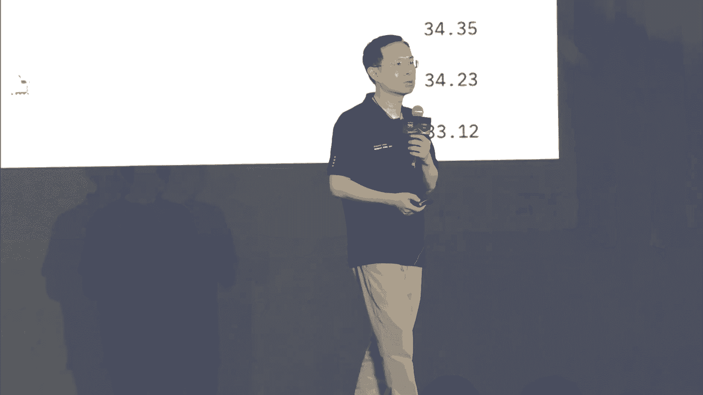

# P27：20240705-模型即服务（MaaS）加速大模型应用落地 - WarrenHua - BV1iT421k7Bv

尊敬的各位来宾，阿里云mars加速大模型应用落地主题论坛，活动将于5分钟后正式开始，为了确保活动的顺利进行和良好的现场体验，请您尽快入座，并将手机调为振动或静音模式，感谢您的配合，你听完我的发言。

尊敬的各位来宾，本次会议即将开始，请您尽快就座，并将手机等通讯设备关闭或置于静音状态，谢谢您的合作，Ladies and gentlemen，The event will begin shortly。

Can we please ask for you to kindly take your seats，We would like to remind you again。

To switch off all mobile phones and put electronic devices to silent mode。

Thank you for your corporation，尊敬的各位来宾，女士们，先生们，大家上午好，阿里云mars，加速大模型应用落地主题论坛的现场，我是本次大会的主持人朱荣，现。

如今人工智能一直是社会各界关注的焦点话题，越来越多的人们开始谈论AI，谈论大模型以及AIGC所带来的变革，随着科技和产业革命的不断推进，AI大模型的应用越来越广泛，不仅推动了企业效率的显著提升。

还催生了很多新的商业模式和创新业务，AI正成为引领时代发展的重要引擎，推动着社会向更加智能化，数字化的方向迈进，今天我们很荣幸地邀请到了产学研各界嘉宾，共聚一堂，一起深度探讨大模型的前沿技术开发经验。

以及最新的应用落地，让我们带着这些期待，共同开启今天的AI大模型之旅，首先让我们掌声，有请，上海市经济和信息化委员会副主任汤文侃先生，为本次论坛作开场致辞，有请，尊敬的各位来宾，女士们，先生们。

大家上午好，非常高兴能与大家相聚在此，共同参加由阿里云主办的，mars加速大模型用落地的主题论坛，首先呢我谨代表上海经信委对各位嘉宾的到来，以及我们线上云参与的各位朋友，表示诚挚的欢迎，也向长期以来。

支持和关心上海人工智能产业发展的，社会各界同仁表示衷心的感谢，当今的大模型技术创新体系的在加速演进，正进入行业全面的应用，商业路径逐步形成的新阶段，国际竞争日益激烈，基础模型参数与性能及季度屡屡创新。

垂直模型在新兴领域的应用遍地开花，诸多现象级应用脱颖而出，甚至部分场景呢已经能够细致的模拟，现实世界的微妙，这也预示着，通用人工智能的黄金时代已近在咫尺，面对大模型时代的挑战。

上海在抢抓新一代人工智能的发展机遇，以人工智能驱动形成心智生产力，加快打造世界级的产业集群，我们突出的表现在三个方面，首先是大模型的龙头企业不断的集聚，目前上海全市已经有34款。

34款大模型已通过了备案，产生了制造业，金融等垂类领域的应用，全国首个大模型创新生态社区，魔术空间，也吸引了将近80多家的企业在这里集聚，已经形成了算力调度，开放数据评测服务，金融服务。

综合服务等全方位的创新创业的保障体系，第二个是在自主可控的计算生态不断升级，我们着力突破卡脖子的环节，已经有数十款多技术路线的智能芯片，已经流片量产，上海人工智能实验室也建立了deep link。

软硬件的适配方案，尤其欣喜的是，上海已建成了规模化的资产中心，为大模型的训练提供强有力的支撑，第三呢是要素资源能不断的提升，我们大模型语料数据联盟，持续为模型训练提供了生产资料。

上海已经开源了420000000000token的语料数据，以市场化机制为大模型企业提供专业的服务，面向未来，上海将进一步的系统推进人工智能，赋能经济发展，我们要着力做好三项工作。

首先呢是要夯实产业的基础底座，要推进基于国产计算芯片的公关，促进大模型训练框架和国产芯片的适配，我们要推动基础大模型训练迭代，探索AI计算题的新产品新模式，我们要组织医疗公司，要打造专业的运营平台。

抓紧形成市场化的医疗产品，其次呢要加速人工智能的落地和应用，要持续的做大做强魔术空间，要推动上海大模型企业，要打造制造金融和政务等领域里的示范应用，要加快技术规模化的落点，最后呢要培育开源的活跃生态。

要鼓励各类开源的社会组织，优秀人才创新项目要入驻上海，进一步初始开源技术产业化，要营造活跃的产业生态，各位来宾，今天的论坛，搭建了人工智能大模型领域里的交流对话平台，我们来自于头部企业，科研机构。

垂类应用场景的用户，各个领域里的专家大家齐聚一堂，我们非常期待各位能够激荡创新智慧，砥砺科研思维，发表生动的深刻的洞见，畅谈创新观点，我们也非常的希望我们，阿里能够发挥大模型的创新优势。

与上海丰富的应用场景，能够深度融合，加强合作，加快形成产业化的成果，共创人工智能的美好未来，最后也希望这次的论坛取得成功，谢谢大家，感谢汤主任的精彩致辞，接下来将进入今天的演讲环节。

首先有请我们的首位演讲嘉宾，阿里云首席技术官周静仁先生，周敬仁先生作为阿里云的技术领军人物，长期致力于推动AI技术的前沿发展和应用创新，也是国内最早提出mars模型及服务，概念的谦虚者，在今天的演讲中。

他将围绕通义大模型能力，阿里云百炼等，深入探讨，阿里云在mars体系内的最新进展与思考，让我们欢迎周敬仁先生带来阿里云，让AI创新触手可及的主题演讲，掌声有请，嗯大家早上好啊。

非常高兴又再次跟大家见面啊，能够去呃，跟大家同步一下我们阿里云在max服务啊，包括今天AI模型应用各方面的一个进展，那今天呢在我们AI引领的这次技术变革中间，我们可以看到所有的技术的发展。

是在突飞猛进的速度啊，创新日新可以说是日新月异啊，随着今天我们大模型的广泛的一个，研发的一个突破，那今天我们也看到产业界的这个应用呢，也在快速的迭代起来，那今天基于大模型能够延展到各行各业。

应用在各行各业的例子，也今天可以说是日新月异越来越多，但在这个时代里面呢，那我们认为的这个模型及服务，这个概念就更加的重要，就真正我们要做到以模型为中心去延展，今天我们所有的技术体系也业务的推进。

那我们在两年前呢，首次提出了model as a service这样一个概念啊，那我们也非常欣喜地看到，在短短的过去的一段时间，那整个这个概念呢得到全行业的一个认可。

那今天model as a service已经成为了今天我们云上服务，包括AI领域发展的一个重要的一个呃，技术的方面，那谈到model service，其实这中间涉及到了很多层次的概念。

包括底层的云计算的一系列的这个支持，对AI的支持，也涉及到今天我们模型本身生态模型的发展，模型的方方面面，以及今天在整个生态开发者的这个环境里面的，一个一个眼镜，那最终的模型还涉及到。

如何去应用在各自的业务场景里面，那今天如何能够把模型，更好地适配在业务场景里面，也是成为了今天model service的一个重要的环节，那今天呢我们就围绕着modest service跟大家同步。

我们阿里云在这方面的一系列的进展，那首先呢我们会谈到模型这一层啊，那大家可以看到在过去一年里面，那我们整个大模型的领域，应该说是发展的非常的迅猛啊，包括我们整个阿里云推出的这个，通义千问的这个系列。

包括通信模型的其他的方方面面，都在有快速的一个发展，那我们可以从去年我们正式呃，呃4月份开这个这个提出呃，通义千问啊，发发表同意千问，到后来我们的万象，到后来我们听过所有的这些模型的发布呢。

我们整个阿里云在模型的呃创新这方面，在持续的发力啊，大家也可以看到整个模型的能力呢也越来越强，那也非非常感谢大家这个特别我们的开发，特别的企业对我们的支持，那今天呢我们都有这个上亿的这个。

每次的调用量啊，也包括了今天在特别是模型的这个，开源模型方面，我们既有已经有2000多万的这个模型的下载量，那除了今天我们在做模型的研发啊，去提升模型的方方面面的能力之外呢，很重要的一个环节。

就今天我们会坚持这个开源的策略啊，真正我们希望能够把模型的能力，能够带给我们的开发者，带给我们的企业，能够降低今天模型使用的门槛，那只有这样呢，我们才能我们认为我们才能真正的进去呃。

去促进今天AI整个产业的一个发展，整个行业的一个变革，能够真正的让我们的AI的开发的门槛，进一步的降低，能够带动整个产业界的这个发展，那过去呢，呃，阿里云一直是坚持在通开源的这条战略上面啊。

那我们也是呃全球几乎说是唯一一家啊，既做模型的研发，也同时开源我们的所有的系列的模型啊，那今天借助我们云的相关面的这个技术的支持，但结合我们开源模型的矩阵，我们真正的把AI的能力呢赋能给我们的开发者。

赋能给我们的企业，那在过去的一年里面呢，我们整个呃通义的开源模型家族，已经形成了一个矩阵，那涉及到今天的各种的尺寸啊，也涉及到了各种的模态，而且我们在开源领域里，还是在呃不断的去呃突破，不断的去发展。

尤其是我们在几周之前啊发布的queen to，就是我们新一代的这样一个开源的模型啊，那整个的模型的发布在短短的几周里面呢，也得到了业界啊非常好的一个反馈啊，包括在这个海外的这个HAGFISH啊。

那今天已经把这个queen to。

认为是我们全球全球范围里面，最强的开源模型啊，也在很多的海外的榜单呢，你在基于这个榜首，那同时呢在中文的领域呢，我们也有很多的这个评测，像compass arena，也是把这个呃这个通义千问的这样开源。

一个模型也是排在了第一位，那整体我们这一代的这个开源模型的，不单单是在很多的评测指标上面，还有大幅度的提升，很超过了很多B元的这个模型，那而且是在全球是属于这个非常领先的地位。

那同时呢我们也在这个代码在今天推理呀，在今天逻辑思考这方面，有大幅度一个能力的提升，呃整个这个模型嗯嗯一一从发布到现在呃，受到了我们的开发者，受到我们的企业的广泛的关注啊。

这也是呃也是非常希望能够跟大家继续去推进，今天模型在各个方面的一系列的应用，那除了今天我们基础的这样一个，通1000万的模型的发布呢，那我们还积极的去推动今天啊这个通义灵马啊。

通信领码是基于我们通义千问模型之上的啊，面向于编程的这样一个助手啊，那在昨天晚上呢，那通意呃，这个林马呢，也获得了本次大会的镇店之宝的奖啊，也是对我们这个项目呢有一个重大的一个肯定。

那今天呢我们会结合今天基础语言模型的能力，针对代码的这个股权，针对代码的理解，代码的问答啊，在我们在开发流程中的换，每一个环节能够帮助到我们的开发者啊，那同时呢，我们整个通信领码呢。

也集成到了各种各样的开发的这个呃框架里面，包括各种的IDE，能够让我们的这个这个呃呃，开发者呢能够快速的使用，那我们也非常欣喜地看到了，在过去这个通一零马类有快速的发展，今天，已经成为了国内啊。

用户规模最全面的这样一个产品啊，我们在过去的一段时间，已经有超过350万的这样一个下载量，而且每天的这个推荐都是在几千万次的，这样一个量级啊，我们也得到了很多开发者积极的一个反馈，那除了今天面向开发者。

我们也更多的把通信领码呢推给了我们的企业，也就是说今天在企业的这个环境里面，往往有自己的一系列的代码，有自己的一系列的这个数据安全的考虑，那这个时候呢，我们一方面能够在绝对的安全的情况下。

去帮助企业去梳理自身的代码，那同时呢也可以把通信领码这个智能化的能力，跟本地的代码库结合在一起，让我们的模型更加懂得本地的这个，这个包括开发的逻辑，包括编程的习惯，能够更加精准的去推送。

更针对企业特殊场景的呃，这样一个代码助手的功能，那呃整个通信领码的企业版从推出到现在呢，也受到了很多企业的这个关注啊，啊包括我们的这个一汽啊，哈喽啊，还有中华财险等等啊，都在积极地使用我们啊。

这样一款企业的这个这个产品服务，那另外呢我们在同一的APP里面呢，也是在不断的迭代，不断的发展，那今天同意APP呢，已经成为了一个全能的AI助手啊，不管是今天嗯在我们的手机上啊。

去做任何的这个知识的问答，或者说今天一些常规的这个搜索啊，包括今天文件的处理，还是在我们的PC端啊，能够去做详细的一些呃工作学习的规划等等，那他也集成了今天像我们听悟啊。

像我们今天万象的各方面的一个能力，那真正意义上成为了今天我们日常工作，学习生活的全能的AI助手啊，也希望大家有呃呃这个有时间的话，线下可以去下载通用的APP，去体验今天中通一模型的方方面面。

那刚才我们讲到了整个通用模型的这个，持续的开源，那另外一个方面呢，我们也是积极的在云做这个AI的社区啊，那这里也跟大家汇报一下，摩大社区呢也是感谢大家的关爱啊，也是在快速的一直从呃快速的茁壮的在发展啊。

那到了今天呢我们的整个的数据啊，各个方面又有大幅度的提升，那今天我们已经设计了500，全国560万的这样一个开发者啊，我也承载了今天我们整个中国境内甚至海外啊，重要的一系列的模型，那值得一提的是。

这个摩达呢这个项目呢也是受到了呃，这个大家开发者的积极的一些呃共同的开发，那这次呢也是非常有幸的获得了，今天我们shell之星的这样一个奖啊，那讲讲完了这样一个模型，才能当我们模型真正要应用到各行各业。

还需要今天对行业进行一个特殊的一个视频啊，那在这个环节里面，如何能够把模型的能力释放出来，同时又去理解各行各业的这个需求，这是今天我们要解决的一个，重要的一个技术方面。

那我们过去呢这个推出了阿里云的百炼产品，那百炼这个名字呢就取自于今天千锤百炼，那我们希望能借助今天我们云的能力，介于说明模型的能力，能够再结合今天我们企业的专属的这个信息，能够更好的去适配呃。

呃相关的这个模型应用，那百炼呢首先我们集成的呃，所有的这样一个模型的生态啊，那不光是中间有我们刚才讲到的，通信本身的模型家族，也包括了今天开源的所有的模型，还有呢这个其他的模型公司呢，也积极参与在里面。

那我们希望能给我们的开发者，给我们的企业提供全方位的这个选择，他们可以根据自己的需求去选择适合于自己，适合于这个自己，包括这个适合于自己的模型的呃类型，以及模型的尺寸，能够更好的去权衡今天业务效果。

以及这个这个推理成本，各个方面的一个综合的考虑，那另外呢我们在过去也是不断的就能够降本啊，能够让我们的这个大模型，使用的成本的进一步的降低，那过去呢我们一直在呃不断的去提升。

整个呃云的这样一个推理的这样一个架构，那一方面呢可以提升我们整个的极致的弹性，能够有更好的各种的算力能够汇聚在一起啊，能够提高更极致的一个性能，那我们在过去的几个月里，我们整个推理的这个整个的价格呢。

也在大幅度的去下下降，那我们最终的这个初衷呢，是希望今天让我们大模型的那每一位开发者，每位企业都能够使用，而且都能一个高性价比的方式去使用，那我们也非常欣喜地看到，在过去一段时间，短短的一个月左右。

我们整个呃整个这个模型使用的这个体量，应该说是一个成倍的在增加啊，那我们也非常欢喜，看到今天各行各业都来尝试，今天把人工智能的能力，融合在自己的业务体系里面来，当然呃我们有了这个模型的呃。

所有的这个这个一个呃一个丰富的这个提供啊，有了今天这个非常强有力的推理的架构，那还需要今天有基于模型为中心的这样一个，开发的环境，那中间一方面带领的是今天我们模型的调用，能够让大家非常简单的方式。

以API的方式去试试用模型，那更重要的是，我们也需要有一个流程，能够帮助今天我们的企呃企业，我们的开发者进行模型的定制，那在过去呢，我们百炼就是在去解决这样一个业务的，一个需求。

那今天呢我也是非常高兴的跟大家啊同步，我们的进展百炼到正式的发布，到现在也就短短的几个月的这个时间，那我们今天服务的客户呢也这在大幅度的增加，现在已经超过了20万，那具体到今天。

为了帮助我们的业务场景去呃去做业务的适配，需要做哪些环节呢，那首先呢使用模型的时候，就我们第一步会提到的是prompt的一个engineering，也就是说怎么去做prompt的一些定制和优化。

那一方面呢，我们会根据各行各业的场景，去提供一个prompt的模板，也就是说真正能够让我们的企业，能够快速的进行选择相关的模板，能够去选择它适合于自己业务的这样一个场景，能够很快速的去上手。

那同时我们也理解今天真正的prompt engineering，这事也是一个非常繁琐的事情，那我们希望呢，今天通过我们通用模型的，方方面面的这个能力呢。

能够帮助大家去简化prompt engineering，也就是说今天真正用meta prompting的这种方式，能够今天让企业呢能够描述自己的需求，能够让模型自动的去帮助啊。

做prompt engineering，prompt的优化，能够提升今天业务的效果，那另外呢我们还涉及到今天如何把企业的知识，企业的信息跟模型融合在一起，那这首先就需要解决一个数据安全的问题。

那同时也要去解决，今天能够如何让模型去有一些增强的知识的，学习的方方面面，那这是我们百炼的一个重要的一个发展的一个，技术的方向，那首先呢我们会支持各种各样的一个，rap的框架啊。

特别是今天我们呃非常这个这个流行的，这个在这个各种的开源的框架，能够让我们的快速的这个开发者快速的上手啊，能够今天呃有一个安全的数据域，能够让我们的企业，能够把自己的数据进行一个分享啊。

能够同时呢能够让模型去学习，但同时呢这部分的数据呢并没有出，我们呃客户的这样一个专属的运啊，也能保证这个极致的数据的安全，那与此同时呢我们简化了各种的流程，今天不管是用任何的一个框架啊。

包括今天各种rap的体系，简简单单的几行，就能够快速的把本身企业的知识，或者说专属的一些信息跟模型的能力，融合在一起，那与此同时呢，我们也提供一个高效的这个呃低延迟，高并发的这样一个特殊的这个rap啊。

一方面能够呃在呃整个数据处理方面，能够进一步的降低大家开发的这样一个复杂度，那同时呢在效果的这个方面啊，在算法的优化方面能够更加自动的去调优，那这些都是为今天我们企业能够真正的把自，己的行业的知识融合。

大模型提供了一个坚实的基础，那所有的这些方方面面的，不管是从prompting还是说今天做使用各种插件，还是说今天我们越来越多的增加了一些功能，像memory等等，其实都是相对来说比较繁琐啊。

当然今天虽然我们有工具在进一步的简化啊，各种环节之间的呃呃呃整个的呃啊，开发的这个复杂度，但我们希望能够有a system a API的方式，能够把相关的这个编排，把这个插件的工具的管理等等的。

能够整合在一起，那通过这个assistant API呢，我们一方面可以使用各种各样的一个插件，那同时呢也可以，今天嗯把我们前面讲的prompt engineering的工作。

把我们的memory的管理也能够有效地编排在一起，能极度的去简化今天各种应用的一系列的，这个开发，能够把这个流程呢更加的提供一个，一站式的一个体验，那最后呢我们也认识，就今天啊除了今天模型的这个。

包括刚才讲到的rap，或者说这个prompt engineering，那有一些特殊的场景呢，还需要进行模型，还要进行再训练，还要进行一些微调，那这个时候呢，我们会提供完整的这样一套工具啊。

不光从这个数据的这个提供啊，从今天整个模型呃微调架构的支持，以及到今天评审这个各种评测的工具，能够帮助我们的开发者能够有效地去评价，今天开发出来的这个模型，微调后的模型在各个维度之间的这个表现。

那这些呢都能够快速的帮助我们的开发者呃，去更好的去基于我们的这个百炼的模型的底座，能够在上面进行二次的开发，能够去在上面进行更有效的一个评价，这对我们今天业务的落地，起到了一个极大的推动的作用。

那上面讲到的这些方方面面的，是我们百炼的这个很多个技术环节，中间的一环啊，那我们也是希望大家有兴趣的话，能够在会后啊，能够在呃到阿里云的官网上面去体验啊，去使用，去真正的去利用百炼去做各种模型的定制。

那我们呃最近呢我们也看到很多的这个企业呢，这个也是在海外进行这个业务的拓展，那这里呢我们也很高兴的跟大家同步，我们百炼这个产品呢，也会今天部署在我们的海外，为我们的企业来提供啊全方位的支持。

那在在海外呢，我们这个模型这个产品叫model studio，那今天也会呃，在这个国际性的这样一个全球化的，在我们阿里云的基础设施的这个布局上面，为大家提供全面的这样一个，模型的支持和模型的服务。

让大家真正在出海的过程中间啊，能够高枕无忧，那上面呢我是通过呃，这次呃短短的这个这个20分钟啊，能够跟大家汇报了，今天我们阿里云在今天在max方面呃，各个方面的一个进展，从今天开源模型的这个快速的发展。

和开源模型的这个最新版本的推出，到今天我们的摩搭啊，到我们今天整个百炼产品啊，能够帮助今天进行产业界的落地，那我们认为呢今天在这个时代里面，我们只有真正的做到今天，AI和云的一个高度的协同。

能够今天一方面支持好模型的发展，模型的这个研发，那更重要的是，今天基于模型能够帮助我们各行各业，去更以低门槛的方式去使用啊，去结合自己的场景的知识，去解决真实的业务的场景，那只有这样的。

我们才能推动整个AI产业的这个发展，那我们也是非常期待跟我们的企业，跟我们的开发者一同去加速，而大模型应用的产业落地，谢谢大家，再次感谢周杰伦先生的精彩演讲，也期待百炼和摩达社区。

为大模型生态贡献更多的力量，那么在芯片的发展过程中呢，有一个著名的法则叫做摩尔定律，摩尔定律指出，每隔大约18~24个月，单位面积上的晶体管数量将翻一倍，使得芯片的性能大幅提升，成本则相对降低。

这一规律在过去的几十年间，深刻影响了半导体行业，也驱动了计算机技术的快速迭代和性能飞跃，和摩尔定律类似，大模型也遵循着类似规律，接下来有请清华大学计算机系长聘副教授。

面壁智能首席科学家刘志远先生带来演讲，大模型时代的摩尔定律，迈入更高效的大模型时代，掌声欢迎，大家上午好，非常荣幸有这样的一个机会，然后来在这个场合跟大家分享，我们在大模型这个领域。

然后所进行的探索思考，已经对于未来的研判，那么我们是希望能够啊跟大家分享啊，我们所认为的啊，大模型未来发展的这么一个规律，那么嗯应该说啊面壁智能啊，可能是大家还不是特别的熟悉。

但是相信呢我们在过去的一年，我们努力啊发布的一系列的端侧的这些大模型，可能大家已经耳熟能详，包括mini c p m的基座模型，包括mini c p m杠V的啊，这个多模态的啊这个模型。

那么这些模型的一个最大的特点就是，他们能够在我们的观测，我们的计算机，然后我们的手机等等的这么一些端侧的设备上，然后来能够运行，那么我们为什么会在过去的一年的时间里面啊，然后会去选择啊。

去卷这个端侧大模型，那么今天我们就想跟大家分享，我们的这么一个相关的思考，那我们会认为啊，所有的这些观测模型，它的背后啊，其实是有一个更加挑战的这么一个问题，也就是说如何在一个端侧更加有限的算力，内存。

还有能耗的这么一个情况下，我们要极致的把这个知识，能够浓缩到一个更小的参数规模里面，那么整个的这个过程呢，其实是需要我们来对大模型它的这个建设，然后进行一个更加科学化的道路，的这么一个探索。

那么在这个方面我们的一个努力啊，就是构造了一个模型的沙盒，那也就是说我真正的去训练一个模型之前，我会在这个沙盒里面去做成千上百次的演练，我会在很多的小模型上，然后高效的去寻找最优的数据。

最优的超参的配置，并且能够让它成功的外推到大模型上，真正的寻找到这个大模型上的这么一个，最优的配置，那么这个其实相当于寻找到了这个大模型的，一个啊成长的规律，那么通过这一点。

我们可以去找到一个更高的知识密度，从而带来一个更加高效的模型，所以看到右图可以看，我们在2024年2月份发布的，mini c p m的第一个版本，2。4B的模型，24亿参数。

实际上是在当时已经能够超过像mixture7b la，23B啊，等几倍于这个参数规模的一些模型的能力，那么这个的话呢就是体现了我们大模型啊，科学化的啊这么一个非常重要的这么一个价值，所以我们会认为呢。

在这样的一个科学化的历程里面啊，正如刚才的主持人所提到的，我们会看到过去的这80多年的时间，我们见证了在芯片的这个领域，那么由于芯片制成的这么一个不断的增强，带来了终端算力的这么一个持续的增提升。

我们会看到了这么一个算力的小型化，我们在我们的手机上，然后就可以拥有几十年前呃，用几间屋子才能装得下的，这么一个机器所具备的算力，那么同时我们其实也会看到，大模型的科学化历程。

将会不断地提升我们模型的制程，而模型的制程将会带来模型，知识密度的持续的增强，而这两者的交汇，将会揭示端侧智能的一个非常巨大的潜力，所以可以看到右图，我们的这个红色的这么一个虚线。

代表的是过去的这半年多的时间里面，一个多模态模型，从GP4V的一个数百亿参数的规模，到我们今年的5月份发布的mini cp m杠V2。5，这么一个模型，只用8B左右的参数，然后就可以完成相关的能力。

也是体现了多模态领域的这么一个知识，持续增强的这么一个过程，那么同时的话呢，我们会看到从下方的这么一个，蓝色的这么一个虚线，那么它体现的是在端侧的算力的持续增强下，我们可以在端侧上可以放得下一个更大的。

更强的这么一个大模型，那么这两个曲线的这么一个交汇啊，我们会看到面向未来，我们有可能在半年到一年内，我们可以把GP3。5水平的模型能力，放到端侧上去运行，而在未来的两年内。

我们可以把GPT4O的相关的能力，放到端侧上去运行，而这一点的话呢具有非常重要的这么一个价值，所以从这点上来讲的话呢，我们会认为大模型时代，将会拥有它自己的一个摩尔定律。

这个摩尔定律其实就是知识密度的持续增强，我们去回顾摩尔定律，它在1965年提出的时候，他所提出的思路就是芯片上的电路密度，每20就是每两年，后来是修正成了十八十八个月能够提升一倍，那我们可以想象。

对于大模型来讲，open i其实已经验证的是规模法则啊，也就是在过去的5年，我们会看到大模型规模越大，那它的能力越强，但是我们难道是要持续的无限制的，把这个模型越陷越大吗，在我们来看。

大模型的大不是这个本质大模型它的知识密度，它的制程才是这个大模型的更加本质的东西，所以呢我们在过去的这5年里面，其实是见证了一个在2020年6月份，open i发布的gt3的水平的能力。

我们现在在202424年的2月份，我们的mini cpm2。4B，它就能够达到相同的水平，所以呢模型的知识密度大致呈现，每八个月提升一倍的这么一个规律，那我们未来一个非常重要的使命。

就是能够让这个规律持续下去，那么这件事情本身是需要我们能够在数据，在模型的架构，然后在相关的成长的算法这个方面，不断的去探索它的这种科学化的这么一个道路，那么从而极致的去提升我们的这个模型的制程。

所以呢我们会认为，未来高效大模型的第一性原理，它的关键词应该是知识密度，那什么是知识密度呢，我们会认为大致应该是对应第一就是他的能力，而这个能力所依探所依托的这个参数的规模。

他的每一次的这个计算所需要参与的这个参数，也就是对应的他的能力的消耗，那么从这一点上来讲，一个知识密度越强的模型，就意味着它的能力越强，它的每一次计算所需要的参数规模越小。

那么对应的其实就是这两个要素所组成的，这么一个知识密度的概念，而我们会看到大模型，它的这种计数据驱动的技术方向大致已经确定，但是呢模型的架构，算法，数据这些相关的技术方案仍然在高速的迭代。

所以我们接下来非常重要的使命，就是要持续的改进模型的制程，持续的去高速的迭代这些相关的这种技术方案，然后来去极致的提升这个模型的知识密度，这个应该会成为我们接下来各大模型团队，然后努力的方向。

那么从这个方面，那么今天我们说，我们既然的努力的方向是知识密度，那我们今天就要给大家带来，我们最新的一个进展啊，当然这个进展一如既往，我们不去卷云测的这个大模型，我们想给大家带来的是一个更加极致的提升。

这个模型知识密度的这么一个努力，那么今天就要给大家带来的是一个叫mini c p，M杠S，那么这么一个版本，那么这个版本呢，我们现在推出的是一个1。2B的模型，那么它是一个新一代的高效的大模型的架构。

那么目前的话呢他的论文，它的相关的这个模型的参数，然后都已经公开，可以访问，包括刚才呃惊人总，然后提到的摩大社区我们也都已经公开，那么这个架构它体现在哪几个方面呢，首先它是一个高效的稀疏的这么一个架构。

那么从而能够带来在端侧的一个更低的能耗，那么它能够达到88%左右的这么，一个稀疏度，从而能够让我们的这个全连接层，然后它的这个能耗啊要降低八十八十四%，那么同时它就会带来一个更加极致的。

一个快速的一个推理的能力，能够比相对应的这个稠密的模型，它的推理速度能够提高提高接近三倍，那么同时它是一个没有损，没有没有性能损失的这么一个模型，然后它能够在啊我们的这个性能不变的情况下。

能让它变得悉数化，那么从而对应让它的这个知识密度，能够持续的可以增强下去，那么实际上这个就是我们现在所看到的，一个稀疏的模型，和一个稠密的模型在相同的水平下，然后它能够达到的一个更快的这么一个。

推理的速度，而这一点的话呢，呃也非常感谢上海交大团队所推出的，power info的这么一个推理的框架，那么同时啊这么一个模型的架构，其实是体现了我们在啊刚才所提到的三大要素，也就是架构。

算法和数据三个方面里面的某一个方面，就是架构这个方面的这么一个提升，那么实际上我们会看到它其实是向人脑学习，我们人脑是一个非常典型的功能分区的稀疏，激活的这么一个，这么一个大脑的这个这么一个结构。

那么它从而能够带来单次的推理，能耗和反应速度都能够非常非常的强，那么对应的我们的mini c p m杠S，它的这个架构，实际上就是极致的吸取了这么一个，稀疏的这么一个一个思想。

那么首先它回归到了瑞路这样的一个激活函数，从能让这个模型呢，能够自发地涌现出一个更强的系数，激活的这么一个机制，那么从而带来一个渐进式的稀疏，感知的这么一个训练的能力，也就是总在整个的这个训练过程中。

这个模型会自发的变得越来越稀疏，那么从而在这个吸收的过程中，我们还有能力去保证它的这个训练的效果，不会受到损失，那么正是在这样的一个架构的情况下，那么我们会看到mini c p m杠S。

它将会对我们大模型的知识密度的这个，持续增强，其实是带来一个强心剂，那么这个强心剂其实可以看到，它会在过去的这么一个曲线之上，然后有一个更陡峭的这么一个发展，那我们就可以设想在类似的这个架构下。

都可以达到一个更强的啊，这么一个知这么一个模型的能力，那么这个其实是我们啊想要跟大家分享，所以呢我们会说mini c p m杠S，它其实是一个高效的模型的架构，它能够带来一个更低的能耗。

它能够带来一个更快的这么一个推理的速度，那么同时我们也是能够希望跟大家分享，我们所见证的面向未来一个非常重要的趋势，就是要揭开端侧智能的一个非常重要的，这么一个发展的这么一个态势，那么在这个方面呢。

我们也是希望能够通过我们开源的力量，然后来去啊推进啊这个这个进程，然后能够加速我们的端侧，智能的这么一个推背感，那我们在接下来的话呢也会给大家推出，我们马上要发布的一个叫mobile cp m的啊。

这么一个啊这么一个套件，那么这个套件呢能够帮助我们每个人，一键的去开发大模型，在端侧的app能够成为我们在端侧上就能够拥有，我们自己的大模型的应用，那么它本身会包括相应的基础的SDK的套件。

然后会包括我们所带有的一些通用的，端侧的模型，此外的话呢还包含预装了非常多intent的啊，这么一些提示的这么一些呃，一些相关的一些啊平台，那么通过这种方式呢，我们可以让所有的开发者能够。

非常低门槛的速成啊，在端侧上的这么一个大模型，应用的这种开发的这种工作，那么本身呢它整个的这个架构呢，其实就是要有这个SDK，然后同时呢可以去接入非常非常多的，端侧的这种通用的模型。

然后我们可以提供非常多的相关的插件的平台，让我们的这些模型呢具备相应的人设，相关的功能，然后来去支持我们的各种各样的这种观测的，这种应用，那么这样的话呢，实际上我们就会想想跟大家总结。

我们今天呃其实想给大家啊，去带来的一个是mini c p m，杠S，这么一个知识密度持续拉满的这么一个模型，那么同时的话呢我们也会带来某BIUCPM，然后能够帮助大家一键的去集成，端侧的这个模型。

来去开发相应的这种观测大模型的啊，这种小这个应用，那么这个的话呢是我们的一个呃相关的一个demo，首先我们可以把这个手机变成飞行模式，在飞行模式下，我们的端侧模型可以只利用端侧的算力。

然后去完成以下的这种功能，那我们会看到相关的这种情感陪伴，相关的一些基本的文本的这么一些模一，一些应用，那么即可基本上都可以在端侧上，然后非常快速顺滑，然后去进行运行。

那么这个的话呢将会极大地去揭开我们在端侧，应用上的大模型的这么一个威力，所以呢我们会说嗯这个未来的大模型啊，它是一个云端协同的这么一个模式，我们既要有云上的一个极强的system to。

a system to的这么一个大模型，那我们也会需要充分的去利用端侧的算力，然后来去形成端侧上的system one的这么一个，端侧的大模型，那么我们在端侧上，然后我们可以有非常快的啊。

毫秒级的这么一个响应，我们每秒可以有40个token的这么一个，生成的能力，那么我们也可以在飞行模式下，就只利用端侧的这么一个算力，就可以完成相关的计算，也能够充分的去注重我们用户的这个隐私。

相关的隐私数据不上网，就可以在端侧完成相关的计算，那么所有的这些呢，都需要依赖观测模型的这么一个知识，而本身mobile cp m呢已经预装了啊数十种，然后相关的这种intent。

可以帮助我们一键的去完成相应的这些，包括机器翻译，人设等等的这么一些啊，这种大模型的这么一些预设的这种能力，那我们会认为呢通过我们大家一起，然后来去开展这种观测模型的研发，我们端侧推理的这么一个加速。

那么我们形成这种观测的这么一个生态，那么将会揭发揭开啊，端侧AI的生态的这么一个序幕，我们会看到端侧既有像智能手机穿戴设备，具身智能智能家居，汽车，PC等等非常非常多样的这么一些场景。

而这些场景的端侧的算力，其实是远远没有被挖掘的，而我们会认为我们需要利用端侧的模型来，充分的去挖掘在端侧上的这么一个应用，我们的使命就是要把模型，装到距离用户最近的地方去。

那么我们刚才所推出的mobile cpm也即将会在最近，然后就能够在GITHUB上开源，并且开启公测，那么大家最近非常关注的WWDC，2024年啊。

这个apple intelligence啊提出了这么一个概念，那么本身里面就是包含了端侧和云测的，这么一个端云协同的方案，但是这个方案呢需要到明年，然后才能够与大家见面，而我们希望呢。

我们通过mobile cp m和mini c p m，杠S的相关的这种努力呢，让大家能够更快的去见证啊，在这个端侧上的这个大模型的这么一个应用，所以呢今天总结一下。

我们就是希望能够建设啊最强的这个端侧模型，来去推动这个大模型，知识密度这样的一个定律的，持续的这么一个推进，能够以更快更简单更低的成本，然后我们一起来迈向更加高效的大模型时代，那以上是我的分享。

谢谢大家，感谢刘志远教授对摩尔定律的全新解读，也让我们对大模型的观测模型有了更多期待，其实除了摩尔定律以外，大模型模型参数量的多与少，也直接影响着模型推理的算力和效率，人工智能和个人计算机的完美结合。

正在迅速迈入个人PC的消费市场，所谓业内的知名品牌，联想，始终致力于探索和开发AIPC的前沿创新，并取得多项突破性进展，在AIPC领域，联想究竟做了哪些令人瞩目的创新。

又是如何结合大模型技术来优化用户体验呢，接下来让我们以热烈掌声，欢迎联想集团研发总监杜扬州先生上台，带来主题演讲，联想AIPC创新实践，掌心掌声有请，嗯大家好，我是杜扬州。

来自于联想集团联想医院的人工智能实验室，跟大家分享呃，我们在AIPC方面的创新实践呃，我的演讲分三部分内容，分别是框架技术和产品，框架部分的话，首先我会跟大家回顾一下大模型时代，两个技术发展趋势。

那么我们根据这两个技术发展趋势，制定了联想自己的AI发展框架，在技术部分，我主要讲我们如何在端侧设备EIPC为代表，那么如何让它流畅的运行个人大运行，并以此来构建智能体应用，那有了这个技术之后的话。

我们来真正的推出了业界首款，真正意义上的AIPC，并且我给大家介绍一下，我们最近发布的一体多端战略，也就是一个智能体游走于多个终端之间，好我们先看框架部分，第一个趋势呃，第一个趋势是混合式人工智能。

它的意思是说云测智能，端测智能跟鞭策智能相结合，其实刚才清华大学的刘志远老师，已经给大家讲了这个呃，端侧智能的这个可能性跟做的优秀的工作，那么其实大部分人，我相信大部分人接触大模型。

都是从ChatGPT开始，ChatGPT属于云测智能，因为它的服务是在云测提供，但是呢它跟云计算一样，有云计算优势和缺陷，比如说受如果是交互式应用和对事事要求，实时性要求高的这种应用的情况下。

网络不稳定性和延迟都对用户体验有所影响，那第二个是说，如果是对焦点事件或者高峰时段，多用户高并发的情况下，也产生资源竞争的问题，还有一个用户可能会很关心他的隐私问题，因为如果要处理个人数据。

那你的个人文档，私人信息要上载的公有云被AI去分析，去理解这么强大的AI，去理解你的私人的东西，恐怕用户也不是很放心，再有一个呢就是能耗问题，能耗的话，其实随着数据中心对于AI系统的，这个广泛的应用。

那已经对电力系统造成了不可忽视的冲击，这也是对绿色环保产生的一个重大问题，那既然云测AI有这些问题的话，其实鞭策AI跟端侧AI也正在发展，那编程AI代表的话是企业大模型。

意思是说用企业的知识跟企业的私有数据，来训练或者微调一个模型，它能够连接企业的业务系统，调用企业的这个软件模块API，然后完成企业内部的问答跟企业的一些事务，同时呢它也部署在私有云上面，就是这样的话。

不会有企业商业机密被泄露的风险，所有这些都是公有云，公有商云商的这个公有大模型做不到的，那么相应如果是模型运行在个人设备上，比如说我们的手机，PC甚至pad，还有一些物联网设备的话。

那就构成了个人大模型，也就是刚才刘老师讲到的，那可以预见未来的话，AI应该是三者的融合，与云边端智能的三者的融合，其实很多企业跟我们的这个学界，也在践行这样的，包括我们的联想的AIPC。

包括呃微软的cobalt加PC，还有呃像这个呃呃苹果也一样啊，然后包括现在的芯片企业，包括高通和英特尔，也在做一些端测芯片的这个支持呃，第二个趋势，大模型的下一步发展趋势是智能体。

因为就是相信大家都能够意识到，大模型其实有不少的局限性，chat gp d刚温室的时候，我们被他的能力震惊了，以为只要把模型做大，就无所不能，AGI指日可待，其实后来学界的。

还有呃一些行业的专家来分析这件事情，发现没有这么简单，不是说把大网络大算力，大网大呃，就是这个大宋的大大网络大算力，还有大数据堆叠起来，就能够解决所有的问题，它有很多局限性啊，就像左上角。

这是一些文章来深入的分析跟实验，那结论是什么呢，就是他没有真正的推理能力，没有真正的理解能力，不能建立真正的因果关系，不能建立真正的世界模型，那所有这些东西是，就是我们可以认为对于一个黑盒系统。

既然我们不知道它内部的工作的机制的话，那可以用测试用例来探究它，那如果说正真需要无穷多正立政委，只需要一个法律就够了，那真理大模型的这些曲线我们怎么做呢，那业界其实已经提出了不同的解决方案。

比如说对于他不能使用工具的问题，那去年早些时候，meta公司提出了呃to former，后来OpenAI的也提出了这个，也就是推出了这个function calling，其实都使得它能够使用工具。

使用这个呃API模块这些功能扩展级的能力，像知识库的这个问题，那大家熟知的这个rag也就是检索增强，增强增值增额检索生成增强这个这个事情的话，能够避免一定程度上避免他的这个呃幻觉问题。

就所有这些东西不太详述了，那我们综合业界的这些进展，画了这张图是代表了一个智能体的技术架构，我们联想来做这个智能体，也就是按照这个思路来做，呃那刚才讲了两个趋势，根据这两个趋势呢。

我们制定了联想自己的AI的框架，这张图竖着看是刚才讲的第一个趋势，混合式人工智能，也就是结合云测的公有大模型，和本地的私有大模型，横着看是第二个趋势，构建以大模型为基础的智能体。

那么它能够对于个人智能来讲，它的产品形态就是我们说的AIPC，对于企业智能来讲，那对于企业来讲是降本增效，其实他俩很多有他们有这个，这对于无论对个人还是对企业，这个智能的构建方式有很多的相似之处。

技术也是相通的，大家注意这里我用了这个双胞胎这个词，其实这张图是去年10月，联想创新科技大会对外就公布了这张图，那么只不过当时的时候，智能体的概念还没有那么流行，我们用的词是双胞胎。

它跟智能体系是一个意思，好讲完了框架，我们看技术，那首先呢呃感谢我们的合作伙伴呃，阿里为我们提供了同一线外模型，我们在此基础上做了一些创新，那使得它能够流畅地运行在端侧设备上面。

然后这些创新呢包括端侧优化，然后更多人知识库的构建，还有智能体的一些能力的增强，所以呢我来给大家解析这些能力，首先遇到的一个问题是说，在端侧设备上面运行大模型的，最先遇到的问题是什么，是内存不够用。

比如说我们以常用的7B为例子，一个权重占两个字节，如果不是FP16的话，那这样的话7B它占14G的空间对吗，但这是静态，如果运行时和库呢，由于transformer里边的这个kv cash的。

也就是键值缓存的问题，其实好的工作内存，要比它的静态的内存要大几倍，因为它要以空间换时间来避免重复计算，那这样的话对主流的笔记本，主流的PC其实内存是不够用的，那怎么办呢，我们分静态优化跟动态优化两种。

左边静态优化也是压缩分三步呃，第一个是说这个结构化的减脂，所以结构化就是节点跟边构成一个子结构，那首先把神经元神经网络拆成这样的子结构，判断每一个子结构的重要性，来看这个子结构是不是可以把它删掉。

对整体的结构，对整体的性能还不是很有很明显的影响，那什么样东西的能力是我们关心的呢，比如说我们说大部分任务级跟知识级，这两级是吧，任务像摘要总结啊，还需调用，然后和这个关键信息提取。

这些能力是不能被砍掉的，那能砍掉什么呢，比如说长尾的知识，因为大家可以想见，像175BGGBD3这样的话，其实它绝大多数的权重用于存储，海量的这个百科全书的东西，但对于对个人用户并不是那么有用。

如果用的话，可以走云色的模型好，做完减脂之后的话，量化量化我们不仅要看压缩比的问题，还得要看硬件对数据类型的支持，跟反量化的时候的额外开销，那有了减脂跟量化之后，模型多少会有一些性能损失。

我们可以做一些后处理，做一个翻跳，把性能再提升一些，这是静态部分，那动态部分怎么做呢，呃其实就是构建一个推理引擎，推理情这件事，刚才呃AVIDIA的同事也分享了，其实也有很多挑战。

我们要解决它有总共做了三三件事情，第一件事情对于异构异构计算这件事情，因为AIPC里面除了CPUGPU，还有NPO，那每一个算力单元它们的特征不一样，适用性不一样，我们需要把大模型相关的呃。

计算任务拆解成一些子任务，然后看它的并行度，看它的依赖关系，重排流水分配到不同的计算单元上面，使得计算单元的总体利用率最大，并且单任务的执行时间最短，这是第一个工作呃。

推理引擎的第一个工作就是这个异构计算，第二件事情刚才讲到了，就是KV开始坚持缓存，那么在储存跟显存之间，我们要考虑这个cash的问题，哪些键值需要保留，更有价值，是让它保留在开始里面。

然后哪些可以把它剔除，使得工作内存尽量的少的情况下，性能还不是下降很多，第三件事就是兼容，因为我们要做产品，那么我们要兼容向英特尔平台和AAMD平台兼容，独立显卡，集成显卡。

那其实我们是跟呃这些合作伙伴的驻场工程师，一起做深度的算子的底层的元宇宙的优化，最终呢使得大模型能够流畅地运行在，主流的这个PC的平台上面，好第二个关键技术是说个人知识库，大家知道就是大模型。

为什么要在端侧设备上运行，其中很大的一个原因是说，需要掌握你的个人知识，能够对你产生一个就像一个灵魂伴侣一样的，一个知识问答，那这件事就需要大模型来存取你的一些文档，那有两个办法了。

一个是说做fighting是吧，那fighting这件事其实是不太可行的，为什么呢，因为一旦泛滥用的话，它可能会影响破坏原来的知识结构，那呃并且还会产生一些幻觉问题，时效性问题这些问题。

所以我们采用的方案是RAG，也是呃这个检索增强生成，那其实原始的rag的话，它还是不能够满足用户的需求，具体来讲我们把RG拆开，把每一个环节做了深入细致的分析和优化，那就像我们右图红色这个部分。

比如说其实rag是一个里面，借鉴了很多搜索引擎的技术，rag做好了，不亚于是一个搜索引擎，那像这个对于查询的一些处理，我们呢借鉴搜索引擎行星的技术，像根据一些上下文的信息，比如说时间地点。

设备用户的那个user profile的信息做一些呃，Correwrite，就是这个查询重写和这个骁骑，那对于文档处理的话，大家看到这里有三种index是吧，就是像关键字索引啊，语义索引的层次索引。

那其实我们是发了MULTIPASS，这个本搜索引擎的思路也是比较类似，然后做MULTIPASS之后的话，做fusion，其实这里的话我们有一个特色的技术，这个特色技术呢是说呃。

检索器和生成器这两者的协同优化，什么意思呢，大模型在这里扮演了一个检索器，大大模型在这里扮演一个生成器的角色，那当大模型固定的时候，其实我们可以优化检索器，让它生成对于检索器更友好的结果。

那具体来讲检索器可以优化它的embedding，优化它到底反正会top几的结果给达模型，那对于每一条结果到底是扩展还是压缩一些，那如果当检索器的结果固定的时候，大模型也可以优化去微调大模型。

然后来使得它生成的结果对用户来讲更加友好，或者更接近ground truth，所以我们管这件事情叫做，检索器跟生成器的二者协同优化，二者相向而行，呃这里还有一个特色。

就是我们做的其实是跨设备的个人知识的问答，然后呢，因为现在个人的知识可以散落在不同的设备上，比如说每个人都有好多个人设备，像你工作电脑，家里有电脑，然后有手机，有平板，你的数据其实是产生跟分布于不同的。

个人设备上面，这样的话其实呢非常有必要，就建立一个分布式索引，使得你散落在不同设备上的数据互联互通，能够生成一个整体，这样的话才形成一个完整的这个智能，问答系统呃，第三个技术就是智能体。

里边其实有两件事情很关键啊，一个是说意图理解，一个是说任务规划和执行，那大家知道大模型其实是个端到端的系统，那现在我把它拆开了，变成一个模块化的设计，那大家说了是不是没有必要呢，直接上大模型。

我告诉他什么他就做什么，没有必要把它拆成模块，但是大家都有经验，其实大模型有的时候会把复杂的问题做对，让我们很惊讶，然后呢这么复杂的事情他都能做对，但是他有的时候经常犯一些愚蠢的错误，简单事情他会搞错。

所以我呢我如果对这种时灵时不灵的这个产品，用户是没有办法接受的，那具体来讲我们怎么做呢，走的是结合的路线，就是大模型加小模型的结合，甚至与规则的结合，比如说左图意图理解第一列。

我们把用户的常用意图归纳出来成一个列表，然后呢用小模型做一个分类器，能够保证它的分类准确性非常高，然后对于一些复杂意图走大模型，比如说左图的第二列，那什么叫做复杂意图，像一句话，用户说得很冗长。

包含了多个意图，或者包括多跳，就是multi hop的问题，或者这里需要一个对话管理，我们看这个例子啊，用户说我要玩游戏了，那我们首先构造一个problem的模板，然后把这个用户的这个原始输入。

模板化给大模型，让它产生一个参数化格式化的一个输出，那其中明确的意图是要打开杜比的这个全景声，这种模式来支持这个游戏模式，那这是明确的意图，不明确的意图呢，他要继续构成一个dialog flow。

问用户你想要玩什么样的游戏，好把它启动起来，那即使大模型和小模型的这个无论是并联串联，还有跟规则的这个混合利用呢，在一般来讲，在成熟的产品里面，大家都是这么做的，基本不可能说一个模型一统天下呃。

包括我们就是可以回顾了搜索引擎里边，比如说white list，然后一些这个最后一步我们要规则来来，最后来卡一下它的这个安全性，都走的这种混合的道路，其实我们也是这样做的，任务规划也是一样的。

就是说就是什么叫做任务规划呢，用户的意图跟我们的可执行的这个API模块，它经常不是一一对应关系，经常是用户说了一件事，需要把它拆解成几个原子级的这个子任务，然后呢看一下他们的依赖关系限制条件。

再看对于每一个子任务能够有哪些模块可用，然后来完成这个最终目标，那这件事儿我们叫做一个全盘规划，那大模型本身它毕竟是一个下一个词预测，在做这么一件本质的事情，它只能做直觉，适合于做直接类的事情。

不太适合于做全局规划的这种事情，那我们就要做一些外挂的一种机制，那最右边大家可以看到，我这里有一个蒙特卡罗树搜索是吧，这里是阿尔法go的算法，其实下棋典型的它是一个典型的规划问题。

我们不是看眼前能吃几个子儿，而是要看终局的胜利，那如果说大家可以想象一下这件事，如果我不用这么复杂的机制，不用摩托卡罗那个搜索树，不摩托罗搜索树，那现在把它拍张照片。

发给GBD4O或者其他方式把棋局发给GP4O，问我下一步应该走什么走，当然了，我没有试过，那我相信他可能是不行，所以这个意思是什么呢，对于很多经典的规划问题，对于一些典型的规划问题，我们是有经典解法的。

不能说因为有了大模型，就把那些经典的东西扔掉了，应该是采取一个结合道路道路，比如说像现在的这个巨神智能的前沿，其实也是走走的这个传统的强化学习，和大漠形象结合的这个路子，所以右图的最左边这一列列的。

这个马尔可夫决策过程啊，这些呃其实是强化学习的一些经典解法，那意思是说我们对于不同的任务需要kiss by kiss，用一种结合的方案来做，这就是这都是构建智能体技术的关键，好有了这些技术的话。

其实我们就可以打造出一个，真正意义上的AIPC，那么呢它有五大特征啊，第一个我们刚才讲过了，它本身是以大模型为基础构建的个人智能体，然后呢本身呢这个智能体是运行在本地，但是可以云端的大模型相辅助。

第二件事刚才也提到过了，是混合算力，CPUGPUNPO的这个异构计算混合调度，第三件事呢是他既然成为你的知，你懂你帮你的一个灵魂伴侣或者助手，然后呢，所以说他必须要掌握你的知识库，并且还是跨设备的。

第四件事，刚才没有提到过，它是我们是构建了一个开放的生态，也就是说，智能体有能力发现新的可用的AI的应用，把它也一样调度起来，成为一个工具，完成更复杂的任务，同时这个平台开放给开发者。

你可以开发更强大的新的智能体应用，第三件事，第四最后一件事是个安全的问题，刚才也提到过本地模型本身处理的话，它也保证了安全，并且我们还有芯片级的这个方案可以做，如果真的要传输的话。

可以做芯片级的这种安全的这个加密跟托米好，那么呃其实还有一个事情啊，就是在上海有一句俗话叫做呃罗什科里做道场，那我们其实真的实现了这一点，罗什科里做道场的意思是说在空间狭小。

条件简陋的情况下做精妙的事情，那其实PC呢本身计算能力有限，资源有限，我们真的把它这个端子模型流畅的运行起来了，要做了智能体的应用，真的实现了这一点，那呃我们在4月18号。

也是在上海创新科技大会上发布了，AIPC产品，在5月20号已经开售AIPC，所以大家在市场上能买得到的，这是真正意义上的落地的产品，而不是停留在口罩上面宣传，那其实从工作到生活。

覆盖了不同的智能体应用呃，产品上面的话其实分三个系列呃，像左下角商用的就是高端路线，然后呢，中间呢这是走的这个就是高性价比的路线啊，最右侧的话是走的这个信创国产化的路线呃，在6月25号。

也就是大概十天前，我们又公布了这个一体多端的战略，所谓一体就是一个智能体啊，构成一个智能体系统，多端呢就是多个互联互通的个人的设备，那一个智能体可以游走在不同的终端之间。

给用户提供一个统一的一个完善的一个体验，那这样的话用户其实其实说整个来讲的话，就是这也是提供了一个更大的一个一个机会，那最后呢呃我想呃，首先是我们愿意跟合作伙伴阿里继续深入的合，作来发展以智能体呃。

以大模型为基础的智能体技术，与异界网，以伙伴广泛的合作来发展这个混合式的AI框架，那对于个人智能来讲，继续把AIPC做的更好用，对于企业智能来讲，做的真正的降本增效，谢谢大家，感谢杜扬州先生的精彩演讲。

期待有更多业界伙伴和联想一起，打造混合式AI技术，助力AIPC的不断发展，当然除了个人PC以外，AI智能助手在手机，汽车，机器人等多种物联网设备中也越来越普及，大模型技术的引入。

让终端智能助手不再局限于简单问答，而是能够在视觉识别，实时翻译，图片生成等多个领域，提供更为智能的帮助和服务，接下来让我们有请小爱团队，大模型产品负责人乔国辉先生带来主题演讲。

大模型时代小爱同学的实践历程，为大家进一步介绍，小爱同学如何通过软硬件的深度结合，带来全场景多模态的深度体验，让我们热烈欢迎乔国辉先生上台，对啊大家好啊，我是小米公司小爱同学的乔国辉，今天很荣幸啊。

作为一个大模型的应用者，然后在这里给大家分享一下，小爱同学在大模型的实践历程，那么先简单的介绍一下小爱同学，小爱同学呢是小米的人工智能助手，不知道大家就是知不知道，小爱同学的名字是怎么来的。

其实我们的名字呢就是小米AI的简写小AI啊，小爱同学，我们是在16年的时候开始去做AI相关的功能，经过8年的时间呢，我们现在基本上覆盖了小米的各个硬件设备，包括小米的汽车手机AIOT机器人。

还有可穿戴设备等等，这些上面都有小爱同学，那么小爱同学呢是一个软硬件深度结合的场景，就是我们想做好这个功能啊，非常的不容易，除了在AI的云端上，我们要更好地理解用户以外。

我们也需要跟硬件去做深度的结合啊，包括呢这个硬件的声学链路，硬件的前端与识别等等的，我们要针对这个硬件做很多，针对性的处理和优化，这样才能实现呃这种体验的效果，那么大家可能熟知的小爱同学啊。

主要是小爱的语音助手，但实际上我们也还有很多其他的系统服务啊，包括像小爱的主动建议，小爱建议场景，然后小爱视觉，小爱翻译小爱通话，然后未来呢，我们还会有更多的这种系统级的功能推出。

那么给大家简单的介绍一下，小爱同学的技术架构啊，在最上面呢是呃设备层呃，左边呢是内置小爱的设备，就用户可以通过这样的设备跟小爱进行交互，获得相应的内容和服务，呃右边呢是呃呃受控设备。

就是通过米家的接入这种IOT的设备，通过小爱同学呢，我们把主控设备和被控设备连接起来，中间的是呃能力层，用户的一个请求来了之后呢，我们通过小爱同学呃去理解用户的意图，去感知用户周边的环境，感知它的信息。

最后提供它相应的这个功能和服务，那么我们提供的服务呢，大概可能就是下面这些类型吧，就包括呃设备的控制，这个也是用户用的最多的一个场景，还有一些基础的工具，像闹钟啊，计算器这样的，还有信息的查询。

内容的服务，生活的服务，还有这种场景的互动对话等等，嗯那么截止到今天为止啊，小艾同学呃，我们目前搭载了54类的主控设备，我们的月活跃用户呢已经有1。3亿，我们每天的这个请求次数有两个亿呃。

我们是在22年的10月份，开始去做大模型相关的这种功能的落地，我们做了很多的打磨啊，我们在23年的8月，在手机和音箱上呃，首次进行了大模型功能的内测，一经推出之后呢，还是收获了非常多的用户的好评。

我们在今年的3月呢，我们在汽车上是正式的上线了，小爱的大模型功能，我们针对汽车也做了很多针对性的优化，那么可以看到啊，就是大模型这种体验的提升呢，给用户带来了非常大的一些变化啊。

我们过去呢很多做不了或者是做不好的功能，其实有了大模型之后啊，是有一个非常大幅的提升的，尤其是我们这种中长尾的请求，比如说像知识的问答，或者这种呃闲聊场景的对话，我们过去呢可能我们的满足度大概就只有。

30%，但是我们有了大模型之后，我们经过打磨，我们现在已经提升到了80%多，然后并且随着这个模型的能力提升，他还是在继续的优化的，另外啊就是这种大模型能力呢，也给这个我们的活跃用户的留存。

带来了一个非常明显的提升啊，我们大概提升了10%，做过互联网产品的同事们可能都了解啊，就是留存每提升5%，其实他体验都都是非常巨大的提升，那么在这里呢，就是大模型技术给小爱带来了哪些的这个。

跨越式升级呢，我们主要是分成了三个事情，一个就是通用的对话，通过大模型的这种通用的能力，去更好的呃回答用户的问题，第二个就是在一些垂直领域的场景，而我们也做了很多的功能，就是小爱。

其实我们背后的场景很丰富啊，我们有很多垂直领域的场景啊，譬如说这个小米的商品助手啊，就是用户可能会问一些小米相关的设备的参数，然后小米设备的这种使用指南，甚至是小米设备如果故障了该怎么办，过去呢。

我们想做好这样的场景其实很难啊，就我们要构建很多的呃这种人工训练的数据，这种QA段，然后去呃去满足用户，但实际上这个最终的效果上来说，做的也并不是很好，但有了大模型之后啊。

我们看到就是呃给这样的的垂直领域场景，带来了新的解决的范式，我们通过这种rag的技术，然后通过大模型的检索匹配，我们很好的就是在这样的场景下就满足了用户，那么第三类呢就是LP的任务呃。

因为小爱这样的场景啊，就是用户的一个请求来了之后，我们是需要去理解用户的意图的，那么用户的每一句话表达的到底是什么意思，它是其实有非常多的不同的任务的，那么我们过去想做好我们每个任务。

其实都要构建大量的这个训练数据，并且我们的产品经理啊，针对每个任务场景，都会去做相应的这种产品策略，嗯过去不是一句一句有句话吗，就是有多少人工就有多少智能，但是大模型来了之后呢，这些事情就变了哎。

大模型带来了这种通用的开发范式，我们利用大模型这种比较强的通用的呃知识，我们通过小量的数据结合大模型，然后在每一个任务场景做一些训练，我们就可以很好的解决这种场景了，对，那么呃总结来讲呢。

就是大明之后呢，小爱的这个技术架构可能大概就是这样的，我们的一个用户的请求来了之后呢，我们会先呃大模型来做一些简单的意图理解，我们把任务大概分成了四类，那么第一类呢相对比较简单。

就是一些工具或者是控制类的任务，我们在意图分发到这个任务场景之后呢，我们通过这样的LP小模型啊，就能去直接执行相应的操作了，第二类呢相对会复杂一些，是一些内容类的场景，就比如说我们的音乐或者视频呃。

做过音乐同事都知道啊，想做好音乐的话，我们需要大量的这个音乐数据呃，我们需要对数据去打标签，我们非常依赖这个搜索和推荐的能力，所以在这个场景呢，我们主要是用大模型来做好用户的意图理解。

我们还是要依赖传统的这个搜索和推荐，去满足用户，那么第三类场景呢就是生成类的场景，这个是我过去小爱其实做不好的，或者我们做不了的场景，这个其实在大模型之后，现在表现的非常的好。

那么第四类呢我们认为是最难的一类，也是现在用户需求，其实最大的一类就是知识类的场景呃，这些场景其实非常的困难啊，因为他如果想做好的话，呃，我们需要给用户准确的答案，因为它只有唯一的答案。

基本上大部分的情况它不像生成类，你可能写个作文或者写个诗呃，其实言之有理的话，用户都会觉得是OK的，但是在这样的场景下，我们必须要做对，这个时候其实就对大模型的通用能力，带来了非常大的挑战。

呃其实我们现在看到啊，就行业内现在最好的模型呃，其实在这一类的问题解决上，还是有非常多的问题的，就并不是说解决的已经很好了，但这时候其实我们也欣喜地去发现，就我们跟很多行业的大梦去做了交流呃。

大家都觉得就是随着这个大模型能力的提升，我们用更大的参数，然后通过呃更多的这种模型训练，是能够让这样的场景变得更好的，那么在小爱这边，我们是如何去选择大模型的呢，其实我们应该跟很多在座的大模型开发者。

是一样的，我们大概就是这样三步，我们第一步呢，会去建设满足业务需求的评测体系，会搭建业务适合的这个评测集，第二个我们在对应的这个业务场景下，去选择适合的模型啊，因为小爱呢背后有很多的场景。

我们每个场景的要求是不一样的，所以我们尽量的都把每个场景去选到，相对来说最适合的一个模型，那第三个呢就是我们随着做的越来越深入，我们发现一个场景通用的模型是不能呃，做到最好的。

我们一定有很多定制化的需求，这个时候其实就需要对模型做大量的工作啊，包括prom的优化，也包括模型的微调等等，那么在小爱这边呢，其实我们最关心的主要是两件事情啊，一个是效果的指标啊，一个是性能的指标。

在效果上呢我们搭建了九大类，40多个小项的这个评测体系，很多就是和小爱合作过的大名厂商啊，就是在我们在初期合作的时候，我们都会给他提供一份这样的评测结果，甚至是跟同行的这个对比。

然后另外一个指标呢我们也很关心性能，因为对于小爱这样的场景，用户一个请求发出之后，它是要求很快的就要得到结果的，所以这个时候，那个我们对模型的食盐的速度也是有要求的，因此我们搭建了这样一套那个。

基于小爱的知识啊，然后基于不同大模型这样的混合的体系，我们基本上便利了行业内所有的大模型，我们在每一个场景都找到了，相对比较适合的内容，呃，接下来呢给大家简单的便利一下，小爱最近在做的一些能力。

就随着大模型能力的越来越强啊，大明星开始在智能座舱，智能手机甚至是智能家居上有更多的功能落地，那小爱呢除了传统的这种语音交互以外，我们其实也做了很多其他的事情啊，包括在手机上。

我们做了很多多模态的应用场景啊，比如说图片问答，图片的一句话编辑，甚至文档摘要等等啊，我们在手机上做了很多这种垂直的agent的探索呃，小爱呢控制IOT，其实是我们非常常用的一个场景。

但这样的场景其实想做好是很困难的，因为我们需要理解用户的呃，家庭房间，你设备的这个信息，设备的名字，甚至等等这样的内容啊，我们现在在通过大模型，通过agent的技术啊，在更好的去探索。

怎么去能更好的控制用户智能家居的能力，那么第二个呢就是小米的商品助手，在前面也提过了，我们通过大模型这样的能力呢，通过这种大模型去理解复杂的知识注入，然后去更好的回答，用户的问题。

另外我们其实也结合呃小米的输入法，我们在AI输入的场景呃，给用户提供更多智能的回复帮助啊，比如说在微信的场景，我们帮助用户写一些更高情商的回复等等啊，那么在今年的汽车发布会上。

其实我们也发布了很多小米的大模型功能啊，包括像走哪问哪呃，比如说你到了一个城市对吧，你开车的时候可能问诶这里的河叫什么，旁边的建筑是什么，这种基于地理位置的问答。

我们也做了基于多模态的这种前面的车是什么，这样的问答，我们也做了汽车说明书相关的一些功能呃，在这里呢我给大家准备了一个一分钟的短视频，简单的再看一下，汽车上我们做的一些功能的应用。

现在来认识一个更懂你的小爱，你的这些细节只有他能懂，要是净往下10%，不管车力往左一点，座椅调到最后停下，停下了，甚至跨界的想法，她也能心领神会，我的手机掉哪了，打开家里的扫地机器人，打开家里的摄像头。

小爱同学，我在打开手机付款码，完成了搭载AI大模型的他，无所不知有没有离鬼街和望京都很近的川菜馆，为你找到了十家位置合适的川菜馆，介绍一下戚风分校是三坊七巷，学那个车是什么车，我来看看。

甚至它可以像人一样观察，是橄榄绿的小米苏七，满足你的所有好起床有多少年的事，前面的山是什么山，金庸小说里哪些重要，这就是全新的小爱，更懂车的事，更懂设备的事，更懂你，好奇的是。

全新小爱大模型智能语音已登录小米苏七，但刚刚大家看到的都是一些我们用大模型，或者结合大模型去做的一些功能啊，呃接下来呢想简单的再给大家分享一下，小爱同学的对于大模型未来的规划。

首先我们可以看到大模型的能力越来越强，大模型开始可以做更多更复杂的任务啊，他的这个准确率也很高哦，我们现在大家其实都知道啊，有一个非常热的概念叫做AI agent呃，就是通过大模型来去做这种复杂的任务。

然后更好的去满足用户啊，但是我们其实也知道啊，这样的场景其实落地是很困难的啊，我们我们都知道就一个任务，他如果最后的执行准确率，没有办法达到95%的话，其实这个对用户来说是不可用的。

但是像这种agent的场景，其实目前呃准确率上还是有非常大的挑战的，这个也是我们希望能够和大模型一起去做的，这种技术升级，在小爱的场景下，我通过agent来做更多更复杂的任务去满足用户。

那么第二个呢就是呃多模态的场景，小爱在手机和车载上，我们做了很多多模态的能力，用户其实呃表现的都非常的喜欢啊，我们接下来还会持续的在这个方向，推出更多的新功能，那么第三个呢是OS的深度整合。

随着这个模型能力的增强，我们希望能够跟系统去做更深度的耦合，我们会提供更多的底层的系统的控制，然后给用户提供更多的内容服务，我们相信啊在今年下半年，咱们大家去看行业内的手机的时候。

应该都会看到有很多AI的应用开始呃落地，我们可能未来可以就会叫AI的手机了，那么第四个呢就是呃端侧大模型，那么其实这个也是小爱非常呃，重点在投入的一个方向啊，因为我们觉得呃。

当用户的数据没有办法上传的时候，或者用户其实有很多的场景，其实对他的隐私非常的关注，这个时候云端的大模型是没有办法去满足的啊，譬如说我们在手机上，我们去对用户的信息的检索。

去对手机里面的一些内容的这种操作，或者问答啊，包括在车上，其实观测也是一个非常重要的场景啊，大家都知道，车是在很多地带是很容易出现，无网或者弱网的情况呢，这时候呢我们通过这种呃端测大模型。

就能更好地满足用户，来给用户提供更多的这个内容和服务，那最后呢呃想简单的总结一下，就是小爱这样的开发者哦，我们对大模型最关注的事情呢，其实主要是两个呃，一个是效果啊，一个是成本。

这个里面我们最关注的呢是效果，效果里面呢我们又分成了两个事情，一个事情是大模型的通用能力是不是足够的强，呃，能够更多的满足用户的基础的能力，第二个呢就是针对小爱这样的场景啊。

我们在过去一段时间探索发现呃，我们的很多场景就是要定制化的，所以我们也很关注，大模型是不是能针对业务去做定制化的诉求呃，在这里也非常感谢我们的阿里云同事，在我们小爱的很多场景里。

其实都做了很多针对性的优化，包括前面大家看到的多模态的场景，也包括刚刚像小米商品这样，复杂的知识注入的场景，那么在未来啊，非常期待说大模型的能力能够进一步的提升，然后这样的话能够帮助像我们这样。

小米的这样的开发者，能够更好的去调优我们的效果，来给用户更多的更丰富的内容，好以上就是我今天分享的内容，谢谢大家，感谢乔国辉先生的精彩演讲，结尾影片里的小爱同样让我们眼前一亮，相信在未来。

小爱同学一定会成为一个更懂你的小爱，其实阿里巴巴集团一直致力于用科技力量，提升我们的幸福生活，实现商业至上的价值，有这样一群特别的小朋友，被大家叫做星星的孩子，或者说叫新宝，他们就是孤独正谱系障碍儿童。

根据第五版中国孤独症教育，康复行业发展状况报告的估计，我国0~14岁孤独症儿童约有200万人，有那么一群志愿者，他们愿意为这群孩子，打造一方能够绘梦成真的小天地，他们历时近三个月，开发出了一套专门关照。

孤独症儿童的AI绘本工具，并免费为这些儿童家庭提供，定制化的AI绘本服务，仅需一句话的故事梗概，就可以直接生成符合新宝需求的有声故事，绘本一经上线，便获得了苹果应用市场精选栏目的推荐。

那么这个绘本工具是如何诞生的，让我们一起来看一看，我们是一群追星星的小伙伴，两个月前，这张志愿者招募令把我们汇聚在了一起，我是一名前端工程师，也是孩子的父亲，我是一名UI设计师。

想一起给小朋友们点亮星光，我是一名软件P，我是一名儿童家长，也是一名特教老师，我是一名儿童故事编剧，希望给这个群体带来更多的光和爱，这里是上海美术电影制片厂，这个活动我们可以一起参与，我们来自天南海北。

开始为孤独症儿童打造，专属他们的定制AI绘本工具，这次故事绘本主要是基于通讯大模型，结合了孤独转化成专家的一些指导意见，创造了一个专门为儿童打造的一个故事绘本，对于文生图大模型来说的话。

我们其实希望能给星宝提供一些更鲜明，更符合儿童的一些喜好，modescope agent在这里头做了一个底层的一个支持，我们把它的纹身图，还有本身的个性化，生成一些文本的能力调用起来。

能够为像孤独症儿童生成一些特，定的这种绘本故事，这项工作或许是会开源出来的，希望能够通过开源这种技术捐赠的方式，为孤独症儿童和家庭做更多的事情，你们愿意和我一起，为他们打造一个充满星光的世界吗。

相信在座的各位和我一样，都被这群追星星的志愿者们的善意和投入，所打动，正如影片中所说，是人有了温度，AI才会有温度，目前追星星的AI已经上线，通1APP公测，也受到了很多新宝家庭和关注者的好评。

今天我们特别邀请到了，一路见证和支持这个公益项目的机构代表，正式为我们开启这个友爱的项目，让我们掌声有请，上海美术电影制片厂有限公司，摩托社区负责人石红烛，阿里通义实验室产品负责人金路遥。

以及公益项目发起方代表，阿里巴巴集团公共关系部总监，好方法，有请各位嘉宾上台，请各位嘉宾把手放在对应的星星位置上，让我们共同开启这一段星光璀璨的旅程，54321关怀孤独症儿童公益AI绘本工具。

追星星的AI正式发布，那么请各位嘉宾上前一步，我们合影留念，该项目还得到了孤独症儿童干预的机构，恒星乐乐，海豚乐乐等的专业支持，以及浙江工业大学，王永固教授团队等专家顾问团队。

同语故事等不少爱心人士机构的合力支持，感谢大家，好的，请各位嘉宾入座，请彭总和路遥两位留步，绘本项目呢能够顺利发布，离不开阿里通义实验室和上海美术电影制片厂，的全程支持，通信实验室在这个项目背后。

提供了很多技术知识，有请路遥为我们分享其中的一些细节啊，这个是我们第一次参加这样的项目啊，但是也是一个让我们特别兴奋的项目，因为在这个过程里，我相信每一个参与者，包括我们的产品经理，我们的技术。

我们的算法都是充满了爱在对待这件事情，所以我相信今天通用大模型，他也会用爱来输出来普惠到我们每一个人，包括帮助到每一个人，嗯这也是我们一直以来想去做的一件事情，那谢谢好的，谢谢路遥。

那么除一除了通信提供的技术支持外，当然也离不开上海美术电影制片厂，众多优秀的绘画设计，那么就请彭总为我们本次活动做基于分享，好的谢谢谢大家，那个上海美术电影制片厂呢。

就是非常有幸能够参与到这个项目中间来，其实一开始我们也是被这个阿里的小伙伴，还有就是我们的广大的志愿者，他们的热心和爱所感动，所以我们上海美术电影制片厂，也愿意用我们的一己之力啊。

让我们的深具中国美学的一些动画的一些形象，来陪伴我们的新宝呃，随着那个活动，还有我们合作的深入呢，我们是觉得在这个AIGC大爆发的时代，就是我们这个啊传统的IP形象，与这个呃Z世代的人的呃生活方式。

它可能有一个更新的一个链接方式，所以我们呃我们上海美术电影制片厂也愿意说，跟大家一起来啊推动这样的事情，我们相信啊通过这样的活动，让这个公益啊变得更有更多的多元性和多样性。

那让我们这个是让我们所有通过公益的活动，能够让我们继续去热爱这个世界和他人，也也也让我们这个付出的点点滴滴，让这个世界变得更温暖好谢谢大家好的，谢谢彭总，感谢两位嘉宾，那么也希望呢追星星的AI项目。

能够点亮新宝的夜空，成为父母老师的好助手，小好工具，陪伴星宝们共同成长，那么接下来呢，让我们进入本场论坛的最后一个环节，圆桌讨论，随着大模型生态的不断完善，我们也看到。

越来越多的大模型走上了开源开放的道路，我们相信开源开放，互惠共享，将是今后大模型技术生态繁荣的必然选择，本次圆桌对话的主题就是开互惠共享，大模型技术生态的B选项，让我们有请圆桌主持人，以及各位嘉宾上台。

他们是阿里云无影事业部产品总监程希，面壁智能副总裁，open bn b社区联合发起人贾超，通信实验室通义千问开源负责人林俊阳，上海人工智能实验室研究员张松阳，以及摩拉社区模型服务负责人张文猛。

让我们以热烈掌声，欢迎各位嘉宾上台，嗯欢迎大家，那我们现在进入我们的这个圆桌环节，然后其实圆桌环节我们今天能看到，其实有做大模型的同学，然后也有评测大模型的同学，有做开源社区的同学。

也有做产业落地的同学，那我们今天开始，我们第一个主题，就是这一年突飞猛进的中国的大模型，那这个问题我想先问一下千问的那个俊阳同学，其实去年7月份的时候，我们第一次开始讨论就是千问开源的事情。

那个时候我还记得第一代的是一个千万的7B，那其实当时开源的那个模型呃，怎么说，就是我觉得呃，可能在开源社区里面是一个很好的模型，但在整个大模型的纵观下来，并不是一个非常非常出挑的模型。

但是在这一年的时间里面，其实千万迭代的速度很快，而且每一次发布都有非常大的这样一个进步，那甚至到现在做到了一个全球领先的，这样的一个大模型的话，那其中有什么样的一些关键的点，对嗯嗯非常感谢程程的提问。

然后对同一切问也有很多褒奖呃，首先呃当时呢确实我们出了一个7B的模型，开源社区的话呢比较长时间的话，其实是落落后于必然的大模型的状况，所以当时其实我们在研发大模型过程当中，其实是不断的收集呃。

开源社区的开发者的反馈，不断的去优化我们的模型，所以我们后面不管是做14B还是72B，其实呃都不是简单的7B去扩大模型size，而是对我们的数据做的比较多，迭代的相关的工作。

那后来非常有幸我们呃开源了1。5，然后系列也比较多，有比较多学界的朋友也一起参与进来，去，给了我们非常多一些意见，告诉我们他们的一些优化模型的一些经验，所以才能走到今天宽度这一步吧。

所以如果要我感谢大家的话，其实还是感谢这个众多开发者以及用户的支持，才能让我们的模型迭代速度迭代这么快，可以说今天去一定程度上在追赶OpenAI，好的谢谢君阳嗯，然后下一个问题我想问一下假钞。

然后就是其实我们也知道说像mini c p m在呃，端侧大模型，在多模态视觉的这样的一些模型，专注在多模态中小模型的场景，但是做到了非常非常好的这样一个效果，然后今天我们也听刘老师讲。

知识密度这样一个词，然后甚至在mini cpm前一段时间，也被全球领先的一些大学做了一些借鉴，那就是其实今年很多很多人都讲，第一性原则是scaling law，那为什么呃。

面壁今天坚持做这样的一个端侧的，这样的一个大模型，做这样的一个小而美的大模型的想法是什么，OK啊其实是这样的，就是刚才其实也提到了一个sliding，log和致密度的一个极致体现啊，那其实面壁啊。

早在其实我们整个整个公司，就是清华团队出来的，我们才从2020年就开始训大模型啊，那其实到23年这个GBT爆发的元年开始，我们训了非常多的啊百亿千亿规模的大模型啊，但是我们发现就是千亿规模这种大模型。

训出来以后，他在推理成本上是巨大的啊，就是当有用户有一个千万级这样量级的DU以后，其实它GPU成本呃是非常大的啊，那得益于我们其实整个实验室啊，就是清华团队加面壁团队，我们在去年6月中呃。

就是去年年中时候，其实我们就开展了skin law相关的工作啊，我们做了大量的在小小规模模型上的实实验，来得到了一组最优的参数配比，同时我们独创的呃，创新性地提出了一种最新的训练方法啊。

都然后再加上这这都是算法层面的，另一方面就是加上我们在数据层面的一个啊，完全新一代的升级，包括数据配比的一些啊实验，得到我们模型的支撑啊，所以说我们在去年年底，我们就有有坚信我们通过训练一个更小的。

好比说两臂参数规模的模型来比肩啊，10B左右的模型，然后让它发挥这样的一个足够好的性能，因为当这样以后，我们就可以去在很多场景去替换，这样一个大规模量级的一个模型以后，那它的场景也是足够多的。

而且我们发现其实在座的大家都有智能手机，其实我们近期一个报调研报告发现啊，其实国内大家终端上算力的一个啊，大家都没有开发出来，但其实每个人智能手机的算力，其实和去年差不多，像呃就是GPU这样对比。

其实差不多有能够和100万张，H100这样的量级的算力去对比，所以说我们觉得端侧才有足够的想象力啊，那其实今年就是啊面壁，其实小钢炮在2月1号发布以来，其实已经受到了足够多的关注和业内的认可啊。

那其实刚才晨晨也提到，就是啊那个啊国外的那个事件，其实我觉得啊我觉得更重要的，其实呃就是对我们这个模型的认可啊，对中国啊技术的一个认可，因为其实啊它所所所说的，其实他之所以在国外能出圈，也是因为他说啊。

就是啊这个模型和GBT4v jon pro，这样的模型是能够比肩的，但它但它其实是花了500美美金，但其实前两个是对的，后后一个500美金是不可能训出这样模型的，所以说但但反过来推。

其实这个我们也觉得他和呃，整个机构其实也不是很相关，所以我们也没有着重的去说这件事情，对对对，呃了解就是其实我也想继续再追问一下，就是说呃就是前一段时间非常火的那个模型，mini cpm2。5这样2。

5V这样的一个模型，它其实也是基于像呃拿马三这样的一些模型上，基础上有个G模型在做这样的一个训练，那这个这么就是即使他的在上面做的这样的，一个多模态的继续训练，其实呃效果很好。

未来有没有考虑过和中国很厉害的这样的一个，大模型合作，然后比如说千问呢，嗯呃我觉得就是首先其实我们选了一个啊，我们当时之所以选那个拉玛38B来训练，其实是因为当时就是拉玛三呃，呃效果也很好。

然后其实在全球非常火嘛，啊那我们当时就选了这样一个模型，就是在我们下一代模型没有出来之前啊，所以说啊他的一个出圈，我觉得下一步我们也会考虑，好比说和国内的，好比说千万我们联手一起。

可以也可以搞一个这样的一个联动啊，我觉得这个是非常好的，因为啊因为对国外可能大家觉得用拉玛三，那其实我们国内也有非常好的模型啊，那其实同时的话面壁也会持续的在端侧，因为刚才刘老师也是讲了。

大模型的摩尔定律知识密度啊，我们也会在更小的尺寸上啊，去训一个更好的模型，来来做我们多模态的一个基座啊，所以说这些我们都是会会同步来做的啊，也会在未来啊，我觉得就是好比说和和俊扬他们的合作啊。

包括面壁未来更小更强的基座啊，这些都会我相信在啊，不远的几个月都会逐步的发发出来，对对对，好的好的，那我们刚刚聊到了就是大模型的整个的发展，然后其实前一段时间open compass其实有讲一个理论。

就是松阳分享的时候，我印象很深刻，就是过去一年闭园大模型的这个能力的上升，和这个开源大模型的能力上升，显然开源大模型会更强一点，那其实open compass在大模型的客观评价上面。

其实做了非常多的工作，而且整个大模型的发展是离不开评测的，而且即将也会有这样的一个多模态的，这样一个榜单出来，那如何就是客观公正的这个评价，这样一个大模型，然后包括也有人反馈说。

现在的benchmark，怎么来保障这样一个防止刷榜公允性，那arena怎么来去覆盖方方面面的一些呃，就是肠胃的这样的一些问题，然后怎么样，以及未来垂直行业的一些评价怎么来做。

也希望宋阳跟我们分享一下大模型的评测的，下一步你是怎么想的，嗯嗯OK谢谢啊，我这边对自我介绍一下，我是来自上海人工智能实验室的呃，张松阳，然后我们之前去年到现在一直在做的一个项目。

叫做open compass，就主要是在做模型的评测，对，那这个相信很多做模型的同同学，或者老师们可能很了解，对我们也给大家制造了很多的压力，因为我们可能定期就会去去放一些榜单对。

然后嗯我想分享几个观点吧，就是第一个观点是说，评测这件事情其实是呃前置的，就刚才呃这个小爱同学的这个朋友也讲了，就是评测肯定是，无论是模型的研发还是应用的研发，都要先提前去做对。

但这里边是说如何去构建一个，满足自己预期的啊一个评测体系，这个其实呃每家的业务属性或者是场景不一样，比如说像千万像啊，这个呃拉玛像英特尔M这种做通用大模型的，它其实更关心的是通用能力，那在这个角度。

大家可能会面临很多基础的问题的，这样当一些评测和构建，然后但对于行业来讲，其实是需要有一些快速的把行业知识，能够高效地转换成行业评测级的，这样一些方法论或者工具的，对这块其实整个的呃在学术界。

包括工业界的实践可能都不是很多，对大家其实还是一些比较handcraft，手工的去构造一些场景的评测机对，但其实如果后边想让大模型进到更多的业务，或者是更多的行业里边，需要有一些呃算法上的支持。

比如说我们能不能构建一些agent的工作流，这个技能的工作流，能够帮助我去把一些垂玉的评测机自动化的，快速的啊构建一个高精度的，这样的一个评测集出来，然后来指挥我下游的应用的研发，对这是这是呃第一个点。

第二个点就是说对于整个模型的刷榜，或者是能力的一个准确的评估，就这里边大家现在评模型的啊这样一个逻辑，其实嗯是一个呃我觉得是一个这种折中吧，就是大家现在只能通过一些benchmark的分数。

来去对模型能力有一个更好的表达对，那因为通过这种像像arena呀，像人工的这种评价，它可能各种各样的随机性的因素都会呃，很难有一个特别公允的一个判断，对大家也也也会去说。

OK这个这个产品或者这个大模型的用户量，也调用量，这个业务量，这是一方面的指标，但对于比如说做模型研发的角度来讲，确实是需要这些客观的评测及啊，或者是一些榜单来去push大家往前走，那这里边我觉得榜单。

它其实很多时候是保一个模型的下限，就是你在这个榜单上的成绩不能太差，太差的话就意味着你的基础能力不达标，那很多的应用你可能做不好对，但就是大家也不能陷入一种怪圈，就是我为了让这个榜上的成绩。

我排到第一名，第二名，我就想尽各种奇奇怪怪的操作，对这个其实也不是我们作为评测的研究机构，希望看到的，就我们其实希望给大家一个良性的一个反馈，然后这个比较公允的一个评价，那包括说对于能力的更细致的分析。

然后至于刷榜这件事情啊，我们其实过去一段时间也遇到了，就有一些呃模型的机构，其实他们可能呃通过一些各种手段去去去想，试图去刷榜，对这个其实就跟那个安全对抗是一样的，就在评测上面有这种能力的对抗。

就评测体系会不断的演化，然后我们会有一些新的评测集出来，比如说呃学术界每天都有新的论文，这些新的论文可能都会构造一些新的，高质量的评测集，同时我们作为研究机构，我们也在研究一些自动化的评测的一些算法。

比如说抓取最新的新闻，最新的学术论文，然后去把它构建成评测及一些这种呃大模型啊，可能还没有训练到的语料对，但是其实也是蛮大的挑战的，因为对于我相信很多的这种大厂来讲。

大家训模型就是每天海量的数据都会回来对，然后呃这这是这是两个点吧，然后最后还有就是刚才提到的这个呃，多模态的问题，就是多多模态的评测，其实可能现在还是属于一个相对大模型来讲，初期的一个状态。

大家还是在关心一些榜单指标的，这样的一个阶段，对不像大语言模型，已经到了产品应用或者是用户体验的这样的，一些提升上，我觉得这个可能需要学术界和呃，产业界一起来去推进。

就就包括像MCPM这种性能很强的模型，对我们其实也是希望后边对于多模态模型来讲，除了在客观指标上面，就是这种任务性的指标上啊，能够体现它的优势，也能在日常的啊这种人的自然对话的场景下面，能够体现得更好。

对，那我觉得主要是这几个点，谢谢好谢谢，然后其实大模型的整个发展，我们会看到有两个主流的方向，一个是开发者生态，还有一个是产业应用，那我们今天也听到了，就是面壁在这个端侧上面的这样的一个。

大模型的这样的一个工作，那我们也想今天问一下无影，就是无影在这样的一个大模型时代，怎么样通过云端结合的这样一个发声方式，来推动这样的一个大模型在产业场景的落地，那我们来问一下光照嗯，谢谢嗯谢谢晨晨。

那个其实这是一个很有趣的问题啊，那个坦白说之前也困扰了无影一段时间，因为众所周知啊，就是包括这场论坛和我们刚才讨论的端侧呢，作为呃一个集数据用户的行为，用户的交互和用户的应用。

这四大主要因素为一体的一个平台，实际上是呃拥抱AI和介绍的AI，非常好的一个点，那呃我们我们也看到了，无论是呃从英特尔和AMD的NPU也好，还是说单车小模型也好，还是说呢是产业化以后的AIPC呃。

AI手机等等，谁，其实呢，嗯我我觉得都是业界炙手可热的一个一个趋势，那作为一个云端一体的呃，语音电脑或者云手机的无影这样的一个产品呢，嗯我也分享一下我们的签of salt。

因为我是呃本场应该是唯一的产品经理，那那个呃首先呢我们分析，我们分析了用户呢在无影场景中呢，呃它可能会用到AI的两个主流的大的场景，那第一个场景呢是生产力场景，那它可以仔细分为两个子场景。

一个是生产力的体校场景，那那个可能包括了现在很多的copilot或者是agent，呃所做的文字的优化处理，表格的优化处理翻译等等这样的一些场景，那第二块呢是呃提升呃，提升管理效率的一些场景。

那这样这个子场景呢，比如说是远程的智能化运维，智能化的故障检测等等，这是to b的呃，我们认为生产力场景的这一块，第二块是个人和娱乐场景，那它又能分为两个子场景，第一个场景呢，第一个子场景呢。

实际上是降低用户对端测设备的使用门槛，那这里其实呃刚才小爱的那个分享也也说了，比如说语音的控制啊，语音的用户呃，行为，自然语言的操作等等，那那个也包括快速的设备的使用问答。

那第二块呢是呃提升用户的使用趣味性啊，增加用户的粘性，包括呃比如说个人的知识库呃，微软前段时间发布record，那也包括了像纹身图等等，这样的能力和智能分身的能力，那这是我们认为呢。

嗯无影呢我们需要覆盖的两大类的场景，那基于这两大类的场景呢，实际上我们也看到了业界呃，主流的两种解决方案，第一种解决方案呢是成呃云端的SARS解决方案，那刚才其实联想的同事也分享了呃。

纯SARS解决方案呢，嗯他在呃模型的迭代速度，模型的选择，模型的质量上呢其实是呃有本身固然的优势的，但是呢它在实验在呃端云的数据流转，然后在个人隐私方面其实是有一定的弊端。

那同时呢它在应用应用跨应用的结合，这上面呢因为它没有深入系统层，所以很难做到跨应用的一个结合，那第二块呢，第二种业界的方向呢是呃本地的呃，小模型AIAIA类似于AIPC，那这个呢其实在食盐在推理速度。

呃等等方面呢是有一定的优势，那呃包括数据的安全性，但但是呢嗯在模型的迭代，在模型的性能，然后对观测性能的要求，对单侧性能的消耗等等，实际上嗯他们的呃不足也是显而易见的，所以无影呢嗯就从这一块呢。

我们就想到我们无影有什么优势，或者我们能在云端一体的这一块和AI结合，能做出点什么不一样的东西，那呃我们就想到了三个点，第一个点呢呃我们我我总结成两个，就是呃整个叫呃系统级和应用感知。

那呃它细分为三个点啊，第一个点呢，实际上是因为无影是个端一体的产品，所以我们深入了系统层，我们可以去跨应用呃，端于一体的去呃控制呃，云电脑或者云手机的各种行为，这是第一个优势，那第二个有第二个优势呢。

是我们有协议，那协议呢我可以做到对用户行为，真实行为的实时感知，比如说他开了呃呃他开了优酷，那至于优酷里面是什么样的内容，我其实都是实时感知的，同时因为我对呃I就是呃用户的交互流程。

IO输入和输出是是实时呃，应该是实时处理的，所以我其实是对用户的交互行为是密切，能够识别和感知，这时候我可以呃帮助用户去做很多交互的动作，那第三呢是呃云端一体，那因为它是一个云原生的形态。

所以我们其实不依赖于本地的算力，那我们在整体的算力呃，无论是对内存的消耗，对存储资源的消耗，对算力消耗，我可以为用户单独在云端开一个呃资源去承接，所以对用户来说，它其实是算力无感的嗯，这叫消耗负载无感。

同时呢那个它对模型的调音，因为是纯云端的，所以它的实时性会非常的高，这是我们的三个优势吧，那至于这三个优势呢，其实我们打造了一款AP呃，在win里面的应用叫小影，那这款小影呢。

那个除了呃刚才很多同学分享的生产力场景呃，知识库场景呃，聊天场景以外呢，我们其实还有四个稍微不一样的呃能力啊，第一个能力呢是类似于微软的record能力，我们其实也做了用户个人用户的快速的这个呃。

历史行为的回溯以及快速的搜索呃，呃而且这个呢不占用任何，他电脑的资源和存储空间，我在云端给单独给他开了一个空间，那这是第一个，第二第二个呢，我我们还实现了跨应用的业务流程处理。

那可以帮助用户很快速的跨应用的完成呃，很多繁琐的操作，举个例子，比如说报销呃，呃比如说呃提报呃，最近大学刚高考嘛，那提提报我大学的各种资料，它可以自助的帮助用户去提交这样的能力呃，第呃第三呢。

就是我们其实实现了端一协同的管理，那那个对于端侧的各种故障行为嗯，我可以在管控台上实时的进行智能化的呃，检测呃，帮助用户和管理员提供额非常快捷的解决方案，呃，呃最后呢实际上来说呢。

那个因为我们呃我们克服了观测的这个呃，就是性能的开销，所以我们其实做到了在任何端上，它其实都是同样的体验，就没有兼容性的这样的问题啊，这是我们，这是我们对产业化，在大萌新这个浪潮中的一些思考。

对嗯那最后呢其实从无影角度来说，我们未来会做好两个开放，第一个开放呢是把无影刚才我说的三个，在无论是在GUOS系统及精神上，还是在协议上，还是在云测的弹性上的，这三个能力呢开放给合作伙伴。

然后让合作伙伴更好的基于我们这些能力，在物理上打造AI的神态，那呃第二块呢，我们也会把呃小影这个AI智能体开放出来，那它里面的我们会有AI，AI的各种呃工具的市场，那让用户自己去选择啊，大概就是这样。

好的好的，那我们也特别期待像无影这样的云原生，云端一体的这样的一些产品，借助于大模型，这个时代可以大大的提高就是用户的效率，然后在很多的娱乐场景中，也可以提高用户的体验，然后但其实在呃。

在其实在过去的一年的时间里面，我们能看到非常多的一些创新的idea，和更新的一些想法，其实是来自于开源社区，那我们也想问一下那个周文猛，就是说呃在过去的这样一个时间里面。

然后怎么样通过开源社区和大模型的结合，然后通过开源的工具，然后来提升整个开发者的体验，和提升对大模型的易用性，这个你是怎么想的，对，就是摩大社区，其实去年一整年都围绕着LM和AIGC。

这样的两个核心技术，再去不断的提供给社区的开发者们，嗯不管是大模型的推理微调，或者说评测这样的一系列的工具链，让大家能够更好的把模型给它用起来，那我觉得就是我们从用户的角度去考虑，用户最多的需求是什么。

然后我们重点去投入什么样的思路来去做，那其实在现今的阶段，应该是80%到90的用户需求，其实是直接调用模型，不管是local的调用模型，还是说远程的调用模型的API。

然后通过prompt engineering的方式，来去完成一些业务上的事情，那因此来说，我们第一步做的其实是联合开源，已有的这些推理引擎，包括像VM拉马CPP，包括像欧拉马这样的一系列的工具。

让用户可以方便地把模型用起来，那第二部其实在一些垂类的场景，用户可能需要自己的数据去做模型的FTONY，去做模型的评测，最后再去做模型的上限，那围绕着这个我们其实来去做了一些非常简化。

易用的评测和训练的工具链，方便用户在锤炼的场景去使用，对那另外在还有一个在应用的场景，刚刚漏题的就是rag的场景，那rag的场景，其实现在也是非常主流的一个场景，那在这个场景。

我们其实是通过联合像拉马CPLMAINDEX，或者说land chain里边的这样的retrieval的模块，让用户方便的把rag的链路搭起来，当然在生这个开源社区和生产上，可能会有一些不一样。

就是生产方面可能会需要更多生产级别的，rag链路的高并发的支持，那这个我们也是通过联合阿里云的云平台，百炼大模型开发平台上面，去提供更可扩展的rap能力，来去方便企业级的用户去使用，对啊主要是这些。

谢谢好的好的，那我们今天的圆桌就到这里，谢谢大家，好的谢谢各位嘉宾，请大家就坐。

阿米今天的分享和探讨，让我们从不同维度对大模型，开源生态有了更多的认识和思考，那么今天呢我们的主题论坛到此也告一段落，感谢大家的到来，我们也为大家准备了一些小礼品，请大家在门口处填写问卷领取。

也欢迎大家呢前往场馆，阿里巴巴展区，进一步了解阿里云在AI领域的先进技术，和最新实践。