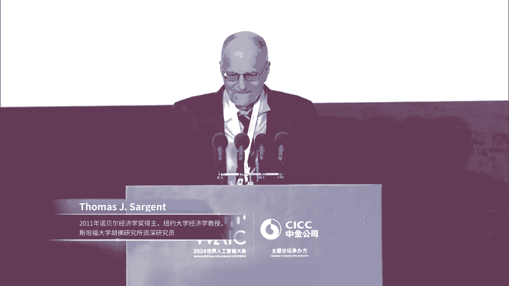
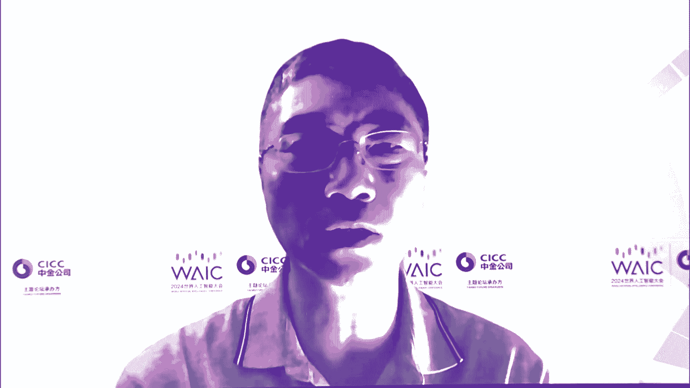

# P28：20240705-“AI 规模新经济”——投融资主题论坛 - WarrenHua - BV1iT421k7Bv

🎼，🎼，🎼，🎼操作寻求事业，剩界是AI开始为了大做织，夺么太大破形带的人睛，走互方式心走不算力，层出需求不断爬涉，同行技术升级。AI时代创新无处不在，挑战几日并存，能够只能存足千着万户，负能千行百业。

🎼起风暴雨。🎼我能千风霸叶。各位嘉宾，2024世界人工智能大会投融资主题论坛AI规模新经济现在开始，让我们掌声有请主持人、中金公司首席经济学家、研究部负责人、中金研究院院长彭文生博士上台。

尊敬的各位领导，各位来宾，大家下午好。欢迎参加由中金公司承办2024世界人工智能大会AI规模新经济投融资主题论坛。2022年，chatGPT。发布在全球范围内掀许了AI热潮。

本能AI进步的一个突出特征是sning弱，就是规模定立。中国人口多，市场大，有利于加速追赶。尤其可能在引润层融入新引领性的创新，为经济增长注入新动能。因此。

此次AI投融资论坛将围绕AI规模新经济的主题展开。我们邀请到了多位重面级嘉宾分享他们的政治灼见。首先我们有请中金公司董事长陈亮先生，致欢迎此，请大家欢迎。尊敬的。庄木地秘书长。托马斯萨丁特教授。

各位领导，各位来宾，大家好。欢迎莅临世界人工智能大会投融资主题论坛。首先，我代表中金公司向大家致以诚挚的欢迎和衷心的感谢。今年也是中金公司连续第七年承办投融资主题论坛。在此。

也对各位领导、各位来宾长期以来给予中金公司的关怀、信任和支持，表示衷心的感谢。习近平主席深刻指出，人工智能是新一轮科技革命和产业变革的重要驱动力量。将对全球经济社会发展和人类文明的进步产生深远的影响。

当前，在我国加快经济转型升级，加快构建现代化产业体系的背景下。人工智能作为新智生产力的代表。将为中国式现代化提供重要的功能。我们看到近年来以 chat特GPGDP为代表的人工智能。

掀起了席转全球的科技浪潮。正以前所未有的速度深刻影响和重构着各个行业产业。它极大的提升了互联网传媒业的生产效率，帮助医疗健康领域提质增效，也加速了自动驾驶的落地和汽车行业的商业模式的更迭。此外。

以人形机器人为代表的巨生智能，更是发展空间广阔，让未来充满无限的想象。同时，中国超大规模人口和市场所带来的规模经济的优势，也有望在人工智能时代构成技术发展的一种优势。比如。

人工智能为中国制造业的转型升级提供了重要的内生动力。我们可基于门类齐全、产业链完整和规模庞大的工业数据的优势，持续迭代优化工艺材料设计的。助力中国制造加速追赶先发国家。

并逐步从追赶式创新向引领式创新转变。从传统制造向智能制造转变。科技的发展离不开金融的支持。人工智能作为前沿科技领域。更加需要依托多层次资本市场，形成科技产业金融的良性循环。中宁公司作为一家证券公司。

长期以来，我们为包括人工智能技术在内的科技创新企业提供金融支持。累计保健科创板上市公司50余家，发行规模超过2000亿元。占科创板IPU融资总额的5分之1以上。通过多种方式管理的基金。

投资高科技直投项目超过了1100个。累计投资金额超过900亿元。在人工智能兴起后，我们持续进行跟踪研究。在今天的论坛上，彭文生博士带领他的团队还将推出最新的研究成果。IR经济学。根据这篇报告的估算。

中国AR产业的市场需求到2030年将达到5。6万亿元。2024年到2030年间，中国在AR产业的总投资规模将超过10万亿元。如此大规模的市场空间和投资需求。

对IR相关企业和金融机构来说都是重大的业务机遇，值得我们高度期待。各位嘉宾、女士们先生们，今天的论坛，我们邀请到了来自海内外的知名专家、投资人、企业家等，希望大家能够畅所欲言，各抒高见。

共同为人工智能产业的发展和新智生产力的培育贡献智慧。中金公司养家也将继续发挥投资加投行加研究的联动优势，与全球的客户和社会各界一道，共同把握人工智能的新机遇，共谋发展的新未来。最后。

再次感谢大家对中金公司一如既往的关注和支持，预祝本次论坛取得圆满成功，谢谢大家。谢谢陈董事长。本次AI规模新经济主题论坛主办离不开上海市政府的大力支持。

接下来让我们以热烈的掌声欢迎上海市人民政府副秘书长庄波娣先生上台致辞，请大家欢迎。尊敬的陈亮董事长托马斯萨金特先生。各位来宾、女士们、先生们，同志们，下午好。

很高兴和大家相聚在AI规模经济投资主投融资主体论坛。从经济视角角度共同讨论人工智能发展。首先，我代表上海市政府对各位嘉宾和朋友们的到来表示热烈的欢迎。

向长期以来关心支持上海人工智能和经济社会发展的各界人士表示衷心的感谢。当前，全球人工智能领域正迎来了历史性的变革与迅猛的发展。特别是2023年以来，AI技术进步体现出明显的规模定律。

大模型推广应用与相关产业的发展将呈现规模经济效应，引发经济结构重大的变革，推动产业转型升级，实现生产力的跃升。上海深入贯彻落实国家战略部署，将人工智能作为重点发展的三大先导产业之一。

充分发挥国际金融中心建设的区位优势，助力建设人工智能的上海高地。我们积极发挥财政资金引导作用，推动设立人工智能产业投资母基金，充分发挥以投促引、以投促产、以投出创的作用，吸引和集聚海内外一流企业。

加快释放产业基金带动投资的潜力。上海人工智能产业投资基金累计募资3亿元，母基金部分投资了红闪、奇迹畅谈等12个基金。撬动投资规模572亿元，加速产业资本融合发展。

与全球著名高校、科研院所、高水平、新型孵化器等创新主体开放的合作，构建创新链、产业链、资本链、人才链的深度的融合这么一个生态。面对人工智能发展的新一轮的浪潮，上海将进一步发挥金融服务的优势。

完善产业生态，以更大支持力度推动人工智能产业的新的突破和新的发展。我们将优化完善。融资体系。围绕大模型、智能算力、人形、机器人等重点领域。充分发挥资本市场资源配置的功能。

调动各类社会资本投早投小、投创新。支持产业投资、并购整合、补链、强链等，提升人工智能产业整体能级和发展水平。我们将鼓励产融协同创新，支持人工智能企业与金融机构深度合作，探索大模型、巨胜智能等前沿技术。

在金融领域合规应用，加快形成标杆性的解决方案。我们将深化全球交流合作，建立多元包容共享的融资生态，形成多元联动的投融资国际合作机制，支持全球资本赋能支持人工智能产业的创新发展。各位来宾。

今天论坛汇聚了全球人工智能领域里边的学界的产业界的金融界的领军人物，还将发布AI经济学等研究成果。期待各位嘉宾发表真知灼见、交流思想观点，分享创新实践，为引领全球AI发展贡献智慧和力量。

上海将以更优质的营商环境，为全球人工智能优秀企业投资机构卓越人才。提供广阔的发展舞台，与大家共同绘就人工智能产业发展的美好愿景。最后做此次大会论坛取得圆满成功，谢谢大家。感谢中央秘书长刚才的精彩致辞。

回顾历史，每一轮突破性技术进步，都对全球。经济产生重大影响。展望未来，本能AI发展将呈现什么样的趋势？对全球经济的影响如何？接下来我们非常荣幸的邀请到2011年诺贝尔经济学奖获得者。托马斯沙金特教授。

沙金特教授将与我们分享他对这些问题的见解。托马斯萨君特教授是全球知名经济学家。是现代宏观经济理论的领军人物。2011年，他因对宏观经济中因果关系的施政研究荣获诺贝尔经济学奖。

沙金德教授现任纽约大学经济学教授，斯丹福大学护福研究所资深研究员。美国国家科学院院士、美国艺术与科学院院士。萨金德教授先后在加州大学伯克利分教和哈佛大学获得文学学士和哲学博士学位。此后。

利用宾夕法利亚大学、芝加哥大学和斯坦福大学等名校教授，他曾担任。计量经济学会主席、美国经济学会主席等重要学术职务。沙金德教授今天演讲的主题是AI发展趋势与全球影响。

May I now invite Professor Sagant to the podium， please，请大家欢迎。Okay， thank you。

Okay。So I'm going to talk a little bit about artificial intelligence。

But before I talk about artificial intelligence， I'm going to talk about intelligence。

 human intelligence。And I'm going to define what I mean by intelligence。So。

What I think of intelligence is actions or activities。That particular people do。

And there's three things that Im going to three activities I'm going to call intelligent activities。

 One is pattern recognition。And what that means is。Looking at。A whole bunch of data。Are images or。

Experiences， and from those。Vast number of。Pieces of data。Compressing them into some patterns。

So pattern recognition is always about。DaData reduction。

Ignoring most things and concentrating on others， that's what pattern recognition is。

 that's what smart people and smart animals do。The second thing is it's activity， something we do。

 it's generalization。Taking some pattern。That you saw in one situation and applying it to another。啊。

And then the last。Thing is using patterns and generalization to make decisions to inform decisions。

How do we just？We face choices。 What do we buy， Where do we go to school。

With whom do we want to be associated with。Do we want to have children and so on？

So that's what I mean by intelligence。That， that's human intelligence。

And what's artificial intelligence， it's making a machine。To do some of those activities。

 that's all I mean。So。So the irony or。Paradox is that we humans， invent the machines。

To be like us or better than us。In doing those activities， that's what I mean。

So there's a paradox or an irony。Or a difficulty。 And that is。How。

How did we make these machines and what tools do we use？嗯。To make them。Okay， so the irony is this。

 the cognitive psychologist at Harvard。Stephen Piinker has said that， we human beings。诶。We evolved。

 as a biologistist and psychologist。 We evolved from。Tens of thousands。

 and if not hundreds of thousands of years， being hunters gatherers。You know， we lived by hunting。

And gathering crops。And we did that until about。10 or5 or 10000 years ago， very recently。

And then we started doing other things like。Agriculture。And making things。

 but before that we were  hunter gatherers and we were well。

Evolution designed us well to be hunter gatherers。And when we were hunter gathers。

 we had primitive theories of statistics。That's probabilities of frequencies of events， biology。

That's theories of life and death and birth。Economics。That's theories of production and exchange。

And physics。Theories of matter， motion， light。And what Stephen Pker says。Our natural。

 instinctive common sense。Biological things， theories of those things are all varied。

Bad for modern times。啊。Our common standard instincts didn't train us for modern life。

 and what Stephen Pker says is that the purpose of an education。Nowadays。

A university or high school or education。Is to repair our cognitive disabilities to equip us for modern life。

 that's his theory of education。So he says education。Is a technology to take advantage of。

One thing we have the ability to do， which is to learn。And to learn。Better theories of statistics。

 biology and economics and physics， but they are not natural to us。So here's the next slide。

 and you can ask an expert on artificial intelligence to ask what tools。

What scientific or academic subjects were used to create artificial intelligence today。

So the answer to that， the sources of artificial intelligence and machine learning。Our statistics。

Biology。Economics and physics。And they are things that we are not naturally good at。So。

That's a paradox， it's a fact。It's kind of beautiful。And to document that。

I'm going to just take a quick look at under the hood。

Inside the blacks box of artificial intelligence。And an example of。

Something that's a machine that did something really smart is alpha go。It's a computer。

Algorithm or computer program that beat。Finally， the best go player board game of go in the world。

 that was very hard to do。The IEBM Corporation couldn't do it， it gave up。

 it beat the best chess player 25 years ago， it could not beat the best go player。So。Some smart。

 young。Computer scientists of。Bilt this computer program to beat Al God， to beat go。

 And what did it do。What what kind of techniques did it bring？So I think of Al go。

 if you look how was designed， it's like cooking。It took something from this field。

 something that Finnen stirred them together， added something else， tasted， tried it。And finally。

 it worked。 So what did it use？It uses prices and values。 it assigns prices and values to。Decisions。

It uses game theory from economics。It uses distributed computing。From economics。

 statistics and computer science。It uses dynamic role programming from mathematics， economics。

And statistics。It uses Monte Carlo simulations。From physics and statistics。

That was something that was originally invented to build nuclear weapons。By physicists。

And competition and survival are the fittest from biology， it uses an evolutionary algorithm。

By combining those in just the right。Proports and the right order。It created this alpha go。So。

That was done in 2016 or 17， but if you go 40 years earlier。

One of the first artificial brains was invented by a professor at the University of Michigan called John Holland。

If you look at what he did。He made an artificial decision making machine。That， by the way。

Was used 20 years later， Part of it was used by an astronomer。

As a key piece of is finding exoplanets around stars。By processing。

A bunch of big data in a very clever way。嗯。So。And what did John Holland use to use what's called the genetic algorithm and classifier system？

He used the mathematics of DNA from biology to encode statements。

 he used mutation and sexual reproduction as part of his algorithm， and by the way。

 that was also used。To discover exoplanets by a machine， he used ledgers。Like we use in accounting。

Or banks used。He used competition。Did markets use and economists use。He used auctions。

Auctions are also used by Alphago。 That's something from economics。

 He used randomization from statistics。And you use something called exploration。

exploitation trade offs from biology and statistics， so we combined all those things。

 so that's just testimony to the tools that are empowering AI。Okay， so now。Now， the question is， AI。

Is excellent。It's excellent at doing the first activity of。😊，What I said was human intelligence。C。

Pattern recognition。 It's very good at spotting patterns。

Alphago was even good at making decisions in a particular instance， but Alphago was doing beyond。

Made patterns。 but now the question is。Are patterns enough。 and here's the cre question you should。

This is the key question， and these are the two answers。

Thats are important for thinking about the frontiers of artificial intelligence today。

So the answer is， for some purposes。Looking at patterns。Is enough to solve all sorts of problems。

But for other purposes， it's not。It's only the starting point and it's not enough to solve。

It's not enough to solve the problems。And this is true for。

All applications of artificial intelligence for scientific applications。For personal applications。

And for business applications， so。To。And I just want to。

Tell you how I was taught to think about this。Okay。So。You could cast， what do scientists？

And you could also ask what is an entrepreneur， but put that aside。

 what does a scientist actually do？嗯。So the great physicist， Richard Feynman。嗯。From Caltech。

Who was very famous， And he was a。Quantum mechanics expert who invented something very important。

He was asked， he taught at Caltech， and he was asked by an ordinary person， not a scientist。

 not someone who knew math。Or physics。But was an intelligent person and was curious about Richard Feynman。

What did he do during the day。What was he doing when he was writing those equations on the board？嗯。

And thinking about the world， Richard Feynman was a theoretical physicist。

So here's how Richard Feynman explained。 you can find this on the Internet。 It's fascinating。

 here's what he said。HereHere's what I do， he said。I'm like a person。

Who does not know the rules of the game of chess？You could say， go if you want。

Does not know chess is a board game， it's actually much simpler than go， it's complicated though。

He does not。 It's played between two players on a board。He said。

 I am like a person who does not know the rules of the game of chess。

And what I get to do is I get to observe。One game played by two players。And I write down their moves。

So my data matrixes， if we will， is the moves of two players。Now he's an astronomer。

 so think about what an astronomer has。A bunch of data from。So then he says， from those data。

 the observer is asked to infer the rules of the game of chess。

From watching two players play one game。So think about that。So he says， likewise。

 a physicist infers laws of nature from incomplete observations of a physical system。

And that is very hard。And so far。AEI has not come close to helping him。So we can expand on this。So。

So this metaphor is very。Telling or informative for an economist。Or a business。Economist， because。嗯。

The， the。The relevance for an economist is。It's exactly what we do。

 We see some observations on prices and quantities in some market。

 and we try to figure out the structure of the market。So right now。

 AI is very good at detecting and organizing patterns。So far。

 it's not good at inferring the rules of the game in a physical system。By itself。

 in a physical system or in a。Or in an economic system。So that's where we are。So。Does that mean。

Artificial intelligence is。Useless or useful。 Well， it's useful for some activities。

And for some tasks， so many tasks， many jobs involve many tasks。

 but some tasks are about detecting and organizing patterns， and AI is very good at that。

It's so good that people are asking， you know AI is basically software。

It's software putting on a certain kind of machine。It's software together with some data。

 together with machine， that's all it is。 So the question is， can software replace people。

 I'll come back to that。Okay， so。So here's an issue that's arisen。

So this is true in a number of countries， it's true in the United States， it's a pattern。

It's true in Korea。And some European countries， what's happened in the last 10 to 15 years。I。

Labor's share of gross national product has been declining， and capital share has been increasing。诶。

This is something that preoccuupies all economists， it preoccupied Marx。

It preoccupied the people who taught Marx David Ricardo at Adam Smith， and it preocups today。

So what determines。Who gets what out of GNP so so far in the United States。

 and this is concerned people， the share of labor has been declining slowly but steadily。So one。

Question has said is， is that's partly due to software replacing jobs？

So there's some research up about this and here's how people think about this。

So what's true is capital goods。You know we'。We're talking about some Marx that was interested and people 100 years later capital is what is capital consist of？

While today capital consists not of just of machines and equipment， it consists of software。

And it consists of many types of capital。And many types of software。Ask what labor consists of。

 or labor consists of many types of people with many types of skills like all of us。

So capital goods and workers， they're very heterogeneous。And。

We workers use each one of us uses different types of equipment and software。

So it's all sorts of matching。So think of yourself or your parents or your children。嗯。So。

 technical change。Which has been going on。China is a leader in it。Both equipment and。Software。

Technical change has manifest itself more and more in improvements in both equipment and in software。

But actually， software is improving faster than equipment。

And the way this shows up is prices of software have been declining faster than prices of equipment。

It been getting cheaper， and I myself， I produce software。

But I produce open source software that's available， it's free all over the world。

 so I give it away for various reasons， and I'm not alone。So， you can't。

It can't get lower than a price is zero。So that's going on worldwide。

 so prices of software have been declining faster than equipment。

 so what ramifications does that have？So。So labor share。

 there's an important study using Korean data that just came out by Aom and Xn。

Labor shares been declining as software replaces or substitutes for labor。And raises firms markups。

So。So this spread of software。Which is connected with what software using， partly AI， those tasks。

That has ramifications for the distribution。诶。Gdp between workers。

And people who own shares in companies， so this is something to keep our eye on and also has ramifications for the market power of firms like in the United States。

 market power has been increasing， people say markets have been increasing。

 so AI and software is connected with this。O先 now。嗯。So regulators are properly concerned with this。

I must also say is also accountants are。So the role ofants accounting is very important in terms of measuring things。

Accountants give us information。So I must say there are people who dispute the fact。

 especially on US data that labors share has been falling。And the reason is， accounting。

The US tax system taxes labor at higher rate than it taxes capital。And it creates an incentive。

To relabel return wages from labor as returns to capital。

And there are people at the University of Minnesota and elsewhere pursuing this。

And revising the accounts。And so that's an active area。So。

 you know is it declining labor share a real thing or is it a consequence of a strange feature of the US tax system。

 maybe the Korean tax system？Anyway。嗯。So finally， the next I want to talk about。

AI and digital finance。Which is a big。Okay， finance。Finance is intimately related to innovation。嗯。

Because innovators need sources of funds。From banks。Their own families。From venture capital funds。

From government。Accelerator funds and so on。But they always have them。

So there's an intimate relationship between。Technical change。A lot of technical changes。

Started by new entrepreneurs or trying risky new ideas。 most of which fail， but somehow。诶。

They get society finances them。So 95% or more of startups， new ideas fail。

But 5% out turn out to be good， and they're the sources of a great deal of the new things we have。

So digital finance。So it's something that's hot， it's part of AI。

 so I just want to ask what's new and what's old。So again。

 I think the way I think about it is the activity， a lot of economics is just what do people do with their time？

In its activities， so especially because we're in China。

 the activities of digit of finance are very old， there were paper and pencil ledger books。You know。

 a bank。Or a credit agency， is' just a ledger book that has has a。

has a list of people in and it has with their assets。

And their liabilities and their income and outflow is at each point in time， that's what a ledger is。

I think it's a massive spreadsheet or collection of spreadsheets。

And it used to be written on paper and pencil and for the last few decades。

Advanced institutions put them on。They put them on electrons， and on computers。嗯。Bank notes。

 paper bank notes。They're invented in China。诶。That was something intellectual capital that was exported to the West。

WithMarco Polo。Currencies， they used to be paper and now they're on my WeChat， they're electronic。嗯。

So what？Digital finances， its new technologies for doing old things。

 but doing those old things that are faster and cheaper。

So now we have electronic ledgers and currencies。And。So。

So this creates both opportunities and innovations and challenges， so because of these ledgers。

And these electronic ledgers and platforms。They provide new ways to facilitate trust and enforcement。

So， instead of needing。诶。Courts and policemen to enforce debt contracts。Platforms and China's been a。

You know the names of like WeChat and Alipayi and Aunt？

They by remembering past buying and selling practices and keeping a record of them。

They have the ability to exclude bad actors from the platform。And。

Not wanting to be an act excluded from the platform。Incentivizes， motivates people。

To honor to honor their promises as simple as that。

So those are new technologies to do things that banks and courts and lawyers used to do that。

In costly ways。And the wonderful thing about these platforms is they are doing it in a much cheaper way。

So now here's the key question for regulators or for common citizens。

Who should operate those platforms？Who should operate those platforms？

Should it be new people who weren't in the business？Or should it be the banks？

Or should it be the government？You know。You know what should be quote unquote， socialized。

 the platforms are socialized because it's a network we're all participating in。

 and we benefit from good behavior and enforcement。

So now there's interesting questions about the platforms were started by private entrepreneurs。

But they。They quickly started doing things at banks。

Maybe social insurance agencies were doing so beautiful。

Questions about economics and regulation about that。So again， what's new and what's old？

So what's very old is。You know， this is true in families。It's true in little villages。

 if it's been going on in China。And parts of Asia for communities lending coalitions。

 lending your great grandfathers and great grandmothers。

Living in villages often participated in syndicates where poor people got together and they made loans to each other。

嗯。But they wanted arrangements that encouraged trust， so if you made a loan。

 you're going to pay it back to the community。And to detect and exclude back actors。

 so the new platforms are their wonderful ways of encouraging trust and facilitate community policing and regulation。

Now， a key question that regulators and operators of these platforms do is。

What happens if there's two or three platforms？嗯。It's socially better， if they。

Communicate across the platforms。And operate them。But now who wants that？

And how does that come to be？Because the people that operate their platforms。

 they can earn some profits。Because it' kind of created， it's like they've created a money。Okay。

 so it's a source of revenues。There's profound economic and regulatory questions about how you get these platforms to cooperate。

And this is so pervasive if you go to the port in Shanghai or Shenzhen or Hong Kong。

 you'll see container ships。And those container ships have chips。

That are recording transactions and supply chains as they move through the world。And those。

Those chips and those transactions on supply chains are on little platforms that are trading their own cryptocurrencies。

So interoperability of those platforms with others is a central thing。

So if you kind of think of the activities of financial intermediaries， it list the activities。诶。So。

They're as old as the hills。嗯。Decentralized finance and fintech is doing them all。

 So I'm going to quit now。Al in。Okay， the central Bank of China is a key player and a thinker about this。

 you could ask how does digital money differ from paper money？

It's all about whether they operate at ledger。And if you start thinking。

 I'm going to quit because I've run out of time。We've had。Central bank currencies for a long time。

But they haven't been socialized in the United States。And if there was a digital bank currency。

 it would be a central bank digital currency， it's a very democratic thing because it amounts to giving private。

Individual citizens accidents to a technology and a transaction。

Procedure that banks have had for a long time， so I'm just going to quit now。

 and I'll just say one thing is。嗯。Digital finance， there's a whole ecosystem in China where digital finance helps small and medium enterprises。

It gives them possibilities to do things very cheaply that they couldn't do before。

Thanks for letting me come and talk about。This beautiful subject。Thank you very much。

 Professor Sageant， for that very insightful and stimulating speech。呃，下面呢我是代表中金公司呃。

研究院、中金研究院和公中金公司研究部啊。呃，跟大家分享我们刚刚发布的AI经济学研究报告。我们这个是从AI进步如何影响生产力和生产关系，从宏观产业到治理这三个层面做一些分析。所以我今天这个报告啊。

实际上是一共是有很多章啊，这个20080页呃，我今天这个跟大家分享的是我们的一些主要观点啊和呃研究结论。这当然本身也反映我自己的一些呃研究方面的一些思考和兴趣啊，所以我今天讲的不是报告的一个全部。

其实包括还有很多其他方面呢也有一些原创性的这个研究啊，包括金融啊，我这我今天可能没有讲金融。刚才这个萨丁特教授提到不少金融方面。呃，所以呃这个呃请大家有时间的话，有兴趣的话，可以读读我们这个报告的全部。

呃，我们报告的题目叫AI经济学。啊，其实刚才这个沙金特教授啊，其实在他的这个演讲里面，他讲到这个AI和经济学的关系是吧？其实他有两个层次。第一个呢，AI和经济学作为一种研究的工具，互为工具是吧？

他提到比如说那AI怎么发展起来，他利用到很多交叉学科的工具啊，这个统计学、生物学、经济学还物理学。他他后后面他也讲，反过来讲AI的这些工具，今天也帮助我们经济学的一些研究。

包括市政研究从工具上来讲是一个促进是一个帮助啊，这是他讲的第一个层面。他后面讲的第二个层面就是AI作为一个技术进步。他怎么影响经济。啊提到两个方面，一个是这个劳动者收入占比。

实际上就是大家关心的会不会导致失业啊，是吧？呃，对经济怎么影响呢？第二个就是金融。那那所以我们这个AI经济学报告啊，我们是第二个层面，我们是聚焦AI就作为一个技技术工具啊，技术进步它如何影响经济？那么。

任何一个技术进步啊。它影响经济有很多渠道。比如说如何提高效率，促进经济增长，如何促进产业和商业模式的变化。有有一些比如互联网就促进了一些新的商业模式。商业模式的变化。

又如何改变行业或者产业的竞争这个生态啊促进竞争呢，还是可能带来垄断呢？它如何影响全球经济格局？不同的国家在每人的这个技术进步的过程中间呢，他的这个这个收益啊和可能遇到的挑战是不同的。

那包括啊这个最后涉及到我们每一个人本身是吧，对我们的这个就业，对我们的收入分配是吧？甚至对这个未来的这个教育啊等等这些影响。所以呃他有很多不同的视角。那作为一个经济学的分析。什么是主线？来帮助我们分析。

AI作为一个技术进步，它和以往的技术进步有什么不同？😡，所以我们这篇报告的一条主线就是规模定义。AI和其他的这个过去的这个技术进步比较，一个最突出的特征啊，就是它需要投入，需要一定的门槛。这所谓大模型。

这个参数到一定的这个数量以后啊，这个参数背后当然需要数据啊，算力的这个这个这个支持。才能够这个模型的预测能力啊，模拟模拟能力才能有一个这个。叫做非线性的个大幅的提升。这个适和以往的技术进步。

这个可能是一个重要的差别。那这个呢我们经济学的一个重要的概念叫规模经济效应。实际上是有关联的啊，不完全是一样，但是是有关联的。经济学的一个基本的概念，规模经济效应就是产量越大，单位成本越低。

整个人类社会。生活水平的改善。为什么在农业经济时代，几千年几百年，人们的生活水平改善很慢。到了工业经济时代，为什么人们的生活水平改善？😡，呃，这个加快到了现在，我们的生活水平改善更快了。

其实最根本的载体就是规模经济。农业经济时代很难实现规模经济到工业经济时代，我们实现大规模的生产。带来效率的提升。到数字经济时代，这个商业模式更大规模的。更更广范围的效率的提升。那AI呢就是更进一步所以。

我们这边报告的一条主线啊，就是规模经济。那么首先这个呃我们怎么理解这一次这个呃这个AI。技术进步啊，我们在这写这个报告的过程中间呢呃差不多一年时间啊，我们在内部有很多这个这个这个讨论，激烈的讨论。

那么我们这么怎么理解？这个AI它作为一个技术进步，它的属性。其实它就是一个机器学习，就是我们像训练小孩那样训练机器。小孩长大了以后，他的知识激累多了，哎，他就有自己的创新的能力，思考的能力啊。

但是我们现在还达不到那一那一步啊，机器本身可能还是难难以实现思考的能力。但是这个逻辑是这样，我们我们通过所谓的机器学习来来训练机器。那由此就带来了。这个。我们讲的这个。

这个通用技术的问题这个是所谓的学习能力，为什么学习能力重要比我们这个。😡，实际硬硬硬背一个东西啊，学习能力更重要。因为学习能力能使得我们有通用性。我们在一个领域的知识可能延延展到另外一个领域。

这样的话可以在更更广范围的引用。那么呃经济学有一个名词叫通用目的技术，就是非常大大的范围的引用啊，过去的电力啊、计算机啊、互联网这些都是通用技术啊。

当然这个呃人工智能有一个有一个类似的概念叫通用人工智能 artificialial general intelligence。那这个呢这个通用啊和我们讲的通用目的技术。

这两个其实还是个还是个不同的概念啊，通用人工智能讲这个人工智能啊，比较洁近，已经接近，甚至超过人类智能。这个是有很大的争议的。我们不需要有一个很明确的结论是吧？包括我们我们的分析员。

我们研究员本身也有两派观点啊，有有一派就相信可能这个这个通用人工智能是能够实现的。啊，有一派包括我本人在内啊，我们是比较就更谨慎一点，可能觉得这个人的思考能力啊是很难被机器来替代的。但是没关系。

这个争论其实不影响我们分析思考人文智能的发展对经济的影响。因为作为一个通用技术。广泛范围引用的这样一个技术工具。实际上现在的人工智能大模型已经展示了它的潜力。那么通用技术的一个重要的特征啊。

从刚才讲从农业经济到工业经济到现在一重要的特征啊。其实就是规模经济效应。规模越大啊，生产的单位成本就越低，我们可以用更少的投入生产更多的东西。由此人们的生活水平得以提升。

那么这一次呢人工智能也有一个类似的概念，叫规模定力sing law这两个类似，但是也不是完全一回事，是吧？这个呃。规模定义它是一个技术技术的概念，就模型的预测能力，它的准确度。你一开始你投入。

你增加数据，增加参数是吧？增加模型的规模，它效果是不明显的。达到一定的门槛以后啊，一个分线性的一个突破啊，这个呃技术叫沦线。这个模型的预算率突然就大幅提升。

那这个呢呃和规模经济效应啊其实是一个相互联系起来，一个重要的含义就是对大企业有利，对大国有利。因为它有门槛效应啊，它要需要一定的投入门槛，它才能实现这样的技术的一个一个一个进步。

但是呢它又不完全是一个技术的门槛的问题。因为即使突破了技术的门槛，它在引用层面，在产业的引用层面，那经济学的规模经济效应这个概念就进乱。在产业引用阶段。怎么样实实现一个大规模的生产或者大规模的引用啊。

这这个对它的商业可行性啊就有就有很大的关系了。所以首先我想这个分享一下产业视角下的。AI就这次AI，这个美国是领先的，但是呢很多人有一种观点就是。类似互联网是吧？互联网发明是在美国。呃。

但是很多人认为互联网最大的引用红利发生在中国。那AI会不会也是这样？那么首先是从一个通用技术来讲。它和产业引入的关系，一般来讲，我们把它用一个所谓的S型S型出现。在S型出现的起步啊。呃，这个。

这个技术需要一定的技术积累。他才能突破这个技术可行性。突破技术可行性，也就是第一拐点以后。😡，才进入这个所谓的推广引用的这样一个这样一个阶段。

所以现在我们一般的认为大家认为这个最近这个大模型的进展就使得AI啊突破了第一拐点。就就是在技术可行性上已经具有了一定的可能性。那关键是下一步就是S型曲线这个经跨过第一拐点以后，到底有多快的速度上升？

这就是属于产业化的引用阶段。产业化的引用阶段，就和这个呃规模效应啊就有就有就有很大关系了。当然，这个产业化引论阶段呢，不仅仅是AI这个提高效率。反过来来讲反过来来这个来讲，AI的产业引用提供了利润啊。

大家企业赚钱了，反过来又能促进啊进一步的这个这个技术创新。所以技术可行性和经济可行性它是相互促进的。那么在产业化引论阶段，首先是要投资是吧？算力啊，模型的这个这个这个研发啊。

数据的这个这个这个收集和处理啊。那所以说第一步我们要思考的作为一个经济学分析。首先大家可能关心的一个问题，那未来几年。AI大模型方面，我们需要多少投资投入呢？

这是我们把这个从这个呃这个这个呃呃我们的行业研究员啊，从这个几个几个层面啊来做一个一个一个分析。当然这是一个我们的一个粗浅的这个初步的这个这个研究啦。那么我们一个估估计啊。

这个从这个呃2030年啊到2030年AI算力和模型层的市场规模大概是这个5。2万亿人民币啊呃引用从产业化的这个是。这个9。4万亿，所以这是我们。就是从引用阶段投资啊投入的需求的这个角度来看。

那有哪些可以呃产业化呃这个引用的？我们可以从两个视角，一个是AI产业化，就AI产生一些新的商业模式啊，包括这个聚生智能啊，人人人形机器人啊，那我们这些也做了一个，比如说这个考考虑两个标准是吧？

呃两个维度，一个是操作的标准化，标准化程度越高啊，越容易这个AI产业化。还有就是容错率啊，这个容错率越高，那也不需要那么精确。那这个AI产业化的这个潜力也很大。所以大家注意，这这里面靠最左边的护理行业。

这个可能性可能性是最低的。因为它容错力很低护理行业，医疗的护理你就你你不能出出差错是吧？那么另外一个维度就是产业的AI化，就现有的产业引用AI的提高效率。那这个我们中国是有具有很大的优势。

这也是为什么呃这个不少人相信啊，AI的引用红利最大的红利也在中国。因为我们无论是这个呃从需求端还是从供给端啊，无论中国作为需求者，中国还是作为生产者，我们在好多行业都是全球最大的份额。

所以我们有全球最大的最完整的工业体系和制造业体系。那么这是从营政层面来讲。当然有一个这个呃大家讨论的问题，就是这个我们讲规模效应是吧？我们中国有规模，规模越大，这个经济效率越高。呃。

但是呢这个人工智能的发展其实也带来一个呃这个大家思考的问题，就是规模的极限在什么地方。所工业经济时代，其实它规模是有极限的，是吧？你年长110万辆车，我把它提高到年长100万辆车。

那这个规模效应就很明显。但是再高我延长1000万辆，延长2000万辆哎那个规模效应可能就没那么突出了。这边际上可能要降低了，有很多其他的管理啊，协调啊，这些成本就进来了。那这个AI本身其实也是这样。

所以好多人也在思考是吧？从算力的限制到数据的限制是吧？到最后这个参数增加它的编辑效率，对预测的这个有效度的这个提升到底有多大的编际上有多大的帮助，会不会也是降低？这个是大家现在有思考的问题。

所以最近一段时间大家的热情好像没有几个月前那么高了。其实就是这个编编辑上来讲，就是这个编辑的这个规模效应啊，是不是。不降低。但然还有另外一个就是我我们这张图显示的，我们专门有一家啊分析这个绿色的。

就是AII这个大模型的这个这个运算呢，从推理到训练的都要耗电。所以很多人现在担心我们有没有这个电力知识。😊，所以这张图就回顾过去人类的历史。技术进步包括AI进步会降低单位能耗。

但是大家看总体的能耗是不断上升的。为什么？因为人类我们人类要追求美好生活的愿望，这个需求很强，是吧？只要有这个技术可行，大家都希望有更美好的生活。所以这个我们这个基本的判断就是单位效率会上升。

但是总样的二氧化碳排放可能是要上升是要上升的？这个对这个碳中和对绿色转型带来什么样的挑战啊，这个其实对我们中国也一个重要含义。因为中国在绿色领域现在是领先的。如果这个电力这个能源是一个制约的话。

那中国可能受到的制约，比其他国家。是不是会要低一点啊，这个从从一个假设维持这个绿色转型，这个路径不变的话。还有一个就是数据啊，我们到底有没有个这个重量数据啊，互联网的数据都都认差不多了。现在靠中量数据。

我们有那么多增量数据吗？所以这个智离视界下的AI呀，一个重要的环节就是我们考虑数据，我们有没有那么多的数据。从数据的生产端来讲，中国的这个规模是比美国小的。所以这是当然美国是因为也不是它本身啊。

因为美国这个英文的互联网的这些它的它的这个这个这个呃数据量比我们中文的要要要多啊。另外一个就是数据流通啊，中国的数据市场规模也是比较小啊，甚至比欧洲的这个都要小啊，这个也是我们现在面临的一个一个挑战。

那我们怎么呃发展中国的这个呃这个这个AI和和这个产业引用啊？作以一个重要的方面，就是怎么样促进数据的生产和流通。在这里面。比如说公共数据，我们怎么样促进那些不敏感的公共数据能够公开啊。

不公开应该是例外啊，公开应该是一个惯例。那个人数据我们怎么样来平衡隐私保护和数据的共享？那产业化引用，我们现在讲的产业化的引用，它不是隐私保护的问问题，它是知识产权保护的问题是吧？我这个产我的生产过程。

我的应用过运运营过程中间，我积累这些数据，这些数据是不是我的知识产权。我怎么样跟别人来来分享来实现我们前面讲的规模经济效应，同时又能保护好这个所谓的知识产权，这个大家的这个生产。

和和和和和加工数据的这个积极性。那，这些其实都是啊我我我们在这个报告里面呢都有一些分析啊，有些有些地方也没有呃特别明确的现在的这个这个共识。但是最起码我们从一个经济学的视角啊，提供一些这个这个这个。

分析。还有一个就是和我们现在比较有关系。现在一个热门词这几年就是数据确权和交易是吧，我们中国这个模式啊更更希望在场内交易啊，我们成立了好一些数据交易所。我们要看现实的结果来讲，美国是场场外交易啊。

非标准化的交易。我们是场内交易标准化的交易。但是你要看现实的结果，我们的数据的交易量大大的低于美国。所以这也是促使我们要反思是不是应该这个这个主要的。这个聚焦点呢放在场内标准化的交易。

因为数据的确权定价其实是非常这个难的。有很多很多这个复杂的和不确定的因素，场外的交易。场外交易非标准化，它就很多方面，实际上就不光是和数据本身的这个价值是吧？数据引论的价值也可以呃这个包含进来。

所以它就更容易这个促成促成相关的交易。那么第三个视角就是国际化的视角。其实，人类社会每一次重大的技术进步，对全球的竞争格局都带来重大的影响。在工业革命时期啊，西方国家快速发展。

以中国为代表的东方国家落后，在经济经济史上面被称为第一次大分流。啊，本来在那之前呢，其实中国是不落后的资金化，甚至是领先的。但是在工业革命以后，我们大幅落后了第一次大分流。那么到了这个账后。东亚经济体。

少数啊东亚经济体在工业化的过程中间，成功追赶发达国家。尤其我们中国改革开放过去的几十年，大幅缩小了和发达国家的距离。那这个在经济学上被称为大狩炼，狩炼就是。不同国家的收入水平呢，它是收敛的啊。

它不是风化，不是分流。那么现在。在面临数字技术、人工智能这样一个新的。重大的科技革命下面。不同的国家是收敛还是分流呢？现在实际上在文献里面是有一个担心的。因为大家观察到过去这些年过去的几十年。

重大的创新和产业化的引用都集中在少数国家。比如说首先是美国，然后产业化引入我们中国。所以现在很多人担心。现在的这一轮的技术进步会导致第二次大分流。就是像美国中国这样的大国。这个领先呃其他国家。

所以这是但是中美之间其实也有一个啊，到底谁是是狩猎还是还是还是封化，这个也是个也是个也是个重大的问题。那么其实经济学啊。给了我们一些理论的指导。今济有两个理论，一个叫这个新古点的这个增长理论。

它强调的技术进步是外生的。后发优势。因为技术进不收是外生的嘛，那么我们不能掌控，所以资本的边际回报是降低的那在这种情况下，发达国家的资金会流向发展中国家，发展中国家有个追赶效应。

但是内内生增加模型在80年代开始。他说技术进步是内生的，不是天上掉下来的。技术进步是人类经济活动的一个结果。人类经济活动一个重要的条件就是规模效应，谁的规模大，谁就有更多的能力做研发。

谁谁做研发的这个利润空间也越大。所以他强调的是个先发优势，谁先发把规模做起来了，谁就有更多的能力做新的创新。😡，所以这个内生增战模型是能够解释为什么美国一直是处在于领先的地位。在工业经济时代。

他先把规模做起来。那么AI影响到底怎么样？规模啊其实有两个维度。从经济学来讲，一个是人，一个是资本。这两个呢可以相互替代到一定程度啊，人在一定程度替代资本，资本一定程度替代人。但是他不能完全替代。

所以中国一个独特的优势，我们的经济规模比美国小，但是我们人口比美国多，印度人口跟我们差不多，但是印度的经济规模比我经济规模比我们小很多。所以平衡这两点就我们中国的一个规模优势。

那么我们的这个这篇报告呢呃。也是用规模的一些指标啊，这个估算了一个我们叫AI的竞争指数。呃，其实两个层面，一个是技术层面，一个是引用层面啊，技术层面包括这个算力啊、数据啊、人才啊、金融啊、这个风头啊。

引用层面就包括这个经济对AI的这个暴露度，那这个我们做的这个指数，以美国作为标准化啊，美国是一啊，我们是0点7几。我们比美国低，但是我们是第二啊，我们的优势主要是上面是引用层啊，这个。

那我们最近这个这个人才方面呢，实际上这几年进步是很大的。但是我们比较值得我们关注的，就是我们相关的这个这个这个分投风险投资是不足的啊，这是我们下一步啊在思考科技金融方面是要注意的。

最后呢就是宏观视角下啊，包括大家关心的问题，这个到底会不会导致大规模的失业，谁的就业会被替代啊，这里面我特别要推推荐一下，就是我们这我们我们这篇报告的第三章。这个。

我认为还是有些原创性的哎这个这个这个研究的啊，我们把这个人类的任务啊分成16个这个所谓的元素，也就是说它机器替代人，它不是说把你整个人完全替代我们更更有更更有逻辑的一个思考。

就是它替代我们人类所承担的不同的细分环节的任务，这些细分环节，比如体力型啊、智力型啊，这个知识型啊、支配型啊，这些16个环节。然后。我们的研发部门就是要降低这些原任务的成本。在产业这个引用阶段。

他就要比较。这个AI的软人物的成本和人类做同样事情，同样的原人物的成本比较啊，哪个成本低就是哪一个是吧？那么最后这个就会由此延伸到效率的提升，是吧？对经济增长。这是呃我们根据我们中金公司研究部。

我们30多个行业分析师的这个调研，我们分析了这个就是或者说制绘制了这个各个主要行业语任务的这个时间分布。那也就是人人务占这个行业总体时间、劳动时间使用的这个比例。那么呃有有一点就是这次人工智能啊。

因为这个视频啊、头像啊呃文字啊大家都以为要要被替代的是主要是老力体的脑力劳动者啊，包括我们我们这个做研究员，我们的分析师的一些功能是吧？历师啊，这个医生啊，但实际上我们要仔细分析一下和聚肾制冷。

包括人形机器人结合起来。大家看实际上我们这些行业里面这个力量型的。这个这个比重啊。其实还是蛮大的。所以也它的一个含义就是什么？其实更多被替代的是脑力劳动和体力劳动结合在一起。给定同样的这个人工智能。

可能反而是那些脑力的呃，反而是那些体力的，不是我们大家想象的脑力啊体力，比如说采矿业资源加工业啊昨天我参加这个另外一个论坛，也是咱们这个呃世界人工智能大会其中有一个院士讲的。

就是这个AI在农业生产领域的这个利润。那就是替代体力了是吧？从这个除草这个水果的采集。等等等这些包括这个产量的监测，这些都是体就是全能都是体力活啊，未来都可能被这个这个巨生智能啊给替代。

所以我们如果把这些加层起来是吧？呃，这个其实我们整个中国呃这个这个呃从不同的人人物这16项人文物人人物来看啊，就能够被IAI替代这个这个这个这个呃它的占比总体的重要性啊。

实践占比和呃能够被替代的这个这个容易度来讲，其实历练性是最突出的。也就是体力劳动C two two的。哎，这个就就不。所以呃那么由此我们展望未来十年。

AI对采矿、卫生、资源、加工、信息、租赁和一些商务服务这些领域它的替代效率可能更大，生产效率提升更快。对对另外一些比如说批发零售住宿餐饮、轻工制造等行业，它可能提升就慢一点。那么按照这样的一个估算，哎。

我们有一个总体的一个呃1一个一个指标，就是AI可可以为中国未来。十年啊带来每年大概0。8个百分。呃，0。8个百分点的额外的增长啊，就是这个是从一个生产效率提升的这个角度。那么刚才讲的这些替代。

这个劳动力是吧？那会不会导致这个。大 모르시기에。看人类。技术进步的历史啊，其实不会的。技术事业这个词很时髦，但是历史告诉我们，它没有为什么没有导致大规模的失业或者长时间的大规模的失业？

其实就是两个原因。第一个呢，它的生产效率的提升呢，它不是一致的，不是所有行业都都是都能被他替代是吧？有些行业他不能被替代，或者生产效率比较低。那多余的人干什么呢？多余的人就去那些生产效率慢。

难以被替代的行业去去就业。那这个背后的另外一个前提。假设就是人们的需求是近乎无限的。我们可能每个人只要用一部手机，这个这个这个就够了。但是可能每个每一个人不不能满足于这个呃这个呃直有汽车是吧？

他可能有还有更更高的这个这个这个这个需求啊，游艇啊，私人飞机啊。这个他可能不满足于一般的大学，他要孩子要读名牌大学。所以人类的需求它是一个心理概念，有时候是无限的，或者是很多时候是无限的，需求是无限的。

不是所有的行业效率都提升的都那么快，那那意味着什么？那意味着中间只是一个劳动力的转换的问题啊，不大不大可能会带来。😡，当然呢这个不代表。这个没有人会受害，其实是有是有些人会受害的啊。

刚才这个沙金特教授也提到，劳动收入占比是吧？其实我们看这个过去技术进步的历史啊，工业革命时期，劳动收入占比是下降的那后来为什么提升公共政策的干预？

还是需要公共政策的那所以我们最后就是提到就是这一轮AI进步对公共政策的一个重要的含义。现在好多人讨论叫UBI全民基本收入，实际上就是无条件的全范围的这个社保。我们中国其实还没到UBI这个地步。

我们的社保的公平性还很不足。从薄主义上讲，所以用AI这个技术进步带来的效率来改善促进我们社会保障的公平性啊，尤其农村这个这个这个保障啊，这是可能是一个非常重要的公共公策的含义。我时间正好到了。

以上就是我们。呃，这个报告的一些主要观点和结论，请大家这个批评指正，也特别呃希望大家能够跟我们研究员呢多交流多讨论，这是个新的领域我们一起共同学习啊，共同提高啊，谢谢大家。接下来我们进入高端对话环节。

哎，我把时间交给本轮高端对话的主持人，中金公司投资银行部负责人王树光先生。尊敬的各位嘉宾啊，各位朋友啊，下午好，欢迎来参加这个中金公司的这个这个论坛啊，然后那个也很欢迎能够来参与我们这次讨论啊。

我作为这个呃本次呃高端对话的主持人呢啊，首先向各位介绍一下今天的两位嘉宾啊，一位呢是这个呃坐在我左侧的这个呃朱英来呃教授啊，朱英来教授呢以前也是中金公司的呃这个。😊，以前的这个这个CEO啊。

现在是清华大学的的呃访问访问教授。然后线上呢还有一位吴军博士啊，哎吴军博士好。呃，大家好大家好，主持人好啊，那个很高兴跟大大家在这见面。😊，那个呃吴军博士呃是这个呃人工智能方面的专家啊。

也也出了很多跨界的书籍啊，像浪潮之巅啊这些特别有名的这种啊科技的这个畅销书啊，特别感谢吴军博士在美国线上参加我们啊，这个此时已经是美国的深夜啊。但是中国这个人工智能的这个这个啊这种热度啊。

相信能够使得啊吴军博士能够打起精神参与我们本。本次的这个高端论坛，这个呃在这个开正式开始这个论坛讨论之前呢，说点题外话。我说刚才听了彭勃的报告呢啊我觉得呃未来有一个职业大概率会被替掉啊。

就是像我这样的论坛主持人啊，这个我觉得未来我可能是少见的一些还还真能够能够现场参加的这个主持人。因为我说主持人一般在干嘛呢？第一。😊，搜寻这个社社会上的热点问题啊。

其实这一步工作只需要用chGPT或者是用中国的这些大模型。你输入几个字，现在社会上最关心AI尤其是比如说经济界或者投资界最关心AI的有哪些问题啊，啪砰啪一页纸出来了。然后这个这个这个问题有了啊。

这个未来像中金公司的那位啊，我们的这个智能员工啊，他就可以直接在那儿啊，用比我更好听的语音啊，和和这个嗓音啊，然后来问嘉宾们问题。第二个就是问问题。问完问题之后呢，基本上作为主持人。

要总结归纳一下嘉宾说的什么话。这个呢。刚才这个彭博士的这个报告也讲的很清楚，包括刚才那个呃那个汤马斯教授也讲的很清楚，这个归纳并复述，这个是人工智能最基本的的一些功能啊，这个这个东西也被替代了。

第三呢那就是引导这个嘉宾们讨论啊，甚至是争辩，这个也是这个呃人工智能特别擅长的领域啊。所以我说啊今天有可能是未来这个人工主持人嗯，在。上海人这个智能人工智能大会上的这个最后的啊最后的演出啊。

所以希望明年这个人工智能的进步呢，能够使得像我们这样的人就不要出现了啊。因为我说像我们现在还需要人工主持这个这个主持词，对吧？这些其实。都是对呃这个社会资源的浪费啊。

明年希望这个咱们的这个主持呢能能够变得更加人工智能一些。好，这个废话说完了，开始开始今天的这个这个正式的啊对对对嘉宾们的这个的这个一些看法的这个呃希希望能够引起嘉宾的的这个的这个呃真正的这个真心的分享。

我说第第一个问题呢，还是这个还是先请这个吴军博士呢，这个吴军老师呢来来来帮我们分享分享这个因为。实际上，人工智能技术呢经历了啊从简单规则到到深度学习和神经网络的快速发展。在这个过程中。

这个AI技术呃已经广泛应用到各个领域啊。如今呢在在图像识别自然语言处理。呃和预测分析方面呢已经显示出了强大的能力。近年来呢呃包括在自动驾驶啊医疗诊断啊金融教育创作也都有很多的应用。

还是首先想想请这个吴军博士和和和朱教授呃分享一下，就是你们是怎么看待你们作为作为行业达人是怎么看待AI技术的演变及未来应用的的这种呃真实的潜力。先有请吴吴邬军博士。好，那个我谈谈我的这个看法哈。呃。

这个人工智能到发展到今天吧，基本上是第四波的这个热就是浪潮吧，或者是第四波的这个热捧。呃，第一波其实是从有计算机开始在到60年代初呃呃刚才主持人讲了说用一些简单的规则来做人工智能。当时人类的想法很简单。

就是人怎么思维的，就是我们就怎么做人工智能。但后来证明这道路行不通的。这就如同就是说人类发明飞机的时候，其实它不是学鸟在飞行，不是在震动翅膀。人发明的飞机的那个翅膀是不震动的。

那么就是说人类搞清楚了这个呃。空气动力学的一些原理。那么呃在这个基础上，他就发明了这个飞机，这就能做的比较好了。但是直到就是说整个在第一代人工智能时代，就人类完全不知道这个呃机器来实现人工智能该怎么做。

到了上世70年代，其实那个就是呃美国的一个教授，后来是IBM的一个负责人，就是加里迪克教授提出语言模型，然后这才其实开始了数据驱动的人工智能，但是由于这个数据量不够，计算量也不够。

那么一开始其实成果都比较就是不是很能让人信服。那么一直有争议，就是说按照这条路能不能走下去。呃，有一些问题能够得到解决，有些问题解决不了。那么中间也起起伏伏，这就是第二波的浪潮这个呃起来又下去了。

那他的那些同事呃后来其实没有除了他自己还在做人工智能，剩下来人都没有再去做。技术了也还是在技术，但是不是在呃技术领域都去了一家非常有名的。中金大每一个人都知道一家公司叫做文艺复兴技术公司就挣着大钱了。

用这个呃人工智能的技术去解决语言的问题，图像的问题都没解决好，最后做股票预测挣着大钱了。当然这这个这是题外话。呃，这是第二波热潮起来又冷下去。那么呃在这个时候呢，又出现了第三波。

就是我们今天的人工神经网络用的这个但是也是受限于规模，受限于这个数据呃，也没做好。所以在2000年的时候，大家都不好意思说自己是做人工智能的。因为你说这个一定找不着工作。就是大家我们说自己做机器学习的。

就是这这个糊弄事了。呃，这时候就出了那几个人，就是本节欧杨杨立坤和那个。他他们几个人就是搞这个人工神经网络，把这个呃很基础的算法这个给搞出来了。这个但是没几没成果。

而且他们甚至也不知道为什么要做这个这些东西，就是觉得这些算法很好，非常好，非常有意义。就是说有什么用，不知道啊，没人知道。呃，直到后来google这些公司有了大量的数据有了大量的计算能力。

然后呃实现了深度的人工神经网络，这才开始，其实从也就是从在2016年从2010年开始做2016年取得初步成果，呃。

后来呢又提出了就是今天我们的transformer这个这个这这一套呃深度学习的这个就是把呃人工智能问题，然后变成一个深度学习的问题，这样一套方法。那么在这个基础上呃有了今天chCPT。

那么大家从2016年其实人工智能开始热了。因为当时阿法狗赢内里事实呃，在中国有了很多的应用，主要是人脸识别。呃在世界上无人驾驶线也很亮丽。那么。那么然后有了这个拆GP，解决了语言学的很多问题。

那么今天这个人工智能才热起来啊，那么实际上从它的发展的时间来看，以及它的成果来看，也就是发展了60年，大概它的成果集中在最近的10年。所以人工智能其实还是处在一个相对早期的阶段，嗯，他做了一些事情。

但是和它未来的前提相比还非常。小就是说这个就是发挥的还非常小。那么在未来的时间里，我们刚才看了讲的有这四个阶段，今天这个阶段其实是其中的一个阶段。呃，如果大家觉得说这一个阶段能解决什么问题。

我觉得过分乐观的，还有好多问题，其实没有解决。刚才我也听到前面的几个报告哈，就是说比如说呃是否让人工智能来模离人，这其实这种想法嗯一直有，但其实到现在为止解决的都很不好。那那个就是说非常的粗浅。呃。

所以人工智能还有很大的潜力，有很长的路要走。嗯，今天做的呢在很多领域其实超过了人已经很不错了。呃，刚才我也就那个主持人一开始一个自签的一个说法，就是说是不是将来就没有主持人呢，其实人工智能呃。

他擅长回答问题不擅长提问题，世界上。光是人工智能，世界上最难最难最难的事情是提问题。呃，我问过很多就是那个呃最优秀大学教授，那那世界一流大学这些大教授因跟那个国内一些一流大学的教授们讨论过。

最后大家有一个共识，就是说像比如MIT或斯坦福这些大教授或者能得诺贝尔奖的这些教授，他们跟我们国内的清华或者复旦这种一流教授比有什么差别，或者有差距在哪里。呃，差距在于提问题，不在于解决问题。

也就是说国内一流教授解决问题的能力不比美国这种顶级的世界顶级的教授差。但是能够提出问题是件非常非常困难，好问题是非常非常困难的事。所以呢呃我觉得在今后就是说回答问题，像我这样回答问题的人可能就不存在了。

那提出好问题的人永远是很。的确的。现跟大家分享这一些。那个谢谢邬军教授啊，这个呃突然间这个使得我们在评价资深员工的这个KPI上啊多了一条，就是如只有提出能够提出好问题的老板，才是好的老板啊。

现在看来是应该这么有一个向上评价的的额外的KPI呃，我还是把这个问题再再再再转给朱教授，请请请朱老授坐这做做分享。那个很高兴能参加这个讨论哈，这个吴军博士是呃这个业内著名的这个专家哈。

他写了好可能得有几十本书吧。我记得当时有个什么叫浪潮之巅那开始啊，后面一系列的我这个充其量呢算一个业余爱好者，不过是是一个非常热情的追随者，那么其实初算一下这个历史啊，刚才吴军也讲了。

这个大概有四代算一下呢，如果我们把图灵当时他这个破解密码，这个应该也算是人工智能了吧，对吧？那么从那个时代到现在，19445年二战结束，对吧？到今天24年差不多也是80年，80年四代一代20年。

其实跟我们人类的这个迭代也挺有点像的啊，但是这个浪起浪福。啊，每一次呢都是给你带来特别大的一个希望。如果你去翻一翻历史上，他们当时宣称我们这个离这个人工智。😊，能有多近啊，你会感到非常的激动。

但最后呢他又又又就这个。又过去了，好像远远没有达到这个目标。但是呢过一段时间又突然又崛起了。那怎么看这个问题？其实我觉得这个这一次啊这第四次特别是去年吧，应该是这个GPT的崛起哈。

应该是说给了我们一个呃前所未有的一个崭新的一个感受。这个那么又让我们重新燃起了对这个人工智能的这个呃这个期望和好期吧。那我觉得呢它确实是一个非常大的进步。呃，其实是显示出来呢，我们这个。

人类可能逐渐的在找到这个感觉，就从这个最早的计算机的这个设计的利用啊，变变成了呃更多的去模仿人类的能力。到现在呢，我们好像找到了一点感觉。

其实可能每一次吧就是我们都是想的是一个非常完整的呃这个高水平的综合人的能力。但其实呢可能我们从呃这个。其经经济学的角度，其实你不需要完成所有最高的，你能把大量的基础的。能够啊非常有效的这个推广以后。

它可能已经就是说能让这个社会经济能够大大的前进一步是吧？那我比较一下呢，可能这次呢有可能一个潜力是说达到一个工业革命级的是吧？比方说想想过去有这个蒸汽机的革命，这是算是第一次这个工业革命吧。

那么它系统的它其实只是把系统的这个潜在的能源的供应是吧？以及能源的这个成本。呃，降低。所以它实际上呢就是推动了全世界的经济发展。那么第二轮呢典型的是电力是吧？这个至少可以说吧那等等。

还有好多各种呃专业型的革命啊。那么这一次我为什么觉得这个呃。就说人工智能有了一个新的特点呢。就是在过去，你想从计算机发明这个到这个后来的一系列的个应用啊，这计算机呢它都是。呃，计算机概念说到底。

它就是一个芯片啊，它可以接受指令来完成各种具体的操作。但现在慢慢的我们把它越来越系统化了以后呢，我发现这一轮的呃AI如果说跟以前的各种各样的计算机的应用啊，这个相比的话，它好像多了一个特点。

它是能够自己来执行，它是以这个完成一个某个任务为。呃，核心对吧？就是说过去只是说你让我呃开关，你让我开这个，我就开这个，你让我开那个，我开那个。然后剩下的事情还是你人类做的。

但其实现在我们已经总结到一定的程度呢，就是说我可以让他给他一个指令，完成一个功能，甚至是说呢指令都不用给了。就是说我我想要达到一个什么目标。然后你计算机自己去组织你的一些指令，变成了完成的这个任务。

是吧所以呢这一次的话，那么我们有发现呢，比方说通过像GPT这样的，他用了所谓大量的这个语料。那么这个语料呢，它其实呢是用这个本质上应该还是呃就是神经网络的这个概念。神经网络呢实际上是说这里边的参数。

原来我对这个参数理解啊可能有点不太准确，我也是在一路这个在在学习是吧？原来戴进你看GPT第一代上亿的参数。接着第二代就失亿。然后第三代百亿千亿到第四代万亿万亿级的参数。我当时觉得这玩意儿有点太快吧。

这么一个大概几年啊，三不到大概三年多四代一代这个参数那就上一个量级，我说这个是不是有点反摩尔定律啊，这摩尔定律是说每过一年我成本降低一半。你这个是说每过一年这个。😊，成本上升10倍是吧？上升了一个量级。

呃，是不是有点这个问题？后来我发现呢不是这个参数呢，可能是说它本质的意义啊是说我们的神经网络的这个复杂性。他其实是我们的那个呃权重系数是吧？那么这个权重系数。他呢你也看他现在有点万亿。

但是最近新出来的好多这GPT开源版的就变成什么7B了，13B了，就是对吧？那么7B也就是70亿，那比那个原来这个到什么万亿千亿的这个水平。那其实小了很多流。所以可能是说我们对这个呃系统。

就说你要用一个多复杂的一个神经网络系统来才能够就是足够的去理解，总结这个世界。可能我们现在也找到这个感觉了。那那么呃另外一方面呢，就是说我们要认识的世界的对象。

实际上就是我们这语料一个tra泪还是呃多少个tra泪，就是呃万亿多少个万亿。的这个要被认识的对象。那么这些逐渐的是在我们掌握之中了。但是GGBT呢呃就是这个现在的人工智能呢，还是有一个本质上的问题。

就是说它呃。就是。就是说不是有一句话叫做什么就一本正经的胡说八道，对吧？那为啥？那其实后来我看了一下这个呃神经网络的这个本质啊，它的背后，实际上它是在不断的就概括归纳。😊。

这个规律其实刚才那个沙金的教授也提到，对吧？就是我们这个实际上是怎么generalize，然后怎么去去pan recognition。所以呢它其实呢是说是一种本质上还是一个模式识别，而且它识别了以后呢。

他就呃不分真伪了。就是普遍运用，所以它很一本正经。为啥？因为它都是一个呃计算机的算法模式出来的，所以它一本正经。然后胡说八道实际上是什么呢？它有的这个可能90%都是对的，但是有10%也是错的，对吧？

但他也把那10%的错的呢也当成对的，还是照用，所以呢他就那也就变成好像有点信口开河了。那或者我说呢就是他这种学习方法，其实这是对世界的一个学习，它有点生搬硬套。但是其实呢如果我们看到这个。

至少我们现在发现呢，因为我看到这个GPT这个回答的这个速度哈，和他的回答的这个就是比较相对在线吧。就是一个这个这个接近的这个。合理的程度，这是惊人呢，就是我都是奇怪这机器怎么能做到这个。

但是后来我想想从那个。方法论从这个宏观这个科技框架来讲，那么这个还是一个很重要的进步。其实下一步呢，我觉得我们需要的是。你把这个可以看成是我一个学习，是照猫画火。对吧我系统的学习这个计算机呢非常长。

他学的快，记得牢。啊吧，所以他能够大大的超过一个个人思维的水平，对吧？而且他互相之间呢，它是可以呃就是整合的，所以它这个效果就更大。那么做完这一点，那么但是他还是有错。

你不能把你所有的这个都这么如此推动去。所以后面可能就需要一个证明，就是你90%的这个归纳观察可能都是对的。但是有10%不对，那不对的东西，你怎么给它纠正？那需要呢就是你要证明。

比方说你潜在的从归纳里边得出某一种规律。但是呢你下次呢，你说我要证明一下你这个规律是不是确实的，是不是真正存在的对吧？那么过去计算机证明其实是有一个很著名的这个四色定力呃，定理的这个计算机证明，对吧？

那么反过来说，如果你完成了证明这一层了。你再去推一眼推理推断。那你就是都是对的，对吧？你找来的根据都是对的，你再继续推断。那么推断不断的推理是吧？扩大人类的知识。触类旁通，有此即彼。

那他这个又是比人快得多，对吧？最后你想想呢，其实计算机你只需要模拟一下我们人类的intelligence。刚才萨金诺教授也也谈了半天，就说如何定义这个intelligence。

那其实这个什么是intelligence？那就是你一件事，你怎么做？对吧你能做什么？比方说我归纳我先弄一大堆，然后归纳归纳出来以后呢，但是这归纳呢是一些似是而非的定律。然后我来证明证明以后呢。

我再拿这些我知道的证明了的定律呢，在系统的再去推论。所以其实这样我们很快能够给我的一个很大的一个呃就是我们的这个。理论体系知识体系了是吧，所以从这点来说呢，我觉得计算机应该是有很大的希望往前走。

那这个简单说一个问题呢，就是这刚才年教也也提到，就是说那他对人类的替代的问题怎么办？这个待会我们有有机会，我们后面再讲，但至少说呢前景这个AI可能是会给我们带来一个确实一个很大的科技的提升。

这对我们的经济的发展，对我们经济的往前这个跃进应该是说很有潜力。当然他现在还有很多一些问题，包括就是这个多重投资，大家所有人都。巨额的去投资是吧？这个方法是不是最好的，也是值得商量。

然后他可能产生的对社会替代的问题也是一个潜在。可能我们需要考虑的，我我先提出点不。那个这个感谢这个啊吴博士和和朱教授的这个这个分享。其实我都发现他们的这个观点中呢，其实很隐晦的啊提出了一个一个问题啊。

反向提出了一个问题，就是说人工智能现在的发展到底是不是。😊，真正能够做出很多更加对人类社会的的这个福祉更加突破突破性的事儿啊，因为实际上刚才这个他这个二位都都提到了。

就是人工智能目前的这个基础设施的投资呃，现在有点均备竞赛的感觉啊，就是就是我们的这个同行，对么这个这个这个高盛也是说预计要就是要达到一个比较比较良好的这个这个这个使用基础的话，至少是1万亿1万亿。

美元的这个这个投资。而这个1万亿美元的投资到底能够产出多少啊？尤其是就是刚才这个这个彭博士也在他的这个这个呃呃AI经济学中讲到了，对吧？就是中国应该是在应用测应用侧呃，在历史上弯道超车的可能性更高。

那么现在AI。如何与应用更好的结合，如何能够快速的来提高真正投资AI的这些公司的的收益和利润率。嗯，这点的话，这个也想听听这个两位嘉宾对这个行业的一些建议啊，先先先请这个吴博士您来说分享分享吧。好。

那个刚才您这个问题是非常好的一个问题哈。那个刚才讲这个1万亿哈，这1万亿呢，我是这么想的，他这1万亿并不是一个夸张哈，他这个投资呢并不是说呃我今天投1000亿，明天投100亿。

最后投了1万亿以后才有效果，它是一边投一边会产生很多效果。就是他有时候是会把自己挣到的利润，比如说投资人工智能挣到的利润再拿去再投资这么算下来1万亿。这个呃这是一个合理的估计啊，呃1万亿这件事儿了。

1万亿美元了。但是对很多人来讲说哦这是天文数字啊，但其实你跟一个国家GTP比跟比如全世界现GDP的100万亿吧。对。😊，比其实以及科技公司的投资其实也不算呃太高。就刚才呃您讲的时候。

我正好把我这个原来的一个笔记拿拿出来看了一下，就是2022年，美国几大的这个科技公司，他们的这个研发投入多少了？亚马逊代数580亿第一google呃460亿带第二，然后苹果300亿微软贷270亿。

这光是这4家加起来，已经是在呃大家可以大概加一下10三四百亿了吧，这是一年的投资，你要是说有个十年下来，这就这几家公司投资都已经超过1万亿了。当然它不光是投资在人工智能领域，还投资在呃别的领域了。呃。

在历史上可能在座的可能做投资的应该有这个体会。就是说在IT领域的这个投资呢，历史上基本上是投1块钱能挣3块钱。呃，在有一些国家，像中国当时是做的比较好的，但概就是投1块钱挣3块钱，基本上能做到。

但非洲可能差一点。你那个电信的投资1块钱可能能挣回2块钱。但基本上也是挣的，就是说全世界很多投资它不一定能够把成本挣回来。呃，包括房地产的投资也都不一定能挣回成本，但IT的投资呃，从长远来看。

从宏观来看，呃，这个钱是能挣回来。所以我相信今年现虽然在人工智能上的投资看似很多哈，其实呃你看单笔投资大的也就是就是最大的一笔是微软给呃open AI的这个投资大概百亿这个量级吧。但是也就仅此一笔了。

那google给呃anthrop这些投资就规模要小很多，就是加起来和我说的这个大公司内他们自己的IT的投入来讲，其实还是小投。所以我觉得呢现在这个投资呢有点就是估值有很多泡沫。

但是你说投资真的投的钱是不是呃已经过多了，这个我倒不觉得，但是现在的问题是什么呢？就是投资有点太分散，就是以咱们国内为例啊，就是大大小小的呃自称自己在做这个lar languageage model的。

也就是我们翻译成大模型的。呃，那个肯定有超过上百家，因为我看有些榜单说前50家怎么着？你这个你既然说前50家呢，肯定还有后面的，就是大大小小已经上百家了。那有的投资就是一两亿人民币这个你一般的风投。

一两亿人民币，不算少了亿。这个在这个AI上今天投资一两亿人民币，其实做不了什么事情。呃，所以我觉得呢我们现在实际上可能需要国内一些尤其像国家队这样的大的一些基金呃，重点的扶持若干家就是不超过10家。

因为呃这本身是一个很烧钱的事情，就是刚才前面也也讲了电力的消耗，这还是第二位的，比如GPU现在很贵等等。这些呃这些我觉得就是第一个梯队，就是说重点的可能投资呃个位数不到10家。

然后大部分应该鼓励呃那个大家。做一些辅助性的工作以及一些具体的应用。比如说举例子，就是说刚才我们老都谈到了数据。呃，今天很多都在讲说我们怎么建模型。

但是很少有人讲说我怎么能够为这个各家大模型来提供干净的可靠的数据啊，因为你数据的质量差，的训练模型就差。那在硅谷有一家很成功的这个做AI的公司叫scale AI它其实不做任何AI的模型。

它就是给AI提供数据。那它包括就是呃制造很多工具，让人很容易的来判别这个数据的真真假，它就有很多这个我们叫re，就是你这个相当于人工的审核的这样一些人，他能把全世界的这个re组织起来。

这也是很不容易的一件事情。那么还有很多的应用。那像现在比如说我们有这个开源的那个大模型，你拿来用，其实就。省了很多的这训练时间和这个成本。那么我们能够应用到各行各业去。你比如你用到医学上。

今天用到医学上其实还是蛮少。大家很多还是在文本这个领域，就是说唉让他写个文章回答个问题。因为这个演示的效果比较好。医学上演示的效果不算那么好，把它应用到医学上应用到我们很多工业的这个这个管理上等等。

就是说有很多的这个应用应用到场景。我觉得呃我们很多呃投资的也好，这个创业的也好，应该呃呃更关注这些领域。呃，当然关注这些领域，也就需要大家深入到各行各业去了解各行各业的情况。

就是说我们说获得叫做抖妹knowledge，就是关于各个行业自己本身的这些知识和解决他们的问题。呃，所以总的我就觉得说就是今天看似有点过热，这也确实是估值。有点过热。但是从投资来讲。

是我们目前呃这个社会就是各国的社会是能够承受的。呃，而且我也相信嗯各国的这个政府和这个投资领域的这些基金，还会在未来的大概十0年内还会继续大力的来支持人工智能的发展。好，谢谢谢谢吴金博士。

我这个这个呃我我听明白了。您的您的意思是，尽管这个行业目前看上去有些过热，但是实际上呢啊就是目前的投资呃。这个目前按照目前看，还是相对相对理性可控。其实这这刚才您也提到了，就是关于这个能源的消耗。

可能是是一个问题。就是呃朱教授是是是著名的这个碳中和方面的专家。其实也正好把把这个延伸的问题问一下您，就是您怎么看待，就是包括刚才彭文生博士的那个那个报告中，就是关于。呃随着技术的不断发展。呃。

尤其是A这些AI的发展，对能源的消耗反而好像更高了啊，因为尤其是AI，它反过来创造了更多的人对人对这个呃AI的发展之后产生的这种额外的这种呃需新的这个需求。这个碳中和这个东西。是不是出了AI之后。

反而还会。减减缓碳中和的脚步，因为并不是全球并不是什么国家都能够拥有比较好的清洁能源的供给的。这个问题非常好哈。其实我正好想那个呃借着机会呢给大家提供一个就是宏观的基本框架。包括刚才吴博士讲哈。

这个吴博士我知道他做了很多AI的投资，这一方面是应该是很专业的。那但是我是从一个宏观的角度呢，也给大家就是提供一点这个呃这种概念的支撑。你这样就会更更容易理解。

就是我们讲到这个是1万亿美金的这个全世界的这个呃投资，对吧？就是AI的投资，但实际上呢全世界的目前大致的水平呢，经济GDP的水平是100万亿。😊，平均的这个投资呢大概百分之呃一二十这个这个。

就是占投资占经济总量呢占百分之一二十。然后这个呃中国呢占的比例比较高。因为中国一直是历来投资的占比很高的可能高到40%GDP的40投资。但是从全世界平均来讲，就刚才说了一二十啊。

那么也就是说一二十万亿100万亿的基础嘛，其中可能1万亿，而且这个刚才那个吴博士也解释了，有的这1万亿，不是我现在一下投1万亿是吧？是我这1万亿可能我投了3000亿。在这过程中间，明年产生点利润。

我继续把利润的一部分再投进去，占累计是吧？我不知道他具体怎么个算法。但总而言之，就算是你全部都拿新的出来投也不过就是这个比例，应该也不能算多，对吧？然后这个刚才这个曙光呢讲到的这个我们电力的需求。

我确实看到很多这种估算，我自己也在试着估算一下，就是全世界呢我算了一下。以全世界现有的芯片，它不是有个功率嘛，你比多少多少这个个芯片，比说你这芯片是多少几百瓦，然后我假定你把这个全世界芯片全部加起来。

全部天天都在运行，你要花多少电。好，我们算下了一下呢，初步的估算呢？一个是5000亿或者到5000亿到1万亿度。那这又是一个什么概念呢？全世界现在平均总的用电量是30万亿度。中国是差不多。

将近10万亿度3分之1是吧99。9。5万亿度。所以你按照这个来算的话呢，那么它其实是30分之1的全世界的电耗呃，也不算小。但也也就对吧？也不能说是灭顶之灾。另外呢，我们现在在做的这个双碳。

就刚才这个曙光提到这个我们经常也会讨论一下这样的呃基本问题。那么我现在认为呢就是说至少根据我们的这个科学的计算，现在我们用光伏基本上加上电池。可以用这个光伏加压储能的这个办法呢。

能够基本上替代百分之百的替代。这个火电。当然，实际的替代过程是通过一个自然折旧的过程，20年，那么自然就可以把它替代掉。那么如果是基于这样的话呢，那也就是说全世界的这30万亿度电。

将来我们全部都可以用光伏来提供，所以它都是绿电，你不用担心。然后其中呢，大概刚才按你刚才这个估算，30万分之1呃，30分之1。就是当然我们是估计的是现有的芯片。将来你要如果再涨个5倍10倍的话呢。

那可能就占比再高一点，但是呢这个也不是说不可承受。是吧。谢谢这个。这个朱教授。给我们的这个吃了颗定心丸啊，就是3%啊。如果是未来5年double，也就是6%。

我这是初步估价步估我不敢不敢保证这个按按照我国现在这个太阳能电池啊，这个这个这些大的这个几家厂商的这个产能利用率。啊，我相信我我如果我没记错的话，应该这个翻6%，正好把他们的产能利用率提高到百分之百啊。

我觉得这个看起来二级市场呃，应该还会有更多的机会去去买这个电池厂商。我觉得这是一个这是一个很好的消息。另外的话就是那个。😊，就是呃往前看，就是其实我我我还这会很很想问这个这个吴军博士啊。

就还是去了这个问题。因为这个全球呢对吧？就并不是所有的国家它都它都有很好的这个清洁能源的供给的。但是3%嗯说大不大说小不小。因为它可能就在边界上的增加。

就会导致一个国家的这个这个能源系统其实出现一些问题。因为包括还还包括电网的问题，就是到底您觉得就是这个人工智能，就是对对能源行业的冲击中短期会是一个什么样的一个一个一个情况。嗯。

我觉得这不是一个太大的问题哈。刚才那个朱教授做了一个已经量化的分析哈，我再嗯补充两点，就是第一个呢就是说现在的人工智能，或者说我们就要基于这种大模型的这种人工智能。这个大模型呢。

实际上全世界就是纯规模的也没几家，美国有这么几家那个你一个巴掌，基本上两个巴掌吧，最多数出来了。那欧洲基本上就法国的一家那个mster，然后中国有几家就加起来它不会全世界都去呃美国家建一个大模型。

这是不会的嗯就像很多今天的IT服务。你比如说这个我们的这个呃5G标准，你不会美国国家都去都会都都会去做这方面的呃呃根据5G标准做这个交换机的那这大模型最花钱的是训练，它就分两个。

就是说一个你把数据变成模型。这叫训练这个月训练一次我问过google里头的人，大概差不多像那个Gman他们新的那个版本，一次大概是几万美元吧。就是里头当然很多是耗的电了，一次是几万几亿美元。

几亿美说错了，一次是几亿美元。那大概这训练一次它不一定成功，可能训练废掉了，像那个前一阵open AI就有一个版本训练废掉。那就呃大概差不多10亿美元，这就打水漂了。这里头很多是电钱。

你真正的用来运算的了，花的电，就是说来服务花的电没有那么多，所以从这个各个国家来讲呢，呃，就是说你训练出这个大国现来讲，可能也就是我估计也就是中国美国现在还有一个欧洲转法国了，就这几个国家训练出来。

包括日本其实都没有，就是其他人拿来用了。所以这个我觉得呃对电的冲击不是很大。第二个呢就是现在这个训练或是就是。服过这个呢它也不是在这个个人的计算机上，或者说哪个政府的什么小的数据中心上。

它都是这种超级大的数据中心上。那全世界一共也就那么一些家大公司有，而那些数据中心，今天数据中心，一般要么建在水库旁边就是水电站旁边用的也基本上已经是清年能源了。呃。

在一要么就是像那个比如说阿里巴巴那那个把它建在特别冷的这个什么内蒙古这种就是说不太需要空调的地方。就是说呃总体来讲就是数据中心在能源的使用上，在今天来讲还是相对比较绿色环保的。

所以呢呃我觉得这个不是一个大问题，就是哪怕你比如你日本要用大模型，你可能也是呃租亚马逊的机器，啊，亚马逊的机。是修在几个大湖的边上，用这个水来冷却，用的电那个水电发电。所以这些呃我我觉得不是一个问题。

因为它并不需要每一个国家都来。修这个就是做自训练自己大模型，或者这个修建这种大型的数据中心。好的，谢谢吴博士。这是目前的全球AI发展，其实特别特别的火热呀啊。但是我们也看到中国的AI呃面临着诸多挑战啊。

一方面呢就是美国AI的这个大模型算力芯片和数据质量确实都比比中国目前的情况要要领先啊，尽管我们也在大力的发展这个国内的算力芯片，积极研发自主大模型啊，期望能够借助我们的这个大规模的市场。

就像刚才彭博士说的，我们在应用的环境测啊的这个这个机会更多啊，这个也希望能够利用这个目前呃政策支持以及互联网时代积累的这种人工的红利啊啊，然后来实现超越。啊，但是实际上。😊，呃。

目前我们的这个产业发展还是受到受到一些的这个这个掣肘啊啊，需要更多的。资本人力和物力的这个投入啊，在这块上，在在在中国中国人工智能发展的这个。呃，面临的这样的一种挑战和机遇并存的情况下呃。

我们应该到底从国家层面到底应该如何去去应对，包括从行业侧怎么去应对，嗯，还是想想听听这个您二位专家的这个啊的这种呃分享啊，要么还是先有请吴博士啊，您请您来呃分享一下。好好，谢谢主持人啊。

这个今天人工智能发展基本上离不开三件事儿。第一个是算力，第二个是数学模型，第三个是数据。所以从国家层面呢，就是说我们制定人工智能政策就是其实把这三件事做好就就可以了。呃今天一说到呃算力或者说这个芯片。

大家都会想到英伟达的这个芯片或者AMD的这个芯片就是GPU呃，实际上那当然呢，因为现在中美关系也不太好，它也那个最高端的也在禁运啊，这个次高端的没有没有禁运。这两个速两个差一代带速度可能差4倍吧。

大概呃，首先这4倍不是太大的影响就不是那么致命的。呃，第二个更关键的哈是其实你如果看美国的这个就是各大公司的这个使用的芯片，当然这英伟达的这个用的是最多的这没问题。但是人工智能这个计算呢。

它是一个特定的计算，它不是个通用计算。这也是英伟达的芯。片比intel的芯片更有效的一个原因，就是它是特定的计算。那么特定计算呢其实更有效的比GPU更有效的是做专用芯片。

比如google他们做做的叫叫TPU就是专门为这tenflow做的这个处理器。就是说做特定运算。它其实单位能耗的这个计算能力比英伟达这种还是还能高出来的至少一个数量级吧。大概这样的呃。

facebook他们也在做自己的一些芯片。所以我觉得就是说我们从国家层面来讲，就是除了你大家投资做这个GPU现在很多企业在做。那需要极早的呃研制专门针对人工智能算法的专用芯片。

因为这些专业芯片一旦研制出来以后，他们的呃单位能耗其实是就是单位计算量的能耗是比那个呃GPU高就是有效的多，就是一个很简单的例子，就是说大家做这比特币的计算的时候。一开始是用GPU来做。

后来用专用芯片来做专用芯片来做这个呃效率要比那个GPU高的差不多两个数量级呢。这是一个。再有一个。第二个就是算法。算法呢，今天其实国内大部分这个大模型用的是那个拉ma。

就是那个facebook那个meta的那那个开源的这个呃这这一套软件吧。呃，这条路我觉得可以继续走，但是同时需要呃就是说呃就这主要是从国家对科研机构的投入。

就是像大学这种来研究呃在更基础的算法上做更多的研究，而不是简简简单单是说这个就是直接照搬这个那个开源的这个算法。因为这开源算法，现在呃就是人讲笑话，就是说呃facebook半年更新一次。

大家就是说和facebook的这个差距差半年。那如果他哪什么时候两年更新一次，你不能说这差距，反而变成了差两年。所以这个我觉得是呃这不是那个资本市场的投资，是国家呃科研经费的投资。对那种基础。

算法的那个投入。国内现在自主的这个呃大模型做的比较好的几家创业公司，呃，好几个都是这个清华的教授和毕业生出来办的这个呃有一个原因，就是说他们对算法吃的比较透，这是我觉得很重要一原因。还一个比较好的。

比如像阿里巴巴他们做的比较好，也是因为对算法本身吃的比较透，所以这是一个第三个是数据。那国内自己有很多数据。那但是在呃英文世界的数据可能更多但前面两个这个主讲人其实也也提到这一点。呃。

我觉得这是就讲讲到一个网络的开放，就是说我们还是要呃构建一个开放的网络。然后尽可能的把全世界的数据都都拿回来。那这是一个很重要的一个事情。嗯，大家还有一个忽略掉一件事，就是数据本身原始数据有很多噪音。

我们需要做那个就是标。啊等等这些这个其实是在国内这是有优势的。就是说这不仅仅是劳动力成本的呃便宜，也在于过去我们就是说来管理大规模的这个人工来做这些事情的时候，以前在做。

比如说图像识别的标注等等这些方面时候，呃，积累了很多的经验和很多的工具。这个呢我觉得是一个优势。这个应该继续发挥。那基本上今天人工智能就是这三方面呃，芯片呃，然后呃算法的数学模型以及数据。

这呃投资和那个国家支持也应该集中在这三个方面，谢谢好，谢谢吴军博士下面请这个朱总，对我我在就是刚才这个吴博士已经讲了呃很完整啊，我在稍微补充一点，就是他提到的三大要素这个算法这个数据算例是吧？

那么这个我想特别强调一下的就是这个。

算法呢那就也大家肯定也听到过很多这个呃一些讨论，比方是开源还是呃闭源是吧？那么其实这个算法里边还有一个很重要的呢，它其实最最终是说还需要一个社会的共识。所以它其实最终是连到一个。呃，立法问题。

就比方说你这一个呃自动呃汽车自动驾驶。然后你一个P呃避重的一个处理算法。你说起来是个算法。实际上呢就是说这个算法是不是大家公众都接受的啊，如果遇到紧急情况，对吧？第一选择什么。第二选择什么。

第三选择什么你的这个整个弊状的这个程序这个顺序，其实是最终是要掺入很深刻的这个社会的这个共识和讨论，对吧？所以他其实还有一个立法问题，那么这个数据，当然就是说你有足够大量的数据，你才能训练好的模型。

然后呢，你要有这么多的数据，你没有足够的算力是吧？刚才是你刚才也提到了，就是关于能源的呃呃耗电的问题，对吧？那刚才说耗电不是大问题。但其实这几个问题都还是很关键。我呢另外再想讲一个更重要的一个角度呢。

就是说你发现呢大模型似乎呢对社会贡献很大。至少还是很有用吧，大家也很有兴趣。但是呢其实他有一个最大的 challengellle是什么？是商业模式？结果呢不但是人家不收费是吧？

这个你只要有一家开始不收费，稀里哗啦全都不收费了。😊，那么刚才说了，还有一个平行建设的问题呢，就是重重复投资。那我一下十0家8家，对吧？中国这个方面这个。投资的家属应该是最多的对吧？

那么在美国也是有这个10家8家，大家这个足够大的公司好像都得进。还有很多人想进，可能是经济上也没法af了。但是呢这个收费模式呢其实是非常难的对吧？包括这个从从这个商业角度来讲，大家都希望可能闭园。

然后希望能够能能够有一个商业模式能挣钱。对吧，但其实这个商业模式是非常困难的。那么其实甚至因为他的困难，他变成了最后投资也困难。那谁来投资呢？所以他其实商业模式的问题就引出了一个投资模式的问题。

那咱们那个呃彭博士彭文生博士哈，这个我们中级研究部的这个呃负责人也是研究院的呃院呃执行院长是吧？那么他们的这个研究呢这个。就讲这个这个规模效益是吧？那你这个规模效益呢。

包括呢是说呃你这个模型的存在是对公众效益更高。那最后呢可能就需要更多的考虑是带有公众性的投资的模式是吧？也许是通过呃这个这个公共公共部门和私人部门的某种协调是吧？

来达到这样一个新的就这种巨型的像类类似像社会基础设施的投资了，然后你怎么才能平衡在一个合适的点上，是吧？就是既让人参与做的人呢，有有有激励足够的激励机制，又让呢公众能够得到绝大的呃收益。呃。

同时呢又能够让这种实际上强度比较高的相对强度投资强度比较高的这个投资活动呢，能够持续。然后你从这个投资的角度，无论你是公共的还是私人的。最后这个投资得有足够的效益是吧？因为我们了解经济学金融学。

就是说你最重要的，如果一个投资永远没有收益，就算是你有特别好的公共效益，可能也是无法持续的对吧？所以我们能做的就是要要要就是既对公共啊呃利益有很大的帮助。同时呢我还有盈利。

盈利呢其实是意味着我们有持续提供这种公共服务的能力，甚至还有继续增加这种公共服务的能力。它的前提必要前提就是你还是要盈利是吧？那么或者说盈利呢也是我们这个社会的一个呃衡量标准。

你刚才那个萨金特教授也提到这个会计等等，这些是一个衡量问题，对吧？你要把这个衡量的问题，然后这个就是能够嗯。这咱那时间到了，我知道你就别着急。😊。

那个所以呢就是说这个呃这是一个完整的一个体系化的一个考虑。总而言之，但是我觉得呢现在这个其实我们是应该是可以有能力解决这个系统的发展问题。那能够更好的进一步的推动这个AI的发展。

以及呢变成一个普遍可以应用的，能提升全社会的这个benefit的。我甚至认为呢就是说我们可以想到就是说呃。忽然一天我们意识到对吧？你你原来也是学计呃，计算机相关的是吧？就是我们因为我们从一开始呃。

一起工作就就会谈到那个好好20年2220年以前的事儿。这就是说这个。我们。有了这样的一个科技的水平。我们能把这个做的很好。这个社会呢其实我们需要的什么衣食住行啊，这大部分东西我们现在都能生产。

而且都能保证足量，甚至我们就已经经常都太过剩了，你只要有一个好的这个这个呃这个这个计算机管理的程序，实际上可以把这个事情都安排好。你有合适的这个收入，你有合适的这个这个呃保障养老，对吧？

那么这一切就是呃通过这个科技的实现的话呢，包括过去讲的那么多什么数字经济了，什么这个呃各种这个因为它实际上还是提高了我们对这个整个经济过程中间的细节的了解和系统的统计，使我使得我们的整个管理呢呃。

更有效啊，这样呢我们可以呢。就是希望不是说怕被呃AI替代了，是说你赶紧早点把我们都替代出去，这样我们就可以对吧？去享受生活。然后我们的这个机器系统可以产生出足够的共应。每个人都可以。

那就是我们啊基本上是属于共产主义的感觉时间所限，我就先讲这个感谢朱描绘这个包括这个博士给我们描绘我们面临的挑战，以及其实我我我们也不需要这么焦虑，对吧？

因为实际上只要通过呃足够的投投资啊充分多的人才进入这个领域。我我相信AI改变社会，改变世界，应该是在座所有同事的共识啊，但是我们我们更期待的是说在这样一个大的这个大潮之中，我们能够抓住机会。

做出好的投资。然后无论是企业还是投资人都能够通过这样的投资，我们在明年的。😊，啊，明年这个大会再开的时候呢，我们会发现我们周边有有更多的。通过投资创造了价值，并且分享价值呃，获得成功的这个这个故事啊。

这个再次感谢两位嘉宾的这个精彩的分享，精彩和和和这个坦诚的分享啊，希望对今天嗯台下的所有的这个朋友啊，你们的这个时间有所帮助，谢谢。😊，🎼那个下面呢我把我把时间交给我们的同事，下面就将先会进行圆桌讨论。

通用人工智能产业发展及投公资趋势啊，这个有请主持人呃，娄新宇，中金公司投行部TMT行业的的执行负责人啊。🎼就有细雨。🎼和各位嘉宾。🎼起来都是准。🎼呃，各位来宾朋友下午好啊。

非常高兴今天能够主持这场论坛呃。我们从投资银行的角度呢，投资银行本身就是一个促进产业发展和资本融合这样的一个角色。所以我们今天非常荣幸啊请到了8位呃来自交易所的领导，来自这个投资人的优秀的代表。

以及来自我们企业的这个嘉宾啊，跟各位共同做这个呃产业发展及投融资趋势的话题的分享。呃，那我先依次介绍一下我们的各位来宾哈。呃，首先是沈振宇沈总啊，来自上海交易所是上海交易所的研究所副总监。😊。

然后第二位是韩英角维尼呃，韩总是香港交易所的高级副总裁，中国区上市发行服务部的主管。然后咱们的陈玉陈总陈总是云企资本的合伙人。然后李新荣李总李总是必任科技的联系CEO。王景希，王总，王总来自微软中国。

是微软中国的客户代表。然后曲腾曲总是我们智普AI的副总裁。呃，谢建总来自百川智能，是百川的技术联合创始人。然后李全英李总来自云际科技啊，是云际科技的CPU。所以今天这场这个分享我们其实还是非常的饱满的。

呃，我在这边可能想先把这个话筒给到这个8位嘉宾哈，就请嘉宾们依次呃介绍一下自己所在的机构和单位。然后呢，也请也给各位的在场的朋友一个机会，了解一下咱们的呃所在的这个公司和赛道。啊，那从这个沈总开始。😊。

谢谢啊。😊，首先很荣幸这个参加本次大会。这个与各位专家同仁共同探讨呃，如何发挥科技与资本协同效应，进一步促进人工智能产业发展。人工智能这个作为新智生产力的核心技术之一。

为新智生产力提这个发展提供了强大的动力。随着那个这个GPT等具有强大通用大模型的这个推出。呃，人工智能在这个多任务模块中展现出惊人的这个潜力啊。这个美国人工智能计算机这个呃人工智能领域。

这个英伟达这个最近是最火呀，对吧？这个市值一路冲到第一，现在也在3万亿美元以上，对吧？以微软和苹果同列第一阵营。我国人工智能技术正在加速迈入全面应用时代，根据测算的话。

我国人工智能现在在这个做这一块的有超过4000家企业这个27年的话，可能人工智能的产值将会超过134亿美元，这是我们现在。那对于交易所来讲，在证监会的领导下，这个商交所大力支持新智生产力的发展。

我们已经有31家人工智能产业链相关的企业在上交所上市，覆盖了AI芯片、人工智能这个人心机器人AI应用多个领域，已经募资480多亿总市值已经超过万亿。呃，其中14家的话是这个英维达这个产业链上的企业。

有10家在科创板上市。人工智能企业普遍具有这个投入大周期长研发和商业模式不确定的特点。这个科创板这个大力支持具有关键核心技术市场潜力大。科创属性强的这个优质为盈利企业来上市。

我们目前的话已经有4家未盈利的人工智能企业在这个科创板上市。这个两周前，这个证监会发布了科创这个8条科8条对对于交易所来讲，进一步支持人工智能创新发展提了新的要求，我们将强化科创板硬科技的定位。

严把路口关，坚决执行科创板这个科创属性评价标准，优先支持新产业新业态新技术领域，突破关键核心技术的硬科技企业在科创板上市。同时，优化科创板上市上市公司股灾融资制度，呃，更大力的支持并购重组。

完善股权基励啊，最后希望能和各位企业家投资机构境内外交易所同行并肩前行交流探讨，共同促进我国新资生产力发展，更好服务高质量发展。谢谢。喂你走嗯。好，谢谢啊。今天我很高兴又一次来到了人工智能大会的会场。

每一年来的感受都不一样。今年感觉我们的这个会场呃更加现代了。而且呢今天的人工智能的感觉也像今天气温一样。那我过去几年参加里面，我感觉今年是最热的啊。那其实香港交易所呢可能大家也比较了解了。

我们是全球最大的交易所集团之一。我们香港交易所本身也是在香港市场上上市的。我们自己也是家上市公司。那我们今天的市值也是在3000多亿港币这样的一个水平。那我们香港交易所本身是提供了包括股票债券。

还有这个衍生产品以及金属交易大宗商品交易全系列的这样的一个交易所集团。那么我们在香港市场从上市的角度呢，常年是我们内地企业去境外上市的一个首选上市地。目前在香港有2600多家上市公司。😊。

那从科技公司的上市来讲呢，我们其实在2018年做了一个改革改革之后，其实也深刻的改变了香港市场的基因。那我本人呢是负责中国区的这个上市发行服务人的业务。平常接触的非常多的就是我们想要来香港上市的公司。

那我今年呢来的非常多的就是我们长三角地区啊等等，接触非常多的AI领域的啊这些上市公司。那今天也在会场很高兴看到很多已经在香港上市的我们的优秀企业的代表。那明年呢或者以后呢。

也希望能够见到更多的我们在座的朋友也加入到香港交易所上市公司的这个阵营中来。谢谢。谢谢。大家好，我是云企资本的陈玉。呃，然后云企资本呢成立于2014年，是个呃专注于早期中期科技投资的一个VC机构。

然后在成立1年以来的话呢，我们总共管理了超过20亿美元的一个资金，然后投资了近200家早期企业。那然后当中也是包括说目前国内估值最高的一家呃基术大模型公司mini max。我们是他们的呃天使投资人。

而且我们也呃还投资了很多呃包括说像巨深智能啊，自动驾驶啊等方面的一些人工智能应用。很高兴来到呃这里，然后和大家分享我的观点观点。谢谢。啊，大家好，首先感谢大会的邀请，很荣幸能参加这个盛会啊。

我是避任科技的联系CEO李新荣呃，在加入B任之前是MD全球副总裁呃，中国研发中心的总经理。呃，大概有35年的GPU设计跟管理的工作经验。呃，在2006年从硅谷回到国内，创立了。呃，MD上海的研发中心。

呃，用了15年的时间呃，建立了一支2800人的研发团队啊，负责呃MD图形处理器AI加速器的端到端的啊研发啊工作。那我在2021年离开MD加入了避胜科技呃，参与了国内呃这个AI。初创的一个大潮。

那毕润科技是2019年由张文博士创建的。那，专注在原创的通用计算平台的研究与生态的建设，是国内少数呃从事自主通用计算和研发的一个初创公司。那成立4年来。

我们呃开发了第一代三款GPGPU的产品的研发跟量产。那目前产品广泛的使用在人工智能的啊包括大模型，以及传统AI模型的训练以及推理的应用场景之中，谢谢。喂，哎，大家好，呃，我是王景希，可以叫我米娅。

然后我是来自于微软中国。我们主要是负责就是呃中微软open eye在中国区的业务的落地。啊后以及我们会负责一些呃中国区的企业和公司的出海业务。啊，同时呢我们也会做一些呃创业公司的孵化。

然后其实采用2023年年底就是两年前我们一直在开始做openi在中国的落地。因为中国的市场和企业很适合做应用。所以其实在去年年终的时候，中国区已经是微软中国open eye一个很很大的一部分的一个业务。

然后所以在一线的市场，还有我们的商业模式，我们比较有很很足的经验。好，谢谢大家。😊，哎，各位来宾好，我是智普AI的曲腾。然后我在加入智普之前呢，其实也是金融行业的一个从业人员。

跟这个刚才的主持人曙王总呢也算是同行吧，一直在这个券商投行做了一些企业的上市并购再融资，然后累计完成的交易主导或者是参与的这些交易的金额呢也是超过百亿。然后从21年开始帮助智普做了B系列轮次的融资。

然后也引入了国内最头部的一些互联网的占投，包括国内最头部的这些最知名的财务投资机构，以及一些呃专门的政策性的基金，还有一些国资吧。然后包以及这个国际上比较知名的主权基金。呃。

然后也简单介绍一下公司的情况。那智普呢是2019年清华大学计算机系第一家以知识成果转化的方式孵化出来的企业。然后从20年开始就关注到了大模型这个方向，也是因为在20年的时候。

GPT31750亿参数的这样的模型出来之后，然后让整个公司觉得这大概率是一条通往AGI的可行的路径。然后在21年的时候呢，就主导并且完成了国内第一个万亿级别参数量的模型。然后在20年的时候呢。

又做了一个呃世界性能领先的千亿级的模型。但是实际上在22年我们千亿模型出来的时候，其实我们再去和国内的很多投资人去讲什么是大模型。那个时候其实国内是没有太多认知的。

一直到22年的11月30号拆GPT出来之后，然后两个月的时间，全球用户过亿。然后整个赛道就突然火爆起来，但是也是得益于我们在这个方向上已经投入了大概三年多的时间吧。

所以我们是国内第一个真正能够做出对标的相关的chat这样的模型的公司。然后我们现在不光是C端有一个质朴青言，大家可以下载一下，目前的累计注册用户也超1400万。日活也在百万以上。然后尤其是在B端呢。

我们也能看到刚才这个上一次上一个论坛提到的，就是国内的其实现在很多企业的一个非常旺盛的需求。我们的mas平台已经累计服务了数十万的这些用户。然后也能看到这些企业的实际调用量。

在过去半年的时间呢也是增长了数十倍甚至上百倍。对，这是大概的公司的一个情况。谢谢。谢总啊，大家下午好，那个我叫谢建，来自百川智能，很荣幸今天来参加这个论坛。然后我其实跟前面的嘉宾有同感啊。

就是我刚好从那个展览馆走过来。一方面这个上海天气今天是巨热。那另一方面，其实我自己一直在做AI技术做了十几年AI人工智能这个方向大概四五十年吧，今天我是感觉非常的火。就整个WAIC是我参加过最火的一次。

啊后如果大家回想的话，其实我觉得最关键的其实是openI帮大家摊通了一条所谓有可能开始开启通用人工智能这条路的这条线啊，真正用一个模型解决了很多问题啊，其实百川本身是一个非常年轻的公司。

我们大概在去年的3月和4月份的时候，小川发公开信开始成立。但我们这个团队本身是一个还是非常有经验的。原本我在百度以及其他的一些连创。在原来的这个团队里面就在做很多这个大模型的工作。

所以当这个市场或者说这个关键的临界点，就我们说通用人工智能的这个这个点被打开之后，实际上我们很快成立这公司之后，去年基本上也是按照这个我们叫一个月发一把模型的这个速度在奔跑。啊，我们发了国内第一个这个。

开源，并且可商用的这个7B的模型。后面发13B以及一代二代，基本上一定意义上来说还是有一点小自豪的时，我们一定意义上帮大帮大家卷起了这个国内的这个开源市场。往后基本上整个这个国内后面的开源就越来越多了。

而且基本上一开就是这个免费且可商用。对，这个也很容幸。所以呃百川的话，我们的这个愿景是希望说通过这个通用人工智能这个技术。

希望能够让每一个人都有机会更加普惠的便捷的去获得到这种高密度的这种智力型的这种服务，包括知识和服务。那我们是我们的其实很重要的一个主张，是希望是用超级模型加上超级应用。这两端一起去做飞轮的这种关系。

一起去最终去支撑我们去走向这个通用人工智能。所以很高兴今天跟在这里跟大家一块去讨论。谢谢。呃，大家好，我是云记的李全印。呃，我们这家公司呢名字可能有点陌生。

但是我相信在座的各位可能有百分之八九十都用过我们家的产品，就是在酒店里面帮你们送外卖，送牙刷的那台机器人。云记呢是过去呃最早的做这个品类开创这个赛道。然后并且在酒店里面十之耕耘的这么一个机器人公司。

当然我们也可以算是一家硬件公司，也算一家聚神智能的公司。那么过去呢，云记在过去这段时间，我们落地了3万多家的酒店。几百家的这医院，还有几十家的工厂。

所以我们的硬件机器人其实在很多地方都在为大量的人在做着服务。那么云计呢又是一个科技类的公司，我们呢是北京市的专心特新小巨人，我们也是国家级的专心特性小巨人。我们这十0年来。

我们的专利数量突破了2300多项，其中60%是发明专利。所以过去我们在机器人，我们在IOT，我们在硬件在自动驾驶方面都积累了足够多的科技深度。那么接下来呢，云计呢，我们也会保持科技创新。

然后服务好我们的客户，特别感谢重金的邀请。谢谢。呃，谢谢各位嘉宾精彩的这个介绍啊。那我们就开始今天正式的这个对话。呃，首先我就相信各位刚才发事也都提到了，今年的WIC大会非常火啊。

当然AI肯定是全球领域里面更火的一个这个话题，特别是BT大模型通用人工智能之前技术的提出给大家提供了一个新的一个浪潮的一个机会。我们也看到一些数据啊，就比如说工信部统计到今年4月份的时候。

整个中国可能有呃将近4500家AI领域的初创企业在各个赛道里面再生根。随着产业的发展的优质的企业也是必然而然会走向资本市场。啊，所以我今天的这个问题还是先从咱们两位交易所的领导开始问起哈。

就首先想请教一下这个沈总，您刚才也提到上交所在促进新智生产力发展方面有自己的一些这个特色，可不可以给大家再做一些介绍以及呢能否详细介绍一下科创板啊，下一步是如何继续支持我们新智生产力的发展。😊，好。

谢谢啊。这个上交所的话呃，从三个方面来讲，这个支持新资生产力。第一个就是我们主板和科创板这个科创板的话坚持科创板定位啊，现在截止到6月底的话。

我们已经上了573家公司在集成电路啊创新药啊和这个光伏已经形成了产业聚集效应。大力这个同时大力推进主板的转型啊。去年我们有31家公司主板公司这个通过并购重组。

这里面并购的标的有这个五成左右是涉及到薪资生产力领域。这是第一个板块。第二个就是我们股票债券基金呢衍生品啊这个联动我们这个现在的话，目前我们已经累计科创债的话已经6000多亿啊。这个科创ABS169亿。

这个50科创。50EDF和这个100EDF已经超过11500亿，这是第二个我们多产品啊。第三个就是呃我们实施三开门这个引起试测拓宽这个全周期这个接地综合服务，推动市场这个各方同化力啊，聚这个聚合力啊。

持续优化这个科技创新这个生态系统，这是我们呃。这个交易所已经做的，我们下一步可能继续要做的对这个下一步呢，这个上交所将贯彻落实好证证监会关于科技16条科科8条这个措施。一方面，坚持扩创板硬科技定位。

优先支持，突破关键核心技术的硬科技企业登陆扩创板，这个依法依规支持，拥有关键核心技术，市场潜力大这个扩创属性突出的这个为盈利企业上市。另外一方面，继续发挥扩创板改革试验前作用，探索建立硬科技企业的这个。

突破关键核心技术的企业，进口替代的企业上市融资并购重组，还有这个债券发行绿色通道制度，建立研究建立扩创板再融资主价发行，持续优化这个科技创新型企业的股这个股权融激励方式对象啊和定价原则。

简化股权激励的这个实施程序，更好的发挥这个股权激励的作用啊。谢谢。好，谢谢申总。那接下来我想有请一下这个维尼总啊，就从这个香港联交所的角度来说呃。

港交所我们看到过去一年呃在监管政策方面还是有一些新的变化和突破的。啊，包括现在很多特专科技公司，就18C上市规则下的公司陆陆续续也已经完成了上市，或者在计划的过程中间。呃，那么从您从港交所的角度来说。

呃，对未来AI企业，包括AGI的企业筹备上市，有没有一些建议啊？好，谢谢。呃。刚才我也说到，我们其实2018年改革之后，香港市场上发生了深刻的改变。那我们呃在过去的几年里面呢，帮助300多家公司啊。

大部分都是新经济的公司在香港市场上募集了大概接近1万亿港币这样的一个资金，所以说是非常有力的支持了我们这些新经济的科技企业的发展。那么刚才其实这个新宇也提到，我们做了这个18C的这个制度改革。

那我们是去年推出了这个18C特专科技张杰上市规则以后，其实得到了呃全市场广泛的一个关注。那我们最近也刚刚在6月份的时候欢迎了我们的第一家18C的公司上市。那么他所从事的行业呢是这个人工智能药物研发。

我们现在在审批的这个过程里面呢，还有两家。那他们从事的分别是这个人工智能自动驾驶以及协同协作机器人这个领域。那其实我们可以看到很多公司感兴趣的公司在用我们这个规则。

公司都是很多的跟AI是非常相关的那当然我们其实在这个18C推出呢，主要是允许没有收入的五大战略领域的公司来到香港去上市。那么这五大领域里面呢。其中第一个就是新一代信息技术。在这个新一代信技术里面。

我们明确提出就是使用了包括像人工智能啊、云端技术这样的公司，符合条件是可以用这个规则来做上市的。而且呢我们也保持了一定的制度的灵活性。那如果是在我们现有的五大领域的框架里面。

目前还没有具体提到名字的细分领域呢，后续也可以酌情去不断的去更新。那么这个规则的推出，实际上就给我们很多企业更早的一个上市的可能性，让他们可以更早的通过资本市场去促进自己的发展。

那其实今年我们看到呢港股市场上面的科技含量是越来越高。我们的这个科技领域的上市公司越来越多，也看到了很多国际投资人对我们中国的领先科技企业的这种高度的关注。那除此以外。

我们还做了这个今年的创业板的个改革。那在这个改革里面，我也我们也推出了四大举措，去帮助中小型的企业啊能够用好资本市场。那其中就。有包括简化的转板制度呀啊还有包括这种呃取消啊季报的强制披露等等。

那这些规则呢，我们也是想用一个长期的一个眼光去设计，希望能够帮助中小型的企业去融资，也给我们投资者更多的一个选择。那今年其实还有一个趋势呢，就是我们看到很多科技类的企业。尤其是AI类的企业呢。

特别善于用好香港资本市场。因为我们有非常便利的一个再融资的制度。我们就看到今年有AI公司在香港已经上市的，它其实是已经做了在香港市场的这个呃再融资。

并且呢从它公告到完成整个再融资募集到20亿左右的这个港币的资金呢，前后就是一个星期左右的时间。所以对我们AI公司来讲，这个再融资的便利性，能够去配合我们不断根据自己业务的需要和国际化拓展的需要。

去持续融资的这样一个啊这个选择权。那么对于我们AI公司来讲呢，我们也希望大家可以结合自己的行业的一些实际的情况啊，设计好自己的一些资本市场的之路啊。那其实刚才新宇说有什么建议，我觉得简单来讲，个人建议。

5个一，一个呢就是大家有一个很团结的团队。第二呢呃下一个呢是有一个比较专业的这个这个资本市场的团队。第三个呢要有一帮啊这个志同道合的啊。这个你的投资人啊，第四呢是要有一群啊能够懂你的啊。

这个帮助你很好的前进的这种中介机构。那最后呢还要有一系列比较合理的估值和融资的这样的运作。那在这些基础上呢，我们就呃希望你们能够考虑啊用好合适的资本市场去帮助大家企业腾飞。

然后让我们的这个AI在这个中国在全球更好的去发展。好，谢谢这个维尼总。呃。就刚才您也提到这个投资人，作为合作伙伴非常重要啊。所以下一次下一个问题，我想问一下这个咱们云起的这个陈总。

因为我们现在国家现在重点引导和鼓励的就是耐心资本如何投入科技产业，如何形成一个生态圈。但是您肯定走的更前面，您早就已经在投早投硬的这条道路上面非常成功了。所以我想请问您呢？您从投资人的视角。

怎么看咱们整个AI的行业的系统性的这样的一个机会和投资的一个趋势。然后耐心资本在中间能起到什么样的一个作用。听听您的看法。😊，呃，对，好，我就大概说下我们的一些投资上的想法吧。对。

大家也知道说在呃去年呢其实整个投资界的投资就集中在几个基础大模型里面。然后我们知道说市面上呃现在已经有6个呃独角兽的创业公司，再加上说BAT再加上dept。现在市面上其实是有十几家基础大模型呢。

可以用来去构筑上层的AI的应用。所以说我们就认为说当这个基础大模型的投资完成以后的话呢，呃接下来两三年的机会，我们其实就重点会放在呃AI应用上面，特别是说怎么去利用这种呃基础大模型的一些能力。

然后去呃对这个应用呃，做做一个投资。对，那我们觉得说呃大模型呢主要可以用在呃这么几个方面。那第一个呢就是说生产力的提升上面啊。啊，就比如说你现在大家用过GPT大家也知道呃。

它颠覆了说传统的这个搜索引擎搜索信息的一个方式。所以现在用户可以用自然语言很轻松的去呃获取他想要的信息。啊，然后说这个信息通常来说的话呢，都是比较精准的。

就不像搜索引擎那样说你还会在呃10个搜索结果里面，你去呃选择和甄别你要的一个结果。然后另外一个呢就是说内容生成方面。那呃现在大家也知道说大模型呢？呃。

这为什么叫做生成式AI那那就是说呢他能够呃根据你的指令，有效的去生成你想要的内容，就比如说你可以呃让他帮你写一篇呃文章或者说呃生成一段视频。然后呢你在这个基础上面再去修改。

那这样就可以至少节省了百分之呃八九十的一个呃时间，然后提高了工作的。效率啊，第三点就是说就是呃做这个任务的自动化。呃，就像呃以前的话呢，就是大家就不得不做一些很重复性的一些工作啊。

但现在大模型呢其实就可以说呃通过这种AIag，然后去有效的帮大家去呃完成一些相对比较复杂一些任务，就像人一样，然后这样的话呢，就很多任务就不用人亲自去完成了。所以这几方面就是呃在生产力呃提高方面。

我们呃去着重看的一些应用。那然后第二个大方面呢就是说去科学研究又叫做AF science。就先呃有大模型以后的话呢，我们其实可以利用大模型呃去做一些呃科学上的发现。就比如说呃新药的研究。

或者说呃化学呃路径的一些呃合成合成路径的设计，还有说那个新材料的发现啊，这些都啊甚至说还有数学定理的一些辅助。证明这些呢都可以呃加速呃我们的这个呃研究人员呃去拓宽这个科学的一些边界。

然后呃改善大家的一些呃生活吧。对，然后第三点就是就是呃呃巨生智能。那巨生智能呢呃就是就是简单的来说呢，就是呃像人一样工作的一些机器人，就和上一代机器人有什么不一样的。就上一代机器人一般来说的话呢。

就一个机器人就完成一个特定的一些呃工作。但像现在的巨生智能呢，就像人一样，它可以快速的呃学习并且执行一些呃新的一些技能。然后就你就实现一机多能，而且就是呃这特别适合于说呃在呃工厂呃。

还有说呃家庭环境里面，然后替代人做一些呃重复性的一些呃劳动工作。对，这里面也是得力于。比说大模型还有说呃强化学习等技术的一些发展。所以我们才能够呃实现一些更加智能的一些机器人。

那最后的话呢就是呃大模型就或者说现在AI呢在娱乐上面呢，其实也是有不少的应用的，就好像说呃AI应用在游戏上面的话呢，就可以实现说呃环境的动态生成。那还有说这个呃呃游戏的一个主线的一些呃动态变化。

以及说你可以像人一样去和这个NPC去做对话。这样的话呢就极大的增加了游戏的一些可玩性。还有另外一个呃大模型熟知的一个能力，就是说给大家提供一个情绪价值。那就像说呃国内比较流行的新野。

或者说海外的点AI就是呃这方面的一些工作。甚至说现在其实说大模型50%以上的图垦消耗量，其实。都是会花在这个呃呃给大家提供情绪价值上面的对，所以说我们觉得说呃生产力提升、科学研究、支身智能。

还有娱乐是呃这一波就是呃人工智能可以说呃帮我们呃呃做到的一些东西。然后我们也会重点看这几方面的一些应用吧。那然后呃后面就就提到耐心资本。啊，耐心资本呢，这个呢就说白了其实呃我们是个双闭基金。

那以前我们作为一个美元基金的话呢，一般来说呢都是会比较有耐心。是因为说呃基金的一个存续期相对是比较长，就呃长达十年，而且还可以去做延期。在这么长的一个呃呃存续期下面的话呢，我们就能够做到呃投小投早。

然后说慢慢的等待企业的其成长。因为企业成长是呃需要时间的啊那我希望说。未来是呃人民币呃基金呢也可以说和美元基金一样，就是呃成为真正的有耐心的资本。然后呃提高这个呃延长这个存续期。

然后说呃在呃资本呃要求方面呢就相对会降低。就是这样的话呢，我们才能够呃支持更多呃更呃更好的一些呃创业企业。然后去呃呃提高我们的一些就是生活水平吧。对，嗯好，谢谢。好。谢谢沈总。

陈总提到了这个很多有丰富层次的这个投资机会啊。所以接下来我们几位这个企业的这个代表，我们也分一下层次来提个问题。就首先我想从呃基础的这个算力层，从B任的这个李总，您这边开始提问。呃。

因为B任您刚才提到是致力于做一个通用计算平台。那将来肯定也是支持所有的AI大模型算力的一个最重要的一个底层架构的一个player之一。但这个过程是需要大量的投入。

也包括外界的伙伴产业资本方来做一个合力和投入的。所以您从这个B任自己的发展的这个过程中间啊，您是如何利用外部的融资和资本上的支持来助力公司做这些跨性的发展。呃，有没有些经验和这个策略。

可以跟大家做一些分享。😊，嗯，好的。呃，我从这个资金对技术研发团队的影响来当出发点来说吧。那起头我用刚刚在前一个panel提到的就人工智能产业形成的三大要素。呃，刚刚讲的是数据算力以及算法。

那更进一步来说，要融合这个三大要素来的生态集成，生态的建设。它必须要是在一个系统的环境里面结合呃软件的解决方案来完成的。那么更简单的来说，单独从算力的角度来看的话，那我们知道算力的核心是芯片啊。

但是算力的交付却是在呃系统集成的环境里面配合软件解决方案来支持客户端的所有各式各样的应用场景的算法。人工智能的形成，它是一个。庞大的一个系统工程。那么简单的说，它就是一个很烧钱的一个行业，啊。

需要庞大的资金的投入。那么在张文董事长创建必任科技之初，他就清楚的了解到了要从事芯片设计，大算力芯片设计是需要庞大的资金投入。因此，他首先就针对投资市场发表了一个呃。

芯片设计是必须要资本密集、人才密集以及资源密集产业的说法。那也很幸运的迅迅速的在2020年呃，说服了一级市场的投资人，也获取了可观的资金投入，就是彻底的改变了AI市场融资的一个格局。

那足够的资金让人心稳定，同时也。吸引了不少的高端的人才加入了必胜科技。那我就是一个很典型的例子。那么足够的资金同时也提供了足够的底气。那么在呃融资的过程当中，我们也特别的注意到呃资源选择的重要。

我们特别重视那些自带资源的投资人。尤其是能够提供呃。供应链支持以及呃。后期的芯片落地支持的这种产业基金的加入。然后针对于能够提供政府政策对接的这种地方政府的资金。

我们也是特别针对他们做出策略性合作伙伴的一个对待。那么在过去两年中。其实切GPT呃横空出世呃。open AI做了很好的贡献。那么。对人工智能的产业打了一句强心针。那么。

且GPD对于人工智能产业的巨大贡献来自于两点。我认为两点。第一点就是。他证明了千亿大模型的训练是可收练的。然后呢，另外一个重要的贡献是他首次证明了。

人工智能应用场景对to C的business是可执行的，可实现的。那么至此呃，大模型训练初创公司也如雨后春笋般的蔓延开来。那以及市场的这些投资人也找到了更多的投资标的。那对于我们这样呃的算利供应者。呃。

例如必人科技，呃大模型的训练也为我们带来了新的一轮的呃算力的需求。今年呃滨胜科技进入了呃。第五年。那么我们的重点发展的目标专专注在现有产品的呃落地以及下一代产品的迭代。那么我们希望。

就是能够继续强化我们的供应链。呃，期望早日实现呃自主可控的国产供应链。同时呃搭建一个覆盖全产业的。呃，软件呃生态合作平台。啊，变成科技，而不只是国产。嗯。模型训练的一个支持者。

我们同时也希望能够积极的支持，并且利用自有的呃资源来推动产业的协作，谢谢。对，谢谢李总。那我模型层啊模型层今天有这个三位优秀的企业代表，而且刚好是中西合璧啊，所以我想先从这个面开始问嘛。

呃刚才大家提到很多open提到拆GPT，您怎么看AI这个行业，特别是I这个行业。现在在全球或者中西这样的一个发展的一个差异化的一个这个趋势。从您开始哎好，谢谢陈就是我们在一开始呃GPT3出来的时候。

我们都一直在做。其实在之前的话，我们在做云计算，其实AI跟云计算是绑在一起的。然后呢我们可以看看这个中国这个市场，其实呃我们呃微软的open是在中国是合理合规合法的使用的。

所以目前其实有很多中国企业也在用op然后在说到这个差异化的竞争点，我觉得在open的这个应用层面，我觉得最重要的还是商业模式。其实商业模式的话，就是为什么会这么讲，就因为在做也有很多投资人。

就可以看到目。😊，前在AGI的这个时代里面，投资投资的公司，创业公司也好，无论是opI这公司也好，他的公司人数都很少。就创业公司开始起步的时候可能就几十个人大几十个人很多都不过百。

然后像目前op已经是那么大体量那么大估值公司也就几百靠人。所以的话像目前大模型告诉我们这些公司就是说你每个人都是超级个体。我可以在低成本的情况下去呃做我的商业模式，做我的应用。

然后做我的商业化变现像比起我们上一个时代就是AI小龙们的CV领域fi时代。就是我们需要几千号人去养很多的工程师，然后去做算法，然后去标注数据等等。那这个成本是很高。所以目前的话我们这个时代的话。

做呃创业也好，做AI的应用也好，AGI的时代的话，我们的成本会比较低。我们只需要去专注于做应用。我之前总跟我的朋友去聊。比如说我们的呃AGI的时代去做创业有点像。😊，呃，发快递一样的。

就是大模型LLM把你的快递从上海送到北京的前置仓，你只需要做快递的最后一公里。这快递最后公里，怎么把它的从前置仓送到你家，无论是散闪送也好，还是送到快递柜也好，还是说我的上门服务，那都是看你的应用。

你的的诉求。但是我们要了解一下，就是中国这个市场和海外市场是有一个区别的。因为中国的市场其实大家的付费意愿不是很高。因为我们的文化告诉我们就是读书偷书不叫偷。

所以的话我们目前的话在中国的市场你做商业化变现是比较难的。但是在出海这个赛道的话，就是其实会还好一些。就是我们目前其实我们像呃旁边是我的质普的那个副总，所以他们也会同到同样面对一个问题。

就是说我们在中国的市场，我们的呃赛道去做商业化变现会很难。像之前我们上个月kimi呃很火，然后呢。😊，嗯呃我们他们的收费模式是呃给我买一杯咖啡钱，然后做一个打赏的机制。

然后去试探一下这个市场啊呃的付费的一个意愿。然后但是的话同同样比较的话，出海市场其实我们的商业化变现会很好，你只需要专注于我做好这个应用。因为其实虽然现在AI的的模型在降价。但是它其实还是很贵的。

我们可以看到海外的一些就是一些小产品的一些服务年的订阅大概都在两三百美金一年，其实这个价格对我们中国来说，其实我们的文化上其实是很难接受那么高定价的一个服务。所以回到主持人问的这个问题，就中美的差异。

然后或者海外和中国的差异，其实就是在商业模式上面。我们要找到一个适合中国这个市场的商业模式。然后把呃就是AI大模式的成本降低，让呃AI更低门槛的让所有人都用上。😊，对，好，谢谢米娅。

我觉得米娅刚才提到的非常多的商业化的这个差异啊，就包括在中国如何做好的这个商业模式。那就正好来到这个徐总跟谢总，就两位怎么看这个问题，怎么看在中国做AJI这个行业呢。

怎么平衡技术研发和商业落地中间的这个定位和关系。😊，好，谢谢主持人。呃。对，这个问题其实是我们一直都在思考的一个问题啊。先说这个差异化。我们可以先看一下提到了差异化。那什么是同样的东西。

什么是差异的东西。那同样的东西呢，我觉得各家整个AGI的行业内应该有个共识。就是这一次的AI浪潮，它的起源是源自于技术的革新，是这一代一个新的技术，把这一次的行业的发展的天花板给打开了。

像整个聊天机器人并不是22年底才有的。其实十几年甚至20年前就有。但以前的那代技术，它没有办法这个把人的这个预期来满足。而这一代的技术呢。

实际上大家已经证明了它瞬间的打破了人对这一次人工智能比较傻的这样的一个预期。所以它迅速的抢占了全球这个1亿多人口的这样的一个认知。所以这是一个。最相同和最本质的事情。然后对于差异化的内容来说，呃。

我也同意刚才这个王总说的啊，就是差异化的点在于国内和国外的商业环境的不同。比如说这个在C端产品上，那国内的付费的这些意愿啊，包括这个和美国的这种订阅制的习惯呢会有一些区别。

可以看到我们在国内订阅制做的比较多的呢，像这种内容式的啊，或者是这种工具类的，比如说WPS啊，或者说是一些视频网站啊，这些都是需要大家去订阅的。但是我觉得在此时此刻的这一代技术发展到这个时间点上来看啊。

这是一个存在的问题。因为为什么我刚才提到了一个本质的本源的一个相同性的东西。就是我认为现在我们认为啊现在的C端app其实也只是一个一。0的一个状态。目前大模型的技术发展并没有到天花板。

或者说它的发展速度反而还在加快。我们也可以看到像open eye今年年初发的sra啊，包括像这 disO，他现在已经具备了和人实时对话，你包括可以随时打断它的这样的能力。

以及它包括一些具身智能上的一些这个应用，其实都给我们打开了很好的一个发展的一个方向。那说说到这个商业化这呢。所以我觉得国内的这些厂商呢，其实可以还是要在脚踏实地的时候呢，要抬头看一下天。

看看我们后续整个这一代AI浪潮，马上还有哪些东西要出来。包括我们经常定义说今年是国内AGI的一个元年。在去年我们提出的时候，其实很多人都不是特别的相信。但是现在其实越来。

最多的人呢也会发现这估计在年底吧，很多这个包括拍他的这些智能呢，其实已经可以去全面对齐一个呃本科生或者研究生的一个水平了。但是其实现在我们还要在更远的去看一下，美国那边呢，其实现在已经不怎么提AGI了。

他们现在在提的是ASI就是下一代的超级人工智能super intelligence到底是一个什么样的形态。所以我们很难说基于此时此刻的技术去给目前的商业化给一个定论。

然后我们还是去期待是说随着ASI的这个时代的到来。那我们能够比如说在巨深智能在多模态在这些文生视频，甚至基于模型具备的这些能力的一些组合的情况下，有哪些新的行业的机会和空间能够出来。呀。

包括在to B这侧也是一样的。对，呃，然后另外呢再就是对于第二个问题是对于这个HI行业的一个自身定位的问题。对，这个问题其实特别好。我觉得每个企业呢都要想清楚，我在这一个行业当中的定位和申位到底在哪里。

因为刚才有很多这个专家都讨论过了。其实做基座模型的公司也太多了。而且说实话，整个基座模型的迭代，它的迭代周期也比较长。每一次的沉默成本，包括人力资源的消耗都是一个天文数字。

所以我们能看到的一个趋势就是国内也好，国外也好，真正有能力做基座模型，多维度的模型能力迭代的公司在迅速的收敛。所以可以确定一下自己是要做一个基座公司呢，还是做一个行业应用公司。因为做一个行业应用公司。

它的要解决的问题也非常多，要有一个非常深刻的场景洞察能力和这个产品的试错打磨能力，以及和这个用户的这个沟通能力。这也是行业公司需要面临的一个非常大的一个挑战。对我分享就这些。谢总看看你有什么思考。

对我我想先回答第一个问题啊，就是分享几个视角。第一个就是说咱们呃全球看AGI的这个视这个差异化的视角，我觉得有几个视角。第一个视角呢是呃地域问题，就是所谓的美国和其他国家，或者说中美的这个差异。呃。

从技术视角上来看，我得泼泼冷水。首先第一美国的这个如果在今天的这个整个芯片的这个就管制管制的这种情况下，其实美国以op为首的公司是真的在只以AGI为目标在冲刺的。

也就是说我们去如果我们去看一下这个卡的数量。呃，大家去看一下美国的创业公司，就那些小体量的创业公司，大概都是5万到10万张的H。都甚至都买这么多。然后我说句实话，国内没没有几家大厂有这样子的体量。

所以说这是第一个，就是中国和美国一定程度上，在现在的这个芯片的这种这种情况下，说实话，中国应该还会持续包括我们这些在座的所有的这些通用机座的这个模型。

包括国内这个大厂的这些公司可能都还会有大概一年到一年半左右落后到美国。这是第一个我说从技术上，这个一定程度上是一个客观的情况。这是第一个。第二趴呢，实际上是另外一个视角，就是。

所有的这些所谓所有的这些AGI的公司当中大概会分两类公司。第一类公司是大厂的。就是第二类公司是创业公司。这两类公司其实天生天然就非常不一样。不一样。在几个方面呢。第一呢。

大厂是每一个每一家大厂一定都要做自己的基座大模型，并且他们的应用是要用所谓我现在的这个模大模型的这个技术去重新做一遍自己的应用场景。因为我之前经常把这个这个基座大模型。

或者说把这个AI的这个这个过程中的这个技术比作是一个如果你把它看成是一个核弹的话，那其实首先国与国之间一定每个大国最后都要希望拥有这个技术。那每一个大厂也一定要拥有这个技术。

不可能说我这个大厂的我比如说微软要用anyway或者百度要用这个阿里的这个大模型，不可能的。所以每个大厂都要做。美国也一样。所以这个军备竞赛会持续拉升。但是大厂的这些他们的研发的这个出发点。

或者说他对这。这个技术的出发点是说OK我要用这个大模型技术，我要来重新的把我的整个应用产品重新做一遍。所以这是这是一类公司。还有一类公司就是所谓的创业公司，就包括百川智普等等，以及海外的，其实有很多。

包括从这个cohere，包括enttro，包括包括法国的m，就是这些创业公司是另外一个打法。也就是说我们其实首先是从基座出发，我们是从模型再往应用上去做。所以这是第二个的这个差别。

如果从这个差别上来看的话，你会看到的是说呃，事实上美国的公司下其实做基座模型的这个竞争，或者说这些创业公司他们更艰难。你大家想一想，如果顶头上有个open AI，紧接着还有entthropic。

就是或者说其实在美国的投资圈，如果只有说真正有所谓的比较强的基座模型的公司，可能他们往往就认两个半。当就现在可能是3个，就是open and和这个google。所以这是另外一个大的差别。那在中国的话。

一定程度上，创业公司和大厂之间，其实现在还在伯种之间。就是实际上创业公司不管是百川智朴，还有很多的一种优秀的创业公司，实际上基座的模型的技术也都做的很好。

甚至在来回大家可能都有一些博种的这种互相超越的这个这是我觉得这个所谓的这个第二个视角。也就是说不同的AGI的这个企业，实际上在不同的地域，在不同的这个这种类型下，它的这个出发点其实也是不一样的。

所以还有第三个，其实刚才其实那个提到的这种商业模式，中美的这个尤其是海外的这个商业模式和国内的这个也存在的比较大的差异。其中有两个吧。

第一个就是在美国其实to B市场是一个跟to C市场几乎一样大的市场。就甚就美国的有很多家创业公司有非常多非常好的to B的这种创业的这种生态。但在中国，你想今这么到现在为止。

整个ss或者整个to B在中国大概可能是10分之1的C端的这个市场的情况。所以这个其实也给包括今天大模型在怎么样在to B上能够有更多的突破，其实也带来了很多的这个挑战。

第二个呢就是从C端的这个付费来看，的确也如此。就海外其实作很多这个出海应用的时候，不管是陪伴啊等等。其实在切中某一个小的人群之后，其实可以活的挺滋润的。但在中国往往是先从很大的这个免费往往后再去走。

才能够找到很好的这个商业模式。所以anyway说结合我对这三个视角的去理解中美的这个差异。就回到说啊如果百川或者说我们这个作为一个作为一家A加I的这个创业公司，其实我们有几个。还比较重要的价值主张吧。

第一个比较我觉得很核心，也是围绕说我们要做think different，就是还是要有差异化。所以我们的几个价值主张是第一个呢是超级模型和超级应用，需要双轮驱动。

就是openI其实呃大家如果去看它其实不不太ca一定程度上它不太ca应用的就应用上的各种那种大家如果去看的应用。如果从一个产品经理的角度上来看，它确实是极简但很多问题就不是一个好的产品。

其实它不那么的care去做产品。但是在中国我觉得是需要超级模型跟超级应用一起去做才能够更好的在模型的基座和最后的这个商业化落地上去做平衡吧。所以这是我觉得第一个的价值主张。第二个呢就是第二个的价值主张。

实际上是说呃我们也会今天我们其实看到另外一个特点，就是有我分享一个不一样的信息，就和 open的竞争是一个特别典型的这个竞争策略，就其实采用了如果大家去看这个模型，它的通用模型效果很好。

但它同时是有自己的different的在一段时。间内different的这种技术的这个价值主张。比如说enttro是首先去做第一个世界上最长窗口的这个模型的这个公司，这是第一。第二。

最近我们发现他们实际上在医疗和法律金融等等，这种垂直的这个 domain面上，虽然这个通用模型能力差不多。但垂直 domain面上医疗的能力要比openR强很多。所以换到我们来说，对于百川而言。

其实也有第二个价值主张。也就是说我们在做这个基座模型的同时，我们也会在基座模型中去把我们think different的一些技术的价值主张和行业的这种能力放进去。

小川其实最近一直在提说因为我们现在其实在做很多的这个方向，大概如果归纳起来哈，我们觉得大概可以分成几类，一类叫做这个safe time，就是做效率型的工具。你其实是做safe time。

然后做娱乐型的工具，其实是ki time。但我们觉得说除了这两个之外，其实还有一类是一个非常有价值的，就是at time，就是我们希望能够未来在基座模型的同时能发发展很强的医疗的能力。我们能造出I医生。

那他其实是at time。当然这个也很有意思啊，人类就是一个很有意思，加完时间省时间，省完时间就后要杀时间。哎你们最后都是为了快乐吧。所以。这其实是我对这个呃就是AGI。

如果我们结合全球的AGI企业的这种不同的视角，然后百川希望在这里面最后能成为一家基座模型加超级应用。同时，基座模型上是有自己差异化的技术主张和这个行业能力的这个公司，谢谢。好，谢谢。😊。

那云记的这个李总，您给大家展望一下巨深智能，看看AJI加上机器人落地这个商业化的拐点到底在哪里？听听您的看法。好的。嗯，对，然后那个机器人走过这些年啊啊，当然我们从工业机器人走到现在商务机器人的时代。

那么从商务机器人呢云机其实一直在想怎么去落地，怎么去做场景，所以场景需求啊性价比可靠性啊，这是我们过去这些年一直去把握的重点。第一就是机器人，他比方说解决解决问题的时候，一定要匹配。啊。

比方说我我们在最早做酒店机器人的时候，我们做调研。我们说哎你们酒店需要什么的机器人，结果大家都跟我们说，我们需要迎宾机器人。但是实际发现迎宾机器人今天还能看到吗？啊。

它是是不是一个人真能去机器人干的事情呢？那么过去在这个点上，云机过去这个这么多年，我们坚持做两件事儿。第一件事呢叫做人类不能干的事儿。第二类叫人类不想干的事儿，什么叫不能干的事儿。就是有污染啊。

然后有风险啊，这类的事像火灾救助，这类的事一定是机器人干更合适的。第二事就是不想干，我不想下楼点外卖啊，我不想下楼怎么样，我我我有大量的dirtywork啊，然后那个重复的劳动。

我不想干这些其实都是机器人干的。那云计呢其实就是我们抓住这个点怎么能够把人类的这些事干得更好，干的更有效率。那么第二个点呢就是性价比啊，性价比呢这个意思是说价值和价格的匹配。你比方说呃我们做一台机器人。

一台人形机器人，我们可能几十万，但是几十万能不能用起来，能用多长时间，它的电池能耗多久，这些都是要解决的问题。如果这些问题解决不了，我相信这个东西可能发展有点慢。那么云计在这个事怎么思考呢？

我们最早的时候可能在15年左右，我们卖一台酒店机器人大概十几万，那个时候卖不动的。啊，然后我们怎么都说它的功能都不行。但是我们的。😊，价格大概在五六万的时候，我们发现市场接受了，用户接受了。

当然我们的价格再降低的时候，我们发现真正的市场的量就起来了。也就是说，用户为你的这个价值，他愿意花多少的钱，他是一直在用金钱做做衡量的这是我们一定要考虑的。那么第三点是什么呢？就是他要可用好用。

你这个产品做出来，用户愿不愿意接受他的交互界面是不是好？他是不是能够理解人们，你比方说我我们有我们的机器人啊走到房间门口的时候，我们会打电话给房间里的人，我为什么要打电话。我为什么不去按门铃？

因为很多的酒店总经理都问我，你给我打通门铃，你让机器人到那去按门铃通知里面。我说其实这件事不太对的。我打电话他解决了几个问题，就是用户从房间里面，你敲了门之后，从猫眼里向外看的时候，都发现那个人不在。

因为我们是机器人我们才90公分，我们是个小孩。但是我打电话的时候，我解决了第一个问题，我告诉你我是谁，我在电话里面说我是送物的机器人，你要的东西，我到了，你出来取。第二呢，他让用户放心啊。

他知道这个人他是干什么的，我我到你门口，你出来取他会放下一切的戒备，然后把东西拿出来就好了。我只举了个例子。那么这个点就是我们要好用。还有酒店给我们提要求说你进电梯的时候，你能不能给我数数里边有几个人。

因为高兴酒店他要求电梯里边有4个人，6个人就你的机器人就不能上啊，那我怎么办呢？我必须要实现这个功能，我就去数一数这个电梯里面有几个腿是吧？那里面有几个人。😊，我的机器人要不要进？

这些都是我们可用好用的表现。那最后一点是什么呢？是可运维可交付。你像工业机器人，他是不允许出误差的。当然那是一个人要服从机器人的环境，就是我给你画好线，你人只能在这走机器人在里面工作。但是不行。

我们的商用机器人，他的所处的环境是机器人要为人服务。你说你机器人和人同时走机器人抢到他的前面去了，那人都很不高兴啊，他说你凭什么抢到我前面去啊，他要去理解人，所以在这个时候他要大量的去跟人做交互。

他要做运维，机器人不能出问题。而我们的机器人用的越来越多的时候，他也变成了一个生产工具，他要在酒店里面，在各种场景里面担任他的任务，他就对我们的要求像工业级别，他不允许你当机啊，不允许你生病啊。

甚至我们有的机器人去做坏了之后去做返修。那么这个时候酒店的人说你快把我那个人给我送回来吧，我已经承受不了那种服务了。所以这个时候。😊，我们要做好大量的背后的服务，让机器人真正的能够去交付给客户。

让他放心。我觉得这几点做到了，其实就是真正意义的这个行业的到来。我们坚信就是机器人移动通用移动能力，加上通用抓取能力，是下一个符务合机器人的时代。啊，行好，谢谢。好，谢谢李总。

就今天确实这个时间非常不够用啊。我觉得大家碰撞都非常呃有火花。但今天我们确实这个现场的时间有限。所以最后我想请两位交易所领导给咱们这场拍的，就做一个简短的一个结语吧。呃，沈总和维尼。

您两位觉得对于AI创业公司呃，要做好什么样的这个规划才能符合上市条件往一个上市公司努力，就看两位有没有一两句话送给大家啊哎，这个简单的说，三观。😊，第一个业务观，我们现在企业比较多，刚才也说了。

这个几千家企业，初创企业比较多。你到底一个企业，你到底做什么的？对啊是做技术的，做产品的，做服务的。这是一个业务层面的。第二个就是业务模式。刚刚几位老总都说了，到底是这个做什么怎么做？

还有一个最最重要的商业模式，对吧？境内境外，我们现在商业模式。因为你要上市，你要持续经营，这是一个第二个就是融资观，我们这个AI涉及的企业投入比较大，周期比较长，对吧？你不能等到没钱的时候再融资，对吧？

要有意见，对吧？要多少钱投做多少事，这是第二个，第三个就是上市观，对吧？我们这个企业上市才有一定的条件，满足一定的条件，我们现在国家从上到下这个证监会这个交易所都在支持薪资生产力。

但是这个达到一定的规模，满足对吧？一定的条件，还要满足科转板定位，对吧？所以我讲三观，谢谢。好，谢谢沈总沈总讲的非常好，我稍微补充一下。且考虑的时候呢，一个是首先像沈总说的。

大家先要对照一下自己达到了上市标准。没有。第二点呢就是说你的这个上市的这个确定性怎么样，然后你对自己的整个的业务发展和时间的这个匹配是怎么样划的第三呢也要考虑到整个行业的情况。

比如说你的竞争对手在干什么。你需要怎么样去把握自己和你的竞争对手的这样一个发展的节奏。第四个的话呢，就是你要考虑到后续的持续的资金的这个需要，再融资的这种需求然后未来的一些长远的发展。

第五呢也像沈总刚才说的你的业务的这个整个的规划，有没有一些出海的计划啊，有没有一些这个需要去多元化你的股东结构的这样一些需要。

这些都是大家需要考虑的另外呢我觉得一个好事情是说现在大家可以实现既要又要了啊，基本上我们看到这种跨市场的发行是越来越普遍啊，我们有很多的这个A加的公司，在两个市场同时。😊，去上市。

那所以呢大家可以根据自己的情况，具体去考虑先要去上哪个市场，再去上哪个市场。我们境内和境外的市场也都是非常互补的啊，那我们今年也看到很多的公司呢，就是呃尤其是A股的上市公司啊。

然后也在纷纷的去考虑这个发H股，也去匹配，他们整个出海的这样一个计划。所以呢对于大家来讲，就是还是打铁需要自身硬，把自己的这个事情做好了，资本市场的这个投资人一定都会看得见的。谢谢。好，谢谢两位。

那我们今天的这场圆桌论坛就到此为止，也谢谢各位来宾的到来啊，谢谢。😊，感谢嘉宾们的精彩分享。下一个环节是圆桌讨论。现在有请AI创新趋势与应用落地展望，有请主持人和嘉宾上台就座。🎼好。

谢谢各位在现场的啊我们的嘉宾啊，然后包括线上参加我们活动的女嘉宾啊，首先呢为了帮助大家更好的了解本次圆桌的啊这个交流的嘉宾呢，我们请每位嘉宾简要的做一个所在机构和所在公司的介绍。

同时呢也做一个这个自我介绍。好吗？我们从任总那边开始。好，谢谢张总。哎，大家好。嗯，我是创新工厂的任博斌。嗯，创新工厂是国内的一家风险投资机构，是李开复老师成立的。我们现在成立已经15年了。嗯。

我们很早就开始投人工智能。从2012年开始开始投旷世。然后包括在2020年开始孵化这个围绕大模型相关的AI的这个I的相关的这个生态。然后我在创新工厂是负责这个早期的这个AI的投资和基金。嗯，谢谢。按走。

好，谢谢。呃，我我们呢是在超聚变超聚变数字技术有限公司。嗯，这是超聚变成立的第三个年头。呃，超聚变的全市里该大家也都比较了解。主要大呃目前呢主要是聚焦在汇聚东西方生态的算力基础设施以及算力服务相关领域。

我在超聚变公司呢负责战略规划呃，以及中央研究院的相关工作。啊，谢谢。呃，商汤科技张少廷也负责商汤医疗这块。商汤科技不赘述了，就大家应该比较熟悉。那我们超过百亿的投入在算力这块。

所以积累了蛮多的这个大模型这块的nohow。且这个投入大部分是在禁售前大模型出来前做的，所以蛮有前瞻性。那医疗这边呢，我带了17年开始到现在，那主要是在早期深度学习驱动的智慧诊疗这块。

那22年9月份开始做大模型垂类，在医疗上的应用。23年2月份出的第一个大一的这个模型。那到现在形成的体系是大模型做中枢大脑，调动之前做的一系列的专材模型。那能够去做智慧化医院的中枢大脑这样的一个设计。

呃，各位好，是锡智科技张红啊，锡智科技是一家全球领先的啊光电技术为基础的呃芯片光计算光互联芯片设计公司啊，是一个半导体企业的这个独角兽创业公司啊。

这家公司的这个特点呢就是创新性的利用了一个呃全球都领先的呃硅光技术来赋能。现在这个人工智能大模型的呃硬件基础设施里边的计算类的。啊，这些基础基础设施啊，重点就在刚才提到的计算和互联的领域。

呃呃这公司对这个技术源自于我们啊这个创始团队在这个MIT的科学技术成果的转化。所以我们公司从其实CEOCTO到这个包括本人在内有10多位来自MIT的科学家和工程师。呃，公司已经。进入第八年了。

那目前也在这个完成了科学技术转化，完成了这个初步的工程呃，商业化认证，已经开始进入量产。产品部署的阶段。hello大家好，呃，我叫nix，然后是来自brinkco强脑科技。其实我们跟昔智科技背景有点像。

我们是哈佛创新实验室孵化的这个历史上第一支这个华人的团队。然后我们是致力于非侵式脑机接口这个领域。因为脑机接口其实是一个交叉复合型的这样的一个产业。然后人工智能其实是脑机接口里面非常重要的一部分。

那么我们呢其实在全球脑机接口领域，在产业化的进程当中属于比较头部的。然后我们在这个公开数据表明也是世界唯二的，在融资体量和研发投入技术积累领域，能跟newlink媲美的这个公司之一。好。

非常感谢啊各位嘉宾做了一个简要的介绍，让这个我们的线上和线下的观众对啊每位嘉宾有一个初步的了解啊。然后接下去呢我们可能要讨论一个比较有意思的一个话题啊，就是在这个领域当中呢。

其实刚才的这个这个嘉宾的发言啊，包括这上午和昨天的嘉宾发言。其实呢大家可以看到两个主流的这个流派啊，一个呢就是技术信仰派。他们呢是独性技术，相信AGI啊，AGI是这个大家一直在说的一个话题啊。

然后呢他们觉得呢技术的往后的迭代以及成本的下降呢，会产生非常多的这个场景啊，这是这个技术信仰派。另外一派呢其实也是聊的特别多。包括我们这次这主题，包括以前也在聊的就是这个场景落地。我们叫做市场信仰派啊。

他们呢是独行市场，包括就是拿到一个可用的模型呢就在特定的这个区域当中。特定的场景当中进行来落地。同时呢以此构筑独特的这个数据和数据构筑的闭环和商业的这个壁垒来开展相关的业务。

所以呢就这两个主要的这个流派啊，我不知道就是在座的各位嘉宾，我觉得每个人都可以讨论一下，就是你们怎么来看这两类的观点好吗？我们还是顺着这个顺序，这个任总这边先来。谢谢。

我觉得这个两两个流派其实内部还有互相吐槽。比如说像市场派会吐槽技术派带来的泡沫太大，然后技术派会吐槽市场派太急，其实对投资人来讲的话，其实这两种立场必须两个都占。当然其实针对不同的阶段。

不同机构的风格可能会会稍有所偏颇。然后我们的话其实因为穿工厂大家知道就我们自己其实是不光是投我孵化了A公司。所以像1万物的话是我们这个孵化的大模型公司之一。

我们还孵化兰州科技就从2020年开始做还孵化了像这个就是我们谈2021年就开始孵化，就是如何能解决这模型算力就造成的这个算力成本太高的问题。然后以及去投资孵化了很多应用公司。

所如果没有对AGI本身的信仰，肯定不会去孵化这个事。因为从投从刚开始来说孵化和投资本来就是LI其实算的不完全一致的。一个一个一个做法。然后从这个角来讲，需要躬身一举入局的话。

需要对这个AI本身要更多的了解和信仰。才有可能去从投资人的角度来讲去做这个事儿啊，但是从另外角度来讲，如果没有回报。那我们没有办法跟我们的投资人交代，以及从长期来讲，如果没有回报。

我们也没必要去做AJI这个事情啊，我们内部会把这个事，如果是分得细一点的话，我们觉得其实核心还是要看这个商业化的到来时间点和到来的要素跟技术有什么相关性，把这两个解释清楚就可以了。

其实我们内部会把它呃分为四个要素的，一个是这个模型本身的性能，一个是模型的这个推理的成本啊，一个是这个本身这个比如说像。嗯，比如说这模型的模态啊，最后一个是这个AI本身的这个生态。

其实这四个要素如果能够都达到，那肯定是商业化到来的会很快。当然这过程中四个要素不是同时达到，可能部分达到。嗯，那后面可能会有问题涉及到这点。所以我们大概会从这四个角去看。

其实现在我觉得大部分还是在解决的个要素如何提升。就比如说推理成本下降啊。然后比如说模术模态的这个提升。这个过程中，所以不用太多去考虑说这个商业化是不是马上就要实现和怎么实现，实现多大的问题。

这沿途下的蛋嗯在不同的环节其实是不一样的对。我们其实基本上这么去看这个事。呃，从我们的视角来看呢，其实大家可以思考一个问题。是先有了3G还是先有的智能手机？是先有的4G。还是先有的。短视频直播啊。

先有机还是先有蛋。那么每一个基础设施或者技术或者工程在建设在推行的过程中呢，总会面临着到底是基础设施先行，还是说应用驱动这样的一个始终是先有机还是先有蛋这样的一个问题的拷问。其实在今天呢我们可以看到。

人工智能计算中心，这8个大字啊，已经是金光灿灿树立在各个大城市啊都成为一个城市基建的一个标配了，是吧？但其实大家也在等待它的杀手级的一个应用。当然从我们角度来讲呢。

可能更多的应该认为说是一个技术驱动和市场驱动。尤其是客户驱动的一个双流驱动。一个结合。这个问题我是觉得要辩证来看的。在这个通用领域，我是很坚定的拥护s。因为实际上未来大概率是多模态和大通财的天下。

GPT4O其实蛮震撼了，只不过由俭入奢益嘛，大家习惯了那GPT5出来之后，其实会更加好的这个性能。那我觉得还有发展的空间，充技术没问题的。但是到了垂类不一样，垂泪的话，我觉得看特定的垂类。

如果离开应用场景，很可能是会失去它的价值的。呃，拿医疗来说，接下来医疗场景下大模型两个问题。第一个问题是用新技术解决老问题，老场景，就是新瓶装旧舅。但是赚的钱还是老的钱，用的技术是更贵的新技术。

那这个逻辑肯定是有问题的那第二个点是说，真正到医院去做落地的时候会有很多的信息化定制化的部分，像我们做一个智能随访系统。后台中枢大脑是大模型没。错，但前面得有语音识别语音合成，还得打通医院的信息化。

才能够都串联上，真的用起来。所以如果这一块是一直供技术，不去进场景，不去进应用，我觉得这个是蛮难真正迭代出有价值的这个东西来的。所以2块分开看。

但有时候可能就是投资人会既要还要做通用的也会被塞到垂泪里面去卷赚钱的这一部分内容。那这就比较难。因为赚的钱可能很难支撑得起估值，技术上的投入就会相对来讲难以投入一些。我们是做医疗这块。

所以这个选择是相对来讲比较清晰啊。呃，我其实非常同意呃前几位同行的这个发言。其实先有鸡，还有先有蛋这个问题，或者说是sing law这个这个硬件更重要，还是应用层更重要。这个问题。

我觉得是特别像人工设置的一个辩论会的话题。它充分富有了这个议论度。但事实上我觉得这两方面并不能割裂开来的看它一定是一个唇齿相依的关系，一定是一个需要共同发展，乃至于可能是一个螺旋上升的一个关系。呃。

互相依存，缺一不可。那尽管你如果你问我，因为我们公司是一个硬件公司，所以可能我的答案天然是这个有倾向性的，但是我却非常愿意也为应用来来说句话。我确实觉得呃就我们自己的深切的感受。

因为我们过去这么十几年在MIT的实验室里边潜心的研究技术，确实手里边这个硬件技术非常厉害。但是也坦白讲，过去就是一个叫做拿着榔头找钉子，就不知道我的技术到底可以用在哪儿啊。

那这个是对于一个商业化公司要要去把技术转化成生产力的这个角度来说是致命的。可是就是最近这几年深切的可以感受到，因为有了大模型，因为有了各种各样生态的丰富。我们现在是坐在家里边，客户找上门来的状态。

就是确实是有不少训练大模型的这个这个应用方以及乃至于大模型的公司，在他们使用硬件的时候，会发现有这样那样的瓶颈或者限制，所以会找到我们这样的硬件上来讨论怎么样去解决这个硬件上的困难。

其实太多的细的技术细节，我可以略过不讲，就举一个例子，就是我们今天讲到这个在训练大模型的时候，要考虑这个算力有多少，对吧？那有效算力，它其实是有三个部分组成的三个数相乘，就是有效算力。

等于单卡就是单张GPU卡的算力，乘以你卡的数量，再乘以你卡的实际使用效率。那前两个数字可能会比较容易理解，就是单卡的效率。那么国外有国外的这个GPU卡，一代一代卡，它有它的效率性能指标。

那国内也有咱们国产的GPU卡，它的性能指标。那你乘以卡数，就是看你能建多大的数据中心能买多少卡。最后一个指标是什么？叫做利用率。那过去很多人就忽视了这个利用率的概念。

但是呢你其实去看一下传统的数据中心里边，哪怕你建的再大，你买的卡再多，利用率只有30%。为什么这么低？其实就是在你的卡的这个组网的过程当中，有大量的时间是消耗在了传输是消耗在了等待上面。

所以你卡多并不能解决问题。你可能还要解决很多很多的在互联层面，在算法层面的问题。所以其实我们的出现就是去解决不仅是单卡的这个性能的问题，也解决中间的传输和卡的利用效率的问题。所以诸如此类的问题呢。

你不仅仅是要有你的硬件，你没有硬件肯定是做不了的。但同时你也得跟软件跟应用跟模型公司，其实是一个共同合作的关系，才能把你真正的这个效率的利用率提升起来，给你足够的算力来做你想要做的事。对。

然后我非常同意前面几位讲的，确实我们也觉得这个信仰技术和信仰呃市场这两个事情并不是冲突的，他们是相辅相成的。而且对我们来讲，其实不同的阶段可能有不同的聚焦，像最开始的时候。

我们在大概89年前做脑机接口的时候，可能没有人知道什么是脑机接口。也没有人知道脑机接口，能有什么应用。在这么前沿的一个技术刚出来的时候，我们肯定是要花非常多的时间做底层技术的突破。

这个时候我们就是一个非常坚定的技术信仰者，我们是相信这个技术将来是要有这个壮阔的天地的。但最开始的时候，这个前行者是非常孤独的。但是我们相信这个技术将来的可能性。

所以我们花了非常多的时间突破了像信号的采集信号的解析等等方面的底层技术。但是同时我们其实是非常坚信技术一定要在真实世界有应用，有影响，才能发挥它的价值。所以像我们的这些底层技术达到了突破以后。

我们就要把它做成产品，让真实世界的人把它用起来。然后。我刚刚也非常同意像昔日科技的这个张总说的，很多时候最开始做的时候，你其实并不知道后边有这么多应用。当你技术做出来的时候，你发现哎好多应用也会找上门。

就像我们做的假肢，我们用脑机接口的技术做上了全球第一个也是目前为止唯一一个可以用意识控制动每跟手指的假肢。然后我们让很多残疾人朋友可以恢复正常的生活，让他们可以用这个技术来改变他们的这个真实的影响。

然后现在呢发现呢这个人形机器人忽然火起来了。然后很多人形机器人的公司发现哎造个人形机器人可能跟造手一样难。所以很多人形机器人的公司反而来找我们，因为我们的这个手它不是实验室里造出来的一个模具。

他是在真实的世界里被真实的用户在真实的应用场景里经过千磨百炼的。它是经过试炼的。所以这个手的可靠性稳定性安全性，其实是更值得他们信任的。所以很多人形机器人公司来找我们说哎，我是不是可以用你这个手。

我就不用从头开始造轮子了。所以我们觉得这个技术和市场绝对是相辅相成。😊，那我市场的应用也推动了技术更多的发展，让他更大的可以发挥自己的价值，谢谢。好，非常感谢各位嘉宾啊。

我觉得就是呃听了各位这个投资人中国的有代表性的领先的这个创业企业的这发言呢。我觉得这个我我们中国的在人工智能创业企业可能是重新一个定义，就是叫技术市场信仰派啊，这个同时不同阶段啊。

这个兼容变序的信赖信任这两者能够帮助企业这个进步的往前走。啊，接下去问题呢可能就是我们回到这个企业的本质。我们先问这个两家偏硬件的范总和张总这边就是偏硬件层面呢，我们都知道就是在人工智能三要素啊。

核心的是这个算力啊，算力的这个层面呢，过去也有很多的这个讨论。现阶段呢，其实这个各个维度算力的层面呢，也在不同的这个维度上有新的这个发展。在你们两家公司看自己的时候，你们觉得在过去一个阶段啊。

我们家公司最大的商业进展到底在哪，这是第一点。第二点呢，其实当我们讲到算例的时候呢，又会讲到这个云端边端和终端啊，这个整体未来呢可能都会有非常多的一个机会。这一块往外看，你们现在看到最大的这个机会在哪。

也希望听听你们的建议。好，范总。好，因为我们主要聚焦在算力基础设施嘛，所以呢确实来说这两年。AI大模型的火爆呢给我们带来了很多商机啊，这两年应该说商业机会是非常不错的。呃。

超级变的当然说提供非常好的AIserver。呃，当是除了我们今天不是说。不是主要讲我们自己啊，因为今天我看主要是。投资的论坛是吧？那我觉得这一波机会来看呢，至少有这么三个偏硬件的方向。呃，是值得关注的。

第一个呢可能就是这样大规模的建设。除了这些芯片之外，在。供电在散热方面，这方面呢是极大的挑战。那么谁把这个问题解决的好啊，谁就会有很好的成长和商机。

那么投融资领域呢可能更加会关注这些建议啊可能会更多一些。第二个呢，其实就是互联高速网络的互联。尤其在中国先进的算力说到限制的情况之下，如何聚沙成塔金业成裘啊。

把我们因为国内其实做GPU做TPU做NPU的这个公司其实是非常多的。那么把这些怎么样通过一张网把它斗起来啊，连接成一个算力集群，一定是离不开网络的。那么像张总这边。这样的像硅光啊，包括光模块。

包括高速的service，高速的光网络，呃，甚至包括说塑料光纤啊，或者说。埋纤啊，把光纤怎么样能够埋在背板里面去。我们也在关注呃这些领域。我们下一代的AI的整机。

可能也就是一个全光连接的一个整机把散热液冷啊，尤其是液冷呃光的互联这些问题，电信号转为光信号这些问题全部解决掉。第三个呢可能要去关注的想到哪说到哪儿啊，可能就是。

包括这个怎么从纸面算力转化为真正的可用算力。我们所服务的某一个电信云商，他其实反馈了就是类似的问题，他买了上万张卡。买了上万张卡，但是它用不起来。呃，因为不仅仅是东西方算力之间的异购的问题。

还包括实际部署的时候，操作系统的版本不一致，虚拟虚拟化的问题，实际部署的in特尔和AMD，甚至底下不同的带次的这个CPU都不说GPU。啊，整个这个全站数据的持久化层，数据的交互层都不一样。

怎么把它从纸面富贵，纸面算例变成真正的那个可用算例，这中间呢就会产生很多服务的机会啊。我们在这方面呢也有一定的这个尝试和投入。所以大家如果感兴趣呢，可以在会后呢，我们也可以再交流。呃。

感谢这个范总的关注支持和认可。对，确实刚才提到的这个呃全光的网网络全光的交换，实实在在就是我们现在在做的事。所以沿着这个思路，我可以多讲两句，就是确实我们现在的这个呃努力的方向啊。

就是想要把硅光的技术引入到我们现在传统的以纯电为基础的这样的硬件架构里边去。因为众所周知嘛，光对于电其实它在不呃不少的地方是有与生俱来的天然优势的。就比方说在这个传输的带宽速率还有功耗等等这些方面。

那所以说呢呃传统的数据中心架构里边，以电为基础的这些硬件啊，确实有不少的机会可以通过把光加进去以后，解决现在碰到的很多这个瓶颈和痛点的问题。所以刚才提到的这个全光交换是股。

哥在他的商业化的数据中心里边已经实现已经落地了的。其实背后有一个团队，就是我们当时在MIT的同学啊，他们单也成立了一家公司啊，跟我们同时期的也是一家这个独角兽企业，是在美国的。

所以我觉得我们完全有机会也是一样的思路。啊，利用光啊把它加入到我们现在纯电的这个数据中心架构里边啊，其实这样的一样的事儿啊，十几年前在通讯这个行业里边已经发生过一次了，就是过去的通信是基于铜线。

基于电的在今天的通讯行业，那基本上全部都是被光纤基于光来代替的光铜讯。所以啊我们认为硅光这个领域，未来在算力啊里边一定是会有非常非常大的这个发展和用武之地。

所以这就讲到不仅仅是在这个云端的大规模的数据中心，乃至于在边缘端。至于可能在大家想象不到的，就比如说在这个嗯卫星飞机以及这个行驶在路上的这个汽车里边。

其实借助于光对电的在性能在这个功耗速率、带宽方面的这个优势也都有非常多的应用。其实呢因为呃受限于国内的一些这个这个地缘政治等条件因素。所以可能大家公开看到的不是特别多。但是如果关注一下。

其实MIT出来了三支团队，有另外两家独角兽公司，在刚才提到的非常多的领域都有了很多的应用和进展。所以我觉得这个硅光这个领域在未来是大有可为的。好，感谢。下一个问题呢是在应用侧啊。

是给到我们的商汤医疗的这个张总和我们强脑科技的nix啊，就其实就是两家呢都是在应用侧特别领先和龙头的公司啊，无论是这个前沿的应用还是前沿的科技，其实呢这一块呢也是我们广大观众特别感兴趣想了解的。

目前行业到底有什么新的进展和突破。同时呢我们公司在商业层面有什么新的这个进展。更重要的是掌望未来，我们现在看到了大模型生成式AI啊，无论说的是大模型中模型还是小模型。

未来是不是在我们所在的前沿的市场化这个赛道当中，还会有突破性的颠覆性的一些机会。未来可以畅想。这2块想请教两位张总。我们我们做的呢其实总结下来，要么给医生用，要么给病人用2块会不大一样一些。呃。

给医生用的呢其实呃相对来讲内容会比较碎片化，很多东西可以做无限的这样的需求。那用大模型全部去做一遍，其实蛮多东西确实是可以的那也许会有更好的性能。医院也会有更强的意愿去接受新的技术。

那这个呢更多的是保一个收入的下限，保地板的那我觉得保地板这块出一个1到200亿市值的公司是可以期待的原因是之前已经有很多的例子。

那另外一头呢是做增量的to c的给病人去用的那这个在之前其实相对来讲少一点，之前大多数获得信息的方式还是互联网搜索。几周前呢这个深度学习支付jerey，接受采访，说了这个观点，他一直很关注医疗。

他说每个人都有一个健康助手啊，这样子可以会非常的有用。因为他。两任太太都是死于癌症的，他自己有很严重的背部的疾病，不能坐飞机的，所以他就特别关注私人的这个健康助手。去年年底跟跟小川聊，他也是这个观点。

就是不做院内，他只做to C。但是呢我们发现说现在有个问题，to C呢其实模型的本体能力目前来看没有完全被释放出来。用一个通用模型直接做，或者说加上医疗的知识SFT或者稍微调一调做laura基本出来。

他的体验不完全取决于大模型的能力，而取决于产品的设计跟细节的把握。那这样子我们觉得还是没有把大模型真正的威力给发挥出来。那这样并不能形成一个很高的技术壁垒。所以我们觉得说未来再走。

也许应该会有一些更多的这样的一个壁垒进来。比如说有过往这个人之前的啊持续性的一些数据的监控。那这样就不是一个大模型公司能做的，得去跟一些这个居家看护。也好，穿戴式设备的公司去合作。

那一个大模型公司做不了，大概率得靠合作伙伴一起联动，且非常可能的是跟有资本纽带关系的企业去联动合作，才能打造出真正的增量的撑起天花板估值的这样的一些新的医疗场景，去让大模型赋能。

对我主要讲的是铺天盖地这一块，顶天立地这一块就留给您来打了。我们其实呃就说到脑袋接口，特别是我们做非侵入式脑袋接口。A。AI是里面至关重要的一部分。

其实脑接口说到非侵入式它的核心的难点就是信号采集和信号解析。所以解析这部分其实就是AI的部分。那过去呢因为信号采集就是个特别难的事情。所以你可能只有几个数据，你也用不上AI。

但是由于我们突破了这个信号采集的这个壁垒。然后我们现在就有大量的脑电神经电的数据，我们才可以真的用AI算法来建模，然后生成个性化的解决方案，所以生成式AI对于脑机接口行业肯定是一个颠覆性的一个作用。

而且将来这种生成式AI和脑袋接口是可以相辅相成，互相发展的。比如说我们现在的这些产品应用场景。我们的假肢，我们的假肢就是读取了大量的胳膊上的神经信号，然后用AI算法倒推它的运动意图猜这个用户想什么。

然后把它变成指令来控制这个手。那这个事情呢，其实它的难度也是非常高的。那么将来呢比如说所有的这个人形机器人的时候，我也可以通过一个信号就可以控制这个人形机器人，让他做很多事情。

那这个就是AI在里边起到一个非常大的作用。另外我们有一系列的这种大脑相关对大脑进行相关调控的这样一个产品。因为大脑里面有861个到1000个神经元，这些神经元其实是可以被影响和改变的。

其实在整个人类所有的医疗花销里边大概有30%多都是大脑相关疾病。但过去大脑其实是一个黑箱。我们不知道大脑是怎么回事。那所有精神类相关的疾病呢也都没有特别好的药，像抑郁焦虑老年痴呆自闭症。

但我们现在由于可以读到大量的脑电信息，然后通过AI的方法读到分析出它的它的它的意思。然后呢，我用生成是AI就可以生成一个针对他的个性化的解决方案，像一个焦虑病人抑郁病人，它如果这个时候。

情绪忽然有了一些变化，那他的脑电他的表情，他的语言都会有一些反应。那这个AI可以识别出来，然后就会马上生成一个针对他的这样的一个模型一个解决方案。

那么为什么脑就脑机接口和这种生成式AI在这种场景下是相辅相成的呢。因为我们可以立马再给你一个反馈，告诉你，你生成的这个解决方案管用不管用。他就变成了一个闭环。

那你可以根据这个人的实时的情况再调整你的模型，再给他一个更适合他的，让他更有效果的解决方案。所以这个东西将来的潜力是非常非常大的。因为你靠一个医生或者靠一些药物，你是很难实时的解决这些大脑相关疾病的。

但是有了脑机接口加这种生成式AI其实在整个脑相关健康和医疗领域，将来的想象空间是非常大的。好，非常感谢。我这两位嘉宾介绍好之后，包括我在内啊，和在场的这个听众啊。

这一定是对两位的这个产品和服务非常有兴趣啊，希望就是你们未来能推出更好的产品和服务啊，这个提升社会的扶祉。请最后一个问题呢，可能也是我们每次啊这个人工智能的投融资论坛的保留节目啊。

就是我们都会这个畅想一下，站在现在看未来啊，这个每年都虽然不一样啊，但是呢整体的对人工智能的大方向的这个展望还是非常看好的。今年呢我们还是这么一个问题，站在现在看未来啊。

无论对我们在座的这个对投资感兴趣的朋友，还是就是对创业有想法的一些朋友，可能都想知道从现在往后看，在人工智能的大赛道当中，到底哪些细分赛道和领域是有比较大机会的，有比较大投资机会的，以及为什么。

这个最后的问题留给我们的任总，谢谢啊，谢谢谢谢。对，这个这个问题很大呀。所以我们只能呃分享一下我们内部的一些想法吧。就是其实在过去的这几年一直在大模型的研究和化过程中我们其实看到了有几个点。

可能是在再延伸到过去的那么多人类几百年的这些技术发展史上面的一些点，我们觉得这一些点我们可以关注两个时间点，在未来的几年之中。第一个是这个普惠基点。我们觉得这普惠基点可能在24个月。

我们假设看到推理成本，其实现在的之1%或者是在36到48个月看到达到千分之1。因为现在其实我们真的想要用的可能是至少是以GPS4为基准的这种模型能力现在差不多百万ken在这个十几美金，其实还是挺贵的。

然后大分应用还是无法承担这样的这个成本，所以导致商业模式的，也没有办法去太多的去去创新。所以这里面我们如果是1%到千分之1，差不多这个推理成本。😊，这种就是比如10美分甚一美分这种级别。

我们看到一个普惠基点。第二个的话，智能级点就是我们看到一个智能上限的提升。这个可能是以这个比如说GPT6嗯超过GPT5水平的这种模型的能力。

因为我们看到其实假设是现在实美国那些公司都在做至少以10万张H卡为这个这个为基准的这个标准的这种集群在训些更大的模型，包括像星级智本这样的集群。嗯，这个像GP6这样的正在训练这种模型。

如果能在3到4年之内嗯出现。并且真的达到像这个大家所猜测的至少是博士水平，以及解决一些非常复杂的推理的，包括多模态的这样能力的一些任务的话，嗯，我们觉得这个是智能基点，这个可能会带来更大的应用。

所以这过程中我觉得投资机会就会分散在这样的一个基点和推动基点带来的要素过程。嗯，总比如说刚刚说到4个要素。嗯，其实现在嗯这四个要素都是推动这个极点的发生的，我们就应该先投资这四个要素。比如说模型的性能。

我们就应该投资大模型。所以过去一年中国的90%的风险投资的钱都投到大模型。嗯，这个比例其实是比美国还要高的。嗯，第二个项模态，其实我们不光投了这个语言啊模型的公司。我们其实还投了这个视频生成模型的公司。

我们觉得后面还会有一些，比如像巨深，我们也投资巨深巨深的话，这也是一种不同的这个多模态的呃这个这个模型的研究的公司。然后其实以及刚刚说的推理成本。

其实在这里面刚刚像范总提到的这个基本上基于算力本身的一些生态，包括我们投的一些infl。其实在这里面都是能够降低推理成本这个其三个要素都是比较关键。那第四个其实是AI的这个本身的生态。

这里面我觉得就里面有更多的投资机会了。我们觉得按时间线来看的话，可能会先从这个to B的应用开始，然后到生产力的应用。然后到比如说像这个大的一些有高度日活的这些一个to C的应用。

然后到吃喝玩乐到衣食住行。其这跟移动互联网过程中有点像但这里面我们看到现在假设推理成本，还是按照现在这个水平。所以目前也只能看到前两个应用就一个是to一个是这个一个是这个这个生产力能够做。

而且这里面只能一部分。所以我们现在在第一阶段到第二阶段而且现在的能模型基本上在文本模态，而且基本上是以检索。能力为核心，就确实是只能在第一到第二阶段去做。但是如果模型的成本再降低一点。

以及模态能提升一点，其实生产力能做的事情还能还有更多。因为这生产力除了通用生产力，我们说的很生声纹身PT这种形式以外。

其实在现在美国那边比较火的像代码的研发这种全自动研发的像这个de这样的形式也可以去做。再往下，如果在。这个我退在第一点高度日活。因为现在我们看到中国前十的APP啊，不是APP啊。

就是这种AI的应用其实只有千加起来只有千万级别的日火。这还不如P在美国的日所以这个里面就是什么时候能够到一个千万级别日活的APP在中国出现。

以及最后能出现一个上亿日的一个非的形式为这个这个交互方式的这应用出现，这个其实是第三个这个带来的那现在我们看到I搜索就已经跑的很快。但它商业模式依然没有进入主流的。

我们觉得像之前像以广告为商业模式这种这种主流的商业模式订阅肯定不是个好商业模式。那最后吃喝玩乐衣识度行，我们觉得这完全要基于新的这种模型能力了。且这个模态就是要再一步提升。我们看比如说未来如果身智能。

不过我们看到现在像AI眼镜这样的形态，但目前这个即使是我们用到更好的模型。它端测也没有办法承担。的这个模型的能力。所以其实这个事情还很长很长，就我们会会不断的期待模型和这个成本在不断的提升。嗯。

这个一一部分基于C2领导，一部分基于新摩尔定律啊等等带来的一些这个这个这个提升吧。呃，总体来说，我们觉得按借方向去投资，可能相对而言是有可能看到一些新的机会了。好，非常感谢任总啊。

我听下来是一个非常系统的一个梳理。所以最后啊感谢各位嘉宾精彩的分享，我们本次的圆桌圆满完成，谢谢。😊，感谢各位嘉宾朋友们的莅临，请在离场时携带好您的个人随身物品。

