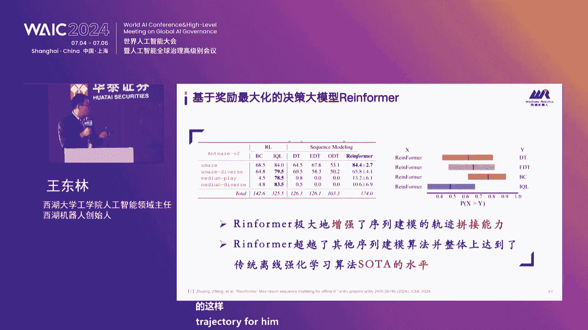

# P29：20240705-论道智能新趋势一华泰证券科技金融创新论坛 - WarrenHua - BV1iT421k7Bv

🎼聚全球智。各位来宾，那个大家上午好，欢迎来到华泰的论道智能新趋势华泰证券科技金融创新论坛的现场，也欢迎现在现场在呃线上在收看直播的各位观众，我是华泰证券研究所科技行业首席分析师黄乐平，是今天的主持人。

那去年我们在这里探讨了人工智能的发展的大模型的发展机遇。那过去年大家也看到，就是人工智能发展速度非常快，包括在各个行业在落地，包括大家非常值得重视的是就是英伟达曾经一度成为作为芯电公司。

成为世界最大的一个上市公司都颠覆了很多人的想法。那今天呢我们呃有请呃来自各个行业的优秀的企业、行业专家重点来探讨AI加医疗呃巨深人工智能AI算力网络等几个人工智能发展领域重点的新的趋势。

呃希望给大家带来一些启发。那最呃在论坛的开始，我们先有请华泰证券执行委员会委员首行信息观韩登通总为大家致辞，有请韩总。各位嘉宾，各位合作伙伴上午好。很高兴能在2024世界人工智能大会上与大家相聚。

欢迎各位出席华泰证券科技金融创新论坛。这是华泰证券第四年与世界人工智能大会深度合作。每一年我们都很期待在这里优秀的科技企业、投资机构，还有学者、行业专家一起交流分享科技发展的前沿进展。

沟通探讨应用落地的成功实践和未来潜在的合作机会。我记得在2022年的论坛上，我们探讨了通用人工智能的发展潜能，及极可能会给金融交易带来的变革。随后的2023年就迎来了大模型的爆发。

引起了各行各业的广泛的关注，并出现了百谋大战和千模大战。进入2024年，大模型的发展进一步加快，一系列各具特色的通用大模型和行业大模型加速迭代。呈现出模态更加丰富，能力不断增强。

开源、必源共存、成本快速下降等特征，并在医疗、金融、教育、法律等众多的垂直行业相具有用力落地，应用空间正在逐步打开。可以说与以往任何的一项颠覆性的技术革新相比。

本人以大目型为代表的生成人工智能技术的发展的迅猛是前所未有的。一直以来，华泰证券都深刻的认知到科技的价值。一次是通过前瞻的科技洞察和持续的落地探索来继续我们创变未来的关键力量。

一次是用科技来牵引公司的不断的发展和超越。在财富管理领域，我们及时洞察和把握了移动互联网的发展的先机，率先推出了掌们财富通，借此实现了零售行业的跨越式的成长。在机构服务领域，我们率先开启数字化转型。

以平台化一体化的路径来探索服务机构投资者和实体经济的新模式，相继打造了FICC大象交易平台、投行云平台、开幕式行资等多个专业平台，提升和放大了我们的专业服务能力。其中。

FSC大象教育平台更是获得了2022年度中国人民银行金融科技发展的一等奖。这也是我们证券公司展获的唯一的一个一等奖。本人深城市的人工智能的滥潮意识，我们也是积极拥抱，积极探索。我们没有寻求重新重新开始。

而是结合金融行业的特点和我们自身的实际的需求。针对通用大模型通识能力较强，而专业能力不足的问题，广泛开展生态的合作。在汇集通用大模型力量的同时，注入金融领域的专业知识和华泰的专业内功。

并快速的推进场景应用的落地，以拥促建倒逼大模型核心能力的建设。目前，我们已经在营销客服、投研研发等8个领域，11个重点场景中初步实现了应用的落地，见到了一些成效，也积累了一些经验。在探索和实践的过程中。

我们深刻的体会到。随着以人工智能为新生产工具，数据为新生产要素，算立为新基础设施的三新体系和产业的加速融合，必将带来类似于新产业革命的变化，甚至影响会更为深远，这种影响或短期或长期或渐变或拓变。

但方向是确定的是不可逆的。它既可能带来行业服务能力的提升，比如爱I加金融，也可能带来行业发展的范式的变革。比如说爱I加医疗，还可能催生和壮大爱尔时代的新兴领域，比如聚生智能和算力网络等产业。

我们也深刻的认知。从看到科技的趋势到发展，发挥好科技的力量，中间仍然有不少的挑战需要跨越，而广泛交流，相互借鉴、合作共赢是一种行之有效的方法。作为一家有着科技经营的金融机构，依托我们对科技的洞察和理解。

利用我们的金融专业的优势和全业互链的资源，做好科技金融大文章，服务新智生产力的发展，既是我们的不懈追求，也是时代对我们的全新的要求。我们希望借助世界人工智能大会这样一个平台，搭建一个互动交流的空间。

共同学习共同成长。本次论坛参与演讲和讨论的很多嘉宾，都是华泰证券长期的战略客户和生态的伙伴，他们将从不同的角度带来人工智能领域的观点和实践，希望能给大家以启发。先行者限制，率先出发勇于探索的人。

将更有机会获得市场的奖励。期待能以本次论坛为契机，进一步加强我们彼此之间的沟通与合作。通过。技术的能力业务的场景和我们客户资源呢持续的对接和深度的融合，共同探索爱I的前沿领域，共同做大爱爱的商业价值。

也共同把握爱I发展的广阔的空间。最后预祝本次论坛圆满成功，谢谢各位。感谢韩总非常精彩的演讲。呃，接下来呢我们第一个主题是围绕AI加医疗来展开。那今天呢有请到西门子医疗大中华区副总裁、临床治疗系统负责人。

曾荣先生结合西门子医疗的实践，分享全球环境内的AI赋能医疗的发展趋势，有其不同。啊，感谢华泰证券的邀请啊，呃，很高兴能够来到这里呃，参加这样一个人工智能大会当中的一个论坛呃。今天跑健就很热，天气特别热。

没想到人工智能更热。但当然人工智能跟医疗的关系是怎么样？我相信大家还是会有点陌生。所以我相信在座很多的呃大家嘉宾是没有太多医疗这种背景，是吧？所以我们给大家看一下医疗跟人工智能结合也会产生哪些变化。呃。

首先看因为实际上对于呃一些比较热的人工智能，包括GP也好，包括 openI也好，实际上他们已经开始了对于AI的一些尝试跟应用。大家看到左呃左边那个vio是实际上是生成了一个个video？

然后大家看到实际上在去年已经完成了他的一个他没有接过任何医学性练情况下，接受了这样一个考试裸考裸考参加了美国职业医师考试。而且他的成绩已经接近了结果。

所以说大家看到他在没有进行医学专业学士的这样一个培训培训情况下，他能通过这样考试。所以说大家很多探讨会不会将来人工智能去替代医生。但这是另外一个top。但对于 openI来讲。

实际上我们包括我们国内的一些专家向中科院的级关院士提到人工智能，他可以将来在一些比如在心脏性的疾结构性当中，他可以通过数字建模来把影像基因动力学等等数据整合在一块形成一个。

人工智能的这样一个数字孪生来为心脏病的诊断跟治疗带来一些大的变化。所以这是我们国内专家的一些想法。大看一下对西门子来讲，但是西门子是一家呃我知道大家了解西门子嘛，可能更多的人对西门子的了解。

还来自于我们的家用电器，对吧？冰箱洗衣机等等。但实际上这是我们已经不做的一块业务。呃虽然大家看到有西门子品牌，但但实际上是我们是跟博已经跟博士呃该共同合作来生产这样西门子的家电。但是我们有3块业务。

一大块就是我们的医疗医疗我们创始人的西门子粉西门子，它是你看他有一个很著名的一个段话，就是仅有想法是没有太大价值。创造创新的重要性在于其实践应用。实际上这也是可以令得到我们现在的人工智能人工智能只有跟。

时间应用去结合它才有价值。所以说我借用这这样的话来做一个开场。对西门子医疗来讲，它有100多年的历史。大家看到实际上是跟两位诺贝尔科学奖获得者有关，一个就是伦琴。伦琴在1895年发现了X射线。

然后西门子在1896年就呃诞生了，就研发出了第一台世界这第一台商业应用的X光机。当然还有一个叫冯贝林贝林是他是也是一个诺贝尔科呃医学奖的获得者。他的呃是因为呃发明了白喉的血清疗法。

当然他也跟西门子的发展历史的有关。我们有实验室的检验的设备。所以在西门子100多年的创新历程当当中，我们有诞生了很多世界第一，包括世界上第一台CT，包括我们世界第一台的超声性动图等等等等。呃。

大家看到这是我们1896年的世界上第一台批量产的这样一个X光机，对吧？我们是在我们的利程当中，尤其是在治疗领域，包括我们1990年创造的全球首个的活食物室。

2016年创造的这样一个机械壁式的一个血蚊障系统。毕及我们在221年推出的这样一个颠覆脑初中诊疗的这样一。五合一的这样一个设备等等。这是呃我们的大概的一个发展的过程。但实际上随着市场的动态的不断变化。

大家看到我们在整个全球市场上看到，尤其是医疗环境，我们需要呃如何去管理更多的老龄化，老龄化病人病人越来越多，同时医疗人员的短缺，对吧？大家看到每个医院实际上是尤其是大医院是超负荷运转。

同医生护士都会面临一个短缺的情况。同时，人老百姓对人类健康自己健康的要求越来越高。如何通过数字化通过数据和人工智能去改变这样一个市场挑战。所以对我们来讲，我们相信个性化医疗会带来很大的一些变革。

因为每个患者他都有不同不同的医疗的诉求。所以个性化的医疗，它能够使我们的诊断治疗更加的精准。同时，卓越化的应用对于整个院来讲，它能够使医疗团队获得更大的赋能。对医疗保健获得更加持续的发展。同时人工智能。

它将赋能于我们的医疗当中，可以使医疗健康的公平性。我们叫医疗的可及性公平性，能够更多的去赋能于每个老百姓实际上，所以问为患者能够得到更好的服务。所以这是我们对于医疗的发展方向的三个想法。

一些数据来看一下西分子医疗的全球的情况。西门子是一个全球的医疗的供应商。大看到我们去年的营收是以216。8亿欧元。同时我们在全球超过70国70个国家有我们的呃直接开展业务。

同时我们全球有超过71000名的员工。呃，我们在全球的装机数量达到了70万套，对吧？当然我们有更多的一些人工智能技术，后面会提到我们分开4个大的业务领域，一块就是我们的影像诊断，就我们在C我们在院内去。

检查常用到的CT啊赤宫振X光剂属于影像诊断。还有一块就是临床治疗，就我负责临床治疗，跟跟跟疾病治疗相关的业务，就回回归到我们这样一块临床治疗翻东。还有一块就是我们的实验室检验，就是我们到医院去验血对吧？

就是实验室检验的这样一个业务。第还有一块就是我们花了165亿美元收购的瓦砾炎，我们在应该是在20两年前吧，两年前收购的瓦联，它是专注于放疗的一个设备。

所以说我们构成了从疾病的诊断治疗到随访的样全流程的个管理。而且这样一个数据大家概到这全球top15的这样一个最大的 medical device company的一个排名。大家看到我们是排在第四。

而且前三面都是做耗材治疗的耗材为主，像美利强生雅培等等。但实际上大家可以到在这些15家的排名当中更多的领域是关注在治疗领域当中。因为大家知道在整个的诊疗环节当中。

从疾病的预防诊断治疗护理花费最多的环节实上是在治疗？每个如果在治院期间更多的治疗花费肯定是在治疗当中，而治疗当中，如何去降低成本提高它的治量也是我们每家医院现在所面临一个最大的课题。

它需要实现更好的结果，尤其是我们在国内现在医保的DD以后实际上对于整个医疗的成本的控制会越来越高。但同时医院的对于整个疾病诊疗的要求也会更加需要提高。所以说这两个如何去达到这样一个平衡。

所以我们的目标是通过持续的创新，通过。一些新的技术来望帮助医疗机构能够提供它的价值。在中国的一些数据，大家可以看到，我们每天在中国大概有超过170万人次来使用我们的实验室来产品来做检验或来验血。

每天都有超过55万人次的人来使用西门子的影像设备，包括我刚提的CT职工振等来做我们的扫描。每天有超过12000名的患者在我们设备上接接受介入治疗。

又呃左边这个re是我们的李强总理向李三昨天也在这个大会嘛。他他在去年拜访西门子医疗总部的时候，可以看到他拜访了我们的这样一个总同时，我们的董事会的成员陶林女士也用中文经流利的进行交流。

所以这也可以看到中国跟德国之间的合作还是非常的密切。我们具体来看对吧，如何去面对呃疾病的挑战。因为对于我们呃西门子来医疗来讲，我们的目标是为危害人类健康最重要的一些疾病来提供完整的解决方案。

这里提到的三个方向，一个就是癌症。有癌症的高发，对吧？尤其是癌症对于各个。老百姓的这种压力，以及我们医疗体系带来的压力。所以说如何去攻癌症，对吧？第二就是神经血管疾病对吧？脑血管的疾病、初衷等等。

还有一块就是心脑心血管疾病、心管疾病也是从心梗啊等等的一些新结构性心脏病等等。对于人类的健康是带来很大威胁。所以我们通过的我们最后我们的最佳的医疗的解决方案来助力国家医学精心的建设来面对这些疾病的挑战。

当然在疾病整个医月当中，实际上你会可以发到发觉数据是最大的一个一个流动性，尤其是在每天的影像的设备上会产生巨大海量的数据。我们提供了一个一站式的这样一个通过数据的整合，对吧？

提供一个异构性的这样一个数据库，把医院生成的这些数据形成了一个很好的一个数据化的结构，来赋能医疗的一个高质量发展。后面我会具体提到如何去用这些数据来构建这些人工智能的一些算法。

我们在人工智能实际上已经有了很早的一个布局。大家看到我们实际上是一直在布局于人工智能。同时在数字化人工智能是走的非常前沿的。我们有经有超过1000项的人工智能相关的专利。

同时已经有超过65项的人工智能的产品已经在上市。同时大家看到因我们掌握了很多核心的临床数据超过15亿条。呃，我们在普林斯顿有一个一个超级算机来帮我们做AI的试验，每天大概也完成500个AI的试验。

同时我们可以看到首个生成式的AI已经产生了。就我们通过这些数据的不断迭代，产生了很多跟医疗相关的人工智能的一些算法。当然人工智能如何去构建这样一个医疗的人工智能。

我们觉得从四个方向去看第一个方向人工智能加设备对吧医疗设备，使影像设备和检验设备的更加智能化。第二个方向就是人工智能去跟临床的流程去挂钩。通过人工智能来地地态代替百。医生百医生80%的常规的工作。

因为实际上医生每天的工作特别繁琐，尤其是在放射科区乐片对吧，他工作非常繁琐，如何去减少医生的错误率。实际上，实际上可以通过这样一个人工智能来贯穿他的人全流程的管理。

第三个就是人工智能去结合一些关键的临床决策。因为在很多情况下，医生的一些临床决策也好，或者术前的规划也好。如果有人工智能参与的化，可以很好的去提升整个诊断跟决策的一个准确率。

那第三个最后一个就个是我们最终想实现通过人工智能来实现整个全生命周期的一个健康的管理。所以这从这个四个方向给大家介绍一下人工智能的应用吧。第一个相对比较简单，就是人工智能跟设备的整合。

大家看到我们上市的几乎所有的产品，从CT时共振分子影像到X光机实验室检验，我们的血管障系统都已经涵盖了刚才我们提到西门子自己研发的全套的人工智能技术。

也就意味着在我们设备当中已经完全嵌入了这样人工智能的产品跟软件。

第二个就是如何跟呃流程的去配合人工智能怎么去嵌入到赋能与整个临床的全流程。大家看到从疾病的流呃流程来看，是从疾病的预防早塞到诊断到治疗和监测到随访。所以是这是整个疾病发展的一个过程。

也就是他是一个患者从临床过程当中，他参与的这样一个整整体的过程当中。所以说通过AI能够赋能于临床的每个环节，他可以用一科研，可以用于临床信息的整合，可以用我们的一些高级的图案处理程序来进行图像的诊断。

最后形成一个结构化的报告，为临床医生的做治疗来做这样一个判断。大看到比如说我就举一个例子，就是一个我们叫一个MDT的360的这样一个全流程的临床的管理。比如说一个外科医生在他在手术室内。

可以通过我们MDT的这样会议室的一个架构，通过数字化的流程，他可以实时的看到病人的一些各种各样的信息，包括的一些常规的一些信息，包括他的病史。

等等常规的检验等等。第21块就是他可以支持把所有的病人的相关信息，包括超声CT影像、内镜、病理、心电图等等数据可以呈现在他的手术大屏当中。但第三个最重要就是把这些数据它可以整合的一块。

我们有一个叫的一个信号的一个处理系统，它可以把这些信息可以就进行一个实时的重建，包括它三维的大看到有个心脏的一个三维结构，还可以把更多的龙像图像融合在一块，包把CT或者是超声图像可以融合在一块。

这样的话使整个的疾病的诊断，最后形成一个很好的结构化的报告。也就因为在手术室内医生可以获得他所需要所有的影像信息。来帮助他做一些进一步的在术前的一些计划，术前的诊断，以及一些手术的规划的路径的设定等等。

所以这是一个通过人工智能来获得一个全流程的一个数据化的管理。实医生能够在临床当中获及他所有的信息，同时可以通过人工智能技术来帮他自动的做处理啊，不因为临床医生他需要是一个结果，对吧？

他不单单需要不会去看这些非常基本的数据。我们可以把这些结果可以整合在一块，形成一个可以有助于做把它做判断，帮他做手术的一个方法。当然，临床的关键决策。第三个方面就是临床的关键决策。

就可以看到我们已经有超过100项的基于人工智能技术的临床应用。它是嵌合在我们的整个总整个疾病治疗诊疗的环节当中去的。比如说在肿瘤方面，我们有29个专用的软件。在心脏方面有没有13个。

在神经方面有8个等等。对。所以我们已经把跟这些人工智能就是跟临床相配套的，一定是要驱动临床驱动性的。所以刚才我最早提到就一定要有临床实践才有意义。对吧？

所以说把这些人工智能能够跟临床的这些所有的疾病相关的诊疗去整合在一块，这才有它的价值。所以这也是人工智能真正赋能与临床赋能于临床的关键决策起到重要的作用。而不是说零工人工能是一个单一的东西。

它一定是跟他的临床的决触，跟疾病的相关诊疗需要结合在一块的。当然我所以我再举一个呃呃举一个病例吧，就是一个呃初衷对吧？我大大家知道导初衷是一个危害呃，健康最重要的杀手，尤尤其在中国。

一些数据实际上非常可怕，但中国脑卒中的发病率大大概是每年有超有超过390万，死亡人数达到288万。也就因为中国脑初呢患者是全球最高的，但实际上脑初中是一个可以救治的一个疾病。

也就是意味着如果你在4小时的黄金窗口期能够得到救治的话，这个患者实际上是可以救回来的。而且基本上可以没有后遗症。但大家看到现在反而中国的情况就是耽误时间特别长，在整个的诊断跟治疗环境当中。

耽误时间非常长，对吧？就形成这样一个脑初中的患者的死亡率跟自残率是应该是全世界最高的。就以如何去改变这样一个脑初中的诊疗的流程。

通过人工智能来赋能于去提升它的这样一个人工智能的提升一个脑初中的一个全流程的一个改变。所以说我们有一些很好的技术应用于这样一个人工智能的初中的救治。大家看到刚才我提到这样一个设备，但设备是它是一个。呃。

一站式的一个脑初中的管理的一个设备。他可从诊断可以治疗。大家看到通过这样一个系统，他一个患者直接可以跑到手术室，不用再经过一个急诊的各种检查，他直接可以跑到手术室，通过人工智能扫描。

大家看到它可以产生这样一个呃CT的图像。这样一个C统呢，它可以使医生在手术室内直接就可以去判断他的脑出动的一个情况，对吧？出血对吧？他的脑侧侧激循环的一个改变等等，可以帮助医生指导手术。

但还有就是我们一体化的CT加。CD这是1个CT加一个治疗设备的整合，我们叫一个的也就因为病人实际上直接动急诊，直接进进入手术室，通过在手术室应的1个CT的一个一个图像的扫描，再加上血管造影。

可以立马进进行他的诊断和治疗，同时把两个影像可以叠到一块。大家看左面我们把CT的磁功内的灌可以整体的覆盖在一块。这样的话医生直接在手术内马上就可以获得信息。同时就可以开展治疗。

通过这样一套设备的整合加人工智能技术，我们可以把呃医学上有个时间叫叫DNT时间，DNT时间是我们目前国内至少要超过1。5个小时以上，通过在一些人工智能加设备的辅助，我们可以最快达到15分钟以内。

就可以开展完全手就可医生就开张手术。以说可以是把脑卒中的时间可以缩短到一个非常极致的时间，大大的为道初中的患者的救治带来一个极大的一个方便。同时也就是意味着。使更多的脑出中的患者可以得到一个及时的救治。

所以说人工智能技术可以附等于很多一些危重症疾病的一个诊疗。当然第第四个方面就是AI和全生命周期健康管理的这样一个融合。刚才我提到从医院端有很多数据的生成，包括营像设备、临床的一些设备以及异构数据。

我们有这样一整套叫的一个M的系统分布式集合来把这些异构性的数据完全应用整合在一块。然后最终去赋能临床临床的一些多方的择，多院去的合作，多维的一些科研等等。但最终的目的是什么？

最终我们希望把这些所有的数据打破这个数据过道共建每一个患者的一个临床的数据模型。这才是一个最终的目的，也是最终去围绕一个全生命周期的管理打造。当然这里边最终是为数字孪生来奠定一个数据基础，对吧？

都退我们道大家了解吧。因为数字孪生实际上是在医我觉得在医学当中会有个巨大的应用场景，也就因为这个有一块没显示出来。对于数字孪生，所谓数质孪生，因为现在随着我们检查的设备，检查的手段越来越多。

我们可以得到人体几乎所有的一些数据，包括人体的一些解剖学数据，包括它的一些细胞学数据、基因学数据等等等等。我们可以通过数字化手段把它构建出一个跟你一模一样的一个数字孪生，数讼孪生。

来比如说我这里举了一再举个例，就是一个数字化的完成心脏，数字心脏。因为现在我们可以通过我们CT磁共振超声等等，我们可以获得一个人体心脏的所有的数据，基本上包括机械性能，包括电生理性的。

也就意味着患者的心脏的尺寸，电信号的呃电信号的程度，它肌肉的收缩，它的射血分数压力等等，大膜粒运动等等。它可以通过这些数据，我们获得的所有的临床数据构建出一个跟你一模一样的人数字化的心脏。

再样一个塑造心脏心脏有什么用呢？你就可以去判断这个你可能会潜在的一些疾病的风险。首先这是第一步。第二步就可以对一些你要如果一些有器质性心脏性的疾病，你可以去做一些数字化的一些去干预。

我通过去判断哪种治疗手段是能适合你这个心脏的心脏。所以这是数字男生的一个很大的一个优势。我就是说这里就是国外已经有开始类似的尝试，在应该在海德堡大学，我们跟呃心医疗跟海德堡大学一一一同来做这样一件事情。

就是通过刚才提到的数字化男生的心脏，来模拟整个心脏的一个一个一个结构，所以对于这样一个要开展他当时有一个病例，就是他要开展一个呃双腔起搏器的植入手术。因为对一个心律失常的患者。

他通过植入一个双腔起搏器来进行整个的心律失常的治疗。但实际上在有些情况下植入物以后，他。一定会有一个效果。实际上因为每个人的一些成像的病理不同的话，所以说他的治疗的效果会不同。

所以说通过这样一个数字化的行果，你可以首先模拟这个手术的效果，从而判断这样一个手术，对他有没有一个反应，有没有一个效果。从而避免了。因为大家知道一些植物的呃首先它的是一个高质的耗材，对吧？价格非常贵。

同时它也是一个有创的手术。所以通过这样一个模拟的数字化的孪生的心脏，就可以去模拟这样一个手术的过程，以及去判断有没有对这个手术有反应。所以说通过这样一个这虚拟的方法。

可以有效的去为医生他的诊疗方案做一个很好的一个重新的评估，这就是人工智能带来一个巨大的变革，为我们每个人的人个体来选择一个个性化治疗的方案。当然说的话在临床延伸会更多的一些应用，包括呃虚拟现实，对吧？

大家看到实际上这里边已经有了很多的虚拟现实。这个电影视频当时没放出来。sorry。这放里当中应该有个视频没放出来。因为实际上这里边我们把原宇宙技术，从AR跟VR系统也也应用到临床当中。

尤其是对于呃培训来讲是非常有用的。我们可以通过这样一个呃虚拟现实的技术，把人体的所有解剖结构非常直观的显示出来。所以对于医学院校的或者医生的这样一个前期的培训，会带来很大的益处。

当然也应用到临床临床的一些手术，对吧？我们已经把虚拟的这样一个现实技术已经用临床的手术当中，这是一个外科手术的一个视野脑血管的一个手术视野。它已经把一些我们通过这样一个VR的显示技术虚虚拟现实技术。

把更多的一些影像信息跟他的实时的外科的视野可以整合在一块。这样的话为整个医生的手术的准确性带来很大的一个提升。我们在国内也开展了一些临床应用的尝试，包到我们把CT的一家全CT加CT影像。

将全息的仿真影像以及实时的映测技术应用到了外科的手术当中去的医生在手术期间，他通过这样一个呃全息的仿生技术以及映射系术可以实时的看到整个人体的一个解剖部位的情况。所以说为整个手术对吧？

成功啊带来以及减少他的并发症带来很大的一个便利。所以说通过心化现实，这样来会有更多的临床的应用。所以说总总结来讲，就是说呃对于人工智能赋能人工智能赋于医疗来讲，它会有更多的独一无二的叠加的优势。

我们希望通过这些技术整合数字孪生，最终为精准医疗来带来一个更大的一个帮助，来从而抗击危害我们人力健康最危险的一些疾病。最后就给大家一个视频看一下我们接下来智能化首都史的一个未来。

In the future， interventional suites will become intelligent rooms。

 cognitive therapy suites that enable procedures to become faster， safer， and more precise。

🎼Guided by digital and virtual technologies， physicians will have clear and immediate access to vital patient data with a gesture based system control。

 physicianics will see all the information and functionality needed quickly and simply at their fingertips。

Image guided procedures will be supported by technologies like augmented reality。

 allowing for more accurate interventional guidance。

 vital in complex treatments such as ablation therapy。When necessary。

 the intelligent digital therapy suite will even protect medical staff from avoidable radiation exposure。

A floor heat map will clearly define where radiation and scattered radiation are affecting staff and where not。

Intelligent digital therapy suites are designed to improve outcomes for patients。

Keep procedures as short and minimally invasive as possible。

This is how we want to transform care delivery for interventional therapy in the future。好，谢谢大家。

那个谢谢普总非常精彩演讲，给我们看到了那个AI加医疗，包括元宇宙这些技术啊，怎么改变我们的医疗的情况。那下面一个话题非常那个有意思啊，就是那个巨深人工智能。那人工那个机器人这件事情大家讨论了很多年啊。

就是说这一波又迎来了包括那个斯la将很多新的产品又迎来了一波新的机会。那到底是是不是机器人能够像人一样，将来和我们互动，到底他产业化进展怎么样？那我们今天很有幸请到了西湖大学工学院人工智能领域的主任。

西湖机器人的创始人王东林先生为大家分享巨深人工智能领域的发展趋势有。呃，刚刚蒲总呢分享是AI加医疗。我这儿呢是AI加机器人啊，所以今天非常高兴啊，能够分享巨深智能的发展趋势。😊，呃。

要了解具身智能的发展趋势。首先我们从居身智能的起源开始。那最早的话这个可以呃追溯到1991年啊，bro斯的这个intelligence without representation呃representation里边提到了智能行为可能无需复杂算法。

呃直接来自于机器与环境的简单物理交互，这是最早的跟巨身智能相关的啊，只有这么一个描述。呃紧接着呢到了1999年呃在呃这个understanding intelligence这本书里边呢提到了强调了这个身体也就是body在智能中的重要影响。

呃，到2005年呃linndasmith啊提出了著名的呃这个具身假设三条原则，呃，强调了认知过程中，身体也就是body与环境交互的重要性。呃，2005之后呢，一直到2022年底大模型的出现。啊。

迎来了这个巨神智能的呃一波这个呃爆发。那么在呃。呃，2005年的这个密斯的三条呃具身智能三三个原则。第一个原则呢强调了。呃，强调了具身智能系统，就是EAI系统不能依赖预定义的复杂逻辑。

面向specific task或者specific scenario啊，然后呃原则二呢就是EAI系统需要具有进化学习机制。而这个进化学习机制是面向环境的进化学习机制，所以也就是强化学习啊。

需要进化的强化学习。原则三呢是是说环境非常重要啊，对于无论是物理行为还是认知机构啊，都是非常重要的。那么在此之后就到了大模型。那到大模型出现之后呢，这一年多不到两年时间，大模型逐步被引入到机器人领域啊。

到了具神人智能。那由此产生了我们开始从传统的机器人去研发啊通用的机器人这样一件事情啊，呃那是不是大模型就是足够的呢，我们再回过来看，整个的三条原则。对于三条原则来讲，大模型本身具有的通用能力。

解决了或者说部分解决了原则一啊，就是通用性。而对于第二条进化学习机制面向环境的进化学习机制。这个呢也需要其实就是一个策略网络。那么在这个策略网络其实也就是一个强化学习啊。

就是进化型的适应性的这样的强强化学习的策略网络。第三个点呢强调了环境。对于环境来讲，第一是构建虚拟环境。对于机器人来说啊，构建虚拟环境非常重要。第二就是虚拟环境。对呃。和真实环境之间的差异问题啊。呃。

那么今天我的这个talk呢会按照三个方向，就是刚刚提到的三个方面。第一个呢会讲大模型。第二个会讲强化学习。第三会讲symere。那么从大模型开始，跟具身相关的呃，非常关系性非常密切的。

一个是多模态的大模型，一个是多模态的动作大模型啊，或者叫机器人具身大模型，而这些大模型都是跟原则一紧密相关的。呃，再回到这个剧身智能的发展整个的链条。我们看来呃，它是从语言模型开始，最后到多模态模型。

最后再到多模态的动作大模型。那么首先再来看这个多模态模型的话，多模态的模型呢在比较呃。具有代表性的包括open aI的G，后边呢到G four v啊，以及呢微软和UWM发布的lava1。

5以及到lava1。6啊，包括谷歌的man1。5这些呢都是非常具有代表性的比较大的这些这多态大模型的工作。那其实不仅于此，在这个基础之上衍生出了大量的多态大模型啊，以这个拉ma为例。

我们可以看到衍生的方式一共有两种，一种是持续训练的方式叫continue training啊，这种方式举个例子，比如说呃呃用于中文只要加上中文到了这这条分支。

加了中文之后就继续训练可以拿到chese的或者是open chinese的等等一系列模型。另外一条分支呢叫instruction tuning主要是在模型继承或者是数据继承啊。

通过这种方式产生了大量的模型。比如像。迷你的GP four以及pandaG等等这些呃大模型的工作。那进一步的大模型的这些工作又被引入到巨神智能领域。到了巨神智能领域之后，我们看到这是一个例子啊。

就是大家都非常熟悉了，是open的模型用于fire这个机器人之后，大模型用于机器人的一个具身应用。那么我们看到它这个层数呢上面是一个open的 model啊，这个就是一个大模型open大模型的输入。

主要是图像和由语音转化出来的文字。那么它可以因为这个模型呢本身具有短时记忆的这样呃的能力，能够处理历史的对话信息。通过呃能够反馈出来文字，并且生成动作的策略。

然后把这个策略传到下层的 neural network policy啊，对于这个policy呢呃可以输入是纯图片，输出就是动作，这样就是一个policy的work啊，最终用来执行。

这是大模型用在巨神智能领域。是呃用在这个计深智能领域之后呢，存在一些问题。最突出的问题。我们看到这个从呃这个语言大模型可以的增加模态变成多带大模型。那多木态大模型可以用于巨身智能。

但巨身智能领域的比较突出的现在两个问题。一个就是推理的速度不足，导致非常慢。另外一个呢就是操作精度不够，这也是现在限制呃能够到工业场景去应用的一个非常大的一个短板。

那么我们先看第一个推理速度不足的呃这样一个问题。对于推理速度不足的解决方案，有可能解决方案，主要是在架构上进行优化。

我们也知道现在的大模型都是以transformer架构为主体的trans架构呢包括了呃呃主要的一个特点就是随着token数的增加，那么推理速度会增加。所以它延时会增加。

这是它的一个nature决定的那现在的情况之下，大家也探索了很多像ma架构呀，主要是state space model这一类型啊。还有像MOE啊这些类型架构。那么在这些架构呢更加的呃效率上更高。

那么在这个基础上，我们今天要介绍的具体一点呃主要是从mava架构到多模态ma巴架构的这样一个工作叫cobra，因为时间关系因为这些系列的工作特别多，我们只能呃介绍一些典型的工作。呃，先看第一个啊。

这也是这也是我们团队的一个工作了啊，就是基于mava架构的一个多模态的这样一个大模型。这个模型呢在你对语言的处理，以及对图像等处理几乎不变的情况下，只要套用mava的整个的back这个架构。

那么不仅可以实现整个的性能呃呃这个competitive最主要的它的一个能力呢是在在推理速度。它这个推理速度呢能够呃在相比transformer的话能够达到呃4倍以上呃大家可以看到这个是一个cobra和lava。

的这样一个推理速度的对比啊，应在4倍以上。呃，除此之外呢，他们在呃很多的这个像cora在视觉幻觉克服一及空间关系判断等等方面呢表现的更加出色。啊，比如就是这上面有一个图，这里边因为有一只一只狗。

而且还有一个自行车，这样的一个例子里面是具有这个空间关系的。对于这种空间关系来讲，cobra的判断要更胜于transformer架构的呃拉va呃。那么在这个呃呃ma巴架构之上。

可以融合进一步融合MOE架构这一部分呢也有很多的工作。包括像MOEmava呀以及这个java呀啊，就是把这个ma巴架构呀，包括这个这个ma巴加MOV啊transformer呀。

所有的架构都可以融合在一起啊去做，这是架构方面的创新。但是是不是到这儿就呃就到终点呢，这个不是重点。对于机器人来讲呢，架构的探索，还一直在在继续在往下走啊。

就是整个的这个因为一直在探索这个更有效的更有效率的这样的架构。呃，那么第二个问题，刚刚提到的主要是操作精度不足的问题。对于这个问题呢，主要是现在的这个犀力度的这种感知的呃精度不足准确率不足。

那么如何来提高呢？呃可以叫物理空间的建模，也可以叫空间智能。这里边呢呃也只是列举了三种比较代表性的呃这种方式，其实还有其他更多的这个方式在在这个领域。这边再有一些进展啊呃呃今天我们介绍的呢就是三个方面。

第一个是动作轨迹的引入或者动作轨迹预测理解规划等等啊，主要是把动作轨迹引入。第二个点呢就是空间关系的理解。这里边包括了机械手臂或者是机器人跟物体之间的关系啊。第三个呢就是引入3D的信息啊。

我们再看第一个第一个里边呢是这个轨迹预测，这也是我们团队的一个呃新的一个工作啊，如果是只看上面第一部分tage one的话，那我们可以看到这其实能学出来的，是通过大模型学了一个空间的对齐啊。

是通过大模型输出得到 hidden representation之后，可以过这个词的m拿到语言，同时呢也可以过这个localization的projector拿到图像对应图像中的物体的位置。

所以这样就把语言和位置给对应起来。这个实现了空间的对齐。那这个对于视频来讲呢是不够的啊。如果是像视频输入的话，对机器人肯定最后都是视频输入。所以视频输入的话，最后呃这个要做到的是时空堆砌。

同样大模型过来之后呃，拿到here呃，过这个词的m拿到语言过这个trajectory的projector可以拿到轨迹。所以这样从输入语言可以预测出来轨迹呃跟我们这个非常相似的啊，就是相似的一个观点啊。

我们这个先看它整个的这个性能。这个呢在大在这个下游任务上去部署的话，这个性能会得到一个大幅的这个提升啊，然后这个进一步再往后走。就是这个轨迹预测那个讲了轨迹预测。

当然在这呢我们不得不提的就是一个po是作为coingb的轨迹规划的呃这样一个方式也是把轨迹引入在整个过程之中。呃，跟我们更相似的是呃这样一个工作是轨迹轨迹的预测啊。

也是通过一个transformer架构对整个的视觉进行预测。把轨迹拿到之后，后边又跟了一个呃头啊，跟了一个head，就是policy的派，那么把这个轨迹预测拿到派，最后输出action，这个特别像规划。

就像MPC一样，我们输出一串轨迹，最后呢再挑选最近的这个呃这个动作啊输出呃这个都是非常类似的啊，这个工作都是非常类似的做了这个轨迹的预测。那么第二种方式呢就是空间的理解。对于空间理解。

这个这儿也有一个工作，讲的是首先我们可以从动作的空间中采样大量的动作，这些叫后选动作，用这个候选动作呢可以进一步的映射到图像和label啊，这样拿到这些候选的动作之后。

我们进一步通过VLM也就是多模态模型的呃提问的方式去选择最优的动作，最后用来执行。所以在空间中会有大量的呃它包括这个这些这些手臂末端的位置和大量的这个这个呃objects之间的这样一个关系存在。啊。

通过这样的方式来提高操作的成功率。呃，然后呢就是1个3D信息。到现在为止，其实绝大多数的在具神智能领域做的工作都是呃2D图像的输入。为什么呢？因为数据集非常丰富啊，所以到了3D之后呢。

就是缺少很多的数据。那么呃现在呢也有很多工作去做的，就是把这个2D去加入深度信息或者预估深度信息得到3D用3D之后，然后再用大模型的形式来进行处理，这样也可以进一步的提高成功率。

那这些工作呢都只是空间智能里边探索性的一部分啊，和还都在持续的往后再发展啊，然后呃讲完了这个多模态大模型之后呢，我们要看多模态动作大模型，呃。

这个多模态大模型呢本质上还是一个在这个呃做的是一个大脑层面的感知啊以及规划。最后加上一个头去做执行。到了VOA的话，多模态动作大模型，最后的输出，就是动作本身。呃，我们可以看到左边这三部分啊，分别代表。

这个视觉代表着这个呃语言就是transformer大模型的这些模型，代表着强化学习，说明整个的多模态动作大模型相关的领域就有这三个方面，就是作为基础来讲。

无论是视觉语言还是强化学习都是必不可要必不可少的这些重要部分。那么对于VOA呢比较这个呃比较早的就是谷歌提出的RTERT2那后面呢用后面呢还有用deus model呃进一步在做这个VA的一些工作。呃。

在这儿的话比较具有代表性的这种多模态动作大模型。像谷歌的RT two啊这个 fllamingo啊这些工作呢都是在机械臂上实现的。为什么因为机械臂上有丰富的数据啊，然后。那在这个其他的包括组师机器人上。

这类型的工作呢会。少一些啊，这个是我们团队的做的面向足式机器人，也就是四组机器人的一个动态动作大模型，叫quat也好，叫quaq VLA也好啊，就这样一个模型呢呃整个的架构。

其实跟谷歌的RTYRTwo没有太大的这个差异，除了维度上的差异之外啊，其他的都类似但就这样一个工作呢，它最主要的一个点是用仿这个工作主要验证了仿真数据。最后的仿真数据的这个可行性。呃。

这个8B的Qu的一个模型用了27万条的仿真数据，加上3000条的真实数据，甚至把3000条的真实数据去掉。这个效果其实差不了太多啊。

所以主要就是通过仿真数据是可以让这个机器人在呃具备这样的运动语义理解、感知导航操作啊，包括任务的执行环境适应等啊等方面表现的呃优秀。呃，所以这个呢也是第一个在验证了大量的仿真。

数据有效的呃这样一个工作啊，然后。呃，我们可以看到他的。呃，这个图像呃这本来有一个这个视频啊，但这些视频是看不了这个呃能看到呢比较在hard level就是在这些复杂的这些任务上啊。

同时像第一个呢是可以把背上的球卸下来啊，卸到一个pin的这样一个框里面啊，它是可以做感知导航包括实物操作啊，第二个呢是有B障在里面，它也是一个多任务像感知导航B障等等。第三个呢是这个感知导航环境感知。

它可以呃在自己的自身的姿态上降低姿态穿过比较低的这样的空间啊，就是这样都是一些对于四组来讲，各种的动作基本上都涉及到了。那第二个点呢我们讲的就是它的泛化能力。

这样一个模型VOE的模型最后会表现的让机器人在整个的机器人在任务过程中出现这样的一个泛化能力啊，就是在没有见过的叫 objects上同样可以识别，同样可以完成任务啊，然后在。之后。

这个是在四组上的数工作。后面呢紧接着这个呃美国那边呢就有一个工作是做在了同样的也是用仿真数据做在了人形机器人上啊，然后但这个模型的比较小啊，反正也是一个transformer，最后用了大量的仿真数据。

最后可以做各种的行走基本的呃这些呃运动。那么到现在为止，我们所有用的数据都还是最佳数据，或者说是这个呃呃叫呃最优数据，那能不能后边有一个问题，就是我们能不能把自由的这些数据给用起来啊。

就是呃去做同样的做机器人的训练啊，当然是可以的。如果用自由数据，就是不仅是最优数据，包括自由数据也用起来的话，那就是强化学习啊，要引入强化学习去做把最优数据，自由数据，最后有有这个reward。

然后去实现。这个所有数据的这样一个训练啊，呃在这个地方呢，我们也是搭了一个MOE的架构。为了提高整个的效率。最后的结论就是我们能看到呃。

就是这个模型呢叫G12M啊在在这个情况之下呢呃就是我们发现在激活参数量变化不大的这个情况下，MO一架构是能够有效的扩大总体的这个参数量啊，而且引入次优数据之后，这个性能是呃大幅提升。

所以在后边的发展过程中，我相信大模型里面会有大量的工作会把自由的数据给加进来啊，用强化的方式来进行训练呃，然后这是讲完了大模型大模型刚刚一直在强调大模型只是保证了通用的这样一个能力啊。

那呃基于准则或者原则二呢强调了一定要适配到当前环境。对于当前环境有一个适应性的这样一个学习机制啊，所以在这儿呢我们讲一讲适应性的强化学习。在强化。这个点上，我们团队做了大量的工作啊。

你要围绕着像样品效率的低下以及策略呃，通用性差差呀等问题，做了大量的工作。时间关系呢我不会讲那么多，也就是呃主要讲跟大模型相关的三个方面，一个是人类反馈强化学习，大家都很熟悉。

它是把呃GPT3变成cheGPT最重要的这样一个工具啊，所以人类反馈强化学习。后边呢包括最会讲到决策大模型以及这个通用的模仿学习。这三者都是跟呃大模型密切相关的这些工作。呃。

第一个呢就是讲这个叫人类反馈强化学习。人类反馈强化学习。里边呃这里边有好几种方式啊，首先通过这些数据，数据可以去呃去推理reward function，就是奖励的功能函数。

这样的功能函数呢会去具有一些问题。另外呢我们也可以去直接构建reward model啊生成re model的呃同样也会产生一些问题啊。无论是说开销还是in bottlene有这些问题之后。

那自然就想到了我们这个要做一个叫奖励无关的人类反馈强化学习啊，就是呃这个呢也是我们团队在国际上第一个提的叫OPPO那这个工作它的本质就是跳过了奖励函数或者奖励的function的估计过程。

直接建立呃最优的引变量，最后只要估计出来中间最优的引变量。那么最优的策略也就已经实现了。呃，紧接着在这个reward free的概念re freeHF概念基础之上呢，呃ford的。

教授也提出了呃DPO是把这个re free强化学习用在了大模型上啊，那在这个大模型里边，它的一个核心点就是在GPT3叫拍FPT呃3的基础之。

如何引入奖励函数R让它变成最后的拍啊有这个关系之后进行推导就可以把奖励函数最后的在 function中最后把奖励函数给换成最终的呃这个策略。

也就是大模型呃在DPO之后呢呃大家要做的一件事情就是能不能再进一步简化啊呃像后边的紧跟着的工作overRPO进一步把这个减少了reference的这个这个reference model减小减少之后性能得到进一步提升跟这个比较类似的一个工作呢是最近的出的一个呃也是这个陈担奇那出的一个工作呃叫SPO这个SPO呢就是像DPO的这个工作。

我把呃整个的策略函数拍REF最后换成了label啊，就是变得这个lo变得更简单，但是效果变得更好啊，这是整个在人类反馈强化学习目前的进展就到现在这个阶段另外一块呢就是序列建模就是整个的从强化的角度。

他用最优和次由的数据，也可以训练transer架构的模型对于这块来讲，就是上边的这些是传统的强化学习方法，包括PO也是我们出的一个工作。

那最主要的我在这要介绍的是像de transformer类似的这种架构，像digntranser呢它就是呃需要的东西叫奖励的回报啊，其实return奖励的回报，只要引入奖励回报。

最后就可以输出a这个点上在 transform之后又产生了很多应用的变体包括用于通用的游戏啊，包括用于把这个历史轨迹动态进行调整，也有。有这个利用未来信息去学一个黑学一个Z。

然后加入这个transformer进行学习。最后包括这个用cittic网络，其实也就是直函数网络进一步去指导，这些都可以有效的提高呃整个像这个序列建模的这一类的性能。但是呢这些都有一个问题。

就是忽略了奖励奖励函数的核心目标，它是要最大化这个奖励的。所以我们这边我们团队出了一个工作啊，叫呃reinform这个reinform呢也是第一个去做这个奖励最大化的决策大模型。呃。

它最重要的核心思想就是第一步呃从当前的状态去估计最大的呃最大的这样一个奖励，然后用这个奖励在输入去估计到action。呃，这同时呢调节了最后的lo function。

那么在这个呃这个方法呢其实是后边又做了一步最一步的理论的证明，是证明这个方法是可以去实现maxax return，就是最大奖励最大回报这样一件事。呃，最后我们的结论就是其实在强化相比于模仿也好。

相比于呃这个大模型也好，它最大的特点，尤其到机器人领域，它最大的特点就是增强了轨迹的拼接能力。也就是说我今天学习了走路，明天学习的跑步。那么我强化学习就可以学会从走路到跑步啊。

可以把整个的轨迹给它拼起来啊，这是强化学习最大的这样一个特点。呃，呃第二呢就是inform整个的这个性能在这个序列建模里面当然是做到了最高这样一个状态啊，呃。

后边呢我们再简单介绍一下这个模仿模仿呢其实比较简单啊，模仿整个现在大家做的主流框架transform架构去做呃，这样一个模仿就是视频看视频，然后输入最后模仿整个的视频动作。

这样的过程本质上是在原始空间实现了对原有策略的一个匹配啊，就是最终我们输出的策略和本身收集数据的策略，在原始空间进行匹配，就可以做到。

这样一件事。但这样的事情呢是没有通用性的。所以为了增加这个通用性。我们团队提了一个工作，是在通过原始空间和隐空间双重空间的匹配来实现的通用的模仿能力。而这个模仿呢是可以做到8种的。

比如说我有动作或者没有动作，这种状态。哎，包括这个cros may等等的one shotzero shot这些方式都可以做到这个模仿啊，然后这个呢就是整个的强化学习部分。那强化本身呢。呃。

好像出了点问题啊。O。好，没关系啊，其实我现在已经讲完了呃两大部分了，最后剩了一小部分啊。对。啊，我们前面其实是我那我趁这个时间可以稍微回顾一下啊。第一部分讲了这个大模型啊。

主要是动态大模型以及这个动态动动作大模型。这个呢是跟我们的原则一有关。呃，然后呢后面紧接着讲了这个强化学习，是跟原则二相关。最后一部分呢会讲smme呃，是跟原则三有关，主要是环境的问题。呃。

在这个呃呃第三部分呢，其实我们主要讲的还是对于整个的策略学习策略如何去呃做到呃这个呃克服symme问题呃，包括鲁棒性，包括这个。

OK呃smme也就是通过软件和硬件两个角度啊的耦合来解决，或者是呃来减轻这个symme问题啊。整个的这一块呢，对于原则三就是环境这一块非常重要呃。呃呃在这儿呢我们的这个要介绍的几个工作呀。

主要是学习策略跟控制可以结合，跟感知也可以结合，跟控制结合呢可以去克服仿真环境真实差异问题啊，叫叫这个另外呢包括对奖励函数的设计的依赖问题以及最后这个机器人部部署时候的鲁棒性问题。

最后呢简单提一下这个安全性的这个问题啊。那么第一个呢我们要讲的是呃其实是通过呃前面呢会输出呃这个呃策略策略网络会输出动作。有动作之后讲的是如何去调节PD的conter。

也就是PD的控制器PD控制器里边呢有一个参数叫KP那么通过机器人跟环境的交互，是这个KP是可以自适应的进行调节，得到一个taP这个地方叫KKU一点啊，就这个只是自动的可以算出来。

所以这个呢本身的核心就是快速它去快速自适应啊这个。不需要训练，可以去做调整的。呃，然后在这儿呢，其实做了大量的这个实验啊，包括位知大负载呀、位知扰动呀，各种大的比较这个地形的变化啊，然后呃。对。

这儿有一个视频呃，展示了整个这个无论是刚刚说的大赫呃这个载鹤也好，包括地形的变化也好啊，这个比较长啊，我只能一会儿就跳过啊，对各种地形下的这样一个呃动作吧。

嗯呃这个工作呢本身就是克服这个机器人在真实环境下呃，交互的过程中产生的突变啊，如何去快速的进行调整呃，这样一个。方方法。第二个呢我们要讲的是这个呃学习策略跟模型预测呃控制的这样一个策略。

这个策略呢是分层式的框架，在上层呢可以用强化学习去做下层的调用MPC但这种方式的话其实就是能够减轻对复杂奖励函数的这样的依赖问题啊。紧接着呢我们有前面讲了一个是在PD控制器里边进行调整。

这个工作呢其实是PD控制器不变。那我们在前边强化学习或者是这个策略网络输出动作之后呃，利用机器人的动力学的信息来修正整个这个动作，把这个动作修正，修正之后输入到PD controllertl。

这也是一种减轻呃提高鲁棒性，减轻这个的方式之一。啊，最后呢我们呃点一点这个其实是安全性。对于安全性来讲呢，我们可以提出一个叫数据驱动的也是姿态风险评估的这样一个方式来做啊。

对于各种这个比较呃极限的动作吧，就是它会出现这个。叫呃呃有这样一个保证吧啊，然后最后我们再回顾过来说呃剧深智能的发展趋势，一直是我们今天是围绕三大原则在讲。那第一对于第一原则，现在大模型已经出现了。

那紧接着后边今天讲的是趋势嘛。那后边到底在大模型这一块应该做什么做什么样的工作。大模型做到现在呃这个呃我们可以说它这个具有了通用性。呃，有准AGA的能力。但是其其实距离真正的AGA还有很长的距离啊。

就这个这个事情到底怎么来实现，现在还是一个未知数。我们能做的事情就是在大模型的幻觉泛化推理不断的提高，包括这个解决OD的这样一些问题，安的这样一些问题。那第二点呢，大模型的本质还是在解决大脑的问题。

那么第二呢就是强化学习强化学习这一块目前大家的用法都是把强化学习用在小脑单单独的小脑。但是问题是现在。用在小脑上不具有泛化性。大脑其实现在的泛化性已经做的比较好了。但是小脑这块的泛化性现在是没有的。

所以强化学习往后可以进一步去做呃，往大模型方向去做，去做小脑的泛化性，同时也可以深入的融合大模型之中，做大小脑合二为一的这样的泛化性，所以强化学习在往后跟大模型的融合上是非常非常重要的一个点啊。

然后原则三上呢主要就是环境。对于环境这呢，现在还是通过软件硬件两个维度，包括两者的深入融合，进一步去克服这个sme的问题啊，这是整个这个今天的这个发展趋势。

最后呢我想这个简单的介绍一下西湖机器人西湖机器人是一个初创公司啊，就是我们这个呃这个修机器人干的事情呢是就是把大模型和强化合二一呃合成一体去呃面向机器人的AG机器人的AG去做通。

用的机器人就干这么一件事。呃，现在在通这个做这件事情呢，呃主要是我跟张悦，我们两个呃在是联合创始人在做这样一家公司。我这边呢主要就是巨神智能强化学习。张越这边呢主要就是自然语言处理和大模型啊。

所以呃这家公司的基因也是一家AI的呃呃是AI基营啊，就是AI driven的这样的机器人。呃，那么现在呢已经从硬件的数据算法软件产品等等，具有了这个全站的呃技术的这个架构。

目前所处的呃这个呃像修机器人所处在巨身智能赛道里边呃所处的这个呃这个格局啊，这儿简单列举了一下。呃，现在其实整个呃巨身智能一共在产业方面呢就三大子赛道。

一个呢是从这个传统硬件运控出发去补AI另外一块呢是计算机视觉背景或者自动驾驶背景的。去做呃这个机械臂啊，然后呢最后一个就是我们这样的呃强化学习加这个大模型，去瞄准机器人AJA的终局啊。

去做机器人的这个AJA啊，这家公司呢现在这个成立呃这个做的时间不长啊呃，这个后面呢也希望大家这个多多关注和支持，好吧，然后呃谢谢大家就结束了。那个谢谢王老师非常精彩的演讲。

就是听完刚才的非常硬核的那个演讲，我们也感受到就是那个AGI或者说机器人未来有非常大的发展机遇啊。然后呃我是华泰的那个华泰证券科强业的首席分析师。然后呢。

我们呢每年在那个世界人工智能大会上会发布我们的年度的AI的那个展望的报告。那去年我们的时候。能够把PTP能投一下啊，去年我们呃今年我们发布过的报告的题目呢，是叫那个AI大模型时代的全球产业链重构。那。

这这是我们第四次呢就是参加世界人工智能大会，在世界人工智能大会上发布了年度的展望的报告。那由我呢代表研究所呢来给大家汇报一下。那就是你看就是21年我们那时候讲的是原宇宙。呃。

22年呢我们讲的是那个碳中和。23年我们是就是我们那时候题目叫AI2。010年之后，我们能够做什么啊，是讲了大模型的发展的那个展望。那过去一年包括我们看到发展非常快。呃。

今年呢我们其实从两个维度来讲这件事情，就一件事情呢是呃大模型的继续的发展。第二件事情是今年其实全球的变化也很大。那个全球产业链重构下这个AI就是AI带来什么样的变化。

那我们主要是从这两个纬度来讲这件事情。那就说我们去年其实提出了呃几个看法，就第一个看法就是说呃AI的板块的投资顺序是什么？那我们那时候提出的看法是那个算力基础设施终端模型和应用。

就那个呢其实是我们从过去的通讯的就4G的那时候的一个规律。4G那时候我们是先是投通讯设备，然后投手机的终端，然后是运营商最后是那个应用，最后其实是腾讯涨的最多，但涨了接近10倍这样的一个涨法。

但是今这次很有趣，这次顺序还是这么在走。但是我们发现那个呃去年一年或者说一年半左右的时间，就从千GPT发布以来，大概是芯片公司英伟达但涨了839%，但从那个2022年11月开始。呃。

曾经就是在上个月是达到那个市值最大的一个公司。然后呢还有一点很大的一个变化，就是说虽然芯片公司涨那么多，但是A股或者说。A股的电子板块，A股的科技板块是先涨后跌，呃，一年半的时间基本上是跌了2%。

基本上是A股的公司，或者说中国大陆的公司在英伟达产业链里面是屈指可数，就不到应该说不到10个或者不到5个这样的公司在英伟达产业里面。

这个其实和我们今天的要讲的主题那个产业链重构还是蛮相关的那第三个呢就是说大家一直在期待，包括我们刚才听王老师讲那个机器人的事情，一直在期待那个AI尽快的落地。那苹果其实过去一年半的时间表现是很差的。

苹果大概是一年半的时间涨了37%，是跑出了那只15个点，那其实是大幅跑出整个指数，就是大家期待的AI手机和AI应用的AIPC其实都没起来。那这是第一个事情。那去年我们那时候在讨论这件事情。

就去年我记得在这会上，那时候人也很多，就是也讨论到到底谁能成为就是AR2里2。0时代的平台型企业。那到底是英伟达还是那个微软还是那个open AI那经过一年多的那个市场的洗礼啊。

我们看到很明确的一个趋势，就是说英伟达成为了呃和PC时代的那个微软和intel和手机时代的那个苹果呃就是云计算，如果我们叫亚马逊算一个的话，那就是亚马逊这样的平台性的企业。

那基本上是到了一个呃3万亿美金的这样一个市值的这样一个大规模的企业。那我们其实在那个问这个问题，就是说呃我们也在思考，为什么英伟达能做到那么大。呃。

而且呢就是这里是那个我们在想就每个时代的呃就是用中文讲法叫链主，用英呃用那个就是海外的讲法叫平台性企业。他其实每一代都不一样，呃，PC时代是微软加intel，就所谓的wintel的联盟。

那然后呢手机时代呃软件公司和芯片公司一下都变得很弱。呃，苹果变得非非常强。苹果的软硬件一体的模式，它的IOS模式变成很强。那AI时代的又不一样，AI时代呢英伟达变成一个软硬一体的公司。

英伟达的那个科大的操作系统加它的那个芯片站在一起，它基本上是呃对微软或者对这些软件公司的议价能力也非常强。那我们在思考为什么这些英伟达能成为这个平台跟企业。我们后来想到一个就共性的地方就是抓住用户。

抓住开发者，你会看到那个微软的那个windows的平台，和IOS苹果的IOS平台和英伟达其实不是他的芯片，是他的科大的平台，基本上成为开发者的缺省的开发平台，就是大家要在他的平台上赚钱。

所以说大家用户都跟着他，就是开发者都跟。他之后和他的竞争对手根本跟不上。那就是说得开发者得天下，这这是一个我们呃比较这三个平台得到的一个经验。那今年我们其实对2024年，我们对行业有就四个判断。

就是说第一个判断呢是说呃服务器这个硬件产品。到应该长期来看会超过手机成为最大的一个硬件的就是硬件的品类。那第二个呢就是说呃中美的算力产业链的发展呃，平行发展的趋势已经非常明确了。那这有好有不好。

那后面展开会讲。那第三个呢，其实刚才也在讨论居生智能的事情。就是说到底什么是硬件时代的那个就是AI时代的硬件的那个形态。那每个时代其实都有。那到底是手机还是说还是XR还是呃居生智能。

那这个我们呃有我们的看法，就是最后呢一个就是说从投资的角度，我们给大家的建议，就是说呃。关硬件技术或者说服务器技术的迭代，呃，有可能会带出一批新的公司，就新的零部件公司，他们的成长速度甚至会高过亿伟达。

他们会享受一个量价齐升的发展机会，呃，大约是4个看法。那第一个看法是说那个服务器市场会非常大。现在的看法呢是说呃根据我们和IDC的都做预测，大概是到2030年。

基本上服务器市场呃会达到5500亿美金这样的一个规模，呃，从规模上会超过手机，手机大概要5000到5000二三0百亿这样的一个规模。那现在半导体市场呢基本上有个共识是未来6年行业会翻一倍。

到2030年的行业会达到1万亿美金。台积电和各各市场都这么讲。然后主要的增量呢是来自于那个数据中心，但1660亿美金的那个需求会来自于数据中心的增量。那数据中心呢会带动很呃包括存储，包括计算芯片。

那这块呢是主要的增长的动力。那除了那个半导体会有1万亿美金这个增量呢，它上游下游都会带到带来很多的需求。一个是它上游的半导体设备。那在A股啊，在全球的投资都很多，就半导体的前道，特别是后道设备吧。

就是说后道设备的需求会比过去的增长会快很多。另外一块呢就是服务器，我们觉得这次做研究对我来说学到最多的是一个服务器的单位变掉了。就过去我们服务器单位是说re就是一个机柜，一个机柜。

现在服务器单位是说能耗一个G瓦一个G瓦或者是一个千瓦。但因为一台服务器的能耗有可能是120千瓦，有可能是1010千瓦，它完全是不一样。那就是现在呢根据麦肯锡根据IDC的预测呢。

就是说未来6年服务器的能耗呢6年会翻5。5倍。就是它的能耗上的会非常快。那就全球呢现在缺电的现象很严重。大家会注意到。那主要呢是因为那个服务器上的太快。服务器大概现在占全球的能耗是2%点几到30年。

可能知道占到5%以上。那它需要一个非常稳定的能源系统。就以说你会看到，包括现在全球都在建核能，核能是因为风能和那光伏的不稳定性。所以说核能的需求会大幅的上升。包括呢数据中心的资源呃。

会特别是在大的数据节点，或者说大的互联网节点，附近的数据中心节点，数据中心资源是非常稀缺。那过去几年中国其实数据中心是过剩，但你会发觉现其实在上海啊，在北京啊，这像其些数据中心的资源是很紧缺的一个东西。

那第二个判断是说那个中美的算力产业链的那个平行发展的趋势非常明确的那这张图其实是我今年的computert上，就是台呃中国台湾的那个computer上最ing的一张图。

这张图呢是黄仁勋下面你看到黄仁勋的那个皮皮夹客应该看得到。就他的那个发布会的他的第一张图。呃，他是说呃这是列了大概是将近100家呃中国台湾的那个它的供应商。呃。

然后呢就在comppy上讲的最呃ocking那个讲法是说这次的AI创新声音是30年来第一次不需要依赖红色供应链的AI创新就就是30年以来这个变化。

第一次因为过去都是呃中就说过去科技行业30年发展是美国做0到1呃，中国做1到100基本上是中国需要做量产。然后美国做原创。那这一次的AI创新的，或者说。服务去创新，中国企业在里面的地位会非常低。呃。

这是一个我们看到的非常大的一个变化。我们回来呢做了一个统计，就是说呃苹果产业链和那个英伟达产业链里面的公司的就是各国的按照总部的所在地的统计，大概苹果呢是一般大概现在40%左右是来自中国大陆还还在上升。

然后呢英伟达产业链里面呢，现在中国大陆的企业下到12%，而且看了一下，主要是车企，主要和汽车相关的在做。那就是服务千万几乎是没有。呃，很少。那就是说相对应的是中国大中国台湾的企业在上。

然后美国的企业在上，所以说你要看到供应链的结构会发生很大的变化。但同时呢我们和很多国内的初创企业在聊件事情，这其实对国产化也是个很好的事情。因为英伟达的产品进不来。那国内的我们看到就是包括代工。

包括制造先进分装，包括我们等会有AI算力的很多公司在啊，就是说呃为很。是他为呃从全球化或者说现在平行发展，为大家创造一个很好的一个呃国内的国产化，创造一个很好的机会。那这是一个平行发展的。

就有利有弊的一个事情。那就是说呃我们看科技产业链，就包括我自己也在就包括日本在各地都生活过，我感觉到这是第四次的那个产业链的重构。那第一次呢其实是日本打败美国。

就是家电的日本企业的垂直一体化的一个商业模式，把美国的科技企业或者硬件企都打没了。然后呢，然后呢发生的事情呢，是美国把它的制造呃迁移到韩国和中国台湾。然后你会看到台湾或者说亚洲四小龙起来。呃。

然后08年之后呢，是苹果产业链。就苹果产业链呢往中国大陆迁呃，在深圳地区，然后到郑州起来，就把中国大陆的电子产业链带起来。那现在呢是第四波第四波。如果我们相信呃AI服务器会到30年会比手机还大的话。

那就是一个完全全新的产业链在其他地方再起来。那就是包括墨西哥，现在看墨西哥、越南和马来西亚，主要是后道的组装的东西和签到呢是日本。呃，在在起来。那同时呢中国的AI算力产业在国内在起来。

就是一个平行发展的一个趋势非常明确。那就说第三个呢就是说呃AI需要什么样的硬件啊。刚才那个包括王老师啊，包括各位的领导都在讲这个事情。那我我们个人的看法就是说每个时代还是需要他自己的硬件产品。

那就是AI的能力不停断提升。呃，从感知到思考到行动。我觉得最重要的终极的，就像刚才王老师讲的，就是说最重要的事情是当AI如果能解决到行动，或者说他能够产生一个非常高的精度的就命令去控制他的机器人手臂啊。

控制他的车的东西的话，最终呢我们会看到像机器人啊，像智能电动车这样的起来。那短期来看，就是他首先呢当他的思考能力解决以后，那未未来两三年我还非常看好像XR这样的终端，或者说轻量级的XR会会起来。

因为XR一直是交互性的问题，一直没解决。那他如果是AI能解决的话，会会有很大的机会。呃，第四点呢就是说怎么看就是服务器产业链的迭代。我自己是呃就是几乎很完整的经历了AI的这手机产业链的这十几年的发展。

我觉得手机产业链最有趣的投资的那个机会呢是来自于呃大家现在在比方说在拍照的时候，他会想呃手机的10年前的手机大概是300万像素，1000万像素。到现在是5000万到1亿像素。就当你手机销量起来的时候。

你的有一些零部件的那个量价在就是价值量也在提升。那我们看到AI里面确实也发生类似的事情。比方说像那个它的最简单的就是光模快光模块从通信速度从200G到800G到1。6T，然后像散热，从夜了风冷到夜冷。

这样的零部件其实都有一个量价提升的机会。我们相信呃在AI服务器如果是1个5000亿这样的大的一个市场规模里面，有很多的芯片以外的价值量的提升的机会是很多的那这个呢是我们四个。观点。那从中国企业的角度呢。

我们看了一下，就是说呃所谓的机会和挑战。我们分了三类，就一类是呃前景的光明。就是我们觉得现在机会就很大。第二类呢是短期呢虽然充满挑战，但是长期呢还是有很大的那前景。第三类呢。

我们觉得就有挑战很大的一个三类。那我们结论呢是首先呢是中国电子制造业还是非常强。就消费电子的全球化这个趋势是不可逆的。那不管是手机PC还是机器人。只要它的量能够起来。

那它是离不开中国的电子就消费电子产业链的零部件的就全球化的这个是不可逆的一个机会，它就只要比方说手机换机能起来，那肯定是利好。第二点呢就是应用的，包括在国内和国外的发展。就我们看到拼多多啊。

我们看到现啊，包括tktok啊，这些海外的机会呃都做的很好。那第二点就是其实现在大家很多的中国的创创企业在做的事情或者。科创板在支持的事情就是呃虽然是难，但是必须要做，而且有很大的重要性的东西。

就是一个是算算力产业链的国产化。那国内那么大的一个市场。英伟达空出来以后，那就是说全球国内一版占全球20%到30%的这个规模的就算力的市场呃控出来以后，那为中国企业。

那要就是这个是一个艰难的需要需要做的事情。那第二个呢就是基础大模型的研发，我们也很多的包括那个质朴啊，包括很多的企业在做这个事情。我觉得这个也是呃相信包括有开源的模型在呃，这个会起来。

那我们觉得比较难的事情呢，是一个是呃我们觉得应该放弃，就说全球的平行化的趋势还是非常明确。那就是国产的算力的零部件的公司。如果嵌入到呃全球的比方英伟达产业链里面，我们觉得会比较难。第二点呢。

就是说我们觉得手机是一个高度呃全球化的产品那。就说如果国内自己要做一台AI的手机，呃，同时达到和全球的同样性能，我觉得会非常难。第三点呢就是在数据的流通，在跨境数据流通非常难的情况下呢。

基础大模型的全球化呢，我们觉得也会有一定难度。所以说我们列了一下，我们对就是就说各个纬度的这个行业的看法。那最后呢我们就是一直我们那个去年也用这张图，就是长期来看，就现在AI很热。

那我觉得AI是一个方向，就包括我去年也写本书叫原宇宙经济学，就是我们觉得终极的方向是AI和3相结合，就现元宇宙这是一条路。第二条呢就是我们西门子的朋友也在讲，就是那个AI加医疗。

就是人类的永生一直是驱动科技创新的一点。第三点呢就是马斯克在做的，就是所谓的多先技文明，就包括我们讲新链啊，包括帝国卫星啊，这个就往上空走。那就是主要是三条路，我们相信呃未来长期是推动科技行业发展。

我们讲叫沿途下蛋嘛，长期相信这三条路能走对不停的技术当中都会有出现一个开发结果。那我要讲的就这些大家就是谢大家的支持。如果有什么需要报告的话，也可以拿我们说报告。

那就是华泰证券的那个今天华研究所今天的发布。那接下来。那就是我们的呃。

有一个产品的发布，就算力呢是一个非常呃最近非常受关注的一个话题。我刚才在讲，然后呢，我们想先有请呢最新的AI算力的那个解决方案。呃，然后呢再请那几位优秀的企业家呢，就是三例这个话题进行那个讨论。

先有请呢do cloud的首席执行官陈奇燕先生的介绍第 run的算力一体化方案。有请。好，那个。谢谢呃大家早长时间。好。大个呃今天很高兴啊，有这个机会在华泰呢跟我们做一个分享。

关于我们现在在做刚才这个节目黄首席也分享了这个整个人工智能产业，现在目前有些方向还是很确定性的，尤其是山里基础设施。那么这个我们到客呢因为从2015年开始一直在做基础软件研发。

我们主要在做云时代的新一代操作系统技术。那么这一代技术呢经过了7到8年时间的成熟。那么除了在原来的通用计算，包括我们现在国产化替代分布式替代的场景里面，那么现在在人工智能产业呢。

几乎无一例外的呃拥抱了新一代操作系统技术。那所以这个东西呢也产生了很多新的概念，最近往上也有好几天算阅读了很大的文章讲谓呃这个云计算进入了AI云计算时代。那AI云计算跟传统云计算有非常不一样。

那原因可能都是归根到底呢，都回到今天我想跟。大家分享的这个人工智能时代算力时代所需要的新型基础设施啊，到底现在遇到的瓶颈啊和问题是什么？

以及我们现在在包括我们今天跟大家分享的这个d那其实也是想要去解决这个问题的一个呃关键技术啊，那么前面呃很多专家都分享了人工智能技术现在遇到的呃困难呃，当然我们在我们现在所处的这个社会形态困难更大的。

也就是大家都知道人工智能是需要基础设施先行，对吧？那么基础设施先行呢呃其中算力变成了一个我们最容易被卡的都问题。那人工智能除了有数据算法。

那算力呢现在是呃最瓶颈最大的那除了我们在算力的整个呃这个技术形态和供应链上面，我们有很多欠缺。那么我们还有甚至甚受到政治意识形态的影响啊，包括限购啊，这些这个所以现在变得这市场上呃最稀缺。

这东西可能不是不是房子了，是是是GPU啊，那我但同时呢我们又发现我们可能跟中美吧都在人工智能的产业方向上是相对来说想的比较清楚和笃定的啊，就是我们今年从去年开始啊接触了大量的AAI的消费方。

那我们发现在中国的市场上呃，这个整个AI的消费呈现的爆发式的增长。这个爆发式增长并不是我们通常意味这样说啊，中国有很多模型公司什么百模千模大战啊。

其实这个百模千模大战倒不是我们看到的人工智能算力需求的井喷式的主要来源，反倒是什么呢？反倒是大家大量的垂类的行业应用啊，这个我们到每一个客户呢，就这个可能我觉得是现象最有现象事情。

就几乎到任何一个行业的客户啊，每一个行业的客户都在思考啊，怎么样用大模型啊，不管是用。类大模型还是用多么太大模型，如何去优化现有的企业的这个流程，怎么样创造更好的用户体验等等啊。

所以这是整个中国市场算力市场呃进入一个紧喷时代的一个前兆。但同时这个景喷应该是比较健康和良性。因为它是由最终用户和行业应用场景驱动的。那这个呢也证实这方面的原因啊。

我我我们也看到国家层面上也很关注这个基础设施建设。因为这个事情实际上实际上是个大事情啊，我们呃举个例子就离这不远。那个我们上海有一个很著名的这个叫人工智能集聚地叫魔术空间，对吧？

然后我们发现魔术空间里面呢就很热闹，这个大量的这个AI的应用啊，大模型的公司啊，但是在这你你去走访这里的公司，你会发现大家这大家大家现在缺什么呢？呃，一个是缺钱啊，然后缺钱的这这个是跟资本市场有关是吧？

创业公司都缺钱，然后第二个问题就是其实缺缺的钱，这个钱拿来以后都拿去干嘛了呢？其实都去买买这个算力去了啊，所以一半的钱是付来付工资的。

一半的钱呢是买算力的所以这就是刚才说的所有这些创新的基础设施投资是严重不足。啊，包括去年其实现象更明显，我们都知道这个设备很难买啊，然后国产的设备可能在慢慢跟上来。但是实际上呢这个。

差不多我估我自己觉得大概至少有一半以上的人工智能设备在空转啊，就是在贸易链上再转来转，就变成一个倒买倒卖的事情了啊，但是呢国家层面上的这个投资呢，我看到各个地方那像上海市甚至更最领先嘛。

就直接提出了呃是属国资要参股建建设上海市算利公司啊，昨天算利公司的呃刘总好像也在这个会议室有个发布。那这当中也正好提到了，我们刚今天要跟大家讲的这个整个这个算力管理呃，算力平台。

那么现在的问题就是除了刚才我说的这个呃共给啊的问题。那么其实还有很重要的是整个软件技术战的呃其实空缺啊，那么这个怎么理解，就是说我讲英伟达限购的是对中国的整个技术的限购。不仅仅是GPU技术的限购啊。

实际上英伟达应该用了15年的时间才构建从一张显卡变成数据中心整体解决方案。那么那个呃黄教主自己也讲说，现在亚的战略是软件拉动硬件，对吧？所以之所以他成为这样一家这个现象级的公司。

其实很重要的很多部分都是在软件技术上面而且英伟达在不断的固化和某种程度上也在封闭它的软件生态来来真正意义上实现这个新一代数据中心的统治地位。所以软件技术呢其实是更大的一个限制。所以你现在就说。

你现在可能还能在网到处还能买到点英伟达的卡设备，但你几乎拿不到呃英伟达给你的软件技术授权啊，所以这是一个很大的问题。所以算力的管理不仅仅只是把GPU给买到。

实上整个的软件技术和数据中心技术的结合是个大的瓶颈。🎼啊，所以这是我们开始思考这个问题。这个这个问题呢也是因为我们本身。

🎼不仅仅在服务中国市场，也在服务全球的对新一代操作系统之所有需要的公司。所以从20221年年底到22年，实际上我们就会看到在整个呃开源技术界对新一代操作系统技术的大量的需求呢是来自于大模型公司。

包括我们也贡献了很多技术被大家可能都知道像I用了我们的这个算力调度算力仿真啊，包括跟vi亚一直在合作做整个GPU的调度。所以这个呢是我们现在觉得从全球视角来看，中国市场当然在全球视角解决的问题。

在中国市场可能还有些特殊问题要解决。所以我们不能仅仅只是提供这个呃基于我们新一代这个云原生分布式操作系统来做算力管理啊，可能还需要帮助更多的市场的客户需求来解决软硬件的适配问题，尤其软硬件适配问题里面。

还有国产GPU的适配的问题。

只能只服务英伟达，对吧？甚至呢我们还发现我们现在大量的算利设备的建设，包括刚才说政府要投资啊，建设算利技术平台，这里面。这里面最后又发现是个金融问题，就是缺钱啊。

所以这个是而且不缺钱的不仅仅是这个建设算利基础设实营方。很多最终用户其实也没有办法承担这么大的负担。啊任何一个企业，如果说今天至少我觉得白卡的集群你是需要的是吧？

product environment你可能就千卡集群。那但是你承上这个这个这个算利设备的这个金额，就我觉得这是一个海量的投资，尤其在经济下行周期里面，而且我们要满足什么国产化等等各种考核的要求。

所以这中间矛盾很大。所以这个金融服务。那么好在一点呢，就是最近金融机构可能5篇文章的这个驱动，再加上国家层面上出了很多政策。

就是包鼓励金融机构啊把首先鼓励央国企投入到基础设施的建设当鼓励金融机构是至是能拿到这个这个国家给的贴息。包括如果能够还能够实现绿色算利，那可能还有绿。算力的贴息，所以这些东西都是好的。

但怎么东西把这些东西资源盘起来是一个大的问题。所以我们道公司也在尝试解决问题。所以我们现在稍不也有些小的成果啊，这是我们目前参与啊，有各种方式吧，有的只是软件的能力，有的是软硬件能力。

有的是软硬件加整个供应链的能力，帮助了这些若干的基础设施能快速的从传统性数据中心进入人工智能智算数据中心。但是呃我这里要强调的一点是今天要分享这最关键的内容，就是新一代的人工智能基础设施啊。

我们要让我们的口号说让算力更自由。其实他真不是我们简简单单大家认为好像这市场上大部分人都认为人工智能的基础设施问题。好像好像就回到了说能不能买到服务器，服务器上是不是插了这个英伟达的卡，其实不是的啊。

如果大家真的去构建一个为人工智能。刚才说我们都会想看到那些大模型啊，智能体啊包括模泰啊。包括这个。啊，刚才说的这些很多创新场景啊，看到的是冰山一角上的一些应用。但下面所管理好这个算力基础设施啊。

让GPU充分的工作起来啊，结合整个IT架构为大模型提供这个供给，其实他的技术底下的技术是很复杂的啊，就这张图呢也是我们啊发挥我们之所长吧。所以昨天上海市算力集团啊，有一张类似的图。

其实里面有好多地方都是我们道和公司在提供的关键技术，尤其包括算力石化算利优化啊算利调度，以及上面慢慢延展出来的管理功能啊，尤其是在呃更多的啊人工智能大模型的推理场景啊，进行泛化的场景里面。

上面的整个算力资源的运营管理多租户管理这是些很复杂的问题。当然在基础设施还有很多问题要去做。所以今天一会我们还有很多与辉嘉宾也会可能跟我们一起探讨，我们现在跟国内的很多。公司啊。

这上面名字可能也都有企业了，就括今天都会啊像G油科技啊、中科艺术啊，我们想想也在要还要去，就不论只是看上面，还要往下看啊。因为下面基础设施层面上，大家应该都很清楚。

我们不可能整个人工智能的基础设施算力全部都躺在英伟达的这个供给上面，肯定是要找到易构机构基础架构算力的这个方向。那么呃这个呢也是我们跟很多呃国内的大概在整个算力呃基础设施规划上面上战略是一样。

就前面呃开会前那个正好韩总说说这这是不是美国在联合这个硅谷搞的一个又又搞了一个羊谋阴谋是吧？就是像当年星球大战一样，所以有我觉得国内有很多有时是至讲的观点是对的。

就我们呢我们外向通过人工智能这个这个以及结合中国整个呃科技产业的崛起，这个是确定性。但我们是不是一定要走这条暴力美学的路径。就美国人给你挂这一条路，就是暴力美学。

就好像说你必须要有那么多GPU那么多卡啊，没有你就别想对吧？那我们是不是走这条一条路，其实不是一定是吧？所以易购机架构的GPU的这种算力供给在只要我们找到一张正确的三角形。

我们更多的发挥算法和数据的优势啊，以及我们本身在软件能力上，就刚刚前面那个。啊，这个黄守席分享就在整个呃呃计算硬件架构的这个供应链体系里面，像台湾美国这个体验链已经很完整了。中国的这个供应链在外外围。

但是软件技术不是这样？我们今天看到整个在就像我们本身一样，我们现在所做的do公司今天做的东西在英伟达构建的GPU cloud里面是在关键供应链上啊，也甚至也甚至英伟达都要找我们来提供一些技术支持来维护。

当然英伟达也有他的这个策略啊，就如果大家了解新闻，最近vi刚刚收购了一家以色列的公司啊叫呃叫I公司啊I公司就提供了现现在我这张图上克现在提供的这个叫很巧名字里面有点像啊，所以这是我想说的事情。

在这件事情上有他的有它的动机啊，也也除了ku达是一个非常重要的软件技术。再来锁定这个英伟达的硬件技术架构。其实还有一个很重要的软件技术站。

就是整个算力管理和算力调度啊所以英伟达收购了这家A点其实也让整个业界也有一定的震动和恐慌啊，所以我们今天拿着这套方案在面对很多客户的时候，其实很多客户也是欢迎的。因为他们也非常害怕全站的技术啊。

这个软件技术都被英伟达的术站锁掉了啊所以这一点呢我想就是我们今天先跟大家分享的内容。所以我想我们啊能把这些技术马其呢也不仅仅只是因为啊从2021年22年大模型的崛起。主要还是因为在基础软件这些层面上。

中国还是有一大批非常优秀的公司。包括我们还有很多今天等会的嘉宾，大家都深入到了怎么讲，就是通过软件技术和开源技术，我们深入到了全球创新技术的很重要的产业链上，而且我们不是在产业链的末。

我们不只是拿开源我们是掌握了上游代码话语。公司而现在的整个人工智能产业今天到了这个蓬勃地方，其实很重要的部分，还是在软件技术上面是有很大的突破的啊，不仅仅不只是GPU或者是半导体制成的能力的提升。

软件技术或者今天这么讲说英伟达这个这个打造了这么一个帝国，其实主要是因为通过新一代的软件技术千卡万卡的这个算力给管理起来了。这个这个颠覆了传统意义上的CPU为啊为核心的数据中心架构啊。

如果这条沿着这条路径走下去，呢整个数据中心未来GPU三这条架构是很清晰的。但是做好这件事情的这些软件技术呢，如果能够做好才真正意义上是有效算力供给。所以我们讲现在在市场上真正有效的算力供给非常非常少。

我们现在可你可以理解为现在大量在提供所谓GPU基础设施公司它其实不再提供算力，他提供的是机器就是我们讲其实就是租机器的业务。这跟我们今天讲。人工智能场景，不管是大模型还是大模型的应用开发。

还是企业端所需要做的这种各大量的基于大模型AI数据平台智能体这个需求中间差了1八千0里。所以我们说这个今天人工智能时代，大量的人在提供的是不是算力是铁啊，真正需要的算力是开箱即可得的。就像我刚刚说的。

所以这客户只需要是分钟啊our就可以把大模型和大模型应用啊这个开发起来。而且不需要忽略掉基础设施的这么冗余和复杂的问题啊，以及我们未来可能还面对大量的未来不确定性的算力供应链的可持续问题。

这个呢是我们觉得整个人工智能产业今天在算虽然大家都清楚算力基础设施是现在人工智能产业最大的一个红利期。但是在这个同利期里面，我们要做的在这在至少在中国的整个人工智能产业算力的基础设施构建里面。

我们其实还有很多工作。值得去大家花精力。当然这里关经历不仅仅只是一两家公司是需要整个产业生态一块联合起来，尤其是软件企业的软件生态是很重要的啊。所以今天很高兴的最后不说很高兴有这个机会啊。

把我们过去啊公司到现在差不多10年在操作系统技术在积累。再加上过去2到3年，我们在人工智能算力管理这个层面的积累，跟大家做一个分享。当然也很欢迎大家有机会去我们的展台。

我们这次在人工智大会有4个4个卫星展台啊，分别介绍不同。但大部分内容都跟今天我今天分享内容有关。另外我们这个啊这个这个我们这个算力管理体系的发布叫D点ro，它不仅仅是个名字，也是一个域名。

所以大家如果想要了解细节，可以直接访问3W点D点ro它是一个真实的域名啊，啊可以看到，就是我们讲这个我们呃国产自主可控，也有结合全球最优秀的人工智能算。管理的整体方案是怎么样的？好，谢谢大家。

那非常感谢这个。陈陈先先生介介绍的东西啊，介绍产品呢有非常高兴听到那个在整个AI的那个生态链里面那那个我们那个道客的产品还是占据非常核心的那个单代码的那个发言权。

那就说我们接下来的一个那个ession呢是有请几位嘉宾。那我们就是AI算力或者AI算利网络今年是一个非常热的一个主题啊。那我们有请几位非常重量级的嘉宾为我们呃围绕这个主题进行那个讨论。

那我们先有请那个呃激流科技的首席执行官胡啸贺先生，然后是中科艺术的高级副总裁张宇先生，赚新的首席营销官一起上转新的首席营销冠联和创始人康亮先生和到的首席执行官陈先生。

然后呢我们是华泰创新的呃股权投资二部负责人刘晨先生做主持。呃，大家好，那个我是华泰创新投资二部的负责人，我叫刘成啊。那个首先呃我知道今天来的很多的听众是我们华泰的客户和合作伙伴。

首先非常感谢大家对于华泰证券一直以来的支持啊。第21个呢这个为我们呃我是在华泰证券做风险投资的那为我们的基金也是打个小的广告。我们是有人民币和美元的这个没有强制啊反投要求的这个呃科创基金啊。

也非常希望各位投资伙伴，这个合作伙伴呢向我们呃推荐项目大家一起多合作啊，然后那首先呢今天我们请到了四位嘉宾，我先花一分钟的时间简单为我们今天的这个题目破一个题啊。

我们今天这个题目叫AI算力网络的趋势与应用啊，其实这个怎么来破这个题呢，我引用那个我们李国杰院士在2022年8月的一篇文章。他当。时提到他说我们进入智能化社会，他说当我们的网络承载的不再只是消息啊。

他说承载的是他说了一个很关键的一个词，其实是承载的是计算任务。也就是以前我们通过网络来做连接，获得信息。但是我们其实因为大模型的诞生。他在帮我们真正的提供决策啊，在在处理任务。

所以说我觉得用呃李院士的这个定义呢，应该说AI算力网络最大的本质和和我们以前认为的互联网的区别呢，应该说是他的基本载荷，不再是消息，而是计算任务啊，那么下面呢我们来进入这个真正的话题啊。

因为刚才我们的黄乐平呃，黄黄总也在分享啊，说这个在这一波的大模型中，其实涨得最快的，确实是做算力的一家公司叫做英伟达。那他也是最让我们中国的这些在AI行业的从业者可能制造了很多焦虑。的这样一家公司。

它的市值已经超过了3万亿的美元啊，可能比我们中国所有的跟算力相关的企业的公司的市值加在一起还要高。那么呃下面就有请我们四位嘉宾啊介绍一下自己。同时呢也介绍一下自己的公司。

我也希望呢大家能够呃先通过简短的介绍吧。像我们的在座的这个呃嘉宾们能够去了解咱们在算力网络AI算力网络中这样的一个位置和作用。好，谢谢。嗯，前面我大概介绍过一下，我就大概再讲讲这个公司企源。

我们是2015年在上海成立一家呃科技公司。那么刀客公司呢，大家呃业界比较了解是我们一直在做这个 native就云原生技术。

那生技术呢也是在linux基金会指导下呢作为新一代操作系统技术的一个重要发展方向啊，所以刀客公司主要致力于在操作系统，分别尤其是分布式数据中心操作系统技术上的研发工作。

那么当然现在最大的一个增量应用场景，就是用用云原生技术来管理AI技术设施啊，这是我们公司现在在做的事情。大家好，呃，我叫胡啸贺，我是机流的创始人。呃，激流是呃去年我从呃清华出来之后呃。

我们清华可以生活转化的一家呃做算力网络解决方案的一家呃创业公司。我们现在差不多一年半左右的时间，专注在这种中型或者大型的智算集群的建设和运维两个方面。我们去提供呃组网呃调度优化呃，几部分的能力。

我们目前累计已经做了大概10多个呃计算集群的呃建设，有些是帮呃这个集群去做优化。有些是我们提供呃组网的软硬件。呃，我们呃就已经完成的英伟达最新的呃H系列的卡的话，是已是1。7万张卡。呃。

我们目前还有几个里面的项目在做差不多Q3，我们是在英伟达的呃集群里面，我们可以大概做到3万张卡。这样一个量级，然后持续。的也在去做一些跟国产化适配呃。

相关的整个呃通过这个进口带国产去还是去做集群的建设和运维这一部分的工作。谢大家。大家好，我是来自中科艺术的张宇呃，感谢主办方。然后中科艺术呢是成立181年。然后目前是国内在DPU芯片行业。

也是英伟达的这个在DPO和呃智能网卡这边的这个这个赛道上的主要竞争对手。我们在国内目前也是规模最大的。然后可能在国内也是做的最早的，从18年包含我们在计算所啊，其实整个团队还是做了很多的科研。

然后18年商业化转化。呃，目前的我们的产品其实不管是在因为DPO嘛啊智能网卡，它主要是两个指标第第时延和大贷款。其实我们目前已经发展在呃前前两个月啊我们第三代量产的DPU芯片刚回来啊。

所以这个也是第三代芯片啊，所以目前看起来我们在国内是首先去量产25G到百G的这个智能网卡和DPU芯片，我们也希望接下来能够以更快的节奏。啊，去做这样的探索，去助力整个算力的这个基础设施这一块，谢谢大家。

呃，呃大家好，我是钻新半导体的康亮。那钻心做的是芯片是交换芯片啊，以太网交换芯片。大家知道以太网交换芯片实际上现在已经成为就是可以讲互联网或者网络的核心了，是一个典型的这个大芯片。

然后以前呢就是我们可以耳熟能详的，像园区网呀、物联网呀成域网，包括云计算输据中心大量用以太网交换芯片。那么我们和对标的国公司呢，当对应于博通的这样一块这样一个对标公司吧。

那么今天谈的是这个AI这个算计网络。那么在算计网络中呢，其实。我们那个现在算利网络呃算力芯片就是大家数就是GPU这一类的芯片了。那么算力互联芯片其实现在看起来也是一个呃非常大的这样一个增长点和这个趋势。

呃，我们可以看到国通其实股价增长的速度不亚于英美达。呃我们我们第一款芯片是2。8T的啊，是可编程的高高性能可编程的一太网芯片，现在在牛片。然后现在呢我们和我们的下游合作呢。

主要是国内的这样一个啊网络设备厂商和解解决公司，他们也是我们的赞头啊。我们具体的一些相关的研发方向和产品的话，我们可以接下来环节慢慢细聊好不好？好，非常感谢啊。

因为刚才我们也对整个英伟达的这个算力网络做了很细的拆解。大家英伟达不是只有他的GPU他还涉及他的算力调度，它的网络通讯协议，他的DPU，包括他收购的麦洛斯做的D式的交换机啊等等等这一一整套的东西。

形成他今天3万多亿美金这样的一个帝国。那也是我们今天这些嘉宾也都是非常的精挑细选啊，有很多这个都是呃投资人想约都约不到的企业。所以我们今天争取多聊一点干货。那下面我是跟各位嘉宾吧。

先这个说几个快的问题啊，我们热热身啊呃第一个问题啊，就是有几个关关于时间的问题。第一个就是呃open eye是哪一年成立的大家去抢答吧，对，没有奖品。真不知道这演的吧。啊，错了，2015年12月很近啊。

所以open AI的成立时间是2015年12月。那第二个问题啊，呃，open aI背后的最重要的transformer模型。

也就是google那一篇attention is all you need paper是哪年呃发布的，最好能进退到月份啊。啊，17年可以。对，所以其实我为什么问这个问题，其实很有意思啊。

大家看到现在最火的大模型公司，它的诞生，其实是早于这个transformer模型呃，要这个成立的。所以就是他当时做open air的时候，并没有一个支撑他今天发展到今天的一个核心技术还没有诞生啊。

那我再问第三个问题呃，chatGPT是哪年哪月发布的。对，22年的11月30号。对，所以导致所有的这个中国VC圈，2023年都被打蒙了，就不知道该怎么干了。对，所以然后我再问一个问题啊。

其实这些问题这些时间点是有串联的。呃，我们我们的国家中国的东数西算的战略，意味着它标志它正式全面启动啊，这个题有点像高考题啊。是哪哪咱们不说哪天吧，哪天太难了，我就说哪月吧，哪年哪月。嗯。

一定要学习政策啊，我跟大家普及一下，是2022年的2月17号。所以我们梳理一下啊，就是我们的东数西算这个战略的发布，其实是早于chatGBT的发布的那我我其实为了今天这个我就专门去梳理了一下啊。

我觉得我很佩服党中央高瞻远瞩，我真的是高瞻远瞩。大家去看那个当天的那个新闻啊，人民网发布的新闻，说我们做做东数西算很重要一个战略就是要推动新模式，新经济的落地，其中重点提到了人工智能推理啊。

我觉得很佩服党中央，我觉得这是我们弯道超车的最大的底气。对啊，然后这个再有一个送分题吧。这个全国一体化算力体系是什么时候提出的。送分题是今年的3月5号。

今年的党中央的这个呃国务院总理李强在党我们的这个党中央的这个呃人大二次会议的政府工作报告啊，要适度超前建设数字基础设施，加快形成全国一体化算力体系。对，所以其实我们梳理一下是想说什么想说说。

我们觉得我们真的是还是有很多的这个前瞻性的优势的啊，并且我在我在说一个这个其实也是我最近就是在在研究这个事啊，我发现当时我们的东数西算的发布的这个这个部委里面有一个很重要的部门是谁？

就其实跟刚才那个大家分享的很有关系啊，是呃国家能源局，我认为这可能是我们在这个算力网络这方面的一个领先全球的一个体制优势啊，现在这个我觉得这是高瞻援助党中央绝对的高专援瞩啊。

这个不光有工信部网信办发改委，还有一个国家能源局，这也是我们现在说算力网络遇到能源问题啊。所以我们相当于是破了一个题啊，也是抢答模式啊，嗯没有人答对啊。对对，然后挺好的。对。

然后那个那我们这样那个我们先进入一个正呃这个呃问题吧。呃，我想请各位嘉宾啊，也就是从自己的主营业务的这个角度啊，然后来分享一下这个就是你所在的领域跟全球的这个到差距啊，大概有多大啊，当然也可能没有差距。

也可以说啊，然后你在这个过程中为我们弥补这个差距，或者保持我们的领先优势。咱们的公司做了哪些工作啊，大概跟我们说一说对。我先对我刚从党校学习回来，发现这个如果党校学习考试，我估计概要不及格了。

大家跟你学啊，要学这个更重要的信息啊，对我们公司是这样，就是党校老师嘛。对党校上课D讲的这个那些关键信息重要那个呃我们呢因为在做这个就是就是整个这个操作系统技术。那么在操作系统技术呢。

我们现在在社区里的地位呢是全球的代码维护量还是重要程度都是全球第三名公司。么也是被全球基金会认可，做出这个技术卓越贡献的全球前10名公司吧。那么在这10家公司里面呢，中国公司其实是有两家。

一家呢是我们还有一家呢是华为。那么剩下的8家公司呢都是美国的一线的科技公司。那么呃我们呢现在在那里混的还还行，没有没有就是。呃，位置好像还一直上去，我们公司大概有50%的呃研发同事是双重身份。

他既是我们公司的员工，呃，也是全球基金会组织的管理者或者维护者。这样我自己也是公司的CEO，我也是基金会的大使。那么呃所以呢在这件事情上，我觉得我们做的事呢，就是第一呢，我觉得我们也是有组织有预谋的。

渗透到全球组织的供应链的体系的上游去。而且在上游呢，我们的呢是希望我们要能够尽量多的掌握上游代码的呃话语权，这个还是很重要的。那么第二点呢就是呃我们也在全球化组织里面尽量保持好我们自己的一个叫什么啊。

呃，相对比较能够跟普世价值切合的呃公司的形象啊，因为毕竟在全球化组织里面还是出现这个现象。就大家还是对有意识的会对中国科技公司有排斥性。那么所以我觉得我们公司在这点上还保持的不错。

就甚至有人误以为这家公司是一家比较神秘的美国公司。那其实我们跟正苗红我都上党校了。你说肯定对，所以我想这是我们在行业里的一个就是这这个阶段，你认为没差距，对吧？呃。

差距我觉得主要还在于就是我觉得我们呃就是尤其是在大规模基础设施的这个这是这个层面上面的实验环境，我们是有差距。比方说啊就刚讲那个啊让AI公司，他在技术积累上他可能在社区里并不行。

但他有英伟达背后的up支持，所以他有万卡。达成只超万卡集群的这种这种实验环境。那对我们来讲，我们这个有这个短板。但我们这短板呢也在慢慢的结合。可能这后面还有很多好几位嘉宾大家都在一起往这个方向努力啊。

明白好，谢谢。稍。呃，我们其实是在我我们跟呃陈总也类似，我们是做呃在底层一些的这个分布式系统这一层，就相当于把硬件，然后网上在技术师这一层把它变成一些呃真正这个相当于是比如说学习算法能执行的这些操作。

从分布式的网络通信到整个呃算力的一个软件站。呃这套东西的话真正在呃这个业界呃创新最前沿的，其实是大的互联网公司。英文的话叫cu就这种超大规模的。呃。

海外的话就是呃google呃micsoft然后国内的话就是BBAT呃我们跟他们的技术能力的话，其实是呃大家在一个水平线上，是因为呃都是一个老师教出来的，都是从清华出来的。

都是从伯克利出来的最多最多在这个系统层面的认知上有个大概半年左右的差异，就是差不多差半年呃，我。海外的话可能现在是做到10万卡。呃，我们在国内是做到万卡呃这个级别。呃，但是真正对分布式系统的理解上呃。

比如说怎么去保证它的稳定性啊，怎么保证它的可扩展性，呃，我们也是能做到。比如说这种呃基于一些这种容错的机制，长时间稳定性的跑一个这种呃千亿参数甚至更大参数的模型做呃这种月级别的迭代训练。

然后包括这种算力的利用率呃做到大概这种呃比如说加速比。我们从千卡到万卡加速比也就调个大概7%到8%，然后整体的算力利用率能做到50%到60%，就这些性能指标其实是呃还不错，呃。

但是其实也是受限于比如说我们这个我们坐在这就很像产业链的这个从这个这个下游上往下的。可能到芯片那边的话，就会因为受限于一些制程啊，会会会稍微越来越越难一些。对，然后包括受限于其实一些呃咱们投入规模上。

我们差不多到万卡这个规模到国外呃，现在呃官官方知道的，比如说呃meta是大概2个2。4万卡呃，XAI是万卡呃10万卡。然后呃openI和microsoft号称是已经超过10万卡，因为他们在做GPT6。

呃，但是GPT6他们这种10万卡之间，这种多数据中心的互联。其实我们在上海跟呃经纬的领导支持。然后包括跟运营商，我们也做了这种呃30公里的这种呃数百卡级别的这种跨数据中心的训练。

也能做到等效算利99%左右。所以从分布系统这层面，呃，有一些差异，那大概半年左右是可以抹平的。明白好。对，这是第一次参加论坛。然后还有一还有一轮这个抢答问题。呃，对，因为我们是做低配芯片的。

然后刚才流程这个问题其实还是感触蛮深的。昨天王健院士也有一句话说呃，当时僵尸姐当时讲的是AI说整个AI有很长的过去，但是有很短的历史。其实我觉得。对比国内的DPU芯片也好。

甚至是GPU或者呃或者说CPU吧，其实可能也是这样。从芯片，尤其是算力芯片来讲，跟国外的研发历史。即使是DPU相对来说新一点，但实际上它的它有很长的过去，它再往前是绑卡芯片呃。

可能跟交换机芯片也有很大的关系啊，在国外确实是做了几十年。那国内呢其实。时间确实相对来说还比较短。然后算力芯片这一块呢，又是需要很长的时间去迭代。嗯，所以就是回到DPO这个赛道上来讲。

那么我们看到在英伟达这边，基本上它的这个呃他不管是它的pro field3，还是他的新推出的super superuperne啊，包含他的C叉8，再再到最新的superne，要走到这个1。6T。

的这个这个这个这个网卡啊智能网卡这块的带宽其实是蛮夸张的。但实际上从技术来讲，呃，我觉得就是国内的做DPU的厂商也好。

其实在这一块的技术的差异和追赶我觉得差距反而没那么大重的是上下游产业链的包含刚胡总说的我们的这个工艺制成的，还有在这种高速底IP的不管是还是I这块那这些IP呢其实本质上还是钱。

其实如果说我们仅仅是在这个就是在1。6T以下的这个这个范畴，从DPU来看，我觉得其实主要是资金的投入和IP的这个这个共享这块我觉得没有太大差异。

那再回到DP整个的应用不管是在算里现在现在就算里边非常热了，还是说我们就是国内所有的数据之所有的服务器，不管是新状状的里边的网卡你总要有这个。25G以上的高性能网卡芯片。那那这一块呢其实。

更更多的就是说呃我们呃国内其实这几年发展也非常快，包含我们其实呃在今年也发布了我们25G到200G的这个量产的芯片，目前看起来这个追赶的速度还是比较快。DPU的应用刚才也讲了。

其实一个就是低时延和大概宽。我们会看到在因为毕竟还是摩尔定律和这个工艺制成。在整个业界的发展是受限的，确实走到了三大米之后，现在虽这个速度都缓下来了。包含像低视延这边。

我们呃中国艺术在在索里和呃包含18年成立之后，这6年，我们在低视延的性能上确实是可以跟。呃，最厉害的AMD和英伟达其实已经超过英伟达。因为英伟达在地视验这边，它它它是一个比较小的场景。

AMD是做的最好的。我们在这块的性能是绝对是可以跟AMD在飞信上的场景进进行进行进行比对。在大带宽这边就很强的公益要求。所以我觉得我的感觉是国内的DPU厂商，其实如果在资金的支持下。

其实在未来两年其实差不多都是在800G这样1。6T它大概是能能够支撑我们这算网络呃及强大的一个在网卡端的需求吧。呃，所以总结来讲，我还是蛮乐观的啊，但是我们也得正式这个很很很长的过去。行。

那个我就这个机会也介绍一下。那个因为算力算力互联呢或者算计网络呢，在这个整个这个算计体系中呢是一个非常重要的环节。以前有个说法实网络应该存在很久了，但是AI网络是一个新增的这样一个状态。

以前老说像我们搞云计算的时候，网络的话，大家说这个网络的性能好坏是平均分，就一个班里面成绩好坏，平均分60分是平均分。但是呢AI网络的一个性能好坏是最差那个学生决定了你这个AI网络的好和坏。

如果这个最大学生零分，那这个网络就是零分。好比丢包率到千分之1%，那么就是性能降50%1%这网络就停赚。所以说这新的AI网络呢。

它这个状态呢和我们以前见到的这样个移动承载网呀云计算数据心网络完全不一样的。他在规模时延工耗或者是可靠性上面都是全新的挑战。因伟达这么厉害原因除了有扩大，除了有。有还有有有网络互联技术架构和技术。

像他那个NVlink呀，efin band啊，英伟达还有以太网解决方案。所以它是一个全套的这个算利互联芯片解决方案。那么现在我刚刚才那个刘总问说，你这边有什么这个比他强的地方。

我觉得其实网络新网络这个在这个AI时代呢，网络其实我感到我们现在最好的一个优势在于就是没有标准。这个就是群雄并并增，没有标准化的时代。像回到20多年前什么toking啊、ATM啊、以太呀，在在搞的时代。

我觉得那个时代经过20年后重新在AI这个时代在线了。我们可以看到英为达现在是垄断的，但它都是私有的它内部的 out这个方案就是他 out方IB啊或者是以太方案就是它的能link。

那么你那么你看在中国这边的话，不在除了在全球范围内。博通就是我要拿着以太来干英伟达。所以说我的s out，我就用以太。那s up呢，我可能用一些像用以太的话用一个新的协议叫UEC了。

超级以太联盟这个技术。那么ski up方案呢，我就用优link博通也是参与一个新的方案。还有AMD要改就是全球范围内，英伟达以外的公司都要用新的协议来和英维达去抗争。但是呢现在看到在国内的话。

我们可以看到，因为国内中美这样一个并行的这个技术的话，国内也有很多新的技术标准。有不同的行业标准在制定。你可以我们可以看到我们那个s go out out方案的话，呃。

互联网公司牵头就有腾讯牵头的这个超级太节点。然后呢，scle ups out方呢，还有那个阿里前头的高高通量以太网。那么除了这两个互联网公司牵头，我们还有信通苑。

还有中国移动这种国家巨型巨头的牵头稿的标准。好比我们像这个全向感知全向智港互联，也就是我们国内那个中国移动牵头的这个方案。那么还有中国移动牵头的GGSE也就是全局可调度以太网。

我们可以看到英伟达全就是全球范围内看有英伟达，有除了英伟达以外，以博通为代表的非英伟达的科技巨头，有中国的这样一个互联网巨头。然后中国除了互联网以外的国家的这样一个行业巨头。

所以说我们现在看到这个是在这个AI data生态中的，我们看到它的标准化的进程在。在百舸东游吧，可以说是我们百花争鸣。那么作为专心来讲的话，我们要做的事情就是。立立足这个行业，我们要看清楚。

我们身兼两个使命。首先要在全球范围内遵取UEC啊，或者遵循UElink这样个技术标准，做下一代的AI生的互联方案。那么还要看到我们我们本身在国内这样一个创业红利。

我们和我们的国家的这样一个战略客客户和产业方的合作。像我们我们现在有个头，就是中国的网络的呃锐杰网络，大家也都知道了。瑞杰是我们中国网络的个第呃一个内部市场风格应该排第三版，是我们现在头。

那我们和中国移动也有个很深的合作，在参与他们GSC技术标准。包括他的这个包括那个传全向那个呃感知互联这些技术标准。那当然我们和那个我们GPU公司。

我们和穗源也是一个战略合作伙伴和毕他们也就得进行很多的交流。大家可以看到我们很多GPU公司在s out和 out方案中呢，也有不同的选择和趋势。现在也是在标准化过程中，我认为这是一个虽然混乱的时代。

但肯定是个最好的时代。因为这个标没有这个这个大家在技术上面形成标准化的过程中，就是我们能够抓住时机，抓住市场的一个呃最好的一个呃红利吧。对呃，我大概理解就是我们每个环节确实有差距，可能软件小一点。

硬件大一点。但是我们这个呃应该说联盟统一战线已经非常大家这个很默契的啊，在现在全球都在跟这个英伟达的这个这个算力霸权，在抗争啊。对，然后呃其实我我我我们最近呃其实看看了很多这个出海的机会啊。

我觉得这个其实我们中国企业有一个幸福的烦恼，就是叫其实是稳稳的坐二忘一。就我们今天内部觉得自己有这不行，那不行，这卷那卷，但其实你今天到海外可能除了美国，你到哪儿可能都是。都是高科技啊。

你可能我们在座的嘉宾，任何一个公司到了可能欧洲啊，你都是这个高科技啊，甚至是全球第二。那所以其实呃我觉得这个也是一个幸福的烦恼啊，就是我们这个呃世界第二啊，做二望一。所以我其实下一个问题啊。

也是跟昨那个昨天呃李强总理，他有一个有一个说法，我觉得很有意思啊，他其实我们这次这个人工智能大会，不叫人工智能大会，其实这次叫人工智能大会即人工智能全球治理高级别会议啊，这是呃外客成立7年的一个升级。

昨天李强总理提了一个，他说我们要促进技术联合攻关数据跨境流动设备自由贸易和设施互联互通啊，尤其他强调了这个要帮助这个发展中的国家，加强这个算力建设，推进网络算力和数据的普惠化。

所以我下一个问题也想问问各位嘉宾啊，就是呃。今年在出海很热的情况下，咱们作为这种算力行业的这个世界第二梯队啊，大家有没有在海外做过什么实践？我希望可能也是今年很多投资人很关注的一点啊。呃，对对。

我们呃因为可能开始有涉及海外的业务呢，稍微早一点，比AI来之前就就有。所以我们目前在在欧洲，在呃东南亚啊都有原来的这个存量客户。那么呃这个疫情后疫情时代实际上这个走动更方便一点。

所以今年我们我们今年还跟华泰一起去了参加了迪拜的金融科技展，对吧那那边其实也发现有很大的机会。呃，所以我我觉得是这样，就是反正我的我现在感受是第一呢。呃，就是这个世世界也需要第二选择。

这个这个美国科技呢生态和力量很强。但是呢呃它也形成了一个扭曲的定价权。这个这个扭曲定价权甚至有点是有点没道理，是吧？所以呢就是呃这个第二选择对于很多地方的客户来讲是一个很好的选择。

那么呃所以我们在至少你看我们跑的那些国家呃来讲都其实是欢迎第二第二选择的。那么这第这是第一个我感觉第二呢我的感觉就是呃中国的科技公司，反正。能在中国市场活下来，那就就。就打怪的能力就很强。

就是怼出去就是就觉得全世界的生意都特别好做啊，这是我觉得凡尔赛啊。对，就是。甚至的确是这样的，就是你无论是出去在跟客户交流的效率，还是成交的毛利率啊，还是客户对你产品的这种合作的这种态度。

都会让你觉得这个就是是海外市场。所以我说中国科技公司去做海外市场是天然的动力。就因为那边的幸福感太强了啊，所以这是这是第二第二点。第三点呢，我是觉得。呃，困难也有嗯。呃，什么困难？

比方说就是我觉得每就每个中国科技公司可能像我们这样走出去多了以后，你就会发现都有一个一个呃挺挺重要的问题就是。呃，怎么样是务实的讲怎么样做好海外业务的时候，某种程度上弱化中国标签。

变成了一个现在很重要的事情。啊，我举个例子，我这次在迪拜，我们见过一家公司啊，这家公司我们都认为他是迪拜第一家在美国纳斯达克上市的高科技公司啊，在这个整个这个公司的外表面都会觉得是一家阿拉伯公司。

各级公司大家对雅拉。然后那个但这个公司在美国现在就是属于被消停消停原因是什么呢？就是因为大家认为这个公司就是是一个中国公司，中国标签。那其实这个公司表面上完全都看不出来。

就是因为他个创始人是个是个中国中国人都入了阿联酋极了都没办法。所以那个创始人跟我们交流。他说就是中国公司像这样，他已经做了各种策略了，都还会被这个区别对待啊，所以他当时给我的建议。

就是像你们这些纯科技公司，可能会遇到困难更大。所以要考虑要么就是你在拓展海外业务时候发展足够的代代理人。要不就是你可能从一开始就要设计一些结构啊，这个你国内的这个主体作为一个研发创新主体。

那你海外业务拓展主体的时候，你可能从一开始就要设立一个看上去非常像西方市场接近的一个主体去拓展业务。那么这个现象我觉得现在在我们接触的海外业务里面是个其实属属是有一点普遍现象现象的啊。

所大概就是我们现在跑下来海外哦，最后还有有一个很好的建议。就正好这是我现在觉得很好的一个迹象，就是。嗯，香港澳门地区虽然严格意上不太他不算海外市场呃，但从我们公司今年来看。

香港澳门市场的增速是非常快的啊，而且香港澳门市场呢，我觉得他不仅仅只只是一个对我们大家来讲是一个呃是谁海外市场的一个呃一个一个地方。那么更重要的地方是他是一个他他让你接触到了呃更广泛海外市场的生态圈。

也就是说你在那边服务的客户，所以我的建议其实是去在做那边客户的时候，不仅要做客户，也要去发展那些客户的合作伙伴和生态圈。因为那些合作伙生态圈跟我们做国内市场和生态圈是不一样。

因为那些合作伙伴生态圈天然的就自带海外的业务属性。所以你做那边客户自然可能就很容易触达到东南亚，甚至是中东欧洲的一些客户群体啊，所以这是目前我们的感受。呃，其实呃如果单纯对算力来讲的话，呃。

这个行业很新呃，发展也很快。呃，我们现在没有做出海的业务，但是今年下半年我们大概率有能开始做出海的业务，就是从东南亚做起嘛。呃这里边真正对算力建设呃就是算力基础设施本身来讲的话，呃。

出海的就单单从这个项目本身其实是比国内要好很多的。就是无论出海花多大的代价。呃，就是呃什么意思呢？就是国内太卷了。我我我就我们大概拍一个数啊，就比如我们一台一台机器呃，一个月在国内的租金是8万块钱。呃。

国内大家嫌贵，就是直接击穿成本可能要做到6万。但是在海外的话，一台机器的租金可以做到14万。就是他整个是就是我们之前这个这个上下游，就比如网网络这个方向呃，非常有意思。一个海外的公司呃，他买国内的设备。

然后国内的设备供应商有50%的利润，然后他卖出去还有50%的利润。就是就是其实是海外是一个非常大的一个空间，是呃海外更在乎呃上下游给大家留利润空间，让大家提供更好的服务。但国内就是计算成本。

就是他他整个呃这个生态不一样。所以呃从我们角度来讲，就是我们一定会做海外。今年下半年应该也会有第一个单子的尝试。呃，海外的话，但是像像陈总说的，就是海外确实会遇到各种各样拓展呀，包括一些呃身份的问题。

但是这些总归呃和这个利润空间相比的话，还是非常值得做的对。好，希望华泰帮你融资啊。对，这这是一个挺硬实的问题。然后我们今年也得考虑这个问题。刚才还跟roby在下面去请教一些。懂南亚的经验的。

因为挺有意思的。因为玉树其实我们在包含呃其实跟华泰有商业落地之前，我们在很早的时候，当然还很小。就有一段呃台湾的生意。其实我们最最早的一段生意是台湾的，他确实像说其实国外的一些它的落单可能更快。

它的节奏就是只要你这个技术差不多，它它其实感觉更大胆一些。然后今年呢我们确实从去年的时候我们就得考虑出海，然后推到今年今年上半年也是我呃也也是也是就是我们在布局，其希望能因为我们是做芯片嘛。

芯片硬件出海，确实他在不同地区有一些更多的考量，就包含新加坡可能对于使用中国的这个芯片啊，其实在一些行业也是有一定考量的。这个我们也在逐步的摸索。是希望在今年下半年能有一定的这个更好的更好的布局。

然后确实像刚才所说的，我也呃跟就是上半年。跟跟不同的人聊，也是给一个这样的建议说，如果要是在国外做生意，最好还是能有一个平行的这种这种机构啊，把自己这个可能可能顾顾虑啊和各方面更更多一点。呃。

就是能能更打消一些障碍。呃，作为芯片和那个标准的网卡公司呢，对于我们来说可能出海是必必须要走一条路，就是因为你要起量嘛，而且你的产品很标准，不需要可能跟by或者是胡总这边可能还需要很强的这种强运维，呃。

或者说有有很多的这个服务的成本。那算芯片公司可能会好一点。我们这个标准芯片，所以长期来看，出海是一个很很重要的。但是短期确实呃需要怎么去一步一步的走。这个我们是在呃就是今年在踏实的在在布局在在学习。

然后在在探索。然后代理确实是一个呃可能比较好的一个一个证片路径。我这边也在积极的在在。介少反正有机会可以我们产业链可以一起多一起谈论，多看一看嗯。对，其实那个我们如果要出海的话。

一定是通过我们下游的那个整级或者是网络设备厂商出海了。而且确实也看到这方面的需求。那关键是你能不能出去的话，就是产品和他们的客户的匹配度。

像我们现在一个设备那个合作伙伴是在欧洲在推我们用我们芯片做的设备吧，那么一个很大特点就是因为我们是我们是P4的呃，是可编成芯片，那么现在那么以前大家知道可能最著名的变芯片就是特尔那么现停产了。

那么这个空白市场就在那放着。那么我们如果我们很优秀的网络设备厂商，他卷出去了。那我们就能够顺着被卷出去，对吧？另外一个就是我们还有一个很大的合作伙伴。

他就给我们提了一点好去日本他们日本那个要的网络设备说交换机路由器。因为日本那个佛角核电站之后呢，电费特别贵，你能如果一台设备能够省一瓦的话，一年大概下来算下来是1亿日元嗯。

所以说那么你的芯整则不者是芯片了，整机的功耗的降低，对于争取这些日本客户来讲是非常非常重要的。因为1亿日元的电这个电费是非常可怕的。对他营营成本是很大一个比重。那么所以说从出海来讲的话。

就是不同的区域的你的产品和你的下游客户整体来讲，对他们的客户的这样一个满足度和针对性可能是一个我们更需要考虑的问题的啊。好呃，谢谢各位嘉宾啊啊，然后那个呃因为时间限制啊，我们今天这个分享就到这里。

然后呃也是非常呃预祝吧，各位这个各位这个企业家，然后能够更多的参与我们国家算力体系的建设，多上党校这这个多这个呃抗日统一战线，对吧？然后这个也祝你们在国际舞台上大展身手。好，谢谢大家啊，谢谢谢谢谢。

🎼感谢刚才的那个非常精彩的那个就是圆桌论坛。那接下来这个圆桌论坛，我们想请到那个AI的应用和产业化呃相关的讨论。我们有请了360智脑的总裁张象真先生，呃后智普AI副总裁吴伟杰先生。

讯飞医疗的研究院院长呃，贺志阳先生呃，商汤科技的金融科呃金融事业部的总监。王凯靖先生，这环节呢由我们华泰联合证券呃，华泰联合证券投资银行业务线TMT行业组主管杜长进来主持。好。

欢迎各位嘉宾啊呃各位来宾线上的朋友大家好，我是华泰联合证券投资银行业务线TMT行业部的杜长庆。呃，今天我们这个圆著的主题呢是AI垂的应用于产业化陆地。啊。刚刚这个韩总啊。

包括几位嘉宾也都提到过去一年左右的时间啊这个。国内的大模型厂商在加速推进模型的商业化和这个行业的拓展。那国内也是涌现了一批这个大模型应用的产品。那AI正在加速这个推进产业化、行业化和垂直化。

那应该说AI作为这个新智生产力代表啊，目前正在与这个实体经济深度融合，也在赋农各个行业。那我们今天邀请到的这个也是国内大模型领域的几家代表性的企业。然后呃各位嘉宾呢。

这个所在的公司啊都有自己的大明营产品啊，但是公司发展历程不同啊，这个包括大明营产品的特色也不同啊。另外这个应用领域也各有侧重。那我第一个问题呢，也就是围绕这个方面。首先想请问一下这个360张总啊。

360呢是作为一家专注于安全领域的公司，在23年初发布了智脑大模型。那360智脑大模型相较于其他大模型有哪些特性或者说特色。嗯，我先简单介绍一下330智能大模型。因为我们虽然我们我们其实不只是一个模型。

本质上360智场大模型涵盖了文本大模型，300GPT也涵盖了CV的大模型，包含了各种图像的一些处理的一些工具。360CV还有动态态大模型。300VL，但就在模型的规模上，其实它也分了很多个不同的大小。

有一些适用于线上的一些业务，要求比较高的，有千亿级的小的有11量级的，甚至将来会有更小的，要适用于端侧的一些场景，所以后续也会有一些将来会比如说在浏览器上，可以直接下到本地。

对于用户对数据的隐私安全要求比较高的一些场景，可以直接在本地上直接做处理。因为很多人虽然有欧拉玛有一些工具，但是很多人还是不会用这些东西的。但是一旦集成到这些桌面的一些工具上。

其实用户使用起来会非常方便。嗯，说起来我们的一些特点，其实有有几个点。第一个是我们强大的一个安全能力。360其实有两条主线，一条是AI，一条是安全。我们的安全能力我们有一个内部有一个AI安全实验室。

在去年应该在去年7月份的时候，我们就发布了一个提示注入攻击的一个研究报告。在去年下半年，我们和中国计算机协会也一起搞了一个比赛，就提示注入攻击的一个比赛。当时应该有几百支的队伍参加。

最后有上几千种的那个方案。也是我们在这个安全领域研究的比较深，同时内容安全方面也是依赖于我们原来在搜索啊信息流啊积累的一些内容安全的一些解决方案。所以最终我们在安全方向上。比如说有我们的攻击大模型。

可以生成一些攻击的语料，做内部的一些红蓝对抗，也有内部的安全探测和识别的大大模型，做安全的内容的一些识别。还有我们本身做内容的最终的安全回复的一些大模型。而在安全的生态链上。

也有针对拍套些啊探测flow呀，包括比如说向量数据库。比如说浪的一些框架，做安全漏洞的一些挖掘，整体来保障整个的安全大模型产业链，包括上下游的一个安全。另外就是我们在最终的落地上。

我们其实和业务场景结合比较深的。因为360本身有自己的C端的产品，所以我们的大模型和我们的搜索浏览器，包括我们原来的LT的一些摄像头啊，这些产品结合很深。如果做通用的模模型的一些能力对比。

其实我们跟GPT是肯定是有一些差距的。但在一些特定的业务场景上，我们可以用我们数据积累的一些优势和场景用户的一些反馈。能够在比如说搜索的一些拆词，参与那个标准的一些制定。

跟我们也开源了我们自己的一个模型，能够希望推动行业的一些规范化，以及能够推动AI的大模型的一些能力，能够在我们的合作伙伴和开发者能够更多的得到更多的一些推广和应用。好，谢谢张总啊。

应该说安全是300智能大保型的一个非常重要的特色。这也是这个360一直专注的领域。那智普AI是一家比较相对比较年轻的公司啊，但发展非常迅速，自主开发的大模型啊已经应用在很多领域。呃。

下面接下来想请吴总跟我们分享一下，就智普AI在AI技术助力传统产业升级转型方面有哪些成功的案例。那这些案例是如何展示了AI技术的实际应用价值？呃，感谢杜总啊，我们是一家比较年轻的公司。

但我们其实是在大模型领域，应该说是时间最久的公司了。呃，我们2019年成立。那么我们真正呃开始做大模型的商业化落地，是从2023年，也就是去年3月份开始。呃，从3月份至今，我们也是帮助数以万级的客户吧。

呃落地我们的大模型在各行各业，那么我这里可以举一些在传统行业的例子。比如说我们呃在呃智能智能的那个座舱，就汽车的智能座舱里面。因为由于是说大模型所带来的整个体验的一个升级。

所以我们把以往所不能做的一些复杂车车控车输问答等等相应的功能都可以集成在我们的座舱里面。那么目前智普也跟国内呃大量头部的呃新能源汽车厂达成合作，在智能座舱这个领域。

其实也是目的是为了打造一个比较聪明安全舒适的一个第三的生活空间。那么除了呃在汽车行业以外，我们在嗯比如医疗行业也有比较多的一个探索和嗯嗯叫赋能。

那么我们我们把医疗行业主要是定义成呃医疗器械医药呃医疗呃医院和嗯医疗科技等等。那在这些领域里面，其实我们也有多个维度的去赋能整个行业。

包括帮助我们的一些医疗呃医疗呃医药医药企业做从呃医药品的研发的一些呃一些论文的解读，一些一些前沿科技的一些解读总结，包括我们帮一些医院做一些呃病例的结构化呃，整前的预问诊等等很多的呃这方面的一些呃工作。

那么除了在呃医疗健康领域以外，我们在呃工业领域其实也是去年做了很多工作。我们帮助呃大量的国内头部的制造业，做呃设备的运维呃工业知识的问答。啊嗯其实是最好的去赋能我们的嗯工业企业，能够很好的运用到大模型。

在他的日常工作中。当然了，零售行业也是一个非常重要的行业。那这个行业里面我们可以提供比较个性化的嗯导购服AI导购服务。包括我们可以对跟用户之间的沟通，话术标签的提取。嗯。

给到我们的企业带来更多的有价值的信息，能够更好的私域运营我们的用户和我们的呃商品。当然除了这个以外，其实我们针对比较通用的一些行业，包括在呃前端的营销销售和呃客服等等领域都是有大量的呃实践的那个案例。

嗯，能够去沉淀下来。当然了，除了这个之外，其实今天我们华泰证券其实也也是我们一个比较好的一个合作方。那么嗯我们在金融领域，其实也也沉淀了比较多的一些呃经验和嗯和积累。

那我们比如说帮助到我们的无论是我们的个人用户，还是我们的机构可以比较好的去做一些呃投顾。做一些嗯个股的选股分析，大盘的走势等等。包括我们针对嗯一些法律的文本进行一些嗯。总结提炼、风险的风险的提示等等。

因此，其实在过去的呃一年多的时间里面，智普已经呃重点总结了大概8到9个行业。在这几个行业里面，都是希望我们能够深度的陪伴我们的客户一起呃一起把大模型用的更好。好，谢谢吴总。

让我们切实感受到II正在助力越来越多的行业。呃，贺总是来自科大讯飞的医疗条件，科大讯飞的星火大模型呢迭代很快，6月底也是刚刚发布了4。0的最新版本。那在医疗领域啊，当前这个医疗大模型啊也是百花齐放。

那讯飞医疗是如何体现在这个赛道的差异化的，请贺总给我们分享一下。好，谢谢杜总。对我先简单说一下这个讯飞医疗。讯飞医疗是在呃科大讯飞这个体系下，就是我们是科大讯飞集团对控股的一家，就是专注在这个AI。

然后加医疗这个行业的一个子公司。呃，对，然后我们是2016年成立到现在就是做了大概8年多一点的这个时间。嗯，确实啊就是这个像杜总讲的这个大模型时代到来之后。这个国内是这个百膜大战甚至千膜大战。

然后在医疗这个行业本身呢就是确实也是有非常多的这个医疗行业的这个大模型啊，我们之前做过一些调研，大概应该也是有50个以上对呃首先我们就是讯飞这边讯飞医疗这边做这个医疗大模型，我们有还是有一个基本的观点。

就是说这个讯飞就是面向医疗行业为医疗它相对来讲还是比较特殊的是一个比较这个比较严谨，比较专业啊，然后这么一个这么一个行业吧。对，然后这个行业呢就是就是用通用的这个比如说我们这个大模型。

然后来去解决很多问题。就现在大家其实可以看到GP4或者GPT4确实在医疗行业也能看到一些效果。但是当我们真正的专注在这个比如说这个临床，然后医生的真正的一些刚性的一些细化的这个场景当中去的话。

其实还是有很多这个需要去优化的空间。所以从这个角度来讲呢。话就是我们也确实是需要至少面向比如说医疗这个行业面面的这个这个比较专业的这么些角度，我们觉得还是很有必要去做这个医疗的这个专业的这个大模型的。

呃，那么做专业的这个大模型的话，就是我们。呃，当然讯飞医疗是从这个之前一直在做这个这个这个这个智能呃人工智能加医疗，就是这个大的方向。在大模型时代，我觉得有很多也都是类似的。

就是我们觉得就是要把这个大模型要要要把它做好。其实有一些方面还是要去做的。呃，当然一个基本的原则，就是还是要跟这个行业去做紧密的结合。当然如果具体在分开说的话，就比如说技术上技术上的话。

就是呃我们觉得就现在我们的一些比如说算法的一些这个研究和推进。那肯定是要跟医疗这个本身这个行业做做紧密结合的。呃，像讯飞医疗这边的话，就是我们这个研究院的团队。

就除了有我们的这些呃比较优秀的这些算法的研究院之外，就是我们还有一个100多人的一个专门的这个医生团队呃来去做这件事情，就是相当于是这个我们的医呃这些医生都是之前在这个各个比如说三甲医院。

然后去做这个专业医生的。然后他们。后来就是也是看好这个方向，然后就是跟我们一样，就直接到讯飞这边讯飞医疗这边来任职了。呃，所以其实就是说这个做研究员的这个角色和我们的医生的角色。

其实他们相当于是在一个团队，然后要紧密的结合在一起啊，这是从技术方面啊，然后来去推进我们技术方面的这个比如说算法，就是面向医疗的这个这个算法的这个持续的提升。这是一个。其次的话就是在我们的一些研究。

还有科研，包括一些对外合作方面，我觉得也是需要跟这个医疗行业做紧密结合的啊。比如说我们现在除了就是说跟呃比如说清华呀，然后还有科大啊。

就是一些这个比较这个顶级的一些AI的这个这个研究实验室在一起合作之外，就是我们现在跟一些医院啊，就是一些医学中心。对，比如说协和，或者是这个华西啊等等这些顶级的这个医院的团队。

也是要有很多的这个紧密的合作。啊，另外就是呃大家知道知识和数据很重要。就现在我们跟。呃，国内的就是这个顶级的就是医学知识的出版厂商，比如人为出版社，然后这个中华医学会杂志社等等。

跟他们也都是有就非常紧密的合作的。就是这个都是需要去有这些来支撑我们能够真正把医疗大模型做好。但然最后我觉得还有一点是特别关键的。就是这个这个整个产品的这个落地和打磨。

然后来形成一个真正的有效的这么一个迭代的闭环。呃，就也就是今年就大家都非常关关注的这个大模型的产业落地。就就是说讯飞医疗这边的话，就是我们也有一个相对还比较比较目前来讲，就是从基层医疗。

然后然后到我们的等级医院，然后到我们的医保，然后再到我们的目前也开始在做C端，就是整个是有一套相对比较完善的这么一个产品体系来去支撑，就是我们整个这个大模型也好。

也包括我们其他AI技术的这个持续的快速的迭代嗯。好，谢谢贺总。那最后我想请问一下王总啊，商汤是一直专注于人工智能领域，今天也是刚刚发布了最新版本的日新大模型。那个商汤在AI技术。

特别是在大模型和深重市III方面的研发进展和创新突破有哪些？感谢呃，感谢各位嘉宾啊，然后商汤的话因为是一家人工智能软件企业嘛，但其实呃从商汤在技术和能力上的创新来说，其实会有以下这几点。首先的话。

虽然商汤被大家所认知，我们是做算法做软件的。但其实商当也有另外一面。其实我们也是人工智能企业里面最有硬实力的一家公司，就是商汤会在18年的时候，其实就提前布局了在算力层面的这样的一些能力布局。

迄今为止的话，包括像上海临港到呃其他的一些省市，我们现在已经积累了有将近45000张GPU卡。同时的话以这样的一些大装置能力。

其实是提升了说我们在这样的一个AI算力的一个时代下去构建整个的一个从基础设施到模型到后续的这样的一个场景落地端到端的这样的一个闭环能力。那在这样的一个能力下的话。

其实我们也是迭代了说从人工智能以前提供算法提供模型到现在提供以模型为服务的这样的一些modized service的这样的一个服务提升。然后从整体的一个技术路径的一个角度来说的话。

因为商汤也是呃发布了说自研的这样的一些呃自主可控的大模型能力。那商汤最早做大模型的时间，其实是可以追溯到19年。那个时候因为我们其实是AI视觉四小龙之一。然后呃基于CV的一些技术。

其实我们很早就已经在视觉大模型多模态大模。上有很大的这样的一个迭代和突破。那到了23年呃，我们也是第一家发布千亿级大模型的一个国内大模型厂商。然后到今天的话，其实呃大家有兴趣的话。

也可以去参观一下我们商汤的展厅。我们今天也会发布我们日日新的1个5。5版本。所以从一年的时间内可以看到现在大模型的一个迭代速率，其实是非常快的。就是可能上个月可能讲的是这个故事。

下个月可能又讲的是一个新的技术能力。那基于这样的一些技术能力，我们第三点做的是说我们在行业和场景上的一个垂于落地。不管是说在比如说金融行业，还是说医疗能源这样的一些垂域场景里面。

基于大模型的一些核心能力。我们如何去构建基于业务需求和技术相匹配的这样的一个呃场景能力和应用的打造，其实也是我们公司所关注的，或者说从我们行业落地层面所关注的这样的一个聚焦内容。

去实现说真正大模型能够在产业上去帮助产业进行落。各地加速各个产业的一个数字化转型。啊，谢谢嗯。好，谢谢。那通过刚刚几位嘉宾的分享，我们也更加直观的感受到II正在加速发展，并在应用于各行各业。

那在产业化的过程中呢，国内大模型也面临了一些挑战和风险。例如说底座技术的自主可控、数据隐私与安全问题等。那我想各位嘉宾对此也一定有自己的见解和体会啊。那安全是很多大模型应用面临的担心。那刚刚张总提到。

就是安全是360智脑大模型比较重视的这个重要的特色。并且360智脑呢一个非常重要的应用领域就是安全来解决安全问题。那首先请张总给我们分享一下，就是360是如何将II大模型具体应用到安全领域的。

因为360本来主页就是做安全的，所以大模型的一个应用典型的应用场景也是先把大模型的一些能力用到了我们的传统的一些安全的场景，也就是AI for security。

然后我们前一段时间我们发布了安全大模型的3。0版本。因为传统的网络安全其实面临了几个典型的一些问题。比如说安全专家不足，尤其一些中小企业，就他没有太足够多的一些安全专家。

然后安全的系统可能或者是数据的一些平台比较多，但是互相之间可能互相之间的一些打通，可能并不是特别好。然后我们的安全大模型从几个切入点来做。第一个是数据，因为我们这些年积累了很多的安全的知识库。

包括安全的事件的或者日志分析的一些数据，这些数据本身我们可以融入到我们的安全大模型，提供安全的知识问答，安全事件的一些识别。而且这些事件的或者日志的一些训练和传统的文本大模型还不太一样。

需要用一些特定的一些训练方法去到大模型的能力里面去。然后第2块是要找找对场景，也就是小切口大众深，就并不是说一个安全大模型解决所有的安全问题，而是找到安全的整个链路中的一些环节。

用安全大模型解决不同环节的一些问题。真正的把一些单点能够做深做透。然后第3块是说我们能够设计的最终的大模型，其实是多个模型的一个联合的一个作用。也就用类脑的分区设计，可能有事件实事件发现的一种大模型。

也有事件处置的一大模型，也有知识问答的大模型，是多个大模型联合去作用的。每一个点并不是说把所有的大模型也是揉到一个通用的大模型里面，也是分别是针对不同的场景，去用特定的一些数据去训练。

尽量能把这个能力训练到最强，然后联合发挥作用。第4块就是安全的智能体。因为安全本身并不是用大模型去作用，还有传统的一些安全的一些系统，安全的一些其他系统的一些API所以需要用A进程的一个框架。

把各种安全的一些能力能够综合联合起来。然后能够做自动化或者半自动化来处理，这样才能很好的提升安全运营的一些效率和提升事件处置的一个效率。然后我们现在已经把我们的安全大模型的3。

0版本已经融入到了公司的安全的产品线。现在一个方面是可以提供公有云的服务，就可以安全即服务。因为有些小的企业只需要接入安全的探针，很多安全事件的一些分析日志的一些分析在云端就可以完成。

第2块也可以提供私有化的一些部署的一些服务。针对一些大的企业，大模型的这些能力到本地之后也可以增强本地的一些安全探测，包括安全的一些分析，还安全整个处置的一个效果。那360至造在安全领域的应用。

应该也是得益于360在长期在安全领域这个积累吧。呃，自主可控这个词啊，这两年是大家关注度比较高。那在大模型领域也是如此。接下来想请问吴总知否AI是否实现了大模型生成AI的全链路自主可控。哎，谢谢呃。

智普AI所从2019年开始，其实我们就开始在研究大模型这个领域。那么2020年的下半年，我们发布了自己的呃预训练框架叫GRM在那个时候其实从全世界范围里面只有3个预训练框架。

分别是I的GPT那个谷歌的5。接下去就是智普I自己的独立的那个呃预训练框架。所以目前智普的呃大模型可以做到全链路100的自主可控。包括从预训练框架到上层所使用的任何的算法和呃推理等等。

我们都是10%纯自研的。那么嗯当然除了这个之外，其实我们也是适配到国内外几乎所有的呃芯片和硬件厂商。那么呃在刚刚过去的几个月里面，包括呃英特尔的发布高通的发布，应该来说。

智普都是第一家或者唯一一家受邀一起来参与发布的相应的模型厂商。那么我们。除了针对国内外40多个硬件厂商的适配以外，其实在过去的一年里面，我们还提供了各种非常丰富的商业模式。

从呃API的调用到我们叫云端私有化或者是一个云端专区的这种方式，以及是本地私有化。当然我们除了这个之外，其实也提供一些包括像联合实验室联合产品等等各种各样的商业模式。

应该目前也是国内提供呃商业模式上最灵活、最丰富的厂商。那么除了这个之外，其实在刚刚其实也提到，在过去的一年多的时间里面，我们也非常有幸和国内外数以万计的呃客户呃能够成为相应的合合作关系啊。

我们都是给呃目前是有几万家客户提供相应的付费的服务。那么这些客户也也是呃来自于各行各业。那当然这样的客户，我们深度的交流和其实也有利于提升我们本身大模型的一个呃认知和一个能力。

我们能深入了解每个行业的应用和需求。那么当然除了这个之外，其实。实我们的大模型也是保持始终保持每大概2到3个月一个比较大的一个迭代。那本身是模型的迭代，再加上模型矩阵的一个增加。

所以呃直到呃这个月我们还刚刚又发了呃几个模型。那在呃上个月我们发了几个模型。这个月我们应该还会再有一些模型的发布，也希望大家敬请期待啊。好，谢谢吴总。那在很多领域，大家对隐私问题。

包括安全问题关注度是比较高的那在医疗AR应用中啊，数据安全和隐私保护尤为重要。那请贺总给我们介绍一下讯飞医疗是如何在技术创新大潮中保障医疗数据的安全和隐私的。好，对，确实在医疗这个这个领域。

尤求我们做这个人工智能加D啊，大家非常关心这个隐私保护，还有安全等等这块的这个问题。尤其是现在大模型这个时代。嗯，那个把这个这个讯飞医疗这边，我们从公司成立到到一开始吧。

其实就一开就把这个这个安全这个问题其实提为我们这个要解决的这个首要问题。啊，这是这是我们就包括我们各个产品落地，就是必须要去做到的一个首要的这么一个保障。但这些年来看的话。

就国家也确实越来越重视这块的这个安全。包括之前的这个前几年的这个网络安全法。然后数据安全法到个人信息保护法。然后大模型时代，去年我们又发了这个呃生成市人工智能本身也有这个这个应该是管理条例。对。

然后其中对一些这个数据隐私啊等等，也做了一些非常明确的要求。呃，对，然后讯飞医疗这边的话，就是我觉得可以分几方面来讲，就首先呢就是可能从我们的这个业务分布角度。

就我们现在比如说我们由呃还是有蛮多的这个就是面向这个基层面向卫健委。然后包括我们面向等级医院等等的这个。这些相关的这个业务。就这块的话就是首先有一点就是说现在本本身的这个涉及到用户数据这块。

我们从物理上其实就应该是做了一道非常重要的一个保障。因为刚才讲的就是这些这个这个客户，我们现在做的这些产品，包括一些解决方案的话。

我们都会把它限定在一个就是一个局域的网或者是一个私有化部署等等类似这样的一个一个范围内呃，这是这是这是第一第二呢，就是说在本身就是公司在去向客户去提供相关的服务的时候，就是也会有一些明确的这个措施。呃。

包括比如说我们能够去触达的这些数据，它的这个这个可能的一些范围。呃，然后也包括我们触达的一些方式。呃，呃，就是比如说我们现在更多的是在一些比如说一些维护。

或者是我们一些在一些这个故障啊等等的一些这个相关的一些保障的情况下，我们可能会去触达一些相关的这个这个以最小原则吧，触达一些相关的这个数据呃，这是这是这是我们就是。这一方面的业务。

当然就是讯飞医疗这边慢慢的就是我们其实也开始去服务这个患者，服务居民。对，确实也还是会去触及一些更多的这个更更更大范围的这个用户的相关的这个数据啊，这块的话，其实也是需要在国家的这个相关的这个法律。

包括一些行业法规啊等等类似整体的这个这个合理的规范的这个范围内，然后来去提供我们相关的服务。那包括我们现在数据数据本身的这个输入，然后包括我们的处理，包括我们在这个基础之上去提供服务。

然后数据过程当中的一些传输，也包括一些这个必要的一些这个这个存储啊等等类似这些呃，整体上还是就是会有一一系列的这个相关的机制。对，来去保障这一点啊，然后从产品角度来讲的话。

就是就是说比如说我们肯定是需要以类类似这种最小的必要的这个数据触达的原则。同时也是需要这个个人用户啊等等。他取得他们的这。这个完全统一的这个基础之上，他可能去提供这个相关相关的这个服务。呃。

另外从技术上角度来讲的话，就是我们现在也在做这个一些这个加密算法。然后包括我们现在的一些联盟学习等等。现在我们研究院有一些团队也在去持续的再去跟进这块的事情。呃，但是呃最后我还想说一点。

就是现在其实从这个本身真正落地的这个产品和服务角度，我们是会需要去确保现在所有的这些产品都要去符合相关的这个资质的认证。比如说现在我们的一些各种系统的这个安全等级的这个保护的一些资质的认证。

以及需要去符合我们的这个数据隐私保护，还有就是我们一些安全信息安全的一些管理体系的，就是相关的这个体系认证啊，这些都是必要的。贺总的介绍应该说会让很多人减少对这方面的担忧。那最后想请问一下商汤的王总啊。

就是商汤作为大模型厂商在行业大模型方面，那什么样的搭配能力是商汤所发力的重点。谢谢。呃，其实从商汤的角度来说，我们其实用两个词去简单的去概括说我们商汤觉得行业大模型怎么样做，才能够去更好的服务客户。

其实就是用的好和用得起。那其实从用的好的角度来说，是说从这个大模型的能力。我们怎么样的能够去更好的去赋能行业客户。啊，一方面是说商汤有自主可控的这样的一些大模型能力。不管是从自己的一些迭代速度。

还是说从能力的一个迭代效率，都能够很好的去促成整个大模型的一个能力，在行业内的延展。第二个其实是说我们要去探索行业场景内的这样的一个深化应用。举个例子来说。

各位在座的也都是证券或者说分析师等一系列的这样的一个同行。那比如说我们要去做一个金融的落地场景。那在这样的一些场景里面，对于金融的图表，或者类似于这样的一些指标是如何去提取和分析的。

其实这在大模型真正在应用到各个场景落地的过程当中，是。是行业所关注的这样的一些问题。那其实作为大模型厂商来说，我们的技术路径就是要去克服和解决这样的一些大模型在行业场景应用过程当中所产生的难题。

那用得起的话，更多的是在于比如说像金融行业，更多的是要去做私有化的一些部署。那如何去选用一些国产化的算例，做一些替代，以及说如何让模型的参数能够去应用到边端。

其实都是从商汤的角度去不断的构建这样的一些技术能力和壁垒的方式。比如说我们也是呃中国信通院的这样的一个人工智能产业联盟的盟主。那我们也是配了国内大大小小所有的这样的一些算力能力。

以及说也是上海产户联盟的这样的一些呃盟主和发起人，能够去更好的能够在整个的一个国产化算力适配上，能够去达到一个比较好的效率。第二个的话。

其实我们是会适配不同场景去匹配它的这样的一些使用效率和它的一些模型参数，能够去达到说在他边缘端的一个计算和使用，以及说它的一个成本的最大化的一个效果。

能够去为每个客户在不同场景落地情况下去提供一个定制化落地的这样的一个方案，去满足最后大模型在行业应用当中的一个ROI可控这样的一个目标。那这也是我们商汤在行业大模型内所需要去聚焦。

或者说目前所努力的这两个方向。嗯，谢谢。好，谢谢王总。那在III大模型这。这个落地万千场景的过程中呢，大家对II模型能力的期望也在不断的提高。那这不仅考验着大模型厂商对新场景、新需求的理解。

还考验着谁能更快的通过技术的应用数据积累和服务能力的快速迭代，满足客户需求，并为客户创造更多超乎想象的价值。那最后因为这个时间关系啊，我们最后请两位嘉宾啊给我们展望一下大模型和应用的未来。

那首先想请问这个支付AI吴总啊，就目前语言大模型啊已经迈入了白舸中立的千亿模型时代啊。那您是怎么这个看待大模型的下半场的？啊，感谢主持人。那嗯对下半场，其实国内有不同的模型厂商有不同的声音啊。

有的模型厂商说，我们还是更聚焦做应用。那有的模型厂商还是希望深化模型本身的能力。那么我今天更多的是聚焦在从模型本身的这个迭代的角度来进行一些我的一些看法吧。那呃我觉得三个融合很重要。

第一个融合是端和云的一个融合。那嗯第二个融合呢是多模态的融合。那第三个融合是多模型的融合。我简单来解释一下，那端和云的融合呢，其实在呃过去的几乎半年的时间里面。

基本上我们可以看到大量的呃车呃新能源汽车手机PC的厂商都开始来选择呃端云一体的解决方案。在端侧可以有一个小模型去解决它的一个隐私性高可用性的一个要求，在云测能够使用到大模型去释放模型最大的一个能力。

那因此端云一体，在未来来说，我们可以提供统一的记忆力，统一的上下文，统一的认知，是可以给到我们的客户和用户最好的一个体验。那这个是端云融合。第二个呢是多模态的融合。那现在其实从模型本身啊。

基本上市场上也已经不局限于文字模型。更多的是多模态纹身图呃图像理解，包括代码模型等等。像这些模型，我们其实看这件事情的本质，其实是一个嗯输入的一个带宽的一个增加。从最早期我们的dos时代。

它的一行命令只有几个几个几个英文字母，到后来我们用到鼠标，它的它的输入就会越来越大带宽，到后来的自然语言NRP差不多我们人类或者每一个每一个语种大概常用的就两三个两三千个词，每一句话平均十0个字。

其实我们的交互量也就是差不多是两三千的十次方吧。那但然这个量其实已经很大了。但相对今天的多模态，以及往后再有可能发生的一些脑电波啊等等这样子一个交互能力。其实它还是非常小的那因此在我们看来。

多模态的融合也是未来可以给无论是我们企业个人带来非常大价值的一个方向，这也是质朴在努力研究的方向。那么第三个呢是多模型的一个融合。其实今天在市面上已经有非常多的模型。即便是质朴，我们我们虽然是一家嗯。

呃，大模型公司本身我们有开源闭源，但我们光是开源模型就有18个模型，再加上几十个闭源模型，应该说模型的数量是非常多的。那么其实需要有一套比较好的呃模型的管理平台，能够去管理到所有的模型。那因此在上个月。

其实我们也发布了我们的mas的那个管理平台。我们相信通过通过这样子的一个比较好的一个呃管理的一个工具，能够帮助到所有的企业，所有的用户更好的去管理他自己所有从小模型，大模型到各种多模态的模型。

统一的去调用和去使用。所以因此我觉得在呃模型本身的发展上面，这三个融合是非常重要的一个方向。谢谢吴总给我们展望的这个大模型的融合，这一未来重要的趋势。呃，最后一个问一个问题呢想给到商汤的王总啊。

就是我们都知道金融是AI大模型应用的一个非常重要的领域。而王总呢就是来自商汤的金融事业部啊。最后想请王总跟我们分享一下，您如何看待生重式人工智能在金融领领域的应用前景啊，谢谢。呃。

其实从金融领域的一个应用场景的角度来看，呃，各位在座的嘉宾其实也都深有体验。啊，我觉得其实首先他会从两个角度去出发。第一个角度其实是降本增效，其实就是帮助我们日常业务的呃处理效率，或者说处理节奏。

或者说审批节奏去提升它的任务处理效率。第二个是说辅助我们自己去做一些决策的支持。那其实不管是说数据层面，文本层面，信息层面，这样的一些汇聚，能够为我们的一些投资者决策者。

能够去更好的去进行呃相关的这样的一些决策内容。那其实从金融大模型的应用场景角度来说，其实我们也是从这两方面去进行。触发。首先，在一些对内的一些人员赋能或者效率提升层面，举个比较简单的例子。

就是内部的一些员工助手，或者说专家服务，或者用一个大模型的新词叫大模型agent。那类似于这样的一些agent能力，其实它是需要去调用各个不同原有系统，或者说原有数据的这样的一些组合。

去完成一个新的任务，或者说基于这样的一个任务去产生一个新的结果。比如说我们要去做一个研报的撰写。那其实在市场分析的一个层面，或者说市场信息的一个汇聚层面。

它其实是需要去了解说现在市场上所发生的所有的一些文字类的一些新闻洞察。同时的话还会基于多模态去了解图表类的或者视频类的这样的一些内容去实现说这样的一些信息汇聚。所以对于这样的一些场景，大模型所落地的。

更多的需要的是一个全站式的一个能力，也就是多模态的能力。那第2块的话，其实我们更聚焦的是说，在数据资产层面如何去深挖。因为其实从现在国家政策的角度来说，数据要素也成为了一个新的资产的呃引用范围。

那大模型正好它也有一些 to circle的一些能力，或者说数据分析的能力。而且现在金融机构其实对于现在的一些数字化转型所带来的这样的一些数据沉淀。其实挖掘是并不够的。

或者说是非常有限的那在如何在这样的一些有限的数据下，或者说在这样的一些大规模的数据下去挖掘这样的一些数据去产生新的数据价值，或者说去产生新的业务价值。那也是整个大模型在金融行业需要去探索。

或者说需要去落地的这样的一个场景能力。那商汤的话在这一块其实也是在不断的去研究和探索，在数据层面的这样的一些场景应用，去构建说帮助我们金融机构或者说赋能金融机构在数据体量如此之大。

或者说在数据完整性如此之好的这样的一个。局面下去更好的去深挖我们现有的这样的一些数据资产，或者说去调用这样的一些数据要素。谢谢嗯。😊，好，谢谢王总。我们在座的包括线上应该有不少金融业人士啊。

刚刚这个王总提到这个这个AI在金融领域应用，一一方面是降本，一方面是增效。那我们都希望是被帮助的，而不希望是被替代的啊。当然这个最终取决于我们自己的能力啊。这个非常感谢各位嘉宾的分享。

我们的圆助论坛到此就要结束了。那AI正在逐渐赋农众多领域和行业，甚至我们每一个个人给我们带来效率和体验的提升成本的下降。在某些领域更是改变，甚至是革命未来我们也一定会看到AI赋能越来越多的行业。

助力实体经济更高质量的发展。再次感谢各位嘉宾带来精彩的分享，也谢谢大家，谢谢。