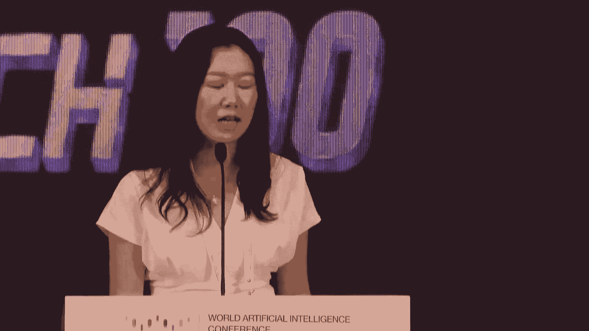
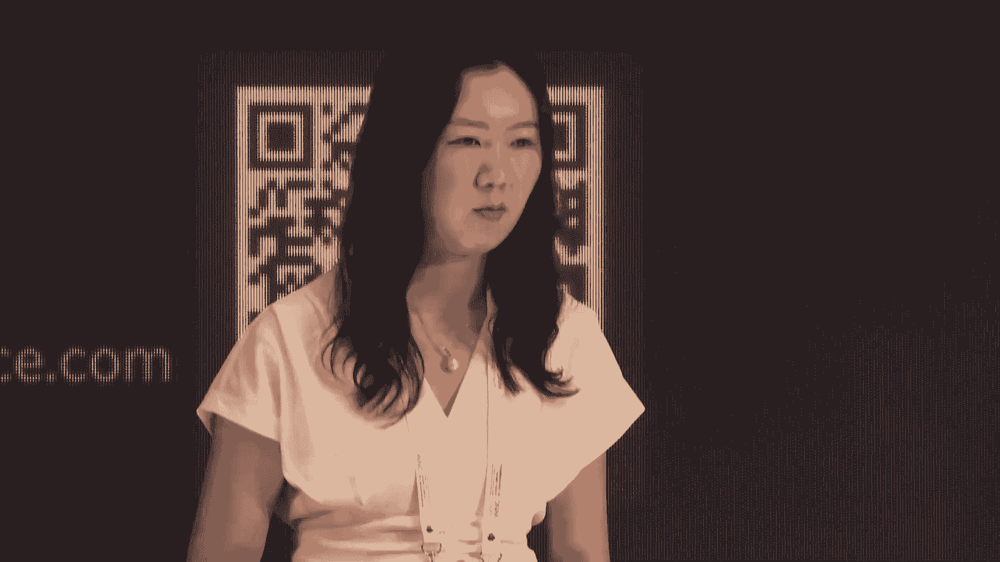
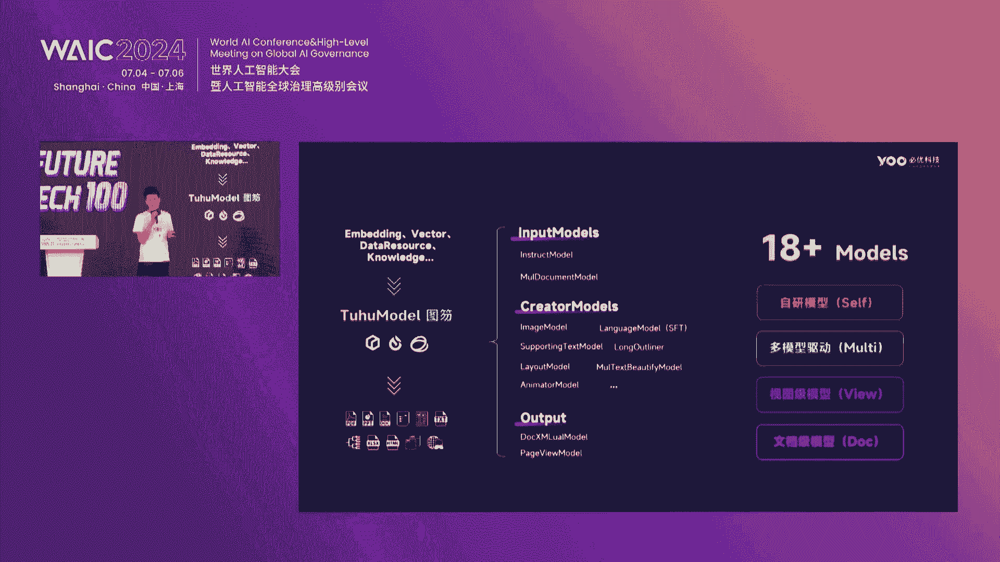
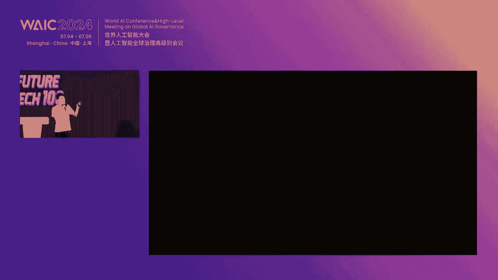
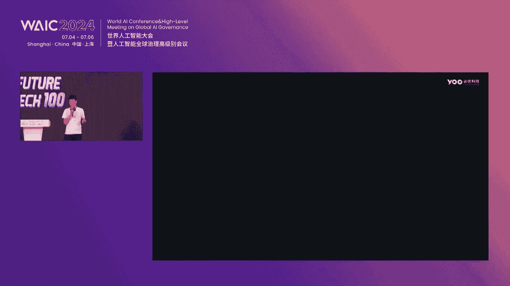
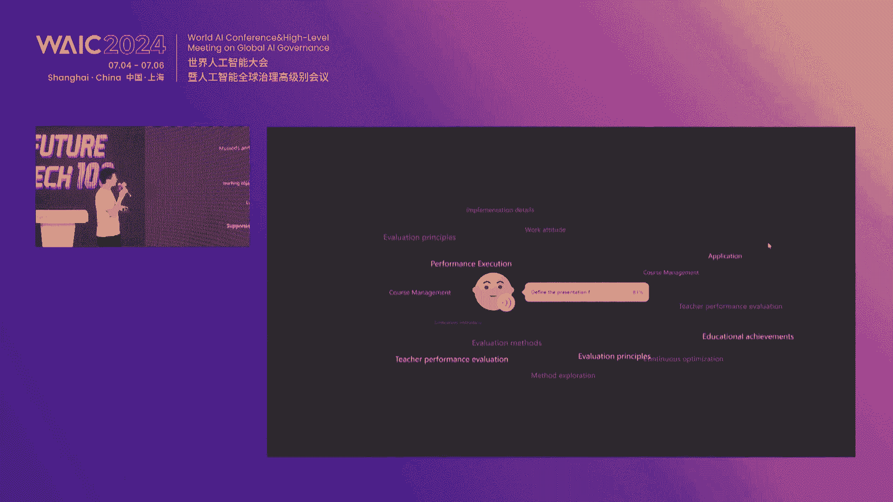
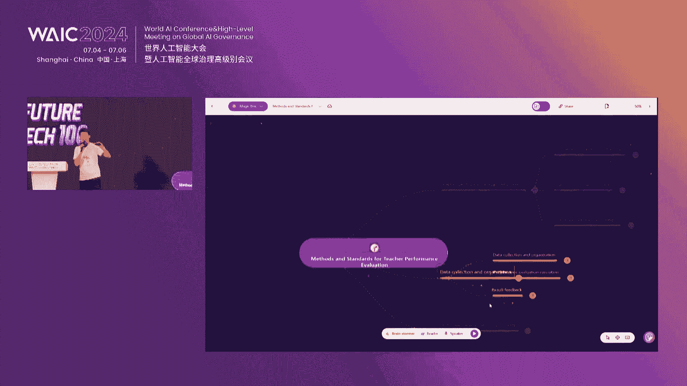
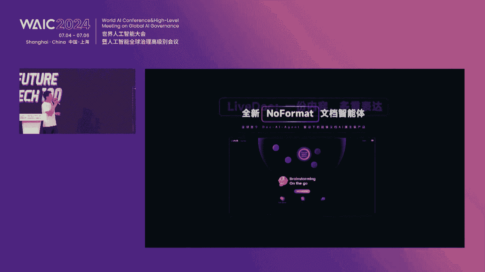
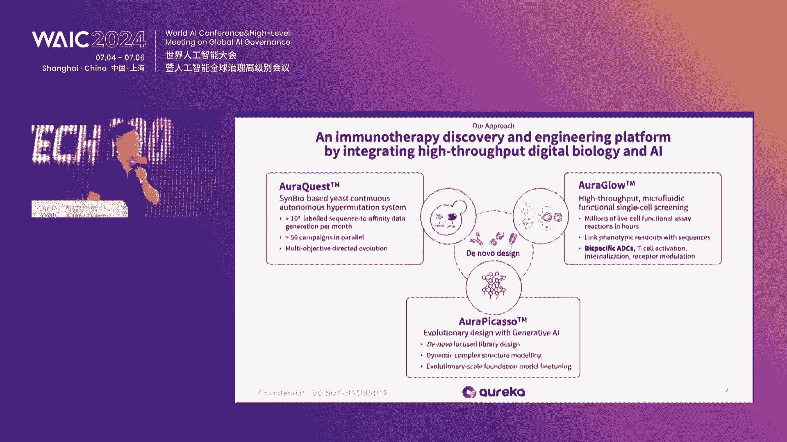

# P30：20240705-Future Tech 未来之星创新项目路演（Ⅱ） - WarrenHua - BV1iT421k7Bv

嗯。🎼接下来让我们欢迎跨为深圳智能数字科技有限公司，他们将展示如何通过sym to real技术实现高通用性巨声智能，让我们欢迎。😊，呃，尊敬的各位投资人，各位企业家，大家上午好。

我是来自跨为智能的sella。然后非常开心在这里有机会为大家介绍跨为智能，以及我们基于sim real的高通用性巨深智能的解决方案。那首先先简单介绍一下公司的这个基础情况。我们是2021年6月份成立。

在这个深圳市啊，成立的这个当年年底就拿到了这个真个基金和综合资本的天使轮融资。那公司的基于巨深智能的这个产品呢也在2022年有了这个小事，并且我们在交付第一个客户的时候。

就用了百分之百合成数据来训练I模型再服务到我们的这个终端造业的这个客户。23年的公司也有这个产品批量化的落地有千万以上的这个营收。😊。

啊，那下面讲一下我们对这个巨深智能的一个理解。我们认为巨深智能呢它最关键的一个要点就是它的这个通用性。那传统机器人其实我们认为它不智能的核心，其实是它都是这个定制化的一物一法的这个物流机器人。

他只能抓这个放在这个架子上的箱子，放在另外一个架子上的箱子，他可能就没有办法抓。那制造业上面的这个弓件呢，他今天可能抓这个轴承A需要写思好这个呃这个这这这个代码。然后明天抓这个轴承B，它就抓不了了。

那我们认为巨深智能呢，如果他最后能够规模化的应用的话，它一定是要具有这个通用性的。他需要对这个物理世界有这个感知的能力，然后再去这个决策交互，能够轻松的处理任意的物体处理多样的任务。

能够具有具深的这个通用性。啊，那我们也是把自己定义为这个巨神智能大脑的这样的一个呃定位。我们认为巨神智能大脑它最关键的一些环节就是它需要有这个交互感知以及决策的这样的一个能力。那所涉及到的核心技术点呢。

有基于这个多模态大模型的非结构化场景的这个理解。在后面也会介绍到在这个初步的L1到L2的阶段，后面会去到这个对呃非结构化呃LL4L5阶段的这个理解，以及面向复杂的未知的任务的感知与决策。啊。

那我们自己对这个巨神智能的发展路径，其实也做了一个类似像自动驾驶L1到L5这样的一个规划。那我们的理解里面呢，目前我们其实还是呃处于这个L1到L2的这个阶段，那我们认为巨神智能能够实际落地的。

更多的还是在这个半结构化的场景里面，半结构化的场景，基于我们的定义呢，主要就是指这个制造业的场景，相对封闭的这个比如说自动驾驶的这个测试的一些路段。那在L1阶段呢。

我们可以完成用特定机器人的形态来完成对任意对象的一个操作。L2阶段可以用通用机器人完成对任意对象的一个操作。核心还是在这个任意的对象。那在L3L4阶段呢，我们定义为一个非结构化的场景。

比如说我们这个toC的一些这个家庭场景。我们可以用通用机器人来对这个通用的任务。未知的任务来进行一个操作。那L5阶段可能就是对完全没有看到过的。比如说像这个火星上的这个场景啊，我们可以用通用机器来。

进行相关的任务操作。那我们理解它L1到L5最底层的核心逻辑是可以处理从an object到任意的这个环境 environment再到任意的这个任意的任务 task那这个核心的这个技术路径。

它呃最解决的这个核心的撤肘是什么呢？它主要是解决了这个数据的问题。那其实像这个文本的数据和2D图像的数据我们都是非常容易的在这个互联网上来获得的但是3D的这个数据首先在互联网上我们就非常难获得的然后在我们的这个半结构化的场景中。

比如说制造业场景中的这个数据，目前大部分的这个解决方还是需要派工程师到现场来采集这个数据。那C端的这个数据呢，那很多都是啊把这个机器人加上一个这个传感来通过这个模拟学习来收集到一些数据。

那这些数据的获取成本是非常高的而且它获取的这个数据量级是极为有限的但跨为智能我们认为。通过这个我们的scent的这样的一个技术，以及基于我们自研的引擎，可以低成本的获得海量的、高质量的3D的合成数据。

那这个合成数据呢可以非常有效的应用到我们这个从半结构化到非结构化的这个场景当中。它无论是从这个数据采集的成本，模型训练的成本，以及它的通用性、泛化性都有着非常好的一个效果。啊。

那我们所自研的这个高通用性的居身智能引擎呢，其实它有非常多的这个技术的一个呃模块。首先我们有底层可控的这个物理仿真引擎。

那基于我们自研的这个ex物理引擎不依赖niverse不依赖SX可以通过我们自研的引擎仿真渲染生成这个低成本的海量的这个3D的合成数据。那我们的这个合成数据呢？

又有这个后面的这个深度预适应算法可以有效的解决我们虚拟域和真实域的这个统计分布差异的这个减小。就很多人都会 challenge说你这个虚拟数据用到这个真实场景中。

那怎么好用怎么解决这个do那其实我们呃团队从这个2020年到现在都每年在这个PIV等发表这个相关预适应领域的这个论文。对，然后这个是我们物理引擎的一个架构啊，我们分享的可能比较干啊。

我们从这个就是底层的这个高质量的3DAIC生成的这个能力重建的能力，以及这个通过产品化自动化的这个管线来打通这个物理引擎的这样的一个能力所生成的这个3D资产。那在这个呃半结构化的场景里面。

我们训练这个资产在我们的引擎里面会模拟出来它不同的这个纹理不同的光照，它不同的这个几何的一些特征。然后在基于我们的这个来生成这个数据。我们还有这个dexI模型训练的部分。所以我们的这个物理引擎。

它既有合成数据生成，又有模型训练，它不仅是一个这个仿真器的一个引擎，它更多的是一个AI引擎。那我们的这个AI引擎也是完全自主可控的。啊。

那这边就是基于我们的这个dverse物理引擎所生成的一些合成数据啊那譬如说下面这个我们在赋能制造业的这个场景当中，比如说客户想要抓取一堆这个无序摆放的这个金属弓件。

那它只需要给到我们一个金属工件的这个也就是CAD模型。那通过我们的这个物理引擎，就可以仿真渲染生成大量的这个数据从空中掉落之后，它散落下来的这个姿态。在我们的引擎里面。

我们会给他加上不同的这个反光的这个情况。不同的纹理，不同的这个背景的情况，以及我们可以模拟出来它这个不同制造业工件，它有可能有这个光叉，都是可以通过我们的这个引擎来进行模拟啊。

以及它这个就是生产环境中的这个粉尘生产环境中的这个呃B的这个资产都可以在我们的物理引擎里面进行一个仿真渲染生成，并且可以把这个抓取的这个模型跟算法。在我们的引擎里面跑通。啊，那我们的这个落地的路径呢。

也是基于这个L1到L5的这样的一个范式。我们希望先在这个1。0阶段是在这个L1L2的这个半结构化的这个场景当中。也就是机械币在这个工业里面的柔性操作领域，有批量化的这个落地。

那我们呃正式商业运行的前两年22年23年，其实也已经呃服务了这个30多个终端的这个客户，达到了千万以上的这个营收。那后面呢我们会逐渐往这个呃to这个呃C端的一些呃B端的场景。

以及直接用到这个C端的场景里面的客户去做这个交付。啊，那我们其实呃也不做本体。然后我们对自己在这个产业链上的定位，其实是我们会打造一个这个软硬心一体化的这样的一个产品。

把我们的这个大脑以及小脑的这个算法的能力，嵌入到这个可交付的这个硬件，作为一个载体交付给我们下游的这个客户。那比如说这个呃自动化的这个集成商的客户。

以及这个巨身智能里面人形机器人相关的这个本体产生的客户来服务这个巨深智能下游的一些场景。那首先我们会从这个通用的工业机器人去落地之后，会涉及到这个啊家庭的这个通用机器人陪伴类的以及医疗的通用机器人。

我们也是聚焦在这个手上的操作。啊，那基于我们的这个dexverse的这个物理引擎呢，目前我们交付到这个L一半结构化场景当中的这个产品啊。

其实是我们的这个3D视觉大模型技术呃所赋能的这个picface视觉引导软件。那客户可以拿到这个软件之后就去进行他们机械臂相关柔性的这个操作啊，那眼睛的部分我们有自研的这个3D的摄像头啊。

也有基于RGB的新一代的这个视觉的解决方案啊，也有我们这个更完整的这个dX one一体化设备的这样的一个产品形式。那所服务到的这个制造业客户已经涉及到了这个呃百余家的这个客户。

其中也包括各行业的龙头企业。啊，那今年其实我们也发布了我们这个纯视觉的一个解决方案。那传统的这个3D视觉引导其实还需要这个3D的智能传感器。但基于我们的这个daxverse的物理引擎。

我们今年已经可以做到用纯视觉的这个RDB的智能相机，然后来做这个3D的这个场景，也可以在这种室外的，然后以及这个高速的一些场景进行应用。目前已经有了这个商业化落地。啊。

那创始人贾奎博士呢是这个呃15年通过这个呃计划引入回国。呃，目前也是在这个港中文深圳大学担任终身教授。啊，他既是这个海外高层次人才，也是这个广东省的这个顶级人才。

担任了很多顶刊顶会的这个论文以及呃的这个主编，以及这个呃主席。也是一个高隐的科学家。对，呃，然后这边可以关注一下公司的这个公众号，以及可以扫我的这个个人微信。公司目前是在这个A轮的融资窗口啊。

那后面我们还有一些关于公司更底层的一些这个技术支撑，给大家介绍一个简单的分享。我们在这个呃3DIGC的这个领域，有这个世界领先的这个逼真的内容风格化的3DIGC生成的这样的论文。

然后以及在这个呃涉及到多个模型之间的这个交互，也在今年的这个呃CPR有投了一篇这个呃论文。呃，以及我们这个44Dm，就是涉及到这个时时间呃领域的这个就是3D的这个模型的一个多模态的数据生成的呃一个工作。

然后以及我们基于我们的这个新一代AIGC可以在空间里面生成不同的这个呃机械币，然后来引导它进行操作，以及我们首创的这个呃6Dtop的基于零样本数据分析的这个大模型，也入选了今年的CVPR。

然后以及刚才提到的，我们用纯视觉的这样的智能传感器可以完成这个3D的这样的一个场景。基于双目姿态估技的这样的一个大模型。以及我们呃早期2022020年就有发表的一个这个GPnet。

就是首个这个端到端的通用的物体抓取的这个网络。我们用这个大合成数据来训练了这个呃42个m级别的这个抓取标注。在2020年。

然后2021年呢我们也是首创了一个这个3Dnet就是首个这个可供性分析的呃这样的一个工作。我们呃泛化了这个20多个类别的这样的一个物体，有几千个实际的这样的物体。我们可以知道我们去抓的时候。

比如说杯子我要抓这个bar呃，椅子我要做这个面，针对它不同的这个part，我们要怎么样的去操作它。啊，那我们也有一些最底层的这个系统性泛化的关于simpri AI的这个研究。啊。

后面都是一些底层的这个论文，然后以及我们基于这个real to same最新的一些研究领域。呃，整体来说我们的这个团队其实是呃一直专注于在这个三维重建、三维感知s real以及这个深度预适应等领域的这个研发。

啊，这都是我们的一些技术上的分享。那还剩2分钟，我们要不然开放到QA环节，感谢感谢跨维智能团队为我们带来的启发性演讲。😊，台下的投资人们如果有感兴趣的任何方面，都可以向快威智能团队发起提问。对。

现在在工业领域的那个进展怎么样了？

在工业领域的进展怎么样了？之前那个包括一些抓取啊。域都有服务到非常多的这个客户，已经服务了这个30多个行业，也是基于我们这个百分之百合成数据的这样的一个范式。我们可以非常快的呃横跨。

以及打入到不同的这个领域里面。就是我们的know how不是在这个真实数据的采集上，也不是在这个行业的深耕上。我们的know how都是积累在我们的这个物理引擎里面。😊，对。对的。

像你们这种就是跨行业或者跨客户去做落地的时候，这个不同的一个落地的一个周期是多少啊？因为你刚才提到，其实你的落地速度非常快嘛。呃，我们其实基于我们的这个物理引擎，在工业上这个机械臂柔性操作的领域。

其实是呃非常快的。我们训练模型其实呃基于我们目前也比较有限的算例，呃，几个小时就可以训练完。针对就是比如说 place这样的一个任务。我抓就抓这一个轴承的这一个比如说一个细分的垂直的呃任务。

那么我们几个小时就可以完成这个模型训练。把这个训练好的模型，导出SDK放到我们的这个软件里面，直接可以交付给这个制造业的终端客户，或者是它的这个下上游的集成商。😊，好，因为时间有限。我们只能。

遗憾的暂时暂时告一段落了。😊，那么如果对快威智能团队有兴趣的投资人，可以去H3A021展台或是一旁洽谈区了解更多内容。下面请欢迎上海伟长梦智能科技有限公司，他们将为我们展示伟常机器人。这不的。呃。

大家上午好，非常荣幸有机会和大家分享一下我们的这个机器人啊。就是我们大概是在2021年中旬的样子，打算做一款就是呃这个稍微复杂一点系统，后来选择了人形机器人。当时在想的时候就是现有市面上呢。

有些这个技国外已经有一些技术路线在做那个电机驱动的这个人形机器人。比如说像马斯克的智源的，就当前来说马斯克的智源的。然后还有当时其实优必选也已经做的不错的。呃。

同时呢有一些像这个波斯顿动力做的是液压的机器人。但我们当时算了一下，就是呃这个电机的机器人通常会有个情况，就是它的关节会比较大。然后呢，它的那个耗电量会比较呃比较大，持续能力不是特别久。

然后呢就是呃而且它的那个力量高爆发性其实不太高。呃，整体来说就是关节可能会做的比较粗。😊，然后不不太容易做的非常像人的计呃层次。所以我们当时通过计算，然后最终选择了一个就是呃液压的技术路线。

然后呢尝试把它呃做到跟真人的这个越来越逼近的这么一个方向啊来实施的来来来研发的。那么具体的我们做了三个方向的这个核心技术。第一个方向就是呃基于液压的动力系统与关节，包括我们的液压动力泵。

包括我们的这个液压四幅关节，以及我们的一些呃其他部件，像零巧手和这个面部啊，在这个液压动力系统里边有一个比较特色，这个呃有有有几点比较难的地方。比如说这个呃液压泵。

液压泵一般来说的液压泵是它是那个噪音非非常大，然后出输出的流量又非常小。那我们自研的液压泵是达到了14升每分钟的这个流量，基本上满足那个机器人是差不多是4。😊，公里每小时的这个行走速度。

然后包括这个呃它的重量，包括它这个呃一些其他稳定性啊方面，包括功耗都有可现有的市面上啊液压泵的结构都是有很大差别的。啊，然后呢包括后来的这个液压比例阀，都是我们自研的整套都是我们自研的。然后呢。

在这个第二个内容就是呃多任务的这个行为决策模型。包括我们有的时候会让他去我们冰从冰箱里拿一拿一瓶水。可能还会突然告诉他，顺带帮我把牛奶也拿过来，或者苹果也拿过来。这个时候他会对新发出的一些任务指令啊。

进行一些任务的合并，一些行为的合并。最终嗯来实现像我们人类一样的这个呃自然的一个一个一个一个动作。包括就是比如说让他端杯水。如果他是熟人的话，他肯定会先找你的杯子，而不是说先去拿一个一次性的杯子。😊。

等等的事情。这些啊行为模型是我们自建的。然后呢，包括其实在这个模型之上，还有一些安全层监督层啊，一些都是我们这个呃模型的一个特色。其次呢就是基于液压的这么一个高效运动控制算法。其实高液压运动很难。

因为它没有一个开源的一个事情，不像那个电机的机器人都有roose系统啊之类的，这大家都知道，那液压很难，但是呢液压的控制非常柔，就是我们走我们机器人走路的一个特点，就不是这样子走路的。

我们走路的特点就是甩手甩脚这样子直接甩出去的，而且直行行走，就是跟正常人是完全一样的。因为液压只要我们给定了一个合适的一些速度速度控制，它就可以形成连续的这个呃轨迹轨迹过去，而不需要用电像电机一样。

都是有轨迹那个点来呃有点来描绘的轨迹。所以其实到后来发现液压的这个呃综合优势啊非常非常的大。😊，那综合来对比就是呃有两个呃突出的特点。我们现在机器人就第一个特点就是能够直续行走。第二个特点就是非常静音。

站在这里就是呃非常非常的安静，不像电机啊的机器人，他有很多这种齿轮声。因为我们当时想着如果我们去照顾老人的时候，晚上去看他睡着没有，结果本来睡得好好的，然后我们的电机机器人哐哐的走过去。

把老人又给吓醒了，那可能就不是我们这个团队想要的这个机器人的这个最终的形态。那还有个很大的特点，就是我们呃别人的机器人一般来说像语数科技的机器人，现在基本上走路是走一个半小时。

然后这个站立是3个小时的样子。我们的机器人走路能持续走10个小时，站立的话，大概就是五六天的样子吧。所以我们机器人在展会上站立的时候，就是根本不用带充电器，不用带伞什么的。我们就机器人基本上就站在那里。

偶尔动动手就行了。就是全程下来，我们。😊，都是不用充电的，就接下来这几天啊，所以这个是一个液压机器人的一个呃比较大的一个优势。然后呢，我们的这个未来的商业化路径。

大概第一个商业化场景是一款这个机器人咖啡屋。现在机器人咖啡屋已经在制造了。大概是这个咖啡屋的第一个运营，大概应该是会在今年9月10月份的样子。反正在今年年内我们计划是运营三台机器人咖啡屋。

如果明年能够做到呃单店盈利月的净收入做到两三万呃，一年呃一个月的话，可能我们应该会和这个呃瑞幸合作。因为我们已经和他有一个初步的洽谈了，就是由他来对在全国的商务广场万达广场一些酒店旁边啊。

景点旁边啊来进行部署。所以我们其实主打的是机器人能够提供一个下午茶的咖啡下午茶茶点水果的这么一个一个服务。每次消费也就二三十块钱。😊，这么一个服务。这是咖啡屋内部的一些啊这个部署的情况。

然后咖啡屋做好了以后呢，我们大概在明年3月份会开始这个24小时便利店的这个运营。其实便利店也是跟刚才咖啡屋一样，都是用这个集装箱啊来设计的，就是布局稍微改一下而已。所以我们未来批量化生产以后。

会进行这个非常高效快速的在这个呃平整的场地上进行部署和是和这个投放。然后呢，剩下呃后来呃后期还会介入到像呃早餐店呀、甜品屋啊之类的。那么再相对后一点呢。

我们可能会介入就进入到呃一些普通的超市、便利店这样子的场景，然后让他成为一个呃这个普通的员工一样去融入到我们的生活。呃，呃，除了像服务类的这个应用，我们也进行了一些像这个工业化的一些应用的一些探索。呃。

现在反正919我们已经是过去好多次了，就是厂里边下班了，大家都不愿意收东西。那么未来的机器人就会帮他把厂房收拾平整，包括还会他们有一个很大的需求，就是希望我们能够像人一样帮他喷涂这个飞机的机身。

因为这个这个游戏啊毒性非常高，所以有一些这样一洽谈。那未来可能会在这种呃有毒气体的合成车间，包括电力巡检啊，得到一些应用。呃，现在和东方电网有一些这个前期的联系。😊，然后在旅游方面那个就是比较积极了。

这个长三角的很多地方的这个旅游局啊，都已经就是老早找我们把咖啡屋，就是希望我们咖啡屋能够运营过去呃，到他们那里去运营。然后呢这个这个尽早能够把这个机器人旅游的事情能够提前训练好。

但是呢我们可能重点不会在这里，因为我们的机器人啊可能应该有要有3年时间左右才能到这种呃饭场景里边去呃，去服务去提供工作。当然，未来的呃这个我们的理想是能够让他进入到大概是3到4年左右。

我们的呃机器人的智能化水平，要按照当前的这个进展速度，应该是能够呃实现到这个像酒店餐饮里边去提供日常的服务，包括我们的家庭养老家庭的陪伴，家庭的聊天呃，养老院的聊天，以及包括我们的这个社区服务。

像这个呃就是我们的保。😊，保安呃物业人员。那么保安物业人员呢，我们其实到时候会呃邀请一些团队，一些创意的团队来呃一起来开发我们的就训练我们的机器人去做事情。做好了以后呢。

会我们倾向于交给像一些像保利物业啊这样一些全国啊这种品质比较高的这种物业公司，让他去代理我们这个整个这块业务。然后呢呃更远期应该会到工厂里边参与一些活动，包括一些特殊环境的一些服务。然后呢。

快递呃这个派送啊，包括商超运营的一些事情啊，然后呢，我们的这个计划就是在今年9今年的9到12月份呃里边，我们应该会推出5套这个机器人咖啡屋的一个运营。然后呢，未来会有机器人便利店啊。

其实今年今年的便利店也会也会有试运营的一个过程。其便利店因为相对比较简单嘛，就是别人收好买好东西啊，拿过来，然后。😊，一扫，最后那个付款平台上看出来是多少钱，别人把手机拿过来，然后呢。

眼睛也也也是眼睛一扫，然后就把款给付掉了。当然我们还是会给机器人提供一个手机。呃，因为正常情况下，机器人是可以和别人加微信，然后呢和别人这个进行手机上的一些沟通的。😊，啊。

这就是我所有的这个啊这个啊这个分享的内容，然后还有还有4分钟到5分钟的时间呃，可以和大家做一些沟通交流。😊，好，感谢韦长梦团队带来的精彩展示。现在各位投资人们可以发起提问。😊，哎，你好。你好。

我提个问题。对哎，你好你好，呃，我听上去你们是用液压去做本体，所以你们大脑就感知操作那部分是和第三方合作，还是说呃就是现在的全部团全部技术都是我们自己做的。就包括我们的眼睛里边其实是是两只电焦的眼睛。

而且每只眼睛是独立的转动的。所以我们的建模是通过呃视觉建模，双眼双目视觉建模来实施的。然后我们的头上是装了6个摄像头，所以你在喊他的时候，他能知道大概是谁谁在哪个方向喊它，啊，包括我们的手今天也在展会。

其实也也可以去看一看，就我们机器人一般拿出来展示的话，一般是不会带吊臂啊之类的这种这种这种东西然后你选了一些落地的场景，其实是可以用专用的机器人去做的。所以从成本上面考虑。

你觉得这个落地的这个商业化能算的过来这吗？比如说你头可以用工。我们机器人可能刚开始做出来，就像那个手机加鸿蒙系统一样，可能还没有人能关注我们，没有人来用。所以我们所谓的做咖啡屋做便利店。

实际上只是一个它是一个可批量化的一个场景。等到后期的话，大家有所关注的。那么我们是欢迎大家一起来开发，一起来进行训练的。到时训练是不需要编程的，就是就是叫回去，比如说叫到养老院。

告诉他每天晚上都要经过哎去巡逻哪些地方注意哪些事情，看哪些传感器的数据，同时把这些数据上传到云端去啊，就是就是纯粹就是教他，包括到工厂去工作的话，也是告诉他打开这个箱子，要教会他，打开箱子要放哪些东西。

最后要把它搬到哪里去。就我们基本上是不提供对外编程接口的。😊，我们大概是装了2个6T的算算例啊，1个6T是在头部，一个6T是在这个胸腔背部。呃，我问一下，现在我们这一款产品啊的售价会都是多少？呃。

我们现在的售价大概是在50万人民币，就是机器人加机器人咖啡屋加上咖啡屋里边所有的装修，包括这个咖啡的这个呃这个设备，然后机器人的售价是在30万人民币的样子，编辑售价应该是未来是在15万人民币啊啊，谢谢。

😊，嗯嗯。还有老师有任何的问题想要问吗？好，谢谢。😊，啊，我我看到咱们这个一个卖点是液压动力机器人嘛，那跟电器动力的相比啊，就是液压就是呃比如说爆发力强啊，但是呢就说这个你如何解决漏油啊，这些。

然后噪音就较大，而且而且还有就液压其实很耗的呢，就说你你刚才另外一个卖点就是液压嗯是你可以有呃十几个小时吧，站力吧。对然后走路对你你你你这个是如何做到这么平衡的呢？这个是这样子考虑的啊。

为什么液压比电机要省电呢？我们知道那个如果一个电机带动的挖掘机，如果把挖壁举起来的话，它可能就是要不了多久它就塌下去了，但是液压的挖掘机它把挖壁举起来以后，他把液压一锁住，它就就是放那里放一个月。

其实它也不会倒，所以我们机器人有的时候就是有些机器人就站在公司里边就一直站。在那里了，他就所以说我们机器人大部分时间都是站着的，他就不会怎么的。然后电机为什么会非常耗电啊，电机的它是不能直续行走的。

在理论上它是做不到的。因为电机一旦直行行走直系行走了，它的那个扭矩就丢失了，扭矩一丢失，有可能他会往前倾，关节会往前倾，它又会往往后来，所以它都是弯着走的，因为站直了它就会抖，所以说它都弯着来的。

弯着来，它就要用电流来保持扭矩，所以它的功率大概是在600到1000瓦的样子。我们机器人走就站着都是600到1000瓦，我们站着的话，大概是二十几瓦的功率，然后呢。

走路大概是6十几瓦到80几瓦的这个功率是这么一个情况。老师啊。😊，就主要在于它的这个驱动方式，就它一旦是弯着腿走路，他就要这么大的一个力量去啊保持这个电机的一个状态啊。好，感谢各位老师的踊跃提问。

有请入座。😊，그。嗯。可以。对伟长机器人感兴趣的投资人们也可以去一旁洽谈区或是H3A018展台了解更多内容。Yeah。

🎼下面我们陈挚邀请易控制架科技有限公司战略副总裁林巧博士为我们带来露天矿无人驾驶运输解决方案。注山2。0技术解读，有请宁博。各位领导，各位蓝宾，大家上午好。我我们做的是无人驾驶，不是巨生智能。

借这个场地向大家做一个我们产品的一个汇报。啊，汇报主要分以下四个部分啊。首先第一点就是做一下整体的背景回顾。因为矿山是一个全新的领域，大家日常生活可能接受不到，所以稍微介绍一下矿山这个场景的一个情况。

它为什么需要无人驾驶。首先第一点，从微观上矿山的作业是极具需要安全性的一个场景。而，矿山作业产景里面本身需要24小时作业，而且都在偏远地区。所以对安全来说是一个很好很很具挑战的一个底线的问题。而。

无人驾驶可以很好的解决这方面的一个问题。第二个就是本身矿山行业存在招工难用工贵的问题。现在我们中国的矿山司机的主力已经是70后和80后啊，试想一下，1年之后啊，70后肯定干不动了。

但是中国的矿业开采还要继续，甚至我们大部分的生产物资可以说90%都是来自矿。业的那矿山的生产要继续的话，必须要有机械化和自动化的换人的方式去解决这样的问题。呃，无人驾驶是一个很重要的解决路径。

第三个就是本身矿山的一个智慧化和绿色化的需求。因为无人驾驶天然的会跟新能源化结合在一块啊，所以从这三个微观上有一个极具干线的一个需求的场景，需要无人驾驶去解决矿山的生产作业的可持续性啊。

第二个就是本体本身来说，矿山这个市场大家可能关注比较少，其实从市场规模也不小，是一个每年轻一级的一个运力的需求的一个市场。那这一块既然有这么大一个市场空间，矿山的话，其实做无人驾驶也时间蛮久了。

海外新发展啊，也接近了30年的一个发展历程。但是整体来说啊，整个突破量比较受限。到现在，海外的话总共一。😊，300来台车，主要是两个工程机械巨头卡特和小松在做这一块啊。然后国内呢我们经过8年的发展。

时间的发展追赶上了，从数量上确实追赶上了。但是也有自己的问题。比如说国内我们是规模化偏少，就是单块没有形成规模化，每一个块就几台三台5台在做实验的状态偏多啊，那海外呢是渗透率偏少，迟迟的增长不上去。

核心原因是什么呢？主要还是矿山啊，它是一个非结构化非常强的一个场景。另外它面临的是要恶劣环境，我要常态化作业，比如说下雨天是吧？希望能作业，下雪天能作业，风沙天能作业，这样的一些场景下。

我的生产效率要有保证那我们的整体的技术能力就得跟得上啊。😊，所以在这一块的话，大家其实从大的架构方案上都是趋同的啊，基本上需要的不只说单车智能的能力，也需要我们整体的协同调度啊。

所以它是一个典型的车路云一体化的一个解决方案。那各家在做的时候，实际上差异还是蛮大的。核心差异点就是在区域云和车端的能力的一个区分上，大家怎么去做的啊，到底是以单车智能为主。

还是以云端的一个调度和云端的决策规划为主啊，我们了解到海外的快上无人驾驶，为什么渗透率不强，核心原因是它基于基本上基于AGV的架构，以云端的决策规划啊，去做无人驾驶。但是陆天矿的变化，它就很难试应。

所以它在90%的矿山是没法去做的而国内呢大家刚开始都是循着海外的路径去做的。我们经过5年时6年多的时间发展在。😊，第五年的时候，其实在第三年的时候发到于这条路径是不可行的。

因此我们为解决泛化能力不足和高度依赖网络，以及本身因为从安全线上它还要依赖云的这样一套架构。因此我们以车路云一体化去考量。但是以单车智能为主，两者能力结偶啊，云端的话负责叫协同调度啊。

然后来实现效率啊后车端呢实现这个产景的泛化能力，实现它的安全性的保底以及智能化啊，那我们为什么能做到这个呢？核心是我们经历5年多的时间发展的时候，已经积累了大量的数据啊。

我们的里程数当时已经做到近千万公里的里程数K级是上万个的K级，我们设定了一套非常好的架构去解决这样的问题啊，核心就是我们的调度是集群全局调度的云加自主决策。而且。😊。

协同基本的协同是以车端的V to V的通信为主去协同。因为快商原来是没有网络的，为你进的网络不可能是完美的，而且随着车速的增大啊，不同的地方，如果网络状况不同，我们的架构又大量的变化，那不具备可复制线。

因此我们在驻山1。0的时候，主要解决了一个产品可用不可用的一个问题啊，到达一个可用的状态。那到啊驻山1。0，第一点就是保证安全，我以车端为主了，不依赖网络。因为原来以卡特小松的那套架构。

它所有的安全依赖网络，只要网络抖动，车就得停在那，它车就动不了了。所以生产效率就没法保证。另外就是从产品本身的放化能力上也存在不足。那我们通过车端的这五层的一个安全去保障我们整车的一个安全性啊。

到哪个区域，我们的车都是自车能保证安全的。第二个就是通过效率的话。😊，通过我们车端智能驾云端的一个协同来实现一个效生产效率的一个接续能力。首先第一点就是场景的适验力啊，基本的粉尘雨雪天等作业。

然后在交叉路口即使存在网络抖动的情况下啊，我们车能自主的协同啊，我们的车与车通过V to v有轨迹的相互的一个发送是吧？以及是临合的一个无有人驾驶车的一个轨迹预测去解决这样的问题。另外在装载的区域。

可以做到拟人化的转载，比如说原来有人无人驾驶的话，因为单车能力不足啊，在挖机口车要停的蛮远的去等待啊，原来可能一个挖机装满一车要等一分半种，那我们现在可以做到20秒，极大的提升了生产效率。

还有就是这种叫排土场，它的排土作业，其实实际上这个视频可能没有那么直观啊，它实际上是一个大斜坡，要把土完全的排下去，但是不可能。😊，一只能完全排下去，只要我们的靠冰靠的足够冰。

可以每一个排土位排三车以上。如果是单车能力不足，一个排土位只能排一车就得用推土机去推。那极大的影响生产效率，这也是国内为什么之前大规模的大家没有形成的原因。因为只排一车，整个生产效率比有人驾驶低太多。

大家就不愿意规模化去上。😡，啊，有了这样的一个能力之后，就在23年，我们形成形成了几个典型的案例。在介绍典型案例之前，介绍一下我们整体的一个发展历程哈。我们从18年成立，每一年都有一个典型的业务进展。

比如说从20年我们就到实地场景，叫单兵组的运行。因为矿山作业，它就要兵组去作业的，不是说我车单独的去运就好了。他要跟挖机跟洒水跟平路要协同起来的。然后第21年呢干了一个事就是晚上可以作业了。

那晚上可以作业，而且是双个两个兵组做动态的一个配车了。然后到22年是实现了真正的实现无人，那也是我们国内第一家实现常态化无人的无人驾驶公司，然后到23年已经实现了全球单矿规模最大的无人驾驶车队。

200多台车啊，之前的话海外人家经过26几年的发展，是在澳洲的一个矿，大概100多台车实现了常态。😊，化无人。因此有这些成就，因此我们也拿到了国家级的专业特性小巨人啊。

还有国家的重点实验室等等的一些荣誉。那再回到案例这一块。首先第一个案例，刚刚提到的全球最大规模的无人驾驶车队啊，这个款我们常态化无人已经达到18个月了，而且是承包了整个矿的50%的工作量。

这个矿是亚洲产能最大的露天煤矿啊，接下来有可能因为上了无人驾驶，所以它准备扩产能到全球第一大，可能产能会继续的扩大。因为国家也规定了它要产能扩大，不能增加人数，只有无人驾驶才能解决这方面的问题。

第二个就是整体来说，我们的无人驾驶能力在春节的时候得到了很好的体现。因为春节的时候要保供啊，大家的保暖啊是吧，必须烧煤啊，这一块的话，春节的时候，大家没有无人驾驶的时候，生产效率跟平时是没有变化的。

我们跟另外50%有人驾驶对比，他们只有平产的60%到70%的一个效率能力。但是我们春节是一模一样的。😊，这个呃第二个典型的案例就是我们在另外一个矿种叫石灰石的矿，这个矿有什么特点呢？就是。跟煤矿不一样。

它是一个运营的一个玻璃，所以它有大量的爆破以及狭小的一个区域啊。然后所以对我们的感知能力，我们的定位能力都提出了更大的挑战啊，整体来说这个矿一个最大的特点是全矿所有的运输车辆采用无人驾驶。

这个矿上已经看不到人去开车了啊，啊，所以有很多我们客户参观了这个矿非常震惊，认至认为这未来月球如果要采矿，也是可能是这样的一个形态啊，很多人就是几个人坐在调度室里面。

安安静静的看这些车辆的一个运行情况啊，现在整体来说，我们已经做到了一个班次，就4个人。原来的话有司机的状态下，一个班次基本上25到26个人啊，整体承接了整个矿的运力。

不管是任何情况下都能保证整个矿的生产能力，保证他的一个销售额能正常的作业，有了这两个点。😊，的案例啊，下面介绍一下为什么我们今天还要发布我们的2。0的版本啊，在我们有这个能力的时候。

发觉还是不够不够在哪呢？第一个就是我们有很多这种快规模化之后带来的一些冰角料的作业场检，我们还覆盖不到。比如说这里面啊典型的大致的显示出来的啊，小堆排的作业循环的作业，所谓循环的作业是什么呢？

就是说这车它每一个班次它要收回去，那我们可以不收回去了，直接在路边停的，因为已经没有人了。那可以大大的提高它的生产能力，因为车从这个路上收回去，一来一回往往要浪费45分钟的时间。

这个作业时间对矿山的一个能力的效率的提升是非常重要的啊。然后另外一个就是从单车智能的能力上还存在一些不足，比如说灵活性的不足啊，我们。😊，没法做到叫全场景的均匀碾压啊，所谓的均匀碾压。

因为宽山的道路都是泥土路。如果不做均匀碾压，一直会沿着一个车，一个路线在压，会压出这个车载性非常深啊，这样的话，频路的成本就会变高。那我们可以做到接下来2。0是完全做到所有的区域均匀的碾压，大大降低。

它原来比有人驾驶的这种频路成本还要低了啊，所以无人驾驶上来之后，它对应的有很多附带的一些啊作用，给他们带来一些生产效率的提升以及成本的降低啊，那所以2。0我们核心的是要做到一个效率又要高。

又要应用好用的一个产品啊，那核心体现在哪呢？主要体现这6个大的特性。第一个就是更加的智能啊，我们也会紧密的跟随。比如说今天我们人工智能领域，大量的新的技术。我们当然我们不会全量的照搬照抄。

我们会根据我们的。😊，场景特性去上一些算法模型。比如说我们现在加BEV加transformer加OCC主要是用于多模态的感知刚提到的这种区域碾压能力，我的车子的识别能力，小时块的识别能力。

我现在采用多模态的识别，要不然纯粹的单一的激光雷达感知做不到30公分，能精准的识别啊。然后还有就是我们有一些路面会颠波，颠簸的时候，我们要自适应调速啊，速度要自己降低啊，不需要通过说后台去配置。

这样的话车的损耗又能大大的降低，降低它的维保成本。然后第二个典型的特性就是更加灵活了啊，我们所有的障碍物都可以绕行或者小的障碍物低于30公分的。因为我们底盘高度是40多公分。

低于30公分我就会骑醒过去啊，不用在这绕来绕去了啊，然后还有实现的一个就是大规模的有人跟无人驾驶车队混。😊，新的运行啊，这个为什么这么干呢？核心就是因为随着我们量增大，它不可能一个块一蹴而就。

就是所有块全部采用无人驾驶。它有这个中间过程。所以我们现在能跟无人有人车混在一块，而且能保证运行的效率。第三个特点就是更加的精准了啊，填靠精度，大家别看唉这个指标跟乘用车跟机器人比差距蛮大的。

但是这个车的特性决定了。因为矿卡它是非常重的。比如说我们现在的矿卡自重50吨，载重100吨，基本上150吨，所以它的响应精度特性都是很差的。在这个情况下，我们可以做到，比如说停靠精度15公分。

就决定了刚刚提到的那个排土能排的更多啊，然后还有就是带来的就是我们叫工程质量能巡检，所谓的工程质量巡检就是矿仓会不间断的去修路，修胆墙。那原来它的模式有人驾驶修完之后要有一个人拿着打点器去打。唉。

你修的准不准。😊，现在的话我们能自动化的给他提取出来，能降低他这个人的一是成本，二是人的安全性。因为这个人要打点的时候，矿上设备很大，盲区很大，有安全风险大大降低啊，它的一个安全风险啊。

然后第四个特性就是更加的全面。我们原来只覆盖到露天的煤块的采玻璃环节实灰石块啊，现在已经开始进入到金属块以及规模化的时候，我们的挖机口的这个车均衡率提高提的更高，原来只能做到90%，现在可以做到95%。

另外在车在长期运行的时候需要维修点点，这些我们给他一个全套的解决方案，让它数字化啊，从是整体的效率上，比如说我们在这个地图上会有大量的更新。而且我们做到是完全增量式的自主更新。

那现在增量更新的能力已经做到2公里的排。😊，一分钟更新完，原来其他公司的无人驾驶基本上要一天，我们一分钟可以搞定这个事啊，而而且我们在研发效率上也做了大量的提升。比如说在大模型上。

我们采用了自动化的标注的手段实现百万量级的。因为我们得到了大量数据可以这个是数据是很特定的一些场景。比如说粉尘不同的情况下，粉尘是怎么样的啊，还有就是应用性上的大量提升。比如说原来有些车出故障了。

迟迟没发现，我们现在做到秒级发现，因为提醒的方式让它更他更加的醒目，哪一些故障是即时提醒的，哪些故障是隐藏在后面，用研发去看的，我们可以做到更加的细化啊。😊，有了这样的一些能力。

因此我们也对未来做了一下展望啊。然后现在我们在今年这个时间点已经做到了10个以上的矿山，600多台车常态化无人跑了1000多万公里啊，然后整整体的一个能力是到一个新的产景，新的矿同矿种的单天实现下人啊。

原来行业内基本上是3个月，甚至下不了人啊。然后因此我们认为24年我们可以做到规模化复制啊，今年我们认为可以达到1000台一态的一个无人驾驶车辆的支持能力。从产景上可以支持到大型露天煤矿的玻璃加采煤啊。

然后石灰石矿加金属矿，还有最最需要无人驾驶的高海拔的矿山，很不适合人去作业的矿山可以上无人驾驶，让我们去真实的作业。另外走向全球在矿业大。国人力成本最高的国家澳洲去做落地啊。

我们内核还会继续的去提升我们的生产效率和产品的一个作业能力啊，从这个刚刚介绍了很多无人矿山无人驾驶情况，从陆天矿的无人驾驶本身来说是一个典型的先智生产力。它具备三高的属性。

而且类比乘用车的新能源无人呃新能源车的渗透率情况，今天这个时间点，矿山的无人驾驶也达到了一个就是说连接的拐点可以实现规模化商业化的拐点。而且我们的中国的矿山无人驾驶具备极大的技术和产品的优势。

相信也可以像我们当今新能源乘用车一样走向全球啊，那借这个机会，我们在这里也有个展台，欢迎大家到一号馆的C819以及这边上有个展台做交流。😊，最后因为矿商离大家的日常生活很远哈。

有一个小视频介绍一下富山到底是在怎么样的一个作业场景。😊，好。好，让我们再次邀请林博上台，也让我们邀请同济大学汽车学院副院长赵志国教授，上海交通大学钱叶强教授。😊，🎼东北大学潘继安教授上台。

让我们进行产品的正式发布。🎼请各位领导转身移步至大屏幕前，伸出您的左右手，将掌心放到我们屏幕的手掌印上。🎼好的，全场请跟我一起倒数。😊，我。43。🎼21。🎼陆天矿无人驾驶运输解决方案驻山2。0正式发布。

也请各位发布仪式嘉宾刘步来到舞台中心，我们合影留念，一起记录着美好的时刻。🎼感谢各位，请台下落座。😊，Yeah。🎼关系。🎼尊敬的各位嘉宾，创新项目路演、巨深智能专场以及发布会仪式等环节已圆满结束。

再次感谢联合主办上海国投公司及中移互联网东浩来生投管公司、安永等生态合作伙伴对我们活动的大力支持。😊，🎼下午的路演即将是AI与商业领域专场，我们13点30分不见不散。😊，也请各位投资人评委们暂且留步。

🎼各位可以拿起手边的投资记于卡片和笔。🎼为我们的路演环节投出宝贵的一票，谢谢大家。😊，🎼各位嘉宾下午好，我们现在将要开启的是今日的第二场路演日程。首先感谢我们的合作伙伴。

上海国投、安永、中移互联网以及东浩蓝生投管公司，感谢他们对本次活动的大力支持。😊，现在我们将探索6家不同公司的创新项目，他们将为我们展示AI商业领域的新前沿。让我们把注意力转向今天下午的第一家公司。

上海英领之途数字科技有限公司，他们将为我们带来主题一键生成ARVR神器。呃，大家好呃，我叫黄之。呃然后呢，我们公司是做这个ARVR的，做了快十0年啊，最早是做这个AR眼镜的。然后呢，现在呢。

我们也在做一些这个AR相关的一些这个应用。那我们公司呢成立于2016年，然后今年5月底刚刚搬到上海来，在这个徐汇区的曹和金啊，也非常感谢这个徐汇区给我们这样的一个机会来参加这样的一个呃比较大的一个峰会。

啊收获也比较多啊，这两天我们已经呃有非常多的这个新的企业加入进来。然后呢，会场也有大概几十家企业在我们这个产品在做展示啊，所以我还是比较开心。那我们之前呢主要是做这个眼镜做了很多非标的业务啊。

然后也有之前有私轮融资。😊，那现在我们公司呢呃更多的可能还是在做一些这方面的相关的东西。呃，那我我们团队呢主要来自于这个帝国理工啊，IC然后我们也都是同学呃，因为主要大家都是无锡人嘛。

所以开始在无锡的比较多一些。那我们公司最早呢是16年成立在无锡，然后后来呢在南京呃做了一些这个人才的这个积累。那现在呢我们最终一这样来到上海啊，主要就是做一些头部客户。😊。

那我们的团队呢现在大概有四十几个人啊，然后现在在上海这边呃，会先放二十几个人。那我们公司呢呃之前也得过一些呃奖项啊荣誉啊，反正这个之前双创呃该经历的我们也都经历过一些。那所以呢在这个过程中呢。

我们也在产业链上啊得到了很多这个朋友的支持呃，也让我们有这样的一个信心可以做这样的一个产品。那我们也有一个长三角宇宙联盟啊，我负责。然后呢有000多家企业。啊。

所以呢也可以为我们这个现代的AIDC产品去提供更多的这个素材和帮助。😊，那我们的专利呢现在大概有呃37项呃，主要是相关于这个算法一些的东西。然后呢，原来呢我们也做了一些这个软件的算法。原来因为做眼镜的。

所以我们在四联空间定位系统各方面是有自己的比较长这个长的积累。那当然呢后来因为这个C端的这个市场也不是特别好，直接单卖比较困难。所以呢做了很多to B的业务。然后也积累了很多的to B的客户。呃。

这也是为什么我们现在做这个产品，一开始这个推广的客户各方面还是比较多啊，头部企业比较多的一个原因。😊，那我介绍一下我们这个AR宣传册吧。那昨天呢我们在楼底下也做了一个产品发布会，呃。

主要就是呃讲解了一下我们这个产品它的一些功能以及这个呃一些使用方式。那我们这里面呢主要有4个功能。第一个呢就是这个识别图。呃，识别图这个功能呢，那当然现在很多人都会用啊。但是我们不是我帮你定制化开发。

我帮你做，是让你自己可以做。那我们呢会有个后台管理系统，你只要上传这个图片视频模型，它就可以自己自己一一键生成。😊，那第二个呢是3D放置模型。那这个呢比如像一些汽车啊、家装啊，然后一些这个工业啊。

呃特别像一些这种比较大型的设备啊，它在这一块的这个使用是比较比较多一点的那这一块这个东西呢，主要我们通过磁联空间定位系统的方式，然后里面加了一些爆炸模式爆破模式啊，做了一些相关的一些模板啊。

针对于现在已有的一些这个案例和一些这个企业的需求啊，我们做了一些大家只要一键选择就可以去做的这样的一方式。那这些东西呢都是展示在这个小程序端啊，不需要下载任何的APP。😊，那第三个呢是这个虚拟展厅。

虚拟展厅呢，我们现在主要就是呃把一些相关的这个模型素材呃，然后放到里面。然后客户呢只要直接去根据我们后台管理系统的这样的一个模板啊，非常简单的拖拉拽就可以实现这样的一个功能。

假设这个客户他没有这个3D模型呢也非常简单。我们有1个API。然后你对这个设备，用手机啊扫一个视频，然后呢，2分钟以内的就可以自动生成一个呃3D的模型，然后传到素材库里面就可以去使用了。

那我们这个虚拟展厅里面呢，现在还加了这个交易功能。然后如果这个客户他有需求啊，他做电商的话，也可以直接在上面进行这个下单。😊，那这个虚拟人这一块呢，我们现在呢这个功能呢呃添加了这个AR导航系统啊。

然后比如说像这个纹理场景，比如像工厂，比如像医院，它都可以做一些这个导枕导览，然后呢做一个虚拟人的AR导航之后呢，他可以在途径点上面停下来啊，为你去介绍这面的一些这个情况啊。

然后呢也可以做一些这个实时交互的一些这个呃一些这个功能。啊那它是在这个虚事结合的场景里面去实现的。所以相比于传统的这个虚拟人呢呃，它更多的不是只是展示一些这个呃虚拟人的画面效果啊。

或者说只是简单的去做一些大语言模型的一些交互。它更多的是做一些这个导览啊，做一些这方面的一些交互。😊，那我们现在的企业用户呢啊包含这个工业呃，然后包含这个呃大消费，比如像一些什么超市里见到的什么薯片呀。

什么零食啊，什么这个消费品啊啊一些比如说书化产品，只要有包装的啊，他基本上都有这个比较大的需求。呃，然后呢像这个餐厅呢，像我们现在跟肯德基合作啊。

他们也会做一些这个线下的一些这个呃营销类的啊一些宣传类的一些这个东西。那工业这一块呢比较大啊，我们现在在做一些这个新能源汽车，然后像这个储能这一块啊，相关的一些东西。

那还有呢就是我们现在做家具这一块的比较多。呃，像这两天在展会里面找我们做家具的也比较多。他对于这个尺寸各方面给客户用的这个需求还是比较高一些。😊，那这个呢是我们现在主要去做的一些这个企业客户的案例。

那这边呢是我们的后台管理系统。这个后台管理系统呢是我们呃提供给客户的一个非常简单的呃拖拉拽的这样的一个东西。那四个模块呢呃也是如这个上面所述，哎，你只要输入名称和简介，然后上传这个识别图啊。

然后再把你需要上传的这个素材啊，直接一键上传上就可以了。那我们这里面呢也提供了，比如说像这个海报模式，比如像这个宣传册模式，就是它去调的角度，你只要点一下就可以了。

当然如果你有这个特定的这个高端的需求啊，你自己也可以去调。😊，然后呢，这个新增模型就更简单。你只要把这个上传的这个把这个素材或者3D扫描出来的这个素材导进去，它自己直直接就可以生成1个33D模型。

那如果呢想要我们的这个爆破模式，或者比如说想要一些其他的这个模板的，你也只要直接去选择点击就可以了。然后呢，这个每一个步骤呢大概就是一分钟不要就可以自动生成1个ARVR的小程序。

那这个展厅呢我们这里面做的更详细一些。就比如说每一个位置可以放什么素材，我们也都帮你标好了。然后出来以后呢，他就可以一一对应在里面。然后呢我们的目的呢是希望让更多的中小型企业可以使用ARVR的东西。

而不说只有这个头部企业。因为其实我们做了1年的AR然后呢有很多的企业其实找过我们做这种各式各样的一些AR定制化的产品，其实金额都蛮高的。我们也不太敢把这个价格打的太低啊。因为同行估计也会有意见。

那所以呢我们就觉得不要重复造轮子，不如做这样的一个标准化产品啊，让大家把一些需求啊，可以让企业端自己去实现。而且做的足够小白化，足够简单。那他们自己就可以去使用啊一个前台一个行政助理就可以去完成的东西。

😊，然后呢，我们这边还有最后一个虚拟人这一块，那这个里面呢就是可以上传一些视频和音频，然后它就可以自动去讲解和展示。而且我们这边接了这个大圆模型接口，它也可以去做一些呃空间里的这样的一些东西。

那我们现在呢就是这个AR导航这一块的这个东西呢正在这个上传。呃，应该这个7月中旬吧就可以呃正式这个测试使用了。那这个呢在文旅场景在工厂在博物馆呃，它这个使用是比较多一些。那最后一步呢就是这个素材库。

素材库呢是我们给到这个客户以后呢，呃比如说今天有个展会，然后你马上要开始了，可能就5分钟吧，然后你就可以立马去上传替换掉。然后素材呢可以让你公司里的同事通过这个账户直接去上传。

然后你这边直接把这个素材导进去就可以去使用。那整个操作过程还是比较快捷方便。那我们现在呢也在做这个海外版。我们现在在这个海外的一些这个社交平台上面呢去做了一些这个接口。这样子呢做一些出海的也比较好。

那我们为什么对海外这一块呢这个非常有这个诉求呢，是因为我们当中有个投资人给我们介绍了一些这个储能的这个企业。那他们现在很多储能出海非常多啊，这也给我们非常好的一个这个机会啊，去做了一些这个呃海外的版本。

那本身呢我其实自己在英国待了8年多，然后其实本来也想在海外开一家公司呃，专门做一些这种to b类的这样的一些产品。那我们本身也是要做这个海外的这样的一个版本。😊，那现在呢就是这个我们国内的版本呢。

如果现在买了以后呢，呃国外的可以使用。那我们现在这样的一个价格呢也是比较便宜的。就是一年的收费标准大概在2万左右。然后展会期间呢咨询的呢，我们可以按照1万块钱。然后呢。

我们这个3D建模呢就是一个模型是100块钱都是可以量化的。所以对于中小型企业来讲呢，就是这个可能各方面的压力会比较小啊，他们都可以用起来。然后这里面呢是一些这个3D扫描之后出来的一些这个效果啊。

比如像汉服的一些效果，各方面就是如图所示啊，一些手办的。😊，然后呢，我们公司呢其实做这些东西呢，更多的目的是为了要做后面的AR视交游戏魔方这样的一个硬件产品。因为我们公司最早是做眼镜的。

我自己其实也是更想做硬件。但是呢你没有用户量的时候呢，这些东西都是没有任何意义的。啊，我们是国内做的最早的这个眼镜公司之一，我们也跟这个上海影创有非常多的合作。

也跟我们是兄弟公司然后呢22年看着它倒闭呢，我也很心痛啊，所以我发现可能做眼镜这一块也并不是一个非常理智的一个方向。所以呢我们觉得可能还是需要通过另一个不需要带在眼镜上的啊这样的一个硬件产品去配合配套。

然后呢，这个产品呢是一个六面屏的。然后它每一面可以变成一个屏幕。然后呢合并起来呢可以成一个大屏幕分散起来呢可以多个这个核心模组进行这个交互。然后他也可以结合一些无人车无人机游戏机去做一些这个配套。

就像一个书面派样。那这个产品呢就是我们希望做完这一个AR宣传测以后个A器产品以后，有足够多的用户以后，我们去做这样的一个产品。那。😊，后续呢我们今天下半年还会推一些呃AR的一些AR机制产品。

比如说AR名片和AR简历呃，给到C端用户去做一些这个推流。那我们希望通过这样的一个铺设和举证呢，可以让我们公司有更多的机会，可以再来做一些硬件端的一些尝试啊，那这个就是我们公司的一些简单介绍，感谢大家。

如果有些问题也可以提问，谢谢。好，感谢英领之徒团队带来的精彩展示。现在投资人们可以提出自己想问的任何问题。😊，能讲一下你们公司的一些竞争对手的情况吗？呃，我们还是挺了解的。

因为呃我有一个行业联盟和两个省里的协会，那大概有1000多家企业，基本上大大小小的公司我都比较了解。呃，我可以介绍几家。比如说像我门口的ECZA啊，他们当年做的就是给这个开发者用的。但是我不能多说。

我也嫖过，就是开发者很难付费。😊，然后第二个呢是成都有一家叫迷之科技，现在也来上海了。呃，他给开发者做了一个版本，但是他自己又下场去做竞争，去做一些客户的定制化开发。呃，我作为开发者，我很难用他的产品。

因为他会吞噬我啊，所以我认为这个方向可能不一定正确。而且他们其实做了也不少年数了。啊，这是我的一个理解。😊，您好，请教一下，就是您最后那个模方产品跟前面那些AR内容的一些项目有什么延续性吗？

就是啊有啊有啊对呃，是这样的，我们现在为什么想推这个新能源汽车呢？是因为我还记得19年陆刚投我们的时候那个理想过来的。他说他认为以后汽车就是最大的一个手机。

那我认为新能源汽车就是以后未来所有人其实基本上都会用的一个产品。那现在新能源车的营销打的非常火。其实我们在帮他做的时候，他也在帮我做营销，而且他的客户全是to C的。

所以呢这个对我们来讲是非常重要的像我们现在做的其他的几个行业。比如像这个家居，比如像大消费品，其实都是有非常多的C端用户的。而且为什么我们要后面去发放我们免费的这个AR宣传册和这个AR简历也是这个目的。

然后这个东西呢，我们是结合三大运营商电信移动联通去推的。然后现在在百度的文信上呢也有我们的产品的这个挂靠。那目的呢也是希望有更多的C端用户可以没有门槛的来使用这个产品，但在推广过程中呢，我们又不用烧钱。

让B端企业去付钱。😊，而且他付了这个钱以后呢，他要营销，那他一样啊会去大量的退给我们的这个C端用户。那我就有了C端用户的积累。那这个时候我就可以把我后续的AR设用魔方慢慢的慢慢的给到他们，让他们去买。

那这个时候啊其实我在这个供应链端的话语权就会非常之大。我就有机会可以把这个产品的这个价格压下去。以及在这个过程中呢，我们会提供非常多的应用端的可能性给到我们的合作方和供应链端的企业。

那这个时候等到我有个新的硬件出来以后呢，他们更有可能匹配我的硬件来做一些相对应的开发和移植。前面那个关于这个用户积累的这个作用啊，就个后面那个AR模方里面这个AR的那个功能啊，一些特点怎么体现出来。😊。

哦，呃，我解释一下它这个6个屏幕呢主要目的就是要还原呃我们在这个AR眼界里面所谓的3DUI的感觉，以及这个多模块同时互动的意思。那我现在呢把它在物理层面上去实现了这个功能。

第二个呢就是这个模方上面是有摄像头的。所以他在结合AR这个就结合这个无人机无人车或者别的硬件的时候，我在手机端是可以看到它的一些这个移动交互的。但是呢我是要连接手机的。因为我不可能跳多手机。

现在所以我的希望是先利用好手机这个介质，然后慢慢的在这个硬件端有一些客户再慢慢的脱离开手机。😊，好，谢谢啊，感谢。😊，哎呃我想问一下，你现在的主要目标到底是to B还是to C呀？

因为我看你to B的客户也挺多。然后但是你目标是to C啊，对我解释一下，我们这个产品呢首先是通用类的一个产品，而且呢我不需要定制化。所以对我来讲没有什么额外的成本，在这个过程中呢。

我们肯定是优先考虑to to C的企业。比如说这个B端企业，他有很多的C端用户的那肯定是我自己公司呃会花很多精力去做的。然后呢有些企业呢他可能纯粹就是啊B端那些用。

比如说工厂类的他的客户也不是C端用户是一些供应链端的人，那这个呢我们会给到我们的供应商，比如说有赞比如说用有，比如说像一些这个代理商，那让他们来推，或者像一些这个运营商，他们本身有一些工业企业的。

让他们来做。因为我一家公司我请再多的销售，我也不可能把这么多企业全部搞定。那所以我们是通过这种模式去跟他们合作的。然后呢我的模式呢很简单，C端呢免费用到，然后B端花钱去使用啊，这个就是我的一个定位。😊。

但是在国内做to B不是很容易，尤其是软件行业。你是通做这个我非常喜欢做别人不看好的事情。因为这个时候竞争最小。然后呢，还有呢就是我们这个产品，您可以参考呃，最早的网站建站平台。

其实就可以解答您说的tto B to C的问题。😊，好，谢谢。😊，你好，请问一下，就是这个to B to C的模式啊，现在很多不管是你是直接做建站平台，还是有很多人自己去给B端客户做项目，对吧？

大家都希望这个借助B端客户的这个营销场景拉C端客户。但你觉得现在这种模式积累的这个C端客户，对你以后直接做to C，它的价值是直接的吗？比如这些客户他的留存，你对他的触达是怎么样的？呃。

您的问题非常好呃，我解释一下。首先第一个行业我的行业有一个优势，就是呃之前不是说s嘛，它自动生成这个视频，对吧？但是很多人不用s，它也可以做视频，但是我们这个东西你要不V做不出来。

所以他必须要用我这东西。第二个呢就是我们这个说白了同行竞争还是相对来说一，还是在有和没有的情况下，所这个时候我的这个议价权以及我对于这个企业端的这样一个优势还是比较大的那这个情况下实我们这个模式是可以。

当然我现在都不敢提s就完蛋了。以我们也说是个I工具。但是其实我认为这个还是付费习惯的一个问题，以及就是说同质化产品太多，大家才会有比较小的一个议价权。

那我这个行业说实话多的竞争对手疫情这几年都自然所以就是我们能活下来机会也会比大一些这是我的一个理解。当然刚才您的问题我肯定也没有很好的完全解单。因为时快到了。如果你感兴趣。😊，我们会后可以加个微信。

我再跟您交流，好吧。哎，好的，谢谢。😊，好的，感谢各位老师的踊跃提问。😊，全部做。因为时间有限啊，不过呢对英领智途公司感兴趣的投资人们，后续也可以去H3A031展台或是一旁的洽谈区了解更多。😊，同时。

各位投资人们也可以拿起手边的投资寄语卡片，为露岩企业写下自己的评语。对。🎼下面欢迎来自丽陶宛的有gendoUAB公司，他们将展示革命性的智能厨房电子纸袋管理系统。

welcomegendo from Lisania。😊，🎼Welcome， my name is Hac， and I would like to introduce you to Yodono。

 Yodono is a new digital service that helps。😊，Kitchen owners。

 restaurant owners and kitchen hatch chefs to better manage their kitchen staff。

What we are doing were providing this kind of intelligent epa strips that empowers restaurant workers。

 kitchen workers to better serve more dishes at the time。 In particular， during high load situations。

 Iy imagine when theres rush hours and many， many orders coming in。

 it's very stressful for the kitchen workers so they need to deliver on time。 Furthermore。

 it makes the whole process more transparent making it easier for the hatch chef to identify problems and pointing out where the delays are so he can quickly intervene。

 and last but not least， it will help the general waste the general quality of the dishes to being delivered to the customer。

But let's first focus on how is the system today within restaurants， So you have。

 on one hand these kind of paper strips that are delivered from the ordering system within the kitchen。

 within the restaurant from the front desk or from a Yma like Mawa or Ulema delivered to this kitchen and are served in the first come first2 base。

And this is far from optimal。 Furthermoremore， when there come many orders。

 it will be very stressful for the kitchen workers， they might confuse the different orders。

 producing dishes twice and then they use these kind of timers which are very simple。

 very basic devices for the different tasks they need to care for， for example。

 flyingry the French fries flyingry the beef parties， heating up the bread for a hamburger。

 So using these kind of devices can also quickly lead to confusion Therefore we thought about how we can deliver a solution for whole solution for the kitchen worker to be more efficient。

 Therefore we use these kind of devices where the kitchen worker can oversee at the time what kind of next tasks you should be looking for and repair this devices over wi-fi with a backend system。

 intelligent backend system， using symbolic eye to find the best。

Possible schedule for the kitchen staff， for the overall kitchen team and what is important。

 it's just in time。 And if you press the button you will confirm that the task has been done and receive an next task。

 Furthermoremore， these devices are very cheap， easy to use and they have also an alarm system if theres quick intervention be needed。

This here is the backend interface where we have it's web based， it's hosted in the couch。

 where the kitchen hatch chef can specify the dishes and also the employees and then during operations。

 he can monitor the ongoing operations who is responsible for what dish and how the system is working。

And these are the devices we decided for these kind of devices because you don't use a mobile phone in the kitchen environment。

 they are very cheap， they less than 200 IMB a piece so if they get destroyed。

 it's not a big issue they are protected against squeeze。

 steam and heat and fulfill the basic requirements within the kitchen。And here this is our team。

 We are very international team。😊，Our company based in Lithuania， I'm myself， I'm Austrian。

 I'm the founder of the company。 I have a PhD in computer science from Yakiic University in Iceland。

 and I have been running two startups before the last one was very successful selling video and image identification technology to law enforcement in particular。

 and we exited in 2018，19 to Facebook for sell of the technology and the software for an eight digit amount of US dollar amount。

😊，Together with me is my colleague Miao Ding Bo， he has been successful designer。

 has five years of experience， has been board winningning doing his career and he trained us in 2022 is responsible for the design for the front end development and also helping us in the market research then there's my colleague Billy Chin Bray。

 she is a graduate from New York University in Shanghai。

 she is a computer scientist with business background helping me in the backend development of the system and also in their insurance and then the three parttime employees slash advisors。

There's my friend Yvonne， he has been helping me already advising me for my last business。

 he's a long term more than 20 years as a vice president for emerging markets in Cisco。

 hes retired now and helping me with business strategy and management。

 then there's Alexander Pitling has the experienced chef with more than 25 years of experience in managing restaurants。

 he hosts his own consulting firm， he in China especially designing concepts for Western cuisine restaurants in China。

 and then there's Sha Su， he is with me he is a partner running a restaurant he in Huangp district in Shanghai。

 and he is also evaluating our solution。Our focus is， how do we earn money。

 So we will ask 1000 IMB per year per kitchen worker for our system as a subscription basis。

 plus a moderateate fee for our devices。 The goal is to extract about 12000 IMB per year from each for the average restaurant。

 and we will focus initially on Western cuisine restaurants in East Asia metropolitan areas。

 You might ask why we focus on this particular niche， because we did our market research。

 we interviewed many people。 we showed them our concept our prototype and we think that's the best entry for us into the market。

And here is our roadmap， so we started this project in late 2021 when we created the idea。

Introduced the first prototype， which my colleague melting Boer introduced to restaurants hat chefs one year later。

 then we made a more detailed backend design we created the trust in time scheduling and we applied for a patent in last year。

 end of last year。 we also applied for European funding that we just got approved last month and signed the contract of last week where we received 800000 IMB about from the next generation E fund where we received pops scores we on top of the list from more than 800 competitors for this fund。

 we have in this year， particular worked on the development of the devices and are now simply starting our evaluation at the restaurants。

 The goal for next year is to have a minimum viable product early next year。

 so we can roll it out into the market with the sales force throughout 25 with the goal of。

Signing up about 100 restaurants in early 2026 and eventually reach break even in the second half of 2026。

So what are we looking for here。 So we are looking， of course， for funding。

 we are looking for about 5 million IMB in funding for a seat round for our company。

 we have already secured or promised 100 1。6 million of IMB by founders。

 family and friends So in fact， we are looking for elite investor who can cover the remaining 3 to 3。

4 million IMB。 So will be used for。 So first of all。

 for building an effective sales team that can help us to really roll out the product early next year。

 Of course， we need also some support for supporting technical support for supporting that sales team so that's also necessary and of course we want to additionally invest into I&D development to add new functionalities and expand the solution。

 However， for this， we also would like to apply for additional European funds where we have been very successful in securing grant money for。

😊，So this is my， was my introduction about our company。 Thank you for listening。

 And if you have any questions， I would be ready here for， yeah， answering your questions。

 And if you want to see our prototype and our solution in practice， please visit us our booth。

 It's over there。 So we are ready also to show you it there。 So I'm ready for your questions。😊。

感谢优丹doUAB公司带来的精彩演示。我们也期待着优丹多的技术未来在厨房中的应用。现在各位投资人们可以用中文或者英语发起投问，发起提问。😊，Hi， Doctor。 Herig， right。

My name is Hac。 Ha。 I want to ask you two questions。 The first， have you do the research。

Of your target restaurants。How many percent。Of them， will use your。Devicice， devices。So currently。

 we have been checking our key markets。 So the key metropolitan areas in East Asia。

 And you have identified that about 5000 Western serving Western style cuisine。

 And the goal would be to really in this particular niche sign up for something like 25% to 30% of these restaurants ones。

Okay， the first， the second question， as I know。Me团 or饿了么 have this similar system， but no。

 not devices。So I'm not familiar with any similar solutions。 So we have。

 I have contacts one of my former coworkerers former my previous company， He Hamilton。

 He has been working for toast， which is a restaurant post supplier。

 but also restaurant management software in the US。

 And what they supplying is overhead screen solutions。 being in context。

 we use some individual solutions like these kind of mobile devices。 And I think in this concept。

 Also， when we did our research for our patent application。 we haven't found any direct competition。

 Of course， there's always indirect competition。 Okay， thank you。各位投资人老师还有问题吗？

I'm very curious about how you like optimize your backhand algorithm。

 because especially when we take different cuisines and different habits of restaurants in consideration。

 So how do you。Like optimize algorithm， like， we have Chinese cu and Japanese cuine and。

 and a lot of different types of Chinese cuine。 So maybe the pipeline and workload is quite different。

Thank you for the question。 So we have a very generic system。 So that system is very flexible。

 So if you are familiar with this， we are used in constrained logic programming for doing this。

 So this is a very general framework for defining constraints。

 So the head chefs of each restaurant can specify the his own recipes of the day or even for the week in the restaurant beforehand。

😊，Sp the individual steps， whether the exact timing is necessary with a weak or strong constraints。

 and based on this constraint satisfaction problem using constraint logic programming over finite domains which we are employing。

 we can solve medium size to enlarged sized problems in yeah， just in time。

 So we are confident that definitely for restaurant kitchens。

 we have been testing up to 20 employees， it should work very well。😊，than you。Hello。

 so my question is that how many devices do you need to have for one restaurant， Because I saw1。

1 worker had need to have one， right。So for one restaurant， we have asked， so it depends， of course。

 on the restaurant。 But the average midsized restaurant has about 12 to 15 employees in the kitchen。

 They， of course， not always at the same time at the kitchen because theyre running in shifts。

 So typically a midsized restaurant。 They have between 5 and 10 people at the in the kitchen at the time。

So they will push the button to make sure they they deliver on time or how you measure the steps。

 So each of the employee receives one device。 So he will always receive the task he should focus on。

 and the central planning system takes in the orders translates it via the recipes。

 and then they will receive one order， one task at a time individualized。

 and it will also be very flexible in case there are some kind of delays。

 the system will consider that it will raise alarms if the delays are too long。

 but it will also flexibly adapt in case some workers are faster。 some workers are slower。Okay。

 I I only only see one challenge。 maybe you can think about。

 because this is a one new device where the market education is one of the challenge for you。

Of course， it's a brand new concept。 I mean， the device itself is's nothing fancy about the device。

 It's just very simple and sturdy。 The really the key intelligence is in the back end because the device is connected by a w-fi and they receive simply all the information and the intelligence from the back end system。

Yes， just one of the challenge for you。 Thank you。好，感谢各位投资人的踊跃提问。thank you so much。 Dr。 thank you。

 thank you very much。😊，接下来对U团队有兴趣的投资人，可以前往旁边的洽谈区或是H3A036展台，了解更多内容。接下来有请珠海BU科技有限公司。

他们将介绍you talk新一代live do智能文档。这个没没声音吗？hello，各位好。😊，呃，很多的呃新老朋友们，大家好，我是来自BU科技的周。

今天由我给大家介绍一下关于BU科技的一个新项目新的一个产品。我们叫那个C耳言文档这项目呢其实呃是在我们20年刚开始孵化的时候。

早期可能不叫在市面上非常那个名字叫最近呢其实我们整合了很多我们之前的所有在文档上的一些积累出来的一个全新的一个文档的智能体的一个项目。开始之前呢我先大概的先介绍一下我们的te实我te特别简单。

就是我们首先是一个非常纯粹且年轻的AI文档的连续创业团队。我们做过三次创业。就每一次最早是16年做15年到1617年当时做那个项目的时候，后来被金山给收购了。然后做了金山的智能文档。后来金山上市之后。

我们出来成立了我们的新的一家公司，就是做了B科技整个我们是非常纯粹的一个team包括呢在前面两年其实我们整个专注领域主要是做锤类。😊，的文档模型呃。

市面上应该听到的很多简历方向的什么合同方向的所有的文档服务几乎是国内应该是百分之七八十的类似文档锤类的服务，基本上都是我们家在提供。不管是大厂的还是小厂都是在做的，到23年呢，其实因为有了大模型。

其实我们开始了全新的探索，就是开始基于大模型加上小模型做一些稍微通用一点的文档的处理。所以基本上前面两年我们做的更多是锤类的部分，到第三年我们做了很多大模型的尝试，反正去年拿了很多这些奖项吧。

那整个我们的发展周期呢，其实特别简单，从20年成立，一直到现在呃我们做过两轮的融资，最早金山投了，后来是去年刚拿到百度的投资啊，中间做的模型有4个系列的模型吧，有博乐山谷还有军汽跟图户。

包括我们今截止到6月应该是今年的差不多5月底左右吧。我们的全网的全平台的注册用户已经突破了1000万。然后就在前两天我们刚刚发布了我们的正式的优 talk和耳言全家桶的。😊。

正式的一个耳言文档的一个智能体的一个产品叫Utlk3W点 talk点pro进行了全球的公测。就感兴趣的同朋友们可以下去试一下。然后稍微总结一下，就是我们整个team是非常聚焦。

就是我们整个的team包括我自己本人差不多一直专注在一个领域，只做文档做了很多年做了11年。所以我们只投入关于文档处理的文档模型的服务这是我第一个就非常专注第二个层呢其实相对来我们是比较偏专业的。

就是我们我们当时发布我们的第一个产品应该在去年的3月4号我们发布12天之后，微软才宣布了其实我们整个的在行业领先性象应该还是比较有的。

虽然我们是个小公司小创业团队相对来我们的价值观是不去做科研只做我们的技术服务，这是很重的一个词第三个其实我觉得是讲究我们叫特色输出吧。

我们现在单日在文档上的输出1个亿整个这个数据其实我不知道在座的投资人可能是什么感觉可能从我自己拿到的数据来讲，如果一个是纯。😊，的一个文档或者一个小的锤的应用，10个亿的日token量应该还是蛮大的。

就相当于来讲，我应该知道在国内应该至少在前15左右吧，前15左右。这个可能是关于我们的团队这个背景。接下来其实回到我们今天去给大家分享的是关于我们自己一个新的项目的一个思考吧？就关于文档这个事情。

为什么会去做一个文档的智能的服务。这背后呢我分享两个观点。第一个叫10倍的消耗。因为整个office行业呢其实发展了很多年之后呢，其实发行一个事情，它有接近40年。我们出出现一个事情。

就是我们每一次去在处理文档这个过程当中呢，其实。😊，哎，或者说有那个PPT为什么会存在这么多的格式？我们发现一个事情，其实格式本身其实不重要。格式背后的东西其实就是一坨一团的数据，可能来自我本地的数据。

也可能来自互联网的数据。那我们其实更多是做很多大量的数据整合。在以前所有的opice工具里面提供的工具，就是说把我的内容给我舒出成我想要的格式。这个过程当中，其实它存在的就是纯粹的。😡。

工具属性会更多一点。但AI来了之后发现一个事情，其实从很多角度来讲，内容有可能会使我们更实质上的需求，不再说是只是减减少我的时间。因为没有一个人说是会PPT或者会写word这是我的技能。

我会引以为傲这不重要。今天给大家去介绍我的PT介绍我们的项目没想的是把会PPT当成我个人的技能。而是我今天就想给大家呈现一下关于BU科技的这个项目这个很重要。以在这个过程中其实产生了10倍的消耗。

就如果想要解决问题。我需要先发花费非常大量的一些精力去学这个软件工具觉得是有问题的。第二个情就重要的。

我发一就算我们已经确定我们今天要个PPT但是我发现我昨天在整理这个资我了一份非常长期的一个word文档。当我从word到PT过程中，我又出现了10倍的重复的工作量。

为了去解决今天因为这个受众这个人群需要的是这PT形式可能好一所以有没有可能哈就。😊，整个我们因为有AI了因为有了内容这个数据这个呈现的能力或者模型能够驱动去呈现更多信息有没有可能做到两点一个点很重要的一个东西就是d as或者是真借助本身文档底的数据值其实就是数据如通过数据加上模型去输出更多的式有方案解搭一个框架叫言的文档。

那个时候实质上讲没有这文档自动化。我解决一个文档的东西一定不是一个T直接输出一个又又且动种演讲风格上的到那我发能能任务进行拆解至flow训练出当这个框架框架实简单只有三层整个我们的三层架构输入借助的输出。

😊，就是所有的交互流程只能通过语言或者引导式的语言。进行交互，最终通过模型去输出你想要的正格式不管是word还是PPT还是合同。然后中间的过程呢其实交给了很多部分借助了大模型部分，还有小模型的部分。

然后再加上因为做文档的，我们不是一个纯AIDC的产品。它做AIMCMC的背后呢其实说文档的本质就不是一个纯粹靠模型去生成的。有可能它是要结合我自己的内容企业的内容。

甚至是互联网实时的一些数据做很多层次整合做完这些东西之后呢，搭建出来，不管你想要的是一份简历还是一份合同，还是怎么样的一个PPT都可以参照你的需求，达到你的需求，达到你的一个要求。

所以这是我们基础的一个框架。这个框架背简单就是前面讲过的三个技术就MC包括我们现在一直在推崇的我们的融合算法，包括我们自己的LGI交互。当现在这个已经变成主流的这种AI产品的一个交互形式了。

最后一点呢也是比较重要的是我们团队的一个特色就是我们跟市面上其他团队最大。😊，我相信可能很多人关心就是区别在哪里？我们其实背后有一堆的，我们称之为叫应用层的MOE的模型。😊，我们不只有大模型。

其实在很多处理单节点的任务上task里面，其实我们做了很多的。不管是排版还是长常文门处理，还是我们的动效部分，我们有自己的模型，差不多现在已经接近20个已经接近20个基于这些东西之后呢。

其实我们自己尽来给大家推出我们整个产品系列在去年我们推出了4个版本插件版企业版行业版跟在线版它分别对应的可更多是以P这种形式去做可能直接你装完我们的软件直接可以在里直接用了。

然后有了企业版也可以有企业的些服务或甚至还有不同行业金融行业教育行业还有一些行业领域上的都有。包括我也有个在线体验版。

就是直搜索P直接可以去用啊最后最近我们刚刚推出了我们的一个全球的一个作版接下来觉得花一点点时间可以简单给大家看一下我们的产品吧。😊。

哎，声音可以放吗？🎼这是一个快速的录屏的一个效果。这是那个我们现在那个插件版，就是你可以输入所有的一些相关的些内容，还是说是你的美化，就是它已经深入到操作，哪怕是小到一个单元，这里面的很多细节上处理。

都可以通过一个特别栏，全部跟这个文档进行交互，它不只是一个生成。因为其实在我们的流程当中，其实生成只是我们非常小的一个部分，就是里面不管是字体的调整图片的调整，还是说是里面排版的上的一些修正。

全部都可以通过这种 chat的方式去做。😊。

🎼当然这个因为路行的时间关系，就是他时间那个压缩的那个比较。🎼比较快了，我们我们先跳过，感兴趣的话，大家可以直接去在我们的展位上体验，或者你直接现在手机上都可以去体验chaPP点CN直接可以去用啊。

直接可以去用。😊，那这里面其实包含了我们的有六大板块，1850个功能，就是它包含了从美化生成演讲动效全流程。就是目前是全球范围内所有通过AI驱动off创作里面的top one。

就包括不管是我们熟知道的两大家微软或者金山，以及我们国外两家t跟ma其实他们都只是其中的一部分能力。就我们现在已经做到全流程覆盖了。

啊，这是一些截图，插件版，还有我们的企业版，企业版可以支持sas跟API。包括现在呃你如果你们感兴趣的话，也可以去使用一些我们企业其他的一些服务。

像310或者联想的开天的AIPC直接内置了我们整个的AI文档的一个创作流程。这里面整个这是他们真实的一个产品的客户的一些截图啊，客户的一些截图。还有一些行业版行业版可以生成。

比如专注在像我们很多的投那个投资人，他可以生成一些研报册的东西，它可以生成风格，跟我们普通的PPT不太一样，对吧？😊，🎼然后这是在线版，现在的在线版叫更多叫体验服务，它也可以手机可以终端。然后呢。

其实这是我们最近刚刚推出了非常重要的一个一个版本。这里版本呢其实我稍微那个提及一下他是全球第一个首发的实时智能的文档为什么叫很有意思就跟我们之前的经验很相关。

就像哎老板可能让我自己做了一份关于B科技的市场调研我拿到了很多的一些信息有链接别人的给我word信息文档整理完之后，我给发给他说小周挺好的这个东西挺不错的，能不能明天给我们整个一级的负责人。

这个部门给大家做一个分享完了发现一个事情，就之前给大家的形式更多是一个非常长篇大论的word为了做这个事情呢。

其实我花费了能2到5个小时左右进行内容的二次处理加美化然给到了明天我去演讲哎还有一种可能就是说哎我可能把这个信息我只是想在内部给大家做一点脑报上的一些分享一些同步。😊，不需要PPT太正式了。

那么能不能咱们就针对它的商业模式，针对它的产品形态做几个重要的节点上的讨论，可能是脑图或者是其他的脑爆形式就O了。我们发现一个事情其实整个所有的文档就跟我们前面的概念是一样date整个数据其实就是文档。

那么有没有一种可能。如果模型它已经做到了，即时可以去做到mod to you。那么能不能能不能把这个动作更加极致一点。所以我们当时做了一个非常大的一个挑战。就是说我们把我们的产品。

我们的文档全部给化了数据化了数据化之后呢，它就能达到这么一个效果。😊，🎼整个它的创作流程跟我们默默认现在的是一样，也可以去生成，也可以去导入你的文件。它能迅速去生成。生成完之后呢。

🎼它就是一个纯在线的纯在线的它，但是这里面有个非常重要的一个下面一个操作，它可以无缝去切换多种形态，就有可能说你放了一堆的链接，一堆的文档生成出来一份非常详尽的关于B科技的介绍之后。

接下来当你想点一下下面有个按钮叫peak演讲者它就是一份更加简洁的演讲者的一个形态。甚至是如果你觉得这个形态上的view不满足，你可以继续 chat你觉得这里面的排版不好，它可以全部动态化去做。

这个是我们目前正在做的。甚至这个过程当中呢，其实你还能去打破现在office很多一些做不到的东西，你可以交互测，还有它里面的处理能力，你也可以引入新的一些形态，新新的一些形态。

所以这是我们正在测的感兴趣的话，也可以去呃申请一下我们那个目前正在体验的一个版本，就3W点top点pro所以它主打的就是no没有格式。😊。

可以做到一份内容的多重表达，这是真实的截图啊，这是一份文档。点击下面的按钮，就是这样1个PPT再点击一下可能是个脑图星空的脑图未来它会有N多种。

甚至我们可以根据内用户的那种自动的去呈现它想要的view这是我们正在做的一个产品啊最后呢其实里面的能力其实有很多包括这里面引入了很多的一些甚至我们在很多交互册有分割 show box或就是引入了很多些全新的关于PPT文档创作上的一些新的一些形态基本上都可以做甚至是我们还做了一点新的一些跨域就是我今天拿到来一个鼠标或者鼠键鼠我们可以直接做到无缝按键的候当你鼠标划旋的候。

它可以进行创作二次的非常深度的滑选甚至像今天我们拿了一个翻页笔。未来有一天你根本不需要翻页一个鼠标它可以切换模式，随时可以滑选变成I对话，也可以变成一个交互的一个翻页器控制你现在的PPT。😊。

都可以去做到都可以做到。这个预计在可能在下周左右，我们也会去对外去发布我们的全新的一个硬件的一个生态的一个一个合作。啊整体的我们的项目产品基本上就这样。目前整个我们全网的用户已经突破了1000万。

那下面是我可能目前一些稍微那个主流的一些大厂的接入的一些具体形态，就感兴趣的，不管是投资人也行，还是一些企业朋友，都可以跟我们去进行联动。

包括今天早上我们也发布了所有面向所有的企业的免费接入的一个一个一个公告。因为现在我们想把这个东西更加去推广到所有的一些企业里面吧。基本上我这边的介绍，就到这里。感兴趣的话。

可以到我们旁边那个有个A那个A0036，就是H3，就是旁边有一个直接可以去体验我们的时机去感受我们的一些新的一些产品。好，谢谢大家。😊，好，感谢珠海BU团队带来的精彩展示。因为时间问题。

我们没有办法再进行提问环节了。😊，有请入座。没。不。不过呢，如果对珠海BO团队的创新有兴趣的投资人们，可以前往H3A026展台，或是一旁的洽谈区了解更多。下面让我们欢迎上海玄武纪人工智能科技有限公司。

他们即将展示如何利用AIOT技术开创智能办公的新纪元。好，各位新老朋友，大家下午好。😊，那个看了一下啊，刚才那个路演非常漂亮啊，然后我们很多投资人还在呃在看啊，我看了也很兴奋啊。呃。

甚至我就觉得下一次我再跟大家分享的时候，我也用一下他们这个软件。然后可能我有更好的这个呈现啊啊，介绍一下自己啊，我是上海玄武G人工智能科技有限公司的李代伟，然后是联合创始人，也是负责产品的市场和营销啊。

今天很开心啊，有这个机会来到了WIC的这样一个平台。😊，啊，为什么呢？就是因为几年前吧，每一次的WIC我们可能都是一个观摩者学习者。也就是从今天开始呢，我们认为啊借了这个舞台。

我们作为这个人工智能这个大的风口的一个参与者啊，为什么这么讲呢啊，简单还是介绍一下我们这个呃公司的这个情况。呃，玄武G这个公司呢，其实截止到今天成立还不到100天啊，我们有记错了，应该是85天啊。

我们为什么要成立在目前大的环境下不是特别好的前提下面啊，环境不是很好。然后我们还要来成立一家新的公司啊涌入啊这一个赛道呢啊，主要还是因为我们非常看好啊人工智能的应用。然后涌入进入生活的这个一个节奏啊。

然后呃我们有一群团有一个团队，大家有一个共同的一个认知啊，就是说人工智能LOT大家讲了好多的大模型啊。巨生机器人，然后走进了很多的生活。那更我们希望通过我们通过玄武机这个公司。

能够把办公领域的人工智能的应用AOT的应用也能够进入这个赛道里面来。基于这样一个共同梦想的团人呢，我们聚集到这样的一个团队啊，然后我们的团队里面是一批拥有丰富的人工智能物联网应用经验的这个专家团队啊。

像我们的刘佩林博士啊，东京大学的博士也是这个上海交大内老研究研究院的主任主任啊，在这个呃人工智能的研人工智能的领域里面，视觉的算法的领域里面啊，有丰富的经验，包括视内定位的技术这一块有丰富的经验。

然后我们的潘建博博士也是参与过啊太空舱这样的项目的研制啊，然后积累了非常丰富的人工智能和物联网应用了一个经验。然后我们的产品团队，我们的营销团队和我们的这个呃运营团队也都非常有经验啊。

我们希望通过这样的经验啊，能够在。😊，把人工智能LOT这样一个赛道里面，我们能够做出一些创新的的应用。这个LOT的这个市场非常大啊，数据我就不读了啊非常大。然后在国内的存在的市场空间也非常大。

我们从从哪几个方向去切入呢？然后我们呃基于原来的一些经验实践和积累。然后我们选到了这个呃三个场景，我们把三个场景具象一点，其实跟企业的智慧办公非常关联的。其实一个是企业的经营的载体合同的这个场景里面。

第二个呢就是企业的这个印章的签章的这个环境里面。第三个呢其实是签章以后的文件的归档的这三个场景里面。那具体我们如何把AOT这样的技术，通过智能机器人这样的模式实现跟场景做融合呢？

下面我们具体场景跟大家做一下这个分享。😊，第一个场景呢，其实是基于签章领域的这个场景。我们知道在座台下有很多可能是我们的一些企业客户啊，也可能是观众。

然后我们任何一家企业可能都会面临着一个签章管理的这样一个问题。然后它的传统的管理到信息化的管理其实已经经历了两个阶段，从原来的靠人管到现在靠信息化的系统管到现在的数字化的进程去推进之后，全程数字化之后。

有一部分场景用电子的手段去签去这个签管的这个模式都有。那这个过程里面，我们发现了有很大的这样一个问题和痛痛点啊。第一块其实就是靠人管的时候难度的问题。靠系统数字化去管的时候的管理的断点的问题。

然后我们怎么去解决呢？其实我们认为最新的企业的信息化，基于签章这块的信息化已经做到了最终极的目标，也就是图台上的这一张图。就是它一是能够涵盖到我们企业用印的所有的场景的部分，不管是分子公司的。

还是带出去的，还是集中管理的，还是有些需要用用过实体上签署的，有一些需要用电子上签署的那这些场景都是能够涵盖的。它能跟企业现有的信息化的系统也都是能够融合的。不管是人事的财务的。

还是其他的任何一个业务的ERP的系统的，都需要最终有一个环节签署生效这个事情一定都会有。那这个过程里面，依赖的人对人的依赖是非常高的对信息化系统依赖也是非常高的那我们想怎么去解决呢。

其实我们想在这个平台上面构建一个智能的盖章的这个机器人。也就是说打造的场景里面可以帮企业去构建一个无人值守的24小时的全天候的硬控的这样一个空间。然后在这个空间里面。

业务只要发生业务的相关人员交互人员进入这个场景它就可以自助的全程自助的完成这样一个用印，包括身份的识别，你的意图的识别用应过程的识别，用应内容风险的。😡，识别都可以在这个场景下实现这个智能化。

总结一下的场景是什么意思呢？就是我们在企业的签端这个场景里面打造智能盖章兼智能盖章机器人，代替原来的印章管理人员，然后解放他们的双手双脚，然后把企业的合规和风控一起做掉，把成本降下来。

把管理的效率提上去。😡，第二个场景呢，其实是我们关注到的一个关于合同管理的这样一个场景。其实不管任何一家企业，只要你经营都得签合同。不同企业的规模决定了他对企业合同管理的痛点可能是不一样的。

他可能会有这样的法务专职到法务或者财务，去做合同的模板，去做合同的拟定，去做合同履约过程的控制。这个环境里面里面涉及到很多的一是法律的风险。第二个涉及企业合规内控的这样的风险。这个风险过程当中。

我们已经信息化的过程里面，其实也都已经有了非常好的闭环。很多的闭环叫基于合同的全生命周期的智能化的这种管理。我们在这个环节里面参与的是什么呢？

我们希望引入一个合同的这样的个机器人能够在合同的全身命周期过程当中，第一块合同拟定环节，能够基于企业的这个条款库业务规则，然后去自动的拟定这样的一个合同模板。第2块在合同的这个呃审批环节。

我们可以帮你去智能的去审查审查到与法。法规可能有风险的一些业务，能够帮助咱们规避这个合同的这个起草责任的风险，能够更多的在签署环节，能够跟我们之前的签署环节能够融合起来，把这个签章的过程当中。

也能够智能化。一直到后面的归档和这个履约环节都能够智能化，归纳一下这个场景里面，我们要做的事情是什么呢？就是通过这样的呃智能审查机器人智能草拟机器人能代替我们初级法务去做的一些事情。

把合同的原来的信息化的这个能力推进到下一个阶段去，叫智能化的这个阶段。😡，第三个场景呢，其实我们讲到的是呃档案这一块的一个管理。目前其实呃企业的档案的管理也是经历过几个阶段的啊。

第一个阶段呢靠人靠传统的管理模式，不管是档案的收集还是档案的管理档案的再次利用。然后都存在了很多的这样的挑战。通过信息化的手段，大家都已经推出来了所谓的叫指电一体化的这个档案的这个管理模式。

那这个里面如何把AIOT的一些技术能够应用进来呢，我们选到的这个场景呢，也是基于档案的全生命周期过程全生命周期过程管理过程当中去接入一些智能化的场景。第一个是打造的是档案的智能化的场景。

可以是呃带有这个环境温控身份识别这个包括所有的这个安全的实防的这些监控的场景，帮他去构建这样的一个场景。这个场景里面之后呢，就可以代替人的职守，变成一个无人职守的。

你可以理解成一个在办公可以做一个无人的仓库一样的像无人黑的工厂一样的，没有人在里面运营的一个场景。通过在IOT的传感器，把这个场景能够监控起来，中间可以引入一个机器人。

现在有一些机器人的技术已经非常成熟了。我今天这两天都在看，然后我们也有在设想，把他们的技术能够融合到这个场景里面来，查找档案的这个动作，我们可以通过这样的查找机器人。

可以在我们的比如说密集保管的区域里面去帮你去寻找快速的查找到这样的档案，然后把档案通过GB把印章，把这个档案的部分取环回来。有一些档案可能不是是属于高频周转类的档案。

我们可以帮企业构建一个呃人手不可接触的封闭的，然后完全全自助的这样的一个呃叫档案的这个智能的档案的自纳柜，然后帮解决掉这个档案管理人员的问题。也就是说以后呃我们通过这个AOT的场景的引入。

然后不需要这个档案人员去做所谓的比较重复的档案的查找档案的取环的这个动作，然后通过机器人把档案取回来，送到我们业务部门需要的这个环节里面去。这些场景呢就是我们看到的基于这个。😊。

办公领域里面三个相对比较聚集的场景。为什么选这三个场景呢？也是基于我们在实际的市场推进过程当中有的这样的一个认知。同样是规模的企业，大家的基于签章，基于档案，基于合同的管理是同一类人。

他们是同样一个决策链条。他们面临着同样的目前压力比较大。然后需要提效，需要降本这样的一些问题。那我们把这3块业务串起起来的话，就能够很好的能够对他们从合规的角度上智能化的角度上来讲。

他没有这样的一个基础这样一些基础。那我们可以通过化的服务的形式，类似于现在很多做带账服务的这样的企业一样，你不需要专职的法务，你也不需要专职的印章管理人员，不需要专门的这个档案的管理人员。

我们可以以托管的形式能够为中小型的企业提供这种一站式的这样的一个服务。😡，呃，核心总结一下啊，核心我们做这件事情优势在哪里呢？虽以我们是一家初创性的公司。它有刚才讲了有几块的优势。第一块技术层面上。

我们基于呃人工智能物联网有深刻的一些应用场景。我们的团队有非常丰富的产品的运营经验。更主要的是我们虽然是一家初创的公司。但是我们也有自己的这样的一些客户积累。

通过原来我们做一些其他的这个产品的业务的时候，已经集聚了3000多家这样的一些企业客户，然后很多客户都是可以直达到他们的决策链条。然后很多头部的这样的企业对于这些智能化的应用有非常好的一些探索和想法。

我们整个刚才提出来的这么多的这个想法，也是很多我们这些客户群体过程当中，他们我们在走访服务的过程当中，他们提出来的说有没有可能把智能化的东西，不要讲的特别高大上，不要讲的特别的高深。

能不能跟我的业务结合起来。解决真正帮我们解决掉一些人手不足的问题，解决掉我们一些重复做的这些事情的问题，让我们真正的把。😊，这个重复的重复的这样的工作，没有太多价值的工作解放出来。

让他真正的去做这个在这个企业经营过程当中该去做的一些事情。比如说制度的建设流程的建设，这个整个的体系的建设去归纳到这个方面去做啊，所以有了这个模式来做啊。

具体的这些客户案例呢其实放出来看一下也不要紧都是各行各业里面非常头部的企业啊，因为我们目前推广的是这个OP的私有化的这种方式吧。这些企业对这一块的信息化有很好的基础。

他们愿意在智能化信息化这个方面投入很多，愿意为此来来进行这样的一些尝试。我们也会跟着他们一起把我们最新的一些场景的解决方案能够带过去。

那目前其实我们在展台这边呢其实也放了一个目前算是半自动化的盖装机器人的这样的产品看得见的部分啊，然后他能够还是有很好的人机的交互，包括对身份识别的，对应意图识别的。

对于整个过程风险把控的是有这样的一些体验的。后续呢我们正在啊因为创立成立了这么几个月之后嘛。😊，其他的几个产品的解决方案场景呢，我们正在做落地。然后包括跟百度智能云合作。基于这个合同审查阶段。

我们去引入这样的模型的数据去做这样的合同的一些审查，去帮他完善整个合同管理的这个智能化档案这一块上也是一样。我们正在公司搭建一个展厅一个沉浸式的体验式的展厅。因为今天时间关系呢可能不一定能够呈现的很好。

包括我PPT可能也没有刚才我们那一位同事呈现了很更震更震撼啊。但是我们搭建完这个展厅了之后呢，大家可以会有一些沉浸式的一些体验。你可以真正的走入这样一个场景看一看没有人值守的时候。

你是怎么去开展这些办公过程当中，真正去做的一些业务的，能够给我们带来了真正的这个体验是什么价值是什么效率效率的感受是什么？好吧，那个时间关系吧，然后我就快速的把我们这个呃场景嘛。

然后跟大家做一下这样的一个同步，也希望大家能够多多指导。因为我们这个场景呢是一个探索性的场景，还是那句话，希望借助WACI的这样一个平台。们。😊，从自己原来作为一个这个观摩者，进入一个参与者。

能够真正的能够在企业的这个办公领域，把这个智能化的这个业务场景做好场景落地啊，做好这样的服务，兑现这样的价值。好吧，我就分享这么多，谢谢。好，感谢李总带来的精彩演讲。现在各位投资人老师可以发起提问。😊。

Okay。你好，李总，你们产品也发布了吗？呃，我们关于智能印章这一块的产品已经发布了。然后基于基于一个低代码平台的底座，加上智能的这样的盖章的机器人你们这个智能印章产品，这个现在售价是多少钱。

现在他是分了我们把它做了一下场景，一种是比较稍微比较大型一点的这样的一个智能工作站的机器人，然后大概是在10万块钱左右啊。然后对，然后基于那个呃小分子公司的场景的这样部分，我们定价大概在2万块钱左右。

你刚才列举了大概3000多个你们的合作伙伴，那么有多少有这样意向订单的这10万块钱的这个产品，这个10万刚发布的时候，目前来看已经有呃5家左右的客户在订单过程当中了，有5家85天。

你们公司对5家客户已经愿意做这个事了。对我们公司4月11号成立的啊O好，谢谢。对。呃，请问一下，就是之前积累的您讲的这个3000家的这个企业，就真正有有需求的。

大概比如说占比有多少都这块需您刚才讲的是发现了一些需求嘛。呃，这些企业其实是我们原来做这个别的这个业务的时候沉淀出来的这样一个客户，他们其实都有这些这样的需求。

签就是基于签章的智能化这个部分都是有这个需求的。只不过他原来的这个部分呢是只是解决了。比如说线上跟线下的结合跟业务系统的这个流程的这个结合。那能够智能化这一块上来讲呢，都是有这样的需求代替人。

然后或者说是减少行政办公人员，然后通过更智能化的手段来代替的这样的需求啊，你们之前触达他们的产品跟现在的这个产品呃，我们原来那个产品呢可能可以理解成有一点物联网智能化不太很够的这个产品啊。

就是最早我这个团队，我还没有进入这个团队之前嘛，我们做了一个产品啊，也是跟签章相关的啊。这个整个比如说大的市场空间有多少？呃，是这样，我们看了一下头部的企业大概有10万家10万家企业级的这样的客户。

大概有10万家。这个市场的规模里面，如果说基于千章的这个场景和数量来看的话，全部的物联网化智能化的话，市场的容量应该是超千万超这个千亿的这样的一个市场容量。单个的企业呢，他会呃大概它的这个平均的客单价。

我们原来做过一些测算。你像这个国央企98家这样的国央企的企业，它的产值的预计的规模可能都是千万级的这样的一个规模。从从省级单位到市级单位到最小的网点，我们做过这样的一些统计。对。

然后有一些呃不涵盖的除了企业之外呢，其实章的这个业务智能化的这个业务跟呃一些事业单位，我们的事业单位有很大的数有更大的群体的，比如说村镇印章的智能化。比如说一些行政委办单位的智能化。

还有一块业务场景其实基于军队武警，他们的这个智能化也有非常多的需求。他们都还在用非常传统的信息化都还没有做，然后还在做传统的手工式的去做这样的一个应用和管理啊，我们我们准备这一类企业呢。

是准备把信息化和智能化一并给他做掉。😡，比如完成10万这个销售之后，后续的持续的收入是怎么样的？我们为什么做三个体？其实就是围绕着除了签章的智能化之后。

我们可以围绕着同样这类客群的合同的智能化和档案的智能化，再去拓展这三个业务边界。他们这三个业务的业务的决策主体，其实是一类人。就可能都是在行政办公的分管的领导这一条线上。

他们的信息化的建设的诉求其实也是一样的，都是降本增效人手要少。我要能够智能化把这个事情管好。所以他另外两个业务场景是可以补补充到补充到这个业务的规模上来。这是指头部的这么企业。还有一部分呢。

其实我们是希望把一些中小型的企业通过服务的方式去输出的时候，其实这一部分我们还没有去做探索。啊，好，谢谢。好，谢谢。好，感谢各位老师的踊跃提问。😊，对玄武记有兴趣的投资人们，可以前往H3A026展台。

了解更多内容，也可以去洽谈区进行进一步的交流。接下来欢迎绿球金科上海数字科技有限公司，他们将展示其低碳大模型如何引领价值每一步。🎼主持人。各位嘉宾，大家下午好。

今天我也和大家一起亲临听到了非常多高端酷炫智能化的项目和团队啊。我们也是在这方面有一些基础的工作，下午跟大家汇报一下。那天气炎热，又是午后，我尽量讲的不要太枯燥，让大家有犯困的情况。那我们进入主题。

从公司来说，我们做了什么样的情况和一些发展的阶段，给大家汇报一下。😊，这边的介绍我们会分几个框架，关于我们的基础，我们的过去以及我们的现在，当然也包括我们的未来。首先自报家盟啊，我们是谁？

我们公司叫做绿球金科，我们是什么样的一家公司呢？我们是聚焦于数字金融和绿色低碳这两大块业务的一家科技企业。那绿数字金融和绿色低碳这两个名词，大家听着可能有点陌生，有点奇怪，好像是不相关的一些情况。

怎么会联系在一起。那这2块的内容，其实一直仅仅围绕在我们公司的创始的理念和我们的发展的过程中，我们逐一给大家介绍一下。从我们的公司成立和业务开展的理念上来说，我们一直仅仅围绕着国家的双碳政策。

为了能够助力于我们国家的双碳目标的达成，我们有一个非常大的理念，叫绿色出行，健康中国。我们希望通过每个人的一些绿色的行为，在全社会营造出一个健康中国的良好氛围。那落地到我们平台和产品上来说呢。

我们有一句口号和理念叫做每一步都有价值。😊，这个每一步不光是我们公司的和发展，也更多是我们希望能给用户给市民个人带来的一个效果。这个过程呢我们会做两个关键的事情。第一，我们会记录下每个用户他的低碳足迹。

它的绿色的出行，它在生活中的一些低碳的行为，我们都会用科学化的数据给他做一个计量。那在计量的这个结果中间呢，我们还会引入到一些相关的方法学，将它的低碳的足迹，能够转化为科学标准的碳减排量。

这个成果我们是以现金的方式能够给到用户激励做一个普惠的价值。所以围绕着这样子一个过程和一个发展目标。我们做了什么呢？我们发我们创造了一款叫做互碳型的全民碳普惠平台。

这个平台呢我们用核心的两句话来总结跟介绍。大家可以了解一下第一句我们叫做以区块链的技术保障。😊，数据的全周期存正。第二句呢叫做以数字人民币给用户进行结算。这两句既是我们平台的概括总结。

也是我们业务的一些核心的技术之重。从我们平台的这个产品介绍来说，大家可以看到左边这张图是我们app产品的一个核心界面，上面搭载了我们的一些核心的功能和业务模块。我们从整体的流程给大家介绍一下。

我们以一个app的形式作为载体和用户发生触达。在这过程中间，我们提供了一些减排的方式，包括绿色出行，以及我们将来会逐渐增加的各种低碳场景。用户的这些绿色的行为，通过我们提供的绿色的一个减碳效果的计算。

做一个减碳碳减排量的一个核算结果。😊，在这过程中间，我们是以区块链的技术做技术保障，给用户的数据进行安全可信的存储。最后呢我们给用户的碳账户中发放这个碳减排量的数据显示。

同步我们也鼓励用户在生活各方面的场景中都能够真心领域的去做低碳化、绿色化的行为。所以我们也同步给用户开设一个生活账户。即使他的低碳行为目前还不能被计量为碳减排量，我们也鼓励他能从绿色的生活习惯中获益。

所以呢我们在普惠上是以数字人民币给用户进行结算。在这样一个流程过程中间，用户他的绿色行为获得的普惠价值是在这样一个过程自然的发生。在这个看上去简单的一些产品逻辑和业务功能背后呢。

我们有两大块非常核心重要的技术保障。也是我们从平台的一个创始理念上一直记在心中。的就是保障用户数据的隐私安全，以及将来我们这个碳资产的安全。我们以区块链的技术自研这样一个常熟链的区块链平台。

加上我们将数据进行一个智能合约的一个监管监督，给用户进行隐私算法的计算。无论是用户的自身的隐私数据，还是它所创造的碳资产，在我们平台都能够获得安全可信、完整、真实的存储。

也为我们将来进行到碳交易市场打好了良好的基础。那我们在这个过程中间，我们自认为啊我们做的怎么样？大家可以通过一些我们主观的一些介绍，也有一些客观的数据和一些理论一个基础给大家可以了解一下。

首先给大家介绍一下，作为一个探普会的平台。我们肯定是和国家政策走和国家的一些相关平台颁布的管理办法走。那比如说我们在做这个护谈型的产品，我们目前深根于上海地区，那我们从上线起，就一直和上海生态环境局。

上海上海环境能源交易所等相关的单位保持着紧密的沟通。无论是2023年上海公布了上海市碳管理探普会管理办法暂行条例，还是2024年3月份出台了减排场景的方法学等各类最新的政策调政策文件。

我们都是仅仅按照政策的颁布，我们去做细节的调整。目前我们。😊，平台一些现有的规模和发展的历程给大家做一个简单介绍。短短的一年半左右时间，我们平台是2022年12月正式面客，在这上线的同时呢。

哈罗骑行这样一个低碳的骑行方式，也是同步能在我们平台获得碳减排量的这一块呢就是打造了我们一个以数字人民币给用户的低碳行为进行结算这样一个先例。这也是我们在全国地区做的一个创新的一个举措。

那在过去的2023年，我们一直围绕着给用户增加更多的低碳场景去工作。我们逐步以上海交通卡。上海申通地铁以及T3出行这三大类大交通小交通方面的一些平台进行了深度的合作。现在在我们平台。

一个用户无论是使用NFC这样的手机交通卡的方式，还是通过大都会进行扫码乘坐地。😊，地铁甚至你即使是打一辆车，只要他是新能源网约车，用T三方T三出行的方式，我们平台都会给你去计算一个科学标准的碳减排量。

并且会告诉你，在目前你这样的一个碳的贡献能够获得多少的激励的价值。这就是我们到今年到今年为止，一个从场景上的一个积累。那在2024年以及之后，我们也是不断在开拓各种方面的无论是低碳的场景。

还是能给用户提供更多权益和服务的功能。在这过程中间，刚刚也提到，我们公司目前这个产品上线是一一年半左右时间。我们平台已经通过和各作伙伴的一个自然的一个合作。我们发展了33万多的上海的用户。

这些用户也以为我们平台为社会创造了3万多吨的碳减排量。我们在这个完整覆盖了上海市地区这个出行上能够。😊，低碳化、绿色化、普惠化的场景的前提下，这些用户的规模和他创造的碳的价值也在不限的扩大。

那在这样子一个，我们一年半的时间，为什么能做到这些我们自认为还不错的成绩和发展的阶段呢，主要是来源于我们有一个有一个核心的团队，在这个团队上从多个层面给我们项目的发展提供了护航。

首先介绍一下我们的首席科学家郑建华、郑院士。😊，郑院士是我们中国科学院的院士，他也在中央办公厅担任了技术顾问，也是一直长期是从事着复杂信息系统技术的相关理论研究。

所以也为我们的业务能够提供一个真实可信的理论基础和技术基础。那第二位呢是我们的董事长商建光、商董。商董事毕业于日内瓦大学的，在应用金融学方面作为高级专家研究博士毕业。

他也是长期从事于数字金融和相关领域的工作，一直对互联网行业数字金融行业做了生根。最后是我们的联合创始人石小斌、池总，迟总是上是民建上海市委的委员，也是在多个信息化相关的协会和理事会担任要职。

多年的工作也是一直专注于支付和数字破币等领域。所以这三位领头羊也是无论是从技术的基础。复杂信息系统的研究还是行业的深根以及专业背景的一个领域上，都为我们的业务提供了很好的引导。

那在这样的一个人员创始团队的基础，工作的发展基础，我们平台的规模基础上，我们现在还想做哪些事情呢？我们对未来有非常多的畅想。我们也希望后续有更多机会和各位嘉宾一起探讨。那总结下来说呢。

我们有在非常多的畅想中间，我们有一个结论，我们希望能够打造一款全国领先的碳普会平台。在这几个要素点上，我们现在还有三个任务和难点需要不断的去攻克和发展。首先是在城市的版图上，大家也前面也听到。

我们现在在上海地区已经做了非常完整的低碳出行场景的建设。那未来我们也希望能够逐渐去往更多的城市地区扩展。无论是以上海为支点，向长三角地区逐步的扩展。😊，是能够逐渐延伸到我们全国的主要地区。

把出行或者更多的场景的权益服务，能够带给更多的用户群体，扩大用户的范围，让更多用户能够享受到普惠的一个照耀。那第二点呢，从低碳的场景上，我们现在完成的是对交通出行行业也低碳化和普惠化的建设。

未来我们也希望从一个个人用户，他无论是在衣食住行由购鱼等等生活中的点点滴滴，我们都希望他能够结合着低碳化普惠化的工作，把权益和激励带到每一个人共同去促进我们社会的一个低碳氛围和良性发展。

最后呢每个人的一个低碳行为，既需要一个主观的信念引导，也需要我们实打实做一些激励的正向引导。所以无论是我们现在已经提供了数字人民币这样一个现金的方式激励，还是未来我们在构享更多让。用户更有信念感。

更有荣誉感，以及能让用户传播的更广的一些荣誉勋章等等各种荣誉的一些传播。我们会结合各种权益的资源为用户提供。所以在这三大板块，也是我们今后的一个工作过程中会重点去做的一些考量。那说了这么多。

以及我们还有对未来非常多的畅想，可能我们也需要很多朋友加入我们，也需要更多的伙伴来跟我们一一来一起畅想，我们是不是还有更多的角度和事情可以一起等待我们发掘，一起在这个朝阳的行业中去享受成果。

也同时共克前共同前进。😊，那以上呢就是我们对公司的一些和产品的介绍。关于我们未来还有一些商业模式，也想更多的和大家探讨。作为一个探普会平台，碳资产是我们平台的一个重中之重。

很快随着各地的一个探普会工作的建设和出台。探的一个价值也是一在不断的上涨。所以我们平台集合了用户个人用户的这个探将来的一个价值，也是和大家可以一起去想象的。同时呢我们能够做好用户隐私保护的前提下。

平台化的流量，也是我们在考虑更好更高效的利用进行商业化的变现。最后呢我们在以往的工作经验中，也是能够和各类的一些机构和行业领域的单位进行了一些市场合作。各方在共同的目标前提下，我们完成了非常多有意义。

也同时能带来正向商业结果的一些合作点。所以未来我们也希望也相信随着我们。😊，平台规模的成长，也是能够和各类更多的平台企业完成更多商双赢的商业合作。

以上呢就是我们对公司产品和行业的一些简单的认识和了解和一些介绍。接下来呢我们也是希望能够和各位嘉宾，各位现场的投资人有更多的探讨。今天也是天气非常炎热啊，大家这边下午也挺疲乏的。

我们的展位呢在H3的B002。我们那边的风口量更大更凉快，欢迎大家来做一做，谢谢。好，感谢绿球金科团队带来的精彩呈现。现在各位投资人老师可以发起提问。😊，你这个业务模式啊。

这当然这个社会效应啊是非常好的啊，这个很有社会价值的。就是你这个将来的话，你是投图B端还是投C端，你你将来怎么去实现自己的这个盈利啊？这个企业的这个长期的可持续发展？可能现场环境嘈杂。

麻烦你们再说一下吗，就是你这个将来是toB端还是图C端，是给政府服务呢，还是给那个消费消费者一般的这个老百姓做的那个服务。然后呢，你这个企业将来是怎么去盈利，这这个这个这个是比较关心的两个问题。啊。

我大致听清楚你的问题了，是这样子的。我们平台作为一款app产品。首先它是面向个人用户to C端。所以我们希望能够一方面给它搭建低碳的场景和功能。另一方面，我们也同步给他提供更多的一个低碳权益和普惠价值。

那对于B端呢，其实我们还有很多的功能细节以及业务规划上，今天时间有限，还没来得及给大家介绍。我们对企业端也有很多的一些可以合作，包括共同去挖掘的点。像我们平台有做一个团账本。

因为现在很多企业其实也面临了国家要求的一些空白减碳这样的一些指标。包括很多企业也自发的加入到我们的ES的披露啊，社会职责的一些履行。所以我们在平台上也是支持部分对于B端企业一些合作点。

例如它在自身平台上或者自身的一个企业单位上，他的一些减碳行为，我们可以协助做一些企业咨询，包括进一步做一些减碳项。😊，效果的盘查，以及对一碳数量，从员工出发，我们做一些内部企业内部的一些数据的提升。

这些都是我们可以和各种企业端去进行沟通和畅想的，谢谢。Okay。还有投资人老师。嗯你好，就是那个我们这个项目的他的那个跨地域，会不会面临一些挑战。因为我们要接入很多当地的一些市政的一些数据啊。

一些接口啊，每个地方会不会他们要有自己的一号这样的一些体系。对，其个跨地域的一个发展。呃，咱们会不会面临一些这种嗯不同的体系没有打通嘛。这种挑战。对，感谢您的问题。

其实您提到跨境已经是我们在畅想的后半程的一个事情。我们首先要解决的是在国内的一个打通。😊，不好意思，我看不见天。哦，了解了这个跨境上，我理解了，不好意思。

从国内的打通上面的确面临很多客观的一些难点和一些现状啊。因为国家层层面还没有对碳市场也好，碳普会的平台做一个打通。现在你也看到我们平台已经在上海市内完成这样子一个平台的建设。

那在其他城市的我们的扩展的过程中，我们希望从一些像交通这样一个它的数据本身是客观真实标准化的。它的碳的质量是更高，能够成为一类碳这样子一个质量的。这些情况下，我们会和各个城市的单位。

就像上海的交通卡也好，上海的大都会也好，它作为当地的一个直观的公交地铁体系下的一个直营单位，我们会和这样的单位去做进一步的沟通和一些合作探想。那这样的情况下面呢。

我们逐步的把多个城市更多的城市能够积极在我们平台上进一步实现了我们期望的在国内把多个。😊，城市的跨境能够实现，谢谢。😊，好，感谢各位老师的踊跃提问。😊，你说讼。接下来对绿球金科有兴趣的投资人们。

也可以去H3B002展台或是旁边的洽谈区进行进一步的交流。🎼那么我们的本场路演就到此结束了。我们现在将短暂的休息20分钟，请各位嘉宾利用这段时间好好放松并准备参与接下来的环节。之后。

我们将迎来两家AI制药企业的精彩路演。他们将展示如何利用人工智能技术推动医药领域的创新与发展。谢谢各位。😊，大家下午好，欢迎回来。😊，下面请欢迎以触科技，他们将介绍其创新的人工智能触觉交互解决方案。

让我们有请。大家好，我是已触科技的联合创始人李诗淼。那么今天呢由我来向大家介绍我们在触触觉领域正在做的与人工智能相关的工作。那我们是一家专注于触觉交互的初创企业。我们从成立到现在。

一直致力于去用触觉赋能数字世界，让每个用户来感受到数字世界中的真实。😊，对。首先是我们为什么在今天这样的一个时间节点去做一家触觉公司。我们看到其实过去的5到10年里面，我们的智能硬件设备。

还有我们的内容生态都得到了蓬勃的发展。我们现在可以在我们的手机上去观看影片刷短视频，甚至沉浸式的去做很多娱乐的工作。但是在这个过程中呢，我们注意到我们的视觉和听觉已经无限的丰富。

我们过去的视觉素材可能只有480P，但现在我们已经能在手机上去观看1080甚至4K级别的影视内容。我们也注意到我们的听觉素材得到了很大的提升。但是一直缺失的一个环节是触觉。

那么触觉在我们的实际生活中到底重不重要呢？一个显而易见的表现是我们为什么总是要在线下界面。为什么总是要在实际的生活中去和我们的伙伴构建联系。那我们也知道触觉是唯一一个在我们出生的时候。

就伴随我们已经发育成熟的感官通道。可以说它是我们人类的第一语言。那为什么这样一个重要的。😊，语言通路在数字世界中却是缺失的呢。

那因此我们希望去通过数字化触觉的技术来为我们的数字世界补齐这样的一个交互通路。我们人类对于物质世界本身的理解，首先是由物质的材质所构成的。这个也比较有意思。

当我们想要去尝试理解我们处于一个什么样的环境的时候，我们总是试图去敲一敲，碰一碰摸一摸，来知道我们现在周边的环境和材质是什么样的那因此我们要在数字世界中去等比例的渲染。我们物理世界中的材质感。

首先就要能做到对这一系列的不同材质的还原和模拟。因此我们推出了以振动触觉为代表形式的第一套解决方案，来通过振动触觉的形式，在我们的智慧表面去模拟材质感。那这里是我们的核心算法的这个简单的介绍。

我们以内容的音源分析为主，复之以一定的画面分析。从结论上来说，我们给到这个呃我们给到这个算法一定的内容的input，它就可以去对它进行实时的效果处理。

并输出一段电信号来驱动我们设备中的先性马达、转子马达等等这样多形态的不同的传感器来按照能够去模拟。内容材质感的形式进行震动。那这个底层呢，其实首先来源于我们对于触觉认知科学的研究。

其次才是我们的模型构建、算法构建以及效果库的积累。那目前为止，我们的这套算法，安踏点AI也是唯一能够适配多个智能终端兼容IOS安卓系统，并且能够实现跨平台运行的触觉AI算法。

它能够帮助我们的客户去描制描述极致的体验感，去建立和用户之间的情感连接，也当然能够帮助我们去增强交互的反馈的真实体感。我们也将它做到了极低的延迟。我们整体播形的匹配误差低于一毫秒。

这已经远远低于我们人类本身能够接收的触觉延迟容忍度。我们也实现了高效率，我们可以在内容播放的同时，实时渲染生成对应的触觉效果，而摆脱了预预训练以及手工editing的工作。除此之外呢。

我们也实现了较高的匹配度。我们目前已经实现了全场景的匹的匹配，能够在我们常用的这些智能终端的表面去模拟丰富的材质感。那这里是我们更具象化的产品矩阵。

首先我们推出了由我们自研的线性马达触觉芯片以及触控板组成的触觉模组，为一些除了手机之外的这些硬件设备去提供基础的振动功能。除此之外呢，我们也将我们的算法向外封装成了触觉SDK的形式。

它能够快速的和多种不同的系统进行集成。同时他也能够去适配市面上这么丰富多杂的不同的马达的参数和系数。另外呢我们也推出了触觉设计服务，针对我们的内容生态的客户，我们会向外完整的提供一套设计好的触觉效果。

来使他们更快的兼容进自己的内容生态。那这也是我们的产品兼容能力。首先我们实现了全品类的通用。我们现在已经同时尚快消、游戏、汽车，包括AIVva等这一系列新形态的设备也实现了呃实现了通用。除此之外。

我们也实现了跨平台的应用融合。那这里值得一提的是我们兼容主流的所有的这些社交平台。并且我们也是国内唯一一个独家支持小红书触觉技术的触觉供应商。嗯。那随之而来呢。

我们首先推出了我们的第一套的这个解决方案的应用场景。那么它是一套基于震动触觉的应用于品牌数字营销场景的解决方案。我们都知道现在很多的品牌每年会投非常多的预算。即便在这样的经济环境下。

大家依然会投很多的预算去拍广告片。但是呢现在我们也都在提一个东西叫做注意力经济。我们似乎已经习惯了去在短视频里面快速的获得我们的注意力上的这个多案的满足感。但是像一些呃鼎奢的品牌。

他们依然是会尝试用toryty的形式去拍摄一只能够更好的表述自己品牌调性和故事线的视频。那怎么样能够让我们的用户更好的沉浸在这样的一段视频内容中，并且实现这些广告视频的较高的这个播率和转发量呢？

那因此我们给很多品牌的广告片去适配上了对应的触觉效果，像今年2024年罗一微比较大家关注的这样的一个全球解密坊的巡展中，我们就通过触觉视频的形式来让我们在上海的用户们。😊，远程体验到了在西班牙的工厂中。

每一只罗易威的pa包包是如何一针引线的穿针引线制作出来的那与此同时，我们也服务了宝马兰朵2023年最新的braing video。

那我们也帮助我们的用客户更好的去传递这样的一只手工高奢珠宝品牌是怎样从绘制到雕刻到最终去产出他们的珠宝作品，我们也通过客户的这个内部访谈获悉有超过95%的奢侈品用户表示他们非常喜欢这样的效果。

这使得他们对这个品牌建立了更深度的联系。除此之外呢，我们也提供结合触觉交互的创意的的玩法。像在去年的520，我们就为gucci提供了这样的一套。

我们使得用户可以通过一个简单的小程序这个小程序码大家可以扫的。我们可以让大家在手机上就检测到自己的心跳。与此同时我们的算法会实时的将您的心跳数据转成一段真实的心跳震动的手感。

它会清晰的区分出您的第一新音和第二新音。的手感差异。那因此呢在一个情人节的期间，你不仅可以送一个包包，送一条围巾，也可以将自己的心送给自己的爱人。No。那最后呢。

我们也因为我们是提可以有能力提供软硬套一体化的解决方案，所以我们也可以去改装一些异形的装置。在remova2023年的品牌全球巡展当中，我们提供了两把触觉交互座椅。

来去帮助我们的客户更好的传递品牌的调性，并且也获得了多位明星的打卡。今天在我们的展位C32，我们也携带了这把触觉沙发。大家稍后可以莅领我们的展位进行深度的体验。那现在已经说到了座椅。

其实大家可能就顺之而然的想到了座舱。所以我们当然也推出了一套应用于车内空间的完整覆盖驾乘驾乘体验场景的解决方案。在这套场景中呢，我们首先是推出了触觉座椅这个产品。那它主要是服务我们的舱内娱乐的场景。

这把座椅依然是内置了我们自研的触觉模组，并且通过我们的算法和我们舱内的这些娱乐娱乐系统构建联系。简单来说，我们的座椅可以在您在车呃车辆行驶过程中任意打开一首歌曲一段视频。

甚至当后排的宝宝们在打游戏的时候，我们的算法都会实时解析内容中的这些材质感，并将这些效果通过振动座椅的形式还给我们的用户来真的打造一个多维度的沉静的空间。😊，那除此之外呢。

我们也将这样的一套私密高效的传递的呃渠道形式与我们的方向盘进行了结合。我们知道在很多时候，其实语音导航的这个声音信息对于我们的后排用户，或者是单纯的乘客用户来讲，或许是一路信息的干扰。

因为他可能正在进行休息，正在进行办公。他并不需希望也并不需要去得知这样的信息。那因此我们也通过线性马达和算法的结合，去与方向盘进行结呃进行了融合，在我们检测到碰撞偏移，以及道路转航提醒的时候。

通过振动触觉的形式，将这一路的信息更为高效的传递给我们的驾驶员，并且不会对我们其他的乘客造成任何的干扰。那最后呢呃我们也将它和车内的中控屏幕进行了结合。

这个其实昨天在我们展位有非常多的小伙伴在体验到我们手机端的这个屏幕demo之后，主动的向我们提起了，就是你们为什么不跟车作结合，其实是有这样的一个产品线的研发路径的那它的呃出发点其实也非常简单。

在过去呢我们在操作车辆里面的功能按钮的时候，我们有非常多的这些实体的but。因此我们可以在操作这个车辆的时候实现对这些功能按钮的盲操。但是现在呢我们非常多的这些功能属性的按钮都和一块屏幕进行了结合。

那我们再去给到屏幕做出这些功能指令的时候，其实它并不会给我们一个直接的反馈。从交互的角度来说，这不就是交互的缺失嘛。那因此呢我们依然发挥了我们擅长通过振动触觉模拟材质感的这样的一个优势。

我们又将这些实体but的手感。比如说我们调节风量调节音量调节温度等等这些不同属性的材质感去还原到了这块屏幕当中，从结论上来讲呢，我们依然可以帮助我们的驾驶员在驾驶车辆的时候。😊。

实现对于车内这些常见的功能按钮的盲操，来进一步提升大家在驾驶环境中的安全性。那这里也是我们的一个代表性的解决方案。我们和T one公司摩比斯呃，有构建了一个围绕仓内解决方案的这样的一套POC的呃合作。

那目前也已经完全实现了交付。最后我来简单介绍一下我们团队的背景。那我们是基呃由中科院软件所北京航空电大学以及香港科技大学的触觉交互实验室联合孵化的一家初创企业。那因此呢我们也是有强大的科研背景支撑。

来支持我们去了解了认知通路。然后才是去做了这样一些触觉产品。那除此之外呢，我们也构建了呃全球领先的触觉研发实力。我们整个团队也是国内最早开始在触觉领域展开科研的团队。

累计也发表了各类的顶会顶刊的成果超过200多篇，目前也是位居国际上领先的水平。那最后呢我们也获得了顶级的中美投资机构的认可。我们连续获得了奇迹创谈红山资本以及香港城市大学的投资支持。

在成立两年多的时间里面，我们也构建了一支多元化的团队。在我们的团队成员中呃，基本上大家都来自一些知名的院所和这个呃知名的企业。那么我们不仅有从事这个触觉研究的成员。

也有比较完整的软硬件嵌入式开发、工业设计以及算法工程等等多维度的人才，也包括能够为品牌提供这些creative创意的创意小伙伴。那我们是尽量能够实现以小时级别去响应我们多个行业不同领域客户的需求。

那这里是我们在过去两年中呃，目前已经积累的一些客户的展示。在智能座舱领域，我们目前主要是跟保时捷、奥迪、红旗等等这样的一些一些主机厂进行合作。那在品牌领域呢。

我们也是全球最大的两家奢侈品集团及开集团的唯一一家触供应商。我们也服务了集团旗下的超过30多个奢侈品品牌那除此之外，我们也是的供应商。大家在平台体验到的一些第一方内容的触觉效果。

大多数也是由我们来参与制作和提供的那最后我们也是等等这样的一些内容生态和主机生态的触供应商。😊，啊，这里是我们过去曾经获得的一些奖项的陈列。好，然后最后再重述一下我们的出发点。

我们是致力于通过触觉去赋能我们的数字世界，让我们的每个用户能够感受数字世界的真实。也非常欢迎大家添加我们的联系方式，来具体和我们沟通。大家对于数字触觉的需求，谢谢大家。😊，好。

感谢一触科技带来的精彩演讲。😊，他们的触觉交互系统为我们展示了人工智能的无限可能。对已出科技有兴趣的投资人们，可以前往H3C032展台，了解更多内容，或是前往一旁的洽谈区进行进一步的探讨。😊。

接下来让我们欢迎杭州探硅智慧科技发展有限公司。他们将介绍如何利用深城式AI和大模型创建。和大模型构建创新的分子设计平台。有请。🎼哎，谢谢。😊，🎼这个就直接按就好了。过了。哎，不好意思。

这个能不能帮我从头放一下，这个没有从头放。嗯。OK。嗯，那大家好哈，我是来自杭州探硅智慧的那个COO我叫施慧。嗯，非常荣幸哈。刚才接着这个语助科技的这个这个同事再往下去讲哈。

昨天其实我还试用了他们的产品啊，确实非常赞哈，他们的展台有一个沙发这个非常好的触觉体验。啊，那这个大家知道AI其实AI在帮大家去节省时间。AI大AI也在在游戏方面帮大家杀时间。那我们是做生命科学的哈。

我们来帮大家去延长时间哈嗯，所以我接下来给大家讲一下我们在AI制药方面的这样一个这样的一个事情。哎，这是我的第一页嘛，这个好像不太对。那个。😊，这是我的第第一页吗？😡，不太对，好像。啊，对，好的。

谢谢嗯，您帮我发我自己来我自己来。😊，OK嗯，那大家好哈，那这个给大家简单介绍一下哈，就是大家我们知道这个新药研发啊，新药研发是一个非常非常漫长的一个过程哈，大家十年10亿美金啊。

那它其实是从这个药物的靶标发现，一直到药物的临床实验。这个时间呢大概会需要将近10年的时间。我们其实做了一件什么事呢？我们做的是在早期啊，药物的靶标发现苗头化合物的发现，还有先导化合物的优化。

在这样的一个环节中，怎么用AI去快速的去找到这个分子。然后这个分子呢甚至还能跟后面的自动化设备去结合，去快速的自动的去做相应的实验，最后一直进入到生物实验进入到临床阶段。😊。

所以我们其实在做的是用AI加自动化实验，加专家联合的方式去改变小分子药物研发的这个范式的这样的一个事情。OK这是我们的团队哈，这是我们的团队。呃，我们的CEO呃，邓亚峰先生。

他之前是360人工智能研究院的院长。呃，那后旁边的是我们的首席科学家，浙大的侯廷君教授，他是这个咱们国家CADD这个这个这个这个高引的学者之一吧哈，是浙江大学的求士教授。呃。

我本人之前是阿里巴巴互联网医院的院长。呃，然后我们还有相应的这个算法的算法的负责人，还有药化的负责人。呃，总的来说我们基本上是一个呃相对来说跨学科的这样的一个团队。那既有学化学的，又搞AI的。

还有搞物理的哈呃还有搞医疗的。所以他其实是一个相对综合的这样的一个团队。😊，OK呃，我们其实做了一件什么事呢哈？刚才给大家看到一个新药的研发流程。那我们再来看。

其实这个流程我们用PI的方法来怎么去去加速它或怎么去重塑它。呃，在在产出分子这方面，我们其实做了上下两趴下面这趴呢我们叫产AI的工具AI的工具分了两个方面，一个是药物的发现。

一个是基于JPT大模型的知识的知识的管理。那在药物发现这块呢，我们现在推出的这个工具呢叫drug flow啊，它可以涵盖整个的这个药物早期发现的分子对接啊，成效全效性预测啊。

这个活性的这个疾病靶点关系啊，这样的一些垂直的这样的一个模型。那在上面呢其实我们最后产出的是什么产出的是分子，通过分子生成的算法去产生相应的分子，然后再经过我们的活性在经过我们的对接。

最后经过筛选去拿到相应的分子这个分子。😊，被合成出来呃，然后再去做相应的实验。呃，所以我们去做下面的工具，去生产上面的分子，这是我们实际在做的事情。😊，这是我们目前的一些垂直方面的算法哈。

我知道这个会场里面，大家有很多在搞大模型啊，其实我们更多的是在这个垂直领域的一些更垂直的小模型啊，当然这里面我们也会用到像transformer啊这样的一些AI的这样的一些技术。

这个是我们主要的一些模型，比如说活性预测什么是活性预测呢，对吧？一个小分子和一个蛋白质，它有产生相互作用啊，这是我们药物作用的这样一个基理。

在这个里面我们有有 do这样的一些AI加物理的这样的一个对接方法。我们也因为这样的一些新的对接方法呢？呃，我们在4月份3月份3月份参加了英伟达这那个那个GTC2024哈。

就是这个其实是真比以前的比以前的传统的这个对接方法，这个通量要更大，其实就是速度要更快。比如说我在读书的时候，那个时候如果大家用物理的方法对接可能做这做这几百万个分子，可能这个这个。😊。

这个需要很长时间。那现在可能我们两天就可以做出一亿分子的这样的一个对接。嗯，所以这是一个整个的一个这个一个量的这样的一个突破。😊，那成要性预测啊，我们知道有很多分药物有很多分子哈，它只是化学分子。

它并不具并不一定具备成要性。啊，那所以我们会通过我们的模型，先去预测它的成要性，然后去做这一层的筛选，把有可能成为药物的分子去找出来分子生成啊。

我知道这个在之前今天上午听到这边有很多大家去做生成生成图像啊，生成文本啊，我们做的其实是生成分子哈，我们去生成分子。我们用各种方式去生成分子，生成小分子也好，生成大分子也好。

这些生成的分子其实是超越了以前化学家单纯的这个思考的空间，它其实是可以让我们去探索更大的这样的一个化学空间。所以我们把生成，把预测，把对接连起来。其实在早期的研发里面，我们形成了一套新的范式。😊，嗯。

这是我们目前的已经商业化的这样的一个工具哈呃叫drug flow。目前有呃这个这个这个目前已经在线有2000有2000多名注册用户在使用了哈。因为这个基本上都是做药物早期研发，无论在高校还是在制药界。

嗯，基本都是研发人员再去用的那我们刚才说的那些模块呢，我们把它封装成了相应的产品哈。无论是活性的预测这个分子的生成，还有AI的建模，还有我们最近新上的像专利文档的解析。像GPT搜索的问答。

那这个呢可能不同于大家做这个更广泛的搜索，我们这个更多的是针对于生命科学这里面的。😊，那这个是我们做的相应的实验的验证，什么意思哈？其实通过这样的方法，我们可以把早期嗯这个药物药物发现的速度其实加速。

嗯，这个其实是我们做的一个实验，什么意思呢？嗯，其实嗯针对这个靶点哈，这个这个我们做了相应的分子生成呃，我们生成了96万96万个分子。嗯，然后做一层一层的筛选。最后我们其实嗯只合成了5个分子。嗯。

那其实其中有一个分子呢，其实效果就会非常好。呃，其实是告诉大家在这个里面其实它是有一个加速的这样一个直观的表现。😊，这是我们目前的一些呃客户哈，无论是企业客户还是高效客户，还有一些相应的战略合作。嗯。

这个目前也是得到了大家的一些认可吧。呃，比如说刚才我提到的英伟达的JTC呃，其实也是因为我们的对接算法。因为大家知道在google google的这个d里面，他也成立一家叫呃这个呃那个so laps。

对吧？他做的其实也是超高通量的虚筛和分子生成，跟我们刚才drug flow里面的方法，其实是异曲同工的。呃，那另外呢还有像智源啊，浙大打索啊，都是我们的战略合作伙伴。😊，嗯，那这是我们在过去这一年多吧。

我们得到的一些奖项哈。这个呃然后我们之前是完成了这个这个天使轮的这个融资。😊，嗯，那这个是我们这个一个简一个简单的计划哈，嗯，就是其实在这个里面呃想说什么哈，就是嗯这个大家都说这个以前我们是学生物学。

生物学其实是一个科学。嗯，那其实现在呢嗯生命科学慢慢变成了工程化的。嗯，所以工程化的就会更需要计算，就是以前大家在新要的发现中有很多的不确定性，现在的不确定性呢。

在逐步缩小AI的方法在帮我们把不确定性逐渐缩小。嗯，所以我们在说未来呢应该是每一家大的farmer里面都会有一个自己的计算平台。以前大家的计算平台里面呢只能用一些国外的软件。

那我们希望在未来呢大家的计算平台里面可以用到就是我们中国人自己研发的一些算法和软件。那这个也是我们的一个弯道超车的机会。😊，嗯，这就是我们的一些嗯投资的亮点吧。嗯，就是我们一个交叉的团队。

我们目前已经有的一个商业化的平台。嗯，然后目前呢已经有一些明确的客户在实际的使用。然后另外呢，我们也还在基于大模型在做一些信息化的进一步的工具。😊，嗯，谢谢大家。😊，好，感谢探硅智慧带来的精彩演讲。

他们的平台为药物分子设计开辟了新天地。接下来，各位投资人们可以就自己关心的任何话题对他们团队发起提问。😊，问你们在合成新的分子的时候，第一个就是可能中你最开始要发现新的分子的话。

需要有一些创新性的那个分子器块或者说分子母合在这里面像你们现在是如何去设计这些母盒或者说这些分子器块。另另外一个就是说如果你预测出分子来以后，然后最后怎么样去保证它在现实过程中能合成出来。O对。

好的是这样的哈在实际的药物研发中呢，大家去发现一个分子有两种途径，一种途径是我直接去做高通量的虚拟筛选啊。

那这些虚拟筛选有很多其实就是基于一些偏器块库的这样的一些分子库去筛选的那我可以筛选实体库也可以筛选虚拟库，一般实体库是肯定可以买得到的，如果是虚拟库确实是不一定能合成出来的。这个会有这样的一个问题。

那另外一个呢现在有了分子生成的方法。那生成呢我们可以从头生成，也可以以呢基于已有。😊，有的活性分子的一些片段来进行生长。啊，所以这样的一些生长的方式就是会跟原始的分子会有一定的相似性啊。

那样也能部分的保证它的它的它的后面的成功率或者可合成性，但即使这样哈确实有些生成的分子，可能没法会合成或者被合成的成本很高，所以后面会再做实际的过滤，包括人的筛选，对吧？其实人就会去判断我的投入产出。

如果我发现这个东西合成的成本太高，你你现在只是预计它有活性，那我可能也不会真的去合成它。嗯。😊，Okay。投资人老师们还有任何疑问吗？好，感谢各位的提问。😊，谢谢。对。

对贪亏智慧有兴趣的投资人们可以前往H3A049展台，亦或是一边的洽谈区。商谈进一步的合作。🎼那么下一位露颜企业，让我们欢迎寻明生物科技苏州有限公司。

他们将展示如何结合深城市AI与数字生物学来抗新来革新抗体设计，让我们欢迎。😊，喂喂。对。听到吗听得到吗听到吗？啊，大家好呃，我叫杜威呃，来自学明生科瑞ica啊。

我们公司是一个呃结合深城市AI和数字生物学的一个融合型公司。我们的主要目标是抗体发现大分子药跟刚刚嗯正好错开。哦，我们主要是想要帮助药企呃快速的发现那些高价值的分子。我们公司呃创始人是赵维安赵博士。

他之前是U的郑教授，他现在 quit的教职全职出来做这个公司啊，我们公司的呃这个有大现在大概20个人呃，博士含量还是比较高的。然我们公司主要特色呃是有三个平台。两个实验平台呃，一个是计算平台。

我们的第一个实验平台是oral，它是一个高通量教母资净化平台，可以快速的产生大量的数据。然后我们第二个平台是我们的oral go，它是一个高通量功能性筛选单细胞的筛选平台。啊。

还有我们的生成是AIoral Picasso。我们公司是去年成立的，在这一年多的时间啊，我们跟英伟达还有5家MNC取得合作啊，总的这个de sizeize超过500万美金。

然后我们上个月刚刚嗯clo新的一轮融资。我们现在主要呃合作模式就是partnership，就是呃大连奥企会给我们一部首付款，然后我们后面还可以拿提成。不。呃，相信很多人知道制药其实是一个呃投入很高。

风险也很高的一个行业。啊，而且这个呃收入当然也很高啊，利润也很高。但这个利润呢不是平均分配的呃，对于一个靶点，一个机制来说，又往往是前5家啊，跑的最快的前5家，甚至前三家。

前两家拿到那个大头利润的大头啊跑在后面的呃，很多时候就是亏本的。😊，所以这整个行业对于这种新机制新模新模态的追求是非常大的呃，像这边列呃像双抗ADCTC啊，还有南城友靶点啊GBC啊啊。

还有这种PH sensitive对这种呃环境要求或者具体靶向位置的要求。😊，啊，这列了大概呃几个最近两年嗯比较出名的收并购案。我们也可以看到啊这种高价值的呃靶点或者机制呃，呃才能卖得上价格。

像PD one可能一部分人比较熟悉的这些其实就做的人很多，它的价格就就卖不上去。😊，Yeah。啊，传统做药传统这个药物发现其实在我们看来还是呃比较低效的啊，一般来说都是用96孔板。

即使配上这个高通样机械臂，现在很流行的啊，但是其实这个通量在我们看来啊还是比较低的啊，这边举个例子啊，Q该这个公司，他们发现这个这个分子花了两年多的时间啊，便利了4万多种可能性啊。

最后才找到这样一个高质量的分子。啊，而我们欧瑞卡啊通过干湿结合，将这个数字生物学和呃深至是AI结合这种相比于传统的方法。我们可以啊相比传统方法探索一个比较小的序列空间。

我们可以高效的快速的探索一个更大的一个呃序列空间。所以我们可以找到那些啊功能上更好的价值更高的分子啊，快速的找到这些。😊，而且在这过程中，我们积累数据。所以我们也可以学会这些呃蛋白的设计法则。

让我们更高效的去找到这样一些分子。😊，啊，我们公司最大的特点啊在于我们是一个以数据为中心的公司啊，我们其实AI团队啊前几年也发表很多呃呃发在顶会上的论文啊。

像new或者这个nature communicationmunic这种顶顶刊上。呃，像巴3其实也拿我们的工作作为b啊，但但其实我们也意识到这个行业这个我们这个计算这个方向啊。

像3啊ESM3这个都是呃像gogle啊那 metata他们做的他们的这个算法其实已经开始啊趋同。啊，我们认为其实未来的竞争的关键啊在于数据。

所以我们公司花了大量的精力啊人力来做这个对我们AI价值最高的同样最高的那些数据的产生。而且我们也相信就是随着我们借更多的数据啊，我们可以把这个呃药物研发这个发现高质量分子的这个效率大大提高。😊。

Okay。这里具体讲一下，我们就是呃为什么能产生这些对我们AI价值最高的呃这个这个数据，主要就是靠我们两个比较有特色的实验平台，一个就是这个or request。😊，Rquest呢它是一个酵母自净化啊。

它的同样非常高，一个月可以产生嗯10亿级别的数据啊，当然人更多的话还可以做的更快。它的核心在于我们有一个呃高突变酶。然后这个酶呢，它是独立于这个酵母它自身的生长的。所以它它虽然会让你要的蛋白高突变。

但它不会影响这个酵母自身的生长。😊，所以他这个我们可以让他做任何很多下游的这种筛选啊，就模拟进化，加速进化的这样一个呃平台。然后我们的oral girl呢，它是一个功能性筛选平台，它同样也很高。

因为它是单细胞筛选啊。😊，微流控，然后我们也可以设计不同的这个readout的这个方report essay。所以让他这个functionction也可以筛各种各样。像这种ADC的内吞或者呃双抗这些。

功能性上的筛选。然我们的深成是AI or Picasso啊，它首先是个 foundationation model啊，所以它可以很好的把这上面两个产生的数据给利用起来。然后呢。

它也是一个呃结构预测模型啊，而且它是一个这个呃动态结构预测啊。😊，考虑到动态结构的，所以它的这个泛化能力比较强。它所以我们这个可以呃做一些dno design，就是这种全从头设计的这样一个模型。

嗯。啊，我们偶尔卡大概成立一年多的时间，我们也跟很多呃企业合作啊，这里把他们这个归为了四类啊，第一类是GPCR就这种难成药靶点，然后第二类是这个PH sensitive我们也知道很多肿瘤，它它的微环境。

它的那个PH是不一样的嘛。啊然后还有这种呃对选择性要求比较高的。像你要结合代麦A啊，不结合代麦B，或者你只想你想要结合同时结合A或者B啊，或者你想做抑制剂呃机动剂等等。😊，啊。

然后我们还有这个做ADC的内存啊，就是功能性的一些筛选。我们跟5家MNC合作啊，其中3家已经完成了。然后现在在转化成这个partnership的过程中。这里介绍两个我们的案例啊，一个是这个GBCR。

它是一个bitech，他们有一个自有的实验平台。然后通过这个平台，他们找到几个两个这种呃hit分子。但是呢他们想要优化它的亲和力。他在做一年多时间也没有成功。所以他找上我们。

我们通过这个深成实和这个quest的配合。我们在6周的时间啊，找到这个10倍于这个亲和10倍与他们原始分子的这样一个呃抗体分子。😊，而且各项指标也优于他们。

而甚至我们跟他们这个对标的这个已经在clinical的分子，还要还要优秀。😊，对个。然后另外一个案例是我们的主要显示我们的呃这个功能性筛选。我们oral go啊，我们想找这个抗双抗分子。

然后他有很多时候我们知道这个蛋白你筛它结合，不代表它有功能。所以我们这个or尔不够平台呢，它是一个功能性筛选平台，所以它可以直接出。比如说这种在这里是T细胞的激活。

我们可以直接筛那些能激活T细胞的那些分子。😊，所以这就大大那个提高我们的效率。所以我们能在12周的时间，通过这个几个平台的叠呃这个呃结合，在呃找到10个这样一个高质量的hi分子。😊，Yeah。呃。

总的总的来说呃，我们欧瑞卡通过呃干湿结合完成已经完成，在这大概一年多的时间，完成了这个干湿结合，将这个数字生物学和生成式AI作为一个闭环。所以我们现在以数据为中心，作为我们这个底座。

配合上我们的生成式AI。😊，已经帮多个药企啊快速的找到他们要的这种高价值的分子。啊，我们也希望能跟更多的这个同行或者呃呃药企合作，嗯，帮助他们找到呃更多更高效更好的分子啊，谢谢大家。😊。

这是我们的这个联系方式。好，感谢寻明生物为我们展示了AI在生物医药设计中的创新应用。那么现在各位投资人老师可以发起提问。😊，嗯。Yeah。呃，首先恭喜啊获得新轮融资。对，然后我我请谅一下。

我我我因为我理解就是您这个也是个干湿结合的一个筛水平台嘛，对吧？就是说但您这干湿平台我理解就是其实还是结合的是分子之间，就是说并不是个功能性的筛水平台。啊，我们的那个overg就是一个功能筛选。

因为它其实是细胞层面的对我知道但是比如你内吞或什么的对吧？但并不是和那个并不能做那个表型的筛选，不知道可不可以以的进到里面你可以用一port只是细面的表都是的白那我理解了另外一个我不知道就是您觉得那个现这个出来以后就是说这个还是power的嘛。

因为我不知道他这个对对咱们这个会有些什么影响。对就很好的问题啊，但是它它是power但但是它主要只能做结构预测啊，这是它的limitation啊，但是其实做要的话，你还需要亲和力啊。

各种性质上的测上的预测所以这可能是行业整个的发展方向。然后我们公司作为这个数据产生的。😊，重视这个数据的产生，其实也是为了这一方方向在努力。对。好，投资人老师还有任何疑问吗？我说。好。

那么感谢老师的提问。😊，也感谢您带来的精彩演讲。😊，嗯。Okay。Yeah。Yeah。嗯。对寻觅生物有兴趣的投资人们可以前往一旁的洽谈区或是H3A047站台，了解更多内容。

🎼那么我们今天的录演环节就此告一段落了，感谢大家的参与。那么接下来呢是圆桌环节，让我们休息片刻，稍后再聚。😊，🎼也请各位投资人们暂且留步，用手边的投资寄语卡片为本场路演投下宝贵的一票。🎼大家下午好。

欢迎回到我们的圆桌环节。今天的圆桌主题为AIGC时代，重塑千行百业未来。在这场讨论中，我们将深入探讨AIGC技术如何推动行业创新，为不同行业带来新的商业机会，以及它对商业模式、工作方式和人才培养的影响。

😊，🎼今天我们有请我们有幸邀请到了以下嘉宾，圆桌主持人BB百度风投执行董事温永腾先生。😊，🎼未来智慧合伙人兼高级副总裁朱萌女士。🎼小牛翻译创始合伙人兼总裁张春良先生。

🎼以及VRBC Hong Kong创始人黄冈先生。🎼请各位嘉宾上台，掌声欢迎。😊，🎼啊，各位。喂喂哎那个各位观众下午好。然后呃我是本场原著的主持人，那个第1百步风投的这个永腾。

然后首先非常感谢这个主办方呃邀请我们我和嘉宾们一起来参加这个活动。然后呃我先自我简单介绍一下，就是我主要在呃我们是那个百度集团这个发起的这个投呃AI的这个早期的这个财务基金。

然后我们主要投AI的算法AI的应用AIfer各方各面。然后我们也非常相信就是说AI会改造千尝百业，也跟我们今天的这个主题有关。AI如何去重塑这个不同的行业。

然后呃请这个接下来有请这个各位嘉宾来介绍一下自己吧。对哎，朱总，您申请呃我是北京瑞来智慧的朱萌瑞来智慧，大家听中文名字有点平平无奇哈。

我们的英文叫reoAI真正的AI瑞来智慧呢是由清华大学人工智能研究院。😊，官方孵化的一家企业，是由中国人工智能界的中清华大学人工智能院的首任院长。

中国中科院院士张博老师和他的学生现任的清华人工智能院的副院长朱军老师的团队为基础组建的。瑞来是国内最早从事AI安全的一家公司。2018年的时候，这个这个麦克风是不是有点小？2018年的时候。

我们团队用一副眼镜破解了市面上19款主流手机的人脸识别的设备。第一次让大家意识到人工智能这项技术本身存在安全的隐患。在过去几年的时间当中呢，瑞来也逐步形成了两个大方面的产品线，一方面是大模型安全基座。

另一方面是生成式人工智能检测基座。所以瑞来主要就还是人工智能时代的安全卫士。和周总的团队。有和朱总的团队比较相似啊，我们是也是来自于学校的一个团队。我们是来自于沈阳的东北大学。呃。

这个学校呢一直在做我们有一个实验室叫做自然语言处理实验室。这个实验室一直在做以机器翻译为核心的自然语处理研究啊，我们的毕业生啊包括百度的早期的呃这个自然语言处理的技术负责人啊。

就是来自于我们实验室的到从2012年开始，我们呃从实验室走出来进行科技生活转化。到目前我们已经研发了以中文为核心454种语言会议的机器翻译系统。

这是全世界支持语种最多的机器翻译系统不仅仅是我们支持的语种多，而且翻译的质量也要好。如果大家只是关注于中英啊这个一个语队的话，我们可能分不出这个高下数营。

但是如果大家啊这个关注中英与日韩俄法德泰等等很多语种。😊，放到一起做成一个一篮子的这个机器翻译性能比较。啊，我想小牛翻译一定是国内的第一名啊。😊，喂，呃大家下午好呃，我是建筑师艺术家。

香港国际青年艺术家协会会员黄刚。呃，我以前也是从事建筑十几年，然后随着AI的浪潮，然后转到AI的过渡。然后过往的十几年，然后从事参与设计过全球最大的单体建筑，深圳国际会展中心啊。

他设计的那个呃图纸连起来，相当于47个珠穆朗玛峰的高度，然后也能够环绕地球的赤道，还本人也呃主创设计过那个迪拜克里克港规划与建筑呃呃方案设计，然后呃目前也是呃项目落地于香港北京呃深圳。

然后携带的多名的世界名校研发AI赋能工程设计领域呃，谢谢大家。😊，感谢各位嘉宾的介绍。各位嘉宾都是在这个AI的领域。呃这个各行各业的这个AI的实践，其实有非常呃丰富的这个经验的这个人士。

那我们第一个问题我们可以先聊一下，就说呃今年的这个WIC我们看到其实今年的WIC的这个参会人数啊，包括参展的这个企业也特别的多。那想请各位聊一下，就是说今年的WIC和往年的有什么样的不同。

能不能分享一下大家参会的直观的感受，而且特别是在大家各自的领域是不是有观察到一些新的变化和趋势。请这个朱总您先来。嗯呃，今年我觉得最直观的感受，就是热度比往年更高，真的是非常的热。

因为瑞来智慧呢本身我刚说我们有两个方面啊，就大模型安全基座和生成式人工智能检测基座。所以我觉得从我们的角度来说，我我最最深切的感受是。😊，去年的WIC里面，大家在讨论大模型的时候，还只是停留在概念阶段。

但是今年我们看不管是展览还是论坛里面，嘉宾讨论的，都已经是大模型在脱虚向实，真正的落地到了行业当中。并且在探索的过程当中，已经找到了一些切实可行的路径。包括瑞来本身去年的时候。

其实我们也已经跟像北京市政务局合作，打造了精测大模型，是到目前为止吧，应该是北京市政务领域唯一一个北京市政府用红头文件的形式下发，要求北京市50多万公务员去使用的这样的一项大模型。

所以我其实这次参展的时候，还是觉得蛮振奋的。另外一点就是刚我说安全是未来的基因。整个人工智能的维度里面其实安全很多，从数据安全应用安全算法安全都是安全的一系列的分支。就这次论坛上，我也觉得讨论数据安全。

讨论数据级的安。权讨论人工智能治理的专家越来越多。所以我觉得这对人工智能来说是一个非常非常好的一件事情，就真正的推动科技向善，人工智能向善了。对。对。呃，我我觉得这个观点又跟朱总比较相似啊。

反正就是人多哈，今年的人明显比去年我觉得至少呃多50%，应该是这个数应该是可以的是吧。那么另外呢我现在网上有一个流行的话，叫做经常问说这个东西CT不C吧？

如果今天我们拿这个网络的凌云语来像上海世界人工智能大会提问的话，那我觉得大家的回答应该是统一的一致的啊，就是这个世界人工智能啊，我们这个人工智能大会是相当的C吧呃。

另外呢我觉得从如果要看我们当今的这种变化。我们可以从去年和今年啊，我们两次世界人工智能大会的主题的变化来窥一般见全报啊。那么去年我们的主题是叫叫智联世界生成未来。就像刚才朱总提到的。

我们谈论更多的是技术谈论更多的是大家当时畅想的是将来这个技术是如何进行产业落地吧但是。😊，今年我们看到更多的是不仅仅是谈论技术本身，而是像我们今天的这个主题一样啊，以工商促共共享，以善制促善制是吧？

那么我们谈论更多的是如何做一个更安全的更负责的更可控的这个大模型来为人类进行服务，是吧？呃，如果要提到说我们我们自己所处的领域的这种变化。呃，去年啊我看到很多我的同行啊，主要是互联网的大厂。

包括百度在内是吧？都在推自己的机器翻译的这个AI产品。那么今年呢我看到的就是到目前为止，我只看到我们小牛翻译一家仍然在专注于机器翻译这个赛道是吧？呃，也许他很窄呃，也许他市场前景没有那么大。

但是我们一直在专注做是吧？那么其他的这个大厂，还有我们的一些创业的同行都都转去去做奥 in大模型了，是吧？这个比较遗憾的地方是吧？😊，Yeah。呃。我觉得历届的AIGC啊，就是最不缺的就是AI的顶流。

然后就是很多的大咖都来了。然后从去年的那个三天的展览到今年4天，从去年400家企业到今年500家，我可以我想用两个词语来概括，就是一个火热，然后一个就是精彩。昨天40度的上海的高温呃。

在门外聚集的人潮涌动的一个这观众游客。我觉得这个人气旺为我们的大坏也是添了一把火。然后精彩就是从去去年的大数据，然后大模型算利，到今年的硬科技到无人驾驶到机器人，我觉得百花齐放，我觉得很精彩。

我觉得大家过足了1个AI的瘾。😡，嗯。呃，感谢各位嘉宾的分享啊。然后我作为这个投资人，我也想做一些我自己的这个这个感触的这个分享。我们可以看到，其实今年的整个呃大会上面，其实AI应用的公司要比去年要多。

然后我们自己非常深刻的感受，也是呃整个大模型的发展，也慢慢的从最早大家会谈论很多学术方面的一些东西，然后会谈论这个底层模型怎么做的更好？到现在大家在谈论的是呃，我到底在各行各业AI能够做什么。

有什么样的这个好的应用，下一代的是什么，会不会有新的这个领域AI赋能而出现。呃，这其实也是我们非常关注的。因为我们整体上对这个发展还是很有信心的。我们看到其实全球整整体上AI应用的发展。

其实是每年在以10%的这个速度收入在这个提升。所以我们的预期是可能到5到10年之后，整个全世界的AI应。😊，收入会降到了1000亿美金。那这里面其实会有很多这个应用的机会。

不管是从这个工具到各种AI的伙伴，然后到这个新的AI的平台，这也都是我们在在追求的。而且我也e一下刚才张总提到的话，这个我我们我们其实就这边这个我们这个集团也在提。

就不是说大家都要做这个super app而是要做有用的应用。其实机器翻译就是一个非常有用的这个应用的领域。然后我们也看到其实有很多呃这样的这个产品，在今年的这个WAIC上呃跟大家见面。

所以我们我们也希望大家可以多去用这个AI产品多多支持我们这个AI应用的创业者。😊，然后呃到这个问题之后呢，其实我有一些这个比较具体的问题来问这个各位的嘉宾。那我还是从朱总开始。对。

就是说呃整个人工智能的这个技术飞速发展，我们可以说各行各业都在拥抱AI，大家也确实感受到了AI给我们的工作和生活带来的一些变化。但是在AI落地的过程之中，我们也看到，其实有非常多的风险和挑战。

其实这不管是这几天的论坛，还是这个国际上的很多讨论，其实大家也在聊这个事情。那其实未来是国内最早关注人工智能呃，安全的这个公司，我们也特别想听听您对于AI落地的一些这个看法。

特别是AI落地中的一些安全的一些问题嗯。对，其实我觉得在AI落地的应用过程当中，呃，我们现在还有两方面的问题，其实需要特别的关注。第一方面就是我刚刚说啊AI在脱虚向实的过程当中。

不断的要跟这个业务去结合，跟场景去结合。但是这里面就存在一个巨大的gap，就是懂技术的不懂业务，懂业务的不懂技术。所以在这个大模型去改变我们生产力或重塑我们生产过程当中呢。

就需要这个技术跟业务非常非常紧密的结合。这本身其实就是一个巨大的挑战。那我觉得在这个过程当中还需要我们做技术的跟一些业务的人都需要一点耐心，而且要非常紧密的结合起来。第二个挑战其实还是来自安全的挑战。

我们发现大模型确实非常非常强大。但是他依然没有跳脱出来它一些安全的边界。就我们在很多家大模型上线之后呢，进行了一些这个测评发。现隐患非常非常多。所以其实在这个方面呢，瑞来也做了很多的也做了很多的研发。

我们持续的不断在在这个领域当中进行攻坚。我们研发了很多大模型安全测评和大模型安全加固的产品，也是非常希望在这个领域当中，能跟我们的同行一起共同把安全的这个边界提高。然后让大家能够更安全的去使用人工智能。

真正的去促进我们行业的发展。对，谢谢感谢朱总，然后我接下来问题是希望问这个张总的。您您刚才其实提到这个机器翻译的这个变化，其实很多。而且其实最早LLP的这个任务里面有很多，其实就是为机器翻译服务的。

那我们我们简单的呃去回顾一下，其实整个行业其实大概有三次比较大的这个技术的变革。然后我们特别想知道的就是整个这一波生成式AI的发展，包括大语言模型的发展，具体给。😊，机器翻译带来了哪些？

区别以往的一些比较大的变化。然后特别是其实我们这里也有很多呃普通的用户，他们也在想，就是说我是不是以后还要学英文，或者我是不是以后还要学法文，对吧？那机器翻译或括大元模型的这些变化。

对我们的语言学习又会有带来什么新的一些这个启示，或者说您有什么建议给到大家呢？呃，刚才我已经提到了，我们这个团队呢来自于最核心成员，来自于东北大学自然有人处理实验室。

我们实验室从1973年开始就做积器翻译的研究。那么到现在为止呢，我们已经做了51年。然后从2012年创业开始，我们已经做了12年。那么其实我们的这个从整个的这个从学术界到产业界一直在做机器翻译啊。

核这个核心技术的研发，包括我们的这个引擎的呃研发，特别是我们对外的这种服务？那么从呃刚才我们提到了主任人提到了这个三三三次比较大的这种技术的变革。那实际上从呃我我觉得可以分为两类啊。

那么第一类呢就是呃这个叫颠覆性的变革啊，比如说像从最早的统计那个那个基于规则的积器翻译到统计机翻译，再到神经机器翻译啊，整个的技术框架是完全改变的。

那么第二类呢就是从呃我们这个2016年开始的神经机器翻译到现在的这个。😊，大语原模型机器翻译呃，实际上它是在呃一个共同的这个神经机器翻译框呃神经网络框架的呃之下进行的一个重大的改变是吧？呃。

所以说这两个两个呃我觉得还是有一点区别的是吧？那么另外呢就如果涉及到这个生成式人工智能，那么和我们原来传统的，比如我们上一代啊呃早几年的这个传统的神经记翻相比，那么实际上它既有优点也有缺点。

那么优点呢就在于呃像现在的大语言模型，它对于这个内容的上下文理解，要远远强于我们传统的神经机器翻译。那包括它对于这种啊非正规的，比如说口语这样的文本的处理啊。

包括一些呃我们所谓的这种啊文学性的或者文化性的内容的这样的翻译啊，它的效果要确实要好于传统的神经机器翻译。但是呢我们传统的神经翻译，它是一个呃相对来说是一个呃发展的更加成熟的一个技术。所以说在呃非。😊。

奇异性的或者说奇异性非常小的这样的一个场景里边，神经机器翻译的效果啊，现在仍然比我们这个生成式大模型的这样的技术带来的效果可能还要好一点啊，这现在我们很多的评测都证明了这一点。

那么另外呢就是现在的这个生成式的AI啊，它的使用的代价啊，训练的代价，包括使用的代价都非常的高啊，我们的传统神经机翻译模型，它的这个使用代价就相对来说低很多啊，我可以打一个比喻啊。

比如说我们的这个呃生成式的AI的这个模型的机器翻译能力，我们把它当比作一个超级重卡的话，那么我们这个传统的神经机器翻译模型，也就是一辆小汽车是吧？就是说运动起来啊。

它的操控性啊要要比这个我们的这个生成式AI的机器翻译要好很多？那么另外呢刚才主持人也提到了啊对于语言学习者的影响啊，这个确实啊。😊，现在我们有很多的呃包括我们学校本身啊。

我自己就是实际上我是外语学院的是吧？我们我们学校呃这个学外语的人啊，包括我们现在这个今年啊想有家里有有孩子要考大学的这样的家长啊，都忧心忡忡是吧？就怕自己的孩子报外语专业而耽误了这个未来的发展前途是吧？

实际上我觉得是这样的，第一个呢就是呃我觉得不管是任何一种语言的学习。那么首先需要这个学习者的兴趣，学习学的兴趣才能够带来啊最终学习的一个好的效果。呃，我从大语言模型的这个发展来看。

我觉得至少可以证明一个道理，就是啊不管我们学习的种语言，我们都需要读万卷书，行万里路是吧？也就是说你的训练数据要足够，你才能够这个做出更好的效果，学到更好的效果是吧？那么另外一个呢，我觉得现在的技术。

包括大语言模型的这样的AI的技术。那么实际上反过来他也在帮助这个人类的学习者。😊，更好的去学习语言。比如说在在我的手机上，我就有1个AI口语助教是吧？呃，没事拿出来就跟他练一练是吧？如果要有高兴的话呢。

可以把他的声音变成赵本山的啊呃，郭德纲的是吧？或者变成创建国的是吧？这样都可以是吧？那么实际上这通过这种AI的技术呢，可以呃大大的加强我们外语学习者的学习兴趣。

我觉得最终的结果是最呃这个这个最重要的是吧？也就是说呃只要能够促进语言学习技术的手段。现从现在来说是必须的啊。😊，感谢张总，那个我我想补充一个问题啊，您张总，您看方便吗？就是我我我特别想知道。

因为嗯在大语言模型里面，大家有一个想法，就是大家叫他general purpose这个就的这个mod。那那大家总是会觉得这些底层的这个 model越来越好了之后。

他可能会在一些单独的领域上超过以往的这些单独的模型。您刚才也其实也提到了，就是说传统的这个神经的这个模型和大现在的这个生成式模型之间的一些区别嘛？但是从更长期的角度来讲。

您觉得呃会有可能被一些比如说一些单独任务就被这些大言模型统一了吗？还是说可能这个长期来看也也是今天的这个格局呢？我观点因为我是野轩的不代表技术界的观点所以说说错了，大家也可以见量啊我的观点是这样的。

就是觉得不管哪个领域不管是大言模型的技术出现还是。😊，未来下一代的AI技术出现。呃，其实我我们很早就流上句话叫样样通样样松。即便是这个通用的呃大圆大原模型的基座，它再强大，它也可能在一些方面做的比较好。

他可能不会做到最好。那如果我想要做一个呃翻译领域的这个大模型，那么我觉得它在翻译能力上可能要远远超过呃，比如说GPT4O是吧？或者说未来的GPT45或者GPTGPT6啊等等，或者或者说我们国内的呃。

比如说清华系的什么智补清廉啊，还有其他的是吧？包括我百度的微信研也一样是吧？呃，我我觉得如果只是做通用大模型，未来可能还要转到呃专业的某一个大模型上面去是吧？

我包括我们今天在展会上看到的很多做的都是行业大模型金融的啊，或者说是包括这个呃人工客服的啊，还有。😊，什么做视频，还有做自动驾驶啊等等等等。啊。

我觉得他们并没有用一个呃通用的这个大模型来为自己的产品服务，而是做一个行业的，或者说某个场景的大模型。感谢总今天时间关系我们可以继续讨论这个问题。感谢感谢。那那我有一个问题给黄总。

就是我们看到其实在呃出来的时候，包括在出来的时候，我们的第一感觉就是AIGC其实马上呢就改变到了设计行业改变到了这些生成的行业，而且是很多创业行业，我们以前也看过段子。

我们以为机器人是给我们扫地给我们这个做家务的，实际上他在画画，他在写诗，对吧？那我我因为黄总你是在这个设计行业的，我们就想问就说呃设计师貌似是受到了很大的冲击，那作为你们来看。

你们觉得呃首先你们怎么看待这样的冲击，以及你们为什么要去研究一个AI来赋能设计产品的这样的就就为什么要去做AI来设计这个赋能设计产品的这样一件事，对，特别想听听您的想法呃，目前AI赋能到设计行业在。😊。

国内外呃主流的这一两年之中，它主要赋能在图像，比就说它能生成效果图，它能给你一些设计的文案。但是我们目前研发的AI赋能工程设计领域，不仅仅限于仅仅给你一个娱乐的一个或者说不能够商用的一个图片。

我们赋能的就是可以商用，可以拿来做标书，拿来变现的一个产品。呃，其实工程设计领域，它其实还是很多的个部门，很多这个专业，然后它也很多这个责任。为什么要做这个。

因为我过往也是一个这样的一个经验或者业绩一个资源的一个积累。然后随着AI的浪潮，结合AI的一个技术，然后实现降本真效也好，实现呃成为设计设计师的一个超级助理也好，就是一个赶上这个浪潮吧。

不能站在一个浪尖也沾点AI的一个浪花是这个意思。然后我们也是从事AI的研究的情况下，我们也发现。呃，它不仅仅是一个前期的一个过程，它可能会呃渗透到中期后期。比如说我们拥有大量的个文本数据丰富的一个素材。

然后通过一些垂直领域的AI的技术，然后结合用户的一些需求，然后呃积累一些比如说我们拥有5万的pro一个专业的术语，然后生生成一个中央的一个处理器，最后我们的用户通过提问，通过语音通过手动。

然后提出我们的一个需求，然后自动的生成多种丰富的一个解决个方案，来实现落地。比如说以后未来的一个场景，有可能就是你手动的生成呃半小时或者说几分钟都有可能生成一个设计图纸，然后上午生成。

下午制作晚上运输第二天送货到门，就是这样的一个未来一个智能时代的一个到来，谢谢。感谢黄总，我我也非常认可。然后我们我们其实我们也一直在思考，就是说未来的AI的AI深入参与的人类的未来是怎么样的。

然后我们认为其实这可能是一个AI和人类共处的一个环境。所以这里面有一个问题，想问各位嘉宾，就是说我们如何让AI来服务于我们来赋能于我们。然后呃你们是不是可以谈谈。

就是说在在未来人与AI的这个共处的这个世界里面，AI和人是怎么协作的，特别是在大家各自的行业嗯，这种协作会怎么样的去推动整个行业的这个发展。嗯，还是请这个朱总先来。嗯。

还是回到我们未来从事的这个行业来说哈，就是我相信大家也很关注就AI带来的一些跟我们自己每个人都切身这个比较相关的一些风险。比如说AI诈骗。特别是很多家长都关注。😊，啊，有一些这个视频当中。

你很容易就被换脸了。所以现在其实是在这个领域当中呢，我们发现过去我们说眼见为实，但是在AI时代眼见已经不为实了。我们人眼很难去辨别这幅图片或者这个视频是拍摄的还是由一些算法生成的。所以在这个领域当中呢。

其实。人人类智能已经要让位于人工智能了。所以在这个领域当中呢，我们认为是说这个。人类要产要要不断的用我们的技术去发去研发一些工具。比如这些生成减工防的算法。

用这些算法去检测到就是在AI时代发生的一些风险。我觉得还是一个互相促进的一个这样的一个不断的互动，然后不断的互相提升的这样的一种方式吧。对。Oh。呃，刚刚才这个温总提到了这个AI写诗是吧？

其实国内做的最好的 AI写诗的呃前几年啊做的最好的AI写诗系统是清华大学孙茂松老师的带着学生写的一个好像叫九章的呃那个那个写诗的系统是吧？刚才提到写诗呢，我又想到了另外一件事情吧？

就是应该是唐代诗人贾岛，他有一天骑着毛驴在路上一边骑驴，然后一边在想着写一首诗啊，叫鸟速吃边术，僧推月下门，还是僧敲月下门。这时候他就误打误撞就跑到那闯到了那个韩愈的一个车队里边是吧？

结果呢这个韩愈没怪罪他，然后这个这个又把他赏识了啊，就遇到了这个相当于贾岛遇到了千里马吧？但是我觉得不管怎么说，其实在那个那个时代我们要做一首诗想做到语言智能的最高境界。一定是全人工的劳动。

但是现在不一样了是吧？现在我们有。😊，AI的这个写诗系统。那么呃我们人如果想要做一个呃做一首更好的诗作，我们完全可以在AI的写诗的结果之上，把它当做一个初稿。那么在它上边做一个修改。

那比如说刚才我们提到的哈，到底是这个生推月下门还是啊生推月下窗是吧？我们可以让让这个呃AI来帮我们替换啊，来让它生成多个结果。人可以从里边去做选择，选择更好的结果。啊，如果要对于所有的结果都不满意。

那么人可以在机器这个这个呃AI的系统的生成的结果之上去进行修改啊，一直到达到自己满意的结果。那么这个方式呢，原来我们只能是完全在选定一个AI的结果，然后呢，在这个AI结果上，我们人工进行修改。

但是现在不一样了啊，现在我们有生成式的AI我们可以通过不断的对于AI进行提示，跟它进行互动，然后呢相互之间进行协作吧。😊，那么最终呢能够生成一个啊自己满意的啊，或者说你跟机器啊。

因为现在我们的这个生成是AI不仅仅能够写诗，而且能够评价写你写出来的他自己写出来的诗的这个质量是吧？所以说它是一个多面手啊，像我们刚才提到的。

他的他不仅他的这个我们可以激发出来它的能力啊有多种多样的是吧？那么这样的话呢，实际上他对于我们啊诗的创作是一个呃非常能够起到非常大的这种帮助作用。所以说我从我个人的感觉来说，我觉得这个人和人工智能。

就是人类的智能和人工智能啊那未来呢将会在很长的一段时间之内都会要相互进行协作是吧啊，我觉得就像我们这个今年的这个主题哈，叫AI for good and for all是吧？

希望这个AI永远是在安全的这个框架之下啊，能够为我们人类进行有益的服务，是吧。😊，呃，我觉得呃我们设计师面对的AI的协作呃，这个话题，最开始还是怎么想去怎么面对吧啊，我想一下看下。

比如说企业设计师怎么去面对这个AI的出现，对我们的影响，然后再协作呃跟他互动。比如说呃我们面对如今的那个设计环境的市场。呃，我觉得设计师年轻的设计师要用更饱满的一个热情去去去去从事一个信心。

就从时呃未来的一个信心。然后企业的管理层就要呃提高自取力，提高呃任性提高定力，然后这样的话就是可以更好的与这个AI互动和呃与时俱进。然后协作的话就是比如说我们要主动的拥抱拥抱AI。

然后主动的呃跟上这个AI的进程，然后不断的一个与时俱进好，谢谢。感谢各位嘉宾的观点，我我非常认可啊。我觉得其实我们在面临一个非常大的一个生产力的革命。然后大家正在做的也是让这样的AI能够更安全的。

然后更广泛的。然后并且说更更深入的到我们各个行业，并且促进呃我们这个大家的这个福祉的提升和生产力的发展。然后呃因为时间关系，我们今天的这个呃论坛就先到这里，然后再次感谢各位嘉宾的参与。

以及各位观众的这个大家一起参与到今天的活动，感谢大家。😊，🎼好，感谢各位。😊，🎼可以合影啊。🎼可以可以可以。🎼该没有人了。好，感谢各位的精彩分享和深刻见解。今天的圆桌讨论已圆满结束。

在此特别感谢我们的合作伙伴，上海国投安永、中移互联网和东浩蓝生投管公司对今天活动的大力支持，让我们以热烈的掌声向这些合作伙伴表示最诚挚的谢意，😊，谢谢您。😊，🎼那么今天的活动就暂时结束了。

祝大家晚上愉快，我们明天见。😊。