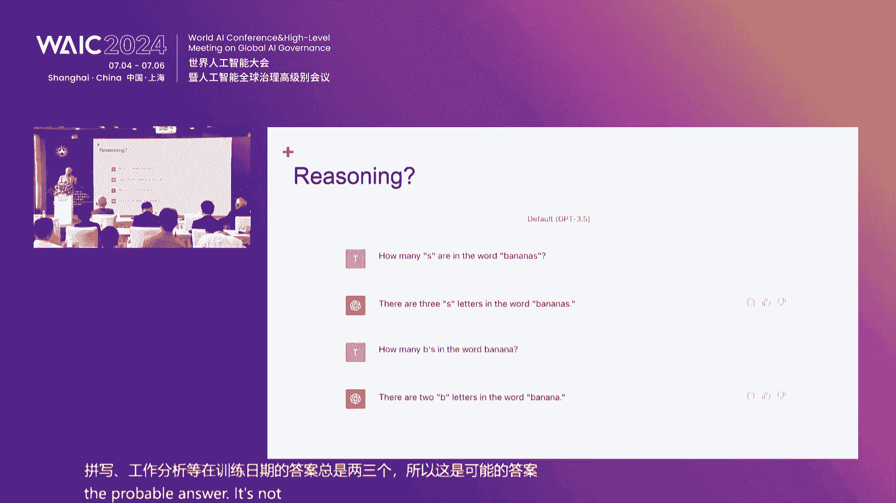
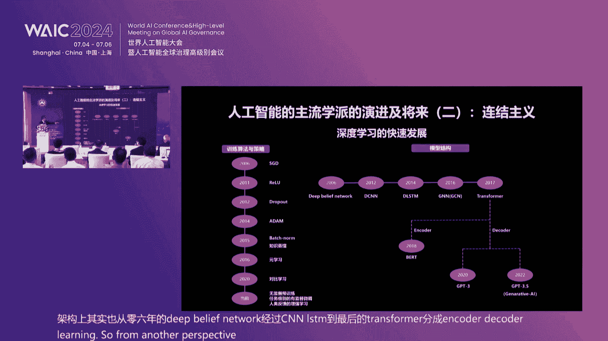
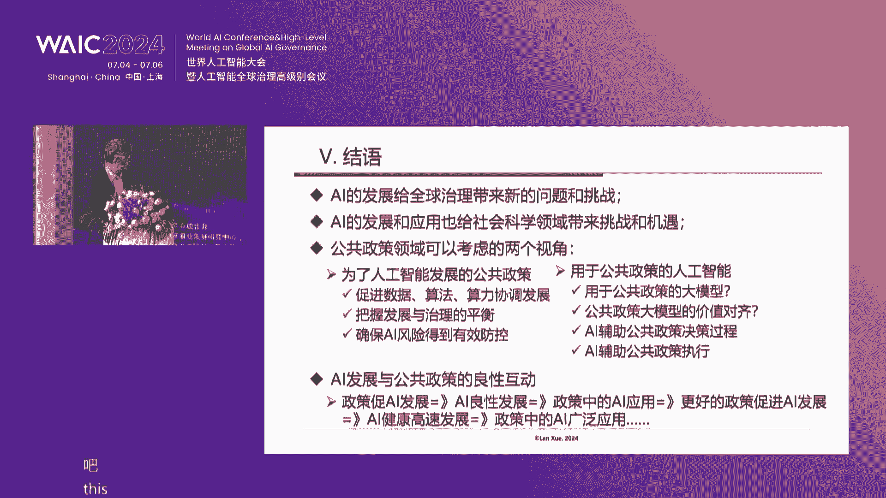
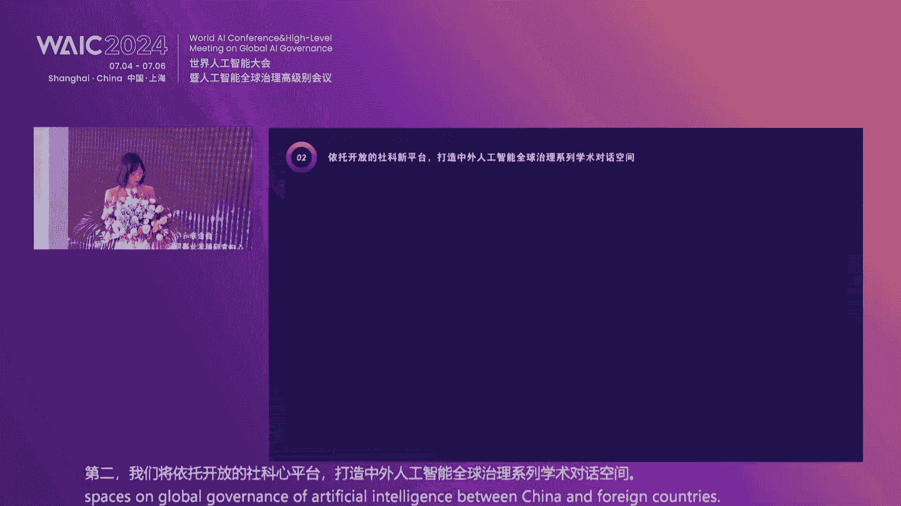

# P38：20240705-人工智能新进展与社会科学的未来论坛 - WarrenHua - BV1iT421k7Bv

嗯。🤢，好。尊敬的各位嘉宾。各位专家学者、女士们、先生们。朋友们，下午好。非常感谢大家来到本次论坛。当今世界，新一轮科技革命和产业变革深入发展。技术创新进入了前所未有的密集活跃区。总书记强调指出。

人工智能是新一轮科技革命和产业变革的重要驱动力量。将对全球经济社会发展和人类文明的进步产生深远影响。中国愿同世界各国一道，把握数字化、网络化、智能化的发展机遇，深化人工智能发展和治理国际合作。

为推动人工智能健康发展促进世界经济增长，增进各国人民福祉而努力。2024年，世界人工智能大会以共商出共享，以擅自出擅自为主题。正突出反映了对人工智能发展中社会规范、科技伦理议题重要意义的高度关注。

本次论坛以人工智能新进展与社会科学的未来为主题。旨在探索人工智能与社会科学的双向赋能路径，推进人工智能与社会科学的融合发展。促进对人工智能技术负责任的。科技科学研究和应用探索。

为人工智能的健康良性发展提供有力的社科支撑，同时赋予人文社会科学、更具前沿性、时代性的研究事野。这既是贯彻落实总书记关于人工智能重要讲话和指示精神的一个具体的举措，也是上海社科界发挥学科优势。

推动全球人工智能治理的上海实践，助力中国式现代化的上海探索的实际行动。本次论坛由上海市社会科学界联合会主办。上海市社会科学事业发展研究中心、华东师范大学政治与国际关系学院、华东政法大学政治学研究院承办。

学术阅刊，探索与争明上海社会科学馆承办协办还得到了科大讯飞、钉钉、未来智能等相关企业的特别支持。现在请允许我向大家介绍出席今天论坛的各位嘉宾，他们是中共上海市委宣传部副部长权恒先生。

第十三届全国人大宪法和法律委员会副主任委员、最高人民法院原副院长江必新先生。上海市社联第六届主席秦少德先生。上海市社联主席王占先生。澳大利亚科学院院士新南威尔士大学计算机教授托比沃尔斯先生。

上海市社联副主席、同济大学常务副校长吕培明先生。上海市社联副主席、交通大学校务委员会专职副主任顾峰先生。华东政法大学党委副书记韩强先生。还有我们社联专职副主席任晓文先生。

这个清华大学的这个薛兰先生和科达讯飞的联合创始人未来职能董尚胡毅先生呃，现在可能在来的路上。那么此外。

我们还非常荣幸的邀请到了国内外有关高校研究机构的专家学者代表、上海社联主席团的部分成员以及相关学会研究机构、企业代表，还有新闻媒体的朋友们。在此呢，代表主办方向各位嘉宾的到来呢。

表示热烈的欢迎和衷心的感谢。下面我们有请市委宣传部副部长权恒先生致辞。尊敬的姜院长秦主席、王站主席、各位嘉宾，各位专家学者、女士们、先生们、朋友们，大家下午好。在这万木葱茏、生机勃发的美好时节。

非常高兴与大家相聚在上海世博中心，共同参加上海市社联主办的人工智能新进展与社会科学的未来论坛。来自国内外相关领域的重磅嘉宾和知名专家汇聚一堂，共同探究科技进步，给人类社会带来的影响。

携手推动人工智能的全球治理与国际合作，深度推进人工智能与社会科学的融合发展。具有十分重要的意义。首先，我代表上海市委宣传部向论坛的召开，表示热烈的祝贺，向与会的各位嘉宾、各位专家学者表示诚挚的欢迎。

当前，人工智能技术的快速发展和广泛应用，正在对经济发展、社会进步、人类生活产生极其深刻的影响。习近平总书记指出，新一代人工智能正在全球范围内勃发兴起，为经济社会发展注入了新动能。

正在深刻改变人们的生产生活方式。把握好这一发展机遇，处理好人工智能在法律、安全、就业、道德伦理和政府治理等方面的新课题。需要各国深化合作，共同探讨。放眼世界，作为新一轮科技革命和产业变革的重要驱动力量。

人工智能正在开启一场比工业革命发展速度更快，涉及面更广、颠覆性更强的社会变革。不可避免的对维系人类社会的伦理、道德、法治等带来极大冲击。人工智能科技的新挑战和新智力。

已成为全球各国需要共同面对的重要议题。加快构建人工智能发展和治理的国际合作体系，已成为全人类共同诉求。实践证明，人类社会每一次重大跃进，人类文明、每一次重大发展。

都离不开哲学社会科学的知识变革和思想先导。面对人工智能迅猛发展的科技新潮流，哲学社会科学绝不是也不能置身之外。一方面，人工智能与经济社会发展的深度融合，驱动了社会科学研究范式的变革。

催生了一批新的学科和学术增长点。另一方面，人工智能引发的道德、伦理、法律、安全、就业等领域的新的社会问题，使人工智能自身又成为社会科学重要的研究对象。

时代发展迫切需要哲学社会科学工作者与科技工作者紧密配合，对人工智能进行跟踪和研究，主动回应技术创新和社会变革的挑战，促进对人工智能技术负责任的科学研究和应用探索。新征程上，充分发挥人工智能的投雁效应。

大力推动人工智能健康发展、赋能经济社会高质量发展，是我们不容错失的共同机遇。当前，上海正在深入学习贯彻习近平总书记考察上海重要讲话精神和关于人工智能的重要论述。积极顺应时代潮流。

努力打造更具国际影响力的人工智能发展上海高地。哲学社会科学要发挥其自身独特优势和重要作用，深刻把握人工智能发展规律和特点。深入研判人工智能发展的潜在风险和带来的机遇。

不断加强与人工智能相关的法律、伦理、社会问题等研究，推动建立健全、保障人工智能健康发展的法律法规、制度体系、伦理道德。让人工智能研究实现与社会科学的双向赋能。在符合人类价值和伦理的前提下。

提升人类的认知社会和改造社会的能力，让人工智能科技点亮人类文明的美好未来。创新驱动未来新发展、新需求，呼唤新的治理。本次论坛搭建了国际化的交流平台，汇聚了众多政府部门、社科研究机构和领军企业的代表。

希望在各位嘉宾的共同努力下，把本次论坛办成交流思想、分享智慧、携手合作、推动发展的重要平台。衷心期望大家以本次论坛的举办为契机，进一步深化人工智能在多学科多领域的应用、交流与合作。

为人工智能的健康、良性发展提供有力的社科支撑、理论支撑和智力支撑。让人工智能更好的造福人类社会，为增进各国人民福祉，推动人类文明进步做出更大的贡献。最后，祝愿本次论坛取得圆满成功，谢谢大家。

感谢全部长热情洋溢的致辞。这个大家知道啊，全部长以前也是我们社联的党组书记，所以对这次论坛的召开是高度重视，也是大力支持。对论坛提出了诸多的要求，也为社会科学如何把握时代脉搏，响应时代的变化。

提出了新的要求，再次感谢。下面我们进入主旨报告环节。首先有请第十三届全国人大宪法和法律委员会副主任委员、最高人民法院原副院长姜必新做题为促进人工智能发展创新的法治框架，大家掌声欢迎。尊敬的钱恒部长。

王伟松书记。秦少德主席。王战主席，尊敬的各位嘉宾，特别是来自国外的各位朋友。啊，各位媒体的朋友，大家下午好。首先呢啊我对啊这一次啊促进人工智能发展啊这样一个相关的这样一个论坛的成功举盼，表示热烈的祝贺。

对啊这一是论坛的主办方啊，上海市社联。邀请我参加这样一个非常有益的论坛，并给我组织发言的机会表示感谢。同时也对啊在座各位啊一些国内外的专家长期以来啊这个对啊人工智能啊所做出的贡献啊表示敬意。呃。

根据这次论坛的安排，我今天讲的主题啊是促进人工智能发展创新的法治框架。呃，我想呢核心的是两个方面的一啊这个内容。一方面呢，为什么要构建这样一个法治的啊框架？第二呢啊这个框架怎么样来搭建啊。

主要是讲这两方面的内容。关于第一个方面的内容啊，我把它概括为七句化啊，为什么要构建这样略框架？呃，由于时间关系我就不展开。第一句话。人工智能是当今世界。解放人、塑造人。使人真正成其为人的。最前沿的。

最重要的。功绩之一啊。这是讲人工智能它的重要价值。这是第一句话，因为他重要，是我们要关注。第二。人工智能是当今世界竞争最为激烈的。常域之一呃。因为竞争激烈。所以我们要关注。第三句话。人工智能。

是带给人类极大的福祉的同时啊，在带给人类极大的。扶持的同时，有带给人类。极多的风险。甚至是恐惧啊，有些人甚至感到恐惧啊。为什么？因为他是一把双刃剑？所以要。规则。治理。第四。

人工智能在带给世界诸的诸多的确定性的好处的同时。有带个这个世界。诸多的不确定性。因为不确定我们需要法制。来。稳定可依见。时间稳定还可以见行。第五句话。啊，法治是最稳定、最可预切、最具有效力的治理工具。

所以呢这个促进科技。向上。不仅要靠能力。引导啊，而且要靠法制保障。哎，这是从法治的性质啊，它的功能角度来看啊。法制化的这样一个重要性。第六啊第六句话就是。在这个世界上。速度最快的。机器或者动力装置。

无一不是。会有良好的安全法和制动法的。这样一个具体。和动力装置。嗯。也就是说，只有有安装好备好。自动法和安全法。才能够走得更快走得更远。才能够行为这样。是吧。这个人工智能没有法制的保障，走不远的。这是。

第。六句话第七句话。当今全球的科技竞争，不仅是新型智能基础设施的角筑。更是。数字文明和创新。制度生态或者法制生态的比拼。啊，不仅是他的看他的设备，看他的装置，看他的技术。啊，更多还有一个。制度啊。

法制制度生态。这个我是从这么七计化啊来概括。为什么要有一个？法制的框架啊，这是我要表达的第一个意思。第二个意思呢。我想说一说呢，这个。那么怎么样来搭建？这样一个法制框架啊，怎么样搭建这个法制框架？嗯。

我想的。这个从三个方面。来展开。第一个方面的。是治理的理念上，从治理的理念。来讲，他应该是本着一个什么样的理念。来进行治理，来搭建这个框架。第二呢。在治理的内容上。啊，他需要从哪些内容方面来展开。

第三呢。嗯，从的这个。啊，治理的策略上。啊，策略上方式上。怎么选择？啊，重点是讲这三方面内容。那从。呃，治理的理念上来说。啊。我。比较关注的是咱们六个统一。啊，6个统一。第一个同意。

是既要啊坚持以人为本，以尊重客观规律。嗯。相统一。以人为本是人的需求，是主观方面的。尊重规律，它是客观方面的啊，这个规律啊有科学自然科学的规律，人工智能发展的规律。哎。还有啊我们归制啊一个对象。法律。

规制社会关系的一些规律。所以这是一个统一。第二个同意。是要做到防风险。以谋发展保创新的统一。那我们过去是比较关注防风险的。我们制定了安全法，数据安全法也制定了啊个人信息保护法。那但是呢促进发展方面的。

当然我们是成绩比较低，国家层面法律还没有，所以要做到既要防风险，又要谋发展，保创新。这这是我们这一次啊啊这个论坛的主题。我觉得这个当下这是我们一个短板一个弱项。所以呢在这个方面我们要用力啊。

就是一个是防风险，一个是要谋发展和啊保创新。哎，这个要统一起来。第三。要做到防止垄断和数字鸿沟。以促进公平竞争的统一。你防织上垄断是对的，放着树树字鸿沟也是对的，但是促进公平竞争。这个也要统一起来。

这是第三。第四啊第四是维护个人的权利。一。促进啊。数据的流通和应用。统一些了。啊。这里光保护人的啊权利，大家是吧数字不流通，那也没办法享用，是吧？这个要同意。第五啊是要。确保国家安全。

和啊促进国际交流与合作的统一啊，这两个方面也要统一起来。这是第五。这个第六万。维护数字产权，以谋求社会共生。互信普惠。同意啊。数字产权是要啊维护的，但是。还有个互惠问题，还有一个普惠问题啊。

这个问题也是要统一的。我想呢这个六个统一是不是可以构成往卖？在进行法啊。这个促进这个法制框架的建构的过程中，需要注意的个基本的啊一个指导思想，也是个指导思想问题。这是第一啊。别人呢。

就是在规呃治理的内容上啊，我觉得呢。要做到呢这么几个既要又要啊，做到几个既要又要。四个既要又要。嗯。一个是从法制体系方面来说。既要。啊，这个构建完备的。有关人工智能的法律规范体系。现在呢我们规范体系。

呃，应该说。还不太健全，尤其是在促境保护这方面，很多是在。地方层面或者部门规章的层面成成绩比较低，国家法律的层面还没有。你像欧盟，像有些其他国家已经在这个方面有专门的法律。所以这是在这个意义上啊。

是不是可以在条件成熟的时候啊，尤其是要是不是可以制定专门的人工智能法。哎，我觉得这是应该提到12层上来。这是第一。第二呢。啊，同时呢，在这个制定法律规范体系的时候，又要呢。啊。这个完善好法治实施体系啊。

法律的实施体系。包括执法、司法以及啊守法。呃，特别是在监管体系方面啊，这个监管体系方面要。啊，更加完善。所以这是呢我想的一个既要又要。第二呢。从规范的主体方面来说。既要规范设计者、制造者。啊，又要规范。

平台的啊。这个建造者。嗯，和传播者使用者。是前链条的规范，你不能只规范一部分，而不规范另一部分。其实有很多消费者，包括消费者呃。这个你也是要规范的，呃，不是说呃他只想有潜力，没有用。

所以呢这个前链条的规范，这是呢第二啊第二，当然有重点啊，重点人工智能设计者、生产者再加上平安有很多啊这个制造商，这个是。重点。但是呢其他人也要相应的做一些规范。这是第二。啊，内容上的第第二，第三呢。

既要啊确保数据的。客观全面、完整丰富啊，既要对数据。进一些。规制。书记进行规则，又要对算法和算例。进行规则。哎，这是个核心的内容。那对数据呢，他也有两方面的对数据既要确保数据的客观全面。完整。丰富嗯。

又要防止数据被篡改，被切取。北线路或者是。不当使用。不当使用确失这个是也是一个很重要的方面。其实啊这是数据方面的。这个。对数据的规范是我们人工智能很重要。因为人工智能它的智慧来源于什么？

它的智慧来源于数据，没有数据就没有智能。所以数据是基础。第二。算法和算力，同时要规范算法和算力的问题。算法。关于算法的既有。为算法设定实体赠与规则跟他设定一下。算法的实体规则哎。不可这样不能这样。

应该这样应该怎样，必须怎样，禁止怎样，必须。分类别的要做出这样一个基本的规范，呃，这是算法。但是同时又要为算法确定可解释可回溯、可问责。一些形式规范或者是程序规范。实体和形式要结合起来。

这些程序是什么呢？基本的从国外的来看。第一。备案第二，评估。第三，认证。第四许可。基本的程序规范。嗯。保证他算法的。这一。现在这个算法老是说一般人不理解呃，再一个他比较隐蔽啊，所以呢很难以识别。

所以呢基本上是黑箱印作。那怎么样规范算法？这是我们一个核心内容。这是啊。第三呢，这还有一个呢算例。那么算利即要为各种算力。构成算裂的硬件软件。设置一个标准。对算力来说，一个重点它的标准的设定。

要建立一个实体标准。那么同时也要确保各种软件的安全可靠。嗯。真实的。第三大块。一个。基本的一些内容。第四呢。这个从规范的构成上来看。既要为所有的相关主体。利益相关者。与人工自能的所有相关者、利益相关者。

呃，配置权利这个权利的配置类型化不同的主体。配置不同的权利。同时也要为所有的相关者。那么设定义务和明确的责任。和明确的责任。所以这些。啊，也是。法律。规则一个很重要的一个内容啊。做到四个既要又要。

这是我个人啊就是在它的基本内容上。第三。是在规制的策略上。这一点非常重要。规则的策略上。因为。哎，人工智能。它是一个新的形态，新的啊很多新的模型。啊，而是在不断的出现日新夜异。所以这需要在规则的策略上。

高度关注。那么这个策略我呢。嗯。把它归纳到若干个结合。若干因为时间，那就不能展开若干个结合。第一个结合呢是立规与立德相结合，既要立规，要立德立德既要建立能力规则衔接跟能力体系。啊。

上一次这个人工智能大会在论坛上我讲的就是关于人力体系的建构问题啊，所以这个立规和立德。相结合。这个是。呃，你要立规呀，仅仅是立规呀，老实说钻空子啊嗯，那要钻起空子来。呃，那你这个再多的规范管不住的。

那么必须要理得解决内心的问题啊，解决向善的问题。这是第一。第二。付钱以客者相结合。所以要真正法律规范，起到作用，你是必须要付钱。有了付钱。他就有动力来保证这一个。规则的实施仅仅是课责，是没有办法实施的。

只要有付钱，那么通过权利人维护对权利的维护来维护法律规则，来贯彻实施规则。这才有有保障。所以。富权和贵则啊客责。相结合。第三。是了，这个。啊，要做好啊。设置底线和包容监管。包容审慎监管相结合。

那对于这些人工智能大多数新的领域。有人说新的领念，我们一定要包露神慎。我个人是不赞成这个观点的。在新的领由底线必须要设定。你在心你再那个第一，不能侵犯他人权利。第二，不能损害社会公共利益。第三。

不能损害国家利益。第四不能危害国家安全。是不是？这些基本的底线你肯定要坚守，凡是你。这些基本底线维护的啊，你。破了在底下。那肯定都得追究责任，是不是你再心。那你干这事不可以是吧？所以设置底线。再一个呢。

审深包容。深圳包容是对些新的东西，新的问题，新的业态，新的模式。他有没有危害性？多大的危害性？一时看不清楚。看不清楚，你不能随便就疯掉，你不能随便就制裁。那就放一放，等一等，弄清楚以后再来嘛，是吧。

再来管，那不是啊。所以呢这个审慎监管呢它是有适用礼仪的，不是一虑的就是包容。他要和底线。结合起来。真是的。啊，第三。第四。嗯，是要。统治和内置相结合。那么规范人工智能肯定要统一，法制要统一是吧？

但是一定要分类。一定要分类，一锅煮一刀切是一定治不好的，而且会制出问题出来的。分几分类是吧？你像欧盟分四类。哎，这个风险不可。呃，不可接受的风险。啊。

高风险、有限风险、最小风险不同的风险用不同的规则办法。是不是这才科学。所以呢统治和内字相结合。第五，他字和制治相结合。他这是。啊，公共权力的。相关政府部门的监管叫他子。但是啊。一定要靠自治。

平台的制责发挥了极大的作用。哎，社会组织的治理发挥了巨大的作用。没有制止。那个没有合企业的合规，尤其是呃这个人工智能相关的企业的制止，关口政府是治理不过来的啊，就是。这个策略第五，第六。

政府和社会组织相结合。政府治理我们是长向。社会组织我们是弱小。其实在。国外社会组织担当了相当一部分的社会治理的质能，尤其是人工智能，这些利用这些专业团体呃。比政府去治理效果要好得多。

老师说我们不可能保证政府的都去精动这些科学技术，你不可能啊，你也养不起。靠社会组织发挥作用。这是第六。第七。硬字和软字相结合。是么。这个。刚强刚性的治理。嗯。这个是要要的，不要是不行的。啊。

那涉及到底线问题，一定要刚性啊。但是看不清楚的时候，更多的靠柔性。所以柔性倡导性的、指导性的呃。嗯，采取这一些引导性的柔性治理的方式啊。这个是啊地区啊干系和柔性。第八。嗯，第八呀。就是呢这个。嗯。

法制啊规制和纪制一个规范治理。哎，制度治理还有个技术。其实啊最终人工智能最后制服的。解决人工智能问题，还是要靠人工智能。考技术嗯。技术来治理相关的问题。这个啊我想呢这个是呃开发一些软件。

开发很多啊监督性的过滤性的啊等等的这一些其实啊啊有很重要的作用。这是呢第八。第九啊。就是呢这个呃事后的。啊，救济与事前的救济相结合呃，事前的预防相结合。因为开始啊。我们的这个呃。老总在这个初期。

你不要着急，不要过早的预防，因为你没搞明白，没搞清楚，你手剩的太长，可能就会不正当的干预。呃，甚至是搞错。那你解问题出来了之后再去去解决。呃，发现了社会问题，解决社会问题没问题。但是时间长了，有经验的。

我就可往前延伸。这是这是。然后。啊，第十啊。就是的批发啊，这个是呃，就是廉捷治理。和前周期治理相结合。啊，先出了问题，敏捷治理，对症下药。然后我实践有经验了前周期的治理。2是。失业了。是。啊。

系统治理和重点治理相结合。那么。当下我的经验资源有限，我只能抓重点。但是有经验以后，我要系统化嗯。第十二呢就是。嗯。有一个。嗯，批发与零售相结合。批发与零售相结合。其实开始我们啊对一个事物的认识。啊。

有个过程。那么你要指望搞一个系统性的规范。很难。嗯。你要搞急着搞。可能就搞错，可能去副作用。零售零售什么通过司法案例。通过典型案例。是吧通过法院判决。来梳立标杆。那么然后一个一个案例处理。

最后结业成求啊，系统化。然后上升为系统的司法解释，上升为法律。我觉得这个路子也是应该啊可取的。呃，还有很多，由于时间关系啊，我就不多说了。总之，人工智能问题啊，治理是一个系统工程。

也是一个啊复杂的长期的过程嗯。需要我们逐步的总结经验，不要着急，不要指望一步到位啊，我们呢逐步的慢慢总结经验，嗯，积业成求，最后形成一个体系化的啊法律治理体系。好，以上是我啊个人一些看法不一定。对。

欢迎大家批评指正好，谢谢。这个非常感谢姜院长啊，这次确实是百忙之中这个来参加我们的这个论坛。而且这个高不建瓴从这个治理的理念、内容策略等三个大的方面给我们梳理了这个再次感谢下面有请上海市社联主席王站做组旨报告。

题目是科技创新与科技伦理。有请。🎼因为 jobing那个。专家学者们，大家下午好。我今天呢就是讲的题目是科技创新科技论理。这次。世界人工。智能大会设立了。社科。这个分会。

而且呢以人工智能新进展与社会科学的发呃，社会科学的未来为为题呢，我觉得呢。很有必要啊很有必要。那个。我讲的呢可能大家会轻松点的啊，就是我主要讲的是这个40年来自己和。呃，科技创新。呃。

这个经历当中形成的一些体会啊形成体会。呃，最近有报道说说呢，迎接新的科技革命。那么乐观点讲，20。28年的。这个悲观点到2040年，也就是说呢。反正这个十几年当中，咱们就要进入新科技革命了。

就是以人工智能引领的新科技革命。我就想起来，40年前。我实际上也参加了。这个政府组织的。信息技术革命对策之。差不多就半个世纪了。那么。然后呢。在跨世纪的时候。其实。信息技术。产品。已经出现了过失。

这件事情呢，当初当初时任的市长徐康平市长专门跟我讨论过这个问题。啊，讨论过问。那么当时就想到。信息技术革命以后。将是什么样的科技？那么这方面的探索呢，在10年前。2015年。我呢。和我们。这个哲学所。

专门研究科技哲学的团队，我们一起探讨了这个问题。啊。当初翻译了世界上最权威的五本关于。人工智能的书。然后这个团队呢自己也出了5本专辑。那就是将近10年前的事情。那么去年。我自己出了本书。

题目在物证大会上发布的那题目就是人工智能与新科技革命。新駆組。所以下面我就这个这方面呢谈自己。四点认识。4点认识。第一个。就是。科技发展的。规律性。究竟是什么？这个250年来。

我们如果从瓦特蒸汽及革命算起。可以说呢。三次工业革命加上信息技术革命，将将要到来的人工智能革命。实施。他是有规律性的。这个规律性和人的认识有关系。啊，有关系。前面的工业革命。实际上。

是人的肢体功能的延伸。啊。比如说一个人在改造自然当中发现。我的体力不够啊。我的负重就是100斤。他就会想到我应该有什么发明，他能够承担起500斤的1000斤的甚至更重的东西。这些东西我们全部看到了。

人又会觉得呢？自己的腿太短。啊。所以呢。他。对交通这方面发明。从。啊，公路到铁路，到航天。所以我把它界定整个工业革命呢，实际上人的是人的肢体的功能的延伸。信息技术革命上了个层次了。

他实际上是人的神经系统的延伸。因为。你看我们信息技术革命起来5个阶段。第一个阶段。是。单片机。啊，单片级。80年代，那就说呢，他实际上。是一种神经元。过了几年到了90年代，出现了信息高速公路。啊。

实际上他逐步在形成神经系统。到了2004年。出现了。啊，物联网。感知。所以他这个逻辑关系。那。是很严格的。到最后呢又出了。大数据云计算。这些东西的出现，最后他在呼唤更高层次的。啊，更高层次的。科技革命。

那我把它定义在我这本书里面，我把它定叫内脑技术根。啊，这个内脑技术革命呢，我曾经和。复旦脑科学研究所的。啊，脑科学研究院的院长马兰同志呢曾经我们对过表，他是从自然科学角度讲，我从社会科学角度讲。

我想这个概念呢是能够成立的啊能够成立的。神经系统发展，最后要到了。啊，大脑皮实要变成整个。现在一个人脑，他实际上发挥的作用大概百分之几都不大。那很多还没有开放。

所以呢我们将迎来的一个真像刚才啊姜院长所讲的。应该说呢。人工智能还有很大的不确定性，它到底怎么发展？所以我觉得第一条把握规律性。第二个呢，我觉得。一般我们都认为高科学都认为科技是进步。

从搞社会科学的人来讲，科学不一定是进。对。科学也可能是反动。所以。科技的进步性。取决于科技论理。如果。没有一个。好的科技论理，那可能科技发发展当中呢会出现很多的问题。就说在工业革命当中，大家都知道。啊。

大家看过差林的个电电影。人变成了。不得努力在流水线上啊。就是拜物教，马克思所分析的拜物教人的异化。在信息技术革命。我们中国人应该说很有体会啊。在这当中出现了前所未有的电信诈骗。对于电信诈骗这个东西。

我感到很痛心。当我们几百个几百个从缅甸，从很多劳挝国家抓回来。都是年轻人。这里面涉及到可能是几百个家庭啊几百个家庭。最后呢，他把信息技术用于诈骗。诈骗谁？诈骗老人。

政府和我们整个社会的社会道德论理呢是一个极大的讽刺。啊，中国人都是强调要。尊敬老人。但是呢这个诈骗用年轻人去诈骗老人。把他一辈子钱给诈骗了。所以我觉得呢。在信息技术。革命时代。这个。

科技论理的问题已经是很严重。那么进了进入现在进入人工智能啊，在这个当中，我们已经可以看到一些迹象啊一些迹象。比如说。曾经。在好多年前。可能大家都有印象。在围棋界有一个阿尔法狗和韩国的围棋大师。

李世实之间的一。下为止。当然，最后。李四实败了。机器狗赢了。啊，也就是我们人工智能赢了。结果呢，李四是两年以后。就在韩国企院提出辞职。如果我是这个围棋大致，我也辞职，因为下围棋没意思了。啊。

你脑子聪明的，你肯定想我再怎么学几十年，我掌握了几千个棋谱，但是你不如。一个机器狗。机器口可以把你所有世界上微棋的起步全部给你。装在他的那个人工的内脑当中。那这个围棋什么意思呢？啊。

所以我觉得应该有一条。科技伦理当中有条界限，要有个负面清单。哪些领域应该是不让。人工智能去碰的。那些为人类创造了很多愉悦、快乐的领域。像围棋消的臭点，不要紧啊，开心啊。干嘛让机器狗去碰那个事情呢？

那这是我们搞社会科学的人要好好去研究的问题啊，要好好研究的问题。那么又又比如说最近又出现出现了个无人机现象。啊。无人机可以说是人工智能当中发展当中的一个。发展了很好的一个领域。问题是。

人工智能派什么用场？我们可以看到两个很典型的案例。在中国。我认为人工智能用的最好的是中国的农业。啊，原来农民很辛苦。要播种，要田间管理。现在农民拿个操重这个机器人，把这些所有活活都干完了。这我觉得。

如果说。机器人用于这样的领域应该说是非常好的。但是我们同时也看到。在。俄务冲突当中。双方都在用于机器人在用于打仗。我们发明。这个无人机。是用于打造的吗？啊。如果说是用于打仗，这种发明越多。

对人类越没好处。因此呢。我觉得。这个科技创新和。他的。科技论理这个东西啊。所以我给他定义科技的进步性，取决于科技论理。啊，拒觉科制的。那么刚才我们姜院长提到，现在。最早在这方面付诸于立法的是欧盟。

我觉得这个事情做的是对的。是做的对的。那么。第三个观点，我要讲的呢。就是。从科技革命。啊，科技创新今后会形成科技革命。从科技革命。到产业革命。这是两个概念。科技革命他着重于原创。科技发明。科技发明。

他实际上是个科技箱型。是个科技现象。而科技创新实际上是一个经济现象。前者是属于科技革命，后者是属于产业革命。也就是科技发明的东西，它转化为生产力啊，转化为生产力。那在这方面呢。一次科技革命。

他是有选择性的。也有排他性的。不是所有东西你现在发明了。都会构成一次新科技革命。我举三个例子。1946年。当时有两大方面。一个是晶体管。一个是激光。结果呢。晶体管构成了一次。科技革命。

而激光直到上个世纪末才逐步逐步跃起来。啊，做不准。上个世纪70年底底80年代初的时候。也有一场责任。啊。就是。我们。对不起，我讲80年代初的时候啊。当初日本用模拟技术啊，他在家电汽车上面发展的很好。

美国呢。他的方向搞数字技术。结果30年以后，我们看到。美国打败日本。当初日本差点说，我日本第一。结果是什么东西打不了他。就是。技术的选择性。是信息技术打败了模拟技术。这对我们是个提示，我们。

在现在我们可以说和美国在人工智能上面。算是第一梯队啊，当然我们和美国在这方面差距还很大啊，我们在应用上面做的比较好。的问题就在于啊。我们后面的所有选择很重要。那么。这个。还有呢。就是。有个案例。

至少在两三年前。我们呢。对原宇宙吹的很厉害。后来我统计了一下，全国有55个省市在它的五年计划里面都把元宇宙做为一个主要的功能。那么其实。在人工智能当中。原宇宙之所于一个常景产业是第三层次的。是。

到时GDP这些东西就是我们对这个方面。没有做一个整体的。认识。啊，觉得什么东西时髦啊，搞园艺周时髦，我就写了。作为我这今后作为一个未来产业或者战略产业去发展了。所以我搞这本书的时候呢。

就说整个人工智能发展。这一轮的信息革命啊这一轮的新技术革命实际上。他是一个系统工程。那这个系统工程。那么这个呢，我在后面会讲到啊会讲到。因此。第三个问题，我的结论是什么呢？

你不要以为现在你全国在搞各式各样的创新，各式各样的这个会形成次新科技革命。新科技革命会议有选择性的。那。他一定是集中在一个领域上面。突破然后形成了。产业群。供应链。所以我们这个选择呢要抓准抓对。

第四个我想讲的就是中国如何在新。这个人工智能新科技革命当中，我们能够走在前列。啊就在群里。这个问题呢，我想已经是一个。不在也媒急的事情，我刚接到通知啊。10天以后要到北京参加设十五五计划的起草。

我估计我们国家十五起草当中啊。15是到2030年。我们呢现代化建设。2035年设定目标。所以这个5年。或者十年对中国是非常关键。我们不能成为第二个日本巴下又甩开了。现在我很关注的说是。啊。国家。这个。

将。新型。那现代化的情。但是新兴现代化怎么建设？我们要关注我们在技术路线上面要好好的动点脑筋啊，动点脑筋。那么如何保持走在前面呢？有几个。观点啊第一个观点。我们对人工智能的认识。

我在那个书里面写的要形成一个金字塔的框架，三个层次。第一个层次。两句话。就是。原创在原创方面啊，原创方面现在是。从掐的GDP到zero，这越走呢美国走的很快，我们现在反而差距是有些拉大了。

还有个呢就是科技论理。科技论理应该成为我们在这方面的强项。第二个层次。实际上，一次科技革命一定要形成新的基础设施。那么数字时代的。基础设施是什么？想清楚。啊，比如说区块链啊，这个量子通讯啊。

G5G6技术啊，所有这些东西，实际上它都构成了我们走向是新科技革命新的基础设施啊，它不是公路、高铁这些东西。所以在这方面呢。那么这个当中的软件呢，包括算力算法啊、云音计算加大数据等等这些东西。

那么下面我们做的比较好的，比如AN项的。场景产业我们叫啊运用场景。中国在这方面做的非常漂亮啊，我甚至认为比美国都做的好。那么在这方面呢，我们必须要有个系统的认识。不能单庭出建啊。

所我今天全国都在搞原宇宙不对的。第二个呢。我觉得。对新的生产力必须要有个清晰的认识那。现在我宽了好多版本，大道理讲的很多。说白了本质是什么？新的生产的本质就是人工智能赋能与。各种业态和甚至是传统产业。

嗯。可能这个呢是最实在的，不然讲的话天花乱坠，新这生产的什么。不落地啊不招边制。那么。第三个呢就是原创上面我们要紧椎啊，比如说我们在。洪某。啊，鸿梦709900S。在这方面怎么追？安卓系统。

也比如说我们这次。从月亮上取得这个土壤月染这种效应。就是在这方面呢，我们要有原创的东西啊，要有原创东西。第四个呢，我想讲的是。上海本身。啊。上海在这方面，我们今天在上海开这个会。我们讲了三个先导产业。

五个战略性产业。我担心的是，我们面铺的太开。所谓突破突破，往往是从一个口子突破的。在上海。我们人工智能，我们的突破口到底在什么地方？对。我觉得。上海最有优势，最应该突破的。是生物医药。

在没有人工智能的时候，生物医药你要做一个新药。啊，特别是化学合成，它里边会涉及到很多东西，用多少量，你要无数的去试验。有了人工智能以后啊。他这个大数据帮你一计算，可能以前要花10年的时间。

他可能在几分钟帮你完成了。而上海在医疗方面是全国公认的。而且上海呢从临床上面从世界上我们的临床呢实际上是最多的。因此呢。我是主张不是说其他必要，我主张上海应该抓住一个突破口，突破了，再引领其他的突破。

现在我们已经有了个突破口。新能源。新能源中国是做的最好的。我们从。智能电网智能电网就是人工智能啊。智能电网下面我们有特高压。啊，有我们的。新能源就是光伏啊，风电、水能，还有我们的储能。啊。

这些在中国形成了整个一套。还有呢新能源汽车。因此呢这个突破了，我建议这是中国的突破啊，我建议上海找个突破口。生活医药能够争取突破，这样使我们在。后面。啊。其他领域的人工智能可以。啊。

带动起来能够做的更好。我就说这些，谢谢各位。好。感谢王主席这个。下面我们有请。澳大利亚。科学院院士，新南威尔斯大学计算机教授。托比沃斯教授做主旨报告，他的题目是人类世界中的人工智能。有请。

Thank you， Hoorable guests， ladies and gentlemen。It's always a great pleasure to be back in Shanghai。

 to be back here at the World AI Conference again。😊，To a country which in many respects。

 I feel embraces artificial intelligence as quickly as anywhere， if not quicker than anywhere。So。

 it's always。For that reason， a great pleasure to come。

As well as to enjoy the fantastic Chinese cuisine。I have spent。50 years。

 dreaming about artificialctic intelligence。And for 40 years。

 I've been at a university studying and trying to develop more and more sophisticated。

Artificial intelligence。And for most of those 40 years。No one cared。Which was fine， but no one cared。

Because it was science fiction。 It wasn't science fact。But in the last few years。

That's no longer the case。Most people。Politicians， the public。Other scientists， social scientists。

 most people now are caring greatly about artificial intelligence。I think， for many people。

It was the launch of large language models like ChaGBT that really captured the imagination。

 imagination of the public， the imagination of politicians。The the imagination of the world。

 that suddenly in a very concrete way。We had these AI tools that were now arriving that could do useful things。

And that we're going to have a profound。Impact。Upon so many different aspects of our lives。

But how we work， how we play our politics。Hard to think。

Of an aspect of our lives that they won't in some way， touch。And I think what is unique。

About this revolution， because it's not the first revolution。 We've had the industrial revolution。

 where steam engines， mechanization， electricity transformed the way we went about our lives。

This is just the internet， this is just another revolution。

 another technological driven revolution that is impacting our lives。

It will be as perhaps as impactful as many of those other revolutions。 and its often compared。

To being compared to electricity compared to the electrification of our lives。

I think it has one special， somewhat unique characteristic。In its impact。

And that's the speed with which it's arriving。The Internet took a decade to happen。

 We had to get people connected。 We had to get people online。

 The industrial revolution before it took 50 odd years to happen。 We had to build large machinery。

 We had to， We had to。We had we had to invest。Quite significantly。

 it took a while for the ideas to spread around the world。 this revolution。

 the AI driven revolution is happening quicker。Quicker than any other previous revolution。

 It's not a coincidence that open AI。 the company behind Jack GT is the fastest growing company in the history of capitalism。

It acquired a million users in the first week。And over a billion people one year later。

 have access to those tools。 We've never been able to so quickly。So profoundly change people's lives。

 interesting enough， the company， Open AI， is the fastest growing company in financial terms。

Of any company ever in the history of capitalism。It it went from no revenue to one year later。

 having over a billion dollars a year annualized revenue。

We have never seen such wealth being generated such so quickly。

It is not realized that this is the largest。Fastest gold rush。In history。没有。For many of us。

 it was a surprise that language， large language models like Chat B T got such an attention because what。

Their interesting is called its something called Open AI by surprise。How much of an impact they have。

 But these models aren't the first example of artificial of intelligence that was in our lives。

 As many， there are many other， much more invisible parts of artificial of intelligence that have been slowly。

 but surely invading our lives。This is perhaps the most common example of artificial intelligence in most people's lives。

 Any time you get directions from your smartphone or on your car's satellite navigation system。

 it's a little AI。It was developed at the Stanford Research Institute in the 1970s for a robot。

 shaking in a robot。To direct Shaky the robot， that algorithm， it actually even has a name。

 It's called A star search。Is now found on your smartphone。 It's finding in real time。

 the shortest way from A to B， taking account the current traffic conditions， the。

 the current bus and train time day or whatever it is。

 It's finding you the quickest way to get from A to B。

Just an example of how AI had started appearing in our lives without most of us realizing。

As another example， if you open a video streaming service。嗯。

Like Netflix or the Chinese equivalent to Netflix。They don't advertise it， but this。

He's actually an AI company。Everything that you see when you open a video streaming service like Netflix is decided for you by the artificial intelligence。

 Which of the rows that you see you know， recently watched when you new。New movies。

 those categories are chosen for you based upon what you're most likely to want to watch within each category。

 the order of the movies and the movies themselves again chosen for you by the AI。

 even the pictures that you see that illustrate the movies chosen for you is the ones that are most likely to appeal to you。

And over 80% of what people watch on a service like Netflix are not things that people chose to watch。

 The things that the AI recommended are world view。Is being mediated。By this artificial intelligence。

 and that， of course， is going to have quite significant consequence to， to the world that we're in。

We shouldn't be too carried away that's still a large distance we've got to go to make artificial intelligence is intelligent。

 possibly even more intelligent than human intelligence。

 and I can give a long list of examples I'm afraid this is an English example but hopefully you'll appreciate how silly。

 how stupid chatTPT can be， you ask it a question here like how many Ss the letter S are in the word bananas。

Now anyone who can speak English will know the answer。

 no one would ever make the mistake that Cha2BT makes， which says there are three ss in the word An。

 course there's anyone， the S at the end。So you make it even easier say how many bees。

In the the word bananas。 And you know， everyone who could speak English would know the answer is one。

 It just the first B at the start of the sentence。So of the world。But confident。

 he tells you there are two bees in the word bananas。Because。It's not understanding the language。

 like you and I understand the language。It's saying what's probable。

 And people do struggle to spell the word bananas。 The problem with the word banana is。

 does it have two or three A's and two or three Ns。 That's the problem that most people have。

 even English people have。Spreading the word bananas。 And so in the training data。

 the answer is always two or three。 So that's the probable answer。

 It's not understanding the question， like you and I understand the question。

But nevertheless， they can do many useful things。 They are already having a significant impact on a large number of jobs and very useful tools。

 and that will only continue to amplify。And I go back to my observation。 It's happening at speed。

 it's happening perhaps faster than any other previous technological driven revolution。

 not surprisingly then， many people are concerned about the impact that's going to have the societal impact that's going to have。

 especially on things like the future of work。This is a prediction made by the chief economist of the Bank of England。

Someone you would hope would under have some good understanding of the consequences of technologies like AI。

 predicting that 50% of jobs in the United Kingdom are at risk。Well。

 I can assure you if 50% of people in the United Kingdom were suddenly made unemployed。

 there would be social chaos。 there will be a breakdown in society。

 so fortunately I don't think this prediction is off is correct。

Many predictions can be traced back to an influential report that came out of the University of Oxford in 2013。

 the Fy and Osbourne report that。Predicted that 47% of jobs were at risk of being automated in the United States。

 and similar studies have been done in other nations， coming up to similar sorts of numbers。Now。

 I'm a scientist， so I looked carefully at the data in this report。What's interesting， actually。

 is that they actually used artificial intelligence to make the predictions。

 They use machine learning to make the prediction of the number of jobs that are to be automated。

 So the job of predicting jobs to be automated has already been automated。Some irony in that。

But if you look closely at the numbers。You realize that these sorts of analysis ignore lots of factors。

 They don't tell you about all the jobs that are going to be created。

Technology has always created more jobs in the past than it's destroyed。

 That doesn't guarantee the true in the future。It doesn't look at the changing demographics that we face that many countries。

 the aging population， doesn't look at the change in the work week， many countries。

 people who are exploring a four day week， those are all going to have to be factored into it。

 so we can't just say that because 47% of jobs can be automated but 47% of the people will be out of work。

It certainly won't be anything like that at all， but it certainly will be disruptive。

If you look carefully， though， at the data， look at the predictions being made here。

 this is one of the predictions。Taxi driver， truck driver is going to be automated。

And I think that's actually a correct prediction in 20 years time。

People aren't going to be owning their living in most cases， being taxi drivers and truck drivers。

 that job will be automated。 We are already if you hire a taxi in San Francisco in Singapore in several other cities around the world。

 and autonomous self-driving taxi can turn up and take you to your destination because the most expensive part of a taxi is the human driving it。

And that will mean that price of taxes plummet， mobility will be much more。

Chaply available to more people， which is bad news if you're a taxi driver。

Because you have to start asking yourself， what else is it that you can do。

 because driving a taxi is not something that we're going to be paying many people to do in the future。

Some of the other predictions you look at in that report。Those seem to be somewhat way off。

 This is one of the predictions， One of the most confident predictions that the report makes with 97% certainty that the job of repairing bicycles will be automated。

Now I have very little suspicion that ought that we have robots repairing bicycles。

For a number of reasons。I mean， first of all， it's a difficult fiddly job。

It's going to require a very expensive robot。 if we could get a robot to do that。And sadly。

 people who repair bicycles are not paid much money。

 So it makes no economic sense to replace a not very well paid human by a very expensive robot。

Another technical reason why we're not going to do that。

Is that I asked around my friends around the world people building robots。

 none of them are trying to build a bicycle repair robot。

 We're not going to build this robot by chance， and none of them have decided this is a useful endeavor to do。

And then the final reason why this isn't going to happen is actually。

 I think one of the most informative reasons。A friend of mine owns a bicycle shop。

 and I told her about this， and she said she was quite amused by this example。

 She said because she said， well， we lose money repairing bicycles。 and I said， oh， well。

 that's interesting to understand。 why do you repair bicycles then if you lose money。

 it costs you more to employ the people than it does you get charging them。

 which is to get people in the shop。sTo build a relationship with the customer。

 is to be able to eventually sell them their next bicycle。And again。

 we're not going to be buying bicycles。 We're not going to build relationships with robots。

Who repair our bicycles， we're going to build relationships with the people who repair our bicycles。

 who will then persuade us to buy another more expensive bicycle。Another one of the predictions。

 again， made with quite high confidence was the job of model。Was going to be replaced。Now， actually。

 I thought 10 years ago， I thought that was completely false。I thought there's no chance at all。

 robots don't know how to walk in high heels and we don't care what robots look like in clothes。

But it turns out I was wrong。 Turn out that。Apart from the job of being a model being photographed so you can make promotional materials。

 that has been automated or starting to be automated now because we've got generative AI that can generate pictures like this。

 they can generate it for any shape body for any race person， indeed。

 we can generate it so that it's you wearing the clothes so that when you go in the shop。

 you can see already what you look like in those clothes because the AI can do that for you。

OneOne other profession that' protected a game with high probability is going to be automated is the job of airline pilots。

This is an interesting one， because in some technical sense， we could do this。

Most of the time an aeroplane is flying。 it's not a human。 It's not a pilot。 It's flying the plane。

 It's the computer that's flying the plane。 but we've kept humans in the loop。

And I suspect we will do that for psychological as much as as technological reasons。

 which is that I don't think humans are prepared to hand over their lives to machines。

 I like the idea there's a human up front。Whose life also depends upon the plane successfully landing。

 even if most of the time they're just the human is just observing the computer。

 So that's a place where I think although technically it's possible， technically。

 it brings advantages。 We're still going to keep humans in the loop for other reasons。So just to end。

 I want to just talk about where does that leave opportunity for humans？

What are the things that humans are good at， The machines are bad at what are the things that machines are good at。

 Humans are bad at。And to solve this， I've got a little aid memoir， a triangle。

 a triangle of opportunity。You want to be at one of the corners of the triangle where there will be plentiful work Always。

 I suspect you don't want to be in the middle where the robots are going to take your job。

So there are three corners to a triangle at the top corner。

 We have the corner for people like myself。People who are inventing the future。

There is a future in inventing the future。 That's never going to go away。Now， not everyone wants to。

Play around with computers and invent the future。 I understand that。 Fortunately。

 there are two other corners with plentiful opportunity for those people， for people like yourselves。

 perhaps。😊，So on the left hand corner is the corner for people with social emotional intelligence。

Machines have limited social emotional intelligence。

 not clear if they ever will have good social emotional intelligence。I'm told， for example。

 the most important job of a CEO is their social and emotional intelligence。 They're leading people。

 They need to be inspirational。If you are a salesperson， a doctor， a psychologist， a politician。

 it's your emotional and social intelligence that's most important。

 and machines don't have emotional social intelligence， I'm not clear if they ever will。

That leaves one final corner to the triangle， which is for creativity。

 Machines have limited creativity。They are increasing in their creativity。 I'm not。

 I'm not convinced that we won't actually also get machines to be created。

 the latest antibiotic was discovered not by humans， but discovered by a machine。

 by a machine learning algorithm。But there's plentiful places in the artistic and the artis zone where even if machines could do those things。

 we won't care。Because art。Speaks to the human experience。 It speaks about fing in love。

 losing a loved one， contemplating your mortality， dealing with the mortality of your friends and your families。

Those are human experiences。 Machines will never experience that。

 So even a machine writes a wonderful sonnet or composes a marvelous piece of music。

 It won't speak to me in the way that humans。😊，Can speak to me。 And so those jobs will never go。

So I'm going to end there just to say I have written a couple of books about many of these topics。

 most of these books actually also are available in Chinese。

 the latest one faking it just published this month。

Copies have just become available called Faaking it， looking at the generative AI。

 looking at the fake AI and the AI fakes that are changing our lives。

But also as was mentioned by some of the earlier speakers， looking at some of the ethical challenges。

 the important ethical challenges that we need to address as this technology invades more of our lives。

 and so that book Machines Behaving badly， looks at those ethical challenges and I know not everyone wants to read nonfiction to read technical books although I'm told that they're written quite informatively and quite a light style for a wide audience。

 so I have written a fiction book。Ficction book thinking about our AI future called Cheing's legacy。

 Well， actually， I haven't written it。 Chant GT， and I wrote it。 I had the ideas。

 Chant GPT wrote all the words。 Thank you very much。非常感谢沃尔斯教授，下面有请科大讯飞联合创始人未来智能董事长胡玉先生做主旨报告。

题目是人工智能与未来社会，有请。好，非常高兴今天有机会跟大家来分享啊人工智能和我们未来社会的发展。😊，我呢是背景是做人工智能的，所以说呢我可能会先从技术的角度啊帮大家分析一下。现在人工智能。

有哪些是需要我们担心的，而有哪些呢？其实不是需要我们太担心的。因为一旦如果搞错了，我们该担心的和不该担心的这可能会对我们将来对人工智能。对未来社会的影响会产生一些误判。那么讲到这一点呢。

我们要从robot维娜开始讲起。很多人都知道arificial intelligence来自于1956年的达特毛斯会议。其实在这之前有一个更伟大的伟人啊，维纳是著名的数学家、哲学家。

当然他也提出了控制论，甚至在他的两本非常监涩，而且不能被大家读懂的书里面已经预测到将来的智能啊，对大家社会的影响。在这两本书里面，一本书叫sbernetics。或关于在动物和机器中控制与通讯的科学。

还有一本是因为前一本太复杂了，那么他又写了一个简本，the human use of human beings。呃，尽管如此，还是有很难。有人读懂他真正的内容，他主要里面提到了人类的反馈与自我调节。

它其实本质上是一个闭环的。我等一下会说到的一个体系，让人类可以啊预测和纠正自己的判断和动作。那么从信息理论的角度来讲，他已经发现了信息是一种可量化的实体。当然了，大家都知道信息论的创始人是先eno。

等一下我们会提到。那么他也提到了跨学科的应用啊，包括生物学、社会学、心理学和工程学。包括在这些书里面也提到了对伦理和社会产生的影响可能的。那么但是大家所熟知的并不是 cyberbernetics。

也就是我们讲的控制论而中国的啊。系统工程学的创始人钱学森其实就是从控制轮，包括他的导师冯卡门是第一条线下来的。但是呢我们都知道的是另外一条线，也就是从哥这证明了数学的不完备性。然后呢，到图灵。

他在1936年和1950年的两篇文章，特别是第二篇文章叫计算机器与智能，提出了图灵逻辑集。包括到冯瑞曼提出了冯罗面曼架构。那么确认了。呃。

我们讲的人工智能 artificialific intelligence这个比较被容易大家记录的名词，从此分成两条线。那么大家都知道，1956年的达特毛斯会议中间出现了信息论的创始人shanon。

其实信息论大家当时都认识到了，但是先on用非常聪明的一个信息商的概念啊来。应该讲规范了信息论，从而使通讯产业的发展成为可能。

那么当然还有得到诺贝尔奖的newwell以及后来被大家熟知的图灵奖的获得者mminky和simmo以及最近这两天突然又特别热的叫。因为最近有一个网络叫 network啊。

跟transformer可以相提并论。那么应该这看起来像是两条线，但是我们很快会发现他们的本质还是在维纳。下面的。一条不断的延伸。那么如果回顾人工智能历史，曾经有三种方法，一种叫符号主义。

就是指用我们人类所想到的。因为A到BB到C，所以A到C这样的方法。那么早期呢利用这种符号主义的研究思路呢，我们以为我们的神经元也是这样考虑的。其实不是这只是我们人类大脑的一种错觉。我们发现了逻辑推理。

那么佛号主义呢，后面又跟统计学进行了结合，从而形成了最后利用啊我们叫knowledge graph，也就用知识图谱带有概率的。逻辑推理形成了一种体系。但它的问题在于呢，它的覆盖性比较差。

经常呢当他没有建立对这个知识啊的覆盖的时候，这个系统是回答不出来问题的。但是一旦他知道回答这个问题，他知道自己回答的是对的。那么还有一种呢，就是大家所熟知的廉接主义。其实长期以来。

连接主义呢希望通过模拟人类的神经连接来实现。人工智能。但是呢长期以来，他在人工智能研究里面属于旁门左道。从1943年提出了神经元的数学模型到1957年第一个计算机的感知机出现，中间跌宕起伏。

特别是1969年minky写的一篇专注重大的打击的连接主义。那么到1999年最热门的领域叫做SM，也就是提出的的知识向量机。一直到2006年，我在香港大学学习的时候，谁也没有注意到这篇论文。

就是jore hint。那么在过去的发展中，从训练算法和策略，从2006年一直到最近的GPT3。5，大家看到的pretrain啊s fine tuning和human feedback learning。

那么从另外一条角度，它模型架构上，其实也从06年的dep belief network经过C n n lSTM到最后的transformer分成encod decoder。

那么enco呢是bt而 decoder就成了现在的transformer。

但这个过程。还有一另外一种看法，就是我们一直讲的行为主义。行为主义并不关心啊它是怎么实现智能的。那么它更注重于智能体在环境中实时的表现和反应。那么其实一开始的它也是用些规则来定义行为体的行为。

但是最重要的是它定义一个概念叫做状态机。就任何一个智能体它是有内在的状态和外在的表现两个东西。其实本质上来讲，这也是维纳和卡尔曼。

包括我们等一下会讲到的state space model啊所表现出来一个东西。最重要它体现了一个叫做跟周围的环境互动来学习。我们一般把它叫做强化学习。人类的生物探及生物就是这样演进而来的。

一般我们把它叫做 learning。当然到最后呢也可以用行为术来规定这种东西的行为。等一下我们会看到将来行为主义的具体表现，就是我马上要说到的巨生智能。那么从2014年开始啊，因为我们在推动。

人工智能进展的时候，14年大家都知道，刚刚alexnet很少imagenet的这个测试吧，中国也诞生了包括商汤矿世意图云虫在内的一系列公司。那么当年我参与创立的科大讯飞，一直是在做语音。

那么当时大家都在想，那么人工智能的核心是什么呢？肯定是computer vision和computergraphs，也就是图形学和图像学。因为所有人都认为视觉是最重要的。那么在2014年。

我提出来把我们的人和动物的智能。首先我们来看感知智能和运动智能。也就是说，从智能的表现上来讲。眼观利路，耳听八方，就是我感知周围的世界，而我感知周围世界的目的是为了逃跑和追捕。因为生物特别是动物的。😡。

最重要的是svive，我们要活下来，没有感知智能和运动智能联合。我们不可能在这个大自然中活下来。但是大家都知道，在2014年有一个奇人，也有以色列年轻的历史学家拉里写了一本书，人类简史。

他提到人类在农业革命工业革命，两次科学革命和三次技术革命之前有一个叫做认知革命认知革命的标志性艺术就是人发明了语言，大概在600万年人类历史发展历史上，在7万到2万年前。

只有我们的祖先非洲的智人三遍他们发明了语言。当时呢我就把这个智能呢对应的定义为认知智能。也就是说语言的理解知识的表达逻辑的推理和最终决策。那么人和动物都最缺乏的是什么智能呢，其实是运算。

因为你在非洲大草原上，你会算5367乘以3651是没有任何意义的。你记住1000个随机术也是没有任何意义的。这并不能帮助你活下来。😡，那么这是从最终效果上来分人工智能。

这就像 artificial intelligence一样。你说它分的有多精细，理论上有多正确，感知智能和认知边界到底在什么地方，这没有关系。因为它并不是一个学术研究。它对我们的产业。

那么从学习的路径上来看，大家看到的现在的transformer，也就是我们讲的啊MHA。😡，我把它叫做知识智能的学习方法。为什么这么来说呢？因为这种方法它是用通过阅读大量人总结出来的知识。

用文字和图形的方向表示出来。他学到了这些文字里面的内容，然后同时还能把它重复出来。😡，但是就像这些文字里面。😡，肯定是用某种语言来写。同时他要不是情感小说，要不是工具书，要不就是某些啊说明文档。

那么这里面自然就有翻百科，那么他同时也学会了中间的语言知识。那么这里面也会有些常识。比如说啊我们看到雪花漫天的落下，除非起风，你不会说雪花飘到了太空中，你不会看到这样的描述，这些描述对应的一些常识。

但是反过来，大部分的常识不会用文字的方法表现出来，为什么呢？因为所有地球人都知道牙刷看到了就知道抓起来刷牙，不需要再写个说明书，这个东西是用来刷牙的。😡，但是呢什么时候产生的逻辑推理能力呢？

是在GPT3。5里面，他们叫instructGPT他们把代码这种没有歧义的规范性的语言，就是getub上那些编程的代码放进去以后发生了个奇迹，突然他们产生了一种非常规范的推理的能力。

这种能力跟我们梦寐以求的用ro best就符号主义想得到的东西，正好结果类似。😡，但是如果我们看到右边。碳基生物的发展是因为这样发展的吗？碳极生物的发展的驱动力是因为谨慎生存和好奇探索。如果没有好奇心。

我们没法提出问题和发现问题。😡，但是在我们刚刚讲的这些智能之前。因为有了感知智能，有了运动智能，我们的生物才知道要怎么样子能够活下来，不要去太热的地方，不要去太冷的地方，不要去污染太重的地方。😡。

但是慢慢的随着神经系统的壮大，他开始有了意识和情感。更重要的动物也有一定的想象力和创造力。我们用好奇心来发现问题和提出问题。我们用想象力和创造力来定义问题。这个比解决问题还重要。

但是我们现在的学校培养的主要是解决问题的能力，定义的问题能力是需要想象力和创造力。动物都有想象力和创造力。在人类有了。😡，认知职能，也就是语语言以后，人类的想象力和创造力达到了一个极限。

它是最抽象的能力和联想的能力。这是你的意愿是告诉我的。😡，我们都知道一个量子的科学家，当他真正通晓量子技术的时候，他可以把它抽象到一个高维的概念。

而且他可以用一个农民所能听得懂的话来描述什么叫做量子效应。这个就是运用了吹象和联想。但是反过来。😡，我们知道transformer具备了啊逻辑推理语言知识，范百合和常识，就意味着他们拥有了意识和情感。

他们有了想象力创造力。他们。能够有记忆吗？我觉得并不能得到这个结论。如果他没有想象力创造力，他根本不能从凭空的数学上得到知识。就像我们看到的呃，从托罗密的地心说到布鲁诺哥白尼伽利略的日情说。

从地谷的数据到啊开普勒最后的行星三大定律，最后到牛顿的啊自然哲学的数学原理，我们不会看到这些东西。😡，那么第二种方式呢，就大家讲的巨生智能。在一个虚拟化的宇宙里面，也就是现在王仁勋呃所说的。

叫做omnibu，我们第一次不需要在真实宇宙里面去做强化学习。我们可以在一个虚拟的里面来做强化学习。它推动了我们今天看到的十八罗汉，也就是人形机器人的发展，但是其实还远远不够。😡，那么在这个过程中呢。

其实还有一个非常重要的东西叫做世界模型。因为我们人类和所有的生物生活在一个四四维时空场，只不过这个四维时空场呢，它在时间史上是单向的。因为时间既不可回溯也不可逆向。那么在这个过程中呢。

所有的动物和人类产生了在四维时空场中间的常识和经验。那么他是用我们的神经网络能够表示出来的，不管是大脑中的，还是我们现在的transformer，能够表示其中的一部分。它是用强化学习。

不断的通过探索和发现来感知到的。那么他也可以通过动态系访建模的方式，而且他可以自监督学习。他可以通过。😡，unsupervised的方法来逐步建立这样的常识和经验。而这种世界模型坦白的讲。

我们现在还没有找到一种办法，包括用神经网络的方法，包括用knowledge graph的方法来建立它。😡，那么关于人脑的工作经理，我们从脑科学和神经科学的角度有哪些是知道的，有哪些不是知道的呢？

我向大家着重的推荐这个人pm的创始人叫jeffins，他在1993年发med了pm在2003年把它卖掉。在他卖掉pm之前，pm已经卖出去1万台，他非常一台，非常幸运的是，2007年iphone横框赤世。

所有的个人数字助理PD全部diair。😡，他后面成立一个叫redwood，也就是湾曲的一个城市，命名的脑科学研究所。他出两本书，一本书叫unintelligence。

一本书叫a thousand brain。那么这里面受他的启发，我们可以看到几个方面的东西。第一个就是我们刚才看到的知识智能，也就transformer实现了感知智能和认知智能的融合。

主要有人类的大脑皮层在发挥作用。就是我们现在讲的交流，我们才能讲到对话，我们讲的专家系统。而另外一方面呢，巨生智能是由感知智能和运动智能的某种融合的表现。

我们有大脑皮层、中脑和小脑共同实现了我们的手眼协同。😡，那么第二个方面，我们可以知道的是人脑是一种prediction verification的机制在工作。他首先要对个东西做一个判断。同时呢。

他需要另外一条通路high level。这在数学上有点像数学的集合论的阿列夫林和阿列夫一。他在不同的层面上对他上一层的判断进行一个gidance，要确认这个判断是不是对的。

那么这种方式呢帮助我们大脑可以很低功率的方式来运行。在世界没有出现异常的时候。那么另外一个最后一个方面呢，就是我们现在最新的MIT的一篇论文已经揭示出来我们的神经网络。比如说我们的大脑皮层。

我们的丘脑中脑海马体和我们的小脑里面的神经细胞和它连接方式是完全不一样的。有各种各样的神经细胞。所以说呢它应该是个多样化的网络组合，而不是单一化。这里我要提一下尤和阿里呢是个历史学家。

他提出来语言很重要。但从我的角度来讲，我想跟大家分享一下，我们对语言的本质的理解。大家都知道，我们人类呢看到的原来都是无限连续的信息输入和输出了无线连续的控制输出。为什么这么说呢？

因为我们看到的听到的都是连续的。而我们的手的动作全是连续的。😡，大家都知道这种连续信息的商非常的高，它有很多混淆的地方但人类发明的语言以后，对它直接进行一个删减。我们用语言，也就是说语义、概念和状态。

这种无线联系。我把你打一顿，每一个动词，名词都是一个concept都是一个语义。那么有了这样大量的删减以后呢，我们会发现无限连续变成了无限离散。😡，啊，当我在信息输出的时候。

我给你看一幅画和用一个文字来描述这幅画，他们的信息量是完全不一样的。当我去控制输入的时候，我去点击按钮，纠正这些开关到不同的状态和我用语言去控制是不一样的。但是很不幸的是，他们之间不能够交叉的。😡。

运用。比如说我用语言说操纵一个窗口的拖动，你永远做不到，你不能说再往左边移一点，再往右边移一点，你还不如拿鼠标直接去操纵，这个是本质。😡，那么为什么说抢GPT是个大忽悠呢？很多人都认为。

scan law将带来AGI现在最大的。😡，数据中心在美国是4万张呃这个卡的，也就是最新的blackwareGB200为什么4万张卡呢？因为超过4万张。

美国已经没有一个地区的电力供应可以支持一个 center，所以现在要建的XR的是10万张卡，为了建这1万张卡的一个数据中心，他在旁边得建一个专用的发电站，但是是不是甚至他们还说要建一张100万张卡。

我的问题在于transformers是个什么东西呢？transform相当于我们大脑皮层里面的皮质柱，因为大脑层有6层在书里面他也提到了transformer这种东西类似于一个皮质柱的那种连接形式。

那么他有什么问题呢？刚说过了他的思维逻辑不是通过自然语言学到的，是通过规范化形式化的编程语言学到的，他还有ination为什么呢？因为他不知道自己不知道他只有prediction。

他没有ification这个在理论上他就没有这步第三个。😡，他不可能产生意识，因为在人脑里面产生意识的神经细胞和神经细胞连接和大脑皮层里面的皮质柱是完全不一样。😡，那么通往他的路径是什么呢？

我的导师提出了以下6个可能性。第一个我们提到的transformer是一种自回归结构，它不能够实现prediction verification。就是说你不能在你本层的这个层面解决超越这个层面的问题。

😡，那么第二个就是实现verification有三种方法。第一种方法，建立一个word model，用四维时空场上的经验和常识去盖，就你才不会做出离谱的判断。但是很不幸的是。

我们现在还没有一个模型可以描述人类和动物所产生的四维时空场中的世界模型。😡，那么我们用什么方式可以来做另外一种verification呢？就是显示逻辑推导。他是人类科学和哲学的。

基本也就是我们讲的哲科思维的第一性原理。我可以逻辑推导出来。当我做出一个直觉判断的时候，我可以用一个逻辑推导。就是我们讲的事后找解释，也许对，也许不对。但是它是另外一条路的东西。

那么我们还可以用一种方法来做，就是人类发明的数学和哲学。哲学我们刚刚说了，它是个逻辑。那数学是什么呢？数学第一次让我们知道了什么叫做高维。什么叫做后验概率，叫posts。😡，呃。

proability这个东西人脑和动物脑是完全没法计算的，因为它的数据量特别大，计算量特别高。但是很不幸的用数学完全可以做超高维数据层面的post probability。

这个东西完全可以来做verification。请问现在transform里面并没有显性的使用人类所发明出来的数学。包括我刚才讲的哲学。😡，说他就能通往AGI，我相信大家会做出自己的判断。

还有一个非常重要的就是说transformer这种结构产生不了意识情感和记忆，更加不可能从数据中发现新的知识。不好意思，我已经到2分钟了，再给我几分钟时间。😡，最重要的是。

transformer学到的全是书面上的显知识和死知识，但是他学不到我们人类最宝贵的隐知识和活知识，他都在我们大脑里面，没有人愿意把他知道的这些东西贡献出来。因为我贡献出来并没有任何好处。

如果不解决这个问题。我觉得transformer也只是一个沙河。你把书本上东西给他灌进去，他把你灌出来，如此而已。😡，那么对商业生态系统的影响，我们可以回溯到PZ互联网时代。消费者和消费者厂商之间。

他们通过网页进行交互，产生产生了很多的巨头啊。然后呢，到了移动互联网时代呢，大家变成手机，所有的消费者和消费厂商，不管你是卖水的还是卖电器的，你要去做呃，我们刚才说的什么东西呢？

你要做APP你要做不是做网页了，然后你要做公众号服务号，你要做抖音号，你要做呃视频号，那么这上面产生一些新的巨头。那么很多人无法理解传统消费品巨头，比如说龙山泉、娃哈哈，比如说伊利、蒙牛。

他们跟互联网巨头之间关系，互联网巨头很简单，互联网巨头全部是交易平台，不管是电商出行还是外外卖，包括大家认为的呃。娱乐，比如说游戏和社交，为什么说它是交易平台呢？因为上面必须有两个以上的智能体。

不然你不会去玩网游，你也不会去社交，相信我。😡，那么在这个过程中，为什么在5到7年的投资周期内几百亿投下去几百亿就能收回来？是因为他们是交易平台，而且通过线上化，通过数字化，通过网络化。

它实现了远比其他方面更容易得到的超级码台效应，赢者通吃和多寡头单一寡头垄断。当你在垄断的时候，你可以在5到7年内几百亿投下去，几百亿收上来。😡，中间没有任何技术节点创新，因为所有的技术节点。

包括互联网的，包括移动互联网的都已经被建好了。在这5到7年内，你完全只是通过产品和商业模式的革新，实现了单一挂通垄断，从而能够实现几百亿投下去，5到7年几百亿收上来。

这在任何其他的行业都是impposible的。😡，那么2019年我再问自己一个问题，AIOT时代商业生态系统如何转移？大家都知道交互是非常重要的。通过图形交互界面、触摸交互界面。那么下一代呢？

根据我刚才讲的，大家应该已经猜到了，语言之所以厉害，是因为。机器有显示屏，可以把它大脑东西直接播放给你，而人没有人要告诉机器是你大脑里面东西，除了跳舞画画写字打手势，还有一个办法，就像我现在这样讲话。

而机器正好能听到我们讲话，但是我刚也说了，他们互相之间不能交叉操作最新展示的其实就是那个时候我们讲的东西。那么我们来看结果吧。

时代会产生一些新的东西会加上的人工智能的消费和消厂商他们会有自己的比如说蒙牛有一个人会代表蒙牛的利益来告诉你人工智能的我的产品有什么好。但第一次消费者有了自己的ag他会代表消费者的利益。

他能够帮你去谈判，他能够帮你去买东西，他能够帮你去消费。那么在这个过程中，整个业生态系统大家可以看到传统的消费和消厂商不会消亡，他们会借助于人工智能向消费者，但是中间的我们讲的交易平台。😡。

会从原来的互联网以及移动互联网转化。那么互联网和移动化互联网巨头当然有优势，但在过程中也不排除一些新的交易平台的新兴产业，他们会出来。那么在这个过程中，对生活社会生活。其实自从蒸汽机发明以来。

我们大量的呃农民已经变成了脱产的贫种，他们游荡于社会。城市在南非，在印度，在巴西形成了贫民窟。那么这一步骤呢，但是大家注意到没有？在我讲的五大技术工程领域啊，基于生命能源于动力。材料与制造结构与设计。

信息与智能。原来的速度是非常非常慢的，蒸汽机到内燃机，然后内燃机再到呃我们现在的电动机，但现在速度越来越快。当技术的发展超过了人类。😡，职业替代退休的节奏的时候，这个节奏就会失配。

失去工作的人远远还没有到人工智能和机器人完全替代我们工作的时候，这会打量大量的社会的动荡。我觉得这个是要通过政府通过政策的方式来控制这一点。😡，给美国会带来什么呢？大家知道美国制造业空心化。

但是如果人工智能和机器人，他完全可以建立一些需要少量人类通过机器控制就完成的新的制造业。这对美国来讲其实是个机会。但是美国能不能做到这一点，我就不知道了。

它就不仅仅是一个啊它的最关键的就是下一代新的代表消费者利益的这些产品，包括。😡，你待着的你待着的不能动的空间和你待着的能动的空间和跟着你的这些消费品成为的核心。那么中国的这个优势是什么呢？

中国在技术实现与优化，应用开发与设备制造方面，远远领先于美国。但美国在科学探索与发现科技创新方面领先于中国。那么将来的四种产品，我把他们看成一般性价比的一般东西，中国很多的产品都是舶来品。

然后我们在上面做一些改良并且不断的降本，大家都知道这个降本是怎么来的，都通过内卷来的。因为我们延长了我们的工作时间，我们不要生活，我们也不要家庭，我们只知道挣钱。

那么其中还有一种叫做极致性价比的看上去一样的冒号好东西。这个东西我认为会极大的影响我们整个商业的生态的平衡。当然了，我们也看到一些高性价比的不一样好东西。保时捷很好，法拉利很好。

但是我们做出来同样消费者没见过的，认为跟保时捷法拉利一样好的东西，而且有高性价比。😡，但最终将给我们带来前途的是新质性价比的新品类的新东西。就像当年的。伟哥二甲双胍和四美哥路牌，我们以为他是干这个的。

其实他能干那个。比如说大架无人机，曾经我们以为他只是来代替直升机拍摄的。后来我们发现他是一种军火，大家都知道军火的利益。😡，那么人工智能对全球化3。0带来的可能影响呃，我想给大家分享一下。

大家知道全球化1。0是建立在英国的比较优势的基础上。那么每个国家有的擅长生产这个产品，有的擅长生产那个产品，通过海上贸易建立的1。0。

那么美国呢在1944年布林顿森林体系以及IBMIMF国际货币基金组织世界银行WTO联合国和北约建立以后，美国利用它的技术霸权，利用它的金融霸权，利用它的科技霸权。啊，我讲过了。

应该讲利用他的这个金融科技文化和军事。当然，他也高举了自由和民主的道德制高点。他用全球化公司来。我不应该用占领了攻全球的市场。并且分配了产业链的比较优势，把日德变成高端制造业。

把中国和东南亚变成资源制造业。美国充分的享受了高科技和金融的最大力头。那么3。0会怎么样呢？3。0，我觉得大家可以看到中国人现在的evolution内卷已经吓到了世界上所有的人。因为。

大家认为自由是我想干什么就能干什么，但是真正的自由是我想干什么可以不干。中国的工人说，星期六星天工作是我的自由。但是其实自由是欧洲的工人，星期六新天想不干，他可以不干。

但是我们没有让欧洲的工人有这样的自由。😡，所以说全球天3。0也许是胖东来，胖东来只在许昌和新乡两个地方，他的员工只工作5天甚至4天。他甚至把他收入的30%给员工，30%给公益，他只给自己留5%。

所以说当世界上的最高的科技只有中国和每日欧可以做的时候，也许其他地方需要他们自己的品牌，自己的生产，自己的销售和自己的消费的循环。这个可能才是全球化3。0。也就是说技术向上。

技术能给我们带来的可能是将来这么一种维。就再次感谢有这样的机会跟大家分享。我相信啊我们这个论坛一定会取得圆满成功，谢谢大家。😊，感谢啊感谢胡玉董事长这个。呃，慷慨澎湃，而且信息量巨大的一个这个演讲。呃。

接下来我们要有请这个清华大学文科资深教授苏思明书院院长薛兰教授做主旨报告。他的题目是人工智能的全球治理与合作。非常感谢这个薛兰教授本房之中赶到我们这个论坛来，谢谢。非常高兴啊参加今天这个这个论坛。

而且刚才我还还很幸运，你家听了听了一点听一点胡吁这个董事长的刚才非常精彩这个演讲。😊，嗯，那么今天的话呢，我我讲的话呢，是人工智能的全球治旅与合作。呃，我首先的话呢。

我想大家知道就是实际上人工智能最新的发展，其实是呃确实日新月异是吧？大模型出来，从20呃2022年11月出来以后的话呢，这个现在一年多是，简直是中国也是百魔大战。啊，那他的综合收益风险。

其实这个我想都不用说了。其实大家也都已已经知道是吧？那么这个里面的话呢，其实这些风险它带来的关键是实际上是治理。所以实际上是我们讲四个层面的风险，技术系统、伦理安全、社会应用和国家治理。那么这样的话呢。

它就带来我们需要去探讨怎么去能够去有效的治理。那这个有效的治理呢，它也有眼睛过程是吧？从呃首先是场域的这个呃这个应用啊，在这个在这个过程中的话呢。

那么发现可能数据治理和算法治理是很关键的那当然现在的话大家就特别强调的就是前沿的AI的治理。因为实际上确实是啊很担心会不会有些这个这个系统啊，它这个就跳出我们人类能控制的范围。那么人工智能呢。

它能带来的呃全球挑战的话呢，我觉得应该说啊呃最近这几年是慢慢大家越来越认识到它的潜在的问题。所以我想在过去可能就12个月这个里面的话呢，其实我们能看到是吧？就一系列的活动。你看从去年10月份。

古特雷斯组建这个呃专家组，然后英国举办人工智能安全峰会。啊后欧盟通过人工智能法案。然后呢，韩国的话呢和和和英国在已经举办了是吧，这个第二届人工智能安全峰会。那么今年就是本周一啊，这个联合国刚刚通过啊。

这个就是这个呃这个中国提出的呃中国牵头啊，提出的这个关于呃加强人工智能能力建设的国际合作协议啊，所以应该说啊可以说这个就是各方面大家都认识到这个治理的重要性。

所以这我我想也看到这个呃就上海人工智能大会啊，就等于把这个呃以善制促善制是吧？这我觉得这这是起的非常好的一个一个啊以共商促共享，然后以善制促善制这样作为主题真正把握了啊。

这个我们这个现在可以说时代的这种前沿。ね？那当然了，就是说这个人工智能权益这力其实也面临一系列的呃，就是这种新的挑战啊。呃。

所以我想我我在这儿的话也就比较呃就是坦诚的把来跟大家来分享一些这方面的一些呃问题是吧？首先的话呢，我想其实。就是我想可能我们当然很多的会场，我们可能不一定大家愿意来提。但是就是按照英文的讲的。

就是这个big elephant in the room。这个eleant elephantphant in the room就是地缘政治。地缘政治的问题的话呢，我们是没法回避的。

尤其是在人工智能的全球治理方面。那大家可以看到是吧？这个。没有保险啊。就是实际上是在这个在这个呃2017年之前啊，就中美其实两个国家的话呢，在科技合作方面是全世界最密切的两个国家。啊。

就联合中美联学者联合发表的容是全世界发表最联合发表最多的。那当时的合作行为是什么样的话呢？是大概是这样一个一个途径。那我把这个就是领域啊分成四类。我按照两个维度来来分。一类呃分的话。

就是说你这个合作呢可以促进经济。还有一类的话，你这个领域呃合作的话是可以加强国防啊。那这个的话呢，就是我们可以分析下就出了4个象限。第一个象限呢是又不加强国防，又不促进经济。啊，所谓没用的研究啊。

这就基础研究是吧？我们术研究没用的研究啊，它所以这个的话呢是是基础研究领域。呃，第二个研究领域的话，就是就是只加强国防，那不促进经济，那就国防或两用技术啊呃，这个是第二个。呃，第三个呃这领域的话呢。

就是又有可能加强国防，又有可能促进经济。那我想可能就是前沿领域，我们现在还不太清楚啊吧？然后第四个领域的话就是呃主要促进经济啊，不加强国防，这就是商业技术。所以这样的话我们就这四个大的这个领域的话呢。

我们能就看到就是在中美原来合作的话呢，是什么呢？原来的合作是基础研究，非常密切的合作。所以大部分论文都是在这方面的，是吧？然后国防的话呢，其实中美是没法合作的啊，这个美国原来有八桶协定啊。

这个这个然后后来的话呢冷战之后是变成这个马斯纳协议。这个其实实质就是要呃这个要呃这个就是禁止啊这些呃呃欧美这些国家向中国出口这个这个任何这方面的技术啊，所以这个当年是骆家辉呃做大使的时候呢。

呃我们曾经跟啊呃跟跟跟跟呃这个美国来交流谈判，说有没有可能把你那个清单啊能不能减少一点很长很长的清单，后来呃最后也没有没有做成。那么现在可能更不行。所以呢就是实际上这个马森纳协议其实就是对中国是防控啊。

就是这个禁止出口。那么商用技术原来的话呢，其实是在这个就是WTO啊tris这个协议下的话呢，啊大家进行商呃商业呃商业的交往。然后前移技术的话，原来是一个就是不确定的。现在的情况是什么？就是我现在列的。

首先的话呢，就是他实际的做法，它叫所谓叫小院高墙是吧？但实际的做法就是巴爸森纳协议的这个做法。向整其他各个方面去全面的去推广啊，去去去去渗透啊。

所以实际上呢现在其他这几个空间就完全被挤压的几乎没有了是吧？所以像这个就基础研究领域，现在只要是在这个所谓叫t啊。呃，这个就是这这个这个呃科学技术啊，这工程这领域的。呃，只要在这个领域的这些专家。

如果要到中国来啊，一般来讲他来之前，他如果交流前，他一般要根据他的学校要去通报。然后回来以后呢，可能要去写报告的啊，这个是我想这在可能在在原来是是没有的事情是吧？现在的话呢。

我我了解到情况是很多的都是需要的是吧。就是我觉得美国科学界从来没有这么听话过啊，但是现在是那被吓怕了。因为大家知道在之前的这china initiative是吧，那确实还是呃对很多的呃这个这个。

科学家还有很强的寒颤效应。然后的商用技术大家就不就不用说了是吧？美国其实完全是滥用这WTO的规则。用所谓国家安全的这种特例的话呢，基本上就所有的商用的潜移技术都都在这个禁止。

另外的潜沿技术也是全面的限制的。所以就是这个是目前的一个一个大的一个一个背景。那当家说你你说这个有什么用是吧？😡，那么我现在就说的话呢，如果我们要讨讨论人工智能的安全的合作。啊。

那我想可能这里面我不知道大家能不能想一象我我想可能我们这这可能都搞社会科学比较多是吧？这个这个可能搞这个呃人工智能技术不多。就是如果你要去跟呃这个你的对方啊，就是这个呃美国的专家。

你说我们讨论人工智能这个从技术领域，我们怎么去探讨共同的合作，有没有可能？就在目前的情况下，我觉得是几乎没有可能。我们大家来谈可以是吧？我们大家来谈，我们是搞社会科学的，我们去讨论这个准则啊。

讨论这个外交的呃，这个什么我们都没问题啊，但是技术专家他不敢去谈。包括很多企业他也不敢来。那企业实际上他不希望去露头，一旦露头以后，好，这个美国马上就把你加到这个就是entit list了。

是吧所以呃在这种情况下的话，如果没有一个基本的信任，没有一个基本的这种呃呃呃安全感，我觉得没有办法去啊在这方面去交流。所以我说呢就这个是地缘政治。

首先就是给这种啊就所谓这种安全就是这个国际啊就人工智能啊，呃治理这方面的合作的话呢，就带来巨大的困扰。第二呢就是技术路径啊，技术路径的话呢，我想其实最近这段时间我以前也听到一些不同的专家啊。

开始对这个scalating law。开始有怀疑。因为大家知道这sing law的话呢，是呃很多专家我想这个胡对于这胡董事长的走了哈，他们是就是搞技术的专家还是比较相信。

这以你只要这个这个这个有足够的算力，你就。😊，给他上是吧，那他就会可能会带来一系列的呃不同的啊这种这种涌现，各种新的场景。但现在也有些专家是吧。

就谈到说是不是这是唯一的啊这个改善我们系统啊这个唯一的办法。是不是还有一些其他路径我们可以考虑啊，所以这个的话呢，我觉得可能下一步，我想在人工智能治理这方面也会可能会会是需要去去解决的问题。

第三个的话呢，就是致力于技术的步调的协调的问题。这个的话我想我们大家啊研究人工智能治理也都很清楚，就是人工智能技术啊，它的这个。呃，发展的话呢，它一个特点就是技术发展的非常快啊，技术就像这个蓝的线。

技术发展的非常快。但是的话呢我们相应的这种我们的治理的啊这种法律法规啊，我们的相关的一些机构的呢，我们这个变革制度变革它是比较缓慢的。所以就像这红线一样。所以这中间就有个差距啊，所以就说步调是不一致的。

所以这个步调不一致，我想其实在哪都一样啊，中国、美国呃欧洲其实都是一样的。所以这种步调不一致，也就导致就是说大家怎么感觉到好像这个人工智能这个技术发展，我们这个治理永远是跟不上啊，就是跟不上是吧？

那确实是目前是这样这样一个情况。所以这是可能第二啊就是呃呃第三个问题。第四个问题呢就是机制建构啊，机制建构就是我们怎么去我们这人工智能治理，我们需要什么样的一个一个一个呃呃呃体制机制啊？

那这方面呢也有一个很大的一个问题啊，这个问题是什么呢？就是我们叫随叫reg complex啊，就我们把它翻译成叫机制复合体。这个机时不合理，这这其实是在研究其他全球治理的问题呢，发现的一些现象。

在这儿是一样同样存在的。他是说的什么？就说你在一个比较复杂的一个全球性的问题上。你可能会有一系列的不同的治理机制。都对这个问题的话，他都有一点发言权。但他又没有完全的发言权。😡，而且这机制之间的话呢。

没有上下级的关系。啊，他可能互相可能呃可能有的是有一些呃这个这个协调的，有些是不协调，完全矛盾的。那这些这样的一些机制的话呢，可能都来参与这个的治理。啊，所以这样就导致就是我们看到这里面的。

你看呃这是我我曾经研究过一个就是基因数据它的治理是吧？但是我们那个研究的发现就是可能啊什么这个专业组织国际组织基金会呃，然后政府部门，然后还有立法机构等等，他们都可能会有参与参与到这个这里来。

他们都有他们的治理工具，有的是用他这个专业的标准，有的是用他的国际的这种宣言，有的是他的这种法律等等。所以有很多这些东西它放在一起的话呢，最后就形成一个啊可以说比较混乱的一个局面。

而且的话呢对很多的就是所谓当当事者啊，像我们在这可能就是企业啊或者AI的应用者，可能就感到无所适从。对这个的问题的话呢，就是也是这个就是。我们你讲应该算是治理机制的问题。呃，最后第五个啊就是就是监督啊。

就是人工智能它的这个治理的话呢，怎么去监督执行啊，大家知道这个跟呃所以很多人来讲说我们是不是能用呃呃对核技术的这个监管，我们用用它来作为一个呃呃例子是吧？那当然也可以，但这个大家知道有一个巨大的差别。

就是这个呃那个你要想搞核武器，一定要要提要是这个要要去把那个油去提纯啊，那这个的话呢，你你要有很巨大的那种那种离心机啊什么去去做。所以那个一下子很很快就容易发现了。人工智能不一样。

人工智能我们的大脑就是实验室。是吧那所以你这个里面他很多东西我们的日常的运行工作当中，我们就可以把它做出来。所以同样一群人他在一块可能一是打打打光蛋，还有一帮人可能就就就出大模型了，是吧？

所以这个中间的话，你你是看不出来的啊。所以呢就是就是这个监督执行，这也是一个巨大的问题。那就是如果真的我们讲要想去对这个人工智能治理的话，要去啊去去去把这个我们的法律法规呃执行起来。那要怎么去应对啊。

我们面临这个这个这术挑战啊，我想首先的话呢，是我们有没有可能考虑一下，就首先先把问题做一些梳理啊，就是对人工智能的这个这个治理的问题的话，分层啊分分层层次是吧？因为我们现在的话呢。

我们是呃这个啊这个我们我们想这治理问题。我们想这个老想是一下，有一个很系统的办法来解决。但现在呢可能有困难。就刚才我们讲的要很多的不同的机制都在做。所以那有可能我们就可以来先把它梳理一下，分分别类。

这样大家来分分工啊，就不要都都完全的话呢，这个想自上而下，统一全面的来做，可能分分别类，自下而上啊，可能更好一些。呃，第二个的话呢，就是在这个人工智能啊治理这方面的话呢。

就是我们怎么样能够真正是啊他真正是把人工智能的治理和人工智能的安全作为一个全球的公共产品来推出来。啊，而不是小圈子小啊俱乐部产品。呃，大家搞公共管理的话呢，可能都知道啊。

俱乐部产品呢就是我就我这小圈子里面我可以享受其他人对不起啊，你你你出去那。因为大家知道这个其实现在呢也有一些这个机制啊，包括这个这个我这个呃像呃英国啊这个去年开那个会之前，呃。

呃西方那些媒体呢居然在一直在炒作，呃，要不要邀请中国参加？我当时觉得这个问题听了后让人觉得呃，我觉得说的客气点是莫名其妙啊。呃说的要是不客气的话呢，就是这些人不知道自己在干什么。大家可以想想。

中国人工智能现在发展到这样的程度。如果你真正要想要人工智能，要想要要安全的话，你中国你不包括进来。我觉得就是所以就是这些西方就可以想象到有确实有一些人他们的偏见到了什么程度。啊。

所以我想呢就是在这些问题上的话呢，现在这种小圈子俱乐部仍然还是非常盛行的。这里面有很多具体的细节，我想可能大家未见的完全都清楚。但其实是很多国家并不是希望有一个全面开放包容的这样的品牌。

如果没有这样的心态，我想全球治理仍然是会非常困难。另外的话呢，我想所就是要要推动中美的科技领领域要有限的这个呃合作是吧？确实现在全面的合作变得非常困难。但是刚才谈到人工智能啊。

人工智能是可以说是全球的公共产品。啊，一个国家不安全，所有的国家都不安全。所以从这个角度来讲，我想就从美国的利益出发，他也应该要把中国放在一起来跟中国一起来去参与这方面的合作讨论。

所以我觉得这方面的话呢还是有好的迹象。大家也看到这个呃今年5月14号，然后中美两国政府一轨这个对话已经啊开始。那么二轨对话呢，我也参与了，也已经开始了是吧，所以我想这方面的话呢，希望能够去不断去推进。

呃，当然我想更多的是要拓展多层次、多渠道双边多边的这种交流对话。所以我们像啊这次这个我们像这样的这种研讨会，我想特别重要是吧？我想应该说到底，可能这些我们这些很多专家，不管是社科的。

还是呃这工工程技术的这些专家的这种交流互相的这种呃这这种这种信任理解。那我想对未来长远来讲的话呢，是会起到非常重要的作用。呃，最后的话呢，我想有一个建议就是说要推动呃AI领域的这种大科学的研究。

因为我们讲现在讲大家很担心说会不会这个人工智能，它哪天这个自主的这个这个出现啊，这个是可能会没有没有先兆的。呃，所以我想不知道我也看到这个咱们未研研研究院的这这个老师在这哈。

就是他实际上这个就有没有可能啊，就是我们各国家的科学家合作在一起。来来合作呃，来来去做一些什么叫contingency plan。就是我们叫在这个这个这个叫预案啊，咱们叫风就应对危机的预案。

因为真正如果这个不受人控制的这个系统出来以后呢，那就是一个危机。是吧那这个背机我们怎么去应对？我们现在有没有这样的预案？那这个预案就是可能需要从技术层面要要要要有很很多的研究。所以我想这样的研究的话。

如要能能这个来一起来合作啊。呃，我想我不知道时间情况怎么样哈，我其实后面还有一部分是呃跟我们这个主题信息有点相关。这从我这个人的领域的角度来讲啊，这个啊，那我想这个能不能再给我两分钟，是不持啊？好好了。

了记两分钟哈，我我就是说这个。😊，这个人工智能，我这个因为我想可能社会科学这个领域太宽了，我就从公共管理的领域，这是我比较熟悉的领域。我想就是我们讲这个实际上的话呢，我们实际上面临两类问题啊。

一类是为了人工智能发展的公共政策，就是policy forAI。所以这个实际上AI的发展对我们社会科家呢提供了一重大的机遇是吧？我们有好多问题我们需要去研究这个新的现象。所以这方面的话呢。

是我们可以啊需要去研究的公共政策怎么去推动它的发展，公共政策怎么去解决它的负面影响，怎么去防控风险。另外一点就是用于公共政策的人工智能，就是AI。For policy。

 For public policy。啊，所以我反正这个的话呢，就是怎么把人呃人工智能的工具能够用于公共政策的制定执行等等这方评估这一方面。所以我想这两方面的话呢，对我们都是有非常重要意义的。

所以我想这个我就呃不多说了，这这些都知道是吧？呃，我尤其这一页是吧，就是我们用于公共政策的人工智能AI啊，这个 public policy有很多的公共政策分析当中工作过程当中，还有啊其他的各方面的情况。

所以这方面的话呢，我想还是有很多今后可以深入探讨的。谢谢大家。

非常感谢这个。去了院长啊。这个刚才5位专家围绕人工智能对人类社会的影响以及人工智能与法律哲学、经济社会全球治理等方面的内容做了前瞻性的精彩的分享。

相信他们的报告将会推动人工智能与人文社会科学的深度融合发展起到积极的作用。进一步促进人工智能的全球合作和治理。那么论坛的主旨报告环节就到这里。下面我们这个进入论坛的第二阶段，请我们小文主席来主持。嗯。

谢谢维松书记呃，尊敬的各位嘉宾，各位专家学者、女生们、先生们、朋友们。呃，我接着主持我们今天论坛接下来的部分。刚才大家都谈到人工智能作为当今科技领域的热点和前沿。

正以前所未有的速度改变着我们的生活和世界。作为2024年世界人工智能大会的分论坛，就是今天我们的论坛。以人工智能新进展与社会科学的未来为主题定位，首次从。社会科学整体的事域出发。

展望人工智能与社会发展的交互影响，为社会科学深度回应人类社会步入人工智能时代这一重大变局，建立整体的学术事域。为我们构建学科化、制度化、规范化的人工智能时代人文社会科学体系贡献力量。

我们设联下属的上海社会科学发展研究中心。将以促进人工智能安全发展为己任，充分发挥社科平台的作用，组织开展人工智能全球治理研究，探索社会科学对人工智能的深度奠基意义与基础支撑作用。

推进人工智能与社会科学融合发展的学术研究和国际交流。接下来有请上海社会科学发展研究中心徐婷婷书记发布人工智能全球治理年度研究计划，大家欢迎。尊敬的各位嘉宾，各位专家学者。

下面由我代表上海社科中心发布人工智能全球治理年度研究计划。嗯，首先请允许我简单介绍一下单位情况。嗯，上海社科中心全称是上海市社会科学事业发展研究中心学术月刊杂志社。

它是上海社联下属事业单位及社会科学研究专业学术期刊出版社科场馆运营为一体。我们是2022年1月刚刚挂牌成立的。负责编辑出版学术月刊探索与证明两本社科类核心期刊运营上海社会科学馆上海社会科学会堂。

并开展公众社科教育，承担社会科学学术评价和社会思潮研究组织国内外学术交流。上海社科中心将在上海社联的指导下，以年度为单位组织开展如下工作。第一方面是依托学术名刊开设专栏专题。

促进学术界对人工智能全球治理的深入探讨。我们将在学术月刊探索与真明上开设人工智能、全球治理的专栏或者专题选题包括。人工智能的全球治理与国际合作，社会科学对人工智能发展和风险防范的重要作用。

人工智能应用的伦理边界和道德准则，适应人工智能发展的法律规制。社会科学如何认知人工智能或者是技术革命。人文社会科学经由知识体系更新，来掌握技术变化，影响文明眼进的解释话语权。人工智能对知识生产的影响。

人工智能与新智生产力，人工智能对人类生产方式或产业的影响。人工智能对人类观念与生活方式的影响。通用人工智能AGI的未来出现，及其对人类更加深刻的影响。通过如上选题的设置。

我们希望着力引导学术界关注社会科学与技术进步的关联，着重反映人工智能与社会科学融合发展的重大研究成果，鼓励不同观点的交流与碰撞，激发学术创新思维。第二，我们将依托开放的社科新平台。

打造中外人工智能全球治理系列学术对话空间。年内，我们将组织中外知名专家学者开展人工智能全球治理系列学术对话，以国际视野深度探讨人工智能发展所带来的社会影响。

议题涵盖基础教育、高等教育、职业教育、文化产业、医疗健康、财经法律、新闻出版、社会培训、职业转换、自主学习、劳动就业等公众关注的前沿问题，观点与成果将在主流媒体上公开刊发，扩大学术影响力和辐射范围。

化解人工智能可能带来的社会冲击。

第三，我们将依托雄厚的专家学者资源，开展人工智能全球治理年度报告研究与发布。召集包括社会科学学者、人工智能领域专家、政策研究人员等组成跨学科团队。刚刚薛兰老师也提到了这个。针对人工智能的新进展。

特别是通用人工智能的到来，我们将围绕各国在人工智能领域中的相关政策、发展水平、治理举措、关键企业资源投入等相关问题进行系统性研究。追踪各国人工智能。治理发展的最新动态、政策布局。

相关企业在各个领域的做法和最佳案例以及国际合作进行系统梳理。探讨全球治理面临的挑战和机遇，提出未来发展趋势和建议，形成和发布人工智能全球治理年度报告。将来在数据可得的情况下。

也可以形成人工智能、全球治理指数等产品，以保证人工智能的良性健康发展，为人类社会做出更大贡献。各位专家，各位学者。推动社会科学与人工智能融合发展，推进人工智能全球治理，期待您的加入，谢谢大家。呃。

谢谢徐婷婷书记。呃，接下来我们就要进入非常重要的圆桌对话环节了呃。在此之前啊。我们做一个放松的活动。大家可以在今天我们论坛的资料袋里找一找这张小卡片。论坛的资料袋里找一找这张小卡片。这是小卡片的正面。

啊，我看。这个在座的各位嘉宾已经找到了这张小卡片，然后这是这张小卡片的反面。上面写的是请写下您对人工智能与社会科学融合发展的建议。所以在接下来的时间当中，我们期待各位嘉宾。

在这张小卡片上写下你们对于今天会议主题的真执灼见，并且把写好的小卡片放在你们的名牌下面。今天的会议结束以后，我们的工作人员会收集起来啊，各位的建议。各位的建议，对于我们今天会议的主题。

对于人工智能以善制处这个善制。非常重要，谢谢大家。😊，呃，接下来我们进入今天的。第一场。袁桌会议。今天总共有两场啊。第一场的圆桌会议主题是。以人工智能的技术突破。啊，人工智能的技术突破与人类社会状况。

由华东师范大学政治与国际关系学院院长、起点研究院院长吴冠军教授主持参与第一场圆桌对话的嘉宾有。澳大利亚社会科科学院院士新南威尔士大学计算机教授托比沃什。华东师范大学政治与国际关系学院教授约瑟夫马奥尼。

上海社会科学院互联网研究中心主任、上海人工智能与社会发展研究会常务副会长惠志斌。复旦大学国际关系与公共事务学院教授数字与移动治理实验室主任郑磊。阿里巴巴集团研究员钉钉首席运营官付徐军。

我们各位嘉宾将围绕人工智能的技术突破，对于人类社会意味着什么？社会科学各学科如何看待这些技术变化及其。引发的社会变化等话题展开研讨。

复旦大学国际关系与公共事务学院教授熊一涵将对今天的第一场圆桌对话进行小结。有请参与第一场圆桌对话的各位嘉宾，大家欢迎。🎼I see you all well seated。

This actually forum of W AI C， is quite unique。We connect。Actually。

 the development of AI with the future of social science。Actually， at this roundtable。

 we have quite a few social scientists here。But I want to start with our actually the only computer scientist on the stage。

 Professor Toby Walsh。 Actually， I enjoy your keynote。 The title actually itself speaks a lot。

 artificial intelligence in a human world， which connects AI with social science。

 The question for you is we hear a lot， AI for science， now， AI for social science。

 So in what way in your opinion， Actually， AI can do social science and science research for us。

 We it just be actually in your words， fake the way we do research。😊，That's an excellent question。

Ar intelligence is going to change the social sciences in both directions。

 both in the way that you go about doing your science and in changing the questions that you need to ask。

Because it is going to be such an integral part of our world。

 It's going to change so many aspects of the things that we do that the questions that you now need to start asking。

 the perspectives， analysis that you need to do will be influenced by the fact that AI is an important actor in our world。

 but equally。It is a tool， and it will provide tools that will allow you to undertake your research or social science research that much more quickly。

 that much more better， that much more extensively。I， I really， just to end the question。

 My answer to your question， I wish we hadn't called it generative AI， because that。M Mr。

directs you it focuses your idea that we've now got AI that can generate images and audio and video。

 and you can do those things。 And that's， that's quite an amusing。 and in some cases。

 useful capability。 But actually， it's much。More useful， much more practical capabilities。

 its ability to summarize and synthesize information。 vast sets of information。

 You can now with a context window of a million tokens， a million words。

 You can now put in a complete book。And when you ask it questions of that， of that input。

 is's actually very accurate。 The hallucinations and all those things tend to go away。 Yeah。

 So it's a fantastic tool for assimilulating information。

 looking at data sets that humans might not have the ability。😊。

The the attention span to be able to look at。 So I think it offers the opportunity for those people who are quick to learn how to use it to transform the questions you could ask。

 as well as transforming the questions you should ask。 Yeah yeah okay。

 let's go back to the question later。 It is a fantastic tool according to Prossor To Walsh。

 So do you agree， Professor Mahoney， you are a political scientist。

 Is it just simply a tool for us to use summarize information or it can do more for social scientists。

😊，You know， I listened to Toby's keynote speech， and I listened very carefully to Wang Z's。

Sppeeech and his description of AI from a neuralsys perspective was very interesting right so you know one of the things that I have been thinking about coming here and certainly reflecting on on the talks that we've heard is and here I'm going to sound a little anachronistic but you know Aquinas argued in the 13th century that our capacity for ratioination is what separates humans from animals and the question that I have to ask is whether or not humans are an inferior are we inferior relative to AI when it comes to ratioination in other words maybe AI is in some ways by Aquinas's definition more human than we are and even if that's not true now maybe will be true in the future and you know we have obviously this this we talk a lot in China and elsewhere and I heard one of our other。

vissitors talking about Foucault in the car on the way over you know we have  Nietzsche。

 Ael Heide or Fouca and others who repudiated this idea of the modern human who they argue emerged in tanem with the renaissance enlightenment in the scientific industrial revolutions and they have variously asserted the rise of technological society has infrd or reduced people to the prisonhouse of being tools that serve other tools and so on now whether one seeks a prehuman or posthuman future should we not consider that AI might be regarded as most human most rational and toollike is is AI in the vanguard of this new being in the fourth industrial revolution now my third point is we have reached a point in time when the evolutionary advantages of autism understood is reflecting enhanced development of the analytical brain with the tradeoff of reduced efficiency for a process。

So information this is being discussed in leading scientific journals， so to reply again to Aquinas。

 we do not find， and this is where things get a little strange。

 we do not find the gene associated with autism in Neanderthals。However。

 we do find the highest proportion of Neanderthal DNA in Asians。And the aig Chinese included Chinese。

 especially so it's 8 to 24% in East Asia and we find it also in the aboriginal indigenous populations of the Americas while the Africans have none and the people of European descent are around 2% so the question for the human sciences is will we discover an evolutionary basis for the fundamental differences in。

 say Chinese philosophy and Western philosophy say the Chinese holistic unity of opposites versus the western law of noncontradiction are we in other words know these very things that perhaps produce the scientific revolution that has brought that to China and other parts of the world so this raises another question which today are distinctive cultural differences at risk given the potential of a totalizing hegemony of technology。

W point is there is increasing speculation in some cases。

 confirmation that many leading tech innovators are on the spectrum furthermore， more than a decade。

 scholars have debated whether earlier innovators were similarly distinguished。

 including those responsible for so-called paradigm shifts like Newton and Einstein as well as key figures in the humanities including Beethoven Mozart Kant and Witgenstein In Kant's case。

 the basis for such a postmtem diagnosis isn't derived solely from his idiosyncratic lifestyle。

 it's also discernible some have argued in the quotecol-hearted rationalism in his moral theory。

 now feminist have long argued that Kanttian philosophy lacks an appropriate regard for emotions。

 one that emphasizes an ethics of justice at odds with an ethics of care。

 and strikingly autism is much more common in men， men tend to dominate technology innovation and fears of a technopariarchy one that is advanced further by AI。

And in tandem maybe in tandem with a growing global phenomenon of hostile sexism directed against women。

 is perhaps intersecting with gender equality set biass associated with a global pandemic。

 and all of this deserves some close attention from social scientists。Finally， in the meantime。

 we have a Chinese law requiring that AI must adhere to socialist values。

 and this has been described by some critics as an impediment to AI development in China now I would argue to the contrary that we must think carefully about socialist values。

 and we need to ensure that AI and similar cultural phenomena do not overwhelm these aspects of being that some of us hold very dear。

 or risk overturning the teleological values associated， say with national rejuvenation。

 socialism with Chinese characters and so on。Okay， O。

 actually Professor Mahoney brought us a lot of insights。 and in contrast with GB， you talked a lot。

 not in in。Okay， let's put it symbolimplistic terms， actually， Toby。Actually， put forward the C this。

 Maybe it it's a good tool， fantastic tool。 And you use aquinaance suggesting hinting， actually。

 maybe there's something even more。😊，D human， something there like A， the future development of AI。

 How about Zbin a good friend， what side do you on or you have your own unique view on this。

用中文了哎呀OK yeah不是 languageOK。那个我觉得嗯人工智能的这样的一个技术的发展的这样的一个趋势是我觉得是不可逆转的。然后同时呢。对社会科学，包括整个人类的知识啊、伦理呀。

包括等等一系列的社会规则的改变。我觉得也是正在发生之中。所以我觉得我也不吃任何，比如说某种认为它是对的或者不对的。我觉得这个趋势是必然是发生的。那么在这个里面，如何就是我们去应对这样的一个技术。

和如何去用一个能够更加面向这样的一个技术的一个发展的这样的一个一个趋势的这样的一个方式，然后运用我们的人类的let mese my questiondo you think it can do your job as a social scientist。

嗯嗯。呃，我觉得毫无疑问肯定是是可以的。呃，因为现在我觉得大量的其实我们的社会科学科学工作者，包括很多科学家们，我们做的大量工作，其实都是在基于我们人类的原有的一些知识体系下面再开始工作。

很可能很少的甚至5%甚至最多可能30真正创新性的工作，大量都是重复性的一些工对，所以呢在这样的一个基础上，我觉得有了这样的一个人工智能的这样的一个技术以后。

他其实是可以去大大的呃加速我们的这样的一系列的一些创新的工作。可能原来我们有非常多的可能一些一些创新性的工作需要长期的一些积累。因为可能还需要跨学科的去学习和研究。

对很多一些可能一些领域的这样的一些专家可能本身来说就是一个非常巨大的一个挑战。但是现在这样的人工智能的技术啊越来越普及通用然也不需要太的其他专业的一辅助我一的一创新。

所以我觉得这个对我们一个社会科学的这样工作肯定担心不会担心我取代我的工作，但是我觉得就是这个其实是一个机遇，它可能会取代一些就你没有创新力。

没有这样的掌握人工智能术工样工作所我觉这就积极样技因为这个西的趋势没法改变他肯定是可更好提效率。Yeah， yeah， the CEO of D。 Actually。

 I want to ask you a harder question。Should we limit the development of AI in your line of work。

 whether or not we should limit it or like maybe boost its development。我觉得我们还是应该我就我自己的立场啊，我是个乐观主义者。

我OK对对对我对AI的发展还是比较乐观的。啊，那么事实上我自己是这么认知的，就是任何一项新技术都是一把双刃剑。在解决一些问题的时候啊，创造了一些问题。但这些问题呢往往是比较新的啊，有不确定性令人不安的。

所以才会给我们带来很多像这种悲观的一种感觉。那事实上我觉得面对这些。呃，不确定的位知啊，保持乐观，乐观主义是最好的一个办法啊，我们不应该说对技术有一些限制啊，我们应该说我们应该去找到那些更好的技术啊。

去解决原来新技术产生的一些。我觉得那应该是一个最好的方式。如果我们用汽车来打一个比方的话，就说如果让汽车前进，我们应该踩油门。那这个乐观就是这个油门。那悲观呢其实就是我们应该在这个转弯啊。

或者要降速的时候要踩这个刹车。那乐观跟悲观，我自己的观点他们其实不是完全冲突的啊，他们应该是相辅相成，就我们真正要搞清楚的是在什么时候踩油门什么时候踩刹车。那如果我们大方向是往前走的，我们要前进。

那肯定是更多的时候需要去踩油门，但是我们要在适当的时候用适当的方法去踩刹车。那这个刹车呢可能是比方说我们前面讲的法律上的保障啊，或者科技伦理上的引导和约束，也有可能用一些别的技术啊做很多的约束和支撑。

让AI这个新技术能发展的更好，这个是我的一些想法。O so we now have a lot of supporters of AIhow about you professorfe。啊。

哎我我先讲一下具体的故事吧。因为我们实验室其实这一年多来也在呃训练或者在试验用这些方法呃用这些AI的工具在我们的社会科学研究当中，啊我们刚开始的时候也确实会比较震惊。AI能够导出这么多结果。

但是其实后来用到现在一年多以来，我们其实的感受是你首先要提的出好问题，就是一个博士生能提出问题去用AI他已经是受过专业训练了。一个小学生是问不出这样的问题，包括我们怎么发现应该论文选题是什么？呃。

从哪些角度切入。所以他这些去问AI然后AI会给他导出很多结果，导出结果以后发现确实给了很多灵感，但是还是比较碎片化的啊，他的这些维度啊，他的这些分类啊，还是需要人的加工整合归纳。

包括人在深度的在跟他对话啊，然后这个时候他就变成个好的工具，能够用到我们的这个社会科学当中。所我们现在是整个实验是各种活动都充分的训练各条线的学生都会用这个AI工具，大大提高效率。但是仍然提醒他们。

或者他们自己也意识到呃还是需要人的。最后我们觉得其实是种混合智能，人和机器、人机共生混合智能。那反过来是对我们社会科学下一步怎么培养研究生，其实提出了很多方向。

比如说还需不需要教材传统的教材可能如导入到了AI的底层这些知识都在他不一定非要看教材，是不是还需要学校或者老师要起什么作用，学校起什么作用，包括接下来学习这件事情是不是发生了变化。

学习是不是还是读书才叫学习我觉得我们对社会科学还是有很多新的思考than you you veryso we had good debatelets go again。

We have discussed actually， Maybe we can all agree that。G AI generative AI is not AGI yet。

But do you think AGI is already maybe in the horizon， not far away。Depends what you mean by not far。

 But I think it would be terribly conceited to think that humans were as smart as you could possibly be。

We were when we came down out of the forest and onto the savannah， we were not the fastest。

 we weren't the strongest， we didn't have the sharpest teeth。

 but we did happen to have the greatest intelligence amongst the animals around and we've used that intelligence to come up with language so we can cooperate and communicate with each other to develop science and literature and all the things that we've been able to do。

But there's no reason， no tech， no scientific reason to suppose that you couldn't be smarter than us。

 I mean， what does that even mean， I mean， there's not one intelligence in it's true。

 So you don't think。Human intelligence is the ceiling of AI。 No。

 it would be terribly conceited to think that。 And every time we thought that we were somehow special。

 we were wrong。Copernicus taught us that the earth the sun did not go around the earth。

 the earth went around the sun， Darwin taught us that we were no different genetically biologically from the apes or the other animals around us and so to think there's something special about our intelligence。

 it certainly was a useful characteristic but to think that you couldn't be more intelligence and the limited evidence。

 scientific evidence we have today is that in the narrow domains that we have got AI to do well playing the Chinese game of go。

 playing chess are reading X-rays translating tweets from Mandarin into English。

 those domains where machines have matched human capabilities， they've quickly blow and past。

They have lots of natural advantages。 They can think faster。 think at electronic。

 not biological speeds， millions of times faster。 They are not limited by our memory。

 as you get older， you forget more and more。 computeruters have no need to forget anything。

 So there's every reason to suppose they have some capabilities that will allow them to to be smarter than us。

 actually a front very different side。 I have an answer the other part。

 which is how long will it take。There's huge uncertainty in how long it would take。

 I don believe the scaling laws will continue forever。

 I don believe the architecture of language models is adequate to do the reasoning and subtle things that they fail to do today。

 They fail disastrously to do today just like the human brain has various different types of structures and architectures in it。

 Yes， we are likely need various different structures and architectures to match all of those different cognitive abilities。

 We've got perception done quite well， but the reasoning capabilities。

 probably they need something like the frontal cortex。

 I agree with you actually they are two very different types of intelligence。 actually。

 I want to ask another question。With the same purpose， actually， you know， also also。

 you mention your book。Human beings， this is， of course， bad， can be very deceptive。 They can lie。

So do you think， actually， one day AI can also acquire this capacity of like being， of course。

 like do what we do lying to each other。 I don't think lying is anything special。 Other animals lie。

 You can see to name one。What animals lie besides human being。 Oh。

 so there' have been studies with with apes and various other things that they will deceive over food and other things。

 and， of course， camouflage and other things are ways of lying about what you are not intentionally。

Yes， well， which is why AI is not lying today because he doesn't know what's true。

 So you can only be lying if you actually know what's true。

 So it unintentionally says things that are false， but that's not lying。

But I'm pretty confident that in the future， AI will learn to lie because it has a very useful purposes。

 in English， we talk about white lies。😊，Lies that we say because they're helpful and convenient we don't tell people what exactly we think about them because otherwise society would break down quickly so we lie about that and that's useful for cooperation and achieving your goals and similarly AI will learn those things that there are useful interest。

 useful lies it's a lot of political scientists that discussing about the useful lies okay maybe political philosopher Professor Mahoney in philosophically in your view。

 can AI maybe help us or maybe work with us to create a better world。I think of our problem，s。

 I think the first question， is， who is us。And， you know。I mean humanities。 Well， no。

 but let's be clear in China， for example， and this is we can also see this in other countries。

 there's a profound generation gap。Between the old and the young， between myself and my children。

And we see some research that indicates that this is。

Being influenced by the way that they interact with technology， by the way they interact with AI。

 video games， so forth and so So the question that I was trying to allude to earlier because you know in the philosophical tradition we raise the question of modern of the modern human being a product of sort of a cojito subjectivity that arises sometime you know in the 1400s or 1300s and progresses so humans haven't always been the idea of the human hasn't always been a certain thing and it won't always be but to what extent is AI participating or driving a certain type of social construction now that we already see changing our societies and we children interact so it's very difficult because I already feel anachronistic。

 I already feel old， I already feel like like I'm out of you old and I'm not even as old as so you know the point both of your Yeah so I think。

But I think we really have to think about this because we today。

 we talk about creating laws or policies。about how to govern this but we also talk about how the pacing problem that it's already far surpassed right something I tell my students and this is a really awful radical thing to say I say you know the greatest contributor to human progress is that old people die you know and edit it but what we have seen in a single generation is a profound change I think and what it means to be human and I'm not sure that many of us would be really comfortable with what that new human idea is。

 but it may be too late for us to really rethink it maybe we can moderate some of it but。

This is what I'm talking about in terms of we need to think very carefully about things like socialism or socialistic values or。

Avoiding some of the worst aspects of techno patriarchy， because that seems to be。

Potentially being written into this sort of new logic of this new era or this new generation。 Jeff。

 there's a joke among scientists that science advances one obituary at a time。

A I think professorfessor Mahoney makes our simultaneous translator very struggling。 very good。

 It's a lot of philosophical ideas。 I want to speaking of the changing the world， maybe Fuzong。😊。

How about， I mean， AI in what way it can boost our new quality productivity in terms of changing the world。

Make us to be more productive。新智生产力。因为钉钉现在是它的呃主要的领域啊，是企业的这个数字化和智能化啊，那我对我可能会从这些方面谈一下我自己的一个认知啊。

就是说怎么样去让这个世界变得更好啊，更有这个生产力。我觉得第一块是在知识生产上。啊，我觉得AI会起到一个比较大的作用。啊，因为我自己的履历啊，我现在在阿里钉钉之前在腾讯阅文，在之前在百度啊。

正好是个BAT的一个路径啊，其我参与了像之前传统。我们讲经典的AI到今天的这个大模型的AI这样一个跟产业结合的过程啊，那么之前互联网、移动互联网的发展，其实它的作用是让信息无处不在。

但是它硬币的另一面就让信息过载，就每个人被信息包围。那今天大模型的一个很重要的作用，我觉得它可以很好的去提纯和抽象这些信息和知识。啊，然后让知识能够得到一个更好的总结和涌现。我们举个例子。

就是像搜搜索引擎啊，现在像百度也好，google也好啊，包括硅谷的一些创业公司叫plexity啊，他们都会做很多在搜索上的创新啊，让你检索的内容更加的有效率，更加结构化，更加准确，这可能是一块。

第2块呢就知识生产而，我觉得未来一个很重要的方向是模型会专属化，就是专有模型。因为我们知道通用模型可以回答一些问题啊。但你拿到这个答案，总让你感觉有些不上不下的一个问题啊。

但是专属模型未来千行百业每一个行业每一种职业都会有它的专属模型，解决一个准确性和专业性的问题。但那个时候如果普通人想了解不同领域的知识。就像我们以前小时候打游戏一样，你插一个不同的磁卡就可以。

一个磁卡就是个专属模型啊。那第3个我能感知到的是钉钉这样的企业正在会和很多的企业去共创，不管是我们的法律行业还是我们做农业生产品生产。行业啊。

我们有现在已经有很多企业把它原来沉睡的这个数据资产和知识资产啊，就所有的文件文档把它训练成为一个数字人啊，向所有的员工去开放。啊，从这个角度来讲，大大的去赋能了这个员工的成长，让他掌握知识。

甚至是跨界知识的速度大大提升。这是我自己能感受到在知识生产上的一个其实一个很大的变化。那我另外可以再呃举一个领域。如果有时间的话，因为钉钉正好是做啊好。

钉钉正好是做我们的这个工作方式和企业的组织管理的这个领域。我觉得我自己能感受到比较大的变化是什么呢？有了I之第一呢我们对员工来讲非重复性劳动会被省略掉你花1分钟自己可以非常快捷的去建立ag让他替你去回答问题。

第二对于信息消费来说，我们所有的像这种文本对吧？文档微信公众号文章图片甚至视频快速总结抽象以一个小时1分钟已经是非常成熟的技术第三点呢就是怎么样做到企业内部的信息平权所有企业都讲们组织扁平化。

但是现实中组织扁平化是件有挑战的事情。但是信息扁平化信息平权是相对容易的事情。这是前面讲最后一个呢是我们现在看到一个很有意思的一件事情。是我们正在做一个呃为每一个员工也好啊，就是主管也好，管理层也好。

做个专属助理啊，这个助理只为你服务。因为人类的记忆是有限的，他的思维方式逻辑推理能力是有限的啊，你可以把所有你工作中的信息变成一个助理，为你来服务，形成你的第二大脑啊，我觉得这是挺有意思的一件事情。

我相信通过这种方式啊，就很多量变最终会变成一个质变。啊，这个质变就是我们自己有时候在讨论的什么是AI原生的组织。我们相信AI对组织的治理方式，办公方式，对产品技术的啊市场的理解会完全不一样。

我觉得在不久的将来，AI原生组织一定会出现。就像奥特曼讲，他有句话就是创意是什么？他就是过去很多事情的组合，加上一些灵感乍线，乘以这个迭代的速度和反馈的质量。啊，那我相信在未来这个AI原生组织里面。

我们的数字人不单单是你一个你的工具。啊，他应该做一个观察者和一个参与者，参与到这个组织里来，使得组织内部的迭代速度更快啊，创意更多，反馈更加有质量。所以总结来讲。

我觉得AI啊它不应该仅仅是一个工具的革命，它应该是一种革命的工具I like我 insight shouldI in what we are doing in the会。

I know you' are an expert on this。 So what's your take on the AI empowered productivity。Be short。

 but I want to learn from you。新智生产力也是一个一个一个呃最近新提出的一个概念啊，也是呃他其实讲的最核心的就是技术性的一些关键性的突破。

生产要素的这样的一个包括资源的一种创新的组合。包括一些传统产业的一些转型升级。我觉得人工智能对这样的一个新智生产力的改变。或者说其实人工智能就前面有专家说到。

其实他就是一个本身是一个赋能性的或者是融合性的一个技术。就对整个的生产力的改变。其实它就意味着我觉得它是划等号的，就是一个新智生产力的一个最重要的一个驱动力量。

所以呢我觉得在这样的一个未来的可能各行各业都面临这样的一个一个一个变革。基于AI的创新的一个驱动的。所以之前我也看到一些一些一些一些一些有专家在提要，就可能就前面那个我们钉钉的这样的一个个副总也说到。

就是未来人工智能的。原生的企业到底是多少人？现在是企业可能越大越好，几千人上万人是越大越好。那未来可能真的不是越大越好。

可能就是十几二十个三十个人可能能创造一个伟大的公司能够带来重的生产力革觉得是完有人工智能这样的一个巨大的赋能工具下面去开展的时候都是最智慧的大佬都是最专业最核心的人在做他们最有创新性的事情。

后这些创新性的事情带来我们各行各业的每个行业的重大的一变革。但这个我觉得是非常有意思的一件事情。所以他我觉得某种程上也是一种平权啊，不需要有太高的资本，不需要有可能大量的海量的员工的一个规模。

他就能创造一个伟大公司。实际上我觉得现可能这件事正在发生 we want again know not。But also like AI governance。

 So maybe you can like share with us your the current work you are doing。

我主的工作是研究政府怎么使用AI其实我觉得刚才薛老师也提到了，我其实两个方向，一个是政府自身如何应用AI。第二个是政府在AI这个时代，他在公共政策上应该做些什么。

那么回到社会科学这个可能我这一年研究者思考的问题是我们怎么培养下一代的社会科学研究者，他们到底该做什么，他们有些需要人做的事，I可以做了。那么什么还是剩给他们的，刚才我提到他们要提出好问题的能力。

发现问题的能力，以及AI出来的结果以后，他们鉴别的能力鉴别里面不光需要他们有基本的知识和智商，可能还需要他们伦理道德层面进行鉴别的能力。那么中间这个过程如果被AI取代了。

我们可能要更加加强他们的想象力创造力独立思考的能力等等这方面所以这个以及对我们的这公务员对政府的这些领导们这些管理层他们接下来应该掌握什么样的能力，可能也是我们需要思考和研究的方向O。Actually。

Huong just mentioned in his keynote the AI is great pretender。

 but we also offered a lot of other yeah actually it makes sense， a lot of aspects。 actually。

 Toby also mentioned it's faking it。 but its in a unique way。 and we also talk about fantastic tool。

 we talk about in a way， maybe it's more already more than human。

 It can boost the new quality productivity a lot of interesting going on。

 So now we because we in the time limit。 we give the mic to Prossor who is thinking a lot quietly。😊。

😀哈哈哈。😊，利这关键件是？嗯。其实我们刚才几位专呃几位嘉宾都讲了，这个虽上有很强的学科色彩啊，学科的差异。我觉得我们的科学家，我们的科技工作者可能更多的是一个乐观派啊，然后我们的这个人文哲学家啊。

可能更多的是个带点悲观的色彩啊。然后呢，我们的社会科学者，公共管理学研究者可能是个谨慎的乐观派啊，我们在这个我可以讲一个啊小的故事啊。我们复旦大学门口啊，曾经有一个呃人脸识别的机器，就是我们的保卫处。

就把它安装起来了。然后接下来呢我们的这个文科的教授就去抗议啊，比要说我们法学院的教授啊，说你这侵犯了我的隐私权肖像权。但是我们的这个自然科学的那些专家们，我们的这个理工科的教授们说。

哎你还有这个隐私权吗？早就不存在了，对吧？啊，这个就是我们这个可能学科上的一种差异。那么我们的这个呃。AI的技术，它对我们的社会的这种挑战啊。

确实就是说我们今天其实我们整个的这个论坛都在谈讨论这样一个话题。那我的一个直觉呢，就是说我们现在呃可能我们白领工作可能会出现一种蓝领化。就我们原来的白领呢，可能大家觉得是诶脑力劳动带有创造性的。

但是我们现在越来越多白领劳动，mabewe are professors included呢。可能会变成一个啊带有这种蓝领色彩的。那么我们一些这个专业一部分的专业技术人员，他可能会变得更加可以被替代啊。

比如说我们的马农的工作是吧？所以我们今天很多专家都在强调这个领导力创造力、想象力的这种重要性，就是让我们区别于AI让我们唉可能最深层次的人性的那一部分的东西，它可能变得更加重要。

所以我们传统的教育方式肯定会受到挑战啊，所以个性化的学习会变得更加重要。我们的刷起的意义肯定是在下降的啊，那我们越来越需要去提出问题提出原创性的问题。那这个我觉得可能会未来可能会出现一种分化。

就是我们的这种超级人类和可能叫亚人啊，就有些人会因唉会因为这个技术变成超级人类啊，另外一些人呢可能会因为跟这个技术上的一种差异。我我最呃从乐观的角度讲，我们讲这个信息平权。

但从悲观的角度可能看到看到的是数字鸿沟是吧？那么这种人。工智能呢它会变成一种这个基础设施啊，或者是用我们副总讲的，它是革命的工具啊，那就我们的人工智能加教育啊。

人工智能加交通加sci socialial science等等。那我觉得就说我们今后的这个人工智能发展的方向，可能就说人工智能越是隐身越是一种隐匿的状态，可能人工智能它就越成功了。

就人工智能和人类的智能，它会变得越来越不可分啊，它如果出现这种不可分的状态啊，可能就是我们这个可能我觉得这可能是一个未来可能很难不可逆的一个发展方向啊，我们现在还在开人工智能大会。

说明我们的AI还在起步阶段。将来我们可能没办法开这一个大会了。因为我们跟AI已经融为一体了啊，这是我自己的一些感想啊O give a big round of to our wonderfulists shared insights。

Thank you。 Thank you。嗯，谢谢。呃，第一场圆桌对话的各位嘉宾的非常精彩的发言。呃，接下来我们进入第二场。圆桌对话。第二场的主题是智能时代社会科学合为。

由华东政法大学政治学院政治学研究院院长、人工智能与大数据指数研究院院长高琪琪教授主持。参与第二场圆桌对话的嘉宾有。佛吉尼亚大学政治学系量子社会科学研究代表学者劳拉赞诺蒂教授。

🎼维也纳高等研究院资深研究员、技术本体论研究学者罗伯特布朗。🎼德国埃伯特基金会上海代表处主任本亚明莱辛巴赫。🎼华东师范大学上海人工智能金融学院院长邵艺磊。🎼复旦大学哲学学院教授王国玉。

各位嘉宾将围绕社会科学如何助推人工智能新进展等话题展开研讨。上海社科中心主任学术月刊总编辑金福林将对第二场圆桌对话进行小结，有请各位大嘉宾。

I'm honored to chair this second roundtable discussion。

 So Professor Wu said a a very good example of of us， right。

 So I I should say Professor Wu maybe the selling of the professors， right， okay。O。

 let's have this dialogue。I think today's discussion is all about this new development of AI and the future of social science。

 I think there are two kind of approach， right One side is a AI for social science。

 Another side is social science for AI。So we have five presenter and professor director J will give us a conclusion of this。

 So I， I， I put all my。Questions into the two groups。

The first is about impact of the AI on our society and on our respective fields。

 Another related question is about what value does our traditional discipline can bring to AI to sites we start from Laura Laura have done a lot of work on quantum social science。

 Can you tell us about this what kind of AI impact on your work and research areas。

 I there any connection between quantum social science and intelligent social science I put this term on it。

 right， please。Thank you thank you very much for this question so there are two sides of this question one the impact of AI on social sciences has been commented upon by many speakers today I think that just in a few words I can say that we can do work faster we can do a number of things that we could not do as easily before。

especially menial things like alphabetizing， reference lists or things of this kind。

 but I think that one interesting question is how quantum social science as a way of critical thinking may help us analyzing and assessing AI as an emerging element of our life。

And what I think there are a few concepts that I would like to share。

 One is the idea that Isabel Staner has proposed， the idea of the ambiguity of the pharmacon I think this is an interesting way of thinking about AI AI can produce can be a useful tool for doing things faster but can also be a way of thelinquishing control of our life to companies that have accumulated a lot of capital in terms of economic capital but also data capital that we help to feed and we keep on help feeding with our activities every day with every research we we make we do on the internet so there is a democracy gap in this way so the pharmacon for ster is a product that can heal you or kill you depending upon the context which it is administered and。

The doses， the pharmacon need to be administered wisely some people have talked about prudence as a necessary virtue to think and to address AI I think an interesting concept to analyze AI is the quantum context concept of apparatus。

So if instead of thinking of AI as a tool， we think of AI as an apparatus。

 which means a conglomeration of knowledge， power， money。And physical contraptions。

 and more importantly， what Niels Bor and Ka Barra have said。

 something that can produce performative effects on reality。

 So it's not a way of observing it is's a way of intervening it and changing it。

 And in this process of intervening we， the human， the creators of this apparatus are also changed。

 many speakers have talked about how we are changed by AI and they don't need to talk about it any further。

 but AI is an apparatus that as performative effects on who we are on our society on how we interact with each other。

 and we need to look at how this apparatus is connected with other apparatuses。

I I will propose before I start the notion of ecology of practice。

 ecologies of practices are are practices that are connected with many other practices。

 so we need to think of apparatuses as connected to other practices as entanglements。

 entanglements that are inseparable and that at the same time are transforming a number of things we do。

We need to abandon the obsession with linear thinking。 We cannot。

Pretend we can understand or control AI with a linearer way of thinking。

 And by trying to separate it and dissect it， it's pervasive。 We need to think connections。

And I will pause it。 I have a few other things， but I will save it for later。 yeah， very。

 very deep thinking。 I think I really like you talk about this entanglement between AI and social science。

 right， Okay， I move to the discussion to the Robert。

 Robert have done a lot of work on technical transition and CSR and the responsible innovation。 Yeah。

 what how do you see this AI impact on the whole society， right。

 can you give us some comment on I can。 But the short answer is， I have no clue。And you know。

 it's not nice to be sitting out here and saying， I have no clue， but as Nielsbohr once said。

 it's extremely hard to make predictions， especially about the future。So。This is a great question。

However， I would rephrase the question， if you may， what is AI？

And I will ruin the party because there was a lot of optimism here。

 I think AI is a newest technology。To thinkify human or Western thinking or imagination。

To refer to Joseph， it's enacting autism into the world。And so AI is a fantasy。

 but it's an extremely。Stupid answer。Because Western thinking is an extremely stupid way of thinking。

 it thinks of the world that's out there， independent of the human， it was there before us。

 and it will be there after us。It's 150，000 years of fantasy。

 which look out the window what it has caused in the short term。

 it has caused exploitation and suffering in the midterm inequality and mass extinction in the long term climate collapse and extinction potentially of humanity。

So I think all this optimism and all this fantasy， if followed up by thinkingifying this fantasy into some technology。

 then。All these things will speed up。So in a couple of hundred years。There will be no such conflict。

Because there will be no humans to talk。Maybe you are so pessimistic I'm not pessimistic。

 I just want to warn all of you guys that what you're pushing the accelerator towards something extremely bad you're not the first one because 180 year0 years。

 it's ongoing， but I'm an SDS scholar I'm a science and technology scholar and our question is can it be otherwise。

And I think。It can be， otherwise。And so maybe we should think about this otherwise and not run after this fantasy that we kind of know what it results in。

 just look out the window， it's in plain sight。Is this the world we want to live in？

Look out the window and go out a little bit。 It's 38 degrees is that the world we want to live in。

 this is the Anthropocene。 We have done this。And so are we happy， are we satisfied， I don't think so。

So I'm just， issuing trigger warning。Okay， I think everybody can feel your critical thinking right critical intelligence studies。

 right， Okay， okay， we moved to the Benjamin Benjamin have yeah， you。

 can you tell us you are thinking about this AI。Impact on social。On society， right。Yeah。

 thank you very much。I'm representing an organization。

 political foundation from Germany link to the social democracy， the the Social Democratic Party。

 also trade union organizations。And even though I might not be as pessimistic overall， I also。

See very concrete risks and challenges。 And obviously， when you think about。

Workers you think about labor and employment and the question， what will happen on the labor market。

 Now we have various studies from international organizations like the International Labor organizationization。

All the International Monetary Fund。Which tell us that overall， AI。

Not necessarily will cause job loss because a lot of new jobs will be created。 and Toby Walsh。

 I think， very vividly illustrated differences in different sectors and。And also the question。

If it's really。An automat of its rather a decision being taken by humans。

 What kind of jobs might be replaced and which not。But in the case of Germany。

 there is a projection by the Ministry of of labor that until 2040。3。6 million jobs。

Will get lost at the same time， the same amount of jobs will be created。

 So that it's the same prediction。 There will be no， no job loss overall。

But the thing is that you will have。3。6 million people who have to be shifted to other branches and sectors and professions。

 and this is I think the huge task from a Chinese point of view， 3。

6 million is a small city in the German dimension it's around about 8% of the labor market。

So dealing with 8% of the labor market， people who lose their jobs and have to be reskilled and it has to be thought how will they continue their life is a huge task for society and for politics。

 And I think also for social sciences。 So I think this is yeah， very concrete challenge。

 that we have to manage， even though not。Trying to， yeah， paint a very pessimistic sceneary。

yeah I fully agree with you on this point Pros you tell us your view finance computer science我先自我介绍一下我是华东师范大学上海人工智能金融学院的院长个学他的slogan叫 than AI所以我们学现在6个月的个生命周所以刚才高老师问这 AI在金融包经领域他的im是我说在最近的一个月我见到的中国金融机构的级领导比我这辈子见的都多。

所以大家对我们现在我们6个月，我们用了很多AI的技术，在做金融和经济领域系的一些问题和研究，6个月就可以出成果。比原来5年的成果还要好。然后行领导来之所以来我这么小的一个学院是因为他带着两种心情。

一种他觉得很有就是他觉得AI这个大潮来了，对于他的这个行业会有很大的冲击。第二个心情是他看到了机遇。就是AI能够大量的帮助整个的金融机构，包括经济的这个发展去进行很多的改造，很多的降本增效。

所以我为什么我会在华师大创建这个学院，其实也有一点感想跟大家分享。其实在我的观点当中，AI跟金融非常之想。就是这个社会的机体，原来他是留一种血液，叫钱。就是你的钱流不进去。

你的社会机体就不可能生长的很好。它不管是小企业、大企业、中企，你必须血要到毛细血管里。但是AI的时代来了之后，整个社会机体会流两种血液，一种叫钱，一种叫智能。那么这两种血液其实非常接近，流的太快。

基本上就高血压了。留的太慢就贫血了。所以其实金融和AI在这个对于整个经济和整个社会的发展，它有非常接近的地方。所以经济呃金融经济和AI这个学科的相互对应也是非常非常深入的。其实我们刚现在这个问题是说。

AI对金融经济这个学科，等一会我们也回过来会讲金融经济这个学科对于AI的影响。所以就我觉得其实在今天讨论很多社会科学。我希望以后会看到更多经济金融的领域的专家能够进来讨论。因为在AI的治理。

包括AI的管理里面，现在最大的一个问题是incentive，就我为什么要被控制。就从这些科技企业，它为什么要遵从你各种各样的治理的东西去控制AI它的incentive是什么？

他如果没有incentive，怎么控制？谢谢。😊，好，谢谢邵老师。邵老师的这个他的背景呢是呃先是计算机，然后呢是金融在高盛啊，所以呢两面都完全的可以这个符合我们今天的会议主题哈。

然后我们就有请啊下一位王老师。王老师呢，他的专业背景呢是王贵老师。他的专业背景呢是伦理学和科技哲学之前也做了大量的这个跟人工智能，还有生物安全伦理有关的工作。那请王老师给我们介绍介绍。

就是您感受到的这样一个人工智能冲击，以及对这个我们的伦理学学科会有什么样的影响？OK。嗯，我的这个背景刚刚已经说了啊。我是做这个哲学伦理学和这个特别是这个科技呃伦理这一块。那么这个AI这个。呃。

我觉得对这个学科来讲，对哲学的影响呃，这个如果说假如说对其他的学科可能有一种危机感啊，那么对哲学来讲，我觉得可能它比任何时候都变得就是更加需要。因为哲学本身的它的这样的一个性质。呃。

我有一次在另外一个会上问说是担心不担心被替代。我说大概这个至少哲学是不会替代的。因为因为呃而且恰恰是正好是相反，就现在这个AI来了以后，他提出了非常多的哲学的问题。

如果说你不是把这个AI仅仅是看作是一个工具，它尽管现在还仅仅是有一个工具的功能。但它其实已经不仅仅是一个工具。呃，我们即便看我们现在比方说我们这个GPS这个导航系统，它实际上在很大的程度上。

它都在控制着我们人，控制着我们的行动。😊，的轨迹，甚至我们这个离开了这样的一些工具，我们几乎就不能够生存。那这其实就已经威胁到我们自己的自主性的一个问题了。而这是一个非常重要的一个哲学的一个问题。

随着这个AI越来越多的进入了我们的生活世界。我们的自主性1。1点的被吞噬了。那么虽然我倒没有那么太大的一个悲观会是怎么样？但是我们的人类的这样的一种自主性和AI之间呃。

人类的自主性和AI我们说AI它不能说是自主，它可能是从自动系统慢慢的现在现在也到了一个具有一定的呃决策功能的自主的这样的一个呃系统。那么在这个时候很多的我们的决策如果都让给了这个AI的话。

那么我们人类在何种意。以上还是我们人本身，我们失去了自主性的话，我们是不是还叫人。我觉得这个问题是呃是一个哲学的问题。那么另外从这个对我们这个伦理学来讲，那就提出了更大的问题了啊。

这个问题我就不用赘述了。无论是今天讲到的安全问题的隐私问题啊，还是现在这样的一些呃这关于这个造假的一些问题，对吧？我们其实呃这AI提出的哲学问题从不同的层面，从本体论层面，从认识论的层面。

我们今天其实我们离我们的这个真相已经越来越远了。那很多的时候这个AI造这个在网上这个深度伪造的这样的一些东西，我们并不知道他究竟是真的还是假的。那么这个时候我们整个的我们看世界，比方说现在大模型。

他学会了用像人一样的说话视觉模型他学会了像人一样的这个眼睛。那如果我们把这一切，我们的眼睛，我们的。😊，这个嘴巴都交给了这个AI的话，那我们呃得到的这些东西，它是不是就是真的？

我们在多大程度上我们可以信任。所以这也是一个这个非常重要的，就是在这个认识论问题上，也是给我们提出了一些新的课题。啊，但是我觉得哲学比任何时候都更加需要了。😊，Yeah， okay。

 very good point。 I also define the future risks of AI in into three categories。

 first is unemployment。 The second is a disorder caused by fake news。

 The third one is I think is out of control， like the artificial intelligence have is on awareness or control or misuse by Malaysia Gu。

 something。 Okay， we move to the second round of our discussion。I'll go back to the Laura。How。

 how should we do now， I mean， from our different discipline， different backgrounds， what do we。

We should do something， right， and is there any。Fresh。topicic。

It's very good for us to to make the future research。 Yeah。Yeah， thank you。

 Thank you for this question。 It's very difficult to say。What we should do。

 but I will try to offer a few reflections that are more invitation to thinking about than solutions。

 because I think there are no linear， unique。Solutions to the set of problems that have been discussed。

 I think we need to think about AI as a wave。That differentively travels through different mediums and it may generate different effects。

 according to which other waves it encounters and it can be amplified or it can be tamed or it can take different shapes。

 So I think social sciences should become increasingly interdisciplinary。

 We should not relinquish any solution to technology or to just external regulation。

 I don't think that will work。 We need to learn to speak interdisciplinary languages。

 That's the only way how we can understand how this wave can travel through different elements of society through different elements of our life We need to encourage asking a number of specific question。

 What does this apparatus do for whom under which。 Who is in charge of it。

 What are we are relinquishing to these companies who control data， Who pays for it。

 Who has access and also other questions， other environmental impact， right。

 What kind of energy demand will this require， What are the democracy gap， it may generate。

 There are a number of questions here that are for social scientists。

 but they cannot be solved if we don't understand how the machine works is's not enough to put in the room physicists。

 a social scientist， an engineer， if we don't create curricula that cultivate young generation to be able to speak a language that crosses this competences。

 we are not going to be able to。Even to regulate or deal with this in an ethical way。

 And I think the notion of prudence that some have proposed during the conversation is very important。

 We need to ask how questions all the time。 and what kind of effects this will this will bring about for different people because they may AI may be very different from different points of points of view。

 So interdisciplinarity to me is the way to go。 Okay there is a federal question you have worked for you for yeah。

 several years， right。What you should do。Well this is a very interesting question because someone was talking about governance and regulation and I was always asking myself while I was hearing this very important reflections who should govern because AI seems to me to be like the high seas right 12 miles away from the coast there is no state regulation but there is also no possibility for any international organization to enforce any law which generates a number of problems in terms of safety and security but also in terms of labor rights and labor standards and so on and so forth and I was thinking about AI so if we are in a state based political models and the AI becomes a problem of national security and other speakers have talked about competition so how can we regulate something that is inevitably。

Crossing borders。Inevitably， beyond the ability of any single entity， the thinks in a。

Boxway like states to regulate it and how can international organization be empowered to have a say。

 because the U。 N， as we all know， can set up norms。

 but cannot enforce it unless it is supported by its member states。I don't know。 Yeah， okay。

 it's a hard question。 Okay， Okay， go back to the Robert。 Robert， you are so critical。

 So please give us some constructive suggestion， right， Okay， Okay， so yes， I thank you。

 I'm critical。 definitely not pessimistic。 I'm very optimistic actually。

 because I believe that we can do better。And you asked the question， how can we do better。

 If this is a fantasy And someone， I think Toby said that there is no ceiling to our extreme smartness。

 maybe we can rethink。How smart we are and go back to the beginnings of philosophy。

 you mentioned that we will not be out of jobs that's good to know and the beginnings of philosophy about 600 before the common era。

 anexim underander not much remained of his thinking references here and there but there is one quote and I want to read that to you this is of course an English translation very short is just one sentence everything emerges and then returns to the boundless According according to necessity。

This is how the injustice is repaired according to the order of time。

 and a lot of philosophical work has been done。 but one word in this has not been addressed properly。

 and that's necessity。I think the fantasy of Western humans is that the world。

 the universe is controlled by laws， by some clockwork way of working in which necessity rules。

 and we're extremely smart， which is a surprise to me that we think that in these last。

About 2000 years of the 13 billion。 we only we came up with the right solution。That's very unlikely。

Maybe we can do better。Go back to the beginnings and think that maybe it's not necessity that rules。

 It's maybe not laws that govern the universe。But there are other stuff that's going on。

 And quantum is a way to think。But the worst we can do， To， is to think that if we thinkify。

We objectify。 We raify。The stupidity that we have developed over these23000 years。

 then all things will be better。 So what I'm advising you guys， be critical。And try to do better。

And the way to do better is to go back to the beginnings where we screwed up and restart。

And maybe then it will be all a little bit better。 I don't think we will be perfect， but I think。

We will be good enough。OK嗯。Your comments let me think about a very famous Chinese saying。忘初。 right。

 It's not forget the original mission， right， Okay， yeah。

 I have to move back to the Benjamin Benjamin right， can you， can you propose your point。 I mean。

From the perspective， your Albert foundation or， yeah。What do we should do Yeah。

 I don't know if maybe I'm more pessimistic because going back to the beginnings I don't know。

 I I don't know if that's really an option。AndI don't know if I I understood you correctly。

 I would interpret that we should all become more Chinese， Is that what you're saying。

I I don't think either that will happen。 I would I would like to support Laura's approach for interdisciplinarity。

 I think this is definitely the way to go。 I think we need a better understanding in general of。

 of what is AI on what it can do and what it cannot do。 And I think this is something that。

Is a task for the whole society it should be something that is taught in schools。

 but should be something that should be discussed on all levels and I think bringing together different disciplines of of science is definitely necessary and also because of the challenges she mentioned。

 I think we notice that we are living in age of disruptions and that there are social disputes and the questions how you can resolve this and how we can yeah。

Ccrpe the。Stability that， that that that is possible。 So in that sense， I would say that。

Definitely inter  discity is something that should be supported and is also something that should be part yeah of all kind of discourses because I think the question is also what forms of deliberation do we want to achieve and I think this is an open and very difficult question because we have a universal problem here。

 and so I think yeah being curious asking questions is definitely necessary but I'm not optimistic that we can go back to the beginning。

可以。呃呃，邵老师，那您从那个呃金融科技金融的角度，您觉得将来会有些什么新的研究领域啊，除了您刚才讲的呃，对实际产生对我们的时间产生影响之外，研究上，你有什么一些就呃刚才讲了刚才讲了人工智能在金融。

那现在我们讲讲金融能为人工智能干什么？刚才呃Laura问了，就是说又你怎么去控制AIAI又是跨国境的，又是对所有人都有关系的。你不能一个国家的管控不好，就会影响到其他的国家。

那这件事在历史上没不是没有发现过。金融市场就是这样的。金融市场就是它整个的体量非常之大，每一个金融产品都是带风险的，没有一个金融产品是不带风险的。然后金融市场通过钱的流动，又把全球化这件事完成了。

AI跟金融非常非常相似。每1个AI的产品，它就会有很多的participant，有小公司，有大公司，有BAT。那每一个金融产品啊。

每1个AI产品都是带有风险的那未来其实我们现在做做的研究是怎么通过用金融市场风险的管理方法去管理AI的市场，去管理AI这个market。这是非常非常相似的。因为他你把你你你我们不关心单个AI的风险。

单个A的风险，不管你是模型风险也好，伪造风险也好，它就是一种风险。在金融市场的管理上，我们只关心风险的总和。如果你能把风险的总和控制到可承受的范围，这个市场就能软。在金融市场上。

每每天的敞口是以几百万亿的。大小在跑的里面的风险是非常非常多的，但是从有金融市场到现在，仅仅出现过非常少的金融危机。而且每次的金融危机都有一个环节的政策，通过治理的方法解决。

所以最好的借鉴人工智能该怎么管理，很大程度应该向金融市场看，因为他们俩非常相似。而且金融市场它是一个全球性的，它决定了二战之后，世界的格局，未来人工智能的治理和管理，一定会决定我们未来世界的格局。

所以我觉得这里面有非常多新的课题可以做。而且会对人工智能的治理，有一个新的方向。因为我们单看单个的风险，你是治理不了的。只有当你看风险的总和，它才有社会的意义。谢谢。😊，好。

谢谢谢谢孙老师给我们提供了一个非常新的一个思路哈。就是呃可以把金融的一些经验啊，带到我们理解这个未来人工智能风险的管理当中来啊。OK然后我们到王老师这边呃，王老师，您觉得哈从这个伦理学的角度。

这个肯定是更是大有作为了哈，您给我们解释解释。对大家对这个伦理，特别是科技伦理啊，就是期待很高。然后这个现在基本上谈到人工智能治理的，首先是谈到人工智能伦理。但是我自己确实在这个问题上。

恰恰是人工智能伦理或者是这个能做什么，我比较ic。这个反而是不是那么特别有信心。那么这个呃德国有一个哲学家叫y呃，他大概在这个80年代90年代的时候呢，就提出了这个一个概念。

就我们其实在改造世界和这个呃这个认知世界方面，我们实际上涉及到两种知识，一种是呃称之为就是我们讲的实政知识，改造世界的知识。

他把它称之用这个概念叫forfu呃就是呃disposable knowledge。那么还有一种知识呢，它是叫嗯指导性知识。呃呃德语是叫嗯。呃奥奥。

啊英文是auientation knowledgeled。那么但是他提到的这个问题的时候，马上就我们讲指导性知识。那么呃大家说要这个对科技现在要进行治理。

那我们社会科学人文科学就承担着这样一个呃的指导的这样的一个该的这样的一个一个任务，对吧？那么但是我们知道这个自然科学技术科学和人文科学它的属性是不一样的，一个是往前看，他总是想突破规范。

然后我们人文社会科学呢总是往后看，然后接下来我们希望从历史当中吸取的教训来这个。😊，这个拖住他。那么问题是你那个物理学家搞人工智能的，他凭什么就要往后看？就凭什么要听你的搞历史的。

搞伦理的这样的一些人的这个指导，这是一个很大的问题。所以这个我们在成立科技伦理与人类未来。我们2022年成立了这个研究院和中国科学一起。然后韩启德主席在这个就是中国科学名誉主席韩启德到了现场。

然后他对这个科技伦理基于很大希望。他说科技伦理本身应该成为这个呃未来科技的方向盘和刹车。但是他紧接着有一句话，就是说你那个方向盘和刹车，你得装在这个。这个机器上技术是这个上面，对吧？

你如果说方向盘和刹车离开了火车，人文科学站那旁边，对着物理学对着人工智能说，你不能这么做，你不能这么做，你不应该这么做，谁听你的呢？你也杀不了这个车，所以这是一个很大很大的一个问题。

所以我最近正好因为看这个嫦娥这个6号嘛。😊，所以我突然间想到了另外一个呃一个也是一个设备吧，可以做一个比喻吧。就我们这个航天飞行器里边有一个叫变轨器。就是我们要脱离这个地球进入月球轨道了。

那一定要变轨的对吧？你一定要这个摆脱这个引力，要变轨。那这个变轨器本身呢它是必须装在飞行器上的。它要保证它在这个预定的轨道上，在飞行器在预定的轨道上。那么这个这个呃就是变轨器呢。

是一般来讲都是催化器是一种催化的燃料。然后它到了一定的时候呢，它燃烧产生的这个助推力，然后推动这个呃轨道来这个变轨。那么实际上我在想这不一定是很恰当，这只是我自己的一个想法。就我们人文科学，特别是我们。

讲伦理学，我们怎么装在这个轨道上，我们是不是应该跟这个飞行器一起？就像我们的那个变轨器一样，它首先它必须紧跟着，它必须和它是一起的。他必须要在这个这个飞行器上面，而不是说你在旁边去这个助推它。

然后你在这个上面以后，你必须跟随着他的脚步。你不能够慢了也不能你跟随着他脚步。然后一旦发现它脱离了既定的轨道，或者是说他还该变轨的时候，它没有变轨的时候，那这个时候就应该是发力的。

所以我觉得这个呃伦理学，我们这个科技伦理，它应该是这样的一种变轨器。啊，能够助推这个科技人工智能，它走在它正确的预定的这样的一个价值轨道上。😊，好呃，王老师呢提到一个非常重要的观点啊。

我刚才您在讲的时候，我在想一个问题啊，就是如果卡尔马克斯今天还活着的话。他会是一个什么样的判断，他是一个加速主义者，还是一个超级对齐主义者？我觉得他可能会选择加速主义所就就你刚才讲的必须要加速才能变轨。

呵。我不是说加速，我就是说你必须要跟他同步，你要再同步的，不是说这个加速月这速度我觉得倒是可以调节的这个速度不一定就是一定要快。另外这个卡尔马克斯他确实是一个技术乐观主义这点我同同意的对。

就是我的呃我我觉得我非常同意您刚才的观点，就是说比方说啊我们要做下来，比方说跟美国谈比方说将来我们的大模型的治理这些东西。但是如果你跟他差距很大的话，他是根本不会跟你谈这些治理的。

所以这其实是任何东西都要有一个这我不同意了。就是其实未来世界不是只有人工智能这一样事情。中国当然可以在其他的科技上达到领先的位置。你的power就可以置换，不是在人工智能只谈人工智能。诶，大家太局限了。

中国在能源上其实有很多的优势，能源也是未来很重要的一个资产。你在能源上，中国先做到核聚变，当然可以谈人工智能治理。你有很多的power是可以交换的。但是现在的大量的科学的进步，可能都还要回到人工智能。

就比方说你刚才讲的核聚变。那核聚变最近的一些突破其实还是跟人工智能有关系的。不完全是啊，有很多的很多的科学发现，它就依赖于你的硬件基础和你之前的积累。

所以中国虽然在人工智能上在大模型这一块可能是比美国慢一点。但中国的其他有一些科技上是领先的。但现在未必受到关注，这是一个问题。OK好，那我我同意这个邵老师的这个观点啊。

就是尤其我觉得这个呃不能够就中国有句这个俗话，就是你不能一个人不能在一棵树上吊死。就是我们不能就把所有的希望科技进步的希望国际政治地缘政治通通都放在这个就是人工智能这个上面。

因为这个这样的话实际上是这种想法实际上是非常危险的。我这么认为，因为这个想法本身也是跟随是的。没有创新的。对，就是说我们不一定follow这个transform这个架构。但是你。

就是我们也可以在量子上做突破。我们也可以在其他科技上，就是最后核心不会只有人工智能这一件事。你掌握一个东西就可以换另一个东西。你一个东西落后了，你就把另一个东西搞前面去。你的策略可以有很多的策略。

不是今天一定要在人工智能上超越美国。好，那个我们呃OK好，我们的回到我们这样一个今天这样一个场啊，这个成功的从英语变成了汉语啊，这个我们的这个。呃，OK。呃。

我们的这个场呢应该说啊呃哲学的背景更多一点啊， Lauraura还有这个robert，还有王老师啊，都是偏哲学。然后呢呃本杰明呢是有政治学的一个背景。所以我们现在呢然后呢邵老师是呃计算机和金融的背景。

我们现在虽然我们教的是社会呃社会科学，但还没有完全cover到所有的社会科学是吧？叫心理学啊，教育学，有很多的科学还没有没有cover到。所以最后呢我们把这个艰巨的任务交给金老师啊。

金老师因为是学术阅刊的总编，所以他呢是cover到所有的社会科学。所以呢金老师来帮助我们呃这个cover到所有的学科，金老师。这个谢谢高七琪教授。这个我是这个受命来这个参加这一组的这个所谓的小杰人。

那么刚才非常热烈啊，这个我我其实跟上一组一样，我也想也说一点这个感受或者叫体会。这个我感觉到就是说我们中国的学者啊。真是急功好益，为政府考虑的很多。呃，国外的教授呢，他是守着自己的学问。这个更多的是。

呃，这个这个从自己这个身份或者说自己的这个从事的这份学科考虑的更多。因为呃我们今天这次大会的主题是全球治理。你想这个话题呃，是一个高层。要关注的。或者说我们那么多年来舆论这个人工智能发展以后。

舆论所对接出来的要求。我们就像我们每个人都讲到的隐私问题，其他问题。那么涉及到还有国际之间的一个治理话题。所以这个。我觉得这个我们还是就是呃从我做期刊这个角度啊，我有点体会。

就是说我们在之前或者说更早更前更早一些我们的呃哲学社会科学各个学科的学者其实已经在研究这样的关注这样的一个问题。人工智能意味着什么？最简单的人工智能怎么来的。为什么要搞人工智能？那刚刚质疑的。

我觉得允许一个新的东西啊，技术的一次重大的突破。而且何况这次人工智能这个叫IGI对吧？通用模型这个不同寻常，不同于一般的技术突破。允许质疑，允许批评，允许怀疑。我觉得这个都是我们这个呃，我们这个分论坛。

就是说讲人工智能的现状和。这些社会科学的未来应该有的一种气氛。这个而不是我想象啊，其他更多的分场分论场都是在讲技术本身。怎么改进，怎么用。我们这边很好，我觉得呃没有谈更多的，就是说呃。

除了这个我觉得技术上的这个副董事长，他给我们了很多这个技术本身的一些。信息量我觉得也很好，他也做了总结呃，没有有没有刚刚讲到的一些话题啊，其实我自己关注到。在美国也好，欧美也好。

科学家其实他们对自己的论理啊。很关注。那些科学家研究人工智能的科学其实，他们是很关心问题。约束的。因为我看到一些这个斯坦福啊，或者是美国的一些顶级的这个在做这个行当的可以。他们其实是比较关注的。呃。

我们也许不用太过于担心，这个好像科学家都是不讲论理的。或者资本家当时要当心一点。我觉得这个人工智能怎么来的，怎么怎么被搞得一下子好像所有的人都不能拒绝，一下子都堆到了他的这个人工智能的这个。

我们好像不由自主的被卷到了这个浪口上。你无法拒绝好，像你的你自己不被影响的话，比如说我年我这个年龄已经是老年人了，也许不会被影响自己的职业。因为现在最冲击最大的是就业的此消彼展或者职业的此消彼涨。

这个是大家吗，那么还有下一代。或者新一代。他们是比较忧虑的。因为这个已经有呃，当然我最近看到一个消息说这个美国和英国都包括德国都研究过，比如说未来到某某个时间点会有多少的岗位被人工智能。取的。

那么大家要担心了。啊，这个那那那带了什么东西，都带了很多很多的问题。所以说呃我觉得这个我们我我自己感受啊，一方面学习到很多。另一方面，我觉得我们呃前前面的组旨报告，包括我们前面一个呃对话。

包括我们这个对话。我觉得这个也是体现了我们办这个论坛的一个组旨，就是说呃。上海这个人工智能大会或者叫。从今年开始，就是我们的哲学社会格学家有组织化的去关注这样一个话题。你现在去认识什么叫人工智能。

因为民众普通的民众大众更多的还要依靠我们这些这些社会科学界的这个包括我们自己还要考虑一下我们自己的未来的范碗。比如说这个人工智能一方面带来便利，对吧？我解索文献特别方便，对吧？

一方面可能就是不需要那么多人去做这个研究了。我前面也想到了，比如这个你因为我们做编辑学说编辑判断一篇论文的吧？很简单的，怎么有创新，怎么判断他有新意。我们查阅有限的。这个。

文献我们来判断他这篇文文章是不是有创新之处。如果有了人工智能的话，那是很大海量的这个检索里边来判断它是否有创新。那么如果我们的博士生在做选题的时候，我做开题啊，我选这样一个题目研究这个题目的时候。

我如果用人工智能的话，我就知道这个东西已经人家早就研究过了，你根本不需要。甚至有的人可能觉得哎呀，我没有题目可做了。都会有这种。所以这个是我们如果说大高校的老师的话，是要是要关心。我们最近会发表一篇。

刚刚这个我记得邵园长很关心的，就是说人工智能对我们财经学科经管学科带来的一个影响，以及我们应该怎么做。而他因甚至与人工智能有些变化，会带来我们一些学科学历的一些变化。不要说现状了，还有我们的学科建设呃。

学生的培养模式，那真是你要理想模状态是没有的。因为理想状态，你未来培养的学生，你现在有现有的好多老师，有一半的老师马上要下岗，因为你教不了他们了，你教出来，他们已经没用了。

那也许可以在呃不要抛弃原来的模式下面呃，逐步的引进一些新的这个呃复合型人才来来弥补这样一个这个原来的这个不能面向所谓的人工智能未来大超作来临的这样一个。这个状态。所以这个我也是学习。

那么呃我们确实就是说呃哲学社会科学。呃，从认知到这个自己本身的一个呃融合转型呃。要去这个提出这样的问题，甚至于批评，甚至于去做更多的这个一个发表一些意见建议。我觉得这都是非常正常的有价值的。呃，不用过。

当然有一些这个经济学家或者产业学家，他会为政府更多这去考虑这个产业应该怎么做。呃，或者企业应该怎么做，对吧？因为这个我们我觉得有些学科的老师，他还在考虑他自己这个学科呃，应该怎么去看待这个问题。

或者说我们这个学科本身以后。该怎么做的？啊，我大概就谈这里体会，哎，谢谢。好，谢谢金老师给我们一个非常呃全面而又高屋建瓴的一个总结。这个我看了一下时间哈，已经好像是有点超了。

这个不过我们这场应该是啊我们这场应该是45分钟啊，这个。呃OK好，这个我就把这个主持人的这个权利转移给这个任老师呃，任主席。那我们这一场就结束，谢谢各位好。呃，谢谢各位学者，各位嘉宾的精彩的发言。啊。

非常感谢大家。在我们各位嘉宾，各位专家的共同努力下，今天我们的论坛我们超时完成了。呃，今天的各项议常。今天的论坛应该说是非常精彩。不管是圆桌论坛还是前面的主旨论坛。既有专业的高度。

也有理论的深度和实践的广度。虽然咱们各位嘉宾的。专业领域不一样，报告的内容也各有侧重。但是大家在通过今天的交流和思想碰撞，基本达成了一致的共识。那就是人工智能，不仅是自然科学与工程技术领域的课题。

同样也是人文社会科学领域研究的重要内容。我们应该积极推动人工智能与社会科学深度融合发展，通过交流和对话，积极推动形成人工智能治理的国际合作和机制建设，以人工智能的健康发展来增进人类共同的福祉。我们设联。

上海市社联也将以本次论坛为新的起点，进一步组织社会科学界持续关注和研究人工智能发展与治理。在政策法规技术准则、伦理准则、国际合作等方面的新动态，广泛开展系列学术活动，也非常期待参加今天论坛的各位专家。

各位嘉宾能够加入到我们今后要开展的研究工作当中来。今天既然是讨论。这个社会科学与人工智能。所以。我想在宣布今天的论坛结束之前。给我们坚持到现在的各位嘉宾一点人文的关怀。大家可以看到，在我们会场的这一边。

右侧桌子上摆了一些书。那是我们今天与部分与会嘉宾的专注，大家可以在会议结束后带走。另外我提醒一下大家，这些专注的作者当中，我们tobywash，我们的高琪琪教授和吴冠军教授还在现场。

大家最好拿到他们的签名以后再带走。啊，另外我们维松书记代表维松书记也宣布。今天的这个论坛，我们明年在世界人工智能大会上还要继续召开。谢谢大家。😊，今天的论坛到此结束。

