# P40：20240705-“Om AI 智能体重新定义世界”自主智能+创新应用论坛 - WarrenHua - BV1iT421k7Bv

推动全球经济发展。在刚刚闭幕的全国科技大会上，总书记发出了2035年前要把我国建设成为科技强国的伟大号召。总理在2024年的工作报告中指出，要抓住人工智能。这个牛鼻子，加速培育新的生产力的战略部署。

大模型技术近年来得到了飞速的发展，特别是多模态大模型技术突破，已经成为全球科技领域的。这一个一个重点重要的成碑，成为一个热点和热词。呃。

全球的科研机构、高校纷纷推出了各种语言、图像、视频、音频处理大模型，并以惊人的速度在迭代。这些技术进步，不仅为人工智能的广泛应用提供了强有力的支持，各行各业智动化的升级注入了新的动力。然而。

大模型呢并不是人工智能的全部，也不能解决。这个所有场景的应用问题，例如大模型的场景适别性基待优化，实用化的性能继续提高。部署的可行性也要也亟待解决。在许多场合下。

自主智能技术是应对这些挑战的一个重要的手段。过另外，科研机构在处理中都做了许多有益的尝试和探索。呃，包括我自己做的这个领域，其实的话呢，也还不完全是用这个这个大模型来做。

联会科技凭借着在多模台单波型和向量数据库等方面的积累，推出了系列智能体技术。在电力、媒体等多个行业中间实现了标杆化的应用。人工智能源于人类智能，并将与人类智智慧共生共存。在未来。

爵士式的AI与深城式的深城式的AI深度融合，将在提升生产效率，优化运营管理，增强服务体方体验方面带来革命革命性的变化。同时也提醒我们人工智能的广泛应用，不仅是技术的进步，更是人类社会的进步。

唯有加速推动人工智能技术和各行各业的深度融合，探索更多的创新应用模式和解决方案，才能更好的服务于社会经济的发展，推动整个社会向前进。千帆进发，勇勇尽者胜，希望各位同仁能够利用这次论坛提供的机会。

聚焦自主智能与创新应用汇集产业的观点，分享产业的硕果，剖析技术趋势，洞察产业未来。为推动AI技术的发展和应用，贡献智慧和力量。最后，预祝大会圆满成功，祝各位嘉宾身体健康、工作顺利，万事如意。谢谢大家。

🎼谢谢谢谢费院士，谢谢您，请您入席就座，感谢费院士对于我们今天下午本场论坛的热情关注，也感谢您为我们大家伙送上的诚挚的祝福。朋友们，如果说人工智能是行业发展的助推器，那么资本必定是行业发展的引擎。

为创新提供了源源不断的动力。中国移动产业链发展基金，是中国移动贯彻落实中央企业链长单位工作要求，以资本为载体，带动产业链发展的重要举措，在对人工智能行业进行了全面严格的考察调研后。

2023年从国内百余家大模型企业中选择了联会科技进行重点战略投资。因此，实现了资本与技术的强强联合。下面的时间呢在舞台上方让我们请出中移合创投资首席投资官周博上台，为今天下午的论坛致辞，掌声欢迎。😊。

各位领导，各位来宾。大家下午好。非常非常高兴今天能够在这个炎热的时刻，火热的时刻，与远道而来的各位专家学者、行业领袖以及所有与会嘉宾欢聚一堂，共同参与本次论坛。在此，我仅代表中国移动产业链发展基金。

对本次论坛的举办，表示热烈的祝贺，并向在座的每一位嘉宾表达最真挚的欢迎。中国移动产业链发展基金作为中国移动响应国家战略，发挥中央企业引领作用的重要举措，承载着推动科技创新与产业升级的使命。

我们通过资本的力量，深化央地合作、激化产业链的协同效应，致力于构建一个具有全球竞争力的现代产业体系，为国家的持续繁荣和科技领先贡献力量。基金紧密围绕国资委提出的9个战略新兴产业和6个未来产业。

在数字经济和移动信息产业链领域进行前瞻性规划和投资布局。我们致力于服务京津冀与长三角区域的数字经济发展，通过投资和培育一大批有潜力的中小企业。牵引产业链的不短和断长，增强产业链供应链的韧性和竞争力。

特别值得一提的是，联会科技作为我们在人工智能领域长期重点关注并积极投资的企业，不仅在国际舞台上展示了中国AI技术的卓越实力，更以其全全沿能力，成为国内人工智能技术的佼佼者。联会科技的团队在国内。

外等多个顶级会议和比赛中多次屡获殊荣，其商业化的进程和技术能力也已经在运营商、电力、媒体等行业中落地并尤为突出。为推动人工智能赋能行业建设，促进数字经济的高质量发展，做出了卓越贡献。

在推动科技协同创新与产业发展的征途上，中国移动产业链发展基金以资本为纽带，加速聚合产业链，筑强强创新链，带动供应链构筑生态链。我们致力于为各类创新企业提供强有力的支持和广阔的发展平台。

坚信资本与技术的深度融合，将激发更多创新活力，推动产业链的升级和行业的数字化转型。今天，本论坛为我们提供了一个非常宝贵的交流平台，能够听到来自全球顶尖科学家、行业领袖和创新企业的声音。

我们期待通过本次论坛，能够促进更多的跨界合作，激发更多的创新思维，推动人工智能技术与各行各业的深度融合。最后，我预祝本次论坛取得圆满成功。希望各位。嘉宾在接下来的时间里能够有所收获，有所启发，有所行动。

让我们共同期待，并创造一个更加智能、更加美好的未来。谢谢大家。🎼谢谢谢谢周博，感谢您的致辞，请您入席就坐，也感谢贵司的坚定选择，让我们知道了选择与联会合作呢对于未来对于行业的这个发展。

必定是充满着信心和坚定的决心。当下的标准化建设呢是加速通用技术产品与服务覆盖的重要保障。对于行业的支撑引领作用尤为重要。联会科技也正在深度的参与大模型、智能体与向量数据等国家标准建设工作。

下面在舞台上方让我们请出中国电子技术标准化研究院信息研究中心人工智能式主任徐阳上台，为下午的论坛致辞，大家掌声欢迎。😊。

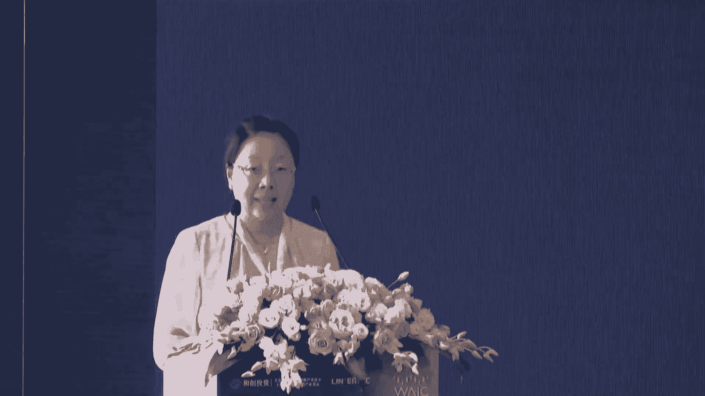

呃，尊敬的各位来宾，大家下午好。首先呢非常高兴来参加我们本次I呃智能体重新定义世界这个论坛。那我首先呢仅代表我们中国电子技术标准化研究院信息中心。然后对于本次论坛的召开表示热烈的祝贺。呃。

自去年呢T爆发以来呢，就是以大模型为核心的新型通用人工智能呢已经成为目前的一个技术的一个主流的一个方向。我记得去年7月来参加我们上海世界人工大会的时候，当时呢我们国家是百模大战。

但是到今年的7月呃我们就是截至我来之前吧，据科技部的一个最新的统计，我们国家的大模型目前已经达到了330个以上。那么由此可以看到就目前以大模型为核心的这样的一些人工智能技术正在加速的赋能行业的一个应用。

那么这些工作也是我们目前推动的一个工作的一个重点。那我们。😊，中国电子就是大家都知道，标准呢是我们国家的一个基础性的一个。技术基础性的一个技术呃制度。

那标准化的一个建设呢不仅是技术发展的一个和应用的基石呢，也是推动产业健康发展的一个重要的一个关键。那我们中国电子技术标准化研究院呢，作为工信部的直属事业单位。

目前呢是国家电子信息技术领域的呃标准化的一个是领军的一个单位。那目前呢我们承担了向国家层面的人工智能、大数据、脑机交互、原宇宙以及相关的前沿重点的信息技术领域的国家标准以及国际标准的一个承担单位。

比如说目前在人工智能领域，我们承担了全国新标委、人工智能分委会的秘书处单位，同时也是国家人工智能标准化总体组的秘书处单位。在这个过程当中呢，我们目前正在围绕人工智能产业的发展。

围绕着像人工智能智能体大模型、科学计算、巨神智能等新一代的人工智能。国家标准的一个制定和检验检测的工具，然后来开展国家层面的一个标准的制定。同时呢我们也在联合业内的呃相关的单位。

在围绕国内产业发展的实际，正在开展国际标准的一个研制。那联会科技呢作为我们业内最早在大模型和智能体领域展露领先优势的企业，不仅拥有全面的一个技术的积累，而且凭借卓越的产品和服务。

在行业内呃具有发挥了一个重要的作用。最重要的是在去年联会科技参与了就是大模型以及智能体等相关国家的一个标呃标准的一个编制。呃，同时呢牵头了智能体的第一部分国家标准编制。

目前呢这项标准呢正在推动国家标准的一个立项。那他们基于前期的业内的技术的积累呢，也为行推动行业的发展和标准化的进程做出了积极的贡献。那随着大模型智能体等先进的AI技术与产品的一个规模化的一个应用。

那我们将携手业内的政产学研用单位以及我们的相关的成员单位，会围绕着这些前沿的技术领域方向开展相关标准的一些探索。那围绕这些探索。开展我们更加有力的规范和引领我们AI赋能行业的一个应用。

那同时呢我们也会推进国家标准国际标准的一个制定，同时也会强化技术基术体系的一个建设。那期待呢我们在这个行与更多的行业内的企业共同来携手推动相关的工作的一个进展。

那最后呢就是中国电子技术标准化研究院呢将一如既往的支持人工智能技术标准的创新，促进多方技术的合作和产业的发展，支持人工智能标准化工作更上一层楼。在此呢，预祝本次论坛圆满成功，创新应用工作不断取得新成绩。

谢谢大家。谢谢感谢徐主任，谢谢您，请您入座。😊，大模型的技术进步与应用破缺呢成为了全球经济发展带来了全新的活力。人工智能的发展洪流也必将势不可挡。卡内基美隆大学拥有全世界最大的计算机学院。

更是全球人工智能技术的重要引领者之一。卡内基美隆大学计算机学院教授博士生导师作为自然语言处理领域的代表人物擅长揭示自然语言的潜在结构，对物理世界的语义进行建模，将语言与感知和控制联系起来。

是巨深智能多模态机器人领域的先导者，在通用人工智能技术领域影响巨大。本次论坛也非常荣幸，特别邀请了教授通过视频的方式在现场为我们发表主题报告，分享他的最新研究成果。接下来我们诚挚的邀请各位嘉宾。

将你的目光聚焦于大屏幕让我们一起观看报告。Hi， thank you for coming to my talk。

 I'm going to be talking about situated agents and tool failures。

 I'm really coming at this embodied day eye question in this talk from the perspective of using large language models as planners。

 So we're leveraging the fact that there is that common sense in them。

 And this is become very popular。 But then thinking about where that's going to start to break down or where that's going to be misaligned with our actual goals for these agents。

😊，So I think we're all familiar with the rise of agentic AI。

 So these agents that are doing things on the Web for us， perhaps in a video game as well for us。

 taking in different types of modalities as part of that process。 And that's a huge area。

 And it's very exciting to watch。 What I'm going to talk about is a little bit different than that。

 though， And I'd like to sort of， you know， discuss those axes。

 So we like to use examples of a picture of a robot here。 But it's not really a robot。

 It's not really embodied。 So what's the gap between agents and embodiment。😊，Well。

 there's some obvious things。 Envi dynamics， Perceptual failures， long horizon tasks。

 hardware complexity。 I think these are the things that you think of immediately when I start talking about a robot。

 It's like， oh， yeah， of course， they need camera as they need to be able to move in the world。

 And you could probably come up with an incredibly long list of things that would fit that description。

I think there's something that most people forget， though， which is the human。

So when you're actually interacting with this， future robot that's in your home cleaning up after you。

You're standing right next to it。 And so the actions that you take are going to change the way that the instructions are going to be interpreted by this system。

 And that's a good thing。 But we don't have benchmarks that match that。So what do we do right now。

 What we do right now is we think about instruction following kind of in the abstract。

 So this is the vision language navigation data set from Peter Anderson。

 which I think is sort of foundational for this。 We had extended this。 And so this is Alfred。

 which is where we do instruction following in a simulated home。 You can move objects around。

 And we've even tried to move some of this type of instruction following onto a physical robot。

 so that you can actually take actions in the world。And that's awesome。

 except there's something a little bit creepy about these。😊，It's， they're empty。 There's no humans。

 You know， you have these these robots that are moving around that are following high level instructions。

 low level instructions。 But where do they come from。

 We really need a human because language is social。 That's why we use language。

 It's because we're interested in communicating with others around us。

And so there's this natural question that follows from there。

 What role does the physical human play in instruction following。

And we need to think about how we would construct that， what new challenges that presents。

So let's kind of motivate this a little bit。I might have an instruction like put a cup on the dining table。

There's some ambiguity for an agent that they need to resolve。 Are there multiple cups。

 You know which one is the referent Is my map accurate。

 So these are things that we're going to return to over and over again as important components of ambiguity。

But if I make a very small change， it's probably more natural for me to say， bring me a cup。 Well。

 now I still have those same sources of ambiguity， but I have a new one。

 Are you stationary or are you moving。If you're moving around the environment。

 then the second that I start going after one of the objects， I'm not going to see you any more。

 and I'm going to have to remap or change things。 In this simple case， I've stayed in the same room。

 but that's not going to be true in general。How might we resolve this。 Well。

 one way we resolve this is that the instruction bring me a cup just never happens。 Instead。

 we use this sort of overspecified linguistic solution。

 We produce some really large description of what we want。

 So very clearly specifying which object to be picked up and which object we want to where we want to end up。

 right， So in this case， if I know that I'm moving towards the sofa。

 then I maybe could have this large instruction， like bring the dirty white cup that is half full of brown water and is currently on the lefthand side of that coffee table to the sofa in the living room。

 and this specification is enough to resolve those ambiguities。 but it's incredibly unnatural。

 You can imagine that you would never want to say this to your household robot。

 you would return it to the store。 You want to say， bring me a cup very straightforward。😊。

So we can then kind of create this dichotomy。Vision language navigation is maybe an example of a sort of over specified。

 large instruction setting。 And Alfred， on the other side， being this kind of under specified。

 but still no human to really reason about。And we're trying to pauseit that there's something in the middle here。

 situated instruction following。So what needs to be said if there's a human that's present。

 What doesn't， What's implied by my very actions， I said this while walking in that direction。

 What is that change， What changes to the mapping， Because all of a sudden。

 there's something dynamic in the environment。 The human could be moving things around。

 And then this causes just one of many sources of ambiguity that I need to be able to resolve。

 So I now have to understand what I am confused about and what to do。

So let's take a simple setting here to talk through those。 We did this inside of Habit 3。0。

 because it allows for us to have simulated humans that actually move around the environment。

And so here's an example instruction we have。 They're very short。 Bring me a cup。

 I will be taking a bath。 A totally natural thing that you could say to somebody。

 and you wouldn't think anything of it。 Here are some of those dimensions， One ambiguity。

 as we've been discussing。 Where is the cup， Which bathroom。To temporal。

The ambiguity here could be resolved by following the person because they said they're going to take a bath。

 or they're going to be walking towards a bedroom in this case。

 Do I follow them in order to resolve ambiguity， How much do I follow them。

 when does the efficiency tradeoff breakdown for doing that。

 And then the dynamic nature of the environment， which is that if they are moving around the environment。

 then I may not be detecting the cup， and that may be on me because I have something wrong with my perceptual system。

 or it may be because there's actually just been changes in the environment。

 There's the other As I said， the human could be moving it， And then there's this question。

 which is that if I'm going to resolve that issue， then I have to decide， should I keep searching。

 where should I search， what is the tradeoff between doing that and simply following back to sort of my previous representations。

 So this is not exhaustive， But I think it gives you a sense of some of where this becomes challenging and how things change。

So in particular， we're going to break up the tasks into three different types。

 so we have a simple request。 and before we start， the agent is able to look around the environment and build their initial map。

Then when the instruction comes in， we have a pick in place。

 which is very close to what people are used to for instruction following。 So finding an object。

 moving it to a static receptacle。 in this case， let's say the person is not moving。

We then have an instruction like bring me a cup。 I moved it while I was washing my hands。

 So in this case， we now have some hint about where it was and the fact that the map that you are using is probably out of date and would need to be updated with this new information。

And then finally， we have the， I will be washing my hands。

 So now we have a sort of future tense situation where it's not just that the map is outdated。

 It's that the the receptacle Aka A me is actually changing through time。

 And I need to be attending to that。 These latter two， in particular。

 are going to be quite divergent from what exists in the literature right now。

 And so those are going to be really important things for us to benchmark。

This is kind of what it looks like。 I I apologize in advance。

 It's a little bit choppy because it's in simulation。 It's doing a shortest path。

 But this is an agent in the environment。 You can see the map on the right。

 And if this is if a robot were to follow just directly behind them until they got to the room。

 In other words， resolving this bedroom question by following straight behind them。

 And we can then have a discussion ourselves about like。

 if that's the right behavior that we want for such an agent。

We go ahead and try to benchmark this type of situated reasoning for L Ms with kind of straightforward planners so that we can have a direct comparison to the literature。

 So I'm not going to go into this， but hopefully this diagram looks pretty straightforward to you。

 which is basically， am I perceiving， am I understanding the instruction am I building a map。

 And then we pass this all to G4， to then ask it， what it would do， Like， what should。

 what part of the of the task should it be focusing on， What's the next part of this prediction。

 Should it， for example， follow the human。And so this is going to give you a sense of the result。

 This is， there's way more in the paper， which is linked in the bottom corner here。

 But on a test environment where we' were in a scene house before。

It's the case that learned modules are going to be pretty good at picking place。

 and they're not going to be so good at the object having moved or even tracking the human in an unseen environment。

 we're going to see very similar sort of trends。 Now。

 you might be wondering there's a lot of places where there could be something going wrong。

 How much of this is a perceptual error。 How much of this is actually due to the reasoning abilities。

 So here is where we sort of resolve that entirely。 So you have oracle everything。 Now， to be fair。

 you really shouldn't have oracle everything。 because you really should have to sort of search the map and build those updated representations。

 But even so， you see this really dramatic drop off from the standard pick and place tasks to these situated tasks to these dynamic environments。

 And so this is part of what I think is really important for us moving forward is to focus on how do we ensure that we are building agents that are actually taking advantage of the fact that the environments is dynamic。

Eeveraging that in order to build better user experiences。The final thing I want to say is that。

 you know， we， So we've gotten to this point where we're saying， we don't act alone。

But we handle this issue， which is that all throughout。

 I've been talking about modules that you have to learn。 you have to use。

 And we don't know when we should or shouldn't trust ourselves。

 And so I want to just give you a teaser of some work that we've put online very recently。

 I think inside of the modules that I showed a second ago in the previous paper。

 but also inside of the agents inside of all kinds of systems。

 we've gotten really used to this idea of tool use。

 So this notion that the language model can decide on the appropriate context and tool input to give to some tool of its choosing in order to get a prediction out。

 This is seen with retrieval augmented generation。 This is seen within the simulated environments。

 It is the idea that we have a high level planner in the language model。

 which is then going to call out to some other function that has maybe been implemented on a robot in this case。

And we can ask some questions， though， about where this paradigm might break down。

 What are the sources of error， Which pieces fail， Which pieces can be recovered from。

 How do we recover from them， And we don't have an answer to all those questions。

 But you can see how in a simulated environment or in an embodied environment more generally。

 this is going to happen immediately。 So we， we evaluated it in simulation， but。You know。

 if I have to wash and slice the apple， I'd got an object detector。

 Does it actually figure out what the right objects are。

 Does the L M know how to recover from those predictions。 Then I have an action planner。

 that's also a learned module。 Does it know whether it should trust those next steps。

 So you now are gonna have a compounding of errors potentially。 Now， in humans， we can resolve this。

 because in humans， we can detect sort of a metacognitive style understanding of our abilities and where we may be seen deviation。

 So let's start with a really simple situation。 A faulty calculator。 I can't do amazing mental math。

 but I can detect if something is a little off。 So can an L M detect if the last digit changes if any of the digits change when the calculator produces the output。

 if the magnitude is off。 So， you know， I think I would be able to tell if we were off by a factor of 10。

 if if the sign flips， I would know that two positive numbers should never result in a negative number when you know these kinds of things that we consider somewhat straightforward intuitive。

This is very easy for us。This is just a simple diagram to show you a few large models that use tools and how things deviate from when the tool is correct versus when the tool is incorrect。

 So the black line is showing how well the models can answer math questions when。

There's no tool at all。 So they know the answer。 But the second that you introduce a faulty tool。

 Their performance degrade dramatically in several cases。 For example， the 3。5 case。

 But even 4 is seeing that degradation。 So there's this issue where the model knows the answer。

 And yet， it is not trusting itself。 It is relying on the tool instead。 Now。

 with a correct tool they all can do better， that's the orange line， but that's not the point。

The L Ms fail even when they know the answer。 And so now we have this problem， which is。

 if I'm going to be putting tools into systems， particularly learned tools。

 how do I handle this kind of an issue？ And as I said a second ago。

 it's only going to be worse for embodied AI。 It's only going to be harder for us。

So the planner examples here， the detector examples here。

 some of the objects they detected might have been correct。

 Maybe the confidences are not quite there。 How do we tell the model when it should or shouldn't recover from these things。

 So So sort of close out here。 I've talked about two papers。

 But I think they're part of sort of a larger question for us。

 which is as we're moving into embodied AI as we're moving into these agent systems as we're moving into language models as planners that are increasingly strong。

 Where are the pitfalls， Where are the things where there's a mismatch from the real world because we don't have the human Where is it that we are sort of assuming that we're gonna to have Apis they're going to be perfect。

 But then when they fail， we actually actually haven't engineered our systems in a way that allows for that kind of recovery。

 And so these are sort of two major questions that I hope I've left you with。

 And my understanding is that Tony's going to be taking over next and talking about things within the video space。

 And so just as I quick。Comment I think one of the things that I'm not addressing here is this issue of other sources of information for agents。

 for embodied systems。 So we have some work in this space。

 but it's a huge area of it's great that you have humans giving instructions。

 but shouldn't you be learning from humans， Shouldn't you be able to pull from that signal more generally。

 You could imagine that the ideal situation is an embodied agent that learns from all of YouTube。

 And so anyway， I will stop there。 But thank you very much for， for listening。

 And hope you enjoy both of these works。 And if you have comments on either of them。

 I'd love to hear it。 Thank you。😊。

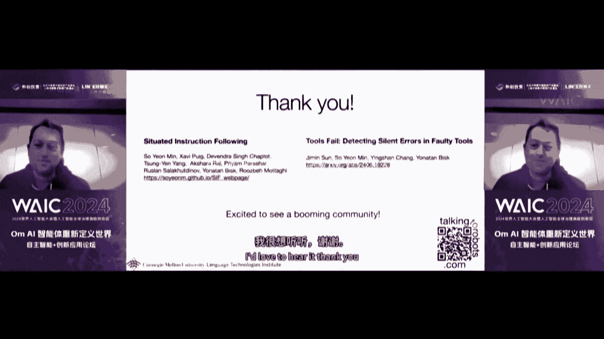

好，谢谢感谢我们教授为我们带来的这个呃报告哈。那其实不管是在这个远在大洋彼岸的这一些同行们，他们不断的去提出问题去寻求答案去寻找内心的那一个呃解决的方法吧。那同样的，我们在国内有非常多顶尖的专家学者。

也始终走在我们技术创新的最前沿道路上，他们也持续引领着技术创新与探索。北京大学教授呢国际生导师、国家杰出青年科学基金获得者、国家万人计划科技创新领军人才。彭宇欣教授在跨媒体分析与推理图像视频识别与理解。

计算机视觉等研究方向、成绩斐然，曾获得了北京市技术发明一等奖。中国电子学会科技进步一等奖，主持了863国家自然科学基金等20多个项目，发表了论文160多篇。

其中包括了ACMIEE和CCFA类论文多达70多篇。多次获得有。😊，美国国家标准技术局NIST举办的国际测评chiv视频样例搜索比赛第一的佳绩。

主持研发的跨媒体互联网内容分析与识别系统也已经得到了广泛的应用。接下来呢让我们在舞台之上把时间正式的交给彭宇欣教授为我们带来最新的主题报告，掌声欢迎。好，那个感谢啊。这个是了。好。

那个非常感谢那个年会科技的一个邀请啊。那么很高兴就是我的题目叫多模态大模型。大家看这里面的关键词可能是这个细腻度啊，一会我会来加以这个解释。那首先讲一下这个整体的一个研究背景。啊。

那么这个呢就是多模胎大模型的一个定义。大家今天开那个展会上有很多啊，那么他实际上指的是什么呢？首先就是。那个提取并融合文本图像视频啊这样的一个多模态数据表征。然后通过大圆模型来进行推理。

那么经过维调后识配到多种效任务的一个基础模型啊，这是整个那个多模态大模型的一个定义。那么这里面呢，就是说它的局限性啊，我们在当前肯定要想想它有什么样的一些局限性。那么第一个局限性呢就是这个感知力度出。

那么这个指的是什么呢？就是在多模台大模型里面，它的感知能力，它是依赖于大量训练数据。但是大量训练数据的这个细腻度类别标注成本巨大，一会我会给大家解释这个细腻度类别标注的问题。所以就导致这个大模型。

它缺乏这个细腻度的一个感知能力啊，这是第一个局限性。那么第二个呢就是这个任务适配了啊，那现在企业里面它已经有很多的一些软件。但是我们如果做了一个模型以后，可以支持多个下游任务。

但是支持这个多个下游任务的时候，他有个优化适配的问题啊，这个一会我会来加以解释。那么这一个呢就是呃GBT4O是今是今年啊应该是5月份那个那个op发布的啊这样的一个最新的一个多么态大模型。

那我们如果来做一个测试啊，大家看这样的一张左边这样的一张图片啊，就是问他这个结果，那么他回答是这个就就是中间这个叶子的这个虫啊，他回答是这个豆甲名，实际上它的真实结果是甜菜叶，这个是一种昆虫的一种名字。

一旦到细腻度以后，它就会出错。那么右边也是一样的啊，那个植物问它叫什么，他说是那个山栏，实际上呢它是这个七饼木啊，这是两种植物，但是不只是这种就是大家知道细腻度的一个，先解释一下。

就是我们通常说我们识别出力度比这是车，这是鸟对吧？这是飞机，那么细腻度指的是什么意思了，就是车里面它到底是宝马奔驰还是奥迪奥迪下面到底是A4还是A6A8，就是往下的一个细腻度识别。那么这个最新的这个多。

大模型那它细腻度这个能力是没有的啊没有这个能力。那么第二个呢就是这个刚才我讲的这个适配方法。适配方法，从技术上来说是你有多个下游任务，我怎么用一个模型来来让几个这种下游任务的性能都能达到最优。

但是现有的方法它是那个共享主干网络参数，然后是在不同任务上来进行指令微调，但是它的一个问题就是这个性能难以兼顾啊，通常多个下游任务，我把一个下游任务如果调好了，但是别的下游任务它又不行了。

所以这是他面临的两个非常非常重要的两个问题。那接下来呢，我因为今天时间有限啊，我大概就快速的讲一讲，我我们自己实验室这边的一些相关的一个进展，这个呢就是刚才讲的细腻度的问题啊，出力度呢。

我们就说左边两个是鸟，中边是飞机，对吧？那边是个肺物疾病，如果进入到细腻度呢，那左边这个鸟到底是什么鸟，对吧？它是大观音霸王阿卡迪亚巴王。那飞机呢波音。737波音777就是具体的飞机类别，这就是细腻度。

所以我刚才讲的那个GBT4的话，他就缺乏这种细腻度的识别能力。那我们在上面呢做了两个非常重要的工作，那这两张这几张图像是想说明什么呢？就是以我们在座的人来说，如果说像这个大观音霸翁，大家也从来没有见过。

对吧？如果现场来教你那首先我要给你这样的一张图像告诉你说他叫大观音霸翁，对吧？你要有这个标注，第二级标标注的话，就是这个红框。如果小孩他从来没有见过鸟，我必须要用这个红框把它框出来，告诉他这是个鸟。

那么第三类标注就是这个颜色点的标注，就是比他为什么叫大观音霸翁，那是因为他的嘴，他的脚，他的这个眼珠长得不一样，所以他需要这种很多颜色点的标注，对吧？对我们人来人来说，你学也是需要这些信息的。

那么如果这样4张图像标注的话，那么如果你动动这个这个动手很快啊，4张图像需要多长时间概。需要20分钟啊20分钟。那么长时间的标注你的你是受不了的对吧？你的你的这个眼眼睛可能都会出问题。😡。

对吧这个大家知道吧，所以细腻度呢就是一直都有人在做，但是一直也是需要这样的一个标注。如果需要这样的标注，这个事情就是没办法用的对吧？他可以做研究，但是他没办法用，对吧？这个这个大家听明白了。

因为这是一个很重要的概念，我多花一点时间来做来说。那我们的第一个工作呢，就是要让这个东西能够进行应用，那一定要把右边的那个那个那个对象框首先不要最关键的是什么呢？

就是刚才这个前面的这个这些颜色点的部件标注是一定不能要的对吧？因为它是最耗时的标注，这个不能要，然后能不能这个颜色框也不要要，当然图像机的标注是一定要要的对吧？你是一定要知道它叫什么的。

所以按照这个思路呢，我们我们就提出了这样的一个方法，这个方法主要怎么做了，就是用了一个卷积经历的显著分布估计就是在深度网络里面，它会有个特性，就是不同层的卷积核的响应输出，它是对着它的显著区域的。

所以我们呢通过这种高层的卷积盒的这个响应输出直接就能得到。他这个对象框，大家可以看第一排右边那个地方，它就是能直接框出这个对象。下面呢我们用不同层的卷积核的响应输出做一个聚类啊，用个聚类算法。

它就能很好的对应到这个部件。那这个工作非常重要，他就相当于实现了，就是刚才这个图像的标注，不需要这种颜色点的部件和和这个对象的标注啊，只只要告诉我对象整个图像的标注就可以了啊，这个是一个非常重要的工作。

那么接下来我们还有一个是什么呢？大家知道就像鸟类一个识别一样啊，那现在我们能做到什么地步啊，就是大概做到94%的准确率，就是200种鸟类，每一个我给你看几张。

然后我新给你一张问你是这200种鸟类里面的哪一个这个一般人是根本不可能的对吧？除非是非常高端的养料爱好者，你也很难识别200种，但是现在计算机可以做到94%，就是100张，我只错6张啊。那么再往下做呢。

我们就是说多模态。因为刚才对于这种鸟类的识别，你除了图像信息以外，际让你还有文本信息，对吧？你有很文本的一个描述，描述他的一个特征，还一个声音信息啊，比20种鸟每个每一个叫几声给你听。

然后新来一个他叫你说他到底是哪一种，这个就是多模态，就是利用图像文本这种信息综合来做啊，这个是我们对应的一个算法，大概是从这个图像和文本啊，这样的一个多模态来做。那当然可以把这个结果做的更好啊。

做的更好。这个呢就是一些评价了。因为这个事情就是影响还是比较大的，就相当于用图像级的标注就可以了。那么接下来呢我再给大家讲一下这个这个我们叫做持续学习，持续学习是什么意思呢？就像这个这个例子吧。

就是03年你训练的时候，你识别了两个类别，但是你再往后训练的时候，他会遇到一个问题，我们叫灾难性遗忘问题。就是新的类别进来，我学习到新的以后，我把老的会会会把它遗忘掉啊。

这个是现在这个深度学习里面非常重要的一个问题。那这个问题就得就得做。那我们呢也做了一些相应的一些办法。那我们的这个办法呢，主要就是说怎么来做他这个参数啊。

怎么样让他这个参数调整以后能够统一优化多个下游任务啊，多个下游任务。这个对企业来说还是非常重要的。就是你有的多个任务的话，用一个大模型你怎么来支持他啊，就是做这件事情。

那我也介绍我们的两个比较典型的一个工作。这个呢就是说在不保留过去样本的情况下，就是我过去学到的东西，我不保留他的样本，新来的我把它学到啊。

学到这样的话就能就是缓解对前面这种样本的一个存储的一个一个一个开销啊，这个呢也是一个具体的一个算法啊。那大概他能实现的就是说就是我刚才讲的这个叫无样本保留量的一个增量学习。就是我过去的东西我学到了以后。

我可以把它这个样本丢掉。然后学习新的东西以后，又能把之前的也能也能保留下来啊，大概是这个意思。然后这一个呢就是另外一个叫做大模型加小样本的快速适配模式。这个就是说我们现有的很多应用，就是训练样本很少。

对吧？你比你在医学的应用中，你的训训练样本是非常少的在这样的一个小样本的情况下，你怎么来学习它，主要是解决解决这个问题。那这里面呢我们主要是有一个叫做细腻度视觉提示学习的一个方法。

那这里面就是大家知道这个提示学习是非常重要的对吧？我们就把我们前面讲的这个细腻度的概念引入进来，叫做细腻度视觉提示模块，还有一个呢就是双路自适模块，那这个解决的一个问题，就是在现有大模型的情况下。

我只具有少量的这种训练样本啊，我怎么来支撑它啊做这个问题。那么接下来呢在快速的讲一讲这个AIGC啊，就是纹身图纹身视频。这个我们也做了很长时间，这个大概的一个意思就是左边给个文本。

右边可以生成对应的图像。那一个呢就像现在大家已经知道了对吧？给了文本以后，他怎么来生成视频啊，这个也是我们两个的。这种主要的一些算法啊，这是我们主要的一个算法。这里面的一些关键问题。

大家看左上角就是我给出对应的文本。这个呃右就是左下角这个呢就是生成的最后的一个结果啊，它通过这样一步一步的最后来生成，就是一个于一致，对吧？我说啥你生成啥，第二个呢就是内容真实啊。

它能够以假乱真这样的一个图像。这个呢是我们跟那个快手合作啊，大家可以看到上面是一个文本，右边生成的就是对应的视频啊，这个说了，因为大家现在也都很清楚了。

但是我们的一个优势可能在于说我们不需要那么多的训练数据和算力啊，也能训练出一个这样比较好的一个模型。这个呢就是我们啊整体的一个算法。这这里面考虑的东西就比较多了。它还有一个运动的一些估迹的一些信息啊。

最终呢就是希望能生成这样的一个纹身视频的一个一个一个一个一个东西。这个就是我刚才讲的，我们讲的这个细腻度这件事情啊，这个是我们非常重要的一个工作。所以我今天讲的这个题目就叫做细腻度多么太大模型。

因为大模型它基本上什么都会，但是你想一个人什么都会，他就不精，对不对？我们希望他会的情况下，他还能精啊，就是能做到细腻度的类别啊，就是这个然后这个是我们一些比赛的一些成绩，也都参与过。

然后呢我们也做了很多的这种数据集和评测基准啊，像国际上斯坦福微软啊，很多他呢也用我们这样的一些数据集，大家知道数据集对于这个这个大模型的这个训练和学习这个测试来讲非常重要啊，这是一些相关的一个工作。

然后呢我们也把这个细腻度跟这个跨媒体这两个结合起来啊，就是刚才我讲的比较一个鸟的声音，鸟的图像和鸟的文本，他可以做这种交叉的检索，对吧？比我给你一个图像，哎，我能检索到这个对应的这个声音啊。

这个都是可以的。这个都是我们一些相关数据旗的情况啊。这个是做于运动运动里比你这个跳水啊这种我可以知道你的细腻度的动作。然后计算机给你打分。那最终呢跟人工裁判打的分它非常接近啊。

这一切都是AI来做的那么这是我们这个这个海报广告的一个数据集啊，也微软读比他们也用我们这个这样的一个数据集。那最后呢就给大家介绍一下我们相应的一些应用。

这个呢是我们给华为开发的一个叫做图库的APP那他这里面大家看它也有很多下游任务，但是要做的事情是什么呢？第一个就是性能要提升，对吧？我多个下游任务是可有性能提升，第二个呢把参数量降低下来，啊。

这样的话就能缓解这个大模型，它的整个的这个资源的一个消耗啊，这是一个端测部署。这个呢是我们给那个跟中国铁塔合作，就是相当于企业他之前的每个任务他都有对应的软件。

但是每个软件的这个平台这些都是不一样的这个成本很高。那现在我能不能开发出一个模型来支持多个下游任务，而且。这个性能还能得到一个一个提高啊，主要做这件事情。那么这个呢是我们跟未来合作啊，做这个自动驾驶。

自动驾驶里面也可以有大模型。那这个大模型做了以后呢，它主要做于这种自动驾驶中的这个障障碍物的一个预测，还有一个移动目标的追踪啊，这样的一些事情。那这个是跟那个快手合作啊，做这种商品视频啊。

就是我们每个人去看商品视频，实你是对里面的某个商品感兴趣。那我们怎么能自动识别到你感兴趣的商品，然后做这样的一些推荐啊，这也是大模型的一些应用啊。

这是做那种多模态检索的这个就是我刚才讲的这个纹身图纹身视频啊，我们在左边输入任意的文本，右边就可以得到任意任意的视频。当然现在说了也有，但是我们研究的，我刚才讲了，怎么样在小样本或者少资源的情况下。

能够训练出一个很好的模型啊，是是这个然后这个呢是我们做的另外一个跟美团合作的，就是做这个海报广告的生成。大家知道现在电商里面很多的这个广告啊，他是找专业设计师来设计的这个成本很高。

那我们说能不能让AI来设计，那AI设计怎么设计的？我给你个底图，然后给你对应的广告用语，你能不能设计出一个这种专业设计师设计的出来的广告。那这个就挑战的是这种具有比较高端的这种设计能力的人的岗位了。

对吧？这就是我们设计出来的一些效果，大家看还可以，对吧？这是AI做出来的。然后这个呢是另外设计的一些海报广告，他相当于希望于这种素雅风格的啊，这都是AI做出来的。然后这个是我们跟腾讯合作啊。

因为腾讯主要是做这个推荐的那我们怎么样在推荐系统中来就是结合这种一个能启动的一个推荐技术啊，相当于把多模态的知识图谱啊，放到这个推荐里面能让它更正确啊。那最后呢就是做一个结论和展望。

现有的这个多模态大模型，那它的问题非常突出。一个他需要大量的这种训练数据，另外一个需要大量的计算资源，那这个是不可持续的啊，我们作为大学高校我们想做的是怎么样在少资源的情况下或者少样的情况下。

我能够训练出能跟你现在这种高资源情况下出来的模型能够效果相当甚至更高更好啊，这是一定是大学或者个研验索的一个使命呢。第二个呢就是这个计生智能啊，计生智能，就是多模态大模型，它主要是做这个改。知认知。

还有推理。那么具生智能呢，它接下来就像机器人这种一些规划执行的一些事情。哎，这个怎么做一个结合。当然第三个就是它的一个可靠性啊，因为现在的这个多模态大模型，它有一个幻觉现象。

那它的推理和回答缺少这种可靠的依依据。那我们怎么来这个克服幻觉现象来提高这个大模型的可靠性。所以总体来说，我的整体报告就是说怎么样在这个少样本少资源的情况下，能够劝出来一个模型。它不仅什么都会。

而且他还能很专啊，具有细腻度的这样的一个能力啊，好，我的报告到这啊，谢谢大家。🎼谢谢谢谢冯教授，谢谢您请您入座，带来了关于这个系力度多模态大模型的主题分享啊。

让我们知道人工智能确实有着非常丰富的这个细分领域。香港科技大学的助理教授、博士生导师梁俊卫博士。在卡内基美隆大学计算机学院获得博士与研究硕士学位后。

任职于腾讯优图实验室、谷歌等人工智能企业曾获得百度奖学金全球仅有10名WAIC明日执行奖雅虎奖学金以及多项国际AI比赛的冠军。目前，在香港科技大学成立了智能感知与预测研究组。

聚焦于机器智能、视频大模型等领域的研究。接下来就让我们正式把时间交给梁俊卫博士上台，为我们发表主题报告，掌声欢迎。😊，首先首先非常感谢啊联会科技赵总，还有赵博的邀请。

再次来到我们人工智呃世界人工智能大会这个舞台啊，跟各位啊领导汇报一下我们最近一年来的一些研究工作。我的演讲题目叫做面向通用服务的巨生智能。我们的通用服务就是general service。

也就是说我们想做机器人，其实是要服务我们人类的。然后我是梁军卫啊，一个简单的自我介绍，我是香港科技大学广州的助理教授，然后啊前面的刚刚也介绍过了，现在主要是讲一下我们啊，我现在加入呃港科广已经一年多。

然后现在主持7项基金，包括啊国资人基金是向广州市校企基金。然后还有美团机器人研究院，以及华为等啊200万总额的项目，并且参与科技部重点研发计划。那么我们的实验室呢叫做precognition。

也就是说啊这个叫做感知与预测智能实验室。但是我们现在的主要精力还是说结合机器人。因为我现在啊我们现在感觉在这个大模型的时代还是非常兴奋的。为什么？

因为我们的视觉大模型能给我们呃结合机器人之后能做到很多以前做不到的事情。比如说啊帮你把家务活解决了。所以要实现这样的话，实实现这样的一个功能。

我们就需要把机器感知智能预测以及机器人操作导航这几个大的啊研究方向要把一个一个难题给攻克。我们的实验室的目标就是在啊这个啊通用服务的场景下。研究智能感知预测相关算法，赋予机器人的巨生智能。

今天是我的演讲主题，主要包含这几个方面，它会囊括啊机器人导航啊机械操作以及视觉元大模型，这些都是我们啊近一年来比较新的工作。首先第一个主题叫做面向自然语言描述的啊开启目标导航工作。

也就是open vocabulary instant instant navigation。像刚刚我们看到y教授的啊工作也是跟我们类似。我们提出我们的任务其实就是给定一个自然语言的指令。

基于纯视觉的输入，我们的机器人能不能找到这个东西，能不能找到这个东西。比如说啊我需要找到一个黑色皮革的沙发。啊，我们提出了一个新的基准呃数据集，拓展了之前的所谓的品类导航。

也就是object navigation。像刚刚提到的object navigation是说比如说我们找一个沙发，找一瓶水，他可以是房间里任意一瓶水，但是这样就没有太多太大作用。

尤其是在一个非常重要的场景，也就是外卖配送的场景。为什么？因为对于外卖小哥来说，比如说你在一个办公楼想象一下这样场景，你是要让他把外卖送到一个比如说电梯啊，电梯口旁边的黄色的桌子上，对吧？

你给定这样的这样语言呃自然语言指令描述，你就让机器人仅仅是通过视觉的输入去找到这样的一个啊目的地，所以我们就提出了这样的一个叫做实力导航的数据集，就说in navigation，最近也是刚在ECV啊。

我们计算机视觉的顶会上发表。我们的关键创新点技术上的细节，我在就不在这里细讲了啊，关键创新点就是更好的对其目标图片与他描述的文本描述的语义。

我们智能体就可以在路图上判断出这个是否符合我们啊非常详细描述的一个啊物体。然后呢，在我们导航里面，我们可以看到前面的一些呃之前的工作呢，它都是没有人在环境里面的。

未来呢我们家家户户可能都会有一个家庭服务机器人，那么安全性是非常重要的。所以我们提出了结合行人轨迹预测。也就是说假设这场景是有人在走动的。我们的机器人不单止啊，不能碰到这个人，同时还要符合社交礼仪。

也就是说像这一个我们看到这三个视角，分别是两个人类在我们一个场景里，右边是我们这个室内的地图。左边就是我们的狗子，在比如说他要去这个这个去这个厨房拿东西，去厨房拿东西，对吧？那你可以看到这个狗子。

他经过这个房间的门口的时候，他看到有谁能往他往他这个方向走，他就往后退了一下，他就往后退了一下，这就是符合社交礼仪的，也就是说非常有礼貌，对吧？我人要往这边走行，我先让开，然后我再继续往我的目的地走。

这个就是一个社交导航的概念，这也是我们在happbit3。0里面实现了一个啊呃在仿真里面实现的算法，自然也很容易迁移到实际。这是第二个工作，我们叫做啊面向自然语音指令的机器人操作。前面是导航。

前面是导航呃，这个任务的输入就是自然语言指令。比如说把网球放到蓝色的罐子里。然后当然我们还有视觉预测。所以模型仅仅就是基于基于这个语言指令，再加这个视觉预测，直接输出我们所谓的这个末端夹爪的一个控制。

末端夹的控制。在这个工作里，我们是假设这个机械臂是固定在桌子上的。所以你可以看到哎，这个就是把这个网球放到蓝色罐子里，实现了这样的一个呃这样的一个完成了这样的一个任务。

我们实际呃实际的训练已经能达到60%的成功率，提出了一个叫对比模仿学习的方法。然后第二个工作，下面第三个工作叫做视觉预训练在机器人操作中的应用。像前面那个工作，我们是需要收集有监督数据的。

也就是说我们要教机器人具体怎么做。那实际上我觉得这个是没办法scale2，没办法去真正的是向语言的大模型能达到现在这样效果的为什么？因为我们机器人收集机器人数据其实是非常难的。而且成本非常高啊。

那么我们就想利用人类视频，对吧？做饭我们有这么多做饭的教程视频，那是否直接用人类做饭的视频呢就能教会机器人做饭，所以我们这个工作呢就是想啊使用啊大量人类行为的视频数据进行预训练。

然后能啊使得这个机器人操作的这个成功率提升。第四个工作叫做基于视觉语言大模型的服务场景物体移动操作。我们所说的物体移动操作，现在主要就是feching，也就是物体获取任务。

也就是说告诉这个机器人像刚刚的一个任务，就是帮我把水拿过来，帮我拿来一个东西。比如说这个例子里就是帮我把番茄酱拿过来，这就是一个所谓的呃移动操作的一个任务。我们提出了利用这个视觉源大模型。

比如说我们有个机器人，你在家庭里或者在办公室里让他走一走一圈走一圈。我们首先做一个三维的建图。建图完之后，我们视觉源大模型现在的能力非常强。我们可以看到联会科技的啊大模型。

还有open AI的GPT for O。你走一次之后拍一段视频，你就可以把场景里所有的物体都能啊识别到。那识别到这个物体，我们就可以把它再喂给这个大模型，让它聚类一下，为什么要聚类一下。

就是说我们通过这些物体所在的位置可以判断出这个区域究竟是干嘛的？比如说它有可能就是一个娱乐区域，对吧？那有可能你看到游戏机，那就是那有可能这个区域就是呃有呃娱乐区域。然后你看到很多番茄酱啊。

很多锅碗瓢盆啊，那就是个厨房区域，对吧？这些大模型就能直接帮你推理到，自动获取这个我们所说的语义啊，地图。这是我们的一个demo。比如说这一个例子就是我们呃用语音的方式去告诉这个大模型。

说啊帮我找回游戏控制器，然后可可以看到这个机器人，我们这是我们自己建的移动机械币平台，然后就能决策说哦那个游戏控制器大概率就在这个娱乐区域，然后他就能走过去，然后拿到了这个就是PS4的控制器成功拿到了。

那这个落地的场景是什么呢？具体其实有一个很大的应用场景，就是商品补货，我们也做了一个demo。比如说呃未来的 seven eleven未来的这个呃罗森商店就不需要人类的，就是不需要补货了。

就是不需要人类去补货。你就是说可乐没了，那我就把可乐拿过去，然后把做商品补货这样的一个应用。这是我们这个啊基于视觉文大模型的一个移动操作的工作。然后最后一个我觉得比较酷的，我们也在继续做的一个工作。

就是高自由度机器人全身摇操作，也就是叫hobodyop。像我刚刚说的呃，一个是机器人本身想要训练出帮我们完成各种任务，他需要大量的有监督数据，那这个有监督数据怎么来之前机械臂。

你是可以拽着对于固定的机械臂，你可以拽机械臂移动，然后就把这个呃数据收集下来。但是对于机械狗这种高自由度的呃物体呃机器人，你是没办法做到的。

所以我们就提出了说我们就构建了一套基于深度相机或者app pro这样的一个摇操作系统。为什么就是你可以通过机相机就能识别到人的手势，比如说我一个人想教这个机器机器人去干什么？

那我就只需要把我的手掌去展示一次，比如说我抓抓一个物体，我只要做抓物体的这个动作，我整个机器狗。狗你可以看到这边我们在仿真器isix呃C里面去完成完成一个poli训练的policy。

就可以看到这个狗是能追踪一个3D空间的3D空间的一个点。3D空间的这个点，对吧？所以你的手掌只要展示一次把这样这样抓，然后我的狗就能啊呃非常丝滑的过去把它抓起来。

所以社交数据最重要的就是说可以拿来做模仿学习，做做模仿学习。然后我们右边右边就是我们这个呃磁机的操作。那么。既然能做到这一点，我们就能让机械狗做一些非常啊需要全身姿态协调的一些啊呃任务了。比如说打网球。

比如说打网球，可以看到这个我们通过摇操作已经能把啊速度不那么快的啊网球打打呃成功打到了。然后右边呢也是我们这个啊能把比如说能开门，然后甚至能整理桌子了，甚至能整理桌子了。就说这一套系统。

我们而且我们是国内极少数的做这个四足平台加机械臂加灵巧手的一个这样平台上做啊巨神智能的，因为灵巧手还是会比假手好灵活很多。你可以看到这个抓取杯子啊，整理开门呢灵巧手都会非常的灵活。

然后啊这套系统下来要50万，相当于一个坦忑700的车，可能现在大家都不会都会觉得太贵，但未来十年希望能把成本降下来。那家家户户，我们就不需要。做家务了，就不需要做家务了。好，感谢聆听。

今天我们讨论了面向通用服务的巨神智能啊，期待联会科技多大多模态大模型赋能机器人智能体，实现真正的HI谢谢大家。😊，谢谢谢谢梁博，谢谢您，请您回席入座，感谢。😊，大模型与智能体呢是AI领域领人瞩目的焦点。

也是行业前沿的代表。联会科技是国内多模态大模型领域的创新者、探索者和实践者，被国际知名咨询机构IDC评为了中国多模态代表企业之一，还获得了工信部大模型认证001号证书，也是中国移动投资的生态企业。

作为本场论坛的主办方之一。在去年的时间当中，联会科技同样在这里发布的是欧姆mod v和国内第一批自主智能体的应用。而今天联会又会为我们在现场去发布和带来哪些最新的技术突破，和我们的成果展示。

让我们一同拭目以待。接下来呢我们同样邀请各位朋友将您的目光聚焦于大屏幕，让我们一起通过一段视频为您正式的开启本次论坛当中的重磅发布环节，请看BCR。

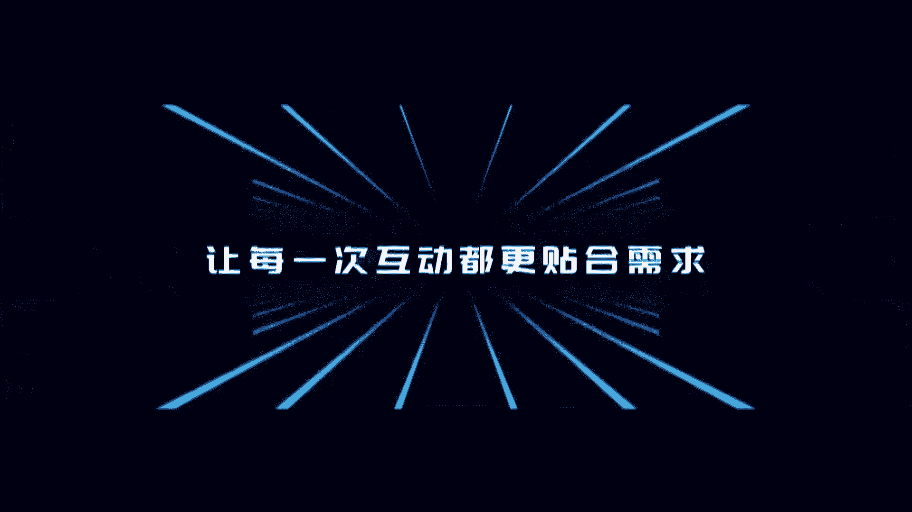

🎼朋友们，此刻也让我们正式响起掌声，有请联会科技CEO兼首席科学家赵天成、赵博上台为我们进行发布环节，掌声欢迎。😊。

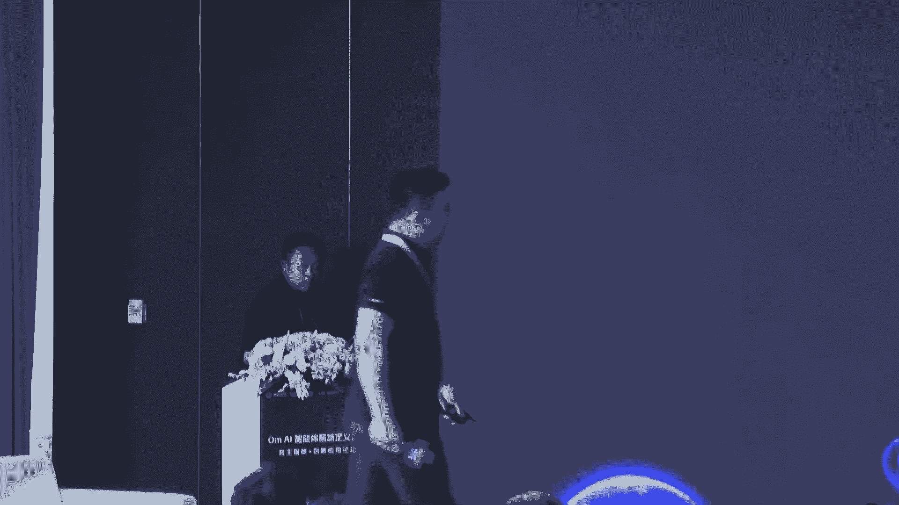

各位领导嘉宾，大家下午好。我是来自联汇科技的赵天成啊，今天非常高兴有机会给大家分享一下我们最新的研究成果跟产品发布。那首先呢我所简单介绍一下我们公司。

那联汇科技呢是一家专注多模态大模型和智能体的人工智能企业，也是中国移动重点投资的生态人工智能公司。😊，那我们的核心团队呢来自于美国凯莱兹布隆大学啊，计算机学院，也是当时全球最早从事生成CI的实验室。

我们在2016年的时候，就已经构建了全球第一个生城式智能体平台。那在2018年的时候呢，也因此获得微软研究院啊，美国最这个最佳博士荣誉和一系列在国际鼎会的最佳论文的相关的一些学术成绩。

那今天呢我们将展开讲一讲我们在过去的一年，我们有哪些新的成果和新的突破。那首先呢我们先看一下我们在过去的这个这个几年里面，我们看到到有哪些这个我们的这个生活的变化。那其实在过去的100年里面呢。

我们已经经历了4次啊，我们在整个信息时代的这个革命和天赋。那最早的时候呢，我们是看到是从我们的这个物理时代啊往我们PC时代迈进。我们很多的这种文件啊，从纸质的书本变成了电子文档。然后呢，到了互联网时代。

我们看到互联网让我们每个人得到了连接啊，实现了一个人人互联，让我们可以更加高效的方式去沟通去工作。😊。

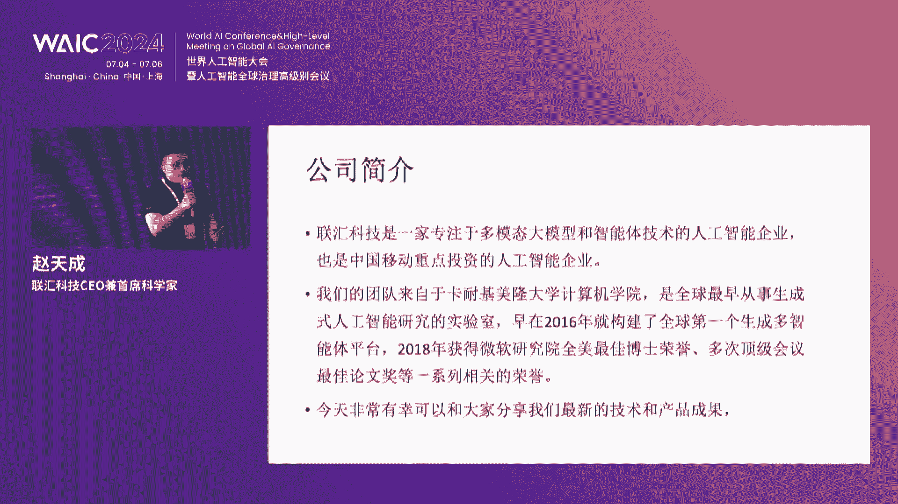

而在今天呢，我们正在迈入以AI为牵引的第四次工业革命。那这次工业革命到底主要变化是什么呢？那我们觉得这一次工业革命最核心的变化是自主化和自动化。也是为什么？因为我们第一次啊我们作为人类，我们发现了。

可以去创造智慧的这么一种能力。而AI呢它可以作为一个助手啊，刚刚说的智能体或代理去自动化，让我们的程序，让我们的软件让我们的机器更多的可以自主的去完成我们更多的任务去理解我们的需求。

把很多以前我们不愿意干的事都可以去实现自动化。这个我们觉得是最核心的一个变化。😊。

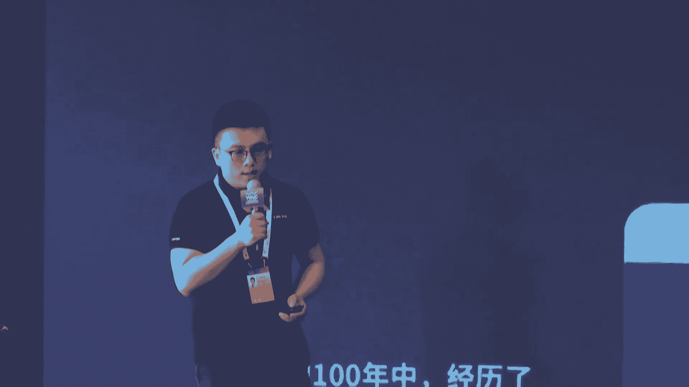

那在这个背景下面，这个自动化回怎么实现呢？大家可能会说啊，2023年是大模型的元年，也是本次工业革命的开始。但是我们作为这个领域里面的一个先驱者，我们在我们的实践过程中发现。

仅仅是靠一个模型或者靠一个大模型是不够的。只只有在有需要还需要一个应用的载体，才能让我们每个人真正可以感受到大模型或者是人工智能2。0怎么样改变我们的生活。那我们觉得这个载体很大可能性就是智能体。

或者刚才提前面很多的专家都提到agent这么一个概念。那什么是agent？那我们的电影呢？是agent是一个由大模型驱动，然后呢，它具备规划记忆、工具使用等一系列的能力，它可以主动的去完成啊。

各种任务的这么一个智能实体。这就好比方说我们这个嗯大模型可能是1个CPU啊。一个计算机不能只有1个CPU它还需要硬盘，它还需要内存，还需要GPU需要显示器，需要键盘。

才能够形成一个完整的这么一个让每个人可以使用的这么一个工具。那我们对于我们智能体也分了不同的级别。我们从L1到L5。那我们觉得呢当前阶段啊。

我们智能体可能在全球范围之内差不多都是处于一个所谓的L2的一个级别。也就是机器它是一个助它是一个帮手，在做一些初步的一些辅助。但是技术发展很快，我们逐步的正在向所谓的L3啊，或者L4这个进度啊进行迈进。

那我们团队其实是国内最早深入研究多模太阳大模型和智能体的团队。所以呢我们也深刻的理解到一个真正有价值的智能体，它不是一个单兵作战，它需要一套体系，它需要一个很强的感知啊。

他跟我们人样可以感受到身身变万物，也需要很强的记忆，可以记住跟我们的交互记忆，历史，也可以记住很多专业知识，还需要很强的一个思考跟一个逻辑推理能力，可以去做规划去做决策，这样才能够形成一个应勇闭环。😊。

因此呢我们也在这三个方向上面很早的就进行了布局和深入的研究。那比如说我们在我们的记忆部分啊，在这边我们看到我们从21年开始，我们推出了我们第一代模型我们c和相配套的向量数据库。

它是我们专门用来针对智能体的这么一个多模态的记忆存储中心，让他可以记住我们的专业知识记住跟我们的交互记录。也因此呢在2021年的时候呢，获得了工信部的001号评测。😊，然后在感知部分。

我们在22年的时候，我们发布了全球首个万物感知模型，获得了CP顶级会议CBPR和ECB的双料冠军。那目前为止，我们的ome模型从发布至今已经实践大规模的商用，服务了超过500多个实际的场景。

每天呢分析超过百万千万级的视频和图片。😊，啊，最后在思考部分啊，在我们右边的思考部分，我们推出的是在去年啊就在人工智能大会，我们发布了国内第一个生成式的ome chat多模态语言模型。

并且呢也进行了现场的演示。那这个呢三个模型本身chat和c他们补全啊共同形成了我们整体的这么一个智能体体系。那中间呢就是我们的ag它整体框架将三个能力牢牢的结合在一起啊，形成一个完整的闭环。😊。

那今天呢我们经过我们团队的一年的这个努力攻关，我们今天呢将正式发布我们第二代多模态智能体系统。我们的欧meag2。0。那这次我们的发布呢，其实有很多很多的干货。

我们对于感知思考和整体系统框架都进行了全面的升级，突破了多项关键技术指标，让我们距离AI原生应用呢又更近了一步。那今天呢我们都将一睹为快。首先我们来看一下我们对于感知模块的全面升级。感知是什么？

感知对于一个证明体来说非常重要，就好像一个人的无感一样，他需要通过他的眼睛啊，他的听觉、触觉、视觉来感受外面的世界，知道他在干什么，知道他所处的位置。😡，那上一代AI1。0的时候。

很多小模型技术也是在实现部分的感知功能。比如说像人脸识别呀、车牌呀，它其实也是一种识别。但是呢小模型时代我们只能实现单一模态的单一目标的这些场景，不能像人一样说实现高目标啊。

多目标、多场景、高泛化的这种能力。而万物感知模型正是我们大模型式的新一代感知技术，通过海量的预训练，特别是以这种语言为核心的图文预训练，将多种模态对此到语言啊实现多场景的高泛化、无限值的目标理解。

是智能体要完成核心任务的非常重要的这么一个核心理解模块。那在这个模块里面有什么问题呢？其实我们在过去过去的两年里面，我们发现，虽然万物感知模型它非常很强，但它也面临了很多技术挑战。

比如说我们在左边这个图可以看到啊，小模型虽然放能力很弱，只能干一件事。但是呢它的成本很低，它可以跑的很快，同时呢也可以在很好的这种小的边端设备进行运行。那即使是我们的1。0和一些别的比如这样的开模型。

它其实在推理速度上面都会大幅度逊于啊这个小模型的速度。那这也意味着当前的感知模型只能在这种大型的云端服务器运行，很难放到边端或者实现这种高实时场景的需求。😊，那今天呢我们这边呢发布的2。

0就是为了解决这个问题。那我们这个问题呢在今天呢得到非常好的解决。那首先我们来看一下我们的技术指这个指呃技术指标。😊，欧戴2是全球首个推理速度的单卡上面可以超过100FPS的万物感知模型。

超过此前任何多模态感知模型速度20倍以上。同时呢我们也在多项评测指标上面进行了测试啊，欧姆2本身它的准确度也非常好。它在上面排名世界第一。在上面排名世界第二。

因此呢欧是一个兼顾了速度和准确度的这么一个全新突破。是万物感知模型的一种底层一次一次底层的革新。那具体我们怎么做的呢？我们可以看一看，本身我们对于每一个运算环节啊进行了详细的拆解。然后呢。

我们得从底层进行了优化，推出了我们一个全新的叫做effic fuion这么1个EFH这么一个检测模块。这个模块呢包含了一系列相关的推理和加速技术。比如说我们的语言向量缓存技术啊。

我们的量化特征编码量化解码技术。那对就是因为我们通过EFH对于每一个环节的极速优化之后呢，我们相较于不管是还是我们自己的一。0模型，基本上在每一个链路上面至少10倍了实现了10倍以上的提高。综合起来呢。

实现了20倍的提高。😊，这也是为什么我们可以让我们的模型跑到超过100FPS。那这么一个又快又准的模型啊，意味着什么？其实我们看到最直接的应用就是说因为它一秒钟可以处理100张图片以上。

也意味着我们用一块GPO啊，基本上就可以实现超过500路视频的万物感知分析。这是前所未见的。同时呢，也意味着我们打开了边缘AI的可能性。就万5AI万物感知模型不再一定要运运算在云端。

它可能可以成为未来的人形机器人。😡，狗型机器人、家庭计算中心等一系列的边缘设备上面，这可以颠覆以前我们传统的这种大模型产品思路啊，觉得大模型必须在云端，这个不再是事实。

构建可以更加构建我们以后可以构建更加实时的、更加隐私的、更加安全的大模型应用跟产品。那今天呢我们也非常欢迎欢欢迎啊我们前生的合作伙伴。我们会后呢可以一起来讨论怎么样打造更好的边缘大模型AR产品。😊。

那刚才呢就是我们第一个重要的发布内容，就是我们的感知部分。然后我们来看看我们第二个部分，就是我们的思考部分。那思考呢是本身多么态真能体最核心的核心，但他只有具备了这种思考能力。

能够他他才能够去根据他的感知，根据他的记忆去做决策啊去做主动的行为去完成任务，才能为我们的一个好的帮手。那在没有大模型之前，思考模块都是通过人工专家的方式啊，针对每一个场景就手工编译定制而成。

但是呢有了大模型之后，我们可以发现他也可以自然语言去做思维链的推理啊进行思考。同时呢他也可以理解多模态的输入，去完成这种多模态的核心的研联合的研判啊，去实现这种所谓的决策跟自主的功能。但是我们也发现。

目前的多模态思考模型或者多模态语言模型存在一个缺陷。那这里面核心的一个缺陷就是说所有这些模型，它只能基于单张图片进行思考跟决策。那这个局限其实是非常致命的。呃。

比如说我们希望我们的AI能够理解一个人的动作啊，它是一个关门，还是一个开门，它是一个踢球，还是一个传球。这个其实要求我们的模型，它可以对于一个持续的一个图片序列，一个视频而进行一个理解。

他要知道先后关系，这是第一个挑战。那第二个挑战是什么呢？比如说在工业场景，我们希望AI对于1个AI1个部件，它的360的环图啊进行一个综合的理解。它可以从左边右边上边同时看。

然后呢知道这个部件的状态跟形状。那这个需要他对于多图的关联分析。那这一切的一切呢，其实都需要一个真正的好用的这么一个可以理解刚才所谓的这些实续分析跟多图分析的这么一个多模态思考模型。

那这也是我们今天迎来我们第二个啊，今天第二个比较重要的这个发布的这个内容就是我们第二代的思考大模型，我们ome chart2。那欧ome chat2正是围绕刚才的些背景，我们很好的去解决了这些问题。

并且呢实现了从不管是逻辑推理、语言交互啊多方面的这么一个非常质的一个提升。我们来看一看具体欧ome chat2能干什么。首先我们看一看技术指标。欧姆2是一个基于多莫态原生预训练的多莫态语言生成式模型。

它呢也有不同的尺寸，适合不同的场景。那欧莫切t可以非常好的支持视频图文、单图图文混合等多种的还有纯文本这种多种的复杂输入，可以非常好的适配智能体决策过程中。

它需要去解决的去面对的这种复杂的决策场景跟思考场景。那他能干什么呢？首先我们来看一看他对于长上下文，特别是长的多模态上下文的一个支持。我们最新版本是可以最大支持512K的上下文，仅次于jamin1。

5的200万长上下文。假如说我们把它折算成一个视频理解的话，差不多是我们可以做到半小时的视频，直接进去啊，然后进行整体的这个推理跟分析。那这个已经大幅度超过。

比如说我们用GBT4O差不多10分钟或者是lava carryry的这个微软的cary模型，lava差不多5秒钟的这么一个视频理解程度。这样我们可以通过这样一个多模态模型直接去分析很长的一段动作。

或者是一集电成电视剧啊，或者是一个影视剧，它可以作为一个直接的输入。然后我们来看一下具体的一些这个技术指标。比如说我们在长视频多图片的这种复杂理解场景下面，我们的虽然体量可能不是最大的。

但是它的性能其实是可以非常不逊于很多这些不管是开源的还是闭的模型。那在多个国际的这些评测指标下面，在这两个这些指标综合分数啊。

我们仅次于op4排名第二超过了包括阿里巴巴的啊英为达的微软等一系列其他的这些更大啊，这些这些多模态模型。那这也展现出我们对于图文输入啊这理解的深刻提高。那我们来看一看刚才提到我们两个挑战。

我们来看看具体的实力，看看欧小跳能不能解决刚才我们说的他对于实续分析啊，可以对于这个多图理解的一个效果。首先我们来看第一个例子，假如说我们给他一段一个动作，他能不能比较好的解答。

那请老师放一下第一个视频。😊，分析一下视频中男子的动作。男子站在一扇关闭的门前，伸出右手，握住并转动门把手，将门打开。

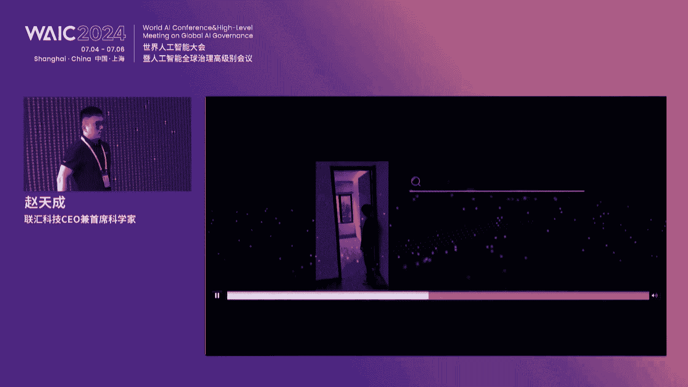

分析一下视频中男子的动作。男子站在门口，伸出右手，握住门把手，拉动门，门完全关闭后，将手从门把手上移开。我们可以看到他在，他可以非常好的准确的描述这两个这个人啊在不同的两个场景。

从单独看上去可能是一模一样的。但是从时序上面截然不同的两个输出。😊，然后我们再来看一看对于多图的关联分析的效果。我们可以看看第二个视频。超市的客流情况怎么样？画面显示的超市的两个角度，客流情况是不同的。

画面一显示，超市没有出现顾客，画面二显示，顾客聚集在收银台区域，通道较为狭窄。总之，虽然超市的第一个画面没有顾客，但是收银区域顾客比较多，仍然需要关注。我们也可以看到我们车在这么一个环境里面。

虽然是同一个超市，啊，它是两个不同的角度，它是两个不同的镜头。我们车呢可以分别单独理解里面单独的内容，同时呢也可以比较好的理解整体发生的情况。那在刚刚提到在解决刚刚两个这个基本的效果问题之后。

我们也非常关心本身的它一个落地的成本。那在这一块呢，其实我们最关注的点是在于说它的个推理成本跟一个运行门槛。

那首先我也是在国内厂商里面率先适配多款国产P华为到光等系列相关P解决了本身国产化配算适配的这么一个门槛。同时呢我们也对推理算法上面了底层的优化相当于开源引擎我们推理速度和整个呢可以提高20倍以上。

那第三部分呢我们也考虑到现在很多国内的算力它是闲置的零散的。所以我们解决了支持多机房混合异构算力部署的一问题可以将多地的算力机房纳管起来形成一个虚拟算力池更多的算可以很好的一个大池子里运行不是离散化的运行。

那这三个点呢其实也是已经经过很多的实战验证验证的过程中可以真正的才进行一个落地场景。😊，那刚才讲了欧木cha这么多，他本身能力变强了，视野变长了啊，变宽了，本身推理成本也降低了。那他具体能干什么事情呢？

那我们经过很多的行业调研之后，我们发现欧omecha他的诞生，他其实会对我们的行业后面应用，可以打开很多以前我们都不敢想象的一些新的场景。😊，那比如说它可以赋能体育啊。

实现自动化的体育解说或体育化的动作理解。我们可以看第一个场景。分析一下视频中的动作。在这个视频中，运动员双脚用力蹬地，身体向上跃起，在腾空过程中伸展手臂，将双手放在跳马上，身体向后弯曲。

利用手臂的力量和身体的惯性，完成了后空翻动作，并且保持了良好的身体姿态，成功落地。那再比如说我们的也可以去帮助我们的媒体，让我们的媒体内容制作人可以更好的理解怎么样的视频是用户观爱看的。

怎么样把视频可以解构成可以分析的结构化场景。我们可以看第二个场景。这里面是流浪地球的预告片。航空器中坐了几个人。航空器中一共坐了4个人，他们穿着全套的白色宇航服。他们乘坐时是什么状态？

画面中航空器在快速上升，由于惯性力的作用，他们会感受到超重感，使身体感觉沉重，可能导致眩晕。为什么这个航空器底部有火焰？航空器在下降过程中穿过大气层时，压缩前方的空气，形成高压区，在后方形成低压区。

气体的压缩，导致航空器底部温度升高，产生火焰。描述一下整段视频。视频中展示了在星球上有一个大型工业设施，那里有先进的机械设备和武装士兵在维持安全，并且连接着一个带有机械组件和电缆的大型空间结构。

以及多个正在移动的航天器。在航天器内部有4名宇航员坐在座位上准备执行任务。航天器喷出射黄色的火焰急速上升，最后进入了一个庞大而复杂的空间站。在刚才例子里面。

我们看到我们的模型一方面对于单镜头有比较好的准确描述，另外也可以针对整个视频啊进行刚刚说的所谓的概要跟压缩。那最后我们看看在工业场景下面，通过chart模2，它可以一方面更好的理解设备的运行的状态啊。

也可以扮演这么一个助手去保障我们运行工能的安全。我们看一下第三个场景。视频中的机床处于什么状态？视频中的机床处于运转状态，正在执行加工任务。在做这个作业时需要注意什么？在机床作业时。

需要穿戴合适的防护服装，佩戴防护帽和防打击的护目镜，以保护头部和眼睛免受飞溅物的伤害。机床运行时，禁止用手调整机床或测量弓箭，禁止触摸机床的旋转部分。对。

我们刚才看到他其实因为这个机器假如说是不能有视频的话，他只是看单独他是无法判断他到底转还是没转。然后呢，他要是没有那个常识啊，也不能知道这个设备是不必须戴护目镜的。不然的话，刚刚那个人可能是马赛克。

他其实是没有戴护目镜，他是有危险的。所以刚才讲了这么多，其实我它本身因为它具备了更长的视频感知的这个窗口，它就可以做更多的事情。然后呢，我们刚才看到我们对于我们的感知跟思考都做了升级。

那拼在一起是怎么样的呢？那就是到我们第三个环节框架的升级。本身它是什么呢？它是我们在过去两年里面沉淀出了这么一套完整的模开发框架。它包含了刚才所提到的感知记忆和角色综合模块。

也可以把刚才我们说的不管是我们还是们和别的这之已有的技术呢进行一个有机的整合，让他可以去开发者更好的去开发所谓的我们的真正的AI原生应用。那这里面我们看到本身它进行一个有机结合之后。

它就可以解决一些纯粹单模型无法解决些任务更加复杂的任务。那具体能解决什么任务呢这边我们也给了一个具体的例子啊那这边呢假设我们通过我们这个框架，我们想一。😊，智能体应用。

他呢目标呢就是说我可以输入任何一本电影，我问任何问题，他看懂这本电影之后可以帮我去解决问题。那打比方说我们这边输入的是一集电视剧啊，个一个一集美剧。

然后在这个电视剧里面呢这个主人公本身呢在后面呢他是出现了一个健康情况，他发生了脑溢血昏过去了。那为什么他会昏过去呢？

其实只有你看完全片之后才能知道因为全片里没有一句话说直接告诉说这个男主角为什么会突然昏过去。那我们来测试一下我们本身的这个刚刚说的我们这个框架，他结合了最新的这些能力之后。

能不能去解决这么一个比较复杂的任务啊，我们可以看一下这个具体的这个执行过程。那首先呢第一步，他会通过一个感知录入快速的把全篇全看一遍啊，进行一个初看。然后呢，我们用户可以问这个问题。比如说这个某某人物。

他为什么会昏过去。然后他就听到这个任务之后，他就可以通过他的这个决策模块开始进行相关的任务分解，产生这么一个任务数啊，就跟我们人一样，我们分而置之从小问题开始解决，再去做大问题。然后他开始做信息汇总。

他会跟人一样到处去这个拉着这个进度条这边看一些那边看一些去把这些信细节化的信息啊给收集起来，我们叫信息汇总。那他当当他后面在足够收集了足够多的信息之后，他再结合所有他看到的信息和他对于全篇的理解。

想办法进行一个综合的一个答案生成。那最终呢他发现这个人昏过去的原因是，一方面天气比较冷，同时呢也是剧情里面，他的儿女对他非常不好，对他产生了刺激。这两者结合在一起才导致了他昏厥这么一个原因。

那这个其实也展现出只靠一个模型，他很难去。😊，像人一样去这么去进行一个所谓的系统二的这么一个推移和分析，它还是要能够进行一个人一样的这种逻辑思考，逻辑拆解才能够去解决的问题。

所以我们也对于我们的这个系统在一个更大的数据值上面做了量化的测试。我们可以看到，假设我们只用GBT4。它可能在这指标上面只有80%的一个成功率。但结合了我们的这里框架，它结合了这些功能之后。

它就可以实现88%啊，甚至是接近90%这么一个效果。它可以正更好的把这个模型能力进行放大啊，进行这个赋能形成一个真正的所谓的一个决策的一个闭环。😊，那最后呢，今天我们刚刚提到。

其实我们的我们也为了构建更好的一个开发者的一个生态，让更多的人推动我们的正体的发展。我们对于刚刚提到的所有的这些框架和代码呢，我们也进进行会进行逐步的开源。大家可以扫码关注我们这个呃gHub的仓库啊。

进行得到后面进一步的相关的信息。😊，那刚刚看了这么多，大家可定觉得这个非常呃这个厉害。但是呢我觉得大家也可以想这到底真的还是假的，大家希望能够眼见为实。

所以呢今天我们也延续我们这个从去年开始一个比较好的优良传统。我们会进行一个现场的一个实时演示啊，没有任何的录制。我们看一看这个通过刚才说的这些t和这些模型。我们把它组合在一起，把它放到一个APP里面去。

能对我们的生活产生什么样的影响，欢迎我们研究员张博士来做一个演示。😊，大家好呃，通过刚才照我的介绍，相信大家已经对我们的 model系列有了一个非常多的了解，他也是非常有意思的，能做非常多有意思的事情。

那我们呢我们也开发了一个手机APP，可以让大家更加直观的了解到我们的模型到底能做什么。嗯那么下面的话就由我来代表大家和我们的模型做一个小小的互动吧。嗯。

那现在大屏幕大家已经看到我们的APP已经看到了现场的画面。我先来问 chat一个比较简单的问题。看一下他对现场的画面有没有一个比较直观的了解。😊，描述一下现场画面。

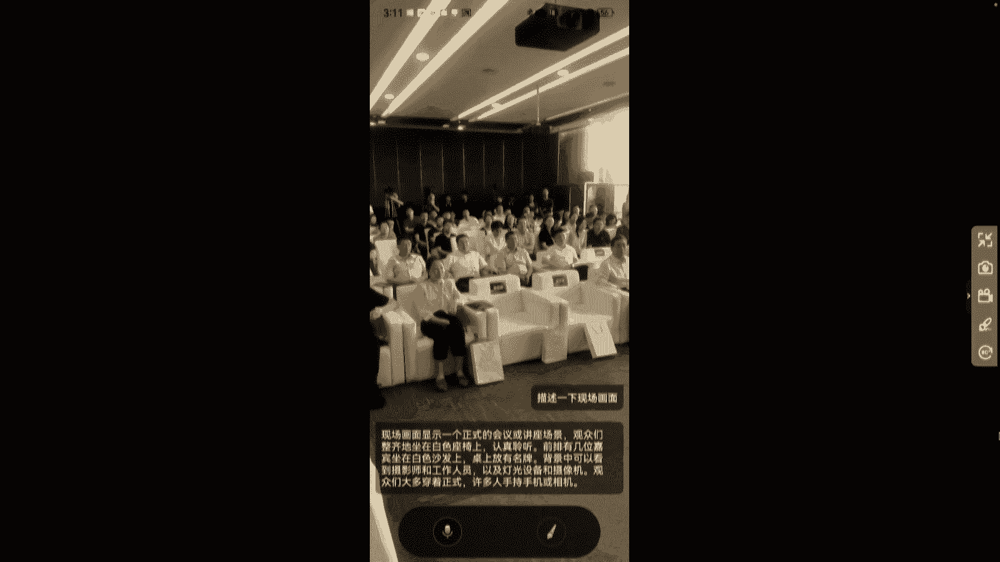

桌上。以及灯光设备和摄像机。一观众们大多穿着正式，许多人手持手机或相机。大家可以看到模模模型的回答基本上还是正确的嗯，那下次下面呢我来对这个模型的难度稍微做一个升级。

看一下模型能不能够判断出来我现在这个角度来判断我是一个什么样的身份。通过这个拍摄角度，你觉得我是干什么的？通过这个拍摄角度和您的着装，我觉得您可能是会议的主持人或演讲者。您在会场的中间位置。

而其他与会者则坐在两侧。这种排列方式通常用于大型会议或活动，以便于组织者和与会者的视线沟通。我们可以看到模型的回答基本上还是比较详细的啊，那现在我们再来换一个视角。

看一下Ocha的模型能不能够在生活中呃帮我做一些判断或者决策呢。现在桌子上大家可以看到有一些东西。那我现在想让模型帮我找到能够写字的东西。帮我找到能够写字的东西。在这张图片中有两样物品可以用来写字。

一、毛笔对于图片中间偏右。2、钢笔位于毛笔左方，这两样物品都可以用来书写。那假如说我现在想写日记的话，我希望模型能够帮我做一个决策，告诉我应该用哪支笔来写。如果我要写日记的话，我应该用哪支笔？

如果我要写日记的话。如果我要写日记的话，我应该用哪支笔？在这张图片中有两支笔，一支毛笔和一支钢笔。如果你要写日记，建议使用钢笔，因为它书写流畅，适合长时间书写。毛笔虽然也可以用来写字。

但更适合书法或绘画，可能不太适合日常的日记书写。看起来模型的回答还是非常严谨。在这里，他建议我使用钢笔，同时他也告诉我在什么场合下应该使用毛笔。那我这里还有一本书。

我想看一下模型对于一些呃知识有没有掌一些掌握。帮我描述一下这个模型。帮我描述一下这个模型。这张图片展示了马斯洛需求层次理论的金字塔模型。该模型将人类的需求分为5个层次，从底层到顶层依次为。一梳理需求啊。

那因为时间的关系，这里我就不跟大家进行展开了。我们已经刚才看到我们cha进开启了他的话唠模式，输出了非常一段非常详细的一段解释。那其实我们的cha的模型还可以通过在画面中进行标记的方式和它进行交互。

去进行提问。那现在我就来试一下。这里应该填写啥？这个位置应该填写安全或健康等字样，以与金字塔图中的相应位置相匹配。看来我这里稍微有一点偏差，我再重新试一下。这里应该填写啥？

这个位置应该填写社交需求或love and belonging。根据马斯洛的需求层次理论，这一层次代表人们对爱、归属感和人际关系的需求。这次模型回答正确了。虽然他的这个语音的稍微有一点点呃错误。

但是他的回答还是正确的。那这里有一个我们的公仔，我看他有点眼熟呃，我希望他能够搜索一下我之前见到的画面，看看能不能够帮我找到一些记忆。这个公仔有点眼熟，我是不是在哪里见过？在相册中找到了类似物品的照片。

拍摄于2023年6月8号北京首钢会展中心。这个功能还是非常有意思的啊，通过搜索，我们找到了我们去年在线下的一次活动。当时我们有一个真更大的一个Ocha的真人玩偶。

那通过把我们的呃以前的一些相册集呃照片集成到相册当中，利用m chat将相关的模型进行搜索，也可以加速我们的搜索，使我们更快的和把过去和现在做一个连接啊。

那下下面呢我们就来一起看一下我们 chat呢 chat对于一些动作的一些识别。那现在请我们的工作人员来配合我来一起做一些动作。他现在站在台下，然后我想帮我想让他来帮我看一下呃。

帮我呃判断一下他接下来可能会做什么动作。这个人接下来可能会做什么？这个人可能会继续走路，或者可能会坐下，由于他站在椅子旁边，所以坐下可能性更大。模型回答还是比较正确的呃，他猜测他应该会坐下。

但是呢他也没有给出一个非常非常绝对的答案。所以说他的回答还是整体还是比较严谨的那我们下面再来描述一下我们的工作人员的这个动作。描述一下这个人的动作。这个人正在从站立到坐下的过程中，最初他站着。

然后慢慢弯腰，最后坐在椅子上。我们可以看到模型的回答基本上正确了。那现在如果我们来换一个动作啊，这里有一杯水。如果我们这个演员他正在做的，我们的工作人员，如果说他做的正是喝水动作的话。

我们看一下模型能不能回答正确。描述一下这个人的动作。这个人正在喝水，他先是拿着一个水瓶，然后将水瓶举到嘴边喝水，最后放下水瓶。我们看到模型也回答正确了。那我们再来问一个问题。

看一下他在喝水中接下来会发生什么。这个人接下来可能会做什么？这个人可能会继续喝完手中的水，这个人可能会继续喝完手中的水，然后把水瓶放回包里，最后把水瓶丢进垃圾桶。这里还是非常有意思的呃。

模型呃模型会认为我们的工作人员是一个非常有素质的人，会在喝完水之后，把水瓶扔到垃圾桶里面啊，那以上就是我们cha今天和大家的互动环节。相呃相信大家通过刚才的一个互动。

也对我们的模型有了一更加深刻的了解啊那我们结合产业的需求，也推出了我们基于cha的相关智能体产品啊，包括知识智能体和空间智能体啊，下面请我们的产品总经理王家贺王总来对我们的产品做一个更加详细的介绍。😊。

呃，欢迎各位继续见证接下来的发布。我我是联合科技的王家贺。那么刚才张博的现场演示呢非常的精彩啊呃，大家留下了深刻的印象啊，我想在座的可能很多人啊在这过程中也在思考说，这个大模型的能力现在演进的这么快啊。

他能够为我们的工作和生活带来哪些改变？😊，啊。又会催生或者孕育出哪些不一样的产品和服务呢？啊，那么接下来啊，我们结合我们团队在过去一年的时践啊。

为大家正式发布我们的欧姆多模太智能体全新产品系列啊空间运营智能体和知识服务智能体。

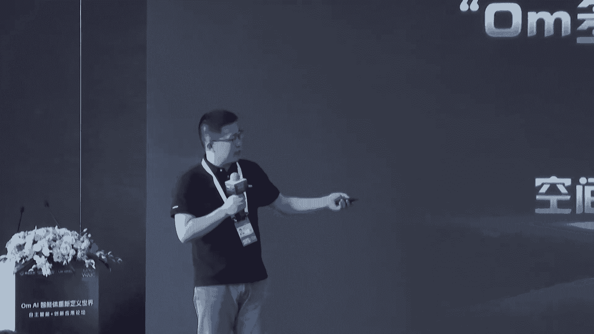

那么在去年2023年的时候呢，呃联合科技确立了我们的智能体战略啊，并且呢推出了我们第一批的啊欧姆。智能体的一些应用啊，那么今年呢呃经过一年的这个我们的探索啊，在这些领域里面。

前面这个大家看到说我们这个模型也在进步，对吧？我们的这个框架也在发展啊，那我们的产品啊，那么到今天呢我们这个已经啊正式的发展并形成了我们的多模态智能体的两个产品的系列啊，就一个空间运营啊。

一个知识服务啊，那这个呢一方面呢就是基于我们前面讲的这个大模型本身能力的演进啊，以及我们的这个模呃多模态智能体的框架的这个发展啊，正如前面我们赵博的这个介绍啊。

以及我们这个张博士刚才的这个演示的样子表现出来的啊，那另外一个方面呢，也是因为我们在过去一年时间里面啊，我们团队啊在这个很多行业里面啊，我们在做的我们的一些行业的实践，积累的我们的一些成功案例啊。

那这里面就包括我们的在电力行业运营。😊，行业、金融行业啊，线下零售行业等等啊，基于这些成功实践，我们沉淀形成了我们的这两个这个智能体的产品系列。呃，OK那么在数字化时代呢。

其实我们每个人啊都这个拥有和生活在两个世界里面啊，一个呢是我们的线下的实体的物理世界。另外一个呢就是数字世界啊，那我们这两个智能体呢呃一个是呃空间运营智能体，一个这个知识服务智能体。

就是面向这两个世界啊，那我们的空间运营智能体，主要就面向我们的这个线下的实体物理世界啊，那么它的一个突出的特征呢啊就是我们前面这个。😊，大模型的这个眼镜所演示的啊，那么他们在感知方面，在思考方面。

它的能力的眼进。而我们的空间运营智能体呢，首先就是基于包括像摄像头啊拾音器等等这些物联设备，以及接入我们线下空间里面的所有的相关的数据。然后基于这个它超强的这种全感知能力，以及它的思维能力。

把它融合起来。然后呢来作用于我们的现实的物理世界。那么这呢就是我们的这个空间运营智能体。啊，简单讲呢，它是一个帮助人类来管理我们的这个实体世界的这么一个管理助手。那我们通过这个简单的价构。

我们可以来看一下。那我们的空间运营智能体呢，它首先就会从我们这个环境的感知理解来开始啊，那结合到它的这个记忆和学习能力啊，那并且呢它会基于这个智能体，它所处的行业的这个场景。啊，他的任务是什么？

他的角色是什么？然后呢来去借助于他的规划决策能力啊，以及调调用相关的工具来去行动。最终呢作用于我们的线下空间啊，那么这呢就是我们的这个空间运营智能体，它的一个基本的一个运作原理啊。

那么接下来呢我们用一段视频啊来给大家简单介绍一下我们的空间运营智能体是如何工作的啊，它是如何赋能我们的行业场景的。😊，🎼人工已成为新一轮科技革命的核心驱动力，正在深刻的改变我们的工作和生活方式。

🎼AIA的智能体大爆发，每个人一个超级重力的时代即将到来。联会科技推出空间运营知识服务两大系列多模态智能体，助力行业和企业主及心智生产力。

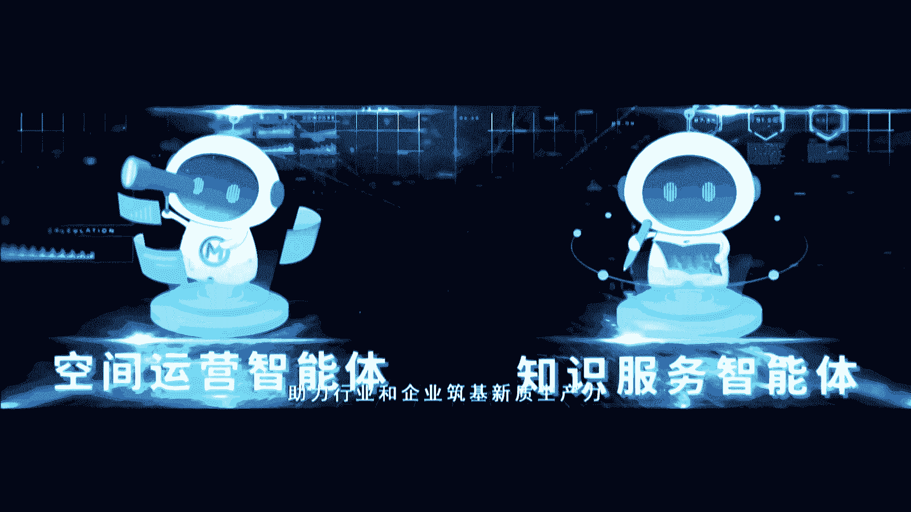

🎼空间运营智能体将对环境的全感知能力和大模型强大的思维能力进行融合，是帮助人类管理现实世界的智能管理助手。针对不同的现实空间，智能体能带来哪些不一样的改变呢？比如商超集团的市场或营运管理部门。

每天都需要及时高效的了解集团几百家超市的运营状况。管理部门一方面要及时感知当下运营态势，掌握相关信息？

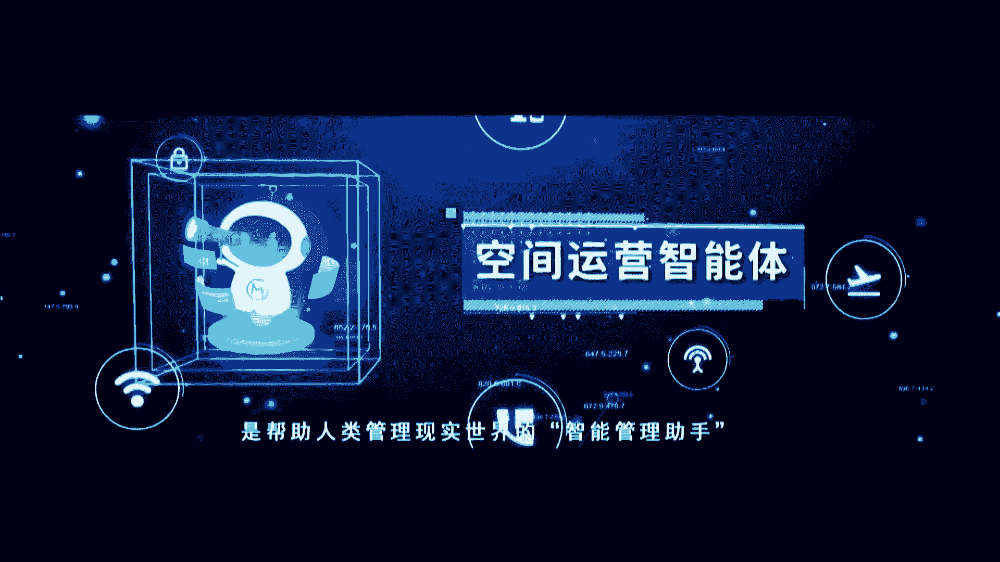

🎼另一方面，还要基于零售行业专业知识，时下各种综合性市场信息过往运营数据进行快速汇总分析，形成科学的判断和优化方案。🎼感知掌握包括环境信息在内的各类信息。

并给予超强的知识和思维能力进行专业分析、判断、总结、提出建议和方案。这正是空间运营智能体作为超级数字员工的核心能力。🎼他可以通过人机协同方式，协助商超集团管理部门，通过监控视频对下下门店进行快速检查。

也可以自主的工作。如将检查出的问题下发给店长，并跟踪改进情况。

🎼同样，在电信营业厅、银行服务网点，如工作人员的着装营销服务话术是否合规，在博物馆、文旅景区，如讲解员的游客接待服务状态。热门区域的人流情况是否需要加强引导他都能帮你及时掌握分析并提供建议方案。

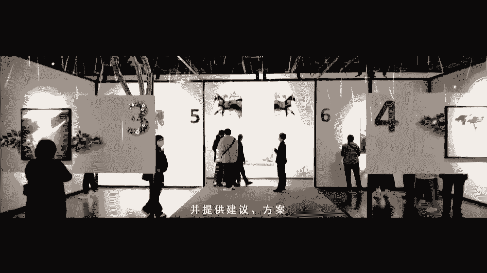

🎼要服务好线下空间场景复杂的业务需求，需要看懂、听懂、读懂线下空间的运行状况，具备推理规划决策的能力，并掌握特定行业场景、工作岗位所需的专业知识和技能，智能体才能真正承担起空间运营数字员工的角色。

OK那么我们接下来呢来看一下空间运营智能体，它的这个客户端啊呃那么空间运营智能体的客户端呢其实可以非常的灵活啊。它可以根据这个智能体所承担的角色，或者他的工作岗位到底是服务于用户在什么场景下用的。

那么来去来去选择他的这个客户端啊，那就包括比说手机端，那可能更多的是可以服务于我们的单空间运营。比如说店长啊，他可以在店里面工作的时候，他就可以拿出手机来来去了解到智能体为他去做的一些工作的协同。

而对于我们的管理部门可能更多的会通过PC端或者是大屏端来去啊和这个我们的管理的这个工作人员来进行及时的这个互动啊，为我们的工作人员来进行赋能啊，那么在过去的一年里面呢。

我们已经在很多的场景里面形成了标准化的智能体的产品啊，那就包括像线下零售行业的这个零售的智能体啊，在营业厅里面的这个营业厅智能体，包括机房智能体以及理智能体等等。😊。

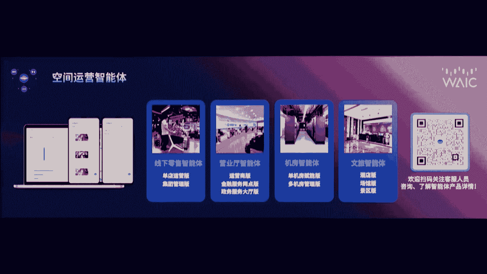

啊，那并且呢在很多场景里面可能还有很多的子场景啊，比如说我们讲的营业厅智能体，那可能就包括了像运营商版的，也包括了我们的金融服务网点版的啊，甚至是包括我们的这个服务政务的服务大厅版本啊等等。

在这些不同的场景里面都会有它的一个应用啊。OK那么因为时间关系具体的产品的这个细节呢，我就不一讲解了。那么如果大家对于产品的细节有这个有兴趣啊，或者是去想了解我们这个如何合作。

大家可以扫描我们右侧的二维码来这个关注我们的客服啊进行后续的这个交流。😊，OK那么呃刚才讲的这个空间运营智能体呢，我们讲它呢主要是面向我们的线下的实体物理世界啊。

而我们的知识服务智能体呢则更多的是服务于我们的数字世界啊呃，我相信现在大家已经有非常强的这个意识啊，就是我们讲这个时代啊，不管是组织企业或者是个人。那么它的竞争力它的经验。

它的技术以及它的业务最终呢都会沉淀为啊，我们讲叫行业专用知识。而我们的知识服务智能体呢，它的核心定位就是帮助我们的组织和个人去管理好和利用好它的行业专用知识。呃，并且呢，基于这些专业的知识。

他还可以再去进一步的帮助我们的客户来进行辅助他的决策行动等等啊，最终呢来提升他的这个生产力。因此讲呢，我们讲知识服务智能体，它是一个知识服务助手。那么我们通过这个架构图，我们可以来快速的看一下啊。

那么我们的知识服务智能体。那首先呢是因为它能够去理解啊，包括像文字视频图片、音频等等啊，客户所积累的他的行业专用知识。那么在此基础上，通过检索，通过理解推理，通过生成等等啊。

那么当然也会给于说哎我这个知识服务智能体到底是在什么场景的。我是服务于你的工作办公，还是说我是在你的生产场景下，那么他要做的事情都是不一样的。

他最终是基于我们对他的角色设定以及对他的工作任务的设定来去开展相关的工作啊，那么最终他通过他的工作来去这个影响到我们数字世界里面的知识，比如说产生生成新的知识新的方案。

或者是最终这个帮助我们人类来去影响到我们的物理世界啊，那这呢就是我们讲的这个知识服务智能体，他的一个基本的一个工作框架啊，那么接下来我们同样用一段视频啊来展示一下我们的知识服务智能体，它是如何工作。

以及如何赋能我们的这个行业和场景的。🎼知识服务智能体基于超强的多模态理解推理能力，帮助组织和个人管理，利用行业专用知识，并辅助决策行动，是一名专业知识助手。数字化时代。

制造电力、政务文旅传媒等各行业形成沉淀的数字资产、专业知识越来越多，管理利用的成本也越来越高。智能体能带来哪些不一样的改变呢？如能源电力行业知识服务智能体能够全面理解和学习能源电力专业知识。

以及老员工操作经验等大量多模态、音视图文知识内容，在维修作业中，他像一个老师傅一样，辅助维修人员快速定位故障问题。

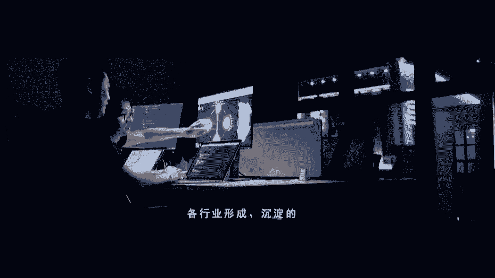

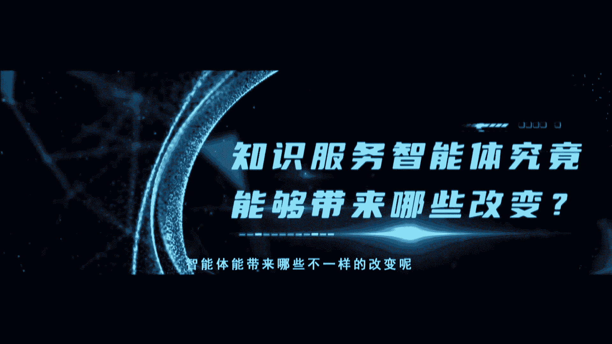

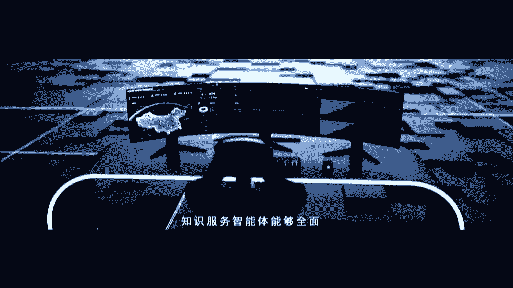

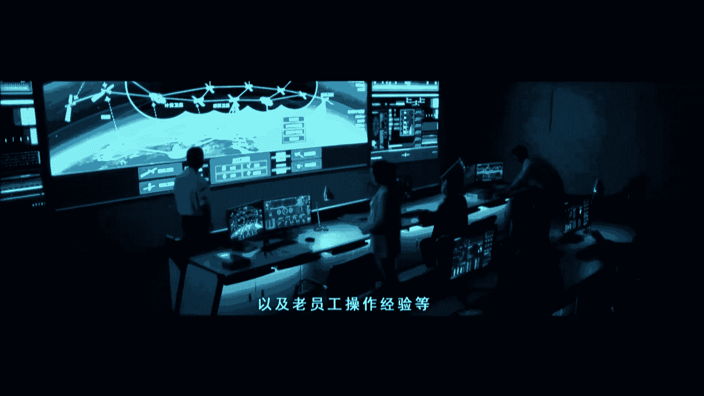

🎼并结合多模态专业知识内容及历史成功维修经验，生成维修建议，提升维修作业效率。在配网领域，通过对方式票、操作票等样本的学习，智能体能够协助生成方式票操作票方案，大大提升方式源调度员的工作效率。

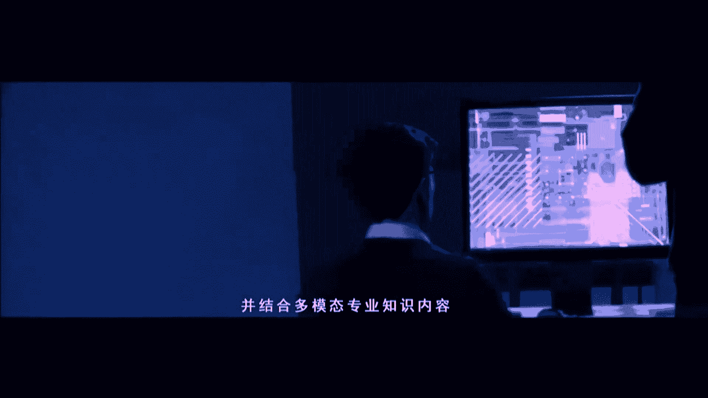

🎼知识服务智能体作为企业数据及知识通用智能助手，在政务、文娱、传媒、制造等其他行业和领域，也可以充分利用用户的行业专用知识，提供如智能检索、知识问答等服务，大大提升办公决策执行效率。

要帮助组织个人管理好、利用好复杂的行业专用知识，需要超强的多模态数据理解能力，推理与规划能力，并深度结合特定行业场景，任务目标，智能体才能真正承担起知识服务数字员工的角色。

联会科技空间运营知识服务智能体在这些领域的卓越表现。正是根植于自研的欧姆多模态大模型强大的学习和分析推理能力。

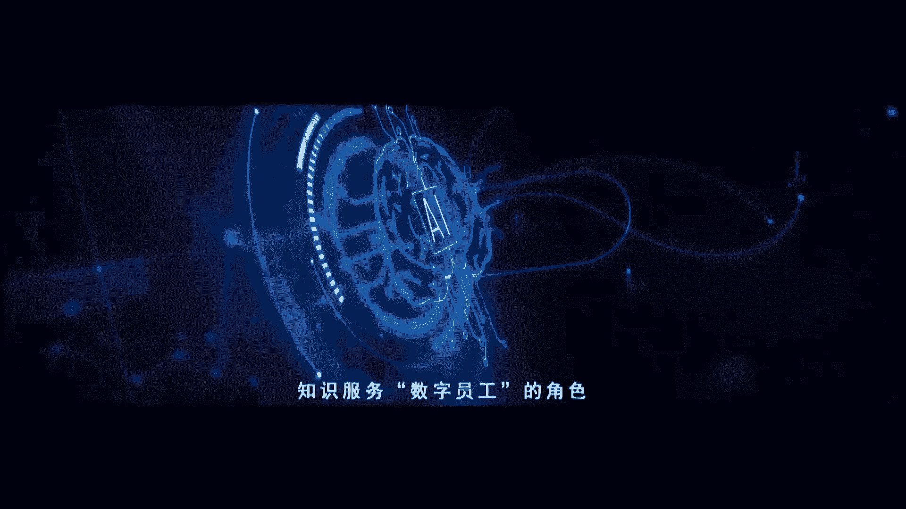

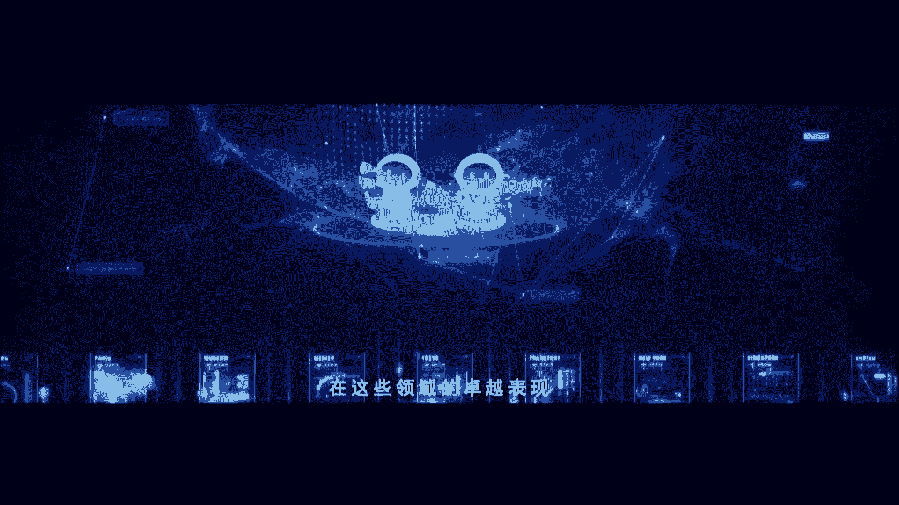

🎼AIagent解决了大模型与现实世界之间最后一公里的问题，促进各行各业的创新和发展。我们相信，联会科技欧姆多模态智能体将是人工智能时代。行业和企业降本、提效、增收的一大法宝。

将成为行业和企业不可或缺的智能化重力。

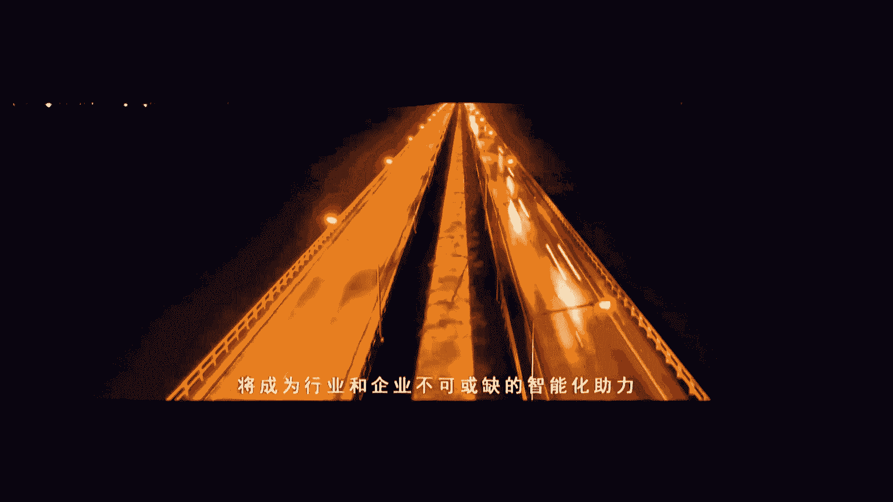

OK那么我们的知识服务智能体，它的客户端也同样可以非常的灵活啊。除了我们讲的手机端啊PC端啊或者大屏端等等。那其实它甚至可以插件的方式植入到我们客户的如办公系统业务系统等等啊，可以人际协同的方式啊。

非常方便的不影响客户的原有的这个业务逻辑啊来去提升它的这个办公效率或者工作效率等等啊。那么同样在我们过去的一年时间里面，我们已经在啊相关领域里面形成了我们的知识服务智能体的标准产品啊。

那就包括像政务或者企业的这种办公场景啊，比如像在前面讲到的电力行业里面的这个生产服务场景啊，比如我们前面提到的方式票这个操作票的生成等等啊，当然也在比如像文旅的这个客服场景等等。

已经形成了我们标准化的产品啊，那么有关产品的细节啊，或者是大家想了解合作的情况大家可以关注我们右侧的这个二维码，我们的客服啊这个小欧啊来去进行后续的这个交流啊。😊。

OK那么前面呢就是这个欧姆多模态智能体啊两大全新产品系列空间运营智能体和知识服务智能体的发布内容啊。那么接下来啊请回赵博啊，来对今天的发布进行总结。那相信大家刚刚跟我一样看了这么多的模型啊。

还有产品非常激动。我们发现呢就是说大模型技术啊已经真的已经不是说整天停留在一个API或者是一个技术理论突破，而是开始真真正正的进入我们的生活和工作。

那我相信呢24年呢也是一个我们智能体或大模型落地的一个。那随着本身模型技术的不断成熟。那我们的模型和I2呢也需要一个全新的AI原生的应用载体，让我们每个人都可以感受到A2我们带来的技术的便利跟福利。

那正如这边这个测的这么一个曲线啊。我们看到深成式I已经慢慢走过了我们这个泡沫的巅峰，开始进入了全面的落地模式。😊，那我在今天的这个地方呢，我也做几个大胆的猜测。那看看我明年回过头来。

在同一个地方看看这这猜测哪些都是会得到灵验。那我觉得第一个猜测，也就是说我们随着大模型的这个A智能体的落地。那智能体的最佳实践，必然是多个多波态模型的一个组合权。

而不是仅仅靠多大模特多只仅仅靠大语言模型，这一个模型可以搞定的那这是第一个猜测。😊，那第二个猜测是我们在明今年的一年，未来的一年里面，知能体的应用形态会发生质的突破。

我们不会再局限于只是像聊天啊chGBT这种聊天窗口的模式，而是应该有一些真正的AI原生的方式，让它可以无处不在的去帮助我们赋能啊一种全新的应用形态跟交互形态。那第三个猜测。

随着我们的大模型的不断轻量化的发展和边缘化的落地。那大模型不会再只是高高在上，在云端跑着，它可以变得更加无处不在，成为我们每个人生活中的一个好帮手，好助手啊，一个也是一个安安全更加安全的这么一个好助手。

那最后呢我想说的是呢呃可以说这个呃在过去的50年的人工智能研究里面，大模型技术可以算是最重要的一次技术发现。因为我们人类第一次发现怎么样让智能涌现的这么一种模式。之前从来没有发现过。那么自主智能体呢。

我相信也将是真正能够进入我们生活，给我们带来便利的这么一个全新的应用载体。那我们团队呢非常自豪，可以成为这个时代浪潮中的一员，祝愿我们每个人都可以有一个好助手，让我们可以从繁大的生活中和工作中解脱出来。

或者呢在AI的助力下面，我们都可以以一挡十变得更加高效，更加强大。😊，那谢谢大家，我的演讲完毕，欢迎呢我们会后进一步交流，谢谢。😊，好的，谢谢再次感谢我们联会的三位领导带给我们的重磅发布啊。

谢谢请各位入座。刚才呢从这个感知思考记忆三个层面，让我们看到了欧AI的新的眼进啊，也让我们在现场感受了一把大模型与智能体带来的全新的体验与改变。那今天在我们的本次论坛现场也非常荣幸。

还邀请到了来自能源基建、媒体文化、运营商以及金融等多个行业的资深专家。下面呢将进入到今天的AI加行业分享章节。这一些专家嘉宾们，他们将与我们共同分享探讨。

他们对于大模型与智能体技术应用的深刻体验和独到见解。同样让我们再一次将目光聚焦于大屏幕，通过一个视频来正式拉开。此次的AI加行业分享章节，请看大屏幕。😊。

🎼亲爱的伙伴们，下面正式的进入到本次论坛当中的AI加行业分享章杰。刚才我们赵博又提到，其实当下的AI已经融入到了我们的生活和生产的各项生活的这个指标当中了哈，同时也在重塑着我们的这个当下的生活。

那么首先让我们在舞台之上把时间交给中国移动上海产业研究院工业能源产品部总经理周威周总上台，为我们带来本环节的第一个主题分享，掌声欢迎周总，欢迎。😊。

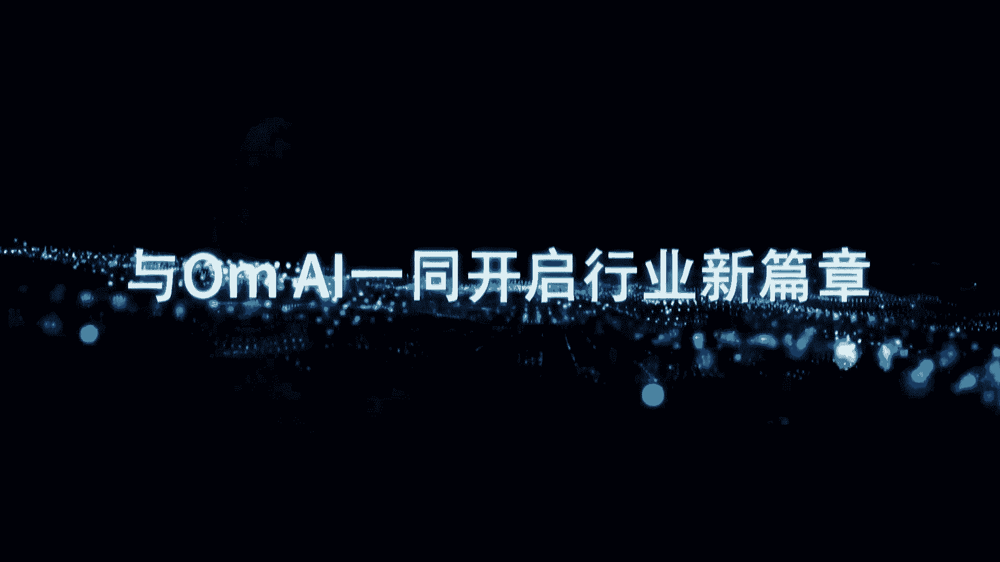

好，尊敬的各位领导啊，各位嘉宾啊，今天我演讲的题目叫做中国移动工业大模型，引领工业能源新征程。呃，刚才啊各位。嘉宾啊，包括很多学者啊也介绍了这个。大模型的很多能力啊，包括智能体的啊。

我这个是比较接地气的，就是我们是做这个行业的啊呃，我首先介绍一下自己，我来自于中国移动和上海产业研究院啊，我这个部门呢叫工业能源产品部啊，做的就是工业和能源相关的呃工业的一些产品啊。

我们打造自己的工业互网平台以及相关的一些应用。律师想谢啊。呃呃，首先还是政策背景吧，这个大家都知道啊，这人工智能啊也是国家最近期的一些很多的政策啊，我们提出了这个新的生产力，促进这个呃新型工业化啊。

其实我们对奇庙新型工业化或者奇庙新的生产力啊，我们都学过什么生产力和生产关系吧？其实我们认为啊生产力里面很关键的一点就是人。和这个生产资料这样的关系。生产资料里面呢有包括两类，一类是设备。

就是我们传统讲的一些工业设备。另外一类呢就是我们讲的这种叫做软件啊，我们现在提的比较多的啊一些啊工业的一些软件啊，包括一些常用的一些办公软件管理软件。

所以我们认为人和这种硬件和软件真的交互以及怎么做优化啊，这就是我们是心智生场的应个解决的问题啊，所以中国移动啊也是加快人工智能的布局，全面复兴新能工业化打造了新智生产力。呃，在过去很很很多年啊。

我们也做了很多这方面的探索，就人工智能相关的一技术。人工智能这个技术啊，其实并不是一个新技术啊，我们都说195几年就开始有相关的技术，包括在很多领域啊都很多很多应用。包括这个神经网络啊，我们之前的话。

像我读书的时候，其实他不愿意不愿意用视经网络做一些很多问题。那收敛也很慢啊，算的要求比较高啊，就是说是不太好用的。只是说今年的发展算率的提升啊，让我们这个硬件软家一起让这个算法啊得到了新生。啊。

我们也在也在想啊，就为我们在很多领域都到很多的应用。但是传统的这种AI的领域和这个现在的这些需求到底有哪些问题？我们提到很多的这个方面。有工业领域其实解决的还是客户的需求。我们老在讲嘛。

就是我们不只让AI能做失，还很多做事。但是我们在实践的过程中啊，发现传统的AI有几个问题解决起来非常困难。😡，第一个呢就是生产能力，这块是受限。学习能力受限就是我们原有的这些模型里面，我每一次做这种。

建模进行训练。都要采采就采样做进行大量的数据获取。没有这些样本的收集和积累，我其实无法获得一个非常精准的一个啊模型的啊。因为我们在很多行业都碰到类似的问题。😡，你要我们做这种。啊。

纺织啊光伏的质检问题啊，我们要花大量的人力物力，甚至是上年几个人月，甚至上人年的这个工作量，去积累大量的瑕疵样本。让我进行训练。场景的发华能力不足。😡，我这个校本训练完以后，我的场景一旦发生变化。

我这个模型的精准度马上出现大幅度下降。😡，因我们这个。一个同样的一个模型。同样的一个产品，在不同的产线。他精度下应都非常厉害。我要重新训练。就算是同样的一条产线你要纺织。😡，他在这个产品的批次。

是厂商供应商不一样，对吧？它在调整过程中，精度也会下降，就场景的泛化能力是非常不足的，造成大量的这个AI的应用的时候，成本非常高啊，我们每次都要铺大量的人力物力，在现场就是陪着客户做这个做训练，是吧？

然后让这个客户的这个模型，可以达到商用或达到这个真正能用的一个标准。如果一旦失去这种。😡，维护和调整这个模型马上被废弃掉了啊，我们也看到AI其实这个能大家非常欢迎像质检这种领域，大家非常喜欢。

但是呢这种问题严重制约了啊这些场景的推广和应用啊，包括我任务拓展性差，数据的鲁班性差啊，这都是我们在过程中啊，造成这个AI。😊，这个传统的这种AI本身的这些能力。很难得到一个低成本啊。

性价比很高的一个应用啊，这都是我们面临的一些困难。但是呢我们也认为啊就是大模型出来以后，在一定程度上解决了一些问题。但是刚才那个彭教授也在讲嘛，就是我们这个。😡，呃，细颗粒度的啊数据。

它可以非常精准的发现发现问题。那举个例来讲，我们做这个质检啊，用的比较多的啊，工业质检。我在PC的板上这些瑕疵，它焊点都瑕疵，对吧？都要瑕疵啊，或者都要一个斑痕，我在高峰板上在布料上。

我在我的五金架上那些瑕疵，它都是不一样的。😡，它就会细分那些都是非常细分的。就是所以说我们要精准的判断这些瑕疵和这些问题，就必须实现大小模同的协同。😡。

所以我的这是一个啊我们认为一个重要的一个曲折和方向。前面在工业界啊，我们认为这是我们必须必须要做的一个哈重要的一个一个呃研究的一个课题。什么大模型模型进行协同，让大模型解决我们的泛化啊和鲁王性的问题啊。

让这个小模型解决精准性度的问题。呃。呃，我们也在分析啊，就是我们还是从市场出发，从客户出发啊，我们不止让大模型都做事，还更要做事嘛。😡，到底解决客户什么问题啊，我们做了一些梳理和分析啊。

刚才这个呃呃很多领导和专家也提出来过啊，包括各个领域啊都在应用啊，我们也列举了工业领域，常见的一些场景啊呃电力的像现场的作业的智能管控啊，配网计算建模推演啊，包括客服啊，异常诊断包括石化行业啊。

你非常规的一些作业的智能预警啊，异常功告的分析和引导啊，这都是常见的一些啊我们客户在应用过中发现的些发散一些挑战。那举例来讲，好像石化啊我们的异常功耗的分析和引导，就它里面如果出现温度异常。😊。

升高啊叫飞瘟对吧？包括肺停是吧？包括一些堵塞，这些问题又该怎么处理啊，它其实在场景是多变万化的啊，它是就是千变万化。😡，所以说要打一个要解决这些问题，泛化的问题啊。

这都是我们这个工业中行业里面碰到一个重要的挑挑战和困难啊。当然我们做这个梳理，我的大模型啊确实是马上解决这么多所有的这些问题也很困难。😡，所以我们做了一些整理和分析。我们认为在工具链算力和安全方面。

它其实是有一些共性的。我们可以首先用大模型。在工业视频知识问答和文本生成方面来解决这些关键问题。所以我们打造了中国移动的1加1加1N的一个工业大模型的能力体系架构啊。

这也是呃结合着我们中国移动的一个算例啊，算网的一些能力。最底层呢就是我们的算计算的一个底座啊，结合我们的算例，我们的网络啊，5G5GA啊，我们的高速的网络通信啊，包括供应数据的一些底座。啊。

然后基于9天啊，我们自己的这个基饿大模型啊进行微调和预训练。通过训练推役的开发工具链，打造了我们的工业大模型。工业大屏里面就达到了一些呃大家都是常用的一些应用啊，包括视频的一些分析。

知识问答、完美生成、工业应用和工业数据分析BS以此为基础啊，针对于工业领域的一些共性的一些痛点。对于安全的监管啊质检检测。然后呃产业大脑啊就是我们产业分析啊，这些方面进行知识问答啊进行检测。

这构成了完整的一个啊工业的一个模型体系啊，并在在大模型基础之上，我们逐步的扩展到其他领域啊，包括我们的矿山啊、电力啊呃建筑啊，都有相关的一些应用。

从而并且利用生态合作伙伴啊一起打造啊大模型的这个应用生态体系，赋能一千行百业。这是我们整体的一个呃思框架和思路。呃，下面给领导也给各位领导和专家汇报一下啊，目前的我们一些工作进展啊。

我们这是在工业安揭方向啊，我们做了呃对于工业安全生产方向的一些呃探索。呃，我们针对于这个场景覆盖率比较少啊，训练周期比较长，发达力比较差的这种传统的这种啊模型的这些啊问题。然后通过大模型啊。

然后提升了啊我们供应安监的这些能力啊，现在是一些视频。えと？这个这个多放一下。🎼内蒙古某煤矿AI增强安全感知，这是在煤提供皮带机蒙煤矿煤矿的一个全全排查项目实施前存在皮带机，掘境面人工巡检漏碱多的问题。

项目实施后，依托图文对话，学习厂区安全规范，增强隐患排查，提升巡查效率大于30%。🎼江苏某科技企业AI开放式规则识别提供多目标识别、自定义内容和规则。项目实施前，针对车间合规穿戴等场景。

传统方法难以覆盖全量排查内容。项目实施后，单模型实现大于50类目标识别，相似场景零样本迁移，缩短定制周期大于40%。上海某机械企业自定义特征检索，提供时间、地点、人物特征组合检索项目实施前。

场内人员违规行为，设备运行异常状态，人工历史查询效率低下，项目实施后，自动提取特征任意组合查询、检索时间缩短大于90%。🎼山东某化工园区AI智能统计分析，一键生成巡查台账报表，减少重复工作。

🎼项目实施前，人工现场巡检通过手工记录巡查台账费时费力。项目实施后，5秒以内自动生成违规趋势统计，输出台账报表，违规有迹可查。啊，以上是一个安全方向的一些那个一些案例啊。这在质检方向的啊。

我们在质检方向同样的也是这个传统的这种模型啊，在做的时候也是碰到一样的问题，就发化能力啊，对数据敏感啊，然后一要大的人力物力对瑕疵样本进行训练啊，这也是我们通过大模型啊，在呃纺织啊、光伏呀。

包括这个烟草行业啊做了一些探索。🎼河北某光伏企业AI光伏组件缺陷检测，提升检测精度，可范化至电池片检测。项目实施前，缺陷细微，人工检测约17秒，漏检率为8%。项目实施后，漏检率降低80%。

检测时间减少70%。上海某航天制造企业AI发动机漏由检测，提高实验安全性，进行预防性维护。🎼项目实施前，存在检测环境恶劣、人工巡检难、漏碱等问题。项目实施后实现7成24AI检测，及时预行安全高效。

云南某烟草企业AI烟丝杂质检测。检测效率高，可泛化至烟叶检测，项目实施前，存在检测效率低。每产线需要3至4人。项目实施后，检测效率提高60%，检测成本减少3分之1。福建某纺织企业AI致司断裂检测。

降低生产成本，可泛化至面料检测。项目实施前，存在生产节拍快，人工巡检难，不良持续生产导致原料损耗高等问题。项目实施后实现AI全检原材料损耗成本降低80%。嗯。这是我们在质检方向的一些探索。

因为这个确实是在实际过程中啊，这是通过大模型解决我们实际中碰到的一些呃挑战和困难。呃，下面是产业大脑相关的啊，因为呃国家这两年也在提落很多产业集群啊，方向的数字化转型啊，包括中小企业呃。

这些的话同样的也是。呃，在大模型这个应用之前啊，它这个很多的工具和方法啊，对于这种泛化能力啊场景化啊要求比较高。同样的一个技术啊，在一个地方能用换到另外的个地方以后啊，重新训练和调整。

所以这块我们利用了这个大模型啊这种技术啊，利用大模型摄成相关样本啊，提升检测的这个泛化能力啊，然后能够进一步提提升整个的一个呃。整合的运营效率。这个可以播放一下。

🎼山东精制茶产业大脑AI产业信息制搜价值观点自动提炼，去无寸精。项目实施前存在冗杂信息过多，难筛选项目实施后，1。

3亿市场主体工商信息3000万条新闻政策等资讯一站式检索、浙江黄酒产业大脑AI产业报告生成、一键生成，节省报告撰写时间，项目实施前，存在黄酒产业报告撰写耗时、难精炼等问题。项目实施后。

实现3分钟生成黄酒产业分析报告，数据详实可靠福建机械中备产业大脑、AI招商目标推荐聚焦本地产业规划，精准推荐招商目标，项目实施前，依赖蚁人招商存在招商目标企业不明确等问题。项目实施后。

实现对该产业124个节。🎼点进行强中弱空评估，形成招商目标企业清单。呃，以上是我们的一些案例啊，因为我们转于的工业这一块啊，和能源领域，它是一个实际的啊，客户需要看到实效的一个。啊，领域啊。

就是我们还是希望大模型这块技术啊能够真正帮助我们的企业啊发挥作用。因为工业呢还有一个特点，就是说行业门类特别多啊，要一行一侧一场一策。啊，我们也希望就是通过呃人工智能领域啊。

更需要各个合作伙伴一起啊进行合作，共同打造一个生态系统。然后让我们的这些技术啊用在各个领域啊，我们这边也是和联会啊有深入的合作啊，希望呃刚才那个赵总也介绍了很多的新技术啊，我希望在新技术方面啊。

们有进一步加强合作，更好的能够富合于千能百千行百业啊，一起把中国的信息工业化啊，推向新的高度。好，谢谢大家。谢谢感谢周总，谢谢您。😊，🎼让我们在本次论坛的这个分享环节当中。

看到了AI在工业领域的这个丰富应用与赋能。接下来呢和大家共同聚焦一下我所处的行业。广电传媒广电传媒行业呢一直是这个AIGC应用的先行者和推动者。在新技术的推广与应用的方面展现出了锐利的洞察力。

还有这个前瞻思维。通过AIGC的技术，不仅提升了内容生产的效率和质量，还能够为广大的观众带来的是更加丰富多元和个性化的视听体验。

接下来把时间交给央广传媒集团总工程师兼云听副总经理李向荣、李总上台为我们分表呃，发表这个主题欢迎。🎼欢迎您。这个很高兴啊，今天今年这个第二次参加年会在上海举办了这个人工智能这个大会的一个论坛哦。

这个特别高兴。这个每次来发现都有一个欣喜的这个这个我觉得是一个这个比较比较这种属于互联网迭代这个这个这个这个速度吧。这个我那个今天带来的这个主题呢是什么呢？是AI赋能国家移动音频平台的这个创新发展。

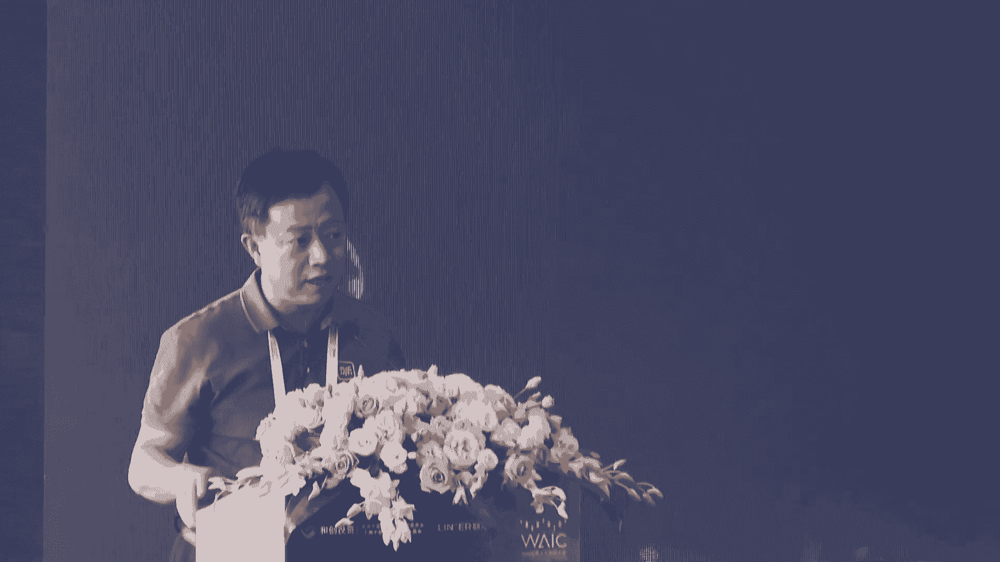

也是想一起探讨一下这个这个人工智能啊，对于国家媒体平台这么一个创新应用的这个能够来赋能怎么赋能。首先介绍一下云听是谁，也也许在座很多人可能并不清楚。但是云听现在是目前总台叫三驾这个移动的这个马车啊。

其中一个呢是这个底下能看得到的是央视新闻，这主要是以新闻为主。第二个呢是这个央视频，央视频是咱们现在总台主要聚焦于这个短视频，但是它是也兼顾长视频。现在欧洲杯正在火热呢。

那可能大家能能关注到可能只能通过这个版权的方式，只能通过央视频来来观看这个这个直播比赛啊。另外一只呢就是现在目前我们这个声音这个媒体，就是云听云听助力于这个整个总台广播的这种转型发展啊。

这个声音这块可能大家也比较有这种就是说声音它有他的自己的这个优势和局局限啊，优势就在于什么？它能够真正解放双眼，解放手眼啊，大家能知道，现在我们看东西越来越多，尤其是这个这个移动端的这个手机啊。

这个发展。哎，我们越来越离不开手机。但是实际上对眼睛真的是有损害，有损害是吧？第二呢，它更多的是一种陪伴性的陪伴性。就我们把它放在一边，哎，它不影响任何的这种工作工作。

第三个呢就是对于网络的这种低带宽的要求，没有没有哎放哪去了。第大块的要求。另外一个呢，他声音更多的是能激发你这种想象力想象力。但是他其实也受他的这个优势，他也有他的自己的局限啊。

你比方声音可能更多的人你你只能听，让他看不到看不到。第二呢，他信息的传递还是有限的还是有限的。所以我们在考虑什么呢？我们说我们和人工智能，人工智能到底对于这个声音媒体他能赋能于什么。

第一部分呢可能就是我们比较传统的，大家也也比较应用的比较多的，就属于AI的语音播报。今天那个在会前跟彭教授一起交交流，还说总谈那么多主持人说那么多好听的声音其实这些声音嘛都是有资产的，都是有资产的是吧？

你比康辉的声音是吧？以前我们说董卿的声音等等这些其实都特别好都特别好，怎么把这些声音能够保存下来，是吧？一我记得我跟赵总交流说4年以前我们在说声音我们要训练一个人的这个音色啊，真的很难。

我记得当时就是我们是收购了一家百度的一个一个团队，就说他至少是说两个小时的语料库，然后要训练差不多两个月的时间，你才能把这个音色才才能才能用于这个我们的这个智能播报啊，但是现在通过大模型的发展。

真的是几秒钟几十秒，你今天你说了几句话，就今天我在这个讲台上我我说几句话。哎，立马就能复刻我的这种声音。现在这个技术发展就到这种程度了，这种程度了，这是一个我们比较常用的这种这种AI的语音播报。

大家也可以体这个这个体验一下啊，这个麻麻烦老师帮我再播一下。就这个这一部分右边哎不不对不对，上上上。可以体验一下这个从发射升空到返回落地。历时53天，嫦娥6号携带着从月球背面挖来的土特产终于回家了。

此次嫦娥6号返回有何技术难点呢？据空间技术专家好了，你看据空间技术专家张介绍以嫦娥6号返回方式就像是在可以停一下。对。刚才看到其实这个呢就是我们从从这个信息的采集到最后的摘要，到最后的合成。

完全都是智能化的智能化的。所以他大大提高我们整个生产播报的效率，生产播报的效率，这是我们一方面的一个运用。第二个方面呢在于什么呢？在于我们就是大量的梅字库带量我们的生生的内容。

我们实际上如果靠人工来打标签，累死了，真是累死了。你看我们举一个简单的例子，你看射雕英雄传，这里面是属于什么呢？它是金庸的作品是吧？他也是讲的是南宋的这个故事。它还是个武侠的。

同时呢我们这个这部作品呢也是属于双人演播的，这个能带来什么呢？他他通过这种对于语义的理解，能够对你的这种标签，它可以自动打标签，它是什么样一个一个。如果说我我关注武侠的。

我会不断的给你推送这个武侠相关的一些内容，真正能实现什么智能推荐。这个对于后面的服务于每个人听到的是不一样的，他跟你推送的也是不一样的这这是对于对于媒体平台啊，他可能是比较关切的一个东西。

第三个层面就是刚才也说到这个音频的传递信息啊，真的比较单一比较单一。那我们怎么丰富。那有些人可能他不仅是听啊，他还想看怎么办？所以说我们也通过和梁慧一起合作的就是多模态的这种音频这个插画生成生成系统。

我们看到这个右边这两个这个这个场景，就是这第一步啊是梁晓生的就矛盾文学讲的获得者，他是人世间啊，那是大火了。他其实还有一部作品叫夫妇之子夫妇之者。但是呢通过演播人，他演播的时候呢，他没有画面怎么办？

然后让让老师帮我帮我演示一下，这个中间的这个播放器显示的画面全是自动生成的，这插画的形式，大家可以第5集。高家兄弟在山里自得其乐，自己有余。那年头，猎人比采参人少多了。这是因为彩神可以结对。

没几人十几人一伙儿，如果十几人进山以后再分开，一般不少于3人一组。那稍微体下凶险之际互相，这其实也呼应一下彭教授刚才讲那个其实我们通过什么呢？这能大大节省人工。

我们以前要要要要要招聘很多的设计人员来制作这么多的插画，那真是类似的效率极低。那后来我们跟联欢一起，我们合作开发了这个多模态的音频节目插画系统，就能有效解决这个问题。这是一种插画。

还有一种是连环画的一种形式。大家知道孩子吧，可能他你给他制单纯的声音，尽管能培养他的专注度啊，让他更喜欢孩子看，就我们小的时候，我们想在我们是不是喜欢看连环画的那种感觉。

那么右边那那那张我们要演示的是就是我们通过连环画的一种方式，那个老师帮我在在在右边那个对。🎼简单的吃的小河马。🎼清晨，小河马起床了。🎼他伸出头看看窗外。🎼多么美好的一天呀，真适合出去野餐。

🎼小河马把奶酪、橘子汁儿和煮熟的鸡蛋装进它的野餐篮子里。🎼三明治、苹果、香蕉、草莓，谢酸奶，主要是时间有限，不给大家多大歉了。这个就是我们在整个对于这个音频的整个信息传递有限啊。

我们考虑的说怎么通过这种插画自动来给它去插进去，丰富我们整个内容的展现啊。嗯，这个流程我就不说了，因为其实刚才这个彭教授把这个基本都讲明白。

但是我这个呢只是我们简单的这么一个一个一个这个利用OM这个OM这个个大模型啊，我们怎么样去实现我们的插画的这个整整体的一个过程。另外一个呢就是说我们还可以什么把我们的内容和我们想要因为媒体更多的什么呢？

他更多的商业化变现的模式是是靠广告。那我这么多内容怎么和我的广告产品怎么去结合。这里面其实有一个演示是一个什么呢？是以我们在播这个金庸的笑傲江湖这个片里面。

其中他提到一个酒类相关的那我们和在提到他酒类的时候，在下面有一个框里面，他自动会展现酒的广告产品。那个老师帮我再演示一下，谢谢自己啊人生一式也算不冤枉。想到这儿，林狐冲不禁豪兴大发，他说道。我要喝酒哎。

🎼大家能看到这是汾羊王那个青花，这是我们代理的广告，它能自动能够匹配这个广告的产品，这也是商业化表现。其中一个方面，死不了也好。好，停了吧，谢谢。

这是我们也是基于大语音模型啊计算音频内容和我们商品之间的相似度。这样的话能够及时丰富我们整个的一个商业化变现的一个手段啊。另外一个几个方面，其实我们也在应频的探索什么呢？大家知道中国是56个民族是吧？

那其实每个地方都有自己的方言。浙江我知道也有浙江的方言，我们也是说在保护与传承这个中华乡音文化里面，哎，通过这种基成全国各地的这种乡音这个模型语言语言模型啊，我们这里面现在目前大概有6种6种。

比方说像这个这个好像这个这个粤语这个这个赣语等等等。这些啊，可以大家可以感受一下。因为这里面没有演示，就是我们可以做很多东西。另外一个就是在右侧这一块是干嘛呢？

我们其实是和这个中和这个这个教育部的语尾打造什么呢？总台把所有的课文，用最标准的普通话全读了一遍。读完了以后呢，我们给孩子们怎么办？孩子们，他们通过学习完了以后，你的准确度到底怎么样啊？

你的完整度流畅度通过几个维度通过AI的方式来说啊，你哪的方案不行，你再怎么样去训练，就是让孩子能通过这种系统的方式，你能自我去学习，这也是一个其中方面的一个应用啊。另外一个就是我们大家知道。

现在目前中国可能大部分应用的这种空间三维声的这种标准啊，还是美国的杜比技术。但是从去年开始，中国有了自己的杜比，那叫我们叫三维精彩声，这是总台国家重点实验室，我们重点开发的。但是呢你有了这个标准以后。

我们现有的我们不能把所有内容再重新制作一遍。所以这也是我们其中一个应用，把通过这种用AI技术将立体声的音频转化为三维声，这个精彩声就是中国的杜比的技术。我们现在目前把它广泛的应用在什么呢？

用于这个车载这个场景。因为车里的场景嘛，它更多的是一种封闭的。它有很多喇叭，它能够呈现这种沉浸式的感觉。所以这也是我们三这个整个AI的这种这么一个应用啊。

所以回回到说我们刚才前面讲到这么多的这个AI的赋能应用。其实我们在对于商业化啊，一个是电子版权，就是我们不仅是声音的这块，其实有了我们插画，其实我们还可以通过AI。

我们可以做这种短视频的这种版权的这种输出。第二呢就是广告的营销，就是刚才说的，我们这个音频内容怎么和我们的这种广告产品怎么去结合，怎么去讲好我们的品牌故事。

那么还有一些一些很多大量的素材都可以通过AI方式来生成。另外一方面就是教育培训，就是一些课间的制作，我们同样也可以这么去来丰富我们的这这个这个变现这个。我们当然这时天时间比较短啊。

大家可以扫码这个下载云听。就这里面有很多，其实大家可以感受。但更多的还是我们自己的主营业务。就是我们有很多特别经典的历史的文化的知识这些产品，大家可以去去感受啊。如果家里有孩子。

这里面有最权威的这个中小学的语文诵读库。大家可以可以去去去去去去学习啊。然后最后就特别再次感谢联会感感感谢各位各位老师，各位各位嘉宾啊，我们一起和联会怎么未来AI的这个3。04。0，咱们一起向未来。

更更好探索媒体应用发展的这个未来，谢谢啊。🎼谢谢感谢李总，谢谢您请您入座。刚才嗯李总呢通过他的这一个主题的分享哈，向我们介绍了AI技术对于传统音频在内容生产、个性化创作、素材管理等不同环节的赋能。

也通过了非常鲜活的这一些真实的案例，向我们展示了在这背后所蕴含的巨大的这些潜在的商业价值。伴随着大模型在图像、视频等通用领域的能力提升，以及在电力行业建设新型能源体系和新型电力系统建设的加快推进。

电力行业正在进行着一场深刻的技术革命。下面让我们把时间交给国网、浙江营销服务中心、数字化业务室副主任沈然为我们发表主题演讲，欢迎。😊，呃，尊敬的各位领导，各位嘉宾下午好。那非常荣幸啊。

今天能够参加呃这个论坛并做交流分享。那我本人的话也是受这个国网这商电力营销部的委托。那今天来这个参加这个交流活动。那我看之前前面做分享的，基本上是我们呃人工智能领域的一些专家学者。

包括我们这个人工智能行业的一些从业者。那么我这边的话重点会从一个人工智能技术应用的一个使用者，一个体验者的角度去分享一下，就是我们电力营销行的专业对于人工智能技术相关的一些认识。

那么今天我做的这个分享主题是人工智能技术在电力营销领域的应用时间。那我的这个介绍的话主要从四个方面展开。那么分别是电力营销数字化的发展历程。电力营销专业的人工智能的一些典型应用场景。呃。

电力营销专业近期在大模型应用方面的一些探索与思考，以及最后的总结与展望。那首先汇报一下电力营销数字化的发展历程。那电力营销专业呢是电网生产经营过程中啊非常重要的一个环节。

那么他扮演着向我们广大的电力客户提供电力能源产品和服务的这样一个重要角色。那么电力营销专业呢有4个比较显著的特点。那分别是客户群体多样。那我们有工业商业居民农业政府用户。那全部都是电力用户。同时。

业务的环节比较复杂。目前我们核心的业务系统上面有近1000个这个相关的一些业务的功能项这一块。那么同时服务内容比较多元化。呃，企业的用电报装，包括一些电能计量，包括电费的结算。

包括有些市场化用户的一些电量的采购，全部都也是通过电网公司来进行提供的。通过电力营销专业。那么最后一个特点的话是数据资源丰富。那么以浙江为例，目前我们全省有3400万的电力用户。

那么每一天我们所采集用户的这种准。实时的用电数据的体量增量达到了1个TP以上。那么正是因为这些特点，所以电力营销专业的发展非常依赖于信息技术的应用。那么也只有依靠信息技术应用。

才能够去破解广大电力用户日益增长的用电服务需求与电网企业有限的服务资源之间的矛盾。那么现在屏幕上呈现的是电力营销信息化的发展历程。

那么从1987年以电费计算为核心的单机版的用电管理系统在浙江绍兴投入使用。那么到1999年上线全省统一的电力管理系统，再到2007年。全网公司首家上线省级大集中的电力营销业务应用支持系统。

再到2015年，浙江公司在全网率先实施了互联网加电力营销服务体系。2018年首家上线网上国网APP再到2021年营销2。0系统的示范上线。那么整一个浙江电力营销信息化。

应该讲是处在一个比较快速的发展阶段。那么到2022年的时候，我们建设上线了电力营销大脑。那么也是将电力营销管理迈向了智能化的时代。那么回顾一下人工智能技术的一个发展历程。

那么从上世纪50年代人工智能这一词被正式提出以来啊，先后经历了专家系统的兴起，神经网络的复兴、机器学习的崛起，以及深度学习眼镜等多个阶段。那么2017年的时候。

随着这个transformform的这个问世。那么为后续的一些向tPT等经典的训练模型的诞生啊，提供了非常坚实的基础。那么到2022年的时候。

openi发布了这个GPT那么也是掀起了人工智能发展新的浪潮。呃，通用人工智能也是正式站上历史历史的舞台。那么随着这个当前这个新能源的一个快速的一个发展啊，包括电力市场改革的一个快速推进。

那么新的市场主体跟服务业态也在不断的涌现。那么相互主体之间的关联关系也越来越强。那么随之而来的是电力营销管理的相应的这个决策难度正在不断的加大。那么这些客观的问题呢。

为人工智能技术应用也提供了更加广阔的空间。那么我们认为当前电力营销领域对于人工智能应用的需求啊，主要体现在7个方面，分别是管理信息能全面汇聚，业务变化能实施感知，工作管理工作能在线协同。

专家经验能沉淀共享，问题趋势能科学研判、创新需求能敏捷响应，以及指挥控制能精准智慧。那么这些需求也不是现在才有的。那之所以现在才提出是我们认为随着当前人工智能技术发展，为解决这些问题创造了非。

非常好的一些必要的一些条件和基础。那么接下来向各位领导和专家汇报一下，就是前期我们在人工智能技术应用方面开展一些探索实践。那首先是数字文件柜。那这个也是我们和今天这个论坛的主办方之一啊。

联慧科技共同这个打造了一款智能化产品。那么电力行业是一个关系到国际民生的一个重要的公共事业。那么电力营销专业是一个政策引导性非常强的这么一个专业。随着市场业务的不断变化。那政策文件也是频出。

那不管是电力营销的管理者，还是电力营销的业务执行者，都会存在文件查找难，管理难，理解难，这这样一个三难问题。那么数字文件柜也是针对这个问题去进行研发的。那么我们运用了像图像识别、自然语言处理等技术。

实现了一个政策文件的一个标准化的归集。那么我们也叫一键式的这个数字汇编。那同时也通过像知识图谱的一些实体识别关系抽取等技术，实现了我们电营销政策文件知识图谱的一个半自动化的构建和一个深度解析。

那么能够帮助我们更好的了解文件关系的这样脉络关系。那进一步的话，我们结合了像向量检索等相关一些技术，实现政策文件的一个智能问答和精准推送。那应该来说。

数字文件柜帮助我们解决了文件使用过程中存在的多繁杂等客观难题，对提升政策执行的合关合规性啊，也起到了一个很大的一个帮助。那下一个场景的话是电力营销的一个智能语音机器人。

那么浙江省内有3400万的电力客户。那如果要实现一个服务信息的一个推送啊，那么传统的这种短信的通知方式触达率会比较低。那么人工通知方方式效率有没有办法满足。

所以说我们后面也想到是不是可以通过智能语音的方式来代替人工开展相关的一些业务。那么呃浙江电力是于2000年的时候开展智能语音平台的建设，并上线了智能语音机器人。

那么也是国网公司系统内第一家上线智能语音外呼应用的网省单位。呃，我们可能都知道就是呃智能语音机器人，它可能会有语音识别语音理解跟语音合成这几个最主要的部分去构成。但实际上其实在我们做的工程化的过程中啊。

发现还是有很多一些问题。比如说我们怎么样能够在一个相对开放性的这样一个聊天环境下，更加准确的去识别用户意图。我们怎么样能够提供一些呃体验感更好。好的一些打断。

包括一些这个对话续接的这这方面的一些这个这个机制。同时怎么样能够去合成一个更加亲和，更具拟人化的这样一个音色。那么这些都是在我们工程化过程中需要去考虑和解决一些问题。比如说我们在客户的意图识别方面。

采用了一个自然语言处理加正的表达式这样一个方式。那其实就是为了解决在我们这个对话过程中啊，可能因为这个对话的内容过短，导致语信息丢失的这样一个一个一个问题。

那么较单纯的使用自然语言处理或者单纯的使用正的表达方式，在整一个识别准确率方面会有一个比较明显的这样一个提升。那么呃目前我们浙江省内的像这个电费的一些通知提醒，包括像停电的一些通知。

包括一些服务满意度的回访，目前都已经基于智能语音机器人来开展了。那么累计的这个服务用户的这个次数已经超过了4000万次。那么接下来我们再看一下。

就是在我们电力营业厅的相关的一些这个智能化的一些应用场景啊。那么线下业务无人化是目前很多行业的一个发展趋势。那电网公司也不例外。那么线下业务的无人化。

对我们线下网点的一些数字化和智能化的水平提出了一个更高的要求。那我们在2001年的时候，当时数字技术还没有规模化应用。

那当时我们是联合了相关单位去研发了我们电力营销自己的这个数字虚拟呃原甚数字虚拟营业员。那么呃同时的话就是为用户提供向我们在前端业务办理场景上的一些这种半店引导，包括服务咨询等相关的一些服务。

那当时的话我们这边是收集整理了近8000条的电力客服的一些知识条目。那么通过问答队的形式存放在知识库里面。那么呃在整一个这个智能问答这方面啊，我们当时采用的是这个t像似度计算这样一个这个技术路线。

那么相当于是。通过去知识库里面去匹配。那么相似的条目去进行一个回答。那我们这边的话是当时是做了一个策略。当自信度超过80%的时候，我们会通过知识库去进行这样一个回答和回复。当自信度低于80%的时候。

我们这边去调用了一个大模型。那当时因为国内还没有太多的一些开源的大模型。所以当时我们去调用了一个国内某厂商的一个大模型的API那么去给用户提供一个互动性更加强的这样一个半点服务半点服务。

那么这样的一个方案呢，其实我们在应用过程中也发现存在一些问题。比如说我们现在这个知识库的维护的工作量就非常大。因为以问答队的形式去维护知识库，这个东西其实非常依靠人力对知识采编这方面一些工作的。

那另外来讲的话，就是基于这样一个预训练模型啊，需要大量的去进行一些问答队的扩写，去支撑相应一个模型训练。那同时的话，目前这套技术方案，在大模型跟知识库，两者之间是比较割裂的。没有有效的联动起来。所以。

近期的话，我们这边也在打算开展一些技术升级，呃，采用一些目前业界更新的一些技术手段这块。那么最后一个场景的话是我们内部的一个数据使用场景。呃，业务快速发展呃。

业务人员对数据的使用需求也越来越灵活多样跟高频。那么尽管电网公司这边也有数据中台，业务中台，会给用户提供一些统一的数据服务啊。

但是我们发现就是统一的数据服务可能还是没有办法满足我们的基成人员非常灵活便捷的这方面一些数据使用需求。那么目前我们其实给用户提供数据这个查询服务呢，基本上是通过自定义查询主题的方式去去提供。

其实是根据用户的需求事先把scle脚本给编编辑好。那么通过这样一个查询主题的方式啊，那帮助用户去进行查询查询。那么一旦需求发生一些新增或者变更的情况下，那个srcle脚本就需要重写或者进行改动。

那整个业务流程会非常长，这个效率会非常低下。那于是呢，我们尝试把自然语言处理技术引入到了数据查询场景。那么将表结构信息啊输入到模型中去。进行训练，使模型能够基于对话文本去抽取和解析查询条件。

完成这个circle语句的这样一个构建，自动化的去执行这样一个查询任务。那么这个方式有效的提升了数据查询的一些灵活和交互性。但是也存在问题。就是目前我们在整个circle语句，这个生成这个任务上。

其实是并没有通过模型去开展的。就其实我们是把整个circle结构先固定好。然后通过这个文本的方式去进行一些解析完成填槽这个动作。那么所以说还是存在较多一些工程化的工作量，扩展性也不是特别强。

所以近期的话，我们这边也是打算基于一些这种要 to circlecle的方式啊，去对现有的一些这种查询路线进一步进行一个迭代升级。那么时间关系就是呃其余场景就不再一一汇报了。那现在的话向大家再汇报一下。

就是近期我们在电力营销大模型应用这方面的一些探索和思考。那么随着电力体制改革的推进啊，电力市场也是呈现市场主体多元化和用户需求呃，个性化这样一个状态。那其实像消费者也好，能源企业也好，政府也好。

中小企业也好，其实对能源服务可能会有更高的一些期望和更高的要求。那么包括他们可能会需要我们提供一些电量预测，需要我们提供一些用能服务提供一些能效管理这方面的一些各种各样多元化的一些服务内容。那么因此。

其实电力营销专业迫切的需要像大模型这样一些技术的一个深度赋能。那前期呢我们在这个呃一些传统的人工智能应用方面，其实开展了一些探索，也取取得了一些阶段性的成效。

但是离人工智能技术的一个高质量规模化的运用啊，还是存在较大的一个差距，主要体现在四个方面。呃，第一个方面是模型构建门槛高。就是我们的业务人员其实没有办法深度参与到整一个人工智能模型的构建这个工作中来。

第二个是数据标注的工作量大。刚才其实各位这个专家其实都有提到过这块。第三个是模型泛法能力差，基本上模型可能只能适用于一个特定场景的任务，在跨任务这方面一些表现，就明显就会衰减的很厉害。

最后一个是复杂场景的一个效果差。就是在一些多任务协同的这方面的一些些这个这个任务方面啊，就是可能这个这个没有太好的一些解决手段，导致整个人工智能应用深度来讲还是比较浅的。那为此呢。

我们也是希望通过大模型技术的应用去解决人工智能技术这个传统技术存在一些瓶颈。那目前我们打算是基于呃国家电网公司正在开展的这个行业大模型的这个构建这个工作，去开展审测电力营销大模型应用场景的建设。

那么去覆盖客户服务营业计量、电费超核收，符合管理以及电力市场交易等方方面面。那么结合审测的一些业务特点呢，就是我们自己思考，我们可能会更多更多的去关注于模型场景能力微调和工程化技术结合两个方面的工作。

那电营销的人工智能用场景，它可能对于一些这种模型的一些这种时效性，包括专业性要求会比较高。那总部行业大模型可能没有办法直接去应用，所以需要去引入一些营销专业的数据啊，对模型去进行一些微调训练。

那么使模型能够更好的去适配营销的场景任务。那么模型的微调呢主要分成全量微调跟高效微调两条技术路线。那么相比全量微调，我们可能会更加关注于高效微调这条技术分支。那么在保证训练效果前提下。

那么高效微调它本身的训练成本，包括整个实践周期都会有个大幅的压缩。那么我们也会根据相应的一些场景的一些数据情况，包括任务要求去科学的选择模型训练微调相应一些技术手段。

那么同时要兼顾到模型的一些精准性、实效性跟安全性这些任务方面的要求。那除了微调以外啊，可能还会需要考虑去结合一些工程化的技术手段。呃，比如说我们这边可能会考虑通过大模型加ra的这种方式。

那去提升知识检索的这样一个精准性和时效性。呃，比如说通过大模型加知识图谱的方式去提提供一些这种关联性的一些知识推荐这一方面一些能力。那么再通过大模型加agent等方式啊。

实现一些复杂任务的一些编排和调度。呃，通过构建电力营销的一些pro的一些提示工程，那么去进一步增强大模型对于电力营销专业的预境的相应的一些理解能力。

那么下面的话是近期我们在这个呃电营销大模型应用方面所开展的一些探索和尝试。那首先是一个电力持续这样的一个大模型的一个一个构建这一块。那么电营销这边其实最大的这个资源，其实数据资源其实不是文本数据。

也不是图像数据，其实这种结构化的这种时续数据。呃，目前的话我们采集全省3400万电力用户的这个用电数据，每15分钟采集一次，那一天有96个点。那么日增量数据超过了一个TB。那么传统的这种预测方法呢。

可能在一些捕捉一些长期的依赖关系，包括一些大规模的数据处理，以及多任务学习等方面会比较受限啊。那目前的话我们这边是在和浙江大学这边在构建基于用电数据的这样一个持续大模型。

那么我们希望能够去发挥大模型的一个序列建模能力和一个领域泛化能力。那么通过一个持续大模型去同时满足像符合预测，像电量预测，像用户的用电行为分。以及用电异常诊断等多个下游任务。

那么提升整一个预测精度和扩展性。那这个是我们后续的这样一个一个目标啊，那第二个是这个电力营销统一的知识服务应用。那也是这个知识场景的方面。那目前的话刚才也提到过。

就是我们现有的这个知识问答是基于这个t这个技术线去去去构建的。所以在整个知识库的维护，包括模型迭代这方面啊，存在较大一个工作量。那么我们现在是希望能够利用到大模型的这个文本的理解，包括生成的能力啊。

采用大模型加ra这样一个方式去构建营销专业的一个统一知识服务应用。那么可以去提供像知识检索知识提炼，包括知识推理等一系列的能力去满足于全专业的全场景的这样一个知识使用需求。

那这个是在文本场景方面的一些这个工作。那第三个话就是在这个具体的用数场景方面啊，刚才也有提到过，就是目前的这个用数的这个技术路线还存在很多问题。比如说srcle的生成这个方式还是通过人工的呃。

通过与解析去进行srcle填槽的等方式。那么在整个工作过程中，整个效率不是特别高。那么随着大模型技术普及啊。目前我们其实已经在开展一些将电力营销的问述场景。

整体牵移到这个大模型这方面的一些这个探索跟实践工作了。那么会考虑通过像呃 circlecle这样技术路线，可能在服以向这样的一些呃工程化的配合。那么进一步可能会去结合一些呃自动化报表。

包括可视化工具等数据分析组件。那么能够为我们内部的专业人员提供互动灵活便捷这样的一个查数和用数的服务体验。那这项工作的话，也是我们今年这个营销专业的一个年度重点工作任务。呃，最后一块的这个想法这块呢。

就是我们刚才今天有很多这些分享环节都在提智能体这一块。那之前其实我们呃也在想，就智能体到底在电营销专业能扮演什么样的一个角色和应用场景。那我们这边可能也是做了一些初步的一些思考。呃，我们初步的想法是。

对现有我们电里营销内部的一些共性业务啊，包括一些这种嗯能力去进行一些APIAPI的这样一个分装。那么基于大模型强大的一个语义理解能力，通过一条指令集。

那么帮助我们去完成像类似于像数据采集统计分析信息审核工单处理，呃，包括一些内容提取等不同子任务。组合编排的这样一个协同作业模式。要进一步简化我们现有的业务作业流程，去打通系统壁垒。

提升服务的响应能力和响应效率。呃，今年国家提出了这个人工智能加的一个行动计划。那么国网浙能电力也是根据国家联网公司一个总体部署啊，也是制定了自己的一个人工智能加电力营销的个三年。发展的一个行动计划。

那我们累计是规划了15项的人工智能的应用场景，也是希望通过三年时间啊实现人工智能技术在店里营销专业的这样的一个高质量和规模化的应用。那不断提升专业的这个数字化和智能化的水平。

那最后部分是做一个简单的一个总结预展望。那回顾电力营销数字化的发展历程，结合这几年的一个实践经验啊，就是其实我们目前也是充分相信呃大模型的这个崛起和发展，一定会为电力营销专业。

乃至整一个电力能源行业注助新的发展动能。那我们也是希望通过电力营销大模型技术的研究啊，能够去寻求一条通过大模型驱动电力营销业务创新发展的一个新路径。那么推动开启电力营销领域人工智能应用的一个新篇章。嗯。

那最后的话，今天在座很多都是人工智能领域的一些专家学者。那我们是非常希望通过呃在整个电力营销人工智能应用创新过程中啊，能够跟大家加强合作。那么共同推动大模型赋能行业这样的一个深度发展。

那么以上就是我今天分享的全部内容，不当之处，恳请各位批评指正啊，谢谢大家。好，感谢沈总，谢谢您，请您回席入座。亲爱的各位伙伴们。那么本次论坛当中的AI加行业分享章节呢先暂告一段落。

下面我们将为您在舞台上方进行到的是圆桌对话环节。这也是一次跨行业的深度交流。他们对话嘉宾有的来自能源基建、电力、媒体文化和运营商等多个行业。😊。

下面呢来为大家一一的介绍一下我们即将进行的圆桌对话环节的嘉宾。首先是圆桌主持人，钱海姆基金高级行业研究员马俊博士。

🎼同时我们邀请到的圆桌对话嘉宾分别有中国电工技术学会副理事长、会士、国家电网公司原总经理助理张文亮、中铁轨道专业研发中心主任、中铁一局集团科创产业发展有限公司党总支书记张转转、咪咕市讯科技有限公司副总经理贝悦。

中国移动通信集团、广东有限公司、广州分公司副总经理赖建军。下面让我们正式响起热情的掌声，欢迎各位圆桌对话嘉宾一同上台，有请。🎼有请各位嘉宾。😊，🎼可以按照我们屏幕上方的介绍顺序来择席入座。

🎼把时间也交给我们的马博，辛苦马博为我们主持接下来的圆桌对话环节。😊，好，今天非常荣幸能够主持这场论坛，然后与来自不同行业的这个精英代表呢共同深入交流。呃。

当前呢我们知道这个大模型行业正面临一个诸多的挑战。就比如落地难困难资金投入大参数竞赛等。但是呢联会科技却能在这些领域里边脱颖而出。在行业其他企业都在做事的时候呢，我们联会科技已经在扎实做事了。

在残酷的商业竞争中呢也展现出了强大的落地能力和商业智慧，特别是强调并坚持to战略，以及这个B to b to C模式的商业策略，目前呢凭借领先的这个底层技术和优异的商业路径。

已经成功在电力能源运营商广电融媒体等多个行业呢实现规模化的这个技术赋能和应用落地。那今天我们也非常开心荣幸的请到了这个各个行业联会科技的合作伙伴。

让我们一同分享与与探讨大模型技术在各自领域的创新体验和深渊远的理响。呃，首先呢请允许我与各位嘉宾进行一个一对一的交流。那我们知道联辉科技呢在电力行业有着丰富的关于多模态大模型智能体的创新产品。呃。

并且与多地的国网公司呢都共同推动了大模型技术规模化的应用的落地。那么我们的第一个问题呢，想有请中国电工技术学会副理事长会是国家电网原总经理助理张文亮、张总。呃，请您简单分享一下大模型、智能体等技术。

在电力行业有哪些最新的这个应用和探索？好，谢谢，主持人啊，谢谢马总。感谢联会科技董事长啊。呃，赵凡先生的要请。那么参加今天这样的一个论坛，那收获很多啊。呃。

我们费院是一开始对我们联会科技啊有一个很重要的一个评论，说联会科技的创新和应用是标杆式的。啊，这句话很重要啊，标杆式的创新和引用啊，我觉得这句话很重要。那么刚才主持人呃，提了一个问题。对。

大模型技术在电力行业的应用。应该说呢呃，刚才我们浙江公司的沈主任啊做了一个很好的报告啊，我刚才给他特别表示赞许啊。实际上呢就是大模型技术或者人工技人工智能的技术在电力行业的应用啊呃开始的比较早。

但是最近几年是爆发死的。那么应该说呃，在我们电力行业，你比方说电力气象的预测。这个是非常重要的一件事情。因为我们每年的电力行业的事故70%来自气象啊灾害性天气造成的。同时，我们的光伏包括我们的这个风能。

它的预测也依赖于电力气象。所以电力气象预测在人工智能方面有重大的应用啊，也取得很好的进展。第二个呢，就是我们电力设备。他的状态的识别，这是一个重大的应用。应该说联会科技呢在这方面做了许多很重要的工作。

现在状态识别的准确率已经提升到90%啊，这是一个非常非常不容易获得的数据。大家知道我们可能不太了解。电力系统是我们全世界或者我们人类地球上最大的人工系统。呃。中国的电网企业加上中国的发电企业的总资产。

是我们国民总国民这个总产值的GDP的10%。每年我们是150万亿的资产。那么电网企业的资产和加上发电企业的资产接近15万亿。啊，所以这个电力系统是十分庞大的。那么他也担负着很重要的作用啊。那么现在呢。

这个电力设备的状态。😡，我们有200。万公里的数电线路。有20万座变电站。他们都是24小时运行的，他们的事故，他们的状态的识别。😡，这个决定着这个系统的安全运行。也就是说我们能不能有电用。

能不能持续的有电用是吧？所以这电力设备的识别。那么电力设备的这个事故。😡，每时每刻都有。啊，所以这个做了大量人工智能技术啊，在这个方面做了取得很好的成就。另外，在电梯。

系统的安全运行方面也是有重大的应用啊，你像我们带店作业。啊，不停电作业啊，这是很重要的一个技术。今年是中国带练作业70周年，我们刚刚在沈阳啊开了1个800人的大会，特别邀请了赵天成博士啊。

到现场去做报告啊，很受欢迎啊，有联络科技在电力行业的应用啊，很多人报干完就找他马上交换微信啊，说明这个人工智能技术队伍电力行业有重大的支撑。另外呢。

刚才我们这个沈主任介绍了呃这个人工智能在电力营销方面的这样的一个应用的成果。大家可能对营销没有感觉。国家电网公司服务啊这个11亿人口。26个省市自治区啊，那么有将近5亿只电表，也说我们的用户是5亿是吧？

所以这个数字很大家现在都用的智能电表。😡，所以这个营销服务涉及到千家万户。那么浙江公司的营销服务做的非常好的。在国家电，我们司走在前列。那么人工智能技术也是走在前面，在应用方面做起开发应用。

另外我们在这个就是电力叫做调度控制。啊，他的辅助决策方面。也大量的采用人工智能的技术。所以这么庞大一个电力系统。他对于新技组的要求是非常非常高的。大家可能听说过国家电网公司是全球最大的科技公司。

标志是什么呢？他有11万件专利啊，是他是是这是很重要的一一个数据啊，11万件这可不容易超过所有的科技公司。😡，但是他对人工智能的需求仍然十分巨大。应该说这个联辉科技啊。开了一个非常好的头。

就是为我们这个电力行业啊赋能。所以我觉得呢这个刚才这个我们主持人马总提的这个问题啊，我简单说一下。因为我想啊说点今天学习的参加这个论坛的一点体会。我觉得人工智能要想走入各个行业。

在行业里面得到深度的应用并取得效果。我觉得恐怕要学习一个傻瓜机。这样的一个概念。大家知道我们现在要使用人工智能的技术。有很大的距离。啊，刚才我们省政人说了四大挑战，四大挑战，大家可能听听说。

实际上就是什么呢？就说我非人工智能专业的人。😡，他要想运用人工智能，他有很大的一个距离。😡，就包括我们即使是人工智能专业的本科生、硕生、博生，他都不可能马上应用。因为人工智能是个庞大的系统。😡。

但是我们都用过杂挖机，就是照相机。不管你对任何场景，不管你熟刃承诺怎么样，你都能用。😡，所以这个事情给我们一个启发，就人工智能和我们所有的垂直模型或者这个行业应用啊一定要缩小它的距离。😡，除了培训。

一定要找到一个途径，所以这非常重要。这对于我们推广人工智能技术。而真正让人工智能的技术来改变我们的世界，改变我们的工作和生活。一议十分钟的。好，我我说着不陈述的看吧。谢谢。😊，好，感谢张总的分享。

让我们了解到国家电网与联会科技在采纳AI等前沿技术应用的迅速反应和高效的实施。呃，刚刚张总呢也提到一个非常关键的词叫标杆式。我们需要相信呢今天联会发布的最新的这个技术产品。

也将继续呢为国家电网提供更多标杆式的解决方案。那我们这在国家的基建领域中铁一局跟联会科技呢也开展联合攻关推出了中铁万新大模型，加速隧道建设智能化升级。

那下面呢我们就有请中铁轨道专业研发中心主任中铁一局科创产业发展公司有党总支书记张校长张总。请您分享一下如何看待大模型智能体等技术在隧道建设中的应用与现状。好，那个非常感谢马总。嗯，我们呢是呃中国中铁呢。

也是国家的这个八大建筑核心央企，之一主要聚焦于高铁和地铁。以所有的。特别是轨道交通的基础设施建设。嗯，在这些年建设过程中呢，我们也是像国家电网一样，在国足的要求下，聚焦于新的产业的转型升级。

作为基建行业来讲是一个传统的行业。呃，我们呢跟联会的这个合作呢是源于呃我们国家呃目前最大的这个铁路工程。嗯，这是我们称之为某高安铁路CZ这个不对外去宣称。基本上1130公里。有90%的隧道。

也就是从成都的这个。呃，四川的雅安到。这个。林知这个区域。它里面带来了很大的一个需求点呢。呃我们呢今天也是跟各位呢去起来分享一下。特别轨道交通里域，我们其实轨道交通里面含的是几大专业。

一个是土建结构专业路桥隧。第二个呢是我们的接触网，就是我们的供电系统，其实和我们天力系统。包裹们丝店的通信。都是孩。以及呢我们的这个轨道轨道板嗯，这一次呢我们首先呢介入的是。隧道这里。

但是目前是最急缺的这一块这一个需求。他的需求点呢也是我们这在做，就是在于说是现场的这个实际的。施工应用就是呃我们可以给大家汇报一个设据。全国的这个刚才各位专家都在讲to B和to C。建筑领域的应用是。

to B和to C的中间地带呃，中午我们在讲这个问题就是。这个对于中铁来讲，我这种企业来讲是一个企业土 b。但是。像以中铁一局来讲，全国在建现在是800多个工地。

对应的每个场所就是每个工区大概是1300多个，这是其中一个局，中铁是有43个局，430多个处，全国大概是6500多个工地。对应的是。将近是2万多个工具，至只是在国内，还不包括海外。所以他的需求点呢。

我们说的，他的不管从智能的现场的这个施工的安全管理，包括我们的这个运维管理。我们讲的关于隧道，今天只是我更多的是从。我们大基建领域的我们几个方面，智能建造智慧运维和绿色低碳。我举几个典型的例例。

我们国家的高铁已经是一个名片，地铁是一个名片啊，我们已经是通过建设阶段。但是我们高铁正常的话，服役年限呢是15年到30年一大修。那未来中国的高铁。国外的同行都在看你未来已经运行20年，运行30年。

你的运维是怎么样，这是一个点。嗯，再一个就是我们现在一直没对外报的一个数据，我们同样的高铁300公里，350公里时速。我实际运营下来，我的单公里的耗电是怎么？

所以我们刚才讲智能建造只会因为就我的运营和绿色地碳。呃，所以说在轨道交通大基件领域。不只是本身的一个结尾结论。含了我们的供电，含了通信是一个多专业融合的这样一个用语。我们作为中国中体来讲。

这个内部专门的轨道交通的专业研发中心，以及现在这个科创产业公司，也是对应的国家的这个国资委要求的这个聚焦专业研发，然后呢进行科技产业化。嗯，我但是今天我们听各位专家讲，我们当时确定的思路。

可能刚才跟嗯我们刚才很多央企不一样。我们选择的是进行叫联合创新。就是现在不是说任何一个新的业务状态起来之后，我要单独另一块。呃，我们认为现在的在人工智能领域的这个创新或应用，一定是多家企业、多个行业。

多个专业共同的这个来进行联合亚培应用。我们很清晰这个中国农田在这个领域的这个定位就是有很充足的应用场景。联合最强的优势团队做。具体落地的事情。嗯因也没有具体的落地，没有产生实际的这个应用。哦。

可我们感觉呢。可能是在未来的这个路不会走太远，但是我们也觉向在座的各位专家去汇报一下。嗯，在轨道交通基建领域，可能之前的像国网嗯，或者是在嗯先进T to C的这个领域已经在做的比较多。

但是在轨道交通或者大基建领域来讲。目前来说是刚刚起步。未来的市场体量呢。呃，也是非常大。因为这个就我们那大的建筑业来讲，这个都不用不用说，一直是到现在经济一不好，就是国家大气建在推进。所以他的市场来讲。

嗯，是非常非常的。但是。这个行业有他固有的一个门槛在里面。再一说是这个做IT的人，或者说做其他的人介入的建筑行业，建筑行业他必须有。我们说培养一个工程师，从本科到一个成为合格的工程师，这十年。

他有大量的经验历练。呃导致现在就说是我们说人工智能这种技术，进入到这行业是偏慢。但是现在来讲，我们觉得我们非常感谢呃联会呃愿意给我们去合作，共同在这个领域呢做相关的探索和研究。

共同的做针对这个行业的这种技术的运。我们觉得未来的市场会非常大。而且是呃实实在在可以落地的事情。我们也欢迎这个呃相关的各个专业领域或者各个公司共同来做这个事情。

我们这个他不是说就是我们现在我们跟联会在合作。但他也涉及到很多的这个专业共同来做这个事情。未来的市场蛋糕足够大，也足够广。嗯，所以我们就得种。未来的这个呃也是欢迎大家共同到这个大的基建领域来来做一下。

做探人工智能的探索应用。我就讲这些，谢谢。感谢张总分享。那我们也看到大模型、智能体在这个隧道交通等大基建领域的智慧价值和赋能，也相信这些技术呢会全面融入到轨道交通等大基械领域的各个方面。

开启智慧建设的一个新的篇章。呃，那我们在在网络视听与龙媒体行业，联慧科技呢不仅拥有着深厚的这个技术服务沉淀。更是在AIGC领域呢进行了比较前沿的探索。

那下面呢我们就有请这个咪咕市讯的有迷咕市讯科技有限公司总经理贝悦贝总，请您分享一下如何评价大模型智能体等技术在内容生产、分发等方面的影响和推动。嗯，那个谢谢马博士。

这个其实刚才问题是关于呃大模型人工在这个AIEC在那种产业领域。那确实从最近的两年不到的时间里，AI技术从原来的判别是我在跃升到深层市的这个快速的这个发展过程里面，大家。对于整个AI能做的事儿。

那AI能够产生的价值成为了大家纷纷关注的点。各行各业都在引入。AI的技术AI的能力，我们都AI加在赋能于各各产业。那在内容和媒体的行业的话，可能大家谈的比较多的就是AIGC。

那包括说呃这个纹身纹纹身图、纹身视频、纹身歌曲啊那。在当前其实包括前面嘉宾在分享的时候，也已经看到有些通过AI来直接生成这个一些呃插画，生成一些营销的这个版面插图等等。确实这块应用其实非常之多。

那在呃咪咕的话，我们是这个中移动的这个内容行业的这个产业上的这个专业的子公司。啊，那年会的话也是中移动投资的公司。这我们其实也算亲戚关系啊，那呃同时的话。

咪咕因为我们其实从18年之后一直也专注在体育的内容赛道。所以确实对于AI机器在内容的生产上辅助生产的时候，我们呃就像我之前有跟赵伟沟通过，我首要关注的点，其实是在如何AI理解。这个呃动态的视频。

理解动态的体育内容，能够来解说完整的体育比赛。那刚才在这个嘉宾的。这个讲解的时候其实也看到了说我们能够理解。跳水运动员完成的是203B还是这个402A等等这样的一些动作情况。这其实已经是一个非常。

非常让我感到惊喜的一个情况。呃，那同时的话我们自身在AIGC这个领域的话，其实也在做一些探索。呃，大家知道这个时间点这个欧洲杯正在进行当中。那今天应该说明天凌晨是4分之1的决赛。那呃咪咕的话作为。

这个职权的转播商之一啊，欧洲杯的话，除了爱奇艺总台，还有就是咪咕平台。对那其实呃我们在欧洲杯期间也在尝试通过AI及C的方式来做一些AI的解说的过程。那呃这也是一些一些探索。但但是在这个过程里面。

确实也还有很多的工作要去做很多的进展。那很多的这个问题要去突破。那同时的话呢呃，我觉得目前比较呃能够快速形成规模和正在大家普遍能够在使用的，还是前面说到的，就是AI作为一个辅助。应用在一些呃这个。

普遍的一些内容的这个呃生产和运营的过程，加工加工等等这样一些过程当中。那在这个过程里面，其实AI生成的文字生成的剧本，对于分镜头的拆解，对于剧本的这个编写等等。其实目前现在行业里已经有非常广泛的应用。

呃，但是在这个过程里头，其实我认为呃，智能体对于这一块的工作其实是有更好的一个加持的作用，而且能够解决当前在AIGC的领域当中，大家需要遇到的一些门槛。首先就是。这个分散的问题，工具分散的问题。

其实我们要完成1个AIGC的内容输出，其实不是说在一个模型上就能完全产生。可能大家需要。调用不同的工具啊，这先用A来做这个事。但B来做其他的事。那这样的分散性其实是如果能够有一个ent来做的话。

其实非常好的。其次的话是说呃现在的生成还有一定的不稳定性。我不能保证今天的生成和明天的生成，它的质量是一样的。每一次的输出其实质量都还有一些波动。在这种情况下，如果有一个呃目标决策和判断机制。

然后来重复这个其实是一个非常提升效率的事情。呃，第三的话，其实所有的应用都有它的垂直领域的一些专业度的问题。在这个专业性的知识的沉淀的过程当中，其实如果通过一些系统的逻辑和系统能力来形成一些固化。

对于使用者来讲是一个非常低门槛的事。因此确实通过AI的这样的整体的。整体的形式来。整合成一些更加有用的呃更加更好用的这样的一些工具系统，其实是非常有必要的。因此我认为说呃在呃。

移动互联网时代整个的入口是APP呃，那可能在AI的原生时代，真正的入口应该就是智能体啊，有可能就是智能体这这只是一个呃假假想啊。对，所以。呃，这是呃，我想分享的另外一点。最后还有一点。

其实是我认为说在AIGC在媒体应用的过程当中，我们当前呃所面临的最大的呃，这个需要去投入的工作和最大的这个呃困难吧。其实呃我个人认为还并不在于算力，也不在于模型也不在于算法。

而是在于语料和高价值的数据资产。呃，在这个方面，其实我们相对来讲，一直都呃可能因为之前在我们整个互联互联网上的内容确实太多了。所以整个资产的呃这种高质量的资产。特主也是高质量的中文资产。

或者是高质量的视频和图文资产，其实我认为都还呃。远远。不够来满足AI和算法的需要模型的需要。所以在这个方面，我觉得呃在数据资产的这些工作当中，其实目前大家都需还是需要有大量的工作需要去做。

大家有大量的空间需要去投入。而且我相信说哪一个行业的数据资产的质量越高，数据质量的丰富度越强。那整个的AI能够发挥的作用和能够产生的效果就一定会更好。这个以上是我个人的一些看法，谢谢。呃。

感谢魏总非常精彩的分享。那我们对这大模型智能体等技术在媒体行业的应用呢有了更深的了解。那下面我们把视角呢转给呃广州移动。据我所知呢，咱们广州移动和联会科技在AI大模型应用上有深度的合作。

那下面呢我们有请中国移动通信集团广东有限公司、广州分公司副总经理赖建军、赖总。呃，我们想向您请教一下，在业务创新和应用应用技术技术应用方面有丰富的经验。呃，请您分享一下大模型智能体等技术。

在提升用户体验，优化业务流程，增强服务智能化的方面发挥了哪些作用，以及带来了哪些全新的变革。好，谢谢马博士啊。首先非常感谢那个连会这次的邀请。因为之前对连会的印象的话呢。在视频啊。

你们的视频的那个AICCC也同时处理大数，就是滚动的视频，加上那个大数据能力的输出。那个当时的话让我很震撼。然后正好我们手上有项目啊，所以的话呢19年会到广州来一路开展合作。那今天来的话呢也很震撼啊。

没想到我们年会不止于视频，你这个M发布2。0啊这个能力在在文本在客服在长视频方面都已经有了迭代更新，非常好非常好。因为在广州的时间呢呃刚才我们马不思念了一个抬头啊，那个抬头的话非常长简单来来讲就是个字。

咱就是广州移动的啊，广州移动呢在我们中国移动的话呢也算是算是先起先行的一个城市吧。第一步87年的那个移动电话就是从广州开始的所以这么多年下来一G到5G广州。从来都是每一个网络迭代更新的呃第一批的试点。

第一批的时间嗯城市呃，几十年下来，所以广州移动对新技术新业务的话呢，是一直是一个非常开放包容融合的一个呃这么一个环境。所以看到这种新技术的话呢，而且跟我们现场的实际应用需求能够结合起来的。

我们很快就能能能够走起来。那个项目呢跟咱们那个隧道跟地铁有点关系。是地铁的地保。低保的话呢，以前是用人去保。现在的话呢，我们是用摄像头啊，摄像头的话呢，我们开始用的小算法。小算法的话呢。

从去年底接的这个项目到5月份跑出来，我只跑出来的准确率，训练了几十20多万张图片，然后准确率83。远远达不到业主要求的92的门槛的嗯那个要求。然后我们年会邀请过来的话呢，到6月30号。

大概你们参与的一个多月吧，6月30号总体的准确率已经去到97。64。所以这是大模型的威力。实实在在跑出来的数据，你们只有个别场景，还有70%几的那个装机什么乱乱七八糟的那那那两类，继续帮我们提升。

达到这个数，我们就可以嗯大大方方的去跟业主讲。大家谈验收标准了，怎么收钱了，收钱回来，我怎么把钱结给你了，谈商业模式。所以就是在广州的话，由这个项目引起来。我们在其他项目上面。

其实你真的不止于这一个场景了。城市治理。啊，城管城市治理公安。广州的话呢，我大概我们留意一下，像我摄像头，我给地铁用的摄像头全部建完也才1800。但我手上已经在视频云跑的摄像头12万。然后全广州的话呢。

估计各方力量加起来180万。所以这是一个城市啊，它的摄像头的规模，这个城市产生的视频码流的规模，以及这个视频码流上面可以为各行各业，包括党政就政府类的啊，公安类的啊嗯以及医疗卫生啊等等全部可以赋呢啊。

所以这些的场景的话呢，是需求量是非常大的这是第一个所以非常欢迎年会赶紧来广州啊。那我们的合作空间还很大。嗯，第二的话呢，就是说从真正的话呢，要把它落地啊，大模型到落地。不管是大模型也好小模型啊。

它本质上它是个算法。算法的话呢，在算法是，我碰到这么多年的话，所有算法公司输出算法的时候呃，可以形象的说，他就是个毛坯房。他是个毛坯坊，我遇到客户的具体的客户的需求，具体场景的时候，呃。

客户往往要求的是精装房。明白这个意思不？就是说算法的话呢，可能大家出来的模型是L0L1的这个这个基础的。但是要跟客户的具体的业务和场景结合起来时的话呢，还要做一些迭代优化一些个性化需求的响应。

那这个问题的话呢，对联会对其他的AI大模型的这个算法公司的话呢，都是一个挑战。我们运营商我就希望在里面起到作用。第一就是我们连接了各个行业各业的客户，他们有这个需求。

并不是所有的客户都能够像运营商这样像我们电力向征的央企大央企有一个专业的IT公司IT队伍来去打磨这个东西自己来做这个精装修，绝大多数没有民政局，我们邀请了百度邀请了呃科大讯飞一起进行交流。交流的话呢。

说的风大模型，大家都O没问题。一说到民政局具体的一些细节要求的时候。找不到人落地啊，我们运营商就想承担，特别是像广州移动这种属地运营商，希望承承担这个角色。来帮助客户把大模型引入来落地。

那这这个落地过程就引出第三个问题了。我的人的话呢对你大模型能不能就是怎么怎么结合。所以这里面的话呢，希望联会也尽快的话呢，能够建立起这个体系来。我相信你们你你再龙再多的资。

你也不可能全国铺下去铺这么多城市，铺这么多队伍来搞精装修，对吧？你你搞不起来的那但是可以向华为向中心向运营商的设备厂商再学习，把培训体系建立起来，把培训标准认证建立起来。我广州移动，我愿意拉我的队伍。

拉我们的同事来进行你这个体系认证。然后从你的L0升的L1L1升的L2，每一个你都有有标准的。啊，你都有认证标准的，把这个认证标准拿出来。接到这个项目的话呢，你主要输输出你的核心能力。

剩下的打磨交给我们本地运营商。啊，交给我们本地营商。这样的话呢，我们能够实现这个AI能力。不管你是2。0也好，还是3你未来的3。0也好，我们都可以在客户这边快速迭代，快速应用，能够响应客户的真正的需求。

我借这个机会，我也跟赵总啊，就是谈一下这个咱们合作的展望希望啊，谢谢。非常感谢赖总的分享，就是一方面让我们清晰的感知到大模型在这个技术落地对比AI1。0时候这个绝对的这个优势。

也非常感谢呢您给联会提供了这么宝贵的一些建议。那我们接下来进行第二轮的问题啊，就是通过各位嘉宾的分享呢，我们深刻的也认识到，随着大模型智能体等技术的快速发展。我们正在处在一个行业变革的前沿。

那接下来呢有请各位嘉宾用简单有力的一句话呢，展望您所在行业未来发展的趋势与愿景。那我们先从赖总开始。就是AI大模型的行业愿景啊。对那这这个我觉得空间还是无限大啊，空间还是无限，大赋能千行百业，每个行业。

呃，网上的挖掘都能够。跟AI连接起来。啊，也祝年会吧啊能够抓住这个时间窗口啊，迅速成长起来，谢谢。谢谢赖总。那接下来有请张文亮张总。这个今天今天应该说这个专家的报告啊是非常精彩，发布也很震撼啊。

所以这个赖总刚才说的很好，就是看看怎么说这句话，一句话还是不太容易的。我想了一下啊，能不能这么说，就是期待啊，我们联会科技原创的。😊，呃，OMO啊，大模型和智能体赋能中国电力行业。助力中央企业。

加速数字化、智能化。助力国家电网更好的服务国际民生。感谢张总，那我们将这个下一位是交给张正任总。有一句话吧，这个叫这个谈一下行业的未来什么未来以来，这个I将重塑。轨道交通行业。嗯，创新引领。

嗯引起更好的发展。好，谢谢。谢谢张壮任总呃，接下来我们有请贝总。🤧啊，那。那我就。我就借用一下，因为这个欧洲杯之后，马上是巴黎奥运会，巴黎奥运会这次的slogan叫games wide open。

我想把它改成AIag wide open。谢谢魏总。😊，非常非常精彩的分享。那接下来这个就有请我们进入下一个环节。那我们再次以热烈的掌声，感谢我们台上嘉宾这个精彩的分享。谢谢。😊。

再次感谢马博为我们主持的这个精彩的圆桌对话环节，也感谢我们参与本次圆桌对话环节的几位重磅的嘉宾，谢谢请各位入席就坐。接下来呢我们将进入到本次论坛当中的签约仪式环节。

为了加速AI与各行各业的深度融合和广泛应用联会科技不断加强与各行业领军企业的交流与合作，加速优势互补，共同探索AI技术的创新应用。亲爱的伙伴们。

那么我们也将正式的在您面前的主舞台上方呢来进入到我们下面的这一个签约环节。😊，🎼首先呢我们的第一轮签约将会请出两位签约嘉宾，双方共同登台。

他们是中国移动上海产业研究院工业能源产品部总经理周薇、周总同时恭请联会科技CEO赵天成、赵总，有请两位签约嘉宾上台，代表双方进行签约。🎼我们也非常荣幸可以在本次。😊。

🎼论坛当中呢与各位同仁们一同在现场来见证我们此时此刻正在进行的盛大的签约仪式。🎼好的，请两位嘉宾可以在签约本上留下您的签名。😊，🎼也相信通过商年院与联会科技的强强联合。

在未来将会为我们迸发出更多的创新火花。在未来的合作中能够开拓无限可能。下面有请两位签约代表举起手中的签约本，看一下我们正前方的摄影镜头和我们伙伴们的手机镜头。可以的话，我希望此时此刻能够伴随热情的掌声。

好不好？让我们用掌声为他们见证和喝彩。😊，🎼看向前方镜头。🎼赵总，我们把那个签约本正面对正面。好，谢谢。😊，🎼谢谢。😊，🎼谢谢有请我们周总入席就坐，同时恭请赵总稍坐留步。周总，您可以先行回席就坐。

接下来亲爱的朋友们，我们将进行第二轮的签约仪式，让我们恭请中铁轨道专业研发中心主任、中铁一局集团科创产业发展有限公司党总支书记张转转张主任上台，与赵总代表双方进行签约。😊。

🎼在未来也让我们共同期待双方能够聚焦更多的领域，持续的深化合作，为产业发展去注入源源不断的创新活力。🎼请两位互换签约本。🎼有请两位签约代表，直系手中的签约本。😊。

🎼起身将我们的这个签约本的正面给到我们的镜头。🎼看向前方，同样让我们一同掌声见证好吗？伙伴们。🎼谢谢有请张主任，谢谢赵总，有请两位嘉宾入席就坐。在今天的论坛当中。

我们与各位感受到了大模型与智能体带来的技术核心，在众多专家学者的精彩分享当中呢，领略到了技术端和应用端的突破创新。在彼此的思维碰撞当中一同汲取智慧，展望未来。

本次论坛不仅成为凝聚行业共识建设创新生态的良机，更将成为我们在AI发展道路上深入合作的全新开始。呃，最近呢也读到一段非常不错的话，想分享给我们在场的每一位从事这个AI领域的伙伴们。

这句话是这么说的AI技术可以加速我们的奔跑。但中华民族拼音的爱人类心底的AI才可以决定我们奔跑的方向。我相信这也是联会科技和我们在座的每一位同人们选择持续深耕AI领域的意义所在之一。

也让我们在未来一同坚守。😊，共同的展望一下，下一次与各位能够在我们联会科技的盛会当中与大家再相约，让我们再会。😊。

