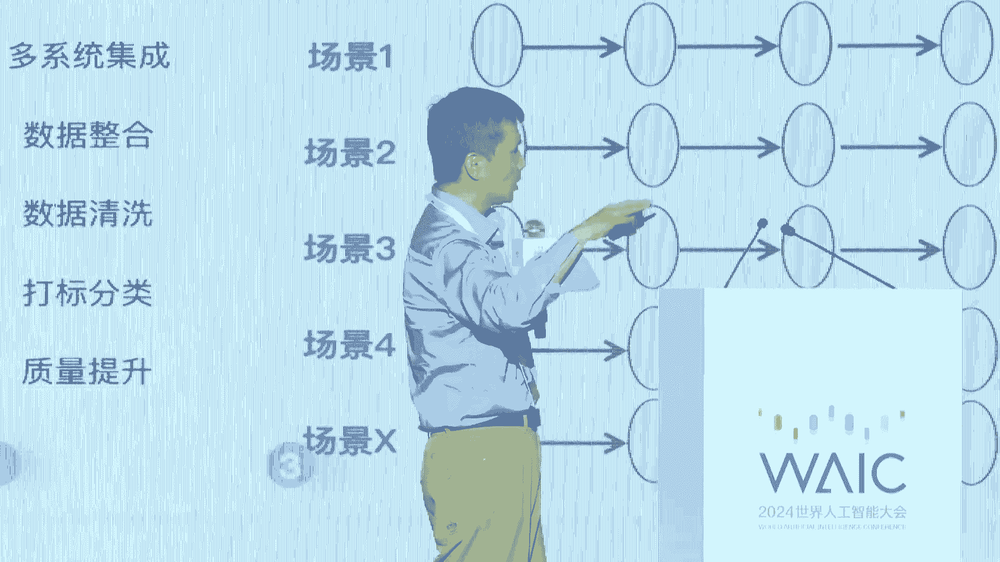

# P41：20240705-向新而行 智驱未来——AI驱动新质生产力落地实践探讨 - WarrenHua - BV1iT421k7Bv

🎼尊敬的各位领导，各位嘉宾、媒体朋友们，大家下午好。我是来自新华社的主持人邱浩。首先感谢大家在百忙之中出席以向心而行智驱未来为主题的WAIC2024AI驱动新智生产力落地实践论坛。

本次论坛由东浩蓝生集团有限公司主办东浩蓝生会展集团股份有限公司智能网北京信息技术有限公司承办新华社客户端独家央媒支持。😊，随着AI大模型的和高算力硬件设备的飞速进步。

人工智能成为发展新智生产力的重要引擎。人工智能加与心智生产力更是在今年首次被写入政府工作报告。本次论坛汇聚了智能制造智慧城市大数据生成市人工智能等领域的专家、学者和科技企业的代表。

共同来探讨人工智能如何赋能千行百业，推动新智生产力发展的途径和未来趋势。接下来向大家隆重的介绍出席本次论坛的各位嘉宾，他们是。

中国工程院院士、德国国家科学与工程院院士、瑞典皇家工程科学院院士、世界规划教育组织主席吴志强，欢迎您。新华社新媒体中心党委委员、副总编辑周宁，欢迎您。东浩蓝生会展集团副总裁裘浩明，欢迎您。

阿里云智能集团副总裁安晓鹏，欢迎您。360集团副总裁、数字化集团CEO人工智能研究院院长殷宇辉，欢迎您。新华三集团副总裁、人工智能研究院院长李飞，欢迎您。

软通动力信息技术集团股份有限公司执行副总裁兼CTO刘慧福，欢迎您。建委软件副总裁、中国区总经理崔静怡，欢迎您。蚂蚁集团财富保险事业群智能服务部总经理陆鑫，欢迎您。游组网络首席战略官付坤，欢迎您。

🎼发展新智生产力，要引领发展战略性新兴产业和未来产业，而未来产业有着创新性和颠覆性的核心特性。它不仅改变了现有的生产方式、生活方式，更将引领全新的经济增长周期。

发挥人工智能在产业升级、产品开发、服务创新等方面的技术优势，开展人工智能应用示范项目，大力培育人工智能新产品和新服务，积极推进人工智能技术产业化。

接下来让我们掌声有请东浩蓝生会展集团副总裁裘浩明上台致辞、掌声有请。尊敬的各位来宾，大家下午好。很高兴与大家相聚在2024世界人工智能大会暨人工智能全球治理高级别会议。首先。

我经代表主办方东浩兰生、会展集团对本次活动的各位嘉宾的到来表示热烈的欢迎，感谢各位专家、学者、企业家以及各界朋友对人工智能产业发展的持续关注和支持。😊，当前。

人工智能引发的新一轮科技革命和产业变革正在向纵兴发展，千行百业将面面临巨大的机遇和颠覆性的挑战。大模型作为人工智能技术发展的重要方向，将在上一代人工智能的基础上，再次刷新行业迭代变革的边界和深度。

全面激发各领域质量变革、效率变革和动力变革。加快大模型产业高质量发展。一是加快推进大模型基础设施化，促进应用行业和中小企业普惠使用。二是要加快推进通用大模型赋能千行百业。

引导和推动大模型应用从办公生活向工业、公共服务、城市建设、基层治理等更宽的领域拓展。三是将数据人才、资本场景等要素、全域链接、不断繁荣大模型的创新生态。过去的6年。

世界人工智能大会共吸引了80万人次线下观展25亿人次的线上参会，成为全呃国际人工智能行业的品牌盛会。6年来，我们一是以会聚智。六届会共举办了500多场活动，引领行业发展前瞻方向。

二是以会引才、超签名学界大咖领军企业家国际组织负责人参会，带动一批重大的创新项目落户。大会活动辐射百万级的AI开发者。注重女性、青少年等多元群体的参与，汇聚创新创业的活力。三是已会兴业6年来。

一大批重大项目签约落地，一大批的创新产品首发首秀，一批重要的重大的场景发布，还有一批项目实现产融对接。大会大会链接全球项目及资源，为上海及全国人工智能发展注入蓬勃动力。

也展示了上海积极抢抓通用人工智能机遇，加快推动世界级产业集群，打造人工智能上海高地的坚定决心。今年的大会规格进一步提升。大家也昨天看到了我们李总理亲临现场啊呃在我们的开幕式上也做了主旨的发言。

我们整个大会也将继续发挥科技风向标、应用展示台、产业加速器治理意识厅的重要作用。围绕产业、科学治理三大主线，今年开展了百场论坛活动，52000平方米的展示，吸引了1000余位的重磅嘉宾分享观点。

国内外500余家参展企业200多个项目参与C有奖的评选，也收集到了159篇优秀的青年论文。we不仅是三天的国际盛会，更是AI行业的资源链接生态共建的首选平台。

让我们一起携手助推中国人工智能产业健康创新发展。大家也可以去我们的世博展览馆看看，今天的展览会是异常的火爆啊，已经要要开始限流了。我们看到很多的年轻的人，年轻的群体。

这个呃学者、学生以及我们的行业的一些年轻的专家在展览会里面啊充分的和我们的企业进行交流。我们楼上的。H3馆future tech我们。充分。把我们的资源链接在一起。呃，这个我们选了120个呃。

全国各地来的一些创新项目，再加上84家投资公司的140多位投资人在现场，以及来自于20个国家的150个场景，超200亿的采购需求。都在我们的全域链接馆里面。呃，在做这个会结束以后。

或者明天后天我们还有两天的时间啊，76号和7号我们展览馆照常开的，大家可以有空去找项目，去找资本，找人才，找我们的应用场景。好，最后预祝我们2024去智能趋势峰会，圆满举办，也祝愿大家平安健康工作顺利。

谢谢大家。😊，好，谢谢。😊，感谢裘总。😊，接下来让我们掌声有请新华社新媒体中心党委委员、副总编辑周宁上台致辞，掌声有请。🎼这个。这个我我我发言之前，我先跟大家交流一下，报告一下。因今天一看呢。

就是怎么穿了个运动鞋就上来了。这个因为前几天这个脚受伤了。后来智能网王总就说说这个会议很重要啊，能认识很多的业界大咖，很多朋友。我说那一定要带商也得来。

但是呢我就想是不是有这个AI的3D打印的这个鞋码啊，因为我受伤之后，现在恢复。这都是48号的鞋。啊，所以我觉得这个后来我一我一这个咨询还真有这个这个昨天我在会上看，还真有企业说能做这个。

所以我觉得来的也很很值当，很划算。啊，也感谢大家给这个机会。尊敬的吴志强院士，邱浩明副总裁，尊敬的业界专家、学者、企业家的朋友们，大家下午好，非常荣幸啊，参加这个大会。

共谋人工智能的这个领域的实践和发展。世界人工智能大会现在已经成为全球人工智能领域交流思想、碰撞智慧、推动合作的重要平台。那么新华社也一直在持续关注报道，这是我们的本职工作啊，一道见证人工智能的发展。

那在如今这个万物互联智慧闪耀的时代，随着算法的不断优化，计算能力的不断提升，AI技术的应用场景越来越广泛，价值也日益凸显。前所未有的速度改变着世界的面貌。那么新华社呢，我给大家简要介绍一下。

是国家通讯社90多年跟随党从瑞金一路走来，如今也在全面建设社会主义现代化国家的新征程上，新华社呢也在深入贯彻落实习近平总书记的要求，努力建成国际一流的新媒体。这个全媒体机构。啊。

在探路者试验田主力军方面，也要发挥着始终走在前沿的作用。特别是积极探索融媒体融合发展的创新之路，打造手机上的新华社。现在我们知道很多人不不看报纸了。呃，甚至连这个广播电视都不太看了。呃。

那么作为主力军主战场主阵地，那么三大央媒，特别是新华社作为国家通讯社，如何能够在互联网领域，在这个移动端领域占领主战场，这个也是我们的职责啊，还有很大的提升空间。

特别是要探索形成共稿线路终端平台、社交媒体账号的集合化运营。在线端微云一体化传播，打造这样的业务体系。那么其中新媒体通稿的专线覆盖这个1500多家媒体。新华社的中文客户端下载量现在大概是4。45亿。

英文端的海外用户下载量2000万左右。新华社在微信、微博、抖音、快手、视频号、B站、知乎这些社交媒体平台的官方账号，粉丝量基本都是主流媒体的第一方阵。啊，微信大概是6000万，微博1。2个亿。

抖音6000万，快手5000多万，视频号5000多万，B站3000万啊等等等等。那么新华社的现场云平台，也就是自有技术终端覆盖5000家机构用户啊，这5000家主要是。2800多个县的线荣。

还有其他的地方用户。线荣。也就是说比如说我们知道某个地方发生了突发事件，通过这种技术终端，那么给各个的线戎开口，那么他们的报道员第一时间要抵达现场啊，我们知道新华社在海内外在国内30多家分支机构分设啊。

在海外190多个分支机构可能他在海地海地啊十几年十年前吧，我地震了，可能这两个新华社记者在那他就发这么一条稿子一年。但是这两个人他在那要常驻365天啊，所以这个就是我们的职责。

也是要通过技术第一时间抵达现场，第一时间传回消息。履行职责。那么现场云用户现在有16万名的采编人员注册使用啊，也就是说，新媒体中心现在能够覆盖的用户超过了10亿人次。

那我们也深知AI技术对于媒体行业的转型升级具有重大意义，特别也要拥抱AI技术。也就是说我们不仅要报道AI啊，这次新华社、上海分社、新华社新媒体中心等等都在报道啊，那么在座的各位嘉宾啊。

包括这个智能网的呃这个合作伙伴，他们都会将相关的第一时间的信息，通过新华社发布出去啊，也我等会也继续学习各位大咖的这个真知灼见啊。那么同时新华社呢在这个AI技术的应用采集生产啊。

传播各环节正在打造人工智能的新华社，特别是2022年底啊，我们就布局成立了聚焦人工智能元宇宙的产业联盟，凝聚了上中下游的产业界、传媒界、学术界、科技企业等社会各界的共识与合力。

共同推动AI技术的发展和应用。现在联盟成员单位已经至少是100家啊，注意我们这100家是不收取任何费用的啊，我们就是要打造一个平台，因为我们知道各部委啊，他现在那么在这个呃平台的打造上。

那人手是很紧缺的那地方政府有很多的项目，他没法承接，他到底是找这个基站啊，是吧？三大云商啊，他还是找这个技术啊，是吧？技术企业呀，他还是找云服务企业，云服务商啊，他还是找这个这个终端啊。比如说亚。

京东方啊，他还是找有没有相关的产业资本。那么他多头对接是非常难的，也把这些信息反映到了我新华社总社。那么这样的话，我们跟网信办、中宣部、工信部、广电总局、科技部等等联合发起。

那么整个的这个联盟的单位这个运营单位在新华社。啊。也就是欢迎行业内的优质企业。那么共同加入应用和推广AI的技术，也期待在座的这个学者、专家和企业能够共同为人工智能啊这个助力啊，我们会为你们鼓雨呼。

新华社是党和人民的耳目喉舌智库，我们也是人工智能技术的探索者、实践者，也是行业发展的观察者、见证者。那么通过我们对AI的持续关注和研究，对本次论坛以及人工智能的发展提几点倡议啊。

一是深化各领域对AI技术的认识和应用，发挥各自优势，推动我国人工智能产业发展和数字中国的建设做出贡献。第二就是加强产学沿用深度融合。这也是我们成立人工智能源宇宙产业联盟的初衷。

也期待日后跟在座的各位合作。也就是说，我们一边说，人工智能要发展，它是一个技术。它是技术端。它同时技术的应用端也非常关键。那么我们在这个。以美国为首的西方，他们在技术应用端确实引领了很多。为什么？

因为他们集聚了大量的人才，但是中国有中国的优势啊，中国在应用市场有极高的优势啊，我并不同意某些人说的，我们就只关注应用，不不关注这个技术的发展。但同时我们也不能说我们只研究技术啊，最后落不了地。

没有实践，这是无法形成产业最后的良性循环的。所以这个也是新华社处于这个立场，处于中央的这个精神，我们进行采编测采编发的这个流程和传播推广，还有技术的引领。第三就是推动行业标准制定和规范发展。

依托这个联盟，我们就发挥新华社和各部委相关行业协会沟通联动优势，积极参与相关行业标准的研究制定，推动AI技术规范化标准化发展。我去年呢这个这个公出去了韩国参加了世界这个新闻记者的大会啊，也是代表新华社。

那么去那儿了，跟世界的各行各业的新闻媒体的这些这个负责人进行了广泛的交流。他们在整个的论坛中交流的体会就是人工智能已经对他们的新闻真实性，新闻的这个可接近性产生了巨大的影响。我给大家再举报告两个例子啊。

比如说我们某一个国外的通讯社。那么他在非洲某一个国家有大屠杀，他就把这个集纳来的信息直接就发出来了。然后世界各媒体就用了。那这些都是AI生成。那么这也是他们的联络员。比如说这个某一家媒体在非洲有助战。

他们有报道员都是通过AI。本身这个新闻就是假的。最后造成了很恶劣的影响。那么我们现在也是一样，我们的AI新闻有吗？有AIGC我们的歌曲，我们的版式，包括我们现在用的这个呃鸿蒙系统等等。

这些东西我们在技术安全的把控上是要有这个内容的把关的。但是怎么把关如何把关，啊，把AI发展的过程中，怎么更好的规范哎规范发展，这是我们现在面临的很突出的很大的问题。我们刚才说了有十十几万的报道员。

这十几万的报道员，现在我们写稿怎么写。啊，我们记者是不是在现场？啊，他拿着这个gopro或者拿这什么东西去拍这些内容是不是真实的啊，我们确实是很难判断，因为每天要发这个十几万条稿件。

我们要展示这么多稿件。它是通讯社呀24小时的爆发信息啊。那这些信息的真实性就是生命。所以这也是我们的目的。第四就是关注数据安全隐私保护，加强数据安全管理和监管力度。第五就是注重人才培养和引进。

打造高素质的人才队伍啊，呃各位嘉宾AI技术的发展离不开全社会的共同努力支持。作为国家通讯社的新媒体机构，我们将继续发挥自身优势，积极推动AI技术与各行业的深度融合发展啊，以更加开放的心态。

拥抱AI时代带来的机遇和挑战。最后预祝本次论坛取得圆满成功。谢谢大家。谢谢，感谢周总。😊，接下来有请中国工程人院院士吴志强院士，有请。尊敬的啊邱总，尊敬的周总，各位行业的啊这个基英。

特别高兴能够受邀参加这个啊论坛，应该是特别重要。在我们整个的世博会，整个的场地上，现在拉开了了整个的这个WIC啊已经造成了一个全世界影响啊，我呢是从这个芬兰直接飞机下来洗个澡就到这个会场上来啊。

因为要参加这个会议啊如此重要。啊么在那里也很重要。在那里呢是我们的世界各个国家的工程院的主席团啊，在那里做一件很重要的事情。每一年呢要做很多的决策。其中呢有一个非常重要的决策呢，所以我今这次呢一定要去。

呃，就是决定我们第一委员会，我是第一委员会的代表中国的啊这个在里面，代表中国工程员在里面。我们这个委员会呢当时呢就一直是在澳大利亚的。

这次呢表决一定要把这个澳大利亚的第一委员会的这个总部要把它迁移到上海来啊迁移到中国来。所以这件事情呢也是做了很多人是这个努力把最后主席团投票一直通过啊把这个主席团把这个啊第一委员会的总部呢放到上海来。

这样的话我就不要分裂了，又在一会在澳大利亚一会在这这里实际上这是非常重要了。在整个的啊世界上那么多的工程院都在关注AI在这个AI的整体发展中间有几件事情呢，我觉得这次大会上面在各个工程院里面。

所以他刚才介绍我又是德国工程院是又是瑞典皇家工程院我还是美国的。所以这些里面呢，实际上大家。都在高度关注啊，这个AI会对整个的社会经济文化整个的翻天覆地的变化。大家都在说，百年未有四大变局。实际上。

可能在AI的这件事情上，是人类文明的再一次的替换，这是人类文明级的替换啊，不仅仅是百年级的这个是可能是千年级的这种文明替换。那么这个次的革命呢真的是非常非常重要的。

应该我们现在说的中国人现在叫新的生产力。那么在全世界都在这一块的是迎接一个新文明看到一个新的世界的诞生。那么这种关系的啊诞生呢是实际上从工业革命到现在一步跨到现在的再一次的像工业革命一样的伟大的革命。

应该说人类就是第一次从自然界开始用自然的力量开始。啊，第二次用了很多的啊人类中间的发现的序幕，这些东西可以为我们服务。第三次就是我们的大量的啊工业用。机械啊来为我们服务替换我们的啊肌肉。

第四次就是这次应该说这是人类根本性进步的这么一个事情的时候，我们这个论坛就是谈AI驱动性质生产力。实际上我觉得是非常非常了不起的事情。总体上说我写了一个很好的稿子。他们说都说的很好。

那么我觉得还是给大家说这个论坛来在我参加那么多论坛中间，我觉得这是一个本质性的论坛，非常本质的论坛，尤其在中国，尤其在各个国家都在用AI创造别人根本性生产力的时候呢，我们必须要克服中国。

我们在每一次出来的时候，大家谈的多造了。秀的事情很多，但是实际上不是很多的这种过去的这种问题。我就举个例子，在这个大地上，在这块土地上，我们提出来的叫智能城市，智慧城市。

就这块土地上提出来的这是2004年我开始做这块土地上的是不会总规划师的时候，IBM来找我，我给他们说了未来的城市，他们要做未来地球叫future smartmart planet。我说我们不做plan。

我们做c。因为这块土地上，我们叫better city别 life，然后就合起来，在200607年我做了很多smart city应该怎么样的。

后来08年IBM就在这块土地上向全世界宣布smart city。反思那么多年来，那么多城市就做了很多的smart city的修笼。大家去看哇很炫酷。实际上这个数据根本就没有直接回到劳动生产力上面。

有问题的。比方说我在德国工程院的，他们做smart city，就是大量把这个东西做到工业园区，你的用能是用的是450度的。他用能是用的280度的，它用的是用100度的，他用的是用60度的。

把这些智能圈配置起来。每一次智能社会就直接创造利润，直接创造它的节能减排，直接创造它的劳动生产力。这个才是正确的道路。所以上我们这次呢我就想在这里大跟大家说，薪资生产力AI来一定要吸取上次的教训。

不要做很多修笼。这种AI的事情，大家以后到各个集团去公司去就做了一个这个修笼啊，这个展示厅去看看，实际上没有真正回到我们的劳动生产力。这次一定要真正回到劳动生产力，回到我们自己身边的根本性的改变。

根本性的改变三点，第一点，根本性的改变。非常多的貌似过去叫。脑力劳动的活将被替换。貌似在办公室里以为都是脑力劳动。好，在马路上呢以为都是体力劳动了，这些貌似脑力劳动大量被取消掉，这是肯定的啊。

貌似这种貌似的。但是要真正的这些替脑力劳动的创制性劳动没有法替换的啊，但是这个AI会替换大量的貌似啊，这类啊体力脑力劳动那么这是非常重要的事情。第二件事情一定会创造比取消这些劳动更加多的劳动的岗位。

这些劳动岗位创造的劳动生产力可能是10倍、20倍于过去的那些貌似闹力劳动的货，这里面有很多很多的事情要做的，新华社也好，我们这里的啊这个东浩兰性也好，有很多很多事情要做。我比方说一件事情。

我们今天东浩蓝生以为管理的是这一块的土地上面的所有事情，实际上是。虚拟世界创造的价值可能远远超过你真实空间的创造的价值。我们这次呢做了一个实验。

在青岛的世园会里面的所有的没有租出去的房子全部在网上全部上网，一下子把所有的空间全部双倍的3倍的使用，所有的交集会发布会，虚拟的和真实的融为一体进行。空间管理劳动生产率是提大规模提升。

而且激活了大量的空间。这种事情呢都是过去不存在的。但是可以啊通过性质生产力大量诞生。第二件事情啊就是非常重要的对我们来说就是会创造大量的这件工具的它的为了这件工具而研发的大量的活啊。

这件事情不是那么简单。大家以为AI只是这些technology的这些啊这个工科男在做，绝对不是的，告诉大家，工科男只是为他推动性啊，牵引性的活才是真正AI啊，不是驱动。

还有一个是拉动啊拉动AI去为我们人类服务。这件事情有更多的大量的劳动生产这个岗位会诞生，是拉动性，不光是驱动性啊，推动是一件事情，拉动是需求出发的。这个才是让AI向善向人类的好处发展的最重要的力量。

这是大量的劳动生产岗位会诞生。就拉动AI怎么向这么走，这是第二件事情。第三件事情。我们必须要很清楚这个AI的驱动劳动生产力会改变我们社会结构的，大量改变我们的社会结构。

这件事情呢我们今天呢呃还不能完全感到以后呢，大家会慢慢体会到，原来这不是一个技术的事情，是一个整个社会革命的事情。我们很多事情会我们历史上的判断哪里有财富。

哪些阶级有财富这个概念要发生重大的社会的变革啊，这件事情应该看到不仅仅是劳动生产力的问题啊，是劳动生产关系这样根本的跟着啊变化。这就是我今天特别想啊从这个啊世界这个工程院联盟主席团会回来的啊三点体会。

我想信这是一个我参加了这两天参加那么多的论坛。我觉得这是一个非常本质的论坛，感谢我们啊邱总他们这个单位感谢我们新华社做了一个非常重。的内容。我相信啊这个会议大家一定会特别有收获，祝我们的论坛啊，成功。

祝我们所有的人都有新的思想，谢谢。谢谢，感谢吴元士。😊，谢谢。😊，接下来让我们有请阿里云智能集团副总裁安晓鹏为我们带来分享。题目是AI大模型数据要素创造价值的最短路径，掌声有请。🎼啊，各位来宾。

非常高兴有这个机会就AI大模型。跟数据要素的关系。跟大家做一个交流和分享。我记得在年初的时候，李强总理曾经说过，大模型是新智生产力的重要引擎。我们今天也在讨论数据要素，那数据要素和。

大模型之间是一个什么关系？那我们给出一个这个判断，大模型可能是数据要素实现价值的最短路径。大模型未来可能会应用到什么场景中间？我觉得有三个重要的判断。第一个判断是。未来一切智能硬件会被AI大模型所驱动。

第二个判断是。一切软件系统。会被AI大模型所重构。第三个判断是。一切数据会被AI大模型所激活。今天的手机。电脑。汽车、机器人摄像头。在未来不是未来，有些金钱已经成为这些产品智能化水平提升的一个载体。

我经常举个例子。今天我们在这个地方开会。如果在。大会的前面有几个摄像头的话。当这个会议结束了。你可以问。这个摄像头。今天在座的哪位领导专家请讲是最认真的？哪个同学呢？总是在看手机，估计他可以告诉我。

那他说你也别老问我呀。😡，问问我们这些专家们哪一个的讲的可能最好啊等等，这是一个典型的一个场景。未来的手机汽车都会无所不在的。当一个产品有了芯片的时候。他大概率就有可能被。大模型所驱动。

并且我们看到手机里边的APP功能在迭代。PC里边的windows office，我们去的展馆里边的WPS。我们企业里边的经营管理的CRM。客户关系管理ERP制造执行系统。

乃至于控制设备运行的PRCscada可编程逻辑控制器，在今天都在被AI大模型做重功。当所有的硬件。被大模型所驱动。所有的软件系统被大模型所改造的时候，背后就意味着。

整个社会的数据的要素在发挥的作用会被大模型所激活。那如果要讨论数据要素到底是如何？创造价值的。我们看三个三个小的案例。十多年的前十多年前的时候，其中一个国内非常大的物流公司的创始人呢曾经说过。

他说我们当年啊每天的业务的订单就1500万单物流订单。我们无论增加多少个。快递员车队仓储中心。我们这个瓶颈呢大概就是15001600。但是在2012年2013呢，有一个东西出来了，这个东西叫电子面单。

没有增加太多的人员车队物流中心，他的。每天的订单从1500万在几年前就跃升到了5000万。数据流通的价值。在10年前的时候，马斯克在他自己的网站上发表了一篇文章，他讲什么呢？

讲美国的制造业和中国的制造业成本的差异。他讲了一个观点。他说，为什么在制造业成本方面，美国可以打败中国，他的网站上这么说的。事上。看space X的成本。他的。发射成本相当于美国的传统的。

相当于中国的7分之1。这里边有一个非常重要的一个技术，是什么呢？就是在数字世界里边的仿生，再进一步演进叫数字孪生。一级火箭跟二级火箭的分离在过去是通过爆炸的方式。他如果要回收火箭，不能通过爆炸。

只能通过冷弹射的方式，不然炸坏了，没法回收了。而冷弹射的这样的技术没有经过。物理实验直接在数字世界里边就完成的。今天是数据在孪生的世界里边怎么支持企业创新？第三个，我们看到的零售的盒马。

它的复购率转化率相当于线下的10倍、8倍的这样的一个水平。他做的最重要的一个工作呢，就是实现了从供应商、供应商的供应商到门店到消费者之间全链路的端到端。所以我们去思考数字化转型，它的本质是什么？

如果我们做一个极度的抽象的话，我把它概括成一句话。就是在数据加算法定义的世界中，以数据的自动流动，化解复杂系统的不确定性，优化资源配置的效率，提升企业核心的竞争力。今天的需求越来越碎片化。

个性化、实时化、场景化、互动化。非常的复杂。在这样一个复杂的世界里边，数字化所要解决的问题就是要解决一个复杂系统的不确定性。他通过什么方式来解决呢？一句话就是数据如何在一个系统里边自动的流动。

我们各位领导专家可能去过企业参观。到了车间里边，车间主任拉着你的手说，哎，这个东西叫智能车间，这个东西叫智能制造。你看到一堆机器人受控机床。这个东西是智能制造吗？是也不是。😡，真正的智能制造是什么呢？

智能化的高级阶段是什么呢？是你获得了一个汽车，一架飞机，一件衣服的订单之后，这个订单的信息在你的经营管理、产品设计、工艺设计、生产、制造、产品测试、产品维护的每一个环节去流动。每一个环节流动的过程中。

我们要思考一个问题。这个数据不断的被加工处理执行。是不是越来越少的不需要人去参与？才是智能制造的本质。因为今天的制造业变得个性化的时候，如何既要提高效率，降低成本，又要满足个性化需求呢？

核心是数据在一个制造系统里边，从过去基于文档的流动，今天要基于数据的流动。数据的流动不重要，重要的是自动的流动，就是你能够把正确的数据在正确的时间，以正确的方式传递给正确的人和机器，而且不需要人去干预。

这是数字化转型的核心要素。但问题在哪里呢？问题在于我们今钱看到的每一个环节，在很多时候。都需要人进去。当只要人进到这个环节里边，它的效率一定会打折扣。那人进去干什么呢？😡。

人进去最重要的一个工作就是要开发各种各样的模型算法软件调度。这是人的价值。要干这些事情。所以我们发现在数据自动流动的过程中有很多断点。这个断点的原因是因为人要开发各种模型算法软件。

如何把这个断点能够通过软件或者大模型的方式去解决弥和这些断点？是金钱数字化转型再向前走一步的关键。我刚才提了一个概念，叫做正确的数据。在正确的时间以正确的方式传递给正确的人和机器。问题是。

你怎么知道正确还是不正确，正确不正确取决于什么呢？取决于两个东西。第一个叫数据，第二个叫软件模型或者算法。😡，当你把数据输送到软件模型里边呢，它会解决四个问题。从低级到高级。

就是你可以在数字世界里边去描绘物理世界发生了什么。为什么会发生？😡，将会发生什么，以及呢人会怎么办？在这个过程中，系统扮演的角色越来越多，人呢参与的越来越少。当你最终不需要人去参与的时候，就叫做自动化。

就像自动驾驶L1级L13G1样。😡，而这个过程中，当你数据能够自动流动，最终呢完全替代人的决策的时候，最终的目的在于优化资源配置的效率。那。😡，这里边的一个关键呢就在于软件。什么是软件？

软件的本质是事物运行规律的代码化。我们现在构造了三个世界，一个是我们看到的这个物理世界，我们需要研究物理的化学的生物的电磁的规律。

要把物理世界的运行的规律化、规律、模型化、模型算法化、算法、代码化、代码软件化，再用软件加数据去优化这个世界。所以我们构造了三个世界，一个是我们今天所看到的物理世界。

一个是人类社会脑袋里边所构造的这样一个意识世界。第三个，我们又构造了一个长在云计算大数据硅片制上的各种的数字世界，是这三个世界。好。今天的大模型干了一件什么事情呢？在过去。我们对于软件的开发。

构造的这样一个算法，对世界的认知的规律都是人去完成的。人把自己的规律变成一套算法，写成一行代码，注入到这个系统里边。😡，今天大模型做的最重要的一件事情是。把人编软件编程的这项工作局部的替待了。

那未来呢模型能力的增强更重要的一个标志是。你在多大程度上能够替代人去解决这个问题。所以这是今天我们从另一个视角来看大模型。好，那我们下面讲几个案例。今天大模型来到了实体经济的方方面面的时候。

在整个数据流动的闭环的这个体系中间。可以替待什么？我们呢阿里通一签问呢之前去年的年初的时候，就跟广东一家机器人的公司叫托斯达去合作。他是一个生产智能的手机生产线上的一个机器人。那这个机器人呢。

当它生产出来以后，他放到车间里面要做桥试。桥试的过程中，单机呢可能需要5000时间、6000时间做各种生产线的桥试，而且需要一个水平很高的人。当训练了一个大模型上去之后。

不需要一个高水平的软件工程师现场调试。你只需要按照一个流程，通过人机对话的方式，就可以完成这样的一个调试的工作，可以把你的时间从30000时间压缩到8分钟啊，可以自动的去配置。

这个过去需要工程师写软件代码的动作，被AI大模型所替代了。所以他期待的是生产工艺的代码。第二个。我们前段时间呢也跟啊一一一汽合作。我们在展台上呢。

阿里那个展台上也有一汽的展示一汽的叫GPTBIchat BI每个企业呢如果数字化水平比较高的时候，有自己的BI系统。董事长、总经理、高管多想了解过去的一个月，昨天前签某个地方的生产销售的一个情况。

但是呢你所有的这些了解的都是之前已经开发好的。但是我今天想了解一个你那个系统里边没有的，随机的去提问的时候，有没有呢？没有你就需要去开发开发呢可能需要2000或者一周的时间。但是今天GPTBI。😡。

chat编可以给你的底层的数据库打通之后，可以问你所有想了解的数据库里边的问题。那我经常说的一个观点是我们过去的AI解决的问题是。有限问题的有限级。今天。大模型带来的无论是你的GPTBA也好。

还是客服也好，还是机器人也好，本质是无线问题的精准级。从一个封闭的问题切换到了一个开放的问题。去年的啊9月份，马斯克在全球1200万网民的注视下。表演了45分钟的自动驾驶。当他从车里边出来之后。

说了一句话，这句话很重要。他说。我的工程师们从来没有写过一行代码，告诉我的车应当停在什么地方。但你们刚才看到了，他总是停在他应该停的地方。😡，它是FSD的12个12版本。

这个版本呢最重要的一个区别呢改变了过去的自动驾驶的训练的方式。过去呢叫海量标注，加上一个规则代码，这叫红灯，写一行代码要停下来，这叫海量标注加规则代码。他写了30万行代码，现在不需要了。

你通过给海量的数据的学习。😡，就可以。那这里边他用了transformer的模型实现了端到端。那这个模型解决了什么问题呢？😡，解决了人。写交通规则代码的这个问题，红灯要停下来。

绿灯要行的这个代码是谁写的呢？不是人写的，是transformer这个模型训练之后，它的一个价值。还有我们不仅仅可以去提问你过去发生了什么。

what你可以问what你也可以问 why你可以问过去发生的一个事情背后的原因是什么呢？那在一个系统里边，我们可以嵌入一个叫做agent的智能体，基于大模型的智能体。😡，就像大模型是一个发动机的话。

什么叫智能起呢？你得把底盘安上四个了轱辘安上，上面的这个这个窗户玻璃得安上，这叫智能起。当把智能起进嵌入到一个系统里边的时候。那你就可以去问啊，当一件事情发生的时候，你可以问它的原因。那作为大模型来说。

它可以去给出一个分析，生成一个任务。第一步、第二步、第三步、第四步、第五步，然后在各种系统里边去分析判断，然后呢给出你一个决策。他期待的是系统管理软件的代码，从描述到自主诊断预测，这是今钱大模型。

当然我们如果去看未来大模型可能应用的场景，在一个制造业的体系里边，可能是研发制造销售物流的每一个方面，那有很多的应用的这一个场景，在演进和测试的过程中。好，那我们把这个问题呢在进一步的来这个这个抽象。

企业里边呢都有自己的人力资源、财务、法务、程序员，各种各样的角色。这个角色里边，每个人每个组织都积累了大量的文档，结构化数据，非结合化数据。不同的岗位有自己的工作理由。

每一个岗位里边都会面临着各种各样的问题，有问答，有chatB有代码生成，有信息抽取，你要生成各种报告，要做各种决策都需要信息。而今天大模型可以帮助你在产品研发客户分析设备维护的每一个环节。

创造出各种各样的价值和解决方案。而它通过哪几种方式来创造呢？从现在的实践来看，大概有看一下时间。

四种方式。第一，你可以基于一个基础大模型之上做SFT的微桥。第二，微墙呢，你觉得没有能力，那你可以选择第二种，你可以通过搜索增强的方式，把那个把你自己企业积累的知识，作为一个外挂输入到这个系统里边。

不需要对模型本身做微墙。第三个呢，你也可以通过骑视词工程的方式，更加精准的面向角色，提出各种各样的问题啊，帮助你去解决特定的问题。当然你也可以构建一个自己的一个agent。好，就是我刚才说的。

把这个车呢轮胎、底盘啊都给它装上。不同的。场景可以有不同的解决方案。好，那么我们再回到我今天要讲的一个主题。大模型和生产要素之间到底是一个什么关系？我们看到传统的数据治理的应用的方式。

你要需数据要面向不同的场景，你要打标清晰整合系统集成。你需要呢导入设计、采集、建模构建，按照流程去做。而今天基于大模，它改变了数据创造价值的流程和方式。

你可以在最底层的数据清洗完了之后，接入到各种各样的多模态，进行进一步的训练，成为一个行业模型或者企业自己的模型。

为你的各种场景和服务呢创造价值。我们如果作一个对比的话，可以从三个角度。第一个是从技术体系，第二是人员要求，第三个是业务价值。从技术体系来说。

传统的数字化的数据链路是它的数据价值是沿着业务数据采集分析决策。大模型时代这个逻辑变了，你给输入它就会有输出。第二个，数据流动呢取决于业务决策的链路，很多时候无法形成闭环。就像我开始一讲的。

而今天大模型更容易形成一个这个闭环。创造价值。第三个呢是很多的时候传统的数字化呢要根据场景逐个制定个性化的周期，这个方案，成本高，周期呢也比较长。而现在基于大模型通过泛化能力和微桥，批量的构建能力。

成本更低，更快。过去呢你需要更高的人员，比如说机器人的现场的桥试工程师也很高。现在不需要了，你只要简单的对话，销售人员也可以干这个事情。从业务价值来说，传统的是根据需求定制解决方案的路径。

它的价值呢有限。而今天呢是全面提升预测和能力，重新定义产业智能。这是它的一个价值。最后一页做一个补充。传统的数字化的解决方案和今天讲的AI大模型有什么本质区别呢？我们过去呢也可能也有过这个叫叫客服。

人工客服、智能客服。我们也有刚才讲的GBTBI也讲了机器人，可能各种工业设备。传统的这种数字化呢，他们重要的一个方法论就是人。根据设定的场景，把软件算法植入给这个设备，它是在有限的问题。

有限的场景确定的指标固定的路线。解决问题。而大模型来了之后，使得设备的智能化水平更高，系统的智能化水平更高。它是在一个开放的环境里边，在一个开放的指标里边，在一个随机的任务里边自主的去解决问题。

这是今天大模型带来的跟传统。数字化转型最本质的一个区别。好，谢谢。谢谢。😊，感谢安总的精彩演讲。😊，接下来让我们有请360集团副总裁、数字化集团CEO人工智能研究院院长殷宇辉为我们带来分享善用AIGC多维度技术引领与场景共建。

谢谢有请。😊，各位来宾大家好，我是来自360的殷宇辉。嗯，前面安总讲了数据非常重要。那过去一年呢其实从呃大数据到大算力，再到大模型。最后再到大价值。那我今天分享呢？就是怎么样把AIGC跟场景结合起来。

也是给大家去同步一下我们的一些使用的方法和经验。嗯。好的。首先给大家同步一下呃，360过去一年，我们在大模型测取得的一些成绩和进展。那过去一年呢，其实360和国内其他的中文大语言模型一样。

都是呃从零起步。呃，但是呢经过这一年呢，其实我们可以看到国内的大语言模型发展非常迅速。我看通过双备案的已经有大概117个大模型。那360也推出了我们的叫360自老大语言模型。呃。

为什么讲我们是多维度的大模型呢？而不是呃多模态呢？其实它有几个维度。那第一呢讲大语言或者多模态或者视觉大模型，这是一个维度。第二呢，其实是不同的参数量级。那今天其实我们也发布了像3B7B14B。

以及像74B，还有像我们除了自己去在对应的榜单里面去获得肯定之外呢，3然你也参评了相应的一些国家标准，包括和信通院以及其他的一些机构，呃，去。进行了对应的一些行业标准的制定。那除了大模型本身的能力。

那过去一年呢，我们也把360的智脑积极应用在360相关的一些工具上面。比如像360的AI搜索呃。360的AI浏览器以及像嗯。我们能to B的一些相应的使用场景上面。那我们对大目型的理解呢。

首先大模型本身的技术是非常复杂的。但是呢真正要把大模型用好，还需要匹配更多的工程配套的能力。那过去的一年呢，其实。呃，一方面呢我们是在整个训练上做了大量的优化，包括各种的训练手段。

比方支持像DPPPTP这些各类的并行的方式。同时呢不断的去提升我们对异购集群，包括像呃英伟达的系列或者像华为的升腾920B呃，等等这些算力结构不同算力结构的训练方式。另外呢其实得益于我们在推理上的优化。

呃，基本上我们目前能做到单次AS搜索的成本在几分钱。对，呃，这也是很好的去支持了我们像AI搜索的放量。那我们现在呢其实在互联网上AI搜索，每个月基本消耗的token数已经达5000亿以上。

同时呢呃大语言模型因为本身还是有相当多的缺陷，比如幻觉，比如其他的这些呃能力，这这些呃本身由大言模型带来的缺陷呢，其实需要用类似像RAG呃等等技术去加以弥补。那在这在RAAG这块呢。

我们也发布了我们自己的RAAG的框架。呃，同时。呃，基于我们的互联网的相应的一些应用呢，我们也通过A键的去打通了将近200个左的应用的API。嗯。

今天呢其实给大家分享的场景呢也基本会覆盖到我们像泛互联网，然后to B的缩展自改、智能硬件，以及像我们自己的安全攻防的大模型。那首先讲我们320最大的一个场景，大家知道说360。

我们是PC端的呃国内最大的这种终端产品的互联网公司。我们有国内最大的呃安全浏览器和国内第二大的安全搜索。呃那。第一阶段呢，其实我们花了比较多的精力去训练我们大模型的能力。

尤其在像relink和常文本等等这些方面。呃，之后呢，其实我们换选了第一个明星场景，也就是我们的AI搜索。嗯，AI搜索其实从呃去年10月份我们开始去做对应的尝试和迭代呃。基本上呢这个模式它可以颠覆传统。

搜索的模式能够实现搜索及答案。呃，也就是。我。我搜你看你问我答，你输入场景之后，AI搜索可以直接的把所有的答案呃全部呈现在你的面前，实现说呃一站式的把多模态多任务多语言多场景的组合呃。

呈现在以结果的方式呈现在各位面前。那基于AI搜索，我们丰富了我们AI浏览器的功能，在AI浏览器里面能够实现呃一键帮您去生成对应的PPT一键帮您去读懂对应的发布会的视频。

同时呢可以去做到哎对相应的论文呃视频去做解析，以思维导图的方式去不断的去做延展和扩松。进同时我们在AI搜索上浏览器上面去实现了大量的类似PDF阅读呃，视频的转换，图片的转换等等相应的功能，打造了整个。

360AI应用的全家桶。但是呢光有360自己的能力是不够的。所以呢我们在上个月也推出了我们自己的360AI甄选的商店呃。把行业里面好用的易用的呃相应的AI工具全部集成进来，实现一站式的集合。

去覆盖泛办公的场景。那第2块呢是我们的多模态的视觉大模型。大家知道说在传统的视觉安防领域呃，存在几个障碍。那第一呢是传统的这种智能化的场景非常单一。比如说大家知道说传统的我们做人脸的检测，人形的检测。

或者是做指纹的识别，基本是单一的小模型用规则来驱动。那第二呢是说对应的场景其实能力定制周期非常长。呃，所需要的数据和所需要的场景非常碎片化，经常得有几十个上百个这种小模型来组成。第三是单点智能为主。

这是在大模型出来之前或者深层式模型出来之前，其实我们遇到的问题。那360视觉大模型呢，我们在三个能力上去做了增强。第一个能力呢叫开放世界呃目标检测的能力呃。他具体能实现什么功能呢？具体其实实现了说哎。

我不用提前去训一个模型。比如说今天在会场，那我可以。在这画面里面直接去搜索沙发或者搜索矿泉水，它就可以实现对应的目标的检测。那这是第一个呃能力。那第二个能力呢叫cap型的能力，也就是图像转文本的描述。

那这个能力呢其实它可以去呃自动的去总结出来一个图片里面的摘要信息。比如说这个会议室到底有多少人呃，沙发的颜色是白色还是黑色，矿泉水大概有多少瓶。那这个其实今天大语言模型逐渐能够做的更加的精准。

第三个呢是VQA的能力。也就是连续做视频问答。呃，比如你可以对这个图片提问说哎，今天会议的主题是什么？呃，这个图片里面有没有一些公文包或者双肩包，对吧？或者说有多少男性或者多少女性。

那这是一个呃连续问答的能力。那基于这三大能力呢，我们陆续的升级了我们呃智能硬件在to C和to B的不同使用场景。比如在我们的门铃和呃摄像头，那我们可以对门前的包裹去进行精准的准呃检测。对门前。

门前的一些动态去进行精准的提醒。比如您的外卖来了。那以前呢其实对对应的内容呢，我们需要经过大量的处理，才可以去做呃相对精准一点的呃提示。那第二呢，像我们在手表上面，呃。

我们最近发布了我们的呃儿童AI手表。那可以实现拍照学习。呃，小孩子是比较喜欢哎用这个功能呃，对着一个花花草草去拍，就可以识别出来这个花花草草到底是什么样的动物植物。那在to B里面呢。

一方面我们利用OVD的能力，可以实现这种智能园区的呃开放检测和事件的响应。呃，同时呢在类似我们这种to B巡店的场景里面，呃，可以实现这种大量店铺的自动化的告警和运营。

这呢是我们在整个呃智能硬件领域的一些探索。那第2块呢，是我们第3块是我们在to B领域的呃一些经验。嗯。大家可以看到这里我们列了大概四个场景。像第一个呢是智能制造的场景。

这呢是我们和呃海油工程一起去打造海工制老，去实现了AI加上IT的模式。也就是在一个统一的调度平台上，能够实现靠大语言模型，去调度到它的业务系统，去实现生产管理与业务的呃调度的效率提升。那第2块呢。

其实是我们在视频审核和监管，主要是面向呃政务视频的一些审核，它可以有效的去分分辨这种呃低级红、高级黑这种呃涉击形态的一些语言类的判断。后面两种呢，其实呃今天在展馆看呃也非常多。

比如说像区里面的一些政策的咨询。比如像我区里面可能有计生政策，有抚恤金政策，但很多政策和对应的这种呃事件的当事人可能并不在一一个区。那怎么样能够实现这种跨区的政策的及时响应。

那经过大言模型的学习和处理呢，可以把原有呃需要人工进行一周的处理流程去缩短到15分钟左右。类似的还有像智慧接景的一些业务。那通过大元模型去呃构建110的知识中枢，可以助力它整个效率的提升50%。

那呃整个这四个场景呢，其实它跟前面的场景有比较大的区别在哪呢？呃，在于说这类场景其实对于我们而言，它的场景，它的业务，它的数据是非常复杂。或者说需要有行业经验，需要懂lo how。

才能知道说你需要给大模型去训练什么样的技能。所以呢我们去实总结了呃。从工程角度和方法论角度总结了两个范式。那第一呢是构建统一的一个大模型服务的pass平台。通过这个pass平台。

相当于我构建了一个大模型应用的引擎。那针对不同的场景呢，我只要切换它不同的呃应用的配置模式。那第二个呢实际上是讲说到这种垂直行业的场景里面去，你需要去帮助客户去做数据的清洗梳理。然后逐步呢从这些数据的。

逐步从这些数据里面去提炼对应的信息。最后呢再通过大语言模型去做呃知识的组织推理，最后再呃运用到对应的场景里面去。嗯。那。呃，讲完了前面面向我们面向这种不同行业to B的一些模式之后，呃。

我们挑选了360比较有代表的一个场景。嗯，也就是320在安全工防里面的场景。那在安全工防里面，最早我们利用大模型去做了什么事情呢？最早是做了类似像安全问知识问答，也就是我们叫呃安全万事通。

通过哎知识问答的方式来告诉你什么是攻击，然后什么是路侵检测等等这类以copo的助理的方式去解答对应安全工防的问题。但是呢我们实际会会发现说对于我们。高水平的呃攻击团队。比如我们内部处理APT攻击的团队。

那怎么样去赋能他们去做好一些高水平的攻防呃。基于此呢，我们去打造了整个360的安全大模型。呃，我们把我们既网处理呃APD补货的专家知识，加上我们20多年的安全大数据的积累，去进行了整体的训练。

通过这些训练呢，我们构造了一个内脑的模型。呃，大家可以看到我们区分了我们的语言中枢、道德记忆，还有判别等等的中枢。通过这种内涝的COE的协作，哎，应用到呃安全业务的实际的呃四大场景里面。

包括了像呃自动化的威胁狩猎呃。威胁的研判和分析呃，以及像安全告警的运营和智能化的响应处置。那。我们也实际的用安全大模型去呃复现了整个像海莲花这类APT攻击的呃全电路流程。那前面讲了呃。

我们的几个不同分类的场景。呃，最后呢给大家分享一下说360我们在大模型AIGC上面的一些实践经验。那呃第一块呢是大元模型。今天呃安全是保障的底线。呃，为什么这么讲呢？其实大语言模型的安全非常复杂。

比如像提示词的攻击，你可能呃用一些敏感词去问大模型，比如说序列号或者密码，如果大语言模型学习过，它可能能直接就回答出来了，就呃可能会有类似提示词注入攻击等等这样的一些风险。那我呃120的主张呢。

是希望说我们整体去构建这种向上向上可控、安全可信的大模型。具体呢呃需要从最早数据准备的阶段，大模型的伦理等等方面去。构建一个呃。有价值观的。嗯。大模型的道德体系。那同时呢，对于大模型而言呢，我们呃。

我们。同时，对于大模型的安全风险呢，我们有两大呃安全机制来进行保障。第一个呢是大约模型的原生的安全机制呃。这类机制呢最主要是大约模型的权限注入，以及像数据泄露。以及以及像数据泄露的风险。呃。

第二类呢是说在大圆模型的外围，我们怎么样去构建一个安全围栏的机制？通过这种安全围栏的机制呢去保护我们大模型相关的业务。呃，最主要是传统的一些网络容器主机以及应用车的安全。

那呃320在大学模型和AI侧呢也持续耕耘多年，我们也是业界首次挖掘出来10余个呃大模型通用软件，相关的一些漏洞。这里面涉及到了像呃G7GBTcloud等等相应的模型的一些漏洞。

以及像上面呃的一些AI相关的应用服务，包括一类一些A键的框架等等相应的一些漏洞。同时呢我们在业内呢目前也首推了一个大模型软件的呃漏洞验证的系统。呃，目前也是在跟信通院等等去合作，在进行相应的落地推广。

嗯。呃，安全是保障的底线。但是呢我们也要更好的去利用呃大原模型去做应用。那过去一年呢，其实360我们做的路线呢，其实呃图上这个PPT正好相反。我们是从建AI开始，慢慢的去造AI最后呢去呃学和用。

逐步从底层往上层做，往应用场景去做。呃，但是今天呢其实上午看完整个展会，呃，包括国内发布的这些模型，呃，可以说去年大家还是在卷通用模型。今年大家都在卷场景。所以呢我们觉得说在AITC的应用上面呃。

还是要多边用边学，结合场景，逐步的去深入使用大模型。呃我们也总结了一个大致的方法论。嗯，包括了用AI，也就是从最基础的一些AI应用，包括像办公助手知识助手啊智能客服数据分析等等。第二步呢要去学学什么呢？

哎自主的DIY怎么样去深度的利用RAG利用Aent去构建知识增强内容搜索逻辑推理和对大模型的工具的调用。那第三步如果涉及到垂类的一些领域，需要跟业务去做深度的融合。呃，那这里面呢我们推荐的方法论是呃。

最好去拥抱开源大模型。呃，可以通过继续预训练垂域的微调，以及像大小模型的一些联动，去呃组合起来，解决实际业务当中的遇遇到的问题。就到最后呢，如果实在觉得说。哎，以上方式都满足不不了我的业务需求。

我需要去建AI呃，这里面呢就重点要想说我怎么样去构建有差异化的AI基础设施。大家知道说建AI其实耗费的成本是非常非常大的那一定要去做好自己的真实的需求评估，以及像算力成本。呃，你是否有对应的数据的能力。

以及呃是否有真正的工程化的水平，能去把这个AI大模型给训练出来。嗯，最后呢呃我放了几个公众号，因为我们周总呢其实现在也是AI的布导师，也欢迎大家去关注。呃，他视频号里面有非常非常多的AI的课程。呃。

最后我们也有个slogan叫建立AI信仰，富能千行百业。谢谢大家。好，谢谢。😊，谢谢感谢叶院长。😊，接下来让我们有请新华三集团副总裁、人工智能研究院院长李飞为我们带来分享，掌声有请。😊，呃。

尊敬的各位学者，各位来宾呃，非常高兴啊。我是希华山这个李飞。呃，今天想跟大家分享一下这个AI驱动新的生产力。😊，那么骁华山呢本身是一家做这个技术设施的厂家。实际上我们在近年呢做了很多探索。

那么对于AI这一块呢，我们也是这个既是这个学生，也是使用者，也希望未来作为一个赋能者。那么对这个新的生产力来说，其实刚才那个吴院士讲的非常好啊。其实本身这个新的生产力它不是一加1加一的问题。

它是一个全新的技术，去改进我们的生产要素，改进我们的生产过程，并有可能引起我们生产关系变化的一个这个新的这个事物。那么在这个过程中呢，实际上它是一个原创性的颠覆性的一个科技创新。

那么AI呢实际上作为一个很重要的工具，能够助推这个性能生产力，能够帮到这个新能能力的发展。那么也就是像刚才那个吴院士讲的，我们在很多这个新的技术里面，只有真正落在生产力的这个提升上面。

那才能真正对整个社会整个业界带来影响。那么实际上新的生产力的新呢新在哪里？第一个就是。摆脱了要驱动的这个传统扩张模式。呃，为什么这样讲呢？实际上刚才那个呃安总提的很好啊，就是本身在新的生产力上面。

它最终是数据要素的流动。那么通过数据要素的流动和挖掘，那么能够产生新的价值。能够通过新的数据流动，能够能够更好的帮助我们整个生产生产过程的这个改进。那么在这个过程中呢，无论是说我们做智动化也好。

做这个智能化也好，很多时候他需要借助数据的数据的力量去分析，去攀研。去这个预测，那么能够如何改进我们的生产效率。那么这一块呢，实际上最最终消耗的是这个数据要素。另外呢。新少你现在哪里呢？

现在是在新的这个原有技术路线的这个根本性的颠覆。那么就像我们大家看到呃这个最近很火的这个呃新能源车似。那么新能源车最大的变化是什么呢？它没有了发动机。他没有了发动机，它也不需要变速箱。

实际上原来老的这个三大件基本上在在新的这个能源车上面没有什么发挥的优势了。那么反过来看，新的电池，新的这个智能化是吧，新的电机反而成了新的三大件。那么这种路线呢。

基本上把原来所有的沉淀和积累全部颠覆掉了。那么同时他满足了客户新的需求。既保持了对驾驶的要求，然后又能提供更好的服务。那么这种情况下，你会发现，那么我们在考虑新生产力的带动上，一个是不要离开用户的需求。

第二，有没有新的更好的方式去解决客户的问题。那么这个是最大的一个新。第三个呢就是重塑产业版图。那么这个也是之前这个吴也是提到的，如果新的生产力来了。

我们有了新的方式去改进我们的生产要素和生产生产这个过程，那必然会带来生产关系的变化。生产关系的变化本质上就是产业版图的重塑和重组。那么在这个这个方向上。

那么AI目前来看就是未来的重塑产业板图的很重要的一个支点和抓手。那么从。70年代到现在，实际上人工智能已经发展了很长时间了。那么。放眼到最近3到5年吧。

我们实际上已经可以看到AI技术的快速发展已经连续过了三三个时代。第一个呢，我们称为小模音时代。那个时候呢更多我们是用算法用单一场景去解决我们小的这个问题。那么在这个这个时代呢，更多是与这个。小模蚁为主。

有大量的场景，大量的算法，大量的人投入在不同的这个领域里面，相对来说比较固定，放行能力比较差。那么当。这个opI发布了切GP之后。呃，基本上改变了整个人工智能的范式。

大家会觉得原来人工智能大模型有这么好的放行能力，它能够简单的微调，简单的这个节职工程，就能实现原来不能做的工作。那这个范式就给大家带来很大的启发。那我们是不是可以拿统一的模型解决不同场景的问题呢？

那么基本上通过这个我们可以定义成文本大模型的这个时代，基本上就解决了我们整个人工智能的未来走向的问题。那么整个方向都去围绕大模型的构造使用落地来展开了。那么实际上今年年初呢。

这个又发布了新的这个视觉模型。那么这个模型呢带带来呢就代表着说我们对整个世界模型的理解。那未来AI是不是真的像人一样去理解世界。那有没有可能真的AGI就往这个方向去走，像人一样具备视觉、听觉、嗅觉。

能够真正成为一个具备自主思考的这个智能体和主体。那有可能呃在未来5到4年，也许我们能看到AI也许不能。这个技术的发展确实还有很多不确定性。但基本上我们觉得在未来这个这条路上。

人工智能的发展还有很大的变化，很大的潜力。那么本质上说呢，我们对人工智能期望还是离不开我们这个我们社会发展生能力发展的一些要求。那么实际上不管是对政府来说，对企业来说，最核心的就是第一。

能不能帮到我的产业发展。第二，能不能帮我提升整个城市治理，包括这个这个政府治理的这个这个效率。第三呢，能不能带来新的技术创新和生产力发展，能够帮我去解决我面临原来解决不了问题。

或者需要很大成本去解决问题。第四个呢就是说在这个基础上能不能给我们带来巨大的经济效益，能不能带来社会效益，能够帮帮助我们过得更好，活得更这个这个自如是吧？能够帮助我们把整个这个世界改到的更美好。

那这里面实际上各方各呃各个方嘛都有不同的这个诉求。那么从我的观点来看的话，人工智能就应该是这个发展新的生产力的一个重要引擎。那么在这个方向上呢，实际上跟各行各业的场景相结合的时候。

你会发现还有很多地方需要我们去探索。那么肖华山呢，实际上我们在03年成立之后，在整个这个业的发展上面，我们基本上是呃走过了全力一程。那么如果说从今天的这个主题来看的话。

那我青华山早期呢我们是一家数据搬运公司，我们负责通信，解决数据的搬运和传输问题。那么到了13年之后呢，在云计算时代来临之后，发现我们可能不能只搬运数据了，我们可能要参与数据的处理数据的这个这个调度。

对吧？那么到了这个数据化时代，那么很多客户实际上已经进入了什么阶段呢？他需要去保存数据，他需要去使用数据，他需要去挖掘数据的这个价值。那我们呢实际上也提供了对应的这个数据平台产品。那么到了AI时代。

那实际上我们认为这是一个知识化的时代，是能够通过AI大模型去沉淀我们的知识，沉淀我们的行业理解，沉淀我们的这个对呃这个行业的深度长远的理解。那么我们称之为知识化的一个时代一个阶段吧。

那在这个阶段你会发现大量的企业在思考什么问题，思考说我们企业在行业领先的优势，行业的这个理解能不能。变成我自由的大模型。能不能通过这个大模型来帮助我的企业进一步提升竞争力。那。

因此呢希望商也布局了新的这个AI那么我们也发布了自己的百灵细大模型，我们也提供了全套的AI全在的这个解决方案，帮助我们的客户去实现智能化。那么这也是希望在自身的一些诉求。

我们也希望希望拿AI来武装我们自己，能够提升我们产品和解决方案的竞争力。那么因此呢，实际上我们在今年。4月份吧，我们实际上定了一个很大个一个一个战略，就叫自算战略。那么我们希望在未来5到10年以内。

我们就做两件事情。第一件事情就是说如何让我们的产品和方案这个更智能。第二个呢是如何让我们的客户更智慧，赋能百万百业，让他们的业务更智能化，能够促进整个生产链的发展。那么在这个两个战略下的牵引下呢。

我们希望是一加N的这个这个策略。那么我们的自个模型加上N这个多元的这个优选优选生产模型嘛，一起为客户服务。因为目前来看的话，不同的模型，它的这个能力点还是不一样的。

那么如何组合不同的模型去解决客户的问题。这个是情网上希望去帮客户去做到的这个事情。另外呢，本身我们还是在算力的多元化，包括连接的标准化这块做了很多这个工作。

我们也是目前国内这个文I的能够提供全站II技础设施的厂家。所以我们在这个方向上还是会坚持算力连接这个大的一个阻旨。那么从客户今年在对整个AI这个诉求上来看的话呃。

那么GPU的选择实际上是目前最大的一个问题。那么新华三呢做了很多工作，我们会告诉我们的客户，目前什么样的GPU是能用的，什么样GPU是满足要求的，哪些GPU是能够满足你的场景场景需求的。

那么在训练在推理你应该如何选择我们有什么样的性能指标可以告诉我们客户。那么算多元化这一块，新华三目前是做的最好的。几乎所有国内的GPU厂家都跟新华三有对应的产品形态和这个合作。那么第二个呢。

实际上现在在AI的过程中很很让人很头疼的一件事情，就是当我的集群变大之后，我的这个通信的效率，如何在这个这个提升我的这个通信的能力是吧？这一块呃怎么做。那不光是客户在思考这个问题。

那包括很多GPU厂商也在思考这个问题，包括GPU之间的互联，这个机器之间的互联，包括集群之间的互联怎么解决。那这一块呢，希华商也会给大家一些方案。我们致力于说希望去推动，持续推动整个互联的标准化。

全部向以态化来来来转化。那么也是希望去能够对标link。因为那是一个私有协议，对吧？我们更多希望以开放的这个解偶的这个以太协议来替代，能够实现GPU之间的互联乃至基间的互联这件事情。

那么未来明年可能也会有一些新的产品出来，让大家能看到。那么因此呢，实际上我们在整个算理师年级上面还是也会有一些多的这个这个流达能力吧。那么这个就不展开了。那么总体来说的话。

希望是希望说我们打好技础设施的这个基础。那么在这之上呢，我们跟客户一起协同去探索AI落地的场景和这个智能化的一些应用。那么因此呢，实际上从客户的角度来看的话，他需要什么东西。

那么目前AI在行业落地的时候，客户首先呢要解决。第一，我用什么样的技术设施能解决我落地的问题。第二，当这个技术能够解决之后，那不同的模型在企业里面落地。

我到底应该怎么来落我如何把那些权重文件变成我能够用的东西能够让他跑起来。那这里面可能就涉及到可能我们如何让多组合能够让调度。那么多边的生命中心管理怎么做？另外呢，像前面几位专家也提到了不同的MV的模型。

这个A开发呀，些一些落地，那如何管理如何如何使能。那这一块呢就会涉及到。在真正在企业落地的时候，你需要有一个使力平台，需要去帮你去解决这些这个架构性的问题，自撑性的问题。那么在这个基础上。

无论是通过API也好，通过SDK也好，还是通过模型这个能力调用也好。来跟你的行业应用，你的这个自己的这个业务应用能够进一步结合，来解决你的行业的深深度的这些困难和场景问题。那么因此呢。

实际上我们来看的话，基本上对。企业应用来说的话，基本上会分成几个域。第一个就是你的数据域。那企业的数据实际上原来有些客户做的比较好的时候，他已经建了数据湖了。那么这些数据壶呢。

实际上他不能直接被AI所利用。它必须要经过一定的清洗指标的抽取，包括一些这个满足训练和推理要求的一些数据数据治理。那这里面就需要考虑如何去做这个思域的这个数据预处理，包括一些数据增强。

甚至有可能还要做一些数据合成，来给。这个让我也使用。那么第二个域呢，我们称为模型域。那模型域就是刚才提到的，就是说我们在这个技术模型在做微调之后，那么如何用我的企业的私有数据来做这个工作。

另外呢这些这些微调的新的模型出来之后，如何快速的推理来降低我的成本。因为目前毕竟GPU还是比较贵的。那么尽可能挖掘GPU的性能。然后这一块就是就是要考虑我们是不是要有一些这个性能优化的方式。

能够如何充分利用GPU的能力来把这个模型跑起来。那这个基础上呢就要考虑我们的推体服务如何布。那么企业实际上还有大量的存量的数据。那么存量数据里面就会涉及到哪些数据适合做知识库，哪些数据适合做微调。

因为这要考虑企业的这个数据变化的问题。因为很多时候很多数据它是每次或者每季度每个月都会刷新的。比如像你的这个企业的营销材料是吧？企业的这个对外发布的规格，你的你的一些这个关键产品的这个资料。

它很多东西它是经常我刷新的那这些刷新的材料呢，如何。建成知识库。那么还有一类材料是请行业的知识。你行业里面可能像你比如说拿这个。自动驾驶来说，那你车辆的信息，车辆的日常的维修的信息，车辆的这个构成。

包括一些车辆的这个呃呃电池的一些信息吧。那这些通用的行业的知识，那有可能更适合把它微调到大模型里面去。那么大模型可以可以可以很清晰的回答这些问题。那么对于你企业自有的一些私有数据。

那么尤其是经量变化的这些数据，那可能更适合放在知识库里面。那么通过微调加上知识库共同的一个一个一个建设。那么可能更好的满足企业，我们真正实际落地的使用的一些要求。

那这里面就要注意考虑你在整个数据体系的建设，包括你针对数据的按照时间轴，按照时间段，按照不同数据标签如何去管理的问题。那，这个可能就是企业侧很实际的一些问题。那么再往后呢，就会涉及到数据安全的生产平台。

因为对其业来说，最最直接的问题是我的数据是有访问权限的，不是所有人都能随便看到所有的数据。那这里面就要考虑我如何去制定这个这个这个权限。传统意义上说，我们可能很多财务信息，很多这个公司的这个经营信息。

它是比较机密的。但是大部平来了之后，你会发现。大模型使用的时候，你会发现你跟他交互，实际上是是给他在传递你的这个数据信息。那针对这个数据分级肯定要全新的视角来看待了。

你的数据分级不能只仅仅从这个从这个这个经营的角度来看，更多的考虑这个数据对你的价值的角度来看，要从数据价值角度重新来分级，哪些数据能够去对外提供的，哪些数据不能对外提供。

甚至哪些数据是能够允许大模型交互的，哪些是不允许的。那这个时候要考虑全新的分级。那么针对这一块的这个数字指纹也好，内容审核也好，包括像输入输出的一些合规的考虑。

那是比较关键的那这个对企业来说是是最重要的一件事情。那么在在此之外呢，肯定是应用域了。应用域就是真正的在大模型的接口之外。那么我们的传统的应用，包括我们新的一些应用，如何去调用。

如何去使用我们的大模型能力。那么基本上这一套呢，就应该是我们在企业客户落地的需要最关键的几个这个数据的建设。那么因此呢，实际上我们在这个萧华山在嗯。AI方向呢也做了一些探索。那么第一个探索呢。

实际上我们是在和这个呃杭州滨江区这个萧山区政府一起联合打造了图林小镇，包括在这个西部中部，包括这个东部，我们都做了一些这个图林小镇的一个一个样板。那么这些这些小镇的这个探索呢。

实际上重点重点解决几个问题。第一，在AI时代，我们的算力供给如何以新的模式来提供。那这里面可能就会涉及到一些算利算力的这个这个出租是吧？算力的这个运营的问题。第二呢，实际上去探索在新的AI时代。

我们的AI机的技术引进。结合行业的产品需求，还有哪些变化，还有哪些这个呃要求。那么有可能在新的这个领域里面，我们可能连呃我们的所有的软件都考虑考虑重做一遍。因为新的这个AI来了之后。

传统软件的这个传统菜单式的方式，可能不一定是最优的方式了。有可能以自然语言为核心的交互方式，包括动态呈现，应该是未来一个主要趋势。那这面可能要探索一下，未对针对未来的软件的变化和未来软件的这个形态。

那么第三个呢，我们会有探索，就是说在呃和我们的这个合作伙伴共同探索那么不同的场景，不同的这个应用。那么到底这个业务场景应该如何梳理，能不能形成一套方法论？那么针对每一个场景，那么这个环节中的分解。

哪些环节是AI能够去干的，哪些是不能干的，你还要借助人力来去做。那么第四个呢，也是那么不不多不少那个地方政府还是有一些产业孵化的需求是吧？那在这个下面可能还有一些新的这个产业的机会。

包括新的这个创新企业的一个机会。那么通过这个，我们希望是能够全面去探索新型的算利服务，新型的max服务，包括新的这个产业孵化的探这个这个这个能力吧。那么实际上呢，下面我介绍一下。

我们实际上目前探索了很多这个行业场景。那么在藩政府领域，实际上这个最大的诉求是如何高效的这个呃去解决政府的一些日常办公的这个高频的这个操作的一个场景。那么对于政府来说，我们更多的希望说以制管制。

那么实际上在整个政府工作治理里面，他还有很多分析的任务，很多这个数据统计的任务，包括有很多这个报表的工作。那这些工作呢，实际上在AI呢都是可以帮他去提升这个效率的，甚至甚至可以帮他干很多活。

他就就拿这个。他们最最最头等的基层的数据数据数据收集。那很多时候有当量的这个表格要填，当量的这个信息要统计。那这里面呢实际上很多时候去依个依赖人工去做这些事情。

那么实际上当你具备这个AI的这个这个部署之后呢，实际上很大程度可以通过AI去帮你去收集这些数据，帮你分析这些数据，帮你去合成新的这个报表，甚至生生成新的这个报表去传递。

那这里面还会通过AI去监监视监控这个报表生成内容是否是否正确。那么在做一定的校正，然后形成行成终稿。那这个里面实际上很大程度可以解放一些人力，让我们的基层的这个政府人员可以干更重要的事情。那么另外呢。

像这些城市的运营分析是吧？就像刚才说的，很多时候这个领导关于的数据。他是希望很及时能拿到的。但是实际上我们很多传统的这个智慧城市的治理中，他的数据他是先先做好的。他很多表象包括很多指标。

他是都已经预制在里面的。并不能满满足我们城市自己的一些新的要求，新的新的动向。那这个时候这就可能需要就是说能够动态的生成和动态的查询一些数据，能够给这个这个领导做一些呈现。

这里面可能就要就要借助这个to circle的能力，包括一些代码生成力，包括方译的能力，来把这些数据快速取回来。那么另外呢，实际上像传统的像国土国土监控啊，包括一些水利治理啊，包括应急应急应急调度啊。

包括一些这个森林火灾的一些防控啊等等这一方面吧，也都需要一些AI呢帮他长期的高频的经常性的去帮他去做这些工作。很多时候你靠人去发现这些事情，可能都为时已晚。那么希望。在感知册，那么AI可以做更多的活。

那么在医疗领域呢，实际上我们跟。部分的这个医疗研究机构呢也在合力去去探索针对脑血管疾病的一些临床辅助诊断的分析。那么这一块呢，实际上最大的痛点是什么呢？就是很多这个新的这种脑血血管疾病。

他有很很多这个这个治疗治疗指南。但是呃这些指南呢都是很有经验的医生，包括一些三甲医院的这个呃高级的医生，他去写的，他去制定的。但然这些人这个这些指南的理解，包括这些指南的传递呢。

他必须下发到这个这个一甲，甚至是乡镇医院去，因为很多病症，他是在最最末端。那这个时候会发现什么事情呢？就是说初级医生或者说一些乡对乡对医院，他不具备这个能力，他不具备说能够完整理解这个指南。

但是有时候完全照搬的时候，你会发现他也会造成一些误质。那这个时候呢就需要就说如果通过AI来告诉这些这个触级医生。你应该做哪些指标检检查？那么这些指标检查达到了的数据之后，如何快速告诉他。

我应该做下一步应该应该怎么做。那这一步一步的可解释呢，实际上是依赖于这个三海医院的高级医生的这个指南的一些梳理的那这个时候呢，就需要我们的有经验的老医生跟我们这个。AI的专家坐在一起。

能够详细的把这些他的诊断过程，诊断的思路，诊断的这个这个判断依据能够全部梳理出来啊，这基本上就是一个经验传承的过程。那这些经验传承呢让大大模型学到之后。然后就能够制制定出一套辅助诊疗的这个这个机制。

那么在同时辅以可视化的过程。那么告诉我们的基层医生，哎，你拿到这些这个这个病症的这个数之后，你应该做哪些检查。那么根据这这些指标的检查这个项，你要判断告诉你，你下一步应该做什么什么事情，再做哪些判断。

那这个病是不是这个脑血管相关的，还是需要转到其他的这个科室去。那这个很大程度就可以帮助我们这个解放我们这个高科技意师的这个这个经历。很多时候。基层医师搞不定的时候。

他需要远程诊疗或者远程远程远程这个辅助诊疗。他实际上是希望远程专家去帮他现场去诊疗的。但是你会发现我们没有那么多的这个高级医生，我们也不可能天天让高级医生去去参与这些这个这个初级问诊的这些事情。

那如果有AI去帮助这个事情的话，就可以解放精力，释放我们这个高级医生能力。然后同时能够快速。这个催守我们提升我们基础医生的这个能力。那通过这个来进一步提升他的这个这个诊断效果。那么另外呢。

我们在在这个教育领域也做一些这个互动。那么这边呢实际上是探索新的AI的技术来了之后，针对新的教学的这个领域，包括新的教学方式的一些变化。那这里面呢就是说我们在这个结合这个云屏，结合我们新的这个社会模式。

那么在这个缩料同时，可以通过现场去圈选一些这个关键词和关键术语，快速的拿到这个这些词的解释。那么那么这个学生和老师呢可以这个呃通过这种快速的快速的讲解，快速的这个辅助的这个呃信息提供。

可以让他更更深刻的理解这个这个教学内容。比如说他讲一个这个化学一个公式是吧？提到某些化学家了，或者或他的一些历程，那可能就可以旁边就可以快速的给他。提示出来这个原来是坏学家，他的他是怎么做这个事情呢？

他原来的这个这个呃在什么年代干了什么事情，然后他是怎么处理这个这个原理的，是谁发现的是吧？那么当时是怎么条件，这这样的话有助于帮助学生快速的理解这个一些信信息的这个上亚文和背景，能够更好的理解这些事情。

那么这些这些内容呢，很多时候。不同经验的老师，他可能讲的内容是不一样的，包括生动程度也是不一样的。他通过这种AI的辅助手段，能够让一些初级老师也能够很生动的去告诉学生，哎，这个方向是应该什么样的。

他能够吸收和借鉴一些有经验教师的这个经验。那么这个呢基本上就是一个对这个互动模式的一个一个一个探索和创新。那么另外呢，实际上我们在生产领域也也去做了一些探索。那么传统像这个有机冶炼的这个泡沫浮选啊。

很多时候是靠人眼看的。呃，有些专家他根据这个经验，根据自己多年的这个这个这个呃做这个工作的经验，他去判断。基本上他看他会看那个那个浮动的程度，包括那个呃泡沫的大小，那这些东西呢。

实际上他是一个这个人的经验。那如何把这个人的经验变成一个可传承的一个知识。那这就有可能就要借助到AI的能力了。那么通AI的一些判断的辅助，包括借助这个经验的一些总结和标注是吧？包括一些这个人工回馈。

能够把这些他老老专栏经验变成一个可复制的。可这个可复现的一个经验。那么结合我们的这个视觉识别，再加上大模型的一些这个自我自我判断是吧？能够把这个经验变成一个可沉淀的一个经验。

那这个呢实际上是很多传统制造业厂家特别特别关心的。因为很多领域它实际上很多是依赖于人的这个经验和知识的。那么老专家总会老去是吧？总会有一个流失。那么如何把这些经验沉淀下来。

才是真正的核心的这个企业竞竞争力。那么通过AI的这个参与呢，那实际上可以把一些专家经验慢慢的可以把它沉淀成我们的这个知识，沉淀我们大模型的一些沉淀。那么进而就是变成我们整个这个企业的一些核心竞争力了。

那么另外呢，像这个安全监管也是一样的。这个是我们在矿山做了一个一个。探索吧，传统矿山里面很多这个这个摄像头的领域，它是比较单一的。呃，就像之之前安总提到的说，这个大漠星是数据流转断点那个弥合者是吧？

那实际上这里面也是一样的。他是当么你可以把这些场景穿起来。那么你针对不同场景这个识别，很多时候它识别出来只是根据传统传统算法做了一个识别。但是这些识别的统计，包括这些识别的这个这个理解。

那很多时候还是要靠这个有经验人去判断。那能不能通过大模型来去对这个加以攀岩呢？能不能通过我简单的问大模型。哎，我今天有发现多少次事故，然后最严重的是什么样的，哪些是有风险的，他不能快速给我调出来呢？

那这个时候就要考虑，我们就通过这个CV大模型的能力中心去把各个的这个摄像头的信息全部传回来。针对不同领域的这个这个算法，它可以做专项的这个识别。但是。最后的所有这个信息数据数据汇总之后。

可以针对所有的这个视视觉视觉图图像，可以做这个文字的这个交互和识别和理解。那这个就是未来视觉大模型可能在这个场里面非常关键的一个应用。那这样的话就是针对这个日常的这个使用监管，包括这个抽查是吧？

都可以通过大模型的交互新的交互模式去去解决。甚至有些时候。会考虑那些刚这个从矿里出来的很多这个呃工人，他的手啊，包括这个生产衣服很脏是吧？他也不方便去去重新到这个呃计算机室去处理。

他有可能就直接通过自然语言的问答的方式，就会拿到他当天的一些数据了。那这种方式就就可能带来新的这个生产力的一些变化，对吧？那可能就未来在这整个这个呃行业生产里面，他的新的模式就不一样了。

那可能更多依赖于AI帮他去做日常的一些常规的这个呃不间断的采集和这个统计。那么他去关注他关注的领域，去把这些关键的信息抽取出来，来来来推进他日常的这个运营和这个管理了。那么因此呢。

实际上刚才也介绍了一下，我们新华山在不同的行业领域做了一些很多探索。那未来呢实际上我们也是希望秉持一个开放的这这个合作的一个方式吧。我们会深入践行这个一加N的一个策略。

然后结合我们自身的算力连接一个能力。那么希望通过AIAI服务两个大的策略来支撑未来我们客户的这个智能化和我们自己产品的智能化。行，好，谢谢大家。今天我联讲到这里。谢谢。感谢李院长。

接下来有请软通动力信息技术集团股份有限公司执行副总裁兼CTO刘慧福为我们带来分享，掌声有请。🎼呃，感谢主办方的邀请啊，能很荣幸能在这里做一个分享。😊，呃，今天呢中午我们做活动的时候呢，就是。呃。

我们的那个嘉宾问我一个问题，说这次来那个上海的人文大会有什么感受？我说这个真热，因为去年我们来的时候我记得没那么热哈。😊，那今天呢就说呃一个天热，大家应该能有感受。

第二个呢是这次我们来参展的那个厂商特别多，我我又看到了第一眼就看到了交通银行，然后又看到了未来汽车，然后又看到各种各样的这种类别的厂商。😊，那从这角度来说呢。

呃可能这个行业从这个国家也都看到了人工智能很大的一个机遇啊。那第三呢是说这个呃展馆里面人特别多。所以这一块呢也是从对于软通这样的全站数字技术产品服务商来说呢，我们也感到心里面其实是蛮热的。

就是说因为在前年年底的时候，呃，我们当时是非常的绝望。就说这个我们看不到机遇在哪里。那么去年年初的时候，呃大模型的一个来临之后，让我们看到了产业的机会啊。

所以今天呢呃真的是非常高兴说在这里我跟大家分享一下呃产业相关的一些呃思思考和有一些主题啊，也感谢新华社整个的个邀请啊。😊，今天呢我分享的主题是呃智能自主绿色，引领那个数字化的一个发展。

那刚才讲到呢很热呢，实际上我们自己也做了一些判断，说热的来源来自于哪里。那这里呢我们说这个看到了四个方向。那第一个方向是数据。因为我们讲这个呃这两年国家在讲数据要素。那整个我们也看到很多机会。

那同时我们在搞大模型呢实际上我们也需要啊数据。因为好的好的数据高质量的数据，那么才能最终推动整个呃行业的发展。那我们过往呢其实呃在给很多客户提供服务，我们做了很多大量的数据治理。

那我们可以发发现我们很多数据呢都流向了类似于像决策，向分析向报告，更多的是提升的管理的提升。那么数据对于这种价值的提升。对于这生产力和效率的提升，实际上一直我们看不到机会。那么大模型来了之后呢。

我们看到说面向AI的数数据治理，通过大模型通过知识库，通过这种驱动，那么能够让我们的数据流向价值链流向场景流向这个生产力效率。那这个我们是说是一个非常好。😊，个机遇。那第二个呢是呃因为呃在2023年呢。

我们行业里面都知道大家所有的人都在卷这个大模型。那今年我们看到说呃整个行业里面来了一些很有意思的应用。那么大家也都在卷应用。那对于我们整个行业从业者来看，就是在2000年的时候。

我们看到像互联网和电商重大的机遇。那么在2010年时代呢，我们看到了移动互联网给我们带来的机会。那么今天呢人工智能大模型的发展，让我们这个时代呢又有一个新的发展战略机遇。所以哎原生应用，整个的这个创新。

实际上是我们所有人今天非常这个感到很期待，也希望一起来共同创新哈。那第三个呢是说的这个整体的这个端侧。就大模型发展之后，我们看见看到说一方面我们在追求模型的的大啊这个规模。

那么同时我们也看到说类似于像2B7B13B这些模型在端侧智能上一个变化。我们也看到像呃手机啊像这个我们说的APC包括汽车。😊，那随着这个整个技术的发展，我想可能有更多的这种端侧的这种智能的机会。

包括像耳机啊、眼镜呢，那这里面可能很多机遇。那第四个呢是说这个大模型和这个多模态居身智能的发展，让我们看到说人心机器人机器人这一块又来了一个新的产业机遇。那么机器人的发展，对于我们整个社会的这个老龄化。

还有相关的这种需求来看呢，包括我们在整个无人工厂在整个各个方向都有很大的一个需求。那么这个需求由于人心机人的到来，让我们看到了产业有重大的一个产业机会啊。所以我们说呃这么热，那从四个点。

我们看到很大的一个机会，这是供给侧的情况啊。那么在需求侧，那我们今天就不谈那个消费者，那么谈to B。那么我们认为呢未来新兴企业呃，我们说的有三个转型。一个是数字化转型，一个是自主化转型。

一个是零碳化转型。那么主要追求的是说三个关键字，智能自主和绿色。😊，那么智能呢是刚才我们讲到很多。那么我想每一个企业都有一个自己的一个智能化战略。那么也是对于软通这样的企业呢。

我们也一直为客户提供服务呢，我们也是希望让我们的客户能变得更加智能，更加有效率哈。那自主呢，因为过去我们谈信创，那么我们在这里谈自主，我们认为从芯片操作系统到整级到中间件到数据库，到整个应用软件。

那么整个国家呢，我们都在推动说整体我们能够呃是实现这种自主发展。😊，那第三个是绿色。因为算力的镜头呢其实是能源。那我们很多国内的很多企业，不管是制造业还是什么企业。那整体上来说呢。

对于这种综合能源的这种管理，包括我们这种呃零碳、低碳，我们追求更低成本的这种能源都是我们整个行业里面的诉求。所以我们说对于这种需求方企业来说呢。

通过这种自主智能自主绿色这个三个方向的发展来推动我们整个的一个。😊，企业的转型。那这里呢等于说这一张片子也是一个广告啊，就说这个当然也反映了我们整个面向客户服务的思想。

那我们认为呢呃如何能更好的服务客户。那么首先我们希望说通过一个咨询的方法论，比如说A咨询来帮助我们的企业去做好这种战略。只有一个好的战略，我们才能把整个的数字化给它落实好。

那第二个呢呃我们作为一家这个软件公司，我们呢期望说是帮助行业去赋能。那么如何帮助行业赋能呢？今天我们通用说大模型的一句话，我们希望说帮助我们的企业去。😊，做好自己的行业知识库，通过这种行业知识库。

行业大模型垂直领域模型来推动我们整个行业智能化的转型啊。那第三个呢是说我们需要有技术引擎。一个是说我们需要有自己的mas引擎，也希望有我们的IIG这种知识库的引擎。同时也希望有我们的这种数据相关的引擎。

另外呢，我们也希望帮助我们的企业去构建呃绿色发展相关的一些技术，包括比如说类似于像这个呃绿绿炭的这种管理，也包括这种绿色呃虚拟工程虚拟电厂呀，包括像那些一些一些东西来推动我们整个呃企业的这种绿色的发展。

那第四个呢。😊，我们认为的企业的这种技术的数字数技术车的引擎在改变。一方面我们再说呃类似于就是这个新华也是我们的友商啊。我们说整体的说在这种人工智能服务器，人工智能相关的一些这种设备这块其实不断在进步。

那第二呢就说我们自己所常用的这种PC那今天我们看到说有IPC的到来。那这些呢等于都是生产力措施的变化。因为IC这块呢，我们的感觉呢就说IC是一个硬件系统。

它的整个的跟我们日常说的这种里面的键盘里面的这种外设可能都会发生巨大的改变，跟我们多少人闲说的手机是一个道理哈。那另外就是我们新设施还包括我们的自主的操作系统。刚才那个主办方也提到鸿蒙。😊。

那我们认为鸿蒙呢应该是有一个很大的一个对于我们行业的这种基础设施，对于这种物联网会有很大的一个一个改进和变化。那第三个呢就是我们过往所谈的这种像类似于像这种互联互联网平台。

包括数据的这种平台那个开发开发平台的这些呢我们认为都会随着这种AI技术的进步，都会有一个很大的一个促进，也都会随着这种技术的进步，我们都会把我们这个呃技术平台会有个很大的个改进和提升哈。

所这也是说即使软通我们整体的一个四层战略，同时也是为我们客户服务的一个理念。也是我们认为客户在技术架构实现的时候，它整个大概的一个个个思路哈。😊，那么从咨询角来说呢，就是今天我就不展开。

但是我们认为说做智能化转型，我们都需要有一个跟以前一样，我们要有个战略。那今天呢战略分拆分呢一个是一个数据战略，企业必须有一个好的数据战略，同时匹配一个I战略。数据加AI战略联合起来。

可能才能今天才能帮助我们的企业做更好的智能化转型。那同时我们这里面列了一个非常常见的所谓的三接四部。那这个是非常惯用的一个咨询的方法论。那同时我们这里面提出来过去我们一年多给客户提供服务呢。

我们整体上来看呢就是我们认为需要一个好的I coach。就是我们有一个好的AI教练帮我们企业从这种这么分繁复杂，非常这个呃我觉还有难度的这种AI技术和我们企业的这个场景和行业做一个结合。

通过AI coach作为一个桥梁把它给建立起来。这也是说过去我们认为说在给企业落地智能化的一个很重要的一个一个想法。😊，那对于促进行业发展这一块呢，我们认为说这个呃现在提这个OAI，我觉得是匹配的。

今天我们看到很多行业的友商，也包括我们的客户也都在提ONIOAI这块呢，我们自己提呢就提了5点。那第一点是这个产品的OI我们认为任何一家企业。一方面是说我们既有的产品。

我们可以通过新的AI和大模型的方式去做我们进一步升级。那同时呢我们也可以看到说AI的到来，我们也可以帮助我们的企业去做一些新的基于AI这种原生的产品创新。那这是个很好的一个个思路。第二个是服务。

对于服务型企业呢，我们也依然是可以用这种人工智能的方式来优化升级我们整个服务的方式，用一些新的生产力工具来提升我们整个的一个服务效率和用户体验。😊，呃，第三个是人才。

我们都知道这个整个行业里面都缺AI人才。我们一方面是去科研院校去很多地方去挖人才。那同时我们更多的作为一个企业，作为我们这样的公司，我们也希望说帮助我们的客户去培养，去提升更多的AI人才。

可能每在座的包括我们的很多朋友很多企业都需要有一个AI的这种人才的培养战略，让我们每一个人去积极的去用AIGC积极的去用很多工具。那通过这种方式呢来真正的提升我们自己的这种自身的效率。那第四个呢是数据。

刚才我们提到了我们要做这个面向AI数据治理的像AI大模型的这种数据呃数据治理。那这种方式呢，我们认为说让数据治理变得更有效。因为很多客户呢，我们过去做了大量的这种数据治理，但会发现说只花钱。

但是效果非常有限。那么这种模型的出现，为我们找到了一个有效的路径。那这一点我们跟那个安院长的整体的这个思想是非常一致的，也非常认同。😊，那第五点是管理。因为企业的发展，随着规模随着这个整个的效率的变化。

我们认为说这种呃管理平台，我们过往谈管理的平台化。那么通过这种人工智能大模型的这个进步呢，也需要通过大模型来提升我们原来的数字化平台的管理。这个呢也是一个很好的一个一个一个方向。那刚才讲了5点。

我们OAI的5点。那同时对于软通来说呢，我们也在持续的实践把AI加到各个行业的那个方案里面去。同时呢我们也希望创造以AI为原生的很多产业。😊，那这是我们举了个例子。

比如说这个呃我们呢自己有一套这个叫SSM天书的这种工业数字孪声仿真的平台。那这块呢去年呢也有幸获得了软博会的影奖。那么今年从去年下半年开始呢，我们持续在看就是说大模型ITC技术到来。

对于我们工业数字孪声仿真引擎会带来什么变化。😊，那这里我会看到说我们自己的天数SAD的这一块。那我们知道在几何体建模，阿D3D这一块一直其实是欧洲企业的优势。那么随着这个AGC到来之后。

我们会发现说2D3D的建模可以用IGC去改变去提效。那这是一个很好的一个创新和尝试。那我们也在持续的在摸索。那第二个像CAE那这里面就是说我们做数字完成仿真呢最重要的是要真精准。

那三个特点在原有的模式下其实很难实现。那通过IGC发发生我们我看到这里面有一个机会让我们去提升我们的真精准。😊，那第三个涉及到我们整个制造业的OS。那这里面我会通过这种端侧智能来加强我们很多的预测啊。

那第四点是说的这个工业仿真软件这里面CM这一块，我们会发现里面很多种组态的图也开始尝试用AGC的方式去做绘制。那对于我们整个效率和质量提升很很大的一个变化。

这是这一块呢也跟我们刚才前面的嘉宾讲的很很大家都很一致。就是我们不管是场景，还是我们过去的产品，还包括说我们整个的服务，我们确实是可以通过IG的方式去做一个改变。

那对于我们生产力和对于我们过往的这个竞争力可能都有很大的一个提升。这本身也是说是我们在供给侧做质量提升的一个重要的一个方向。😊，那在大模型这个帮助智能化升级这一块呢，呃，我们的观点和去年仍然一样。

就说这个呃企业呢我们还是在加强我们的mas平台。因为我们不是每个企业都能搞好自己的模型啊。那我们南向呢我们去选择好的模型厂商去选择适配的算力的这个平台。

那北向呢我们通过这种呃去建立自己的行业知识库去建立的这种种方式来建我们的行业模型，通行业模型来驱动我们智能智能化转移升级。那么同时呢我们通过分析我们企业的价值链来看到说我们哪些场景去适合去做模型化。

那这块呢网上呢有很多很多知识。那我们结合我们的经验，我们确实跟大家想的一样，一方面是说像软件工程，我们看到一方面有这种代码的机器人。那同时我们从这个软件工程角度本身来说。

从这种需求的这种规划设计分析到测试运维代码开发这块呢在行业里面其实进步已经非常大。在这种客服啊营销啊，在研发这些领域呢，我们都看到说很多场景适合用大模型去。😊，做进一步的生产力提升和提效。

那么这是说我们在讲这个应用创新创新。那同时呢我们在说过往几年，我们在谈这个像数字人呢，像RP这种数字员工。那我们会发现说过往的这种用RP这种方式，在大模型时代下。

我们可以用这大型对我们过往的数字数字人去进一步升级。那这个呢实际上是一个非常好的一个趋势。也是说对我们过往资产的一个很好的保护。那同时呢进一步来看呢，我们中国的很多企业都是在做硬件。

那么对种端侧的智能化硬件这种升级，变成更加高效高质量的生产力的这种措施。那块呢我们认为说每一个有硬件产品的企业都值得说用大模型的进一步升级。这块呢也是跟前面的有观点是基本一致。😊。

那这里面呢举了一个例子，就说我们谈这个数据智能。那这是我们给某个保险公司做的这种行业模型。那我们会发现右侧呢我们讲了一些案例，字比较小，大家可能看不见哈。但就说我们会发现说前三个甬道。

那都是我们过去的思路。就说我们从这个做帮助客户做数据战略，帮助客户去做数据治理，通过标注，通过很多流程来提升我们整个客户的这种数据能力来实现说我有数据。

然后再进一步来说把我们数据通过治理变成一个数据资产。那我发现做的这一步是过往我们就结束了。那么今天我们说通过行业大模型的方式。

能够帮助我们客户呢把整个呃大模型和我们企业原有的这个既有的业务流程和我们企业的这个业务的这个场景去做进一步的结合。那我们这里举了一个例子，就是说我们给保险公司他在理赔啊，在营销啊，在销售这一块。

那通过模型的方式呢，我们去建立了这种行业模型的能力。我们说有三个能力。第一个能力是说是要理解我们这个行业，理解说我做保险做车企的这种保险。😊，理解这个社计保险，把我们过往的那些呃数据资产要调优那个金调。

这是过去我们讲了很多的那第二个是说什么呢？我们要边界能力，就说我们做的是这个某一个车企的保险公司的这种东西。那我们得就是回答的和交互的就是这个整体这个车险相关的这种能力。

那这种交互呢要符合我们整个这个行业的这种基本的这种需求。那第三个是说呢要把这种模型和我们这个企业的这个营销啊，我们的这个服务啊的流程需要精准的耦合起来啊，不是说通过这种简单的一些APP工具。

通过这种简单的问答方式这块是要做进一步这种流流程的这种再造，通过通过方式做这种耦合来实现真正的这种模型提升提效。那这是说我们在在做数据治理个大的一个变化。

那通过这种方式呢们认为说才有可能说让我们的数据资产数据资源变成数据资产。那通过数据资产真正的来提效有价值。😊，对，那刚才讲到的是数据这一块。那这里呢我们也在说，对企业里面就是我们过往的这种呃PC也好。

我们的这个推行工作站，或者说我们整个的这各种生产力措施。我举了一个例子，也是结合我们自身的一个特点。就是现因为现在呢公司呢也现在开始变成那个由清华同的加入。

让我们自己变成了一家这个全站的这个数字产品和技术企业，也用自己的这个相关的硬件。那一方面是打广告。后另外方面也是说我们认为确实说对于我们行业的客户和我们行业的友商，我们值得说用这个人工智能和大模型。

在进一步去升级我们的生产力措施。我们搞AI工作站。那我们是可以说啊让我们的这个企业在开发测试里面，我们可以用用这工作站很低的成本去跑我们像7B啊1433B的模型来帮助我们的企业做更好的种推理。😊。

那同时呢就是通过APC的方式，我们认为现在只是一个起步。今年呢行业里面这个有很多声音。那我们认认为我从我个人角度认为呢，APC呢是一个系统化的一个一个一个概念。就是我们单纯看到的说。

现在里面ABC第四面那我们看到都是显示器屏幕和这个键盘。那我们认为说这个随着这个发展可能外设会变。那里面的这个全向面的这种声音在变，我们的键盘在变。那我们这个里面可能会有一些变化。

但我们现在在发C呢我们认为说呢我们首先从这个垂直领域，从行业从场景的角度来帮助我们某一些场景的用户去先做进一步提效。那么一方面在类似于大家讲的IG啊类似这个方向会有一个进步。

同时呢也通过这种GPU的方式那确实对大家的这种设计啊生产研发有一个效率的提升那人心机器人这一块呢，我们认为看到说这一块呢上海人工智大会特别火。

好像我看一方进门有188罗汉还是十8什8看到很多这个机器人这公司。那我们认为说对于软通这样一家智能化转型的这种公司，我们。😊，也希望说跟行业们友商去做合作。

来去锤炼和这个生产出和这个打造我们自己的人性精人的产品。那首先呢我们首先在这种类似于教育啊、导购啊、销售啊这些场景里面先把人精用起来。那么同时呢我们也在积极的探索在一些柔性生产。

在一些工业的这些场景里面，开始让机器人出现，来帮助我们的这个客户呢去用人性技人去开始做这种岗位的替代。那这个呢是一个我觉得是一个方心VI的一个产业。但是呢我们又不能过于低估这个产业的一个发展。

这个领域呢我确实说这个一天的变化是很大的。就说我们可以稍微高估一下这种人精人的这种发展。那这里面我是举了一个三个例子，但是我们确实看到说在这种工具生产力和硬件这些领域会有很大的一个变化。

对我们整个生产力会有个一个积极的一个提升哈。😊，那讲到最后呢，也是我们整个呃公司呢也是习惯的一个一个一个一个讲法，就是说作为一家科技企业，一直还是要回报社会，又要彰显我们的这个社会责任。一方面呢。

我们通过这种科学技术去帮助我们的行业去降碳，做零碳，做这种整个碳的转型。那同时呢我们也积极参加国家的这种开放子基金会。包括整个的这个很多领域的这种开源技术，我们也做积极的投入。

也希望说作为一个科技一个软件公司呢能够参与到整个行业整个国家整个科技进步当中去啊。那第三个呢是说这个整个的这个社会责任，我们呢我们也在积极的解决像退伍军人像这种残疾人的就业。

那这也是我们整体应该做的也在捐建一些学校长期在做。那么也很荣幸在这里面跟大家分享我们对这种人工智能对行业的一个看法，也感谢大家也期待大家后续跟我们有更多的交流，谢谢。😊，谢谢。感谢刘总带来的分享。😊。

接下来让我们有请蚂蚁集团财富保险事业群智能服务部总经理陆鑫为我们带来分享，掌声有请。啊，各位领导，各位专家下午好呃，我是蚂蚁集团陆鑫。呃，今天我给大家汇报的题目是这个探索大模型在严谨这个产业的落地。嗯。

我们我们知道这个大模型现在在这个很多呃比如说文本编辑啊，很多这个写故事啊，写诗这些领域其实做的比人好很多哈。呃，但是呃始终一个新的技术要对这个社会经济发生影响，它始终要走到专业严谨的领域里面去。

所以我今天跟大家分享一下，我们过去呃一年多在这些领域的一些探索。那呃蚂蚁集团本身它也是随着这个呃科技一步步的发展，然后去为用户提供一些这个呃微小而美好的变化和产品哈。在互联网时代。

他去做了这个支付产品的这个呃普惠，让这个扫码支付变得满地都是是吧？那在移动互联网时代，那呃我们去做了像余额宝花呗像这个好医保这样的产品去提供给用户。嗯，那在呃2022年之后。

我们发现呃有了大模型技术之后，我们觉得有可能可以让真正的高质量的专家服务去提供给更多的老百姓使用。所以我们从这个去年初开始，我们做了呃大量的这方面的探索和时间。

那我们我们那个我们集团在这个呃今年开始会向外推出几个呃领域的这个助理和管家的服务。第一个我们可以看到是生活助理。那他他主要做的事情是说呃方便大家在这个支付宝里面去呃做各种你生活相关的各种服务哈。

比如说你可以呃这个用语音点呗星巴克，或者说去这个政务的这个软件里面去查询一个公积金，或者说各种你生你生活相相关的各种服务哈。第二个是金融助理。那他是提供像理财和保险相关的这个咨询和服务。

比如说你今天发现这个A股涨了，新能源板块跌跌了，对吧？你想问一下，到底是为什么？那他会提供一些这个市面上通过这个研报财报，以及说这个呃这个资讯呃。

去呃摘摘要总结的很多的这个他的洞察在里面去回复给用户去给用户答疑解惑。那另外一个是呃就医助理。因为呃医疗这件事情，其实呃一个用户他大家其实生病非常少，对吧？然后去去医院其实不太熟悉。

所以他一方面是要去到医院去引导大家，说你应该去看什么科室，去怎么走到那个科室去做到那边做什么检查，对吧？到医院里面去引呃引导大家做一个陪诊。另外一方面呢，同时我们在家有个头疼老热的，也会以去咨询他。

说你有什么症状，那他会去做一些辅助的这个决策，去提供更多信息给大家。那所以我们我们我们发现呢，就说在这个时代，他是有可能去给用户提供高质量服务的。但是我们可以看到说，其实高质量的这个服务。

他是非常稀缺的哈，就是我们以金融行业为例。我们可以看到说中国的投资者有7。2亿。但是真正我们可以提供相应高质量金融服务的这些专家才只有20万。所以每一个专家他要服务平均要服务3600个人才能才能服务好。

才能提供好这个服务，对吧？所以这几乎是不可能的。嗯，但是美国就不一样的。美国他一个专家只只需要服务704个就可以。所以这个时候我们我们就可以发现，在中国的这个高质量金融服务，实际上是供给非常稀缺的。

那同时我们也看到这个高质量金融服务，它的门槛是很高的，他有要需要提供很多的专业知识，对吧？要像金融专业同学，他要te这个学很多这个金融类的这个知识。第二个是他决策非常复杂，不是一般人能做的。

第三个是他通常来说是以这个呃这个服务沟通的形式去做的那他也要讲解很多这个复杂的概念，或者说这个去做很多这个复杂的分析。那我们初看这个大模型这个技术呢，它对这三个能力它貌似都能够解决哈。

当然它有很多这个困难困难的地方。比如第一个专业和知识秘籍。那大模型它其实压缩了很多这个世界的金融知识。嗯，它在知识面上，它是远超人类专家的。第二个决策的复杂度。那大模型它通过去调用这个呃小模型能力。

以及说去做这个各种COT的这个训练，它可以具备呃一些这个推理能力和这个呃一些复杂的决策能力。第三个是沟通能力，沟通能力大家就不用讲了，对吧？这个大模型它本身就有非常强的这个自然语言的这个交互能力。

它这个能力可能呃这个可以实现跟人类这个有效的沟通啊。所以在这个呃新一代人工智能这个时候，我们认为嗯大模型是有可能成为这个专业服务数字化的一个非常关键的一个技术。所以我们在我们在过去。

我们我们为这个呃严谨的应用这样一个行业去定制了一个呃大模型。他会从这样几个方面去加强。第一个是严谨性。呃，比如说他算个算数要算对，对吧？比如说他说个数字要说对，这个其实对大模型来说是一件比较困难的事情。

大家知道这个大模型在现在此时此刻，他仍然还是个文科生。他他可以说的把一件事情说的很好，很清楚。但是你让他去算算数，你让他去做这个推理，他还是会出现很多幻觉。第二个是专业性。你到了一个严谨专业的领域。

你就必须要学会这个专业能力。呃，我们我们经常听到这个比喻说大模新他现在是一个这个呃这个可能是一个高中毕业生，一个优秀的高中毕业生。呃，那专业性就是说你要对那波新进行这个领域知识和它的专业能力的训练。

我们希望他成为一个比如说医疗专业或者说金融专业的本科生水平是吧？所以这个是我们专业能力的这个训练。第三个是个性化。其实你要提供服务，你必然要做个性化。

所以我们做了很多这个外置的这个外观的记忆能力去提供呃这个对于用户的这个个性化画像的各种能力。第四个是安全性。呃，在专业研究领域必须做到做到安全。比如说在像这个金融领域，它有这个合规性、可靠性的要求。

对医疗领域就更加了。对，所以这个是我们会去攻克的44个东西。那对于对于严谨性来讲，呃，我们主要保证三个东西的严谨性。第一个是数据的严谨性。比如说我在表格，我给你一个表格，对吧？

让你让你帮我解读一下这个呃体检报告，你你不要把这个数字给读错了，跟我表达错了或者判断错了，这是第一个事情。第二个事情是计算。刚才讲了算术不好的同学，那肯定不能读金融啊，是吧？你数学你都计算不来。

你你你做金融肯定不行。对，第三个是这个观点和论据的严谨性，你我们我们做这个专家，我经常是要表达观点的对吧？我今天这个新能源板块，我到底涨为什么涨。那这里的论点和论据的一致性就非常重要。

所以这个这三个是我们要去攻克的主要难点。那我们简单讲一下，具体怎么具体怎么做，对吧？就是这个数据其实非常简单的，就是因为我们现在的计算工具其实是呃这个是很丰富的。所以主要向大模型去解决，此时此刻。

你调用哪个工具来解决你的这个准确的数据表达和计算的问题。因为不同的不同的这个工不同的，比如说指标，对吧？它有不同的计算口径，有不同的这个计算方法，嗯，所以这个是我们要要这个呃通过工具方案来解决。

第二个是观点和路辑原引性，这个时候呃，大模型技术，它后面有个对齐技术是吧？就是你要跟你要知道说这个行业，它涨跌分析到底看什么维度，看什么指标。那这个东西哪里有呢？在人类专家脑子里面。

人类专家脑子里面表达哪里，表达他们的研究报告里面。所以这个观点和论据的一致性就需要去让大模型去做很多。专家研究报告的这个对齐嗯，在我们叫这个post train阶段去做这个对对齐能力。第二个是专业型。

就是我们还是用这个呃财经解读这件事情来这个呃来来讲。我们知道现在呃大模型产品，他对这个比如说你就问他这个叫叫什么叫做新能源汽车，这个数据不错，可以做布局嘛，对吧？就是你问每一个大模型产品。

他都跟你说的头头是道。嗯，但是。听君一席话还是一席话，对吧？所以这个这个问题是我们如果要去做这个嗯真正金融领域财经解读，他就必须要解决的问题。但是。我们要做这个事情，用户有这个需求。

但是我们也会遇到问题。第一个是说，如果我们让我们自己的人工专家去去给每一个领域去出观点，这个明显是不可能。因为我没有没有这么自由雇这么多专家去对每个领域去研究，对吧？所以他的观点是非常稀疏的。

那第二个呢，这这个大魔仙他本身讲这个观点肯定不对嘛，对吧？泛泛而谈很非常水他的观点。所以这个时候我们要去做的是。呃，去构建市面上主流的呃对这个研究标的或者说这家公司对吧？他到底看什么维度。

有什么观点去建立这样一个类似知识图谱的这样一个能力去辅助大模型去进行他的观点输出。我我举个例子哈，这里就是比如说这个大家大这里讲到新能源对吧？那对于比如的时代大家看他什么指标，对吧？

这个肯定是我们的这个呃是来财报，或者说他研究您的是在这个研究员他是知道去看那些吧。比如说其中一个是说你这个产能是不是出清，对吧？你这个你这个指标看一看呃。

他才能知道他到底这个企业他的发展的这个状况是不是健康，对那像这种维度，我们需要去用技术的手段去用大模型的能力去把他的这些维度给抽取出来，去构建到图谱里面你辅助to C的这个大模型去讲。

解这个这个这个维度的嗯他的状况和观点。好。那下面这个呢就是我们在这个呃研进产业落地的一一些这个场景的探索哈。呃，我们在这个呃给用户的 to推测。嗯，我们是有一个叫支销宝的品牌去提供。

比如说这个呃AI的金融金融助理。那他更多的是说给用户去这个让你了解目前的财经信息是什么样子，对吧？然后也能也能帮你去调用呃相应的金融工具去帮你去做持仓的分析，去帮你做保险的配置，去跟你讲说你得了什么。

你就你可以问你。你的生理状况是这个样子，你能不能买这个保险，或者说你得了什么病之后，你这个保险能不能赔？嗯，这个是一个这个to C的产品。它现在目前已经达到了相当的这个准确率哈。

就是说这个比如说像嗯核保合赔，或者就说你核保合赔保险的话，它有达到97%的准确率，它是超过人工专家对这个事情的判断的这个准确率的。第二个是知晓筑起的。

这个是我们针对于整个这个呃产业的这个专家去提供的这样一个呃辅助的这样一个工具系列。比如说有这个呃营销专家，对吧？他需要去产出大量的营销文案和图片。那我们需用这个大模型能力去支撑他去做相应的这个呃工作。

还有比如说我们我们这个呃金融行业也有他的这个呃金融分析师，他需要去阅读大量的这个呃文稿资料去得出说我对这个行业或这个热点事件的看法是什么样子。呃，那大模型能力也会去辅助他去提高他的效率和生产力。

那这里是我的我们的一个例子哈，就to C的这个呃我我们认为智小宝我们的方向他是要让他去媲美人类专家。嗯，那在金融领域和医疗领域都是如此。嗯，当然我们可以看到哈就是这个这个左侧实际上是能力对比。

我们可以看到这个知识能力这个AI辅助的这个这个AI加持的这个金融助理，它是远超人类的。嗯，那还专业能力上，他跟人类基本打平。但是在这个个性化在情绪的理解，在这个语言能力上还大幅落后于人。

因为专人类他他是天然能够感知用户的这个情绪变化，并且嗯可以快速的去这个呃反应过来以这个呃比较高情上的去回复这个用户，对吧？所以。针对这些软技能方面，我们也也同样会去这个呃通过跟专家专家经验的对齐。

去不断的去提升这个大模型应用的能力。啊，这这就先不看了。那后面讲一讲，就是呃我们要在这个嗯真正的严谨领域落地。其实呃有很多这个呃工作要做。那其中一个最重要的是这个呃这个多智能体协同的这样一个框架。

因为大模型要去学习专家，成为专家。其实我们知道我们在每个公司呃，他他的专家都是要分都是有分工的。我们的社会真是正是因为有分工，每个人专业他才变得更加高效。所以每个大模型也是如此。呃。

我们需要让大大模型去模拟每个工作环节中的专家，并且让他们协作起来，这样子才能变成一个高效的一个系统和能力。所以我们我们我们做了一个这样的框架，可以让这个呃这个呃智能体去做协同，包括了这个单智能体的流程。

比如说他他要去做这个呃一个事情的规划，做一个事情的记忆，并且他可以去连接他这个领域，他这个这个专家需要用到的工具和知识。第2块是多智能力协同。其实我们可以知道呃每个公司它的组织结构不一样。

也就是说他对于每个专家的定义和协同方式是不一样的。有的专家可能是这个呃串联形式的对吧？就是他是流水线串联形式的，我一把我的工作交交给另外一个专家，然后他一直一次传联下去去审阅去修改。那也有是总分形式的。

就是有一个可能是一个领导，对吧？他对或者说一个高级高级专家，他对这个一个事情进行拆解，说有12345个步骤，然后好分分给5个这个他的这个同事去解决每一个地方，然后再最后汇总起来，对吧？

这个我给大家举个例子，就是我刚才讲到这个呃金融分析师。就是金融分析师，他通常来说是有个研究员带着一个呃初级研究员的团队去解决这个问题的那他发现说比如说今天这个WIC这个会议在举办。

那请问一下对这个上海的经济有什么影响。那这是一个很大的话题。那我们他就会有一个呃就叫做拆策划拆解这样的专家这个agent去帮他去把这个问题拆解成很多个领域，比如说这个WIC举行了几届啦。

他今天有哪些哪些公司参展啊，他都是什么主题啊，对吧？那他对这个上海的上海的这个各个领域的影响什么样子呀，对吧？就是他会拆解成比如说十来个话题，然后第第二个专家是说我我就收集资料。

我把这十来个话题的相应的资料都收集起来，所以他就属于收集这个资料专家，那第三个专家呢，他就会把这个他说我是这个提取信息的专家，他就把前面收集到所有信息，我在我在做一个摘要总结。对吧？

第四个专家是说我形成报告的专家，嗯，他会把前面的信息摘要总结，然后形成一份报告，以这个老板看懂的形式去提交上去。所以这个就是一个多智能体协同的这样一个事情。

而我们这个框架就是去呃让这些大模型可以呃方便顺滑的去协作的这样一个智能体。啊，这个框架目前是开源的，我们也我们现目前大概有呃，金融机构大概有这个58家机构呃有在呃使用。OK那我我们聊聊这个自晓柱系列哈。

这个系是呃我们面对这个金融从业者找到的AI产品。那我们可以看到刚才说对营销的这个专家去呃做相应的赋务能，对销售的呃，比如说这个嗯呃销售可以可以举些例子啊，比如说这个呃理财顾问或保险代理人，对吧？

他要去跟这个呃他的用户去呃聊天去做服务。那这个时候他其实有很多问题要解决的，就第一个是说针对这个用户此时此刻他的状态下呃，跟他聊什么话题，对吧？是说他要从他的医疗险呃扩展到帮他覆盖这个重疾险呢。

还是说有一些其他的议题要聊。那在这个议题下面，他应该怎么去跟这个用户聊12345这个5句话是什么样子，对吧？嗯，并且这个他要一些专业的支持和能力去辅助他嗯。

所以这些都是这个呃相应的这个大模型可以帮他去做的SOP的这个能力去赋能。为他去不断的提高它的效能。当然有刚才讲到了这个理赔理赔专家，我们这个多模太太模型去支撑的这个呃这个呃相应的票据的识别。

以及说这个理赔的这个真正的决策的判断，呃，目前是取得比较好的效果，以及说财经AI的专家，就是我我们可以看到说这个呃针对于一个话题的写作。因为我们我们我们平台上呃呃要给用户提供服务。

比如说这个今天呃市场下跌了。呃，怎么解读这个板块的下跌，以前可能要好几个这个编辑，对吧？去写去收集信息去写我们一般来说当时是呃三个小时才能对一个板块，比如说下跌2%的板块呃，去写它的异动解读。

但现在20分钟就搞定了。所以这个是对于呃整个用户服务更加及时高效的一个体现。好呃，最后就呃讲一下，这就是我们我们希望跟这个呃行业进行更紧紧密的合作。包括我们刚才讲到的这个多智能体协作的这样一个框架。

也是说呃针对于呃严谨领域去定制的这个凤凰大模型呃，和说我们有针对于金融领域的这样一些指令的评测级。好，谢谢大家嗯。谢谢。感谢陆总。接下来让我们有请。健美软件副总裁、中国区总经理崔静怡为我们带来分享。

掌声有请。呃，尊敬的各位专家，各位来宾，大家下午好呃，我是来自建美软件的崔静怡。呃，非常高兴啊，今天能够有机会参加本届的世界人工智能大会。我们知道我们所有的人呢都希望能够抓住新一代人工智能的新机遇。

利用人工智能来呃驱动和形成新的新智生产力。这我想这是我们所有人啊，在座的各位都希望共同探讨和研究的一个话题。所以今天呢我想跟大家分享的是呃我们提出的工业智能是可持续运营的未来这样一个话题。呃。

我们公司呢是专注在传统的工业行业的，可能跟前面各位专家分享的不太一样。我们就只是专注在这样的一个工业领域里面。呃，从中工业领域的发展来看，最近这几年呢非常热门的一个话题。

就是我们如何能够实现低碳绿色可持续的发展。😊，这样对于低碳的追求，对于工业行业的发展重心产生了很大的影响。一方面呢，他需需要完成低碳呃净零减排这样的目标。同时呢也需要保持一个呃高速的商业上的增长。

那么如何平衡可持续发展和盈利能力之间的一个关系。其实对于工业企业呢提出了更高的一个挑战。那在这个过程中呢，人工智能结合传统的一些呃数字化的技术其实能够帮我们做出很多的一个助力？不好意思。

那么从工业行业来看呢，其实我们发现哈下面呢有三个关键的驱动力，正在推动着工业行业进入创新的一个新的赛道。首先呢是人工智能的迅猛发展和井喷式的市场需求，正在加速推动数字化转型，进入了新的阶段。第二点呢。

我们看到的是在整个价值链呃环节上的一些创新。对于运营的敏捷性和韧性的要求，同样呢对数字化，对于新技术的像人工智能这样新技术的应用提出了更高的一个要求。此外呢还有一个就是关于新的劳动力。

对于新一代的劳动力和工业互联经济的一个提前准备，同样呢也会对我们这个行业的发展带来了新的变化和要求。这三个驱动因素加速了工业智能和数字技术，它在工业企业里面的部署和落地。

那在这儿呢我想跟大家分享两个数字，大家可以看到。第一个数字呢是40%。呃，我们说对于工业企业来说，2025年会有40%的全球组织，将拥有工业生态系统平台。

那2024年呢会成为工业生态系统思维的一个里程碑之年。而未来10年期间，这样打造工业生态系统会成为推动可持续发展的一个关键的支撑。第二个数字呢，我想跟大家分享的是7%啊，大家可以看到。

数据的产生是海量的。那么如果能够对于数据进行更好的挖掘和利用价值实现的话，它可以为企业从我们的实际例子看带来至少7%以上的效益的增长动力的提升。在2024年预测来看，全球会有147%ZB的数据产生。

但是遗憾的是，在工业领域来说，大概有70%左右的数据并没有被很好的存储挖掘利用进行价值的实现。这就如何更好的利用这个数据资产，实际上也为人工智能技术的应用带来了广阔的一个天地和空间。

为什么要说这两个数据呢？我们以前的发展，我们叫传统的常规的发展。随着新的一些呃挑战，行业的挑战，新的要求，新的目标的这个追求。传统模式发生了颠覆性的变化。在特别是在人工智能这样的一个时代情况下。

单打独奏是不足够了。所以协作和协同是成为一个非常重要的话题。那只有形成跨产业链，跨供应链的一个互动协作，才能够支撑我们行业的一个迅速持续的一发展，这就是为什么提第一个数字的重要性。当然第二个数字。

前面各位专家其实也有过分享。我们为了利用人工智能技术去更好的实现数据的价值。首先来说呢，我们要有足够好的完整高质量的，而且能够实时可信的数据，才能够具备进一步数据挖掘的价值。

所以对于数据的采集清理清洗存储分析利用，实际上是支撑未来整个工业行业数字化转型，是至人工技能智能技术应用的一个核心的底层的要求。当然，最先开始进行工业智能应用的公司，他们其实已经拿到了很多benefi。

我们说哈在这我们也举两个实际的例子。呃，第一个呢是杜可能源公司，它通过采用了AI进行预测性的维护。呃，他们自己的统计数据来看，已经节约了2。5呃，2。5亿美元这样的一个成本节约。

如果按照这样的一个比例放大到整个美国的能源行业来说，AI在设备预测性维护领域，其实能够为大家带来200亿美元这样一个非常大的节约额。那第二个呢，例子是在西班牙水务公司。

同样呢它是利用AI进行预测性的分析，减少泄露的发生。通过这样的一个应用，它可以降低能耗4。6%啊，那么按照它的体量和比例来说，如果放大到整个欧洲的水务市场的话。

它其实未来可以在水务市场通过AI的应用能够节约高达100亿欧元的这样的一个带来的价值体量。所以非常非常可观的一个数字啊。那下面三个呢是更简单呃。那还有3个就是说我们在工业智能应用领域，包括像在石油石化。

包括像在这个现代汽车制造集团等等。他们通过多方面的应用，从设计端到生产运营优化啊，再到设备的维护管理方面能够带来效益的提升。那建维软件呢，我们是一直沉浸在工业端的一个工业软件公司。在数字化领域。

我们有50多年的一个历史。当然，在人工智能领域呢，我们也呃非常自豪的说，有18年以上的这样相应的参与度。从最初的机器学习神经网络到后续呢对于生成式AI和大语言模型的探索。

我们其实更聚焦在数据分析、人工智能和人的洞察力的结合，来提升工业企业的这样的一个发展和赋能。那刚才提到在人工智能的新的世界里，打造一个开放的呃生产的工业端的生态系统是非常重要的一件事情。

那这样一个生产系统，能够保证我们在完整的供应链链条里面，从企业、供应商、客户群，包括他的第三方服务机构，以及甚至监管机构形成跨组织。跨专业跨团队的完整协作。那要形成这样一个互动型的赋能的生态系统。

其中最关键的几点，我想有几个。第一个系统背后可信的数据是能形成一个高效生态系统的DNA。第二个就是系统底层的互操作性，这是能够支持这个系统进行高效运转的一个。第二个非常关键的一个因素。

那只有形成这样互联互通、统一的真实的数据信息来源为基础，才能够助力供应商在整个供应链的不同环节和不同的组织和团队之间，开展有效的协作。那这样的一个生态系统呢。

我们也把它称为呃工业新范式啊或者叫做工业互联经济的这样的一个概念。呃，对于我们建维软件来说呢，在这儿呢，我们是有一个呃基于叫工程信息数据平台和运营信息数据平台。这样数据双底座，作为一个数据的提供源。

提供统一的可靠的数据信息。第二层面呢是提供覆盖整个全生命周期的数字孪生解决方案，帮助我们的客户呢实现从全面感知实施分析科学决策，再到精准执行的这样一个完整的闭环。

打造跨行业跨专业和多应用场景的开放通用的平台。这个是在呃。呃，今年的汉挪威会议上，我们要推出了叫做vi connectect，助力这样一个工业生态系统的呃发展和支撑。此外呢还有一个非常关键的一点。

就是我们说的可视化的部分啊，通过可视化、更智能的可视化场景复现，能够帮助我们不同的用户更好的使用你手里的数据资源和相应的这个解决方案。建维软件呢，我们作为工业领域的这样一个软件和数字化的服务商。呃。

我们现在是属于法国的施耐德电器集团。呃，在这个领域呢有50多年的发展历史，最早呢是1967年啊，成立于剑桥大学的三维设计中心。其实也是工业行业里面非常早的进入到三维设计领域的这样一家公司。

在后面的50年的发展历程中呢，我们前前后后收购了非常多的不同的公司。然后进行不断的兼并重组和发展。可能在做工业端的同事也会有熟悉的。像在1967年的sim公司，他提供的是公益仿真的软件。呃。

到1978年的wware啊，他也是在业界最早推出基于windows这样人机互动界面的HMI系统的一家公司。那再到1980年OSoft是我们整个工业界第一个实时历史数据平台的这样的一家公。公司。

那所有这些公司呢目前都是属于IY旗下。当然呢我们一直很自豪的说，通过公司的发展历史呢，我们一直引以为傲的是我们源于血液中的这样的一个创新的能力。所以每当业界有新的技术发展的时候。

我们会很快的把它进行相应的研究探索，希望能够借助这些新的技术，进一步提升我们对于工业行业的这样的一个服务和支撑。那我们还是说到了建维软件呢是致力于把数据分析、人工智能和人的洞察力相结合。

为赋能工业企业实现高效、绿色和可持续化的发展。那我们的数字化解决方案呢，也是由工程设计到建造施工，再到运营优化，形成了一个全产业链条上的这样的一个覆盖。

今天我们的主题是AI驱动心智生产力落地的这样一个探讨哈。所以今天呢我给大家分享到两个我们在专业领域的一个点的应用。呃，如果是在做工程设计。大家相关专业的会看到上面的这个部分呢是我们呃设计院啊。

工程设计院向它的这个配管不配管专业左上角的这个呢是传统的通过人工手方式来进行的相应的这个互动，如何进行配管和资料架的部署。呃在右边的上面呢，就是通过呃我们叫预测性AI辅助进行设计。

进行资料架选型的这样的一个场景。那大家知道在传统手动的模式下，资料架是需要一个一个的去进行创建的。呃，这里面有非常多的重复性的动作和工作量。对于一个熟练的配管的工程师来说。

它一分钟最多最多只能完成三个资料。家的配置。那我们知道对于一个中等的工厂来看，它可能不叫工厂啊，一个中等型的装置来说，它可能有。上千个甚至上万个资料架信仰配饰。

所以大家也可以想象这里面有多少重复的点击的工作量存在。那右上角呢当我们引入了预测是AI的这个模式之后呢，分成两部分。第一部分是对于模型的一个训练，利用同类装置的历史的设计数据。

对这个模型呢进行反复的训练。那么把训练成熟的模型之后，呃，应用到实际项目里面，让它来生成这个管托支架。呃，我们可以看到，通过这样的一个简单的应用场景，它可以在一分钟之内生成30个以上的治疗价。

所以它的设计效率提升了10倍以上，这是一个简单的点的应用。那下面这一部分呢是我们在英国的一个新能源公司。它的风电厂做的集中生产管控中心的啊这样一个实际的使用的例子。

在里面呢我们是通过对话式AI的应用场景。呃，当时呢他通过对话式AI发现首先它有个风机出现故障了。这时候这个操作员或者用户大家可以看到那个小的窗口，就像我们平时非常熟悉的一样啊，提问开放式的问题。

通过这样一层一层开放式问题的提问，啊，AI助手，我们叫工业AI助手可以去数字孪生模型里面找到你所需要的数据。同时呢也可以把设备操作规范手册打开。去。寻找造成风机设备出现故障的原因。

并且提出一个相应的他提出的解决方案，可以供这个工程师进行下一步的处理。当然大家可以看到，还有一个就是基于虚拟现实的沉浸式的这样的一个培训和实验和修复的场景。

可以指导到我们公司的身就是这个工程师的一个生产。嗯，这只是在AI技术在整个工业端应用的两个小小的案例。我们今年10月份呢，公司会在呃巴黎举办我们一年一度的全球用户大会。在那个会议上呢。

我们会发布更多的通过人工智能啊的具体的这个新的一些这个应用场景。另外其实在今年呃健微软件在中国国内呢，我们提出了啊vivo113D呃AI的这样的一些探索计划。

所以我们也一直在招募国内的用户一起探索人工智能这些嵌沿的技术。然后呢聚焦真实的这个应用场景和数据，大家一起推动人工智能，在工业端的一个快速落地。其实今年6月我我们公司呢也还是有一个新的。

我觉得还是比较激愤人心的一件事啊。就是在6月份伦敦科技周上呃，建微软件发布了2024年工业人工智呃工业应该叫建微软件工业智能指数报告，这是我们第一次发布这样的一个报告。

所以它涵盖了电力制造业基础设施和化工行业这几大行业，对于在这几大行业的工业智能的应用趋势和发展，提出了自己的一些动建和看法。那人工智能和数字技术的这种成功的整合应用呢，我们认为会决定一家企业。

它未来的竞争能力和可持续的发展能力。呃，人工智能的这个使用，它能够帮助客户更好的响应市场的需求。提高它的敏捷度，能够使运它的运营呢更安全、更高效、更可持续发展。呃。

我记得2018年当时世界人工智能大会的时候，当时我们的习总书记曾经发来贺电说啊，中国愿意在人工智能领域与各国共推发展、共护安全共享成果。今年5月份，当时在出访法国期间。

也特别发表了两国关于人工智能和全球治理的联合声明。呃，我们作为一家法国企业也会认真落实这样的一个要求。其实在中国我们一直非常坚守是在中国为中国这样的一个战略。

用我们在全球的最佳实践来助力国内企业打造呃高韧性、高绩效的这样新智的生产力。同时呢我们也希望我们自己作为一个平台和连接，继续助力我们国内的企业呢走出去啊，提升在国际市场上的竞争力和影响力。

同时呢把国际市场能够听到更多的中国的声音。所以最后呢我想我们非常期待着呃建维软件，能够用我们的这个工程。工程和这个运营行业的工业智能与我们在座的工业行业一起携手，进行创新，实现共赢的可持续发展的未来。

谢谢大家。谢谢，感谢崔总。😊，没关系，我来。好，谢谢。😊，接下来我们有请游组网络首席战略官付坤为我们带来分享，掌声有请。大家好，我是游组网络呃，付坤。

非常荣幸能在这里和各位分享有组网络在人工智能领域的这个思考探索和实践。我想我们更多的是代表一个行业的这个行业企业吧呃呃来来跟这个人工智能领域的各位这个呃呃。呃，合作方来探讨一下我们的思考啊。

下面首先呢我简我先简单介绍一下有组网络。我们是成立于2009年，是一家全球化研运一体的互动娱乐公司，也是国内第一家主板上市的纯游戏公司。目前我们呃应该说是在全球呃接近200个国家啊，都是有这个产品落地。

全球累计用户10亿。呃，大家也知道，就是说人工智能发展其实跟游戏还有很多的这个关联啊。比如我们最早的这个呃卷进神经网络时代的这个呃呃阿巴购是吧，是下棋的啊，也是一个gain。

包括就是比如英伟达英伟达实际上是呃就是它是做跟游戏相关的这个图形计算啊，事实上很适适合于现在这个呃大模型的这个呃计算啊，这些就是从硬件到软件吧。其实跟游戏也有很多的这个交叉。

那么游组本身跟游戏也有很深的渊源。就其实我们早早在20017年啊，就在AI领域进行了布局。在上海和新加坡成立了双这个IIAI团队，呃，将这个AI的前沿技术作为发展的一个驱动力之一吧嗯。

那么可能就是我们干的比较早啊，最近重新把这个团队进行了整合嗯，然后。想的是在这个新一轮的这个AI变革浪潮以之下啊，以这个AI继续为这个引擎，依托游族的这个15年的产业积累。

打造一个呃与AI高度相关的这个文化娱乐的生态吧。啊，那么我们始终认为啊就是这个。游戏行业是AI落地的很好的一个场景。啊，因为整个首先从这个游戏产业的规模，国内大概是呃用户6。8亿人啊。

然后3000呃官方应该是3000亿的规模吧，整个全球应该也有2500亿到3000亿美元的这么一个大的产业。呃，第二个呢就是说嗯游戏其实本身融合了很多这个呃科技和这个文化的这个元素啊，不光是一个创意产业。

其实我们的这个呃文字啊，文本啊，对吧？然后图片视频，包括我们的程序，包括发行运营啊，整个这个环整整个这个环节，实际上是需要很多的这个AI的支撑。也是目前来讲是AI的场景能够看见的一个不论是从提质增效。

还是说改变这个呃本身这个产业生态方面，都是很有这个落地应用这个前景和实际落地应用的这个呃场景的这么一个呃产业吧。那么呃首先讲一下。

就是我们大概在AI方面目前已经开展的就是呃几类这个这个业务方面的这个动作吧。呃，首先是。呃，算例因为我们呃都了解到，其实游戏本身行业对对这个IDC啊，包括AIDC实际上是有目越来越大的这个需求。

算力也是支撑AI技术发展的引擎。那么在这方面呢，因为我们本身呃也认识到AI实际上目前存在很多的这个呃，比如说这个能源消耗、存储强、能耗强、编译强这些难题。那么在这个通用芯片领域啊。

实际上我们也是走访调研了很多这个这个国产算力厂家。然后呢，也就是在呃跟我们游戏相关的这个行业的这个算力应用方面啊，跟大家有很多的这个探讨。那么我们在这方面呢，主要是通过这个呃，应该说是通过这个。

投资布局吧，因为我们上公司啊很多还不能那个呃直接来呃公开。那么我们实际上也会携手这个国内的这个通用芯片厂商，以及一些就是存在一体的芯片。

那我们也是在探讨从软硬件一体从做这个专用的这个专用机或者一体机的方向研究呃这个更适合这个游戏行业的一些应用的软硬件结合的这么一些产品吧。这个我们在做一些探索。另外呢就说我们也很。希望跟这个。

通用的这个芯片啊，包括这个供应商啊来进行合作。实际上我们与曙光跟火山云都已经开展了合作啊，那么下一步呢，我们也在希望在算力方面，以投资的方式啊来更好的支撑。一个是兴创。另外一个是整个这个游戏行业。

对于这个产业的这个呃应用的推动与发展吧。在这个人工智能的这个呃机模跟这个行业应用方面吧，我们其实也做了不不少这个探索。呃，我这举几个例子。呃，比如跟语在语音方面啊。

实际上我们跟香港一所大学也在进行深度合作，呃，进行这个语音方面的这个探索。一个例子呢，就是说我们实际上在这个多元版本。因为游戏都是全球发行的。我们多元版本的这个翻译啊。

或者是我们从脚本开始转化到语音的过程中，它很多这个语气，它很多情绪啊，这很难是实时的通过这个反映到这个呃用人工智能的方式呢，就可以改变它翻译当中的呃审讯很多环节啊，然够可以大大的提高这个效率。

那么这一方面呢呃TTS方面本身我们也有一定的基础啊，我们的相应技术可以准确的识别文字中表达的这个情绪，生成的语音带有相应的情绪，赋予这个这个游戏角色，或者说数字人，它更接近真实的这个语音效果。

可以实现多语言翻译，提升这个全球这个无障碍沟通的可能性。为这个出海业务赋能。另外我们还在探索通过文字进行高质量的BGM和主题曲的生成啊，这样的话也是利用我们已经有的一个合作方的这个曲库吧。此外呢。

屏幕上展示的这些也是我们正在。研发的这个板块。啊，除了这个大众比较熟悉的大模型外，呃，我们也与这个这个AIGC厂商嘛呃全球的AIGC厂商进行广泛的合作。

比如说我们计划在游戏内嵌入这个就是呃数字资产生成的呃，降低这个UGC的门槛啊，让用户可以更好的在游戏中生成自己的资产。然后比如说我们这个在投放领域啊，比如在代码生成领域啊，从去年应该23年年初的时候。

就是欧enI刚出来那会，我们呃结合tability fiction啊ia这种可以大概提升25%的，特别在美术端可以提升25%的这个效率。

那么今年我们整个在这个以AI为驱动的这些产业的具体的这个工业化的环节里面，我们。已经可以达到基本上50%的这个提质增效的这么一个效果吧。这个在我相信在这个。呃，不光是游戏行业，在文化行业里边。

我们也是用AI用的比较好啊，然后也是可以产生呃现实的这个效益的一家企业。呃，另外呢就是我们其实在这个行领领域，一个是就是说跟这个我们的整个生产流程深度结合啊，做一些这个应用的这个落地。第二方面呢。

其实我们也是做做适度适度超前的一些投资。包括刚才说的，我们在芯片领域的这个投资。还有呢就是也是昨天也是在这个WIC上会上发布的。我们可能在这个巨神智能大机器人呃，巨人智能大模型啊，机器人模型方面。

我们也是跟国内一家高校在合作啊，来开展这个呃。呃，机器人模型的这个呃。早期的应该说是呃研发跟这个探索吧，实际上主要聚结2块，一块是这个结合这个真实物理世界的。

结合力学动力学的这个通用机器人的这行为数据的这个标准化吧，token化。第二呢就是说。通过这个叙事融合的方式啊来进行这个机器人的这个训练。这一方面呢，实际上也反映了我们就是说在改变整个互动啊。

或者是呃游戏的这个。玩法方面啊做一些探索，实际上也是通过我们呃作为这个呃文化领域的这个企业吧。我们呃我呃这这个也希望通过这个呃在一些呃领域的早期布局，能够呃不管是为工业啊。

还是为其他这个领域的这个这个人工智能的产生更大的这个成效，做出我们的贡献吧。啊，这个是我们另一个也是这个呃。呃，响应这个号召吧。我们其实在AIGC方面，他说叫短视频啊。

其实是更多就是AIGC不光是视频领域。当然围绕这个视频的也作为一个重要的这个方面吧。我们也是呃会携手这个呃知名的这个版权方吧。在学会也是打造这个AIGC的创作中心，用人工智能赋赋能这个内容行业。

推动这个内容的制作的专业化规模化平台化，深度孵化和推广我们已经有的这些呃IP的这个呃各自的IPIPIP的这个举阵吧。力求能够在这个呃人工智能的这个支持之下啊，传承这个优秀的文化。

创作更多彰显时代的这个文化特色和产品啊，这个也是我们作为这个文化领头企业这个不管从区里面还是市里面给我们的一项任务。这个也是会在近期来落地。在游戏领域呢，我们去年成立了这个AI创新院。

聚焦AIGC和AI赋能游戏全球化，为游戏演运提供这个全链路的支持啊，这是我们的一个内部的一个呃AI创新的一个主体。在研发环节。

我们已经应用呃游族的网络美术资产生成了本地化的语言版本创作、音频制作、代码生成AI翻译、智能NPC等多个产品。而然后更多的呃这个场景和应用呢，我们也希望包括在座的各位在内啊，跟AI的合作方共同开发。

有一些这个我举个例子吧，就是我们去年实际上很多应用啊，还是在产业的这个这个过程中啊，行业的发展中会会产生很多的这个场景。比如说去年我们的一款游戏。

实际上我们知道就国内这个游戏监管跟媒体监管不是一个部门啊，我们游戏监管更多是中宣部啊，那媒体监管是媒体监管部门。那么我们就碰到一个情况，就是我们相同的一批素材，在游戏监管是合规的，在媒体监管是不合规的。

那么就在发行之前，我们是大量的素材已经准备好了。那图片它好改，相对好改一些。但视频的一帧一帧改就很难啊。那么现在随着就是像这种我们在人工智能的这种不断的发展现大模型越来越好。

然后我们在真正的产业落地当中，很多场景是需要他得在不断变化的那么我们发现这个我们也去积极的去研究，现在也是形成了自己一套小的结合AI应用的一个方法吧。我觉得这些这是对在产行业领域里面就特别。

就是有有有这个创新意义的这种这种场景落地啊，是AI的场景落地。那么在刚刚呃过去的游族616少年节上呃，我们每年一度的这个盛世啊，我们也正式推出了一款AI玩伴类的产品，代号小油酱。

它可以对不同的目标群体提供个性化定制服务，基予用户画像针对性的开发特色功能，比如呃游戏的建议啊，比如不同阶段的这个玩家可以在个性化内容订阅以及无障碍的游戏支持啊方面。

然后从最初最切合玩家所需的点着手进行功能设计和开发。嗯。满足各类玩家群体的需求，创造丰富多元的互动体验。这款产品诞生的初衷是我们希望AI不仅仅只服务于我们的生产环节。

更让AI服务于呃玩家群体的这个游戏乐趣，让AI更有更有趣。除了游族旗下产品应用以外，这个小油酱也对外部企业提供适配任意阶段的模块化接入服务。呃。

大家可以根据呃企业可以根据自身所需自由挑选服务资源清单进行定制化的接入。比如PC呃桌面端，比如独立的APP，也包括游游戏的，当然其他游戏的这个内嵌模块啊都可以。呃，产业责任方面呢。

实际上今年我们也呃进行了广泛的这个呃交流啊，我们是今年5月份应该跟这个人民网跟中国曙光共同发起了这个新智生产力的数字化创新联盟，致力于这个薪智生产力的加速发展。

目前也集聚了十十几家这个各行各业的这个头部企业吧。作为这个理事单位呃，共同发起这么一个联盟，实际上是构建一个呃更好的交流和产业这个生态吧。未来我们也将积极的与相关科研机构顶级院校以及算力和大模型等等吧。

企业的龙头呃领域的龙头企业合作，希望建立这个产业生态上下游布局，在积极打造新智生产力的同时，共享实践经验，促进行业发展。呃，最后我也想讲一点比较重要的就是这个我们从产业方来讲。

实际上我们觉得很重要的一方面是人才的培养啊，特别是这在这个垂类应用里边呃，呃而且是就是像我们这个行业里边就是跟工业化的这个应用相结合的，是需要大量的人才啊，因为这个行业迭代太快，很多东西学校学不着。

那么我们实际上在这个实践过程中也有大量的经验。那么目前我们是在AI板块跟这个同济大学联合发起了这个AI产教融合创新平台，也是教育部和发改委支持的。嗯，然后呃也正在落地中，依托这个平台的教育资源呢。

实际上我们也跟这个产业企业，特别是这个我们的一些AI的供应商啊，一块结合这个呃企业资源挖掘这个产业需求就培养培养一批这个AIGC方面的紧缺人才。实际上目前我们在这个呃。教材啊、培训模式啊。

然后应用实践啊，包括我们也在研究创造就是呃这个AI方面的用本身用AI来进行AI教育啊，这个内容的生成，包括这个工具的运用啊，工业化流程的这个呃嵌入啊。

实际上我们也希望吧通过AI的方式来形成一套AI的这个培训培训模式啊，来让更多的这个呃人才能够投入到这个实际的AI应用，在产业企业里面产生更快更好的这个效果。那么呃科技变革浪潮中，我们是一个很好的时代。

应该说这两年实际上是感感觉对我们这个行业这个改改变也很大。呃，为我们展现了未来的无限可能。有走网络是一直相信科技的力量，我们将继续秉持科技传送文明的使命，不断加大AI的这个投入，推动这个产业生态的建设。

也特别希望呃与各位在共同携手。在这个呃智能化数字化呃产更好的这个产业环境中啊发挥更大的作用。谢谢大家。好，谢谢。😊，感谢付总带来的分享。😊，同时也要再一次感谢今天下午所有的各位专家和嘉宾所带来的分享。

接下来将要进入我们的圆桌讨论的环节。😊，🎼接下来呢大家感兴趣的这些话题呀，可以和几位嘉宾做一下讨论。我们圆桌论坛的主题是all in AI探露心智生产力AI赋能行业的落地实践。

首先向大家介绍一下我们圆桌论坛的各位嘉宾。本次圆桌的主理人、阿里云智能集团副总裁安晓鹏，以及我们的论坛对话嘉宾、360集团副总裁、数字化集团CEO人工智能研究院院长殷宇辉。

华为云工业数字化首席产业架构师总监周亚玲，中科曙光总裁助理兼智能计算产品事业部总经理杜夏威、润和软件首席AI技术官马超。🎼好，接下来我们先有请我们的本次圆桌论坛的主理人。🎼安院长，有请。🎼好。

那我们下面请几位对话嘉宾上谈的。欢迎大家来到圆桌对话的这个环节。那首先第一轮呢，我们先请四位嘉宾。用一句话节省一下时间啊。介绍一下自己。呃，以及呢所从事的企业的这个工作。第二个呢是用一个关键词。

来分享一下对当下火热的AI大模型的观察。如果找一个关键词的话是什么？那我们先请尹总啊。呃，大家好，我是呃，320的殷宇辉，主要负责集团相关AI技术场景落地。嗯，如果说用一个词的话呢。

我觉得是新智生产力的场明星场景。可解释一下。怎么这个关键词怎么怎么理解嗯嗯嗯。嗯，大家是这样说这个呃大模型基本是薪资生产力的核心引擎。但基于这个AI怎么样找到场景去落地。

其实是今年呃百行千业都面临的问题。对，然后我们呢其实也在摸索和探索当中。我觉得每一家呢都有自己的一些方法论和实践。今天下午其实大家也都看到了。但是这些东西怎么样变得更加通用。

更好的去把推动大模型更完善的去发展，或者更行业化更垂直化，可能是我们下一步要探索的一些场景。嗯，好，华为周总。大家好，来自华云周亚玲主要是来自CTO办公室。

主要负责大模型在行业的落地以及产业发展相关的工作。如果用一句话一个词的话，我期待的其实就是大模型的。代替技术升级带来的商业价格变环。谢谢。其实其实我关心的就是两个点。这第一个点呢，就是待机升级这概念。

因为做通信大家比较容易理解。你看我们以前有3G到4G是个待机升级，我们做手机，我们从功能机到智能机是个代机升级。我们汽车现在看从我们的燃油车到我们的新能源汽车。

那么我们的大模型或人工智能到底它的代机升级在哪里，或者是不是个代机升级。像我们新能源汽车一样带来一个差异。但是同时我们要想看到的是刚才我去访看了一下我们人工智能，我们我们的生智能。

我们人有十把大金刚是吧？我们看到非常多的场景。但是真正能够带来大规模颗粒变现的颗粒正循环的场景到底在哪里啊这个对行业的示范意义，对行业未来的这个引导意，我觉得是非常的重的。😊，好。中科曙光窦总。嗯。

好好，谢谢安老师的这个呃问题。呃，大家好，我是杜夏威啊，来自中科曙光智能计算产品事业部。那曙光是一家致力于这个计算技术和产品研发的一家公司。

那么我个人现在也主要在负责这个人工智能相关领域的一些这个技术和产品。呃，那如果说用一个关键词的话，我个人可能会选择落地啊这个词。呃，因为呢呃实际上大家也能够感知得到啊。

现在大模型的这个火热程度应该无需多言了。但是如何去实现我们整个这个技术链条的闭环，以及形成这个产业级的应用，可能是我们眼下面临的一个主要的问题。

也是能不能够决定这个大模型和AIGC技术持续可循环发展的一个关键的问题啊，所以我觉得这个词可能会是我们眼下这个从我个人角度来说，一个比较重要的词汇。好，谢谢。啊，感谢安老师的问题啊。

就是我是润和软件的首先技术官马超。然后在任和主要负责人工智能的战略啊及其产品啊相关的这个研发啊，还有团队的这个人工智能团队的这个研究业的管理。呃，如果用一个词来形容这个大模型的话。

其实跟刚才的杜总有点类似。我关注的是企业级应用啊，其实在企业应用大模型的时候，其实会面临很多的这个无论是从成本数据收集然后到行业的这个耗的这个沉淀啊，都会面临很多很多很多的问题啊。

其实大模型是一个非常好的技术，他让我们看到了人工智能的上限，相比于AI1。0时代的这个人工智能啊。他让我看到了这个人工智能的上限。但是他也同样增加了企业级AI应用的落地成本啊。

所以这个关键词说今年比较关注的。我沿着刚才任何的马总的这个话题。今天的AI大模型。是一次技术的升级。还是会带来一次技术的产业革命。当然可能业界呢也有不同的认识和判断。或者说我们再换一个角度。

这一轮的AI大模型跟5年前6年前的传统的或者小模型，或者叫判别式的人工智能。的本质区别是什么？他会不会带来颠覆式的？产业的这个影响。我们先请尹尹总啊。嗯嗯。嗯。安老师这个问题提的非常好。

这个呃非常有深度。对这个呃，我稍微这个抛砖引玉起个头。😊，呃，我对这一轮的理解呢，其实它跟传统的AI或者大数据的技术不太一样。就它的几个特点。就第一个呢其实是在生层。第二个呢是在逻辑性推理的增强。嗯。

第三个其实是最最重要的是他对交互方式的改变。嗯，从chadGPT开始，大家发现说哎最早的模型他们其实早就做出来了。但是最终通过chad这个方式能推广到全世界各地。包括我们今天下午看到的案例，展馆的案例。

大家可以看说，不管是以数字人还是各类问答的方式。这个新的交付方式已经改变了我们的生活。那这是第一个说这是大语模型，它带带来的几个呃最本质的功能或者特性。那第二点呢，其实是说从大约模型呃。

从GPT开始到现在，纹身图纹身视频。大家可以翻现说，基于ch实form架构。可以实现文本的对齐。图片的对齐，甚至说到视频你拆成一个立体空间，哎，这种小块的去对齐。那这个呢其实它表明了什么？

表明说突然有一天这个技术架构在AI生产领域，它能够去做统一的适配。它不会像原有的，比方说原来我们做视频。有基于干的，有基于各种这种AI基础架构的那他。带来的后续的交付成本，甚至到不同项目。

我得试用不同的模型，试用不同的架构准备不同的数据和训练的参数。那这个是完全不一样的。所以呢我的判断呢说。嗯，我同意您讲的后半句就说这是一次产业革命，是产业革命呢一定是。它给人们的使用带来了交互式的革新。

第二个呢是这个技术，它逐渐随着时间的推演，它能逐步的去升为。今天其实我们已经看到它的技术升为，从文本到图片到视频。那还有最重要一点的是它的成本会不断的下降。你像一年前做，我们每次推理，我们自己都心疼。

但今天我们线上的AI搜索一次的成本不过3分钱左右，还在持续降低。那下一步呢，其实泛互联网的在应用，我觉得都会AI化。那从泛互联网再延伸到传统的这种产业行业。那这个模式呢就基本上最后会席卷所有的产业。

所以我觉得它会是一次真正的。呃，AGI的革命是真正的一次产业革命。好，那下面我们请润何软件的马超马总。嗯啊，我是有这样一个理解啊。呃，其实大部分刚才应总应该已经提了。

但我认为就是真正意义上的大模型跟传统的哎模型。我以202022年为一个界限往前推十年，2012年打开深度学习呃席卷这个全球来讲呃，这十年主要是判别式模型啊，在各类应用当中展露头角。2022年开始。

从开始，生成式模型在真正的为GPT所引导出来，成为行业的主流。那么这两个模型的一个关键特点是我认为第一就是在开放域问题上的一个呃呃我说也解决了一个问题。

因为判别式模型更多的要求是在特定任务特定任务范围啊，去产生相应的这个。啊，能力上的理解或者说解决。而深成式模型更擅长于对开放域的问题啊进行一个相应的一个解决。所以说这个就是大模型。

我认为的大模型与前十年的传统AI模型的一个本质区别啊。另外一块就是因为大模型的参数量，还有其训练数据量的一个呃还有一个智能化。我们称之为智能化的一个程度。

所以说它对于一些任务的一个起点啊只极达的一个提到提高了。呃，比如说一些开源的大模型，我们在使用的时候发现它其实不需要做任何的这个训练，就可以直接用于实际的应用当中，而且取得一个比较好的效果。这一点是在。

传统的判决是模型从零开始训练啊所不具备的一个特性啊。另外一块，我想从呃产业颠覆的角度来讲的话，一个是市场啊，所谓以前的市呃以前的数据或者说IT技术的这服务提供商。

一般来讲会将这个呃客户的这个我们称之为蛋糕或者说市场占有。而AI的出现，使得我们这些AA技术的提供商，原本没有进入这个赛道的，有可能通过AI技术是呃去进入到这些客户的视角当中。

所以说这有可能会引起一个市场上呢重新洗牌啊。这是一点啊。第二点是那个呃技术供应商的合作模式也发生了很大的改变。以前的AI1。0时代的人工智能。

我们的技术服务AI技术服务提供商可以从头到脚从算法的研发到数据的采集到标注一站式的提供。因为相应的成本比较低，包括算力服务器也是相应的成本比较低。但是大模型出来之后，无论是算力成本，数据成本模型成本啊。

都在提高。所以说不是一家能够完成的，所以形成了算力服务商啊，数据标注服务商基础模型服务商和解决方案服务商四个角色啊，共同为为同一家企业提供人工智能服务。所以说从技术供应商的这个体系结构来分工更加明确啊。

不会说出现一家去呃把把所有的事情都做完啊，这是我对产业和技术方面的一个理解。好。呃，我们这个。圆桌对话的主题是落地。那落地呢其中有一个方向是各界呢都非常关注的，就是制造业。或者实体经济。

我记得在今年的呃4月26号。全球最重要的一个工业的博览会。韩冬威。在这个博览会上。有一个最重要的展清里边有美国的。呃，类似呃英伟达啊。谷歌微软。那边呢是德国的很多的这个制造企业。

那么他们去的这些美国的企业核心的一个关键词呢，就是AI大模型。换句话说，在汉诺威博览会上，他们提出了一个问题，美国的大模型跟德国的制造业在结合。结合之后，他们俩加起来等于什么？

中国也在探讨这个大模型跟实体经济的结合。在结合融合落地的过程中。我们面临哪些问题挑战？加速推进应该具备哪些基础？我们先请华为的周总。来分享一下啊，谢谢安博士这个问题啊，就是那个两个感受。

第一个是您所说的4月份正好我那也是去参观那个康德威，其实跟您的感受是一样的啊，我还记得我我读过您的文章，叫一个叫制造业是大模型的主战场。对，当时看来也也是非常有感受啊。😊，呃，我想说的是。

其实呃以前就跟制作业做数字转型一样，你很难有一个放置四海而皆准的法制，所有的鞋都拿过去用。但是我们可以从呃细枝末节里看到一些通用的方法。呃，他家做的主题，因为华为公司也本身也是个制造企业嘛。

所以我先尝试以我们自己公司去做大模型或者应用大模型过程中形成的一些我们自己内部达成共识这么个问题。呃，我们后来把所有的我们叫这个这个我们全员学习一个叫就叫学会华为，就讲好华为自己的故事，怎么去做大模型。

怎么用大模型里面。所以回过头来，后来发现你做企业做个大模型，首先又回过回答三个基本的问题。这第一个基本的问题，公司内部的业务。用大模型到底有没有达成统一的共识，到底有没有行动纲领？

这个问题其实我们也花了很长的时间。我们通过很多的公司高层的研研讨，最后就形成了我们叫呃首先是一个用大模型重构现在公司所有的业务流程，这是个基本的原则。最后呢我们也形成了一个叫思维一体，这么个核心的思想。

所谓的四维一体，就是我们要把业务场景，数据算力算法，结合在一块看。最后我们我们达到了一个原则，一个优先原则就是叫海量复杂重复这么个业务场景优先使用。所以我们就第一步就是回答了。

这个纲领的公司内部达成统一的共识。那么接下来第二个呢，我们觉得还有回答第二个问题，就基本的问题就是公司到底有没有核心的业务场景。就是你到底有没有。😊，要回到我们自己的时间，我现在想一想。

其实我们有大概的三大类的业务场景，可以跟很多制造产业都可以制造企业都可以作为一个参考。那么第一个呢，我们把它定罪为对价值最高的，就是我们叫做。😊，生产力和竞争力提升这么个场场景。可能大家比较容易理解的。

像我们的车自动驾驶，这是毫无疑问可能用大模型的这个是也决定你这个自动驾驶算法的竞争力的。我们的手机小易小易小E智能本身它就是一个一个大模型一一个非常应场景。包括我们的基站，很多的基站就是智能运维。

所以我们把这一类场景作为我们的个核心第一类场景。😊，那么第二类场景用的非常非常多的，可能对大企业特别的明显，就是我们叫防控风险风险防控。我举两个例子啊。

就是我们做了一个内部评价特别高的一个模叫合同大模型合同。因为我们大人做企业做销售都知道，特别是海外业务，我不知道有多少企业老板就海外业务有海外业你发现各种国家的条款，合同里面都涉及到合同评审。

因为你前面无论是拓客也好，销售也好讲多少故事，最终你签合同的时候，每一个字都是有法律效应的。那这个里面过去用人去审靠专家去审，首先是效率不利。而且极有可能出现错误。这个错误。

一个字的错误可能就是带来的经济损失非常大的。所以我们做了一个类似合同大模型，就是把各国家的法律条文，把专家的经验，把所有东西作为作为一个合同大模。那么他一方面呢其实。审略了过去这个效率提升是毫无疑问的。

而且更重要的是，他其实做到了过去人容易犯错的问题的几乎不会犯错误。还有一个就是我们的供应链的，因为供应链包括很多的全球的供货，某些货供不上了，包包括一些这个疫情期间特别阴期，很多的芯片缺货了。

你怎么要动态的预测，你怎么样去快速的调配，这个也是做成了我们叫供应链的这么这么个I模型。那么第三类场景就是我们叫叫业务和体验的效率的提升，员工体验效率的提升。我们现在几乎有每一个员工呃。

有配一个这样的数字助理，数字化助理，就是我们所有的问包括我们问差旅，问问公司政策，还有你问知识，问营销材料，你通过过助理去问问了以后，他会给你一个解答。包括我们问这个这个这个这个好多流程不清楚的。

所以这个其实帮助我们特别的很多的新员工，新入的员工，他快速的可以达到你这个老员工这么个水平。所以这个这个我们自己来说，就梳理了按重要场景，按我们的使用频度，梳理你什么场景。

那么第三个呢就当时有个核心的问题，就是有没有明确的组织。😊，一定要有一个组织和人才。我们当时是这个成立了一个叫叫AI史能部。

专门有这个部门统一来统筹公司所有的有老板亲自挂帅来统筹公司所有的大模型应用场景。并且我们定了一个叫一套方法，评估所有的所有的场景的价值，一个平台，在一个组织，就是一个组织来来说这个事。

所以结合我们自己的，包括我们后来也服务了好的客户的呀。我们又提了一个我们叫定一个叫呃无有5闭环去去用用你用你自己用大模型息。这里时看你的准备度怎么样。所以哪无有呢，就是我们自己看第一个我们希望有意愿。

这个有意愿，就像我们说多少你讲的是一把手工程，你的一把你你的公司上下层，你不能说一把手有意愿，但是你执行层没有意愿，其实也是挺难。所以有意愿。第二个呢其实有场景就是跟我一定是有可量化的。

而且分分重要层次场景。那么第三个因为大模型的核心，我有数据，一定要有高质量的数据，多的企业如果其实特别是很多专用大模型。如果你有质量的数据其实也很难出效果的。有数据那么最后呢有两个一个组织。

一定要人才有组织组后还有个有计划，你不能说这个东一浪西一浪最后是做成的，一定要有非常详细的我们们用一个过去未来未来现在和过去你的问题是什么？那么你横向的延工程复细的实施计划。

那么最后有个闭环最后模型在实过中一定要注意5个东西都要闭环。一个我们叫这个场景最后到底是没有产生时效，你最终做的和你原来讲的故事是不是一样的。场景也有闭环场景里面一个价值也闭环。然后运。😊，有闭环。

因为你不能做完之后，因为大模型本身它的人才能度组织要求高，所以运营一定要有持续团队运营要闭环啊。最后呢我们讲的是这个这个生态要闭环。做完之后，你还还需要很多的生态发展你自己生态。好啊。

这是我们的一个一个一个一个一个一个自身实践结合这个业界的一个一个建议吧。好，那我们下面请中科曙光的杜总。哦，谢谢杨老师。其实我觉得呃回答那个安老师这个问题之前呃。

我我特别认可刚才那个蚂蚁的陆总提到的那个词，就是我觉得他的标题起的其实我个人觉得很有意思，就是叫做严谨这个词。因为我觉得这个词其实和今年这一届WIC的主题里面，我们讲叫可治理，其实也是。非常的切体。

非常的契合的。呃，回到那个刚才杨老师提到的这个问题上。呃，实际上我们当下的大模型，如果你仅仅把它作为一个技术研究领域，或者是类似于的一个这个纯娱乐性的东西，它可能并不需要去考虑太多的可治理性和严谨性。

但一旦回到类似于刚才安老师提到的，我们的说尤其是在工业化这种的应用层面，那可能它就会变成一个非常严肃的问题。那实际上这个东西，因为我们自身一直在这个算力层面上，我举个非常简单直观的例子。

就是在今天呢大家都会谈大模型谈算力需求。那可能呢大家呃这个宣传的口径也诸多是都类似于我支持多少大模型，支持多少亿的参数。但那这个问题呢我认为也是无可厚非的，都是我们应当关注的。但回到这个我们的问题上。

如果我们要把这个问题放在我们的工业级或者是产业级应用上那可能其实这里面马上就会出来许许多多的问题是大家不愿意谈到，或甚至是避而不谈的。比如说故障率，比如说稳定性，啊，比如说容错怎么做。

那实际上我们在过往的这个这个很多年里面哈，都一直在去努力的去尝试，按照这样的一个标准来去解决我们计算对大模型服务或者AIGC这个支撑的一个问题。那比如说刚才安还提到了一个点啊，就前面的问题。

有说我们和5年前的差异。其实我相信大家感觉到最大最大的差异，可能未必是来自于技术上，而而是来自于对于AIGC和大模型的关注度上。啊，可能都不仅仅需要5年前，那可能大家如果参加了去年的这个WSC应该能。

感知到的就是有非常非常多的这个芯片厂商啊，算力厂商啊，大家在聊这个大模型，发机做模型，但今年明显感觉到越来越多的都开始贴近到落地领域了啊，不管是现在最火热的具身智能是吧？

大家看到今年场馆上最抢眼的就是机器人，或者是到我们的这个行业应用上。那其实说明我们也逐步逐步的在回归理性。那最后回到这个问题上，我觉得可能有两个层面是需要我们注意。

或者是需要叫做呃叫做严肃探讨的第一个就是如果我们尝试去把它做工业级的应用，那可能需要首先在我们这个工业级领域里面的专家，先去思考清楚，你到底打算把它用在什么场景上。

或者说我什么样的场景是适合和AI技术结合的啊，因为我觉得其实我个人不太建议非要把大模型灌在前面啊，因为有可能你把问题分析清楚了之后，你会发现这个问题压根根本不需要大模型。就是回到韩老师那个问题。😊。

可能5年前10年前的我们的AI技术完全可以把它解决掉了。那第二个问题，如果我们回到大模型的这个问题初衷上，那就是呃我相信原则上应该不太存在一种这个万能的大模型，或者说可能存在啊。

但是他未必见得是最高效的。那如果从大模型的角度出发，我们想要把它在我们的工业级应用上得到落地化。那可能这个问题就又不仅仅是大模型专家啊计算专家所能解决的了，还需要我们真真正正的这个工业级的应用专家。

因为他们最清楚问题在哪里。然后需要借助这样的这个大模型的新技术去发挥它的什么新特性。所以我是觉得第二个层面就是如果我们真的要探讨这个工业级应用。那他可能又是一个高度耦合的一个问题啊。

需要复合型的人才人才来解决，需要多领域的这个协同来解决啊。😊，我沿着刚才杜总的这个话题，把应用的这个这问题的颗粒度呢，我们拆的更细一些。有基础大模型，在基础大模事项呢，可能有乔优。

可能有搜索增强或者有7实次工程。面临各种行业，我们可以训练出行业的垂直模型或者叫行业模型。那那在座的各位呢，有些呢可能像华为也从事了基础模型，有些呢可能是应用。那我的我的下一个问题是。

当我一个企业要解决自己的特定的行行业，企业发展中的问题的时候。我们基于一个基础模型，如何能够快速的低成本的高质量的。啊，叫训练也好，或者是叫叫什么也好，训练出自己符合自己。业务需要的这样的一个模型。啊。

在算力呀、数据呀、人才呀算法上呢。呃，有没有什么样的挑战和问题？啊，我我先请。林总嗯。好的嗯，谢谢。嗯。首先呃其实下午的时候我也讲了一下我们企业用的一些例子。嗯，我们有4块业务。但坦白讲呢呃在当前阶段。

我觉得呢要想这个快速、低成本，还要高质量呃，会有一些悖论对。对，实际呢到今天呢，我觉得说呃像我们的泛互联网的业务。嗯，他基本基本上是在一个通用大模型上去针对各种应用场景做微调。嗯。

比如说我们的AI搜索可以去解决什么，解决。呃，每个人作为一个生活助理，在实际的比方说吃住油购鱼哎，这几方面去覆盖到你的生活的方方面面。那这个场景呢其实它是一个。嗯，在通用模型上就可以去做微调之后。

满足各种任务，或者像你讲的probo工程词啊、提示词啊等等这一类的。但是呢在to B的严肃场景里面，像嗯我们也做过一些钢铁行业那。那这一类的行业呢，其实呃我觉得说对于他们来讲。

首先数据是一个壁特别大的壁垒，就是你怎么懂。专家知识，你怎么让大模型懂行话，这个是。必须得迈过去的一道坎。就是首先我们的训练工程师。得去理解专家知识。其次呢得让大模型把行话。

通过继续训练或者其他方式能训进去，再次才是说我要去做一些标准的评判。对，要去做评测，才证明他在哪些场景下真实有效。所以呢呃我们的经验呢大概有几点可以去分享一下，不一定对啊这个抛砖引玉。

那第一个呢其实是在这种非严肃场景。比方说类似犯互联网这种。他其实还是作为什么作为副驾驶来存在的，你就口拍的方式来存在的那对于这种方式呢，其实最后决策的还是人，他提供了对应的信息。

提供了对应的知识给你展现出来。但是最后的决策还是在人。但是第二种呢，到严肃场景里面。比方说生产制造。或者是像海油工程跟他的生产系统去打通，真正实现一些报警的提醒和。呃，预处理。

现在我们还没敢让他真正处理，对吧？那这一年呢已经逐渐在探索说你能不能从副驾驶走向主驾驶。那走向主驾驶呢，其实。最核心的就刚才讲的。大模型必须得通过专家知识学习之后，把后面这个行话的部分。

标准化评判的部分，把这两部分先要做好，才有可能真正用于实践。当然呢，还有几点，我们在呃实际案例中摸索出来的。就第一个呢是说在企业里面。其实企业不一定需要一个参数量特别大的通用大模型。那是需要说。哎。

针对场景的呃可能是又小又专的。这种大模型的组合。那针对不同场景呢，可能你可以去哎用最轻量的微跳的方式去得到一个最适合你这种场景的一个呃大模型的应用场景落地。比如说企业里面有呃编码的需求，有设计的需求。

我看现在大多数也是用这种锤类的模型来解决。又不是说哎我都得把它包到一整个通用的这种多模态模型里面去解决。所以这是我们的一点呃看法。嗯，好。华为周总。嗯，我很多观点跟殷总很类似哈。

就是这个现在大模型还是成本比较高的，你又便宜又其实目前还是有挑战的，还是有挑战的。包括您说的这些难度场景也是从易到难。其实我个人也是非常认可我从我直接接入的项目来看。

可能有几个有几个意见可以跟跟各位分享一个一个是呢就是您刚刚安说的这个模型算法算法呢其实现在很多企业第一个你选模型选型的问题，选型的问题呢，其实你要结合首先我觉得结合你的场景看你的技术路线是什么？

你是用你是这个我们知识管理类的，我们看到的大部分用大人型你还是这个科学计算类的，你可用科学计算这种是业务研发计算的，你还是这个我们工业里面大量讲的CV的就视觉的视觉的模型，你还是这个我我们销售预测的。

所以我们也是把它尝试定义为这个5种技术路线。技术路技术路线其实是跟你的场景是息息相关的。这个第一个就是根据你的场景。😊，还有根据你的场景来选择好这些路线。第二个呢。

我觉得要根据你的能力来选择好你的实施方式。就一种呢就是你可能呃比如说我们好多搞数字创意的，搞游戏的。刚刚有领导讲游戏的，还有搞我们这个算法的。其实你可以选择开源的。

好多愿选开源能开源意味着你有这个组织和能力去去不断的去优化调优。但是很多公司看到特别是中型企业，特别是传统企业，他是没有这个能力的时候，其实可以去选择一些商用的商品化的。

毕竟他有端上端的高质量的服务给你，包括你是。😊，这个里面很多的我举个例子，后面很多的这个你要去做调微微调的时候，你特别是很多数据标注的工作，其实还是非常专业的，需要专业的人来帮你这个做。那么第三个呢。

就是让这个实际做的时候，还是我们也是建议从首先从辅助的场景开始。辅助的场景说白了让你这个服助装一定是有价值，很多人用让你找到感觉，找到感觉之后呢，快速的一方面呢，你快速的知道怎么去用，快速的看到价值。

另一方面呢，其实也是让你的团队。团队快速的起来，我个人的一个观点，大模型最终要要重构所有的企业也好，重构你所有的一定公司。无论你的公司规模大小，你要真的用的，一定还是自己构建这个能力。

你如果是完全依赖于这个供应商或者，你是很难把这个东西用到实处。因为大模型他有一个特点，就未来是根据你的数据的积累，根据应用场景越用越好用越用越好用。

那越用越有一个前提你的人你的组织必须清楚怎么非常清楚怎么去用它。如果你完全都不清楚这个概念怎么用它的话，你很难去发挥它越用越好用这么个特点。

那么就是跟过去说的跟过去你用小模型过去用传统方式其实没有任何的竞争力了。嗯，好，第三个，我们再问四位嘉宾的最后一个问题。呃，这个问题呢有些挑战性啊。我们现在当下讨论的过程中呢。

涉及到刚才周总也提到了开源模型跟闭源模型。我们说数字技术体系的竞争呢，是一个这个国家地区呢是一个体系的竞争，生态的竞争。那在这个过程中，怎么来看？大模型的开源和闭源在整个产业发展。

包括应这中间的这个作用。我们先从这个马总那边开始。哼开源和闭源嗯。呃，我说句就是比较客观的话啊，就是。呃，闭源模型，无论是从数据的这个投入，还是算力的投入来讲，呃。

它确实从能力上是呃在通用的领域里面是要超越开源的。呃，但是在我们作为这个技术服务啊，解决方案提供商，在落实这么多行业客户的这个呃实例当中，我们发现在一些特定的行业性的具体问题。

经过微调后的呃开源模型能力是不属于没法微调的这个商业模型的啊，这个是我们在行业应用当中，但是。这个不影响就是这种商业模型给我们提供来的帮助。首先，商业模型在我们实施避于呃开源模型的这个实施过程当中。

会帮我们去。去引导开源模型去如何去训练。比如说我们可以用商业模型去帮我们生成一些数据，对一些呃问答的样本进行重述蒸馏啊，对一些图像进行一些语义的理解，辅助我们去做标注啊。

这些场景都是商业模型为我们带来的价值。但是同时B开源模型为我们行业的这个客户提供了很多低成本的这个解决方案啊，因为商业模型本身是要收很高昂的这个费用。其次呃我们对于开源模型的这个选择也更加便捷。

因为它从7B13B到720B再到更高参数的，有很多样的选择。啊，我们没必要局限于商业模型中的。一些固定的这些版本啊，所以说我认为两者之间呃开源模型可能更适合于解决就是固定的场景化低成本的一个解决方案。

而商业模型更适合去呃推动整个行业发展，然后去辅助我们去落实呃这些解决方。好，我们坐坐。啊，好的，因为这个话题其实应该也是这届WSC这个可能也是个热点话题。

因为那个呃百度的那个bin也提到了这个开源模型上还要分开源模型，是参数开源还是代码开源。所以我觉得这个是个是个可能也是大家最近关注比较多的一个问题。呃呃我也比较赞同刚才那个提到的这个一个思路哈。

就是我觉得这个东西其实如果从用的角度上来说，最后一定会变成到底你适合的是哪个。呃呃B源模型可能会有它自身的一些技术性的一些优势。毕竟它通过了很多这个叫做呃数据资产的一些凝练打磨，还有技术的迭代。

但是可能未必是我们所有的人都呃支付的起，或者说你真的需要这样的一个呃大规模的或者是这个高能力高价值的一个模型。那开源呢可能确实它更多的是在一定维度上提升了我们这个大模型技术的一些覆盖面，让更多更。😊。

更多的领域和用户都有机会去尝试一下。那他究竟能否带来给我自身业务和产业发展的一些提升。所以我觉得这个问题可能还会持续的延续下去吧。因为直到今天可能就会向我们探讨这个开源软件还是闭源软件的问题一样。

就是他们两个依然还是一个并存的状态。那可能有的企业选择了闭源，甚至是说他自己基于开源的自不断的打磨，有了自己的迭代，又走向了这个必源，也有可能哈，所以我觉得这个问题可能还会持续下去。那总结起来来讲呢。

我觉得在当下来讲，开源确实还是推动了大模型一些生态的这个繁荣。那同时可能未来也会在这样的这个一轮一轮的遴选的过程中啊，会让更多的一些这个大规模的企业级的应用。

考虑到那个刚才安老师提到的我们这个比如说工业级落地安全性可治理严谨性等等问题，又会回到这个必源的。这个生态里面去啊，所以我觉得这个应该会是这样一个轮转的这么一个过程。嗯，好，周总。呃。

我我我个人觉得从这个我们整个信息产业的大的来说，开源是个好事情。其实你想想我们我们国内的说实话，我们国内的整个IT产的进步还是还是受益于当你美国人发明开这个机制。

让所有的工程师贡献贡献贡献共创共享这个我觉得这个整个的产业是个好事。但是开源和闭源，我觉得首先对于供应商来，你开源和闭源其实主要取得你的商业决策，你是靠什么去变现。其实本质上它是商业的行为。

它并不是技术路线的问题。那么对于这个开源呢也不也不意味着免费闭源其实也并不意味着会落后。因为我们看到有安卓也也也有IOS大家都发展的很好。然后呢，对于用户来说，我觉得开源和闭源呢。

其实你核心还是我我个人觉得你你的你你的你的首先你的组织能力和你自己的场景选择很有关系。我个人觉得你如果是真正的想把大模型，真正的融入你的骨子里，做你产品的一部分，有可能你会选择开源更好。

因为你会做更好的整合跟产品整合。但是你就就是一个用户，我没从来没有想过用大模型来变成我的产品的话，其实你用用闭源其实从我历史经验来说是更方便了一点。因为你有商业的保障。

有商业的服务跟你开源其实后面带来的其实对于很多的非专业用户来说，其实还是有很多的问题的嗯。😊，好，殷总。首先我特别认同前面几位老师的观点。呃，我这里就呃讲一点这个VI领域啊，就其实在这个GP3。5之前。

几乎所有的AI论文复现方法都是开源的对吧？然后3。5之后呢，其实逐渐的大家就开始尝试了。对，开始关起来了。所以呢我就拿这个例子啊，就是特别赞同说开源真的是改变了世界。包括像这个那么出来之后，嗯。

大家可以看到这一年我们国内的大模型发展的如火如荼，对吧？起码。基本上每家都发布了自己的中文大模型。所以呢我觉得这些都是得益于开源。但是呢也也跟前面前面几位老师观点一样，企业如果真正去要用。

还是要从自身的定位出发。像互联网企业其实大多数的基础设施都是构建于开源软件。因为如果基于这个闭源软件的话，互联网场景多又复杂。很多情况需要持续去调优。所以呢我们今天看到的互联网公司。

不管是大数据体系还是云的体系，还是到现在AI工程的体系。几乎都是由开源去演变而来。且每家互联网的企业基本都形成了自己独有的差异化优势。但是呢哎对于很多做传统企业或者是其他科技含量没这么高的企业，坦白讲。

我觉得必源可能用起来更放心，更稳定，更好用啊，谢谢啊。😊，呃，时间关系呢我们就提着几个问题。呃，刚才呢大家讨论实际上从一个话题开始。我们的结论是，今天的AI大模型的这一轮，它不是一次技术的简单的升级。

而是一次技术它的革命。如果我们再去追问他到底是什么革命。刚才呢林总也提到了，那我再把它扩展一下，我觉得是三场革命。第一场革命呢就是人机交互革命。第二个场革命呢叫做认知协作。互联网的本质是。

信息的供需的精准匹配，而大模型带来的认知协作是为。问题到答案给出了最短路径。第三个呢是一个计算范式的革命。今天我们看到的很多芯片厂商，全球的芯片厂商的一些事实在在在高速的增长。

那在这个革命的呃这个背景下，从应用本身来说，如果是一场马拉松的话，我们可能才跑出1公里。这是一个一个长跑。那在这个过程中需要呢你有爆发力，也需要有耐力，它不仅仅是一个大模型本身的一个竞争。

也是一个整个产产业生态体系的竞争。好，那我们对圆桌对话的环节呢就到此结束，谢谢四位嘉宾呢精彩的发言。好，谢谢大家。好，有请各位嘉宾一起合影啊。🎼好，谢谢。再一次把掌声送给几位嘉宾带来的精彩分享，谢谢。

😊，🎼新智生产力以创新起主导作用，具有高科技、高效能、高质量特征与人工智能内在本质特征高度契合，将人工智能作为培育新智生产力的优先着力点，是发展的必然。

各位来宾以向心而行、智取、趋未来为主题的WAIC2024AI驱动心智生产力落地实践论坛到这里就圆满结束了。再一次对各位来宾的到来，表示感谢。如果演讲的话题有感兴趣的朋友可以和我们的论坛的工作人员联系。

取得论坛的相关的材料。嘉宾朋友们，我们明年再会，谢谢。