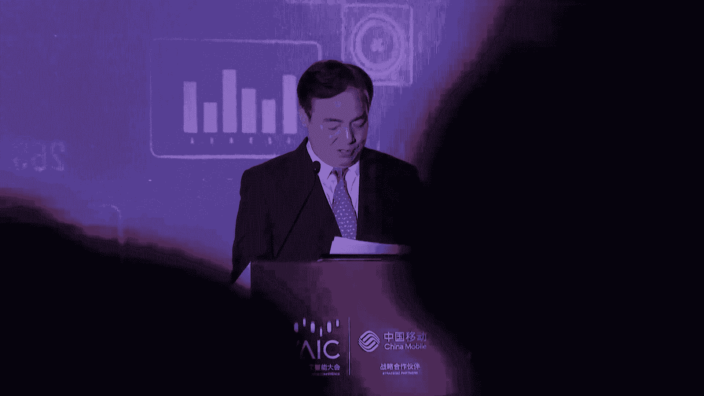
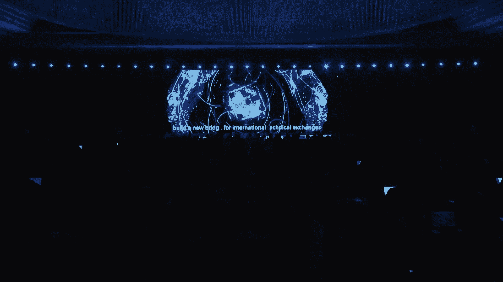
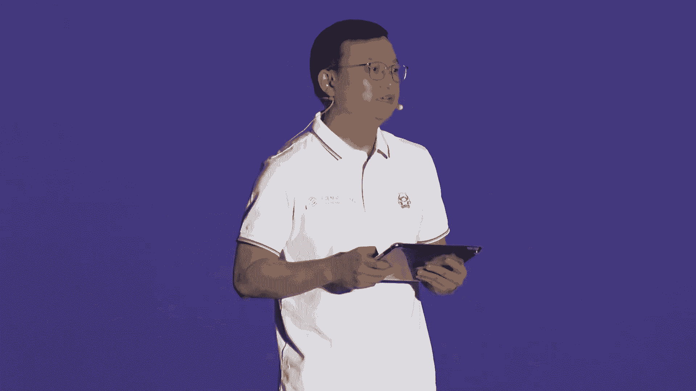

# P44：20240705-中国移动“AI赋能 创见未来”生态论坛 - WarrenHua - BV1iT421k7Bv

🎼这上面是谁的水？😡，🎼是你的水是吧，OK。🎼水要记得拿掉啊，然后话筒等会儿放这就。🎼人工智能成为推动农业现代化的重要力量。通过中国移动精准高效的农业专用AI解决方案，帮助农事智能决策，农事精准作业。

打造田间智脑，推出农技问答AI助手。🎼东龙蒸仿车间检测花型繁毒。🎼发现细腻却复杂。🎼人工都减历高。🎼品质难以保证。🎼依托中国移动瑕疵AI视觉检测系统，实现精准、实时高效智能制检。

🎼作为金桥智能网联示范区的运营单位，通过和中国移动的合作，综合性的运用AI智慧模型与5G杠A的网联通信技术相结合，打造了一条创新性的车路协同应用示范路线，能够赋能智慧城市车路协同与自动驾驶。

为未来的通行应用生态打造了一个创新性的一个样板。🎼面对光伏面板检测难的瓶颈，依托中国移动one power工业质检平台，构建5G加AI光伏质检应用，打造智慧组件产线，提升检测效率，加速释放生产潜能。

🎼政务服务进入数字化时代，聚焦企业群众极难筹盼问题，构建高效政务生态，依托9天海算政务大模型，实现一网通版，一网统管、一网协同，让龙江政务服务驶入了以人为本、便捷高效的智慧快车道。

🎼从火起文明到甲骨再文。🎼从思南定向到气船远航。🎼从电影夜空到信息蛛网。🎼我们见证生产力的重塑。🎼如今。🎼以大模型为代表的人工智能技术正在引领世界进入通用智能时代。

🎼中国移动始终将人工智能作为公司战略发展方向。🎼可世界一流信息服务科技创新公司的底色。🎼永担人工智能国家队使命，建设一流的9天人工智能团队。🎼承担国家重大重点科创任务，建设国家级重大产业平台。

🎼构建全面的9天人工智能产品体系。🎼为经济社会发展全面注智赋能。🎼以体系化人工智能构建特有原创技术内核，加快体系化AI基础理论、底层技术机制框架突破。🎼激发蒜网数质全要素资源和能力禀富。

🎼以九厅大模型打造新型智能化能力基座。🎼推进产业向AI加发展办事的重构。🎼以先进的网络智能化技术全面推进通信网络领先发展。🎼让网络运维效率倍增。🎼让网络运行绿色节能。🎼让网络优化虚实结合。

🎼以丰富的智能化能力为10亿用户创造精彩智慧生活，提供智能相随的5G通话新体验，提供大屏对话式推荐与陪伴式观影等个性化家庭数字内容服务。🎼以大模型重新定义客户服务模式，让10086服务更贴心便捷。

为用户提供多模态人机交互的数脂娱乐新方式。🎼加快大模型融入千行百业，为国民经济数字化发展深度赋能。🎼面向政务领域，助力实现一网通办、一网统管、一网协同的智慧政务治理体系。

面向城市管理领域、为安防、交通、环境管理等场景提供一体化智能服务，面向工业领域支持智能质检、智能安检提高生产效益。🎼面向医疗领域提供智慧导诊、问诊、复诊等智能解决方案。🎼通用人工智能是时代赋予的新机遇。

🎼中国移动将做好通用智能时代的供击者、汇聚者、运营者。🎼愿于产业界共同担负起责任和使命。🎼乘风破浪，永立AI潮头，沧海横流，彰显大国本色，振翅9天主。未来。🎼人工智能成为推动农业现代化的重要力量。

通过中国移动精准高效的农业专用AI解决方案。🎼帮助农事智能决策，农事精准作业，打造田间智脑，推出农技问答AI助手。🎼东盟正好车间检测花型繁毒。🎼沙线细腻且复杂。🎼人工都减历高。🎼品质难以保证。

🎼依托中国移动瑕疵AI视觉检测系统，实现精准、实时高效智能制检。🎼作为金桥智能网联示范区的运营单位，通过和中国移动的合作，综合性的运用AI智慧模型与5G杠A的网联通信技术相结合。

打造了一条创新性的车路协同应用示范路线，能够赋能智慧城市车路协同与自动驾驶，为未来的通行应用生态打造了一个创新性的一个样板。🎼面对光伏面板检测难的瓶颈，依托中国移动one power工业质检平台。

构建5G加AI光伏质检应用，打造智慧组件产线，提升检测效率，加速释放生产潜能。🎼政务服务进入数字化时代，聚焦企业群众急难筹盼问题，构建高效政务生态，依托9天海算政务大模型，实现一网通版。

一网统管、一网协同，让龙江政务服务，使入了以人为本、便捷高效的智慧快车道。🎼从火起文明到甲骨再文。🎼从思南定向到气喘远航。🎼从电影夜空到信息住网。🎼我们见证生产力的重组。🎼如今。

🎼以大模型为代表的人工智能技术正在引领世界进入通用智能时代。🎼中国移动始终将人工智能作为公司战略发展方向。🎼可世界一流信息服务科技创新公司的底色。🎼永担人工智能国家队使命，建设一流的9天人工智能团队。

🎼承担国家重大重点科创任务，建设国家级重大产业平台。🎼构建全面的9天人工智能产品体系。🎼为经济社会发展全面注智赋能。🎼以体系化人工智能构建特有原创技术内核，加快体系化AI基础理论、底层技术机制框架突破。

🎼激发蒜网数质全要素资源和能力禀富。🎼以9天大模型打造新型智能化能力基座。🎼推进产业向AI加发展范事的重构。🎼以先进的网络智能化技术全面推进通信网络领先发展。🎼让网络运维效率倍增。🎼让网络运行绿色节能。

🎼让网络优化虚实结合。🎼以丰富的智能化能力为10亿用户创造精彩智慧生活，提供智能相随的5G通话新体验，提供大屏对话式推荐与陪伴式观影等个性化家庭数字内容服务。🎼以大模型重新定义客户服务模式。

让10086服务更贴心便捷，为用户提供多模态人机交互的数字娱乐新方式。🎼加快大模型融入千行百业，为国民经济数字化发展深度赋能。🎼面向政务领域，助力实现一网通办、一网统管、一网协同的智慧政务治理体系。

面向城市管理领域、为安防、交通、环境管理等场景提供一体化智能服务，面向工业领域，支持智能质检、智能安检提高生产效益。🎼面向医疗领域提供智慧导诊、问诊、复诊等智能解决方案。

🎼通用人工智能是时代赋予的新机遇。🎼中国移动将做好通用智能时代的供击者、汇聚者、运营者。🎼愿于产业界共同担负起责任和使命。🎼乘风破浪，勇立AI潮头，沧海横流，彰显大国本色。振翅9天主。为来？

🎼人工智能成为推动农业现代化的重要力量。通过中国移动精准高效的农业专用AI解决方案。🎼帮助农事智能决策，农事精准作业，打造田间智脑，推出农技问答AI助手。🎼东龙正仿车间检测花型繁毒。🎼发现细腻却复杂。

🎼人工都减肥告。🎼品质难以保证。🎼依托中国移动瑕疵AI视觉检测系统，实现精准、实时高效智能制检。🎼作为金桥智能网联示范区的运营单位，通过和中国移动的合作。

综合性的运用AI智慧模型与5G杠A的网联通信技术相结合，打造了一条创新性的车速协同应用示范路线，能够赋能智慧城市车速协同与自动驾驶，为未来的通行应用生态打造了一个创新性的一个样板。

🎼面对光伏面板检测难的瓶颈，依托中国移动one power工业质检平台，构建5G加AI光伏质检应用，打造智慧组件产线，提升检测效率，加速释放生产潜能。🎼政务服务进入数字化时代，聚焦企业群众急难筹盼问题。

构建高效政务生态，依托9天海算政务大模型，实现一网通版，一网统管、一网协同，让龙江政务服务驶入了以人为本、便捷高效的智慧快车道。🎼从活起文明到甲骨再文。🎼从思南定向到气船远航。🎼从电影夜空到信息蛛网。

🎼我们见证生产力的重塑。🎼如今。🎼以大国型为代表的人工智能技术正在引领世界进入通用智能时代。🎼中国移动始终将人工智能作为公司战略发展方向。🎼可世界一流信息服务科技创新公司的底色。

🎼永担人工智能国家队使命，建设一流的9天人工智能团队。🎼承担国家重大重点科创任务，建设国家级重大产业平台。🎼构建全面的9天人工智能产品体系。🎼为经济社会发展全面注智赋能。

🎼以体系化人工智能构建特有原创技术内核，加快体系化AI基础理论、底层技术机制框架突破。🎼激发蒜网数质全要素资源和能力禀富。🎼以9天大模型打造新型智能化能力基座。🎼推进产业向AI加发展范事的重构。

🎼以先进的网络智能化技术全面推进通信网络领先发展。🎼让网络运维效率倍增。🎼让网络运行绿色节能。🎼让网络优化虚实结合。🎼以丰富的智能化能力为10亿用户创造精彩智慧生活，提供智能相随的5G通话新体验。

提供大屏对话式推荐与陪伴式观影等个性化家庭数字内容服务。🎼以大模型重新定义客户服务模式，让10086服务更贴心便捷，为用户提供多模态人机交互的数脂娱乐新方式。🎼加快大模型融入千行百业。

为国民经济数字化发展深度赋能。🎼面向政务领域，助力实现一网通办、一网统管、一网协同的智慧政务治理体系，面向城市管理领域、为安防、交通、环境管理等场景提供一体化智能服务，面向工业领域。

支持智能质检、智能安检提高生产效益。🎼面向医疗领域提供智慧导诊、问诊、复诊等智能解决方案。🎼通用人工智能是时代赋予的新机遇。🎼中国移动将做好通用智能时代的供击者、汇聚者、运营者。

🎼愿于产业界共同担负起责任和使命。🎼乘风破浪，勇立AI潮头，沧海横流，彰显大国本色。振士9天主。未来。🎼不奴辑问答AI助手。🎼东盟正仿车间检测花型繁毒。🎼沙线细腻且复杂。🎼人工都点历高。🎼停质难以保证。

🎼依托中国移动瑕疵AI视觉检测系统，实现精准实时高效智能制检。🎼作为金桥智能网联示范区的运营单位，通过和中国移动的合作，综合性的运用AI智慧模型与5G杠A的网联通信技术相结合。

打造了一条创新性的车路协同应用示范路线，能够赋能智慧城市车路协同与自动驾驶，为未来的通行应用生态打造了一个创新性的一个样板。🎼面对光伏面板检测难的瓶颈，依托中国移动one power工业质检平台。

构建5G加AI光伏质检应用，打造智慧组件产线，提升检测效率，加速释放生产潜能。🎼政务服务进入数字化时代，聚焦企业群众极难筹盼问题，构建高效政务生态，依托9天海算政务大模型，实现一网通办。

一网统管、一网协同，让龙江政务服务驶入了以人为本、便捷高效的智慧快车道。🎼从火起文明到甲骨再文。🎼从思南定向到气喘远航。🎼从电影夜空到信息住网。🎼我们见证生产力的重组。🎼如今。

🎼以大模型为代表的人工智能技术正在引领世界进入通用智能时代。🎼中国移动始终将人工智能作为公司战略发展方向。🎼可世界一流信息服务科技创新公司的底色。🎼永担人工智能国家队使命，建设一流的9天人工智能团队。

🎼承担国家重大重点科创任务，建设国家级重大产业平台。🎼构建全面的9天人工智能产品体系。🎼为经济社会发展全面注智赋能。🎼以体系化人工智能构建特有原创技术内核，加快体系化AI基础理论、底层技术机制框架突破。

🎼激发蒜网数质全要素资源和能力禀富。🎼以9天大模型打造新型智能化能力基座。🎼推进产业向AI加发展范式的重构。🎼以先进的网络智能化技术全面推进通信网络领先发展。🎼让网络运维效率倍增。🎼让网络运行绿色节能。

🎼让网络优化虚实结合。🎼以丰富的智能化能力为10亿用户创造精彩智慧生活，提供智能相随的5G通话新体验，提供大屏对话式推荐与陪伴式观影等个性化家庭数字内容服务。🎼以大模型重新定义客户服务模式。

让10086服务更贴心便捷，为用户提供多模台人机交互的数字娱乐新方式。🎼加快大模型融入千行百业，为国民经济数字化发展深度赋能。🎼面向政务领域，助力实现一网通办、一网统管、一网协同的智慧政务治理体系。

面向城市管理领域、为安防、交通、环境管理等场景提供一体化智能服务，面向工业领域支持智能质检、智能安检提高生产效益。🎼面向医疗领域提供智慧导诊、问诊、复诊等智能解决方案。🎼通用人工智能是时代赋予的新机遇。

🎼中国移动将做好通用智能时代的供击者、汇聚者、运营者。🎼愿与产业界共同担负起责任和使命。🎼乘风破浪，勇立AI潮头，沧海横流，彰显大国本色。尊敬的各位领导，及各位来宾，我们的大会即将正式开始。

请大家抓紧时间入座。同时建议您将自己的手机调整为静音或震动，谢谢您的配合。🎼在科技跃迁的黎明。🎼新智生产力正以前所未有的力量重塑世界的产业版图。🎼AI家这把开启未来的钥匙。🎼正驱动着传统行业的蜕变升级。

🎼AI加生活。🎼让智慧融入日常。🎼让生活更便捷，更美好。🎼AI加生产实现从制造到制造的变革。🎼效率与质量双提升AI加社会治理。🎼构建智慧城市的神经系统，让城市管理更加精细、高效。

🎼AI加科学研究探索未知的灯塔，从基因测试到天体观测。🎼洞察微观到宏观。🎼未来以来。🎼为创新者胜。🎼计算智能感知智能。🎼认知智能运动智能正磅礴兴起。🎼让我们携手AI。🎼共同创建。🎼未来的辉煌篇章。😡。

🎼尊敬的各位领导，各位来宾，大家下午好。😊，🎼欢迎大家莅临中国移动AI赋能创建未来生态论坛。本次论坛由中国移动通信集团有限公司主办，我是主持人李玉琪。

🎼本次论坛通过中国移动、中移科学9天人工智能视频号及咪咕视频app进行在线直播。我们也向正在线上收看的朋友们表示热烈的欢迎。🎼当今世界，人工智能技术正以前所未有的速度发展。

成为推动社会进步和产业升级的重要力量。为进一步促进人工智能与千行百业的深度融合，构筑广泛参与的人工智能生态，加速人工智能技术和产业的新发展。中国移动举办了本次论坛。

首先请允许我为大家介绍出席本次论坛的各位嘉宾。他们是国务院国资委副主任苟平，欢迎您。上海市人民政府副秘书长庄木娣，欢迎。😊，中国移动通信集团副总经理高同庆。和智源研究院理事长黄铁军。

出席今天论坛的还有来自中国移动集团相关部门、省公司、专业公司和直属单位的领导，以及政产学研各界的合作伙伴和媒体界的朋友，让我们再次以最热烈的掌声欢迎各位的到来。🎼好。

首先有请上海市人民政府副秘书长庄木地先生登台致辞，掌声欢迎。尊敬的葛平主任，尊敬的高国庆。仲裁。各位专家。各位来宾、女士们、先生们，大家下午好。很高兴与大家相聚在AI赋能创建未来生态论坛。

与各位业内的顶尖科学家、企业家共同探寻AI发展的未来趋势。首先，我经代表上海市政府对本次论坛的举办表示热烈的祝贺。向与会的各位专家、各位嘉宾，各位朋友表示热烈的欢迎。近年来。

人工智能产业呈现快速发展的态势，特别是深城市的人工智能，驱动千行百业技术变革，迭代升级，加速释放产业新质生产力。当前，全球主要国家纷纷聚焦人工智能核心关键技术、产品平台和标准等细分领域。

积极培育具有高科技、高效能、高质量、符合新发展理念的先进生产力的姿态。上海顺应人工智能发展趋势，仅仅瞄准大模型智能算力、应用场景的核爆点新方向。积极构建自主可控、安全可靠、竞争力强的产业生态体系。

我们推动算力基础设施加快的布局，全面提升算力调度和攻击能力。布局多个具有大模大规模应用赋能价值的计算中心和。大原创性技术产品的公关。我们推动大模型加速涌现和运行。全市已有34款大摩。大模型通用通过备案。

已形成一个开源大模型，加上三个基础大模型，加N个垂育大模型的发展格局。在制造金融、生活、消费等锤类领域深化运用。我们推动重大创新平台加快建设。国内首个大模型创新生态社区模术空间落地。

构建了开放数据、评测等五大服务平台，吸引了80余家大模型企业的入驻。面向未来，上海将抢抓人工智能赋能产业转型升级的契机，加快形成产业发展的新优势新动力。我们将推进AI关键技术突破，加强先进计算。

上网融合等技术的布局，增强技术变革迭代的敏感性。推动大模型算法训练框架。计算系统等基础实施原创性技术的突破，提升产业基础能级。我们将加快大模型创新赋能，打通需求对接技术验证示范引领。等技术全链条。

推进更多的具有强大带动效应的应用场景。推动技术和场景的相互的赋能。我们将构筑行业有序发展生态，积极建设大模型领域的测试平台。支持各创新主体开展联合攻关，形成行业标准，参与人工智能地方标准体系建设。

共建健康的产业生态。各位来宾，本次论坛汇聚了人工智能领域的众多优秀的专家学者、企业领袖等重量级的嘉宾，期待与会嘉宾发表增知逐卷，畅谈创新观点，引领AI赋能发展的大势。在此。

我也期待中国移动持续深化在基础资源技术创新产业生态等领域的布局，推动更多智能化服务产品，助力上海人工智能发展高地建设取得更大的突破。最后，预祝本次论坛取得圆满成功，谢谢大家。

感谢庄秘书长的精彩致辞，谢谢您。接下来呢有请中国移动集团有限公司副总经理高同庆先生致辞，大家欢迎。😊，尊敬的苟平副主任。专木地副秘书长黄铁军教授，各位嘉宾、女士们、先生们，大家下午好。

非常高兴与大家再一次相聚在黄浦江畔。作为中国人工智能产业上海高地，这既有这里既有完善的AI产业链，又有浓厚的科技创新的土壤。中国移动与世界人工智能大会已有7年的不解之缘。

期望依托本次会议凝聚更多的产业共识，汇聚更大的产业力量。首先，我谨代表中国移动对各位来宾的到来表示热烈的欢迎。并向各级政府和社会各界长期以来对中国移动的支持表示衷心的感谢。习近平总书记指出。

要加快形成新智生产力，增强发展的新动能。当前，人类社会正迈入，以信息为主导、信息和能量深度融合的第四次工业革命。即数字化。也就是数字化革命，数据成为新生产要素，算力成为新的基础能源。

人工智能成为新的生产工具，三者共同构成新智生产力的重要驱动因素。近期，以人智能为代表的战略型新兴产业快速发展。成为新的关键的变量，将重塑经济、社会组织形态，甚至重构世界经济的版图。辐射面之广。

影响力之大，前所未有。中国移动深入学习贯彻习近平总书记重要讲话精神。在国务院、国资委、工信部等上级部门和各级政府的关心指导下，勇担央企人工智能国家队从2013年开始布局人工智能。

十年磨一线成立9天研究院。形成2000人的人工智能的核心团队，围绕供给者、汇聚者和运营者三个定位，体系化的推进人工智能的发展。一是做好供给者，夯实人工智能加的发展基础，打造通治超量。一体化的算力网络。

全网计算规模超过17亿fps。聚焦做事主自主研发9天千亿多模态大模型。一季度将训三季度将训练完成2000亿多模态大丸大模型，更大参数的大模型也正在训练和推进中。

布局、交通、工业等40款行业大模型建成数联网，我们称为DSSN。支撑安全合规的数据共享。数据流通和数据交易。第二是做好汇聚者，促进AI加产业的融通，建强9天人工智能生态汇聚平台。

打造大模型训练评测产业创新三大AI基地。开放讯推一站式服务。第三是做好运营者，深化爱家的应用赋能。以AI重塑5G新通话、视频彩铃等43款AI加的产品及应用。在工业、能源、交通等行业打造百个AI标杆示范。

布局家庭机器人等新型的AI产品。面向数字化革命发展的新阶段，中国移动全面推进AI加行动，加快9天人工智能基座，融入百业，创造价值服务社会。一是推进AI加千行百业，千家万户驻智赋能。全面升级重塑战略产品。

构建。涵盖计算平台、模型、智能体等各要素融合的AI加的服务体系，加速经济社会数字化的转型。第二是推进AI加新兴技术融合创新。围绕新型工业化、低空经济、车路云一体化、市联网等国家重大关键方向。

行业重点领域加速A加与basic6信息技术群的交叉融合。不断的激发新一代信息技术的创新潜能。第三是推进A爱加多域智能集成的应用。联合产业合作伙伴。

共同推动计算智能、感知智能、认知智能和运动智能的协同发展。推动家庭看护机器人等创新，让AI具备更加强大的认知力。和判断力以及创造力。人工智能发展的大幕已经开启。未来孕育无限的商机和可能。

今天我们将在此启动中国移动5个100的人工智能的生态计划。中国移动愿意和产业的伙伴一道，以更加开放的心态和更加务实的举措，推动人工智能加高质量的发展，为经济社会转型升级注入新的动能。

为培育壮大心智生产力做出更大的贡献，再一次感谢各位领导，各位嘉宾的光临，谢谢。也感谢高总的精彩致辞，请入座。开展科学系统的大模型评测是，推动大模型技术创新，加速行业应用的重要手段。

为发挥国资央企在大模型评测领域的引领作用，为AI加行业赋能提供客观标志，提升国资央企AI加行业影响力，保障国家战略公关任务高质量推进。今天，我们将启动国资央企人工智能大模型评测体系建设。

并邀请各行业代表一起上台见证。本次启动仪式呢得到了各界的积极响应。我们一块来看大屏幕。🎼大模型评测一起筑未来。大黄细平。🎼一起祝未来。🎼一色。🎼入位了。🎼大模型评测一起祝未来。🎼大模型评测一起赴未来。

🎼大模型评测一起赴未来。🎼大脖型同侧一起祝未来。🎼大模型评测一起赴未来。🎼大模型评测一起助未来。🎼大模型评测一起赴未来。🎼大模型评测一起筑未来。🎼不手评色一起祝未来。🎼好。

接下来我们将邀请相关业界代表上台见证启动仪式。他们是中国移动党组成员副总经理高同庆，中国电信副总经理、党组成员李俊。

中国电子首席科学家朱国平、南航集团副总信息师黄文强、中国石油数信部集团及高级专家冯双伟，中国石化信术部副总经理蒋楠，南方电网数字化部副主任于云，国能数据科技公司总经理张晓东。

中国远洋海运数字化转型本部副总经理朱春叶，中国钢研智能化绿色化中心主任张云贵，中国铁建专家戴培新，中国航信党委常委、副总经理、总会计师李庆松，中国铁塔通信技术研究院副院长郭宇辉。

中国能建华东院副总经理叶永建，电子标准院信息技术研究中心主任董建，请各位领导和嘉宾共同上台。掌声有请。😊，🎼我们共同期待着各位领导嘉宾。🎼女士们先生们，亲爱的来宾朋友们。😊，🎼好。🎼我们来共同期待。

🎼这个激动人心的时刻。🎼我们请各位领导和嘉宾将右手放在启动器上，共同开启倒计时。🎼5432。一。行动。🎼国资央企人工智能大模型评测体系建设正式启动，请各位领导和嘉宾共同合影留念。🎼再次感谢各位领导。

各位嘉宾请入座。😊，🎼为加快推进AI加应用创新及产业升级转型及重塑，中国移动积极践行共建共创共荣生态发展理念，全新启动5个100人工智能生态计划。让我们先通过一个视频了解中国移动人工智能生态计划。

请看大屏幕。🎼新致生产力，正催生着全新的产业革命。🎼中国移动十年魔舰，深耕未来家领域。🎼铸究智能时代新来。🎼为加速推进AI加行动计划，带动我国人工智能产业发展。

实现网络规模、客户规模、收入规模三个全球第一。🎼创新能力、品牌价值、公司市值、盈利水平四个全球领先。🎼重磅打造中国移动人工智能生态计划。🎼开放百大AI加场景，精选十大领域场景，深化产业赋能。

集结百大合作伙伴。🎼依托多种合作载体，加速产业势能，设立百亿权益扶持，从算力到资本，从商机到品牌，升级产业动能。🎼开放百大技术要素。🎼汇聚和开放，丰富技术能力，强化产业效能。🎼打造百万企业智能体。

🎼让个人和行业都拥有专属智能体。🎼中国移动愿携手各界伙伴共谋生态合作新未来。🎼供起智能时代新纪源。🎼激动人心的视频之后，就是更加激动人心的仪式了。接下来我们将正式启动中国移动人工智能生态计划。

我们掌声有请中国移动副总经理高同庆，工业和信息化部科技发展处处长王正智源研究院理事长黄铁军。😊，🎼中兴通讯高级副总裁朱永兴、商康科技执行董事徐斌，科大讯飞副总裁贺晓光，华为中国区解决方案副总裁彭亚平。

荣耀中国区副总裁赵浩，浪潮集团副总裁李春晓、清华三副总裁兼移动事业部总经理王栋良，中科曙光总裁助理、智能计算产品事业部总经理杜夏威、上海穗源科技股份有限公司创始人董事长、CEO赵立东、摩尔县城联合创始人兼首席运营官周越。

上海必任科技股份有限公司高级副总裁魏民，联会科技董事长赵凡。🎼中文在线集团股份有限公司首席运营官杨睿智，网智天元科技集团股份有限公司CEO蔡锦森、数美科技高级副总裁周秋野，文远知行副总裁韩明。

北京海天瑞声科技股份有限公司总裁办公室主任、生态发展事业部总经理卢新平，掌声有请各位领导和嘉宾共同登台。🎼此刻，我相信无论从哪个方位，我们都将为人工智能生态计划注入自己的一份力量。🎼我们准备好了没有？

🎼好，让我们来共同启动。🎼祝贺中国移动人工智能生态计划正式启动。🎼感谢你们，我们也合影留念。😊，🎼好，请席肩入座，辛苦了。🎼为了响应国家一带一路科技创新行动计划，落实全球人工智能治理倡议。

深化中印尼全面战略合作，中国移动将与印尼金光集团成立人工智能联合实验室，共同打造国际协同AI创新高地。接下来的时间呢，我们将共同来通过一段短片了解人工智能联合实验室，到底是怎么一回事？

我们把目光投向大屏幕。🎼AI技术变革催生时代新机。🎼中国移动与金光集团互聚决力。🎼依托双方优势，成立人工智能联合实验室，协入打造AI创新高地，谱写数字丝绸之路新篇章。实验室聚焦三大目标。

构建互利共赢的企业国际合作典范，一是培育双方数字化领域合作新模式，联合打造智能化新能力与新产品，助力印尼数字经济与产业发展。🎼二是推进一带一路科技创新行动计划。

构建两国人工智能、国际技术交流合作和人才培养的新桥梁。

🎼三是落实全球人工智能治理倡议，共同促进全球人工智能健康有序、安全发展。🎼中国移动。🎼与金光集团携手前行，共筑人工智能的宏伟梦想，共赴智慧时代的广阔蓝海。此刻。

我们将共同见证中国移动金光集团人工智能联合实验室签约仪式。🎼我们有请中国移动和金光集团的两位签约领导上台，他们是中国移动研究院院长黄宇红女士。🎼京光电信CTIOs瑞先生。

🎼也有请中国移动集团副总经理高同庆先生、DSS董事长chrisim先生。🎼中国移动集团科技创新部总经理陈洪涛先生。

中国移动国际业务部总经理王华先生、农业集团中国CEO李东先生、金光集团engr先生、印尼金光科技与通信集团董事长执行助理金训超先生共同上台建签，掌声有请。🎼我们共同见证这场跨越数千公里的合作。

🎼请两位领导在面前的合作协议上庄重5000名。🎼有请两位领导交换协议再次进行签名。🎼也感谢各位嘉宾共同见证此刻。🎼谢谢你们。好，请各位领导嘉宾合影留念。😊，🎼我们的签约仪式李必，请各位领导嘉宾席间入座。

🎼下面将进入今天活动的主旨演讲环节。🎼谢谢你们。😊，🎼大家还意犹未尽啊。🎼我们接下来呢要有请中国移动通信集团有限公司党组成员、副总经理高同庆先生为我们带来题为共谋生态之路，共创AI加未来的主旨演讲。

掌声欢迎。😊，OK这个。下午好，因为刚才这个灯光呢非常暗，所以我和庄秘书长我们两个人看到看这个文字都非常困难。所以希望。给我们这边稍微来一点量啊。因为。这个今天呢我们这个论坛呢。呃。

我觉得非常重要的一个论坛。7年中国移动一直。呃，从开始有世界人工智能大会，钟一东就参加。这个。连续7年那，每届如此。但是7年的大会的历程呃也展示了中国人工智能产业发展的历程。

也是我们在不断的认知人工智能，不断的。人工智能成为我们一个强大的经济发展的一个动力，成为我们科技的一个高地。的一个过程。所以从这个近特别是近两年以大模型为代表的通用人工智能取得了跨越式的发展。

原来我们不能不说我们有人工智能，但是我们更多的是加人工智能。那么从通用这个生成式大模型出现之后。整个人工智能。就完全变了，这是一次深刻的人工智能的革命。这个变化之后。

就从AI加变成了这从加AI就变成了AI加。而且呈现出三个大的趋势。这三个趋势呢，一个呢就是落地应用广。落地广，依托我国市场规模大，产业配套全，应用场景多，这样一个独特的优势。

人工智能深度的融入科研、生产服务等各个环节。赋能生产流程的再造效率提升，绿色转型。呈现出巨大的应用的潜能。第二个呢是参与的主体多啊。一方面，人工智能产业链。不断的在壮大。呈现出这个智算。

涌现出智算、这个模型、智能体等服务供给的新的角色。驱动新的发展。另一方面呢，人工智能与新一代信息产业交叉融合。明天呢我们也会在呃。闭不市场。将和上海市政府、中国移动，我们将会。呃，做一个5GA方的发布。

那么5GA方呢就是5GA加AI乘以AI啊。那么叫5GA方的一个发布。低空经济乘以AI以及AI成复合链加速产业的这个换新的进程啊，加速产业换新的进程。第三个呢是发展的潜力的。

计算智能、感知智能、认知智能和运动智能，这四大智能多于以继成。刚才这个我们大家看过展览都可以看到，这一次展览有一个非常突出的特点，机器人多。啊，机器人多。而且机器人和去年前年比。

我记得前年我们看到了在世界人大会，我们看到的机器人。但是今年的机器人和前年相比，大家可以去看看。啊，有了突飞猛进的。进展。将推动人工智能从辅助人类的副驾驶。辅助人类的副驾驶。

逐步会转变成为人机深度协作的智。这个智能体。啊，这是一个重大转变，也就是加AI和AI加一个巨大的区别，实现了人类智能的延伸，甚至于对人类智能的延伸，甚至于。在某些方面的超越。没。下一页。十年的时间呢。

应该说这个对中国移动十年某一线，从2012年开始啊。那么到现在事实上已经有12年的时间。我们战略性的布局了仍质。以支柱国击作为我们的己任啊。十余年来，我们坚持自主创新。其实这条路的确是很艰辛。

但是我们觉着走的非常的值得。坚持持续的投入，综合实力跻身在国内的第一阵营。这个昨天有一位领导问我说，你们战略型投入人工智能投了几年，我说十年。那么后续准备再投几年，我说只要国家需要发展需要，我们会持续。

战略性投入。我们锻造了一支顶尖的人工智能的人才队伍。成立了9天研究院。形成了2000人的核心团队，人工智能的核心团队。构建了四支队伍，而且这个队伍呢是四支队伍，具备从书架到货架端到端的转化能力。

这四支队伍就是包括计算服务。模型和模型训练。以及行业模型。的训练和推理。二子。还有客户面向客户的一个人工智能的能力的交付团队。只有这四支队伍的齐备，才能够形成真正的端到端的。端到端的。

那么这样一个完整的服务的闭环，完整的服务闭环。形成了领先的人工智能的核心能力，沉淀了450余项人工智能的能力，超过900项专利，近170余篇顶会的顶级论文，顶刊顶会和顶刊的论文。打造超过千余项的应用。

成为国资央企的国家队。成为国资央企的国家队。中国移动呢担当了新一代国家人工智能的创新平台。新一代国家人工智能创新平台牵头超过20项国家AI的重大专项，覆盖了国资委、共信部以及其他部委这5个等5个部位。

下一页。面对通用人工智能这个时代的面对通用人时人工智能时代的这个新的形式和新的要求。我们围绕着供给者、汇聚者和运营者的定位。打造9天人工智能的基座。致力于成为一支安全可信、技术领先、稳定赋能的国家力量。

为时代注制，也为国家铸进。这个第一个呢就是建设新型的人工智能的基础设施。筑牢我们发展的一个基础啊。一个呢是建成了这个智算网络的新的集群。大家知道。没有算力，人工智能就没有办法去训练和推理。

中移栋在呼和浩特啊。投产了近2万卡的单体的计算中心，这是已经正式投产。大概在6月底吧。那6月下旬已经正式投产。入选了央企的十大超级工程。11个省、12个大区域计算中心也全面上线。在今年年内。

中国移动还将在贵阳、哈尔滨新增两个。进万卡的这个进万卡的这样一个大的集群的计算计算中心，单集群的计算中心。全网制算的规模预算啊，规模的这个计算的规模。将会超过30亿fps。呃，31f。

再就是升级算网大脑。大家知道算是IT域网是CT域。把这两者之间，我们中国的网强啊网强现在算，我们在拼命的积累和追赶。那么如何提高这个算的效率？通过强的网和算的结合，形成算力网络，把这个算。同样。

以往强算实现以往强算的这个目标。在全网的算力、存力运力能力啊，通过这个算力网络能够得到全面的呈现。日调度目前这个算网大脑每天的调度量近千万次。支持通治编一体化的智能调度。

推动算力成为一点切入、即取即用按需调度的社会级的服务。就是这是我们一个。呃，伟大的梦想就是希望算力能够像自来水一样来，大家拧开龙头，即取即用。啊，继取即用。形成一个真正社会级的服务。第三。

深化网联的功能。建设全球最大的IPV6加的。骨干承载网。贯通了和商用了全球第一条400G的全光链路，也就是大型计算中心之间的这样一个大通道的建设。千公里时延只有5个毫秒。千公里时间只有5毫秒。

畅通了东数西算这样一个大动脉。其实东出西算，面对着一个非常大的挑战。就是食验问题啊，畅通了东数西算的大动脉。第二呢是锻造高水平人工通人工智能的通专大模型。夯实供给的水平，把这个供给的水平把它做扎实。

中国移定坚中国移动坚定不移的致力打造国内最值得信赖、最懂得行业的全站、自主可控的大模型。第一个呢就是坚持自主创新、攻坚技术领先的9天技术大模型。那么我们在这个多次场合都对9天。

历年来的创新成果进行了发布。这个上个月我们也在呃。5月底，我们也在福州。呃，发布了9天的千亿参数的大模型多模态。2000亿呢，刚才在至此中我也讲到，大概会在9月底。我们就会上线。就训练完成。

20我们在22年这个。预言23年初啊23年初集全公司之力共坚啊，我们22年开始，23年初，全公司举例攻坚，实现了全链路的核心技术自主的掌控。也就是针对就是9天基础大模型啊。

形成满足全场景所需的9天基础大模型的矩阵。多尺寸的方面呢，包括已经商用的千亿多模态大模型。在研的2000亿多模态大模型，以及预言中的更大规模的模型。啊，就就是我们同步呢也在开展更大规模的模型的研发。

还有呢这个在多模泰方面呢，包括9天的重情语言模型啊。还有9天这个语合语言模型。九天智慧啊就是绘图的绘智慧这样一个这个视觉模型啊。9天树同结构化模型等等啊。在开元这方面呢。

百亿级的已经上线的这个马云开元社区啊，后续呢将持续开放更多的版本啊，开放更多的版本。欢迎大家呢来使用9天的这个开元的模型。对。后续。这个我们中国移动啊在整个技术大模型的研发当中，聚焦能够做事。

董事长在本次杨杰董事长在本次大会上。开幕式的这个呃主旨演讲中啊。专门讲到，我们不仅会做事，而且能够做更复杂。更高水平的事情。也就是说。我们聚焦做事9天大模型呢具备四个特点。第一个。

首创了行业定向的增强技术。首创了行业定向的增强技术。融合通信啊，电力、能源、交通等各行各业的专业知识。预训练行业数据占比超过10%。超过10%。全球领先。第二呢是深度匹配行业的模态设计。啊。

独创结构化的数据大模型。解决了主流大模型无法胜任结构化数据处理的产业的共性问题。产业的共性问题。依托市联网大模型及视联网规模运营经验。咪咕系的视频，咪咕是中国移动的内容的一个专业子公司。帮助行业看得懂。

而且能看得准。第三呢是深度的匹配国产的算例。我们是在业内首次在万卡集群上实现全站。国产的这个千亿级大模型。真正的一个万卡。继续。既支持客户平滑的国产的迁移。有。有力的支撑了国产生态的丰富与进一步的成熟。

啊。在安全可信方面呢，应该说安全可信。度是领先的。9天基础大模型是首个通过国家双备案的央企研发的大模型，这是第一项。并且获得了中国软件测试中心安全测评的最高等级，也就是A级的证书。啊。

坚决坚持做事的初心，这是中国移动不变的一个执念。布局于40款行业大模型的普系啊。那么已经研发并发布了15款自研9天行业大模型，这次大会我们也将会进一步推出两款行业大模型。就是在上一次发布的基础上。

我们再推出两款呃行业大模型。9天交通大模型主要呢是聚焦智慧路口这两款，一个是交通，一个是民航的客服啊。那么9天交通的大模型呢，主要是聚焦智慧路口、智慧港口等这样的场景。

形成感知理解、规划决策一体化的一个智能的服务。民航领域的客服大模型是基于我们自有1余年。客服数据和经验的沉淀。大家知道中国移动有10086。啊1年零八年。啊，沉淀了大量的数据，客服的数据。

并且呢我们有十余年的。大规模数据量的一个客服的经验。结合中航信民航的专业知识。形成了作息辅助、工单辅助等民航专业的克服能力。银行专业的客服能力。第三呢是释放数据要素的价值。数学要素的价值。

那么助力人工智能加的发展，一是沉淀数据资源超过了2000个PB。构建了114个覆盖30个以上行业的高质量行业数据集。第二呢是积极打造数据流通基础设施。我们叫DSSN啊DSSN。形成集成了隐私计算啊。

区块链等各类啊安全技术。融入国家数据治理的体系。国家数据局啊在这个全面的构建我们国家数据治理的体系。那么DSSN全面的融入了这样一个治理的体系当中。在浙江、杭州，中国数果得到了部署和应用。

我们也和全国几乎所有的数教所。都签订了合作协议。从互联网从互联网加到5G加，再到AI加。既位应该说既位我们指明了方向也。留下了也这个留下了高质量发展的一个必答题。

中国移动呢始终秉承赋能经济社会发展的理念。啊，率先交出AI加的规模应用的答卷啊规模应用的答卷。第一个呢是实现了内部生产级的规模应用。刚才我们说到十年的客服方面的积累啊。

那么面向AI加客服、AI加网络等全球最大最复杂的系统。啊，最复杂的系统。上线了数字员工2。8万多，就是客服。现在大家拨打的。呃，10086绝大多数或者说都是由我们的人智能和各位进行了交流。

解决问题呢也是由人工智能在自动化、智能化的基础上给大家解决的各类服务和咨询的问题。那么同样大家知道网络中国是全球最大的信息网络。中国移动一家我们所拥用的基站是美国所有基站的5倍。

仅仅是中国移动一家所有基站的5倍。所以这样一个再加上传输啊，平台等等。一个非常复杂的聚系统啊，那么这两个我们。9天的人工智能在我们这两个领域全面得到了应用。并且我们也上线了2。8万个数字员工。

将来我们可能在做人力资源统计以及这个呃人工人力成本的核算的时候，数字员工将会将会成为一个新的啊统计的要素。累计节省人工这2。8万个，累积节省人工呢，每年大概是120万个人天。

灵犀的人工智能AI助手重塑了中国移动APP流量分发和交互体验的模式啊。覆盖账单、充值等100余项这个意图。网络大模型服务内部3000以上的场景啊，年节电量4亿度，就是每年因为人工智能啊41度。

比如说北京的金融街可能300多个基站在最忙的时候在提供着服务。那么到了晚上，随着用户的量的上载嗯。量的这个下降，我们会。减少基站的量，让基站的呼吸效应满足它的覆盖，把能耗坚决的降下来。

在每年节省的就将达到41度。所以人智能的赋能是多么的重要。降低12%的固定资产的维护费。固定资产的维护费。另外呢我们也打造了入口级的人工智能的原生服务。全面的AI加升级有23款我们自有的战略产品。

就是我们把所有我们自己的产品拿来用人质呢全部进行了再一次的。重耕和升结。5G加AI新通话荣获了就是新通话。5G的新通话荣获了24届世界人工大会。这个s尔之星top10的大奖。啊，top1大奖啊。

这就是近2424年的人世界人工大会，这个top10的s奖啊。也就是我们这一次。提供智能翻译等原生的服务。这个5GA呢最早我们是在23年，在巴塞罗那。第一次亮相在那发布了。

大家可以充分的体验5G加人工智能给我们带来的全新体验。他不再是一个通信工具，它是一个智能的助手。他是你一个人生的映射。可以说。在这里面很多难以解决的问题。这个手机原来我们说手机叫伸手要钱。

就是手机啊这个身份证钱包以及呃还有这个呃钥匙啊。除此之外，其实他还是你自己的一个述质人，是给你自己提供服务的助理。一个全方位的全新的界面，让你在。和世界发生关联，发生联系。让你自身更大。所以5G新动话。

我们叫new call，大家可以。去更多的去体验它。目前我们有将近差不多一个亿的用户。有差不多一个亿的用户。后续而且呈现出发展越来越快的势头。我们成立了智能终端的智能体的联盟啊，智能体的联盟。

年内呢将会推出人工智能的主机等产品。让每一次出逃。都是。哎呀。开始。第三呢是我们在加速推进呃AI融入百业。啊。也就是会做事啊。已在数十个行业落地，人工智能加的项目超过万个。人工智能加工业方面呢。

我们与国家电网、中煤能源等行业龙头合作，落地生产制造、产业分析等核心场景。加速人工智能赋能新型工业化。人工智能加农业的方面啊。与中储粮农业农村部呃大数据发展中心合作。

落地了3个中央储备粮库、中央储备粮库、附能害虫的防治，包括作物病害识别等等关键的应用场景。第四呢是积极培育人工智能的新型的产品。对。在人工智能f机器人方面。呃，依托将近3亿个家庭客户的群体。

因为中国移动是全球最大的，也是家庭呃服务商。我们全国大概有4点。5亿个家庭。我们服务了3亿。啊，服了3个亿。呃，家庭的客户服务群体呢应该说广泛的家庭的各类场景，强有力的啊产业聚合能力。

联合头部的硬件厂家推出了家庭陪伴的机器人。让家庭服务更具有智能时代的新的内涵。No。因为大家知道家庭服务是一个刚需。特别进入到现代社会。智能的家庭的服务啊，人工智能针对家庭的智能服务是一个必然的选择。

啊是一个必然的选择。智慧家庭如果没有人工智能的全面增加它的人工智能的新内涵，我们不能够称其为智慧家庭。所以针对这个。智慧家庭在智能时代的服务的特点。中国移动全力以赴让人智能家用机器人走进家庭。

在air for science方面呢，这个构建。制算科学装置研发的开发平台。联合我们各个高校和赋能人工智能家，包括蛋白质的预测呃，基因制药等场景，开启了人工智能科研的新的模式。

那么昨天我在教育部那个论坛上。做了一个大概28分钟的一个演讲。在那里面呢也谈到了。权力中国移动的人工智能大科学装置，包括算力的基础服务。支持我们高校，尤其在测研地和基础科学方面的研究。嗯。

接下来呢我们嗯。看看人工智能能给我们未来带来什么。那么人工智能无疑是我们现在一个频次最高的热词。也是啊我们大家共同关心的。我们一直梦想着让人工智能通过中国移动全方位立体化的网络。

让智能送到每一个人的身边啊，送到每一个行业的身边，送到每一个家庭的身边。那么我们想第一呢还是要打造产业融通的载体啊，产业融通的载体。一审搭建合作共能的平台。啊。

9天生态汇聚平台已经汇聚了30余款的大模型。超过20个数据集，近千个智能体。落地在中石油、中交建、中航信等。好标杆的目标这个项目。形成了以生态平衡生态的这个平台为锚点。

聚合模型等多要素融合了AI家的服务的新的范式。这个的确需要我们大家来共同合作，来积极探索。啊，这个汇聚起来，形成产业的合力是必须的。第二呢是建设产业融通的。基地。

已经发布的大模型的训练、评测、产业创新等三大人工金融基地。这个我们已经发布了啊，那么。开放大模型这个基地应该说呢开放大模型的长稳的训练，评测的选型、智能体及应用的孵化等等各类的服务。啊。

向社会和各位伙伴开放。入驻了目前已经入驻了大中型企业超过20家。超过了20家。第二个呢就是我们要构建人工智能家的这样一个生态体系。这次大会呢，我们将会发布中国移动的5个100的人工智能的生态计划。

依托9天人智能的基座，汇聚更大的产业力量，加速推动行业。大模型的构建。智能体以及人工智能应用创新和落地。第一个呢，我们就是开放百大人工智能的场景。深化产业的赋能啊，大家知道运营商呢。

拥有的场景是非常丰富的，面向千行百业，服务千家万户啊服务千家万户。聚焦注智赋能bas6融合创新。多域智能集成应用3个。啊，AI加的体现啊。围绕着通话、家庭等室内重点的场景和领域。

开放内容搜索、家庭看护啊家庭看护等百大AI家的场景。提供技术创新与落地应用的供需平台。第二呢是集结百大合作伙伴，加速产业的势能。发挥练主引领带动作用，面向学研产用全环节。依托联创加实验室。

应用商城、产业联盟等合作载体，配套开放透明的合作流程。锚定产业共性所需，共研新技术，共育新的产品啊。人工智能除了我们传统的升级和改造啊，重更，更多的应该是能够创作。

创造出更多的新的服务范式和新的服务内容以及新的服务产品。第三呢是设立百亿权益的扶持，升级产业的动能。在资本领域。啊，大家知道中国移动在投资领域啊也深耕多年，而且投资呢是一个产业投资人的角色。

我们希望产学研投，包括资本的力量，能够更更多的在科技创新。在产业繁荣方面，中国移动能够做出它的贡献。我们在投资产有3000多亿。有3000多亿。啊，除了两个枝头，我们还有三只基金。都是产业基金。

那么在这个领域呢，我们也要充分的发挥啊直头加链涨基金加创投基金的这个百亿基金啊。广泛的支持算力、数据模型应用等。这些产业的发展啊产业的发展。在算力方面呢，设立1元级的算力支持。

就是我们会有1个1亿元级的算力支持，这个主要鼓励在呃需要算力的，特别是中小企业，它的算力消费上。会用在他的算力消费上。为生态伙伴啊让。

有利的嗯让利让生态伙伴呢应该说为生态伙伴呢就是通过这样一个这个消费的一个激励啊，算立消费的激励啊，给让大家呢更有竞争力的啊，为生态伙伴这个让利有竞争力的分档的一个折扣的这样一个方案。就是啊。

总之就是希望通过这样一个大家知道，刚才我讲中国移动有今年将会达到今年年底。会达到30亿flocks这样一个算例，制算的能力的水平。那么我们也希望通过算力的支持啊，包括算力的这样一个资金的支持。啊。

去鼓励大家的算力消费，让更多的企业能够在。中国移动的支持下，能够发展的更好，为国家做出更多的人工智能领域的贡献。在市场方面呢，共享10亿中国移动的用户。大家知道中国移动的用户有10个亿。

每10个用户有6个是中国移动服务。千万级的政企客户的市场空间。在品牌方面呢，能够和我们呢一起来共享9天人工智能的这样一个品牌。全方位的保障合作伙伴的权益。第四呢是开放百大技术要素，强化产业效能。

依托9天生态汇聚这个平台开放百大模型。百大数据集和百大工具链等优质的技术要素。提供提升产业的效能。第五呢是。第五个版是打造百万级智能体。激发产业的潜能。智能体作为人工智能AI家的落地的重要载体。

在实践中呢不断的越来越清晰。对。我们也将联合生态伙伴。聚焦啊市联网、新型工业化等十大赛道来共同创新，打造智能企。让人人可见智能体，可享智能时代的红利。呃，我想呢这个治和者不以山海为远。

其实这一次我们叫生态大会，更主要的原因呢就是说希望呃我们大家有更多的人，加入到这个产业，加入到人工智能推动经济社会发展的这个大潮中。成为他的一个强有力的推动，也成为。我们在这里面能够有更多的机会。

来发展好我们自己的产业。特别在当前这种激烈的竞争形势下，更需要我们大家同心协力。那么王玉强呢人工智能通过这一次呃大会，也通过这一次论坛，我们的论坛一定会有更加。美好的发展的未来。到最后呢。

我们还是那一句话，中国移动一个伟大的梦想。我们希望人只能能够通过。中国移动和大家共同的努力。让每个人身边都能知能。让每个人的生活都能智能，每个家庭，每个个人，每一家工厂，每一家企业。

大家都能在智能的加持下荡漾起幸福的笑脸。好，谢谢。🎼感谢高总，谢谢您，感谢您为我们十年磨一剑，也让我们对即将发布的5GA方也充满了无限的期待和想象。那接下来我们还要进入到的是大咖分享环节。

我们非常荣幸的邀请到智源研究院理事长中国互联网协会人工智能工委会主任委员，北京大学教授黄铁军先生，为我们做题为人工智能大模型发展现状与展望的分享。下面我们有请黄铁军先生。😊，哎，各领导，各位专家。

各位同行呃呃特别荣幸啊。在中国移动的这么一个呃大会上来呃就人工智能的大模型的发展的情况给大家呢做一个这个呃个人的一些观点的这个分享。嗯。20分钟。40页PPT所以我估计没有办法给大家讲这个背后的为什么。

更多的呢还是把这一段时间啊，过去这几年吧，一些观点给大家呢做一个分享，供大家这个讨论。人工智能呢，我们说这个不是个新概念，对吧？有六七十年的历史。但是呢这个呃我们可以分成两个阶段，过去的不到10年时间。

准确的说，大概也就是是呃6年左右的时间和60多年的时间相比这两个阶段。之前呢当然做了很多积累准备，呃，也有很多探索，但是四想方法上有了一个根本的变化。最早的人工智能呢。当时的想法是这个把智能描述出来。

有人把智能背后的规则。形式化写成算法，让机器执行。这样的思想一直贯穿了很长很长的时间。包括今天很多人，大家如果不做人工智能的话，还以为是这种做法呢，是聪明的人，对吧？我们是搞AI的，我们很很厉害。

我们把这个智能写成算法了，然后呢继器执行。😡，但这是不对的。今天的人物智能不是这样子的。今天的人工智能什么样的呢？今天我们说这个真正发挥作用的叫大模型，大模型就是一个人工神经网络。

这个神经网络神经网络是实现智能的一个载体。😊，设计这样的一个神经网络，用数据去训练它，让它产生智能，这是基本的思想方法。它能产生什么样的智能？不知道。只是一种信心，一种信念，觉得这么做就行。

为什么这么做就行。因为生物，因为我们就是神经系统，我们的大脑产生了智能。所以人工世经网络呢也是这样的一个基本基本的这个出发点。😊，所以过去的这个我讲六七十年。

甚至可以说七八十年在设计一个什么样的神经网络方面做了很多很多的这个探索，有很多经验。但是呢真正的这个突破就在过去的这个呃可以说最长也就是十0年这样的一个一个一个一个很短的时期，得到了重大的突破。

这里边有几个啊，我就讲三个方面。第一个呢。关于理解和意义。你说语言当然也包括其他的模态。现在的人工智能是真有智能，不是一个符号处理系统。不是人赋予他的，他自己真有智能，他真理解我们说的这我我们说的话。

对吧？我们的万事万物。那对于语言来说，这就是十年之前的一个技术。😡，把每一个词每一个概念用一个高维向量表示。一般就用11024维啊。

所以你可以认为呢人工智能用1个1024维的这么高维的一个数学空间来表达复杂的语意。在这个空间中，每一个词有自己的一个位置。所以词语和词之间的意域关系，就靠在这个语空间中就可以充分这个表达出来。

第二个呢就是怎么去算这么一个语义出来，这是这个2017年transformer这个架构，神经网络的一种最新的架构。这么一个神经网络干啥呢？😡，他做一件事儿。发现。对于语言来说啊，词与词之间的关系。

其他模特也一样。你要把比如图像，你要把它画成块，每一块呢就是一个单元，一个patch。都叫一个taken，要发现。这些taken之间的关系。为什么关系重要？因为含义就在关系中。

我们所有的这个这个这个比如中文或者英文用的任何一个词，它的意义思是什么？啊，当然他就是查字眼，那是传统的思维方式。现在的爱不是查字典。他根本都不他不需要吃点。😡，它是从海量的余料分析海量的余料中。

每个词跟上下文中其他词的关系。那这个神经网络算的就是这个东西。为什么算一个？算一个这个关系就能算出含义来。大家呢其实想一想什么叫含义？什么叫这个你说北京、上海，随便你说一个一个词，你脑子里想一想。

关于这个概念的意思从哪里来的？其实你是你也听了很多这个人讲的话，或者你看的论文，看的书，看的新闻之后，该上海这个词跟其他的关系使你产生了对他的理解。一个从来没有来过上海的人，也可以通过这种方式。

对上海有所有所理解。我经常引喻一句话，马克思说。人是一切社会关系的总和，那就是一个人的含义，是你跟其他人的关系所定义出来的。你在你的家里，你在你的工作中，今天咱么开会，在同样的一个会场。

这都定义了我们每个人的含义，对吧？我们今天在这个地方，我们之间有我我去解释大家，大家解释我已经已经在某个侧面在解释我的含义了。词呢也也是一样的。😊，所以呢就通过这种方式。

神经网络逐渐的呢算出来每个词的含义。GBT呢是一个重大突破。尽管他用的神经网络是别人这个提出来的。尽管他用的表达每个概念的这个含义的这个这个刚才说的是向量的方法早就提出来了。

但是呢他做了一个他又有一个大的突破。这个大的突破呢大家都知道啊，叫预测下一个taken。😊，原来智能大家想的很复杂，对吧？智能到底是啥，对吧？你无法描述这个各种各样的。

但是呢open eye的一个重大贡献就是他认为。😡，所谓智能，其实就是根据历史，根据一个过去的一个序列，预测下一个是什么，这就是智能。我们每个人啊都有这种智能。你看我说句话的时候，我接着就要想下一个词。

下一句话说什么，这就是智能的一个一个一个表现。从海量的语料中，也可以类似这种方式呢去获去训练这个神经网络，得到背后的智能。所以我我想刚才讲了几个点的意思是说。今天的智能是靠训练一个神经网络。

靠预测下一个单词，靠海量的数据中的关系发现。得到的这样的一个职能的获得，不是人抽取出来的是刚才说的这样的一个训练过程得到的那意味着什么呢？意味着设计者都自己都不知道这些智能就怎么冒出来了。

怎么冒出这么越强越来越强的智能。所以我经常说大家不要认为我们搞人工智能的人，就比大家这个这个好像与众不同，聪明怎么样，我们只不过按照这样的一个方法论。😊，在设计，在训练，在调试这么一套系统。

而这些功能都是这个系统本身的。他自身的能力。就像你的孩子对吧？你你肯定要给他一些培养环境，但是他真正的这个聪明才智是他自己的，你都不知道他将来会会长成什么样子，是吧？那个AI呢也是一样的。😡，呃。

就像刚才讲，我们今天讲的语言模型，靠词与词之间的关系，可以获得词的含义。我们的多模态模型可以靠给每一个这个这个概念，或者说图像中的每一块更直观的物理的。比如说它是什么颜色，对吧？

这样的一些属性来更丰富它的含义。所以今天的人工智能是真正的。😊，智能。那我们十年之前我们不敢这么说，人工智能呢也智能，但是那个智能是人富裕的。人工智能真的是有多少人工就有多少智能。今天不是这样的。

今天是这样的一个系统，真正学到的，而且呢它是真正的有智能的。所以为什么我说过去的六七年时间跟过去六七十年相比，可以说真正的革命呢？因为之前大家都怀疑你你搞的一个计算机系统，一个AI的系统。

是不是跟人啊跟我们的智能系统能能相提并论。那绝大多人是不信的，确实也是当时当时确实如此，但是今天真的是发生了这个革命性的变化。😊，我所在的志愿研究院呢，就正好赶上了这么一次。革命。很很很幸运啊。

就是一次革命。那么2017年咱们国家新一代人工智能国家的这个这个呃发展战略提出2018年成立这么一个组织。😊，2017年啊，咱们国家这个这个规划出来的时候，还没有transform呢。

还没当然整个人工智能的浪潮大家已经能已经能感觉到了。所以有了这样的一些规划和行动。所以我们在。这个成立之后呢，就一系列的这个模型开展研究。

是我们国内我们国家呃最早系统化开展人工智能的大模型的研究的这么一个机构。大模型这个词是2020年3月、2021年3月，我们发布第一代模型的时候提出来的，大家可以去查之前是没有这个这个这个这个概念。

在这个过程中呢，除了训练模型啊，大家都很熟悉了。我们也一直在思考一个问题，这到底意味着什么到底意味着什么？😊，这是我们新新的一系列的模型啊，时间有限，我就不展开了。😊，在当时迅那个发布第二代模型的时候。

2021年6月份的时候，我们就想，其实呢这意味着人类有了一种能力。从数据中把智能训练出来的能力。就像从这个从这个能源里边，各种能源形式里边这个发出电力一样的一个时代开始了。

所以大模型呢就像当年的发电机对吧？能够把其他的能源形式转换为电。大模型呢能够把各种各样的数据转换成质，转换成智力。这意味着我们人类可能进入了一个新的时代，就是智力变成了一个一个机器治理。

变成了我们这个社会运行的基础设施的能力。在这个意义下呢，我们今天讲算力数据都是生产要素。算法是从里边提出智力的公益技术，而智力的运营公共服务，像电一样的，大家都能获取智力。

应该是未来我们的一个生一个这个社会运行的一个基本的形态，就像今天的社会运离不开电，未来的社会离不开智力，但是我们每个人脑子都有智力，但那个可能是补充真正的这个绝大多数的智力是直接从这个一个智力基础设施。

就天进今天中国移动的网，对吧？你要通过到通讯互联网，你要从互联网上获取信息。将来你要从智力基础设施上获取智力，应该是这么一个一个时代。我们讲了很多数字化信息化网络化，这样的一些各种各样的化。

各种各样的基础设施。😊，很有可能都是一个铺垫。这个铺垫呢就是我们要建设一个智力基础设施。支撑我们进入智力时代或者叫置业时代，那就是电力时代或者是工业时代这么一个一个一个一个一个全新的一个一个时代。

今天之所以做多模态大模型，其实不过是把关于这个世界的描述表达的各类数据。全部放进一个神经网络进行训练，来支撑我刚才说的一个普遍存在的智力基础设施。在把各种多模态放进去的时候，怎么放怎么训，对吧？

因为我们是语言模型做的比较早。后来大家都去做语言模型的时候呢，呃支愿剧院呢开始做多酚态模型，从视觉模型开始视觉和语言打通，做了2023年那时候大家都知道哈，去年啊就很热啊。

大家都做这个除了一系列的语言模型。我们的重点呢是做了那个多个多模态模型。😊，呃，比较这个最系统的呢是这个叫儿苗 to一和2，那是去年做的。

今年呢正在训练的是这个呃第三代第三代呢是从零开始训一个纯粹的多模态语言模型。为什么说它是纯粹的openI做的很好啊。但是openI呢它是先做语言，然后GP four出来之后。

GP four four加上了图像GP four o加上了语音，所以它是一个不断的往上叠加的这么一个做法。我们呢是从零从根上呃，这个训一个纯多模态的一个模型？这个模型呢现在已经表现出很强的能力。

但还在这个开发开发过程中，呃，预计呢大概还在一个半月之后呃，才能这个呃出来。现在有阶段性的东西啊，是内测有些有些结果。那么呃这是目前生成理解的一些一一些例子啊，时间这个关系呢我就不展开了。

我希望呢大概一两个月之后能给大家看到一个经验的呃真正的这个多模态模型。😊，另外一个呢就是模型像除了我刚才说的这个作为一种信息新型的基础设施服务之外，另外一个呢就变成今天热门的巨身智能的大脑。

就是我们每一台设备，每台机器都有都有了智能。这个智能呢就是大模型的一种一种一种另外一种用法。呃，我们叫它实体智能。如果刚才那个信息服务类的叫信息智能的话，这些实体智能大概对应于我刚才讲的置业时代。

就是工业时代哈。😊，这个置业时代会有很多的智能设备。叫智气，对吧？我们电器时代电电力时代，我们用电器智能时智智能智力时代呢就会有制气，制气的大脑就是一个大模型。这方面呢，现在也已经有了不少的不少的进展。

那这个一个具具有身具身是有身体的啊，他有了更聪明的认知的大脑。之后其实他的感知能力接着就要提升。对吧认知我们今天讲的语言大模型，更多的语言啊多模态，更多的是从静态的数据训练出来的。

你装到一个机器人或者是无人机或者是这个这个自动驾驶汽车上面的时候，他不仅仅是会思考它还要能看到感知到任何这个实时的这个变化，随时做出这个相应的响应。😊，所以感知能力、认知能力会进一步的提升。

提升之后的人工智能，才是我们说的通用人工智能就是它是人是一个通用人工智，人是一个通用职能啊，我们这个君子不弃，对吧？我们可以这个做各种各样的事情。那所谓通用人种智能呢就是要有这样的能力。

这样的人工智能呢，目前啊我认为呢呃如果准确的这个用英文来讲翻译的话呢，叫general artificial intelligence。

但是还有一个词叫artificial general intelligence。这是有20多年的历史，这个才是。这个全面超越人类的人工智能。

但是目目前呢我们还处在一个从通用人工智能向人工通用智能转换的过程中。所以大家很很很投入也很多呃，开发了各种各样的我们这个通用人工智能系统。但是呢如果一旦人工智能全面超越了人类，那就是另外一个问题了。

对吧？那那就是人类控制权对世界的控制权的问题了。😊，但是呢我们不知道什么时候我们做的这这种越来越强的通用人工智能会突然之间变成一个全面超越我们的这个人工智能系统。但是我们确实在往那个方向在在在发展。

所以去年的这个。呃，11月。deep mindd那国际上啊时间啊3分钟，马上我就应该可以准时。那么定卖的呢是另外一个人工智能领域的著名的机构。他这个发了一篇文章，把这个AGI。划分成了5级5个级别。

那么其其中呢，这个今天我们说的cheGPT拉嘛这些模型，它都把它叫做第一级。就是刚刚具备一些。在某些方面比人类智能强这样的一个能力。第二集呢，他说呢差不多一个这个经验很丰富的人。的50%的左右的能力。

他都具备。第三级呢是90%的能力。第四级呢是99%的能力。第五集呢是。百分之百的超过我们。所以第五集就是真正的AGI，而前面呢因为它只有百分之几十，对吧？那谈不上，还不能说它是这个AGI。

我认为这样的一个划分呢是不够这个不够呃不够前瞻的。所以今年的志愿大会，6月份我重新划了一个集。呃，我认为这个可能它是我们应该这个呃因为这其实也不远，也就是一二十年的时间都有可能发生的。😊。

d mind的画的所有的这个前面的4级，我认为呢都是零级。因为他根本都不是AGI，它只不过这个在认知能力方面，而且还只是替代了一部分人的智能。那这一这一段这个阶段呃，我们不用担心。

当然我们不用担心人工智能，我们要担心神，因为人可能会滥用恶用，对吧？这主要是人的问题。但是呢一旦达到这个百分之百超过百分之百，也就是第一级的这个第一级呢已经是AGI了，已经是这个这个人工智能了。😊。

已经是通用人工智能了或者人工通用智能了。这个时候我们就得小心啦，因为人类。😊，应该说对于绝大多数人类。这个努力一辈子，你的聪明程度和解决问题的能力都不都超不过ADI那很有可能我们人类放弃了这种竞争。

这是这是我们自己的问题啊，这是我们自己的问题。我们能不能对一个越来越强的这个人工智能还抱有我们好奇心，或者我们要这个。😊，创造性这样的一些人的特点的这样的智能。今天我们正在发展的居身智能。呃。

也很产业投入啊各面也很热，但是这是开始风险。我化种红色的意思，就是这是有失控的可能性的。因为具身智能，它不光是认知能力超过我们，而且它的物理能力超过我们，那就是你打不过他了，说的直白一点。

他的感知控制能力都比你强强很多倍。😊，那那基本上这种出来之后，如果他还有很多的话，你现在地球上想消灭，你大概可能就很难这个消灭掉。第三集是感知认知这个和环境互动，产生了意识，动物都是有意识的。

所以它就是一个物种啦。第四集呢，它不仅仅是有意识，它还能认识到自己跟环境的差别。我们人类是这样的，对吧？我们人类是有自我意识的，大概有六七种物种是有自我意识的。呃，一部分大猩猩比如说是有自我意识的。

有自我意识的动物就有欲望。😊，对吧有了欲望的一个物种。那那就是真正的大家担心害怕的这个这种这种风险。当然他比我们很聪明，他比我们很强大，也是有自我意识，到底是会毁灭我们，还是跟我们和平共处。

还是一种像人类对待大自然的其他动物一样的对待我们，这就不好说了。这是第4集。第5集，我估计到20年之后。😊，就是人类的知识。我们今天说用大数据训练人工智能已经不用了。

人类产生的这些数据已经已经没啥这个知识含量了，他要自己去感知更多的数据。😊，我们今天设计的transform或者更进一步的神经网络也已经不先进了。他要用更先进的神经神经系统，网络系统来做。那这时候他就。

人类就被人类的智智能体系或者是神经网络就抛弃在后面。最后呢刚才我看时间已经到了啊，我想这个总结啊，一个呢就是我们今天大模型呢正在从语言模型进入视觉听觉具身行动这样的一些能力。大模型还会变得更大。

今天是万亿规模，10万亿。百万亿甚至于更大都是有可能的。因为人脑就是100万亿参数。第二个呢，大模型不光是会聊天，他会像我们人一样的，不光学文科，还要学理科、数理化这些公式、分子式都可以学。

因为都是一个都是一个有结构的这么一个一个序列，对他来说没有什么这个根本的区别。所以呢他也他的它它的专业性或者是科技能力也会越来越强。

我刚才设想的那种人人每个人每个企业都可以获得智力的这样的一个智理基础设施，估计需要2030年这样的一个尺度来来来，因为建设需要投入很多。但是它的意义也很大，就像高铁建了之后，中国的整个流通。

这个人和物的流通高速这个提升一样。这样的一个智理基础设施的建设，会让我们这个整个经济社会发展，这个大大的加速。😊，呃，超越人类的这个神经网络和智能系统还需要更长的时间。但是呢预计啊我个人是这么看。

也有很多专家也是这么看，大概也就是20年左右的时间，呃，就会就就会到来。这样给我们来个给给了我们很多这个这个经济社会发展的机会，但是也给了我们巨大的挑战。人工智能的安全问题。

从人类的误用滥用到AI的对人的认知感知和全面智能的超越，可能是我们从来没有从来没有面临的一个巨大的挑战。所以AI安全和AI的发展同等重要。😊，好，我就报告这些，谢谢。😊，谢谢谢谢黄先生的精彩演讲。

谢谢您。😊，听到您介绍人工智能发展的速度如此之迅猛啊，我真的非常庆幸今天还能够站在这儿工作以后就不好说了啊。好，再次感谢方铁军先生。接下来呢我们要有请的是中国移动集团首席科学家冯俊兰博士。

为我们做9天基座模型全模态体验的分享，掌声有请。😊，嗯，各位领导、同仁们，朋友们啊，大家好，在座的呃很多很多给了我们很多的支持哈。今天的时间是20分钟，我刚才看了一下4点15分啊。

因为屏幕上没有提示的时间哈，我尽量啊在短的时间内给大家啊这个按时完成啊。呃，刚才特别感谢前面那个呃黄老师的演讲呃，所有的过去结尾序章啊，我自己也是很多年做人工智能很多年了。

以前呃写文章网民微信名都叫人工痴呆，觉得原来的学习方法，确实是呃痴呆型的学习方法。那我们现在呃虽然还没有到通用智能的时候，但是我们确实已经打开了这个大门啊，今天给大家也是汇报一下，我们最新的一些进展啊。

带大家体验一下哈呃，我先给我讲的内容做个目录，我会用几分钟时间汇报一下最新的进展。😊，然后呃会给大家讲我们现在开源的一个模型，会给大家介绍一下我们的视觉语音，带大家做一个简单的体验。因为时间有限呢。

就不做实际的系统，对我们实际系统做了一个最新的录屏。呃，大家看到屏幕上呢呃平时大家常常看到的是我们的呃9天的呃语言大模型哈，这个确实是啊这个这个这个灯光特别晃眼。呃，我们现在有多个规格的。

从面向端侧的1。5到3B以及113。9B当时呃这做这个参数也是为了和中国移动的139品牌，在线也特别感谢中国移动139的客户哈，我们的这个全球通还有57B以及呃175B的。

然后呃特别的我们很多的大模型其实是先做通用。然后在上面在做行业增强。9天的模型是从基座就做了行业增强。这给大家讲一下它的一个特性。然后我们呃呃因为央企的这个身份吧。

做了很多很多层的这样一个安全加固呃视觉模型呢，包括图到文文到图视觉视频到文文道视频等等哈。这里。写了我们现在的主体的结构啊，以及除了考虑大家常常说的多模态，我们也考虑了多信元呃。

多信元就是说我们呃通常大模型融入的数据是我们的呃五官所感知到的数据，我们所听所看所见啊，那除此之外呢，我们有大量的其他的信息是通过呃各种设备，各种系统啊感知到的。比如说我们的雷达，比如说无线呃。

比如说呃红外等等哈，那这些数据在容纳模和模型里面。然后就是语音大模型。今天大家可能看到屏幕的您的左右两侧哈啊，这就是9天语言识别的这个模型。那除此之外呢，我们有一个呃把语音的典型任务。

包括语音识别说话人识别和乘客语音声音克隆声纹识别，合一构建的一个语言大模型叫polily speech。大家如果在呃。你在上你可以搜索一下，你就会搜到这篇论文。

我们会不断的更新我们的综述的文章来介绍我们的语音模型。然后报还有就语音翻译以及百万级的这样一个声纹识别。这个呃在业界的各种评测中其实都拿到了呃最佳的一个成绩。

今年也是拿了into speech呃语音合成声到编码器的第一名。嗯，还有一个我在呃您看到屏幕的最右侧的就是面向结构化数据。刚才我讲到我们有大量的设备和系统在我们的复杂行业当中突出来的数据是结构化的数据。

那么怎么我们把结构化数据和刚才讲到的，我们五官所感知到的数据进行融合。待会大家会看到系统哈。呃，第一个我讲一下开源。因为呃在福福州的那个数字峰会上，高总讲了对外的开源哈。所以今天也是正式跟大家分享一下。

我们目前9天呃139MOE这个模型，这个架构是专门为了行业摄应各种行业所设计的一个模型结构啊，包括底层的数据以及呃训练的这样一个方式哈啊，我们把模型开源，目前是放在了gity9天会聚平台呃。

以及摩搭上啊，大家现在扫码呃，你就你可以拍下来，后面就可以去下载。啊，然后我们也写了详细的技术报告啊，大家看到屏幕的您的右侧呃，就是呃前面我说的是语音的。

这个是呃100呃3139MOE这个模型的一个呃技术报告哈。😊，呃，讲完开源之后，我稍微介绍一下开源的基本的呃它的一个版本内容，我们会不断的更新。呃，我们的这样一个模型。呃，第二就是开源的这个方式。

刚才讲到了这几个社区。那有一些像呃国外的一些社区，还正在开源和呃开源和因为你提交上去之后，还有一个审核的一个机制哈，我们会在更多的呃开源社区把这个共享出来呃开源协议是标准的呃阿帕奇2。

0加9天大模型的这个特区的许可协议，这也是呃经过公司审批之后的哈呃商用政策。如果大家需要商用的话，呃，可以呃提交一个说明。呃，这是我想讲一下我们呃开源的部分。

那接下来部分就是讲一下刚才讲到的开源这个模型的一些核心的基础点。呃，我就简单过一下。第一个是基础模型的呃这个训练呃，包括呃。呃，这个我们适应的国内国外的这种呃易购的这样一个芯片。然后就是模型的结构。

刚才我讲到是个多专家，大家很多的模型也是多专家。这里有一个特色，就是它是两个大的专家和6个小的专家的一个合作啊，这个也是两个大的专家，是为了能够涵盖我们通用知识里面的不同的部分。

那6个小的专家是为了让不同的专家适应我们多个行业啊。然后模型的这个训练，包括我们刚才讲到我们的基础行业的数据。大家知道行业数据呢，在我们整个互联网和我们的书籍当中，它的占比自然占比是非常少的。

它的重复度也不高。那我们为了做好行业其实在行业数据上呃花了很多功夫哈，目前的占比达到10%。呃，然后我们在微调的阶段也使用了大量的行业数据呃。然后包括长下文扩展的这个模型啊呃另外我刚才讲到了安全可控。

这个文章里有详细的细节，不在这里呃，再进一步的阐述啊呃，这是目前的一个评测结果，这个不是开源这个模型的，而是我们在开放使用的这个模型的结果哈，它的参数规模要更大一些。大家看到呃测评的各种数据集哈。

包括黄老师他们有呃这个带领的支源的这个测评的集合，我们国内也有国外也有那大大小小吧加起来大概有100多个测试集。那在这里面呢我们把它的能力分为了这么四个部分。那第一个部分。

大家看到MMU和C其实是一个基基础的知识和基本的一个推理能力。那大家看到的MPP human evaluation它是我们的代码能力。然后下一组数学的就son8和m都是数学的能力。

那里面有些题还是非常难的哈。那第三步。就是BBH和IGE啊，这两个是呃我们叫这个推理里面呃推理能力里面非常难的一些题哈，包括我们很多博士打开也也做不出来的啊这类型的题。呃。

所以给大家看一下这个评测的结果哈，这些都会动态在呃变化的。嗯，我不知道这个屏幕可能切掉了一部分哈，大家估计也能都能看得出来。在电力、钢铁、建筑、航天、金融、能源、司法、消防、医疗。

这个是我们拿了业界的呃有些已经在人工智能领域，在这个所在行业有这个大家通时公用的一些数据。那有一些我们是拿了行业的一个考题这个考试题，大学生的测试题入职考试题等等来测的哈，刚才讲到了模型构建的特色。

所以在这个方面大家也看到大家看到您呃看到的第一个这个波尔图，就是9天的一个结果。这也是9天产品色啊呃，9天来。嗯，下面呢我就给大家看一下系统哈，写一个爆款的空调促销文案。

大家看到的是一个个人助理的9天个人助理夏日狂欢，清凉一下，超值优惠，抢购重塑，智能变频空调舒适体验，节能先锋四大亮点，让您畅想凉爽，夏日，智能调控舒适随行。给我搜集一下最近大模型相关的论文。

你提出的这个问题很有价值呢，但目前相关信息的呈现需要一些时间来整合和梳理，我会尽快为你详细解答。编写一个冒险童话故事发生在一个由多个漂浮岛屿组成的奇幻事件。

主角是一位年轻的气象学家和一位能够控制风的空中飞人，他们乘坐着一个热气球，开始了一段危险的旅程。故事标题漂浮岛屿的奇妙之旅，在一个遥远的奇幻世界里，有一个由无数漂浮岛屿组成的神奇大陆。

这个大陆被称为天空之境，因为他的岛屿们总是在不断的漂浮和移动。在这个世界里有一位年轻的气象学家名叫艾米丽。她对天空和气候充满了热爱，总是梦想着能探索这个神秘的大陆，一天。

艾米丽在森林里发现了一个古老的风筝。当他打开风筝的袋子时，里面有一张纸条，上面写着掌握我就能操控风向。根据你的输入，给我搜集一下最近大模型相关的论文，进行检索任务分析、拆解、执行总结。

最终选取了55篇相关论文。啊，大家看到的这个功能就是其实也是非常贴合我们的生活。比如说我今天来参加这个会啊，那中午前到呢，我就会让这个助理呢去帮我搜收搜集一下。比如说啊这个呃黄老师最新的一些论文。

然后他会去他会去收集，他会去整理。所以刚才高总讲到说模型会做事。那我们就是贴近每个人的生活，他能帮你做什么，他能帮你安排你的时间，可以帮你去查询文档，可以帮你去写作文档。

大家看到这样一个图文并茂的这样一个文档。就是我们的多模台，一方面是输入，一方面是输出啊。好，这个是呃大家体验一下哈这个基座模型它呃融合多模态之后在进入9天大模型智能应用广场后，我们搜索机柜设备运维助手。

点击进入对话页面后，可以向大模型提问有关机柜的任何问题，以U位资源为例。我们点击选择图片按钮，选择一张机柜的图片。然后我们在文本框中输入问题，描述一下图中机柜的详细信息，输入问题后点击发送。

大模型返回识别结果，检测到一个设备整体，其中0到3右位4到16右位33到43右位是占用状态。我们继续选择该图片，输入问题，图中机柜还有多少可用U位。发送大模型后，大模型返回，通过分析图像可以发现。

共计约20个空U位。可以看到图片中的机柜确实在中间和下方位置有大量空闲的U位，大模型的回答是正确的。再次选择这张图片，我们询问大模型，根据上传的机柜图片，输出针对U位占用的运维建议，点击发送。

大模型返回，通过分析图像可以发现共有20个U位U位数量较多。最后，我们仍然选择这张图片，询问大模型，我想在机柜上放置一个占用15U位的设备，请根据图片给出相应的配置方案发送给大模型。大模型会针对问题。

给出相应的解决方案，在第17个U位和32U位之间存在空位，可以将设备放置在对应区域。以上就是机柜设备运维助手在业务场景中的部分演示。对呃，如果对这样一个专业的这样个运维的场景。

我想大部分的基座模型目前都是做不到的那这个其实9天的基座模型，如果你不去管它，它也很难做到这么深入。所以这个是我们省公司同事在运维的过程中，自己在基于9天基座去构建的这么一个呃呃。

agt一个一个智能体还来完成这样一个专项的一个任务哈。呃然后现在目前呃我们很多省公司可以呃做了1个APP他这个手机呢可以去扫我们的很多的设备，来协助他做日常的运维工作。

那像我们江苏省公司还做了专门的一个眼镜。在你呃手比较忙的时候，你可以带这个眼镜上面会指导你做这样的运维工作。呃，这个其实给他讲了一个应用哈。啊，他也是深度整合了这样一个智能化的技术和我们的专业知识。好。

我们接下来哈啊给大家看一下这个。呃，这个也是输入的输入的时候，它有图，它有文。大家可以看到它除了给你描述了这个呃图片，他把里面的信息提取出来。然后基于这样的融合信息去做推理哈。

今天我从机场过来的这个路上，也是拍了周边的很多很多哈，他解释的还是非常啊完整的那我们在我们的很多的推理工作中，我们的输入输出其实都是呃我们的文和我们的图其实是交织而存在的。好。我不知道我应该点到哪里。

嗯，这个我给大家讲一这大家好，我是九天人工智能助。啊，后台可以把声音调小一点啊。大家好，我是9天人工智能助手99。下面我们展示9天语音大模型多方言翻译能力。

我们以给外国友人介绍各个省市的景点和美食场景为例。I come from Singapore。 It's my first time in China。

Could you recommend me some place for traveling。我哋话，你知广州边度嘅早茶最好食上下九步行街稳嗰种装横好有年代感嘅早茶点。

我哋本地人饮早茶一般就系一盅两件。成都宽窄巷子最有名喃。下了班吃火锅、打麻将、喝茶把。欢迎大家观上完搞科技。兵马俑广大雁塔，评为肉夹馍、羊肉泡馍。吃饱合租。溜达一圈儿。绝对舒坦。记者采访时发现。

多乘客侪勿晓得空调车内还有通风功能。呃，大家看到的它是一个呃就是我们多种方言，目前是有个呃8种方言，还有我们十几种一带一路这样语言之间的。呃，以前只是做转写，现在除了这转写，它做一个互译。

他直接到普通话的一个互译呃，另外就是呃因为这个视频呢，他们录的特别高清。我不知道为啥发到现场之后，他声音有一点变形哈，还有就是现在大家如果用9天的产品的话会有一个高拟人的语音合成。另外就是声纹。

因为呃这个模型呢是在基于移动大量的这个数据上训练出来的呃，所以呢呃他的声纹识别效果，声纹的那个效果非常好。就我自己做过语音这个项目的第一个课体其实就是做声纹。当时比如说我们来训练机器来分辨几十个人啊。

几百个人几百万人几千万人几亿人，这个难度是非常不同的哈那大模型也使能我们能够在。在几百万几千万人中分别出声音的细微差别。那这一点能力其实是超人的哈。

没有人可以做到这么量级的一个在几秒钟的语音上的一个声纹识别。那也用在我们的大量的业务中。包括今天刚才高总提到的，今年在这个会上拿的s有奖一部分也是我们的声纹的功能哈，这给大家展就是看一下这个呃效果哈。

呃，接下来的呃我想给大家看的就是我们反复想给大家讲清楚结构化数据以及结构化数据和其他模态的建模怎么重要。但每次似乎都说不太清楚哈。啊，看看我们呃今天能不能呃进一步的把它说清楚。

就是我们把呃我们基做模型的这样一个能力和我们的结构化数据和我们的业务场景。大家可以看到说我们通用的能力，包括推理啊，包括生成啊，但这里呢我们是在做业务这个业务中间的深层的感知啊，还有诊断。

还有我们去解决问题，解决完问题之后，再回来看我们感知到的是不是正确。如果有智能升级的有很多方向啊，比如说最近很火的，说除了我做指导，人对他做指导之外，我要做反思啊，我要做批评式的让他学习啊。

那这个其实是业务的大闭环的学习。就业务它闭环。之后看看我们感知到的内容在不在哈呃，看看挑战一下，是不是我们能够说清楚。😊，无线网络结构化数据大模型，能够精准捕获复杂网络环境的多元异构多模态时空数据。

涵盖了4G5G个超过1000个字段，完成网络状态的全面表征，可以实时感知整个网络状态，不仅能够及时发现各类劣化问题，还能在问题显现之前深入挖掘各种潜在隐患。

针对感知到的异常问题在5类一级根音13类二级根音36类三级根音中，对问题进行精准定位。以、某个容量问题为例。模型可以精确定位到高负荷移动性参数设置不合理的具体原因。

对不同问题类型针对性选取最合适的优化目标和约束条件，输出决策方案，并完成对线网参数的配置，实现从策略到执行的无缝对接，被调优后的网络持续感知，评估网络状态是否恢复正常，确保网络性能达到并维持在最佳状态。

利用无线网络结构化数据大模型，实现无线网络端到端全流程自闭环优化，一眼洞察网络问题，迅速锁定问题源头，智能下发解决方案，使能中国移动网络更快速更稳定，为用户畅想无忧网络保驾护航。对，这个我想强调的就是。

当你和结构化数据融合之后哈，包括我们呃给我们的很多政府机构做的态势感知也是这样，你需要去感你需要去感知这个环境的感知，也许不是我们物理的一个环境。但是是我们产业的一个环境。你去感知诊断优化评估。

然后再去感知看问题是不是解决哈，这也是他自闭环学习的一种方式。嗯，我就讲这么多，特别感谢大家的一直以来的支持。谢谢冯女士的精彩分享，谢谢您辛苦了。😊，🎼大才看到了AI识别方言啊。

家里的老人再也不用担心怎么样使用AI了。人工智能大模型技术的日新月异啊，正在为信息服务方式带来新变革、催生新形态创造新模式。在接下来的环节呢，我们将分享中国移动各领域最新AI加应用案例。

现在我们进入第一部分AI赋能智算未来。首先有请中国移动云能力中心团队上台分享。😊，🎼尊敬的各位来宾，大家下午好。我是AI家云，让大模型迅推更快、更稳、更好。单元的主讲人许楚，我来自中国移动云能力中心。

大模型的兴起，引爆了行业市场AI转型的需求。下面让我们首先来听一段典型大模型项目的自述。我们集团业务比较复杂，现在整个集团进行AI加转型，但我们也不是算法专业人员。

各单位希望有开箱即用、性能很好的算力及工具，能结合各单位业务数据来快速训练高质量业务专用模型，并部署到各个子公司就近区域推理使用。

刚刚这个数字人应该说说出了绝大部分行业客户在AI转型时所要面临的三座大山。分别是共颈麦。容易断和门槛高。那么在算力供给层面，当前业界千卡集群规模的供给周期一般越为单位。

未经调优之前的模型算定利用率MFU仅仅只有可怜的20%。大家可以想象一下，如果你投资建设了1个100台GPU服务器的集群，但实际拼命干活的却只有这20台。其次，在训练稳定性上。

当前千千亿参数规模的大模型训练周期大约是45到60天。但是签卡集群的稳讯时间在未调休之前只有仅仅2到3天。第三是在实际使用方面。客户往往面临着算力分散、芯片异构、计算框架迥异等问题。

计算资源池从建起来到易用和好用，还有非常长的路要走。当然，客户的痛点越多，我们前进的动力就越强。移动云依托天穹算网大佬，实现全域资源的调度编排和千亿参数规模的9天大模型，实现深度的调优与打磨。

包括遍布全国的国产化算力。隆重推出了。智正则智算平台。为什么叫正责呢？正则其实是太湖的古称。我们希望我们的平台能够像广袤广袤的太湖一样，功能强大，性能先进、稳定可靠。

那么我们平台的优势其实可以总结为快文好这三个方面。首先是快。我们在业界首创创新，并开源了基于容器的弹性资源调度cosmos。实现了万卡资源集群的分钟级拉起，这是一个业界领先的数字。呃。

我们还通过数据预热与缓存加速的技术，实现了读写IO性能提升20%，成本降低3分之1。第二方面是是快，在是其次是稳迅我们在。呃，在业界创新性的提出了断点不断训技术。

因为大家比较熟悉的提的比较多的是叫断点续训。我们首次提出了断点不断训技术是什么呢？就是在训练任务的进行当中，如果出现的GPU坏卡，我们会在保留现有正常算力，继续训练的基础上去提升效率。

那么损失的那一部分算力，其实会在未来的某一个时间点去合并和那个归纳进来，以这样的方式，我们的训练的中断时长，从原来断点续训大约需要几个小时去压缩到了现在只需要5分钟。

我们依托这这项技术实现了两个我觉得比较重要的点。一个就是我们实现了千卡集训规模的稳定训练时长超过了20天。另外一个就是我们拿一次那么三的训练为例，我们就可以给客户去节约算力作用成本，超过千万元。

最后是好，我们提供了一体化的工具，利用双管大脑实现通治边的一体化调度。我们在通算资源进行大模型需要的数据的预处理，并且通过数据快递以低成本高效的方式跨域将数据推送到中心节点进行训练。

在在利用模型框架的一键转换工具，自动化推理到边缘节点进行推理。可以可谓是提供了一条龙的服务。最后我还想和大家一起分享一个能员行业客户的案例。这个客户在项目初期给我们提出了30P的算力租用需求。

使用满意以后，很快希望扩容到300P。并且客户提出了两个要求，第一是在扩容的过程当中，前期的训练不能中断。第二是因为项目周期特别紧，那扩容需要在一天之内完成。我们接到任务以后，其实面临的最大的问题是。

客户原来租赁算力服务器的资源池已经消耗殆尽。那怎么办呢？如果手动迁移，一是训练任务需要中断，二是整个的迁移周期需要达到5到7天。这个时候。正则计算平台的任务是热迁移功能，就起到了比较大的作用。

它在保证客户训练任务不中断的情况下，成功的将客户的算力资源迁移到了一个更大的资源池。相比相较于原来的首重迁移，我们自动迁移的时间从一周压缩到了10分钟，迁移的成本也从百万元降低到了千元。

这个成本只相当于客户原来需要支付成本的千分之1。这一点真的非常打动客户。移动云当前也已经开启了算力模型、智能体和应用的全面生态合作体系。我们也非常。啊。接下来。啊。我帮你找到了一下优惠权益，快来看看吧。

😊，满杯扬没上新啦，根据您的视频中的做口机点奶茶。以前呢你要完成这些日常生的生活琐事，你需要打开多个APP进行查询浏览比较。而今天有了小艺管家，你可以把查询食谱设置烤箱搜索。😊。

优惠券这些多任务可以一次性的智能规划，带给用户一气呵成的生活体验。小姨管家是业界第一个家庭场景下的智能体，他给予9天居家助理大模型的技术底座，通过感知用户的声音、视觉、空间等多模态的信息。

提供多语言理解、任务规划。😊，知识记忆、工具调用等能力，全面提升了用户家庭娱乐、教育、健康的全场景体验。同时，基于这样端到端的闭环能力，我们也将开放给泛中端AI应用源服务等合作伙伴。

期待合作伙伴和我们一起来打造小姨管家的智能体生态。那在过去短短的3个月内，小鱼管家已经发展了1300万的用户。但是我们也知道这是刚刚起步。小鱼管家现在3个月的数据可以显示，由于大模型的加持。

用户日均的交互次序提升了4倍。我们也希望在未来和合作伙伴一起让小鱼管家变得更聪明更贴心、更智慧。😊，移动爱家让高佳更有爱。我们也希望将来和合作伙伴一起让小鱼管家进入千家万户，点亮你的美好生活，谢谢大家。

😊，接下来有请中移互联网有限公司团队上台分享。各位领导嘉宾大家好，我是中医互联网有限公司黄敏华，是AI加通信团队的技术经理。首先想跟大家分享一个刚刚昨天出炉的好消息，我们的5GAAI智能通信解决方案。

经过激烈的角逐，入围了前10名获得了本届世界人工大会校奖校之新奖。😊，那我们的方案呢也是致力于AI与通信融合，让每一个用户都能实现大模型自由。下面让我们一起来体验一下AI加通信带来的新体验。当前。

旅游出行也是非常火爆，上海是热门首选AI加通信带来了全新的旅游服务体验。让我们来看一下。🎼那刚到上海就收到欢迎短信了，让我看看都有什么东西。😊。

🎼Recommend a one day visit to route to the band in Shanghai。🎼这也太方便了吧。🎼试试美食推荐。🎼でさん。🎼捏 the吧。

🎼原来短信也可以这么智能。😊，5G消息融合大模型，将传统的文旅短信直接升级为AI的新入口。用户只需要发短信，就可以跟AI大模型进行对话，获取所需要的信息，非常的方便。

那目前也是越来越多的外国游客到上海来新通话为他们提供了通话的同声传译服务。我们也来看一下他们的体验。🎼hello 。

 I need a ride to the Shaanghairod Expo exhibition and convention center。你好，我需要去上海世博会展中心。好的。

我马上到OKI'll be there soon。借助云端的AI不需要下载APP，也不需要特殊的终端，只需要像平常一样打电话，就可以解决两边的沟通问题。上面这两个案例展示了AI与通信融合。

如何能让每一个用户都非常简单的用上AI用好AI那这个是如何能够实现的呢，这个得益于我们AI与网络共生的理念和技术，我们将通信网进行开放，与互联网对接与AI对接，这样每一次通话。

每一条消息都可以是一次智能体服务。除了上面刚刚说的智能翻译与大模型融合，通话有了更多的想象空间，可以成为随时随地的智能服务。比如说我们跟好友沟通，可以随时发送语音表情，设置个性化的数字人形象。

沟通更加的有趣，在工作中可以使用AI速据，提升效率。值得一提的是，我们推出的视老服务守护宝应用。它接入了以9天大模型为基础的通话大模型，通过声闻能力、语音识别能力等等。

可以在通话过程当中实时的识别通话中的诈骗风险，及时的提出预警和干预。即使我们不在父母身边，我们也可以时刻的去守护他们。新通话能力支持对外开放，通过新通话的SDKAPP也可以实时的去发起新通话。

我们来看一下一个电商出海的场景。Hi， I saw this air purifier on the app。 It has two colors。 Is there any difference。

你好，白色是智能款，有语音操控功能，而黑色是普通款。Okay， thank you。 I understand。与传统的通话相比，这里有两个新的变化，一是视频化。在通话的过程当中。

可以实时的展示客户在APP当中浏览的商品信息，更加了解客户的需求。第二个是AI化。从APP拨打电话，可以实时的调起翻译的功能，帮助双方更好的交流。目前我们的移动认证已经介入了行业主流APP的88%。

只要简单的升级，就可以拥有新通话的能力。我们也希望每个APP都能用上AI加通话的新能力。中国移动拥有全球最大规模的网络和用户，我们基于通话的入口，建设新通话应用商店，也欢迎大家都来跟中国移动一起合作。

共创AI应用生态。我们也相信，通信让AI无处不在。AI让通信无所不能，谢谢。最后我们来到第三部分AI赋能智融产业，有请中国移动信息技术中心团队上台分享。🎼啊，尊敬的领导，各位来宾。呃。

刚才前面的团队呢为大家分享了AI是如何让生活更加轻松。下面由我来为大家分享AI是如何让工作更加轻松。下一页。当一个单位达到一定规模之后呢，一定会遇到材料多。

邮件多、会议多、纪要多、制度多、业务多、流程多、单据多的各种各样的问题。这八多或者甚至有九多十多。它最核心的本质，对应的就是我们在写作记录记忆和填妙提单方面的痛点啊，这些痛点也是我们打工人永远的痛。

那么针对这八多四类的痛点，我们基于9天大模型打造了写作会议问答提单智能体。我们把它集成在了9天文思AI助手里面为员工提供服务。下面我们来看一段视频。🎼下面通过员工小李的工作，带领大家走进AI办公的一天。

🎼上午9点，小李接到办会任务。🎼他通过AI邮件一键生成会议通知，发送邮件所用时长由传统逐字编写的20分钟缩短至5分钟。上午9点06分，小李提前安排用车申请。🎼通过AI语音，简单几句对话，完成用车申请。

告别逐项表单填写增效70%。🎼上午10点，有同事向小李咨询科创相关的知识。小李创建了一个科创智能体，上传战略研发项目及联创加工作要求，通过一问一答的方式得到相关信息。🎼下午13点30分。

小李在路上接到通知，会议涉及国际公司和沙特来访人员。小李通过AI助手一分钟完成40页会议材料翻译，输出高质量三语版本。🎼下午14点，会议正式开始。🎼小李通过AI助手中的你说我记进行会议内容记录。

实时转写。🎼会议中，国际有人分享了对产品的提升建议及痛点诉求。🎼小李通过AI助手中的扫描网连续拍照，直接生成文档，轻松分享，效率提升50%。🎼下午16点30分，会议结束。🎼小李通过众包惊叫和AI润色。

几分钟完成会议记录的整理核对工作，时效缩短90%。🎼下午17点，小李需要发出会议纪要，他通过AI助手完成底稿和辅助合稿，大幅提高了写作效率及规范性。🎼下午17点30分，发文任务完成。

🎼小黎打开AI助手查询年假余额，提交了请假申请。🎼九天文斯打造指尖上的AI。好，因为时间的关系哈，我不能用互动的方式来给大家演示。但是我想各位保证哈，我们这个视频不是用AI生成的啊，我们的这个文丝。😊。

办公大模型已经在中国移动内部为42万员工提供服务。平均月转写文字达到了80亿字，生成的会议纪达到了3万份，帮助撰写功能和邮件有15万次，智能合稿400多万次。

那么我们高质量公文的写作时间从5个小时缩短到一个小时哈。有的这个可能有的同类的产品会说什么秒级分钟级的就能完成这个公文写作啊。但是我要讲这肯定是吹牛。

一篇高质量公文正常一个人要写按传统的工作方式有可能要写两三天。那么用了我们这个大模型以后，可以把它缩短到一个小时。那么同时我们上万字的材料呢只需要几秒钟就能完成翻译，各类场景呢平均提效达到了50%。😊。

下一页。那么我们文思办公的定位是用大模型干事儿啊，我们不追求特别惊艳的这种聊天效果，而是追求准确、高效安全。那么和业界同类的产品相比，我们使用了中国移动内部的30多万公分公文和2万多的流程进行了训练。

我们是最擅长写公文的大模型。那么我们也是最经济的办公大模型。呃，我们大家都知道，如果模型的参数越大，它的背后意味着什么？意味着你的算力的成本。就越高，我们九呃九天文思。

做到了只使用6B和14B参数的模型，就可以达到非常好的效果。同时我们也是最安全的。我们已经通过了工信部的安全防护三级呃，和那个公安部的等宝三双三级的认证。同时我们也有ISO27000的认证。目前。

我们的文思办公系列产品已经被重庆公安局、中汽汽车和黑龙江数字政府等近百家客户所使用所使用。那最后呢我想问大家一个问题啊，特别是在座的各位领导。我想知道一下。

您是否知道贵单位的员工有多少人在偷偷的使用这个公网上的大模型。那么大家回去可以摸一下底，这个数量一定不少。那么为了贵单位的这个信息和数据的安全哈。我建议大家尽快引入我们的9天文思好用又安全。

欢迎大家扫码咨询，谢谢大家。😊，🎼接下来有请中国移动在线营销服务中心团队上台分享。🎼大家好，我是云客服团队的王强新。我给大家带来的是云制服行业客服解决方案。经过20年的积累呢。

10086已经成为全球最大的呼叫中心。我们推出了全球领先的5G视频客服服务。那么为了更好的服务我们的政企客户呢，我们把10086的技术和运营经炼积累形成了云智服解决方案。

目前呢已经为58个省市级12345热线项目，700多家政府和单位2000多个企业提供了服务。那么今天呢我们在用的云制服的作息规模已经超过了23万。那每个月呢我们帮助我们的客户触达用户1。2亿次。

我我们的客户呢常常问我们，什么是好的客服系统？2000多个项目的经验告诉我们，好的客服系统要解决好下面三个问题。😡，第一呢就是无论是政务还是金融客服。首先呢我们要解决的是忙时电话也能打得通啊。

复杂的问题也能讲得清楚。那么我们就推出了5G视频客服，大家请看视频。您好，欢迎拨打财富银行服务热线，请问有什么可以帮您？😊，当拨打这个银行热线的时候，我们的呼叫平台可以把语音拉起成为视频。

那么银行的客服数子仁小姐姐呢在大呃大模型的加持下呢，可以跟客户进行复杂的对话，并且帮助他完成向这个呃理财推荐呃这个信用卡激活等一系列的常规操作，这样呢就使得客户呢呃不再受到人力资源的限制。

在任何的忙时呃服务和电话也能够保持畅通。过段时间我要出国，有在国外用手续费比较低的信用卡嘛，财富银行全球信用卡手续费都比较低。国内国外均可使用，您可以详细阅读浏览相关产品信息。😊，在传统的语音服务当中。

我们要讲清楚一张信用卡的功能需要至少60秒。今天在视频客服的加持下呢，只需要5到6秒的时间。那你帮我申请一张吧，该业务需要实名认证，请正对手机摄像头完成人脸识别。认证成功。

那么在双向的这个视频服务的过程中呢，我们使用了静默活体技术，使得在通话过程中那也能够安全的刷脸证，不用再到银行的柜台进行办理。那么第二个问题呢，就是我们的作息人员也是使用客服系统最多的人群。

他们的工作强度非常大，以12345热线为例，我们每个客坐席人员每天至少要高强度的接听200多通电话，不停的查询知识簿啊，填写和生成120份以上的工单。那么为了解决这个问题。

请看我们的坐席助手是如何处理的。我们祥瑞院什么时候能申请一户一表。按照省供电条例规定，老旧小区会逐步安排，按照国家标准进行改造。高新区祥瑞苑预计年底可完成。当群众咨询一个政策的时候，我们的作息助手呢。

首先会把语音转成文本，在9天客服大模型的加持下呢，把客户的诉求和知识库的诉求理解之后，直接生成我们要回复的内容。同时呢在右侧把服务的每一个步骤啊，列出来。

这样的话就使得我们坐每一个坐席就拥用了自己的AI助手。我们电表也是老式的，一停电就一下午我要求尽快给我解决。嗯，好的，我马上帮您催办具体单位。好的，谢谢。当群众反馈问题的时候呢。

这个大模型呢又能够将上下文理解之后，形成一个相对比较复杂的小节，准确的填写工单，并且进行派发。这样呢作息人员呢只需要进行确认和一键派发就可以了。每一通电话的时间呢可以减少10秒。

整个的服务过程呢可以降低13%。那么第三个问题呢，就是我们运营人员最头疼的知识库的更新和维护。那么今天有了客服大模型，大家可以看我们要更新一次知识库，只需要上传我们的政策文件啊，或者是我们的业务文档。

那么大模型呢在左侧进行语义的理解，在右侧就直接生成我每一个这个客服的问答队。呃，我们的运运运营人员呢只需要进行确认，或者是常见问题的这个扩写，就能在几分钟之内完成知识库的维护，使得整个的时间成本。

降低了85%。😊，最后呢，希望在9天客服大模型的加持项，云制服呢能够给我们的客户提供更有温度、更智能的服务解决方案，谢谢大家。😊，接下来有请中国移动上海产业研究院团队上台分享。尊敬的各位朋友，各位领导。

大家下午好。我是来自于中国移动上海产业研究院的黄婷，是智慧港行团队的负责人。今天非常高兴在这里给大家分享1个AI产品在港口领域的应用。😊，说到集装箱，大家应该都不陌生。

那集装箱的堆叠的偏差是有严格要求的。如果说箱子堆叠起来，偏差特别大，多层累积以后就会有碰撞、倾倒等一系列的问题。所以说这个集装箱的偏差检测对于自动化系统来说是非常重要的。中国现在有2万多个码头。

每个码头大多数的码头每天都将进行成千上万次的集装箱抓放动作。那这每一个动作的背后，都需要依靠激光系统来实现相关的检测。激光虽然说精度比较高，但是它是结构化的，是基于规则性的。针对于某一些特定的场景。

无法实现泛化。比如说在湖北某一个码头，由于古包箱这种特殊箱型的数量特别多，整个系统的检测使用率只有80%。那也就是说，100次作业有20次都是有问题的，需要人工来干预。那所以说针对这个问题。

我们创新提出了附永港机钓具上现有的4个摄像头，基于深度学习的方式打造的一套纯视觉偏差检测系统。那这个系统在实地的落地过程当中，依然遇到了很多的一些常尾泛化问题。比如说目标遮挡。

当钓具下放到一定高度的时候，遮挡是无法避免的。随着钓具的不断降低，这个问题也会越来越严重。同时还有箱体非规则属性，箱门突出等问题是没有办法来规避和避免的。

给整个系统的一个检测结果带来的一个非常大的一个影响。所以说我们这个系统相对于传统的激光方案，不仅仅解决了鼓包箱这类行业难题，填补了行业空白，还可以减少甚至取消激光设备的数量，大大降低了成本。

一台港机就可以节省十几万的一个费用。产品在上海关东码头完成了实测和落地，可以实现集装箱、抓箱、碟箱、开底等三大典型场景。系统检测的误差不超过3个厘米，检测的频率10个赫兹，满足7乘24小时。

全天时全天候的一个运行。用一句话来说，就是传统的激光方案能够实现的。我们这个AI系统都能够做得到，而且可以解决鼓包箱等问题，成本也更低了。我们现在看到的这个画面就是系统检测的一个全过程。

当钓具在下放的过程当中，检测是实时进行的。画面的左上角可以看到这些数据是在不断变化的，右边是整个结果的输出。港机的PLC在收到这些数据以后，可以做进一步的纠偏的一个控制，最终实现精准作业。

今天也非常荣幸，我们也请到了上海振华重工的同事。上海振华重工也是中央企业中交集团的一员，在全球港机市场份额的占比已经超过了70%。在这个领域是绝对的行业龙头。

那接下来有请上海振华重工自动化所所长江浩上台。😊，🎼呃，各位领导各位专家呃，大家下午好，我是来自上海振华重工的江浩，我主要是负责自动化码头呃，控制和感知系统的开发。

然后今天很荣幸能够受到中国移动、上海产业研究院的邀请来参加本次人工智能论坛的分享活动。呃，在前面黄庭经理的这个分享当中呢，他提到的一个基于纯视觉的目标偏差检测系统。

在我们港口这种环境比较复杂的场景中实现落地应用，其实是非常困难的。我们也是想通过人工智能技术的引入来帮我们解决。存在我存在于我们行业的这个痛点和难点的问题。经过我们两个团队将近半年多的努力。

我们在上个月已经取得了一定的阶段性的成果。呃，中国移动、上海研究院呃，在整个过程中也向我们展现了他们在人工智能领域丰富的这个技术积累和强大的研发能力。啊。

我们也希望在后续能够继续与他们开展在人工智能应用方向的深入合作，让人工智能技术能够更多的在自动化码头领域实现更多的赋能。谢谢大家。好，谢谢姜硕。偏差检测只是一个开始。偏差检测为AI进入港口的应用。

起到了一个非常好的一个提供了一个非常好的一个契机。现在我们也正在基于交通大模型泛化能力比较强的优势，通过大模型和小模型相结合的方式，让AI的应用从垂直运输，延伸到水平运输。

解决水平运输混行场景下的诸多难点，让AI赋能更多的港口智慧化场景，谢谢。😊，接下来有请中移物联网有限公司团队上台分享。🎼尊敬的各位领导、专家、来宾，大家下午好。

我是中国移动物联水利大模型团队负责人张新波。今天很荣幸能够以水利万物智慧民生为题来分享中国移动在智慧水利方面取得的一些进展。近年来，洪灾频发，也给我们的生命财产带来了巨大的损失。去年。

北京就爆发了特大的洪水，造成了129万人的。受灾20余万间的房屋损坏，还有21年的郑州720暴雨也在一小时内下了相当于150个西湖水的雨量。所以而且这只是灾害其中的一个小小的缩影。

所以智慧水利已成为国家的战略。其中呢，市域建设也是智慧水利的核心需求。那么在智慧水利当中，市域建设还存在哪些难点、痛点的问题呢？我们来看，例如预报主要以经验模型为主，精度不高，意见期短。

预演的推演与展示，它的灵不够灵活直观预案基于现有的传统知识库的编制不够高效等等。这些难点。那么针对这些难点，我们怎么去解决呢？

业界普遍的认为，大模型的强大的理解能力、生存能力和复杂分析的。决策和分解能力能够很好的去解决当前我们在市域建设当中遇到的这些难点问题。

所以我们基于9天打造了我们的物联水利大模型来解决我们生产当中的实际的问题。具体来看，在预报方面，大模型协同水文、水动力等专业的模型进行耦合计算，延长预报的预见期，提高精准度、优化预报的作业流程。

实现预报及时准确，例如可以精准的预报未来三天上海世博中心这块区域降雨的一些情况，可以提前给到应急等相关部门提供更好的一些反应的时间来准备洪涝灾害的防御极大的程度上去减少我们灾害的损失。在预演方面。

大模型融合数字孪生技术，将准确的数据一键导入到数字孪生平台，及进行推演仿真，能够灵活直观的展示洪水眼睛的情况，在通过不断的去。计算和模拟这个结果，然后得到一个最准确的值来减少我们的灾害的一些发生的情况。

实现优化评估和最低成本的预演。例如咱们的系统直观展示了洪水预演的情况。交通规划路线以及应急策略路线等等。然而，这些都是需要水利交通等等应急部门综合会商才能做到的。基于这项能力，我们可以将综合会商的时间。

从数天降低至小时级，能够极大程度上提高会商的效率。在预案方面，大模型能够灵活的去制定应急调度相应的这些预案多样化的预案的模板，能够分中级生成电子化预案，同时能够将我们的预案编制的效率提高。

将现有的预案编制的周期，从数天降地之分中级。同时相较于我们现有的传统的只能做到县一级的预案。我们现在已经能够做到省市县政村5级行政级别的。精细化预分钟级生成。最后，在日常办公方面。

大模型提供水位等实时数据的动态生成。水利行业知识的秒级查询以及驱动设施装备智能运行来提升生产业务的效率。例如，在视频中，我们可以在系统中通过大模型去查询未来一周天气情况，分析水稻预警的相关的一些情信息。

那么大模型可以快速的生成相关的数据来支撑辅助决策。这些都是水利大模型带给我们的一些高效的效率的支撑。来解决我们是以上四个场景的关键的一些难点问题。未来呢中国移动将持续打造物联水利大模型和应用。

来助力水利领域新智生产力的发展。以上就是我的分享，谢谢大家。好，感谢各位同仁精彩而密集的分享。可以看到，中国移动已经在AI加应用创新中交出了自己的精彩答卷。

我们也期待着在未来看见AI加赋能千行百业更进一步，随着新一代信息技术与经济社会全面深度融合。5GA助力万物高速互联互通。AI为千行百业注智提质增效。

两者的结合将充分激发万物感知、万物互联、万物智能的成受效应，深刻改变人类的生产生活方式，为产业带来前所未有的发展机遇和商业价值。😊，随着AI乘5GA的商用，中国移动以科技创新打造智生产力。

有力支撑经济社会的数字化转型。下面让我们一起看大屏幕。🎼随着中国移动5GA商用部署和AI加战略的持续推进，5GA和AI技术的融合创新和双向赋能正加快形成AI乘5GA赋能千行百业的新智生产力。

引领上海六大行业，全面开启数字化浪潮。示范一AI乘5GA低空经济算网一体的无人机低空通感应用示范，借助5GA的高速传输与AI的智能分析，无人机能实时感知、高速传输数据。

为农业监测、环保巡查、低空警航等领域带来革命性变化。打造上海低空经济、示范样板。示范。2AI乘5GA数据交通，应用新兴AI感知引擎融合计算的车路云一体化示范，开展上海车路云一体化试点。

打造全国AI乘5GA数据交通示范城市。AI感知引擎。🎼与5GA通感一体网络的无缝融合，让车辆与道路设施实现智能实时交互，打造安全、高效的出行环境。示范3，AI乘5GA数据工厂。

基于工业AI大模型打造的确定性工业网示范，打造AIA乘5GA数据工厂全产业链样板点，带动全场景一网多用新空间AI大模型与5GA的高速传输相结合，让工业生产实现精准控制，提升效率，降低成本。

引领制造业向智能化迈进。🎼示范4AIE乘5GA数智能源依托算力网络的readdcap规模化应用示范，打造readd cup在能源行业的规模商用，强大的算力网络，为readd cup技术应用创新。

提供坚实支撑，可实现数据的高效传输与智能处理，为能源行业运营管理、无人化、智能化奠定基础。🎼示范谷。🎼AI乘5GA数质轨焦。🎼基于AI辅助决策的城市轨交运营示范，打造全球AI乘5GA地铁专网标杆。

实现地下空间无缝覆盖。通过AI和大数据技术融合，助力上海城市轨交智能调度和安全管理，提升运营效率，为市民提供便捷、安全、舒适的出行体验。

🎼示范6AI乘5GA数智商圈采用AI智能导航的室内超高清定位管理示范，打造大型商场、室内定位样板点、赋能商场、数质升级、AI智能导航与5GA定位技术结合，实现室内超高精度定位。

为商业运营、智慧停车、公共安全等领域提供有力支持。🎼AI乘5GA技术的创新发展，不仅激发了万物感知与智能的无限可能，也让数字技术走进千家万户，走向千行百业，为培育发展新智生产力、增势赋能。

为上海人工智能产业高质量发展注入蓬勃动力。🎼此刻，我们将发布AI城5GA6大行业应用场景，有请中国移动集团科创部总经理陈洪涛先生。🎼上海移动总经理娄向平先生，上海经信委二级巡视员刘一平先生。

上海市通管局通信管理处处长蓝宇先生，上海移动副总经理王光华先生、中移上海产业研究院副总经理刘庆华先生、华为无线产品线副总裁李杰先生，上海市公安局二级警务专员警务航空队队长彭优明先生。

申通技术中心副总经理黄大庆先生、华能集团石洞口二厂厂长周立仁先生，上海新皖百货有限公司副总经理万笑元先生，上海法信机电设备制造有限公司总经理黄一虎先生。🎼有请各位领导和嘉宾共同登台。

🎼我们将共同见证启动AI乘5GA行业应用场景发布仪式，请各位领导和嘉宾将右手放在启动器上，让我们和现场的所有朋友来共同见证。🎼发布。🎼AI城5GA行业应用场景正式发布，请各位领导嘉宾合影留念。🎼啊。

请合影留念。🎼请留步请留步。🎼特别激动啊，奔向未来的时刻。🎼好，再次感谢各位领导，各位嘉宾为我们开启了一个崭新的时刻。接下来就靠你我去共同体验。再次感谢各位请入座。😊，🎼各位领导，各位嘉宾。

本次论坛的所有议程到此已经全部结束，再一次感谢各位的参与。我们相约在AI时代见，再见。😊。