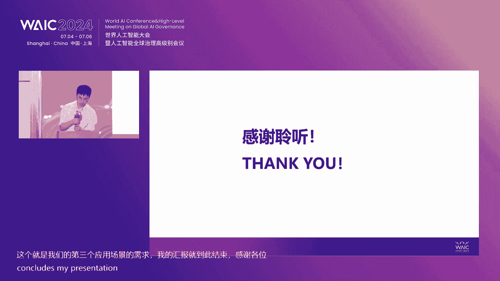

# P45：20240706-人工智能赋能产业融通发展论坛 - WarrenHua - BV1iT421k7Bv

尊敬的各位领导，各位来宾，大家上午好，欢迎莅临2024WAIC人工智能赋能产业融通发展论坛的活动现场。我是上海理财频道主持人徐瑞。😊，中国科学院的外籍院士图灵奖获得者克伯特西蒙表示。

人工智能啊是计算机科学家的目标，是数学家的梦想，它是哲学家的希望，是心理学家的挑战，那也是自然科学家的敬仰。而我国政府更是高度重视人工智能的发展，通过加强人工智能的科技创新来引领产业的融合驱动。

所以今天在此，我们特邀各位共享盛举。那首先呢请允许我为大家介绍出席本场活动的领导及嘉宾，他们是。🎼中国电子信息产业发展研究院院长张丽，欢迎。🎼中国移动研究院副院长段晓东。

那段院长呢现在正在赶往我们路的途中哈，我们也对他敬候他的光临。那第三位是中国石化胜利油田信息化管理首席专家梁耀忠，欢迎。😊，🎼中国电子信息产业发展研究院副总工程师安徽，欢迎。

中国石化胜利油田数字化管理服务中心主任段宏杰，欢迎。🎼中国移动研究院测试中心副总经理刘伟东，欢迎。🎼国家电网客服中心信息运维中心副主任李子乾，欢迎。🎼中电誉创智能科技有限公司首席技术官樊绍胜，欢迎。

🎼中电誉创智能科技有限公司副总裁盛亚明，欢迎。🎼再次欢迎各位来自央国企机构的嘉宾。🎼那么同时呢出席本场活动的人工智能领域的嘉宾有机器之星创始人兼CEO赵云峰，欢迎。达摩院决策智能实验室总经理刘乐，欢迎。

🎼百度智能云副总裁郁友平，欢迎。🎼再次感谢各位的莅临和支持。那在此呢，我们首先有请中国电子信息产业发展研究院院长张丽致辞欢迎。😊，🎼尊敬的各位来宾，各位专家，大家上午好。

非常荣幸在世界人工智能大会的会场与来自业界的各位专家共同探讨人工智能赋能新兴工业化，促进产业融通发展这一课题。工业是一个国家经济发展和社会进步的重要基石，是立国之本、强国之基。

工业化是一个国家经济发展的必由之路。习近平总书记在2023年全国新型工业化推进大会上就推进新型工业化作出重要的指示。指出了新型工业化是推进强国建设。民族复兴的关键任务。人工智能是新一代信息技术的尖端。

是推动新一代科技革命和产业变革的重要驱动力量。经济的高质量发展，产业的转型升级离不开人工智能技术的高效运用和不断创新。人工智能赋能新型工业化，任重道远，也大有可为。

赛迪研究院于2019年获工信部批复建设人工智能场景应用与智能系统测评工业和信息化部重点实验室。致力于人工智能在工业领域的研究工作。这5年来。

我们与产业界学术界的伙伴们携手积极探索在新型工业化的发展要求下，人工智能落地应用的新路径，并取得了一些初步的认识。认知和共识。一是人工智能赋能新型工业化首要在产品。我国是人口大国。

也是消费电子和科技产品的大国。随着人工智能技术的逐步成熟，在手机、电脑、汽车、无人机乃至机器人等重要科技产品中广泛的应用。语言识别与合成物体检测、动作规划、实时推荐等已经成为产品的主要亮点。

乃至核心功能。一大批通用人工智能技术芳心未艾，为用户塑造日新月异的生活体验。新型工业化的发展将带来一批新的产品、新的服务、新的体验。而造就这些创新的中国企业，也将成为未来科技生活的重要生产者。

二是人工智能赋能新兴工业化落脚在产业。工业具有规范、规模化和互换性的特性，可靠性和一致性是工业生产的内在要求。人工智能具有高效处理大规模实时数据的优势，能够跨越时空的限制，稳定高效的执行任务。

优化生产调度，提升产品良率，辅助经营决策，建设更为稳健的弹性的供应链。在产业的不同层次，多种人工智能应用与人类专家的协作，将为工业生产带来效果效率、效益的三重提升。

进一步增强我国实体产业发展的动力和韧性。为经济的高质量运行和供应链的自主可控做出贡献。三是人工智能、赋能新兴工业化未来在金融。正如我们论坛的主题所讲，人工智能具有提升产业融通发展水平的应用潜力。

在工业发展进程中，这种穿透单一场景要求和垂直行业规律的通用性技术往往带来价值体系的重构。和产业分工的调整，甚至塑造新的生产关系。在企业层面，跨行业跨领域的供应链协同与融合，需要标准明确的价值体系。

人工智能不仅能够成为标的资产高附加值的一部分，也能够成为资产价值组成的溯源工具，使得产业链上下游的企业贡献得到更均准的精准的核算，为原始创新者和中小开发者提供更开放和公平的价值分配机会。

为大型企业链大型企业链接更多活跃的创新力量。人工智能、赋能新兴工业化的工作，需要坚持系统观念，抓住复制性最强的典型案例，才能纲举目张，牵动产业链全局。因此，要不断的创串珠陈链。

推动产业链上下游的创新联动，更有持续的聚沙成塔，实现技术创新从单体智能到协同群质的质变。在个人层面，人工智能算法的通用性和鲁棒性，使其价值，往往具备基座效应。

熟练掌握AR开发技能的劳动者可以通过开发人工智能应用或与人工智能协作的形式增强和拓展自身的劳动能力，获得更广泛的工作机会，也使得智能化符合性人才，具有多种不同岗位的适应性。

产业专家节的产业产业专家间的协同性也将大大的增强。第四是人工智能工业应用效果的检验，还要回归到场景。场景是人民生活生产需要的根本来源。应用的效果要以场景中的效果为准。

我院建设人工智能场景化应用智能系统评测的实验室，也是为了以场景人工智能研究为出发点和落脚点，以解决产业界的实际问题为抓手，提升应用的实际效果为目的，与企业伙伴携手，积极推进人工智能在工业领域的深入应用。

促进产业的融通发展，希望大家加深与实验室的合作，共同推动产学研用协同创新。最后，预祝本次会议取得圆满成功，谢谢大家。啊，感谢张院长的精彩致辞啊。

也让我们了解到人工智能它将成为第四次工业革命的标配以及核心驱动力。它将带领着传统的实体经济啊，实现一个根本性的革命性的升级换代，从而来重塑经济社会发展的重大机遇。那接下来呢。

我们将举行两项重要的签约仪式。🎼首先将进行中国电子信息产业发展研究院和国家电网客服中心战略合作的签约仪式。我们有请签元代表嘉宾一起上台，欢迎中国电子信息产业发展研究院副总工程师安徽。

🎼国家电网客服中心信息运维中心副主任李子乾，有请两位签约人。🎼请两位入座。🎼并在签约本上签下。🎼签完之后呢，请两位互换签约本，并在本上再次签上双方的名字。🎼好。

那么我们也感谢双方共同来提升了电力智能服务水平，为电力产业发展赋能，请两位起身握手合影留念。😊，🎼好，再次感谢。那我们请李主任回席，请韩总留步。😊。

🎼接下来呢将举行中国软件评测中心和机器之星战略合作的签约仪式，有请签约代表嘉宾、机器之星创始人兼CEO赵云峰上台，有请。🎼请两位入座在签约证书上签下您的名字。🎼请两位互换签约本。

在签约本上再次签上双方的名字。🎼好，祝贺双方共建人工智能产业合作融空生态，请起身握手合影留念。🎼好，再次感谢请两位回席。😊，那么2024年啊被称为是人工智能的应用元年。

在接下来我们将进入非常精彩的主题演讲的环节啊，那么来一起来纵览人工智能领域最新的创新的应用实践。首先欢迎达摩院决策智能实验室总经理刘乐为大家做主题演讲。决策智能在大模型时代电力能源的应用，有请刘走。呃。

今天呃我是第一个这个负责这个演讲的，然后给各位领导和来宾，然后介绍一下我们达摩院决色智能实验室，然后在大模型时代，在电力能源领域的一些应用。啊，这次演讲的三部分。第一部分呢。

首先介绍一下我们达摩院决策智能实验室的一些研究方向。其次呢就是介绍一下我们在大模型这个时代决策智能的一些新的一些应用。最后呢就介绍一下我们的一些落地的一些案例和展望。😊，嗯。

首先呢第一部分首先介绍一下就我们阿里巴巴达摩院决策智能这个实验室主要还是致力于去研究决策智能这个系统需要的一些国际的前沿技术。然后去提升业务的运营效率收益，然后降低成本。

目前我们主要实验室主要的研究方向呢是包含机器学习数学建模优化求解实预测，然后因果分析和决策方案的可解释，然后决策推理的这个模型。然后我们经过这些研究方向呢也沉淀了一些决策的一些产品。

比如说我们这个行业领先的的这个求解器智能电力预测平台。然后决策开发云平台。然后具体的这个应用场景呢，有在其实我们主要是在这个电力系统仿真优化，然后功率预测符合预测。然后内容推荐资源调度这些领域。

然后其中呢我们在过去三年的时间，在这个电力能源行业构建出来了一个预绿测能源I的这个方向。然后跟咱们的这个国家电网南方电网都有一些这个和。合作，然后也有多个项目的落地。呃。

首先呢就是简单介绍一下为什么我们去做绿色能源AI这样的一个解决方案。其实随着就是围绕我们这个电力的发出配用这个调度计划虚拟电厂，然后电力交易啊其实这些新的场景。

都是基于我们过往啊几年咱们国家在大力倡导去做这种新型电力系统。其实主要的一个新的变量呢，一方面是我们国家再去讲这个新能源，然后新能源这个呃越来越多的这个装机，然后越来越多的应用。

其实给电网去带来很多的这个挑战。其次呢就是咱们电力电力本身的一个市场化会带来这个虚拟电厂，然后交易啊也会带来一些新的挑战。然后我们呢就是在这个发出配用这几个方向呢都有一些落地和实和实施的一些经验。

那就沉淀了这个绿色能源AI这是我们的一个呃这个初心。然后具体呢我们在这个绿色能源AI的一个解决方案里呢，主要体现在这个呃预测调度和交易这三大方向。然后三大方向呢。

其实都是基于刚才我介绍的我们决策智能实验室去积累的一些基础的能力。像这个优化建模啊实续预测啊可解释啊，决策推理的一些模型啊。然后最终我们去落在比如说呃咱们应用场景里。

就因为电电力因为电网对呃这个基础的一个逻辑，就是它需要发电跟用电的一个实时平衡。所以其实我们在发电侧它会涉及到这个新能源这个看天吃饭，它需要提前去这个预测。同时呢对于这个用电端呢，或者是需求端。

我们去做这个符合预测。因为它有一些这个新能源直接并网了，会带来很多的这个不确定性。同时呢像一些这个新能源车这个它的充电啊，这种新的这个是新的需求的这个变化，也会带来很大的不确定。

所以其实首先我们去做要要做的一个工作呢，就是需要做这个发这个新能源发电的预测，还有就是用电需求的这个符合预测。其次呢就是有了这些能力之外呢。

就是我们还需要去这个做做这个电网的这个调度调度里边呢会涉及到一些这个这个安全约束的SCCCSCED然后这个秒级调度可新调度，然后积累的这些能力，然后我们就可以知道对于大电网来说什么时间。

然后这个什么发电机组，然后他应该去发多少。😊，店这样才能去保证我们一个大电网平衡。那到了这个交易端呢，就是我们这个针对这个不同的省，它其实有这个不同的这个交易规则。然后它的这个市场的成熟度也不太一样。

其实我们就需要针对这个市场的一些信息，去做一些这个仿真优化，然后去呃针对这个不同的交易去做这个报量报价的一个辅助决策。然后同时呢，因为就是国家现在也在去强调我们要去做这个配网的这个一些工作。

然后我们也去做了一些这个虚拟电厂和微网调度的一些工作。这是目前我们绿色能源AI从这个预测调度和交易，然后从这个发发出配用几个方向，然后去做的一些这个积累。呃，再具体的呢就是我们通过过往的这些呃工作。

然后去沉淀了一些这个电力预测的这个平台啊，这这个平台呢其实主要可以去面向咱们的啊电网，然后电网呢去比如说我一个小区域的一一段这个供电的这个需求的预测，或者是我们一个区线，一个地势。

一个省甚至一个这个网调，然后它的一个区域的这个用电需求的预测。然后再有呢就会涉及到我们发电和这个电网测本身它需要用到的一些新能源功率的预测。因为这里边会涉及到这个风啊这个光呀风呀。

本身对于对于这个我们这个光伏发电来说，其实非常看这个呃这个太阳的这个辐照度，它没有云，这个发电就多点。然后有云的发电就多少点，或者是它这个有一些这个雨天啊，它这个就不发电了。

或者是有一些这个这个风风沙沙尘，它也会影响发电。那同样风风也是这样。因为风的不不确定性，或者随机性相对于这个光来说，其实。它的难度更大。所以其实我们呃为了去解决这些问题。

去沉淀了基于我们一些过往积累的一些原子能力，去沉淀了这样一个啊智能电力预测的一个平台，去解决我们这个这个新型电力系统下这个这个用电需求。和这个新能源发电这种需求的这个不确定性这个问题。

然后去支撑电力这个去支撑电力平衡。然后另外呢就是我们为了去这个解决呃我们这个很多行业，但是主要我们过往就是做的电力电力行业比较多，它的一个决策开发的一个问题。然后我们沉淀了一套这样一个决策开发语平台。

这个云平台呢，其实我们在去解决一个现实际的问题的时候，首先要去把这个实际的问题去抽象去建模建模成一个这个数学问题。然后有了这个数学问题呢，我们需要去调用这个一些这个算法。

或者是我们这里沉淀了一个优化解解去去解解决这些问题。为了我们去更好的去解决，或者是得到一个更更快更优的一个结果。我们去做了一些这个调三器啊，优化加强化的这个双决策引擎。

甚至我们还这个沉淀了一个叫这个的个这样的一个工具。可以让我们快速的去针对一个现实的问题去给出一个解决方案来去调用具体的工具。然后第二部分呢去介绍一下，就是大模型时代，我们做的一些落地的应用。

其实刚才也简单介绍一下我们过往去沉淀的一些这个功率预测符合预测的能力。其实我们现在有了这个新的这个大模型的能力的一些加持。然后我们看我们能还能往前做哪些。

首先呢其实对于刚才介绍的这个发电和用电需求的预测其实非常重要。但这里边呢就是我们其实在上游它的一个依赖呢，就是我们需要把天气预报做好，但是现在呢电力能源，它需要的这种专业的气象预报呢，它的要求是什么呢？

首先需要这个高精度高分辨率。因为尤其是对于一些小区你预测预测精度越高，你的分辨率越高，其实它能保证你下游的复合预测功率预测能做更准。其次就是更低的一个预测成本。

然后再有就是针对咱们这个这个经常会遇到的一些集能天气。因为现在可能集能天气也越来越多了。这种预测的需求也越来越也越来越迫切。然后再有就是一个更长的一个预报区间，其实我们希望。😊。

这更不只是说未来一天未来三天，未来7天，而是希望未来这个半个月或者甚至几十天能不能去预测的这个更加准。然后其次呢就是我们传统去做这种天预报，它的圈陷在在哪呢？其实我们都知道现在的现在去做这个天气预报。

主要还是基于这个呃机机理，然后基于这个超算。然后我们其实对于算力的要求非常高算一次成本也非常高。其次一个呢，就是他的呃传统的这个模式没办法去支持这种高时工分辨率的这个天预报。然后这个就会呃其次一个问题。

就是我们如何去充分利用各类观测数据，然后最终去给出一个更精准的这个预测预报的一个结果。😊，然后我们现在基于这种新的大模型的技术，我们可以做哪些工作呢？然后首先我们去做的一个工作。

就是我们去做了一个全球区域的一个联合气象预报啊，这里边逻辑呢就是呃我们都知道其实天气本身就是一个呃大气运动的一个结果，或者是大气运动的一个规律。所以其实我们首先如果想把天气预报做准。

我们应该从更大的视角，比如说一个全球的视角来去看我这个天气本身它的一个运行规律。所以我们一个基础的工作，就是要去做一个全球的一个AI模型，这当然是也是基于大模型的一个技术去做的。

然后有了这个全球气象模型呢，我们就知道一个广域空间内天天气变化的一个规律。然后在基于这种广域空间内的天气变化规律的这个模模型呢，我们在基于我们的呃一些比如说地形的数据，卫星雷达的数据和网格的数据。

我们就可以把单个小区域去做的更精细啊，更精准。这样我们就能够保证在一个小区域，然后它既能够考虑广域空间内的整个。一个全球范围内的一个气象变化的规律，也能够针对单点它的本身的一些特点，还有一些情况。

然后去把整个天气预报去做做的更准。这是我们目前在这个呃新的这个大模型时代，然后做的一个这个一个比较前沿的一个工作。啊，另外一另外一个工作呢，其实刚才这个这个第一位领导也介绍了。

其实在我们现在呃这个随着人工智能啊，随着是大模型应用越来越多。其实在很多这个呃很多这个大呃很多这个大模型领域呢，其实可可解释性非常重要。所以就是我们需要把这个可解释性，然后做的好。

我们就需要用到这个可解释性人工智能的这个技术。这个技术呢可以帮助我们去这个把就传统人工智能可解释的这个问题去解决掉，然后让专一些专专家或者是业务人员能够去理解这些实际的这些问题。😊，然后其次呢。

就是我们去呃刚才也介绍了，我们如果去解决一个现实的问题，需要经过优化建模，然后去做抽象。但是我们这里边呢去做了基于我们现在大模型结合的结合这个人物人工智能一些决策的一些能力去做了1个AI工程师。

然后他可以自动的去针对一个现实的问题，然后去给出这个直接的一个呃这个优化求解的一个结果来。然后再有呢，其实更多的领域，在我们电力能源其实有很多复杂决策的一些场景。

它传统的决策呢其实都是人来去这个通过不断的学习，不断的去积累，然后才能正式上岗。那我们现在大模型它的一个优势呢，就可以去理解和生成内容。我们就可以把传统的需要人去做的很多的工作，其实可以让机器去学会。

然后照着人的这个思路去做这种类人的这个智能体，然后去做很多的传统就是可能我们AI技术做不了的一些工作。这是也是带来的新的机会。那这里边会涉及到一些比如说我首先要学会一些这个知识，学会知识之后。

我可能还要针对具体的任务去做规划。然后规划之后，我可能其实对于人来说，他也会它跟动物的一个区别也是去使用和调用工具。那其实我们这个角策智能体也要让他去学会使用工具，并不是说所有东西都需要他做。

那最终就是我们要去解决特定的任务。😊，那最后呢介简单介绍一下我们一些落地的案例。刚才介绍到这个我们气象基于这个大模型技术的这个气象模型呢，我们其实在这个一些风速云量辐合度上。

然后相比于传统的这个模式预报都有一定的提升。这里边其实是比较重重要的。尤其是我们在一些这个光伏功率预测的下游任务里其实上边的一些这个提升。对于下游的任务就非常重要。

对于我们电电网的这个平衡或者是一些市场化发电测的一些这个呃这个经济效益就非常重要。然后其次呢在复荷端就是用在用户需求，我们能不能更好的去把握一些现在像北方或者南方一些高温天气，还有一些气温骤变。

它所面临的一些问题。这个也是一个比较重要的AI气象有了这个AI气象模型之后，复合预测也可以做的更准。😊，其次就是我们把这个可解释性继器学习用在这个复合预测和功率预测。

然后可以让咱们这个人工智能去更有可解释性了，然后更可可信可依赖了。😊，然后再有最后就是我们的一个这个刚才介绍AI工程师。原来其实我们可能都是需要有1个AI的算法人员来去这个建模。

那我们现在这个通过这种AI工程师，也可以把一个现实的问题快速抽象成一个这个有结果的问题，并快快速抽象出给出一个最优化的这个结果。😊，OK主要就是这些介绍，谢谢大家。😊，啊，感谢刘总啊。

非常深入浅出了向我们展示了这样的一个决策智能系统。它是如何来助力提升他整个的一个业务运营的效率和收益，未来可期。那接下来呢，我们要有请中国石化胜利油田数字化管理服务中心主任段宏杰来做主题演讲。

数字化赋能油气传统产业转型实践，有请邓主任。尊敬的张院长，各位领导，大家上午好。我给大家汇报的是在整个油艇推进呃数字化转型过程中的一些呃感悟啊和实践。一个说是油田，是一个没有围墙的工厂。呃。

油田也是一个劳动密集性的行业，技术性密集性的行业和资金密集性的一个行业。所以整个实际上就是我们油田号称在这个磨道石上闹革命。所以整个就是在新势气下，我们怎么个去陪动油田高质量发展啊。

这也是我们面临的一个啊重大课题。第一个方面就是新时代油田新的生产力，咱们来理解。其实我们看到就说是整个就是油田目前面临啊比较明显的，就是我们老区温采比较难，新区阶梯不足，用工总量比较多。

结构性缺氧还比较严重。国企需要运用数字化、智能化为员工赋能。业务赋能，推动我们劳动组织变革啊，这个是在新的这个条件下，我们体会啊就是老油田的新政生产力，从智能化领域来围绕三个要素，一个是我们的人。

一个是我们的工具手段，一个是我们的。面对的生产资料。从我们整个人工的变化来看，我们安时代下的新型柴油工人。从过去我们。监康手廊这种啊这种传统触发这种结构转化到我们新时代采油工人。

我们要基于整开物联网的智能，运维大数据的整理分析，无人驾驶等等啊，借助这些手段，我们变成了新时代的工人。😡，这个我们看到我们新新时代条件下，我们的生产工具，我们过去华这个都是靠我们人眼人工巡护。

那么我们现在有各种各样的工业APP地上有仪表，杆上有摄像头，天上有飞机，帮助我们推进我们整个游区的管理。😡，使我们整个尤其应该说是整个在管控模式和运行方式上有了质的变化。

再个就是我们看到我们用到的工具啊，应该说是各种各样的新技术新方法，请打造出了新的能力。度完省透明盆地地质工程一体化，从合研究，我们看探开发决策系统等等，支撑了我们业务能够提质增效，使我们整个针对看场景。

看视频，看报警，看指标，看图径，看我们的拓谱，提升我们管理的能力。😡，我们看到就是在私有行业是一个数据量非常大的行业。

我们整个都是通过借接的数据来对我们整个生成看不见的这种啊实现这个这个这个间鉴的这种判断和决策。所以我们整个在数据要求称这个大的时代背景下，我们整个就是咱们把我们的生产资料能够发挥更重要的作用啊。

在这个上面应该说是又是一个啊生产就这种劳动资料的一种变化。😡，对以我们整个这个油田看到就是我们啊也。有很大的成效啊，我们从这个大幅解人，但是我们产量还能翻翻。第二方面汇报一下，有田输给这转进路径。

我们应该说是我们45要智能油田取得实质性进展。2035年全面建成智能油田的跃经。我们转型的目标就是减人不减产，高效勘探、效益开放、优化运行绿色环保啊品牌服务。针对这个发展。

我们应该说是从我们整个生理油田的时间来看，目前处在智能油田1。0这个时代。😡，1。0主要是以自动化为核心，全业务异常管控，自动优化的油田。我们提了个2。0的概念是以智能化为特征。

全链条智能决策和一体化协同的油田。这个是我们整个的体系架构啊，是个315的这种体系架构。围绕整个这个体系架构啊，我们实际上1。0。我们大概从五个方面衡量什么叫智能用田1。0。

第一个方面就是以智能以指标异常管理为核心的缺业管控性模式啊，我们过去是管正常，我们希望外来是管异常，正常就让机器帮我们管。这样的话整体上各个专业都需要把你的这个业务的异常到底是什么要理清楚。

然后我们也整个通过这个方式提升我们对审产这种管控这种能力。😡，第二个方面是以模型共享为特征的勘探开发决策支持的新模式。我们过去都是以二维图鉴的方式啊去认识地下。

我们希望是以模型化的方式来推行围绕地下看不见的模型去做我们的工作。我们打一口井上亿，那里搞一个产能建设方案好几个亿。那这个时候这个警卫的决策和法理化就非常重要。所以我们希望是在模型上工作。

我们斗争的对象就是地下。那我们把看不见的要想法让它透明化能看见啊，这个所以在这上面。有没第三个方面，以系统化为特征的地质工程一体化的建设模式。我们过去啊应该说是这个只要找到油，应该说这是个战略资源。

我们国家是不惜一切代价的。但是发展到今天，我们需要充分考虑我们的投入和产出的问题。😡，过去我们做完方案扔盖了施工单位，他怎么干，那就是他的事情了。😡，搞法律人是不会跟他一块去打井的，现在的模式是不行的。

现在要求就是我打井的过程中，我就反馈方案的优化。所以这个过程中啊，大幅度提高我们的经济效益啊，这是一种新息的工作模式。😡，第四个方面是以控能架态为核心的绿色生产协同管控的一些模式。

呃3060国家提出这个战略以后啊，油田是个能耗大户啊，我们一年用电大概在现在是50多亿度电。那就说我们整个这个能耗这么大，我怎么能够管控住。刚才在大里讲，我们整个这这个啊这个店里应该是调控方面。

我们也面临各种新能源的接入，各种这个电力的优化，啊，我们提出了要望河处能源管控体系，对整个这个这这个地方要搞传统手工是无法实现的。我们下一步还要做这个碳耕种啊，这个碳交易，也在这个领域潜力也非常大。

第五个方面是以智能算法为支撑的本质安全风险管控的新模式嗯。我们这个中石化刘总讲说，如果我们生产的现场没有人，那我们这个生产的安全本质化本身就有了大的提升。😡，所以我叫的是利用我们的人工智能真经。😡。

要实现智能化无人。在这个条件下，我们就能够把我们的风析管控这个水平提高到一个新的高度。😡，另一个方面，依据我们的人工智能大数据，我们也可以把我们经营管控的风险进一步提升。

我们大数据审计大数据这个啊季节监查，这个都是我们行的这个应该是方向。😡，而且0应该说是在一论的基础上，我们推动我们的变革，人工智能加最终加业务上一定要促进变革。如果实现不了变革，你就发挥不了效用。

我们应该从油田发展来讲，提的四个方向的变革。第一个是我们综合研究方式的变革。第二个是我们工程工益的模式变革。第三个是我们劳动组织形式的变革。第四个是我们管理模式变革。

围绕这个我们想到第二阶段要完成整个的变革，推动我们智能油田再上一个新的水平。第一方面就勘开发综合研究方式的变革。过去我们各个基层单位都有研究人员，未来整个在人工智能大的环境下。

在我们信息网络高速公路的支撑下，我们的研究人员可能会从我们分单位服务改成分专业分油厂类型的服务。话就真正的推动我们这个新的研究方式的。😡，变更。第二方面是地面地下全流程一体化协同啊。

这个应该说是我们也期望从地下到地上是个一体化的。现在我们还实现不了，我们很多还是大投入。所以在这个方面我们也需要进一步发力。😡，第三个方面是全产业控能降碳、绿色油田啊，我们要实现这个能耗的全部小暖。

现在油田大概是咱们这个绿绿电啊，这个占比能到20%左右。我们希望就是我们最终绿点占比要达到40%左右。那么我们还有很多的路需要走。我们在这个地方还需要进一步推动多多能平衡互进，源和高效匹配啊。

我们要开发热能地能啊，这个方向上应该说还需要做大量的工作。😡，第四个方面就是业城融合一体化智能运营。这上面实际上就是我们我们业务的口径和我们生产的口径往往力度是不一致的。我们怎么能够实现我们高效的运营。

这个这个里边实现三大地化一体联动，这个也需要啊我们在整个业城融合上啊推进相关的工作。😡，第三个方面要汇报一下人工智能大部分的事业。一个是呃国家提的这个人工智能这个我们油田积极耕上。

为什么要搞这个人工智能呃，大模型。其实我们感觉就是一个是交互效率太低。我们现有的应用。第二个是知识经营管理太难？第三个是不能直接。😡，应有同用的大冒险。所以我们通过几步。

第一步是让我们的孙小丽上石油大学，我们应该说是整理的相关的资料，让我们孙小丽上了大学。第二个方面，巩克一些关键技术。我们要搞尤其转眼文档多胞太解析，以解释整强的技术。😡。

我们要基于油田数据库质别成数据分析的这种技术啊。🎼通过这个我们最后推广应用，目前也给孙效利啊啊也得到了这个大面的推广。下面有个小大题，给大家简单田质，打造新智生产地。

中国石化胜利油田自主攻克油漆大模型关键技术难题，研发推广了胜小利虚拟助手，取得显著应用成效。🎼115万条游戏勘探开发专业语料，让盛小丽更懂石油专业。🎼应接入511项企业数据，143个功能组件。

全面调度企业信息资源、各种能力的大模型虚拟助手供您选择。🎼专业知识问答。🎼生产数据查询。🎼系统功能穿口。🎼制度流程解答。🎼财务指标分析。🎼安全标准检索。🎼您还可以通过定制助手上传知识数据。

🎼构建并分享您的专属助手。🎼助力质感术传，打造智能监兵。未来我们想最终建成一个工业智能，安个业务模型，一个服务平台的人工智能加油气勘察开发体系，为产业变革再天行动呢。好，我汇报就这么多，谢谢各位。好。

谢谢段主任啊，让我们见识到了盛晓丽。同样呢也让我们看到了过去时代的工人，他是如何通过人工智能家哈来转变成现在的新时代的功能，以及整体劳动资料的一个变化，让看不见的透明化。

从而支撑油田的全面的数字化的转型。😊，那接下来呢，我们有请百度智能云副总裁于友平。他分享的题目是价值有现，企业大模型应用的落地生根，有请玉总。🎼尊敬的各位领导，各位嘉宾。上午好。

非常高兴在这里跟大家分享百度智能云在过去的这一年以来，在大模型的这个落地应用方面的一些这个心得吧。😊，这个2024年的是大模型。应用的元年。

其实大家可以看到这个大模型正在企业的从这个管理、销售、营销到生产等各个环节的这个落地。包括刚才前面的这个段主任想在胜利油田的这个盛小丽。对这个我觉得做的是非常非常好。对。

这其实可以看到呃已经把大模型在企业的这些方方面面都已经这个给落地的。这个非常的深入，而且产生了非常好的价值。那么百度智能云呢呃提供了从这个ispass，然后到ss的这个全方位的。这样的一个能力。

那么我们在这个我们在层呢有这个我们叫这个白格，它能够这个融合各类的这个GPU算力，提供一个整体的一个异构算力的一个平台。然后在这个pass呢，我们提供了千翻，既有model build的。

也有这个呃就是也有那AP build的这样的一些平台工具，帮助企业呢能够把各类的这大模型应用啊，就是把各类的这大模型本身可以进行这个微调，然后托管，然后推理等等。

然后再往上层的这个呃这个AP build可以帮助企业呢利用这些大模型快速的去开发能够使用起来的这个应用。因为大家都知道对吧？这现在是这个应用的一个关键的时期。那么再往上层呢。

其实是呃我们百度智能云面向弊端推出的一系列的这个大模型的实际的应用。那么这些应用呢，它结合了业务场景啊，然后呢把这个业务场景的需求，通过一个应用系统去进行提供啊，那么我今天呢主要是呃给大家去介绍。

我们在这个企业的通用的这样的一些营销啊，然后这个企业的知识管理啊，然后还有像这个销售的提升方面就做的一些工作，包括一些产品的情况。那么说的这个企业去应用这个那大模型呢，其实最核心的还是这么几个作用。

第一个呢还是要这个增收。第二个呢要提效啊，这其次呢要降本。但最后呢还要符合这个合规的要求啊，那这个在我们看来呢，就是对于一个企业来说。

这个就是这个知识管理客服和营销这几个场景是我们看到就是企业通过大模型去实现增收提效的一个最佳的路径那么为什么这么讲呢？

因为我其实跟不少的这个企业的这个CCO也这个经常交流对吧这大家经常问我的一句话就是这个现在大模型这么火。那大模型现在用来干嘛？对可以直接带来这个什么样的价值。

其实我个人是认为这个就这知识管理就是一个首先可以拿到结果的这么一个场景。其实从刚才像盛小丽对吧？我看他做的很多工作其实本质上也是把这个胜利油田内部的大量的这些企业的这内部知识啊进行了一个。

非常充分的一个整理，然后一个应用。这其实就是一个做的非常好的一个方面。对，那么百度智能云呢这个像我们呢也推出了一个叫针织这样的一个产品，我们把它叫做这个超级知识观。

它其实确实也是国内首个大模型全面重构的一站式的这个知识管理的平台，因为其实在没有大模型的时候，其也有知识管理，这只是呢它的这个管理呢相对来说呢，这个比较的这个粗糙。比如说它的就是这个知识其大量的孤岛。

然后它的这个包括运用的这个效率也非常低下。然后其实对数据本身的这些权限管控非常的复杂。而且像过往的对知识的这个应用也就是一个比如说企业内搜而已。那有了大模型之后，它其实可以带来很大的不一样。

比如说我们可以把各类的企业内部的各种。😊，就是这个相关的这些的知识系统这个进行一个接入。然后呢，在这种基于大模型之后的这个数据的加工的这个能力，其比过去至少是10倍，甚至百倍的这个效率的提升。

然后呢同时还可以基于这样的一个高效率的加工提供一个完整的这个权限的管理的能力，最后再加上我们不仅是由企业内搜，对吧？而且更重要的是有这种对话式的一个问答的这个方式啊。

包括这个数据的一个这种问答式的方式的获取。然后各种复杂的这个知识的获取，甚至一些这个个性化问题的推理。这些其实都可以在大模型的场景下面来这个实现。那这样的话。

企业的这个知识得到一个最大程度的一个激发沉淀和应用。那相当于给每个员工的身边都安排了一个专家级的员工。那这样的话，企业的这个效率的提升。

就是显意见的那同时呢这个我们过去企业内部的大量的这个应用系统其实都。存在这种呃，就是。这种的烟囱式的一个建设，包括这种相当孤岛式的一个情对那一个情形。那么基于这样的一个这大模型的一个统一的一个调度啊。

然后统一的用自然语言就可以去进行一个这样一个去进行问题解决的时候，那么就可以去建立大量的这样的各个业务场景，包括办公管理的这些助手。那么其实这个其实这些助手在企业内部里面。

他既能够把企业内部的这个知识进行一个完整的应用。同时也能把企业内部的流程去进行一个很好的这样的一个综合的使用。因为企业里面的这个最核心的这个两个方向，其实无外乎就是知识和流程。啊。

那在这个大模型的这个背景下面，把知识和流程这两个要素，其实都能够完整的进行整合。其实我刚才看到像胜利流程的这个盛小丽，其实他就是这么做的对，所以我其实觉得这大家呃这都可以这更多的去参考。但时间原因。

我这边没有。法去介绍更多的案例。比如说我们跟那个太康保险，我们帮助他去把他全公司的这个大概有这个接近10个应用系统的这个知识都进行介入。然后帮他建立他整体的一个知识应用的一个框架。

那帮助他的每一个他全国的几十万的这些保险代理人的身边都可以相当于做了一个保险专家帮他们去提供服务。所以他不仅是这个员工的这种效率更高，而且面向最终的客户的服务的体验也明显的提升。对，那这是第一个方面。

对那么第二个方面显而易见的就是大模型可以带来的一个这个增值，就是在这个智能客服的领域。对我们把在这个方面叫超级客服。对我们也推出了像客月这样的一个在国内首款大模型全面重构的这个智能客服的一个产品。

因为我们知道现在其实我们平时在生活中跟智能客服打交道啊，并不少见。比如说我们跟运营商跟航司，我们经常打。电话过去的时候，可能首先都是智能客服，现在接起你的这样的一个这个咨询。然后呢。

这个智能客服呢解决不了，再然后转人这个客服。但是大部分情况下面，他对吧？其实大家可以遇到的情况是吧？就很多情况下，你稍微复杂一点的问题，其实可能现在的智能客服都还解决不了啊，那有了大模型之后。

这个问题就可以有一个很明显的一个提升。对对于这个人的这种呃这个问题的一个理解能力。然后包括回复的这种拟人度，包括一些专业问题的一个呃，就是这些复杂问题的一个解决的程度，在有了大模型之后。

都有非常大的一个提升。😊，但这个地方有一个也要需要注意的点，就是呃有些人可能认为说有了大模型之后，这智能客服是不是一夜之间。

就可能变得都跟我们平时去用一个这种比如像文心一言的APP啊之类的这种to C端的这样的一个问答型的这种APP一样的。但其实我要告诉大家并不是这样子的。

我们其实跟业内的很多做智能客服的这个这个这个同行都交流过，有了大模型之后，对吧？比如说这种回答的这种那可用性，如果不去做专门的一个的一个金条或者说做专门的一些这个优化的话，基本上这个可用性。

也就是达到百分之四五十的样子只能解决就是他的这个这基本处于一个不可用的状态。但是在这个基础上面，我们包括对在智能客服这种场景下面的一个强约束。

而且低容错率的这个场景下面的很多的这种场景问题去进行逐一的优化之后，提升到百90甚至95%以上都是。完全这个没有问题的。嗯，比如说我们在跟这个上海的某家著名的这个航司啊，我们去帮他去解决。

比如说一个非常简单的问题。比如说这个客户他去做航班的时候，他能带多少行李，像这过去的话，我们在一个这种智能客服的场景下面是没办法回答的对他其实非常简单，就是你帮比如说你去做一个航班的时候。

他需要带多少行李，其实他有很多因素，比如说取决于你要去什么地方，你做的这个航班的比如说你的仓位是怎么样，包括你的这个比如你是老人还是小孩等等，对吧？他有一系列的规则，像过去的话。

你如果只是让智能客服去回答他是回答不出来的。那么现在呢就是把大模型的这种推理能力，然后包括整体的这种计算能力把综合应用之后，那这智能客服就可以去解决这类的这个过去的这个传统的智能客服所解决不了的问题。

所以呢这个其实智能客服要实现智能化呢，他本身智能客服，他的这个他其实有很多细分的场景。比如像我这边列到的对？比如说有这种做这个引导的，有做。这个就是这个客户的转化的，有做服务的，甚至还有做分析的。

每一个角色，其实在大家去想象一下，每一个这样的一个服务的角色都有他的技能。那么这些技能都可以通过这种智能体的方式去进行一一的这个构建。通过每个智能体的这样的这种逐步的构建之后。

那可以使得我们的这样的一个这个智能客服的这个能力，对吧？就真正能够达到一个可用的状态。所以现在这百度智能推的客这样一个产品，基本上是已经在很多的这个客户里面都已经在这个落地了。这基本上只要用简单的几步。

就可以基于已经搭建好的这些垂直的这些场景的这个智能体去快速的把智能客服把它做出来。但随着这个大模型的应用，我们同时看到还有一个非常重要的一个产品。可能大家越来越多的也有介触到就是这数字人。

对那么百度智能人也推出啊，就是叫西宁这样的一个数字平台，这也是基于大模型去进重新的一个重构。对那么数字人呢其实他本身。😊，就是一个这个超级主播。对，当然在就过去这个数字人呢，他存在这种这个制作周期很长。

成本很高，应用也很难的一些问题。对，那么我们在这个过去大概在6月底对吧？我们推出的这个新的心灵的这个3。0版本，我们能够包括这个一句话，十0分钟就能够生成这种3D的数字人。然后呢。

包括这种分钟级的这个视频的素材上传之后，我们小时级别就可以生成这种高清的两D数字的分身。那么为什么在这个现在的人工智能尤其是在大模型的这个背景下面，我们要去讲这个就是数字人呢，因为其实数字人它本质上。

就是呃那么或者说这大模型本质上它其实就是以一个拟人态的方式这出现的但是它没有形象。对，但是有了形象之后，可以使得整个大模型的这种呃这对话型的一个应用的一个效果吧？包括这种亲切感有非常大的一个提升。

当然呢现在像过去的这个数字的应用门槛比较高。所以我们过去段时间呢让这个就是这个数字人这个分身，包括3D数字人的这制作的这个成本跟时间都有一个非常这个大幅的一个这个下降。对。

如果有一天对吧这个我们的这数字人能够真的是在各种对话场景下面都能够普遍的应用。其实我们像过往的这个文理宣传视频制作直播带货这数字代言人企业的导购等等这些营销和销售的场景都可以用数字人重新去重构一遍啊。

这其实是已经正在这个发生的一些这个事情。对，当然呃就稍微做一些总结，就是这个在大模型的这个时代，怎么把AI怎么把尤其是大模型为代表的这个AI的这个能力用到我们企业内部去。我们认为有三点这个关键的要素。

第一点就是还是要围绕企业的业务场景。这个确实如果说没有应用场景，没有业务场景不能产生实际的价值，这个大模型确实他这并不见得有什么实际的应用。对，这是第一点。

所以呢前面讲到的这几个场景其实非常典型的通用的一些场景，这个也可供大家去参考。当然还有很多这个垂直的一些应用场景对？包括前面讲到的包括前面两位嘉宾这讲到的场景，我觉得都是非常好的。

然后呢还有就是数据与知识的驱动。因为即使在大模型的时代，数据与知识，仍然是企业最核心的资产。那么这大模型的应用应该帮助企业去激发它的数据与知识，同时呢能够沉淀企业的数据与知识。

然后形成企业的数据与知识应用的一个这个正向循环啊，最后一点就是要人格化。因为大模型本身就是以。个人格化的方式出现的啊，同时这个人格化呢，这个现在它不仅仅是有一个呃这个很好的一个灵魂跟思想。

同时呢在皮囊方面，对吧？在这个他的这种表现力方面，由于有了数字人，甚至未来有像他巨生智能等等这样一些实体的呃这种人的形态之后，那么大模型的应用的空间，一定会这个更加广泛。对。

所以呃那百度智能云呢作为一个以这个人工智能为核心的这样的一个云和AI的平台啊，我们坚信这个深城式AI将会带来无限的这个应用可能。我的演讲就到此，谢谢大家。好，感谢玉总。

那今天啊我们论坛的主题的关键词是人工智能加。那刚才玉总的分享也让我们了解到了百度大模型家哈呃看到他是如何在企业端来进行这样的一个生成落地的。包括在最后呢，玉总也是总结了。说到了这个大模型应用。

他要围绕企业的业务场景。那就是我们应用的实践落地生根了。第二呢，大家还记得吗？就是刚才玉总所说的，他要进行整体的这个数据和知识的驱动以及最重要的灵魂的点击之笔，就是要让大模型人格化。

所以再次感谢玉总的分享。😊，那么接下来呢，要有请中电预创专家孙成做主题分享。人工智能推动智能化运维，有请孙总。呃，尊敬的各位领导，各位嘉宾，你们好。呃。

我要与大家分享的是人工智能推动智能化运维这样一个主题。那么分享的内容呢主要有3块。第一块呢是电力运维的一个现状，也是我们中建预创近年来啊在电力行业做人工智能的一些感悟。第2块呢。

讲人工智能与运维的一个有机结合。最后呃，也是我们预创啊一直期待的就是智能化运维的一个未来的展望。呃，首先第一块。电力运维的一个现状。目前传统的电力运维啊，主要有如下的。3块痛点。

首先是数据处理能力不足啊，传统的运维模式下面数据量比较庞大，并且。在生产管理的过程当中，他的数据。往往是由结构化数据和非结构化数据交叉形成，分析难度极大。同时。

又由于各个电力行业公司的这个建设历史情况啊和发展参差不齐，他们的信息化建设发展也不同不一致。那么各种业务管理系统啊，它的数据割裂情况比较严重，也就是啊，我们经常提到的烟囱式的数据啊。第2块。

故障的预测和定位比较困难。目前，电力行生产过程当中的故障预测依然非常的依赖人的经验啊，人为的因素影响非常大，并且。正因为是人去进行故障的诊断，那么他的响应速度一定是比较置缓。同时。这个故障的诊断。

它本身就是一个难题，更别说是故障的预警，在电力行业尤为突出。第三，人力资源的成本啊逐年攀升。因为电力行业也在不断的发展，也在不断的进步。那么针对这个行业的知识库也在不断的更新。

对于人才的素质要求也在逐年提升。同时，电力行业是一个工作场景，很多都是条件艰苦，甚至伴随着一定危险性。啊，那么人才的流失也啊对这个运维的质量造成了一定的限制。要实现。这样的一个局面的一个转变。

智能化运维是一条必由之路。但是智能化运维我们中间预创探索的这些年也遇到了不少的挑战。首先。运用智能化运维在电力行业，他需要的是规模化部署。这样的一个严肃的行业。

他的规模化部署一定是具有高效可靠的自动化工具。并且。要做到与现有的业务系统进行有机的融合。嗯。这样才能逐步的扩展智能化运维的覆盖范围。第二，传统的运维人员，他的一个技能转型。

他不不将仅仅局限于原有的电力行业的专业知识，它同样必须要具备啊先进的智能化、人工智能的相关的技术手段。那么人才的短缺。也会限制着智能化运维的推广速度。第三。电力的生产工作场景。啊，它是多样化的。

并且人工智能在推广落地的过程当中。这些场景的泛用性啊，它的这个普适性又很难做到统一和一致。那么就需要针对不同的场景啊，去定制不同的行业标准，这样更有利于啊我们这个智能化运维的推广和普及。这是。

第一部分我要介绍的。并为现状和革新的啊一些思考。第2块，人工智能与运维的一个有机结合。这一部分呢，主要讲的是呃，我们中电预创是怎么思考啊，思考怎么将人工智能与电力行业做一个有机的融合。

怎么让它服务到电力行业。首先，人工智能。他在电力行业的一个应用啊，其实大家已经啊看得到各行各业都已经绽放了花朵。尤其在电力行业其实已经有了不不少这个经典的案例。那么它的一个效果。

运用人工智能进行结构化非结构化数据的一个处理分析，快速的诊断故障和预测，减少人工的干预啊，进而提升这样的一个运维效率。第二，他替代了这个高技能的运维人员，降低了对人的依赖啊。降低了运运维成本啊。第3块。

在电力场景的高风，尤其是高风险的作业场景啊，用智能化的运维设备、智能化设备去替代人力啊，实时监控生产状态，及时发现异常异常并预警。啊，同时将突发事件进行这个辅助决策。啊，提升电力生产的安全性啊。

这是人工智能的意义。那我们中电预创是怎么做的呢？我们中电预创认为。在电力场景做智能化运维。第一部分，首先是在各个场景啊，各项的工作必须要有一个智能化的前端设备。大家也都看到。

这是近年来我们公司中电预创在各个场景孵化的这样的一个机器人大家族。啊，其中不乏啊这个你像输媒系统啊，巡这个升压站啊，包括配电房等场景的巡检巡检类机器人啊，还有在升压站的这个绝缘子清洗啊。

中压开关柜配电配电柜的作业机器人。甚至到作业监管环节的这个作业监护呃，生产安全机器人。啊，我们将各个场景进行深度的挖掘探索。有了这样的一个智能化的一个前端。必不可少的是，他也要具备1个AI的后端平台。

那么中建预创在这一块的思考。针对全局管控啊，我们这个以集团化部署啊，统筹管控的思想设计这样的一级一一级的管理平台。那么针对单场甚至单个场景啊，我们有着区域的管理平台这样的一个二级部署。

那么进一步的各式各样的机器人，怎么在协同作业的过程当中啊，综合调度，综合调控。那我们融入了物联网思维，进行了一个机器人管理平台的一个设计。这样的一个三级部署啊，可以面面对所有的场景。同时。

我们在这样的一个后端平台的建设过程当中，积极的与我们的用户单位进行沟通，与现有的业务系统进行对接，打通这样的数据壁垒，真正的贯穿到整个的管控业务当中啊，从全局区域智能终端多个维度，结合大数据分析。

形成这样的一个运维大脑。这是。呃，将前端的这个智慧智慧这个机器人与后端的平台进行融合。一个典型的边端结合的一个架构。那么这样的一个架构，在电力行业尤为的适合。那为什么呢？电力的场景啊，它往往有一个特点。

它的很多生产场景往往不具备良好的通信系统，尤其像新能源场景。它的很多作业场景，甚至在山区草地野外农村啊，那这样不具备通信场景的的情况下，我们要进行及时的数据传输和处理。

就需要我们的机器人自己具备一定的边缘处理能力，对尤其是非结构化数据进行分析，形成结构化数据通过数据传输进行有效的分析处理辅助决策。啊。背后呃，中间预创啊对于智能化运维的一个未来的一个展望。人工智能。

的发展啊一定是它的核心要素，一定是科技的发展啊，其中不乏两个方面，第一是底层算力的革新啊，尤其是GPU算力的一个革新。第二是人工智能理论的发展。从导先的机器学习到而后的这个深度学习，再到自适应深度学习。

再到现在啊十分火热的大模型，每一次的理论创新都带来了人工智能应用的一次重大的革新啊。第二，电力行业智能化运维的一个发展方向。将预测性的回复进行一个广泛应用啊。自动化和智能化操作。呃。

应用的水平逐渐提高啊。同时呢呃数字化的转型。我们中信一创一直认为数字化是数字化的一个基础。啊，没有数字化作为这样的一个基础。那么智能化也将寸步难行。最后。在各个场景建立相应的行业标准啊。

有助于在场景当中进行一个这个人工智能泛化推广的一个能力。增强我们运维解决方案的一个可行性。以上是中电预创的一些思考和与大家的一个分享。好，感谢大家。好，感谢孙总的分享，让我们了解到了人工智能。

它是如何来助力电厂实现数字化智能化的转型，让智能现在就能。😊，那么在这个我们拥抱人工智能的浪潮当中啊，央国企呢，它有着产业规模大，产业配套权，并且是应用场景多的这样的一些呃诸多的优势。那么接下来呢。

本次论坛也特别设置了央国企的人工智能场景需求发布环节，助力央国企主动拥抱AR从而促进合作行业和产业的焕新。那我们邀请到了南方电网数字集团的技术专家郭杨运，他将发布南方电网在人工智能领域的最新需求。有请。

🎼呃，尊敬的各位领导，各位嘉宾，大家上午好。呃，很荣幸有机会在这里去发布我们的一个呃项目需求。我们这个项目的名称叫做人工智能驱动的电能量数据创新应用技术研究。呃，我们整个项目包括的这样一些应用场景。呃。

在现在智能电网与数字经济融合发展的大背景下，我们希望通过人工智能的技术去深度的挖掘电能量数据的潜力，以支撑精细化的运营与辅助决策。呃，那么第一个场景是本项目呃需要运用人多模态大模型等技术。

去实现电能呃计量装置的一个故障预警与以及运维的一个效率优化。从而去提升我们整个电能量数据的一个数据质量。呃，在此基础上是第二个需求。我们希望达到一个对内赋能的作用。呃。

去聚焦用户侧的灵活响应的资源的管理。呃，以精细化调控去促进我们电网系统的整个经济稳定的运行。呃，第三个场景。是希望达到一个对外增值的这样一个作用。呃，需要去探索电能量数据，在宏观经济分析中的一个新角色。

为产业趋势洞察提供强有力的一个数据支撑。那么围绕着这三个应用场景。我们面临着这样一些人工智能的需求。第一个呃去在我们AI赋能计量运维的场景，需要通过深度学习多模态大模型等技术。

去研究基于多模态数据融合与知识运学习的一个计量智能运维的解决方案，从而去提升我们质量计量运维的一个效率。呃，第二个场景呃，需要应用继续学习的算法去分析我们用户的一些用电的行为。呃。

应用OIAIOT的技术，去融合我们的物理世界与数字孪生。呃，从而去支撑我们用户测的响应资源去高效的去协同。第三个应用场景主要是想整合我们的大数据与生成式人工智能，去研究怎么基于电能量数据的产业发展态。

是感知与分析的报告自动生成的这样一个方法。呃，那么我们整个项目具体的实施的合作模式是采用呃政府引导加企业主导，加高效科研加用户参与的这样一个多元化的合作模式。

去整合我们政策的支撑技术研究实际呃实践的应用与整个市场的需求，形成一个协同创新的一个网络呃，预期的进展。第一年是主要集中于需求的调研呃，技术框架的设计以及技术平台的搭建。

第二年是希望进入我们整个技术的深化呃，系统的集成与整个呃示范应用的阶段。第三年是希望推广成熟的方案。呃，大规模的应用，并且持续优化呃，分享整个呃成成果和经验。呃，我们项目的一些预期成果。

预期去构建一个及智能运维呃精准的呃符合管理以及产业趋势洞察为一体的这样一个电能量数据的应用生态，希望达到提升我们整个呃电能计量。运维效率20%到30%，符合预测的精准度提高至90%以上。

然后用户测的一个响应效率提升25%，才能够实现为政府为企业提供定制化的一个呃能源消费分析报告与产业趋势的一个预测。呃，从而最终达到促进我们能源结构的优化与经济社会可持续发展的这样一个目的。呃。

那么接下来我将详细的介绍一下呃，包括的三个应用的场景。呃，第一个应用场景就是AI如何去赋能我们电能计量运维的专业。呃，刚刚那个孙总其实也介绍了我们电力运维的一些问题。

然后这里我想聚焦到我们自己的一个电能计量的这样一个运维专业。在电能计量的运维专业目前面临的整个问题是现在的一些异常识别的模型，存在着准确率低腐实性差，缺乏可解释性的问题。

那么就需要呃借助我们现在新出来的这样一个动模态大模型的技术，借助它动物态大模型的一个跨模态的一个信息融合，以及它的一个高效推理的能力，从而去提升我们电能计量装置的一个状态感知以及故障的诊断能力。呃。

从而实现面向计量装置，从安装规范的一个实时检测。它的整个运行状态的一个精准感知。呃，整个出现故障之后，故障根因的一个智能分析，再到现场运维的时候，一个实施辅助。这样一个全流程的计量运维的需求。

从而去提升一个呃更为高效精准智能化的解决方案的框架，从而促进我们电能计量运维，从传统的运维模式向智能的运维模式转变。呃，这可以看到传统的运维模式，呃，主要我们现在也有一些运行状态的监测。

但是呢现在运行状态的监测主要是基于一些单一的算法。那单一的算法判断规则就不准确。它的普实性也没有这么差，那没有办法去适应一下我们多的这样的一些故障的场景呃，第二个主要的问题是传统的异常识别的方法呢。

只能去识别我们现在的异常状态。就是他到底是现在是正常还是异常，但是没有去办法去判断它到底是呃什么原因导致的它的异常。第三个是现在的异常识别的结果其实是缺乏可解释性的，我就只给出来一个正常或者异常的状态。

那么就不利于我们运维的人员去去理解呃，以及采纳我们给他的一些建议。呃，现在就是在线监测，如果发现问题之后，会进行现场的一些检查。那现场进行检查主要是也是依赖人工呃。

人工去确认我们计量的装置安装是否有问题，效率是很低下的。那么现在我们希望达到一个呃智慧的智慧的运营的这样个模式。我们有很多现场采集的数据，我们有很多我们的智能电表采集的数据，包括我们的功率。

我们的电流电压，我们的一些冻结的表码。然后我们现在其实有一些专家模型正在做这些呃异常的判断，包括我们会做线准分析，我们会做电能表的一个状态评价，以及我们会进行一些尾切漏电的分析。呃。

这这个是数值型的数据。另外再结合一些我们文字类的数据，就包括我们一些历史的一些运运维的记录。我们专家梳理的一些经验，包括我们计量装置的一些技术规范，这样去融合我们这样有图像信息，有数字信息，以文字信息。

这样一个呃多模态的这样一个信息的数据。呃，把它输入到我们的这样一个多模。大模型，它作为一个能力支撑。最后我们去开发1个AAI计量的运维的这样一个智能体。

这样我们就可以达到呃不仅仅是输出我们整个诊断的结果它是正常还是异常。我们还会去呃输出我们异常诊断的一个呃判断的依据。我们可以去输出我们这个故障的一个呃根的呃呃最根源的原因。

以及输出对应的怎么去做这个处置建议。那么当我们的工程师去到现场进行运维的时候，还可以结合呃工程师现场获取的一些图片，或者一些更呃精细化的一些数据来去给他做一个云边协同，呃。

去进一步的给出他现场处置的一些建议。呃，这个是我们的第一个应用场景需求。我们的第二个应用场景需求是AI去赋能我们的符合怎么做精细化管理。呃，我们知道在当今这个能源转型的干关键期。

电网系统承受着新能源的一个大规模的接入和用户多元化需求一个快速增长的一个双重压力。呃，其实供需平衡的挑战时进一步加剧的呃，这个就对我们传统的一个符合管理的机制，形成了一个严峻的考验。

传统的符合管理的局限性呢，主要就表现在调控手段很单一。我们的响应比较迟缓。呃，难以精准的去匹配我们这样一个日益多样化的一个用户的用能需求。而我们波动性的一个能源供给的这样一个问题。

因此呢我们就希望借助人工智能的技术呃，去实现用户侧资源的一个高效整合与灵活的调度，去突破用户侧灵活互动资源的评估呃。

符合的一个预测及过载的预警以及资源聚合与调度策略的生成以及以及用户侧资源的一个协同互动。等关键的技术，从而去推动我们的一个符合管理，从刚性的调控，向柔性互动的这样一个精细化管理模式去转变。呃。

具体来看的话。在我们的用户侧呃互动资源评估这里，其实现在我们有很多用户侧的灵活资源。比如像我们的公共呃建筑类，我们可能会有一些建筑楼宇，我们有储能电站。然后我们现在说的我们的车装网去互动。

怎么去结合新能源的电电动汽车进行跟电网的互动。还有我们工业园区，怎么去跟电网互动，包括我们一些分布式的能源，我们的一些符合聚合商，这样的话我们就能够达到一个用户用户测的灵活互动资源的评估。

主要的研究内容，就包括我们的要进行一些呃可调的符合的辨识，以及它具体的响应能力的评估。再有这个符合辨识基础上，我们希望能够实现整个符合的预测，就包括用户测符合的预测。

还有一个分级分测分级分分层分级的一个过载预警。我们希望达到我们的馈线，包括我们的区域，是不是他会有一个过载的这样一个预警，来作为我们去进行调控的一个信号的来源。呃，再有这个符合预测及过载过载预警的。

这个基础上，我们希望能够做到整个符合的调控以及那整个符合的聚合呃，以及调控策略的智能生成，这需要针对响应的资源进行灵活的去进行进行聚合，并且呢去调控呃，进行我们这样一个智能调控策略的生成。呃。

最后是实现我们用户侧资源的一个协同互动。然后这这也就结合到我们的一些呃AIOT，包括我们怎么用物联网去进行我们的边缘设备的控制，来达到一个调控符合的一样这样一个作用。嗯，这个是我们的第二个应用场景需求。

呃，第三个应用场景需求主要是AI怎么去赋能我们的呃电力看经济。嗯，主要是为了响应国家数字政府的一个战略的需求，充分去发挥我们电能量数据洞察经济发展的这样一个风向标的作用。

为数字政府经济运行提供强有力的一个数据支撑，又需要常态化的去开展。针对特定区域特定产业的一个用能监测及分析，从而去支撑我们政府去做一些决策的参考。呃，但因为呃此任务的一个复杂性啊。

当前我们做这种产业用能分析的话，仍然是高度依赖人工的效率比较低下且分析的深度不足。呃，因此呢我们是希望去借助我们深成式人工智能呃，去驱动我们的产业用能分析。

呃希望基于我们的大模型技术去构建一个产业用能分析的智能体，从而去实现全面自动化的这样一个用能的分析。呃，它能够涵盖到我们从数据的检索数据的处理，数据的分析到最后的它的一个用能分析报告呃。

自动撰写这样一个全流程的过程。从而去提升我们产业用能分析的一个协同和和深度。呃，这里是大概介绍了一下就整个可能的实现的路径，就包括我们有很多的数据源头。我们有一些我们自己的呃产业用电数据。

包括一些呃外部的宏观的经济数据，一些行业研究的报告，包括一些相关的新闻资讯和政府的一些政策文件。呃，这些作为数源之后，我们可以放入到我们这个产业用能的智能体里面。

它会就进行一个我们现在说的一个多agent协同的这样一个呃工具里。然后通过呃多 agentent协同去辅助的去编撰我们的整个产业用能报告。呃，大概会呃，这里举了一个例子，可能说他会分成不同的章节去写。

然后不同的章节呃，他会有一个主要的角色作为整个章杰的撰写的负责人。然后他会去做具体的任务的分解。呃，这个其实呃刚刚也介绍过，就是整个agent的呃这样一个工作流程。他可能会进行呃具体的一些呃。

基于他的逻辑推理能力去进行任务分解之后，去实现一些调用工具的能力。最后呃把这个多个任务角色的一些成果进行一个汇总，反而就达到我们这样一个呃产业用人报告，自动辅助写作的这样一个功能。呃。

这个就是我们的第三个应用场景的需求呃，我的汇报就到此结束，感谢各位的聆听，谢谢。😊。

好，谢谢郭阳韵先生啊。那么会后呢，如果是对南方需求刚才发布的这个电网和发布的需求呃，有兴趣的朋友呢，可以联络我们现场的工作人员。😊，第三。的演讲。有请中国移动研究院副院长段晓东为我们带来主题演讲。

中国移动智能算力与AI大模型实践，有请段院长。

好，那个尊敬的各位领导，各位来宾，大家上午好。因为快到中午了哈。非常抱歉哈。因为这个行程安排和天气原因哈，那个我才能刚刚赶到会场啊，咱们形程调整了一下。那么我是来自中国移动的段晓东工作在中国移动研究院。

那么下面代表中国移动哈，给大家做一个AI加载汇报。那我的题目是推进AI加实创新实践，开启数字时代的新篇章。😊，那毫无疑问哈，这是一个加速走向智能时代的一个时代。

那么我想哈数据算力和AI啊都成为我们新的生产力非常重要的驱动。那么中国动网也高度重视哈新的生产力的发展。那么我我们也给AI数据和算力哈，做了三个定义哈。我们这AI是整个会成为人类新的生产工具。

数据会成为整个新的时态要素。那么基础算力它会成为新的能源，作为三次能源这个典型的代表哈，这一起哈推动我们整个社会哈加速走向智能社会，为整个数字经济哈和科技进步哈提供无限的可能。

我想我们也高度重视这个AI的发展哈，那么中国移动啊应该说是也精准的定位了我们叫做新三者的1个AI发展战略哈，把括我们作为AI整个AI转型，作为整个公司非常重要的发展。😊。

可能如果参加过之前我们的各种会议哈，无论是最近的福州会议。上海会议哈。好，都先后哈发布了哈各种各样的人工智能的发展战略哈，能够希望哈作为智能时代哈，作为人工智能的一个主要的供给者。

那么我们提供了三个者哈，第一个叫供给者，那么我们要提供大算力大模型大数据哈作为供给者。同时我们要作为汇聚者，我们要汇聚优质的这个数据要素哈，能够开放各种能力，同时带动我们国产化发展哈。

把咱们国产的能力哈，能够发挥到极致。同时也作为运营者哈，能够提供AI加的一体化的运营服务，同时发挥哈AR加的赋能作用，能够服务千行百业。那么我想这三个定位啊，是中国移动面向智能时代哈。

从加AI到AR加加速转型哈，我们给自己提供的一个使命和定位。那么希望发挥供给者汇聚者运营者哈三者的能力哈，能够助力我们AI时代的高速发展。那么说了这么多哈，大家肯定也比较关心哈。

那么应该说中国移动哈陆陆续。😊，最近集中力量哈发布了很多我们的AR加的战略，包括各种能力哈。我这边列举了一些，包括昨天下午哈我们用AR加的主论坛也发布了哈，包括5个100等等产业合作计划等等。

最近也先后发布了面向交通啦，向各个行业的人工智能这种能力。那我这边列举了哈几个比较典型的。最近我们发布的AR加的一些能力。比如我们打造了哈多个万卡智算集群，希望哈能够以多个万卡能力哈。

服务整个大模型的训练和孵化。包括我们也研发了哈以9天为品牌的通专结合的千亿级的中模台大模型已经正式哈向各个行业哈提供服务。同时我们也塑造了哈以一恒为品牌的大模型的评测体系。

今天下午我们也将重磅发布一横大模型评测的联盟哈。我后面也会讲到哈可能评测对整个产业健康发展也非常重要。当然我们也发布了很多比如AR加的聚生态。昨。😊。

我们公司也正式宣布了5个100的这么一个产业的合作计划。包括我们也呃在我们的中国这的北方信息港哈，开放了大模型产业训练基地，包括我们的万卡能力。我们中国这种大数据哈，都可以为大家提供各种服务。

包括已经开发了很多AI加的各种产品和能力哈。因为时间关系啊，我不可能一一概述哈，我特别举出三个哈比较典型的我们的工作哈给大家做一个汇报。我想第一个工作哈就是构建了技术领先的智能算力的万卡集群。

那么中国移动将在今年陆续交付哈，呼和浩特哈尔滨、贵阳三个万卡的集群，其中比如呼和浩特已经具备能力了，已经在大规模训练哈，我们千亿以上的模型了。后后面也陆续交付哈。

那么应该说哈我们这个呃这个万卡集群哈也是基于咱们国产生态能力一个比较稳定的哈在计算存储网络平台训练等方面哈。😊，全站引入先进技术哈，而且能够保持长期高效的运行。

而咱们国内少数几个比较成熟的这个呃能够运行千亿大模型的一个平台，中间也引入很多技术哈，那么包括我们比较自豪的，我们比如最后一个全德路以太我们在基础的以太网方面进行了创新，引入了我们所谓的GS1。0哈。

提升了整个集群的效率，比如我们第一次引入融合存储，能够实现冷热数据的零拷贝哈，我们也实现了特定的面向任务的计算模组的加速。我们也最重要的哈是我们攻克了断点续训这个能力。大家都知道。

如果大家用过这个万卡集群发现这个故障率非常之高。我们平均5天大概就要有个小故障，平均10天就有个大故障啊，整个5天左右可能可以自愈哈，10天左右哈可能就要去干涉人工干涉哈，所以必须实现断点续训。

可能保证整个健康发展。因为这个万卡以上，实在这个技术太大了。光连接哈可能就要到1万百万级哈。😊，光模块数量非常高，任何1个IT部件出现故障啊，都会对万卡造成影响。应该说我们经过了几个月的运行啊。

攻克了很多技术哈，实现了成功交付一个技术领先的一个万卡集群。😊，同时哈我想随着大模型的算力哈越来越需求越来越大哈。我们将进入超万卡时代。

那么如何构建一个更加高效的哈长期运行的这个超万卡我想也面临着挑战这边总结了五大挑战如何能进一步提效率集群规模扩味着集群算力大家分享一个数据我们经常会发我们的背交换们网络但我们算力只有30左利用率不高所继续提算力水平提网络水平。

提出来必把算力的使用进一步。第二个是海量数据处理可能到了更大的这个万亿参数模型后，中储量达1个这个量非常何解决数据交叉拷贝问题。为我们引入融合存储解决不同的存储介质之交叉去拷贝的问题。

当然还要解决超大规模互联问题无。😊，的他的这个流量都会进一步跃升哈。我们要引入了很多新的技术来来实现这个提升。当然也包括哈千万级器件的这个维护问题。大大家可能用过，不论是英伟达的还是国产算力的哈。

这个是现在比较头疼的问题，可能坏卡率啦，包括光模块故障率非常之高。当然也包括更进一步的高密度局防的设计问题哈等等一系列工程和科学问题都面临多挑战。

这为此我们也创新提出了叫CCCC是叫做这个新型算中心技术的这缩写，我们将会继续越生哈，我想这次越生也呼换的。无论是工程和科学上都需要突破。

比如中国提出来要解决咱们国产目前在整个万卡的这个交换型的互联中的空白我们要引入多超级点技术哈，可能要引入我们的S2。0进一步将以太网的跟技术进行颠覆哈能够实现很好的交叉连接。

包括算力原生跨分训练等大规模的哈一些新的。😊，个冷却技术等等啊，可能才能构建起一个超万卡集群的一个考虑。所以我们需要做更多的整个行业哈，需要努力哈，做更多的技术创新哈。

才能逐遍构建起一个更加新的更加好的一个算力底座哈。我想这是第一个给大家汇报的哈，我们的万卡集群上的一个工作哈我们有三个万卡集群已经陆续交付哈，也欢迎大家可以一起来使用哈，一起来这个训练大模型。

那么第二个哈就是我们自身哈也在训练我们的迁移大模型。大家都知道哈，中国移动哈历行十年塑造了9天这么一个品牌和团队确确实实哈，大家都现在也很卷哈，各种大模型都有哈我们比较自豪的说哈，确实我们是全自研的。

不是基于开源的，而且确实是历经十年。那过去哈我们的网络中一直在训练这个模型。到今天哈交付起这个大模型。年底我们将进一步跃升到200B哈，同时也在启动一些万亿参数的一个训练工作哈。那么我们的这个模型哈。

😊，首一个通过了国家网信办，包括算法和服务双备案的央企的大模型哈。我们也是呃包括自主可控，包括行业增强、安全可控啊，国产生态哈都已经非常成功了。我们的模型也基于咱们的呃我呃我们基于英伟达。

也基于华为的910B哈，都实现成功了哈，长期的这个训练。呃，我们也面向多个行业哈，开始训练我们的这个行业模型已经交付了很多了哈，跟很多行业大家可能看到过新闻。

跟很多行业已经开始一起基于9天的肌肉大模型哈，看展各种训练。😊，那我们的一加N里面哈非常重要的哈，就是我们要赋能我们的各个行业。目前我们面向20多个行业哈，已经开始进行各种模型的使用哈。

包括我们自身的比如网络啦客服啦政务啦医疗工业等等哈，各种模型啊应该呈现一个繁花似锦的一个状态哈，都是基于我们9天大模型底座的。那么这边有几个比较比较有意思的给大家报告一下。比如我们的客服大模型哈。

我们在10086，我们的客服在线系统里面已经实现了升级。大家如果用到我们的我们的1008系统啊，可能跟你沟通，跟你对话的哈，就是我们的大模型，不是真对的人了哈。他极大的提升了我们的工作效率和各种体验。

可能过去中国要有数万人服务于我们全国的实用户到今天我们逐渐利用我们积累的大量数据哈，数十亿客户的海量数据哈，把这个模型整个训练起来，目前也正在陆续在各省开展这个实际的应用工作。😊。

那同时哈我们也开展了网络大模型工作。大家知道哈，我们构建了全球最复杂的一个网络。目前中国中的这个5G基载数啊占到全40%左右哈，这个百万级的基站哈。

海量的网络哈如何能够实现自动化的这个运营等等哈自制的网络，我们也需要大模型的支撑。目前我们已经发布了哈网络大模型。我们的很多领域中哈已经实现了优化的自闭环流量调整的自闭环哈。

希望下一步哈能够构建起更加智能、更加优秀的一个网络。😊，当然还有很多模型哈我想因为时间关系就不赘述了哈。那么最后啊也特别想给大家介绍一下哈这个大模型的评测。

应该说话现在从百模大战真的逐渐向千模大战演进哈，整个行业特别的卷，各种问题也存在真真假假虚实皆合哈。所以我们我们认为哈一个非常好的评价体系哈是产业健康持续发展的一个非常好的动力。

我想我们跟呃很多行业哈都在不断的合作这方面哈，目前我们也创立了就说一横的大模型评测体系。中间有这个二二2加4加6的这么一个具体的评测体系哈，我们也发布了白皮书和评测方法哈。我们我们也比较自豪哈。

我们跟全球比较一流的主流这个榜单哈做了一致性的对比，其实我们中间也引入了很多数据结合脚本哈，我们觉得我们这个还是具有非常高的水平的。当然大家知道哈这个评测其实背后是一个标准之争，标准背后其实话语权之争。

😊，那么其实可见哈，目前中国际上关于大模型的很多评测，为什么很多去打榜单哈，其实话语权是西方体系？我们也希望建立哈咱们中国的自信的这么一个体系哈，同时也更加客观，更加中立。因为你去某一个方向打榜哈。

其实很容易做到，但实际应用是两回事哈。我们希望真正见向建立一个面向客户语言的哈，真是感受语言的一个模型体系。我们也起个名字叫叫易恒哈，它来源于对弈哈和这个公平的意思哈。😊。

那么其实我们已经完成了哈超过40余款这个主流的大模型评测。其实我们背后测的还不止这些哈。为什么我说我们行业真的是很卷哈，各种也有妖魔鬼比较多，有很多模型发了根本找不到。

我们把成熟的模型哈都进行一遍评测哈，因为确实相关的结果还是比较敏感，当然也比较震撼的哈我觉有机会大家可以去交流哈但是无论如何，我们得到了4个基本的结论哈给大家报告一下，我们有详细的评测报告哈。

第一个结论哈，确实国内外大模型的差距哈，现在在减少。确实这个技术基础哈是比较一致的哈，确实在减少并没有很大的极差。同时的话就是咱们国内面向千亿级的模型的准确率哈，整体水平是比较高的。

大概如果按照人类同识的话，我们大概在80%以上已经非常高的一个水平。当第三个哈就是数据质量哈成为模型的关键因素。那么这边其实背后的意思并不在于你的参数的级别。有人讲。😊，千亿，有人讲我是万亿。

有人讲还有还有人发布过万亿筹币模型哈，但不去分析这个哈。但是话从我的评测看来哈，数据的因素非常关键。其实我曾经评测过中间一家哈，也是我们曾经投资控股的一家他的模它的准确率他的模型质量非常之高。

我开始真的不相信测了好几遍之后发现就是为他背后的这个语言和语的脚本哈质量特别高，对的特别齐，标注的特别好，导致特别高。这是一个应该说稀这个数据分布也不均匀哈，在行业比较深，这个语料也比较稀缺哈。

可能成为下一步的职约因素。那最后一个就是这个行业中真的是妖魔鬼怪特别多我们专门建了一个几十人团队哈主动出击哈，你发了模型，我说能不能我们测一下我们看一看，好多人都都无法提供这个链接。

好多人提供的链接哈根本就无法访问。所以虽然是千模百可能真的是妖魔鬼怪特别多提供服务的最终为什么我前也讲了，我们最终。😊，完整完成评测大概有40多家，这是实际情况啊，真的能跟我们一起评测的哈。

可见这40家都是比较真实的，其他的模型太多了，这是主观感受哈。当然具体的榜单哈非常详细的数据都有，但是确实。😊，比较敏感，我一般也不敢对外多说哈啊。好。😊，那当然的话。

我们今天下午哈也将会成立哈人工智能的评测的大模型，希望将大家的语言拉齐哈，我们也将从标准平台行业生态哈各个方面开展合作。大家知道我刚才介绍了我们有三个班卡集群哈，我们也利用这个机群开始评测。

下面是我们的合作伙伴哈已经有40余家左右哈，大家在一起联合，希望能够建立中国的评测的话语权。当然那个我们张院长也在哈，我们跟赛迪研究院们们国内的特别高端的智库哈，也建立了非常好的合作关系。

那么我们以评测来作为我们的最近的一个合作点哈，在智库啦整个AI各个方面哈都在开展合作，也希望哈能够从咱们国家高端智智库层面哈，为政府献言献策为行业哈能够助力哈行业发展，能够保驾护航哈。

我们也下午哈大家也也也也可以去见证哈我们的这个联盟成立和合合作伙伴的战略合作协议的签署哈，也希望在评测这一个我觉得是AI比较独特的一个领域。😊，非常非常重要的一个领域。

大家都知道哈这个过去这个呃有一般有个说法啊，说仪表是这个工业之母哈，就是你只仪表的水平高哈，才能决定你工业水平高。我想对我们这个行业是一样哈。AI如果想去伪存真，健康发展啊。

一定要有个更好的一个评测的体系哈。而且评测水平一要一定要高于行业发展水平啊，才能真正健康发展。那这个领域也特别重要哈，也呼呼吁大家后续一起哈发力哈，把中国的这个评测话语权建立起来。😊，好。

那么我想今天我就从三个方面哈以小博大哈给大家介绍一下中国重的AI工作。应该说我们也在举全公司之力哈，拥抱AI家，希望与产学研沿用各界一起哈，能够谱写1个AI的新的篇章。

能够助力新的生产生产力的发展和成熟。好，再次感谢大家聆听。好，谢谢。😊，坏掉的。非常感谢段院长哈，让我们看到了中国移动，它精准的利用了人工智能这样的一个呃驱动性的技术力量来。

从而实现起构筑起赋能千行百业这样的一种战略新高地的决心。😊，那我们也看到哈，当前呢这个人工智能啊，它正是属于一种技术性的群体性的变革的时代。那在全面的推动社会经济这个发展的同时呢，也是孕育着新的变化。

那接下来如何来加速人工智能的前沿，向现实生产力的转化，从而推动产业的智能化升级呢。我们将进行本场的圆桌论坛共同来探讨人工智能赋能新型工业化的初步经验？

本场圆桌论坛的嘉宾是中国软件评测中心人工智能部副总经理杨灿。🎼中电预创首席技术官樊绍胜。🎼创新旗帜首席技术官张发恩。🎼达摩院决策智能实验室总经理刘乐，南方电网数字集团技术专家郭阳韵，有请各位论坛嘉宾。

🎼那我们现场也把话筒交给论坛的主持人杨岑先生。🎼谢谢谢谢主持人。😊，各位现场的专家来宾，大家下午好哈。非常感谢各位今天来到现场啊来参加我们这个论坛。我们这个论坛呢叫人工智能赋能产业融合发展论坛。

我们这个圆桌的主题呢叫人工智能赋能新兴工业化。人工智能赋能新兴工业化正如开场的时候，张院长的致辞当中所提到的，也是我们现在非常重点的一个工作，也是我们接下来需要去协同用力协同发展的一个方向。

所以呢今天很荣幸的能跟呃樊教授跟张总刘总啊，郭总一起来探讨我们这个人工智能赋能新型工业化的这个经验和未来路径的一个话题。那呃我就闲言少去哈，咱们圆桌呢就是探讨首先我们讲初步经验。

作为代表性的这个科技企业和这种科技性的央国企单位呢，这个人工智能啊，他可能要跟原来的一些技术形成这种共鸣和互动。那比如说到现在为止，人工智能跟传统技术融合的最好的。布。😊，性强。

然后这个应用案例比较多的它是哪些技术代表性的这种产品或者说案例有哪些呢？我们有请教授先为我们做分享。嗯，那个好的啊。那个尊敬的主持人和。各位嘉宾啊嗯，那么呢嗯我们人工智能啊，我们现在推新型工业化啊。

这个新型工业化。那么新型工业化的核心本质呢，它就是技术创新。和产业的升级。啊，我们以前啊这个讲这个互联网加啊，也是为了这个提高我们国家的工业化能力。那么现在呢我们要讲啊。

这个人工智能加是不是要讲人工智能加，所以人工智能呢，在我们这个信息化这个工业化里面呢，我们可能起到很大的作用啊。也对于我们行业来说啊，我们刚才这个。我们中电创的孙总啊介绍了我们出租行业啊。

我们主要呢是面对这个电力的运维啊，我们电力啊、钢铁啊，包括煤矿它的安全认维呢，我们采用啊这个机采用人工智能和机器人技术来提高什么呢？来提高企业的这个正常效率啊，这个这个提高它的安全作业水平。

提高安全作业水平。那么这一块呢嗯我们觉得我们主要是一个技术。第一个呢就是我们人工智能啊，我们的主要的第一个是它的感知技术。我们在这个里面呢我们用了大量的啊这种图像处理技术啊，包括我们对场景的识别。

对这个仪表的识别，对一些异常工况的识别啊，还有呢我们一些声音的一些这个检测技术，包括我们的异常的一些噪声啊，包括我们一些震动啊。啊，这个包括我们一些呃这个设备的一些温度啊等等啊。

我们做了很多方面的一些检测。第二个呢嗯我们用的一些关键技术，也就是人工智能关键技术呢，我们就是机器人的一些控制技术啊。哎，我们人工智能一个大的方面，我们就是要把它呢赋能到机器人去干活。

是不是我们去替代人干活。那么我们机器人首先啊我们就解决一个这个场景的感知和认知。那么就包括我刚才讲的这些啊，图像处理技术，是不是包括我的一些路径规划，我的导航定位技术等等。呃。

另外一个方面呢就是我们的机器人的控制啊，包括单个机器人的控制，我要作业，我怎么去操作？然后是我的群体怎么联动啊，所以这一块呢呃他是我们也要做的一个大的赋能的方面。第三个方面呢。

就是刚才各位专家都提到了我们的大模型啊。他不同的行业有不同的大模型，是不是我们电力行业啊，我们演练行业，我们这个这个钢铁行业这一块呢，我们主要还是对状态的一些预测啊，对设备的一些感知。

我们来进下状态模型。为了这个设备的这个安全运维呢，我们提供好的决策。我就讲这么多啊，谢谢教授啊，教授从这个安全啊，包括效率应用的角度来提到了大模型的应用。

那么下面有请创新旗帜张总啊为我们分享这个初步经验里面融合比较好的这个场景。好的，谢谢这个主持人，还有这个在场的各位老师和领导呃。那刚才提到这个提到这个人工智能，我觉得我也想然后呢。

在这边稍微有一点点的延延展。就是呢呃，主持人提到的时，人工智能今天已经有多少多样的案例，对吧？我个人觉得其实已经非常非常广泛了。这个人工智能这个词其实是一个非常高大上的词。

但是呢它背后对应的技术其实我觉得可以往前再追溯的话，向深度学习，再往前叫机器学习。它其实本质上它代表了一种范式。呃，什么范式。也就是说如果说几十年以前我们是。程序员去编程电脑，什么叫编程？

也就是编一个程序。什么叫程序？就是按部就班的意思呃，电脑呢按照人编的程序去做事情。哎，这是一种方式。另外一种方式就是。从数据当中找到知识啊，也就是说呢真正编成一个计算机的时候，是数据里边的知识。

这是另外一个方式。这其实就是我觉得这个是人工智能的一个基本的一个内涵。那其实今天再去看的话，其实人工智能已经是应用的地方已经非常多了。反是能够从积累的数据当中找到知识。这个知识反过来再去应用的场景当中。

我就种讲就是一种人工智能的一种应用人工那可能叫做狭义的人工智能。那未来我们更加高级的智能叫做通用的人工智能。但是都是人工智能。所以场景已经非常非常多了。无论是我们的这种人脸识别，然后不用去银行了。

还是外卖小哥的这种动态的调度。然后呢最优的去送东西，还是呢在工业当中工业当中其实很多创新旗帜呢也是一家面向于工业的啊。

我们有很多很多这个人工智能技术应用到工业当中新型的这个工业智能化那视觉就是也是一个典型的场景。就是呢。人机器学习深度学习驱动的这个视觉的技术。其实在工业当中已有很多很多的应用。那像这个下一步的。

然后呢这个基于大模型的技术，我们看到了更多的一个潜力分享这么多好的，谢谢张总感谢创新旗帜也是我们国家人工智能创新应用导青岛的代表性企业也是人工智能领域率快完成港股上市公司之一接下来的话新兴工业也会有多值让我学习的谢张总这个问题提接下来达摩院的刘总智能决策的分享其实也印象深刻。

看看在人工智能加决策场景有什么分享的经验这里我可能有三点跟大家分享。因我们理解的这种新型的这工业首先是这环境友好。就是我其实可能会考虑到这个全的全球的这个气候变暖。能越来越其次呢就是我们整个国家。

来做这个能源转型啊，所以呢其实我们呃认为呢就是天气预报或者更精准的天气预报其实是越来越刚需的。然后现在大模型技术的这个出现呢，也给这个啊这个AI气象大模型带来的这个新的机会。

这个事情是我们觉得这个新息工业化是非常这个必要的。其次一个问题呢，就是刚才这个各个领导其实也介绍了。我们现在人工智能其实应用在各行各业其实场景非常广泛。但其实带来的问题呢。

就是AI的这种安全性或者是这个可靠可解释性。这实也是比较普遍。这个其实也是我们在这个做这个决策智能AI可解释是一个我们重要的一个发力点。就是我们要去解决这些通用的这个安全和可解释的问题。

再有一个呢就是随着这个大模型大模型的出现，原有，其实我们可能有各种各样的一些决策智能的积累。但是现在呢其实我们可发现了一些这个新的潜在的机会。比如说我们是不是以前可能刚才这个这位领导也介绍了。

就是说啊我们原来这个狭义的人工智能或者广义的人工智能，或者是做垂直任务的和现在做这个大模型这个任务的，其实是不太一样的对，然后我们其实现在希望去探索的一个点呢，就是我们怎么着去在这种大模型的技术之上。

然后去做类人的决策智能，就是要结合大模型和我们传统的一些这个决策智能技术，然后去做一个结合去做就奔着类能类人决策智能去做。其实这个也是想要咱们这个新兴规业划，其实是要让整个社会或者各行各业。

然后能够提质增效，能够越来越智能化。主要是这些好，感谢刘总啊。因为决策这一块呢，我相信很多大型企业都面临这个复杂系统综合决策的一个直接的问题。它跟企业的经营效益可以说是分分秒秒都在挂钩。

所以说我们就像刚才提到的天气预报如果做不准，搞矿山的这些可能损失比较大，包括交通领域也特别需要天气的预测，最近这个上海这个大会，我们很多这个嘉宾都存在这个交通的困扰。

所以包括我们接下来就人工智能在天气预报领域的一些预测其实大模型的应用还是比较高的。那看郭总这边啊，关于您刚才的这个需求发布，结合这个来网整体的这个发展方向，您看前面有哪些案例可以跟我们分享一下。

感谢主持人，感谢各位领导，那我说一下，就是简单介绍一下我们电力行业或者电网企业在人工智能现在的一些相对来说陈述的一些应用。呃，其实刚刚各位领导也介绍了。

已经渗透到各个的应用场景里面去包括我们像前端的一些我们的智能客服。去跟用户去做一些呃交互，更理能化的交互，然后去做一些智能的外呼，呃，以及呃在我们电力营销行业去怎么去做我们的营销策略的生成。

包括怎么去做产品推广。然后这是前端的后端的像刚刚樊总其提到的一些呃运维电力方面的运维。我们怎么去做这个更智能化运维，包括刚刚我的一些呃应用发布的需求。

其实也是在往这个呃运维智能化的程度上面去想结合大模型做一个更深入的一个呃运维方面的一个呃智能化水平的提升。然后其实现在已经有很多这方面的应用，在我们的呃生产调度领域，就比如说我们的无人机巡检。

像之前的高压输电线，可能很多有有一些呃散谷端股的一些呃图像的识别。呃后有没有一些鸟巢会住在这些呃输电那个高压子传输架上面上，这些信息都是一些应用的典型场景。包括其实我们电力行业是一个。

对呃安全生产要求很很很严格的一个行业，它必须涉及到人身安全。像我们那个现场工程师作业有没有符合一些安全规范的检测？呃，像这些就是呃我们现在呃比较成熟的一些应用场景。就是刚刚呃包括刘总说的一个符合预测。

我们呃其实电网企业对符合预测是要求很高的。你要呃必须我们刚刚说到了，就是现在的整个工需形式相当比是说比较严峻。呃，之前也经常出现我们像需求的响应啊，用电一些的呃符合调控的一些需求。

那么怎么去做好我们这个呃出力的符合预测，跟我们呃用户测符合端的这样一个符合预测，其实是一个呃要求很高，也是一个很有必要的一个事情。谢谢郭总啊，我觉得这块的话呢。

也是提到了所有企业共同存在的一个核心的一个诉求，就是希望能够把预测的工作做的更精准一些。其实刚刚天气预报其实也是存在一个典型的这种情况。包括呢接下来我们说的这个问题。

就是大家都在想大模型能不能把这种预测能力，包括一些通用的人工智能能力有所很明显的提升，海外经常讲一个概念，包括国内的科技界也受这个影响，就讲涌现大模型可能跟传统模型的一个典型差异是涌现。

这个涌现机制到底是怎么产生的。他在工业领域是不是能够帮助我们现在的工业人工智能应用，包括各位提到的这个问题，有更好的应用效果，能够让人工智能的工业效果呢更上一层楼大模型的涌现机制。

工业领域里面典型的效果应该是什么样的这个问题呢我想我们改换一下机制啊，首先请这个相对来讲是科技企业的两位老总，我们来介绍自身的这个技术的这个高度，然后呢请两位代表国阳企的这个同志啊总。

来来呃讲自己的需求场景。我们首先还是请杨总。啊，好的呃，我还是非常对这个话题还是比较感兴趣的啊。我觉得这个智能有线。然后呢，其实这两年以来大家都会去讨论的很多啊，那表面意思是讲。

就是说呢涌线的意思就是它它的智能就看出来就外溢了，他怎么就变得就智能了是吧，就是这种感觉。呃，但我觉得这个词从背后的技术角度来讲，它其实是讲了另外一个词呃，我觉得这我我觉得这个词对应的是叫做那个。

是给我。啊，就是英文单词有个scaling law呃，这个这个什么意思？sing law是指就是说呃大模型啊，或者是一个深度学习的一个神经网络啊，它有三个维度，一是它的参数，二是训练它的数据。

三是训练它用的算力的总量。那这三个维度，然后呢，是至就是ing low呃的一个基本的一个规律表述就是这个模型的参数越多，它越智能化。呃，训练它的数据量越多啊，当然是高质量的数据啊，然后它越智能化呃。

训练它的时间越长，它越智能化。所以呢你可以看到，也就是说涌现的意思也就是说呢，越来越多量变的时候带来了一些质变呃，就就是一个就是一个涌线啊，所以智能涌线叫做就是我的一个对技术层面的一个理解。

那刚才这个主持人说这个那这个自动涌现了以后呢，在工业界智工智能化啊，工业化这边有没有一些这种未来的一些这种潜在的这个推进这个智能化水平，我觉得是这样的嗯。大家发现了以后，这个sing law以后。

大家就发现哦，我只要然后更多的算了，更多的数据，更多的参数就能让它变得更加智能化。那智能化其实本质上是一个jaral word。那在工业当中，其实场景很多，无论是这种不用动的，像这种视觉的质检啊等等。

或者定位还是动的啊，跟自动化相关的。这个。涌现的智能都有一个巨大的一个帮助。我想举一个例子啊。好的啊，比如说自动化这块。我们其实很多行业当中有一定的自动化的水平了啊，如果大家去看的话，然后呢。

汽车行业可能是比较高的。你经常看到汽车的工厂当中全是机械臂，没多少人。但是我想说的是，还有很多行业没有自动化。但是以稳回到这个汽车行业的自动化，我觉得今天的自动化呢还没有那么的智能化。他可以某种理解上。

也就是说甚至你可以理解成他是个瞎子，他手就是手快。😡，他可以快速的，然后呢做这一个动作。啊，很多自动化其实是这样的，它是基本上没有什么眼睛，也没有什么脑子的，他就是动作快。😡。

但是我在想就是我我的一个亲身一个技术上的一个感受。不是我的一个认，就是说未来这个涌线的这个智能，尤其是大模型，可以让自动化变得更加智能化。我们知道这个词，然后呢，其实这个词的内涵是非常大的。

也就是说我原来的一个机械手臂动作，从A点到B点，等B点到C点，是工程师编程让他去过去干的。未来我相信所有的机器人，然后呢，是他从A点到B点，从B点到C点。

从C点到D点是完全大模型告诉他的自主规划自主规划，自主动作，那也就意味着他会更加柔性化了。这个对于产业来讲是个巨大的啊呃，再多说一两句，就是你动辄看一个工厂占地几平方公里。几万平方米原因是啥呢？

就是因为他的动作呢太死板，所以每一个设备占的都很大，他只能干这一块。那未来如果这个自动化变得很加智能化的时候，那可能我们的整个需要的设备需要的空间需要的场地会大大的缩小。

而且呢生产的产品也会更加的多样性智呃就是个性化。因为呢我觉得这就是智能涌现，对于未来工业化带来的一个非常重要的一个可能我觉得演进的趋势，创新其实也正在致力于那人工智能这个大模型给我们的自动化结合起来。

让智能化让自动化变得更智能化。啊，我想分享到这。好的，谢谢张总啊。因为我们在这个电影或者说科技作品里面，经常能看到张总所说的这种它呈现体质是标准的单元，它里面包含的算法是协同的。

然后它组成一个庞大的系统能够具备相当的通用性，既能完成这种任务，又能同时在另外一个场景完成不同的任务。这是我们理论当中说这种通用机器人或者通用智能应用的一个典型场景哈。对。

这样的杀手级应用也是在大模型的这个情况之下，通过海量数据的预训练能够获得更好的效果的我觉得这块其实还是在工业领域很值得期待的，也是包括我们楼上展的这些人形机器人未来能够做的事情。

那接下来请刘总为我们分享这方面的看法。😊，我刚才听这领导介绍，就是我感觉跟我的一些想法也比较类似。因为其实呃大家在行业内去讲这个涌现的话，其实就不不可避免的去呃类比一个问题。

就是我们人的大脑是不是现在大家这个能了解或者能解释清楚了。其实还是解释不清楚。因为其实我们对于大脑的理解，或者是现在这个大模型的这种神经网络理解，其实都还是一个非常早期的阶段黑对对，所以所以这个事情呢。

可能比如说我人的大脑，大家可能并没有把人的大脑去拆解或者他的机理理解的非常清楚。但并不影响我们现在各行各业，大家每天在工作或者是生活。呃，所以其实我我的这个这个这个逻辑呢。

就是说我们去落地这个人工智能一方面可以去研究这种比较前沿的这个智能涌现的机制，这其实非常有必要。但是可能并不是一个马上能够有这个结果或者结论的一个问题。

然后其次一个呢就是我们再去考虑现有的这个人工智能去这个大模尤其是。考虑大模型的这种落地的话，其实会面临的这个问题。就是不管是咱传统的这个呃垂直领域的这个人工智能任务，还是说大模型的一些任务。

它可能都会有这种这个不可解释，或者是会存在一定的这个不确定性的问题。因为它底层的技术就是一个概率的问题然后然我们在落地的时候怎么去解决呢？一方面刚才我也介绍了我们有一些可解释性的这个AI的方向。

然后去尽量的去跟人的一些理解或者经验去对齐。其实大模型它的研发也是有这样一个机制的。其次一个问题呢，就是我们在比如说刚呃刚才就是这个南网的专家也介绍，就是我们再去电力去落地的时候。

其实会有这个一个安全校合的。就是我们做的其实更多的是一个辅助的决策。我不会说我上来了，然后直接就自我决策，然后自己就这个直接全流程跑了。对，所以其实我们会有一些安全的机制来去保证它落地。

也是一个可落地的方案，或者是一个安全的方案。其实其实这个我们刚才刚才我也。😊，讲就是我们在努力去做的就是类人的决策。其实类人的决策并不是说我现在马上都不需要人了，其实是给人一个更好的工具。

来让我们更好的去辅助人来去做决策。然后决策需要这个更加的安全的一些机制。当然这些机制有些是人工智能本身，然后我们的一个发展，比如说可解释性人工智能的发展。然后其次呢就是我们也可以有一些现成的工具啊。

或者是一些方法来去保证我们的安全可信。这个人工智能可落地。主要就这些好，谢谢刘总刘总讲的这个我觉得是符合达摩院一贯的这种前沿思考的。他首先呢讲的是如何做算法的可解释性。

因为呃刚刚其实在段总介绍石化的一些经验上讲座也讲过，就是安全这件事情其实完全靠算法靠自动化实现也不太可能。相当现场的人也是必要的。但人和算法之间互相知道彼此的边界。

互相能够协调和衔接这件事情是需要长期的测试，长期的去论证的一件一个问题。那当然樊教授这块也是在学术界和产业界都做安全工作，做这个可靠性的工作做的非常的有经验的话。

从您的角度以及从您现在站在国电投中联预创的这个呃应用的这个场景的角度如何看待这个大模型的涌现机制。他跟这种现场的操作员的这种配合，到底是提供了更多的效率支撑。

还是说会让人产生一些误会和这种经这个不能兜底的地方的。请教授来。那您讲的问题呢，实际上涉及到一个人机交付和一个人机融合的问题啊。我们人机交付的话呢，我们这一块呢，目前也做了一些相关的工作啊。

就包括我们自然员的处理，是不是我们给机器发指令啊，然后继器去操作啊，这个然后继续返回他，对还是错。我然后呢，我人来决定他下一步该怎么做啊。那么这是一块。嗯，第2块的话呢，就是我们在这个售后服务啊。

我们给这个用户啊一些这个解读的一些使用的说明，是不是呃，我们可以通过机器的方式啊嗯，第三个方面呢，就是我们一些这个服务的内容啊，我们现场反馈的信息，我我们可以生成一些我们通过相关的一些人的模型啊。

这个智能模型，我们是可以生成一些处理的方法。然后呢，我们再通过专业人员。去啊去筛选，去判断来提高这个嗯。他用户服务的质量啊提高用户质量呃，第三个方面呢，我们在机器人这一块啊。

我们用了一些一些强化学习的一些方法啊。我们今天我们来到这个展厅呢，我们也看到很多。他这个人形机器人，那么人形机器人的关键他首先第一个就是要走的好，是不是？我在不同的路面，在不同的场景。

我要能够自如的行走。第二个呢，就是说我要能够感知场景啊，我要判断我下一步的行为，多一些运动规划。那么这些东西都要通过大量的人与鸡的共同的融合训练，才能达到一些效果啊，不一嗯。嗯。

所以这一块就是我们啊作为高校也好，作为企业也好，作为我们学术，我们学术界和工业线，我们要一起来做的工作。好的，谢谢教授教授提到这个人机相互补全完整的一个工作呢，其实原来作为工具性的这个要求。

或者说我们最近在这个人工智能整个大模型发展的过程当中更加强调他工具性的来源呢，就是因为他必须要完成人做不到的事情。但是呢他还同时要能够让人能够感知他做的效果如何决定自己下一步的一个动作。

人机交互实际上就是我们长期使用工具的一个历史。那最典型的像电网这种大规模的这种客服体系也是一个非常庞大的人机交互体系。南网在这方面呢，刚刚向郭总也介绍了很多的经验。

那涌线机制在智能客服其实可能是有有必要大规模推进呢，因为他会生成一些比较通顺的这种逻辑啊，然后能回答人的问题。那这块在南网包括智能客服在内的各。场景当中涌现是不是一个好事。

它的这种效率提升是不是一个杀手级的应用？呃，当然当然呃，其实刚刚呃我记得有领导其实也介绍了就是呃智能客服在他们那个行业的应用呃，他的几个特点呃，智能客服对比传统的我们的一个客服的模式。

可能他深至内容会更加的拟能化，然后更加的合理，然后对比传统的智能客服的形式。传统客服可能会有一些我们的FQ一些呃常问的问题及，他会针对这些问题及相应的去检索他的一些回答的话术。

然后但现在呢有了大模型的这个涌现的机制的加持之后，我们可以更智能的甚至你可以去赋予你的大模型的一个呃，他作为一个智能客服接线源的他的性格，他是怎么去做你的一个回复的话术。他的语气是什么样的。

其实这个都是大模型出来之后，包括这个涌现的机制出来之后，它是怎么样去赋能我们的智能客服更加的智能化，更加拟能化，更加的去更好的服务到我们的这样一个应用场景。对郭总啊郭总讲的这个其实是表层更像人的问题。

刚刚刘总讲了是深层更像人的问题。所以算法在跟人的交互过程当中还是更像人一点，会让人觉得有舒服的感觉。而同时其实我们我不知道有多少人在展厅的时候看这个人形机器人会有一点点的恐怖股效应啊。

就我们从小在电影里面看到那个征服人类的机器人大军。这个像人的人工智能，不管是深层更像人还是表层更像人，是不是也得解决这个呃如何让人放心不会威胁到自身岗位或者自身生活的一个角度。

那这里面就存在呃像刚刚其实几位专家也分别都提到了一个有有目的的定向训练，或者说我们如何去控制他的这个细微的边界，也就是我们俗称的这个算法微调嘛。从这个角度上来说。

因为人工智能在工业领域的应用特别的依赖现场数据，或者说工业领域的实际数据。我们第三个问题啊，也是我们结束的一个问题，就是呃各位专家你们认为这个工业的高质量数据集如何能够有效的体系化的去建设，并且。😊。

刚刚段总在呃段院长在这个呃这个呃演讲当中也提到，我们中国是需要在这个呃数据啊标准建设和评测方面获得自身的话语权的。结合这个这个话题嗯，我想还是先请这个国阳企业的领导，我们先介绍自身的想法。

那么可以从教授先开始啊对。呃，那个模型的数据啊是最关键的啊。第一个我的数据的来源是不是啊我的数据是不是全面？那么第二个呢，就是我这个数据的准确性啊数据准确性。嗯，我们从我们现在所做的这些图像的识别啊。

包括我们一些表记，包括我们一些人的行为，我们包括物体的一些异常。像很多情况是数据的样本是很少的啊，数据样本很少。那么什么？我们怎么结合现有的数据和位置的数据啊，我们建立这种半监督的学习机制。

是我们要做的工作啊。所以这个数据的来源我们怎么解，我们怎么解决？那么第2块呢，就是说我们还是要去想办法获取数据，是不是嗯，获取数据来。第一个嗯，我是帮自动化的装备啊？嗯，我们现在电网啊办了很多的摄像头。

是不是我们也用了很多的机器人和无人机啊，机器无人机。那么这些都是一些我们最好的数据获取手段啊。呃，第三个方面呢，我们就要打破行业的壁垒啊，我们一些数据啊要可以要可以做到共享，要可以做到共享。

我就讲这么多。不行。销授讲的这个工作其实是很重要的一个数据要素的一个工作。它的来源和它的商品化。它的这种协同。

也是接下来我们这种平台企业或者说这种新人工智能的这种孵化的诞生的企业特别有经验的一点还是请这个官网这边讲一个南网这边讲。因为这个数据的这个工作，其是我了解到这客服数据是特别典型的一点。

但是呢电网整个经营当中，是不是还有其他高质量的数据可以作为代表性的这个提出来。是，其实现在我们面临着一样一个这样的问题。就是其实我们看刚刚的领导介绍他们的评测，现在评测用的数据集。

很多都是一些相对来说通用的数据集。呃，那么我们在我们自己应用场景中发现怎么去构建我们符合具体的应用场景的这样一个数据集是一个相对比较困难的事情。呃，所以我觉得在大模型具体的场景应用这个角度来看。

如何去联合。各个行业的呃呃打破企业之间的壁垒，怎怎么去联合整个行业去构建具体的场景应用的这样一个高质量数据集。我觉得是现在急需解决的一个问题。就是呃就包括我刚刚介绍的，我们在计量运维领域。

这个运维现场运维的图片，这个图片各种各样的运维场景。然后可能每个省份它面临的情况也不一样。每家公司它面临的情况不一样。怎么去把这种呃不同场景。

然后不同有不同地域特点的这些数据集构成一个呃合力构成一个标准的高质量数据集。我觉得这个是呃现在面临的一个问题。然后第二点呃，就是其实刚刚也说到了呃樊总也提到，就是我们整个数据要素，不同的行业。

包括呃其实我刚刚的一个应用需求，就是我们的那个产业用能分析的这个事情，怎么结合我们电力的数据，包括一些企业的经济的数据。这两方面现在也是面临这些问题怎么去获取外部的这些数据。

就涉及到我们数据要素如何去流通现在国家也正在解决这个问题。另一个就是其实现在也有一个研究方向，就是怎么去做我们说联邦学习也好，怎么样也好，怎么去做我们去中心化的一个联合训练。

我觉得这个是大模型发展到后面的一个可能会涉及到的一个问题，就是数据安全怎么去用怎么去去中心化的不用把我的数据共享出来怎么去微调我的这样一个大模型这个是我们的一些思考好的，谢谢郭总郭总提出的这个问题。

就是多元数据的这种和或者协同的一个问题。现在希望能有这种。性的单位能把这个事情的运营做起来。所以其实场景数据的挖掘肯定不是一家单位自己的事情。我们接下来还是希望能够在行业上更多的有一个探讨。

那说到这一点的话呢，就是达摩院他作为这个代表性的这种行业的科技企业，其实呃自身做了很多关于工业数据或者说整体高质量数据及工作的一个探索。我其实在刘总的这个演讲PP当中也看到过很多这样这些的内容。

我不知道接下来在这种高质量数据的这种标准标准建设，包括他这个评测数据级的建设方面，以及您想到的就是不同行业的这个数据集相互支撑的这个角度，给我们做一些指导。😊，呃，因为我们作为这个科技企业。

主要是做一些这个人工智能的这个技术研究和落地。就主要的一个痛点呢，其实跟跟刚才教授介绍的一样。我们其实最大痛点也是数据。但数据呢其实我们会发现其实现在这波大模型的这个出现。

其实主要是有大量的这个互联网的这个公开数据，然后去让有机会然后去做这种大模型的这个研发了。但是其实我们去做一些垂直任务的落地，或者是去做一些这个前沿的决策智能技术的一些研究，会发现其实很多数据。

其实我们比如说想获取，其实会有非常大的这个难度。但然一一个是数据质量难度，一个是可能对于很多行业来说，它的数据可能并非这个公开，可能会出于安全或者是合规的一些考虑。但是其实我们比如说做这个这个功率预测。

然后可能就会面临这个问题，可能其实对于我们去做公率预测可能有一些基础的这个技术。但是怎么着，然后去把功率预测这个技术，然后去做的更成熟，或者是更有普适性，其实是需要有大量的数。

数据我们可能有大量的数据和经验，然后才能够去做的更好。但这里边呢可能就是有一些比如说电网数据，可能还有一些这个安全合规的问题，然后可能就不太适合去搞。

但是呢其实也有一些比如说像网南网这个郭郭总他们这个公司里其实也搞了一些行业内的这个公开性的比赛，其实对对于我们来说就感觉解决的这个燃眉之急，就能够快速的哎我们大量的快速的积累经验。

其实不光是说帮南网去解决问题，也是帮我们自己在去解决问题，然后打磨技术，这个是是非常重要的。其次一个呢就是今年咱们整个国家都在讲这个人工智能家。其实整个这个国家来说，就是现在越来越多的去讲这个创新。

讲人工智能的这个落地。然后其实越来越多的企业愿意去以开放的心态，然后去呃应用技术或者应用这个人工智能，然后去把数据能够这个场景给出来。然后咱们这个对于技术的突破和这个技术的演进也是非常有帮助的啊。

主要就是。😊，两点我觉得刘总说特别好啊，就从科技企业角度呼吁着国阳企场景开放，这个事情也是我们今天论坛的这个主要目的，或者说办的这个使命之一。

所以接下来包括这个郭总这呃教授还有这个我们之前介绍过的各个国企的领导其实都会考虑场景开放从数据角度到底怎么来做。觉得质量数据集的输出和这种联合的研发，以及他这种实际效果的评测，可能是场景开放的一个抓手。

对今天这个问题的结尾呢给到这个张总这边张总这边其实我觉得创新旗是特别有经验回答，就是如何能够把高质量的数据集做出来用好形成生产力的对。

看看创新旗帜对于这工业高质量数据集和他未来生产力化的这个想法到底是怎么样，谢谢杨总啊这个我结合就是我们大模型落地的过程当中，然后呢对数据集这边的建设这样的一些感悟吧。一些思考。呃。

我觉得总体来讲就是几个字啊，代表我的一个观点就是呃。一个是三级体系啊，加一个质量啊，我想。展开说一点，就三层体系。嗯，大模型典型的是一个我刚才讲到了s，就是数据越多，它会变得越智能。

但是数据呢是有一个层级体系的呃，我认为有三层。第一层呢叫做通用的数据啊，或者说叫做人类的数据。啊，这个大家都能看到，无论是我们的吃穿住用型、物理呃天体、宇宙、高铁、飞机等等等等，这是非常非常通用数据。

每个人每天都会接触到的一些数据。通用数据。这些数据呢可以让大模型变得具备一些基本的常识。啊，第二层的一个数据，我叫做行业的数据。呃，行业的数据也就是说刚才江授也提到。

就是我们有不同不各种各样的行业大模型，对吧？工业有工业大模型，化工的可能有化工的大模型。也就是说行业这一层其实也有大量的数据。这些数据呢其实是普通人很很少去接触到的。我相信在座的可能不知道，然后呢。

说一个生产工艺，尤其一个晶片的生产工艺到底然后呢里边涉及到大量的知识，很多人都不会知道，尤其是C端的人，但是行业的知识又非常非常关键。对于行业的大模型。这第二层，也就是说我们有第二层数据。

再加上第一层数据，我们就可以产生行业大模型。还有一层是第三层的数据，叫做企业专属大数据。每个企业一定有自己的核心机密，核心知识。这些知识呢从商业上去讲，它是不能公开的。完全正常。

商业竞争核心竞争力可能就是它知识。但是呢他要用到大模型的时候，很多企业并不是说我自己要训练大模型，否则的话，全世界人都变成大模型公司了，这个不靠谱对吧？分工是合理的。那一个大模型进入到一个大型企业当中。

除了前两层的数据之外，还要加上第三层的数据通用数据行业数据加上企业专属数据就会形成一个最终的一个专属企业大模型，他会最懂这个企业私有化部署。所以呢从数据的建设角度来讲，应该从三层的个层级体系去建设数据。

啊我觉得这是这样我过往我们落地的这样一个思路。那我们也在践行这个思路践行这个战略。我们呢创新其帜有一个叫做工业大模型。然后呢叫做750亿参数的，它具备了很多行业的知识了，已经更不用说通用的知识了啊。

但是我们在落地的过程当中，我。我们往往还要结合企业的专属数据，为他量身定做一个专属大模型。哎，三层数据这样的一个结合，看起来是最终我们落地的时候是比较成功的这样的一个实践案例。啊，这三层体系，一个质量。

我想强调一个质量，数据的质量很关键。呃，我想分享一个简短的案例，就是最近这一两个月在发生的，也就是最近这一两周吧。我们都知道大模型open eye chatGPT twoGPT three对吧？

一步步过来的。那GPT two是完全开源的啊，就是它的权重是开放的，大家都可以下载到他怎么去训练的，他用了多少数据量。但是呢最近呢就有很多人说我要re reproduce，我要重现GPT to。哦。

但是他大概发现。我居然只用了原来3分之1的数据，我就能达到当时GPT two当时的那个水平3分之1的数据。后来呢大家就分析为什么会这样。最后发现哦。

因为我们整个数据质量比原来GBT two用的数据质量好了很多。也就是那里边很多的噪音杂音错误知识尽量都会去掉了。所以质量的高质量的数据，然只需要原来的3分之1就能达到他的智能水平。

这是完全的一个这个大家都是在网上都能重现这个过程的。因为我想就是说呢从这个结果来看，高质量的数据很关键所呢我想强调一个就是三层的一个数据体系建设的一个思路，再加上一个高质量的一个要求。

我觉得可能会有助于我们整个大模型未来数据这样的一个生态的建设，这是我的个观点，这张总为我们今天讨论画上一个句号啊。我觉得这个要是很有利的，而且是非常厉害的。为什么呢？

因为首先提出了这个数据级的这个如何是高质量么一个思路。另外呢我觉得扣了院长开场的这个致词内容产品产业融合。所我们希望呢未来跟国企业的伙伴科技企业的伙伴一起能够有一个产业融同发展。的机会。

并且不管呃不管是不管是在这个数据层面，还是在算法层面，还是在应用层面，我们都能够以场景为抓手，抓住这个应用的效益，应用的效果，希望能够产生更多的合作机会。希望能够跟各位再会，谢谢各位专家啊。

也感谢今天参会论坛的各位。😊，好，谢谢各位论坛嘉宾，请各位回席。😊，嗯。刚才这个互动的论坛啊字字珠玑，也让我想到了，今年我们的政府工作报告当中也表示，要深化大数据以及人工智能等的研发应用。

那就让我们继续不断的来探索，开展人工智能加行动，从而来催生新产业新模型、新智能，从而构建起新的增长级拥抱新智生产力。那再次感谢各位莅临本次的2024WAIC人工智能赋能产业融通发展论坛。

那么未来雨来与君共勉。谢谢，再见。