# P5：20240704-国际电信联盟人工智能向善：创新扩大影响论坛 - WarrenHua - BV1iT421k7Bv

什么和一个强大的表演开始，AI为好创新为影响罗纳，请给她一点掌声，现在我发现自己被拉进了这个视觉动态演示中，是什么激发了这场表演，所以我想我研究了很多不同的技术来保持灵感。

我今年的重点之一是对关键数据进行声音化，受到联合国十七个可持续发展目标的启发，我决定专注于气候变化，所以你听到的最后一个音频是对世界温度的明确可听化，从1940年到2024年的异常。

所以这是我目前的任务，哇塞，太不可思议了，现在你是一个有创造力的人，当然啦，在创造力中你所做的一切，我们这里有一屋子的政策制定者和领导人，他们怎样才能发挥自己的创造力。

我认为人工智能目前最神奇的力量之一是，我们能多快集思广益，我们测试推测性意见的速度有多快，我认为现在有很多重要的决定需要做出，所以如果有人需要帮助，我认为创意人员有很大的潜力可以帮助促进其中的一些决定。

通过创造基于推测性观点的经验，为了给更多的经验，从我们停留在头脑中的看不见的东西中抽象出来，也许此刻有太多关键的决定需要做出，我认为这就是艺术技术的交集，科学，音乐，嗯可以聚集在一起。

帮助创造明确的特定体验，你知道的，用于公共话语和批判性思维，不可思议的罗娜，再次感谢你用这场精彩的表演为我们揭开序幕，请再给她一次掌声，下午好，每个人，欢迎来到AI永远，今年会议的主题是治理，永远的爱。

我想不出更好的办法让我们在WC的第一天就开始，把国际电信联盟，艾为好平台到上海，探索人工智能如何影响联合国，可持续发展目标，为世界各地人民推动积极变革，我叫布兰登安德鲁斯，我是一个人工智能企业家。

我将是你们今天下午节目的主持人，我对这个节目很兴奋，我希望你也是，我希望你整个下午都和我们在一起，我也很高兴能和我的朋友一起主持这次会议，叶祖龙，请和我一起进去，桑加布莱顿，走开啦，周易上海。

我在路里面，我我去张欢阴，元z，这么说还是挪威，通信局局长，它还，我们有上海市政府的朱棣，还有小张导演还有左体勇，谁是圣诞副总干事，我们有一个电话主管，信息技术科学部主任，我们还有默里博士。

ASCO社会科学执行办公室主任，也和我们在一起，上海导演有杨志，闵行区经济和信息化委员会委员，杜晓慧，请和我一起欢迎这位参与的嘉宾，女士们先生们，我们很荣幸能在上海见面。

参加AI for Good创新影响研讨会，我想对这次会议的共同组织者表示感谢，国际电联的大力支持，而这次活动也是AI向善成就的拓展，我们将永远贯彻人工智能的哲学，并代表我促进人工智能领域的交流与合作。

I，我想表达我最热情的，欢迎并衷心感谢新时代的大家。

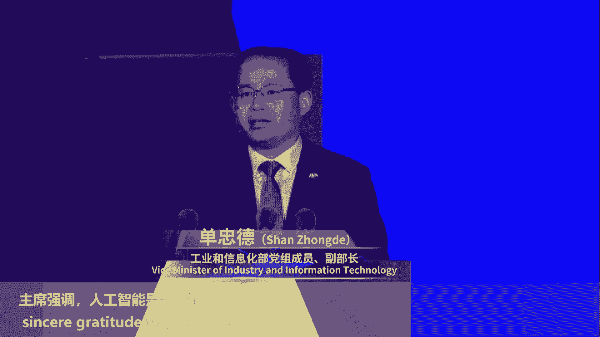

I，为了新工业革命，对人类文明产生了深远的影响，几天前，在这十七天里，你和国会，任何形式的协商，中国和其他国家已经提交了关于人工智能公司的提案，一百四十个国家参加了这次会议。

它强调人工智能为好的智力为好的，我为人类带来福祉，注重人工智能能力建设，旨在帮助各国，特别是发展中国家从人工智能中享受平等利益，并完善全球人工智能治理，也是为了实现2030年的议程。

我希望所有的代表都能和你分享一个意见，你执行这个决议，优先发展，以人为本，也寻求与我们的实际行为合作，我们现在可以帮助发展中国家加强人工智能能力，也帮助人工智能赋能可持续发展，增强人类共同福祉，目前。

全球人工智能技术发展超快，并成为推动新工业革命的核心动力，所以我们有是的，人的技术赋能不同行业，改变医学，财务和一些其他方面正在等待申请，其实中国人的人工智能练习从碧源开始已经有一百八十多个了。

企业数量超4万家，我们有十一个人工智能的亮点应用中心，我们有年轻的河流地区，具有试验区的电力区域，所以我们进行了深入的合作，培育了数字仓库，智能工厂，以及演示项目的提升，生产率提高了百分之四十八。

而且成品率也大大提高了，极大地提高了一个高质量、绿色发展的水平，因此，中国正在关注汽车的安全和发展，所以我们可以倡导不同的党派坚持以善良和人为中心，在国际电信联盟的邀请下。

我们参加了在日内瓦举行的AI for Good全球峰会，并发布了全球人工智能治理倡议，中国愿与世界携手共进，加强变革与合作，预防人工智能带来的风险，并广泛制定监管框架，所以我们可以建立一个更美好的世界。

所以更好的技术可以造福世界其他地方，女士们先生们，所以中央提出要开展专项整治，以人工智能为中心，利用人工智能技术促进产业发展，加强与包括国际电信联盟在内的联合国机构的合作，与国际社会共同努力讨论标准。

基本应用，条例AI与达成国际共识，我们想建立一个公平的，开放，更安全的台阶世界，这是一个非常成熟的人工智能生态系统，所以让我们手头工作，所以技术可以赋能整个行业，我们可以创造一个文明的。

全人类的进步和谐世界，但同样重要的是，我希望这次活动圆满成功，非常感谢，去看沙姆先生的精彩演讲，所以WSU二十四推出了，这是他第一次来中国，所以说，想邀请张穆迪先生，欢迎光临，尊敬的施崇德先生。

赵云先生，塞西尔先生，我女士们先生们，亲爱的朋友们，下午好，很荣幸在华盛顿州认识一位25岁的人，我是国际电联对Impact主机的一个很好的创新，我对各位朋友来参加今天的会议表示热烈的欢迎。

我也要表示衷心的感谢，感谢社会各界对上海发展的支持和关心，现在人工智能技术正在不断发展，应用更加广泛，带来前所未有的便利，但也会引发一些伦理风险，所以人工智能的开发应用，关于道德标准，面对新的产业格局。

“永远的爱”已成为国际社会的女性诉求，上海重视人工智能能力建设，聚焦软硬协同发展的LLM，积极参与二十一世纪的人工智能创新和人工智能向善，上海启动人工智能能力建设标准化机制，成立我们的专家委员会。

我们致力于推动AI和LLM的创新发展，我们希望促进人工智能以技能为基础和规范的发展，第三，我们制定了第一个关于人工智能的地方性法规，我们永远坚持人工智能，技术向善、以人为本和面向市场的发展。

从法律法规角度，我们现在对人工智能有了系统的安排，人工智能正处于一个新的发展阶段，而且它的安全治理非常重要，所以我希望看到机会，更大变化，面对未来的不同挑战，上海愿意与不同的利益相关者合作。

企业是不同的工作生活机构，我们将从人工智能伦理开始，完善我们的制度，考虑到弱势群体，促进可持续的人工智能，我们将有分层治理，推动创新，以及人工智能的法律规制，我们将采取有效措施促进发展。

爱和我们希望有包容但谨慎，对人工智能的审慎治理监管，我们会把重点放在艾林身上，同时组织工业工作队，推动制度建设，并引导产业做强做大，加快培育AI生态层代表，尊敬的各位来宾，此活动是IU活动的一部分。

我们邀请了政治家，院士和企业家聚集在一起，发出你们的声音，交流我们对人工智能的看法，希望我们能交换一下想法，每一个都有很多值得了解或学习的地方，将为人工智能提供更强大的智力支持，最后，我希望有一个活动。

它可以完全成功，约翰先生的一次演讲有很多东西，秘书，政府和其他理解人工智能潜力的人，也需要创造一个强大的，安全，这一创新向前推进的可靠基础设施，现在呢，我们将听到另一位领导人的发言。

他了解人工智能令人难以置信的潜力，首席执行官先生在路上，国际电信联盟电信标准化局局长，欢迎他的开场白，下午好，这是格蕾丝和代表们参加这次人工智能为好创新为影响活动，我写信感谢他的前任抄送肖恩·东德先生。

最佳工业和信息技术部长，代替约翰，上海副秘书长穆迪，嗯先生，中国信息通信技术研究院院长，感谢您对本次活动的合作和支持，展示人工智能将如何影响我们社会和经济的几乎每个方面。

我们很荣幸能把来自人工智能的真知灼见带到上海，创新者或影响项目，呃，呃是为了呃，利用人工智能的变革潜力应对紧迫的全球挑战，推动联合国为发展目标服务，该计划旨在弥合知识鸿沟。

促进人工智能在解决政治问题中的应用，通过修正分析和有影响力的人工智能用例的传播，该项目的成就包括促进全球明星之间的合作，他们所产生的学者和专家对所有应用程序的定义分析。

并就全球解决方案建立一个充满活力的或区域性的观点，这对使用固化功非常重要，在联合国，数字技术专门机构，国际电信联盟，随着工作的进行，超过193个成员国聚集在一起，一千多名来自学术界和工业界的成员。

我们现在已经发布了一百多个关于人工智能的标准，在这个项目下大约有120个，这个数字总是正确的人工智能现在是网络编排的关键，多媒体编码和优化我们网络和数据中心的能源和成本效率。

它也在该地区从气候行动和农业，呃，到救灾，保健和道路安全，这就是为什么国际电联如此投入地在不同专业领域之间搭建桥梁，这一突破在很大程度上是由人工智能专家之间的新联系促成的，AI用户，数据所有者。

并在人工智能可能做出贡献的领域进行出口，为了可持续发展，国际电联正在促进这些联系，在AI的支持下，与四个七个合作伙伴的良好倡议，联合国机构和30名专业人员，现在是良好网络人工智能的一部分，神经网络。

作为我们全球挑战的一部分，我们自豪地拥有一些标准，他们已经在世界各地帮助建立人工智能能力，我们参加挑战的大多数是来自发展中国家的学生，我们想要安全，安全可靠的AI带来更美好的生活，为了更好的生活。

为了我们所有的确证和共识精神，标准化工作正是成功所需的速度，成功，发出去，自愿，对新的合作方式的自愿承诺，它们为新产业的成长和建立产业的不断前进提供了必要的技术基础，这是一个高度协作的过程。

星期天一起工作，我们战胜了相互信任和理解，我们创造了继续创新和投资的信心，围绕人工智能出现了一个新的创新生态系统，一些尘埃将是将这个生态系统带到全球范围的关键，但要做到这一点。

欠需要是一个包容各方的过程的结果，透明和范围与我们雄心勃勃，谁更倾向于，此保证与木卫一一起，我们提供了一个标准化平台，所有参与者的政策都很难，每一步都是由共识决定的，随着国家标准的发展。

我们处于独特的位置，可以从圣丹斯那里得到协调行动，日化的利益相关者越来越多，我们公司帮助每个人取得成功，AI正在改变我们的世界，我们有丰富的经验可以建立在中心的基础上，帮助我们在解放后的技术革命中导航。

伴随着科技的每一次突破，我们走到一起，制定在新领域茁壮成长所需的标准，这就是我们的沙化过程是为你建立的，不管是在政府行业，学术界或民间社会，可以通过贡献和协商一致的决定来促进我们的卫生工作。

我期待着在C这里的讨论，并继续建立伙伴关系，确保人工智能的包容性，负责任，是我们共同可持续未来的一部分，感谢大家的支持，啊，谢谢谢谢，好啦，现在我们要进入今天活动的一个非常重要的环节。

我们将正式发布人工智能良好创新影响报告，请和我一起欢迎这两位客人，以及在路上的首席执行官先生，资讯科技总监，请把你的手放在屏幕上，把你的手放在屏幕上的手符号上，请和我一起倒数，五四三二一。

这是本报告的正式发布，请到舞台中央来，我们可以合影留念，感谢麻省理工学院报告的支持，接收来自世界各地的两百多例病例，来自19个国家的53个优秀案例，最后覆盖了所有17个sdgs，非常感谢。

小野先生和小野先生，现在我们要去主题演讲环节，我把话筒还给布兰登，我们都是人工智能产生的不可思议的影响，为了全世界的共同利益，你知道联合国系统涉及到世界的每一个地方，所以也许没有更好的地方开始。

展示人工智能擅长的潜力，今年在日内瓦举行的AI for good峰会。

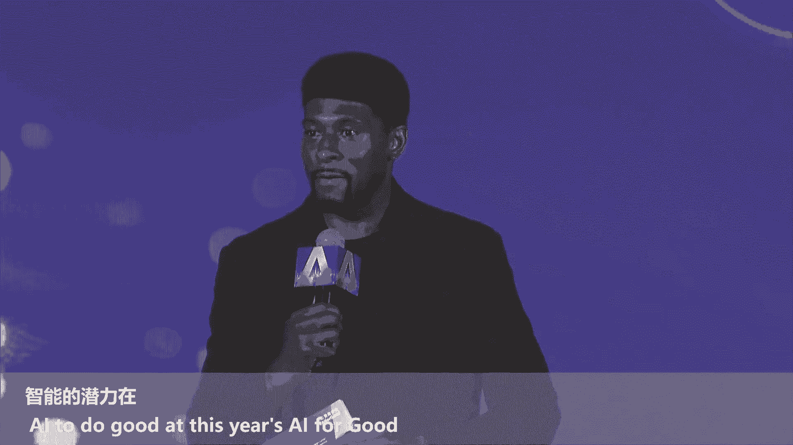

联合国秘书长说，他相信人工智能可以推动可持续发展，国际电信联盟秘书长在他的声明之后说，她希望扩大人工智能解决方案的规模，拯救可持续发展目标，和我一起谈话，将是来自世界各地联合国系统的一系列领导人。

一位首席执行官，国际电信联盟电信标准化局局长，联合国工业发展组织副总干事赵思扬先生，玛丽亚·阿格拉博士，玛丽亚·格拉齐·西卡里尼，行政办公室主任，联合国教育中的社会科学和人文科学，科学和文化组织。

教科文组织，有请他们上台，先生们，非常感谢你今天的加入，我想从你们的机构开始，以及你如何使用人工智能来促进和实现你的使命，还有成先生，也许我会从你开始，贵机构是如何利用人工智能来促进和实现其任务的。

谢谢非常感谢，主持人先生，在本届会议期间有机会这样做，还有你的问题，我觉得对你来说，虽然我认为你做的是特别的机构，联合国系统促进包容及可持续工业发展的专门机构之一，所以对AI来说当然是，是呀。

这绝对是说改变工业发展，所以作为一个推动者，作为变形金刚，所以对我们来说，对你来说，你需要那些状态，包括中国，现在我认为这正在成为一个无单元工作的优先事项之一，因为你需要一个成员国，希望你需要支持他们。

特别是那些来自全球的国家，因为他们想了解人工智能的发展对他们经济的影响，为了他们的行业，所以在这方面，你需要说，正在制定一些倡议来帮助其成员国，抓住人工智能发展带来的机遇，例如，所以在智能制造上。

所以这绝对是一个，你需要说已经在帮助一些成员国方面发挥了某种作用，基本上使用人工智能技术来改进决策过程，包括管理他们生产过程的供应链，然后帮助他们提高这种能源效率在资源效率，你必须基本上减少生产的投入。

在课程中，此外，对于制造业部门，那么如何利用人工智能来减少它们对环境的负面影响，是啊，是啊，基本上我认为人工智能可以帮助我们监控整个过程，找到最佳的方法，是啊，是啊，以制造为主，是啊，是啊。

这是一个又一个，是我们弥合数字鸿沟的工作，通过能力建设，我已经说过，我通过联合国决议强调了这一点，关于发展中国家的能力建设，所以这是一个区域，你还需要拼写，说努力通过能力建设通过，也像为。

假设你需要这些成员国来自公共部门，民企互学互鉴，通过与你们系统机构的合作，包括在U，所以在另一个，说联合国机构像联合国教科文组织，所以你还需要努力的另一个领域是，其实是为了推广这种喜欢。

说一个有利的政策环境，推动创新，所以这是我想，从战略发展角度看，你需要协助成员国制定人工智能战略，例如，我们支持约旦政府制定其第一版人工智能战略，所以通过这个，比如说一个策略。

然后约旦政府把人类发展作为首要任务，人工智能的部署可以造福整个社会，不仅仅是一小部分人或实体，所以这或多或少是你需要做的工作，你知道吗，听起来你需要做很多工作，我从你的回应中听到，SDG九大产业与创新。

当然还有，17个伙伴关系，昂威先生很高兴听到你的消息，你的机构是如何利用人工智能来完成任务的，从IU这边，呃我有，也是，呃，你们的联合国，特别的人，这些是技术和icds，那么我们将永远在二十七年。

所以有七年的历史，这已经是一个全球性的运动，没有47个联合国伙伴和我们网络中的3万名成员，还有，人工智能的工作是培养来自联合国各地的业主。

与来自工业和学术机构的Soruba省一起解决今年的目标和其他问题，爱与善全球峰会，可能很多人在一旁指出，有些日子会起到多大的作用，在执行人工智能州长，实际上呃，我在电信局工作，而且非常重要。

这对我来说是一个很好的观点，那是我的角色，因此，我们的工作致力于建立共识和发布技术标准，在各种各样的食物上，穿过呃，身份验证的一部分，通过水印，绿色技术的行动，所以就这样，呃。

我们现在正在研究太阳化的非常广泛的技术领域，它也将有助于我们实施人工智能州长，那是我们的工作，很多事情要做，不可思议的一个，你建立了这个全球平台，永远的爱，那个，就像你说的已经存在很多年了。

现在你已经超越了，不仅仅是创新，但进入治理和负责任的人工智能，这是非常重要的，西卡里尼博士，欢迎加入对话，非常感谢你的加入，非常感谢，联合国教科文组织是如何利用人工智能来完成其使命的？

我们在很多方面都在使用人工智能，我真的想向观众道歉，因为我在另一个会议上，所以我就跑到这里，所以联合国教科文组织，我想你们都知道，因为这些漂亮的标签，靠近一些纪念碑，对所以你把联合国教科文组织。

这确实是我们做的事情之一，但我们的首字母缩写中还有另外两个字母，即联合国科学教育文化组织，这就是AI进入的地方，进入科学界，实际上，在联合国教科文组织，我们有两个部门，一个是自然科学的，我属于的另一个。

那是为了社会科学和人文科学，现在我们该怎么办，因为联合国教科文组织一直在处理，这个组织的任务是处理新科学和技术的伦理问题吗，这是人工智能所以我们有两个委员会，事实上，他们不断地扫描地平线。

观察能够对人类和社会产生影响的技术，所以在过去，例如，联合国教科文组织一直在处理基因组的伦理问题，或者气候变化的伦理，所以我们是第一批关注，不仅是可能出现的问题，例如环境，尤其是气候变化对人类的影响。

然后从1919年开始，联合国教科文组织一直在研究关于人工智能伦理的建议，它在1921年被我们当时的，193个会员国，在那之后美国又回到了联合国教科文组织，什么建议。

这就是我们如何利用人工智能不仅仅是把原则和价值摆在桌面上，但实际上，我们要详细说明11个政策领域，我们认为到那时人工智能应该是道德的，联合国教科文组织称这是合乎道德的，人的尊严和基本自由。

这实际上意味着在从教育到数据政策的领域，对环境本身，处理性别问题，关于各国可以做些什么来促进和实现道德人工智能，有明确的处方，然后我们还设计了一个非常结构化的实施策略，因为在政策上，我们都清楚该做什么。

困难的是如何到达那里，这也是该建议帮助解决的问题，哇塞，哇塞，听起来好像已经做了很多年了，关于人工智能伦理的一个，但也要确保技术和技术发展对环境的影响，等享誉全球。

让我们从你们的组织和霍洛威先生转移到更广泛的n系统，也许我会从你开始，联合国系统能做些什么来确保人工智能支持可持续发展目标，啊是的，我们非常自豪地展示正在进行的案例，是啊，是啊，我很想听一些。

所以实际上首先，我们有一个健康活动的人工智能，这些活动从我们的焦点小组活动开始，人工智能促进健康焦点小组，有证据证明，世界卫生组织的加入，来自R的专家加入了，呃，它会，呃，通过一个，呃，呃，一些新技术。

医疗保健的一个新方面，例如远程医疗解决方案和人工智能，诊断也是，但我们需要更高的质量，可信标准，那将是，我觉得，祈祷，一条大路，第二种情况是，我们有，一些自然灾害管理，这也是从自然的焦点小组开始的。

自然灾害管理的一些人工智能，呃和呃一起，与妇女署及小组的合作，是的，是的，这也是通过从我们的社区解放技术专长，并将它们与WO和NAP的天气和气候专家结合起来，我们正在支持数十亿弱势社区的可持续解决方案。

我们还有另一个案例，数字农业的人工智能，和呃，与少数这样的国家合作，我们和其他机构有一些合作，就其本身而言，结合专业知识的结合，我们正在通过ai创建这样的解决方案，一些动态程序使用来自ITU的ai。

这听起来也是一些很好的伙伴关系，成先生还是西卡里尼博士，你们的机构有什么具体的项目你想强调一下吗，我想从你需要说，我认为这对整个联合国系统很重要，真的是为了支持，有一种全球性的讨论，说。

如何最大限度地利用它们所产生的机会，或者从人工智能部门，同时也降低了人工智能发展的风险，关于这一点，基本上正如前几届会议已经讨论过的那样，人工智能为发展带来了机遇和挑战，所以对我们来说。

联合国系统作为政府间机构机制，所以作为一个中立的拦网者，这是最好的位置，是啊，是啊，制定标准，为整个生态系统提供指导，跟随，正如联合国教科文组织代表已经提到的那样，它不仅问如何使用人工智能进行开发。

也是永远的，是啊，是啊，但对我们来说不是主要的，全球都在讨论风险，对我们来说是的，我认为我们还需要有一个平衡的方法，如何也或利用人工智能提供的机会，所以这就是SD本质上的原因，它们与发展的源泉有关。

你是社交方面的，从我的环境方面来看，经济方面，那个，我觉得人工智能技术，它将改变所有这些SDG，可能与人工智能技术支持的所有，所以对我们来说，我们需要一起努力，就像有人说的，有点像提倡的声音。

喜欢这个主题，为了永远和所有人，谢谢你，不可思议，不可思议，我喜欢你说的标准化，这就涉及到我的下一个问题，当我们思考人工智能治理和国际合作时，联合国应该做什么，奎里尼博士，也许我会从你开始。

联合国应该做些什么来推进治理和国际合作，说到人工智能，当然，作为一个系统，我们可以做很多事情，我们已经做了很多，我们发表了一篇论文，已经展示了联合国系统已经做了多少，现在我们实际上和47个机构一起。

这就是我们所说的，我们看到大约有，我想已经有两百个倡议了，如果你看着他们，它们确实是以协同和协同的方式完成的，表明这个问题没有唯一的解决办法，但谈话是非常先进的，从某种意义上说。

这是一项不仅在规模和速度上发展的技术，它的范围现在真的需要协同增效的方法，在治理方面，尤其是联合国教科文组织，例如，在20国集团的背景下，为了了解哪些机构参与了人工智能的治理，有哪些立法，还有什么禀赋。

让我们说，结构禀赋，数据中心，数据访问等，以及人力资本禀赋，例如，那么政府和私人公司需要什么样的人呢？因为这不是一回事，但实际上我们已经开发了一种机制，叫做准备状态评估方法，所谓M。

这就是我们使用的经济，它的目的是按顺序映射，然后分享好的做法，了解什么可以更好地工作，我们的想法是像建议这样的规范性文书，可以作为一个公平的竞争环境，因为这是一项不受任何限制的技术，在过去的一个月左右。

它确实不知道界限，我一直在主持一个采访系列，在那里我与来自世界各地的企业家接触，利用人工智能来影响sdgs，我得告诉你，提供的一系列解决方案给我留下了深刻的印象。

我想到像印度贝克拉夫特咨询公司这样的公司，那就是用人工智能进行物流，承先生，你会很感激的，并支持印度当地的工匠，提高他们的工资，并为世界各地的中小企业提供一致的产品，所以极限肯定不存在。

这当然是无限的潜力，我认为联合国在这方面可以发挥很大的作用，确保负责任的人工智能，我们都希望和需要看到真正发生的事情，所以当我们继续谈论治理时，先生在路上。

就联合国如何才能向前迈进向你提出任何建议或建议，治理和国际合作，其实有一件事，我想说，这是一次很好的峰会，我们有一个，我们为，AI过治理日，嗯所以我永远，那个星期就是这个星期，所以我们有一个很好的设置。

我们可以为它提供一个很好的讨论平台，更多人工智能治理，对单位来说不是很重要的一点，你和系统实际上是联合国，将有一个方便的力量把全球读者聚集在一起聊天有牛，我想指出的人工智能解决方案是什么，是啊，是啊。

绝对重要，当我们结束谈话时，重要的一点是，人工智能创新者或其他政策领导人如何与你们联系，如果他们有解决方案或想法，可以推进利用人工智能支持可持续发展的目标。

当我们结束任何关于如何与这些观众或其他人联系的建议时，你先从胜先生开始，是呀，好的，好的，谢谢你，我想嗯，为了这些，本期的一个主题，我想说他们仍然是最，我觉得挑战的部分。

正如已经在各种形式的场合讨论过的那样，他们说发达国家和发展中国家之间的人工智能鸿沟，我们清楚地看到人工智能技术开发和部署的集中，对我们来说，这不是在这个数字时代，赢家拿走一切，所以很难。

他们基本上是带领掩护赶上，这不像传统的内卷化时代，所以他们还是要来，或者新人还有机会，所以这就是为什么联合国系统增加你的针头，我们现在的首要任务是解决数字人工智能鸿沟或赤字，如前所述。

通过联合国关于人工智能能力建设的决议，这就是为什么，我认为我们需要真正动员所有的资源和努力，支持留守者奋起直追，被迫提高认识，或者看看人工智能的发展对他们经济的影响，论全球经济。

然后他们应该如何迎头赶上，然后以能力建设支持他们，是啊，是啊，特殊技能培训，所有这些项目都学会让他们在这方面找到机会，通过建立，全球卓越中心，在上海，所以哪一个将被使用。

真的说我们支持这种分裂国家的能力建设，特别是，我认为这值得掌声，新的全球卓越中心，在上海这里专注于人工智能，我知道最近的联合国决议，真正专注于弥合分歧，说到人工智能资源，嗯西卡里尼博士。

我在这里给你最后一句话，任何额外的荣誉和责任，嗯，是呀，我认为这里的重点应该是实施，执行情况，执行情况，我们同事说，我们确实有召集力，我们就是这么做的，也许一个尚未出现的世界，是多方利益相关者。

所以我们有自己的渠道，它们是公开的，任何人都可以联系我们，一起参加这次旅程，走向更多，你知道一个有道德的人工智能，再一次，这里的问题也是要跟上步伐，因为随着新的发展，我们看到了我们所看到的。

有一个蓬勃发展的活动，也是在讨论的事情上，有一种倾向是把回到桌子上，关于价值观和原则的讨论，嗯，这些都是各国商定的，现在让我们努力实现它们，确保人工智能是为了人们的利益，并不是说人们要为技术服务。

因为很多时候讨论的是基于技术的，但我们应该问的是，我们希望人工智能为社会做些什么，把它引向那个方向，我认为这是一个很好的问题，我们希望人工智能为社会做些什么，由此得出的结论是，你是如何做到这一点的。

如果我们想帮助贫困，如果我们帮助，如果我们希望人工智能帮助带来创新，如果我们想保护你在陆地上的生命，或者海底的生命，不管SDG可能非常重要，要结束的问题，所以说，啊，去吧，我的意思是，例如，在建议中。

我们强调，这正好是，在人工智能造成伤害之前需要补救机制，应该有到位的，一种可以阻止人工智能的机制，你实际上补偿了那些受到伤害的人，或者，例如，人工智能不应该被赋予个性，因为有个性就意味着不再有责任。

所以有一个原则是人类的监督，所以有很多方法已经被包含了，这是一个把它们变成现实的问题，所以我说得太早了，胜先生有更多的东西，还有一件事实际上强调了能力建设对发展中国家的重要性。

只是数字或人工智能缺陷或鸿沟，所以你需要，呃，它刚刚出版了关于达到人工智能鸿沟的政策简报，通过制造业增强发展中国家的能力，所以这本小册子，我想在华盛顿大学的网站上，基本上在这份政策简报中。

我们提出一些切实可行的建议，供发展中国家考虑如何提高能力，决策领域，在技能发展领域，在获得资金方面，所以这是剑桥大学之间的一种共同努力，Jwan大学，也是联合国大学，我的电话，也来自巴西。

所以我们希望你们也会感兴趣，谢谢哇，是的，是的，也给它一点掌声，只是因为我有，我也有一些很多内容用于开发，所以我们也可以为这个领域做出贡献，只是想看看，谢谢你，好啦。

所以联合国教科文组织把你交给国际电联，所有人都集中在善用人工智能，利用人工智能推进联合国，可持续发展目标，非常感谢你所做的工作，今天之后感谢我们的小组，当他们离开舞台时，请再给他们一次掌声，谢谢你。

谢谢你，谢谢你，谢谢你，谢谢你，没问题，所以我们的联合国领导人谈到了他们正在做的工作，现在我们要发布一份报告，这将显示AI到目前为止所做的工作，所以我想邀请回到舞台上，远离国际电联的先生。

德勤斯坦利先生，中国副首席执行官调侃一份新的人工智能影响报告，欢迎他们上台，好的女士们先生们，我非常自豪地宣布人工智能全球峰会快照报告的发布，报告是，现在可以在网上供每个人探索，本报告强调了集体努力。

我们最近在日内瓦举行的峰会上的开创性创新和鼓舞人心的故事，你们很多人都知道，人工智能全球峰会不仅仅是一个会议，这是一场运动，才华横溢的头脑的聚会，致力于驾驭人工智能的力量，世界上一些最紧迫的挑战。

在这篇简短的报告中，我们将全面概述首脑会议的主要讨论和见解，从医疗到教育，气候变化对无障碍环境的影响，利用推动积极的变革，在全球范围内促进和可持续发展，我们的团队孜孜不倦地工作。

以确保这份报告不仅仅是一份摘要，但是，脆弱的脆弱资源，研究人员，从业者和任何对变革感兴趣的人，人工智能的潜力峰会的主要收获之一是合作的重要性，我们面临的变化挑战是复杂的，玛丽黑了它，然后要求。

社会各部门的共同努力，这份报告强调了政府行业之间的伙伴关系，学术界和民间社会，共创未来，人工智能造福全人类的地方，我鼓励你们每个人仔细研究这份报告，分享它的发现，加入我们走向更美好未来的旅程。

作为人工智能全球峰会，某种报告比文件更现代，这是一个行动的号召，当我们想出，感谢我们在底特律的合作伙伴，她和我们一起准备了这份报告，还有我们所有的合作伙伴，他们正在帮助确保人工智能是一种向善的力量。

谢谢你认出了我，这份报告确实值得深入研究，就像你暗示的那样，呃，用人工智能作为我们共同使命的证明，共同的使命聚集了今天所有的贵宾，来自联合国，政府AI，专家，全世界的人工智能问题。

我很高兴代表德勤在这里宣布，在德勤，我们对成为一个精明的人充满热情，超过四千四百万名不受欢迎的专业人士，尤其是年轻一代正在拥抱AI转型，通过我们人工智能学院，并沉浸和动手学习项目。

培训超过12万名专业人员，具有发电机AI技能，探索跨行业的广泛应用，我们正在改变通过人工智能做生意的方式，我们也在帮助我们的客户改变他们做生意的方式，而我们的使命是为客户创造巨大的商业价值。

我们还旨在创造，对我们的社会产生影响，我相信人工智能是对这一目的的真正更新，我相信通过我们的共同努力，我们将实现人工智能的最终目标，为了爱，永远，那就是引导它的力量。

创造一个更加公平、可持续和繁荣的世界，快照，亮点，5月国际电联峰会的关键声明和真知灼见，即将发布的AI for Good Impact报告将成为知识的灯塔，协作分析。

以及人工智能如何被用来加速社会公益的灵感来源，在中国上海的这个盛会上，我们发布这份报告真的很有意义，因为中国是人工智能最活跃的中心之一，创新与应用，这是人工智能参与的活力之源，我们很高兴宣布。

向集团汇报，向世界和中国介绍我们的进步，前进，我们将继续相互合作，我们一起为人工智能成为社会公益力量的未来而合作，科技与人文交融，这是一个我们都引以为豪的词，太感谢你了，不可思议，不可思议。

作为在日内瓦举行的AI for Good峰会的与会者，我知道这是一个不可思议的事件，这张快照值得拿出来，我们在这里暂停一下，让这些先生们拍一张真正的快照，在进行下一次会议之前。

再次与德勤合作的AI for Good全球峰会快照，请检查一下，所以我们知道良好运动的人工智能在哪里，但是好的人工智能运动接下来要去哪里讨论下一波好的人工智能。

和我一起欢迎微软MSRA助理总经理朱莉莉博士。

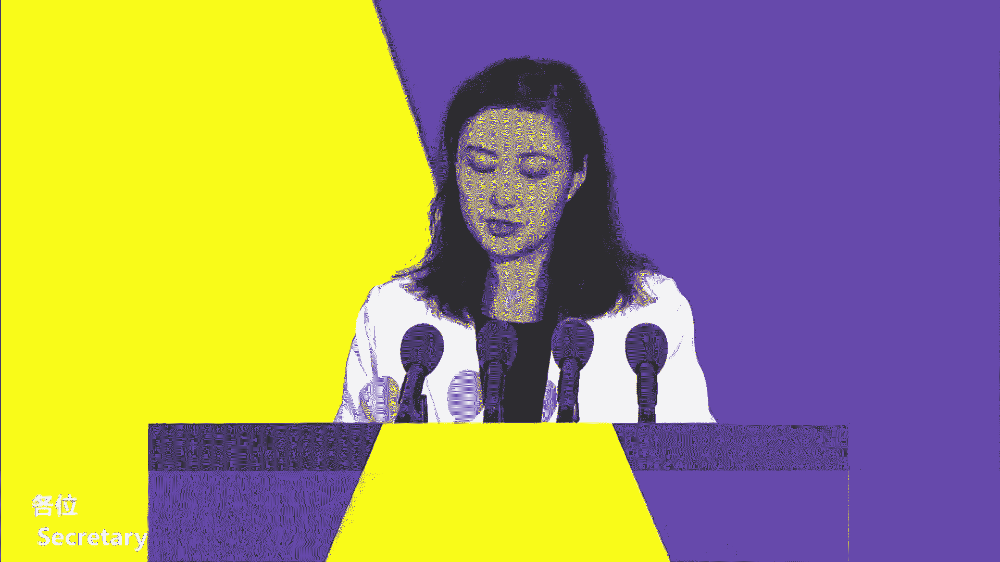

我很荣幸能代表微软公司参加这次重要的活动，AI就在我们身边，造福我们的生活，让我们的生活更方便，舒适，生产性，更有趣的是，从我们吃的食物到我们享受的服务，从儿童教育到成人就业。

从金融到医疗AI理应改造企业，社会与政府，AI可以放大人类的聪明才智，扩展我们的能力，使我们能够在微软的研究中取得更多的成就，亚洲我们正在积极开发用于医疗保健的传感和人工智能技术，众所周知。

人工智能的进步取决于数据的可用性，传感是收集数据的一种方式，喂AI，除了利用MSR A的视觉和听觉数据等传统数据之外，我们创造无线传感技术，用第六感赋能AI，通过超越视线的感知，检测呼吸心率等细微动作。

因为在各种物理性质和化学成分中，所有这些都是在隐私中完成的，保存，节能和侵入性的方式，让我们来看看呼吸监测，举个例子，呼吸监测对检测Covid等多种疾病非常重要，肺炎，睡眠者。

但是现有的呼吸监测需要连接用户，不仅不方便，用户也不舒服，会，有可能开发出一种对最终用户更舒适的呼吸监测系统，我们开发了一个基于声学的呼吸监测系统，只是一个智能手机应用程序，它像蝙蝠一样工作。

你错过了听得见的声音，当你呼吸的时候，他的胸口在动，这个微小的运动会导致折射信号的变化，通过分析信号的变化，我们可以精确地监测人的呼吸，我们将我们的智能手机应用程序与使用监控的医疗级设备进行比较。

我们应用程序的一个独特优势是它不要求用户佩戴任何设备，然而，你可以达到与医疗级设备相同的精度，给最终用户带来舒适，进一步提升能力，我们想增加它的感应范围，增加传感范围的一种方法是增加大量的天线。

但这不仅代价高昂，但也耗电难部署，我们想出了一个很好的方法，用三维打印声学物质表面，它由许多细胞组成，每个牢房都有一个隧道，通过精心设计隧道，我们可以用任何我们想要的方式盯着正在进行的豆子。

所以在没有物质的情况下，表面声信号向四面八方发射，结果，我们的感应范围非常有限，但是现在通过在扬声器前面添加这种低成本的三维打印结构，我们可以把光束引向想要的方向，这样我们就可以实现大的感知距离。

所以我们把这个3D打印的金属表面放在智能扬声器前面，比如谷歌主页或亚马逊Alexa，当用户在几米外时，我们可以感觉到用户的呼吸，甚至用户也被舒适所覆盖，有没有可能通过跟踪来实现运动跟踪之外的新能力。

所以我们正在调查，我们能让智能扬声器对物体和人进行成像吗，你可能想知道我们为什么要有这样的能力，嗯，人们可能不希望到处都有摄像头，浴室里可能会发生很多暴力，你需要一个监控系统。

但我们不能把摄像机放在那里，智能音箱，允许我们以保护隐私的方式谨慎地监控用户的活动，但不幸的是，现有智能音箱系统只有少量天线，结果，它的花纹很粗糙，我们几乎什么也看不见，现在通过添加优化的金属表面。

我们可以创建一个丰富的细粒度bean模式，这样我们就可以实现高质量的成像，这是一个视频演示，基本上，我们在类似智能扬声器的设备前放置一个三维打印的局部结构，我们能够实现成像，而且，因为声信号穿透了。

所以我们有透视能力，除了推进感知，我们还在开发人工智能技术来分析来自人类的不同信号，人类的健康是通过各种生理信号反映出来的，言语运动与医学影像，我们正在分析这些类型的信号，尤其是。

我们培养了一名泌尿科医生，神经疾病每年夺去900万人的生命，大约有10亿人患有神经疾病，我们开发了一个脑电图基础模型来分析人脑，波动信号读取人脑，这样我们就可以诊断神经疾病，如癫痫发作，帕金森病。

阿尔茨海默病，同时将其作为基础模型应用于抑郁症等精神疾病的诊断，成瘾，这是与上海多家医院合作的，我们开发了一个基于脑电图信号生成报告的工具，同时，我们的工具还可以提高医生诊断和检测癫痫发作的能力。

我们从许多医院的医生那里得到了很好的反馈，此外，我们开发了人工智能语言治疗师，语音是一个非常有趣的信号，收集起来很方便，也不太关心隐私，同时，语言还包含有关人类健康的重要信息，它包括关于发音器官的信息。

所以我们用它来检测催眠疗法，唇裂引起的，此外，语言也能反映人脑的健康状况，这样我们就可以检测出阿尔茨海默氏症帕金森氏症，而且，话术折射用户情感，所以我们可以检测抑郁症，我们正在积极与微软合作。

哲学、医院和非营利合作伙伴将我们的技术从实验室带到现实世界，而且，我们开发了一种基于视频的无监督刻板印象行为检测，自闭症患者引起的，此外，我们培养了一名人工智能放射科医生来缓解放射科医生的短缺。

我们正在积极培养AI放射科医生，帮助医生提升医学影像质量，同时也提高了诊断和预后的准确性，现在让我从更广泛的角度来分享，微软不仅有我们的微软研究，但也有一个专门的人工智能实验室，实验室由数据科学家组成。

经济学家，数据类固醇泰勒来自十多个不同的国家和四个不同的大陆，我们今天面临着许多挑战，野生动物减少50%，自从一千九百七十三万人遭受粮食短缺以来，全世界只有不到一半的人口能够获得基本的医疗保健。

现在是我们采取紧急行动的时候了，我们这些能做得更多的人应该做得更多，但我们面临的挑战是复杂的，没有一个国家的单一组织能够独自解决这个问题，我们渴望与世界各地的个人和组织合作，应对国外领域的挑战。

基本权利，扩大机会，促进可持续性，我们致力于保护基本权利，尤其是处理自然灾害的后果，对弱势社区的影响不成比例，使用我们的技术赢得用户的信任，我们致力于推进负责任的人工智能，推动网络安全和数字安全。

扩大每个人的机会，我们想让这个星球上的每个人都有技能，在数字和人工智能支持的经济中生存，举个例子，微软亚洲研究院，我们有一个甲骨文骨修复和策展项目，如我们所知，甲骨文是中国文字系统的最早证据。

而且由于易主，文章骨头有许多副本，因此，微软研究中心的研究人员与该大学合作开发了一种设计，一个可以搜索数千个脚本图像的模型，发现新的和重复的爱好以加快研究过程。

该模型的一个独特优点是它具有自监督学习能力，这样你就可以实现很高的通用性，而且，我们制定了详细的计划来创造一个可持续的未来，我们正积极与中国的非营利组织合作，以生物多样性为例。

这种合作产生的项目之一是一个工具，可以，通过红外图像有效检测动物镜头，我们已经看到人工智能创造了一个前所未有的机会，并将前所未有的人们联系在一起，但归根结底，问题不仅仅是计算机能做什么。

但是计算机应该做什么，我们的旅程从定义负责任的人工智能原则开始，正如撒旦·梅达利在《野性》杂志上所概述的那样，现在我们正在把这些原则付诸实践。

我们的目标是让人工智能成为每个人、每个地方都能接触到的共同商品，我们看到超过10亿人生活在严重残疾中，全球40%的人口没有受教育的机会，在一种语言中，他们说九十九点，九，世界上5%的人口不知道如何编码。

大型语言模型有可能使每个人都成为人工智能的超级用户，我们想让每个人都能用他们的语言说话。

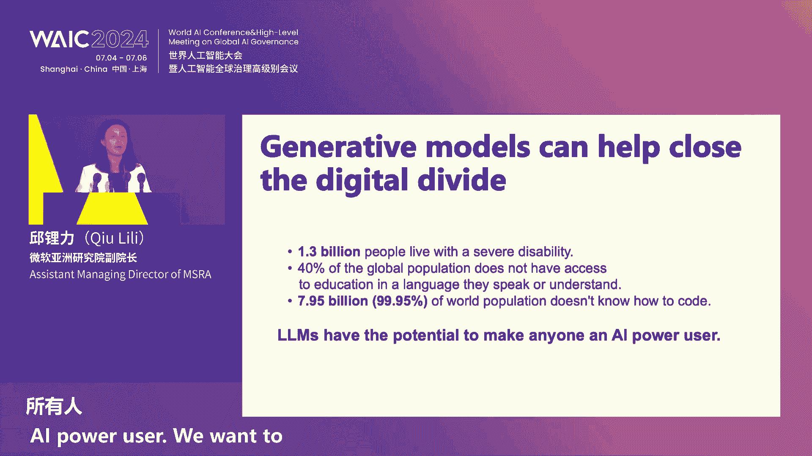

这样他们就可以指示人工智能系统来满足他们的需要，生成模型可以帮助弥合这一数字鸿沟，AI是一种新的通用技术，可以一起改变世界，让我们用人工智能建设一个造福所有人的未来，谢谢你，谢谢你，朱博士。

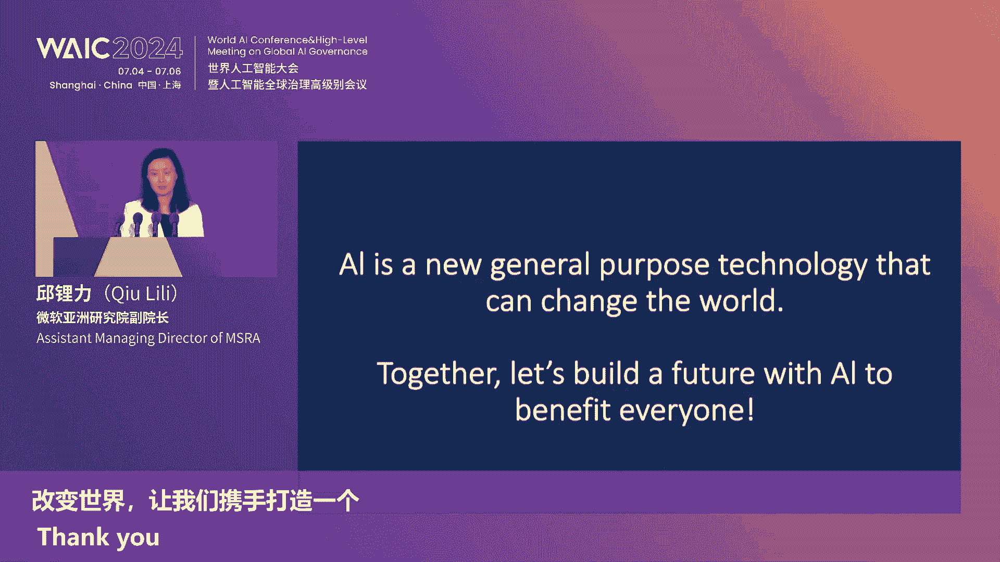

我想人工智能的未来是我在演示中听到的，可持续发展目标10减少不平等，SDG三健康，以及其他一些，我得告诉你，楚大夫是我奶奶养大的，你的声学监测正是她可以用的东西，我知道微软的技术。

AI for good blab将对世界各地的人们产生积极的影响，我再说一遍AI的未来就是现在，我将继续谈论全球电信和人工智能标准欢迎来到舞台，来自国际电信联盟的托马斯索科洛夫先生。

他将主持我们的下次谈话，非常感谢欢迎参加这个关于全球电信和人工智能标准发展的全球小组，因为我的名字是托马斯鲍洛，正如你已经知道的，它一直在制定国际标准，尤其是在电信领域。

但是现在我们有超过三百二十个与人工智能相关的标准，当然，其中一些已经被批准，并得到了很大的执行，一些标准仍在开发中，但我们在这个领域做了相当多的工作，所以现在我们想讨论一下我们如何利用这些全球标准。

尤其是在电信领域，但是AI标准我们的首席执行官诺伊已经介绍了我们在标准上发布的一周，在水标记方面的合作，多媒体真实性，以及深度打假，我很荣幸地欢迎，也是小组会议。

所以我们有来自不同演讲者的五分钟主题演讲，首先呢，我想邀请阿里巴巴的玉叶，AMMA学院快速主题演讲，之后我会邀请其他演讲者，所以周先生，呃，求求你了，呃，上台做你的主题演讲，呃，所以我喜欢。

谢谢你所做的一切，让我们有机会和一个爸爸分享，演示学院在人工智能领域的工作，我有两个K，我们现在处于数字化时代，人工智能的出现为我们的时代插上了翅膀，因此。

所有受人工智能和算法影响的潜在错误都将得到很大的发展，包括医疗保健和信息交流与传播的大语言模型，但我们知道癌症或各种慢性病是人类长寿的敌人，癌症的治疗门槛高，对大多数公众来说相当昂贵。

他们无法获得高质量的治疗方案，我们想知道我们能不能利用人工智能的能力，为大众带来优质医疗服务，所以在演示学院我们有我们的探索，当我们提供医疗保健的时候，我们需要进行的诊断和治疗，其他昂贵的支票。

我们将尝试一种解决方案，使用定期扫描来诊断癌症和其他慢性病，你可以看到我们已经公布的结果，例如，而信息的传播也要做，呃，在英语中有一个大的语言模型，搞笑演讲区，它已经被广泛使用，但对于欠发达地区，如。

东南亚或在非洲，尚未广泛使用，我们也知道大语言模型将提高知识的容量，传播，保健和教育，但在这种技术无法进入的地方，对我们的演示学院来说，好处不能这样，CT扫描可以带来高质量的诊断。

我们的模型已经很精确了，另一种是少数民族语言的大型语言模型，我们有针对亚洲特定文化和习俗的东南亚模式，我们还包括各种法律法规，它是一个定制的专用语言模型，我们知道目前的基本模型可以非常强大。

但是当你涉及到某些垂直或少数民族语言时，这些模型可以很好地使用，所以对于这些少数民族语言来说，拥有一个包容性的人工智能真的很重要，所以我们建立了这样一个专门的模型，尤其是东南亚。

这种方法就是所谓的多语言LLMS，将人工智能带到更多的地方，这是另一个人工智能的例子，这是一个病人，这是一个，以道院身份办案e，这是一个误诊病例，几乎两千多张真实的城市皮肤，在我们的暗示下。

医生及时诊断出癌症，当这宝贵的治疗时间，她接受了手术，现在她康复了，虽然她给我们表演了一场，音乐是所有人的共同语言，她试图用这场表演来表达她的感激之情，事实上。

我们的许多人工智能技术人员对这种非常简单的性能印象深刻，所以在阿里巴巴这里，我们和AI做得很好，谢谢你，正如你所看到的，人工智能在不同的法国被使用，这是非常强大的，当然是好的，因此，正如你所看到的。

你在健康相关领域看到了用例，也是大型语言模型，我们在这个领域做了很多工作来确保我们在所有人身上都使用人工智能，并确保我们是包容的，以确保发展中国家的人民下一个收获人工智能的好处，我想请大家上台。

谁是中集集团首席科学家，所以欢迎来到舞台，很高兴也很荣幸来到这里，嗯爱永远，全民爱，呃，但这次会议是关于全球电信和标准化的，所以我想利用接下来的四五分钟和大家分享，全球电信的特殊前景。

与AI深度融合或在标准化方面发力，一些经验和开始，嗯，呃，我被告知我被提醒了，特别精彩的活动主要是，呃，IT行业的一件大事，所以也许城市工业在这里是少数，但因为我真的是城市工业出身。

所以我想给你一点关于，呃，十多年来的技术演变与历程，这是一张繁忙的图表，但我想在这里传达的主要信息是几年前。

呃，我们的行业，经过四代人的成功，并有望为全球社会带来价值，我们已经进入了征程的新阶段，也就是，遇到了它，遇到了DTI，又名人工智能，提升我们所有工作的强大新工具，提升我们的社会，提高我们的生活质量。

在这个过程中，我们的行业面临着真正的挑战，因为这三个部分的深度融合需要，为变革性解决方案甚至为我们的基本基础设施而努力的勇气，我相信这是一个重要的关键因素，为我们已经看到的好案例启用大量人工智能。

并且可以期待在未来看到，完成这一使命，利用好这一伟大的新机遇，在2005年，来自三个不同地区和大陆的运营商登上了巴塞罗那的舞台，向全世界宣布一个新的联盟即将成立，又名奥兰联盟，主题是绿色，软的。

开放聪明，这是信息技术深度融合的特点，五年后的今天，我们有来自国际社会的三百多名成员，包括，呃，呃，我觉得，三十多个运营商，三十三，也许在这一点上一起，实际上为世界上超过50亿的移动用户提供服务。

超过3500名非常活跃的全球技术专家，成立了11个工作组，五个重点小组，一个研究小组和一个开源社区，勤奋，热情地，取得了巨大的成果，为下一代基础设施奠定了基础，其中一些结果实际上正在被ett积极采用。

并被atis转换，而且已经，这项工作中非常相关的关键技术元素，在联盟的基本架构上可以看到，有分层再智能控制器的地方，在管理领域带来新能力的钻机，在编排域中，在控制域中，分层波束从非实时运行到近实时。

到实时RAM，带来新机遇，我承诺为下一代基础设施提供的新功能，还具有嵌入式分析和信息曝光能力，使任何和所有应用程序都能利用可供共享的知识，来自网络，从基础设施，以便应用程序本身。

所有优秀的人工智能都可以利用，在我们的行业里，希望在IT行业也是如此，我们现在一切都很好，期待着下一代，六克，考虑到4G改变了我们的生活，5G改变了我们的社会，六G，我想它会把我们带到一个超维度。

所有新的可能性，有很多你已经听过的有趣的愿景和想象力，但是下到地上，我们得做一些扎实的技术工作，以确保我们有一个全球统一的6G标准，不仅如此，从第一天起，它就建立在本地人工智能中。

这一页只是向你展示了我们所做的一些准备工作，努力利用各组织的互补能力、进步和成就，当然以三个GPP为中心，但得到了其他组织的补充，组织，包括结盟，我还在这里列出了其他几个。

我认为这与今天的一些话题非常相关，也就是数据集，因为不管是大数据还是人工智能，都没有丰富全面的，体积大，多样化的高质量数据集，所有的用例都在停车标志处，这是一个特别的，对我们的进步具有挑战性的因素。

我在这里列出了一些，令人鼓舞，呃，国际电联的成就，从我开始，我的公司，中国移动和cg a，这个在哪里，这是一种，我认为为各种场景和用例提供可公开访问的数据集仍然是早期阶段的工作，但有一点我不得不说。

通过快速浏览当前的收藏，我想还有很多工作要做，呃，其中一些数据真的，呃，我想呃，从规模上看，在质量方面，在有用性的覆盖范围方面，尤其是在网络上，呃，数据，还有很多工作要做，我把它放在这里。

提醒一下我希望它能领先，找出一个系统的，所以这种标准化的方式，使这个元素准备好并与6G及时成熟，呃，标准制定，好啦，呃，我的关键信息是，我们需要利用每个人的优势，一起前进，有一个全球统一的6G。

尽可能强大和丰富，原生人工智能能力，谢谢！非常感谢你强有力的信息，呃，基础设施，也是数据，这些是我们需要的一些元素，这样我们就可以有人工智能系统，但是我们也可以支持这些AI用例。

可以永远和所有人使用的AI解决方案，现在名单上的下一个是海滩，谁是中国电信首席科学家，不幸的是，进入这个活动场地有一些问题，所以我要跳过，去找下一个演讲者，秦瑶是谁，来自华为的AI战略与发展副总裁。

所以舞台是你的，啊，I，来宾，女士们先生们，下午好，我们很荣幸能分享华为在解决。

永远的爱。

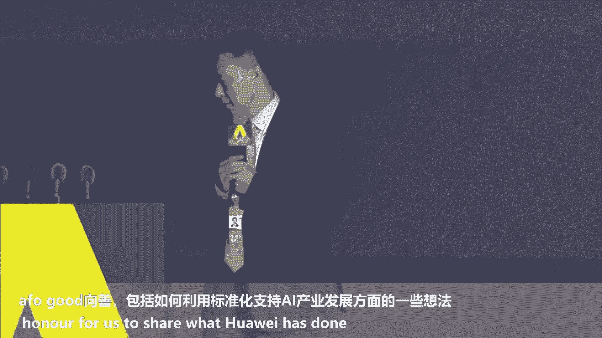

以及我们如何利用标准化来永远支持人工智能。

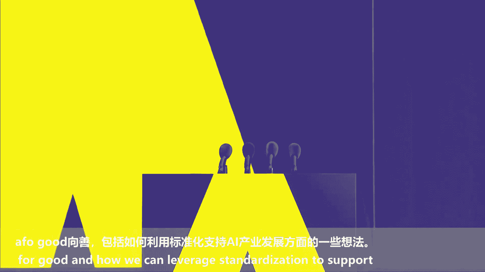

看来还不完全是AI，所以我们谈了很多关于人工智能世界中的人工智能，我们在工业部门列出了一些非常危险的事情，面对人工智能，我们有很多潜在的风险，例如，去年侵犯版权，针对开放AI的诉讼多。

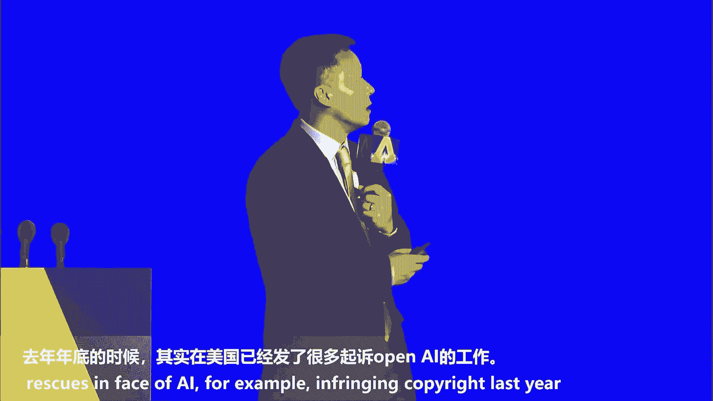

我们有一些深度的虚假和欺诈宣传，因为人工智能会产生大量的信息，引入大量的强制信息。

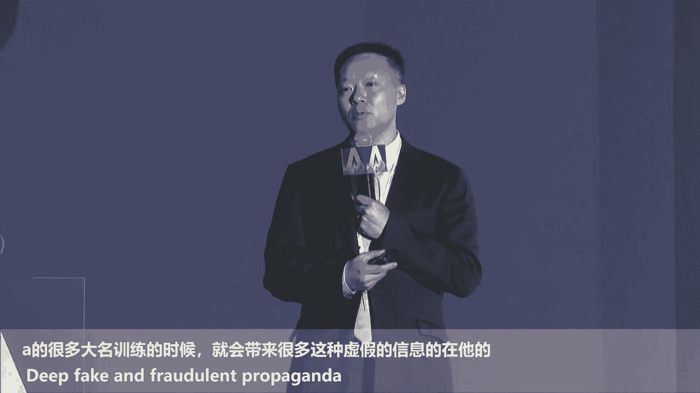

此外，我也会引起一些担忧，如预言，泄漏或值失调。

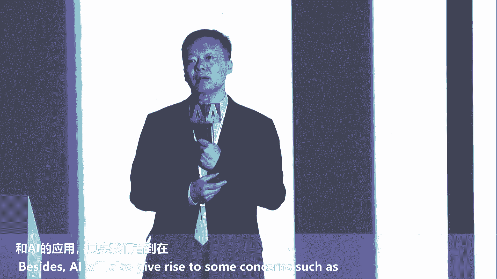

随着更大模型的应用，它已经在行业中频繁发生，我们正在考虑如何对其进行监测和监督。

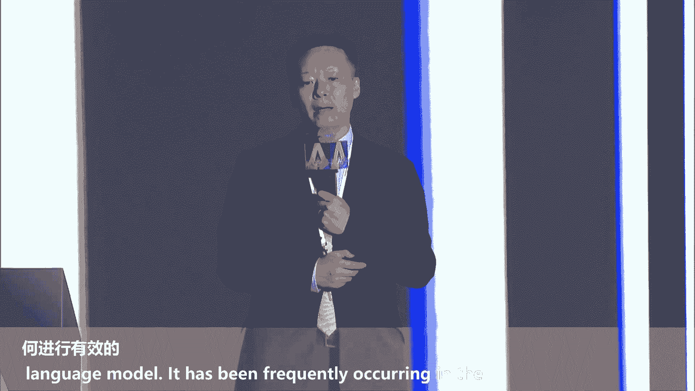

华为很可能是硬件制造商，也是人工智能的基本功能提供商，我们正在永远地研究人工智能，我们用pango lm来预测天气，所以预测效率大大提高了，我们只花了七秒钟就预测了十天的天气预报，我们正在利用LM。

为医药研发带来变革性变革，此外，我们应该如何整合人工智能善与人工智能治理，我们有一个基本的主张，那就是我们需要发展来认识问题，也通过治理，我们可以促进人工智能的发展，我们有一个基本的想法要和你分享。

人工智能产业不同于传统产业，它有很长的产业链，智囊团，产品和服务提供商，认证和审计单位，也是公众用户，因为，因为人工智能生态系统，这些利益相关者可以讨论我们如何同时监控和规范人工智能，我们应该怎么。

德玛拉的眼泪，或者我们如何对人工智能进行分类，这是我们拥有良好人工智能治理的前提，所以人工智能系统非常复杂，我们有道德，AI信任AI治理，那么我们怎么才能，有效地管理人工智能。

因为它有这么多的体现或内涵，我们如何使用可测量、可测试的可用方法来管理人工智能，下一阶段将是标准化，标准化在人工智能领域发挥着非常重要的作用，只要国际社会和工业部门有一个统一的标准。

我们可以评估人工智能，第三，我们应该有一个客观的第三方认证，这将确保我们的呃，促进人工智能健康良性发展的消费者，也有一个很好的，所以可测量的标准化也是可证明的，将是人工智能的三个关键步骤。

我们在人工智能就是这么做的，我们对人工智能非常谨慎，如果你检查我们的业务流程，如我们所知，第一步是训练数据预处理，它将涉及数据集和版权，我们希望对数据安全有一个非常好的分析，其次。

我们讨论了很多关于模型的问题，安全模型将涉及大量的数据，它涉及到我们的安全评估，第三阶段将是内容合规，合规将是我们所做的第三步，最后一部分将是模型应用程序，如果我们能确保应用程序的安全。

那将是最后一道防线，这将是某一产品和服务推出前的最后一步，现在我想谈谈行动呼吁，那么面对未来的发展，如何在治理管理监督中取得平衡，我们想要，有了共识就能达成共识，我们可以讨论不同的场景。

在ICT或电信部门进行基于场景的讨论，运输和医疗部门，他们对人工智能有不同的定义，用户场景，也是AI的好内容，我们需要预测人工智能的场景，现在通过基于场景的服务，我们可以解决人工智能的认证问题。

作为IT的标准化平台，或者我或其他人，你有一个全球标准，非常感谢你的演示。

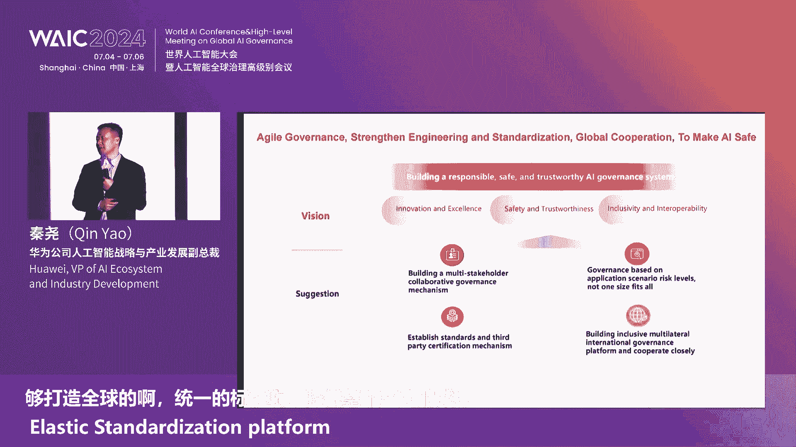

就像你现在看到的，我们要从，呃，实现真正治理的原则，但当然我们需要在那个空间里有标准化的工程，这很好，所以接下来我想邀请来自vivo的分享Wei King来快速演示，那么我们有份吗啊，是呀，求求你了。

舞台是你的，曾经，我是卑鄙的艾主任，并代表vivo，我想和大家分享人工智能的探索，首先呢。

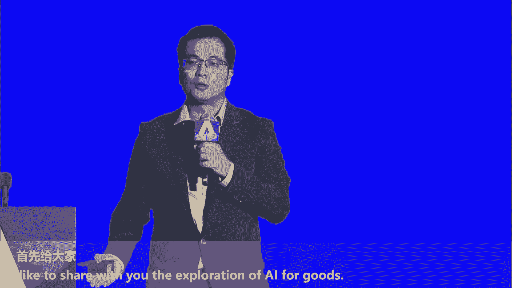

我想你知道vivo是一家设计驱动型公司，我们想创造优秀的体验，科技赋能，我们的核心业务是智能终端和智能服务，我们的Vivii一直致力于使用尖端的人工智能技术，给我们的用户创新的体验。

所以我们可以释放用户的创造力，提高它们的效率，也能在日常生活中享受科技之美，当我们与用户交谈时，我们发现一些用户有各种残疾，像视觉或听觉障碍，这些用户比我们健康的人有更多的人工智能，从1919年开始。

我们的队伍有了新的任务，我们想用人工智能来扩展人类的感知，而每个人都能享受到科技带来的便利，所以我们可以看到听力，了解一切，人对人，人与环境，人与设备可以很好地进行类似的通信，在我们过去的岁月里。

我们已经为有听力和听力障碍的用户做了30天，例如，有听力困难的人，他们目前的困难有两个方面，首先是他们在沟通方面有困难，第二个困难是很难保存周围的声音，例如，他们很难和送货员打电话。

晚上她听不到孩子们的哭声，她必须把他们的手靠近婴儿才能感受到活力，而不是听到哭声，所以我们希望我们可以使用人工智能和其他技术来帮助我们的用户在这方面的沟通，面对面或电话或视频通话的事情。

我们有两个产品叫Viva语音和非常免费的通话，所以这些有听力障碍的人可以有一个非常自由的交流，我们有实时语音到文本技术，他们将能够与家人交谈，和其他实时，无论线上还是线下，大家可以看到。

他们能认出英语和汉语，今年在带有转录服务的vivo智能手机上，因此，他们将能够在不访问互联网的情况下访问这项服务，声音识别是一旦它们有一些特定的噪音，比如哭声警报。

它们将是智能手机或智能手表用户的振动报警器，因此，这些用户将能够了解信息，并对警报和警报做出反应，我们和这些人谈了很多，呃，听障人士，我们发现他们中的一些人可以很好地使用手语，他们通过手语交流更方便。

所以去年我们将推广单词第一手语识别解决方案，我们有手语中介，有一千二百多个词汇可以识别，这是为有听力障碍的人准备的车辆箱，就像视力障碍一样，我们想找出他们使用手机的困难，独立生活女士，旅行，学习和就业。

所以我们希望人工智能能帮助我们的用户与每个站点，去年我们还带来了S，愿景是为vivo网站本身开发多模态大语言模型，我们有视力障碍的用户可以更好地理解他们周围的东西，有环境描述，有一个辅助拍摄。

帮助他们找到物品，今年还有一个Q和一个函数，在那里用户可以与手机交谈特定的图像，我们有个案子，我们的父亲有视力障碍，当和他们的孩子交谈时，他能用英语提问，vivo网站也可以用英语给出答案，小猪。

穿着围裙的猪妈妈在她面前煮调味料，小猪站在门口，捧着一束鲜花，看起来很开心，课文上写着我们买了我们需要的一切，所以我们坐公共汽车回家，这次我们没有见到叔叔，有了这个功能。

我们的用户可以知道图画书里有什么，他还可以知道食物的层次，书上的文字，你就会知道在他的酒店房间里有三个瓶子，哪个是洗发水，哪一个是其他的，实际上我们的产品已经在我们的vivo应用商店里了。

现在已经有1000多个用户在使用它，这是其中一个用户的反馈，他说技术在他的生活中遇到了麻烦，他说，我真的不想处于软弱和被保护的境地，希望科技能给我带来新的可能，我可以自由探索，我敢于犯错。

我可以学到经验，我可以获得新的技能，给我们的用户这样的勇气去探索世界，这正是我们有VIO站点模块的原因，还有很多有父母的用户，他们喜欢音乐，对于这个特定的用户群，我们有一个独特的应用程序叫做visc。

所以他们可以在这个应用程序的帮助下阅读乐谱，如果他们听一些好音乐，他们可以使用这个人工智能音乐识别功能并将其转化为乐谱，正如你所看到的，将会播放这个特定的部分，他们向用户宣读了乐谱上的花瓶图标。

这是一个帮助我们的用户独立学习音乐的功能。

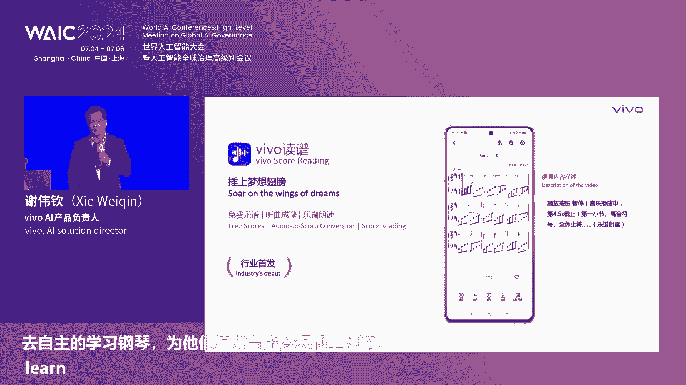

这是vivo ai团队在过去几年里为可访问性应用程序所做的工作，这是从零到一，突破，我们知道对于一家公司来说，未来还有更远的路要走，所以我们希望能借助行业的力量，所以我们有向其他开发人员开放资源的能力。

我们一起想把人工智能用于良好的生态系统，如果你想快点，一起去吧，但你想走得更远，你们要一起去，所以我们希望在未来能有一个面向所有人的人工智能，非常感谢，谢谢你，非常感谢，我是从这里来的。

所以也许我们可以听到中国电信首席科学家的简短介绍，然后我们要进入快速面板，好海滩，如果你是来做快速演示的，如果没有，然后我想邀请所有的演讲者来，到舞台上进行一个问题小组，我想我们快没时间了。

所以所有的演讲者，如果你能上台，阿里的乔代先生，巴巴涛呃来自中国，华为手机Kiyao，来自活体的第十二王，请上台做一个快速的小组讨论，所以欢迎我们所有的小组成员，这将是一个问题小组，因为我们没时间了。

但我想得到一些，我想说从小组那里得到一些关于全球标准的想法，但也为所有人开发人工智能标准，我会从阿里巴巴时间开始，你介绍的学院，挺有意思的，医疗保健中的用例，也是大型语言模型，在这种情况下。

你需要什么才能让人工智能接触到人们，即使在不发达国家或地区，鬼知道怎么做才能用AI接触到更多的人，包括x，除了基本r，D能力在AI能力方面对于阿里关于道院也会有一些宏大的愿景，或者说人工智能的基本能力。

它已经有了很高的门槛，所以你需要用商业或商业的方式来传播人工智能的使用，但对我们来说，我们希望人工智能能惠及所有人，但有两个先决条件，首先呢，你需要有一个智能设备，可以接收信息和使用人工智能功能。

这对许多不发达国家来说已经是一个障碍，你不能让这个智能设备，所以如果你想有一个更多的，你需要有更多的包容性或更多，方便的智能设备，可以走向更多的家庭和个人，智能手机是一种可能性，未来，我们还有其他设备。

比如机器人，这可能是人工智能的另一种工具，所以如果我们想覆盖更多的人，我们真的需要一个更普遍、更广泛的智能设备，另一件事是人工智能基础设施--你需要终端拥有云服务的能力。

而这一切都与数字和数据相关的基础设施有关，这种基础结构是开发人员错误的另一个障碍，所以我们提出了一个全国性的人工智能解决方案，我们希望与更多的研究机构和公司合作，并提供全面的解决方案。

将人工智能能力带到更多的不发达国家和地区，当然，基础设施对于确保人们获得人工智能解决方案是非常重要的，下一个领域中的用例，我想从中国移动搬到青衣去，您已经讨论了基础结构数据，这些如何支持人工智能的发展。

但也有AI用例，我想了解AI Native和6G是如何影响这些用例的，我们如何确保通过使用基础设施，例如，以基础设施为例，我们可以支持许多用例，这样每个人都可以受益于AI，谢谢你，嗯其实我们，嗯。

我觉得从高层来说，我们可以考虑实际上有两种需求和机会，一个是呃，网络AI，另一个是人工智能的网络，或者6克的人工智能，六克，对未来机会的两种不同考虑，我想促进人工智能的发展，我们需要确保未来的基础设施。

例如，六克被设计成一种，它可以优雅地自然地支持和启用所有的空气良好的用例，无论是为了安全的可持续性，或人类社会将从中受益的任何其他福利，但从另一个角度看，我们怎么能，呃，利用AI的力量。

真正让6G有能力就有能力，尽可能高效，嗯，那需要大量的工作，也就是，我想我的大部分精力都集中在，所以如果你看看我们目前的基础设施，我会说，5G的爱是事后才想到的，所以在5G基础设施上建立人工智能能力。

这有点像添加一些外部元素，外部部分，就像在缝隙上贴透明胶带，哪里有需要，那不是大都会和基础设施，我认为这很重要，从我们开始为基础设施设计6G的第一天起，我们会想到，它生来就像6g DNA的一部分，为此。

一个非常关键的重要的事情是数据，好的，因为目前在我们的4G 5G或现有的基础设施中，网络数据自然不可用，不容易获得，我不只是在说应用层，使用数据，我说的实际上是网络，它自己的内部数据。

当前的网络基础设施没有设计，为了提供数据，我们可能需要对控制的优化管理，不管是空中接口，不管是协议层，或者是路由，或者是交通流量平衡，负载平衡或干扰优化，所有这些都需要大量的数据，目前，呃。

我们真的没办法，有影响力的人不是用，记住这一点，数据可用性，所以我认为这部分需要大量的工作，呃六克的标准化部分，这也是我和你分享的，一些数据集的列表，这是一种例子，但我不得不说，网络相关数据。

航空工业相关数据是所有收集的非常非常小的子集，尽管我必须为我在中国移动的公司说几句话，我们一直在努力，即使就像所有的全球运营商一样，我们总是担心公开任何数据，所以我们非常小心，我们需要做一个。

我们需要确保它的脱敏和正常化，所有的努力都完成了，也没有危险，在不对我们的基础设施带来挑战的风险的情况下，当然啦，除了保护我们的用户，但就在最近，我想就在上个月，我们宣布了一个公开的八个不同的数据集。

我想其中四组实际上是从我们的网络中生成的，对其他人来说，更多的是与我们的一些生态系统伙伴合作，并从模拟平台或一些试验台收集，这是一个起点，但是这条路是非常漫长的，在这项努力中的旅程将是非常漫长的。

但我只想确保数据是我们任何人在六个方面工作的关键词，G，呃好吧，记住这一点，非常感谢，数据是下一个关键，我欢迎中国电信的北京加入专家组，不幸的是，我们没有时间给你做演示。

但我想问你一个关于中国电信在做什么的问题，尤其是在人工智能领域，好吧嗯，众所周知，随着一个大型语言模型的成功，呃呃，对将同样的技术应用于电信的期望很高，但是，我们都知道在模型方面有很大的不同，呃。

使用语言，在电信方面也是如此，呃因此呃，呃，期望实际上是一种不同的电信，呃，最成功的模型是基于变压器和变压器体系结构，呃，对大多数人来说，它就像一个黑匣子，但是，即使它是一个黑匣子。

它确实有一些我们可以理解的规则和特点，呃，从今天的人工智能模型，我们至少可以识别出代表最大语言模型的三个特征，首先是，它是以统计数字为基础的，因此，它需要一个大型数据库，海量数据训练模型。

统计数据也是通过优化程序获得的，另一个重要的领域是相关性，我们都知道语言和图像有显著的相关性，在语言模型中，例如，如果你说第一句话，很多人都可以，呃预测你的第二句话是什么，因此。

过去和未来的相关性是非常重要的，为了大语言模型的成功，第三个，这真的是一个，呃，模型本身实际上是一个压缩模型，意味着它收集了大量的数据并压缩成数学模型，有这三个特点，呃，我们可以应用类似的，呃。

模特要呃，电信，所以对于中国电信来说，我们基本上在一些地方进行了稀释，首先，我们追求在垂直行业中使用大型语言模型，与普通大众相比，也是一般用途，中国电信服务于许多垂直行业。

与企业和政府有着很好的深厚关系，垂直行业需要大型语言模型来更好地服务于他们的需求，我们正在研究的第二个领域是，使用大型语言模型进行网络运维，为此，我们正在努力追求，呃，所谓人工智能网络模型。

这将能够使我们更有效地运营网络，更优化的方式，我们工作的第三个领域是节能领域，我们都知道即使是5克，电费到了房顶，很多基站都打开了，而且晚上没有很多用户，所以用人工智能和过去的历史。

使用历史数据训练模型，我们将能够，呃，节省能源，使呃，世界更绿，当然也有很多，我们正在研究的垂直行业中的许多其他垂直应用，总之我们认为我在很多领域工作，呃和呃，希望我们能更好地服务社会，最后呃。

关于人工智能在电信系统中的应用，我们所看到的是，大多数人工智能被用于中国建模的改进，此外，中国已经导致了用于机器视觉的人工智能的标准化，并利用神经网络和结构，我们试着压缩视觉，这样就可以被机器读取。

我们得去找你，是啊，是啊，好啦，谢谢你，是啊，是啊，接下来的演讲者，我给你一分钟时间回答我的一个来自华为的问题，你呀，你提到工程，标准化和认证，我想知道，也许您可以进一步解释为什么标准化很重要。

但全球标准化的下一步是什么，它仍然面临着许多挑战，我们需要努力，首先一个非常重要的部分是人工智能是工业场景的一个面孔，所以在水平和垂直层面上，我们如何协同人工智能，这对我们来说意味着巨大的机会。

多项标准齐发力，包括作为，但是我们的行业有很多标准，呃面对一个垂直的，以及我们如何缩小差距这是非常重要的，其次关于人工智能的标准，我们如何将其与行业标准协同或协调，工业将有一个安全。

工业质量或有标准风险，这些标准可以在人工智能标准中得到很好的利用，第三，我还想谈谈全球标准，全球统一，我们有两百多个标准，我们如何协调发送者，以及讨论和促进什么，在这方面，我刚才说的是深假，没收的图像。

我在推广基于信任的标准，或者我三个E，我们如何在至少一分钟内统一国际标准，你提到了社会包容性和可及性，那么在这方面取得了哪些进展呢？但这一领域的挑战和障碍是什么，呃，你呀，但现在时间太快了。

我们正在探索一种新的人工智能技术，我们可以在哪里应用它，但是当我们设计产品的时候，我们需要检查客户对听力或视力受损的客户真正需要什么，用户，他们想要什么，所以对于听障用户来说。

手语将是一种非常有效的交流方式，因此，我们需要开发一种潜在的技术来满足这一需求，而不是用新技术寻找用户场景，而且很多人都在讨论，我来接手，人类将接管人工智能的工作。

但是我们认为人工智能可以提高人们的工作效率，感知感知，将人们从非常繁琐的工作中解脱出来，所以我认为AI是好的，我们如何利用人工智能来改善感知，提高人类的生产力和商业绩效，所以我们关注关心的线索。

侧面的影响组，影响群体，当他们看不见的时候，我们怎么能利用一个L M，使他们知道在他们面前是什么样子，但这不仅仅是为了呃，影响群体，开会，我听力有困难，我需要人工智能技术，然后呢，例如，当我开车的时候。

我看不到手机屏幕，我希望人工智能能用这个自动来帮我操作我的手机，并回复一些我的微信和其他信息，以下是其中的一些，所以我们的面板就到这里，我要感谢所有的发言者，抽时间和我们在一起，非常感谢，谢谢你。

谢谢你，托马斯，谢谢我们所有的小组成员，在电信业带来积极成果的私营部门解决方案有多广泛，谢谢大家，谢谢你，感谢您的加入，感谢你们和你们的组织所做的工作，也感谢我们的观众和我们在一起。

今天下午我们忙得不可开交，真正完整的议程，当我们谈论使用人工智能来积极影响，世界，包括那些联合国，可持续发展目标，我们接下来的两次会议将集中讨论国际电信联盟的创新节目，讨论人工智能促进良好影响倡议。

和我一起欢迎来自国际电信联盟的sinia fontaine，谢谢。布兰登，人工智能是由国际电信联盟于2007年创建的，好好想想，一秒钟，就AI年而言，这是永恒的，永远的爱。

建立的前提是我们只有不到十年的时间来实现联合国，可持续发展目标，人工智能有很大的希望推进其中的许多目标和指标，从气候变化到负担得起的医疗保健，两性平等和自然灾害管理。

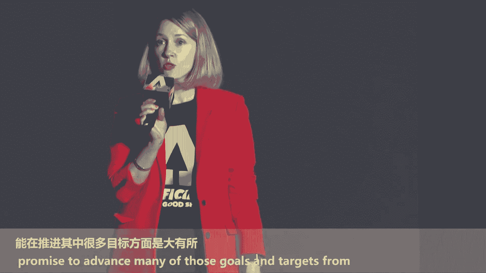

申请在这里。

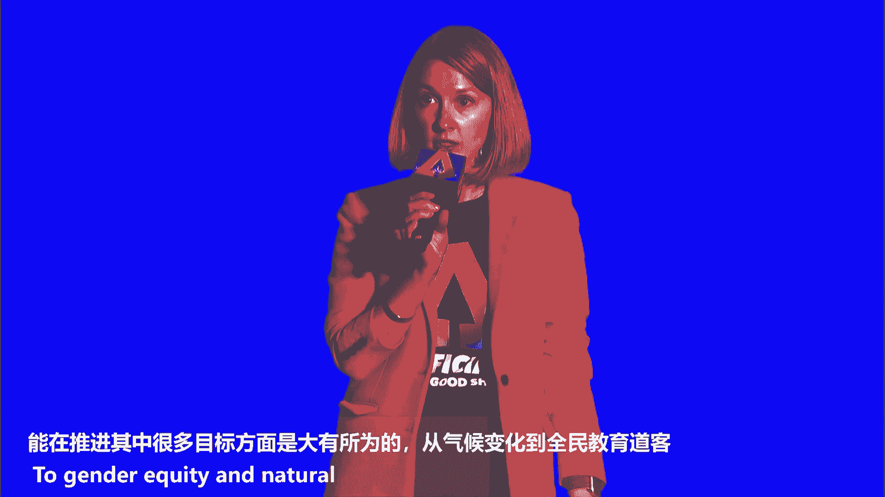

那么人工智能是什么呢，简单地说，人工智能的目标是识别人工智能的实际应用，推进可持续发展目标，并扩大这些解决方案的全球影响，但我们怎么能这样做呢，当然我们不能单独行动。

我们有47个联合国姐妹机构作为合作伙伴，这实际上是整个联合国生态系统为良好的平台贡献和利用人工智能，许多专家会说人工智能太重要了，不能留给专家，这就是为什么人们做出了许多努力，让各国政府发出许多声音。

联合国机构，民间社会，学术界甚至艺术家，你们中的许多人从日内瓦的年度峰会上听说了人工智能，但在新冠病毒大流行期间，我们不仅仅是一次峰会，我们推出了一个名为神经网络的智能匹配社区平台。

现在我们通过了来自八百八十三个国家的三万五千名成员，来自世界各地大学的一万名学者和研究人员，以及强大的行业和民间社会的参与，这些都是合作的大好机会，例如。

AI for Good为AI相关标准开发搭建了通道。

现在，ITU已经在开发中发布了超过220个标准，覆盖从安全到安全的不同领域。

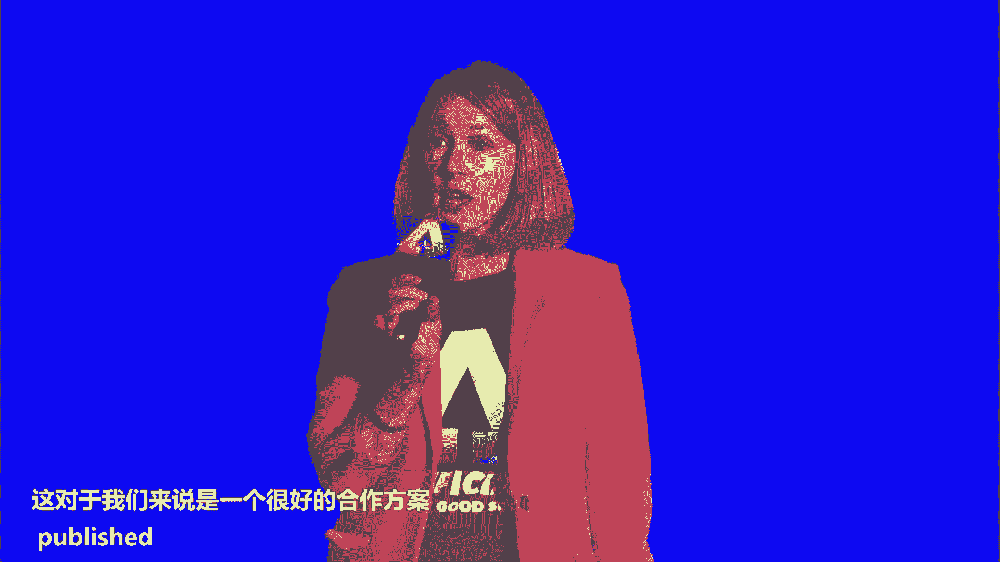

有线网络，多媒体，以及数据中心的能源管理，其中许多标准是与其他联合国合作伙伴如WO一起制定的，UAP，福沃，和许多其他人，我们的机器学习挑战与创新，工厂投球比赛。

确定了数千个人工智能用于推进可持续发展目标的良好应用，他们中的许多人来自发展中国家，但是尽管做了这么多努力，我们怎样才能从狭隘的，所有sdgs和所有地区良好活动的用例和规模ai，在日内瓦首脑会议期间。

今年5月，我们发起了人工智能良好影响倡议，从事件，和AI为项目和活动提供良好的倡议，这些项目和活动可以是包容性的，可伸缩，可重复，对所有人来说都是可持续和可衡量的，影响倡议将包括区域方案拟订。

缩放挑战和比赛，制定研究政策方针，标准基准，能力建设培训，然后呢，当然啦，与全球初创企业合作，所以我们称你为良好社区的人工智能，在资金方面支持我们，云计算，资源，专门知识，培训，然后呢，当然啦。

思想引领，现在我想介绍我们亲爱的朋友和同事，一个人工智能访问者和先驱，Abde Samurai博士远程加入我们，想分享一个重要的声明。

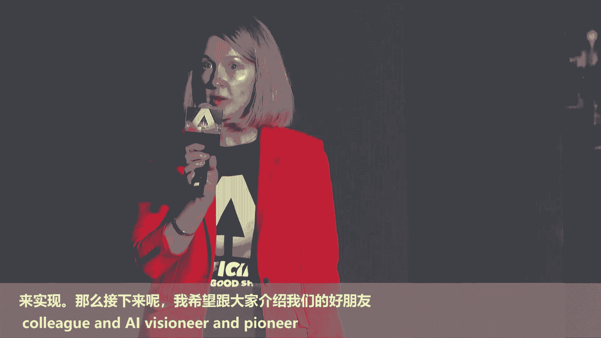

如果可以的话，求求你了，我们很荣幸今天能请到你作为“良好影响”人工智能的一部分，你的出席意味着你致力于利用先进技术的世界，尤其是为了更伟大的女士们先生们，联合国可持续发展目标中人工智能的交汇点。

我们发现应对紧迫的全球挑战的巨大潜力，今天的人工智能可以改变包括医疗保健在内的各个部门，农业，能源，教育和治理，我们可以通过利用人工智能和创造一个更可持续和包容的未来来推进sdgs。

显著改善了教育成果和救灾工作，AI无聊预测模型，及时撤离，挽救无数生命，人工智能改变了我们的诊断方式，治病防病养生AI算法可分析海量医疗数据，包括病人记录和医学图像，识别模式，并做出准确预测，此外。

人工智能有潜力解决各种其他sdgs，例如d，G，七，负担得起的清洁能源，通过优化能源消费，提高能源效率，通过我借来的交通部门的智能毕业生，AI正在推动自动驾驶汽车的发展，减少碳排放。

并根据SG可持续城市和社区促进可持续流动性，AI for Good Impact倡议专注于构建全球AI生态系统，通过促进与各国政府的战略伙伴关系和协作，民间组织和国际组织，建立包容性。

可扩展的人工智能解决方案，促进道德人工智能，并建立负责任地使用人工智能，并认识到他们在，推进sdgs，今天我很高兴地宣布全球人工智能指导委员会的成立，来自世界各地不同学科的技术领导者和远见卓识者。

他们的观点将塑造人工智能项目如何为共同利益而治理，促进全球包容性办法，女士们先生们，通过促进合作和知识交流，我们的目标是扩大信息系统的影响，为所有人创造一个更加包容和可持续的未来，谢谢你。

谢谢阿比萨姆博士，所以如果我们邀请你们所有人加入并支持人工智能良好影响倡议，有了资金，有了资源，用你的心，我们希望明年7月能在日内瓦见到你们，七月七日那一周，非常感谢，谢谢。塞尼亚。

祝贺新人工智能优秀指导委员会的成立。

为世界各地的人们提供了与国际电联联系的机会，以官方的方式表示良好运动的人工智能，我喜欢良好影响倡议的人工智能正在从对话走向实施，国际电联的下一个项目也侧重于实施，谁准备迎接挑战？来自伊图的毗湿奴拉姆。

会和我一起上台讨论一台新机器，世界各地创新者参与的学习挑战和机遇，谢谢布兰登，欢迎大家参加这次比赛谁将像布兰登一样接受挑战，这是，我们非常自豪和高兴地宣布，机器学习竞赛。

我们是一个整理来自世界各地的数据的团队，并为您提供奖品，那么在哪些主要方面，你需要做什么来完成这些挑战，赢得这些挑战，你需要数据，你需要高质量的数据，就像希兰提到的，我们想要高质量的数据。

我们需要的代码数据是不够的，您需要模型的代码，你需要研究一下，所以你想发表论文，就在那里，那是你想去的地方，高质量的研究，这一切都是关于标准的，所以我们想把它映射到标准，还有免费午餐。

所以你需要GPU来计算，为您进行此处理是不够的，我们需要一个论坛，我们需要能够讨论问题，共同解决问题，这就是我用的让这一切发生的东西，我们有挑战存储库和数据日记用于发布，打开代码，机器学习标准。

免费GPU，它为参与者提供免费的GPU，我们有网络研讨会和指导，现在呢，我们很高兴地宣布现有的挑战，任何人都可以参加比赛，你可以组队，你可以赢得奖品，你看有来自丹麦的比赛，奥尔堡大学，美国的莱斯大学。

然后我们有一个北，这些价格可供争夺，你可以看到收音机里有很多奖品，资源管理再次成为一个非常重要的话题，中国移动刚才提到了，多用户调度是我们即将推出的主题，他们有，他们在两年的时间里策划了这个或数据。

大型语言模型现在是一件事，这就是挑战，我们现在有很好的奖品留在桌子上，我想请我的好朋友和来自阿维兹的同事，习仲来了，她会向你介绍挑战，让我们看看奖品是什么，谢谢你，下午好，每个人，我是华为的钟曦，呃。

两年来，我们一直在与国际电联合作，为一项通信挑战托管人工智能机器学习，现在和去年，我们取得了一些非常好的成就，呃，事情，去年我们的比赛受到了全球的关注。

我们招收了来自世界上83个国家的1000多人参加比赛，三百多个团队提交了，呃，我们的竞争对手总共有12000多个解决方案，这些想法很聪明，他们将鼓舞人心，降低移动网络能耗的网络研究与实践，除了技术方面。

我们还在组织网络研讨会，在那里，参与者可以讨论他们优秀的解决方案和他们的想法，在比赛的最后我们在迪拜举行了颁奖仪式，我们邀请了获胜的团队来展示他们的解决方案，今年，我们再次与国际电联合作举办比赛。

今年我们继续关注绿色方面，ICT，众所周知，信息和通信技术为社会做出了巨大贡献，不仅把更多的人联系在一起，但也有助于减少能源消耗，其他部门的二氧化碳排放量，据预测，到2030年。

超过20%的二氧化碳排放量将因信息和通信技术而减少，然而，如果我们看看ICT本身的碳排放，它不是，呃，这仍然是我们应该努力的事情，有两个数字我想和大家分享，首先，如果我们看看移动网络的运行。

目前仍有80%以上的能源消费是以燃料和电力为基础的，这就是为什么我们需要增加网络中可再生能源的使用百分比，所以要让网络更绿色，第二个数字是超过70%的能源消耗在基站，在网络中侧身，那么如何减少总能量。

网络的能耗很大程度上取决于如何降低基站的能耗，尤其是在夜间交通需求较低的时候，当交通较少时，在这场比赛中我们将，邀请来自全球的科学家和研究人员来解决信息和通信技术中的能源消耗问题，从这两个角度。

我们都知道，现在我们有5g，这导致了相当多的能源消耗，现在我们正在看I的交通，如果我们了解交通流量，我们可以更巧妙地减少能量，所以首先第一个挑战是了解5G网络的智慧流量，未来因历史数据而异。

我们鼓励参与者利用从网络收集的两个多月的数据来解决这个问题，并提供一个人工智能解决方案，可以预测交通量啊，为未来的交通量，第二个呃，挑战是巧妙地安排可再生能源的供应，启用了空间站中的基站。

我们有太阳能电池板，我们有根森，我们有电，电网，以及如何安排不同的能源供应商，使网络的社会能耗得以降低，以及保证网络的可靠性，这就是技术上的挑战，我们在这个问题上向参与者提出这个建议，在这里。

我们欢迎所有的参赛者在这场比赛中，我们欢迎所有对这个问题感兴趣的人。获胜的队伍将被邀请参加今年早些时候在巴库举行的，展示您的获胜解决方案，以及其他顶级人工智能会议，你有什么好主意。

我们还有很好的现金奖励，如果你对我们的挑战感兴趣，欢迎你在这里扫描二维码，在呃，这里的挑战，我们从七月营业到八月中旬左右，所以大约两个月的挑战时间，我们非常期待在比赛中看到大家，谢谢你。

教书真的很吸引人，所以我们希望参赛队伍和选手能取得好成绩，我相信所有的参赛者都会在你自己的想法和问题中，所以我想问你，我们怎样才能不断地促进人工智能，探索一条通往胜利的道路，赢得协作。

这是一个非常广泛的问题，我相信接下来的分享，你现在可能会得到启发，我们想邀请余晓晖先生，C A T的总裁与我们分享他的观点，很多事情都交给我们的版主，现在我想和大家分享一些我的观点。

我很荣幸能与大家分享我对这次会议的一些想法，由M i a和I u共同主持，过去我们见证了人工智能技术的突破，这张图表显示了登月舱的能力是否与人类不相上下。

人工智能和大型模型似乎展示了它们很少使用的强大能力，哪里现在普遍使用，这对人类文明的发展是非常重要的，我们现在处于这个阶段，它意味着巨大的机遇，也意味着巨大的挑战，单霁翔说7月1号，联合国大会。

四个人决心永远为人工智能，我们说的是以人为中心，爱向善，造福全世界，这得到了国际社会的支持，嗯，这与解决2013年议程上的17个可持续发展目标的解决方案是一致的，我们如何减少贫困和消除不平等。

我们提出实施人工智能加行动，我们如何将人工智能应用于不同的社会部门，这样才能造福人类，促进社会进步，从经济角度看，我们如何将人工智能融入以前不同的行业，我们取得了一些突破。

尤其是我们在大型语言模型方面取得了巨大的突破，哪些行业适合应用人工智能，我们收集了需求者和供应商，所以我们可以看到很多适用的场景，但许多场景仍然是局部的。

我们想把这些场景变成这样就可以赋予不同的部门权力，当然啦，有许多问题需要解决，成本，工业的安全和可靠性问题，我们如何实现人工智能，我们需要为人工智能的实施提出一个路线图，还有哪些问题有待解决，今年一月。

所以呃，我们就推进人工智能赋能新型工业化转型提出了建议，如何促进人工智能在新型工业化中的应用，我们说的是，我们要实现产业化的高端智能化发展，我们如何将工业需求与场景所引导的场景结合起来。

如何推进人工智能在重点领域的应用，我们怎样才能实现它，我们做了一个分解图，如何将人工智能与新型工业化结合起来，我们将知道工业化的特点是制造组织的统一性，产品转型，我们需要推动转型和重组方面。

所以从制造组织和产品，我们如何将人工智能与这些场景结合起来，并在六个关键维度推动转型，正如你所看到的，我们做了一些这样的研究，呃，我们分析了一些关键的应用案例，实际上是为了在工业部门的应用。

我们确实有一些机器学习的应用，以及小语言模型的应用，现在我们可以看到人工智能在电子信息中的应用，汽车与能源，石化还是钢铁，关于人工智能的情况，可应用于质量监督，设备管理，生产，这就是现状。

当然这还在讨论中，对于大型语言模型，我们以前对人工智能在工业部门的应用寄予厚望，我们将面对一个问题，那就是工业碎片，它需要非常高的工业门槛来解决成本高昂的分散部门，它很高，也很耗时，现在呢。

我们如何应用更大的语言模型来解决这些痛点，我们用大型语言模型总结了行业的相关性，例如，以及如何提高企业的生产率或运营效率，如何更好地检索数据档案和编码，呃，PC机的辅助编程和，科学和一个应用程序。

人工智能应用的一个非常重要的部分，我们希望在突破下赋能，所以现在我们，等等怎么才能建立突破口，我们将通过AI呈现新的变化，对于大型语言模型，你看到的是，而且是，例如，字母中的C D。

自然语言来了解这些需求并生成一些参数，例如，质量是联通和媒体的行动，这可以大大提高呃效率和精度，我们也可以看到人形机器人在工厂中的应用，我认为机器人智能将是一个非常重要的方向。

我们可以看到人工智能的应用已经见证了巨大的进步，我们的直接来自国际电联的gsb，还有什先生，技术部的，我发布了一个用例集合，两百多个病例，他们选择了其中的一些，如果你有兴趣，你可以下载报告。

我可以告诉你，这是一个专注的语言模型，我们也可以用人工智能来诊断张量，而这些都是很多实践，尤其是许多发展中国家面临着这种情况，所以我们说的是一个永远的，所有人的A，这些都是重要机遇。

这可以应用于发达国家，呃发展中国家，例如，我们如何利用它们来进行更好的诊断和治疗，所以I U的情况是，它的数量很大，表现在不同的方面，所以我想我也有美丽，非常好的吻，我们说的是以人类为中心，永远的爱。

所以我认为我可以在这方面发挥非常重要的作用，从发展角度看，我们希望人工智能造福人类，但我们也面临着安全挑战，我们现在正在达成一些行业共识，所以我想，我们说的是技术方面吗，技术。

所以社会乃至人类文明的国际化发展是非常重要的，包括人工智能，它和联合国系统的良好主动性，从去年开始，我们看到了另一个像U一样的迹象，美国、欧盟、日本、新加坡、韩国。

他们都成立了国家级人工智能安全保障研究所来应对这样的挑战，所以从政策、标准和技术上真正明智，我们可以看到世界上各种各样的国家，包括中国都致力于此，C I T也很荣幸成为这一伟大努力的一部分。

这有助于我们更好地释放人工智能的潜力，让它成为所有人的宽恕，去年十月，维外平宣布发布《全球人工智能治理倡议》，我们所说的以人为本的技术是为了良好的相互尊重，平等互利，我们要确保我一直在人类的控制之下。

为了可能的想法，都是关于科幻小说的，但是现在人工智能的安全性是一个非常严重的问题，我们谈论法律伦理，需要走在技术前面，并支持在联合国系统下建立人工智能治理权威，我们可以总结以下两个，我们先谈谈ASIC。

让它公平，只是我们需要凝胶治理，我们需要技术创新，有了这一点，这真的很重要，我想指出的是，人工智能发展得如此之快，你不能把每件事都提前考虑，我们要在发展中迭代治理能力，真的很重要吗。

除了道德、法律和标准，我们还需要从一开始就考虑人工智能对我们的技术有好处，最后但并非最不重要的是，人工智能在为行业服务方面做出了一些努力，大家可以看到，我们发表了一系列报道。

白皮书我们几年前就开始这样做了，并与业界和学术界紧密合作，开发值得信赖的人工智能，这是我们的标杆，正如你在这里看到的，这是一个系统，我们需要知道，因为他们是否能理解生成的推理是编辑器。

我们测试了中国一些领先的lms，另一件事是这些LLMS的安全基准，我们可以看到我们有一些底线，核心伦理与安全要求，我们还以国际惯例为基准，我认为在国际上我们需要有一致的标准和测试。

为了促进人工智能的发展，这将是A，我只想简要地提一下，我是一个，这是一个有一千多名成员的开放组织，推动人工智能应用，我们也是观看全球数字接触和支持永远使用人工智能的一部分，为国际标准化做出贡献。

我们还在建设中国布里格斯发展公司中心，这是推广人工智能的又一次努力，但在更多的国家和地区，包括社会、社会发展和人民福利，我想说人工智能是这个时代的主要变革力量，对社会影响深远，世界经济与人类文明。

希望我们能释放人工智能的潜力，他们使它成为好的，也是我们所需要的，形成全球共识，分享人工智能的红利，非常感谢，这就是我的全部，不可思议的工作，在中国推进人工智能，工作也在世界各地产生影响。

我们如何让人工智能为我们工作，加里·马库斯的下一个主题演讲将试图回答这个问题，和我一起观看他的视频演示，嗨，我是加里马库斯，很抱歉我今天不能去上海，我将谈谈我的新书，驯服硅谷。

我们如何确保人工智能为我们工作，我们需要什么样的人工智能，你可以认为，例如联合国教科文组织的全球道德标准，论爱恩的伦理，谈尊重，基本自由和人的尊严，或者你可以想想美国白宫的人工智能蓝图。

但我们现在拥有的人工智能，我想说是一个在技术和道德上都不充分的。

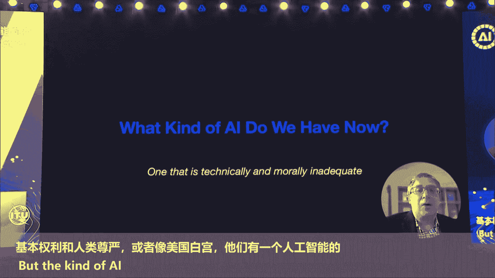

现在大家关注的人工智能，打扰一下，生成人工智能只是一种可能的方法，很好玩，很受欢迎，但它也有很多问题，我有时喜欢称之为草稿AI，例如，你可以写一份演讲的草稿。

你可以说加里·马库斯对生成人工智能的局限性有什么看法，它可能会得到我提出的一些共同点，在多次会谈中，它可能不会得到任何细节正确，它可能会毁掉一些你可以要求它制作图像的点。

如果它们不是在受版权保护的作品上借来的，它们可以看起来很好看，但是生成人工智能有很多问题，一个例子是它有一个真实性问题，如果你问它哪个更重，一公斤砖头或两公斤羽毛，它会告诉你一些疯狂的事情。

1公斤砖头和2公斤羽毛一样重，然后我们写三段，他们在军队里是流动的，我们有时经常说错，从不怀疑，它的结尾是在真空中说，一公斤砖头和两克羽毛的重量是一样的，但在空气中，两公斤羽毛的重量略低于，打扰一下。

一公斤砖头，它会做其他疯狂的事情，有人说，请写一段凯伦马库斯的传记，请提到他的宠物，它给出了一些我认为合理的东西，或者我希望是真的，就像加里马库斯，是杰出的认知科学家、作家和企业家，那太好了。

但它说了一些疯狂的事情，比如，值得注意的是，马库斯的一些人更调皮，关于智力本质的观察受到了他的宠物鸡亨丽埃塔的启发，我没有宠物鸡，我也没有一只叫亨丽埃塔的宠物鸡，事实上，这是一个非常暴露的错误。

因为它告诉你这些系统实际上在做什么，他们不看传记，他们不明白说了些什么，外面什么都没有，上面写着，我有一只宠物鸡，打扰一下，名字亨丽埃塔，嗯，而是，这些系统收集了世界上的统计数据。

或者甚至不是关于世界的语言世界，试着从统计数据中做出猜测，关于文字，关于世界是如何运作的，但他们甚至不能代表世界，它们实际上只是代表单词的统计，原来有一本儿童读物叫亨丽埃塔。

得到了一个关于一只名叫亨丽埃塔的鸡的窝，作者：加里奥斯瓦尔德，我是加里马库斯，系统只是把所有这些放在一起，制造了我们所说的幻觉，事实上，尽管大型语言模型看起来很聪明，他们实际上不能理智，检查自己的工作。

在图像中添加多模态和接地等东西并不能解决这些问题，我一直对统计模型持批评态度，就像大型语言模型和它们的前辈一样，从我的21本书开始，已经有20多年了，代数思维，我经常听到的是什么能让这些系统变得更好。

只需添加可视化数据，把他们关起来，或者类似的东西，这不是真正的工作，现在我们有了多模态模型，我们继续看到我们一直在做的同样类型的错误，嗯这里，例如，系统说它，呃，这个嗯，图像是八角形，也不是真的。

或者它误读了时钟，即使是最新的开放AI模型仍然这样做，你说，谁是第一个游过英吉利海峡的大象？你可以在这里看到答案，而不是说，我不知道或者没有大象能游过英吉利海峡，那是荒谬的，它编造了一些东西。

它所构成的听起来似乎是合理的，但是第一头横渡英吉利海峡的大象并不是真的，上面写着珍宝，印度象，金宝在1959年完成了历史性的游泳，从加来出发抵达多佛作为宣传噱头的一部分，被电路弄得精神错乱。

所以它完全合乎语法，也完全是假的，生成性人工智能也存在偏差问题。

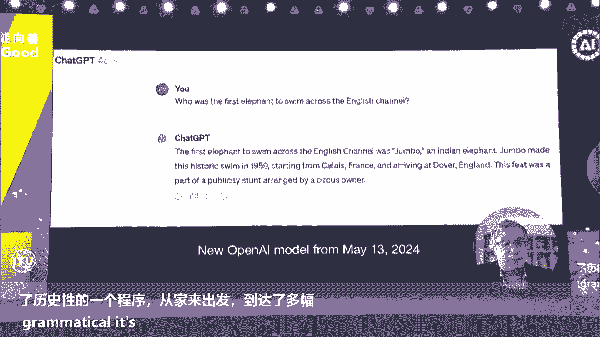

例如，把所有领导人描绘成白人男性，招工存在歧视，等等，这是一个我们已经知道十年的问题，然而，真的没有解决办法，到目前为止，生成AI也存在抄袭问题，左边是GPT 4的一些输出，实际文本来自《纽约时报》。

所有红色的东西基本上都是从《纽约时报》上偷来的，这些系统根据他们看到的所有数据重建统计数据，如果他们看过一个故事的多个版本，然后豁免条例的字眼，补贴，废话，废话，废话，都只是流出来的。

因为这就是统计数据，我们在视觉领域也看到了同样的事情，所以我和艺术家里德·索恩一起做了一些工作，我们发现所有这些好莱坞电影中常见的图像都很容易重现，即使您不提示系统这样做。

所以如果你说意大利水管工之类的话，你将得到视频游戏角色马里奥，呃，即使你没有要求，我认为我们今天的人工智能不稳定，爱，它在现实中没有锚定，这带来了许多风险，所以有被用来造谣的风险，因操纵市场，意外误传。

诽谤，非自愿的深度伪造，加速犯罪，网络安全，和生化武器，偏见和歧视，隐私和数据泄露，未经同意取得的知识产权，啊，所以过度依赖不可靠的系统，就是，人们可能会把这些工具放进武器系统或电网。

以及巨大的环境成本，也可能存在严重的长期风险，这么多CEO，例如，一年前签了一封信，说减轻人工智能灭绝的风险应该是全球的优先事项，以及其他社会规模的风险，例如流行病和核战争，我不确定有那么糟。

但我不能绝对肯定，我认为我们应该认真对待长期风险是正确的，我们作为一个社会作为一个全球，目前还没有解决的办法，我提出了许多政策建议，我对中国的政策不是很熟悉，呃，剩下的演讲将是关于我对美国的理解。

我要说的第一件事，虽然，这是普遍适用的，有很多风险，不只是一个，现行法律早在，生成人工智能的大型语言模型，指望灵丹妙药是不现实的，人工智能所有风险的单一解决方案。

或者期望现有的法律将涵盖所有需要涵盖的内容，从根本上说最重要的是什么，我想至少在美国是敏捷，我认为这在全球范围内也很重要，我们还需要透明度，我们需要充分计算哪些数据用于训练模型。

全面核算所有人工智能相关事件，因为它们会影响偏见，网络犯罪，干预选举，操纵市场等，我们需要全面披露内部进行的所有测试，我们需要像美国食品和药物管理局这样的机构来批准大规模的部署，这里的好处是，大于风险。

我们需要独立第三方的发布后审计，可以告诉我们，例如，这些制度是否被用于歧视？以及我们如何需要责任法，我们需要分层监督，例如，世界上的商业航班如此安全的原因是因为我们有多层监管，你如何设计飞机。

你如何测试它，你如何维护它，你如何调查，如果发生意外，我们需要独立的监督，科学家在循环中，我们需要，我相信，国家和全球人工智能机构，在美国的好消息是当我和美国人交谈时，关于这件事的参议院。

所有这些事情或大部分这些事情，两党的许多参议员都非常支持他们中的许多人，坏消息是在美国没有一个，其中一件事实际上已经在参议院进行了投票，恐怕我们要谈的不是这里的科学，但在推动事情发展的背景下，钱。

我们必须认识到技术人员的利益，不一定符合人类的利益，这是一幅漫画，许多国家的领导人说，我们宣布人工智能具有潜在的灾难性，然后每个国家都说我迫不及待地想先开发它，每家公司都是如此。

我们不应该让大型科技公司为人类决定一切，例如，开源可能带来风险，有人喜欢，有些人不会，我认为这是个很难的问题，我自己也不知道正确的答案，但我想说的是，这不应该仅仅由管理元马克·扎克伯格的人决定。

为人类决定一切，但事实就是这样，我们有像约翰这样的人，泻湖与马克扎克伯格会谈，他们通过发布他们的，呃事情，尽管它可能会被坏演员滥用，我们跳过那个吧，在2012年有一部卡通片，答应了，地球被摧毁了。

但在美好的时刻，我们为股东创造了大量的价值，这是一部非常黑暗的卡通片，更可怕的是，那个漫画现在已经在现实世界中复制了，可以这么说，萨姆奥特曼，开放AI的领导人说，最有可能导致世界末日，但与此同时。

将有许多伟大的公司诞生，这让我担心，如果真的有威胁到我们所有人的风险，我们应该在没有任何规定的情况下向前冲吗，另一件我很担心的事情是监管捕获，例如，在美国，华盛顿正试图做正确的事情。

但它受公司的影响很大，所以监管捕获是一种腐败，当政府结束时，做大公司想做的事，而不是为所有人做最好的事，我担心这种情况会发生，呃，不仅仅是在美国，但实际上在世界各地，大公司制定的议程太多了。

另一个担忧是炒作，炒作是，一直是硅谷的标准操作程序，硅谷想让你以为AGI人工智能通用智能指日可待，人们说会在两千二十五或两万二十七，我不认为这实际上是合理的，如果真的是人工智能即将到来。

只关注生存风险可能是有意义的，并不是我所说的所有其他风险，然后，我们可能想抛开这样一个事实，即公司没有实际的方法来处理，我所说的短期风险，也许我们会停止关注知识产权的巨大盗窃，例如。

但人工通用智能并非迫在眉睫，别让他们骗了你，我们需要解决人工智能的现实问题，我是作为一个爱AI的人说这些的，我认为人工智能可以帮助医学革命，科学技术，但我们也需要减轻所有这些风险，不幸的是。

炒作是硅谷的标准操作程序，例如，埃隆·马斯克年复一年地向美国承诺批量生产机器人出租车，自从，我想1919年他们还没有真正到达，在现实中，事实上，我认为我们可能已经到了当前范式回报递减的地步。

所以伊森·马洛克，谁受欢迎，美国，称目前对改善速度的最佳估计，大型语言模型显示能力每五到十四个月翻一番，但那不是真的，例如，如果你看看很多人使用的度量MU，这是一种表演的翻倍，从GPT到GPT三。

对不起，从二到三，从三到四，但是gbt涡轮增压并不比gpt 4好多少，已经出版快两年了，我看了另一个叫做麻省理工学院联系的衡量标准，发现了本质上相同的结果。

所以人工智能的能力可能在一段时间内呈指数级增长，但事情实际上已经放缓了，我确实认为一个更好的人工智能是可能的，一个在技术和道德上都足够的，但要到达那里，我们可能需要从人类的头脑中获得一些线索。

我最喜欢的一点是，人类的头脑不是一回事。

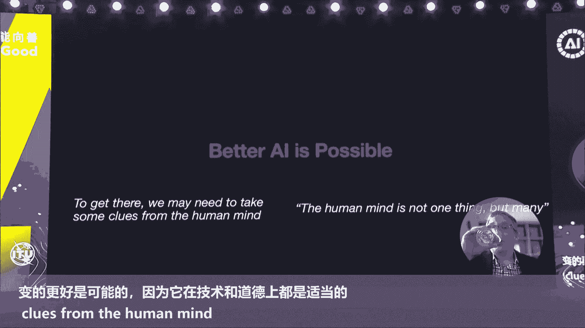

但当我们制定人工智能政策时，我们需要对人工智能目前的局限性持现实态度，需要找到方法，呃，超越它，试着把这件事解决掉，嗯，作为案例研究，想想丹尼尔卡尼曼著名的两个认知系统，系统一，我会把他描述为反射性的。

直观和数据驱动，系统二，这是深思熟虑和理性的，生成性，现在流行的基本上就像系统一，它善于学习，但它在其他方面很差，它不善于推理，它非常渴望数据，这是不可解释的，我们真的不知道这些模型里面发生了什么。

从好的方面来看，它很容易产生幻觉，它的缺点是非常可扩展的，它是以语言使用为基础的，但不是直接在世界上，系统二，它更像经典的象征性人工智能，它善于推理，但是学习不好，它的数据效率很高，这是可以解释的。

没有幻觉，但手工制作很费工夫，它是有事实根据的，事实是，这两种方法都没有单独奏效，我认为这就得出了一个直截了当的结论，即人类的思想结合了，小爱也需要这样做，但效果不佳。

我们在神经网络和符号人工智能之间有很多智力上的敌意，很多关于拨款、资源和声望的斗争，使战场延迟，也许几十年，如果我们能想出如何建立一个人工智能，将两个世界的优点结合起来。

我们可以创建一个可学习的人工智能，数据效率，可解释，可靠，可核实，有根据的事实，一个能够推理人类价值的人，少数公司拥有系统一，但现在开发一种新的人工智能方法还为时不晚，这可以是为公共利益工作的公益。

我想说人工智能的问题，那些有气候变化的人，我们需要紧急行动，行动的时间窗口有限，我不认为政府会这么做，除非人们告诉他们这对他们有多重要，所以我认为世界上的每个人都应该站起来，和说嘿，我们得把这件事做好。

因为我们现在所做的选择将产生持久的影响，很可能几十年甚至几个世纪，非常感谢你，感谢加里·马库斯，多么发人深省的演讲啊，结束我们在AI的节目，为良好的创新带来影响，二十四，今天是一个充满行动的节目。

我们收到了政府领导人的来信，我们收到了电信和技术领袖的来信，我们从企业家那里听说，我们也面临着解决我们世界面临的一些最大问题的挑战，我们希望利用人工智能推进联合国可持续发展目标，德龙。

你觉得今天的节目怎么样，在不同的专家之间分享一套关于人工智能的观点，共识，AI向善引领人类齐心协力，在整个社会中，所以在大家的共同努力下，赋能未来，同时，我想表达我们的感激之情，对食物，订婚和加入我们。

享受WC二十四，我来玩。