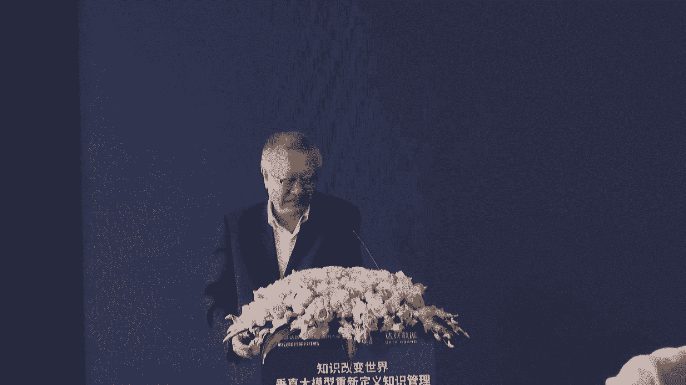
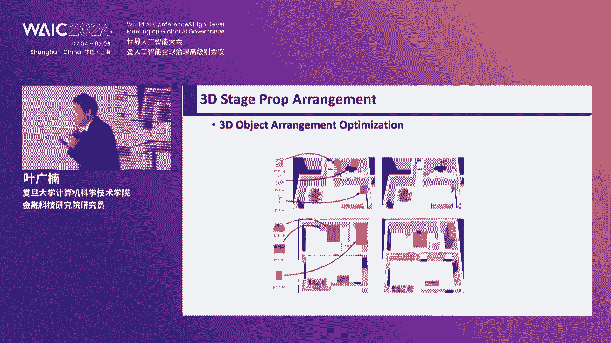
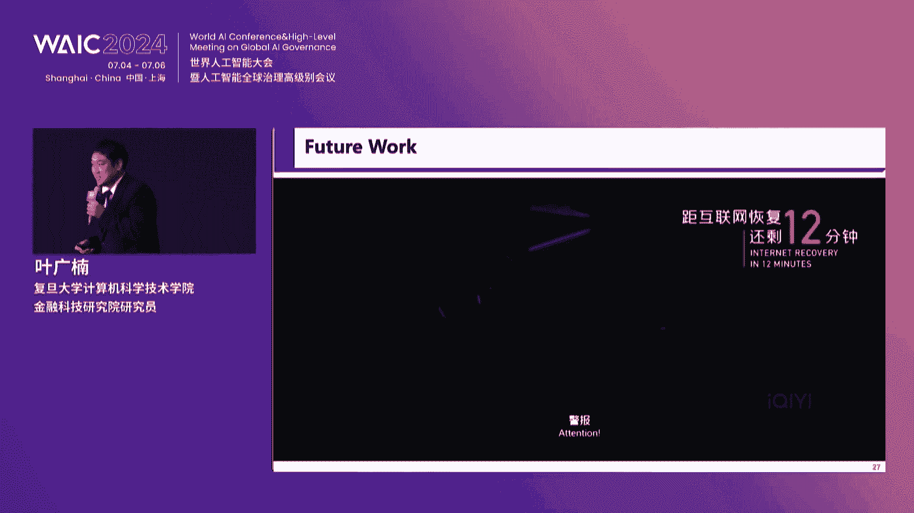
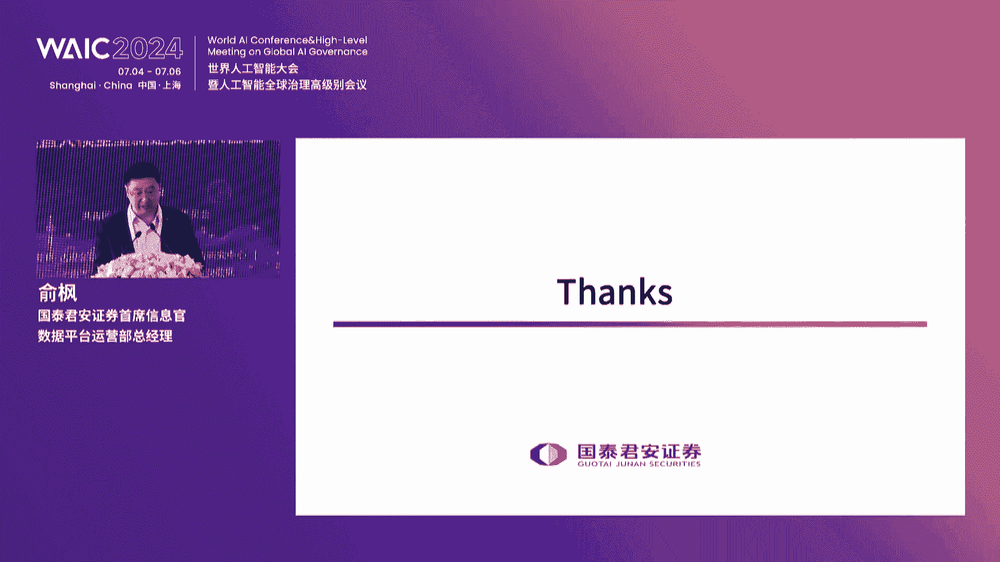
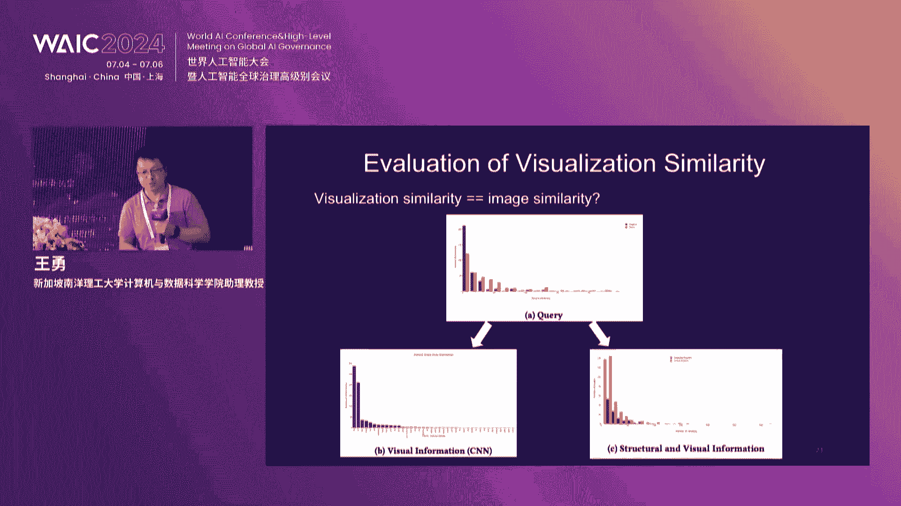
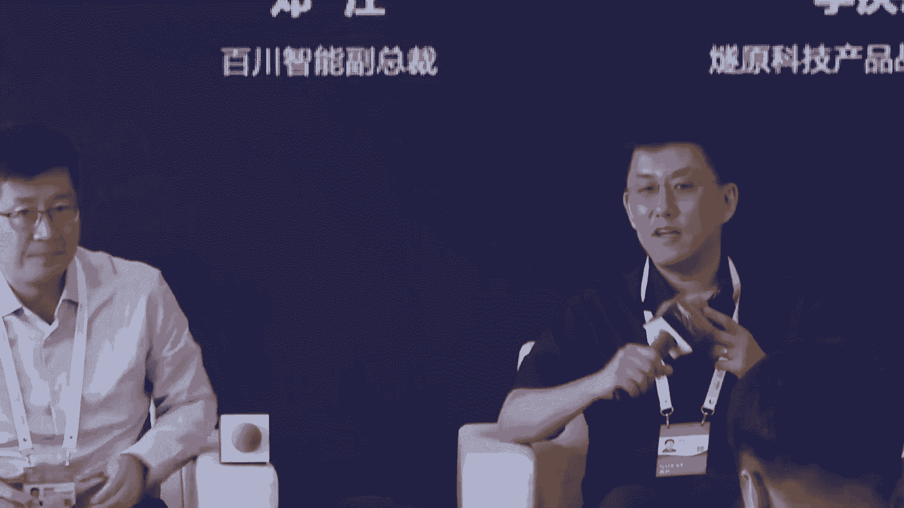

# P58：20240706-知识改变世界——垂直大模型重新定义知识管理 - WarrenHua - BV1iT421k7Bv

🎼达关数据是一家为企业提供各类场景智能知识管理的国家高新技术企业，是行业首家国家级专精特新小巨人企业，于2015年在普通张江成立。

在北京、苏州、深圳、成都、长沙等地相继成立子公司、业务和品牌向全国全面推进，达关核心管理团队由业界知名技术和业务专家组成。

凭借研发团队丰富的技术积累和深厚的行业经验成功研发出国内最全智能文本处理产品矩阵。智能文档处理IP随着大模型加知识户KMS智能推荐。🎼智能数字员工RP。🎼智能文档处理IP可以做文档的抽取审核。🎼比对。

🎼知识库KMS可以做文档的管理。知识库的问答。🎼写作搜索。🎼智能推荐可为企业做各种内容的个性化推荐。🎼智能数字员工RP可做跨系统之间的数据自动同步、抓取、填报等，目前已成功应用于制造、政务、金融等领域。

并受到客户的一致认可。达官数据多年来屡次获得国内外权威机构颁发的荣誉和奖项，其中包括中国人工智能领域最高奖无文俊人工智能奖。🎼全球顶级技术竞赛ACM世界算法竞赛冠军。

🎼多次荣登福布斯无润百富人工智能五十强，资质齐全，赢得多方权威认证，全面兼容信创，同时申请了200余项发明专利，并与北京大学、复旦大学、上海交通大学等知名高校建立产需研合作，其中。

与中国工程院、柴红峰院士、复旦大学建立金融垂育应用大模型联合实验室，专注金融垂直大模型的研发应用，达官高度重视产品交付质量，建立健全客户服务和质量管理体系，提供重点客户服务权益包，定期客户满意度调查。

达官以积极践行企业社会责任，数年来赴云贵川等地山区小学捐家爱心图书史多年组织员工无偿献血科技助产、关爱弱势群体，达官数据，一志秉承着务实求真、通达乐观的价值观。何成伟做中国第一的智能文本处理企业的愿景。

实现知识。🎼能管控降本增效，达罐数据，智能文本处理专家。🎼达官智能知识管理系统对组织里每位成员的知识进行采集、积累、挖掘、运用，让知识可以传承，工作更加高效。

组织内部的各类报告、资料、制度、档案、邮件、外部的情报、资讯、文档等都蕴含着丰富的知识，将这些信息汇集起来，加以利用非常重要。达观知识管理系统运用大模型和人工智能技术。

对组织内外部的各类信息进行存储管理，萃取挖掘和运用，帮助每个组织实现知识驱动的智能化工作。🎼知识空间提供文档资料的分类、存储管理功能。

有可靠的权限管理和备份存储功能支识图片、音视频、表格数据等各类多媒体内容的多人编辑和内容管理。🎼知识百科积累专业词条的权威事宜，并将各类百科词条相互链接在一起，形成组织自己的微体百科系统。

🎼知识问答提供FAQ常见问题权威问答本，专家解答社区互助问答、AI智能问答。🎼知识培训专家培训资料、岗位技能系统、在线知识评测等模块，帮助各岗位员工快速学习成。

🎼达观KMS包括曹植大模型在内的国内外各类大模型重分结合，实现了对知识的深度加工和组织的创新应用。🎼实现各类自动化的文档审。🎼协作问答、分析等智问能。🎼智能搜索问答运用检索增强RAG技术，精准获取知识。

列表式搜索，提供多种条件筛选功能，支持全文模糊搜索。问答式搜索，提供知识溯源，并有官方权威问答，专家问答，社区问答等多种细分类型的标题。

还有数据问答NL结果动态图表生成等高级功能达官还创新性提供知识脑图式搜索，自动生成有层次调理的脑图是结果，用于对问题的深度回答。除了人找知识。好呃，各位嘉宾我们可以把手机呢调到震动或者是静音状态。

我们的论坛呢马上就要开始。啊，实在抱歉啊，因为我们的呃论坛的这个集极一堂好，已经没有座位的有座位的呢，大家坐一做没座位，没有预先预定好这个位置的我们的这个观众和各位专家朋友呢就辛苦一下。啊，呃。

但是呃一定不往您得辛苦这场论的关键字段进。🎼提炼和分析，实现自动归纳。🎼完的。🎼审核提取、分类归档、自动填报等高级文。🎼以及数据。🎼评价、外部数据导入和交易等创新模块，围绕知识管理产品。

达官还提供配套服务体系，包括组织内部。好，尊敬的各位领导嘉宾。各位同仁，各位媒体界的朋友们，各位思维的探索者、知识的追寻者、实践的落地者，大家上午好。我是达关数据的首席战略官刘江贤。

去年呢在WAIC论坛主持的时候呢，我还是一位达关数据的新人。那么一年过去了。去年也是在这里，我们首发了曹植大语言模型啊，我们达官主办的论坛呢也赢得了WIC的最佳人气奖之一啊。

一年之后我们将会有哪些新的动作，有哪些新的理论成果展示，有哪些全新的发布呢？值得期待，也希望大家拭目以待。今年的WIC呢。这个新词啊轮番上演，论坛的思想激荡。展览的新品呢也是不断。上海宣言。

人工智能全球治理45度平衡率技术创新政策引领并重、产学园深度融合的。有用的AGI可证明的安全的AGI等等一些新的术语新的词呢在不断引发业界和学界的思考。知识改变世界，垂直大模型重新定义知识管理。

你看看在我们的主题里边。有一个词出现了两次，对，就是知识。知识呢是人们在社会实践中所获得的认识和经验的总和，这是完整的过去的概念。那么今天在直今天的论坛上，我们将重构知识的概念。

今天我们将以前所未有的方式重塑对各种知识的探索管理和应用新范式。本次论坛呢由共青团上海市浦东新区委员会策划，由达官由复旦达官金融垂语应用大模型校企联合研究中心。

上海市浦东新区青年联合会和达官数据的共同主办知识单位呢是复旦大学协办单位、上海现代服务业联合会互联网科创服务专业委员会、上海市信息化企业家协会、中国计算机学会CTO club上海分部。

上海市浦东新区科技产业青年联游联谊会一起来承办。首先为大家介绍本次论坛的领导和嘉宾，他们是。全国政协常委、民建中央原副主席、上海市政协原副主席、上海公共外交协会会长周汉民。

周海民先生呢今天有重要的公务啊，临时调整为线上参与。稍后他将为本次论坛开幕致辞，让我们欢迎中国工程院院士、复旦大学金融科技研究院院长柴富峰院士。上海市档案局局长、上海市档案馆馆长徐卫婉女士。

共青团上海市浦东新区委员会书记、浦东新区青年联合会主席赵辉茂。复旦大学金融科技研究院常务副院长、计算机科学技术学院副院长吴杰。复旦大学计算机学院计算机科学技术学院金融科技研究院研究员叶广男。

新加坡南阳理工大学计算机与数据科学学院助理教授王勇。国泰君证券总裁李俊杰。国泰君安证券首席信息官于峰。穗源科技创始人、董事长兼CEO赵立东。达观数据创始人、董事长兼CEO陈韵文。

安永咨询数据智能服务合伙人陈建光。百川智能副总裁邓江。他们两位还在另外一个论坛赶来的路上哈。😊，穗源科技产品战略副总裁李庆恩。曙光集团智能计算产品事业部副总经理胡晓东。上海市信息化企业家协会会长戴建彪。

共青团上海市浦东新区委员会副书记、浦东新区青年联合会副主席高远。呃，当然了，还有来自全国的我没有这个来得及介绍的呃，金融证券制造业的达官的贵人们，我们简称达官贵人，一并用热烈的掌声，欢迎大家的到来。呃。

首先呢我们有请全国政协常委、民建中央原副主席、上海市政协原副主席、上海公共外交协会会长周汉民先生献上致辞，请看大屏幕。各位嘉宾。女士们先生们。2024。全球人工智能大会。在上海如期举行。几年来。

我们坚持不懈。与世界为伍。为人工智能的发展。做出重要的推动。我们的分润坛。今天讨论是。垂于大模型的建设和前景。我认为。十分必要。垂玉大模型在中国的发展。有它非常鲜明的特征和优势。那就是。我想。

对权益大模型的发展。政策支持。十分到位。第二。我们的。数据。资源。相当丰厚。第三。应用场景。在不断的拓展。第四。社会逐步形成共识。对。垂于大模型的发展。要继续予以关注和支持。我认为。

权益大模型在中国的发展。与中国式现代化。五大特色。是十分吻合，相当切底。首先。中国是一个人口规模。巨大的国家。14亿1000万国人。在共同推进中华民族的伟大复兴。垂玉大模型。就是为了让。我们中国人。

能够用得上。用得起。用得好大模型。一此。在人工智能的发展上。走出自己。有中国特色的道路来。正是因为。人口规模巨大。锤玉大模型。可以使得我们在某些领域。逐步赶超。世界先进水平。那一次可以。在。某些领域。

有独创性的发展和贡献。其实。中国是现代化的特征。是强调共同。富裕的现代化。共同富裕。要解决。城乡差别。区域差别。脑力劳动和体力劳动的差别。农业和工业的差别等一系列。影响。全体人民。走共同富予道路的。

种种因素。不会一蹴而就。对。纵使千难万险。也得一路前行。而垂于大模型。他的腌制。开发和应用。会拟合刚才提到的四个方面的差异。未。全体人民。走上共同富裕的道路。奠定物质技术。2024年。

中国的数字经济规模。一定会在2023年。56。1万亿基础上。继续增长。而在垂于大模型领域的突破。会是增长的动力。我们对大模型。十分了人。综合性的大模型。有些优势。锤大模型。

更具备我们要解决一些重点领域重大问题突破的。路径和曲向。因而，他与中国是现代化。是特征。是吻合的。第三。中国是现代化。强调人与自然的和谐共生。习主席。早在2020年。已经向。联合国大会。庄严宣告。

中国要在2030年前，碳达峰。2060年前，碳综和。双碳战略的具体落实。十分艰险。今天可以说。碳达峰的时间可能提前。碳综和的努力十分艰巨。因而，垂语大模型。对气候变化。对新能源的使用。对。产业革命。

对生活方式的变革。都可以起到推波助澜的作用。婴儿。与中国式现代化、人与自然和谐共生的特色。也是十分吻合的。第四。中国式现代化。强调物质文明和精神文明的。高度透明。我们现垂玉是大模型。

就是提供了一所无远佛界的学校。让古老文明。与今天的人们。能够携起手来。各位看到。各地的博物馆。今天成了多少年轻学生？趋之若鹜的场所。但即便如此。对博物馆博大精深的。展成。和中国。

5000多年伟大文明的学习。任何一所博物馆。他只是沧海一粟。如果我们能够在垂于大模型方面。更注重。文明的赞成。文化样式的创新。让博物馆。走向大众。他一定会对。物质文明与精神文明高度统一。做出应有的贡献。

最后。中国是现代化的特征。是走和平发展道路的现代化。锤玉是大模型的发展。他绕不开几个基本问题。第一个问题。是闭缘呢。还是开元呢？第二。大模型的腌制。是。我们。独胜。脐橙。还是与世界广泛合作共享盛举呢？

第三。存语大模型。要不要进行？国际比较。和向。最高标准最好水平学习。我以为答案是不言自明的。那就是。尽管今天大模型的央制。有开源闭源两种选择。我相信。久而久之，人们都会认识到。开元。可能是方向。

大模型的研制。往往是几个人。一个团队努力而成。但久而久之。国际合作就显得十分必要。成以大模型。他的发展道路。一定会。更强调向世界。最高标准和最好水平的学习。这一点。及中国46年改革开放的经验。

已经得出明显的结论。就是。改革开放。是我们的重要法宝。改革开放。是我们的制胜之道。😡，垂于大模型的发展。离不开改革开放。离不开更大范围。更高水平的改革和开放。有时。我衷心给予今天。我们的论坛。

在垂于大模型。相关技术。研讨的同时。始终了然。这一层。数字革命。他要实现的基本目标。是产业的数字化。是数字的产业化。这两块。一定要成为。我们处于大模型研制和开发。是前提。更深入的了人。

中国经济发展的现实。更急切的投身于。😡，中国工业。现代化的。洪涛巨人之中。让我们随大模型的发展。始终与经济发展同步，与社会发展同行。衷心祝愿今天的论坛圆满成功，谢谢大家。谢谢周汉民主席。

我们都说见字都如面。那么在线更是在先啊。呃，周汉民主席有三个提问啊，在演讲过程当中是开源还是闭源，是独善其身还是共享盛举，是国际？比较和最高水平看齐的国际合作，还是自己闷起头来来做答案不言自明。

周华民主席呢在演讲过程当中，他把垂于大模型，对技术对于产业又和中国式现代化的这个内涵呢进行了有效的连接。而且说把物质文明和精神文明的高度统一用知识用AI治理把它凝在一起。好。

我们再一次用掌声谢谢周汉民主席。虽然他今天没来呃，过后呢，我们会把大家的谢意和致敬，当面的带给周汉民主席，谢谢。那么接下来我们掌声有请来自上海市档案局局长、上海市档案官馆长徐蔚婉女士致辞，大家掌声欢迎。

尊敬的柴宏峰院士。各位领导，各位专家，各位朋友，大家上午好。非常荣幸呢能够应达官数据的邀请出席今天锤玉大模型应用论坛。如果说这两天的上海啊。什么能够热过上海的气温的话，就是本届世界人工。智能大会的召开。

昨天呃，李强总理也莅临大会啊做了重要讲话。那么作为档案领域的代表啊，能够在这个场合和大家共同探讨。火爆中的火爆的话题就是锤玉大模型这个话题的话呢，我也感到很荣幸。同时呢也感到非常有挑战。不过呢。

我觉得因为啊为什么觉得有挑战呢？因为在绝大多数人眼中啊，毕竟档案啊还是和。文科更相关啊，加上技术，尤其加大模型的话，也许跨界的有点过分。但是呢横向比较我们全国的档案件。上海的档案人啊。

因为身处在这样一座魔都当中啊，我觉得我还是非常自豪的讲。我们上海档案人一直以来就自带一种酷酷的科技感。我们也特别努力的奔跑在数字化和智能化的路上。在十四五之初啊。

我们就提出了数字赋能档案事业高质量发展的目标。如果说在新的时代新的征程上，让档案工作这样一个传统的工作，能够实现新的发展，实现更高质量的转型发展的话，插上数字化的翅膀。现在是插上智能化的翅膀啊。

如果是今天讨论完了，觉得还可以插上大模型的翅膀的话，我觉得一定是能够推动上海的档案工作向高质量转型发展。在这个十四五期间，我们已经有16项科研项目纳入到了国家级的档案系统的科研项目中。

其中许多个项目都已经荣获了国家档案局的123等。荣誉称号啊，科技成果荣誉称号。这里面啊有许多就是档案加人工智能。档案加区块链。档案加数字人文、档案加知识图谱等方面的探讨和研究。如今。

如果各位有机会能够走进我们上海市档案馆啊，他在这里不远处啊，龙阳路上。或者是某一家区级档案馆。我们目前16个上海区的档案馆全部已经创创建成为国家级的示范档案馆。其中。

青浦区档案馆、浦东新区档案馆、静安区档案馆都是以全国第一的成绩，就当年度第一的成绩，通过了数字档案馆的全国示范数字档案馆的测评。比如说你在今天的档案馆里可以看到一品管天下的一丙管全管的智能管控系统。

他不仅仅是管。我们这个管的安全。也可以通过一个平台。来实时监测整个库房库区的。温度湿度。保证每一份档案在每一个角落里都能得到科技的首位保护。我们在库房里面已经能够看到认真调档的机器人啊，人形机器人。

在我们的阅览大厅里，你可以看到穿梭在利用大厅里，你可以穿梭穿梭在库房和利用大厅的机器人啊，这样的话可以使得我们人工的这个这个接触档案的频率会越来越少。我们也可以看到，基于时空地理知识图谱的档案查阅平台。

现在可以外网上看，可以上上网上互联网查叫跟着档案，跟着数字呃，跟着档案看上海数字人文平台。目前已经有。80万人次的访问量在上面通过检索地理信息和知识图谱来了解上海这座城市的文脉和品格。

有些库房也已经开始使用，不是传统密集架的库房，而是。这个魔术方块式的。叠层叠式的这个库房来集约的管理档案工作。在我们市档案馆也正在尝试使用数字胶片AI修复的方式。

为长期储存在上海档案馆的这些档案提供更加有效的保护措施。那么，为什么绵延千年的传统档案工作在这些年能够如此快速和深度的同数据工具前沿科技，尤其是人工智能实现了融合呢？我觉得因为从档案工作的基座来说。

我们是一座档案馆，更是一座拥有海量数据的数据库。那些静默的躺在库房中的档案，在一代一代档案人的努力下，已经转变成为了海量的数据。目前，上海市档案馆拥有525万卷件档案。

这个馆藏量是全国省市省级档案馆中藏量最大的。其中62%已经数字化了。那已经量也很大了。我们的数据储存量达到了1207。同时的话，伴随着电子政务、电子发票、电子签章等方面的工作啊，快速的推进。

各个行业领域啊，包括我们今天来的很多啊金融机构。教育界。媒体界。啊，比如电视台啊这些在他们都在档案储存、整理、挖掘、利用等方面，应用的需求不断得到升级和提高。你比如说电视台他大量的数视频数据。

他也是档案啊，他怎么来长久保存啊，怎么来转化成为更新的一些东西呃，形成一些新的效果。像我们于总的国泰君安啊，您的这个金融机构的数据档案。持久的保存在那里。怎么来发掘出他的新的价值？

人们对于留存档案、工作溯源、经验提炼、数据查考、专题检索、史料编沿。刚才汉明同志也讲到，文物的在线从塑新媒体的传播等等领域的要求越来越高。这些要求都催生着档案工作。

从收管、存用各个领域各个环节需要不断的更新和迭代。今天我们谈大模型，虽然我本人对于大模型的认知啊，只能停留在外行看热闹的阶段，但是我相信在大模型的加持下，那些深藏在库房里的所谓的档案固执堆。

一定会羽化成为新生的力量，在传承历史、赋能现实、连通未来当中，发挥他们独特的价值。习近平总书记强调说，档案工作是一项利国利民、惠及千秋万代的崇高事业。经验得以总结，规律得以认识，历史得以延续。

各项事业得以发展，都离不开档案，要求我们档案工作能够走向依法治理，走向开放、走向更加现代化。我们非常希望在座的各位专家、各位朋友能够认识重视、支持档案工作。

也衷心的期待上海档案有机会同在座的各位取得合作共赢的机会，让传统的行业插上人工智能的翅膀，形成新的气象和新的应用，再次感谢各位，同时也预祝本次论坛，取得圆满的成功。谢谢大家。酷酷科技感的档案人。

感谢徐局长致辞啊。其实档案管理里面呢有无尽的资料，无尽的知识宝藏。我们达官数据呢未来也特别愿意在您刚才提到的这个档案信息化数据化的建设上做贡献啊。我刚才听到说在贵宾间短短的一段时间里面。

已经有了一些课题的意向了哈，真是上海速度AI速度啊，不过给徐局汇报一下，跟着档案看上海这件事啊，我们在六一前后啊呃呃这个跟着我们复旦大学的计算机学院的老师们我们的王鑫书记。

还有这个延长主任和我我们一起呢已经把这个课程的送到了云南大理永平县，我们的职教课堂上。嗯，好，我们再用掌声谢谢学院局长的致辞，谢谢。😊，呃，接下来我们将请上的嘉宾呢，去年论坛也做过演讲。

不过去年是在线上，今年是在线下。在过去的一年中呢，他带领着复担达观金融锤艺大模型应用联合研究中心啊，承接了国家重大专项课题，也见证着达官呢参与金融北京金融科技产业联盟大模型的大赛并获奖。

而且不断的敦促有组织的科研在金融业AI落地的。🎼中国工程院院士柴洪峰先生，我们掌声有请柴院士演讲大模型在金融领域的应用与思考，谢谢。😊。

这个各位领导，各位专家啊，刚才。呃，徐局的演讲，实际上咱们档案现在在大语言模型的时代，数据的语料是非常关键的。因为大家都知道一个数据。一个算法，一个算力的规模效应。呃，然后呢就实际上大力出奇迹啊。

出现了我们的这个呃大模型的涌现的突破。那么刚才呢我们主持人呢也介绍了，就是说和达官这边配合，就是呃参加了。这个国家的这个金融界的。这个领域的这个大模型的这个相应的比赛。那么今天汇报的内容呢。

这个应用的角度上，这些案例包括有国泰君安的，有我们达观的有相应的银联的啊这些优秀的案例，实际上都是在这个比赛的过程当中展示的我们行业金融行业的吹役的一些应用。再一个呢，根据这些应用啊。

现阶段围绕着人工智能这个大会上啊的一些和专家们的讨论的一些思考啊，有3点啊，借此机会呢向大家交流。呃，交流呢主要是分这样的三个三个部分。呃。那么金融业呢作为数字化。

智能化的先行者实际上在大模型的应用实践方面呢，已经探索了与实体经济相融合的多种多样的场景。那大家都知道呃，金融呢的宗旨就是为了实体经济的服务。那么所有这个金融也衍生在实体经济当中，呃。

人类的几千年的文明史。既有我们的文字史传递了我们的知识，那么积淀成来成为大汉，对吧？也有我们的所有的算法。然后会计的记账法产生了我们的金融的行业，也产生了科学的。这个分支。那么在这个过程当中。

金融呢作为垂玉的一个应用领域，也是有望成为大模型技术落地的最佳的领域。但是呢通过呃后边介绍这个情况来看，我们金融大模型还处于一个起步的阶段。那么呢如果分为三个阶段的话，就是我们人机结合的三个阶段。

一个是。人的智慧。和机器的智慧还是以人的机会为主，就是完全在这个呃这个。今天早晨的和于总的交流了，还得最后决定起还是靠我们人。第二个阶段呢，以机器为主，人的为辅。第三阶段呢。

完全是人机交互的融合在一器融合在一起的这个三个阶段。那么在这个三个阶段的过程当中，呃，应该怎么。发展现在金融业的行业的大模型的金融应用的主要流程是。

通过明确需求预评估场景测试、模型训练、模型优化测试上线这样几个流程，完成了我们金融大模型在金融行业的现在的广泛的推广。那么在应用的场景上，搞营销客户服务。产品运营风险管理啊，这样的几个场景。啊。

一共21个呃这个优秀的案例当中，基本上分布在这样的5个的场景当中。首先看在业务支持方面。那么金融机构可以利用大模型技术为研发运营、办公等多个场景提供知识。提供了提高了工作效率和交付质量。

从而呢为员工创造更加舒适的工作环境。进一步的提升了员工的工作效率，降低了运营成本。我们达关数据的大模型的智能写作平台服务场景这个实力啊，也获得了上次的评审的卓越奖啊，那么。所以在研发方面呢，在系统设计。

代码生成与补全代码翻译与注释、辅助测试等多个关键环节呢，为技术人员呃提供帮助和支持。在运维方面呢，凭借良好的语义搜索能力，能够协助运维人员高效的处理各类的结构化、非结构化的数据，快速定位问题的所在。

从而缩短故障的排除时间。那么刚才说到了我们达观的这个数据研制的大模型智能写作平台。可以应用于金融研报的初稿生成、文档解析、材料解读、文档审核等多个场景。在市场营销方面，针对面临的相应的问题。

大模型赋能提升客户的营销服务的体验，为客户。提升全渠道个性化、有温度的金融服务。在客户服务方面。相较传统的方法，大模型具有良好的自然语言的理解和业务场景的泛化能力，能够准确识别用户的意图。

并快速精准的回应用户的需求。在产品运营方面，那么我们国泰君安利用大模型为券商领域提供智能的投顾服务。同时呢在可以在信贷等多个方面提供有力的支持，自动化处理繁复的日常工作，释放了人力资源。

使员工呢能够更专注于更高价值的工作内容。同时，在投顾信贷方面呢。大模型也有相应的场景应用。那么金融机构是经营风险的。风险控制的是金融业的核心要物，对于维护整个行业的稳定性、安全性至关重要。

那么银行基于transformer模型构建了人工智能的反欺诈的应用。用于挖掘账户的异常交易行为模式，并进行异常的预警。同时考虑了实体之间的交互信息与实续信息更加符合实际的金融场景。所以，在合规知识问答。

法律审查真伪校验等方面也发挥了一定的作用。但是在这方面呢，我们后面还会谈到一些问题啊，就是大模型在金融行业有很多的场景应用。但是面临的诸多问题是哪些，我们归纳起来。

通过上次的这种检验有这么四个方面的问题。一个是金融应用规范及指南继续完善。二是呢大模型的应用范式呢还是不够丰富。三是呢高质量的金融训练数据呢还欠缺。最后呢训练的算力呢知识呢普遍不足。

但是重点要突破大模型在金融行业的应用发展。建议或者突破点应该是什么？什么叫做突破点？在座的各位领导，各位专家。那么大模型给人的眼睛一亮的时候。

实际上是在它的在于人的智力和发现不了的那些的知识点的知识的生产力的那涌现效应。那么涌线效应在垂直领域应该。怎么发现？我个人今天呢和陈总啊在这方面也进行了讨论。在车上呢和叶克来教授呢也进行了相应的讨论。

呃，举这样的一个例子，这个涌线的效应，如果有传统的牛顿力学，看我们现在的机械力和人力结合的突破。我们做的汽车的场景上，坐的火车的场景上，坐的轮船的场景上。坐的飞机的场景上。

所有的动力的延伸和人的人力的延伸，使我们应用动力的这个技术是有广泛的应用了。那么我们智力的延伸要突破，发现那些点一定是这样子的应用场景有相应突破。就是机器的智力，再加上人智力的交互产生的应用的突破。

一定是那样的一种场景啊，想象啊另外一个什呢？这个有限效应。我们现在都集中在大语言模型进行影线效应的突破，很难突破一个象声顶层的天花板。但是如果在垂直领域，我们定义有限的界限，打造大模型的金融的数据底座。

这个数据底座的广泛的数据是不是就像阿法 zero？或者是阿er food这样子的来进行定义相应的空间和算法的空间，以及数据的空间进行涌线效应的突破。那么这种有限效应的突破。

实际上也是符合大数据大参数大计算的尺度的定理的要求。那么只有这样的突破，才能够在某些垂玉，实现这种垂玉的知识的生产力的提高，产生人的智力，加上机器的智力，超越现在复杂系统。

人的智力不可突破的那些的认知的技术，实现21世纪，我们重大的知识生产力的挑战的。这个突破。所以这是第一个观点。但是这个观点的核心。就是刚才的徐局，他们这个档案的数据的饮料整理起来，为所有的我们锤艺领域。

对。能够发挥相应的作用的。但是呢又不是完全依赖于。这个大力出奇迹的这种既依靠大力出奇迹的规律，要用大力出奇迹的规律，在不同的领域，用不同的算法和不同的算法空间来产生这种的涌现突破啊。

这是我的啊一个思考的在这个思考的空间呢讨论了很长时间，就是在哪些地方产生涌现的突破。第二个，工程师的组织。那么以人工智能为核心的科学范式呢，是开启了人际共融为特征的科学研究的新篇章。

大模前在金融行业的交叉应用，通过协同反馈以及内外迭代，不断的优化自身涌现产生的新事实。赋能科学发现、技术发明和工程创造。这个呢核心是工程创造，就是集成创新。那么呢，我是想。

就是把现在的大模型的在复杂环境混乱的环境下，能够和知识图谱进行叠加的应用。这个叠加的应用，知识图谱产生可预期的、可信的这种的角色是对外服务。我们大模型产生发现的这种幻觉，哪不是幻觉。

是对内我们的专家提醒我们哦，这有你想象不到的东西。我们所有的幻觉的发现的凸现，这种的持续的环境，换捷的问题，不断的迭代的优化的过程当中，产生新的知识，产生新的知识图谱的扩充。那么这是就是一个工程上的。

这个实现的集成，把这两个集成在一块来进行工程落地。因为我觉得。呃，今天早晨一到，我就是。和我们已经参会的很多的专家，包括陈总去交流，这是大会的主题主要的一个。就是落地。那么在工程的落地。

大模型在金融行业的融合的创新，是不是可以用这种的方式？来进行的集成的创新，来使我们的知识生产力对外服务和对内的发现能够结合在一起，能够把科学的发现和技术的发明和工程的创造啊融合在一起。啊。

这是第二个思考点。那么最后一个思考点也是后边一个程序所规定的动作。也是呢我们复旦大学和国泰君安随缘科技达观数据一块要产生的产学业的合作。针对工程管理的组织问题，通过软硬一体。

供需统筹产学业协同创新格和创新管理合作的模式。实现人才密度、科研的强度、创新的速度啊，这个三度的融合的有效的集成。推动金融大模型的研发和应用，加速行业的智能化和数字化的转型。那么。

这个应该我们的国泰君安是在证券行业的。呃，第一线。那么他提出的需求。那么由我们的供给方达官来合作，呃，包括和我们的CN科技对吧硬染合作的一体来进行合作。那我们复旦大学作为研究单位。

不断的通过供需两方产生的实际的科学问题来进行科学的发现，通过大家合作进行技术发明，然后共同创造。那么这样的一种有组织科研，是供需直接见面，直接面向场景，直接面向数据。

再叠加上像呃这个徐局长这样子的这个档案的语料的这种支持，对吧？我相信呢啊我们的这个创新的实践，一定能够在某些领域，在金融的某些领域产生有限的突破效果。

在这个全国科技大会的国家科学技术奖励大会两岸炼士大会上，中央领导都提出了这个相应的要求，特别是做好科技金融这篇大文章，要求我们啊这个我们这个证券行业啊要早一点所有的人叫投早投小这个投长期投硬科技，对吧？

在这个过程当呢，做好。那么呢实际上到2035就只有11年的时间，让我们共同在这个11年的时间做好有组织科研，为科技强国做出我们的贡献。我就说这些，谢谢。做好有组织的科研应用应用落地落地场景场景。

正如刚才呃院士所讲的，我们借助行业的力量，借助企业间的各自的优势，发挥各自所长，实现共治共赢，复旦大学金融科技研究院国泰君安、穗源科技达观数据呢正在为此努力，在院士的关心下呢。

由复旦大学领衔基础科研穗源科技提供强大的算力。达观数据专注于大模型的构建，国泰君安则将前沿的技术呢应用于场景实践。四方携手共同让大模型高效落地。接下来请允许我向各位发出邀请，来共同见证。

由复旦大学金融科技研究院国泰君安证券穗源科技和达观数据四方的战略合作签沿仪式。我们将请上复旦大学金融科技研究院常务副院长吴杰、国泰君安证券首席信息官于峰。

穗源科技产品战略副总裁李庆恩作为机构代表进行签约。同时我们也隆重的请出中国工程院院士，复旦大学金融科技研究院院长柴国峰院士、国泰君安证券总裁李俊杰先生、穗源科技创始人董事长兼CEO赵立东先生。

达冠数据创始人、董事长兼CEO陈玉文先生，作为本次签约的见证人，我们掌声有请。🎼我们来点音乐好不好？🎼No。🎼No。🎼，🎼Yeah。🎼好，谢谢各位领导和建谦的。😊，嘉宾呃，我们请落座。

我们也相信啊四个机构将充分的发挥各自的专业优势，通过战略合作，共同探索垂直领域大模型技术。在金融行业啊，在金融行业的。证券行业的研发与应用，加速智能化和数字化的进程。期待在未来的日子里的。

我们能够共同见证这一合作带来的丰硕成果。哎呀，的确呀这个今天的座位有限啊，也难怪我们每年的达官数据呢都能够成为这个WIC论坛的这个人气指数的这个报表的一个重要论坛啊。

我们想请呃站在门口的这个嘉宾呢往前对，过道往前。不过不好意思的是确实没有位置了，过道往前，可能后续门口还有一些嘉宾要陆陆续续进来。或大家往里面坐，往里面坐，往里面站，不好意思往里面站。呃。好。

接下来呃是达官时间啊。去年的时候呢，我们在这里。向大家官宣了达观的曹植大语言模型啊，我们是多语言垂直化啊，还有这个这个长文本的曹植大语言模型。今年达观又有哪些新的成果，有哪些新的期待来给大家展示呢。

我们掌声有请。🎼达关数据创始人、董事长兼CEO陈俊文先生为我们带来垂直大模型与知识管理的前沿发展与应用的主题分享，大家掌声欢迎。🎼各位呃达官贵人们哈，大家上午好。呃。今天也非常高兴啊。

在世界人工智能大会的现场给大家来分享我们达观在垂直大模型和知识管理方面，我们的一些前沿的应用和我们的一些思考哈。呃大家也知道我们达观数据啊，是一家专注于做智能文本处理的一个企业哈。呃。

我们根驰在这个上海的张江科学城。我们从2015年创办到现在为止啊，这个经历了很多年也逐步逐步啊这个建立起了我们达观的文档资料智能化处理的全套这个产业链哈。

那个大家看到我们从最底层的我们把各种样的企业的文档资料汇总在一起，用数据基座管理起来。到我们中间我们开发了很多AI能力，对这些文档资料做自动化处理到上面啊，我们在构建各种样的应用系统啊。

从这个基座到能力到应用。我觉得我们逐步形成了啊这个从下至上的三个层次的这些工作。😊，哈，那么我也很荣幸呢在过去几年，我们也成功的成为了行业首家的国家级的专精特性啊，小巨人企业。

目前呢在国内的智能文本处理的这个领域里面，我们的市战率和案例数量也是领先的哈。呃，那么我们今天啊看到大模型时代，我们自己对这样的一个词啊，有一个自己全新的解读，就是知识啊，这个这样一个词哈。

我们把它解读为一个叫知，一个叫实，什么叫知呢？我们今天我们把大量的文档资料。😊，语料它的汇集它的分析，我们把它形成一个叫知识库啊，这个是我们所有智能的来源所在。什么叫实呢？

我们用大模型技术对这些汇集起来的大量数据资料进行辨识和分析，进行理解。最后形成我们的这种应用源源不断的智能的来源，这个叫实，所以知和实啊，我觉得我们中国的这样一个啊传递这么呃这个什么久远的一个词。

我觉得在今天是有了新的解读的哈。啊，那么在我们过去的这个发展过程当中啊，我们思考我们达关的定位在哪里啊？我们把它总结为啊，我们叫做垂直大模型、行业知识和场景化的文档啊处理啊，三个部分哈。

我们讲垂直大模型是什么呢？是针对我们落地来用的。我们都知道这个啊所有的这些模型啊，最终在产业界落地的时候，我们是需要能够在一个一个的细分领域发挥作用的。所以大家看到我们在这边。我们针对垂直领域。

我们开发垂直的产品，并且啊吸引垂直行业的合作伙伴一起帮我们来营造大模型落地的工作。这是我们达官的使命哈。另外呢知识，尤其是行业知识对我们来说非常的重要哈。那个我们叫要聚集特定的数据，开发特定的功能。

并且做特定任务的优化工作。场景化的文档资料处理呢是我们最后落地的环节啊，这个待会儿啊我会详细的给大家介绍一下我们的这个啊场景化的文档处理的工作。因为我们相信所有的工作最后都要落地啊。

落地需要相应的啊这个啊文档的处理的功能来承载哈。那么也给大家汇报一下我们呃达官的曹市大模型啊，在过去一年的发展啊，在去年这个世界融证大会上面，我们第一次宣布了我们的这个曹值大模型。在过去一年啊。

我们自己在我们的这个模型上面做了很多积节探索。一个是我们的参数规模啊也逐步逐步的提升。目前啊我们现在主力的这种这个模型的参数规模达到了700亿啊。另外呢我们在垂直领域的话。

我们发现啊垂直语料和专业语料的混合啊，这种50%对50%的混合能起到一个比较好的时间的这个作用啊，就是说我们需要我们的模型，既需要有通识的这个知识，也需要垂直领域的专业知识。

这种方式混合出来的模型啊性价比非常高。而且在专业领域的效能会更好一些。另外呢我们在指令微调领域里面，我们在过去一年时践当中啊，我们构建了我们的一个比较好的指令微调的一个数据集合。

大家看到我们在我们的这个构成指令微调的数据集合领。我们有30%的是通用的指令啊，这个就是我们大量的这些常见的日常啊常识和工作的指令。我们有20%是我们NLP的任务指令啊。

比如说我们NLP里面有一些基础性的任务，像抽取啊像分类啊等等这些啊这个我们有20%用来做啊这个任务指令呢。我们现在已经积累了100万的这个啊这个微调指令哈。

还有呢超过一半的啊这50%的是我们的垂直领域的指令。这个其实是我觉得是在垂直领域里面大幅度提升工作效能的一个关键啊，我们把这三部分结合在一起啊，能够比较好的实现。我们达官的这个曹值大模型。

在垂直领域里面更好的深根更好的提升效果哈。而且呢我们也很荣幸呢啊通过了国家的网兴万的第三批的深成式人工智能的服务备案啊，这个我们现在达呃这个达官的曹值啊啊现在是属于持证上岗的这样一个状态然后。

呢我们再介绍一下我们模型的一个特点啊，我模型我们是强调叫呃多模型混合哈兼容多种基座模型哈。因为我们觉得啊这个整个大模型的这个生态，我觉得应该是一个兼容并包的一个生态啊，我们这个在实践过程当中啊。

我们也积极探索，能够把我们的模型和其他的行业里面非常优秀的基座模型融合在一起啊。比如说像我们这个不久以前和这个百川智能，我们也签了战略合作协议哈。

我们很希望我们能够啊这个和行业里面做的非常优秀的基座模型相结合，取长补短来共同开发出垂直应用的这种产品哈。所以这是我们的特点哈，所以大家看到我们的这个垂直模型里面，我们开发了一个混合专家的架构。

能够把在不同领域里面非常优秀的模型融合在一起啊发挥作用。因为我们面向的是垂直产业端。垂直产业端啊，它有很多很多任务。比如说有些任务是要做专。😊，专业的数据分析的，有的任务是要做专业的报告写作的等等哈。

那么这些任务之间我们是可以用不同的模型，甚至我们用有的是模型，有的可能是知识图谱，或者说业务规则的方式融合在一起，更好的发挥作用哈。啊，所以啊今天我们也非常呃有幸邀请到了啊百川智能的啊邓江副总裁。

待会儿啊一起参加我们达官的这个圆桌，跟大家来做分享啊。呃，在我们的整个的实践过程当中啊，我们在过去一年我们的思考是。🎼智能的知识库是实现AI落地应用的一个关键环节。在垂直领域里面。

有多少的垂直的专业知识，垂直的业务能力就能够开发出优秀的垂直的大模型的应用系统。所以啊我们自己啊非常自豪的在过去一年时间里面，我们开发了我们达观的优秀的我们的知识管理系统啊，今天啊也给大家正式宣布一下。

我们基于我们的垂直大模型和行业的专业知识。我们开发了达官知识管理5。0的版本啊，我们今天啊正式给大家发布了啊。这边的话呢呃我们还有一个小短篇给大家这个详细介绍一下，我们达官达理系统知识管。

下对组织里每位成员的知识进行采集积累挖掘运用，让知识可以传承工作更加高效。🎼组织内部的各类报告、资料、制度、档案、邮件、外部的情报、资讯、文档等都蕴含着丰富的知识，将这些信息汇集起来，加以利用非常重要。

达观知识管理系统，运用大模型和人工智能技术，对组织内外部的各类信息进行存储、管理、萃取、挖掘和运用，帮助每个组织实现知识驱动的智能化工作。🎼知识空间提供文档资料的分类、存储管理功能。

有可靠的权限管理和备份存储功能，支识图片、音视频、表格数据等各类多媒体内容的多人编辑和内容管理。🎼知识百科积累专业词条的权威事宜，并将各类百科词条相互链接在一起，形成组织自己的VP百科系统。🎼知持问答。

提供FAQ常见问题权威问答部专家解答社区互助问答AI智能问答。🎼知识培训专家培训资料、岗位技能地图、在线知识评测等模块，帮助各岗位员工快速学习成长。

🎼达观KMS与包括曹植大模型在内的国内外各类大模型充分结合，实现了对知识的深度加工和组织的创新应用能力。🎼实现各类自动化的文档审核，写作问答、分析等智慧能力、智能搜索问答，运用检索增强RAG技术。

精准获取知识，列表式搜索，提供多种条件筛选功能，支持全文模糊搜索问答式搜索提供知识溯源，并有官方权威问答、专家问答社区问答等多种细分类型的标记，还有数据问答NL twoQl结果动态图表生成等高级功能。

达官还创新性提供知识脑图式搜索，自动生成有层次调理的脑图式结果，用于对问题的深度回答。除了人找知识，还能让知识找人智能推荐功能，可以向用户兴趣偏好，主动推荐相关知识，提升知识传递效率。

🎼智能写作提供上下文自动续写、大纲廓写、文字润色、配图生成、文档翻译等组件，大幅度改善写作效率，尤其为各行业提供定制，提供专属的专业文档放写模块，针对标书、报告、公文、方案等实现专业化AI写作。

🎼并有插件模块无缝对接WPS和word智能知识分析可对各类资料类的关键字段进行提炼和分析，实现自动归档逻辑、版本比对、审核提醒、分类归档、自动填报等高级度。

🎼以及数据资产评估定价、外部数据导入和交易等创新模块。围绕知识管理产品，达官还提供配套服务体系，包括组织内部文件梳理和导入服务、外部情报采集服务、知识体系构建服务、存储备份服务访问安全监测服务等。

达官将AI技术和知识库相结合，为每个组织量身定制专属的知识大脑为工业。🎼金融能源。🎼医药。🎼政务等各行业的技术研发、项目管理、营销客服、人事行政、法律合规、档案管理等各方面提供行业领先的产品和服务。

为每个组织的知识传承和效率提升提供科技力量。🎼达关数据智能文本处理专家。谢谢。😊，其实在这个开发我们的这个智能知识管理系统的过程当中啊，我们其实也看到这个作为我们今天垂直领域大模型的应用的一个基础啊。

也需要开发的各种各样的原生的这些功能啊，其实是非常重要的，让这些功能真正变得好用应用我觉得才是啊垂直大模型落地的关键。所以我你看围绕我们知识管理，我们开发了很多很多的这些功能。我们觉得这些功能啊。

每一个点看上去都很细小，但合在一起其实对我们每个组织，每个单位来说，就是一个大幅度提升工作效率的工作效能一个非常好的方式哈。那大家我这边就给大家这个啊在介绍一下我们的一些功能哈。因为这些功能。

我们觉得其实是很有价值的。第一个呢就是我们的文档的这种汇集管理的功能啊，我们看到很多单位啊在今天我们落地人工智能的时候，首当其冲要解决的问题，并不是说我们要搞一个高精尖的啊这个技术，首当其冲。

要解决的问题是怎么样把我们单位的各种各样散落在各个地方的文档资料集中管理起来。啊，因为我们的知识啊其实沉淀在这些文档资料里面的啊，比如说我们这边列举出来的很多单位的各种专业的报告啊、资料啊，研发文档啊。

这个技术报告啊，项目管理报告啊等等这些啊，他们可能散落在我们单位的各种邮箱里面OA办公系统里面啊，这个管理信息系统里面等等啊。我们现在需要能够把这些散落在我们很多人的电脑里的。

或者很多系统里面的文档资料汇总一起挖掘这些资料背后的知识啊，这个我觉得是非常重要的。另外的话呢，我们觉得这个就在问答啊，因为大家知道这个大模型做问答其实是现在啊这个非常热门的一个方向哈。在问答领域里面。

我们发现啊在一个单位内部的时候，问答，它其实它的啊答案来自于很多很多的地方，只是一个简单的文档问答，其实很难满足需求。所以我们开发了一个自适应的路由问答的这个应用，能够让计算机统一一个入口问答入口。

但是呢背后走不同的分支去找答案的。比如说我们的答案啊啊我们这边给大家看一下，有的答案是在我们的各种样的知识库里面的啊。所以我们需要有这个知识库的这个问答哈。大家看到我们这个当我们的这个知识库问答。

用这个相应的技术去处理的时候，我们让计算机给我们的这个问题找答案。并且呢我们可以把这个答案的这一些相关的这些参考文档等等很好的帮你找出来。在这种严肃的这种专业领域里面，文档资料是否它。😊。

能找到他的溯源是否能够啊真实可靠，我觉得非常重要哈。这个地方还有一个细节啊，我们在开发的这个企业级问档问问答的时候，呃，发现非常重要，是什么呢？是我们文档问答的时候，他的答案是否有权限。

这个其实是往往会被忽略的一个问题。但我们觉得在企业服务领域里面问答答案，他是否是有权限访问的，我觉得非常重要。因为在一个单位里面啊，他的文档资料其实有很多种啊，很多部门很多方面很多层级。

不同的人对不同的文档其实有不同的权利去访问的。但是我们的大模型啊在学习这些问文档的答案的时候。啊，我们出这些问题的答案的时候，我们一定要重视的就是有一些答案啊，它来自的一些文档，对吧？比如说一个单位。

他有一些重要的合同，这合同里面的信息存在文档里面哈。但如果这个合同有一些人是没有权限访问的。当他问啊这个来自这些合同的问题的时候，这些答案不应该被大模型显示出来的。所以就权限管理这个方向。

就在企业级的问答里面是一个很重要的一个话题啊，然后我们也开发了相应的技术去非常好的实现啊，这个对问答答案的权限的管控的工作啊。第二呢，我们还有针对垂直文档的一个知识问答的这个工作哈。

我们都知道这个我们可以针对一个比较长的报告资料文书，针对它里面所蕴含的知识做这个问答的这个工作哈。我们在这个地方，我们比如说我们可以选择我们的特定的上传的这些文档哈，针对这个文档的内容啊。

对它形成文档的内容的分析工作，并且啊我们可以针针对这个所上传的这些文档啊，从里面进行特定知识的问答和管理的工作哈。而且我们今天啊运用大模型的归纳能力啊，可以非常好的针对这个文档形成啊他的这个。

大纲形成他的思维脑图，形成对这个文档的啊和其他文档之间的关联关系的这些分析工作哈。第三呢就是说我们觉得这个对这个数据的问答非常重要。很多企业啊他们的数据其实是沉淀在各种各样的数据报表。

或者说BI系统或者说底层的结构化的关系数据工作当中啊，我们这边啊开发了text to cQ的技术啊，这个能够啊把一个自然语言的这个问题转化成一个CQ语句啊去完成哈。

就比如说我们这边如果问一个公司的保费收入啊等等这个情况，它这个相应的这种数据其实是在我们的各种后台的数据报表当中的。我们今天计算机要把它变成一个这个CQ语句，从里面啊去读取相关的数据。

并且啊最后展示成啊相关的这些内容的哈。啊，另外呢我们在垂直文本写作领域开发技术啊，大家可以看到我们很多专业化的文档写作。

比如说标书啊、债券募集说明书、审计报告、企业运营周报等等这些啊是非常专业的这种报告。我们这个写作工作，我们就是让AI自动去完成。同时的话我们右边有非常结构化的这种表格数据来做交叉印证啊。

很多这种这个专业报告的写作既要有优美的文字，同时也需要有非常严谨的这种数据。所以把这个两种方式相结合，才能写出一个专业的啊可用的一个报告啊，所以这个是我们在垂直领域专业报告写作方面。

我们做的产品的探索啊，这个我们觉得也是啊非常好的一个落地的这种场景应用啊。另外呢我们也介绍一下我们自己的一些创新功能啊啊这些创新功能，这些点看上去不大。但是啊其实非常有效的。第一个创新功能。

我们叫文档的这个自动化的这种归类工作哈。我们看到很多单位里面啊，他们不是说没有一个所谓的传统的知识库哈。他们传统知识库只是一个网盘。这个网盘里面可能汇集了扔进去了大量的资料和文档哈。

这些资料和文档往往啊它比较的散乱。我们今天可以让大模型自动去阅读这些文档资料以后，对接文档形成多级的标签体系，打上各种样的业务标签以后，能够啊对这文档资料进行一个自动化的归类工作。

就相当于啊我们每个人就想你可以想象一下，我每个人的电脑里面，其实如果工作时间久了，是会有很多很多的文档的。这些文档可能就沉睡在我们的硬盘里面哈。

今天我们可以让计算机帮你把这些文档资料仅仅有条的分类归纳好分门别类的放到各种目录。😊，当中去打好各种的标签。这些啊其实是对个人来说，以及对单位来说都是一个非常重要的事情哈。另外的话呢。

我们的这个文档也可以做各种样的知识的推荐工作哈，我们可以根据每个用户的兴趣啊，需求或者历史行为，从大量的文档资料当中筛选出相关的知识点推荐给你哈。大家都知道我们达观的智能化的推荐系统啊。

在行业里面也是声名鹊起啊，我们服务了很多大型企业为他们构建个性化推荐的相关功能。我们今天我们也把大模型和个性化推荐结合在一起，方便我们啊以前我们是人去找知识。以后我们是知识去找人啊。

知识去找到合适的人啊去推荐给他啊。😊，另外呢还有一个很很有意思的新的功能点啊，这个叫文档的智能化的命名工作哈这个智能命名工作什么意思呢？我们很多我们在很多企业里面落地的时候，发现很多单位的文档资料啊。

他们的命名方式都相对来说比较随意。大家一定见过很多文档叫一点PDF叫通知点DOC叫AA点这个TX对吧？啊等等啊，这些这个文档资料命名方式在新建的时候比较随意。

我们还见过什么新建一点DOC新建2点DOC哈，那么这么多的文档资料哈，它的文件名，其实我们今天也可以让AI自动帮你去做一个啊重写的工作更加有条理啊啊，能够把这个文档资料的内容啊，计算机自动做理解以后。

把它更新到文档名上，避免啊文档名的大量的这些重复和这个不方便事后的管理工作啊。所以大家看到这些文档命名的这些方式啊，也是我们在拓展这个。😊，应用哈啊另外呢知识提取啊等等这个相关工作啊。

这个在我们专业领域里面，尤其金融领域里面非常的就有价值哈。那个我们的很多这个资料和报告的话，里面呢有很多结构化的信息。我们让计算机自动解读出来啊，把里面的这些结结构化的这种重要信息提炼出来以后。

可以形成这个针对这个文档的知识卡片啊，那就是方便我们快速的定位和分析内容哈，包括还有文档的去重检测的这个工作哈，我们在很多企业的这些档案库知识库的构建过程当中，我们也可以让计算机自动去找到重复的知识啊。

去分析工作啊，以及我们生成文档的目录大纲的相关工作啊，自动提取word的PDF的大纲，方便我们浏览和定位的工作啊啊，还有我们文档的问答队的提取哈。

我们很多单位也说要构建这个企业的这个啊这个自动化的这种问答队啊，把一个文档资料里面的这些知识点自动形成。😊，相应的这些问答知识库啊，方便我们原来定位啊。还有呢我们做文档的一些专业化的审核啊。

这个就是我们在证啊这个证券领域，我们在做了很多的啊把这个投行的这些规则。证监会的文件指导要求等等，沉淀到我们的审核规则当中啊，提升我们的文档的这些质量控制的工作啊啊。

比如说这边我们可以看到大模型可以给出很多的这些结论原因审核要求和相应的规范啊，帮我们啊人更好的减轻我们写作质量的控制工作啊。啊，这边呢这个动图啊，大家看到是我们开发的这个银行流水的核查工作。

这个不管是在银行业，还是在啊这个证券业，还是在其他的这些涉及我们资金管理的方面啊，这个银行流水的自动化核查工作啊，都是我们今天在金融领域做大模型落地的时候，很重要的一个环节啊。

这个我们通过流水透视、欺诈挖掘、异常交易分析等等，可以更好的从海量的数据资料当中，找到我们人人眼很难归归纳出来的规律啊，进行分析挖掘的工作啊。好。

那个最后呢我们还在开发我们讲现在炙手可热的agent相关的技术哈。这个我们把我们达罐的RP和我们的这个大模型相结合，让啊这个RP来实现。双手的啊工作让大模型实现大脑的工作哈结合在一起。

打造我们的智能化的数字员工。大家知道agent一定是未来我们白领生产力创造的很重要的一个技术途径。那么agent最后长什么样，怎么样才能够提升它的专业度，这个是我们正在探索的哈。

目前的话呢我们啊探索的一些工作哈。比如说大家看到在我们今天的RP的相关领域里面，我们有很多很多具体的agent是可以做很多专业领域的工作的。但这些时候呢，我们把大模型结合进去以后。

我们可以更好的进行我们任务的调度，进行我们流程的啊开发和我们的这个任务的执行工作哈。这些啊我们现在在积极探索相关的工作。我们相信啊未来我们垂直的大模型和我们的知识库结合以后。

再加上啊今天PA的很多的流程化的执行任务，是可以把我们人啊从大量的啊复杂的日常工作当中解脱出来啊，这个我们觉得也是未来的一个重要的方向。😊，我们今天啊这个刚才大家也见证了啊，我们和复旦大学啊穗源科技啊。

这个国泰君安我们形成了一个非常好的金融垂直大模型的产学沿用的一个发展链路啊，我们这个复旦大学我们负责了我们非常好的模型研究的工作。虽源科技提供了强大的智能化的算例。

我们达观数据开发了非常接地气的落地的产品工作。最后呢我们在国泰君安的场景应用当中，我希望我们做出很多应用探索的工作啊。那么最后啊我们达观作为一家国内的智能文本处理的啊这个专业厂商啊。

我们希望我们的技术能够赋能千行百业哈。大家看到我们这边放的这个图啊，左边是这个啊毕生，他是宋代活字印刷术的发明者哈，右边代表的是我们今天的人工智能技术哈。

我们今天的技术和1000年以前的活字印刷术是一样的。用新的科技手段。带来文字资料处理的效率革命啊，我们相信这些技术能够在我们日常办公领域里面大放异彩。

为我们每个人日常每个单位哈未来的工作提供智能化的源源不断的动力啊啊，这个今天啊这个很荣幸大家能见证我们打官的发展，也能够期待我们未来提供更多更优质的产品，为大家服务哈，谢谢大家啊，谢谢也谢谢陈总的演讲。

谢谢辛苦。😊，呃。达关知识管理系统5。0版本。正式发布啊，陈总告诉我们，未来以来唯有不断的经济，不断的努力啊。听说我们广西电网，还有广东电网的领导呢。

也专程的从啊南宁和啊广州赶来参加我们的论坛啊呃对我们的这个KMS呢还是蛮感兴趣的。稍后会后论坛之后呢，我们介绍给陈总认识啊。好。😊，🎼基于大模型的数字人技术呢，也正在引领软件机器人应用的革命性的突破。

接下来我们将要有请复旦大学计算机科学技术学院金融科技研究院的叶广南教授来为大家分享呃，剧透一下啊呃叶广南教授的这个PPT啊，是我见过他的很多PPT当中特别生动，特别有趣。

特别还是让叶广南教授自己来给大家展示。我们掌声有请。😊，呃，尊敬的柴院士呃，各位领导，各位专家，大家上午好。

今天很荣幸能在这个呃咱们这个专门的知识改变世界垂育啊大模型重新定义知识管理的这个论坛上面给大家做一个过去我们呃一段时间的一个呃针对于垂育大模型具体的落地应用场景的一些应用吧。啊。

因为今天主要的一个topic，还是在想两个事情，一个事情是改才柴院士提到的，我们如何能够呃能够把具体的垂育大模型产生一些呃涌现效应啊，比如说金融的领域，金融科技的领域啊，或者其他的一些相关的领域啊啊。

还有另一个呢就是说我们如何能够出现了这个涌现效应之后呢，如何能够在具体的产业能进行呃相应的一些示范应用或者落地。那我今天给大家汇报的就是我们呃在这个呃非常有意思的。有趣的数字人的这个领域。

能够如何在不同的 domainoma进行一个落地的呃一些呃呃一些效果吧啊给大家简单汇报一下。呃，首先呃为什么是我我们我这边呃带领着团队要去研究数字人？啊。

实际上呢呃这个跟我过去的将近20年的在人工智能领域的一些科研经历有关。啊，那我是这个呃最早的时候在北京大学的呃视觉与听觉信息处理国家重点实验室呃，做硕士研究生的时候，呃。

主要研究领域是ASR和TTS也就是语音识别和语音合成方面啊，那这个10年之后呢呃我去了这个美国哥伦比亚大学共读博士学位呃，主要研究领域是计算机视觉和computer graphics。

就是呃图形学这一块的呃具体的一些研究。呃，三年之前呢，我是呃来到复旦大学柴红峰团队这个院士团队的这个呃下面主要研究的是这个呃NOP和呃垂育大模型的一些具体的呃研发的一一些工作。啊，那我。

这个一直有一个梦想哈，就是想把过去我的一些研究领域呃各个板块去呃合到一个统一的平台上面。那这个平台可以是什么样的平台呢？

可以是前几天呃昨天吧呃这个应该有一些相关的这个呃兄弟企业呃发布了各种各样的人形的机器人。现在我们有一个呃名词比较火哈，叫inbodyedAI呃，这个具身智能，对吧？我们可以把各种各样的呃语音识别呀。

这个计算机视觉啊，图形学啊，或者是自然语言处理啊，都放到inbodyed AI具体实体的机器人上面。那我们同时呢如果没有这样的平台的话，我们也可以放在一个虚拟的呃人的这个界面上面。

所以说呃这个是我们呃呃研究数字人的一个初衷吧。既然呃有一些事情可能放到这个虚拟的平台上面呃展现形式会比较呃生动呃，呃暂时还不用呃去。考虑一些人形实体机器人的机械上面的一些问题。

所以说我们就把一些呃我们研究的人工智能相关的呃一些技术放到了这个呃数字人的研发当中。OK那提到数字人呢，这里边首先我要给大家呃讲的就是关于computer graphics。

也就是我们首先要展现出来呃数字人一个呃非常生动的一个外表。那如何做这种展现呢？呃，我们目前呃是运用了这种3 d to呃to d to threeD的这个呃相关的computer graphics的技术。

可以运用呃呃相应的算法，对一张呃input的这种呃to地的图像，直接生成一个reD的这样的一个生动的人脸。同时呢呃我们目前还在研发构建呃类似于穹景广场这样的设备，呃。

去做一个更为呃高清晰高力度的这样的一个呃数字人的人脸或者是身体的这样的一个生成。呃，目的就是想去做一个非常生动的呃非常友好的这样的呃人机交互的一个接口。那我们呃在这个方面也做了一个类似的呃为这一次。

的论坛做了一个呃数字人的一个演示系统。这个数字人呃基本上就是呃我们把它的呃语音和呃这个appearance基本上都做了一个科隆。那这个appance实际上就是一个简单的2D的左下角这个图像。

那语音随后我会呃详细的介绍。大家先看一下这个具体的这个demo。大家好，欢迎来到世界人工智能大会知识改变世界垂直大模型重新定义知识管理论坛。

我是复旦大学金融科技数字人分tacker非常荣幸能在世界人工智能大会。这样一个聚集了全球人工智能领域。精英的平台上与大家见面。

所以这个过程呢不仅仅是我们拥有了一个人脸方式的一个appearance的构建。同时呃我们做了一个类似于呃我们academic里边叫做we to leap的方法啊。

去把对应的呃声音和呃appearance进行了一个很好的一个matching或者叫做这个呃对应的一个匹配啊，实现了这样的一个呃数字人的一个呃自动的video的一个生成。OK。但是我们。

还是不是特别满足这个数字人。因为数字人实际上是多维度的。因为我们人有各种各样的感官啊，你不仅仅仅是你的外表，同时还有你的声音。那如何能够把我们每个人的声音克隆下来。

把这个音色呃做成exact这种 reproduceproduce，这就是我们呃研究的另一个问题。那这一块呢我们也是跟北京大学的这个呃实验室进行了呃具体的联动，我们专门构建了一个人发声的嘴的一个模型。

这个就是我们构建的一个嘴啊，这个嘴和发声的呃相关的各个器官的组成部分呃的每一个参数都是通过这个模型的正模型和反模型的这样的互相的boosting啊呃能够呃通过输入一个语音，这样的话，通过输入的语音。

就可以把呃发声相关的对应器官部分的这些参数学习出来。那我学到了这些参数之后，就可以。以啊通过这些参数去重新重构呃这个人的各种各样的音色。那这里边我们做了一个呃demo。

是一段呼麦表演的呃输入的呃表演的音呃语音。这我们看一下这个嘴是如何表现的。🎼OK大家可以看这个表演过程当中，实际上。🎼可能他的牙齿都在参与这个声音的重建哈。OK。🎼所以真正我们去学这个模型的时候。

实际跟发声相关的呃部位，这种参数是海量的，不仅仅是你的声带，可能是舌头啊，或者是上颚啊下颚呀各种各样的呃都会起到一些作用。所以说我们也是对人体的这个发声的生体学进行了很细力度的这种分析。

然后生成了这个模型。那既然有了这个模型之后，我们实际上就可以呃自由的做各种各样人的音色的这种呃克隆。那我。也首先第一个从我的这个脑海里蹦出的思想，就是我是不是把自己的音色也克隆一下。

然后下一次我就不用过来给报告了，或者数字人直接来了，我直接直接受一下就可以了。OK那我下面这个demo呢。😊，给大家展示一下，呃，因为我这个人比较喜欢这个呃唱歌哈。

下面我用一段这个MTV哈给大家演唱一段这个我自己和我自己的数字人的音色进行PK的一段这个这个音乐表演哈，前四句是我自己唱哈，后四句是这个数字人唱。这个歌曲的名字叫做这世界有那么多人啊。

这个是呃在一个呃湖南卫视一个比较有名的节目里边，林志炫呃做的一个表演哈。来掌声鼓励一下。😊，🎼这世界有那么多人。😔，🎼人群里。😔，🎼唱这一扇门。🎼我迷蒙的眼睛里，苍春初见你蓝色清晨。🎼这世界有那么多人。

😔，🎼做幸愿。🎼我有个我们。😔，🎼这有张命氲中的晨昏，常让我望远方出神。😔，OK谢谢大家。😊，呃，现在我有一个爱好哈，这个liger time我有的时候就听自己的数字人唱歌，也跟自己的数字人在练唱歌哈。

因为我的水准照他还有一定差距哈，有的音准还是不太准哈OK。😊，好，那我们说了呃图像上面的这个build up，然后也说了语音上面的buil up。最核心的一个问题也是今天我们会议非常关注的一个问题就是。

这个数字人的sit就是他的灵魂，或者是他的呃核心的驱动力。这个垂域领域的大模型如何去buil up。那今天这个柴院师也是提到了说呃垂域大模型的涌现效应。

实际上是我们下一步在每一个具体的应用领域当中呃需要非常关注的一点。那我们目前也是呃在某一些具体的领域哈。比如说这张图，我们大概就是在呃因为我本人在这个金融科技研究院其中的一个研究方向就是做跨境贸易。

呃跨境贸易里边很重要的一个问题，就是跨境电商如何能够通过各种各样的呃各个维度的呃多模态的呃多结构化的易构的数据去构建呃相应的促进跨境电商的这种发展。那我们目前呃在这一个领域。

金融科技研究院是呃collect了大概了是有呃两TB的fininte的train data。同时有大量的跟跨境电商相。关的各种各样的呃数据啊，去训练了相应的这样的垂玉的模型。

那这里边我给大家呃授一个小的demo，是我们帮助某这个跨境电商公司进行的一个呃通过垂玉大模型和它的自有的呃自有的一些数据去帮助他自自动的进行售前的自动获客的这么一个场景。当我以客户的角度问他。

你们公司的主要业务是什么？他会根据系统的设定，简介公司的业务和产品，并询问你是否对公司产品感兴趣。对，大家可以看到这里边产品的小组日记。比如我想给我女儿买一些护理产品。他不仅会告知公司现有的产品。

还会提出反问，询问女儿的年龄和需求来推荐合适的产品。我只需要告诉他，女儿的年龄是1岁。他会以非常专业的销售专家视角向你咨询女儿的肤质和具体需求，然后再推荐适合的产品。假如我回到我的女儿，皮肤是敏感肌。

他会推荐敏感肌系列的产品，并询问联系方式，提供详细的产品信息和购买方式。🎼OK这一段实际上我们是用了这个对应的小组日记这个最后再以礼貌性的用语种信息祝福您和您来一个愉快的购专门的售前客服的售前获客的一个垂玉大模型。

实际上这样的呃系统已经现在在运转在多家相关的跨境电商的企业当中，帮他们节省了大量的人力和物力。那实际上刚才我受的是一个terminal base的一个比较粗糙的一个大模型的具体的落地应用场景。

我们想把呃这样的垂玉的LIM和对应我们开发的数字人区进行一个融合。如何能够生成一个比较微微的这样的一个呃结果。啊。那前一段时间我们也是呃和这个上海著名的呃和平饭店进行了一个联动啊。

为和平饭店生成了呃一套这个九国套房的宣传的视频，我们仅仅用了一张图片和5分钟的语音呃，就能够生成九国的不同的语言介绍它的九国套房的呃各种各样的一个呃宣传视频。大家可以看一下。🎼Andha， China。

 which overlooks the surrounding areas。🎼ュオントピースホテルとなっています。🎼南建てばパレスホテルとして建てられ、。😊。

🎼The Peace Hotel is a hotel on the in Shanghai， China。

 which overlooks the surrounding area和饭是一家位于上海南京东路与外滩路口的饭店。OK这个只是给和平饭店做的一个多国语言的一个展示。

我们现在知道随着中国的改革开放进一步深入。呃，我们有大量的跨境贸易的企业，大中小的企业，想把自己的产品卖到国外去，尤其是一带一路呃沿线的一些国家，那如果要做这些对应的生意的话。

就涉及到各种各样的呃国家的语言的这种交流和交互，对吧？比如说售前售中售后的各种各样维度的那我们呃这一套整体的LOM的这个垂域领域的技术，是完全能够帮助他们去自动化的批量处理这些比较繁琐的呃。

从前呃需要人去花大量时间处理的这样的工作的。OK但是我们还是不是特别满足这个数字人的这样的一个进展。因为大家可以呃细心的人可以发现哈，刚才我们给恒饭店做的这个呃展示里边，这个人只有脑袋会动嘴那个地方呃。

整个身体都是一个静止的的呃我们还是想要有一个完整的人，对吧？所以说呃目前我们就在想如何能够让这个数字人真正的动起来，动的特别像真人。那这样的这个过程呢。

我们也是模仿了呃刚才我提到的我们学习声音呃这样的这个嘴型构建的这样的一个流程，正反模型的这样的一个路。我们想通过大量的人为的呃这个视频里边的action这种动作的分析。

能够学习到数字人应该怎么更和谐的动起来。那这个视频呢demo我大概给大家演示的是这个1995年MTV的颁奖会上面，这个micel jackson的一段表演，我们对michael的。😊。

这个呃比较华丽的舞步哈，进行了一个自动的parsing。一。おか。🎼大家可以看到这个michael的所有的那些运动相关的key point，我们都可以实时的在视频里面det到。实际上大概有19个关键点。

🎼这不仅仅可以对单独的人的个体进行检测，也可以对多人的这个运动进行一个采集。OK所以我们可以从大量的运动的这样的人的运动的视频里边拿到这样的训练的语料。

然后从从而进一步的帮我们produce出来更仿真化的人的各种各样的运动。O。当然从科研的角度呃，我们也想把这个呃数字人去进行各种各样的落地应用呃做的更深。比如说我们刘总是原来央视的前主持人哈。

这个新闻学的角度如何能够从新闻传播学的角度，journalism和communication这个角度去进行你生成视频的友好度或者传播度的这样的分析，或者是从我们真正的sychology的角度生成的视频。

对人的感官呃呃人的这个生理上的这种反应。比如说我们用一些FMR的一些信号啊去进行一个评测。什么样的视频可能让人的这个情绪是更satisfied这些我们都需要进行一个研究。所以在这个问题上面。

我们也和多家机构进行了一个联动。OK所以呃在第二部分呢，我就简单由于时间原因哈，我就简单受一些小的s这个case study。第一个就是显而易见是刚才说的这个电商。

我们可以直接把数字人应用到电商的你们家庭里面还没有用过乳胶枕头的朋友在吗？OK那这个过程实际上就可以直接的去呃做各种各样的呃呃一问一答的这种事情。同时第二个scase呢。

我们可以刚才这个呃玉文总也提到了这个基于agent达官。我们也有相应的产品。我们现在也在联动一些单位哈在元宇宙的这个空间里边，其中一个例子就是我们联动了中央美术学院和这个日本的一家元宇宙公司叫zaa呃。

做的一个基于agent的各种各样的这个me的 assistant这个s实际上可以帮你呃里边的NPC可以帮你完成各种各样的呃繁杂的一些工作。比如说我们金融垂域领域。

因为我们有了这个金融垂域领域的这个呃具体的模型，我们就可以呃做语领域的呃这样的研报的自动编写，我们设计了一整套叫做tyagent basedIC report。这里边分了6个不同的角色。

每一个角色完成他自己需要完成的事情。所以说。🎼他不是不是简简单单去简单调了一个single gPT去完成这件事情，而是每一个角色。

我们都用这个角色相关的一些training data啊实现他这个角色应该完成的一些工作。同时角色和角色之间是有一个非常复杂的这个呃工作的瀑布流的那这个呃流程的过程当中呢。

实际上呃我们也是借鉴了真正写研报的开发团队的证券公司他们是怎么做的。我们就按照这个流程，把这些agent有机的结合在一起。下面这个demo就是展现了我们其中的一个具体的工作。啊。

目前就是可以简单的输入一个pro，比如说中国煤炭行业过去三个月的一些真实这个分析情况呃，我们基本上输入了之后。

这个整个的系统就可以靠整个的这个的LM同时和一些实时的up to date的这样的信息自动的生成。🎼想要的这样的图文并茂的一个结果。右手边的就是我们生成这样的一个研报的结果。

🎼OK所以说我们相关的这个工作呃做了一定的更新，也也发表在呃刚刚结束的这个traleVI2024的这个会议上面，已经做了这个报告。🎼我们这个在这个领域呃，于总应该是专家，叫做roboviser。

OK那相关我们说。这个数字人或者是垂玉的IYM也有一些其他的一些应用。这里边我就跳出金融，讲一些其他的具体应用。

我们都说科学和艺术是不分家的那前一段这个前半段我基本上讲的都是跟科学或者跟工程一些相关的东西。下面我讲一下艺术，我感觉这块大家可能更有兴趣一点。因为它更形象化。

我们都知道现在用像s啊像这个呃这种mejo啊这样的工具，可以直接做出文声图的这样的一个结果，对吧？比如说这个是我们用自己的engine生成的输入的一个prom是temple得到的左手边的是一个图。

右手边的是一个小的一个跟tle相关的一个video这个工作也是跟呃上海戏剧学院的舞台美术系进行的一个联动。那我们为了生成这种AIGC的视频和相应的图片，我们设计了一整套非常复杂的AIGC的工作流。

因为我们重视的是这个。模型的专业性啊，就是做出来之后，这个艺术家究竟能不能用它，还是艺术家说还不如我自己from scratch自己重新画一个呢。有一些工具就是这样子。所以说呃在这个领域。

我们专门呃尤其是在舞台美术设计的这个领域我举个例子专门为他们设计了一整套新的全新的这个叫做呃这个AIGC based的 stage design啊这么一个ang这angine的初衷是什么呢？

就是如果某一个舞台美术系的同学或者是艺术家想对于某一个剧本啊进行一个舞台美术设计，我们可以直接把剧本input到我们的垂于大模型当中。

那这个剧本比如说雷雨的这个剧本啊那呃整个的系统可以自动的ing雷雨里边重要的这些ent这些object这些和之间的各种各样的关系，包括人物之间的关系可以自动的生成AIGC这个。

雷雨相关的舞台美术设计的这个场景，也就是右手边的这个2D的这个image的一个generation。这是我们目前设计出来的结果。但是。这样的方法论跟目前的像me呀这样的系统实际上产生的结果大同小异。

它有一个天然的缺陷，就是在这样产生的结果当中的呃具体的内容是不好编辑的。所以R或者是里就有好多工作做了一个叫做后面相当于加了个补丁叫image editing说这个图里边。

我这个呃里边的某一个椅子不想放到这，放到应该放到这个右手边这边，然后它可能就edit过去了。但是像这样的这个补丁式的这种呃加固，实际上是有天然的缺陷的。我们认为这种缺陷是由于文声2D图的天然的缺陷。

因为这个2D图里边，它天然天生的没有各种各样3D的 spatialial的信息在里边。所以说我们目前在打造的一整套系统，就是想通过文声3 objectject去做一个对应的舞台美术设计的各个倒。

剧我们叫做这个stagepro pool啊，就是你输入任何的一个椅子啊或者桌子啊啊，我就能生成一个对应的椅子和桌子的3D objectject啊，然后有了这样的object，同时我们对呃上面的一些纹理。

通过对应的呃戏剧的一些contex词去进行加工和粉饰，最后得到一个我们要的相关的这么一个object。有了这样的object之后呢，比如说右手边右下角这就是我们输入了一个dome啊，这个是input。

然后就生成了这样的一个比较呃。合适的一些canidate。那有了这个东西之后呢，下一个需要解决的问题。对于舞台美术设计的这个领域要解决的问题就是如何把这些对应的道具有机的在舞台上呈现出来。

形成一个有机的整体，让人看的比较美观。比如说我们今天的会场摆的就很美观，对吧？这块是一个呃演讲台啊，这一块有一些音箱之类的，这有点像房屋的家居装潢的这个概念。但是具体的舞台美术设计要更复杂这个过程。

所以说我们需要做一整套optimization的ever怎么做到这种比较好的呃相关的arrangement。

啊，所以说。整个这一系列的问题，包括呃我们有的时候也不能凭空创造出呃对应的environment或或者是对应的object。所以说我们又设计了一个呃自主的服务型机器人，可以自动的避账。

🎼比如说右下角的这个就是我们呃构建的一整套service的这个机器人啊，它一边避障，一边就可以呃通过对环境的感知去实时的对环境进行建模。那这个建模的过程当中，所有的环境场景object也好。

或者environment也好，它都能自动的构建出来。大家可以看到左边的这个图里边有一些object，实际上是呃超出我们的常识认知的。比如说有一些特别大的fororitature啊。

这实际上是我们后通过一些技术idit进去的。所以说呃整个的这个环境当中是一个纯。🎼editing的一个过程就是你可以先感知周围的环境。

同时可以自由的把你要产生的3D的object inputput到这个环境当中。所以做到一个呃这种input output的来去自由的这么一个结果。

所以ult我们就想把舞台美术设计做成一种呃针对于艺术家的VR based stage editing的一个流程。就是我们先给他一个3场景的一个草案。

他带着VR眼镜在这个里边就wonder around看到某一些东西不太满意。他就可以用语音的方式说哎这个东西应该往这边移一点或者是应该呃搞成什么样子啊，做自动的这种editing。呃。

这样的话这样的一个对他们来说就非常friendly或者非常help整个的这个过程也是在复旦大学计算机学院的这个呃姜玉刚校长呃带领之下啊，我们那边的这个计算机视觉的团队。

主要现在跟呃上海戏剧学院进行的一个联动所以说在艺术的方面，我也是呃我们叫做AI for也是给大家介绍一下目前的一些的研究进展。呃，同时呢呃针对于具体的实体的经济。我们也运用机器人和一些sor的感知技术。

可以进一步的。🎼呃，赋能线下场景的智能分析。还有一些比如说呃昨天应该亮相了一些具体的实体的机器人。现在我们也是在跟一些人形机器人一些一起合作哈啊做一些呃人工智能在机器人领域的一些落地的实践应用啊。

🎼这一块刚才我已经给大家表演过了，这个呃在rell back一下，就是我们现在的数字人呃运用某一个人的音色，实际上可以呃播放出各种各样的style的这种音。

说这个是唱的一首普通的歌曲的这个视频都是我们AIC动生的啊，并没有大家看的O我们时用这个数字还可以唱一些t的。说伍佰的晚餐啊。🎼轻轻松。🎼大家可以在里面听到些许50佰的那个风格。

但是它的音色还是福旦fin ti的这个音色。OK还可以唱粤语啊。🎼和唱得不够动人，你别皱眉。😔，哦有一点陈奕迅的影子在里面。🎼啊，最后是一段女生的唱歌唱哈，人生路上甜苦和喜忧，愿与你分担所有。哎。

OK时间原因我就不继续播了哈。这个在播最后一段之前呢，我也非常荣幸的邀请到了复旦的fintacker的真实的真人来到了现场哈，大家给一些掌声。😊。

O最后我用一段小的电影片段呃做一个closing ending是吧。呃，这一段片段是这个流浪地头二里边。

🎼的结尾的一段呃是刘德华扮演的这个角色哈，在真实的人的世界里，他这个失去了他自己的生命。但实际上通过这个整个的supercomputer的这个mouse的系统。

实际上mouse也是我们复旦大学这个大模型的这个代称哈。因为这个mouse系统记录了他所有的这个life。🎼long life的这个experience和da。

这样的话呃实际上就相当于让这个人在数字世界进行了一个数字人的形态的数字永生。OK。🎼所以这一段片段就是在真正的digital world里边，刘德华获得了自己土壤进一步的这个生命的延续。

所以我们的呃未来随便畅想一下哈，其实期望以这个电影为一个呃一个呃tger吧，我们期望能够能达有有朝一日能达到这个水准。然后我们每个人呃在世界上呃的这个这一段生命吧。百年之后或者千年之后给有一段留存吧。

这个定级的呃愿望吧愿景吧。好，我的演讲就到这里，谢谢大家。😊，谢谢谢谢。😊，谢谢。😊，嗯，还蛮精彩啊，再来点掌声。嗯，你。呃，不过这叶老师这个PPT准备的还特别的应景。呃。

昨天晚上的这个刘德华刚刚在隔壁搞了演唱会，而且您刚才说的数字人这是是哪位啊？站起来。😊，对，大家一直往后面看呃转转一转360度，像不像像不像数字人，真是谢谢谢谢谢谢谢，非常好。哎，叶教授。

您的这个PPT里边的这个凡是中文发生的时候，这这个数字人都有点东北口音啊。😊，好，呃，我们回到我们的这个论坛啊，落地落地。场景场景应用应用。的确，垂直领域大模型的这个落地应用啊。

是大模型技术实现真正造福于社会生产力的关键的一步。接下来我们就掌声有请来自国泰国泰君安证券的首席信息官数据平台运营部总经理于峰先生来分享国泰君安证券在大模型落地探索的宝贵经验，大家掌声欢迎。😊，🎼生啊。

各位领导，各位专家非常荣幸啊，有这个机会在这里啊呃来讲讲我对行业大模型落地的一些思考跟公司的一些实践啊。刚才是在开展了演讲中也提到了落地可能是关键啊。

所以我们想从落地的角度看看我们怎么来思考大模型的这应用。今天我想首先跟大家汇报一个啊就是怎么来看大模型，在行业的应用的这么一个一个一个视角啊，这一块可能相对来说可能是我们些感受啊。

也是我个人的一些一些见解。第一个大家知道大模型现在出现以后引发了整个呃对人工智能新的热潮啊，那天我们在说呃人工智能的发展有这么多年的这么个起伏啊，2017年阿发布出来以后，大家有有热情啊。

但是这一次呃T出来以后呃我们各个成绩啊，大家都热情高涨，为什么原因？因为T实现了。

人工智能真正解决了让普通的百姓有可能感受到了潜力啊，所以这是个大的背景。所以应该讲深圳市AR完成之变以后啊啊对整个市场对整个生产力大家的憧憬啊应该是越来越强烈啊越来越强烈。那么在我讲我的观点之前啊。

有两个误区想跟大家做些探讨啊。第一个就是关于AR关于大模型大语言模型感DP的差别啊，这其实还是不一样的啊不一样的。相对来说我们AR是个宽的概念啊，它也包括比基术学习啊，深度学习啊，自然语言处理等等啊。

这个可能都是一个宽泛的一个概念。相对来说深圳是AR应该是它的一个机啊，它更加关注于深成数据啊，智成数据。那么从DPT来讲，那么它虽然这个应用很成功啊，刚才说了是一个现象级的产品啊。

让我们的百姓都会感知到人工智能的潜力。但不管怎么讲，它的背后实际上是我们的这些基础语言模型啊，基础语言模型。那么从这张图上就会发现就是我们谈AR不能只谈只谈深圳AR啊也不能只讲大模型。

我个人倒认为就是说传统的AR比如说在我们数据的呃分类胜利的类。预测上面其实作用更大更大也也效果更好。所以接下来我们对人工智能认识，一定是基于比如大模型跟传统的AR技术的进行互补啊，看共同解决问题。

这是我讲的第一个我的理解啊。第二个理解就是锤于大型通用大模型。其实前面呃我们呃周主席啊，包括我们采员是都已经提到了，那么这里要重点强到的，通用大模型虽然也能力很强啊，那么但我个人意见他也不是万能的啊。

虽然他有参数量大啊，化能力强等等特点，他以解决通识能力作为一个主要的这么一个出发点。但从我们行业应用的角度讲起来，它对我们的专业的知识要求更高。那么相对来讲，通用大模型这种换觉的问题，它高成本问题。

其实也是我们做行业应用落的时候是比较难呃比如说不说接受啊难以解决这个困困难啊。所以我们觉得锤于大模型就垂直领大模型应该讲它具有了性价比比较高的特。

是啊专心向特色应该讲给我们行业应用带来了比较好的一个应用的前景啊。所以我们会更关注呃垂直大模型。也就今天我们论坛的一个主题啊。那第二，垂大模型也不是说凭空出来的啊，目前我们采用的方式。

是从通用大模型基础上面去叠加我们专业的知识啊，我们领域的知识进行强化学习，让它更好的来满足需要。那么也不是从头开始啊，所以从这意义上来讲，通用大模型，它也是我们垂直大模型的一个发展的这么一个基础啊。

应该是一个很好的一个相互促进的这么一个过程啊。那么基于这么两个认识啊，我我也跟大家在说，前面一个场景前面我们那个财员实际讲了很多了啊，应该从我们角度讲起来，大模型它的生存能力啊。

给我们提供了很多想象力啊，特别是推动了人机互动场景的这个转变啊。我一直在讲，以前讲我们人工智能。就都是觉得要让他干点事啊，像大门出来以后，我们更多的关注他能扮演什么角色。这是大目前给我们带来了空间。

给我们带来了想象力。但具体做很多事情还是我前面的观点啊，就是能不能跟其他的AR技术进行互补啊，更好的来解决我们行业的问题，具体场景能力啊，有前产业事业做了很精辟的这个这个介绍，我就不展开说了啊。好。

说说这个又讲到了我们行业应用啊。因为大家知道我们大模型应用以后成本是很多的啊。呃大家也听说 open本AR训练一次啊，可定要20万到120万美金这样的成本啊，我们训练技术成本也很高。

那么所以大家从行业应用角讲起来，一定会关注它落地的时候的性价比的问题啊。它的RE的问题。所以从这个角度出发，我们做行业落地的时候，也不是就是说随便落的啊。

还是要根据自己的一些情况去选择合适的什么A的发展策略。核心来讲要实现投资回报的一个最大化。那么我把我们的AR的这个应用场景啊分了两道类啊，这也是我个人的看法。

一类是赋能性的R一类是我们变革性的R那么相对来说赋能性的AR它更多专注于我们日常事物的生产力的提升啊，就是我们传统讲的降温增效优化体验。它更多的是替代我们一些。比是说场日常的一些重复性的劳动啊。

来能够辅助提高生产效率。那么还有一个角度，可能大家关注了没有？就是说如果我们这个AR能关注于企业的核心的一些应用环节，能够考虑对行业中长期的发展，为企业中长期发展提供持久竞争力的。

那这个AR我们可能觉得更有意义啊，它可能更关注的我们是不是能够推动我们公司的业务创新，能够推动公司的组织变革啊，在提高生产力的同时，能够促进我们整个公司的竞争力提升啊，从这个角度来讲。

我们的AR的投入会更加有意义啊。这也是在大模型背景下面，我觉得作为企业落落地可能必须思考的问题啊，因为我们这么大的成本投入，跟原来传统的AR是不一样。后面会讲过的的实践啊，会发现。

如果有效的要实现投入产作的最大化，我们更多的要思考这些能有利于。帮助公司提升中长期竞争力的这么一些AI的场景的应用啊，场景的应用。那么再说说瓶颈啊，前面其实各位领导也也也提到了，从经络行业来讲。

有一个比较大的一个一个要求，就是专业度跟安全性的问题啊。因为证据行业是一个相对来说呃专业能力要求比较强的但这也是我们行业利用大模型潜力最大的这个地方。

但是我们又对数据安全、数据的流动、隐私合规又很严格的要求啊，所以从行业本身来讲，它的发展还真的是大家是比较谨慎的。那么从瓶颈来讲，我这里总结的44条啊，前面有些专业都说到了算力大家都很清楚。

这个限制出口的问题啊，那么国产芯片性能从它的生态来讲还有进一步提升的问题啊，那么多模态可能需要更强的算力啊。如果要训练一个千亿级多模态，那可能要需要我们整个社会的足够的掂量来支持啊。

所以一直有的人在说大模型发展的最后的。呃瓶颈可能就在整个社会的电力啊，可能对整个电力也也是会有一定的影响，就旧设施影响。那第二个数据瓶颈。这是更加明显啊。大家知道这个训练其实明的语料只占了千分之1啊。

目前我们国内的很多的大模型厂商用的这些训练的数据，大部来自于互联网啊或者来自于我们电子销售的这些渠道。那存在的数据质量不够，数据相对来说呃我们不管是从数量还是从质量来说其实很难保证这个需要的。

如果要加上我们数据收集标注，那其实需要很大的一个一个成本啊，这也是我们碰到的一个瓶颈。后面会说我们怎么去解决这些瓶颈啊，那第三个瓶颈呢更要可视性差啊，那么基本上大模型它本身就是一个黑盒啊。

我们从我们角度讲起来，它可解释性很差。但金融行业对于算法一定是要解释的。没有解释，其实很难面对监管，单面对。面对客户的那第二个呢更麻烦的是他容易出现呃幻觉啊，啊就这是他的激理所决定的。

所以有的时候会犯事情的错误啊。所以从我们目前来看，金融行业其实要把这大模型用在我们单纯用大模型用在我们高可用的这种场景，其实还是蛮难的蛮难的啊。那第四个就安全，包括我们训练数据会牵扯到各类隐私。呃。

我们存在的呃数据啊、偏见啊，算法及时等等问题啊，包括前面也说的那些利用大利用这个AI去做虚假的信息，这肯定也是一个相对说很容易的是，我一直说我们诈骗行业用新技术及时机性，其实可能比我们很多。

行业还更加有那个积极性啊。那么从这个道理上来讲，我们也是建议啊国家行业啊坚持发展与安全并重的这么一个发展的原则啊，大这原则。好，下面再汇报一下啊，郭德娟在人工智能方面用策略啊。

跟我们前面跟我的理解还是有点关系的啊。第一个要讲郭德娟整体的一个人工智能的发展策略啊，就是郭泰安居然是整个行业里面啊，最早推行我们人工智能这个应用的。早在2017年我们就提出就是说整个人工。

智能的这个发展的策略。我们认为人工智能未来降水电面一样啊是一个基础的设施啊，我们提出来是人机同行AIEO啊，希望我们AI能够给我们各个环节，各个场景啊来进行赋能。那么这几年我们一直探索啊。

不管是在我们的投顾啊投研啊，也包括呃我们的那个风控也包括我们的服务协作运维等等领域啊都在用啊，也效果也也非常好。那么基本上还是处于提质增效的这么一个效果。那么我认为大模型可能不完全是个生产力啊。

刚才也跟大家汇报了，它更是一个驱动我们公司呃长期的呃转型发展的一个一个一个原一个我们讲叫动力引擎吧。从这义上来讲，公司提出来新的一个发展的策略啊，叫OEA啊，希望我们把大模型作为公司变革的重要力量啊。

去驱动组织的变革跟流程的创新。推动整个公司整个公司的业务经营管理模式的这么一个创新。那么从这个来讲，其实是我们人工智能这里从2017年的AIEO到2024年AIEO的这么一个进化啊。

其实背后的逻辑是从我们的赋能型的AI向我们变性I去发展。那么再说说我们具体的三大举措啊，也就是也就是介绍我们的具体的做法啊。第一个一加N的这么一个这么一个策略啊。那么从一什么意思？

就是我们基于一个通用的大模型啊，作为基石来共建行业大模型，同时赋予N个场景模型啊，探索一个大模型在我们N个场景上面的这个应用啊，所以叫一加N啊。

那么我们共同来探索来打造就是说适于我们场景应用的这么一个模型的这么一个策略。第二个算例，我们刚才说了算力是瓶颈啊，所以我们一方面自己构建了全站自主可控的这么一个算例值啊，同时我们基于融合的方案啊。

基用我们英文达的这么一个算例啊，更是用国产的算力来进行融合啊。前面我们叫的这个签约也是也是有这么一个背景啊。去年跟相关的机构合作啊，推出了国新增道的解决方案。就是我们完。前基于公司全站信创的呃环境。

基于国产的这个算力，实现了完整的金融大模型的这个工程啊，应该说探做了可持续的一步啊，所以我们一直在做异构算力的融合的这么一个创新应用啊。那么第三个就是我们在算力建设方面。

我们是采用自建与租赁相结合的原则啊，一方面我们自建基础的一个小的算力值。同时我们也跟相关方合作啊，去租赁我们这个算力值的这么一个发展。特别是提出来，因为大家知道算利的应用啊。

就是跟行业特征还还有很关系啊，我一直讲证券行业4个小时到6个小时会很繁忙啊，但是晚上周末实际上我们的算力实际上是用的不足了。基于这么一个情况。所以我们提出了叫可信数据沙盒加分时算力租赁的这个创新方案啊。

现在也在走监管沙盒的一个审批的路线啊。第三个就是我们的余料啊，就是数据啊，那应该说我们基。不错啊，因为我们2015年开始做我们呃大模型的平台啊。

目前已经完成了就是说互商一体的这么一个数据底座的这么一个建设啊。我们整个数据呢也超过了PP级的PP级的。同时这个算力的能力，也帮助我们实现了从数据收集清洗加工存储到运营支持的整个环节啊。

对整个公司语料的支持，应该有技术条件。同时这几年我们构置完成了我们鱼料中台啊，也把我们传统的客户数据啊场景数据用用户数据之外，还叠加了另类数据啊，支撑了一个多模态的语料中台啊来支持我们的模型的训练啊。

那么当然这个语料生成，就也不是靠我们一家啊，所以我们国在有一个开放生态的这么个开放证券的理念啊，跟相关机构去合作啊。刚才我为什么跑一环就是去参加的一个金融行业一个语料白比怎么发布啊。

我们跟相关机构都在合作够来共同打造。整体的数据生态。那么下面简单介绍一个场景，因为时间已经到了，其实我好像应该没有没有这么快啊。第一个场景就是我们对来说相对核心的环节叫智能投顾啊。

郭泰坚从2017年在行业里面率先推出了当时是基于我们的资讯，我们的交易我们理财的展现的这么一个服务，叫叫军鸿灵犀啊，军鸿灵犀。那么2022年我们又通过我们构建呃自己的自助图谱啊。

跟我们基波特的这么一个模模型啊，构造了我们能够实现全自主投资的这么一个呃一个一个军衡灵析的这种模型。2023年我们又基于数字人的这么一个技术啊，推出了我们数字投顾。那么2今年3月份。

我们运相关机构一起啊打造推出了行业首个千亿参数多模态的锤类大模型，军鸿灵犀大模型，特别是把我们整个大模型的能力融入到。😊，我们呃客户服务的体系里面啊，那么这里面重点要说说的，我们做这件事的时候。

是通过大模型跟小模型集合来实现的。刚才也说了，原来基于模不同模型，我们做金融联析，实际上也有百分之九十八九十的这么一个好处。但是我们有个发现有几个不足。第一个就是我们的语理解能力。

实际上没有我们想这么好啊，只有8几。那么我们把大模型在什方面的比如说语音识别啊，多模态能力啊融进去以后，现在我们从语音识别啊，意图识别的角度讲起来，能提升98%。

那么跟我们后端原来98%的这么一个体系结合起来，就是用大模型来解决我们对客户语的理解啊，来进行分类，交个小模型来做专业的处理。特别是我们在后面的知识库里面是利用国家这的积累下来的知识库。

国家家了的呃我们知识图谱，特别是跟我们合作伙伴提供的相关的资讯信息啊，共同来提供可。新数据的可靠输出啊，这是我们的创新。就这里面就是讲的是两个相结合。通过这个这么一个过程。

都会看到我们利用人工智能技术来进一步提升国家间对海量客户的这个服务体系的怎么建设。那第二个投行可能大家呃可能有所了解啊，我们这几年一直在探索啊，呃引入了相关的AI的这个工具能力啊。

与投行的镜调啊呃文档制作啊，进行报送啊，把用文档上面做做探索啊啊，应该讲这一块对我们整个投行体系的建设还是非常有帮助的。关注于它的转型升级。那么第三个呃智能投研刚才其术专家也提到了啊。

其实投研对我们来说意义也很大。那么我们其实基于国家监这么多年的投研数据的积累，模型能力的这么一个积累啊，也推出了相关的服务啊，这里面列了几个就不展开说了。

那么网点啊网点我们18年当初就做了一个智能网点的这么一个方案啊，特别是比如说推出了像智能双路这的一些人工智能应用啊，对客户的服务体验的提升还是很有意义。2023年，我们有行业里面首家呃落地了新创网点。

同时也。也落地了我们首柜啊VTM数质人小安啊，共同来提升我们客户的一个呃交付体验。那么目前正好基于我们军宏灵7的大模型在推动我们。就是业务受理模式的这么一个变革啊，这可能也是呃未来对客户体验的提升。

服务质量提升也是很有意义的。那再说智能运维啊，我一直认为运维的数据啊是整个证券公司里面质量最高也是最全的啊。所以本身来说就是我们IT服务的。我们从2018年开始来构筑我们一体化的这个运维的平台啊。

那么比较有特点的。第一个我们统一了海量的运维数据跟安全数据啊，实际上这个完全整合对公司整个能力提升是很有帮助的。包括我们强大了健康度的评估啊，乐制检测啊，更因更因诊断啊，包括多元情报分析等等啊。

这些对我们整个体的公司提升业务能力的连续性能力提升啊，意义很大啊，也很巧18年到在这么几年发展当中，我们曾经就这一个创新啊，拿到了深交所就是创新课题两次的一等奖，也是一等奖。

那么风控啊风控肯定也是证券行业比较重要的。那么这里简单的一条就是在我们原有的基于坚硬的这个风控模型基础上面叠加了智能化的，叫智能大脑啊，来进一步提升我们整个风险管理模式的这么转变啊，就是让它的数据基础。

其实是我们18年开始来搞冰表管理啊，或者这样把整个集团的数据底座给做起来了。那么最后讲讲我们的协作啊，其实这块也很重要啊。因为公司提出来是人文数字化数数字化背后一个很重要的逻辑。

就是让员工能够更好的来利用啊，就我们提出来就全链接因AR啊来看中我们智能协作的新空间。就是说我们要解决我们。公司目前基于平台上面都是从效率工具啊，能够变成一个生成工具的这么一个这么一个转变啊。

来重构协作模式，希望能够给我们的员工更好的职场的体验啊，也提供公司的一个协协作效率。那么经营时间关系啊，就后面讲的比较简单了啊，谢谢大家。

🎼不好意思啊，这个于总哎对好像一上场就工作时间错误了。嗯，是的，其实不是您讲的时间，这个这个长了，是我讲的时间太长了。由我们的工作人员在准备的时候，都是按着各个专家的这个时间，他没算我的时间。

我讲的太多了。好呃，但是我要必须要多讲几句。呃，因为必须要把背景介绍给大家啊。呃，好，接下来呢我们就从一个国际视角来看待一下。今天我们的主题啊。

我们掌声有请来自新加坡南阳理工大学计算机与数据科学学院的王永教授来给大家分享AI赋能的智能数据可视化的前沿技术和应用。大家掌声欢迎。😊。

好，尊敬的各位专家，各位领导，各位来宾啊，大家好啊，我是来自啊来理工大学的王勇。然后我的主要的这个研究方向是数据可视化可视分析以及人机交互与协作。所以我的话主要是从呃AI赋能的智能数据可视化来讲一下。

我们在过去几年做的一系列的相关的一个工作。对okO好，不好意思，这个是上面。OK那首先那什么是这一个数据可视化？因为数据可视化相对来说是一个呃比较新，也是正在不断的蓬勃成长过程中的一个研究方向。啊。

所谓的数据化本质上呢，就是我们把各种各样的大数据转换成一种啊数可视表达的一个形式，帮助我们啊这个广大的用户快速的去理解数据背后的这样一个数据故事。那这里面呢我我举个很简单例子。

这个可视化是啊蓬博社他们当时为了研究啊这个比如说香港在这种生活成品方方面的这样的一个啊一个一个分析，他们对比了，就是说比如说这个房价与平均的这个公司收入，它的一个比值。

然后把它做成这样一个很直观的一个可视化。比如说在X轴上面是随着从左往右它是一个比值越来越大的这样一个过程。那证明我们可以很明显看到，比如说在最左侧有一些我们大家都知道。

比如说它的这个生活成本其实是非常低的。你买房其实非常容易。那到了比如说新加坡、芝加哥这种房子的价格就会越来越高。然后再往右边，我们会看到我们常见的我们华人会愿意去的一些城市。

比如说洛杉矶、希尼、温哥华等等，就会变得非常的昂贵。但是比他们更加夸张的呢就是香港，就基本上是一个非常大的一个out。所以通过这样一个非常直观的一个可视化的方式。

那我们就能够呃很容易的去发现这个数据背后的这样的一个故事。也正因为数据可视化它的一个这个有效性对我们分析大数的有效性来说，所以它已经被广泛应用在各个应用场景里面，包括我们的金融数据可视化啊。

然后智能制造，然后教育、医疗啊social media等等等等。然后我自己个人其实我们也有做一些利用可是分技术来解决这种金融数据分析。比如说加密货币里面的这种异常检测等等这样一系列的问题。

但因为使际关系我今天可能没有办法在这里做一个介绍。OK从国家战略层面，其实数据可视分技术也是一个非常核心的技术。这个这个截图呢是美国他们的一个国家人工智能战略就是说战略规划。在这样一个规划里面。

他明确的把这个数据可视化技术列为他们的核心技术之一。然后如果大家回想前几年当中美贸易战刚开始的时候，美国商务部其实就列出了14个大类的这种核心技术作为管制技术，就你不能随便的出口。

其中在大数大数据分析技术里面排名第一的这个技术，就是数据可视化。所以这也是就说从它的重要性的一个层面，从政府层面得到了这样的一个重视。那对于数据可视化来说，它最核心的一个问题，就是我们如何去设计。

如何去就是说生成或者制作这种有效的数据可视化。那在业界来说，其实已经有一系列的这种啊无论是软件还是编程工具，其实已经有一系列这样的一个一个比如说software或者是program package。

那对于。我们中国大陆在工业界来说，其实我们也有呃这样一些很优秀的公司。比如说data就是来自于阿里巴巴的一个团队。然后Echa是来自于百度的一个团队，也做了一系列这样的一个工作。

但是即便我们有这样的一些软件和编程工具去呃生成或者是设计制作这种非常高效非常有效的这个数据可视化，也是一个非常具有啊挑战性的工作，它需要有你的ex也是需要你有呃就要化大量的时间和人力成本去啊。

生成制作这样的一个数据可视化。那这里面呃一个核心的问题就是说我们能不能实现这样一种自动的可视化设计。这个问题呢其实呃在可能几十年前最早就可以追溯到198呃1986年斯坦福大学的三个科研人员。

他们就已经在专业这个问题。但他们最早是做方比较简单，就是一些的方法，他们提出了一系列的技术问技术方案，并且最后把这种技术方案做成了他们的一个公司今天也就是我们今天大家可能都知道的，就是 blue。

然后 blue目前已经成为呃在可是分析领域可能最广泛使用的这样一个工具。呃，在2019年其实 blue就是以差不多153万美美元的这样一个价格卖给了selffor。然后也是一个很巧的时间。

就是他的创始人就公司创始人之一就是斯坦福大学的这个教授也是在同一年获得了我们计算机领域最高奖就是图尼奖。对，因为他的这个在。在可视化以及计算机图计学里面的一个卓越贡献了。所以这也是从无论是业界还是学界。

对于可视分析技术的一个重视。那回到我们今天的主题，AI赋能的这个智能数据可视化。那很自然的一个问题，就说我们现在的这个AI技术其实很大范围使用的一个场景。那就是图像数据视频数据。

那对可视化来说很多可能我们不不是很了解的，就啊可视化不也是图片吗？直接拿过来用就可以对不？这个对这样一问的回答就说是也不是是的话呢是因为对于可视化来说，你确实可以把它认为是一种特殊的这个图像啊。

比如说很多的这种数据可视化。其实它本质最后你存储的时候，就是把它存出一个图片。但是他们也有很大的一个不同。我们说data visualization本质上是data的驱动你的这个可视呈现。

所以它是通过他每每一个数据元素，它背后是有它的一个数据含义。那对于图片来说，其实我没有这样一个数据驱动。所以这也是它最本质的一个一个区别。那在过去的大差不多5年的时间，呃我和我的合作者以及我的呃学生。

我们在这个方案也是做了一系列的工作。然后呃主要也是比如说我大体上的分类，就是说啊我们考察它和图片的一个相似性。我们这里把把它叫做vis driven的一个方法。

然后另外一个就是我们考察了它的数据的这样一个特征来做一个自动的可视化的一个设计以及评估。那这面我们主要做了两个大的一个应用，一个是啊智能可视化设计，一个是智能的可视化评估。那对应的这种呃可视化的形态。

其实也是多人标。我们有涉及到比如说啊这个信息图表，也有涉及到这种网络数据的一个自动设计，还有一些stand chart的这样的一个自动推荐，以及更复杂的涉及到比如多个可视化联动的这样的一个。

比如说daashboard或者是一些啊可是分析系统界面的这样一个自动实现。所以做了一系列的工作。那因为时间关系我今天可能只是讲其中啊几个有大概性的工作跟大家做一个简单的一个分享。

那第一个呢就是说呃呃实际我们把它叫做时间线的infographics，就时间线的信息图表。那这种信息图表就说我们在表达各种信息的时候，很多时候这种呃信息图表都是我们的可视化设计师或者是专业的人员。

他们通过一些软件手工拖拽，然后去做一个设计，结合他们的doin设计实现。这问题其实是呃很明显就是会有大量的人力也会费事。那我们想做一个事情。

就是说我们呃能不能实现一个自动的一个tyle transfer。因为现在随着可视化领域的一个发展，我们也积累了很多这种啊比较高效比较也比较的这样的一些可视化的设计。

那我们比如说我们有了一个这种可视化新图表，我能不能把它的风格自动的trans过来，这就是我们在我们这个工作里面要解决的一个核心的问题。那这里面大概的技术方案是什么呢？

就说我们会利用啊在针对图像处理里面用到的一些比如说卷积神经网络图像分类的一些技术。我们先去对于现有的这种信息图表实现一个结构，然后有了这个结构之后呢，我们会提取一个可编辑的这样的一个模板，我们把它叫做。

那有了这个模板之后，你有新的数据比如说类似的数据进来。那我就能够实现一个自动的端到端的一个风格迁移，从而实现这种高速高效的这种新图表的一个设计。那这里面有一个简单的例子啊。

就是啊我们有两个这样的一个timeline in forgraphs呃，就是一个简单问题，就是说呃有一个是我们啊开发专家设计出来，有一个是我们的方法自动生成的啊，其实如果让我我就是让大家去猜的话。

可能其实很难去辨别到底哪一个是我们的算法生成，哪一个是我们呃专家去设计的。其实是啊比较难的一个问题。因为它的效果其实还可以。那这里还有一个比较有意思的一个demo。

就是我们当时把这样一个方案loy在一个AR的一个场景下。比如说在这个墙上面是我们当年在港大他们那个计算机啊，不是工学院的一个墙上面有一个历史介绍介绍，比如说工学院的一个历史。

但他的一个问题是比如说你随着实验推移。那新的数据其实就没有办法放放在上面做一个呈现。那利用我们技术可以把这种新的数据啊应用进来trans到比如说你这样的一个AR的一个应用里面。

你就能看到它最新的一些数据以类似风格做一些呈现。那当然这里我们没有真实数据只是一个啊一个事例。OK那对应于呃我们刚说的第二类方案，就是我们考察它的数据属性。我们可以实现这种呃可视化的类型的一个自动推荐。

嗯，这个呃方向其实包括我们刚刚讲的t blue他们有一些种入 base方法，但是入b方法的问题是你需要人工去space入，其实也有一些相关的，比如说de learning的方法。

但方法主要一个问题是它本身这个方案是不可解释的。所以在这个工作里面，我们提出了一个基于知识图务的一个可解释性具有可解释性的一个呃可视化的一个自动推荐。嗯。

他核心的一个思路就是说我们现在已经有这种比如说数据可视化的一个一个配对。然后呢我们去提取每一个数据图表，它的这个比如说每一个属性，它的一些特征。然后以及对应的这个可视化的一个类型。

我们构建一系列这个从数据属性的这个特征到对应的书籍以对应的可视化。我们构建这样一个网络，我们把它叫做知识图谱。

然后呢我们再通过ending learning去把这种enttity转换这个可计算的一个方式。这样的话在我们有新的这一个数据进来的时候。

我们就可以利用这样一个知识图谱去推导说ok我应该是哪一种可视化来呈现它。当你要解释它的时候，你可以沿着这个知识图谱往回回溯，到底是哪一个这个属性，对我做这样一个决色这样的主导地位。

然后用这样的一个属性来给用户提供一个这样的一个解释，增强他们对于你推荐结果的这样一个信心和ability。OK那这里面呃举一个简单呃因使举个简单例子，比如说呃这是我们找的一些case。

比如说啊我们这里边有一个，我推荐的是用。那其实我们真的一个解释，比如说啊你的数值它在这一列里面它是一个就是数值。那这里 sense的一个解释。因为，不能用它去视这种义数只能是种数值信息。

然后对应的比如说我们会用到这种 chart它的一个解释说O这个数值它是单调比如么单量增么单量那这也对应于我们视的这样一个就的一个一个呃合适的应用场景，因为它更能够表现我们数据的一个趋势。

O那最呃沿着这个方向，我们也做了就是用大模型来实现这种可解释性的自动化推荐。那前面的工作我们刚才的看到的这种呃解释，它很多时候是基于模板化的，它并没有办法去实现一个很好的一以及扩展性。

那我们有了大模型之后，我们也尝试用大模型来生成这种就是me like就说跟人的解释一样的这样的一个解释，并且实现这种可视化的一个自动推荐。那这面其实有很多的一些挑战。比如说你数据本身它并不是单言表达的。

你如何让它更适应于我们大模型的这样一个输入。然后第二个呢是我们并没有那么多的label数据，可能很多时候就只有一两个然后你的解释其实我们自然语言比如同一个意思，你可能有不同语言表达，对吧？

那这个时候我们怎么样去引导我们大模型给出更加合理的个解释。那这里我们也提出了一个我叫 hint就有类似于比如我们一比如我学。么知识的时候，有时候你要做个题，你会，那老师不会直接给你答案，给你一些提示。

我们对于大模型其实也可以做类似的事情，从而引导大模型实现这种zeusial呃lening。OK因为时间关系的话，我就先把这一趴跳过去。OK呃对于呃。

未来工作在我们前面我主要讲了呃这个简单的一个工作，就是呃可视化的这一个tyle transfer以及呃可解释性的。呃，可视化的一个类型推荐。那这个只是在人工智能赋能的呃智门可视化设计这一个大的方向上的。

我觉得应该是很小的一步。或者说呃最初步的一工作。在未来的话，我相信还有更多的工作可以去探索。那这边第一个方面就是说我们目前的工作其实主要集中在哪个方面。

比如说我考察你的这个 appearanceance呃，比如说这种tyle。第二个呢，我考察你数据的特点。但是有一个核心的元素缺失的就是人的因素。我们在人工智能域。

我们考我们经常说要有呃这个以人为本的这个人工智能。对可视化来说，我们有类似的这样的一个需求。我们需要去考虑比如说你不同呃这个用户，因为它的知识储备它的这个呃对应的一个task，它有不同。

那我们如何去设计最优的这种数据可视化。即便你对于同一个人他的不同场景下，他需要的可视化可能也是不一样的。他需要理解到程度也是不一样的。所以这是我我们觉得最有意思的一个方向之一。

然后第二个就是我们可以利用，比如说大模型的这种幻觉，能不能帮助我们去啊设计一些新的可视化，有创新性的这样一些可视化。那这也是我觉得是非常有前景的这样的一个方向。像我们这里面已经有一些现成的应用。

3号已经。呃，就说给我们这样一个呃这样一个信心吧。很有可能比如说呃刚才叶教授也提到me journey，你给一句话，他就能生成一个很fy的这样一个图片。那对于可视化来说。

我们有可能也能实现这样的一个目标。然后第二个方向就是我们可以通过人工智能术来实现，我们叫做accessible data visualization呃中国呃我我自己个人一个不准确翻译。

就是说更加可达的这种啊数据可视分析技术。那这里面主要的一个背景是什么？比如说我相信呃很多国家包括我们中国。

还有新加坡都有这种数字化的一个国家战略对新坡来说有这种他们叫做sll实现这种智慧智慧城市或智慧国家。那我们会把政府企业个人的数据全部数字化。

那大来的一个挑战就是我们如何去理解这种海量的数据可视化在这里面有一个很大的作用。那这里挑战可以从两个维度来看，第一个维度就是它的设备。在目前来说，数据主要是针对比说top比说电上面的一个呈现。

那未来随着我们这种移动设备，比如手机比如说在过去几年特别火的这种宇宙R一个场景下，在这种景下，我们如何实现更有效的可视化的一个设计生成以及对应的交互。然后第二个维度就是我们的用户。

目前的主要是针对于我们普通用户。但是对于一些特殊群体，比如说有视觉残障的这样的一些特殊人群，以及随着老龄化的到来，我们如何能够让我们的长者，我们的长辈能够更好的去面对这种数字化浪潮的这样一个挑战。

这都是我们呃人工智能技术能够呃协助我们的数据可视化来帮助我们呃面对这样的一个数字化浪潮带来的挑战，能够有一个很大的一个用武之地。所以总结下来就是说我们已经做一小一小步的工作，未来还有呃。呃。

更多有价值、有意思的工作值得我们去探索。就是呃我相信如果大家有机会呃有兴趣，我们还是可以有很多的这种非常有前沿的工作一起啊有意思的工作一起啊去参与去实现。好吧，然后因为时间关系，我的报告就到此结束。

谢谢大家。其实王勇教授呢是昨天晚上这个坐飞机呃，从这个新加坡赶过来的啊，行，谢谢。啊，比较辛苦啊呃。一会儿还得赶回去。还好现在这个从新加坡来回，我们非常方便了啊。嗯欢迎大家去新加坡免签了。是是是哎。

王教授，我的这个open AI在新加坡没有停止服务吧。😊，太好了。😊，🎼好，请坐请坐请坐请回啊，的确因为时间关系，就是多牛的AI他也没有办法也熬不过时间啊。

多牛的AIAI最没有办法改变的就是时间公正严肃的运行啊。好，接下来呢我们将进行一个隆重简洁简洁的一个颁奖仪式啊。呃，大模型应用建设领航奖的颁奖仪式。我们借助世界人工智能大会这个平台呢。

向那些在人工智能应用领域展现出卓越才华和远见卓实的企业致敬。这个奖项呢是对企业未来潜力的认可，对企业在人工智能领域持续探索和创新的鼓励。本奖项呢由金融垂育大模型效企联合研究中心评选。

经过前后一个多月的时间，经过对项目效果的实地的验证啊评选出了我们心目中的领航者。那么这个评选结果如下。呃，我们有请交通银行股份有限公司的引领企。😊，🎼行交行数字化员工管理与应用创新平台。

华安证券的基于大模型的AI中台，上海银行的上海银行NLRP智能审计平台项目。深圳前海微众银行AI智能体建设之审计知识管理与决策支持。我们请以上代表呢来走上舞台来领奖。

同学们邀请上海市信息化企业家协会会长戴家飞先生来为获奖企业颁奖，来请各自站在自己的这个对应的这个奖项前面啊。好，对应的字幕节目签，请。🎼行。🎼戴会长请。🎼好，你也可以上来。🎼啊，总共4位，哎呀还有一轮。

🎼那还有一轮。🎼来，我们跨前一步跨前一步合影留念。🎼好，往中间站啊。🎼好，请。请指挥家来指挥。🎼好，我们掌声掌声。🎼好，戴会长刘步啊，我们接下来呃有请好，各位可以落座了。

我们接下来有请中原银行中原银行大模型信贷助手阿迪达斯阿迪达斯电商产品智能化推荐项目。广西电网基于大语言模型技术的电力信息化项目全过程文档合规审查系统。好，请出这三家代表走上我们的舞台。

请戴会长继续呃为这个企业颁奖。另外还有一个奖项呢是中国银联股份有限公司啊，引领未来大模型赋能呃赋能的金融科技智能推荐引擎项目。届时在会后我们会将亲手把这个奖项给您送过去啊。😊，🎼好，往前走两步。

我们再来一个合影。🎼好，大家掌声鼓励，谢谢。😊，🎼好，请各位落座嗯。🎼另外呢我们还有一个特别的奖项颁发在评选大模型应用建设领航奖的同时呢，专家们还推出了一项知识革新先锋荣誉奖。

🎼知识革新先锋荣誉奖就是用来表彰在知识创新领域做出杰出贡献的个人或团队。特别是在人工智能、大数据、机器学习等前沿科技领域推动知识管理和应用的创新实践啊，那么很符合今天我们的这个主题啊。

获奖单位请看大屏幕。我们恭喜中国南方航空股份有限公司凭借南航共享服务中心影像采集中心建设咨询项目荣获知识革新先锋荣誉奖。我们也邀请南航的呃获奖的代表。

同时也邀请共青团上海市浦东新区委员会书记、浦东新区青年联合会主席赵辉茂来为企业颁奖。请两位请。😊，🎼好，我们跨前一步啊，往中间站合影留念。🎼好，再次用掌声鼓励。🎼好，呃，真是由于时间的关系啊。

AI也熬不过时间。我们接下来要将进行的是我们的这个圆桌论坛啊，请各位工作人员呢迅速把我们的这个沙发呢搬到舞台上去啊，节省时间。我们再一次恭喜以上的这个酒家获获奖获奖单位。

我们也希望呢能够通过这样的荣誉和激励呢鼓励更多的企业勇敢的探索人工智能的新领域，让大模型为社会带来更大的价值和进步。呃，接下来的这个这个圆桌主题呢，我们将围绕跨界共赢。

探索垂直大模型的产业应用与合作模式这一主题展开圆桌探讨。呃，接下来我们将要有请的是来自复旦大学金融科技研究院的常务副院长、计算机科学技术学院副院长吴杰教授。😊。

🎼安永咨询数据智能服务合伙人陈建光先生、百川智能副总裁邓江先生，虽源科技产品战略副总裁李庆恩先生，曙光集团智能计算产品事业部副总经理胡晓东先生，请各位走上舞台，谢谢。🎼谢谢。🎼呃，情恩总。🎼秦总好。

🎼请走上舞台。🎼来做战。🎼一对硬抗。🎼哎呀，好了，给我们的时间，因为因为时间关系啊，我我们直奔主题啊。呃其实这个确实这两天上海的天气很热，正如这个徐婉徐局长开场的时候说火过上海天气的。

上海的这个热度竟然跑到了全国第一哈，这个是多少年没见过的火过上海天气的就是AI呃，我想请各位用一句话呢，简单的介绍一下自己，或者是讲一讲在您的工作当中啊，来促使AI感受到AI火热的这个工作是什么。😊。

呃，那么从吴院长开始啊，吴院长今天也是专程的从这个招生现场又赶回来啊，从火热的招生现场赶赶回到火热的AI现场啊，我们请掌声请吴院长来介绍一下。😊，那个呃我自己因为是在大学里面，所以这个。

对AI的热度呢就体现在就今年的我们学校的AI大课。我们复旦现在要求每个本科生都必修AI课程两个学分。如果你不修拿不到毕业证书哦，就是所有的复旦大学的生科理科医科人这个全部都要学哦。

这是体会的最最深的一个火热的情况那么呃陈总我是来自于安永咨询，就负责这个数据智能的合伙人陈建光那个呃我简单说一下我的感受。因为呃我在安永这边其实是总体在负责AI这块业务。那我从来没有像今年这么繁忙过。

不是在赶这个会场的路上，就是在跟客户沟通解决方案的路上，而且我一个比较大的感受，就是已经从过去的一个概念，大家讲讲什么事。AI深圳是AI更多在谈怎么落落在落地。

所以这一块我是感受非常深的的确落地落地应用应用场景场景。哎，邓总呃，欢迎您从北京专门赶过来啊，您讲一讲。😊，那个呃百川智能是所有大模型公司应该成立最晚的，我们是去年4月份才成立的啊。

但是呢呃我们有过去20年搜索的这个经验，所以在自然语言处理上，然后这些技术的积累吧，促使我们用一年的时间，然后也做到了国内头部，然后我最大的感受火就是以前呢我我接触的行业是比较窄的。

像金融啊等等一两个行业。然后我现在因为大模型的火热吧，真的是各行各业的优秀的企业合作伙伴，我们都在建立联系啊。我觉得是是这这样一个特点了啊，就一个都不能少了。其实您这台伙子虽然建的比较晚，百川智能。

但是拿到的这个投资还是排在前面的。

这也是火请恩总嗯借对接一个话筒。唉，对，最火的感受。对我我我我是来自于岁源科技啊，我主要负责产品和战略。那穗源是做这个这个算力这个基础设施的。说白了就是提供AI芯片的啊，所以就是从刚刚这个一路下来。

咱们是一个产业链的一个关系啊，就是安勇做咨询服务。然后这个百川做大模型。我们做底座的这个算力提供商。所以这个其实在这一年我自己的感受里面不只是千行百业，超脱了就是TMT本身啊。

在各个不同的甚至到制造金融相关有非常非常多的客户开始啊去使用这样的一个sution，我是尝试去进行各种不同的部署的一个业务模式。那我们是沉淀在最下面的。所以我们是托举大家能够更好的去做落地啊。

做更好渗透的这样的一个服务上感受到的火有哪。我们感受到的火是说第一呃从算力的一个需求的渴望度程程度上有很大的一个提升。

我们自身的客户有很多呃是在这种偏图 c消费赛道的那对于就是说纹身图呀纹身视频相关的东西对算力需求，是有指数型的一个增长的这是一个案例指数级的增长哎，我们请胡总啊小东总感谢我是中科曙光胡晓东。

那其实用一句比较官方话来讲，我们是一个基础算设置的提供方。那举个比喻就讲目前讲大模型一个淘金热。那其实我们就是提供这个淘金的铲子。那其实感受来讲呢。

其实我们来讲其实在之前可能我们基础设施层我们其实应用离的稍微有点远。那其实这两来嘛，就一个是确实比较繁忙。我们会和不同的模型方目前应用用方不断去合作。

我们也去从底层网上去打通这么一整整体的从基座到模型到。场景这样一个完整的链条。嗯，好的，火的是什么？感受到的？呃，火的是各种这种应用的一个模式，应用的一个这个场景细分的一个爆发。

可能之前我们感受不到的一些业务领域都在去与新增的合作。我们可以确实感受到A确实在我们每个行业，每个细分里面大家用很深层次的变革。嗯，其实火的背后还得思考啊，我们第一个思考我们的主题呢是跨界呃。

还是从小东总开始倒着往回来啊？就是在跨界这件事上，您做了什么？您所在的这个这个企业做了什么，还期待做什么？为什么要跨界。呃，从跨界这个角度讲，其实我们可以说呃就从我们讲大模型的几个因素来做起吧。

就是基础讲一个是呃算力，一个是算法，一个是数据。那么首先从算力来讲，那其实最早呢其实可能国外讲都是从英伟达的一个资源开始。那么其实大家也众可周知，从去年开始，因为美国也关注到我们中国哎发展的火热。

那其实我们也是和作一个整级方，我们和包括国内很多的芯片厂商，包括像随源包括像这个其他家我们一起合作，我们去推出国产化的一样整体方案。那这样的话其实大家很多新的挑战。那就是至于我们为了把这些这些差异化。

把它屏蔽掉，为了给这个模型方给应用方去提供一个更加统一的一个整体的一个基座。那把底层的这些差异，我们把这些适配的工作不同调优，们把这些工作在我们内部去完成。

这样给大家上层带来是一个还是一个去跟之前习惯一样这么一套的模式。尽量把这个一个国内国外不同。不同行资源池的差异给屏蔽到。那另外一层是在这个数据层面。那其实很多嗯一方面是基础模型。

大家讲的都是一个通用的一个计模。但实际上讲我们去落地去行业化去赋能。那其实更是要靠类模型模型讲，更多关注多专有的数据。那这里包括像一些跟个人相关用户数据，也包企业资产样行业数据。

那其和数据方合作包隐私计算多计算这安全整体合作。基本上讲我们会从底层网上和不同层次不同的一个方向的一些包括伙伴去合作。

我们去为了目的是为了用户方提供一个更全面更加应用更加安全这样一个整体的一个AI的一个赋能场景。就是从这个场景方来讲，用户方来讲，如果您要是不跨界的话，这事干不了他们的项目干不了。是我是这么理解的。

就是我们底层就是我们的目的其实定位很清晰。就是我们为了去能够支撑起上层用户，上层场景的去更深层次的探索。如如果我们不跨界，可能他们去往下去摸去摸不到底层的这些整资源是怎样去打通整个资源是怎样去运营。

所以我们必须要去往上走去跨界从硬件到软件，这样做一些整体的一个链条去打通。然后会更好的为这种场景方案的用户模型提供方提供更好的一个整体的一个解决方案。好。

华通可以给清云其实这个穗源呢一直在做一个生态部门有一个生态的一个大的这个团队。就是感觉呢我们要想做好这个业务的落地。

必须要把生态必须要把跨界的力量整合好整合的不单单是这个达关数据一家整合了很多家这个生态建设，还是那句话在跨界上做了什么？为什么必须要跨界。呃，我觉得从生态的一个角度。

其实呃特别是大模型这这次吧我觉得从去年我在WIC的时候呃感受最直观的是它是一个呃价值链的一个重塑跟解耦，对吧？从大模型的一个出现之后，其实他明确了各个环节所需要产生的一个价值。

那就回到您刚刚说的这个生态在这个地方成为很强的一个拉动力。那我们处在生态的可能这个最底端，其实被各位这个带着完的哈，就你们的需求会拉动我们在基础这个建设啊，跟所有的一个算力的一个链条上啊。

成为非常非常大的一个趋经动力。那我的答案可能跟呃这个非常非常像。就是说我觉得跨界的这个我们做的一个核心举措，其实来自于在硬件之上的一个软件易用性跟可用性的一个提升。

那比较具体的一个点是说各位可能都知道用英伟达的GPU这个当然挺好用的对吧？然后底用但现在很多的部署框架其实开始往这个这个。一个方向去走就是原生的方向去走。那我们现在的软件兼容也开始往这个层次去做。

就是说底层它可能有啊这么几百个算子。我们把这些支持好了之后，其实给到客户的一个原生体验是一个开箱即用的一个这个感知。

比起几年前就是可能要大量的就是扑上去啊搞个五六十七八个人团队一搞搞两个月在现在的这个迭代周期底下，我们看到所谓的跨界跟各个不同客户的一个需求，其实是极速迭代的。

我们有非常多的客户模型上线就是一周到两周是没有办法允许在用以前的开发模式去做的。所以我们的始能的第一个抓手，在跨界上基本上就是得透过软件能的形式让我们的算力得以抽象啊。

不是只是把一张硬的卡丢给你而是可以以API的形式调用，以mod service在我们自身的一个算中心或是我们的基建上能够进行很好的跨界使用就是我们做的一些就在I的所有的产品线上它是个观。

一摊各各分为一个专业，纵深度呢可以达到一公里。但是在这个链条的这个表面的顶端呢可能就这一段。而把纵深做好，把表面的链条做长就是需要跨界对是的，然后这个其实我再补充一句，这个不是说呃我们自己一家能够做到。

就我们是处在这个实物链的最底端哈所很多的这个垂直性专业。如说数据，如说这个这个安用这边肯定做了很多conulting相关的这种落地的serv。

这是一个 business的需要对整个产品的这个端到端对business operation这些inside才能够告诉我们说哦，那我们的产品应该怎么设计么结合软件如何结合OEM一起把一个设设计好好的。

邓江总您处于实物链的那段。嗯，如今那个大模型出来以后，我觉得大家都很兴奋啊，兴奋的点在于呃，我们还看不到这个技术的边界啊。我觉得以前的很多技术可能从它诞生那天起，他能干什么，大家就能清晰的去定义了。

但大模型的边界现在看不到。然后呢客观的讲，他这个技术本身也很不成熟。因为他也就去年刚出来，就是openI刚把它发不出来。所以呢我觉得谈跨界可能未来大家要面对的问题就是整个产业链的打通。

就是我经常举例子说电电这个东西被发明了100多年了啊，但是在汽车行业的打通产业链，其实也就这几年的事，就新能源汽车，虽然它电发明的很早。

但是电动汽车这个产业链可能真的花了很长的时间才把在做最基本的技术研究的时候，首先你要想到要扩展要连接，要打通。对可能跟原来的想法是不一样。原来想只是专注于做自己的技术就行了。现在做技术的。

同时首先要想到怎么打通。对，所以现在呢实际上呢除了我们在基础的研发上去不断提升基座模型的能力以外，其实我们要考量的是在每个行业如何去打通整个产业链，那包括对基座的算力算力中心的这个适配。

然后也包括前端的应用，然后最终业务的落地效果，然后包括客户的预算等等这些东西，其实你都是要打通的。然后最终呢你要选择好在哪个产业链上作为你优先突破的一个方向。

然后让模型首先去适配那个产业链上所有生态伙伴的这个需求。我觉得是大家可能呃要去思考的一个很重要的一个问题。当然这里边不同行业还涉及到比如法律法规数据安全等等等等一系列的问题。每个行业都差别非常大。对。

而且我觉得任何一个行业打通了，都能创造巨大的价值。嗯好。非常好，又赚回来了。那个建康总呃，就是跨界您做了什么？为什么要跨界？是那个其实刚刚前面那位嘉宾有提到，那相对于我们这几位这个嘉宾。

我是属于比较靠近客户这一侧或者说我需要是直接去帮助客户去回答我今天为什么要用这个大模型，这个大模型到底能帮助我解决什么啊，大家都说这大模型很好，对吧？

然后这个可以提升啊这个这个人效可以这样的一些成本或者增加一些收益，哎，那我到底用在哪些场景这方面所以很多时候我其实是需要帮助客户去回答这样的一些问题。嗯那究竟这个场景，其实刚刚于总也提到了，对吧？

咱们这个国泰这边有很多的这样一些场景。但真正这个场景能带来价值是么？是不是一定是深I来去解决我原来的一些投资能不能保护这些其实都需要我来我我我去其实站在客户车帮忙去想这些事情。但回过头另外这一侧。

我也要帮客户去想就是说那你往下去落，我有那么多的一些大模型可以来。😊，选择大家都知道百魔大战对国内有很多。然后这个也有很多的一些不同的一些技术啊。

然后大家也会关心是说哎这背后的一些数据安全这样的一些风险。其实我我很多时候都要站在客户这一侧端到端的去打通这样一些整体的一些规划包括帮助他们去设计哪些场景在现阶段是比较容易去见效。

哪些场景随着我们的技术的一些迭代，我们可以做一些这个这个进一步的一些拓展，链接的这很重要，的工作很重要是是是所以我跟我们的非常多的这样的一些这个技术的生态的合作伙伴啊，因为我觉得我还稍微再补充一点。

因为在企业这一侧落地跟咱们个人用这个大模型工具还是有很大的差异的他不是说我给了一个对话机器人给了个框你输出这就是我要的企业内部有那么多的数据，对吧？

多系统里面你怎么去做提成你怎么保证说哎这个这个我我系统内数据未道大模型是比较安全的可控的这个都是需要我们去考虑特别。😊，也有感触啊。有的时候我们的这个项目方呢，他是有的时候在对话的过程当中。

是按着自己个人对于大模型功能的这个理解呢来提问企业级别的大模型的解决方案。是是其实这个差异还是非常大，我在跨界共赢这个方面呢，您觉得做的最棒的一件事是什么？呃。

其实很多时候我其实真的是呃需要跟客户的一起，就像刚刚讲那么多的问题。但是我需要拉着比如说我们的模型的伙伴拉着我们的算利合作伙伴。因为客户会做一个整体的投资的评估。尤其现在这个大的环境下。

客户对这个成本支数越来越敏感。如何去给客户一个更优的，更整体这么一方案，需要跟我们的合作伙伴一起来去给出这么一方案。让您评价一下，因为这个邓总也不好评价，我也不好评价。百川智能啊，他是通模。

我们这个达观数据呢是这个垂直领域里面的，我们两家签订的战略合作，你怎么评价？😊，对我我们两个都不好评价，我觉得都两家都非常优秀哦，都是国内头部的这样的这个这个模型厂商来去做的。

我觉得这个两者你们还是非常互补的。尤其咱们这个大观在知识管理啊。因为这个场景呃就我目前来还是一个比较刚性可以落地的这个事啊，但他同样会依赖于我底座有一个比较强的一个能力。

所以我认为你们这两家其实都是的确是可以有个非常互补的一个点啊，最终其实都能够给到客户一个非常好的这样的一些解决方案，跨界还是要跨界艾法话筒交给呃吴院长跨界融合。😊，那我们从大学来说的话，那个。整体来看。

产学研用对吧？我们里面呢是学和研跟我们的关系还是比较密切的。那么学来说呢，现在大学的这个教育要求每个人不管你什么专业要会用大模型。当然我们这个今年在学培养方案的时候呢。

我们有个担心就是说其文科学生们I可能没教会他用大模型做作业会了这个是一个非常大的分解我们也担心我们的计算机的学生我们要他编程序他用大模型编了一个给我们教上来虽然也对。

但他可能没有掌握我们认为应该要掌握一些基础的东西但这个风险以及机会也是共存的。我们还是会在在这个这个教学的过程当中，一个方面让大家掌握这些大模型。另外方面呢，让大家怎么样合理的来利用啊。

引导他们合理来利用这个是这个学这一方面啊。这个研这一方面呢，实际上我们因为是做计算机出身的人，所以呢我们还是培养了这个大批的这个硕士和博士，这个让他们做人工智能大模型相关的这个研究。

因为呃去年的那个复旦呃这个应该是有一个比较好的成果。这个这个开源的中国第一个开源的大模型的呃这样的软件叫mos。当时那个团队实际上是在前年已经做的差不多了。那么去年呢刚好大漠GBT出来非常火热的时候。

当然他们英雄所见略同啊，那个他们还是无私的把这个代码拿出来开源。因为这个学校里面嘛，总归有一个理念，就是我们觉得教会了更多的人以我们自己取得一个成功的一个商业，可能会更有价值。

所以我们在产合言呢在这两届上面呢，希望对我们的这个。呃，这个一些的用户啊、行业啊等等，在这面这个上面起到这个相应的作用。我们还蛮问的，蛮感动的。我们给点吴院长掌声吧。呃，其实吴院长。

我我参加了一个这个您也在参加的一个会议，包括这个常洪峰院士，还有蒋昌俊院士，还有姜玉刚呃，副校长呢也参与了一个一个会议，叫智能视觉的这个创新中心。呃，那里边呢就明显的感觉到了科研呃产品应用场景应用。

还有企业，还有一些研究机构的整体的这个整合。呃，那本身就是一个跨界的平台的一个整合。呃，您讲一讲这个这件事，学校是怎么做，呃，花多大的力气来做这件事。呃。

这个中心呢实际上是上海市教委他专门支持的一个平台建设项目，5年每年给500万。但是呢他要求也是要跨界。就是他要协同创新，就不是你高校搬起部来自己做，而是。高校还是不止一一家几家高校。

同时呢要跟产业要联动。比如说我们的这个达官这个也也是积极的参与了进来。我们觉得非常好。前面第一批的时候，这个当时还不熟悉啊，后来这个我们做了联合实验室以后。

发现达官是非常适合后来这个请达官也一起来这个有还有好几个企业，包括我们这个华为百华为、百度，还有我们的这个银联上海的这个人工智能就国家的这个就国家实验室。

人工智能实验室基上也是这个有非常紧密的这个合作和联系。哦，好的好的，呃，那么呃还有一个问题要让大家再顺序的回答一下。呃，就是从还从吴院长开始啊，我们到到位呃，我们想跨界，但是发现跨界的过程当中。

有哪些因因素阻碍了我们跨界的融合的度，损碍了我们跨界融合的速度，有哪些呃思想上的也好，还是工具上的也好，还有这个政策的也好，影响到了这个最后的一公里，怎么样的有没有什么建议和办法来克服一下。

这个实际上是一个一个相对普。普通的一个普遍的一个问题啊。因为跨界过程当中，你在合作过程当中就是有不同的角色。那不同的角色呢，实际上呃在我们这个时代呢，你不跨界合作是实际上很难赢。

因为每一个环节啊或生态里面的这个各种角色，他实际上都掌握了他的这个局部的信息啊，这个片段的信息和或者他拥有局部的优势。但这个优势呢，如果他分闭起来了以后呢。实际上他的这个就是产生不了他最大的价值。

所以呢从这点来说呢，是要把它打通，要不比如说有人是有数据的。但这个数据他说哎呀，我这数据很宝贵，是很宝贵。行业里你读一份，但是你不去流程，不去应用的话，他是兑现不了的那有人说我技术很好。

但是呢我没有客户，我有产，但我没有用，我跟客户之间我没有渠道。所以在产权沿用这些呢要把他这个要。要把它给促进起来，但是呢也有现实的困难。比如说。各个界各界各界都有各自的这个监管。呃。

尤其是呃比如说像我们接触的比较多的，像我们做金融科技研究院嘛，我们非常这个强烈的体会到金融强监管的这个要求。那么他对你各方面都有约束。那么你约束了以后呢，你怎么样能够让他在这个大模型的时代。

还是能够呃和其他的界的这个监管的规则能够协同起来。这可能国家更高层面的一些呃这个条线的这个协同问题。这个我就我觉得还是很值得我们去思考。嗯好的呃。那个简光总呃。

我我觉得其实刚刚院长回答了还是蛮多的这个问题。因为只要但凡涉及到跨界呃，各界除了有自己一些优势，强项也会有自己一些核心的一些诉求啊。但是我觉得有一点是。我我自己思考啊，就是最终所有这个各个业态。

最终其实是希望帮助到我们的企业。他能够实现他的一个价值，这是我们核心这一点。所以核心的点是说，如何真正站在我们企业，我们的目标客户这一侧，可以把我们各方的力量联合起来。嗯，这是比较关键的啊。

我我我举一个简单的一个例子啊，就是呃我最近也在帮一家比较大的一个制造行业啊，就是呃也在探索建立，其实他们已经要启动之中了，也是一家特务企业，想做这样的一些制造行业的一些大模型。他们其实。

刚开始也是有非常多的一些顾虑的。核心的顾虑。就刚刚院长也提到了这个数据的问题。嗯他们其实那么多年啊，可能也将近30年深根这个行业。的确我的数据值钱。这这都对啊，我我给到你模型了，是不是你就变成其他家了。

嗯，你你你你变成了这个这个对吧？就是或者把我的数据就因为他有他某种他不太理解，他可能是个黑盒。对啊，他就会比较担心这样一个问题。所以呢也找到我们来去做啊。

就是因为我们也有专门在做AI治理方面这样的一些服务做评估啊。然后这个其实也跟他做了很多的一些这样的一些沟通和解释工作。当然背后也有我们的一些模型厂家会给他解释这样的一些这个法的原理。

实际上通过这样的一些工作很多时候打消他的一些顾虑来去做啊，同时就是很多技术工作，就像我们百川也，者我们就达官也好，有很多这样一些专家以给我们完全可以联合起来，就是告诉他这件事情是完全可行来去做。

那么最终你的效益在哪里。同时我们也规划出来，就是说一方面技术手段去保障这样的一安全。另一方面其实也站在我这个咨询公司角度也规划了未来他的一些愿景。

除了你内部可以去用实际上某种意义上你也可以成为一个行业的一个杆。这个跨界确实难但是就是你你要告诉他未来这件愿景在哪里。其实他是愿意来去做投其实也很好的就是可以把各个方能够整合起。

来给他提供一个比较好的一个方案，这有点像这个大模型的这种这个研究啊，就他必须要锁定他的不确定性和他的这种幻觉。有幻觉和不确定性。跨界里边的，我们各部门之间也有一些不确定性，也有一些幻觉。是是哦，没有错。

是啊呃呃这个邓江总。嗯，我我来说一下，就是说我觉得谈到跨界这个问题，我觉得首先是要呃拉起大家对大模型的一个认知啊。呃，大模型它本身呢我们从国家层面叫心智生产力。所以呢我觉得需要拉起大家认知。

就是他不是一个生产关系的问题，它是个生产力的问题，非常棒。对，是生产力的问题。对，就是比方说我们传统的技术其实都在讲提质增效，提质增效本质上其实它是一个生产关系的问题。就是我原来做的慢。

我怎么让他做的更快啊，呃，或者我原来做的不好，我们让做的更好啊，但大模型不是大模型是个生产力的问题。我举一个例子。呃，我经常遇到客户来问我说邓总嗯，有一个业务的问题，我们公司做的特别不好。

那你看能不能通过大模型帮我做好。我说不对，我说呢你说的这个问题呢，是个生产关系的问题。而我们应该说的是比方说我有一个特别。优秀的客户经理做的特别好。邓总，你能不能帮我复制100个？

我要解决的是生产力的问题，我解决的不是生产关系的问题。比方说我们现在在造医生，我的目标就是希望造出三甲医院全科主治医生，然后给每个人配一个，所以呢我们是在解决生产力的问题。那如果大家能拉起这件事。

实际上我相信在跨界上的很多问题都能迎刃而解，然后包括刚才提到的监管的问题，其实也是监管对于大模型目前的能力定位，他跟我们也没有对齐。嗯，对，所以呢我觉得是要解决个问题。好。那如果我们认为他是个生产力。

其实呢我们就可以认识到什么叫幻觉，就是大模型是没有幻觉的。我我个人认为比方你问他中国的首都是哪，他永远不会说错。为什么呢？因为他知道好，那如果是我我去考试，说这个卷子的所有题，你必须打。

结果有几道题我不会我怎么办呢？我就瞎答呗，对吧？所以呢那我们要解决大模型的幻觉问题，其实要。要通过工程化的手段去配套着，比如说知识库，然后搜索增强，嗯，然后让他真的知道这道题应该怎么回答。嗯。

然后如果你不配套这东西，你问他一个不会的东西，然后还必须得一秒钟之内答出来，那他只能胡说了，对吧？对，太棒了。对，所以我说那跨界呢，大家认知到他是个生产力的问题，那么围绕着这个生产力。

然后我们怎么配套着让他去推动所有的生态伙伴一起落地，我觉得这个是大家去解决问题。那我们现在我觉得最大问题，就刚我说，大家的认知还没有拉起，嗯对嗯呃，我们又学了一招啊，这是一个生产关系。

这是一个生产力的问题，不是生产关系的问题。我们这个达观的商务伙伴，你学到了我？来给点掌声。我大观有很多商务的同事啊，也也一直在被客户问这个问题啊。好，呃，该到李李总来回答了。啊。

我我我觉得前面二位讲的很深刻，就是我我自己的一个视角，其实是在这个超两位的，就是说从价值。😊，生产力跟关系呃，我我们自己虽然是一个算力提供商。

但是我们是要走到非常前头去看真正如何落地的那我觉得面临像现在大语言模型落地或者各种不同生成式AI落地啊，我通常是有一个framework来看这个事情的话。

那这个frameme我觉得其实现在整个生产力的提升，或者我们在用大语模型做的这种突破，我觉得脱离不了就是数字化转型的框架本质啊，数字化转型框架本质是什么？讲流程主体痛点用力价值。

你有一个流程是存在于任何一个business的pro里面，你今天可以是生产，你可以是制造，你可以是金融，对吧？你可以是啊创意创作，一定有一些相关的主体在里面。

主体可能是 manager各种不同的人一定会交织出来一系列的他们之间的互动互动之间一定会产生各种不同的摩擦痛点。那以前的数字化解决的方案是什么？比如说搞个SAP全家桶啊，例如说搞一个这个啥数据底座啊。

做一个ing那现在生成式I引入的是什么？可以是在原有流程之上，我们做的所谓价值体现在于本增销或是能够做更好的一个生产力提升，亦或是他能够重塑。已有的流程，例如说我们有服务于一些呃生产制造的客户。

可能以前是做这个PCB manufacturing的对吧？他们以前有十几万张二十几万张这样的一个这个制造CB的这个图用甚至是I这么训训完了之后。

是不是就可以在前端的部分大幅的去减少他们整体人力投入或是生产的成本减少整体的 market。所以可能在我心中，我看这个所谓的跨界的一个整合。

是承接呃前面二位所说的就是第一你价值的定位来自于你在整个主体流程的process里面，你到底定位到了哪一个环节，并且有哪一些量化性质的一个提升。

这个是一个算账的本质算的质那第二个是说我重塑了一个流程之后，我到底能够从之间产生什么样的一个增量价值。比如说达官做的是所谓的一个数据底座提出更好的数据能力。

那这个例如说我们服务的一些客户如电商或是他们想做的一些这个面向to的有非常多的这。correlation例如说刚刚王教授也讲的，你透过d visualization各种不种形式。

你其实以前的传统模型你是看不出来的。嗯，你透过大语言模型，你问他他反而可以跟你讲的更明白，有些事情是你根本没有办法是的那这个样的本质可能会重塑一个企业它如何去运行去生产过程。

我觉得这是跨界的本质是这大模型来了以后呢，整个语境谈判的语境沟通的语境，语态都发生了变化。我们必须要沿用新的语境和语态这个逻辑来进行彼此的这个沟通逻辑框架非常棒。呃那个胡总胡总吴晓东总。

那个其实我先概括下就是跨界的解决问题的这个壁垒还是要靠融合。那其实经过上午的这套大家听下来可能大家脑海中勾勒出来一个整个大模型他的一个大概的一个架构链条啊，基础的模型底座，然后基础的算法。

然后那个开源的机模。行业的垂直模型到场景应用这么一个链条。但实际上讲，我们可以引入一个我们在硬件场景一个叫概念叫。它并不是对于每每个环节来讲，它并不是只有上游和下游。

但是需要在整个链条里面所有环节都一个连接我们硬件和每一个链条都做一个连接基模型下连接上连接这样连接背景是需要把整个环节打通起来。可以这个行业应用为牵引。我们做底层做一个支撑。那么基础模型提供强大的能力。

同时呢行业模型和行业数据结合起来，提供行业里细分的这种赋能的这样一个能力。这样的话就是我们可能需要模式上讲，一方面是我们需要去开放的合作之前讲这个上游是什么游在这样场景下没有上下这概念。

我们可面对一个场景就需要大家在一起分析这个问题点在哪里能并不是一个用户场景并是说只要靠这个数据的一些不断的去提取或者行。模型垂直模型的优化就可以解决的升挖到底层的到基础模型到底层的这个硬件架构。

我们就需要这样解决这样更更复杂的问题。就需要整体来讲，我们也希望更更多的机会。像这样今天场合大家坐在一起去探讨，一个具体的case去找出这样一个具体复杂问题下，我们的具体的点，大家一起做一个全连接。

这样去攻克问题的所在点去解决的最后一公里的壁垒。非常棒。跨界这件事呢要解决好呢有一句古话叫舍得。那么用用一句这个这个西方的这个思路呢就是赠人玫瑰手有余香。哎。

就是首先要给别人带来利益才能够满足自己的这个利益和诉求。非常棒的一个这个一个一个总结啊，呃南方科技大学校长坤也是今年的国家最高科学技术奖的获得者。他刚刚在大会上讲过一句话。

他说创新围棋艰难创新只有一种方法。起来走下去，我们再一次用掌声感谢各位嘉宾的这个参与啊，再次用掌声感谢啊。同时呢我们也感谢哦我们感觉到刚才走了一波，但是又进来一波啊。

我们也感谢能够在现场一直坚持到最后的各位的这个听众啊，我们各位的这个伙伴啊，用掌声谢谢各位，谢谢。😊，🎼呃，最后呢我们还是想呃请出呃在座的各位和我们的这个嘉宾呢一起到大舞台上合个影，好不好？哎。

陈总正好哎，于总哎，包括那个呃吕教授，我们一起来合个影，站两排，我们一起合个影嗯。😊，🎼好，感谢大家支持达观数据，支持复旦达观金融储业大模型联合研究中心呃，支持我们的生态群，一花独放不是春。

那么在任性时代，唯有合作跨界，生态共享，可以昂首向前。来来我们的同事来继续剧这边还可以，站两排也可以。哦，来来来，大家一起A排一排。好的好的好的，来请大家一起来合影来。😊。

