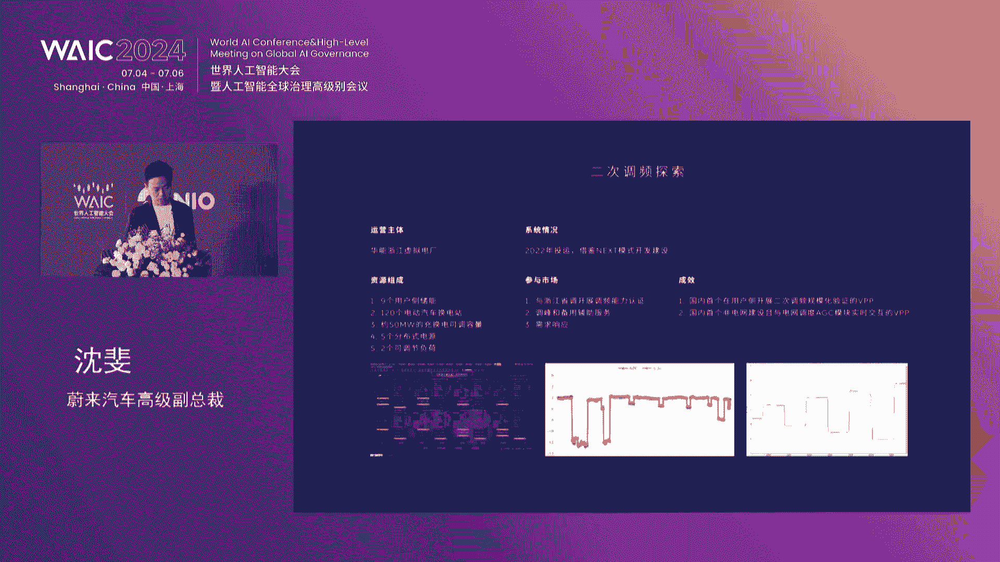
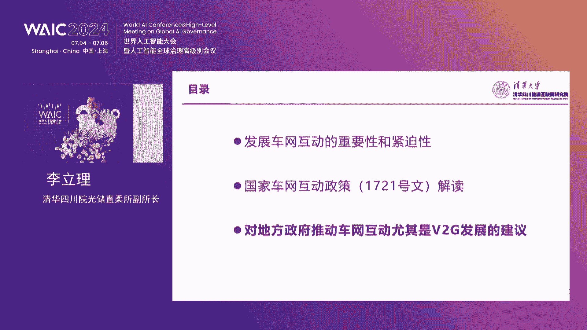

# P60：20240706-智能化助力交能融合与车网互动论坛 - WarrenHua - BV1iT421k7Bv

🎼未来能源云是一个全球首创的全方位能源服务，它接入了所有的未来车辆、电池、换电站、移动充电车、充电桩、服务专员等各类部能资源，通过海量数据运算，整合调路资源，并对未来情况做出预判。

满足每一位用户发出的实时需求，帮助释放时间。🎼带来懂你安心之趣、自由感和极致应用的能源服务体验。🎼当你发起一键家电服务时，未来能运云会实时计算补能资源，调度服务专员上门，并利用移动充电车换电站、充电桩。

为你提供补能服务，让店来找你，告别不能焦虑。🎼未来能源云能根据用户当下车辆电量、不能习惯资源情况等个性化智能推荐，不能资源。当你需要规划长途路线时，它还能根据实时路况信息、车辆电量、不能资源状况等。

结合路程时间。🎼预判并规划个性化的长途补能路线方案，让你无需再为长途补能担忧。🎼未来能源云能够实时连接所有的电池数据，保证每一块电池处于最佳状态。🎼换电时，换电站还能够通过图像识别技术。

检测电池壳体是否有磕碰痕迹，排除电池潜在隐患。🎼保证你换到的每一块电池都处于理想状态。🎼通过整体协调调度，电池能够始终维持在应力均衡状态，从而延缓衰减。🎼未来能源云连接的换电站与充电桩。

通过云端对换电站与充电桩进行升级。同时它还使用了数字孪声技术，对各项设备进行监控。在故障发生之前，就能对设备状态实行预判。不さ。🎼呃，专家学者朋友们，大家上午好。呃，也欢迎大家来到美丽的上海呃。

参加上海世界人工智能大会，智能化助力、交人融合与上网互动的这样一个分论坛。我是今天上午的主持，来自中国电力企业联合会的刘永东。呃，也是非常高兴和大家一起共同探讨智能化在我们的交通能源领域里面。

如何能够发挥更好的去作用。呃，首先我介绍一下与会的领导和嘉宾。他们是上海经信委副主任汤文海先生。本次论坛的主办方，未来汽车高级副总裁沈飞先生。

远道而来的德国能源署前署长现任柏林咨询公司首席技术官运营官库尔曼先生。清华大学博导姚丹莲呃先生。复旦大学教授博导孙耀杰先生。国家电网公司市场营销部主任是武斌先生。

上海智能汽车创新发展平台首席架构师梁健先生。哦，好好，稍微晚点等啊。腾讯智慧出行副总裁钟学李先生。中国电动汽车百荣汇智呃智能网联研究院副院长张海涛先生。

清华四川能源互联网研究院光楚之柔研究所副所长李丽李先生。再次欢迎大家的到来。上海世界人工智能谈会是每年一度的人工智能的全球盛会。今天啊应该说智能这个概念融入到我们的各个行业。

为各个行业的发展提供了新的助力。交人融合与社化互动作为绿色交通。交通体系以及信息电力系统发展中的一个重要的助力，也受到了大家的广泛关注。本次论坛的主题啊就是为了探讨交流融合与策划互动。

在智能化的助力下的应用前景和发展希望。所以说我们今天上午啊分三个的议题。第一个是呃那个领导支持。第二是主旨发言。第三个我们还专门安排了一个圆桌会议啊，也是希望通过多种形式，大家思想碰撞，更好的去交流。

去探讨，在这个交流融合策划互动中，智能化所发挥的作用。首先，我们进行会议的立项的议程，有请上海市经济和信息化委员会副主任唐文海先生致持。呃。

唐主任应该说始终关注上海的新能源、智能汽车、智能装备和信息化产业的发展，推动了上海产业的高质量发展，加速了上海科技创新中心的建设。呃，大家这个呃掌声欢迎。尊敬的永东秘书长。郭美先生。

还有我们今天的主办方啊，沈辉老总是还有以及我们今天来的各位来宾，因为有点早，我看来的人可能还陆陆续续。我们这次的会啊，因为安保的原因比较严格，所以下面呢我估计好多的来的人可能还在排队呢。呃，对。

很高兴啊和大家一起相聚在一起。我们一起来推动智能化助力交融融合和磁网互动。首先呢我代表市经信委啊对各位的到来表示欢迎。尤其是对长期以来关心和支持上海汽车产业和新能源产业发展的，各界同仁呢表示衷心的感谢。

近年来，大家知道上海呢聚焦2加3加64加5的现代化产业体系，我们在稳步的推进新能源产业的增长。去年的时候呢，我们上海的新能源汽车的展值呢达到了3876亿元。同比的增长了32。1%，产量呢达到了128。

7万辆。占全国的比重呢接近14%。我们的能源装备的产值呢达到了185亿元，同比呢增长了14。5%。大家知道在当前这种形势下，这个增量是非常的不容易。尤其是想。特斯拉它已经启动了储能超级工厂的建设。

在临港呢准备建成1万台，达到40几瓦时的储能装备的产能。我们上汽的侵淘将加快完成全固态电视的研发生产。呃，他争取啊在2027年要实现1000辆以上的装车规模。同时呢呃我们也在创新示范应用上面呢。

也取得了一系列的成果。我们累计啊现在已经推广了新能源汽车达到了147万辆。这个呢在全球的城市规模当中，我们一直是保持第一的。我们并且建成了充电桩呢达到了81。3万个。车装比呢是约1。68比1。各位来宾。

对这个数据呢其实也很不容易。大家知道像车撞啊，这是一个非常稀缺的资源。上海在我们这样的一个国际大都市里面也是。我们竭尽了最大的努力啊，来把这个车装的比例提升到这样的一个规模上。

应该说是优于全国的平均水平。尤其是呢本周的时候啊，我们上海刚刚入选了国家车路云网试点的首批城市，也非常不容易。那么按照前两天部里面的相关的部署啊，我们接下来这方面呢我们要加大工作力度。呃。

同时呢我们已经建成了智慧道路呢超过了300公里，部署的路车单元呢也达到了350套。我们未来的BT7，还有包括上级上汽自己的L7这些整车产品呢，也进入了国家首批的L3级的准路和上路通行的试点。

燃料电子汽车的示范应用呢也围绕百站千亿万辆，就是100座加油加气加气站，1000亿的产业规模和1万辆这样的一个数量啊。我们这个整体的这目标呢占稳步推进。我们已经推广了将近有4000辆。

占到全国的有4分之1的比例。我们像未来啊上电科啊，中国电力，还包括上汽自行车已已经紧紧的围绕工厂、小区，还有商业楼宇的一些需求呢，也在紧密的开展微突技的示范，已经有1多个点。刚才我们沈飞总也在讲。

咱们未来在这方面呢也做出了很大的贡献。下一步呢，我们将继续的推动挖挖掘啊新能源产业新质生产力的引领作用，以科技创新，推动产业创新。我们重点聚焦三个方面的工作。

一个呢是要持续的继续推动智能网联汽车产业链的高质量发展。以单车智能为核心车路云协同为关键支撑，支持端到端自动驾驶的大模型的研发，要推动芯片的装车应用。

不断的加强车用操作系统、智能底盘、高精度传感器、固态电池等核心产品的研制。第二呢就是要加强新型技础设施线设。我们要搭建虚拟电厂的交易市场、一体化管理调度平台。

要推动智能充电桩更新改造和配电网的智能化改造，要有效聚合充电桩的复合条件能力，加强电动汽车与电网双向互动，构建支撑智能网联技术发展的语料库算力池云平台、车联网和智慧路等五大关键要素。

第三呢则是要强化应用场景的建设。我们要全力打造智能出租、智能重卡、无人驾驶装备等场景，要通过应用场景驱动模型算法和算力芯片的加速迭代，从而带动数据的快速积累和系统的加速量产。

我们也将引导光伏、储能、氢能等三类标志性的产品，要进入设备大规模的更新期态。我们也通过智能工厂的建设来为抓手来推进这些产品的加速应用。各位来宾，我们也非常期待啊大家能够借助今天的论坛。

能够激荡思想、共同才智，为交能融合创新发展提供建设性的思维，共同开拓上海汽车和新能源产业发展的美好前景。最后呢也预祝本次活动取得圆满成功，谢谢大家。非常感谢刚才呃汤主任这样一个精彩支持。

我们也特别的期待啊上海在新能源领域里边成为行业这样一个标杆，同时也应该成为这个创新发展这样一个中心。好，接下来是我们的主旨这个演讲嘉宾这样一个环节啊，我们只是啊专门安排了7位嘉宾进行演讲。呃。

首先有请的是未来汽车高级副呃那个高级副总裁沈飞博士啊呃演讲的报告是基于智能化的教能和与测网互动的创新实践。沈飞博士啊是未来汽车的这样一个高级副总裁，负责未未来能源的总体工作。

当前沈飞博士正在领导未来能源推动以换电模式为核心。AI赋能的电动汽车智慧能源网络的这样发展以及电池储能领域的创新实践。大家欢迎。🎼Yeah。今天跟大家交流一下。

就是基于智能化的交能融合跟车网互动的创新实践。那么在智能化这么一个大背景之下，实际上有很多技术的发展，我我自己觉得它已经领先了，就是我们自己的想象力跟我们的这种。执行力就技术已经到那个程度了。

过去稻耕火种可能花了几千年的时间，但是最近几十年大家我们可以感觉到技术在飞速的发展。我自己的是加入未来汽车大概8年多的时间，能够亲身感受到这种。就是越来越觉得这种创造力赶不上技术的发展。

感觉上有很多很多事情可以做。但是呢从技术本身，然后到实践到机制有太多的事情要去追着这个技术的发展去往前推。所以今天呢把其中一些我们的尝试，跟大家一起交流一下。总体来说呢。

智能化在全面的推动新能源汽车的高质量发展，也能够推动我们这个创新创新这种新智生产业的发展。那么这里面呢应该讲智能化是无所不在的。交通车能源，然后包括我们的产品服务社区，包括现在各个品牌之间。

各个平台之间，然后在全国、全世界各个地方去全部互联互通在一起。那么这里面能够创新出来的东西就实在是太多了。那么。围绕今天的主题呢，其实我后面会讲一些跟能源啊等等相关的东西。

那么这句话呢其实点一句提是什么呢？就是整个电动化是推动胶能融合跟车网互动的一个核心。因为车从过去的由驱动变成现在的电驱动。那么这个是里面的一个核心推动力。那么在这种环境之下呢。

无论是车路协同交能融合还是车网互动。没有其中任何一项能够脱离开智能化单独去发展。这个是做了一个简单的交通示宜。那么在这个整个的交通系统的供需两侧，一侧呢，我们的能源从原来的油变成了电。

包括大电网、风电、光伏，还有日新月异的储能。然后需求侧呢。除了这个服务区的基础设施以外，现在有了充电换电这个。需求。那么还有收费站运维运转的设施，还有一些隧道基础设施等等的。那么在这种情况之下呢。

就是大家完美的融合在了一起运输服务网络、基础设施的网络、信息的网络、能源的网络、四网融合在一起。诞生了大量的这种创新点，提高效率的点，提高用户体验的点。提高我们生产效率的点。这个呢是其中电网的这个示意。

那么电网呢有个最基本的特征，就是在供需两侧必须随时平衡用电跟这个发电量。那么随着光伏的跟风电的增加，其实波动性越来越大。这种情况之下，其实如果我们在需求侧有一些可调节可调节这种资源。风大了。

或者说这个光多了，发电量多了，我们的这个符荷就大一点。一朵云飘过来，咱们的符合是不是能够稍微小一点点。所以一旦我们具备了这种灵活性的复合色调节资源，整个电网的鲁棒性可控性就会好很多很多。那么这里面呢。

电动汽车我自己是把它称为叫什么？是叫配网侧灵活性调节资源的一个压舱时。为什么说它是一个压舱石呢？那么有几个原因，第一个呢就是它的容量足够大。按照我们目前的预测，到2030年。

咱们全国电动汽车的数量要接近。接近1亿辆车。那么以每辆车50度电这种储能能力来说，就是50亿千瓦时。从调节功率上来讲，哪怕咱们只有一半的车能够通过一个最小单元像7000瓦的桩接入系统。

那么的调节功率就是3。5亿千瓦。我记得原来国网的这个不就是那个规划总院那边曾经做过预测，我看到一份资料。那么他们预测呢到那个时间点需要的这种调节功率差不多是1。7亿千瓦。

也就是说刚才讲的就是即使以7000瓦来计，其实是它的两倍。当然这里面我们还有一些提升的空间，也有一些变化的空间，说这些车是不是能够随时接入呀。但是如果说我们把它规划好了。

我们把7000瓦的桩在需要调节流量，把它变规划成20千瓦的桩，那边又提升了3倍。所以我觉得从整个数量级上来讲是完全足够的。那么第二个点是什么呢？就是它的这种调节的响应速度灵活性。

包括随着我们的智能化大数据这种发展，每一辆车的行为其实是可预测的。我们完全可以知道在哪个时间点需要他参与调解，他能不能够参与调解，这些都是可以做到的。所以从这个角度来讲呢。

就是何处一体电动汽车时配网测灵活性调节资源的压舱时。那么从2018年交车开始，呃，未来汽车，尤其是我们这个里面的一个单独的实体叫未来能源，我们就一直坚持做这方面的尝试。叫围绕车电分离，可充可换可升级。

车网互动这么一个方针策略，去做我们的基础设施，做我们的运营，目的呢就是希望呢一个是从用户侧来看，让家电比加油要更加方便。那么从资源侧来看呢，从供给侧来看，我们希望就是能够有个更高效的能源网络。

这是我们的一个愿景目标。这里面呢有几个逻辑基本的逻辑。第一个呢就是我们认为车电应该分离，因为汽车跟电网跟电池的寿命其实是不一致的。电池有一个日历寿命，有一个循环寿命。那么从日历说明上来讲。

哪怕你开的再少，用的再少，只要日历说明到了，这块电池也就不能用了。那么现在日历寿命呢，一般来说在8到10年左右。因为每个主机厂的这个这个质质保的承诺差不多18年。那么从循环说明来讲呢，大概有那么。

330千次左右。那么从质保来说呢，差不多是这个15万到20万公里。但是从循欢寿明来讲呢，我们不同的用户，其实他的行驶的里程差异太大了，有的跑的特别多，有的跑的特别少。那这种情况之下呢。

其实在内侧循环寿命也有巨大的浪费。所以如果能够我们能够把车电把它分开，把电池作为单独能源的属性独立出来，作为能源的载体，其实有非常大的这个创新的空间。右边呢我也附了另外一张图。

这个是应该是国家信息中心的一个统计。就是其实现在电动车的报废年限其实比那个传统的车要短不少。那么如果我们把它电池分离出来，电池是一种灵活租用的方式，其实可以大幅度的延长电动汽车的这个使用寿命。

所以这个呢就是车电分离之后，在能源跟汽车两个领域产生的这种效率的叠加，就大幅度提升了资源的使用效率。那这里面呢换电的是车电分离的物理基础，也是用户体验。跟产业发展的一个需求。从用户来说。

就是省时省心省钱，换电快，然后也不用下车，然后也不用担心电池的质量。平时用小电池付更少的租金，你走长途的时候，用大电池稍微多付一两天，多付一点钱。从全年来讲省好多钱。那么从车企来说，因为用户体验好了。

肯定更多人愿意买这个车，然后也降低了用户的购车门槛，降低了用户的用车成本。再加上呢那些没有加充装的用户，能够像用油车一样的，用加油站一样的来用这个电车。所以他就拓展了这个潜在的用户市场。

所以对企业来讲能够多卖车，对产业国家行业来说，就节省了大量的电池资源。那么电力容量的利用率也得到了大幅度的提升。因为换电站它可以在用户车不来的时候，就在那充电，而充电桩只能够用户车来了才能够充电。

那我们同一套基础的配电网络，我们把它结合在一起，对吧？就能够成倍的提升这个电网的使用效率。从从这个角度讲呢，再加上还能够做储能应用。所以换电我们相信就是。能够在行业里面得到更大程度的推广，跟应用。

所以我们就构建了这么一个基于车电分离，跟换电的汽车跟能源的新商业生态。这里面呢从。原来一个电动汽车产业，我们慢慢的通过车间分离，把它分成了相对比较清晰，大家也更容易理解的三个行业。第一个就是电池制造。

跟回收这么一个产业链。最上面从电池公司到电池回收这一路过来。那么第二个呢，就跟原来的传统主机场的这种业务类似，我就造车卖车。那么第三个呢，就是主机厂把车造出来之后呢，把电池卖给电池资产公司之后。

有专门的电池资产公司充换电站的资产公司。再加上充换电网络的运营公司跟能源电力公司一起去构建整个一个能源电力行业，就围绕这块动力电池做的。

所以这样呢三个行业呢交织在一起一起推动整个围绕电动汽车这么一个新商业生态的发展。

这就是我们到今天为止的一个全国的网络。目前我们已经有2442座矿电站，其中808座在高速上面。充电站3900多座，22000多根。那么接入了第三方，还有100多万根第三方的充电钻连成这么一个全国的网络。

其实要去运营管理驾驭这么一个全国性的网络，对智能化的要求其实是非常非常高。

就智能化是这里面的非常核心的要素。那么无论是从应用场景来说，驾驶泊车家电还是车网互动，还是从我们的这个底层海量设备的这个连接来看。需要有海量的数据，然后尤其是中间的一层智能的算法。

就几乎我自己的感受就是在每一个领域，每个应用环节就没有一处能够离开这个智能化算法。所以我们也希望在今后的发展过程当中，能够跟更多的合作伙伴一起，把这块能够能够做的更好一点。

后面呢我就举一些我们跟智能化的实际有关的例子。快速的看一下。第一个就是我们的全域领航辅助。到目前为止呢，我们已经有了。300万。我站。不止这么多吧，这300万只有这么点389万公里，应该不止这么多。

然后覆盖智智能全域可用道路覆盖城市覆盖了726座城市。这是一个。第二个呢，实际上我们从云端跟车端的算力结合起来，觉得这是一个全国最大的叫端云算力集群287top eop的这种算力。

那么这里面其实是另外一个，我觉得是另外一个叫叫车网互动，就是车端的这个算力，再跟云端怎么样去这个这个互动。我觉得这是能源网络之外的另外一个叫车网互动的网络，其实将来也有巨大的潜力是可以挖掘的。

也入选了国家首批自动驾驶准入跟上路试点的企业。那么目前呢我们开通了294座叫高速服务区的这个。领航换电是什么意思呢？由于我们的换电站是相对进入服务区的时间比较晚。

有的时候换电站呢在服务区的某些角落并不是特别好找。那么用户只要在导航里面设置好了之后呢，他就能够下服务区之后，虽然服务区的路况很复杂，然后也没有清晰的车道标准。多说。

但是呢他都能够把它带到这个换电站的门口，然后开始自动换电。然后今年下半年呢。我们会逐步开启叫离车自主换电。就是人不用待在车上，但是呢可以去换电。这个场景也是用户这个提出来的。因为有时候到服务区的时候。

前面正好有个人换电，那么他是在那等着呢，还是说有一些别的更好的体验。所以呢后来就慢慢探讨出这种需求。所我到服务区之后把车放在那。我就进服务区休息去了。那么那个等到我服务区出来的时候，哎。

车已经自动换好电，在边上等着我们了，大概是这么一个场景。

🎼几个一小段时这个测试。🎼The。Yeah。Yeah。这个测试已经做了，我们希望今年能够上线一些。那么我觉得围绕这个场景呢。下一个可以期待的场景就是说我们在某些城市在晚上的时候。

这个车能不能够自主出来换电。那么这些场景出现之后呢，无论是对于用户的体验还是能源网络，包括换电站的使用效率，其实都是一个巨大的提升。

那么像我们通过虚拟电厂把所有的换电站充电桩接入这个电网。目前我们在浙江的一百几十座换电站都介入了，通过虚拟电厂介入了调度。然后今年去年冬天到今年春天，我们在华北的，我们集合用户的这个车辆。

参与华北的蓄述测响应。每年都在参加。所以累计来说，我们以前有126座站，16000多根加装装在上海这边参与了。京津冀这边也有11000多根也参与了。那么这是我们参与调峰的一个实践。

同时呢我们还做这个二次调频，它真的像一个虚拟发电机一样的，做电网功率这种快速调节。这个呢这个曲线是在华能这边在浙江虚拟电厂测的。另外呢，我们在欧洲也做了这个创新的实践。

ThisThis is FR control in Denmark， yeah。这块的实践也是做的是非常好的，就是差不多能够覆盖我们换电整个换电站投资建设成本的。差不多保守的讲4分之1到3分之1左右。

就通过这个电网收益能够能够获得的收益。

另外呢，除了这个大的虚拟电厂之外呢，我们在本地能源也在做一些管理，就是通过换电站跟车的这种储能作用，看看怎么样让本地的配网设备能够发挥更大的效率。

那么一个典型的例子就是我们自己的换电站就参与这个错峰充电。那么到今天为止呢，差不多1767座换电站参与过，那么节省了3亿多度电吧。呃，我们也投运了几座光储充换，其实应该叫光储充换放一体化的综合能源站。

这是一个在服务区的一个站。那么旁边有大型的这个边坡的储能呃，边坡的光伏。我们这一个站呢起了储能跟换电充电三种作用，使整个服务区的这种能源使源效率得到了整体性的提升。

那么基于B toG呢来做园区的这种源网和属一体化的低碳园区，目前也做了几个园区，希望能够在今年下半年能够做大规模的推广。所以做一个总结呢。

就是呃我们觉得就是胶能融合跟车网互动是马上能够看得到了一个巨大的变革。那么在第一阶段呢，我们在未来汽车这么一个小生态下面呢，把基于换电跟车电分离的商业模式做了一个尝试，也取得了一定的成果。

目前呢进入第二阶段，那么这里面有两个特征，第二阶段的两个特征，一个就是换电网络呢不再是未来汽车一家在用，而是推广给整个产业，那么大家能够来共享这个同一个标准的电池，同一个换电网络。

那么第二个特征就是胶能融合跟车网互动的价值开始被认可，逐步进入示范。那么到第三个阶段呢，就是再经过5年左右的努力呢，真的能够建立一个更加通用的换电网络。同时标准化的电池跟智能化的这种融合。

能够得到非常广泛的应用。这是我们设想当中的这个三个三个阶段吧，我们也会努力去推动这个。所以今天我就跟大家介绍。这么多非常荣幸能够参加这次会议，然后更加开心，能够见证并且参与这么一个伟大时代的变革。

谢谢大家。

呃呃，这样跟刚才沈博士啊应该说呃总介绍了未来汽车关于在车轮融合，特别是智能化方面这样一个建设。我也是应该说也认识沈博士很多点。刚才从间杨中我觉得有两点吧。第一点呃未来汽车在车轮融合，整个在车网互动方面。

呃，不只是说更多是在干是吧？很多的实践，这样谈到的比较多。第二点就是在智能化建设中，应该说在下一步的智能换电，提供了很好这样一个事件，大家非常这样一个期待。下面是演讲环节是呃，咱们的。

德国能源首前署长嗯，现任柏林咨询公司的首席技术官运营官呃，安德利亚市库尔曼先生。库尔曼先生应该是能源转型和气候保护领域的广受国际欢迎的专家。在担任德国能源署署长期间。

在推动能源转型开发气候保护创新方面提供了做出了重大的贡献。现在，库尔曼现生正在以能源领域的丰富经验和深刻的动彻，推动了欧洲电动汽车和能源的协同发展。有请。いも？什是。🎼Yeah。

非常感谢大家今天邀请到我，也非常感谢今天能够有机会听大家的演讲。我觉得刚才沈博的演讲让我觉得非常的振奋。😊，I'm going to takeま。那接下来我给大家讲一下德国的情况。

Work with the company。在我在德国能源署卸任之后呢。我在现在的这家公司叫做chris company做咨询。然后我想跟大家介绍一下这个公司的业务。

那接下来这张PPT呢是德国的可再生能源的情况，是一个自上而下，从政府开始的改革。现在呢我们大概有6%的。电能呢是由可再生能源来发出的那在未来呢。

我们会实现80%的电网上的电能都是由可再生能源发出发出的那我觉得这一点是十分不错的。对于能源转型来说，但是呢他也带来了很大的挑战。大家可能对这个图表比较熟悉了，这里是德国的一周的。发电的情况。

大家可以看到黄色代表的是我们的复荷，那不仅仅有太阳能，还有风能等等。那我们要维持整个系统的平衡，其实是一个非常大的对于电网运营人员的挑战。所以说我们需要一些帮助。我们需要整个系统的协助。上一钱。

那这里呢是一些例子，太阳能正在经历着指数级的发展，还有其他许多的科技呢也带来了意想不到的发展。Very。电动车的发展也非常的迅速，不仅仅是在德国呢在中国的发展更加的迅猛。除此之外呢。

我们还可以看到有热泵，然后电池数据中心。那所有的这些资产呢都想要接入电网。所以说德国的电网运营人员，他们正在经历着巨大的挑战。😊，因为电网的增增长速度呢，它其实是赶不上这些新兴的资产的增长速度的。

那大家可以看一下，我们目前面临的困境，所有的这些新的资产和设备都经历着快速的增长。但是呢电网的增长却慢得多。那德国是一个追求效率的国家。但是呢我觉得在其他国家，可能说在电网的操作和运营上，还有建立上。

以及电网和新资产的融合上呢，其他国家的挑战应该更为巨大。那这就给能源转型带来了挑战。但是我们需要去解决这些挑战。其实去管理电网是成本非常的高的。因为我们的呃可再生能源等等的要融合进电网。

它的成本是很巨大的。Vs。やり。这是在德国电网管理的情况，大家可以看到不同的成本的组合。我们有太阳能、风能、各种能源接入电网。所以说为了应对这个局面，我们需要一些新的解决方案。

那虽然我们有很多的资产正在接入这个电网，电网的发展也非常慢，但是我觉得这个冲突它其实给AI人工智能，还有数字化带来了一些机会。与此同时呢，好的想法也需要被很好的约束。

那就这就是为什么我们要去制造好的这个政策。那我也听说在上海，我们经常去做这个呃。测试区，然后呃去测试一些新的想法。那我觉得这一点也是特别好的那接下来的这一页，大家可以看到各种各样不同的挑战。😊。

是给电网运营带来的挑战。那包括我们的控制中心，它的数据不断的增加，不容易处理和评估。那除此之外呢，我们的设备的增加也提高了维护的要求。对那是。还有我们。电网系统的维护难度等等。

那这些呢都给我们电网的运营人员带来了操作的难度。那之前呢我的这个组织，也就是德国能源署，它其实开启了一个项目，叫做为了电网的数据，什么意思呢？大家可以看到，我们是从接下来这几个角度来入手的。

比如说更好的电网计划，还有更好的这个系统管理。比如说我们要更好的去管理这个呃电网的数据，并且使他们能够呃更加的容易使用。还有要更好的管理接入电网的这些资产等等。Most appropriate。AI。

这些领域我们都可以更好的去使用AI。那么现在呢现在展示的这些是一些二维码。嗯，大家可以扫描扫描去下载我们之前产生的一些报告。那么大家也可以去参考其中的一些数据。接下来呢我想更加聚焦于电动汽车这个行业。

因为刚才我们已经提到了电动汽车带来巨大的潜力。那么我们可以看到，其实呃我们在德国已经有了100万辆纯电的电动汽车。啊，那么它可以产生的这个能量呢。

其实是嗯所有的这个势能水泵所产生的这个德国嗯的能源还要多。嗯以从这个角度来说呢，纯电汽车其实是有非常大的潜力的。但是问题就来了。我们要如何去使用电动汽车带来的这种灵活性呢。

接下来我们也可以来看一下我们这种灵活度所带来的成本。当然嗯我们也可以知道我们的汽轮机给到了我们一些灵活度，包括我们的抽水性能，也可以带给我们灵活度。那么我们看到最右边的这个呢，我是我们的电动汽车电池。

电动汽车电池所需要的这个成本似乎是三种之中最低的。当然，电动汽车不仅是最成本低的这种呃方式。同时呢我们也可以看到它其实是呃有非常大的优化空间的。有很多的这个电动汽车的这个车主。

他们也是在为他们的汽车资产和电池资产付费的。那么从这个角度来说呢，我们也可以说我们可以回馈给消费者啊一些比较好的优势。😊，还有一个部分呢，就是我们的电动汽车，他们的速度和精准度是非常高的。

接下来呢我想给大家展示三个案例啊，这也是我最喜欢的三个案例啊。😊，第一家公司是mobilbility house，这个是德国的一家能移动能源呃解决方案商。当然了他也是这个大众的合呃合作伙伴之一。😊。

mobilbility house他们有非常好的项目。如果我们去使用他们的这种呃解决方案，我们就能够知道。比方说我们如果能够更好的去使用电力市场之中的这种价格的波动，以及我们的电池的话。

我们甚至可以从我们的电动汽车使用之中啊，去收获一些这个呃利益。所以从这个角度来说呢，我非常喜欢mobility house他们的解决方案。当然了，从这个方面来讲。

在德国要去使用这个mobility house的全套服务还是比较难的。因为还有一些我们要去考虑的法规要求。第二个案例呢啊我们刚才沈飞总已经给了我们一些呃介绍了，我觉得从呃未来的这个换电来说。

它可以对德国产生非常大的裨益。😊，因为换电不仅仅是速度快，而且我们可以看到很多的这个汽车都在使用它的电池。那么我们可以用非常好的灵活度去使用这个系统。从我的角度来说。

我觉得如果我们能够在德国更好的使用它的话，会带来很多的好处。当然我们也可以从中去盈利。呃，我们可以去运用它的这个灵活度，然后从中啊释放非常大的潜力。😊，当然嗯不仅仅是要把它带入德国的这个市场之中。

我觉得它也是一种用户友好型的产品和解决方案。嗯，接下来呢我也想给大家另外一家公司，这一家公司。😊，呃，叫3。15，这个其实也是欧洲非常有名的一家创业企业。Yeah。

他们把一些高端的硬件以及能源管理体系结合起来。我们可以看到，有的时候我们可能时候呃电价是负的。因为我们在系统之中，如果是电力过多的话，那么这个电价可能会下降。那么我们也因此产生了一些能源管理系统。

也就是说如果我们的用户或者说我们的电网用户有非常好的这个电力提供的话，我们也会给到他们一些这种电价的措施。😊，接下来我要讲的一些内容可能稍微复杂一些。我呃稍微总结一下我们刚才所讲的内容。

那我觉得我们在能源转型的部分，其实是看到了非常大的增长和非常大的潜力。那么我们也产生了非常多的数据。目前我们还是在一个早期的阶段，我们有一些软件来管理。我们从这个系统和能源转型的过程中产型的这个数据。

😊，所以我觉得在对于我们来说，这是非常大的潜力。但是呢我们需要反应非常的迅速。当然从另一方面来说，人工智能也需要数据。因为我们从能源转型的过程之中可以获取很多的数据。那么这种数据也可以是非常有益的。

我知道之前呃有一些公司已经在这一些数据方面去做一些工作。但是呢我觉得这部分的这个人工智能所需要的数据，能做的工作，还有更多。我甚至可以从这个能源转型的过程中获利，尤其是呃从这个数据之中获利。

因为呃AI也需要更多的数据来帮助他，包括我们有很多的这一些能源资产。我们需要去很好的管理我们这些能源资产。当然从这个角度来说，呃，我们在欧洲以及我们的这个欧盟也讨论了很多关于AI。😊，法案的这个呃内容。

也就是说，在欧盟，我们曾经有过很多的讨论，关于我们要如何去更好的使用这个人工智能，让它有助于我们社会的发展。所以呢在这这个基础上，我们也产出了一个人工智能法案。

在这里呢我也给大家展示了一下我们所产出的这个人工智能法案之后，大家也可以去更好的浏览一下。嗯，我们曾经讨论的内容有人工智能对于能源转型可能会有什么样的影响？对于我们来说。

尤其是对于我们可能想要进军欧洲市场的这一些能源相关行业的人来说，😊，呃，人工智能可以去被应用于我们能源的供需管理。同时如果我们去呃发现这个系统之中有高风险的人工智能的话，我们需要去对人工智能进行分类。

当然从另外一方面来说呢，数据的质量和数据的安全也是非常重要重要的。因为我们可能会出现一些数据的失效。那么如果AI的这些数据失效的话，对数据以及整个的体系会产生重大的扰乱和影响。

在这个部分还有一个非常复杂的问题，就是我们需要去仔细的考虑我们这个系统未来的发展。第六个部分就是我们的这个沙河模拟，在沙河模拟的这个部分呢，我们也需要。去考虑未来的创新。

我们有怎么样的这个沙河模拟的方式。比方说在未来，比方说有一些比较好的创新。嗯，在我们的交通领域，以及在我们的电网电网领域，我们需要能够确保它有沙河模拟来确保它的这个稳健以及它的安全性。

今天我就想给大家分享这些内容，嗯，也非常感谢大家和我们一起到场来讨论这一些内容，因为它不仅仅是对于电动汽车有利和有益。同时它也对于未来的发展非常的相关。😊。

当然呃我也希望大家能够在今天的话题之中多多探讨，谢谢。😊，非常感谢刚才库尔曼的精彩的分享。呃，我觉得有两点。刚才我感受比较深。第一点是中国和德国在电网的管理方面都面临着同样这样一个挑战。

刚才也谈到可能德国的可再生能源的发电的大概占6%左右。现在中国的呃非化石能源装机已经超过50%。但是我们的可再能源的发电量大概在占四成左右。在随着这个风电光伏大幅的增增长的情况下。

实际上对电网的安全稳定运行带来极大的挑战。两个国家都面临着在用电车出现了很多新兴的用电的领域。刚才也谈到包括我们的电动汽车的充电，也包括的数据的中心。

特别是包括我们现在呃计算气候条件下带过来的用电负荷的趋增长。比如在这种情况下，电网的安全稳定的挑战带来极大这样一个挑战。第二点也在刚才也谈到了这么多的应用的领域里边，这个电力市场的建设。

实际上是撬动交通和呃人员融合这个非常关键这样一个因素，发挥价格的优势，发个价格机制作用，更好能够促进各种人员的这样一个协协同的去去建设。在这个过程中间。

数据的价值数据的分析I的技术就能推动整个人员转型会起到非常大的这样一个作用。我想这一点来讲，对中国下一步的这个电力市场的去建设，对下一步人员转型的发展，同样具有非常借鉴的去这样作用。呃。

再次感谢扩容先生。下面嗯那个演讲的题目是清华大学呃姚丹亚博士主题报告V two X交通汽车能源的枢纽呃，姚教授是智能交通与智能驾呃智能驾驶领域的知名专家在国内首次提出了车路协同这样一个概念。

主要研究收路协同的数据交互智能驾驶协同安全和智能交通的主动控制理论、技术标准和应用。这大家这个掌声欢迎。喂。呃组组组织方呃邀请我来做这个报告。那个这个报告的这个论坛的主题是呃胶能融合车网互联。呃。

车网互动，其实那个我自己做的呢实际上是为 two X这个细分的领域。在这两个大的主题中间呢，实际上第一个是交通车网那个网我觉得在这里可能更多的是指的能源网。

我理解但是我们做的呢是实际上是交通和汽车之间的连接和能源和能源网之间呢，实际上是最开始做的时候呢，是有一些呃距离和差距的。但是让我讲的时候呢，就跟我说，我说我讲我本来干的东西行不行？那个辉跟我说。

他说不行，我们一定要跟能源有关系啊。但是呢因为我们这个本身的连接呢，确实是跟能源的应用也是很重要的一个环节，所以呢我就说可以来讲一讲吧。呃刚才那个。持嗯给做了一个呃。呃，给我的介绍啊，我也不多说了。

其实我是清华大学的老师，呃，一直就是在呃清华大学工作，从读书开始到现在。呃，这是我那个给我发工资，我吃饭的一个职业啊，另外呢还有两个呃小的跟这个相关的一个职业。我是交通部的自动驾驶专题研究组的一个顾问。

另外呢还兼了一个中国智能网联汽车产业创新联盟的V two X工作组组长。这两个工作呢确实就是跟我们的呃交通车辆，还有we to X相关的两个呃主体的工作。呃。

我的主要研究就是V to X相关的理论啊技术啊应用。呃，具体呢在今天讲讲点什么呢？我我想了想，因为我看了一下时间啊，只有15分钟。我尽量控制在15分钟之内，呃，在前面两部分呢。

我觉得呃讲一下那个V toX起源，最开始是想干什么。然后呢讲讲它的发展。这两个可能都特别简单。最后一个前景呢，我觉得可能扣回我们的这个跟能源相关的一些东西，呃，做一个比较呃粗略的分享吧。呃。

首先呢就是说讲一下这个出入协同，或者讲威 two x出心，它实际上V two X这个出发点呢，它是安全交通安全的挑战。因为在交通安全是不论不不光是中国了啊。

但是全世界最呃反正就是在这个安全领域里面最头疼的一件事情。嗯，每年的安全事故，每年的死亡人数都很多。呃，他实际上有他死亡原因或者说事故原因，有它一些非常特殊的地方，你像大家看到的这个视频场景。

它就是一个弯曲，很有可能就看不见对方的来人，他就撞上了，对吧？这个无论你是人开还是将来最最最先进的自动驾驶。它靠单车也解决不了这样的一些故障。呃，像这边的话我。我因为只有10分钟，这个视频我不看了啊。

呃，左边这个视频呢实际上它是一个大雾大雾的时候呢，这个驾驶员看到前面有一个事故，有很多车停下来了。当这个大车的驾驶员看到这个事故的时候，他已经停不下来了，他直接就撞到了这种连环的事故上去。

右边这个呢实际上是一个呃视野很好，但是呢下雨了，雨后这个车过来以后也能看见前面有事故了，但是根本停不下来。咱们简单的看。看一点点吧。像这个。这个这个很好心的驾驶员还去指挥后面赶紧停车。

这个视频车就拍这个视频的车，他停下来了，大家看后面发生的事情。实际上很多的这个驾驶员他其实已经看到了这起事故，但是在这种场合，他无法停下来。我们想象我们最先进的无人驾驶车，他如果观测能力和驾驶员一样。

他的制动距离也和现在的车一样。在这种行情下，他还是没有办法把这个车停下来。呃，像这个。连环追尾对吧？呃，这就是呃红车右边这个最电心的鬼探头。这是呃交通事故。那他这些事故的原因是什么呢？

就是因为道路盲区恶劣，天气路面失滑，目标遮挡，导致看不见，停不下来。那靠单车智能到现在能解决吗？我觉得是一样的在这种特殊场合。那我们的V two X最开始就是希望通过通讯扩大这的感知能力和协同能力。

把这些极端的 case的故障给避免掉。这是V two X本身的初心。呃，那呃具体就不解释了这个呃V two X，它实际上就是在车上在路测设备在各种基础设施带带有感知能力的上加上一个通讯装置。

移动通讯装置，这个通讯装置能实时的在一定范围内的交换数据。实际上简单的讲，就是说无论是将来的汽车人还是我路边的设备检测到的对象都在喊我在这呢，你没看见我我告诉你行不行？我来了，我在这里。

那我们避免这种极端情况的故障。它通过这个通讯增加感知能力扩大感知范围和精度。后呢它同时增加。协同能力。这后面我会讲呃，刚才那个沈总讲的那个换电，其实加上V two X又增加协同能力以后。

它能够大大的提升这个在换电过程中间可能的安全性。因为那个场景很复杂的，因为车很多，人很多。好，它的发展呃，其实它的发展或者车路协同技术本身它是为了解决安全和这种呃安全问题吧。但是它真正大规模发展。

大家特别热闹的时候呢，他们把它是跟自动驾驶挂钩了。因为自动驾驶这几年发展特别快，车路协同发展大概现在有15年以上的历史了，自动驾驶可能也就15年开始吧。

不到10年的那个历史就是起源和真正的发展是自动驾驶自动驾驶有很多技术路线，单车智能车路协同呃，像包括现在特别热的特斯拉的端到端，包括今天我们那个汤主任吧，我们那个公性的。

他实际上讲的呃上海的战略单车为主。但是那个车陆云一体化做辅助。这个战略我觉得没毛病啊，当然了，学界可能有争论。但是我觉得作为一个战略或者一个政府制定的东西没毛病。呃，但是呢我觉得对于这种极端的case。

极端的conner的这种场景，用v two x去支撑是能够解决的这是咱们国家的一个大的战略。我不具体的去讲了，它实际上也是通过各种这个这个嗯我们从学术上来讲呢。

实际上自动驾驶的难题实际上是有一个维度灾难，它要测很多很多的场景是维度不一样。它的那个然后呢现在其实还发现自动驾驶最核心的问题，反而是个系数灾难。

就是有一些很conner很极端的case你测不到这个实际上是我们课题组大概呃有两篇naural的论文实际上就是谈这个问题啊，呃商业模式我们不讲了。我觉得给我的时间就剩5分钟了，这个我也不看了。

然后自动驾驶内在 two x解决什么问题。其实我觉得刚才已经说过了，其实就是扩大视野增加交互能力。它对自动驾驶的支撑。那我想讲一点点的花一点点时间讲一下这个就是呃自动驾驶或者车路协同发展起来了以后呢。

它实际上不仅仅是能解决我们前面讲的这个呃极端case下的安全问题，它实际上得到了一个综合应用的发展。综合应用的发展呢，我觉得有3块，一块是汽车行业，它在驾驶安全上把它做大的扩展。第二个，从交通行业。

把交通管理做了很大的扩展，一个是提升安全性，一个是提升效率，这个不展开。第三个我觉得就是能源方面的。我觉得后面我简单的讲一下我们的一点研究的体会和成果吧。我们讲一个场景，就是城市的交叉路口的信号控制。

这样一个场景，大家可以想象一下比较简单，对吧？那我们现在的控制手段是什么呢？就是呃通过道路设备感知不同方向的来车，去优化我的信号的绿灯。配时和信号周期。实际上对一个单路口。

它的控制模型就是这样的那我们真正的发展过程中间呢，你就会发现它的呃从数学上来讲，它的控制呢，它的状态是什么呢？比方说能源效率排队长度。呃，我的延误，我的输入是什么呢？各方向的来车输出是什么呢？

我去控制它的相位和滤芯比，实际上是一个系统建模和系统优化的一个过程。那在现有的控制方案呢，又分更多种，对吧？固定配时，那就是配时的方向不变，我的输出是个常数，它不不同方向的来车是固定了。

感应信号控制呢它实际上是能够测到有限的实时信息，自适应信号控制呢它是可以预测下一个周期的来车，它不仅仅是感应当前周期，它可以预测下一个信号周期的来车，我去进行优化。那V to X加持以后呢。

它有很多的改变。第一，车辆可以发出实时的位置信息，它可以更精准的计算这个车辆的到达时间和我优化的方式。当然了，这个问题会从数学上来讲，它会变得更难求解了啊。第二个加持呢，车辆速度是可以控制的。

我不仅仅是能够控制我的信号周期和这个滤性比。我反过来可以调整我车辆本身的速度。那这样的话呢，我可以在呃。车辆进行速度的调整的时候，实际上影响的是我前面那个那个控制的输入了。

也可以把它建模成一个我有三个控制量。这个实际上数学上有不同的解决方式。那我整个的这个问题的定义和我传统的交通信号的定义就不一样了。那这样呢在一个更复杂或者更可控的条件下呢能够提高更多的能耗。

第三个呢实际上就是我们讲的呃信号不受就是UK实际上就是信号相位不受控制。那我完全把它控制成车，这个实际上最后会转变成一种无信号交叉口，无信号灯控制的交叉口。这样的话。

我通过控制车让这个交叉口的通行效率最高，我的能耗最小，这是第三个改变。但是第三个改变的前提是所有的车都变成了智能车。那个是一个很未来的一个东西。那这里有一个具体的那个计算的一个模型啊。

你像它是把它分成了那个两层呃两层的控制。呃，它在。上层呢做网联信号灯的控制，然后下层呢做车辆本身以这个油耗模型，以这个领航的油耗模型去做控制这样的一个呃算法。这是那个对比算法的一些验证结果。

它对比呢是和呃定时的交通信号控制对比。那个滤波控制的，用呃路测信号灯做滤波控制，做适适应控制，再把车速控制加进去以后呢，给出来了一个系列的一个成一些成绩吧。它是比较了不同的交通量的压力下，给出来的数据。

很明显的干出来。其实这个结论如果电性的结论，大家拍着脑袋都能得出来啊，因为搞学术的嘛，可能就有一些那个呃真正的仿真啊，实测数据的结果。其实这方面的案例很多，包括在一些通道上怎么去做那个节能啊。

跟这个信号灯很好的结合起来，去做节能，很多的这种东西呃。😊，还有一分钟真好。那个呃第二个应用呢，其实刚才沈总已经讲到了，其实未来在做这个换电的这个呃就是自主换电的泊位。

其实这是V two x很好的一个应用方式，它是换电站本身有很高算力和激光雷达的这个呃配置，然后呢，这个停车呃休息区，它的换电站是一个特别复杂的环境。它不仅有车有人，所以纯粹靠这个车自己的智能。

它的安全性上的保证是有一定的缺陷的。大家呃刚才我看到那个视频，包括画的这个图可以发现人的穿行，然后鬼探头的这种场景是非常多的。如果能用这个车上的V twoX装置，再加上换电站本身也增加一定的感知的能力。

之间通过V to X交互这个我这个自动驾驶的盲区的一些相应的信息的时候，提升安全性能够完成很好的一个解决方案。😊，呃，总结一下啊呃，V toX本身的起源呢是用实时的短距通讯解决传统车辆的驾驶安全问题。

用通讯解决交通细粒度的信息数据获取的那个获取和实时交互的这个问题发展到后来呢，他认为对这个自动驾驶有了极大的促进作用。自动驾驶本身反过来呢也促进了V toX发展。然后在这个下一步来讲呢。

我觉得它是以这个为基础综合发展车辆安全自动驾驶呃交通效率的控制。包括跟我们的能源协同起来一起的一个很好的解决方案啊，谢谢。我第一次看到V two X的时候，我想到的是我们车网互动的V two X。

当然我们车网互动的V two X的X指的是可能是V to B。我们电动汽车跟那个建筑呃V two H电动汽车跟我们的这个家庭家庭的能量管理，还有V two我们的Gg到我们的电网。

当然这里面又包括我们的微网，也可以包括我们的大电网，还有我们的V two e到我们那个能源互联网。当然我们这今天谈的是V two X更多是谈的是如何利用这个通信的技术来解决安全的问题。

同时呢要解决今后自动驾驶更多的问题。所以我们也非常期待在这个呃这个V two x技术啊更好能够解决我们的驾驶的安全问题，更好让我们的交通工具啊，成内我们那个人类啊出行的很更重要的这样一个呃工具。

下面是有请的是复旦大学信息学院教授博导上海综合能源系统人工智能工程技术研究中心主任孙耀杰呃，报告的主题是基于II的先进储存联合系统研究与工程应用。呃。

孙教授长期从事能源的电子系统控制与人工智能技术方面的研究，先后承担了国家重大专项重点研发863和973的多项的项目研究，获得了上海科技进步的一等奖日类日内网发明金讲这类的奖项十多余项。呃，欢迎孙教授。

好，感谢呃感谢主办方，感谢领导，感谢刘秘书长。呃，今天有这样的一个机会和大家一起来交流啊。那呃现在AI如图如何如荼的在发展之中，呃，我们呢也是在这个储充，特别我们站在电网的这样的一个一个角度。

看看AI能在其中能够做一些什么。呃，首先简单做一个介绍吧。那个上海工程中心呢，我们本身的目的呢是一个。利用各方的优势。比如说复旦大学来说，他在人工智能数据方面像显然显显然是有。优势的那么联合行业高校。

包括认证机构和一些企业，我们形成了一个这样的一个联合工程中心，来解决当下的实践的和未来的一些一些学术的问题。而这个我们前期呢在研究的过程中是这样的一个发展思路。首先来说。无论是电动汽车还是储能装备。

还是我们现在的分布式电源系统，它都有它自己的智能控制系统，或者是一个自下的一个嵌入式系统，或者是云边控制系统。那么这种控制系统呢，首先我们要解决的一个问题，都是各个系统的一个协同。

比如说针对电网需求的协同。那么针对储能和。充电的一个协同，甚至针对台区变压器的一个协同。那么等等的协同呢，我们换了一个思路。既然都是一个个智能体，那我们能不能用于现在最新的技术。

用多智能体的这样的一个架构，以群置的这这种方式来搭一个新的思路，看看这种方式之下，有没有一些突破。这是我们其实前期的一直在聚焦的一些一些方方向。当然了。AI的发展呢。特别近两年大模型的发展。

又给了我们提供了一个更好的一个思路和工具。那么学校呢在这方面也做了一些有效的探索吧，包括呃比较著名的呃天气预测的氟气大模型，包括旦的mo大模型和表情组基因组大模型，这个都是有些已经商业化的大模型。

这是学校的一些一些基础。那么站在我的课题组，或者是我们这个功人中心的团队上，那立足于福旦轻工和AFs的这样的一个情况下，特别这幅图是我比较喜欢用的一幅图。因为这是世界经济论坛上的给出来的图。

就是未来的在电气化电动汽车是典型的燃油变成电。那么家电其实也也有这样的一个过程。那么去中心化，我们知道分布式光伏也罢，风能也罢，它的功率密度是低的。那么比比如说我们传统火火电。

如果超临件机组或超超临件机组，它。200克煤300克煤等于一度电非常的确定。那么对于现在来说，能源变成了谁呢？发电变对光或者是风。但是我们知道太阳照到地面上，我们AM1。5的平均情况下。

我们对光伏的这个测算，AM1。5照的地面的总功率是1000瓦。按照现在的光伏组件的。呃，效率来说，20%就算30%吧，那也就是300瓦一平米到顶了。当然西藏啊或者是高海拔啊。

这些我们不算平均下来全球评下来AM1。5的标准的测试环境下。那太阳能天然就是一个分布式。我们今天这个呃教室吧，或者是我们这个会议室看现在的灯光，包括空调系统。

每平米的功耗应该在两三百瓦的这样的一一个情情况，那么实际上呢就是大我们这个楼还有很多层。如果全部开满的话，那么太阳只能照一层。

那么这几层呢实际上功率也就说我们用电的功率密度和新能源的功率密度两个是不匹配的。然来火电的机组是集中的。

那么这样的话呢就是去中虚化的这样一个分散式是必然存在的这也就是包括我们现在的储能储能现在我们工商业最常用的是两个电柜，233度电或者四五百度电的。那么我们一一辆电动车可能它存的电也是100度电左左右了。

实际上各种能源的已经发生了。跟上的变化。也就是说，从一个大电站变成了千百万个小站。那么千百万个小站要为电网协同，为能效协同，为用户互用协同。各种协同下没有数字化技术为根基是不行的。

但是大量的成千上万的数字系统集成在一起。如果用我们传统的调度系统或者分散控制系统，用一个大脑来做决策，分布来完成各自的动作，非常难于形成高效。这也就是AI从被给于嗯。

本源上来驱动的一个重要原因就是底下的数字数字化。那么呃为了做这些工作很复杂，所以我们也形成了一个联合体的这样一个团队。呃，福旦我们为主体，加上上海电大学行业高校，还有公司，再加上呃TV难得。

因为它在这个安全领域。包括不管是这个AI安全领域，还是其他安全域，它都有它自己独有的见解，这样形成了我们一个联盟来面向终端应用面向学术的一个前沿，就是我们在大模型上所做的工作，首先是一些思考吧。

大模型我们知道特别的火。那么特别在。参数到一定情况下以后，它就会出现从智障到智能的这样一个涌现。那么这种涌现大家现在有各种的解释，目前也没有一个非常权威，非常清晰的一个解释。

但是呢行业大模型这是大语言模型是这样子的那行业大模型是不是这样子的一个发展，或者是他的一个发展路径在哪里，其实也有很多的一个探索，我们其中也在做了这部分的一个探索吧。

探索之一就是以我们学校呃我们的合作团队，李浩老师团队，包括胡子新老师团队，他们为例，他们在这个呃伏羲大模型上确实做出来了蛮。蛮有意思的一些贡献，而且得到了国际或者是呃全球的一个认可。

就是在呃天气尺度上面，在次季节尺度这的呃预测方面都显著利用大模型提升了它的能力，提升了规律的捕捉和学习能力。那么基于此，我们也在思考大模型和行业大模型。这两个分界线在哪里，或者是我们。能够做哪些事情？

特别对于我们来说，我们都所所所谓的每个行业的这些领域专家，我们能做什。我们首先做这个比对。通用大模型我们也说大宇埋语模型或者是他模它的。多模态的泛化能力跟参数规模大，这是一个非常典型的一个。

我们现在的伏羲大模型已经超过50亿的参参数。我自己在做储能的时候，我们前两天也也算了一下三年的积累数据也有30多个亿的参参数量。所以它的量其实起的还是蛮快的。但是我解决什么什么问题呢。

通用大模型和专业大模型完全不一样。第一个数据必须是安全有效的。而且它不能幻想。如果你比如说储能的车或者怎么样，它如果给一个指令是他想出来的，那就很麻烦。他不知道是带来什么样的一个后果，所以它的安全性。

包括它的约束，就是它的智能和它的约束，这两者必须是有有一亿的结合。比如说我们拿一个典型的储存联合系统的运维问问题，看一下通用大模型和这个行业大模型的差别，通用大模型如果没有增强所有的情况下。

它可能给出你一个泛泛的。一个信息。我这个在che4里边我也试了一下，我就说。针对某个国家的。互用储存系统，它应该怎么配置，或者它有什么问题。我试了一下，得到了答案确实比较泛。你说他有没有有效信息。有的。

但是不是我想要的，或者是不是我们本行业的从业者想想想要的。那么这样的话呢，在行业大模型，我再加入了一些切片分块，以及上下文的提示的专业的知识图库。它最后可能就得到了一个给你一个电话号码。

再告诉你是预预计的寿命放电情况等等相对比较聚焦和我们要解决问题的东东西，这就出来了。这个就是对比通用大模型和垂直行业大模型解决的事情是不一样的。好，那么我们在这里边做了哪些事情呢？首首先。

我们看任务现现实的储存系统应用场景多，工况极其复杂。如果加上微投机的话，它既是有效的移动的。移动的能源，他在我需要的时候，他可以进来。他在我不需要的时候可以出去。那么我们原有的设备实际上是固定的设备。

固定的设备我们叫选址定容或者是优化控制。已经有很多足够复杂的工作要我们做了。但是加上微投机以后，这个又加上动态的要素的，话的约束会更复杂。那么这么情况下，我们可以看到这么多的一个约束情况下。

如果让一个专家来做，让我们现在的设计院或者其他专家来做，应该做的啥是不错的。但专家任务完成了。你我把我的任务完成了，我把这费用收收去了后，那么随着新能源的占比不停的上升，随着电动车的这个占比不停上升。

这里边动态变化，包括气候的变化，动态变化以后，这些东西后续有没有一个专家，或者是一个一直伴随你成长的这样的一个系统的。目前是没有的，实际上就是我们想做的事，大概的路径是利用大模型。

不同大模型处理不同的事情，多元数据用多模态。那么持续的数据，因为我们很多的工业控制，包括生产过程是严格的一个持续过程。持续过程和通用是两回事。那么再加上一个工具，比如说优化工具，比如说约束工具。

比如说高电压穿越，低电压穿越，包括短路以后，我们要怎么样做，其实是严格的需求的这一部分我们加起来啊形成了一个agent这样的一个所谓的智能体，这个智能体是最终能够解决我的目标多标优化的这样的一个问题。

这也就是说。大模型或叫小明模型，或者叫我们的约束下的一个典型的人工智能，实际上是一个结合的事情。好，那么在这里边呢，我们解决了几件事情。第一个东标优化跟自适应场景切换一个问题，典型的一个问题。

我们目前遇到的一个问题。比如说。在一个台区下，原来台区的光伏跟储能的渗透率它是有限的。随着越装越多，它的阻抗短路比等等一些列参数会发生变化的那我的原有设备参数要不要跟着自适性调。

谁来调工程师来调符合不符合认证的规范，符合不符合原来的标准，实际上一系的问号，这个问号也由谁来需要一个智能的与时俱进的大脑。同时这个大脑还能够获取各方的一些信息。因此这就是我们想做的事。

大模型要做的事情，再加上一些决策器也就是说agent的平台来完成多标优化这样的一个严格的事情，就是把。通用推演和具体的性两者结合，包括电池。刚才是运营，这是电池大量的电池的数据。

形成了大模型和实验室的督导学习下的。SOC的精确建模来进行一些运维的数据的提出，这个是有用的，能解决问题的。再加上一些。各式各样的刚才提到的一些多场景的一些东西。我也许发出去的设备，未来的设备储能设备。

V toG设备，它的控制策略全部是叫软件可自己自定义，而不是说是我去配置的。那么这套系统就是我们理想的一个场景吧。当然很多东西还在过程中，这是我们通过产学员也是自己学生的一些创业公司在做了一些事儿。

那么我们形成了一个厂站级的，这个是个IT平台，不是大模型的。那么这是最互应的IT平平台。呃，再把它汇聚到云端形成了我们的数据平台。这两个结合以后，我们用现在也做了一些传统决策和利用大模型来说。

推演的成本，特别在变化的成本下，确实要低的多，可具有一定的这个就是叫自适应的自信化的这样一个能力，能够大幅度的就是加持提质提效，这是在做的事儿。那么最终的。目的呢是要达到这样的两个平台吧。

来促使不管是微wo机还是中储系统的这个智能化，加强它的大脑这样的一个能力。这是目前在做的事情。最后呢我们也一直在做这样的也发出一个呼吁，欢迎和复旦，我们在联系。我们现在已经联系了国内外大概十几所高校。

包括信大学斯tan福也都在我们在一起推动之中，希望能够形成这样的一个科研和产业的联盟，一起来完成这样事情。因为路漫漫，特别有很多未知。好，谢谢大家。做这样一个分享。其实从电力系统来讲。

我们过去的电力系统啊，实际上主要是一个能源流。为什么主要是能源流啊？因为我煤始终摆在那儿的呃，我们需要多少，我们就发多少，实际上是比较相对比较简单。现在呢我觉得更多是能源流和信息流的交汇的去融合。

是存在于复杂场景下，多主体多目标下的这样一个优化去统一。因为我们的发电端风电光伏这种不可控的因素，需要我们出现我们大的数据大的分析来为我们的发电提供这样预测。

同时呢我们在这用电车里边又多个的这样应用场景。同时我们用电车还不只是用电车了。可我们在配用电车里面又出现我们的分布式这样一个发电又带有发电这样一个性质。

在这里面有电网公司的力益有个各个主体的利益发电利益。所以你会发现在这个复杂场景下多主体多目标下的数据的融合就变得尤为重要。利用人工智能的技术，用大数据的技术来解决我们实现的我们的发展。我们的经济。

还有我们的绿色的这样一个融合就变得非常之重要。当然在这里边刚才我们谈到了双老师谈到了复旦大学这样个工程中心，充分发挥这个平台的作用，联合各方面，利用进行去探索，我觉得也非常具有非常重要这样一个意义。

下面是有请这个智能汽车创新发展平台首席架构师呃，梁建先生做人工智能助力新一代智能网联技术架构这样一个发展这个发展主题。呃，梁建先生是国内智联网技术方面的专家，主导了智能汽车创新发展平台的架构。

致力于将AI的大模型，区块链的饮私计算和相关的技术应用于车路云一体化。通过网络技术设施建设，提升车路云网络系统的安全性和运行这效率呃，掌声有请。呃，各位领导，各位嘉宾，各位专家啊，大家早上好。哎。

我是来自智能汽车创新发展平台的手机架构师梁建。今天我给大家分享的主题是人工智智能，助力新一代智能网联技术架构。首先我想给大家介绍一下。智能晚年的机遇和路线。特斯拉的FSD还有未来的领航服驾驶。及哎。

这个。し对。Yes。特斯拉FSD也在机，哎，它为什么会自动跳？OK行，现在可以。好。呃，但整个FSD其实它也只是辅助驾驶。然后也很多人在会问。呃，在FID进入中国以后，那我们智能网联还有什么作用？

在FSD辅助驾驶。他是通过影子模式不断学习呃，人类老司机的一个驾驶习惯来提升自己能力。所以他的一个呃能力极限，其实也就是人类驾驶员的极限。刚才姚老师也说到，然后现在呃人类驾驶的一个能力。

其实不仅呃不能满足完全的一个安全的一个需求。而智能网年附能其实可以通过呃增强的方式来解决车辆的安全问题。然后另外现在车企对于这个汽车的成本非常敏感。然后自往年。然能有效的控制车段配置的一个堆积。

令成本总体的一个最高。然后另外在中国的一些特色保障方面，集中量坝大市的一个特制度优势。还有我们近几年以来互联网汽车能源方面的一个发展的产业优势。还有我们的一个中国大规模市呃汽车市场的一个优势。

要都有利于单车智能加网年智能。晚年富人的这个中国路线。另外还有一个很重要的，就是因为往年智能。智能网联目前来说是中国自己研发完全自主可控的技术。所以的话它有利于推动我们整体的一个汽车发展。

回到我们大会的主题，教人融合。那智能网联能怎样提升？对我们的人员有什么帮助？首先，因为单车智能，我们的感知范围有限，我们没办法进行一个全局或者一些超市据的相关的一些应用。而我们做交通或坐汽车都知道。

单点的最优，不代表是全局的最优。而我们车辆的一个工作状态，其实是需要与道路的基统呃基本条件进行相关的匹配，形成全局的一个驾驶策略。那我们。基于我们现有的智能网联的相关的需求和发展。

尤其是我们智能网联汽车平台公司，然后提出了六大的一个技术体系架构。从下往上看。有我们的多元数据的绘助技术自呃齐聚，然后实现了数于底座的能力和车企深度参与的一个量产闭环。

然后也有我们以车带路的车路协同技术。实现端到单的能力和标准化。还有我们跨域共用的云控技术，实现分层分域的建设和共享化。另外，人工智能和大模型技术为了实现我们的应用服务挖掘和自价值化。

还有我们的区块链和隐私计算技术，实现我们数据资产的沉淀和商品化。最后我们还有我们的全方位安全技术，实现我们的可靠安全保护。那接下来我就分别大呃简单的也介绍一下我们六大的一个技术架构体系。在去年。

我们智能汽车双新发展平台公司。在上海数据交易所和城市运营集团达成了首单高速作业车的一个数据交易。Wenba。370辆的一个低速作业车的一个实时位置的数据收集到我们的平台上面。另外。

我们跟交警交委有相关的合作，还有我们跟外外外省市的北京无锡，还有浙江江苏的交投交控，也把他们的数据收集上来。我们拿到这些平台数据做新型一个汇聚。除了平台以外，我们也会在像灵感灵感新片区86公里的道路。

我们把智慧道路的相关的一个设备信息收集汇到我们的平台。然后另外我们对于新能源车车，还有我们正在规划的把全市的出租车的重原采集数据也全部快收集上来。我们平台会汇聚车路云相关的数据。

形成首个超大型的城市级智能网联数据服务管理平台。另外这几年。其实全国也建设了很多的一个示范区。但是很多车企也提到一点说示范区里面的录测数据。不好用不可靠。所以的话我们也提出以智能汽车先进技术为牵引。

带动智慧道路建设的方案。我们针对在汽车行业的深入研究，要后提出应用到智慧路口。我们就是把车辆的一个软件架构的数据标准，要后提出到了一个路测的一个平台，我们建立一套AI的一个大模型。

另外还有一体化的一个技术架构，还有我们开放自主的计算平台。我们为了达到我们路测设施的一个数据，可以满足车辆的一个使用安全。还有我们的数据标准质量提升。还有我们的跨域公用的云控技术。

我们通过分层结合跨域公用，然后分成了市区道路三级的一个的云控平台的一个架构。另外我们把软件部分也分成了基础平台，还有应用平台，建立这个开放自由、公平共享的一个产业链，还有共创的一个环境，然后实现数据的。

勇恒贵注。在人工智能和大模型方面。我们会构建一个自动驾驶共享赋能的一个平台。我们收集那刚才说的量产车、出租车、网约车，包括公交车的数据。但这些数据是因为每辆车它本身的一个传感器的类型参数。

包括它的安装的位置、高度、方向都不一样。但这些数据怎么可以共用呢？我们提出了一点，首先我们会把数据进行一个规异化的一个数据。然后把数据。形成一个标注，形成一个数据集。然后通过数据集，我们再重构数据。

针针对于每一个场景，每一个车利用3DGS等技术然后进行一个场景的重构，然后让所有的数据进行相关的一个共享，然后可以应用到不同的车辆，不同的AI模型上面。另外我们收集了这么多数据。

也很多人会问到这个数据怎么能保证可信可用、可靠。在我们左边有我们的一个数据提供方，可能有多个的一个数据提供方在中间，我们有我们作为我们我们平台公司作为数据的一个运营方，然后还有我们的使用方。

我们三方其实是建立了一个可数据的可信空间。Once。相方的数据。通过可信空间的连接器进行相关的连接。数据的提供方在数据平台把数据，然后提交到这个呃可信空间里面。然后我们可信空间会有众元的数据平台。

包括对数据的做一个相关的一个清洗融合，还有我们的最重要，还有我们的标注测评，然后形成我们的一个数据资产。形成我们的相关的智能网联的一个语料库知识库，还有我们的算子库场景库等。

然后给到数据的使用方做相关的一个使用。有后应用平台可以在可信空间内直接调用我们的一个数据。然后我们平台也会做对数据做相关的一个使用控制。还有我们的用户管理和清分结算方面的一个内容。最后一点即。

最后一点技术，我可以提到全方位的一个安全技术。因为安全对于我们收集的这么多数据来说非常的一个重要。我们建立了通信安全、云安全，还有我们的基础平台应用安全，还有我们对外服务，还有数据交易相关的安全。

来保证我们相关的一个数据，还有应用使用的安全。然后说了这么多，那我们的智能网联技术如何能达到我们的一个节能的要求？我们之前也做过了相关的一个测试验证。在我们的这个视频当中，红色车使用的是。传统的。

定速循环。然后我们的蓝色车使用我们的是云控。呃，车云呃巡航的一个模式，然后在相同行驶72公里当中，然后平均车速我们的云控呃车云呃巡航。能达到更大更高的一个车速而油耗。定速巡航是32的升。

然后我们的测用巡航是30升，在我们累计超过5000公里的一个实测测试的一个结果表明。然后传相对于传统的这种定速巡航，测音巡航的节油可以达到1。3%到5。3%之间。另外，针对于城市的交通路口。

我们建立了相关的一个排队长度的一个估计模型，还有我们消散时间的一个预测模型。我们是为了达到实现不停车通过路口，而从而节省油耗能量回收的一个作用。另外因为我们做了数据的一个共享，还有我们的一个算力共享。

然后我们提升了计算资源的一个使用效率，优化了算力的资源，而从而达到减少。能耗还有我们的碳排放。因为时间关系我就快速讲一下我们的未来，还有我们的展望。然后我们平台公司。建立了首个超大型的一个智能网联。

数据服务管理平台。我们在灵感新片区。我们是首个量产车实现闭环的一个呃示范区。我们实现了12项的一个普惠集的信息预警，然后覆盖了非凡全系35000辆车，然后突破了。全国智能网联。整车量产的一个瓶颈。

在未来，在2026年。然后我们上海会建设全球领先的高级别自动驾驶引领区。接入智慧道路长度超过2100公里，目标建设智慧路口超过2000个。然后接入智能网联车路协同的一个车辆达到30万辆。

然后把车入人员的一个一体化商业的一个模式初步的一个建成。那我们智能平台呃智能汽车创新发展平台。然后也会打造为了领航智能晚年的相关的一个生态。然后接入刚才也说到全国其他地方的一个示范区。另外。

在交通、通信、计算、安全等行业，我们也打造我们有跟我们的合作伙伴一起打造我们的数据接入和服务的能力。另外我们最重要一点量产车。我们跟很多的车企合作，包括我们的普东方上汽，包括未来。

然后我们也会跟相关的一个汽车。然后。打造出我们一个真正的车录云一体化的相关的一个应用。我的分享到这里，谢谢大家。谢谢梁坚先生刚才这样一个分享，对我们上海的整个车路云这系统发展有了这个深刻的印象。

刚才谈到那个绿波这个车速我自己也非常体会开车的时候，假如看到导航里边说我以当前的车速可以通过那个三个红绿灯，这时候我就不会去加速也不会去讲述，心里非常坦自然的相对人效也是非常有利的。

所以我觉得这种整个智能网联汽车车路的发展相对车主来讲会提高很好的这样价值的体验。呃，下面是有请腾讯智慧出行的副总裁中学丹呃，钟学丹先生就车云一体I驱动助力汽车新智能这样做主题演讲。呃。

钟种主要领导腾讯的智慧出行，致力于人工智能大数据云计算等技术，在智能汽车领域的应用，提供了多场景多层级的智慧出行解决方案，推动了汽车产业的数字化转型。呃，呃大家啊掌声欢迎。

呃呃非常荣幸啊能来到这个人世界人工智能大会啊呃呃也感谢就是呃主办方的这个这个邀请。呃，那前面我们听到各位呃专家其实分享了在这个能源V to X啊，智能网联等领域的这个呃智能化的一些最新的一些进展和思考。

啊，那接下来的话呃我想就其实今这次世界人工大会，大家也看到啊就是呃大模型啊是一个非常主要的一个一个话题。啊我想把这个再拉回来啊。

拉到我们在这个汽车这个呃这个领域啊腾讯在这个汽车的这个智能化方面的一些思考和实践啊，在这里跟大家做一个汇报和风享。呃，那我们提到其实今天在汽车行业的一个呃变化。

就是说数字化和正在从一种我们说数字化到自这个数字化的一个一个转变啊。这个转变里边的一个核心驱动，就是I技术带来的这种呃全场景业务场景的一个一个变化。呃。

大模型其实给我们带来的呃不仅是一种技术上的一个一个一个新的应用和突破啊，我们会看到它不只是应用到我们在大家可能比较熟悉的在车端的这种智能。其实在我们整个企业的这个全场景的这种智能环境里边。

也都有非常好的应用场景啊，那在车端的话，大家熟悉的一方面是我们说自动驾驶啊，今天端到端的这种自动驾驶的这些技术，其实有也已经是一个非常火热的一个一个状态，已经有很多在。

现在比较火的这个城市的II这样的一些应用场景。那另一方面的话，我们也看到在座餐内啊，通过大模型的这种引用之后，座餐的用户体验有了一个质的这样的一个提升。另一方面的话。

我觉得助力企业的这个创新和这个效能的提升啊。今天整个汽车行业是于一个比较卷的一个状态啊，大家其实都在为面对的这个降本增效啊这方面的一些努力。我们看到我们在很多场景里边从研发生产制造啊。

市场的这个销售服务体系以及企业协同领域。我们都能看到实际的这样的一些应用落地的场景啊，通过把这样的一些II和大模型的技术利用到这些场景的话，去实实在在的去帮助企业在这里的一个提效的一个过程。

同时也很好的去降低我们的这个生产和运营的成本。那我们说要去构建一个新智能。首先我们需要去做一个全站的这样的一个一个架构的这样一个能力。呃，大模型其实带来的它是一种范式的创新。

这种新的范式其实跟我们原有的技术架构有很大的一些区别啊，那我们理解就是呃这样的一些区别。它在实际的应用中会有什么样子的一些变化呃，举一个实际的例子啊，腾讯我们有一个哄源的这个通用大模型。

宏源通通用大模型的话，除了作为一个刚才像专家提到的这个通用的语言大模型以外，其实它在应用场景里边，今天已经接入了超过600个的腾讯的这样的一些应用啊，那大家熟悉的像这个企业微信啊，这个腾讯会议啊。

腾讯文档啊，以及像微信支付啊，这些很多熟悉的应用里边都已经应用了我们今天的II的这样的一些技术。啊这些技术的背后，其实是在于有一种全站的一个能力啊，所以我们理解就是说如果对于汽车行业来讲。

我们要想去构建我们在这里的一个能力建设的话，其实也是需要去构建我们的这样的一个全站能力。所以腾讯是愿意把我们在今天已经实践的这样一些能力。如何去帮助汽车行业去构建自己的一些能力。从II的基座啊。

就是我们说从硬件软件到这些分布式的这些能力的一个构建，以及其实中间很重要的1个II的工程平台。这个平台如何去帮助大家去快速的去去去构建各种的这些基础的研发的工具，数据的工具，特别是数据平台啊。

其实很多时候大家都知道数据的质量是一个很很重要的一个呃一个基础保障。怎么通过一个更好的数据工具，帮助大家去实践这里的一个呃从输入的这个维度上去去改善啊，另一方面的话啊，为什么我们提到II应用啊。

其实真正的呃点不是说我们今天看到的一些呃就是大家可能通过一些对话啊，获得一些获得一些知识结果啊，其实我们觉得大模型真正的呃场景是在于应用的场景。我们是觉得应用的驱动。

可能比我们只是在基础的这种算法和模型的呃这种驱动上还可以带动一个更快的这样的一个一个效应。而且通过这些实际的应用，我们看到它对我们的这个帮助也是会非常非常大啊。那在模型的这个底座上的话。

除了我们所说的这个呃腾讯的这个混源的通用大模型以外，我们也会集成这个面向汽车行业的这个行业大模型。啊，还有就是呃同时我们也是一个开放的这样的一个一个架构能力啊。

这个能力也去支持整个这个市场市面上所有的这些开源的这样的一些模型。呃，那除了这个以外，安全的防护以及保护，这也是很重要的一块。所以在整个架构里边的贯穿中间，我们有很完整的这样的一个安全防护的能力。呃。

我们来看在这个呃座舱这个这个维度啊，坐舱的维度，我今天有很多车这个也上了这个大模型啊，但是大部分的应用场景可能更多的是在去解决一些这个复杂的这种语义的一些一些理解和这个方面。当我们实践过程中间。

我们发现其实除了这个让这种交流跟自然以外，语音的交互跟自然以外，其实我们会看到在实际的应用场景里边，如何去完成一些高尖的动作，以及如何更好的去理解用户，它是有很好的这个这个应用的一些一些一些场景的啊。

那比如说我们在这个呃就是呃一些呃以前我们坐在车里啊，就像今天上海这个这两天温度是非常高的啊。当然我们温车内的空调其实有时候会开的比较低啊，这个时候室内外温差很高的时候。

那以前我们可能只有当我们感知到确实很冷的时候啊，我们会去做这样的一个。温度的一个一个调节。那通过我们的这种II的技术，其实我们可以去智能的去感知这样的一个场景。在这样一种场景下。

是不是可以更提前的去告诉告知用户你的车的温度车内的温度是不是可以调高一点，让你处于一种更舒适的这样的一种环境啊，那像我们在一些用车的时候，其实今天的车也越来越智能。

那有很多东西可能我们也不知道怎么去操作啊，所以很多时候用看说明书，那基本上是很难去解决的这样的一个一个场景。我们通过II的学习对说明书以及整个用车的知识，包括结合场景的这样的一些一些方式的话。

我们可以更智能的去回答用户在这个场景里边的需求啊，不只是给他提供说标准的一些操作，我们还会有一些图册和实际的使用的这样一个场景那在比如在长安的我们的一个实际应用来看，他的这个识频率。

从原来的35%提升到了呃百分之。84的这样的一个一个一个提升。那在这种交付和控制上，我们也通过智能的这种的这样的一些方式，可以通过就是不只是说我们去做回答，我们是可以帮他去完成实际的这个呃业务的动作啊。

比如说现在车上大家会比较流行的，我能不能订咖啡啊，定座位啊，这些我们都可以通过这样的一些方式去完成。那在支架方面的话呃，我们会在几个维度上去去关注啊。

一个维度是呃支架的这个研发的这个数据闭环的这个维度啊，因为这些数据其实今天来讲，也是一个很重要的一个资产和安全的要求。国家也提供也有很多法律法规的这样的一些要求。

所以我们也去构建了这个呃完全的这个合规的这样的一个支架的这种专有云的这样的一个专区。我们在上海在在华北也都2块的就是南北都有这样的一个专区来帮助大家更好的去训练。除了合规。

同时我们也去提升这里的这个算力和这个存储的能力，帮助大家在这块上去建低整个支架的这个研发的这样的一个成本。除此之外的话，其实在大家所关注的这个呃就是自动驾驶的算法的同时，还有一个很重要的一个地图的能力。

其实对我们自动驾驶的这个是有一个很重要的一个保障的基础。呃，特别是现在大家在谈这个无图方案啊，就是ness的这样的一些方案的时候，实际上这个时候反而地图变得更重要啊。

比如说我们跟袁龙的合作提供的一个链场的城市NI的这个解决方案的时候，我们就用现在的标准的地图的解决方案去实现了今天我们在城市级的NI的这样的一种链场的一个能力。

那另外我们也在跟很多主机厂去在合作这种实施的建头能力，让这种对车队路面的实施感知，如何实时的回到这个车内帮助整个车的这个驾驶的这种便捷性也好，数据的安全性也好，以及提升这个数据的精准性也好，实时性也好。

都有很好的一个提升。呃，那再讲到我们在这个呃呃汽车的这个呃行业的这种应用场景啊，我们其实今天已经跟超过10家的这些车企在这个研产销服习啊，这五大应用场景的这种应用已经有有实际的一些落地啊。

那现在研发的这些领域的话呃，那我们提供的这种代码助手，已经帮助很多企业在这种研发效率上提升了30%到1040%的这样的一个一个一个效能的一个提升。现在生产的话啊，那我们在智能质检啊。

这些其实可以很好的提升我们的这个质检的这个效率和质量的呃呃提升。同时我们也会像这里可能也跟人员有一点关系的地方，就是工厂其实也是一个很耗能的这样的一个呃一个一个组织啊。那这个组织里边。

其实我们通过这种呃II的一些技术啊，帮助就是呃这工厂去做智能的这种节能的这些方式，也能带来工厂的这个10%到15%的这个节。的这个呃呃绩效啊，我觉得这是这也是很好的一些一些应用的呃场景。

那这些全阅的应用场景的话，其实我们首先要去有一个强大的这样的一个基座的这种模型。在这个基础上的话啊，那大家知道通用大模型确实他刚才其实有教授也提到。

就是他可能在这个呃表达上和这个一些一些内容上的这个精准性是有的。但是呢他他不能解决一些可能很实际的一些问题。所以我们除了说基于腾讯的这个混源的这个基座大模型以外，我们针对汽车行业的这个行业数据啊。

我们在领域的这些预训练一些精条啊，以及我们在这个强化学习上面去挣钱去建立了面向汽车行业的这个这个大模型。那通过这样的一些数据的训练和学习的话，去真正的去帮助行业去解决我们的实际的问题啊。

而不只是去做一个呃看起来有有有回答的这样的一个功能啊。除了刚才提到的这个模型以外啊，我们也觉得就是一些基础的工具，其实对我们来讲也是非常非常重要的。所以我们在一些原生的工具链啊，比如说知识隐擎啊。

这个其实已经在很多呃车企去有有有落地啊。他他帮助我们去，不管是内部的呃这种企业的一些管理，还是面向啊客服啊，营销都会有很好的方式呃，解决方案啊。那另外我们现图形的创作引擎啊，在这个营销在这个车辆设计啊。

这些领域都可以很好的去应用啊，视频的创作，其实我们在营销和各方面也是会有很好的应用场景。像这个呃客服啊，其实他就会用到我们在这个领域的一个跟原来的一个客服有很大的一个不一样的地方。

就是呃我们会在这个呃去其实智能的一些记忆，其实会带来更长的一个长效长长上下文的这样的一个理解啊。所以我们会对前期绘画的摘要去降低这个呃客服的这种接管的这种成本。那在回答的时候。

因为记住我大模型的这样一些能力的话，我们可以在这个答案的提示啊和应用的专业性上可以有很好的这样的一个支持。啊。同时的话啊在实际的过程中间，我们通过去提取用户的这个反应和摘要之后。

给他主动的提供一些标签的这种选择。可以便于客服在这个服务的过程中间更好的去对这个客服这个用户的识别啊和使用。🎼呃，那在营销场景的话，其实我们的应用就大家有时候会觉得啊可能只是一部分。

其实我们会看到在整个全链路上，我们的II和大模型的技术都可以参与到参与到其中啊，那这里我就不去展开了。我就举一个简单我们在座的一个数字人的一个一个事例。大家好，我是腾讯云智能数字人小腾。

只需要录制一分钟的视频，一小时就可以生成一个像我一样的数制人。你以为数制人只能做中文播报和动作吗？那就错了，我精通葛种方言和外语。

helping our clients serve more customers and overseas business大家好，欢迎来到我的直播间。🎼感谢宝宝们点赞，可以呀，亲爱的。

我看您的位置推荐到离您最近的车封装4S店进行试驾。4月20日到5月10日，店里有5一特别嗨购活动，还会有额外神秘试驾芒合理哦。😊，🎼我想这最主要的是它可以让我们的营销更极度的个性化。

更精准的去满足我们的用户的这种需求。呃，那在这个呃就是呃办公提效上，就是呃像这种企业内的这种嗯知识体系，特别是车企啊知识体系是非常复杂的这样的一个体系。的时候。

我们有很多知识是分散在各自的这个这个领域的时候，我们通过这个呃去去加强他的整个知识的这种隐擎这种建设之后的话，可以帮助企业更好的去把各种知识很好的融合起来，帮助员工实时的去解决他需要的一些问题。呃。

那面向这个产业的这个呃智能化的这样的一个一个浪潮。那腾讯是愿意去提供我们在这里边的一个架构能力啊，帮助这个车企更好的去构建自己的大模型。特别是把这样的一些技术如何在实际应用到实际的应用场景中间去。啊。

同时的话其实我们除了在这个领域以外，我们也会去加强我们在云计算。在图的这些基础能力的呃建设啊，帮助哦这个呃智能化的这样的一个建设过程中去打好它的一个坚实的一个基础啊。好，非常谢谢大家感谢。

谢谢刚才那个钟总做了个介绍，应该说是以这个全站架构能力是吧？呃，以这种混源大模型介绍了这个各个领域里面方面的应用。有一点我印象很很深。我的第一辆车的时候，说明书老老实实全很厚，全看了，到第二辆车的时候。

基本上没看没看带来个结果，那个自动巡航那个包杆，我这也不知道怎么用，也懒得用。我希望到第三辆车的时候，可能也不需要看说明书，你用很便捷的方式知道怎么把车的性能能更好的去发挥出来。好。

最后今天上午主旨报告的最后一个环节是有请清华大学博士、清华能源互联网创新研究院能源智理研究中心特聘专家、光楚之柔应用技术研究所副处长李丽丽就关于加强新联汽车与电网融合互动的实践意见。呃。

实施意见政策解读和建议，应该说李博士啊既是呃能源方面的专家，也是交通方面的这这样一个专家。他最早是咱们国家电网公司出来。也但是从事了交通领域的很多的智库的去建设。

特别是为国家相关政策的顶层设计啊做出了很多的去这个贡献。所以说下面是有请李博士。好好的，谢谢那个刘明想的介绍啊，也谢谢未来汽车的邀请啊。

今天有机会来分享我们团队啊关于这个车网互动政策方面的一些研究成果啊，今天大家讲了很多呃车网互动，智能网联都是新智生产力的一个代表啊，我们现在越来越感觉到啊，就是推动新智生产力的发展。

其实生产关系的调整和优化啊，也是同等重要啊。那去年呢这个国家发改委、国家能源局、工信部，还有市场监管总局四部委是联合发布了这个关于加强新能源汽车与电网融合互动的实施意见。

这是中国第一个车网互动的顶层设计文件。那，其实为后续我们整个啊车网互动的商用化，以及未来我们新技术的应用，应该说提供了非常广阔的一个空间。

那今天很高兴啊有这个机会跟我们呃与会的各位同行和代表一起分享我们对这个问题的一些认识。😊，呃，我的报告包括三个方面啊，第一个呢是关于这个发展车网互动的重要性和紧迫性的一个分析。呃。

第二个呢是我们对于政策的一个快速的一个解读。第三个呢是我们最重要的一部分，就是我们会从我们研究角度啊啊提出未来对于地方政府啊，包括我们企业后续开展车网互动的时候，一些相关的建议。那这个事情为什么重要呢？

我觉得在我们国家来看，最主要的就是高层现在对这个事情非常关注啊。这为后面我们从政策的推出以及市场的这种呃计化，我们都提供了无限的这个可能。那其实这个事情应该说是从去年上半年开始啊。

密集的从中央政治局会议。然后国务院常务会议应该说代表我们国内最高的这个决策层的关注的会议啊，是连续开了3次。所以所以我们后面看到在去年6月份啊。

这个国务院办公厅啊发布了19号文就关于加强充电基础设施高质量发展的指导意见啊，这个文件其实是关于充电基础设施在8年之后啊，应该国国务院这个层面第二次就充电基础设施发布文件。啊。

大家知道这个国办的文件基本上就是我们现在这个政策文件的天花板了，它是有很强的一个后续的一个政策牵引的一个作用啊。那所以我们看到在这些文件都把车网互动啊，作为一个重。重点知持方向予以提出啊。

但更多是方向性的啊但是在去年年底的时候啊，那个发改委能源局、工信部和市场监管总局发布了刚才提到的这个1721号文啊，这是车网互动。我们中国第一个顶层设计文件。那这个文件呢。

我们认为是中国第一次系统性的提出了车网互动的目标以及啊后续的相关的举措以及试点示范工作的要求，后面我会做一个详细的这个解读。那为什么国家现在是高度重视车网互动的一个发展。啊。

我们认为其实最主要是它会深刻影响我们两个行业的变革。一个是从汽车行业来看啊，会影响我们整个汽车的技术体系，以及未来的这个汽车的销售服务体系的一个变革啊。

同时也会对整个消费者的经济性以及整个消费的一个规模会产生一个巨大的一个影响。第二个呢就是对我们电网的影响。刚才各位啊领导专家讲的很多，包括对我们配电网接入能力。的影响。

以及对于我们未来整个电网保供以及灵活调节能力的影响。那这个事情从全球角度来看，也是为当前我们国呃国内重视这个事情一个非常关键的。

就是实际上车网互动也是国际上目前各个国家关注的一个会影响未来全球竞争格局的一个啊我们认为是一个关键的一个战略重点。那这里面呢其实我们看到整个欧美地区在这方面已经做了大量的准备工作。

基本上啊不管是在车装之间的这个标准啊，在电网和信息基础设施的建设的标准以及配套政策以及电价和市场机制的准备方面，其实都已经开展了大量的工作啊。刚才这个呃科尔先生也介绍了德国的一些进展。其实我们也了解啊。

比方像德国其实从明年开始，这个实时电价政策就是一个强制推广的一个要求。就用户每个小时的这个电价都都是不一样的这为整个车网互动提供了一个很好的基础。啊，所以这块我们一个大的判断。

就是欧美地区大概是在25年或者在26年整个车网互动，尤其。VwoG会进入到一个规模商用的一个关键阶段。呃，那另外一个呢就是说我们中国啊作为电动汽车的先发大国，其实在各个大国里面。

我们的电动化是走的最快的那在正因为我们电动化走的快啊，所以我们在发展这个车网互动这方面，我们也更加紧迫。因为这里面不光是呃对我们这个扩大下进一步扩大电动汽车的消费规模，提升我们的这个国际竞争力。

以及对于后面我们降低整个高比例可再生能源带来的这种电力转型的成本，以及我们怎么合理利用每年现在1000万辆这样的一个电动汽车的这样的一个资源啊，我们大概折算过啊。

应该是相当于一个千亿级储能电站的这样一个投资。那这样的一个一个一个一一个事情对我们来说就是一个比较迫切的事情。啊，所以这个时候17211呃1721号文呢，也是应运而生啊。

那这个文件我觉得第一步我觉得最重要的是明确了我们的目标，而且这个目标是比较务实。啊。首先是在25年这个近期目标上，其实更多的强调是突破，以及我们的这个试点示范。

也就是国家非常清楚的意识到这个系统工程在近期来看，我们更主要的是在技术标准啊，包括我们的电价机制和市场机制方面要有所突破。那突破的一个抓手，其实就是我们的试点示范。

所以国家也是首次明确要在国家层面推动车网互动的试点示范啊，这个是我们认为近期非常务实的一个目标。那希望通过这样近期的一个改革突破，以及我们的试点示范，能实现我们的中期目标。

就到30年能实现车网互动的规模化应用。同时建立完善的标准和市场的一个支撑的一个体系。那那到时候有两个考核的标准。一个就是我们的智能有序充电，应该是全面的推广。同时V toG要形成千万千瓦级的。

规模效益啊，那从这一点来看，因为我们国家整体来看，我们呃从20年开始，我们对于这个未来整个新能源汽车的这个产业政策的目标，总体来看都是会偏于保守。所以我们认为有可能我们也会提前完成这样的一个目标。

那接下来呢这个政策是从6个方面对下一步怎么做啊，做了一个指导。第一个呢就是技术公关啊，那这技术公关，我们其实也是认为当时整个在我们团队支撑的过程中，啊从国家部委非常重视技术这一块。

我们认为现在来看其实是非常有前瞻性的。因为其实V to g是涉及到整个产业链。尤其跟今天会议的主题啊，我们的智能化啊，一个是底层上对于长寿命的电池，包括我们碳化硅淡化甲的第三代高呃高可靠。

然后低能耗的这种先进电力电子的装备，以及我们的这个产站级的一些智能微网的技术。我我们聚合交易的很多需要人工智能。的技术以及我们整个过程中的啊我们的数字化以及信息安全的技术，其实都是提出了很高的要求啊。

那第二个呢就是提出了标准体系。这是从技术啊向产业转变的一个关键支撑。因为要实现大规模的产业化和规模化，一定是要有很强的技术标准和测试体系作为保证。

所以对于有序充电V to g啊都明确要在25年前啊能够基本建成一个啊标准体系，同时呢对于配套的强制认证体系以及国际标准合作也做了相应的一个要求。第三个呢是完善配套的电价和市场机制。

因为前面两条其实都是从生产力的角度啊来进行一个政策的指导。那第三个呢其实就是生产关系啊，因为生产关系说到底，其实就是市场。那要市场发挥作用。那最关键的就是这个价格和市场机制。

所以这个文件呢其实也是对于电价机制，需求响应机制，辅助服务的市场机制，以及一些新的市场机制。还没有春晚互动还没有进入的一些。比方说像现货和中长期律证交易啊，碳交易这些都都进行了一些指导性的要求。

最后还提出了V toG这块啊，要能够作为等效储能和我们现在的这种啊新型储能一样啊，参与未来的电力市场。那第四个呢就是把V toG作为V toG的示范作为一个重点啊。

那这里面我们认为也是这次文件里面相比我们前几年春晚互动工作的一个重点转变，就是把V toG放在了一个更重要的位置上。那这个跟国际上这几年的一个整个我们说电动汽车的智能化调节的转型的趋势也是一样的。

因为从欧美来看，现在整个的试点也是在全面向VwoG啊这个升级。那为什么要向V toG升级呢？就是因为它是一个新能源汽车价值最大化的一个必然要求啊。因为只有实现双向啊，才能够把这块电池的价值充分发挥出来。

也是增强广大车主获得感的一个关键啊，我觉得这个获得感非常重要。因为今天上午我刚才出去了一下，我看了一下其他几个论坛，我觉得人比我们要多要多呢，我觉得就是因为我们现在可能大家刚才讲的，包括是模式也讲了。

其实我们现在参与的一些事情还是非常专业的一个事情，就感觉离我们大。大众啊比较远啊，离这个商业化。然后然后我们很多企业能参与的机会也比较少。所以我觉得这是一个很重要的一个一个问题啊。那这解决这个问题。

我们认为其实VwoG就是一个关键啊，因为Vwo g呢它会涉及到很多场景。这个国家政策也对场景都做了描述。第一个就我们有很多园区社区一些公共领域的场景。同时呢它还有社区的这个场景。

就跟广大啊车主都关联在一起。那那接下来呢它也会带来很多商业模式的创新。比方说电池质保体系的一个一个更加的公开信息的一个发布，以及消费者的一个权益保护啊，电池银行这些都能带来很多我们说真正需要AR也发挥。

而且能让老百姓感受到的一些一些机会啊。然后呢，第五个呢就是要提升充电设施的互动化水平。这里面最主要的其实就指的是设备要要能够呃有智能化的一个条件，作为蹭网互动的基础。同时呢要能够呃发挥它的一个作用。

那这里主要还是解决电网的问题。比方说我们怎么实现社区的有序充电，让所有的老百姓的充电桩都能够接进来。第二个呢，我们怎么实现电网友好型的产站啊，让我们的这个超级快充未来的应用能更加的便捷啊。

最终呢可能是要提提升整个配网的接入水平。那最后呢有一个任务，我们认为其实也是AI应用的一个重点对象，就是我们的电网啊，虽然大家刚才提到了很多分布式。

但是未来我想还是需要有一个统一的大电网的一个平台来作为一个资源配置的一个一个最核心的一个枢纽。那这里面呢而且电网的一个先行啊，其实是蹭网互动的一个重要基础。所以这里面呢对于电网也提出了很高的要求。

比方说未来电网。怎么实现这么多海量资源的一个接入啊，这是一个最重要的一个基础。第二个呢，接入以后怎么来支撑我们的这些资源来聚合参与电力市场的交易啊，这对电网的各个业务系统其实都会提出新的挑战。

同时电网怎么做好并网计量保护一些基础工作以及清分结算的一些啊服务啊，这些其实都会给我们的这种数字化、信息化以及人工智能提供很好的基础。那这个呃政策呢还从三方面明确了保障措施。

第一方面呢就是呃明确了国家几个部委的协同措施。其实这四个部委呢已经包括了电力充电、汽车三个行业的主管部门以及价格和标准啊，两个要素的主管部门。那第二个方面呢，就是在地方和行业层面怎么能形成这个合力啊。

其实尤其是对地方政府明确地方政府是关键啊，要开展试点组织政策支持和资金支持这三方面的一个要求。所以这里面我们认为会有很大的推动作用，并在行业层面对电网车企充电企业设备企业协会之间的配合做了一个要求啊。

最后一个呢也是最实的一个保障措施，就是试点示范啊，就是国家层面会组织下一步国家的车网互动示范，会啊启动不少于5个示范城市，不少于50个双向VwoG的示范项目啊，这我们知道政策要落地啊。

其实最后有没有跟进的示范工作是一个非常关键的一个抓手。而且也为地方政府啊来开展一些改革，然后实现一些突破。这里面提供了一个很好的基础。所以在这个情况下呢，我们认为从国家层面该做的已经做的差不多了啊。

接下来就是地方政府怎么去落实和取得一些实际的一个进展。那这里面我们有4个建议啊，第一个建议呢就是建议把VwoG作为地方政府打造车网互动示范城市的一个关键啊。

这个里面主要我们认为就是跟刚才说的用户的获得感非常重要。尤其是打造纯电动汽车消费的一个新的时尚热点和模式啊，因为大家知道虽然今年我们的新能源汽车销售还比较好，但是我们的纯电动汽车的增速啊。

其实只有大概10%几的一个增速了啊，我们很多的增速是靠插混和增诚来获得的。所以这里面对于进一步啊掀起一个我们说的纯电动汽车消费的一个新的高潮和一个新的新的一个一个一个热点，我们认为是非常关键的。

另外一个这里面非常核心的其实就是私人VwoG的这个市场的一个启动啊，我们认为现在大家很多都认为私人V toG短期不可行。

有一个很显著的一个误区啊，实际上私人VwoG目前来看，政策难度是最低的，对标准的依赖程度也是最低的啊，同时车企和老百姓的积极性是最高的。

所以这块我们觉得建议就是各个地方呢要把VwoG尤其私人V toG作为一个优先场景。那结合私人VwoG这个试点呢，我们woG的试点，我们认为核心是三个政策组合权啊。

第一个呢就是要有VwoG的峰谷分时的上网电价的试点。那我们建议第一阶段呢将V toG的放电啊纳入到电网企业代购店的一个范畴，这样是一个益于它的一个落地实施。那目前我们从中国的电价体系来看。

采用这个政策的话，大概我们的价差可以达到5毛到6毛1度店啊，这个对于很多企业和用户来说会形成一定的吸引力。第二个呢就是电网企业做好并网计量和结算的服务。啊第三个呢就是需要政府在从消费者的权益保护，然后。

行业的规范方面要做一些工作。比方说呃电池质保和公开电池SOH状态信息的一些试点的要求，以及建立符合要求的车型和产品目录。另外一个呢，可能考虑到短期V toG装的成本比较高，由于缺乏规模。

那需要政府给予阶段阶段性的一些补贴。那这个做完以后呢，我们觉得还有一个工作其实应该超前部署，就是我们的未来的有序充放电的体系啊。因为因为仅从充电需求来看，其实我们目前社区的供电能力是没有大的问题。

但是V toG来以后，尤其实现这种三线大容量的一个接入和一个扎堆的这种充放电的行为会变得更加突出。所以有序充放电会在VwoG场景下变成一个刚需。那这样的话呢，我们实际上需要做大量的一个工作。

包括政府的强制性的政策以及我们对应的接口协议以及强制认证体系。另外一个呢就是结合超出超级快充的发展。那实际上未来我们的5年以后，我们单车的平均充电功率大概会达到现在的3倍左右。

这就意味着我们其实每个产站在未来5年内都会面临一个容量升级的一个问题和挑战。那这里面怎么建立一个产站的有序放电体系，合理放宽它的报装容量啊，减少它后期改造的一个重复投资。

成本这里面其实都是非常重要的一个挑战，也是需要去解决的一个问题。那第四个呢就是创新市场化的机制啊，因为我们现在有需求响应机制，但是我们的频次可能相对比较低啊。

其实我们后面可能需要更多的引入一些像局域的一个响应机制以及经济型的一些响应机制，来丰富我们需求响应的场景。第二个呢就是我们可能VGRE刚才讲到我们尤戏VwoG开始是通过电价机制来启动市场。

但要实现未来更大规模的发展，我们必须要推动他们后续全量进入市场。这里面有很多改革的任务。比方说我们的发电车的价格是不是也要引入丰谷的一个定价机制。我们的VGRE的聚合商作为产销者。

他怎么实现一个更好的交易结算。啊，我们的这个呃储能的容量租赁以及容量市场的机制如何设计，以及最后一个很重要的，因为中国的居民用户，我们现在还没有进入电力市场。那未来私人VwoG的居民用户是否能够率。

进入市场啊，这都是需要进行下一步的这个改革和推进的一些事项啊，所以整个来看，我们认为车网互动是新智生产力，但是它的生产关系的调整也有很多繁重的工作啊和任务需要推动啊。

后续我们从我们团队作为清华大学的一个智库啊，我们主要就是研究生产关系的啊，希望跟我们各位先进生产力的代表，我们一起来推动整个行业向更高质量发展，谢谢大家。好。

谢谢刚才谢谢刚才这样一个李博士的这样一个分享啊。呃，应该说为什么出台这样文件，实际上之前我们也适当的参与一些核心在于在什么？就在于我们车的数量到了一定的规模了。呃去年底的是2300多万辆。

有了这个量的规模，所以说我们才可能去谈跟电网这样互动，我们才会谈可能所需要的分布式的主轮在电力系统中会扮演这样个作用。所以说为此啊出台这个文件以后进行了这样一个顶层设计。

我们期望有这个政策底的设计来进行拉动，来进行更好的实现我们的车网车网互动。应该说呃我们今天上午会议的第二个主要的异程，主止演讲环节就到此结束。

我们上午的实是围绕什么智能化来推动交能融合和车网互动这样发展。所以说我们的7位专家围绕着我们的车围绕我们这个能源，还有围绕着政策进行这样一个精彩的分享。但是更多是聚焦在。😊，各自本身车怎么去智能化是吧？

我们的电网如何面临什么挑战？这就是我们去通。所以说接下来我们环节是叫什么援桌讨论，探讨在这个过程中间，商业化路径怎么推进，没有商业化的路径，这些都还是纸上谈兵。我们的交能融呃融合也好，我们的社网互动好。

也是一个纸上谈兵。🎼那么我们今天啊特别下面环节请我们的沈飞博士呃，库尔曼先生呃，武斌国家电网公司的伍斌主任师。呃，中国汽车电动汽车百融汇智能网联研究院的张海涛副院长。

还有我们清华大学的姚丹呃姚丹亚教授啊，咱们共同探讨整个三业化路径的发展路径。呃，有请呃呃几位专家上台。いでょ。微但不是。我们邀请的这几位专家都有具体这样一个代表性。因为既然是圆州讨论嘛。

我们就希望有些思想的去碰撞，有些更加开放，有更加多元这样一个视野的角度。所以说我们是有请了我们的几位的专家共同来去探讨这样一个话题。其中啊我们的沈博士啊，实际上是代表的车和这样一个庄。

我们的库尔曼先生和武斌总事啊，实际上是代表着欧洲和呃中国的能员的相关方面，呃，当然还包括我们的呃海涛院长和这个姚教授啊，更多探讨的是车和融合画面中，如何有什么这样一个意见和见解。今天我们正在讨论啊。

有两个环节啊，有两个环节。第一个呢是探讨刚才谈到了商业化路径中，我们实际上是涉及到了比较多的遇到的一些挑战。有技术的挑战，有标准的挑战，有商业模式的挑战，还有这个市场机制这样一个建立这样挑战。那么在这。

过程中间站在车端，站在我们的这个能员端，还有站在我们的呃网联系系统端，包括我们智能化建设中，哪个是最重要的，哪个才能够推动商业化路径中实现。这上这是一个有是比较重要的这样一个话题。

所以我想的话第一个话题想请呃，沈飞博士啊，谈谈在交能融合互动中啊，车企充电运营时场中间到底怎么来去推动，以什么样的路径，遇到什么样的挑战来促进我们产业这样一个发展。谢谢哈谢谢谢谢主任。

那个我我觉得站在企业端其实比较容易去找到一些实际的措施。因为作为企业来说，就是无非就是一个是用户体验要更好。另外一个就是我所有的这个。投资商业投资嘛，因为无论是基础设还有活运营啊的，都是投资。

投资要有一些回报。所以企业的相对来说比较容易决策一些。因为本身车网互通的理论，实际上无论是中国的学术界还是国际的学术界，其实在十几年以前，相关的论述研究都已经完备了。无非就是等待电动汽车的规模化增长。

因为电动汽车相对于电网来说，它就是。我我记得电力公司有一个朋友给我打过交道，说那就是一颗一颗芝麻跟一粒一粒黄豆就没什么价值。但是呢你一定有规模之后，它积差很大，你把它聚合起来就有价值了。

所以等待这个规模。所以呢我们自己呢是希望呢就是说在这个规模上升过程当中，如果能够结合我们服务用户的实践，去不断的去积累，去探索，能够达成这种慢慢慢慢形成规模优势以后呢，那么无论是对于我们自身品牌的发展。

还是对于整个行业的这种。引领啊推动都会起到一个巨大的一个巨大的一个作用。所以我觉得从我们来说，路线策略还是清晰的。那你觉得那个2000多万量，多万量觉得是到了一定的规模。现在是到了点上啊。

那我觉得现在一定是到了已经到到了点的，已经够了。你比如说呃我就举几个数据，你想啊我们自身就有50多万辆车了，实际上那么。换联站，你像上海160多座换联站合在一起，那么就是差不多是。

接近300个兆瓦式的储能。那么这么一套大容量的储能，我能够把它协同起来，在一个城市，其实一个一个已经是一个很大的力量了。那么刚才讲到B toG，如果说B toG能够聚合起来，又是另外一波非常巨大的力量。

所以我觉得呢现在如果我纯粹站在汽车企业，或者说这种创换年运营商的角度来看，我觉得目前是等待这个政策机制，就是等风来的这么一种状态。那实际上来说，我们不仅要看总量，只要看细分场景，可能在某一个场所。

比方说咱们的华东地区，可能这个量已经到了一张规模了，不见得是等当然西部可能还量小。所以说我觉得既要看总量，也要看细分。的是对我觉得这也是这一点也是应该说对促进这个创网互动是非常重要的。呃。

第二个话题想请我想请教一下咱们扩先生。呃，刚才你的报告中，我感到非常看到是德国的相关的发电啊、用电这样一个数据，其中都谈到了我们的电动汽车作为分支储的，他扮演着充电时候做一个负荷来看待。

作为这个像电脑放电，又是作为一个能源来去看待。那么实际上我们也希望想看看欧洲啊在管理这种用户车的资源中，如何能够发挥它的灵活性的资源，通过什么政策，通过什么样的技术手段来提升我们的能源的利用效率。

也想请分享一下欧洲的更多细节方面的经验。我哋边个系。嗯，好的，我来努力的给大家讲一下。我觉得在德国还有欧洲的话呢。做医生。情况就是大家已经认识到了这个潜力有多大。

并且让这些呃政策制定者把把这个政策往正确的方向推动。但是呢这些政策制定者觉得要去制定一个好的政策，情况还是比较复杂的。那我在这方面也有一些自己的理解和体会。因为在德国。

我们电动车和自己储能的这个机这个呃部分的数量其实是在爆炸式的增长的。那除此之外呢，我们还有一些呃太阳能的发展。但是呢这对于系统来说，其实带来了挑战。那其实政策制定者。

他们非常害怕这些潜在的问题和挑战的发生。那无论是安全发展还是其他的挑战，这是一方面。另一方面呢是从消费者的角度来说，那不同的在家里面能使用的电器元件。那不仅仅是太阳能发电板呀，还有电动车啊。

这些会让他们非常的好奇，非常的向望，想要用更多的这种呃先进的电器设施。无那这就导致了电动车市场的蓬勃发展。因为在德国呢，其实目前的。这个。把咁。

You live for you if you know better。呃，电动车啊、还有电池啊，如果你想成为这个电网的一部分，想要参与电网调节的话呢，你其实能够是从中获益的，能够从中啊拿到一些收入。

那政府呢他也在推动这方面的发展。那希望能在接下来的几年。能够呃在这一方面啊取得一些进展。除此之外呢。政府呢也希望我们的供需能够更加的灵活。那通过各种各样的这个形式进行的。

我觉得其实许多啊这种方式都在许多的这个解决方案都在发生。那但其实并没有一个能够贯穿整个欧洲的解决方案。好，谢谢才谈到了政府在制定政策中，实际上在这里边整个推动中扮演的非常重要这样一个角色。

当然可能刚才也谈了更多是介绍从德国方面整个欧洲可能还有一些其他方面这样一个形态。但是不管是政府在推动转型发展。在建立市场机制，特别是公平开放机制中，实际上着非常重要这样一个作用。

从推动了我们把这种电动汽车啊作为一种可灵活性的调剂资源，实际上起到这样一个正确的去去引导，下一个话题，我们也想请下咱们那个国家电网公司任是。因为大家谈到了实际上在网互动中国家电网中了非常重要的。

这样一个作用。实际上在这个这么多阶挑战中啊，从电网角度上来讲，融合发展最大的挑战是什么？大家都谈会不会对电网造成冲击啊啊，会不会起到这个这点作用还不够显著啊。实际上电网公司如何在整体上看待车网互动中。

他遇到的挑战。呃，最希望解决问题，或者是最希望能够协同发展的点在什么地方。好，谢谢这个问题啊。这个问题我觉得呃问的非常好。就是我们现在车网互动发展的现状是啥呢？呃，我们有点像政府很热很热衷于车网互动。

我们的专家也很热呃这个。呃，创互动嗯，我们的产业界呢。只是部分或者是是呃个别的企业在这一方面做了一那个工作。比如说我们未来做的工作很多，但是整体看我们这边还没有形成规模，我们文件也出了。

我们这个美好的愿景也摆出来了。什么原因？呃，我觉得这里面呢我们看到的应该是说我们实际上大家刚才都谈了很多问题，机制的问题，大家的认识、技术标准等等这问题。但回过头讲，车网互动这个发展到今天。

实际上就把电力系统。或者说电网企业有之前的为汽车一个呃不能提供这个供电的角色，变成了一个还要能从电动汽车作为一个储能，获得我们所需要的需求和资源来看，也就是说我们刚才讲到了车变成了一个产销者。实际上呢。

作为电力系统或者电网运行来讲呢？他也会变成一个啥呢？变成一个从一个服务者，也变成了一个兼具服务和被服务的角色。说对，但是这里面。对于电动汽车反向放电来讲呢，一旦形成这种方式呢。

对电网还是面临比较大的挑战。实际上这里面我们来看，即使说不反向放电，即使电动汽车这个呃应用仅仅是这个用能上，用电上来讲，对电网也会带来挑战。这个挑战呢大家基本呢很清楚，整体上看应该说没有什么问题。

无这也就是说对于充电来讲，这个充电符合，对于大电网是没有什么问题的。我的供给能力啊，我的总的负荷呀还是没有问题的。但是呢在我的局部电网上，我如果说我的规模化的车辆达到一定程度。

比如说我们小区里面我们当前我们的渗透率并不高，如果说我们小我们就想象，如果我们小区里面，我们有现在的这个呃从按照我们现在讲我们呃可能也就是10%20%。

这个小区里面那个就是110户有两辆车可能已经比较高了。如果说我们一户一辆车，这样的话，实际上我们电动汽车的符合呢，呃包括我们用电量就相当于小区每户啊翻一倍，我们基本上应该是大体上是这个水平。

也就是说从的符合功率上，即使我们考虑同时率可能差不多也要翻一倍，甚至更高。因为我们单车虽然我们家庭用户呢，我们的入户容量呢，我。现在讲普通家庭啊，我们基本上8个千瓦，7个千瓦。我们这个呃乘用车。

我们充电，我们现在不搞大功率，我们就搞这个小的7000瓦，可能也是这样。加上考虑同时率啊这一些因素，我们大体上说可能都是翻倍。如果说真正的到翻倍的时候，对这个小区的变态啊就会产生影响。

连小的去变台的再上一级十千伏线路。同样一条十千伏线路，如果带的全是居民小区，恐怕这条十千伏线路也会存在这个挑战。这是从充电角度。那回过头来，从放电角度实际上也是存在这个问题。当前呢因为放电。

因为我们机制问题啊，我们应用少呀，实际上是小量的放电，应该说对我们电网是没有什么影响的。什么问题啊？因为我们在居民区里面，如果你放电，说实话，你根本越不过变压器，你就即使家里没人。

我们日常的家庭中普通的用电热水器啊，冰箱呀，这些完全能销量掉。但是如果说每一台车都在放电。比如说我们制定的机制是一个价格机制很轻松的，比方说假电就是我在每天的晚高峰，我都给一个比较高的电价。

比如说我看到有些研究认为电价到2块钱3块钱就是很有吸引力了。当然这种呢可能是未来这个机制上可能不会出现，我们只是一个假设的极限情景都会放电的话，可能就会出现我们今天能看到的。我们分不是电源面临的问题。

我全部都放，我要变压器越线了。就说我这个变压器台变下我是吸收不了了，我消纳不了了。所以这种情况下就会面临的挑战。也就是说刚才问挑战呢，也就是说当前来看挑战不大。如果说我们不加呃这个无序的发展。

成为一个无序的大规模的这种发展的话。可能就会出现问题。呃，因此呢接着说这个对质挑战我们应该怎么办？嗯，我觉得呢这里面呢为了面对未来规模化的发展，我们还是应该在这个机制上想办法。嗯。

首先来机制上来引导用户呢来引导这个车辆。无论是更主要的我们的技术提供者来和这个电网进行一个实现一个友好的按需的实现这个充放电。就比如我们今天的有序充电。实际上大家都能看到，我们通过价格的引导。

我们就能实现一个那个那个骨断的充啊，是吧？对放电可能也要有这样的机制。这是有在这技础之上要引导技术的发展。我觉得这是从长远来看，再一个从技术点上来看，如果存在放电。

可能就会给我们带来这种有原先的单向的呃供电，变成了一个电源。我们就要考虑这个充放电设备，无论是我们车上的交流模式下，还是说我们充放电设备，对电网放电可能就会面临的一些和我们分布式电源接入。

像类似的一些技术要求，安全性能。这一方面可能也有这个需要我们呃面临的问题。但这个问题呢，还有我们还有时间进行技术完善。嗯，好，我就先说这点。好，谢谢刚才武斌士给大家很强的信心。呃。

很长一段在今后一段时间内充电，从电网角度上没有太大问题。但是到了大规模放电以后，可能要做提前的去布局，特别是设网安全，呃，特别是和同时放电以后，对这个台区这样一个影响。

应该说电动汽车发展到今天可能必须要考虑到电网的供给能力和它的支撑能力这样一个建设。所以说我们想话车网互动，那么车和网两个行业都同样去非常重要。好，谢谢武斌主师，接下来想请咱们的海涛院长呃。

现在新能汽车发展这么快。除了用从过去的传统的由变为电源化。实际上我们发展的目标很重要的是么就是绿色能源节能这方面转型应对气候去变化。所以我也想想听你想请你去在介绍一下交通系统在这个能源转型中啊。

面临的主要的问题和挑战是什么。嗯。这个谢谢秘书长啊，我跟大家这个分享一下，从那个宏观的交通角。我这个本身对能源不特别专业，我是专门做交通的，我就从交通角度呢跟大家分享一下我这边的一些看法。因为是这样。

就是从宏宏观上讲，什么叫做绿色交通转型了，其实我认为是从三个方面，第一个呢可能就是装备，就是车辆装备，就是由传统的燃油车转向了这个电动车和氢能源的车。现在来看呢，目前技术路线呢，这个纯电的车。

可能更更多的适用于乘用车，然后这种商用车，特别是大的公交车，这个货运车这个大型货车。将来呢可能更加适用于氢能源的这个轻能的这个方案，这是一个这个车辆的一个转型。第二个呢，我们就说这个结构转型。

结构转型主要是个人出行结构。现在大家也都知道，就是我们更多的是鼓励到这种由个人的出行转到。集约化的出行，也就是到公交和这个慢行交通上，大家更多的来乘地铁。

乘这个地面公交骑单车步行这种方式这是一个叫做结构型的这个绿色交通的一个发展方向。从货运角度呢就是鼓励的呢是从公路呃，因为公路上目前看，碳排放还是蛮高的。然后鼓励万从公路呢转到水运和铁路上。

这是从大型的货运的一个发展方向。这是还有一块呢就是一些新的技术。那也就是刚才这上午姚老师也讲了也讲到了，通过一些技术手段能够呢让我们的这个出行更加安全和便捷。安全便捷之后本身就是对能耗的节省。

这大家在路上开车，原来是40分钟，现在能变成20分钟。这就是本身就是一个节能和减减排的这么一个过程。现在看就是大。他的方向分为这个几个方向。但是现在看着实际上目前来讲呢。

就是这个从就是从交通角度上来讲啊，我觉得可能还是有一些问题，可能是这个这个。现在存在的。所以呢我就从我的这个工作角度跟大家分享一下。就是第一个呢，我觉得电池本身，其实我觉得无论是里程焦虑和安全焦虑。

还有包括一些这个充电的这个车装比呃，特别是在北方的冬天的在这个纯电下，其实我觉得现在还有一些短板，就是你特别是这个这个公交啊，这个这个现在大家看就是去年有三个几个城市，就是公交系统就停运了。

包括湖北的黄石啊，河北的保定山东的曹县，本质上是什么，就是我们了解一下，就是电池电池，它就是这些电池，就是保定那边闹的相当对凶一点。然后我们一看呢，实际上它是某个这个这个公交制造企业。然后还没过质保期。

基本上电池也就不能用了，不能运营了。嗯，然后这个。呃，就是整个的车基本上就是整个城市的这个这个日常运营就停下来几天。我觉得这个呢可能就是这个现现在看着可能就是这是一个挺大的一个问题。

因为现在15年16年你们要注意的话，是中国的这个城市集中的政府来从地中央政府和地方政府鼓励新能源车发展，就是城市大面积的换这个新能源汽车到去年23年开始，这些车都到淘汰了。那这些电池怎么维护，怎么来换。

国家没有标准。然后地方完全是探索，有的城市必须要做，然后也就做了，那就是通过招投标的形式把这电池换掉。然后甚至修。所以说我觉得这一块呢，可能是一个目前来看啊，就是这个就是有事情在先。

我们的这一些应对措施在后的。这么这么一个事儿。还有一个就是你比如说在在在哈尔滨、内蒙到冬天，新能源公交车就没法用了。

我觉得这也是一个也是一个就是我们在发展新能源的这个这个时候就是要要要要要这个我个人的观点啊，可能还是要相对的择地区而考虑，你是根据不同的地区，不同的城市特点来出不同的这个方案。

并不是说一套政策适应全国一套政策适应所有的地区。然后还有一块呢，最后我想讲的，就是通过一些智能化的一些信息化到AI的大数据的一个手段，能够呢让我们就是回到这个主题上来，就是把整个的城市的。

出行效率和这个出行安全解决掉。也就是现在我们所谓的中国方案车能陆云一体化方案也发布了20个城市。所以说回到这里头呢，能怎么做，我觉得能这块，我虽然我不专业，但是我觉得上面呢有国家的试点。

有国家的国务院的常务会的这个这个这个技术路线。所以我觉得能下一步要积极的拥抱车要拥抱路拥抱云。这样的话呢，在能这边方面呢才能就是更好的找到自己的定位和更好的一个服务。其实能源在我看来。

其实就是一个基础设施，只不过能源的能源的这个就是相对来讲更加专业的基础设施。它跟道路是一样的道路也是基础设施。所以能源这块怎么弄呢？其实更多的是和车路云去融合。然后找到自己的更好的定位。

在这里头呢发挥更大的。价值我就讲这么多秘准了。好，谢谢海海涛院长。呃，能源行业，电力行业肯定是第一首先责任要服务于我们的车的发展，这是车的发展是吧？这样话展来推动有了车的发展以后，反过来的话。

对能员的发展也会起到相辅相证这样一个作用。谢谢海涛院长呃，刚才姚教授啊在视频中大家看到了V twoX发展初衷是安全是吧？大家印象非常的深刻。呃，但是现在我们现在谈的是车陆营的系统。

现在又提出来的车轮陆营的这样一个系统。所以也想请从这个车云协同角度上来看，如何来推动车轮陆营协同中，它面临这样一个挑战。啊，从而能够发挥更大这样一个作用，也想您分享您的这样一个观点。呃。

那个呃其实刚才解讲的时候，也在说这个问题啊，就是我自己的专业和本身跟海涛一样，跟能源的专业呃不是特别的靠近。然后呢，就是其实疫情的时候，其实我还想过一个问题，就是好多专家怎么变成的砖头。

对吧就是其实我最后总结下来呢，就是跨界了。你讲你本专业内容的时候，其实你不可能是砖头，但是可能有不同的场合，非得让你去讲这个不是你专业内容的时候呢，刚刚刚刚讲多了以后，最后咣当就砸了一些砖头出来了。呃。

所以呢我觉得这个不是什么那个建议，也不是什么看法。我觉得我简单的做一个这个类比的东西。呃，呃，试图回答一下这个永东的这个问题啊。就是那个车路协同在推广的时候啊，我们发现过一个问题。

车是一个以个体为单位的一个主体，对吧？啊，无论是个人的车还是运输公司的车，呃，基础设施呢是一个呃政府呀，或者说是一个运营商去铺的一个东西，这两个要结合起来。其实当时呃提到的一个最大的困难。

就是先有车还是先有路。对吧你如果基础设施铺好了，没有车去支撑你这个基础设施白干了。呃，车全剩了，全上了这个能力，没有基础设施就支持这个车也白装了。怎么办？那实际上当时我们给国家提的政策呢。

就是利用咱们国家这个呃大的这个就是政府执行力强这个特点。我先铺起出设施，然后在一些国家能够主控安全要求特别高的商用车上，我可以先推。对吧这是这样一个一个一个逻辑来走。但是车里面呢其实还有一个问题。

他有前装和后装。对于一个基础设呃车上的设备，你要做前装的话，它从设计开始到车出来，现在快了一年，以前得3年。那我这个时候什么时候建基基础设施建完了，等着你钱庄的车。

哇三年以后才有我的基础设施估计也黄菜了。那怎么办呢？那我们是不是在后装来解决这个问题？好，把这些问题映射到这个我们这个这两个结合，我觉得嗯同样有这样的问题。你包括现在你看未来是希望在行业里面走的很靠前。

做了很多换电的基础设施。如果我我我拍脑袋啊，这可能是个砖头。如果说我的这个基础设施只服务于未来的车，我很担心你将来能不能挣到钱。就像现在的加油站，修一个加油站，绝对是服务于所有的车。

如果你未来建那么多换电站，只服务于未来的车，我总觉得这块赚钱不太容易。因为刚才那个呃沈总提到了两个嘛，用户体验要好，企业要赚钱，后者怎么办？其实我我没有答案啊。

我觉得这个可能是我们在这个推车路协同中间遇到的问题，在将来做这个。😊，这个就要叫V to g的时候，是不是会同样有问题，那怎么去解决？有没有一个系统的方案？我我想我只能回到到这里了。

这砖头不算太大其实要姚博士更多是从这个车云结合中间的探索来往前延伸到车轮露营中，应该也要注意的这样的地方是吧？更多是从这个体系的角度上来讲，更好的去推进这样一个进程。呃，实际上刚才我们第一轮的交流啊。

各个专家还是着眼于宏观，我觉得还是着眼宏观，还是站在各自角度上来谈这样话题。但是我们今天主题什么？是商业化路径，什么样商业化路径啊，就像刚才李立波不是刚才谈到的，刚到别的论坛一看。

有很多人我们的论坛上人稍微少，人少，说明什么？我们还是只是聚焦在行业内自己圈里在转，还是聚焦在企业自己转，还没有面向到广大的车主没有面向到大家认为这里边是一个非常实际的。😊。

可行的现实的能挣钱的这样一个路径。所以说我们想我们第二个话题啊，能不能更加再聚焦探索一下，看看各自在整个的车轮录音车网互动或者叫交流融合中可行的实际的商业化路径到底是什么。呃，大家认为走了条路。

可能最可能让我这个规模能扩大。同时呢要让大家能够挣到钱，让更多的人参与进来。我想我想第二轮的这个交流啊，更加去聚焦这样化，大家可以更多看到这样开放性的思想，更多看到更更加的自己的深刻的理解和见解。

所以第一个问题还是请呃沈飞博士来去介绍一下。咱们知道未来人员提出来一个三步走的商业化的战略，实现了真正的商业化这样路径。那么你谈谈你对的整个协同方面认为哪个方面去更好的去做。

特别是新能源汽车和我们谈到的。😊，星星钉钉系统的去建设智能化过程中间，它的挑战到底在什么地方？谢谢哈。其实我我我特别认同刚才姚教授讲的那个就是虽然你是从叫叫V two X这个协同来推这个整个能源这条线。

但是实际上您刚才提到的问题，其实就是我们一直面临的，也是去探索的问题，对吧？你比如说呃换电站是给一家用，我要不要先铺铺多少。然后呢，换电站如果参与电网的调节应该是做成双向，他也能够往电网放电的。

但是现在呢我又缺乏收益机制，所以我就不愿意往里投。但是我后期可以改造，但是改造跟你前装，它其实成本又不一样，然后呢，包括刚才讲的就是离车换电，其实是V two X某一种场景。

那么有些车呢车端的智能化很好，你换联站智能化弱一点，他自己也能够去交互互动。那么我们换店要给整个行业开放以后呢，就是有些车的智能化就弱了，我就必须提升站端的智能化水平。但是呢我站端智能化水平。

我到底是什么时候把它这个投资加上去，什么时候去装，又跟车那边其实也有个协同跟互动。就他确实有这么一个博弈的一个过程。但是我觉得呢就是说作为未来汽车或者未来能源，我们自己这方面呢，呃。

我们已经站在这么一个一个一个相对来说引领的位置上面。如果我在单独去等肯定不行。但是作为一个企业呢，我们也不能像就真的像政府一样的，我无限制的去提前做很多很多的工作，所以最后我们能够做的呢？会更实际一点。

就像刚才秘书长，您在一开始讲的，我找那个细分的场景，哪些地方先开始哪些地方可能我不用花那么大的投资，我就能够有一定的边际收益。我这个是我们的路线。我可以举几个例子。比如说第一个。你像。呃，换联站接入。

通过虚拟电场接入这个这个整个的电网调度。那么呢我们在国内呢就是不是说一开始我们就自己去搭一个很大的商业化的平台去做这个，而是跟华能呀、供电公司呀等等一些去合作。先把我们的这个换电这种可调节性资源呢加。

虽然说它本质上就是一个储能，他参与电网调件，应该没有任何问题。但当你真正去做的时候，还是会有很多通讯啊协调啊，控制有方方面面的问题的。哎，我们把这些问题先把它做完，做完了之后呢。

哎欧洲的这个电力市场相对来说它的现货交易上比较成熟。哎我们就把它到欧洲先参与调节。那这个案例拿回来呢又国内呢又可以反哺到国内给到很多行业看哇我们在那边有个有一个成功的案例，对吧？

这就是一个一个商业化的路径，另外呢你像换电这个一定要有规模，那么呢未来汽车自己形成一个小轮态，用户很喜欢这个换电，而且呢同行也能够看到哎换电对于未来汽车的竞争也有一些作用。

那我们再把这个换电网络呢推推推给同行，使这个网络成为整个行业公用的一个网络，就去提升它的效率。那么G呢我们就先找。比如说分股价差大的省份，用户保有量大的省份，甚至你一天有两个古店呢，有两出两放的。

这样呢我在表后这个商业商业模型就成立。所以我们自身呢会通过这样一些细分场景，然后呢，小步快保这么有迭代化的过程呢去实现这个商业化。总体来说，我对这个商业化的前景还是比较看好的。

我认为近期几年应该这个拐点就开始上来了，谢谢。谢谢。那个其实有一点其实刚才沈博士在PPT演讲看到特别呃欣慰的是在和丹麦是吧？能够场景可以覆盖到我们成本的4分之1。说实话，非常具有吸引力，非常具有吸引力。

那么我们也希望呃国内在这个电力市场开放的进一步开放的过程中讲能够跟企业问跟社会呃，还有更多的为个人创造更多的这样一个价值。好，这样刚才也谈到了这样一个发展。谈到这欧洲。所以说第二个问题。

我就想请问一下那个曼先生啊，呃新能源汽车新能源跟电网的协同这个发展。呃，你有什么意见和建议，或者是呃有什么在欧洲方面的可和我们进行分享的没有。OKOK就是关于欧洲如何考虑新能源汽车。

还有那个新能源跟电网之间的协同发展，在这方面有什么经验或者是分享，或者是建议没有？But yeah， I don't see any big use important。

其实我在这方面并没有看到很大的这个协同的项目。但是呢的确有一些呃小一点的公司，他们在做这方面的尝试。就像我刚才在我的这个演讲中介绍的三个案例一样。Companies。えし？With they。

我发现许多的公司呢，他们有很好的想法。想让这个能源汽车和新能源更好的协同发展。然后来开发更多的功能。让我非常惊喜的一件事情呢，就是有一些新的初创公司，他们是这些想法的提出者。因为对于那些呃老公司来说。

他们的想法已经比较固化了，非常难去改变。😊，那这个现象我觉得是很有意思的那这些新公司初创公司，他们可能要花一些时间才能够去攻略整个的市场。Those。同当に。

所以说呢我经常去推荐这些新的公司来做一些研究，来做一些突破，来进行规模化。那这样其他的人啊，包括我们的政治家，还有政客，他们就能看到这个巨大的潜能。然后。来看到让这个整个能源系统进步的可能性。

他们也能够更好的看到一些潜在的问题。如此。并且呢通过一些规则和政策来去预防这些问题。そういう。那。我的这个呃领域呢或者是我感兴趣的感兴趣的领域呢，也包括这个电池的生产生产。

那还有一些其他的这个市场里的角色，他们其实并不去并不太相信这些呃电池啊，然后作为这些储能的设施能够有一些巨大的潜力。但是呢的确有一些机制，有一些规则，虽然这些规则和机制不是很好制定，但是一旦能够制定呢。

就能够为更多的公司然后呃为更多的这个欧洲的国家带来福祉。然后欧洲的这些呃政治家也有越来越多的这个政治人士他们在为此去做一些准备，但是呢比较有意思的是，在德国我们并没有NEV并没有新能源这个词。

那其实我不是很确定你们在中国是不是经常使用新能。😊，这个词啊，因为我们在德国并不是很常见这个词，可能说啊你们在这里思考更先进啊。那对于德国来说呢，我们其实只是用EV用电动车这个词用的比较多啊。😊，全实。

那我觉得这个电动车它的可能性是巨大的。我觉得欧洲的这个市场，它其实准备性对于这些新思想、新想法的准备性要更强一些。因为无论是电价呀还是各种设施的价格可能都稍微低一些成本在这方面会稍微低一些。

所以说我非常期待有更多的新想法能够成功的变成事实。但是呢我们需要保持耐心。好，谢谢刚才实际上刚才孔现生谈到了这个整个在发展过程中间的市场机制，实际上带的非常重要重要，而恰恰可能这也是欧洲或者是德国。

它整个在电力体制电力体制的这个架构态势中，他这样有这方面又具有很大这样一个优势和这样一个潜力。这一点也对我们带来很大这样一个启发。好，谢谢。

刚才实际上李丽博士也谈到了国家的政策车网互动的政策这样一个解读，提出了一系列这样任务。只下。😊，这个问题我在想，请问一下咱们国安的武武斌主任是啊，呃，国家电网公司在落实国家车网互动的这个政策中，呃。

打算下步去做些哪些工作呃，去落实去推动，从而能够促进整个车网互动。就是呃国家电网公司呢，因为在。这个里面呢有一个。呃，车网互动呢就作为电网这一侧啊，是一个在车网互动这里面是应该说是一个。某种意义上说。

如果创互发展起来是一个受益者，或者说对我们去调节这个符合平衡啊，有很大的好处，很大的益处。因此呢，我们对创互动呢呃也是持一个非常积极的态度。嗯。

同时呢国家电网公司作为国家的这个央企肯定也是责无旁贷的去落实这个国家的文件要求。嗯，在电网侧来讲呢，我们肯定在呃这个要做这个电网的为这个车网互动的规网发展啊，提前做一些技术的准备啊。

一个这个这个包括网络的准备啊，这方面肯定要做很多工作嗯，实际上围绕着1721呃21号文的呃这个6个大的方面，我们也会开展一系列的工作。嗯。技术层面的研究，呃。

包括这个标准方面的这个呃工作嗯示范嗯这个验证，包括机制的研究，我们都会开展一系列工作。这里面呢可能也就想着呢我想着呃借助这个问题呢。最首先我们还是。特别关注如何去把这个有序充电先这个实现起来。

现在呢我们就是希望呢。能让尽可能的让电动汽车都实现有序充电。这个1721我提出了呃整个示范城市60%的电量在低谷，80%的私人车的这个充电的四装的充电在低谷。我们希望这个呢不仅仅在示范城市。

我们希望在全网全国呢推开，这里面可以有有需要去做在。价格政策方面的工作，也有呢给这个用户提供这个技术呃实现的这种呃这个这个工作要做。而且这一点上来说呢，我觉得是我们车网互动的，既是我们的一个形态。

也是我们的第一步。在这个呃同这个呢也是对电网有利，对全社会有利，对车主也是有利的。呃，这是几方呢，应该说现在大家都是共识，只在这里面需要做的工作呢还有很多。首先我觉得就是一个呃推动政策。

一个是这个政策呢，我们在想除了价格政策之外，还有一个就是扩大宣传，让老百姓知道，因为我们看到了在这个呃江浙沪这一块，我们的私家车的这个低谷充电量已经是占比比高比较高了。但是放到我们的全国来看，全网来看。

我们这个比例呢现在还不到50%。我们还有很大的这个提升空间。嗯，此外呢，我们也得深入研究这个机制。比如说我们现在搞的风谷电架，未来是不是这个风谷时段也要随着这个电网里面的这这个发展。比如说光伏的发展啊。

也要做一些优化调整。要从今天的呃这个当然这是我的一从技术角度我们来看，嗯从今天的你是呃我们仅仅是一天有那么几个时段，是吧？我们最多的就是风风鼓屏加上尖峰加深谷，是不是我们会随着还要出现一些地域性的。

就去在一个大区域内不同的这个电网的承载能力，呃，包括它的这个电源结构，都会有出现这个呃一些新的差异性的呃来对这个让有序。充电呢从我们今天的只是一个简单的固定化的时段性的变化充电。

要延伸到我们不但是服务我们整个电网的服务平衡。再进一步的还要符合呃这个服务我们局部的区域的这种设备的这个呃提高设备的效率啊，提高我们的这这种服务能力啊，接纳能力啊，我觉得这方面还有挺多的工作要做。呃。

对于这个充放电放电这一块，我们目前认为还还是需要做更多的就是呃技术的完善。这种高性价比的设备的这个研制。嗯，还有就是说这种我们准备也是设立了一系列的示范项目。嗯，我们认为呢这个我们今天看到的呢。

我们未来的愿景很好。但是呢我们车网互动这里面，特别是到要到放电这个层面，就需要车呢向电网反送。除嗯除了一个我们电池技术之外，更主要的就是如何在不影响。用户使用车的这个情况下怎么做？

还有就是说我们现在的没有实现这种自动驾驶，无人驾驶情况下，人。在这个车辆的这种操控上，它有很主导作用。这种情况下就会导致什么？呃，我们到底车网互动下，我们这个呃在特定的在一定的时期内。

这个车或者是在确定的时间内，这个车是不是就确定性的再和电网连接，是不是在停着，是不是就确定性的它下一个阶段它不用车，它能拿出来的这种这个电池的容量是多少。

这些恐怕还需要我们经过呃一个有一定规模的一个长时间尺度的这个验证，呃，才能为我们未来做的这种，无论是就说我们车辆路源啊，实际上是我们车和能源之间的这种协同才能找到它的一个基本规律。

应该说我觉得现在呢我们还更多的是从宏观上来测量的。即使我们有一些试范项目。但我们这些试范项目呢，一个是量小，再一个我们持续的时间短。这样的话我们还得不到一个规律性的认识。

所以我觉得这一块呢也是我们要开展示范项目，加强验证，也是我们一个重要的工作。为我们迎接规模化的商用化这个呃应用呢鉴定一些这个应该说是呃数据基础或者理论基础。嗯，当然我这边还想说一句话。

我的畅想30年35年，如果说是无人驾驶实现了。可能我们更容易实现车祸互动。就那个时候呢就是你车的你人的这个人和车之间的一这个呃这种关系啊，已经皆耦开。只要你人的出行呢，你不是在用自己的车出行。

你可以呃实现这个同样的调配。在这种情况下，我这个车辆的这种面为了适应这个整个的出行高峰生产出来车辆在这个频段的时候。我在股在出行平端股的时候，就完全可以作为一个确定性的储能资源和电网交互。

但这个可能会很远啊，只是一个畅想。好，谢谢。好，谢谢伟云主任是啊，呃，接下来想请海海涛院长谈谈那个交通基础设施数字化转型。为什么问这个问题呢？大家都也都知道，融合融合。

最后肯定很多是信息方面的这样一个交互，车现在逐渐逐渐在智能网联汽车啊和比较多了，是吧？我们的电网它本来就是很大量的这个信息化的这样建设。那么交通基础设施在数据化数字化转型中。

它如何来去推进来促进我们谈到的车轮陆营这样融合发展。好，我的也是结合秘书长，我要结合我的工作实际吧，然后谈谈我的这个感受。第一个呢，我觉得整个的这个就是分2块吧。我第一个我觉得因为刚才秘书讲讲。

我们第二个的第二轮就进入微观了。那我从微观角度谈的我的自己的看法吧。就是这个交通呢分成两类。第一个高速公路场景。第二个城市讲场景。第一个高速公路场景呢，我个人觉得跟能完全能结合好的。

也就现在国家层面在推的那就是结合这个我们的服务区结合我们的收费站来做一些这个一些就是这种能源新能源，然后加储能加微电网的就是围绕这一个区域，我们自己打造一个电力系统这种模式，我觉得现在已经在做了。

而且还取得了这种比较好的这种效果。哎，结合找一块空地，然后做光伏，然后给。一些智能的灯杆啊，给这个充电桩啊，给这些风机啊，给这些基础设施啊来来来来供电。

然后实现真正意义上的这种这种源和原这个网河处的这么一体化的这个这个这个技术路线。嗯，我觉得这个呢在呃在这个高速公路上可能比较适用。第二个呢，在城市里头，城市里头呢，现在。刚才也讲了车路云一体化的试点。

其实呢能源也是这个试点的一部分。但是这个试点呢，其实我们深看一下啊，我的理解呢，其实姚教授今天上午也讲讲到了，我是个人是比较认同的。其实这套系统打造出来。

最大的受益者是普通用户的出行和整个城市这个交通的治理和效率的提升，为什么这么讲呢？如果去看我们的试点文啊，他真正的鼓励的车联网和无人驾驶的车并不多。他是现在是说有2000辆的乘用车。

然后部分实现自动驾驶，然后10个停车场，每个停车场30个AVP的车位一共才300个。然后这个低速的无人呃低速的无人无人车也是2000辆，就是这个就是从总的规模来讲。

就是他提到的000我记得2000什么的这2000有什么有一个是。500就整个来讲，你这个一个城市，而且他又强调我的试点是这个全域的那你比如说上海，你想想要全域，这不得了跟他提出的数字目标。

那就所以我的意思呢，就是说这个普肯定是普服务于更普遍的老百姓和日常的车主，那这他那后头又说我们要建立一套的一个平台系统，也就把车和路打通。所以我在这里头呢，就是说现在其实我们是有一个机会的。

特别是北上这种这种大的城市。就是我们完全有基于目前的数字化水平和技术水平。我们不光把路车路打通，应该把车路城这三个方面全打通。因为城里是什么？一些基础的设施跟充电直接相关的一些建筑物，一些停车位。

这是一些直接的一些设施。所以我们有了这个一个车城融合的这么一个数字化底。做在里头就可以找出来各种各样的应用。比如说城城市交通的应用充换电。这边也分享一个一个情况啊。

前两天参加交通部的三项行业标准的制定要做什么呢？行业。我打算要做呃临碳的高速公路服务区，临炭的码头，还有临碳的这个物物流这样一个枢纽，实际上要实现林碳或者是叫净林碳。

那必必须要这个地区里边的区域里边的新能源，包括风电光伏，主要是新能源的风电光伏，还要加上主轮，实现它的发电量和这园区的用电量，它比较相等。还实现净林炭和林碳。

那么这样的话就会谈到了我们刚才谈到的车人员整个去协同这样一个发展。我觉得这一个非常好的这样一个典型的这样案例。当然刚才腾讯也谈到了城市的这个整个基础设施的整个数字化这样一个转型这样一个发展。

其实我觉是介绍两个非常好这样一个案例哈，最后我也是想请一下那个姚教授啊，你刚才总是谈那个怕怕跨界。实际上我觉得。智能网联汽车跟车网互动融合之前，跟咱们未来的呃呃刘俊也在探讨一个最实际结合的点就是什么呢？

那个自动驾驶的车需需要自动充电或者叫自动捕能实现电网的互动。我觉得这可能是呃我自己认为的车能入云，最结合非常典型的这案例，车都能自动驾驶了，自动泊车了，是吧？那肯定不需要人去在插拔枪去插这个动争。

那么自然跟人员进行的这样一个互动，所以想请你再往下延伸一下，还有什么场景，还有什么智能网联汽车在富能这个车轮入云协同方面，还有哪些新的场景和新的技术来推动。那个这个这个砖头不好砸哦。

那个就是呃因为呃确实是呃跨界跨的比较多了。呃，我把这个砖头扩扩大一点吧，就是还是还是我刚才讲的这个前面讲的这个问题。这个问题在现在这个领域里面是怎么去求解这个解其实并没求出来，但是呢是怎么去探索的。

对吧？其实和刚才沈总讲的是样的，是是试点，对吧？最开始是很小的一个点试点，然后呢到扩大一点范围，比方说先做个单点的，哎这原理上是可行的，然后扩大一点范围呢发现哎确实是还有一定的效果。

然后再往上走再扩大就有点扩不动了。呃，它实际上呢这个我觉得啊这个嗯可能现在这个互联网领域和这个传统的工业领域的结合呀，呃，有一个东西我觉得呃是一个小的砖头的东西啊，它就是说互联网的话，他一般来讲做一个。

😊，小样以后啊，它放大起来特别快。因为它的信息领域里面的，我觉得模型的确定性比较强。呃在工业领域里面呢呃或者说我们这个社会领域里面，你做到一个小的东西，你做做大的放大样的时候啊。

发现它会遇到很多很多可能颠覆的问题，你这放大不出来，最后放大出来是个错的。所以这个互联网的这个思维完全引到这个工业领域里面，我觉得呃不是说不可以啊，我觉得要慎重，这可能是个砖头啊，对于互联网公司来讲。

觉得这个互联网就是从小样放大到大样嘛，对吧？呃，从一个试点开始做起的。但是我们现在做起来呢，就是感觉就是你会在放大到一定程度以后会出来很多问题，很有可能颠覆你最开始做的那个那个样样点了，呃。

但是呢也有一些有信心的地方，你比方说我们自己有两个小的样点的有东西的地方，就是说你比方说啊基础设施一定要做全域才能够服务于大量的车辆。😊，你做一个局部，最早呃我们在一个呃封闭园区，在一个简单的园区。

比方说我们在上海比较经典的，我们嘉定最早就做了，那嘉定的车都不会装，因为你嘉定也就坐了几十个路口100公里，那100公里能有多少这个距离呢？对吧？呃，北京我们一装全覆盖了。那北京的车有多少装的呢？

对吧这个就是很明显的问题。那我们呢就把它缩小缩小缩小去打通。所以现在推到我们只做一个应用，红绿灯的应用，把红绿灯全装上。那我们第一个做的是沧州，为什么做沧州？沧州小？我要全装的投入很小。哎，那这样的话。

我沧州的车就都能用。对吧那至少我在这个范围里面，我能够扩大到一定的程度。当然在沧州的车，其实我记得我不知道能不能说说一说也无所谓了。就是我跟我们跟未来的当时的ID机构还聊过，那沧州的车。

我红绿灯全打通了，我能够给出很精确的配时了。那我的自动驾驶，就回到自动驾驶能干什么用呢？当时他们想出一个主意，哎，能不能做我们在沧州投放的未来的车是永不闯红灯的。对吧我是可以实现了。

但是这件事情后面由于各种原因那个迟滞了啊，但是我觉得这就是一个很好的思路。对于我车厂来讲，那我卖这个车，我在沧州卖这个车。😊，我就多一个卖点。一旦这个卖点出来，我想所有在沧州卖的车，有这个AEB功能的。

他都可以把这个功能加上。那回过头来，在新能源里面，其实我真的呃想不特别清楚啊啊。对，其实还有一个例子啊，就是我们在北京，我觉得换电在北京，我们经常坐出租车，自己不是愿意特别愿意开车。😊。

所有的司机我基本上都问。你好用吗？都说挺好用的，他就是把它缩到一个细分领域里后，你把它做透做深了以后也能用。所以就是不要像这个也说说互联网也不好，我自己就是搞互联网的。

像互联网说一像总想着我一下就咣咣咣咣咣坐的那个像什么共享单车一样啊，像这个那个那个那个一下就特别特别庞大，我觉得找一找这个细分领域里面再往下咱们充电放电，再往下细分。

其实刚才那个呃呃我们的那个无吴主任是吧？那个提到了，其实你比方说呃这个家庭如果自己能够放电到一定程度，我让我自己家里用起来，我不知道咱们不是别墅家庭啊，可能不太容易啊。😊，呃，对呀。

别墅和农村这种这种领域里面有没有可能先做起来？呃，这个是我有一点点这样的想法啊，确实那个太跨界了，没有太多的idea啊，谢谢啊。其实没有有其实刚才你讲到，假如都不闯红灯，都是绿波出行。

跟人员最大的好处就是接能。😊，其能也是我们策网互动非常重要的一个目标的这个非常重要的目标之一。我觉得也是非常具有价值。好，谢谢。刚才咱们六位专家都分别谈了这样一个观点。这最后一个小结。

我觉得也谈不上小结吧。也更多是结合今天上午啊，一共是9位专家，不管是主旨发言也好，还是圆桌会议上都谈了各自这样一个观点，围绕着我们的车如何能够呃智能化，如何能网联化。

谈到了我们的人源的面临的挑战和这个呃发展这样一个趋势，也谈到了车和能源之间如何去结合，当然这里背后重要的一个推手，就是我们的智能化方面去发展，如何进行这样一个结合。

当然还包括我们产业政策进行了专业这样一个分享。刚才这个圆桌会议上有更加聚焦于商业化路径中探索的可能性，可行性，必要性方面又做了一些深入的去交流。我觉得话这些观点话，对大家具有非常很好的这样一个企发。

作用对我们下一步的工作也很好的这样一个借鉴的作用吧。呃我个人的观点也是有这么几点吧。当然很多观点也和和专家相似。第一点来讲的话，应该说车轮陆营的发展，它是一个系统工程。

绝对不是某一个简单单方面意见的事情。在这个系统功程推进里边，可能需要解决很多这些问题，而这些问题需要一个去逐一去解决。比如刚才大家谈到的技术问题。当然我谈到的技术问题。

不是说单只是谈车的技术或者是电网的技术，而是大家的融合的技术怎么解决。比方说以这个车为例。那么我们要解决电池的容量问题。过去的电池的容量问题只是说考虑到驾驶的容量，那么谈到车网互通的时候。

我必须要考虑到放电情况下，电池的寿命问题，它的价格问题，成本问题，这可能我只是举这样一个例子，就谈到整个车轮陆营中技术的这个研究和需要一个全面的去解决。当然大家谈到了标准问题。

车轮陆营首先要打通的是车轮陆营所有环节的信息的互联互通，那么这个标准的体系的去建设就变得去尤为去重要，也谈到了商业模式，这些问题，那么各种场景下的商业模式如何来。建立这也需需要一个行业的探索。

当然也谈到的政策的保障机制来实现这个过程。所以说我想的话，这系统工程需要我们的各个利益的相关方共同去探索，共同去聚焦，共同去推进，可能单方面的偏颇，单方面的努力都不能实现我们整个实现完整的策轮路营。

那么第二点来讲的话，就说如何来推进中，当然我的个人观点呃，大家可能也会有这样一个思想。到底这个车轮录音为谁服务？为车企服务，为政府服务，为行业服务，还是为车主服务。

当然我觉得这里边自然要为所有的行业都要付了。大家都不否认的话，那大家没有动力。那但是都平均实力，我觉得现在也不现实。我个人认为最大的推动力还是要为车主服了，只有为车主感觉到有价值，他充电方便，充电省钱。

甚至大家谈到充电不要钱。我想对车企来讲，他就会做一个卖点。哎，我卖这个车能实现车网互动，我能够减少的这个使用成本，那对也会多卖车。一旦多买车，很多事情就起来了。那么对于电网的来讲的话，通过车网互动。

能对电力系统提供了很大的其他的各种各样的这个收益，或者减少我电力系统的投入，增加了我电力系统的可靠性、保障性，促进了新能源的销量。那电力系统也是有利的。

所以我想整个过程中间必须要围绕着车主来设计这套体系。让车主能参与进来，这可能才是一个第的我们叫做第一性的原理，或者第一的这样一个原动力，围绕车主服务车主来去做。

而不是说只是为了考虑车考虑我电力系统的需要，客观来讲，电力系统现阶段可能还看不上这点量。看不在这二讲。那么第三点话题实上也跟这话题有关。整个的过程中间愿景很美好。但是呢我们可要分布去进行。我们。

谈到了车网互动有很多的种形态，我们的有序充电需求响应。呃，这充方电，包括的园区的充方电，包括我们的广域的充方电。在这个过程中间，可能我们还是要分步的去场景，也是我们谈车网互动。

可能我们更多现阶段更多希望找的什么？分场景的车网互动，分场景的商业模式和和分场景的技术的路线和政策的这个支持。那么这样的话才会有利于促进这个产业的发展。那么以小步快走，以聚焦的方式来促进。

会有利于推动这样发展。呃，我们实际上呃反对的是什么，把50年的场景说到明年要完成这个事情。实际上这是不利于这个产业的这样一个发展。我们更多是希望加快这个汽车量的规模的去建设，加快我们电力体市场的改革。

开放更多的市场，包括我们的各种电力市场的专用的品种。那么政策的支持，围绕这方面来促进可能才能够实现我们实现的。车能陆营全方面的这样发展，从而能够赋能我们的交通行业，我们的基础设施行业。

还有我们的呃电力行业。来逐现整个全行业的这样一个持续的发这样这样一个发展。所以我想的话，今天上午这个也也算是一点心得，我觉得也算是一点和大家共享和分享这样一个话题啊。

也是再次感谢今天上午7位专家这样一个分享，也感谢咱们今天在这个分论坛让大家在座的这样一个各位的呃这样一个听众吧，也特别感谢未来汽车承办了只是分论坛，让我们大家一起有机会聚在一起。

就车轮路役这个话题做一些深入的去探索这条路还早路还很远路也很艰巨。所以也希望我们全行业各个各个企业广大的参与者共同努力来促进我们这个行业这样一个发展。我们也非常期待明年我们在讨论这个话题的时候。

有发现哎我们又迈出了一些几步，又有些新的体会，有些新的这样一个成果能促进产业这样一个发展。好，今天上午我们的分论坛就到。😊，此结束，谢谢大家。🎼约全球智慧再度携手，探索人工智能无线可能。

🎼白城论坛引领国际视野。🎼技术赋能构筑产业集群。🎼创新活力推动要素发展。🎼智慧上海凝聚全球治理共识。🎼共商促共享，以善志。🎼战役。🎼2024世界人工智能大会暨人工智能。

