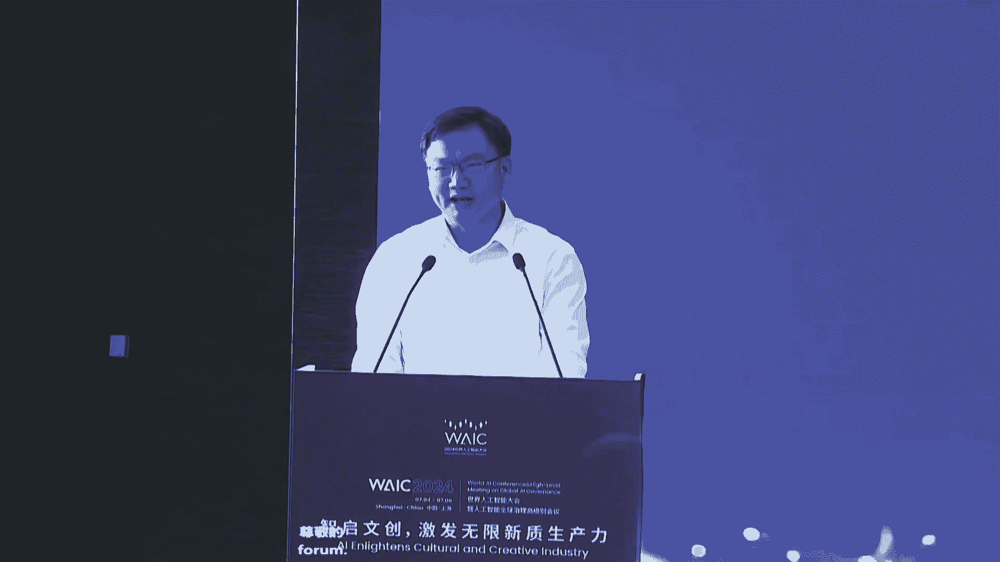
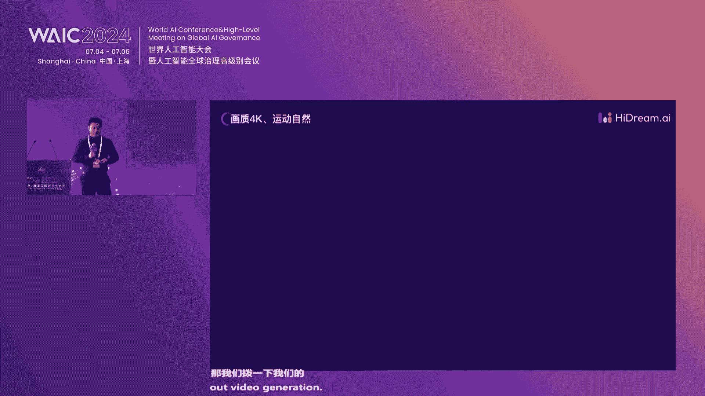
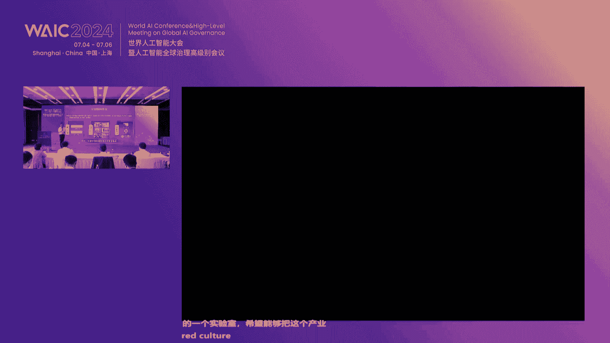
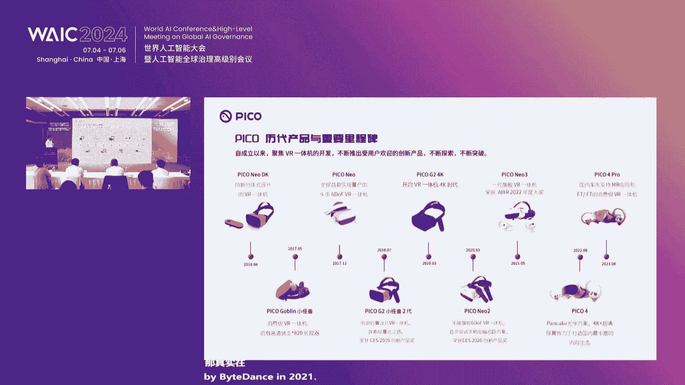

# P61：20240706-智启文创，激发无限新质生产力论坛 - WarrenHua - BV1iT421k7Bv

尊敬的各位领导，各位嘉宾，女士们，先生们，大家上午好，智启文创，激发无限新产力发展论坛现场，我是本次论坛的主持人，来自上海外服务股权投资管理有限公司的周折，近年来，人工智能技术飞速发展。

为文化创意产业带来了革命性的变化，为文创产业注入了新的活力，而AI加文创新智生产力的培育与发展，也为上海落实数字中国建设部署，加强数字文创和元宇宙新赛道顶层设计，战略布局。

打造文创产业新发展核爆点提供了新的机遇，上海市文化创意产业促进会，上海外服股权投资管理有限公司共同主办，上海数字文创暨元宇宙产业联盟，中国联合网络通信有限公司上海市分公司，德必集团锦和商管。

上海申通信息科技股份有限公司，北京志向未来科技有限公司，杭州灵伴科技有限公司提供支持，现在由我来介绍出席今天会议的领导和嘉宾们，市国资委副主任王亚元，市经信委副主任汤文侃，上海报业集团党委委员副总经理。

上海联通党委委员副总经理刘同，市文创办副主任刘波英，副馆长阮俊，市文创办综合办资金办副主任宋晓辉，上海市漕河泾新兴技术开发区发展总公司，上海联通企业客户事业部总经理何艳，欧洲科学院院士，电子科技大学。

计算机科学与工程学院院长申恒涛，北京志向未来科技有限公司创始人CEO梅涛，上海敦煌资产管理有限公司总经理袁国良，上海外服务股权投资管理有限公司，总经理朱农飞，上海申通信息科技股份有限公司创始人汤金华。

那现场呢还有我们来自企业协会，智库，高校及各大媒体的记者，让我们以热烈的掌声，对各位的光临表示最诚挚的欢迎，好，那我们首先有请市经信委副主任汤文侃，为论坛致辞，尊敬的雅原部长，各位领导。

各位来宾，大家上午好，今天呢我们齐聚一堂，共同来推动AI赋能文创，激发无限的精致生产力，在此我谨代表市经信委向各位嘉宾的到来，表示热烈欢迎，也向长期关心和支持，上海人工智能和文化创意产业发展的各位同仁。

表示衷心的感谢，作为新一轮科技革命和产业变革的重要动力，人工智能正在引发全球产业的重塑，以大模型为代表的人工智能技术，正在大幅提升文创产业的效率和质量，开拓文创产业的领域和空间，人工智能呢。

也已经成为推动文创产业发展的新引擎，也就是在前天呃，上海在人工智能领域的起步早，基础好，企业数量众多，技术创新活跃，围绕AI发展与治理，率先进行了许多有益的探索，并希望上海能继续巩固优势。

打造人工智能发展的高点，我们上海近年来一直高度重视人工智能的发展，全力推动AI赋能千行百业，尤其是在文创领域，也形成了一系列的阶段性的成果，突出的表现在首先呢是顶层设计。

家族企业创新已经出台了大模型发展政策，11条的文件，我们也实施了算力补贴，降低企业的创新成本，以市场化的机制呢加速宇宙资源的建设，同时呢引进培育各类大模型企业继续发展，第二方面呢是新兴动能不断增强。

我们上海建成了全国首个的大模型，创新生态社区，附属空间，已经吸引了将近80多家企业，在这里进行了集聚，这些企业呢包括有影视创作，数字文创广告创意，电动附近电竞互动的纹路，创领域里的创新创业团队。

已经也形成了典型的场景规划的应用，不断拓展文创产业的新边界，第三个方面呢则是文创产业的规模持续扩大，全球的影视制作中心，创意设计高地，亚洲的演艺之都，全球的电竞制度，网络文化产业高地等。

建设呢也取得了显著的成效，增速位居全国的前列，可以说，人工智能与文化创意产业基础夯实，应用前景广阔，产业融合了虚势待发，面向未来，上海将紧紧把握通用人工智能发展的重要机遇，我们也要高水平要赋能文化创业。

要率先跑出AI加文创的新赛道，我们将持续开展核心技术的公关，要支持纹身图，纹身视频等前沿技术的研发应用，在文化创意领域探索以大模型为驱动的新技术，新业态新模式，我们将继续培育开放的优质生态。

进一步提升智能算力的人机水平，扩大语料数据的供给和服务，要持续做大做强，我是空间，要为AI加文创跨界创新夯实要素资源，我们将继续建设典型的示范应用，要加速人工智能与文创产业的融合。

以大模型为底座提供创新工具，推动人工智能技术，在文化创意产业中的广泛应用和创新发展，各位来宾，我们今天的论坛呢，也集聚了我们行业内的一些，顶尖的学者和企业家，我们也期待大家能够分享成功经验。

展望未来的发展，也期待数字文创暨元宇宙产业联盟，东方网这些专业机构要发挥综合优势，要积极促进AI与文创领域合作交流，我们市经信委呢也将进一步的优化产业生态，不断完善服务和制度供给，与大家携手同行。

共同开创人工智能与文化产业，创意产业的融合发展的新篇章，最后也预祝本次论坛取得圆满成功，谢谢大家，谢谢汤主任致辞，请您入座，好下面我们进入论坛的主旨演讲环节，让我们掌声有请。

中国电子科技大学计算机科学与工程学院院长，欧洲科学院学院院士申恒涛院士，为我们带来多模态行业大模型，AI产业化的新篇章，啊好尊敬的各位嘉宾，女士们，先生们，大家早上好，我是沈涛啊，来自电子科技大学啊。

也是啊成都考拉优人的创始人，同时我们也在淘淘金啊，落地了，我们上海马吉克人工智能科技有限公司啊，今天啊非常荣幸啊，能有这个机会跟大家一起分享一下，我们啊在多模特行业，大模型的一些啊基本的认识啊。

一些成果以及啊实践，希望我们大家一起啊，共同开启AI产业化的新篇章，那主要就三个方面吧，首先我们看一下我们的大模型唉，发展的一些展望，然后就是我们自主研发的大模型，我们叫悠然大模型体系到底是个什么东西。

第二个，第三个呢，就是我们要具体落地的一些行业的一些案例啊，好那我们知道大模型哎从2022年开始吧，20232023爆发到现在啊，依然啊啊应该说是非常火热的一个概念，那大模型的发展在今年又有什么变化呢。

那有很多变化，我这个地方就跟大家分享三个吧，一个是开源大模型的爆发，同时一些小模型也开始在终端运行，第二个呢就是多模态已经成为大模型的标配，那现在大家提大模型基本上都是多模态大模型。

那AIJC的技术也在不断的提升，同时啊agent激发了大模型的一些潜力啊，应该说是成为一种比较啊强劲的生产力工具，能够真正的赋能到行业当中去，这从技术层面上，那么产业上面来讲呢。

现在企业级的AI用网不断的纵深发展，向唉行业啊发展，同时AI也助力聚生智能这个产业的蓬勃发展，那另一个方面呢就是大模型与硬件相结合，也带来了一部分的新的产业革命，这是技术与产业方面唉所发生的一些变化吧。

那在现阶段或者说在未来的可见的五到10年，大模型技术是推动人工智能获得突破，的一项核心关键的技术，那我们大家也对大模型都有了解，就像我们以前处理数据，我们从来不叫大数据，只叫数据，对不对，后来数据大了。

我们叫大数据，同样我们以前模型啊，算法也谈了很多人工智能对吧，那现在随这些模型变大了，我们叫大模型，主要体量那三个大大量的数据啊，大量的参数，大量的算力，从而经过预训练或者微调啊。

唉我们得到我们需要的啊，建模也好，行业大模型也好，是这样的一个基本的概念，那么大模型为什么这么重要，或者说在各个领域得到一些广泛的应用呢，那无非呀最重要的一点就是，它能够不断拓展人工智能的应用的。

深度和广度啊，那主要源于这三个比较先进性吧，泛化性，通用性以及实用性，泛化性比较强，在从未见过的数据上面，它也能表现出一些比较好的性能，通用性的话，也就是它可以适应不同的任务或者数据集。

那实用性的话准确来讲就是高效啊，高准确度，因为这三个啊应该说是呃优势吧，它能够让大模型这个技术，在很多具体的应用当中，得到一些性能的大幅提高，从而让大模型这项核心的技术啊，在人工智能现阶段发展啊。

应该说这是一个核心，那么下面就跟大家分享大模型发展的哎，应该是未来的趋势吧，那趋势有很多啊，这个地方也跟你分享三个，第一个是从单一模态向多模态的引进，这个我想大家都比较清晰了。

第二个就是从通用大模型到行业大模型的啊，这样一个演变啊，这样一个演变，也就是说基于我们现在的很多基膜吧，再加上行业领域的一些知识规则，形成了行业大模型，能够给具体的行业做赋能，真正实现数字化的。

应该说是在行业的数字化的转型，要靠行业大模型，那发展趋势三的话，我们有了哎，但模型不论是通用还是行业，但是要具体落叶的场景当中去应用当中去，它还需要一个工具链啊，工具链这是大模型发展的趋势三啊，趋势三。

因为我们最终是要解决企业的问题，客户的问题没有这个工具链，只有模型也是无法落地，这是大冒险发展的近期趋势，那现在我们国家重点提的是产业数字化转型，对所有的行业需要AI的。

用AI技术来提升数字化展现的力度，那么多模特行业大模型啊，现在被认为是一个核心的引擎啊，核心引擎，我们考拉悠然，自主研发了悠然多模态的产业通用大模型，在此基础之上啊，针对具体的行业。

我们生成了很多行业的大模型，从而具体的能给各个行业进行精准赋能，高效的赋能，那下面与大家分享一下，我们悠然大模型体系到底是什么样的啊，这是我们考拉优人啊自主研发的，在过去啊7年时间吧。

我们考拉优人是2017年底成立的啊，那在我们公司啊，这整个核心的技术吧可能有三层，第一个就是模型层啊，我们是悠然多模态的大模型的家族，包括了通用大模型，这个地方的通用大模型是产业通用大模型。

也会跟大家解释一下，还有行业大模型，各种行业大模型，第二层就是平台层，就是要对接客户与模型之间，它必须要有一个连接啊，要告诉客户如何去用这些模型，到他们的应用当中去啊，那具体的要把这三层串联起来。

就需要马吉克os magic，什么是os magic呢，os magic应该说是我们在全国第一个提出啊，多模态人工智能操作系统啊，这样一个概念，我们应该是6年前提出的这个概念嘛。

当时是比较先进的一个概念，就像我们拿到手机哎，拿着电脑，每个人都会用手机吧，都会有电脑吧，是因为他有操作系统，那我们人工智能也需要一个操作系统，每一个客户哎，有了这个操作系统，他就知道如何去用这些模型。

算法到它具体领域当中去，所以这个概念是这样的一个概念，那现在啊，马吉克已经变成了一个，非常完整的工具链平台啊，工具链平台在这个工具链平台上面，我们有行业模型的快速生产，就是你要生成行业模型。

那我们生成模型之后啊，我们还要推理引擎，同时我们也有智能体的工具集，以及行业应用的工具集这四个主要的部分，从而形成一个真正的工具链，把生成的模型迅速运用到具体的行业当中去。

需要这样一个高效的工具链的工具链，这是马吉克，那通往马吉克生产出来的大模型体系，到底是什么样的呢，我们啊悠然多么在产业通用大模型，那什么叫产业通用大模型，我们可以这样理解哈，基模就是我们9年义务教育啊。

哎这个通识教育诶，高中之前吧形成的叫基姆，但是我们进入大学，我们学的是啥学的专业吧，对不对，但在学专业之前，一般大一都是学什么通识嘛，对不对，所以产业的通用大模型，你可以理解。

它就是哎大学期间应该是大一学的通识教育，那到大二大三，我们就必须要进入到各个专业当中去，来形成各个行业的大冒险，这这是一个相对应的一个对比吧，所以有了产业通用大模型，形成了唉我们这样的一个模型家族。

针对各个行业啊，形成了各个行业的哎这个具体的大模型，那模型的特色就是我们是多模态的感知与生成，我们有精准的行业认知，以及快速生成行业应用的能力啊，还有一些模型的能力，包括了我们的数据集呀对吧。

跟着的数据以及上下长度能，这是具体的模型的一些能力，那么到底这个行业大模型是如何形成生成的呢，产业通用大模型，我们聚集了很多行业的唉知识，来训练产业通用大模型，但具体到行业当中去的时候。

那我们就需要通过马赛克这个工具链平台，首先我们要了解行业的需求，然后有了行业的高质量数据知识规则等等啊，再通过具体的场景，场景代表的是功能要求啊，功能的要求，也就是说我们要形成啊业务能力，对这个场景。

对这个行业到底需要什么样的需求啊，也就是各种各样的task啊，然后在产业通用大模型的基础之上，我们形成了行业的具体的大模型，那再结合具体的应用啊，哎落地到具体的场景当中去，是这样一个逻辑啊。

那悠然大模型的先进性啊，主要体现在三方面，一个是高性能，因为我们的行业知识广又深，所以当我们的赋能的具体行业当中去的时候，它的效率或者效果是非常强的，同时我们有一些非常小的模型啊，实现轻量化。

最后啊是脊柱前，也就我们有很多模型可以选择，有大的有小的，同时我们有一些通用的能力，也有一些行业的具体的能力啊，这是优雅大模型体系的一些先进性吧，那这是一个交互平台，刚才说了模型层，平台层，应用层。

那这个平台层是干嘛的呢，就是要对接客户，有模型的，也就是说你要有能力，让客户与我们的模型之间进行对话啊，知道如何去用这些模型，如何去编排这些模型，从而帮助客户最终实现认知决策与生存的能力。

这是这个交互平台所要做的东西，好最后再跟大家分享一下，我们在具体的行业里面落地的一些具体情况，包括了一些案例，包括了一些案例，第一个是工业检测大模型，就基于我们的产业通用大模型。

我们形成了工业检测的模型，那具体的功能就包括了人机交互B，二问知识管理及视觉检测，以前的时候，工业检测只是聚焦在视觉检测，这一个核心功能上面，但通过大模型啊，它就可以把整个检测的过程不仅仅是做检测。

还要管理起来，那落地的具体的就是半导体的产线，半导体产线，我们把工业检测大模型，镶嵌到具体的设备当中去啊，形成了哎这样的一个智能检测的设备，就是软硬一体的这样一个设备，如果说这个机器可以动。

那就形成一个机器人啊，检测设备，这是在工业检测落地的情况，第二个是烟草大模型，它的核心功能就是包括了所有数据的统一，大管啊，还有一些智能小设备的一些闭环运行，还有整个生产过程当中。

安全生产的一个态势的监测与分析，还有生产过程的管理与内容生成，这是我们落地的全国十几个啊，烟草工厂里面的AI综合的管控平台啊，管控平台，那第三个呢是交通大模型啊，交通大模型这个应用比较广泛了。

主要就是多元感知视频统一接入，还有智能识别的快速编排赋能，还有啊安全态势的感知预警，还有事件的整个处理的闭环过程啊，那这个我们也落地的来铁路铺路，这样一个具体的场景当中去啊，这是交通大模型。

那最后一个呢跟大家分享的是城市治理的模型，这个广泛应用在智慧城市里面，那就是多模态设备的统一接入，大小模型的协同服务以及事件协同的处理闭环，还有啊场景算法生成的封装啊。

我们已经在全国也是十几个城市落地了啊，这样的一个城市之一大模型，这是跟大家分享的，最后一个就是具体的行业当中去的哎，大模型的情况，那AI那么行，它的原生应用其实现在已经越来越多了。

就包括你看像工业产线的数据分析师，烟草设备的运用工程师，城市交通应急处理员，以及综合呃，这个监控视频的这种合作评审员等等，这都是些原生的应用啊，非常原生，以前的时候是很难做到的，以前很难做的。

通过大模型这个技术，特别是行业大模型，这个技术都可以完全实现智能化自动化，当然我们说在四川，我们公司是元音，四川哈文旅非常发达啊，非常发达，现在四川也在做文旅大模型，文旅大模型就通过ARDC这个技术啊。

征信一些具体的纹理内容啊，文理内容能够在整个全国世界上进行宣传啊，特别是像博物馆，像三星堆啊啊这样的场地，还有AI的设计师，巴蜀文化这些这个艺术的设计啊，还有游戏世界的。

你这样像我们的王者荣耀就是从成都出来的呀，都是通过AJC的技术，那影视歌曲的辅助就哪里都有了啊，哪里都有，所以ARGC的文旅啊，应该说是在这个行业里边，它的价值是非常高的啊，非常高的，如果AIGC。

能够在广泛的文旅行业当中得到应用，那它的价值也是无限的，那最后啊就是整个大模型行业落地啊，它的生命周期啊其实也非常简单的概念，首先我要了解场景，对不对啊，我有它的具体的行业场景的数据。

然后再加上我们同时公开的数据，这就同时了对吧，然后进行啊AI task编排也是功能的编排，最终啊具体应用到应用当中去，这是一个整个的生命周期，是这样，虽然说很简单，这个周期看上去。

但是真正落地起来还是非常复杂的，这就体现了os magic，这个人工智能操作系统的重要性，它体现了它到底高不高效啊，人工智能公司为啥赚不了钱，很多去以前的时候就是因为不够高效高效啊，不够高效啊。

最后呢我们还有没有时间播放一下，我们考拉悠然的视视频，没有了，好那反正我介绍的差不多了哈，啊谢谢各位啊，我们考拉悠然已经成立了7年多了哈，啊已经服务了500多家客户了啊，刚才那些落地的场景啊，总会有啊。

讨论了四个对吧，但是落地的客户有500多家，今年的营收啊应该也差不多三个亿啊，所以真正的实现AI公司的营收啊是很难的，但是我们考拉悠然，今年应该说是能够实现营收了，好谢谢各位。

感谢深院士关于产业通用大模型的分享，请您入座，接下来让我们掌声，有请加拿大工程院外籍院士，志向未来创始人梅涛院士，为我们带来多模态大模型技术的演进与突破，四，进来参加智启文创的这个论坛，然后呢。

呃我们这项未来其实就是上海市第一批入驻呃，魔术空间的企业，去年9月份就入驻了啊，然后今天大家看到的那个论坛的片头，那个G那个AITC的视频，就是我们来创作的，就是今天今年的WAC的大会。

我们应该创造了不少这样的开幕式的视频对，然后今天呢我就想给大家介绍一下整个多模态，人工智能的发展的一个一个现状，和它的那个将来的一个趋势，那么刚才呃申院长啊，申院士讲过了。

这个多模态技术的发展的一些呃趋势，那么其实大家如果我们今天看人工智能哈，大家千万不要去看一时的得与失，那么如果我们要看人工智能的话，应该把这个窗口拉长到很长的，一个接一个一个一个时期。

特别是从现在最近的几年，甚至于看到人工智能发展历史的整个的60年，那大家可以看看人工智能经历了三个阶段啊，从第一个阶段的这个呃逻辑推理到知识工程，到现在的大数据啊，大模型的时代。

那我自己的就亲身经历了两个两个周期，那么我我清楚的记得，我们当时从人工手工来设计我们的图像，文本的编码到到我们的第三个阶段，基于深度学习，通过从呃卷积神经网络过渡到这个transformer。

这个网络其实经历了很长的一个周期，那么如果我们看这个周期的发展，虽然人工智能的技术是起起落落，但是整个的趋势它的曲线是非常陡峭的，那么今年我们我们回头来看，之前的一个技术发展的话。

跟现在的技术的能力是完全不可同日而语的，那么今天我们的模型的参数已经从过去的啊，几千万到几个亿，到现在的啊，万亿到以后的可能十万亿百万亿，所以说人工智能未来的趋势啊，一定是沿着这个曲线一直往前来发展的。

那么另外一个就是我给大家分享几个数字，第一个数字就是14%，就是未来全球的GDP的增长里面，有很多一部分是由人工智能来驱动的，比方说第一个数字就是在2030年，那么这些数字其实是大概是几年前的数字。

但是我发现很多人依然在引用这样的数字，那么第一个就是说人工智能在2030年之前，每年给我们全球的人工智能的啊，全球GDP的增长的推动力是14%，这个数字是很高的，那么特别是在经济目前的这个当下哈。

如果有十两两位数的增长是非常不容易的，另外一个数字就是74%，就是全球经济总量的74%，会受到人工智能甚至是人工智能技术的影响啊，其实我们有做过一个一个访问，就是全球500强的企业里面。

已经有一半以上的企业在开始大规模的使用，生成式人工智能的技术了，那么第三个数字就是26%，那么这个是跟我们息息相关的，也就是说我们国家的GDP在未来呃，2030年之前，每一我们的GDP有26%。

将会受益于人工智能技术的发展，所以作为人工智能这个行业来说，未来我们要看到未来10年的这个光景，那么大家讲讲到，我们人工智能现在目标是通向啊AGI，所谓的AGI，那么我个人认为就是说。

如果要实现跟人一样的智慧，人一样的意识，我认为这个路程路径非常的漫长，但如果是今天我需要人工智能，具有人一样的工作的能力，思考的能力，我认为这个会在不远的将来会实现。

那么目前我们可以看到实现人工智能的通用，人工智能有两条路径，第一条路径就是沿着这个上面的曲线啊，做我们的文本语言的压缩，也就是用GPGPP的方式来做next token prediction。

那么这个目前来说可以看到啊，国外的竞争非常之激烈，当然我们国家也有很多的这样的一个初创企业，还有大模型公司，那么目前来说，这个阶段已经从GBD4，过渡到GBT5的这么一个阶段。

那么接下来的评比拼会更多的倾向于啊在数据，计算资源等方面的一些积累，那么另外一条曲线就是我们下面那条曲线，它发展的很陡峭啊，它是基于这个叫扩散模型，diffusion这个框架通过模拟物理世界啊。

特别是视觉的物理世界来去去整，构建整个的AGI的这个过程，那么diffusion model和这个GBT这个这两个框架，从技术的框架，从底层的数据，从我们的物理模型来说，都是一个两个不同的框架。

那么目前来说这两个框架各自在发展，那未来的话，我们可以看到这两个框架有有可能是会融呃，融融为一体的，那么我们做多模态理解，做多模态有两个路径，一个是理解，一个是生成，那么在多模态理解的时候。

我们是沿着这个上面的曲线来来往前走，那么动脉态生成的话是沿着下面的曲线来走的，那么今天我们不管是opened solar还是我们hi dream啊，之前未来都是处于这个第二条曲线，那么第二条曲线。

目前的这个水平相对来说会稍微滞后一点，它处于我们大概判断，它属于GBT2的这么一个阶段，但是未来的空间潜力很大，那么整个多模态生成的技术的话，它也不是一朝一夕就能够做到的，那么任何一个技术的。

它的突破都是依赖于很多很长时间的积累，那么大家可以看到我们上面的这个曲线哈，上面的那一那条曲线，是我们视频生成的一些技术的突破点，那其实我们也非常荣幸，就是说我们在2017年，当时我们还在微软的时候呢。

我们就做了全球第一篇啊，学术界第一篇从文字生成视频的这么一个模型，当时我们还是用那个叫啊spatial temporal gun，来做的这个这个这个这个模型，那么这个模型经历了从啊。

现在今天大家可以看到有auto regressive，自回归的模型，有基于stable diffusion的模型，那么也有我们去年也发布了，我们大概是叫REVIDEODOR。

就是做多多场景的这个视频生成，包括下面的呃，那个也是从diffusion model到transformer，这个一个过渡图片的生成模型，那么才有了今天的我们突破，那么整个的视频的生成技术。

到底处于什么样的状态呢，我们可以看到，我们可以把视频生成的技术的能力呃，也分为L1到L5，那么对标我们的这个自动驾驶，那目前来说，不管是我们也好，还是我们的我们的那个同行来说，我们都处于L2阶段。

我们目前还是致力于单镜头的内容生成，能够把它做得更加可靠，更加精细化，那么未来我们要一定要从L2L3，L4L5来走，那么什么叫L5的，也就是说我扔进去一个小说出来就是一部电影，这是我们的一个终极目标。

当然这个目标还有很长的路要走，那么以所有的模型落地，一定要经过产品化，商业化的阶段，我们要考虑就是成本效率体验，那么目前来说我们的大模型成本依然很高，训练成本我就不说了，推理成本也是很高的。

我们目前来说，我们要生成一秒钟的视频，它的成本大概在一块钱到一美金之间，那还是匆忙和一比一的比例，那另外一个就是效率的问题，我们今天要渲染一段视频的话，它需要等待时间还是比较长的，另外就是体验。

那么今天为止，我们现在的很多的AITC的产品，它对用户的这个门槛还是蛮高的，对啊，不是所有的人都能够，很简单的去使用这样的一个一个模型，那么当然就是到底未来怎么样去赋能，我们的行业啊。

我我们我们认为一定是一个大模型，结合很多的小模型，行业模型，专家模型才能够服务我们的客户，那么这是我们的一个思考，那么我们目前之前，未来是基于我们的底层的基础模型来加。

结合一些行业应用的小模型来服务我们的客户，那么这是我们之前做的一些案例，我就跳过去了，我们目前的话已经是赋能于很多的行业啊，从行业的角度来说，我们是赋能于影视制作啊，视觉设计，广告营销啊。

包括我们的还有文旅啊，特别是跟我们文化相关的产业，我们都都是有赋能的，那目前为止我们的志向大模型有三个，全球首个，第一个是我们全球第一个商用的DIT，就是digital啊。

叫diffusion transformer这样的一个模型，第二个呢就是我们是原生的啊，把图像视频，3D文本混合训练的一个一个大模型，第三个就是我们是全球首个，真的能够打得到一个全民级国啊。

运用的这么一个一个产品，我们跟运营商来合作，做一个做这样的一个AI的英语成片，那么很快大家可以看到你们的手机的里面的，套餐里面就会有我们这样的一个一个服务，那目前来说。

我们已经服务了100多家的行业的头部客户，那么创业公司的速度还是很快的，另外呢，我们目前整个AI的商品的图生成已经超过了，300万，300万张，那么全球的单月的访问量，已经超过了100万次啊。

这是过去几个月来很呃产品增长的很猛，那另外我们也服务了全啊，全国大概有3万家的啊小微企业啊，这些企业就涵盖了刚才我说的很多行业的，不同的不同的地方，那么接下来我们会发布一个全球首个图像视频。

的一个原声的这个ITC的平台，那么这个平台有几个特点，第一个就是文文字的稳定性强，我们已经可以把美术字，文字还可以无缝地嵌入到我们的图片，嵌入到我们的视频里面去，另外就是我们的视频是可以可变市场的。

今天我们的用户可以选择五秒钟，也可以选择15秒钟，我们的VIP客户还可以选择一分钟，2分钟的单镜头的视频都是可以的啊，另外就是我们的整个的视频，大家刚才讲到，我们要从L2走到L3。

那么我们我们希望能够试制作出有连续，故事性的多镜头的这种生成，那么接下来我就要有请我们的啊，志向未来的CTO摇艇模式，给大家来详细的解答，解答一下我们的志向，未来的这个志向大模型的2。0版本。

对对各位领导，各位来宾，大家上午好，那接下来我会给大家啊详细的介绍一下，我们整个这一次志向大模型的升级，那首先是从技术的维度来看一下，我们从升级从哪几个维度做了更多的一些考虑。

实际上我们整个的这种考虑相比这个要多很多，但这里我会列举大概四个比较重要的点，第一个是从数据层面，实际上我们这一次的模型训练是基于可变时长，可变尺寸的一个训练，大家知道就是说我们往往在之前。

我们呃这个生成视频一般是固定时长的，比如说四秒钟八秒钟，那今天我们在训练的过程中，实际上我们是根据这个视频的镜头，比如说有的视频镜头可能是几秒钟，有的视频镜头可能是几分钟啊，我会根据这个镜头来训练。

我整个的这样一个一个一个基础模型，那从模型上来看的话，那我们上一代的模型，可能还是基于这样一个架构来，这一次我们的模型的基础架构啊，升级到这种啊DIT啊，其实我们在DIT本身上还做了很多的改进啊。

当然是我们统称都叫做DIT，除此以外的话，我们对整个多模态内容的编码，那往往以前我们是基于像素空间啊，或者是引空间来去编码，那这一次的话，我们实际上是彻底的打通了多模态的理，解和生成呃。

去实现一个多模态的大圆模型，去帮助我们做这种不同模态之间的对齐和编码，那我们知道我们现在的视频是越来越大啊，包括我们的视频的时长也越来越长，所以在我们整个训练的过程中。

我们不仅需要得到一个有效的时空建模，实际上我们还希望这个实际控建模，能够更加的高效啊，所以这几个维度的话就奠定了我们今天的志向，大模型2。0的这样一个升级，那从升级的这种体现来看的话。

我们可能会在三个不同的任务上，会有很好的表现，其实刚才也提到了，第一个是在图像生成这一块的话，我们会有三个维度啊，第一个叫做美，也就是说我整体的图像的艺术感和这个美感，会会会会很高。

第二个就是准我的相关性，复杂逻辑的生成会更加的精准，第三个就是长，我在图像里面的生成的这个文字，能够嵌入的很长，那第一个我们可以看看这个高艺术性，这这这两幅图都是我们的这个模型生成的。

那我们可以看到左边这幅图的话，它的色彩的搭配非常的鲜明，然后它非常有层次感和和这种呃这种立体感，那右边这幅图的话，它的整体的布局很均衡，然后它的元素之间的这种组合，也更加的有一定的结构性。

包括它的细节更加的逼真啊，那另外的话就刚才提到的复杂逻辑，其实我们知道在往往业内比较一个通用的一个，一个难点吧，就当我生成特别复杂的逻辑的时候，其实同样生成会有一定的挑战性。

那今天我们看到像这种呃空间关系，位置关系颜色，包括一些特别的一些匹配，比如说我们以这个左边这幅图为例吧，比如说左边篮子里的红色的草莓，中间是这个青色的苹果，右边是紫色的蓝莓，后面还有一只白色的小狗。

以及啊墙上还写了pixel，pixel0V二这样的一个一个文字的输出啊，这都实际上是一个非常复杂的一个逻辑的组合，那第三块的话，就刚才提到的就是文字的嵌入生成，那这里我举了三个例子啊，一个是英文的生成。

这样我们可以直接在我的提示词里面写，写出这个high dream点，II它就可以在我的这个图像里面去生成，那中间实际上实际上是一个中文的生成好了，最右边的话。

实际上是一个非常天花板级别难度的一个case，实际上它是g p t foo里面的一个一个例子，就说他会写一个机器人在写日记，但这个日记内容是我们在提示词里面写好的，那这样的话。

它就可以自己把这些日记打在这个这个呃，这个打字机上啊，那说完了文字呃，说完了图片，我们再来看看视频，其实视频刚才也提到了，我们可能也会有三个点，第一个就是画质的4K和运动的更加的自然。

第二个就是我们可以定制时长，用户可以选择五秒十秒15秒，甚至说我们自动自动去判断这个提示词，需要几秒钟去表达，最后一个就是分钟级别的一个直出的视频生成，让我们播一下我们的那个4K的视频。

对这个我们就很好的继承文字的这个生成，这个是整个物理世界的一个魔力，因为这个是大运动的视频，对这也是大运动的一些水平，下一个应该是瀑布，这个瀑布的话应该是有两个镜头，应该会有一个转场，对这个是一个转场。

这里是一些小小的动物，这是一个大的场景，好吧，那我们再来看一下我们的定制时长的，一个一个视频播一下，对这就刚才提到的，我可以定制时长，比如说用户可以定制五秒钟，然后他也可以定制它的长宽比是16比九。

这样我就可以生成一个五秒钟的长宽比的，这个视频，当然用户也可以指定说五秒钟，这也是一个16比九的，这是一个虚拟世界里的一个瀑布，下一个可以用户定制，可能是十秒钟，然后他的这个长宽比可能是九比16啊。

你看它是生成一个竖屏的视频，我完全可以通过用户的输入去定制它，这个应该也是一个十秒钟的视频，是篝火晚会，让大家去庆祝下你的篝火晚会，对最后一个应该是15秒钟的视频，实际上是一个小老鼠。

在在彩色的气球上面去去这个爬行吧，只是一个十秒的视频好，因为十连冠就齐了，唉下一页应该是一个一分分钟级别的，一个视频的生成，对这个应该是一个呃分钟级别的，实际上它是一个海底的世界。

从海面上可以看到一些建筑，到整个沉入海底，整个海洋世界的一些变化，既然这个视频挺长的，我们可能就看前面一小段吧，然后后面的话其实它的海海底的不同的生物，包括不同的海底的一些建筑。

都会有一些新的产品的一些出现啊，好因为时间关系，我们就切下一个3D的画面，对我们可以看到其他的，这个是我们最后一个就是3D，我们可以通过用户可以通过一个文本，生成一个3D的模型，生成完这个3D模型的话。

我们可以在vision pro里面去把这个3D模型抓出来，和这个3D模型做一定的控制和交互，想让用户可以带着这样一个卫生pro，在虚拟的世界里，就可以跟这些3D模型做一些操作了啊，实际上这是用户的实拍。

这样的话用户就可以通过文本的输入，生成大量的3D的模型，然后每个3D模型的话，都可以跟大家去做这样一定的效果啊，我们提供了一些新的玩法吧，最后我呃这是我们的那个公司的官网啊，最后我想说的是说呃。

也请大家多多关注我们的发展，多多用我们的这个啊工具啊去去使用我们啊，这下未来也会用我们非常极致的这个用户体验，包括我们的模型能力，产品能力去回馈给大家好，以上谢谢大家好，感谢梅院士和姚总。

关于AIGC的行业发展及志向，大模型2。0的精彩分享，请两位领导入座，数字一大元宇宙是上海市经信委，2022年上海市元宇宙重大应用场景揭榜，挂帅项目的第一批元宇宙重大重大应用场景，受到社会各界的关注。

接下来我们将通过一段视频介绍数字一大，请看大屏幕，建设数字一大，基于5GAIXR元宇宙云计算等技术，打造数字一大三重空间，线上孪生空间穿越探索山海漫游，回望百年征程，红色文化创新呈现线下交互空间。

沉浸式场景，全感官体验重回热血年代，多维交互的服务外延，虚实融合空间，AR互动，数字藏品串联线上线下，跨越时空的文化体验，持续探索创新应用，让红色故事生动讲述，红色文化深入人心，我们数字一大的元宇宙呢。

聚焦在文物数字化保护保护，数字成长，红色服务外延，数字文创四大方向，让红色文化走出去，下面我们即将见证，数字一大服务举证的线上线发布，我们掌声有请，上海报业集团党委委员副总经理。

上海联通党委委员副总经理刘同，移步台上，请三位领导为我们共同启动发布仪式，好我们请三位领导，首先来请大家先把手按在大屏幕上，然后我们全场一起倒计时，三个数，321好，现在我宣布数字一大服务。

举证数字世界中，请摄影师为我们记录这光荣的一刻，好谢谢三位领导，请两位领导入座，然后请阮馆长留步，谢谢，接下来我们请阮馆长为我们带来数字，一大探索红色文化元宇宙生态圈，构建，尊敬的王部长，汤主任。

各位嘉宾，大家上午好，特别的高兴，在各位的见证下面，我们正式发布了数字一大呃，我们立了一个啊元宇宙建设的一个项目，通过将近两年的时间，我们在上海联通，在我们的东方网，大家的倾力的支持配合下面。

今天有了这样子一个生态圈的发布，那么呃跟刚才两位认识啊讲的技术不太一样，我们更像一个呃垂类的，非常小的一个应用的场景，所以简单的跟各位分享一下，我们这个应用场景在两年这个时间以来，我的换一个手。

两年以来的一些建设的内容啊，他的精神家园的构建，不仅仅是说我们要强化我们线下空间的一个，触达的体验，我们更多的是希望能够用更新的技术，让没有办法触达到线下的公众，大家能够呃触达到我们这些红色文化的。

一些内容的转化，所以基于这样子的一个主题呢，呃守护好我们的根脉是我们的使命和责任，那么建设好一个不朽的精神家园，也是我们共同在做的事情，在数字赋能的这样子的一个命题下面，我们致力于对于数字化的保护。

展示服务外延和数字藏品的融合，在呃红色遗址的保护和传承，数字世界的打造，服务外延的这个构建中，构建了我们现在的这样一个平台，我们姑且把它称之为一个1。0版本的，一个平台啊，抱歉。

可能我这个PPT稍微有一点点大，呃目前我们建设的这个平台呢，是有非常多元的一些端口啊，包括了它的app端，小程序呃，VR端和大屏端实施一个触达的方式，那么它主要在一期建设的时候呢。

我们现在聚焦在文物数字化的保护，数字的展成，红色服务的外延和数字产品四个维度，在文物数字的这个数字化这个层面上，它其实是一个老的命题啊，但是在医大来讲呢，我们拥有除除北京以外，全国最多的红色革命文物。

我们有12。8万件，但是在呃这个数字化转化的过程中，我们一直是有所欠缺啊，结合现在这样一个项目，我们终于实现了文物的全本的数字化，全本的数字化呢，它不仅仅是为馆长的研究进行了一些服务。

我们更多的把它应用在，我们现在这个元宇宙场景，大家可以看到在这个平台中，我们构建了一些原生的空间，让大家进入到这个空间以后，可以第一步的触达到，我们现在这些可翻阅的文物。

这也是给了观众非常不一样的一个体验，那么在原生空间和原生空间互为打通的，这样子的一个建设的过程中，让大家不仅仅能触达到文物啊，感受到这些红色的故事，而且能够经过串联，形成它自己一种闭环式的一种游览。

那么光有了一个平台的构建以外呢，它其实还并不够，我们还在探索它更不一样的一些外向的表达，比如说我们构建了一个基于数字资产的，一个大空间的一个应用，在今年的七一，就前面几天我们已经正式对公众开始官宣。

开始做内测啊，那么我们在旁边的展厅里面，在联通的展厅，我们也做了一个微型的小空间的一个体验啊，欢迎大家一会儿去体验一下，那么有了大空间的一个应用以外呢，我们还把这个数字资产的一些内容的呈现。

跟我们现在的一些线下的城市的打卡，和一些线下的体验结合在一起啊，比如说左边这个呃呈现，它是基于我们新馆的外墙的，12伏的一个门牌的装饰，来进行一些城市旅游的一个打卡。

它可以把整个上海的红色的12里串联在一起，那么服务外延的探索是在不痛不断的，这个进进化中的啊，我们刚刚跟上海商学院，共同筹建了一个元宇宙，与这个红色文化传播的一个实验室。

希望能够把这个产业融合的这个方式，能够走得更远。

那么数字藏品也是现在在探索的一个赛道呃，目前我们是刚刚开始做了数字藏品的啊，整体的一个呈现，能够把线上的数字藏品和这个线下的文物文创，红色文创进行一些串联，这个服务矩阵的今天的发布呢。

是我们说整个数字一到元宇宙的1。0的版本，它能够把我们的整体的一个服务内容，整体串联起来，但是呢它的触达的方式会更多元啊，比如说我们有一瓶水啊，通过一瓶矿泉水的一个码，我们就可以精准的触达到。

我们现在这个元宇宙的平台，那么它的一个入口和出口，目前我们是预设了蛮多的一些想象，我们说我们做了一个1。0的平台，借了今天这个呃会议的场景，我们欢迎更多的大模型的机构。

我们觉得AR加元宇宙在红色文化的这样子的，一个协同的表达和传播上，能够形成我们非常重要的一种范式，成为上海服务的一个非常重要的一种模式，因为打通了一大的这个呈现，我们相信我们很容易能够走出上海。

走向全国，那么这个矩阵如何构建，可能还需要在座的各位大家通力的合作，我们的所有的内容是开放的，我们的所有的合作方式也是开源的呃，在共同构建一个未来的数字世界，我们一起努力，谢谢大家。

谢谢阮馆长的精彩分享，请您入座，好下面掌声有请，PICO视频负责人熊俊杰，为我们带来XR赋予线下文旅新可能，各位领导，各位来宾，大家上午好，呃非常荣幸啊，有机会参与到了跟呃，软广的这个数字一大出心之旅。

VR大空间的建设过程中间，也非常荣幸，今天能有机会能跟大家一起分享一下XI技术，AI技术和文旅的这个嗯合作合作的可能性，然后，嗯首先请嗯如许我简单的介绍一下PICO，PICO其实是成立于2015年。

然后是聚焦于嗯XR硬件，软件技术以及内容开发的一家公司，然后其实是在2021年的时候啊，由字节跳动全资收购，那其实在行业深耕的8年里面呢。

我们做了非常多的这个产品的开发，以及体验的优化，然后在2022年的时候，我们推出了我们全新的一款这个嗯旗舰机，然后苹果四啊，这个其实在很多领域里面得到了广泛的应用。

那其实过去大家认为XR技术可能还停留在这个，玩游戏啊，看视频的这个领域，实际上就像我们提这个互联网加一样，XR技术现在其实已经和教育医疗，线下娱乐这些领域得到了广泛的应用。

其实为这些各行各业都带来了一些新的机会，所以我们认为XI加，可能是接下来的一个新的趋势，那XR和文理有什么样的可能性呢，首先是我们其实看到这个政策层面的话，其实在从去年开始。

国家就发出了很多这个利好XR技术的一些政策，从技术层面来讲的话，其实在过去这几年里面，XR技术呃，其实发展的速度是非常快的，首先是其实更强的算力和更高的清晰度，让我们的视听体验得到一个非常大的提升。

同时MR技术呢让这种实景的环境和虚拟的内容，可以得到很好的结合，然后还有就是高精度的这种大大空间的定位，定位能力，让这个线下的体验得到提升，同时更重要的是AI技术的发展，即使让3D内容的生产效率提升。

然后呢这个成本降低，刚刚前面很多嘉宾已经提到了，很多类似的解决方案，所以我们说在技术和政策的共同共振下面，其实xi技术正在成为啊文旅的一个，文旅新制生产力的一个重要的引擎，那我们我们看到的话。

其实文旅的趋势从1。0时代的，以自然风光为基础的这种嗯，逐渐发展到了2。0时代，是以实景娱乐，比如说乐园这种为为代表，而到了3。0时代，我们认为可能进入了数字文旅的一个阶段，那其实是以数字化。

智能化以及虚拟化啊为这个主要的趋势，那数字文旅的时候呢，我们认为这个我们的新的技术，会促进这个内容的发达，而内容呢会带动旅游业的发呃发展，旅游业最终会服务于我们经济的一个发展，而在数据管理阶段的话。

我们认为我们看到一个趋势是啊，XR线下体验其实是具备非常大的潜力的，然后2023年，其实全球范围内，XR线下体验都有一个爆发的阶段，整个行业迈入了这个亿元票房时代，的一个里程碑。

这个是单单个内容可以实现亿元票房，这个逐渐逐渐的，我们在向这个电影的这个票房规模再去靠近，这个我们认为是行业的一个重要的里程碑，那回到PICO的话，我们呃我们过去做了一些什么事情呢，那最早的时候。

其实我们主要是呃，做这个线上的视频和和直播业务，然后呢其实也做了非常非常多的这个项目，后来我们发现，其实XR技术不光可以应用于这种娱乐，娱乐产品里面，其实它在它还有很很很大的。

这个社会的意义和商业的价值，所以呃这里是一个案例，古籍寻游记，我们和这个国家图书馆，然后敦煌研究院一起推出的呃，实际上这个展览推出以后呢，受到了这个广泛的欢迎，而当时其实这个是一个单纯的公益的展览。

但是后来通过这个展览，我们发现其实它的商业价值也是很高的，所以呃我们后来又和啊，我们的这个秦始皇陵博物馆，敦煌博物馆以及这个长城，我们都推出了非常多的这个不同形态的VR体验，在这个所有的这些形态里面。

我们发现大空间可能是最有潜力的一个方向，我们认为大空间其实已经是啊，后续的这个未来的影院，未来的展览，甚至是未来演出的一种新的雏形，而但是现在这个阶段呢，其实整个行业里面还有非常非常多的问题。

这里我们只是列列出了其中一部分，而苹果在这里面呢，我们认为我们可以推出自己的这个嗯，最全面的这个技术和服务的解决方案，不光有这个定位的算法，我们还有这个播控的能力，还有还有很多线下服务提效的一些工具。

最终的话我们可以让我们的合作方，可以拎包开店，不需要在技术方面去啊，有太多的负担，那今天啊我们也非常荣幸就是说呃介绍一下啊，我们后续即将推出的一些项目，首先嗯最隆重的就是刚刚软管提。

提到这个数字一代出心之旅的项目啊，我们非常荣幸，有有机会加入到这个建设过程中间来，呃，同时嗯或下半年我们还会推出啊，敦煌大空间以及三体大空间，这样的一些呃新的作品啊，我们希望和行业合作伙伴一起。

然后用XR技术，然后讲好中国的故事，然后这个就是我的分享，感谢大家好，感谢熊总关于XR技术的精彩分享，请您入座，好，接下来我们掌声有请，申通科技创始人汤锦华博士，为我们带来多模融合，AI进化。

交互式人工智能的未来发展，有请唐总，好谢谢大家，感谢大会给我这样一次这个演讲的机会，那今天呢我想就是还是先讲一下，我对整个人工智能发展的一个理解，以及我们对未来的展望，并且最后呢可能会汇报一下。

就是我们公司目前的一个情况，那么呃其实前面这张图，我看那个这个美院士也在讲哈，人工智能整个发展，那我觉得人工智能的发展，其实我们可以从一个视角去看，就是为什么从最早的逻辑分析。

到发展到今天的这个大模型啊，这样的一个算法的发展，其实跟每个时代它拥有的这种算力，它的数据，它的这个存储是息息息息息相关的，也就是说人工智能它不是一蹴而就的，实际上它是根据你的周边商业环境决定的。

所以当你的数据量很少，然后你的计算能力很弱的时候，就有点像我们早年在学英语的时候，只有那么一本书，所以你需要进行主谓宾逻辑进行分解学习，但当今天整个算力发展了，存储，也发展了有海量的数据了。

外文的这种阅读刊物随手可得的时候，那我们已经不需要像当年我们学英语的时候，那样去学习，那人工智能，今天的发展其实也跟上个世纪60年代，会有一个不一样的地方呃，所以诶。

所以今天其实前面多位专家都在讲这个多模态，因为多模态实际上就是很像人去学习这个世界，那么当然这个我们今天在讲这个大模型，大模型有的是讲大语言模型，有的讲是大样本模型，一讲到大样本模型以后。

势必就变成了一个多模态，我们去感知这个世界的时候，我们肯定是不是，把所有的东西变成用语言来描述，如果所有东西用语言来描述，就有点像我们小时候读的一篇文章，两小儿辩日啊，大家这个去变这个太阳像什么。

最后呢发现说异物及非遗物，所以我们去感知这个世界的时候，实际上是用我们的听觉，用我们的视觉，用我们的触觉，同时是去感知这个世界的这个事物，来获得大量知识，那甚至文字都是在后面再进行处理的。

所以今天可能人工智能发展到今天，这个位置的时候，可能不仅仅是一个大语言模型，而是应该做成一个大样本模型，而且是多模态的大样本模型，共同去感知这个世界，认识这个世界，然后为这个世界去做一些贡献的时候。

那么呃所以今天在AI落地的时候，其实我们是感觉整个AI的技术刚刚开始，并没有说商业化的刚刚开始，并还没有到一个飞速飞速，快速落地的这样一个状态，那么而且呢其实这种转变呢。

不仅仅是说对AI公司提出了一个挑战，甚至对每一个AI使用的人，对我们的客户都提出了一个挑战，在过去的30年里边，我们整个信息化在往前走的时候，我们已经很习惯面对一个确定化的这个世界了。

就我们觉得计算机是好在哪里，它精确，它做数学题准确对吧，大家最早用计算机就是这个目的，但是百分百准确的时候，恰恰他牺牲了很多对未来发展的一个适配性，灵活的发展度，所以今天我们在面向人工智能的时候。

其实可能从用户的心态里边也开始变化，我们去招一个人，这个人作为我们的同事，他肯定是有智能的，我们会要求他百分百对吗，我们不会只要求他在这个专业岗位上，他比一般人要强那么一点，我就应愿意请他过来。

那么其实人工智能在现在商业落地的时候，我们看到比如说早期在啊机器视觉这一块落地，并不是说机器视觉已经百分百识别，这个人不出错了，而是当他发现，当我们发现机器视觉识别人像的时候。

它的准确度已经超过肉眼的时候，并没说百分百哦，只要超过肉眼的时候，我们就愿意把它ping过来，作为我们现在的很多的这个呃应用，那么所以有有一个理论啊，很有意思，也可以共享给大家说，在过去的时候。

其实我们是一个规模化生产的时候，很多的的这个基础实际上来自于这个机械，物理啊，来都来自于牛顿力学，那是一个确定的时代，但今天我们最主要的工具是什么，是计算机，是量子力学啊，量子理论的这样的一个生产工具。

那么今天我们面向的也是一个多变的一个社会，那么我们用人工智能的时候，其实我们要容忍他会出错，因为他会出错，可能意味着他能够对未来的柔性会更大，创造性会更大，那么但是我们要把它在不同的场景里边。

我们容忍出错的范围是不一样的，所以我觉得其实包括很多说，大家在做这个计算机算法的时候，其实都会去讲哎我用哪一种算法最先进，但脱离一个现场，脱离一个现实的这个环境去讲，算法的先进性是没有任何意义的。

那么我们在让AI去做事情的时候，那么也有一个小技巧哈，这个这个大家估计现在经常会用大模型去帮助，自己写文章，那么如果我们对大模型的描述越准确，是啊，你你跟他说，哎你帮我写一篇东西。

如果你能告诉他写这篇东西，开头写什么，中间写什么，最后写什么，他能给你一个更加准确的东西，所以我们跟人工智能去交流的时候，给他安排任务的时候，其实就有点像给一个人去布置功课了。

你给他布置工作越具体越具象，甚至你举一个例子是吧，在我们在prompt工程师里边说啊，我们去举一个例子，你应该这样去说，你应该用委婉的语气去说，它出来这段文字就完全不一样。

所以其实我们对待新的一个AI的这样的，一个技术发展，从技术有一个大的挑战，一个商业环境有个大的挑战，还有我们面向的这个客户，他可能也有一个重新思维更迭的这样一个状态。

那么在未来是不是人工智能会把人替代掉，我记得这个恐慌情绪，我觉得最大的时候可能还在两年前啊，GPT3这个一出来的时候，这个好像都刷了屏了，大家都感觉很多人都要失业了，那么3年过去以后。

好像这个世界是变得更美好了，其实创造了更多的这样的一些就业工作，甚至以前我们做的程序员的工作，绘画的工作大幅度大，这个门槛大幅度下降，但是呢对人来说更有创意的，更有逻辑性的这样的一些事情。

其实让我发挥了一个更大的价值，所以在未来很长一段时间里边，其实人工智能实际上是跟人会进入，一个协同处理，然后呢我们在整个商业往前推的时候，我们认识到其实多模融合啊，我们不仅仅是一个多模态。

而且应该是多模型，什么叫多模型呢，就是你脑子的思维应该是多种样式的，我们在处理一件事情的时候，肯定是多种思维的共同来结合啊，我们有发散性思维，有归纳，有统计，有推理，有演绎。

那实际上对立对应的可能我们不同的算法，就是啊类似于类比的向量空间的，机器学习的大模型的知识图谱的等等，那么所以在未来的这个世界，人工智能的发展里边，我们坚信会像人一样，它是一个多模态的。

通过多种的这种样式去感知这个世界，理解世界，为世界服务，并且处理一件事情的时候，他不是一根筋的，它不是靠单一算法去完成的，它一定是在适当的场景里边，适当的合作，用适当的思维方式。

甚至是多种思维方式共同去处理啊，这就是我们讲的这个这是多模态，然后呢呃其实从申通公司，我们公司呢是05年成立的，那么最早是其实最早从事的技术做融合通信，后来走到信息化，从16年开始往人工智能方向发展。

现在在统一做融合啊，这个交互式人工智能，那么呃也给大家汇报一下这个呃7月10号诶，就是下周三啊，是我们公司在香港敲钟的时候，那02495也欢欢迎大家关注啊，打个小广告。

那么从整个公司发展的商业落地的情况里边呢，我们感觉，其实人工智能在企业和商业环境底下的，这个落地啊，它就像一个生命体一样，它最早是从感知系统开始走的，然后慢慢的对外部世界有一些反应。

然后形成一些行动和计划，然后最后产生智能，所以我觉得我们也很幸运啊，就是这个20年里边也是从类似于感知系统，融合通信开始走起，慢慢走到了这个信息化处理，有了行为，有了记忆，有了不断的调整自己的动作。

然后最后走向人工智能，所以可能各个企业，各个政府，各个行业其实我相信啊也会顺着这样一条逻辑，你要从数字化，信息化逐步延伸到智能化的这样一个过程，那么这也是我目前在赋能的一些行业啊，然后最后呢有一句话。

其实我们讲了20年，其实不管是什么样的技术，最后是为人的呃某一个场景提供一个能力，所以我们讲申通让沟通更轻松，在20年前我们是用通信让沟通更轻松啊，后来我们今天用人工智能让沟通更轻松。

也许未来我们有更好的一些方案对，谢谢大家，感谢汤博士关于交互式人工智能的精彩分享，也提前预祝申通科技在下周港股开市大吉，好下面掌声有请，哔哩哔哩融媒体节目总导演3D，创意内容制片主管任伟杰，为我们分享。

B站AIGC在虚拟文创方向上的应用，有钱人走，尊敬的各位领导和各位嘉宾啊，大家好，那很荣幸今天能在这个舞台上和大家分享啊，我使用一些AI工具的使用心得，那呃今天我想分享的主题是。

AIGC在虚拟文创领域的应用，那我叫任伟杰，我是B站和湖北卫视合作一档融媒体节目，必看时间的总导演呢，这也是国内首档由虚拟人作为主持人的呃，卫视节目，然后呢，首先我想和大家简单介绍一下。

什么叫做虚拟文创，虚拟文创就是没有真人出镜的一个，文化创意内容呃，文化创意内容作品的统称，那它包括了我们的ACG，就是动漫游戏领域包括了绘画音乐啊啊，还有虚拟人3D cg等等不同的领域。

那现在主流的一些AI工具呃，也也在我们的虚拟文创用拥有众多的应用，那我想特别提到的一下，就是这个呃AI版的PHOTOSHOP，PS呃，在虚拟文创领域的应用，大家可以看到右上角这个图片。

那这个图片中有一些部分它是呃没有内容的，它是比较空的，无效的区域呢，大家可以框选这个无效的区域之后，然后用一些文字去进行填充呢，它也可以支持中文的识别，那填充之后就可以变成右下角图片的样子。

它比较的丰富，然后呢，接下来我再和大家介绍一些，更加专注于我们虚拟文创领域的，一些比较小众的AI工具，那首先这个是我们B站自己的一个呃AI工具，也是目前B站唯一向外界公开的，向公众开放的AI工具。

叫做视频总结性的功能，他是一个呃对我们B站的创作者，也就是up主，还有我们的观众来说都是非常方便的一个工具，那这个工具本身它是可以识别视频内部的人声，也就是人的说话的声音，然后去将其呃总结成一个呃。

大致的故事的框架结构，但它也可以根据一些重要的时间节点，去一一对应每一个句子的方向，然后对于一些呃比如说听视频不方便，不太方便的人，或者一些嗯，嗯就是可以使用这个工具去了解，这个视频本身的内容呢。

呃然后这个是我想向大家隆重介绍的，我们嗯B站也是国内最大的虚拟人IP，叫做洛天依，那他呃也是唯一登上过央视春晚，然后呃冬奥文化节，还有呃联合国中文日的虚拟人呢，请老师播放一下这个视频。

我们可以边播放边介绍，哎呀啦呼啦，洛天依是由这个AI歌声引擎的歌手，我们修复是合成的日语歌手们一起，现在有一些直接用人声去合成声音的AIJAT，它本身在音乐方面的一些调整，录音这次度会非常的高。

嗯乐音本身已经在全网拥有了数千万粉丝呢，他也是作为我们AI技术核心，是生产力所助力的虚拟人的代表，它成了一种新兴的文化现象，深受我们中国年轻人的喜爱，那洛天依也产出过很多优质的国风作品。

比如说这首歌叫歌行四方的嗯，他也为我们中国文化的传播和出海，起到了重要的作用，然后这个部分是我们B站的一个特色的，新兴的领域，它叫做VR虚拟人，也就是我们的虚拟博主，那他们是一群呃。

借助自己的虚拟形象和观众进行互动沟通啊，然后还可以开直播的一群新兴的自媒体，创作生态，那呃可以借助我们的AI，还有我们的心智生产力，在直播或者唱歌的时候，做到一些自己平时做不到的事情。

或者不太擅长的事情，那现在也也随着技术发展，出现了可以纯AI直播的虚拟人，然后这个的话是我们呃，AI技术在一些传统媒体中的数字人中的应用，比如说这个图中就是我们江苏卫视呃，用AI技术复活了邓丽君嗯。

无论是从人的声音还是从形象上来说，都是完美的，复刻还原的，可以让邓丽君和我们周深呃进行一个跨时空，跨平台的这种合唱合作，那此外在我们的呃，各个不同的电视台也也用到了AI技术。

赋能他们自己的虚拟人虚拟形象，然后这个的话是呃叫top lapse，这是一个AI视频后期工具，它可以做一些视呃视频的超分辨率啊，视频的呃超帧率，还有一些画面降降噪的功能。

但他对一些动漫之类的场景是非常有用的，那我们的B站的up主叫极客湾，也对此做过一些详尽的介绍，如果大家有兴趣，可以移步我们B站去观看他们的视频，然后这个的话是呃AI，目前在3D的领域也有一些呃建树。

那我大学是学的3D相关专业的，所以也非常的惊喜啊，左边的话这个叫mesh AI，它也是官方在我们B站平台上有自己的账号，它是一个3D建模工具，那它是可以通过我们输入文字，或者直接输入图片。

直接生成3D模型，那现在有非常丰富的功能，那右边这个叫嗯NERF，也就是呃3D重建的一个神经网络的功能，它是可以通过呃识别一些简单的二维图片，去生成一个3D场函数，然后这个呃场的点阵可以嗯。

在嗯可以映射成一种3D模型，然后在罗马AI上进行查看，那我们的B站up主，影视剧中也有做过类似的介绍，大家有兴趣可以移步B站观看，然后最后我想说的就是呃我认为AI加虚拟文创，还有虚拟人，还有元宇宙。

是有很多可能性和很多可以发展的地方，嗯希望各位朋友们嗯，大家都可以呃进入AI文创的这个领域，然后我们大家可以共同进步，共同成长，非常感谢大家今天聆听我的演讲，谢谢好，感谢任总的精彩分享。

和洛天依小妹妹的精彩表演，请入座好，接下来呢我们进入到论坛的签约环节，第一个签约的是上海市文化创意，文化创意产业促进会，和上海市曹合金新兴技术开发区发展总公司，我们市文书会旨在构建全市文化创意产业。

产业园区，大力促进产业要素间的流通合作，而钛合金呢是我国首批国家级经济技术开发区，高新技术产业开发区，从人工智能到大模型企业，从生态开放到激发心智生产力，此次签约旨在充分利用上海市文书会和曹合金。

在数字科技和文化科技领域的生态优势，现在让我们掌声有请，上海市文化产业促进促进会秘书长陶颖妍女士，上海市漕河泾新兴技术开发区发展总公司，董卓金剑先生，移步台上进行战略合作签约。

上海市漕河泾新兴技术开发区发展总公司，好请摄影师为我们记录这一时刻，好的谢谢陶秘书长，谢谢金总，谢谢两位见证，领导请入座，好下面我们进入到第二个签约环节，掌声有请，志向未来创始人CEO梅涛。

印象笔记董事长CEO唐毅，rocket创始人CEO赵明明，一步台上进行三方战略合作伙伴的签约，此次三方合作呢，旨在提升功能性产品的生产效能，拓展产品的AI应用边界，印象笔记呢作为工作必备的效率应用。

将与志向未来共同合作，为用户提供先进的AITC应用能力，而rocket呢，致力于AR眼镜等软硬件产品的行业领跑者，将AIGC与AI技术有机结合，为AI开发者提供强大的AIGC创作工具工具。

期待三方的合作将为AIGC注入新的力量，好请我们三位领导把签约本放在面前好吗，谢谢好，请摄影师为我们记录这一时刻，好感谢雷总，感谢唐总，感谢朱总，好请入座，好我们下面进入第三个签约环节。

有请上海数字文创暨元宇宙产业联盟，秘书长庞博，上海人工智能行业协会，中国文化产业协会，文化元宇宙专委会秘书长臧志鹏，浙江省元宇宙产业协会副会长兼秘书长孙国平，合肥市元宇宙产业协会秘书长周芳。

南京与元宇宙产业协会副局长黄婷，请六位领导移步台上，嗯我们即将进行的是长三角元宇宙与人工智能，应用场景联合战略合作的签约好，大家都知道，长三角地区呢作为我国经济最为活跃，创新能力最强的区域之一呢。

在元宇宙和AI应用场景的探索方面呢，也走在全国的前列，而此次签约呢，是建立的是长三角联盟的协作生态，旨在建立城市元宇宙互联互通，数字文化产业合作好，我们各位领导都已经签好了哈，请大家把签约本放在胸前好。

因为我们人比较多，我们要么起立一下，可以吗，各位领导好好请摄影师为我们记录这一时刻，好谢谢大家好，请六位元宇宙的行业带头人回到座位，谢谢，好接下来让我们进入文创产品的快闪发布环节。

他们是杭州灵伴rocket a r light空间计算套装，元隆雅图5R宇宙ur meta AI墨水屏手机壳，火影科技，仙剑纵横宇宙，爱科麦当秀智能演示系统，印象科技，印象笔记，全球AI产品发布。

掌声有请，第一位，啊来自rocket的著名名叫miss啊，我发布一个，我们刚刚发布的一个一个，全新的一个个人空间计算套装啊，叫rock air light，他还在啊，在美国的众筹，大概一个月时间。

已经啊小1000万人民币的这个众筹吧，应该是在这个行业里面最大的一个记录，历史记录还在众筹还有一个星期啊，所以应该会破整个啊OCULUS当年的整个全球的记录，然后就开始进入国内销售。

大概在7月下旬的时候，我们在国内还会有一系列的这个销售活动，相信也会打破行业的这个记录，ROY大家可能啊呃不大了解啊，我们基本上在文博领域里面，几乎是百分之百的市占率了。

在上海大概有四个博物馆是用我们的，省级以上博物馆，几乎百分之百是我们的啊，然后在工业里面大概60%，这是我们的啊，比如举个例子，这个空间站天宫一号上，就是我们的这个AAR产品。

也是人类历史上第一个上太空的A2产品，anyway roki就是全球最好的AR产品，不是中国，对我们的哦个人空间计算套装，最大的特点就是每个人上手就会用，你只要会用电脑，会用pad就会用。

戴上眼镜之后啊，就是一副普通的眼镜的造型，就是大家看到这个旁边那个墨镜那个造型，你就可以有一个呀呀，差不多这个屏幕这么大的一个空间的一个东西，然后至少有三个屏幕在用，所以它未来会取代掉pad。

笔记本和其他的这个计算平台，相信在不久的未来，每个人都会有一套这样的东西，它是代表下一个计算，从啊大型机计算，小型机到桌面机到移动计算，后面就是空间计算，所以呀基本上就是这样，大家可以看到啊。

不要以为那个是做出来的图，就是真实的感受，OK所以啊而且我向你们保障，保证的就是，你们带上去的感觉会比这张图更好啊，就长成这样，也是目前最轻的。

可能大家知道vision pro apple刚刚发的大概七啊，630克，一斤半重，戴在头上，我们这个猜猜多少，我们这个73克大概是他1/8的重量，然后呃你可以待一整天对。

所以这个是啊请大家关注这个产品啊，我相信是目前全球最好的产品，所以不管是华尔街日报，都是拿我们跟apple做对比，海外就是啊apple vision pro，国内就说就是rocky的AI light。

标题也很有意思啊，叫做X2全球竞争时候，中国公司的选择完全不同的技术路线，完全不同的东西，那我只想说一件事，就是在X2时代，尤其是AR产品上，中国是有机会引领这次的潮流的，所以啊我很少出来。

这个应该是我一年里面可能减少一两次，所以这个我之所以出来就告诉大家，最好的A2在中国，当然我是从美国回来，所以就way，就是当时就把最好的技术带回咱们中国呀，然后他就是一个超大屏。

我们叫记住它的大屏多屏随身屏，所以你们出差啊啊，或者是不管是坐飞机还是坐那个，都可以用这个来做，当然它还有一个特点啊，比如说里面用到了大量的AI的技术，它有两个AI啊，刚才咱们跟煤煤套啊。

我好朋友这个发布的这个东西，我们不知道在做什么，其实很简单，就是这个里面大量的呃3D的内容，视频的内容其实可以用AI来产生，所以这个会戴上眼镜之后，你可以用语音产生大量的这个这个3D的这个。

内容或者视频或者图片的内容，这是一个另外的话，大家可以看到它在交通工具上，它通过AI可以做到这每一帧的防抖，就是每一帧的显示，如果通过AI来判断你的姿态，你当前的状态，抖动空间的变化，人的姿态变化。

所以让你做到完全不抖动，这个完全不抖动到什么样子，很神奇啊，但是我可以向你们保证它是真的，因为我们在有展厅的，我们是在这边有展厅，所以大家有机会去看，他可以做到你晕车的人，带个带这个的不晕车。

因为基本上在车子抖动或者飞机抖动的时候，那个画面就是绝对的静止，这个也是AI在做的这个事情，要不然我们也不应该出现在AWAIC，所以我要跟大家讲，他的最新的技术之所以能做到这样。

是因为ROG的理念跟苹果不同，苹果是对硬件，对于这个重量，对于这些传感器都可以完全靠AI，所以我们这个产品，70%以上的能力是来自于AI，所以啊我我我刚才来之前，我大概看了一下每个展厅。

坦白说AI落地的东西不多，我可以向你们做一个预言啊，AI最靠谱的其实是A2，OK所以大家都知道未来你的戴在头上的，不管是camera麦克风还是整个展示，最落地的是这件事啊，所以我经常说。

AI时代最好的路径就是做一个很好的AR眼镜，OK好，谢谢各位多关注ROY，大家好，我是潘玉，然后我来自元隆雅图，我们袁隆雅图下属的子公司meta，我们的产品相对就比较简单啊，是我们的AI手机壳。

我这个视频我来播放一下，2024全球首款AI手机壳黑科技，屏幕显示TPU边框加钢化玻璃背板防摔有质感，海量图片任你挑选，无电池设计，无需充电，通过手机NFC传输换图，还可通过本地相册自定义传输。

更有超有趣的AI创作功能，只需一句话就能生成无限创意，几秒就能传输到AI手机壳，感应灵敏，带壳也能无线充电，一壳顶外壳天天都是新手机壳，我们这个就很简单啊，然后就三个。

第一个我们自己有自己的app和小程序，通过这个可以播自己，就是把这个手机壳上可以放自己，所有自己的照片，第二呢，我们元隆雅图本身就有很多的IP在里面的话，都是有授权的。

然后第二点的话就是我们用了自己的射频技术，有自己的一个芯片，20年也不用充电，放在上面就一直能用，第三个的话呢就是我们也接入了AI在里面的话，刚才也演示了，可以很方便的去生成自己想要的那个图片。

我们其实就比较简单，就是这些，然后呃我们这个产品呢，其实是已经开始在发售了，然后接下来的话呢，乐华15周年的那个上海的演唱会，然后里面会有非常多的王一博的内容和定制的，我们随机也会赠送。

然后在大家的那个就是文件袋里面，其实有我们的一些资料，大家可以去关注一下，我们的公众号里面，我们不定期会发放很多的手机壳，也希望大家能体验一下，好吧谢谢大家，大家好，我是火影科技的创始人和CEO。

然后我叫盖瑞鲲鹏，然后一句话简单介绍一下，我们是呃去年那个很有幸，其实在座各位领导还有很多都见过，还有这个文创办办的这个上海第一届文创大赛，然后我们是一等奖，然后今天带来的这个也是呃。

在文化加AI这个领域当中的一些新的探，索和实验，来给大家做一些分享，也就是啊今天给大家带来这个AIGC的互动，影游，就先基于仙剑奇侠传一这个IP在做的一个新的，互动引流的一个尝试。

我可是要和你吃到老玩到老大，我怎么可以不来，怎么样，像我这样的人还不多的欣赏我，然后仙剑奇侠传这个IP大家都知道，然后包括很多知名的演员，像胡歌啊，刘亦菲啊，其实都是从这个仙剑奇侠传这个IP。

扮演的电视剧当中跟大家熟知的，但大家知道，就是后来我们从呃，就是中手游拿到这个呃授权了之后，其实花了很多的心思去想要尝试，再选一个年轻的刘亦菲和胡歌，但这几乎是不可能的。

然后后来就是因为AI技术的出现呢，其实我们尝试去将这种新的技术，跟原有的经典的IP做结合，然后打造这种用户可以决定剧情方向，可以去影响内容的这样的新的形态，然后因为这样的一个超级IP本身。

我们大概花了两年的时间去构造，它的剧本和故事，也就是大家知道在仙剑奇侠传一这个IP当中，这个结局是确定的，但是其实在创作当年的95年的这个游戏，版本当中，还有非常多的想法，其实没有在当中得到表达的。

所以这正是因为我们在做这个互动引流啊，就是用户可以通过选择故事的走向，来去实时的影响故事的这个多结局的可能性，所以基于这样呢，我们就正好一个经典的IP和一个新的技术，再加上一种年轻人特别喜欢的。

通过交互来去影响台词结局等的新的模式，那三者合一就有这个机会啊，然后这是我们基于这个现在的AI的一些能力，然后去完成一些场景的渲染和图啊，包括大家熟知的一些像锁妖塔啊，苏州城等等等等。

都在里面会有一些展示嗯，然后我们其实尝试用这样AI的技术，将这个旧有的一个IP啊，经典的IP去，让用户就像当时头号玩家的这种概念一样，就是你真实的穿越到游戏世界当中，然后你可以通过选择来去。

去改变这个游戏的结局啊，去拯救这个游戏世界啊，这是我们在开发的一个产品，然后我们呃大家知道其实AI有一个AI，对于这个UGC，就是用普通用户来说是相对比较友好的，因为创作的这个这个提升。

会比较就可以得到你超出你预期的东西，但是其实我们发现AI有最大的一个问题，就是AI其实不听话啊，就是他有他自己的想法，尤其是对于专业创作者，当他知道他自己想要什么的时候，其实AI是非常难用的，那因此呢。

我们只能通过自己的这个流程来去管理，通过一整套的从这个纹身图到图生视频的啊，多个工具的整合，来去完成自己的一套的生产链路啊，然后中国动画都该死的啊，这个大概是我们在做的一些探索和尝试。

然后以及如何通过这个关键词啊，到图到视频啊，最后一步一步怎么去完成这个一些呃，想象当中的这个可能性的，我将来要像我爹娘一样成为纵横四海，称霸江湖的一代大侠，然后大家知道就是呃这个呃。

在苹果手机刚刚出现的时候啊，这个大家都在猜测说苹果手机当中，这个超级应用应该长什么样子，那有人说可能是把这个呃，这个原来的在诺基亚时代的这个贪吃蛇，把它做成彩色的啊，放到苹果手机里一定是最好玩的。

但其实后来的历史大家都知道，苹果当中最火爆的三款应用就是游戏啊，一个是愤怒的小鸟angry bird，还有一个是这个这个刷这个这个水果忍者，切水果啊，还有一个叫temporary，就是神秘药神庙逃亡。

这三个这个应用呢，它都基于一个苹果手机，当时新出现的技术和新的交互方式，就是滑动啊，所以我想表达的意思是说，当AI这些新的技术出现的时候，它的价值不仅仅是现在大家看到的降本增效。

也就是把其中的某些环节的人为的部分替代掉，降低成本，那真正的价值其实来自于说，如何基于这样的新的技术，来去创造一些新的应用能力，就是前所未有的一些用户可以去呃，就是用新的交互方式去体验的内容形式。

那这个可能是新的技术当中，可能诞生了更大的价值，那所以呢我们在这个产品当中，其实是想，因为年轻用户嘛非常喜欢通过交互来去影响，来去参与，得到个性化的体验，那这也是我们希望通过这个经典IP。

和一些新的AI这种技术结合互动引流，这种全新的内容形式，想给大家在明年带来的一个，仙剑30周年的时候带来一个全新的体验，以上是我的简单介绍，谢谢大家，尊敬的各位领导嘉宾，上午好。

我是来自于爱科技智能的那个顾成钢啊，今天我给大家带来的这个项目，是麦当秀智能演示系统，因为今天主办方说只有120秒，所以我那个我把50秒交给了video哈，对啊。

简单的说我们就是一款现在百万用户正在用的，3分钟生成一份PPT的AISARS的啊一个系统，当然呃准确的讲我们其实每天也都在进步哈，每天也只有在进步呃，比如我们最近刚上线的AI文档的功能。

它利用了一个大纲助手的能力，让你三天写一本书成为现实哈，对第二个呢我们也在行业内首创呃，叫AIPPD的agent哈，就是AIPP的助手，我们可以像聊天一样的构建我们所有的需求。

从PPT的需求生成到PPT的这个产生，到PPP的文档，到PP的编辑，到PPT的颜色修改保存演示等等，都可以通过自然语言跟他交流，甚至现在我们已经可以用对话的方式，跟他去演示。

那完成整个PPT的全流程制作，当然第三个我们也对我们的在线演示系统，可以用手机操控你的PPT，也就是未来我手上的这个遥控器，可能会成为历史哈，当然啊我们也在进步啊，也非常感谢各位这个呃领导专家啊。

跟我们一起啊发现更多，发现更多，当然啊今天还有一件啊特别要宣布的事情，说在你们的文件袋里面有这个VIP的卡，各位如果抽空的话，可以去体验一下啊，赠送的价值月度的卡，谢谢谢谢谢谢各位，谢谢，大家好呃。

印象笔记呢今年我们开始全面的进行出海啊，全球化布局的这个全新的呃这个战战略布局，所以今天我要发布的内容会比较多哈，呃比较考验我的这个语速，也比较考验大家的注意力，希望在2分钟的时间内。

大家能够记住我们今天发布的每一款产品，那么首先呢为大家带来的是，三款人工智能驱动的效率应用，a note是一款跨设备跨模态的极简笔记啊，它联动了多款智能硬件产品，是我们记录日常捕捉灵感的一个必备的应用。

SKYNET呢是智能便捷的口袋扫描仪呃，那么模块化无限嵌套，多人多空间协作啊，是verse，面向全球知识工作者的一款下一代知识库，verse这个产品呢更是一款AI驱动的效率应用呃，它内涵智能写作。

智能整理信息，可视化，知识问答等等能力，会为全球的知识工作者提供专业知识管理服务，那在这三款软件应用之外，我们今天发布海外的智能硬件全新品牌view view。

i Mark smart highlighter呃，是这个品牌旗下第一款的支持硬件，随手摘抄，便捷搜索，把书读薄过目不忘，will i Mark是学生学者，专业人士，阅读爱好者的最佳伴侣。

最后印象笔记今天重磅发布，可应用于边缘计算的小型语言模型，印象GPT2。2亿，作为印象研究院最新的自研成果，它将主要应用于AIPCAI手机view，智能硬件等等，设备，与云端的模型相辅相成。

为用户带来隐私安全高效的智能推理AI服务，所以印象笔记今天发布的全球AI产品呢，也正在展会的H1展区，A132展位正在展出，欢迎各位在会后，如果有机会的话，去前去体验啊，谢谢大家关注。

感谢各位AI企业精英们的分享，下面呢我们将进入到论坛的最后一个环节，人工智能与未来生活的圆桌论坛，掌声有请，杭州灵伴科技有限公司，rocket CEO祝明明，蔚领时代创始人郭建军，文艺数字创始人。

同是天小影科技创始人韩胜，申通科技CEO孙齐，上海百事通总经理董事左晶晶，儒林科技联合创始人陈文凯，优质院创始人耿忠诚，财联社副总裁贾宝荣，请各位领导移步台上啊，好下面我们把论坛的主持交给朱总。

这个第一次坐在坐在这个椅子，我坐在那里，我从来没做过主持啊，所以这个这个不会有什么问题，大家大家见谅，另外呢虽然是最后一个环节，但是我跟他说，不要因为结束之后，我准备了五套，我给产品抽奖。

所以这个这个主持人福利还是比较好，OK我们开始了啊，对我是LOK创始人朱明明这个女生，然后人工智能技术呢其实发展很快，其实大家可能不知道，我的PHD其实是地地道道的科班的人工智能，但很可惜。

那个时候没人知道这个人工智能是干什么的，所以这个不像这些年，在这些年真的发展非常快啊，在文创这个产业里面其实是最容易落，它是最容易产生离商业最近的，那今天呢我们就邀请到各位老板啊，还有合作伙伴。

还有各位专家，来这边来一起讨论一下，未来生活与人工智能这个话题，那首先欢迎各位企业家关键打开，好我们就一个一个来啊，这个未来时代我们也是刚刚开始，这个双方也进行合作，那我想问一下我的问题。

时代是做这个我们叫是实时晕眩CODM，这个应该是发起啊，做这种啊云渲染，实时云渲染方面，在国内应该非常知名的一个企业，我也想请郭总介绍一下，游戏领域里面目前在AI技术上，到底这个发展的情况是怎么样的。

好谢谢，Mia，就是其实呃，很多年前AI就在游戏行业里面使用啊，我们那个时候利用一些强化学习去做了一些啊，类似玩家的智能体啊，类似于像ALPHAGO这种，但是当逐渐的AIGC。

包括深度学习的能力得到发展的时候呢，我们发现其实AI在游戏领域是可以使用的啊，地方会越来越多，那游戏行业本身也在探索，这里我们就举几个例子吧，可能我们实际在去做的，比方说呢我们可以利用啊。

现在大家可能也都比较熟悉了，利用AI的原原画生成，去解构一些游戏里面的逻辑，和游戏里面所需要的原画素材，并且呢把它利用一定的模型形成3D的资产啊，当然现在AIG，3D的AIGC也在迅猛的发展。

所以在这一块有可能会成为游戏，生产力解放的一个非常重要的一个方向啊，第二块呢就是在虚拟的世界中，我们也会有虚拟的人对吧，那第一呢就是虚拟人的这个生成，我们现在可以用照片。

1~3张照片就能生成3D的数字人，那数字人的本身的绑定驱动，其实我们都可以用AI去做，那除此之外呢，我们在我们自己的一些作品中，类似于像春草传这样的作品中，我们就大量使用了我们的AI的数字人的工具。

AI的数字人的生成和驱动绑定，包括他的表现都得到了飞速的这个发展啊，同时呢因为刚才MIA也说了，我们其实是一个做云渲染的啊企业，那云渲染的企业呢，我们之前做了啊，在云游戏行业的一些突破啊。

那我们也在观测，因为云游戏其实是把游戏的运算放在云上，那端侧的算力仍然可以拿来使用的，那我们拿来用用在哪里呢，我们拿来用在做实时的一些超分啊，这个也是我们跟国内外的很多的这个。

端测芯片公司达成的这种深度的合作，过去我们可能要串流1080P，但是现在我们可能串流720P，但是在端侧，我们就能达到2K的这种实时的画质，所以这个对未来的这种内容的呃视觉的表现啊。

AI也发挥了巨大的作用，当然了，这个还只是起步啊，我我觉得在不管是在游戏，影视等等文创内容的这种发展的过程中啊，我相信AI接下来会发挥越来越大的作用，我也希望呢呃也跟合作伙伴一起啊。

我们能够把AI在落地场景的使用上面呢，能够做更多的一些钻研，好吧，谢谢miss好啊，谢谢郭总啊，其实那个本来是昨天这个蔚领的团队，到我们公司去谈这个这个云计算的这个合作啊，没想到在这里这个碰到啊。

好OK我们接下来谈这个咱们这个四天总啊，这个唯一艺术是做数字内容创作，NFT做数字资产交易平台的，这个国内也是非常这个知名的公司啊，咱们也是好朋友了，然后也请介绍一下咱们在这个数字时代。

关于这个数字资产的这个创作有什么对，因为我们一直做内容交易相关的工作嘛，包括很多博物馆，还有各种各样文化的相关的素材和内容，都是在我们平台上，通过数字化资产的方式来去进行商业应用的，我们大概比如说呃。

一年大概能交易20亿左右的，这样的一些数字资产吧，呃其实AI时代的，我们理解说呃不是让每一个企业去拥抱AI，并不是让每一个企业都去做AI，那大部分的企业其实手里面拥有的实际上是AI，这个时代的生产资料。

比如说我们今天说的这个医大啊，软软馆长中我们说的各种文化馆，各种这个有知识产权，有数据，有内容，有创作能力的这些相关的企业，它都应该通过区块链的方式啊，可以用呃这个新华社的链。

文旅部的链来去教我们的内容资产化，那在大量社会上面的服务都由AI来去做，替代的过程当中，它需要大量的各种各样的一些知识库方面的，一些资料的时候，他就可以通过区块链方面方式。

对我们拥有的这些方面的资料进行一些付费啊，包括使用方面的一些工作，我们现在看到这个呃，世界上最顶尖的AI，其实已经开始缺乏更优质的训练内容了，那什么叫更优质的训练内容。

就是我们市面上公开能查到的这些训练内容，它不足以满足我们现在各行各业垂直细分领域，想去做商业应用的这方面的一些资料了，所以我们大部分的企业要去拥抱AI，应该是将我们手里面的数据资产。

将我们手里面的内容资产，将我们积累的经验，这些方面的东西都通过数据资产化的方式啊，进行资产化，然后与AI再进行互动，我们还是认为说AI和区块链的关系，就是生产力和生产资料的关系。

所以呃我们要科学家们都在卷算法，卷模型，卷各种各样最尖端的科技，但是实际上大量的我们说社会上的企业，其实也可以拥抱AI的时代，并且享受到科技的红利的，这个是我们所说的，就是所有的这些数字资产。

其实跟AI的互动也会非常充分，我们也希望有更多的线下有内容创作，内容资产，数据能力的方面的企业啊，跟我们进行互动，完成这个数字资产的市场化的相关的工作，允许企业将自己的数据资产，计入到财务报表里了。

那也就是说呃，数据资产或者是内容这些方面的，一些相关的知识产权，已经成为我们从金融行业已经可以认可的，并且抵押的，并且并且做一些金融产品的方面的一些资产了，这个时候我们说所有的企业都应该在AI时代。

拥抱数字化，拥抱资产化啊，拥抱整个的科技红利，给自己带来的一些新的增长，谢谢，对啊谢谢诗婷啊，其实在AIGC，我们说今天在GIAIGC时代，资产是一个非常非常挑战的话题，就是有大量的生成的内容。

是依托于某些原型或者某些基础数据，或者过去的这个呃IP来做的，二次加工和二次生成，这个时候怎么样去评估这个资产，其实是整个社会的一个新的话题啊，就是这个可能是未来五到10年，在整个数字经济时代的一个。

绕不开的一个话题啊，希望这个接下来咱们唯一这边能够，这个有这个这个自己的这个巨大的贡献，好接下来也是咱们这个小影科技韩总啊，那个其实我是觉得啊，这个AI时代最挑战最大的可能就是这种啊。

就是创作和制作的这个团队了，所以在这个AI的时代，我也想听听看这个小影科技您是怎么样，您和团队是怎么样去面对这个AI，视频制作领域的这个挑战，以及你们的优势，好的好的就是好的，我介绍一下，就是小米科技。

我们是就是创立于2012年吧，到现在第12年了，然后我们应该是全球最早进入这个移动端的，视频创作和剪辑的这么一个呃工作，包括我们也享受到了这个红利啊，就是我们经历了这个移动互联网的红利。

以及这个短视频社交媒体的红利吧，特别是在海外的话，其实在TIKTOK没有进入海外之前的话，其实海外更多的是像YOUTUBE这种长视频，或者像INSTAGRAM1些图文的视频，但是这个我们能看到过去几年。

其实TIKTOK在海外，他带领了这个就是短视频的这么一个发展吧，包括啊我们由此的话，因为我们说的做to c的，所以啊就是我们通过我们的产品对，以及对于用户的理解吧，就是服务了全球啊200多个国家。

然后我们在全球的投资用户也超过了19亿啊，所以我们能感受到就是过去呃，10年的这么一个移动互联，到包括内容生态这么一个发展吧，然后呃过去几年呢，我们感受是第一是在于就是AIGC吧。

因为我们这些产品其实严格意义是由GC的对，就是用户还是需要去学习一些在手机上，其他做视频，还是需要去学习一些基础的剪辑的技术，但是ATC可以让这个用户用最自然的。

这些语言以及交互创作那些这更专业的视频吧，这是一个变化啊，另外变化的话，其实大家能看到，就是今天大家都能看到短视频，这个时代的商业机会了，所以我们也思考这个问题，就在于哎之前这个视频的分享更多是记录。

更多是泛生活的，那在今天和未来，其实视频更是更加具备商业价值，所以在这两个的变化里面，我们第一的话是更多借助于我们的优势吧，比如说我们会在这个音视频的处理，特别在移动端啊。

包括对于视觉这块的处理上面有我们的优势，第二块的话是，因为呃我们我们还是在海外做了12年了，所以我们对于每个国家它的本地化的认知啊，以及各个方面合规，各方面对有非常深刻的理解吧。

第三的话是我们对于短视频平台吧，就特别是take talk shots和rs，今天的这种短视频平台，它的流量的算法非常了解，所以基于这三个优势的话，我们这次也是在这个就是就是世界啊。

推出了我们全新的to b的这么一个品牌，对，因为刚才也提到，就是我们需要从之前to c的话，服务到更多商业不必的品牌，所以我们推出了这次的叫萤火引擎啊，那我们的萤火引擎的话，目前的话也下面有四个产品吧。

第一个呢是我们的智能的产品，智能剪辑产品，第二的话就相当于是我们啊，专注在那个AI短剧这块，哎我不知道现场有没有做短剧的啊，还有包括我们专注在内容，内容电商这块领域，就是提供内容营销的产品。

还有就是我们专注在这个播客这四款产品，所以我们是希望就是哎，能够帮助更多的中国企业，或者说啊中国的这些自媒体和创作吧，能够更好的在海外，能够让那个商业创创作这个价值更高，谢谢好，谢谢啊。

对那个刚才提醒我说，我们要抓紧时间啊，每个人的发言时间不要超过2分钟，但我觉得应该2分钟也差不多，这个，那接下来我们欢迎这个申通科技的这个孙总，来介绍一下，因为知道申通科技主要是用AI来做这个。

语音分析和处理的这个企业，这个我还挺好奇的，就是咱们这个在语音分析这个方面，跟产业的合作和AI方面的这个作用到底是什么，呃其实我应该是跟主持人来说，我应该是比你还要早很多年，在学校里头就是学AI体系的。

那么在现在这个场景来说，嗯像今天昨天嗯我们也看了很多的展位，也看了罗宾李彦宏的演讲啊，现在有很多的争论，开源的闭源的技术的高，或者或者技术的低，但是最终包含今天前面几位同行，大家讲的都有一点。

我们在最最终的AI的应用上面是需要找的场景，那才是真正能够变现，能够让他继续往前走的道路，那么只是说个人走的方向不同，那么我想在这上面再强调一下，就是从场景来说是没有高低之分的，技术有高低。

场景没有高低，那么以我们的客户行业为一个例子，我们在这个政务当中，人工智能的领域应用大概是在国内，目前是排在第一名，那典型的讲一个1234512345当中，如果说我们通过AI的机器人。

因为我们正在建立自己的，人工政务的大模型的基础，那么通过一个机器人，政务机器人解决一个十句话，可以解决一次投诉或者查询，那么对比另外一个，大家在手机上有一个AI的APP，可以跟他聊天，做一些咨询。

一天聊了1000句，其实这两个场景是平等的，它只是社会效益和经济效益不同，那么另外呢我很赞成呃，之前这位同行我们讲呃，我们不一定一定要在国内，我们还要去出海，我们要往外走，往外走。

目的不单纯是说做一两个项目，而是把我们的标准向外去输出，我们现在在整个行业领域当中最弱的不是技术，是标准，正因为我们在标准上面，一直是遵从于别人的时候，所以很多时候有很多东西我们没有自主权。

所以这是我们现在在做的，那我们的业务呃，最远已经做到了墨西哥开罗，那整个东盟地区我们都有覆盖，另外一个呢也也打一个小广告，就是当上市的这个事情，唐总前面已经讲过了，那么我们在呃上市以后呢。

会成立一个自己的，专门针对文创文旅的一个小小的基金，会投一些我们自己要做的项目，那可能这个上面会需要很多同行，一起来鼎力相助，包含前面美院士讲的那个引擎志向的，我们很有兴趣，我已经发给我们的工程师了。

可能会和大家拉个群聊一下，好谢谢好，谢谢孙总啊，这个台上可能都需要你的这个投资，现在投资不容易啊，OK啊也祝贺您这个上市顺利啊，好像7月10号对吧，如果我没记错，那接下来咱们请上海百事通法务信息有限。

这个技术有限公司，左总啊，其实那个你知道吗，大家在AI刚出来的时候，尤其是这个LAM大模型刚出来的时候，有一个说法说，律师是第一个被淘汰的这个这个行业啊，我不知道这个，因为咱们这个百事通的。

这边是让AI的技术用于法务，法律服务这个工业化和数字化这个领域，那也请着重介绍一下怎么样在法法律领域里面，AI的创作的版权归属等诸多领域里面，怎么去用好这个AI的能力，嗯好的，谢谢大家嗯。

大家知道我们中国现在有四家互联网法院，为什么会出现这四家互联网法院呢，因为传统的法院不够用了，中国一共有3000多家法院，都办不了那么多的案件，那么在这个过程中呢，百事通因为做的是通过技术来解决。

法律生态中的这个场景的这个问题，那么我们通过技术呢可能做了有几十个案例，这几十个案例呢就贯穿于我们讲金融保险，知识产权以及电商领域的这个案件，这所有的这个数据啊，这些语料啊，这种沉淀其实非常有价值。

到今天整个中国的人工智能的基础底座，发展到一定阶段的时候呢，就可以拿来用了，那么可能大家也会知道，6月28日，咱们深圳中院发布了一个叫法律垂直大模型，意味着什么呢。

意味着这些法律数据呢是可以在审判中应用了，为什么，因为之前的法院案件根本是多的，办不完，如果您做过任何的一个诉讼，就会觉得这个案子怎么那么慢呢，法官怎么找不到人呢，因为太忙了，那所有的这些数据呢。

就百事通积累的这些东西，能够帮助中国企业在整个该案件过程中，能够起到很好的作用，我们积累的相关的数据，在垂直细分领域里面，已经基本能够预测住这个案案子会怎么办，准确率其实相当的高了，这里面。

所以这是等于是说法律在人工智能领域中，怎么应用的一个点，第二个呢，刚才主持人问了一个，人工智能的一个著作权的问题啊，他是这样的，就是人工智能的作品产生的著作权归谁呢，首先它归于人，因此这个人工智能本身。

AR本身不能是著作权的所有者，那大家要注意，第二个的话呢，前段时间就去年年底，有一个就是北京互联网法院的案例，就是第一个叫纹身图的案例，这个案例是怎么回事呢，有一个创作者利用了一个人工智能的一个机器。

生成了一个图片，这个图片它发在小红书上，然后被另外一个创作者把这个图片截了，发在百家号上配了一首诗，那么这个图片作者就素这个诗的作者，你侵犯我的著作权，这个犯判例呢是怎么结果的，有什么结果呢。

是判断判例这个案子侵权，著作权属于这个图片所有者，他的逻辑是什么，他的逻辑是这样，第一呢，虽然你用了一个人工智能的工具生成图片，但这个过程中这个作者要对他进行输入语言，作者有自己的审美，作者用了参数条。

最终出现一个非常好的一个作品，这个作品本身不是简单的机械生成，那么它里面有审美，有参数，有对社会的理解，所以这个作品的著作权是被保护了，那么最终的话侵权者因此赔偿，大家肯定很关心，赔了多少钱。

赔了500块，那这个案例很有意义，意义在哪呢，在中国，目前为止关于人工智能的知识产权没有立法，但是有司法实践，司法事件代表了未来的方向，那我们也跟法官去沟通过，你为什么这么判，当我在判这个案件中。

法官说我不光考虑到法律的问题，因为法律没有现成的成文法，我考虑的是价值主张利益平衡，以及对中国真格中国未来技术的进步，如果判断判定这个案子没有所有权的话，那么谁就是呃如果判断这个本身作者啊。

创作者没有这个创作的著作权的话，那么没有人去用这些机器了，没有神圣的东西了，没有数据了，没有模型了，那这个里面呢，但是你后面侵权的人，你也要侵权，也要承担责任，你要承担责任，但你的责任是有限的。

500块对吧，这是一个例子，所以在法律过程中它是一个相对复杂的事情，但是法律本身在人工智能过程中的作用非常大，那这个例子呢就告诉大家，第一我们讲AR是不能够，这个判就是被称享有著作权的。

就像刚才主持人给我讲的，律师能被替代吗，不可能，为什么，因为AR不能坐牢，对不对，所以呢知识不可能替代，不能背锅，是不是都不能背锅，只有不会用人工智能的律师才会被替代，谢谢大家好的。

所以以后法律系毕业的核心的价值是，替大家背锅好，接下来那个这个也请我们一个叫好朋友啊，这个柔林科技的这个陈总来跟大家分享一下，就是那个柔林呢就我们比较熟悉了，是一个非入侵式的这种脑机接口的这个呃。

这个公司咱们也在做一些探索和合作，也请这个孙总跟大家分享一下，AI在人体健康领域的一些应用，好感谢啊，我抓紧点时间，其实脑机接口就是大家都比较比较感兴趣啊，频繁的在这个这个这个调研啊，有我们蹂躏。

重点支持的脑机接口的一个一个企业呃，因为我们知道大脑切口的，我们这个人的神经元有810亿个，这个神经元，那我们其实无论是侵入水还是肺吸，是脑脊液，就是要怎么去精准的采集，我们神经元的放电的信号来解码。

然后做各种各样的应用，那这个过程呢其实就是目前是持续的啊，全球大家都方向如何更精准的采集，然后做各种各样的人工智能的应用的算法，来做这个操控执行，那从我们荣林角度来讲呢，我们在去年啊。

在全球推出了一款啊最小的脑机接口的设备，它可以采集我们前额的脑筋啊，我们的脑电的信号，那这个设备也大概只有5克啊，大概一块硬币大小，它就可以从医院到家庭去采集，那为什么我们说这个采集我们这个夜间的脑电。

这么重要呢，其实我们说夜间脑电，大家可以看看，我们能力进化到今天啊，1/3时间还需要睡眠，也就是说我们在夜间，其实我们的睡眠时间其实不得不是简简单单，我们大家休息放松，它，其实我们人体在夜间过程中。

他要做很多的他的这个身体的修复啊，从这个过程当中呢，其实蕴含了很多健康的信息，所以当我们可以有这样的很轻便的啊，这样的一种一种设备，可以采集我们夜间脑电以后，它可以赋能临床很多的应用。

那我们在已经拿到一个医疗证据，可以采集精准采集我们年前的睡眠，同时呢，我们在今年开始跟国内的广大的临床，去做睡眠和疾病的关系，也就是在夜间你在呃在睡眠过程中，我们可以通过一个现有的一些数据的模型。

比对啊，做筛查啊，做抑郁症的筛查，做这个这个神经退行性疾病散，包括情绪抑郁的三场啊，这个时候持续会会会输出各种各样的临床应用，那么刚才讲的就是监测对吧，脑机接口很大的特点，它是不光是可以监测。

它可以做反馈，也就可以他对神经呃这样的一种反馈的机制，来进行一个调控，那么我们现在能做到的就是，我们的夜间不光是采集数据，我们可以调控声光电池，来进行那个神经闭环的反馈，而目前睡眠的反馈，我们已经开始。

在这个这个这个这个这个杭州地区的民院做，这个可以延长深睡眠这么一种，一种一种临床的应用，那接着我就说，随着我们这个在临床跟疾病之间的关联的，各种各样的模型的一种算法应用以后，他可以来调控我们的。

比方说我们的认知啊，调控我们的这个情绪啊，调控我们的这个记忆啊，这个可以持续的通过这样的一种技术啊，实时的来进行神经的闭环的调控啊，所以我觉得在医疗健康领域里面，这个人工智能呃。

这跟脑筋结构是紧密相关啊，也是我觉得会可持续的一个长远的发展，好谢谢嗯好嘞，这个，好接下来呢就是因为刚刚高考过啊，我刚才填志愿，我看抖音上，或者说是视频号上，一堆这个老师在推荐大家填各种资源啊。

这个特别特别火，那正好呢咱们也看到这个，这次请来这个优质院的创始人耿总，这个也在现场，就我就非常好奇啊，因为这个这个自愿是人，影响人一辈子的这个事情，对一个这个高考生来讲，也请这个耿耿介绍一下。

怎么用AI来完成这个这个填志愿的这件事，那个这两天正好那个李彦宏也刚讲完，AI其实不是用在这个不仅用在写作高考题目，更重要的其实应该用在志愿选择上面，所说呢在过去10年里面，我们2014年成立邮政。

还是2014年成立，大家呢今年可能最关心的就是两个话题，一个是张雪峰的两小时呃，呃这个三小时两个亿，和我们的现在的这个免费大模型，AI的这个填报志愿的这个冲这样的一个对撞吧，呃其实呢。

大家都关注了这两个比较热门的话题啊，你们也可以关注一下我，我是他们背后的男人，对在过去10年里面，我们在这个细分赛道上呢，我们为了刚才你们听到的这些，不管是呃BAT还是那些大的一些这个企业。

我都是他们的数据供应商啊，同时也是呃包括张雪峰老师的这个数据供应商，其实我们认为是传统填报还是人工填报，还是我们的AI填报呃，其实呢底层逻辑都是垂直领域的数据的应用，说过去10年里面。

我们积累了大量的这个呃基础的数据啊，基础的数据和基础的算法和应用，这也是我们现在这个呃大模型里面领域当中，我觉得啊这个传统大模型里面，最需要的是最紧缺的一个资源吧，啊那这是一个呃。

第二个呢就是我是觉得填报志愿本身，这个赛道呢，它就是从一个最传统的一种经验是分享，然后到数据量化的诊断，到今天现在AI智能的这样的个性化的服务，我觉得正好我们也遇上了这个时代，从最早的我记得印象很深。

我上大学的时候找的算命先生算的啊，那时候真实上是先填志愿，然后在那个呃先填志愿再高考，所以我们根本不知道我将来会考出什么样的一，个水平出来说，那个时候呢只能求上天了对吧，和那个大师们给我去做诊断。

那后来呢我上了大学之后，有了我们数据时代对吧，特别是大数据时代，我觉得数据成为我们的一个叫我自己提出来，叫数据惯性理论，有数据可以预测出我们今天未来的几天会，或者是未来更长的时间会发生什么。

会产生什么样的结果，那么现在呢人工智能出现之后，我发现它更像人了，他有了自己的逻辑和判断能力，所以说我是觉得AI呢，其实我们在最近的这个一年时间里面，我们还是做了非常多的成就的呃。

第一个大家可能看到很多高校发布了一些，他们的大模型呃，或者是特别在招生领域的当中，大模型这里我不展开去讲哪个学校呃，其实也是我们在提供的，所以基本上我们也是在背后做他们的，这样的一个底层的事情和业务。

也希望大家如果对这个赛道感兴趣的，也可以多关注我们这个UZI这个品牌，谢谢好嘞，谢谢谢谢，很准啊，我当年的志愿好像是我爸给我报的，但是这个我相信啊，AI一定会比我爸报的这个更好嗯，OK那个接呃。

接下来呢请到我们财联社的这个贾总，那个财联社呢是咱们这个报业集团旗下的，这个国内非常领先的一个财经媒体了，那我也想了解一下，就是啊AI在这个媒体和金融投资领域里面，怎么发挥这个或者你们是怎么去用。

或者迎接这个时代，好的谢谢主持人嗯，首先呢那个财联社是定位财经财经，新媒体跟金融信息服务商，那我们是在资本市场主要提供给投资人，提供金融信息服务和金融资讯的，那大模型出来呢。

首先第一是给我们记者编辑自己的赋能，那彩铃是有嗯数百名的这个记者编辑，那之前AI1。0呢，那我们也有包括像那个机器自动写稿啊等等，但是这个大模型出来呢，它是一种新的范式，所以在GDP出来呢。

我们就在主动在接触这一块，那到目前呢我们也专门成立了AI编辑部呃，举个例子吧，比如说我们大家看到比较多的像财联社电报，之前200字的这种电报呢，一个记者写这么编辑，写这么一个电报，大概需要十到20分钟。

那么经过这个我们通过这个大模型呢去辅助呢，大概需要1~1到2分钟，那这是一个就是已经极大地提高了，这个编辑的这个效能，第二个就是说呃当中国有5000家上市公司，还有大量的这个这个公司，它还会发公告。

发研报，那传统的竞争编辑是往往来不及去去处理的，那我们一天一个编辑一天大概去处理个几百呃，两三百篇吧，那现在呢大模型我们可以呃，同时一个编辑可以处理一到2万篇，所以这个大模型呢就是已经是几十倍去赋能了。

我们的这个自己生产这一块的，那我们现在内部也成立了AI编辑部，全面去拥抱这个这个新的一个AAI这一块，那第二个呢，就是我们给这个这个我们主要是服务资本市场，给投资者提供服务的。

那么呃中国的投资者都有一个行为或行为轨迹，就是当天发生了什么事情，然后它意味着什么一个解读，然后第三个他需要进行研究所的研究报告，跟投顾，第四个最后进行交易，从发从信息到交易，它是一个闭环。

那么财联社呢在这块呢，我们呃去给资本市场会有很多这种产品，那第一个呢大本营出来之后，我们也是发挥我们的长板，做了很多AIGC的产品，包括像早报啊，基金早晚报啊，呃信息推送啊这种的呃IGC产品。

第二个呢因为我们呃有场景的优势，有多年积攒语料的这个优势，那么我们也是跟那个头部的一家通用大模型公，司节约新成，合资成立了一个金融垂类大模型公司，叫彩业形成，那么我们现在也在跟这个金融机构。

跟广大的这些投资者提供，包括这个呃，从包括我们生态伙伴提供这个算力到模型，到预料到场景，那我们现在已经落地了智能投顾，智能投研，智能投教，那么昨天我们刚和国泰君安，也搞了一个战略发布。

我们关于这个智能投顾的一个场景的落地啊，主要是这些，谢谢好，这个谢谢甲子啊，作为创业者，我们是非常非常愿意看到很好的技术和团队，能够把我们和这个资本之间进行，更好的这个有机的这个融合啊。

也希望这个您这边能够帮助，更多的创业者和投资机构，找到他们这个合作的好的合作伙伴，好的，接下来这个环节蛮有意思的，就是大家都知道，未来人工智能，是这个年轻人，和这个未来孩子们的这个一个天下。

他们会面临这个完全不一样的时代的这个挑战，那今年呢是文书会会联合青年报社，共同举办，第七届中国上海青少年人工智能创作大赛，特别活动啊，一个青少年AI大赛，主题IP形象的一个征集活动。

我们正好这个现场有一位来自前滩，华二的青少年代表也在这儿啊，我们把这个最后这个提问机会给到他吧，在哪对诶好嘞，这个那这个你有什么问题可以向嘉宾提问，谢谢各位嘉宾，老师给我们带来这么多精彩有趣的AI创意。

AI现在已经可以帮我们做很多事情了，那作为一名小学生，我想问一下左晶晶阿姨，现在未来AI可以帮我们做什么事，会带给我们怎样的惊喜呢，这看起来是点名回答是吧，那这个那就你吧，你想知道就是未来的AI。

会给你带来什么样的惊喜是吧，首先可能老师不会让你们背课文了，因为背那些东西没有意义，这是同学们最痛苦的，还有我们小的时候都把一个文件，把一个什么东西抄十遍，老师也不会让你抄了，那么我相信以后你们小朋友。

学校里面可能教的东西，更多的是激发你们的创造力和想象力，这个我觉得作业负担是对于小学生降负，最重要的一个点，这个应该是个好消息吧，谢谢索尼，佳给我们展示了一个充满期待的未来世界，我会努力学习，不断思考。

为迎接新的二次，对我严重怀疑这个答案，这个发言就是用AI帮他写的好，那个再次感谢呃，感谢各位嘉宾的精彩分享，也谢谢大家的积极参与，以后大家多合作好嘞，谢谢各位，我们就进下一个环节，好感谢朱总。

先请各位嘉宾入座，然后请祝总留步啊，请您留步一下，那个本来想卖个关注，总已经剧透了，我们就直接进入论坛的尾声，抽奖环节，我们将抽取五位幸运观众，他们将得到rocky的AI娱乐套装五套。

在这里呢我们要特别感谢rocket的倾情赞助啊，好吧，我就一次在会议开始之前呢，已经将本次因为是封闭式论坛，我们将报名的150位观众的信息，录入到系统中了，然后我们把这次很荣幸的喊停的机会。

交给我们的rocket朱总好吧，3000多块钱一套的啊，还要自由，而且这个绝对是前所未有的体验啊，我就直接简单点停，好有吗，都在吗，在吗，发这个这个我再次声明一下，这个绝对没有用。

我们把所有的信息都是人啊，这个都在吗，有谁不在的，好的，我们记录一下就可以了，谢谢朱总好，各位领导，各位嘉宾，智启文创，激发无限心智，生产力的发展论坛到此圆满结束，感谢各位的参与。

