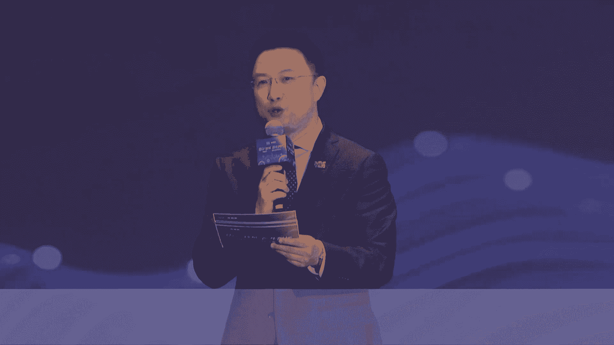

# P64：20240706-语料筑基，智生时代论坛主题论坛 - WarrenHua - BV1iT421k7Bv

🎼我们请还在场内站立的各位来宾，抓紧时间入座。我们请还在场内站立的各位嘉宾，请抓紧时间入座。我们的主题论坛即将开始，谢谢各位。🎼Good morning， ladies and gentlemen。

 Welcome to the conference。 Please take your seat as soon as possible and turn your mobile phone to silent mode。

 Thank you。😊，🎼请此刻还在场内站立的各位来宾。🎼尽快入座，请此刻还在场内站立的各位嘉宾尽快入座。我们的活动即将开始，谢谢各位。🎼Ladies and gentlemen。

 please take your seat as soon as possible。🎼And turn your mobile phone on silent mode。

 Thank you for cooperation。🎼各位来宾，让我们用热烈的掌声，欢迎各位领导和嘉宾入场，也欢迎来自全国各地的大模型语料生态企业代表齐聚上海，共同拥抱大模型的大航海时代。

语料助机至生时代主题论坛即将精彩启目。😊，嗯。Welcome to the 2024 World Artificial Intelligence Conference。树生万物。起时代。🎼质引未来。

星篇。🎼人工智能的浪潮激荡在浦江两岸。scaling low席卷全球。🎼更强的算法，更快的算力，正加快重塑数据飞轮。🎼真实性、鲜活度、大样本、多样性、知识量。🎼数据创造数据、知识创造知识。

一场语料数据的革命正扑面而来。🎼创新基于世界知识体系的语料构建方法。🎼打造语料魔方，构建与多维度价值对齐的语料体系。🎼重新定义高质量语料标准。🎼激发需求活力，增强供给能给。🎼全力打造与料调配的枢纽平台。

🎼前沿语料的创新平台。🎼生态服务的链接平台。🎼我们将秉持新发展格局。全面拥抱一个人工智能的大航海时代。🎼努力开创一个语料数据的imagenet时刻。🎼语料助机至商时代。🎼好，尊敬的各位领导。

各位来宾、女士们、先生们，大家上午好。欢迎各位莅临2024世界人工智能大会语料助机至生时代语料主题论坛的现场。我是上海广播电视台第一财经主持人黄伟，非常荣幸，和大家一起共同相聚在这个非常重要的论坛现场。

😊，今天的论坛是由世界人工智能大会组委会指导，世界人工智能大会组委会办公室主办大模型语料数据联盟上海库帕斯科技有限公司、上海市数商协会、上海市人工智能行业协会、上海资管协会承办。

中国联通上海公司、上海报业集团、中国信通院上海工创中心EO网络、上海市国资委支联会民建上海科创工委协办。同时在这里我们也感谢各位生态合作伙伴和支持单位的鼎力相助。好，接下来的时间呢。

请允许为大家介绍莅领我们今天论坛现场的各位领导和来宾。首先让我们用热烈的掌声欢迎上海市人民政府副秘书长庄木地先生，欢迎您庄秘书长。😊，欢迎中国科学院院士鄂为南，欢迎鄂院士。😊。

🎼欢迎人民网党委书记、董事长叶珍真，欢迎叶董事长。😊，🎼欢迎上海市经信委副主任张洪涛，欢迎张主任。😊，🎼欢迎上海市国资委副主任陈东，欢迎陈主任。😊，🎼欢迎上海市委网信办总工程师杨海军，欢迎杨总工。😊。

🎼欢迎上海图书馆馆长陈超，欢迎陈馆长。😊，🎼同时在现场，我们还要继续欢迎上海市工业互联网协会会长张希平，上海资产管理协会党的工作小组组长、秘书长韩康，中国银行上海市分行党委委员、副行长向希。

中国银行、上海市分行党委委员、副行长张新元、上海报业集团副社长丁波、上海市信息投资股份有限公司董事长总裁张琪，上海数据集团副总裁李晓山，上海交易集团副总裁吕卫民，中国联通上海公司副总经理姚建。

中国电信集团有限公司数据发展中心副主任张鑫，人民网上海频道负责人上海分公司总经理金玉纯。出席。我们今天活动的还有是经信委是国资委是发改委是柯伟市数据局相关负责同志以及相关的区政府及高校科研院所。

国内外语料生态企业的代表，再次对各位今天的丽琳表示。😊，热烈的欢迎和衷心的感谢，谢谢大家的支持。感谢。😊，女士们先生们，首先让我们用热烈的掌声有请上海市人民政府副秘书长庄木娣先生为论坛致辞，掌声有请。

😊，尊敬的二维娜院士。尊敬的易珍珍董事长。尊敬的各位来宾、女士们、先生们，大家上午好。很高兴与大家一起相聚在世界人工智能大会，与各位人工智能领域的科学家、企业家。共会语料筑机自身时代的主题论坛。

共化人工智能语疗数据发展。首先，我代表上海市人民政府对参加本次论坛的各位表示热烈的欢迎和衷心的感谢。语料数据是大模型训练的重要燃料。高质量的语料对于大模型在各行各业的运用十分关键。

有助于大模型更好的适配实际应用场景。加快实现人工智能赋能千行百业的愿景。近年来，为满足大模型发展的高质量、大规模、安全可信语料数据资源的需求。在共建共享方面，我们组建了大模型语料数据联盟。

鼓励多元主体共同推动高水平语料数据要素的建设。在基础设施建设方面，我们激活数据要素的潜能，开源一系列高质量的语料资源。在平台建设方面，我们建设市场化的运行的语料平台，打造大模型语料的超级工厂。面向未来。

我们将围绕战略性的语料资源的重点发力。为大模型创新发展创造更好的语料基础的环境。我们将夯实饮料数据居住。发挥大模型语料运行平台核心枢纽作用，汇聚基础性、综合性的语料资源，配置行业性、专业性的语料资源。

发挥人工智能科技企业、科研机构、高效等等方面的创新的能力，推动语料数据全流程关键技术的创新。我们将后置语料应用场景，围绕大模型训练需求，保障多知识、多模态、标准化的高准。高质量的语料数据的供给。

打磨优质语料数据产品，促进在垂类领域能够实现闭环验证的智力成果的有效的转化，赋能大模型行业应用落地。我们将营造语料良好的生态，紧密链接大模型语料供给方、需求方、加工方和技术资源策源方专家智库等主体。

针对饮料领域的好的企业和好的产品，着力制定认定的标准。开展品牌建设，不断扩大朋友圈。女士们先生们，本次论坛的主旨在搭建语料领域思想碰撞与合作交流的平台，衷心期待各位嘉宾接档智慧、共通才智，分享政知灼见。

激活语料资源潜能。共处大模型创新发展。最后，衷心祝愿本次大会取得圆满成功，谢谢大家。谢谢谢谢庄秘书长热情洋溢的致辞，更感谢庄秘书长，为我们语料行业所给予的美好期待，再次感谢您，谢谢。好。

女士们先生们接下来呢进入到我们今天现场的发布环节。各位对照最高标准、最好水平，打造世界一流的语料枢纽，实现更高效率和更高质量的语料供给。前期呢酷帕斯科技。🎼在生态合作伙伴的支持下。

研制完成了语料运营平台1。0，夯实了采洗标测用这五位一体的工具链能力。那么接下来的时间呢，我们将会有请各位嘉宾上台共同来发布语料运营平台一。0。各位让我们掌声有请上海市国资委副主任陈东。

上海市市委网信办总工程师杨海军，上海图书馆馆长陈超，上海报业集团副社长丁波，上海信投董事长总裁张琪，上海数据集团副总裁李小山，中国电信数据发展中心副主任张鑫，商汤科技副总裁钱浅莹。🎼接月星辰副总裁李璟。

西雨极致副总裁刘华，有请各位。🎼好，我们请各位嘉宾上台。🎼请各位呢伸出您的左手或者右手来面向我们现场的各位来宾，我们共同在现场来发布语料运营平台1。0。好，我们和现场的朋友一起来共同倒数。3。2。🎼一。

🎼发布。🎼谢谢谢谢各位嘉宾，语料运营平台1。0正式发布，再次感谢我们请各位向前两步，我们在舞台中央大家一起聚拢，再次合影，为今天这个重要的发布时刻，谢谢。😊，🎼好，我们也请各位领导为我们的1。

0平台点个赞，好不好？来321点赞，谢谢。😊，🎼好，感谢各位领导，各位请入座，谢谢。😊，🎼库帕斯语料运营平台1。0按照采洗标测用五位一体布局。🎼聚焦高效率的菜。🎼打造语料任务分解的ms系统。

🎼支持多元多模采集与存储。🎼聚焦高质量的洗。🎼面向文本、图片、音频、视频，打造智能清洗算子体系。🎼支持自适应排版结构和封装全过程。🎼聚焦更精准的标。

实现全自动的分类分级、内容、运动与美学达标、视频解读标注等。🎼聚焦更科学的测，实现自动化内容合规评测。🎼给于智能抽检的人工辅助质量检测。🎼聚焦更个性的用，实现语料按需定制交付。

🎼平台研制完成智能清洗蒜子超100个，智能标注蒜子超70个。🎼基本建成完善的与料源数据管理。🎼语料数据及生成及管理，及语料GIT生产模式。🎼推动雨料加工，从规则清洗的流水线时代。

迈向模型驱动的羽料超级工厂时代。🎼好，各位领导，各位来宾。接下来呢我们将会进行的是语料库建设导则发布仪式。为了推动语料数据全行业提质增效降本。上海的汇聚大模型语料数据联盟的力量。

研制完成了语料库建设导则，重构了从原始数据到语料成品的方法论。接下来的时间让我们掌声有请中国信通院人工智能研究所、上海市人工智能行业协会人民网上海报业集团、上海联通、咪咕试讯、上海教育软件发展有限公司、上海信投数科、流程制造创新研究院以及商汤科技和库帕斯等参边单位的代表上台。

现场共同发布。好，请各位伸出右手手握推杆。好，我们在现场各位朋友的共同见证下，我们一起来倒数。来。😊，32。一。🎼发布。🎼谢谢再次谢谢各位为我们在现场启动了语料库建设导则，谢谢各位的鼎力支持。好。

我们一起看向前方，再次来合影留念。好，谢谢各位也继续来点个赞，好吧。😊，🎼谢谢各位，我们都是参边单位的代表，为自己加油鼓劲。好，谢谢各位，请入座，感谢。😊，🎼与料库建设导则由库巴斯科技有限公司牵头。

联合上海人工智能创新中心、上海人工智能行业协会皆月星辰、商汤科技、西语极致等单位共同编制。🎼导则对包括文本、图片、音频、视频等多某态语料数据的对象和范畴进行了定义。

🎼确立了以知识体系为导向的语料构建方法，导则规范了语料采集、清洗、标注、测试、交付的全过程，对语料生产系统及语料产品架构进行了定义，完善了价值对齐和数据安全的基本框架。🎼沼则。

已在库帕斯语料运营平台的实践中深入应用，为原始数据到模型可训练的语料成品提供了透明化白核机制。🎼各位来宾。🎼大模型赋能千行百业，需求构建与场景适配的语料体系，则需要规则与实践的并跑。那么今天呢在现场呢。

我们还将来发布的是金融生命健康和教育这三项行业语料技术白皮书。那么接下来呢我们将会逐一有请白皮书的编制单位的代表上台发布。我们首先要有请的是金融语料技术白皮书、编制单位的代表。

有请上海资产管理协会党的工作小组组长、秘书长韩康，中国银行上海市分行党委委员、副行长张新源、国泰君安CIO于峰招商银行总行信息技术部副总经理于吴杰以及ITL顾问临港投控集团副总经理桑维英以及文英互联总裁鲍杰来欢迎各位。

🎼同时，在生命健康语料、技术、白皮书编制单位代表方面，我们要请上的是中国信通院上海工创中心总裁郑中斌和复旦大学智能医学研究院常务副院长刘磊。🎼教育语料、技术白皮书编制单位代表。

有请教育部教育信息化技术标准委员会主任华东师范大学教授博导吴永和，国家开放大学教育部工程中心副主任李静，科大讯飞副总裁谭场和广州世瑞希沃教育研究院院长胡廷玉。好，欢迎各位代表上台共同发布。同样的。

请各位伸出右手放在我们的启动关助上。我们和现场的朋友一起来共同倒数。🎼3。2。一。发库。🎼谢谢谢谢三位我们的三个行业的代表共同发布了行业语料的技术白皮书正式发布，谢谢各位。好，让我们一起看向前方。

留合影留念。😊，🎼好，谢谢各位，请入座，感谢。😊，🎼高质量金融语疗技术白皮书是由上海资产管理协会牵头。

🎼联合ITL国泰君安、中国银行上海分行库帕斯文艺互联协力律师事务所共同编制白皮书聚焦银行、证券、保险、基金等行业实践，重新定义了高质量金融语料数据集的内涵和外延。

形成了基于金融领域知识体系的语料模方方法论。🎼白皮书按照信批数据、行业报告、内部数据、图书期刊等金融多元异构数据，建立了分类分级分层的遴选和语料加工机制，相关成果已经启动应用试点。

对于深化金融领域模型锤类应用，创新语料智能配比方法提供了重要的支撑。教育、人工智能大模型数据治理与共享技术白皮书在教育部教育信标委暨全国信标委教育技术分技术委员会指导下，由华东师范大学牵头。

联合上海交通大学北京邮电大学国家开放大学以及百度华为等头部企业共同编制。🎼白皮书对标国内外教育数据的系列政策标准，确立了教育行业语料数据的标准用力与价值体系。

形成了一套教育AI大模型数据治理与共享技术标准。🎼白皮书从社会、学校、企业三个维度，梳理了教育语料数据的典型案例和创新应用，助力教育领域模型，更有效的预训练和精准测评。

🎼高质量生命健康语料技术白皮书由中国信通院上海工创中心牵头，联合复旦大学智能医学研究院库帕斯科技、生命健康数据空间、联合实验室等单位共同编制。🎼白皮书对标全球生命健康人工智能引进新趋势。

重新定义了高质量生命健康语料库建设的新标准、新路径。🎼白皮书从基础医学、药物研发、临床医学、健康管理、中医中药五个方向，确立了生命健康医疗库的路线图。🎼创新了从寻员清洗到标注测试的工具体系。

🎼相关成果已经付诸建设实践，语道建设的体系化程度更高，缺陷率更低，知识量和多样性远高于行业平均水平。🎼各位领导，各位来宾，为了进一步激发市场主体语料创新活力，增强供给侧的能级。那么按照统一规范重点布局。

前期呢库帕斯联合各位生态合作伙伴，打造了一批语料数据产品。那么接下来呢我们将会在现场有请我们的企业代表登台，共同来点亮语料魔方，这是一个非常有意思的点亮环节。

接下来我们要分别请上的是咪咕视频的总经理何松。🎼有请。🎼有请宝信软件中国宝武工程科学家大数据中心主任钱卫东，中国信通院上海工创中心总裁郑忠斌、复旦大学智能医学研究院常务副院长刘磊。

惠纳科技董事长张百军、万达信息高级副总裁李光亚。🎼DGC数传集团总裁施其明。🎼文远之行总裁霍达。🎼文英互联总裁鲍洁，上海电科智能副总裁赵怀博和海天瑞声助理副总裁崔项宇。

谢谢谢谢各位为我们在现场共同点亮语料魔方，再一次感谢各位的共同努力，来请各位为自己也为我们的行业点赞，谢谢。😊，🎼谢谢我们特别感谢我们的生态合作伙伴，期待我们未来能够携手共同向前。好，谢谢各位请入座。

感谢。😊，🎼文体音视频数据集万小时高质量视听语料库赋能智能科技全场景。🎼树脂钢铁语料库，中国钢铁行业首个大模型语料库。🎼高质量生命健康语料数据集一款专为医疗健康领域研究大模型开发的数据集合产品。

🎼线下实体商业语料数据集中国实体商业行业统一开放标准的大模型语料库。🎼智慧医疗语料数据集提供医疗健康大模型应用高效训练，供给运营一站式服务。🎼图书出版语料数据集。🎼赋能出版图书大模型高效训练和应用。

🎼自动驾驶行业语料数据集全球首个覆盖一带一路国家场景，为高级自动驾驶而生。🎼金融合规与风险管理语料数据集AGI落地金融领域的数据基石。

🎼城市交通语料数据集覆盖城市交通全域语料库、赋能智能交通全场景、一带一路、百国多语种语料数据集，覆盖67个一带一路语种和方言超4万小时。各位领导，各位来宾，记得在去年的世界人工智能大会的现场。

我们发起成立了大模型语料数据联盟，来着力打造语料生态的朋友圈。一年时间过去了，联盟的实体化运行走上了正轨。朋友圈呢也在不断的壮大，开放链接的生态格局蔚然成市。那为了更好的凝聚行业的共识和合力。

今天的大会还将发起语料生态服务大模型可持续发展的倡议。各位，接下来让我们用热烈的掌声，有请倡意代表库帕斯董事长山栋明先生上台宣读倡议的内容，掌声有请。😊。

🎼高质量、大规模、安全可信的语料是AI时代的不竭动力。今天我们携手大模型语料生态合作伙伴共同倡议。🎼注重流程重塑，构建语料创用新范式。🎼注重标准引领，丰富高质量语料供给。🎼注重价值对齐。

引导AI赋能真实世界。🎼注重平台创新、繁荣饮料产业生态圈。我是创意人单东明。🎼谢谢谢谢山东明董事长。😊，🎼我是徐强，我是林宇春，我是蒋大琪，我是毕业莹，我是徐红艳，我是李建威，我是胡胖，是。

我是小是毕静，我是我是吴文玉，我是田委，蒋大奇，我是，我是郭永，我是王嘉我是校员好，我是我是孙语聊助基，至深代大。好，谢谢。掌声再次感谢各位的共同倡议，谢谢。😊，各位发现好产品选出好企业。

那么从今年开始呢，大模型语料数据联盟以库帕斯正式发起设立语料风云榜，要为我们整个行业呢来领选标杆示范。那么经过了两个多月的项目征集和评选，从众多优秀的项目当中遴选出国际国内各10家上榜企业。

2024语料风云榜中国上榜企业名单即将揭晓。各位请看大屏幕。

🎼2024语料风云榜中国top1。🎼恒生聚源获奖理由，数据洞察，提升数据决策力。恒生聚源已服务超过800家金融机构，作为中国头部金融数据服务与解决方案提供商，是智能数据服务的领跑者。🎼本源智述获奖理由。

智慧加速点亮创新火花。本源智术致力于为AI行业提供高质量数据赋能，其泛数据交付服务体系在业内集具服务特色，创新，引领语料变革。🎼云测数据获奖理由，智能核心引领技术新潮流。

云测数据作为国内高质量场景化的AI数据服务商，与多个地方政府研究所高效深度合作，持续为AI落地场景提供高价值语料服务。🎼密度科技获奖理由，智能连接AI赋能产业升级。密度科技通过语言智能和垂直大模型。

赋能千行百业数字化转型升级。🎼服务下游客户超4万家，发挥高质量语料乘数价值。🎼新环信息科技获奖理由，AI赋能点燃产业新动力。新环科技打造企业级大数据与人工智能基础软件，拥有国内外发明专利超520个。

致力于构建明日数据世界，打造语料新纪元。🎼数据堂。🎼获奖理由，数字化转型AI加速产业飞跃。数据堂致力于为AI及大数据领域公司提供高质量的服务，为产业升级提供坚实基础。

🎼其数据质量经过全球上千家AI头部企业验证。🎼整数智能获奖理由，标准引领，共塑行业未来。整数智能其源自浙江大学计算机创新技术研究院，致力于成为AI行业的数据合伙人，参与多项重要标准和白皮书的撰写。

🎼标备科技。🎼获奖理由，数据世界智能未来触手可及。标贝科技基于自研的一站式AI数据平台，深耕语音、文本图像、3D点云、4DBEV等全类型数据服务，提供多维度的AI数据解决方案，多领域场景应用。

落地开花结果。🎼海天瑞声。🎼获奖理由，创新驱动决策智能化。海天瑞声专注于为客户提供全场景AI数据解决方案。🎼服务全球超1000家知名企业。🎼作为唯一AI数据A股上市企业，助力语料高质量发展责无旁贷。

🎼天宇术科。🎼获奖理由算力全开，开创智能新篇章。天娱数科作为致力于为企业数字化转型和智能化升级、全面赋能的数字科技公司，以累机服务品牌客户已超过1200家，中小商家超过1万家。🎼好。

让我们掌声祝贺获得top ten的这10家企业。祝贺你们我们要有请这获奖的10家企业的代表上台领奖来。🎼来让我们用热烈掌声欢迎他们。😊，🎼欢迎各位，这是我们。😊，🎼首届2024雨调风云榜。

🎼国内企业top10的获奖企业。接下来的时间让我们有请上海市经信委副主任张洪涛和上海市工业互联网协会会长张希平上台为上榜企业颁发奖杯。🎼虽然呢我们的这个奖项的评选呢是第一届。

但是呢前面我们也特别提到了奖项的这个评选的范围非常的大，而且呢竞争相当的激烈。那今天呢在台上的这10家企业能够代表中国企业从中脱颖而出，实属不易。🎼好，让我们用掌声再次祝贺他们。来。

我们也请我们的两位颁奖嘉宾加入他们的行列，我们一起来合影留念。😊，🎼好，再次祝贺各家企业，也谢谢张主任和张会长，有请谢谢各位，请入座，感谢。😊，🎼再次祝贺各家企业。

我们也特别期待在未来每一年的这个榜单上，我们能够既看到老友也看到更多的这个新朋。那期待更多的这个企业能够登上榜单，成为大家瞩目的焦点。再次谢谢。好，那么接下来呢进入到我们今天论坛的第三个环节主旨演讲。

如何将大模型方法和高性能的通用AI数据库方法相结合，从而来建立的是高效率、高准确率、低门槛、低成本的人工智能系统呢。今天我们非常荣幸的邀请到了中国科学院的鄂维男院士。让我们请鄂院士为我们带来全新的洞剑。

掌声有请鄂院士。😊，OK嗯，刚才坐在下面啊。嗯，看到这些发复环节，实际上还是感到呃感。感触良多吧，我们十多年前在推动大数据的时候。开始推动大数据的时候，那时候压根就没有数据。我09年就找到过。

拜见了当时上海市市政府的副市长陈晓明，现在是湖南省的书记跟他谈。怎么样推动大数据，那时候根本就没有起点可以谈，因为的确是没有。啊，没有没有数据这个最起码的资源。那么这十几年来看看的这个发展还是非常大。

嗯，当然现在人工智能了这个来了，这个要求又提的更加高了。那这一次世界人工智能大会可能一个非常重要的主题就是说我们如何。探索探索出一条适合我们国家人工智能发展的路径。3号下午。呃。

公证市长主持了专家咨询会议。后来特别提到，就是我们要注意不能走入一个追赶陷阱。啊，这个事情实际上值得我们大家认真思考。但是什么才是适合我们国家发展的？人工智能发展路径啊，这个事情恐怕不是。

一天两件或者这一个报告可以讲清楚的。那么正好今天是关于语料的这样的一个论坛。所以呢我就想从数据库的角度来讲一讲大模型和大数据库这两个轮子双轮驱动的AI方法。OK我们做机器学习。

我我们还是回到最基本的基本的底层逻辑。那么我们做机器学习，那么现在我们人工智能都是机器学习的方法，深度学习。😊，没有三三个最基础的基础设施，一个就是模型。神经网络十几年前12年开始的时候。

深度学习火起来的时候，那个时候要训一个积极学习，深度学习的模型是非常困难的，门槛非常高。那么现在有了像pa to tenorflowminineport对吧paal这些工具以后。

那这件事情就变得变得相对简单。你无论设计什么模型，应该通过这些工具，很容易就把这些模型搭起来啊，这个已经不难了。第二个就是算例，这个大家都已经有深刻的了解，我就不多说了。那第三个是数据。

那么这里面数据是一个一个核心的问题。因为我们碰到的数据啊都是所谓的非结构化数据。什么叫非结构化数据？就是像文本啦、图片啦、语音啦、视频啦，这些它不它不像一个表格数据。如果我们的所有数据都放那个表格里头。

那么我们做数据分析，相对来说门槛就比较低，成本就比较低。但是这些数据。所谓的非结构化数据，它不是一个表格数据。设想如果我们可以把这些数据都放在个表格里头，我们所有的数据。

比方说娱乐公司的所有数据都在一张大表里头。那么我们这个在做人工智能，在做机器学习，门槛就会大幅度降低。那么我们看看数据。或者数据库的技术。从几十年前大家都知道oracle对吧？

关这个典型的关联型数据库现在已经用的非常多了。那后面又进入了所谓的半结构化数据时代。那么比较有代表性的产品，像芒果dbb这些。那现在我们谈的是所谓的全量数据。

就是我们把所有的数据结构化的非结构化的各种各样的文本的持续的。我们都要把它用起来。那么这样我们就需要一个更加高质量高水平的工具。那么这个是也是我们其实啊好多年前就开始布局了。

18年应该是我记得18年就开始非常认真的布局，就是要做一个满足我刚才说的这个需求的数据库。那么这也是国际上第一个AI数据库，也是目前综合性能最好功能最强的AI数据库，它是基于。还要做关。

如果做这个数据库的都知道一个C库，对吧？这是数据库的一个基本出发点基本工具。那么它是在C库的基础上做拓展。可以在同一个系统中系统当中支持结构化的文本的向量的持续的图，各种各样的异构数据的存储和查询。

那么前两天得了这个人工智能大会的呃这个这个奖两年前还得了北京的这个创业竞赛的最高奖。那么相比较，比方说大家可能听说过控，因为现在跟呃跟op深度合作。那控他的这个。查询向量查询的能力还是比较强的。

但是他数据管理的能力也比较弱，就难以把刚才我说的，把不同的这些数据都能够放在一起做管理。那么my scale它有同时于于具有这两方面的优点，一个就是查询性能比较好。第二个就是数据管理能力也比较强。

那么一个成功的案例就是。指纹那么我们国家有两公安部建了两个指纹中心，一个在北京，一个在上海。这两个指纹中间都管理了几十亿的指纹。那么现在我们有一个指纹送到这个库里头，一拍个照片，送到这个库里面。

马上比对秒钟就秒级就会出查出结果来。那么这样的技术可能在中国是独此一家。大家想想，我们在人脸识别这些领域里面是没有这个技术的。当然不是说不能做，这个是可以做的。只不过是说作为数据库的一个应用。

那这是个非常典型的用非常简单啊，非常ele。我不知道ele中文应该怎么翻译，非常ele的办法把指纹这件事情就整个的解决了。当年公安部在在规划这个项目的时候，第一期就准备立项大概近10个亿来做这件事情。

那么用这样的技术几百万就解决了，而且不需要再做第二次第二期第三期那，主要做相应的维护和这个升级就可以了。那么在这个数据库的基础上，就产生了一个新的。通入人工智能的这个技术路线啊。

我把它叫做穷人版的技术路线。因它是什么意思呢？我有了个AI数据库，对吧？那么在这个基础上，我就可以再做一个低成本的流水线的生产模型的这样的平台。啊，一个一个本科生可能一两个小时就可以构建一个小模型。

在这个基础上来解决某个测殊任务。比方说现场有哪些嘉宾没有认真听讲，再看手机的，那么马上就给识别出来，对吧？然后在那么有许许多多这样的模型库，就形成一个大的大的模型库，可能有几百万的模型。

那么我针对不同的任务，我只要再搞一个操作系统来把这个模型和任务做适配，来进把模型再进行啊监督管理上线还是下线。那么这样的这个模这个小模型技术路线，对吧？刚才已经说了。

就是底层是通用数据库、模拟生产平台等等等等。其实我们在这个这个在有些技术场景就已经实现了啊，这个是。它的好处，比方说这个在这个模型生产平台，如果有数据库和没有数据库，这个模型生产平台是不一样的。

就模型生产平台啊是每1个AI公司有很基本的一个工具。他们都要做这样的工具。但是有这样的AI数据库和没有这样的AI数据库做这样的模型生产平台，它的成本和它的公那个那个效率都是很不一样的。

比方说你假如做自动驾驶，它有很多很多的所谓叫coronner case，你比方说红灯对吧？右转行人道这个有摩托车等等等，有很多很多这样的 cornerron case。

你要做一个小模型来处理这样的 cornerron case。那么你首先要提取适合于这个 case的一些数据。那么你如果不没有不能高质量的把这些数据提取出来，你加了很多没有用的数据在里头。

它不仅仅是增加了成本，而且它也降低了效率。😡，降低了performance。那么这样的AI数据库就很可以很方便的把你关心的这个场景的这个这个有用的数据能够提取出来啊。

这个对小样本训练是非常重要的一件事情。啊，其实刚才我已提了这个模型管理平台，对吧？就是刚才说的这个操作系统，那么他可以对模型做全生命周期的管理。首先它适配哪个任务，其次，他是不是可以上线。

上线了以后对他进行监管，他的是不是满意，是不是是是不是应该下线。那么如果他不满意的话，我们应该怎么做改进啊等等等等。那么这一件事情。啊，我们在这个天津啊，一个叫生态城中心生态城。

这是个很很小的一个一个一个机构，他只有十几万人啊，这个生态城它级别比较高。那么他的这个智慧层市管理我们就就已经实现了。就是我们把他的所有的视频数据或者结构化数据都放在一个数据库里头。

然后整个把它的任务都列出来。那么就实现刚才说的这个任务和模型的搭建一个模型库，然后任任务和模型的搭配。那比方说啊。这是个城市的搜索引擎，对吧？那么对这样的一个场景下。

我们就可以把这些任务啊用这个城市搜索引擎这个事情来实现。OK那么这样的一件事情。他的。好处就是说它的成本相对来说比较低。我刚才说了，穷人版的这个这个技术路线。它的坏处是说这个模型操作系统是基于规则的。

那么既然是基于规则的，所有基于规则的人工智能方法都有一个共同的规律，就是它能够处理简单场景，简单场景做起来相对来说比较快，也比较容易啊，但是呢复杂场景设想，比方说刚才我们谈的不是天津的这个生态城。

而是整个上海。那么我们要做同样的事情。😡，这个。就变得不仅仅是成本，呃不仅仅是呃难度比较大，甚至于他很可能是难以实现。因为这么大的一个场景下面，他的很多任务我们没办法把他的任务都列出来。

那么有很多任务你是预期不到的那这些任务怎么处理？啊，这个就是这样的技术路线难以解决的问题啊，这我们一早也就看到了这个问题啊，只不过是说当时布局是把这个问题往推到后面。那么现在大模型来了。

大目前的以后带来了几非常大的改变。首先，大的这个预训练模型，它对我们基础AI的能力带来了很大的提升。他能够处理非常复杂的任务。比方说一个复杂的任务，他能够拿过来把它分解成简单的任务。

那么这些简单的任务很有可能就可以用我刚才说的办法来解决。但是呢大摩前不能一竿子冲到底，他真的要完成任务的时候，比方说可能需要智能体agent来实现具体的操作，对吧？那么我刚才说的这个框架。

我前面说的这个框架，我们只要。😡，我们只要做一些少小的改动，是吧，比方说把这个小模型改成agent，把这个模型生产平台改成与这个预训练模型作为基座。这样的一个模型生产平台。

把模型操作系统基于规则的模型操作系统改成一个基于大模型的。模型操作系统，也就是对任务复杂任务做分解等等等等。来来这个对这个这个这个A镜制做调度等等等等。那么就可以。就可以是一个新的方案，对吧？

这就是所谓的大模型和大数据库双人驱动的方案。底层仍然是数据库，仍然是需要把我们有的所有的数据资源都放在一个数据库里头啊，因为这是一个这是一个降低成本，增加效率的很基本的一个一个一个方法。

那么在这个基础上，那么我们这个模型生产平台。变成了就是说通过大模型的办法啊，通过这个专用知识库的办法啊，刚才我们也提到，就是说语料库不仅仅是把所有的语料收集在一起，在这个基础上，你要给他做新深做深加工。

比方说产生高质量的数据，比方说做成各个行业，各个领域的专专用的知识库。那么有了这些，我们就可以低成本的来生产。低成本大批量的来生产所谓的智能体或者是小模型。那么就像我刚才说的。

我们再用一个基于大模型的操作系统，对复杂场景的任务做分解，做对这些智能体做调度。那么这就是一个新的技术路线。那么我讲一个简单的例子啊，这就是我们前天发布的啊，所谓的叫science navigate。

 sciencecience navigate的意思是什么意思呢？就说我对这是这是此首先这是针对科学研究的。那么我就把所有的科研的文献，我都把它放在一这数据库里头。

人类历史上现在可以用的大概有两三亿个科研文献，还有两三亿的这个专利的文专利的这个文献。我就把这些全部放在数据库里头，放在一个数据库里头。啊，这就是刚才我提到的这个my scale这样的数据库。

因为这种数据库它提供了这种能力。提供的能力。在这个基础上，我在有一个专用的这个科学文献查询科学文献分解。就是说因为科学文件里面它其实还有难度很大，它有它有方程，对吧？有有这个图表，有分子式。

有各种各样的复杂的图。那么这些我们需要大模型来做解析啊，来识别它们。那么在在这个基础上。我们有啊我们就可以来构建各种各样的基于科呃这个针对科学研究的这个agent。

OK那么这就是前面前天发布的一个sci这样的一个工具。那么这样的工具，它就可以服务整个科研行业，不光不光是啊不是不是不是某一个啊，而是整个科研行业化学材料对吧生物等等等等等都可以。那么这个第一版本啊。

这是前天发布的。如果没有这样的数据库，那么我们就很难设想做这样的事情啊，它的成本就会具就会非常高。那么有了这样的数据库，我们就可以很低成本的来。来来实现这件事情。这个成本不光是不光是这个嗯这个嗯。经费。

而且是人力成本。OK啊，第二个就是现在我们都谈dcent对吧？我的第一页大家我的第一页这个这个PPT里面就已经提到对模型层面我们已经很多工具了。

pytorch啊tenorflow还有minineport pal这些工具。这些工具使得我们处理模型和神经网络的成本大大降低。但是我们处理数据现在还没有这样的工具。

现在训练大模型很大程度上人力资源都是投在清洗数据，整理数据，决定用什么样的数据做训练。OK那么这个成本仍然是非常高的。😡，那么这里头也没有相应的像天赐福这样的树这样的这样的工具。那么基于。啊，这个sk。

大家可能听说过spark是一个非常好的一个工具。它处理他他主要解决的是分布式。分布式计算这样的一个一个一个一个一个一个任务。但是。我们现在要修立大模型，要处理刚才说的那些任务的话，spark就不够了。

我们要对数据进啊要提供数据清洗的平台，是吧？要对提供数据评估。啊，画像等等的提取高质量的提取的平台。那么这个就需要像我刚才说的这个数据库的驱动。OK那么我们现也正在这个正在打造这样的一打造这样的工具。

OK。嗯，第三个就是说我们现在大模型啊是一锤子买卖，对吧？我们把各种各样的推理，各种各样的知识都放在这个大模型里头。那么这个对这个模型的规模就产生了巨大的压力。那其实我们可以把比方说今天我就举一个例子。

从知识的角度来说啊，我们可以把知识做分层，有些知识是非常非常高频的。比方说我们。😡，这个手不小心碰到锅啊，那马上这个太烫了，马上就拿开。

那这种知识是我们都不需要考虑对吧与生俱来的这种呃这种知识就是我们用的非常高频，我们用来的时候想都不想那这种高频知识，我们可能应该把它放在大模型里头。但是我们从小到大，我们学到的这些知识怎么做数学题议。

怎么做物理这些知识，我们其实平时用的不是那么那么那么那么那么经常。这些知识。😡，和我们。用到的更加低频的，比方要上网查对吧？要要到图书馆去查这种更加低频的知识。

那显然不应该直接把它放到呃这个大模型里头去。那么低频知识可以用所谓的ra外挂数据库来处理啊，这个现在大家都已经这是已经已经是个很很平常的一个一个一个方法了。那高频知识怎么办啊。

这也是我们前两天发布的一个所谓的E地方模型。他的意思是什么呢？他就是在刚才这个字这个基础上，就是把知识作为分层处理。根据他这个根据知识利用的频率啊，我们做分层处理。总的目的就是说我读取知识和写知识。😡。

这个他的这个工啊他的这个这个成本都要最小化，最小化读和写的成本。那现在比方说你要把所有的知识都放在模型里面，那么你写这个知识，也就训练写就是训练了，你训练这个的成本就非常非常的高。

那么你读的时候倒是成本比较低，因为你把模型过一下就行了。相反，外挂数据库的办法，你读的你写的时候成本非常低。但是你读的时候，你要去查数据库，你要等等等，那个就那个成本就比较高。

那么现在我们希望通过一种办法把读和写的成本都降到最低。😡，对刚才这些三种不同的知识。那么这里面。伊立方的实行方案，就是说我们采取了三个一什么意义，就是记忆，对吧？记忆，这里面把记忆分成三部分。

一个是隐性记忆。就是刚才说的，想都不用想这种碰到烫的地方手规拿开这种想的不，这隐性记忆。还有一个呢就是工作记忆。就我现在在做某个运算啊，这个我在做某个推理，我要做一些脑子里面打一些草稿，这些工作记忆。

还有就是显性记忆，就是我已经学学好了知识，我存在脑子里某个地方，我们把这种三种记忆分开，分开处理，比方说显性记忆，我就用刚才说的这个数据库的办法，对吧？

我在大模型里面内置一个数据库来处理这个隐性记忆处理处理这个显性记忆，隐性记忆我还放在大模型里头。那么工作记忆呢，我就是在这两者之间啊做转换。那么这样的一个办法，它可以大幅度的降低模型规模的压力。

对我们可以把模型规模降下来10倍。对吧？但是呢从另一方面，它又是对这个大模型的底层的架构做了一个非常深的改造。因为它在大模型里面内置了一个数据库，所以你在训练的时候，你必须模型和数据库一起训练。

所以它是从头开始要改造这件这个整个大模型的训练框架。那么我们在这个。在这个这个呃上海市临港片区管委会，还有这个经建委的支持下，我们把这些。把这样的一个技术路线实现了，这是我知道的。

可以是可以是我知虽然这个事情啊没有特别多的宣传，但是他是我知道一个第一个就是对这个大模型的技术路线做了比较大的改变，比较深层次的改变的一件事情。OKOK那么这样的个亿立方模型它的效果就是说它可以第一。

它可以把模型的规模大幅度降下来啊，这个成本啊，这个这个效果performance仍然是仍然是啊。😡，仍然是不改变。第二呢，就是因为我这个这个显性记忆，它实际上是跟知识联系在一起的。

那么我其实我我可以把它看到是个知识库。那么我在不同的行业之间做转换的时候，我这个成本就会就会大幅度降低。😡，而且我就不多讲了啊。那么最终我们希望实现的是所谓的所谓的这个大模型和和大数据库啊。

双人驱动的这个AI发展。那么这就是说他的这个。大概的思路就是说所有的语料数据，对吧？一方面我们要刚才把它装到AI数据库里头。我刚才说了，我们可以设想把所有的数据都装在一个数据库里头，统一管理，统一处理。

那么在在下在在在这个基础上，我们在做大模型训练。那么这个是会大大降低成本，大大提高质量。那么在这个基础上，我们在做所谓的A和数据库的平台。那么这是一个，那么在在这个对各个行业的应用。

这就这些成本就会大幅度降低。那么我今天讲的。只是一个方面，就怎么样把数据和数据库用好。其实。这不是唯一的一个可以改进的地方。模型本身怎么去改造模型，对吧？我刚才举了一个例子。

就是说就是说所谓的记忆记翼分成，对吧？这个一地方这个模型，这只是一个例子。还有很多可以挖掘的空间。我们可以把这些空间充分利用起来，能够把这个大模型的成本和这个尤其是能耗大幅度降下来。😡。

那么在这个基础上，我们。在走我们自己的通用人工智能这样的一个技术框架啊，我认为这个这个这个框架是我们必须探索的一条路径啊。前两天这个。前两天我在这个我们这个科学院的院士大会上。啊，做了一个报告。

叫数学与人工智能。那么这个其实做这个报告的目主要的目的不是给大家谈数学，而是说我们现在要走探索我们国家适合我们国家发展的人工智能路线路线。那么我们必须做两件事情。第一件事情。

就是说我们必须回到人工智能的底层逻辑来探索它的基本原理。那么过去我们认为这个是非常困难的一件事情。但是我认为现在基本上条件已经成熟了。那么我希望上海能够尽快的布局来做这件事情。

第二件事情就是说我们仅仅搞大模型，堆大模型是堆不过人家的。我们必须从整个系统的角度来考虑。所谓系统的角度，就是说从算力，从数据，尤其是数据库啊，我们在数据库方面目前是有优势的。然后才是模型高性能计算。

对吧？我们现在的高性能计算方面还有很大的空间没有挖掘，那么所有这些在一起做系统优化，就像当年过造火箭一样，我们每样都搞不过别人，但是我们希望我们整个系统不比别人差，那么同样的思路，同样的技术路线。

我们也必须把它用到。人工智能这个领域。所以这是我的第二个建议，也希望上海在布局布局人工智能的时候，能够从系统的角度来布局。不是说光是对大模型这个系统他也这个要布局这个系统。

从系统的角度布局这个这个事情啊他。他其实有很大的复杂复杂性啊，这个我可能就不多讲了。那不管怎么样吧，这是这是我的一个呃一个非常大的期望。因为总的来说，我们现在其实并不清楚。我们下一步该怎么走啊。

其实我们现在并不清楚，而且这里面的不确定性非常之大，这个不确定性对我们造成的风险是很巨大的。所以我们希望我们能够尽早的尽快的做比较深层次的布局。OK好，谢谢大家。好，谢谢。😊，掌声感谢鄂院士。😊。

在今天这个舞台上呢，给予上海发展大模型更多的这个建议。同时呢也站在了一个更高的视角上，给大家带来了他的这个分享内容。再次感谢鄂院士与价值对齐，这是大模型可持续演进的一个重要的基石。

那如何让大模型像人一样有德有趣、有序、有品和有用的。那么接下来的时间我们要请出的分享嘉宾是人民网党委书记、董事长叶真真先生演讲的主题是基于价值对齐的模型发展与语料数据的创新供给，掌声有请。😊。

🎼尊敬的鄂维南院士张英主任好，各位专家，各位同行。呃，刚才我也跟大家一样啊，非常认真的学习了鄂院士的报告。跟他相反啊，他是科学家，我是个文科生。那么我后面给大家汇报内容。

更多的是从一个具体的语料实践的机构啊，就是人民网和传播内容认知全国重点实验室的一些语料方向的具体实践和探索。特别是我们成为库巴斯公司的参股方之后啊，在山东名董事长的这个指导下啊，我们共同开展的。

对于多维度价值对齐的语料库建设的一些具体的进展啊，给大家做一个汇报。也希望后续能够跟各位有更多的合作。那么我的汇报会分两个部分。第一部分主要讲人民网作为中央党媒党网的。语料库建设方向的一些实践。

以及把这样的一些主流价值语料用于大模型在一些具体场景应用的情况。第二个部分就是最新的一些研究进展，就是多维度的价值对齐的语料库建设情况。那么首先简单说一下人民网，我们是1997年1月1号上线的。

所以是诞生于PC互联网的时代。那么经历了移动互联网。现在我们也到跟大家一样走到了智能互联网的阶段。2006年的7月1号，经中共中央批准，人民网同时建设了中国共产党新闻网。那么到目前为止。

这是互联网上唯一一个以中国共产党来命名的网站，所以也是啊代表着我们党我们党中央在网上发声的一个平台。2019年1月25号，习近平总书记率中央政治局在人民日报人民网进行了政治局的集体学习。

总书记在主持集体学习会的时候，强调要探索将人工智能运用在新闻行业，全面提高舆论引导能力。那么也正是在这个时候开始人民网启动了我们的人工智能战略。2019年的11月。

我们建设开始建设传播内容认知国家重点实验室。2022年5月，我们这个实验室成为全国500多家国家重点实验室进行改组啊，首批改组的20家全国重点实验室。那么我们的主要研究方向是主流价值观的精准传播。

多模态的内容智能审核以及网络空间的态势感知。目标是把有人类所掌握的政治方向、舆论导向、价值取向转化为可计算、可运用的AI体系。到目前为止，我们实验室已经有啊在屏幕上的这些技术产品AI的技术产品投入使用。

白泽地听主要用来监测大家平时比较关注的各种热点和舆情背后是否有幕后操纵者，以及操纵对手是什么样的组织架构和网络结构。还有就是发现舆情热点背后的机器人水军啊，这是白泽和地听的作用。

智晓柱是我们的一个摄政内容的智能审核的sars平台。协议是我们打造的面向党政机关的智能创作和智能问答大模型。主流价值语疗库和大模型安全评测后面会有详细介绍。天目是一个识别人工。

创作的内容和机器生成内容的一个系统啊，主要来做识别的，就是深度合成内容的检测识别平台。当然我们还有一些AIagent东西。那么在我们理解当中啊，其实存在着两类不同的互联网企业或者两类不同的科技公司。

有一类是以商业为目标，有资本来驱动的公司，这是大家平时见的比较多的，比较熟悉的。像上海的商汤 minimax节月新城啊，我想都是属于这一类。还有第二类是以具有强烈的公益属性。

有政治责任所驱动的互联网公司像人民网啊学习强国平台等等啊，包括我们上海的澎湃，我想都是属于这一类的互联网公司或者叫科技公司。那么这两类企业它的基因不同，因此，发展的路径是不同的。

对于我们这种公益互联网和政治互联网，我们研发什么样的科技产品。我想总结了这么几句话，第一是国家有需求。而市场失灵资本消极。也就是市场。化的企业和风险投资不愿意投入的，但是国家有重大需求的部分。

才是我们要这个义无反顾的进行研发的啊。无论是技术还是产品。因此呢人民网啊。把我们的人工智能领域的重点放在了啊屏幕上的这些内容啊。第一，以内容业务为核心，去面向党政机关和党媒党网去研发AI应用。

面向主流价值的对其啊去实现人工智能的安全发展。面向大中小学生的心灵教育啊，不是知识教育，不是技能教育，是心灵教育，去研发我们的AI应用，面向健康文化文旅体育这种强监管啊。

政府干预色彩比较浓厚的行业去发展我们的人工智能应用啊。那么这些都是我前面所讲的，具有比较强的公益属性，由这个国家需求而市场容易失灵啊，资本投入比较消极的部分。

那么我们现在的在语料库建设方向上的优势主要有这么几个方向，一是用户优势。我们现在直接覆盖的用户都8。9亿，包括了15种外文和7种少数民族语言。因此我们所打造的语料库，不完全是中文的啊。

也包括了少数民族语种和外文语种。并且今年我们还将增加三种外语的频道啊，也就是我们已经有15种外语频道，今年还要增加到18种外语频道这在国内的新媒体版块，特别是中央新媒体和这个党媒党网的新媒体。

我们的外文语种啊，是绝对数是最多的啊。那么在用户优势上啊，我们还有专门的领导留言板，全国所有的省委书记、省长、市委书记、市长到县委书记、县长以及有36个中央部委的正部长。

都在我们这个平台上有留言办理的窗口，也就是群众和企业遇到极难筹盼的问题，遇到解决不了的难题，政策难题都可以通过我们这个平台跟这些党政的主要负责人进行对话。到目前为止，已经回复办理了460万条的留言。

解决了460万个问题。那么到这个平台的他的对话啊，和交互的数量还在迅速上升。目前的数字是一年大概会发生150万件左右的留言和问题。那么其中有60万件，是各级群众和企业给党委和政府所提出来的政策建议。

那么反过来说，这。些内容，这些对话，这些回复啊，都构成了一种新型的语料体系。那么这个语料体系主要应用就在于智能政务客服的方向啊。基于前面所说的这样的一种优势。2023年的12月，也就是半年前。

我们中标了国务院办公厅国家政务服务平台的智能客服系统的建设项目。同时我们正在推行县域的就县一级的群众工作的分诊台啊，就是用一个平台来总体协调一个县的县委、县政府、县人大、县政协四套班子。

大家来协同办理群众通过12345通过地方的电子政务网站，通过刚才我们的领导留言板进来的各种诉求各种问题。那么来统一受理统一分发统一交办统一评价啊，那么形成一方面是把我们的语料优势。

和模型优势运用在智能客服上智能的政务服务上。另外方面又会。形成新的优质数据的这个我们不敢说是一个数据飞轮啊，但至少它是一种数据与语料与模型的良性的一种循环，互相的争议啊。那么第三呢。

我们面向党政机关的智能创作和智能问答系统已经交付给全国总工会生态环境部、国家地震局，还有若干的央企，以及还有几个省级的党政机关的内网的政务系统，来把模型内嵌私有化部署啊，来辅助政务的文件讲话稿啊。

重要的政务文稿的创作。那么在语料应用方向，还有一个就是大中小学生的心灵教育啊，我们把大中小学生的心理健康问题与中央特别关注的思想政治问题组合到一起啊，创造了一个名词叫心灵教育。那么在教育部的指导下啊。

我们的少年客户端面向全国学生在开展啊心理心灵教育领域的一系列的任务啊，那么几乎每周我们都会有一堂公开的大课，每一堂课同时在线的学生人数都超过1000万人。啊。

每一堂课都会有一超过1000万的学生在线上课。那么通过这样的方式，我们把前面所说的主流价值观的语料开始以及他所训练出来的模型应用在了学生的心灵教育板块。然后又通过每堂课千万人的交互啊。

在继续的去强化和优化。我们充实我们的数据库和我们的。模型。那么另外一个方向，我们在2022年的8月28号，在工信部的指导下，上线了一个专门普惠中小企业。

尤其是专精特新企业的啊一个平台叫828企业服务平台。目前平台已经注册了将近1万家专精特新小巨人企业。那么我们同样也把我们的语料和我们的主流价值模型啊，去这个普及到我们广大的中小企业啊。

这也是我这两天看我们的这个人工智能上海大会的这次的宣言啊，所专门提到的要让人工智能普惠我们广大的中小微企业。语料应用的最后一个方面。

跟今天给大家报告的就是我们的人民好医生客户端上注册了920万的医生和护士，是现在国家卫健委平时对医生和护士进行年度培训的主要平台，上面也汇集了83万篇非常权威和优质的医疗领域的科普和教育的这个内容啊。

那么我们也希望基于此能够进一步的拓展我们在健康科普和健康浅层次的健康管理领域的这个语料库建设和模型应用。那么以上是人民网所开展的一些实践。那么我们也在整个的工作过程中间啊提出来。

希望能够实现用AI来治理AI啊，这次我们上海的世界人工智能大会发表的人工智能全球治理上海宣言提出来啊，我们将以发展的眼光看问题，在人类决策与监监管下，以人工智能技术防范人工智能风险。

提高人工智能治理的技术能力啊。我想在我们这里就称之为用AI治理AI努力来实现这个统筹AI发展与安全啊，那么实现人工智能的安全性、可靠性、可控性与公平性的啊发展。

那么我们所推出的啊人工智能领域的内容风控大脑，目前已经能够啊自动化的对人工智能训练的数据和语料进行智能化的审核清洗。对大模型生成的内容能够进行毫秒级的快速响应的审核啊，对不合规的内容能够实现快速的撤回。

那么从去年3月16号开始，我们启动了对各类大模型的价值观评测啊，这是与管大家平常看到的很多评测不一样啊。我们不去测他的数学题做的好不好，代码写的不好不好啊。

我们主要测的是每一个大模型的政治方向、舆论导向和价值取向问题，并且构建了一套完整的评测系统。那么基于这个评测系统，我们发现我们国产的各类大模型普遍存在的价值观安全问题。所以从去年5月份开始啊。

为了帮助大家解决问题，我们建开始建设在中国语境下的主流价值语料库啊，所谓中国语境就指的是我们中国语境下的政治方向舆论导向和价值取向问题。那么这里我们最有特色的是动员了人民网2000名记者编辑全员参与。

拟定大模型回答不了，回答不好的那些重大问题，敏感问题的答案，全人工啊全人工的来设定问题。给出答案，并且所有的答案还要经过三审三教啊，要经过三审三教才能够入库。那么到目前为止，我们的语料库已经建设了。

就是右边的数据啊，问答语料123055个问题。涉及到各种类型的重大敏感问题。无论是外交、国防、香港国安法、台湾问题、西藏问题、新疆问题等等啊。我们有已经做了12万多个人工的这个可以称之为标准答案啊。

那么此外呢，我们还有一系列的这种基础的语料库，包括了主流价值文章3257万篇字数超过了300亿汉字啊，这些都是可以就是这些基础语料，都是可以这个直接开源给所有的大模型预训练使用的。那么我们的问答语料啊。

已目前已经跟5个国内主流的大模型实现了对接和这个作用的验证啊，包括咱们今天在座的商汤，还有科大讯飞等等。那么在。加入到我们库帕斯的股东行列之后啊，我们在山东明董事长的这个协作下。

我们开始进行人工智能治理与价值对齐的更深层次的研究。那么这个研究我们站在了一个更广的这个平台上，就是面向全人类的共同价值，去研究多维度的价值对齐的语料库啊，显然大家跟跟我前面汇报的啊。

我说在中国语境下的政治方向与价值取向，舆论导向的语料库建设，已经是另外一个全新的范畴了。那么这个多维度价值对齐的语料库，我们是目前考虑啊，它应该是建设坚持以人为本啊，智能向上、造福人类的这样的原则。

鼓励通过国际合作和实际行动，帮助各国来帮助世界各国啊，来加强人工智能能力的建设。那么这个体系我们目前把它分成了啊三个呃不5个主要的维度啊，分成了5个主要的维度。

分别是体现遵循社会道德规范和法治精神的伦理维度啊，体现满足个人和群体情感认同、交流和成长需求的情绪价值维度，体现助力大众文化素养提升和促进文明互鉴共进的文化价值维度。

体现推动社会公平正义和可持续创新发展的社会价值维度，以及体现推动科技创新与可控可致的技术价值维度。那么这样的5个维度，每个维度，我们也给他起了一个相对简洁的说法，比如说伦理价值。

我们希望这个人工智能是有得的情绪价值，它是有趣的。社会价值它是有序的啊，技术价值它是有用的，文化价值它是有品的啊。那么希望通过这5个维度的多维价值的对其语料库的建设。

最终实现啊和平弘扬和平发展、公平正义、民族自由的全人类共同价值啊，这就是我们这个为这个。多维价值对其语料库的啊一个基本的这个框架。那么下面简单的再给大家汇报一下啊，这5个维度的相对具体一点的情况。首先。

在伦理价值方向。我们希望人工智能是有得的。伦理价值是人类社会长期发展的文明积淀是社会科学研究的重点领域，也是公众日常行为生活的规范。那么伦理价值的语料来源及其层次将会非常的丰富。

构建我们要构建涵盖基础理论册历史文化册和现实生活册这三大啊板块的多角度的语料内容，从而全面的反映伦理价值的内涵与外延。在情绪价值维度上，我们希望人工智能是有趣的。

情绪价值服务于技术为人类服务的这个根本宗旨。我们希望人工加智能将来的发展目标是与人类共情共鸣。那么这也是当前人工智能人工智能发展的一个短板。这个纬度的语料库建设将具有很强的普适性啊。

但同时也会存在个性化、场景化和地域化等特定的需求。那么我们希望构建涵盖。这叫三呃三大板块啊，治愈成长语料册互动共鸣册以及治愈探索册的多角度的语料内容，从而全面提升人工智能的情绪价值。那么在社会价值纬度。

我们希望人工智能是有序的。社会价值侧的这个板块的语料将体现人类普遍认同的关于国家民族、社会以及全人类层面的价值理念、处事原则和行为规范，重点从社会和谐、社会发展、全球治理三大板块来进行语料的组织和建设。

从而促使人工智能成为促进全人类和平与发展的推动力量。在技术价值板块，我们希望人工智能是有用的，也就是对人类是有益的。构建对人工智能的安全性、可靠性、可控性和公平性进行测评和风险评估的语料数据库。

那么在文化价值方向，我们希望人工智能是有品的。啊，这里包括了涉及自然、艺术、信、宗教信仰、文化习俗等多个领域啊，也非常这里的涵盖的面会非常的宽啊，非常需要与大家来共同努力。

那么我们这个多维价值对积语疗库建设的目标啊，一期目标是。嗯，建设以基础语料和问答语料两种形式为主，覆盖上面所说的五大价值三大圈程14个类别和38个细分纬度的高质量、高价值的多维价值对齐语料库。

我们想更强调的是它的质量和它的价值的密度啊，而不是简单的这个数量。那么希望的是一期基石语料能够用一年的时间形成500万对以上的这个基础语料。以及250万组啊规模的图文对的语料，10万组优质的问答语料啊。

从而全面支撑人工智能的多维价值对齐和应用落地。那么在过去一年多的语料库的建设过程中间，我们深感到有一个词很关键啊，这是我们称之为叫数据配方啊，大家都很强调大数据，但是大往往讲的是它的量和它的纬度。

但是在我们感受当中，我们的体验当中，数据的配方非常的关键，通过良好的配方，我们能够降低训练的数据量，降低模型的参数量提升能效比啊，从而更好的实现啊这个大模型的经济价值。所以我们一直在。

深入的研究不同行业的垂场景的大模型，它的数据配方的问题。因此，在建设这个多维价值对其语料库的过程当中啊，我们也会非常重关注啊，对于数据配方的相关的这个标准和相关的呃理论的研究。

那么最后啊我们想给大家汇报是我们的一些体会吧。就是一直有一个词叫做去中心化啊，我们也确实发现，从PC互联网到移动互联网，再到今天的智能互联网，存在着从中心向边缘地带。

从中心平台向边缘区域去赋能这样的现象和过程，也存在着平台去赋能广大个体啊，去提升大家的参与能力。比如说啊青藏高原上的牧民，现在可以直接拿起手机去进行啊智能手机去进行直播。

他们可是没有用过有线电话的啊一群人一群人啊，也没有用过过去的大哥大，也没有用过数字手机直接用智能手机就进入了直播带货的时代啊，这是一个非常典型的中心平台向个体赋能的啊一个场景。以互联网的发展。

存在着这样的一种去中心化的表象和过程。但是我们同时也看到，随着从PC互联网到移动互联网，再到今天的智能互联网。其实中心化的平台越来越中心化，甚至数据越来越封闭化。

所以我们看到这个演变的过程是一个再中心化的过程。那么在这个过程当中，我们需要高度关注人工智能。他将来会越来越成为人类的共同大脑啊，在目前他还是人类养育的一个孩子。在这个阶段。

我们需要用优质的语料作为优质的教材啊，希望能用好教材培养出好孩子啊，将来能够智能向上造福人类啊，这是我们共同的目标和追求，希望跟在座的各位我们一起合作，共同努力啊，实现这样的一个目标。谢谢大家，谢谢。

掌声感谢叶晨晨董事长，谢谢您分享了来自于人民网的实践探索和创新的经验。再次感谢。那么在接下来的环节当中呢，将会有两家企业从模型在各自领域的落地应用的角度来进行分享。

首先我们要请上的是上海接悦星辰智能科技有限公司的副总经理李景先生分享的主题是大模型时代的产业落地新路径来掌声有请。😊，🎼尊敬的各位领导，各位来宾，非常荣幸在这里代表借月新辰和大家分享。

我们在过去一年在产业在模型上的一些实践经验。首先呢希望能够给大家介绍一下节月新城。因为节月新城是一家初创的通用模型的这个创业公司。我们其实成立时间不长，我们去年才在上海成立短短的一年时间里面呢。

我们在算力数据算法，还有系统方面都投入了大量的这个资源和人力。那目前呢我们也是在过去的一年期间呢，发布了我们这个叫step系列的通用大模型。也是在咱们WAIC大会期间。

我们正式向外发布了step二万亿参数的混合专家MOE的大模型。街悦新城目前大概有200多位同事，其中90%呢都是技术研发类的同事，是一个已聚集了非常多各方面的顶尖人才。

我们有一个使命叫做智能接月是被每一个人的可能。这就跟我们这个街月星城的logo一样。大家会看到接月本身是深度学习里面这个激活函数啊，也它的形状，其实就是我们这个logo这个形状。

我们也既希望智能能够带来飞速的发展和提升。同时也希望这个飞速发展的提升有节月的贡献。简单介绍一下街月在技术路径上的一些想法。其实说到接月来说。

我们其实经常把通往AGI的路比作登山山的两端就是我们的两条的主线路径。左边呢是我们是非常信仰。我们相信更大参数的模型会带来更好的智能。所以呢我们也是从去年发布了step one千亿参数的语言模型。

到今年也是最近这两天发布了step2万亿参数的MOE的语言模型。同时在山的另外一边，我们也相信多模态是通往AGI的必经之路。所以我们在一直以来也致力于多模态模型的这个研发。

我们在这一次的大会上也带来了step1。5V的多模态的大模型，同时也带来step一X的图像生成模型。我们相信多模融合是必经之路，是通往AGI的非常关键的一站。说到G域的这个战略，可以简单跟大家报告一下。

就是8个字叫做超级模型加超级应用。一方面，我们认识到目前的模型还不足够好，我们需要用更大的资源投入去做更好更大的模型。同时呢应用也是非常非常重要的。我们需要有好的产业应用的牵引。

这样才能指导模型的进一步的发展。杰月新辰自己呢会更到更多的力量会注重在C端的一些探索。尽管现在我们还不是很明确具体的这个实际的这个超级应用的方向。但杰月新成在过去一年里面。

已经开在效率工具拟人和内容消费上做了自己的这个探索。我们一共发布了两款产品，一个是基于开放世界的这个互动游戏冒泡鸭，以及我们的效率工具阅问，目前都可以在各大应用市场，包括网上体验到。

下面展示一些节阅自己的一些模型的一些例子啊。其实说到接阅，其今天也希望大家记住节阅就记住两个关键词。第一个叫万亿，也是我们最近发的这个万亿模型。第二个就是多模态。我们的多模态无论从模型到应用。

都是国内目前的这个领先水平。我们这里列举了一些榜单成绩，包括一些实际的在金融和图片理解的应用。这里大家可以看到，在图片理解的这个例子里面，其实是一个短视频的截图，是一位创作者在拿着猫的尾巴在写字，啊。

很容易会被模型误认为是毛笔。但看到stepV的这个模型里面是能够真正识别出它其实是一个猫的尾巴在写字，同时他理解了这是一个行为艺术。同时在这个大会期间呢。

我们其实也带来了step Estep EV是一个拥有强大的视频理解能力的这样一个模型。可能图片理解大家可能过去也看的比较多了啊，读梗图啊，读表格呀，读各种样各样的例子。

但视频理解的其实能做的还是比较少的。过去我们常常用来做视频理解的方式呢是把视频里面的背景声音或者是字幕文件提取出来转成文字这样来做总结。但是这样的这样的这个方式呢。

其实会失去视频里面的所有的这个视觉信息。那下面呢给大家展示一个我们实时模型生成的这样一个视频理解的例子。🎼我们选取了一个上海市的宣传片，我们希望他成为一个文案专家，去去描绘和给这个宣传片配一个文案。

大家会看到港口工业的感觉，包括之刚刚提到的田野相间的感觉，包括夜幕下的上海，它都都能做很好的识识别和描述，它是真正理解了里面的内容和情绪。所以我们说其实多模态模型带来的这个体验和感受是完全完全不一样的。

以上是我们一个多模态真视频理解的例子。其实回到今天想要跟大家分享的主题，其实是想聊一聊借月在过去一年在产业落地上遇到的经验呃，一些经验和遇到的一些困难。其实很多人既关注接月的模型进展。

同时更关注怎么在实际的高价值的场景里面发挥价值。我们做了一年多的这个模型，在应用里面的这个落地。我们其实也深刻的感受到一个好的基础模型到一个好的行业应用之间是存在很大的这个gap。

里面有非常非常多的困难。比如说算力不足，比如说投入成本过高，比如说缺乏相关相关相应的人才。但这里面最让我们感到棘手和困惑的其实是语料和数据的问题。其实一个好的基础模型，怎它本身具备很好的智商能力。

但如果他要解决行业的问题，或者要把这个行业问题解决好，它还需要有一段很长的路要走。这里面呢我们也是经过了差不多一年的很多个案例的探索，有了一些小小的经验。我们认为大致的行业落地。

从方法论来上大概会分为这几步。首先，当然需要有一个好的基础模型，尤其是一个智商够高，参数量够大的这样一个基础模型。其次呢，我们围绕着行业，我们需要获去很好的高质量的行业的垂类数据。

有一些可能是在训练里面使用，有些可能是在微调里面使用。不管不管在哪个阶段，我们经过这个垂类行业数据的打磨，形成一个很好的行业模型，但其实有了很好的行业模型还不够。就如同今天很多嘉宾提到的。

在实际的行业落地里面，有一个好的行业模型只是个开始。我们需要更加清楚的知造任务目标，也要很好的能够嵌入到这个行业的工作流里面，甚至要很好的利用好行业目前的知识库，也需要行业专家进。

进不断的强化学习的反馈。所以综上，我们才能从一个好的基础模型一步一步的获得一个好的应用。这里面呢给各位分享两个金月新城的例子。正因为考虑到行业落地的困难，所以我们也深知做一个基础模型厂商。

这段路不是我们一个公司能走完的。所以金月新城在to B端的这个合作方式呢，我们都会选择一家核心的合作伙伴来深耕这个行业去做行业应用和产品的探索。以金融举例，我们和上海报业集团旗下的界面财联社成共同出资。

成立了金融大模型公司财悦新城，同时也发布了财月星城F一也是最懂金融的这个垂类模型。在这个基础之上，我们也和行业的很多的标志性的合作伙伴，例如国泰君安这样的合作伙伴。

一起来打造真正能够行业落地的这样一些应用。比如说智能投研投顾投教资讯生产这个这些方面。下面给大家举几个实际的例子啊，这个例子其实就应用于我们这个我们的合作伙伴财联社上面一个很很经典的一个例子。

财联社的和有一个核心的产品叫财联社快讯，相信各位都在朋友圈看见过。财联社的快讯核心的一个字叫快。但是呢其实在过去的生产模式里面，每一次有大量的新闻上市公司的公告等等这样一些信息。

我们往往需要人工通过编辑的方式去完成这样一个快讯的撰写，然后发出去。那有了大模型之后，大模型直接可以不经过其他的大规模的额外训练，就能够来完成这样的任务。同时我们把它嵌入到了深圳的工作流里面。

由人类的编辑专家进行了修改反馈。如此打磨几轮之后，大概也就花了一个月左右的时间。目前大模型已经能够去解决90%多的这样一些内容生产。人类只用来做最后的校验和校准即可。那这样的一个生产方式的流程的再造。

使得整个的生产效率提升了几十倍啊，这是一个非常非非常典型的一个应用案例。那除此之外呢，我们其实昨天街悦新城财悦新城和国泰君安也发布了彼此之间真正落地的这个战略合作。在过去的3到6个月的时间里面。

我们一直在探讨有了好的基础模型，如何能够跟国泰君安的林溪智投的这样一个体系做结合，真正把国泰君安积累的这样一一些语料和数据，用到他们的行业应用里面。所以我们从基础模型到行业模型到agent的平台。

再到知识库等等搭建了一整套体系。那也跟各位报告一下，我们现在已经批量生产了10超过10个的围绕着军均红智投体系的这些agent。那目前也会在合适的时机服务于更多的这个广大的中小投资者。

以上呢是一些偏行业里面的这个语数产业落地的应用。其实还有一部分是内容产业，其实也是这一次AIGC非常大的应用广泛的一些领域。这里呢是我们也是这一次WIC期间，我们主力落地的一个应用。

是我们和上海电影集团合作的围绕着中国经典IP的AI加IP的这个应用。今年呢也是大闹天宫的60周年，我相信在座的很多都看过这样这个大闹天宫这个电影，我们一直在想。

如何让大闹天宫这样一个电影和当代的年轻人发生更多的连接。用一种更新的方式借助AI让更多的人能够参与到这个世界观里面去。

所以我们做了一款基于AI基于大闹天宫的世界观AI无限展开剧情的这样一个这个小的互动游戏体验，叫做测色你是哪路神仙。给各位演示一下。🎼其实这里面还是有非常多的技术难点的。大家知道过去AIGC我们经常讲。

其实里面的中国元素是偏少的，而上影是一个有着自己独特美术风格和审美风格的这样一个一个一个机构。同时大闹天宫也是有着极其强烈的这个美术风格。所以这一次呢我们也是在很有限的语料和数据集上。

做到了更多的可控生成和AI的剧情的无限展开。🎼这以上都是一些我们这个实际上是用户生成的一些例子。其实今天来参加论坛，作为我个人来讲，听了前面的内容是非常非常激动和振奋的啊。

我是一个在AI已经从业超过10年的这样一个从业人士。其实从我从业的第一天开始，我就一直在期待着一个多元、高质量、智能化的这样一个语料的生态的出现。我相信这样一个生态会极大的促进人工智能的发展。

而在今天在库帕斯这样一个平台的整合和天真穿针引线下，这个生态的雏形已经初具初步建立，这个是让一个从业者感到非常非常振奋和兴奋的。在过去几个月，我们和库帕斯的同事其实做了非常多深度的沟通和合作。

今天其实论坛的主题提到语料助机一起进入人工智能的大航海时代。因为有了库帕斯的存在，让我们深刻的感觉到，在这样一个大航海时代，我们不再是孤帆独传。我们又有了很多的伙伴，我们也有了很多的弹药和粮草。

我们相信我们在这样一个大航海的时代，一定能到达一成功的一次又一次到达我们想要去的这个彼岸。所以最后这张片子也是也是坚定了我们的信心。好的基础模型加上好的语料平台，和语料生态。

我们相信也希望有更多的行业合作伙伴能够加入到我们，我们希望能够为行业打造更好更有价值的这样一些应用，也期待着未来有机会给各位报告更多的在行业高价值应用场景里面的落地的案例，以上是我的全部分享，谢谢大家。

好，再次掌声，谢谢李景先生，谢谢好的模型加好的语料，祝大家未来更好。再次感谢好，那大模型时代，所有的行业都值得重。😊，重做一遍。那么接下来呢我们将会请出的是游组网络的CEO陈芳。

他带来的是文化娱乐行业拥抱大模型的实现。分享的主题是优质语料助机，打造AI文化娱乐产业生态。掌声有请陈总。啊。各位尊敬的领导，各位嘉宾啊，各位我们人工智能界的各位的专家以及朋友们，大家上午好。呃。

我是有组网络的陈芳，呃，很高兴可以跟大家一起啊参加这个汇聚全世界这个AI领域的。这个专家朋友的技术的这样一个盛会。呃，首先为大家介绍一下这个游组网络。呃，我们是一家创办于上海，在2009年啊。

今年刚刚度过了这个6月份刚刚度过了15周年生日的一家啊互动娱乐产业的这样一家公司。那我们总部在上海啊，同时在德国，在日本啊，在北美，在新加坡都有呃分这个分子的机构。其实早在2017年啊。

游族就在AI领域进行了布局。那我们在17年同时在上海和新加坡两地成立了我们的AI的团队呃，并且呢明并且明确将AI。等这个前沿科技作为未来发展的核心驱动力。

目前我们在AI算力、软硬件、软硬件的基建、产业应用、人才培养等方面都进行了全分位的建设。那长远来看，我们计划以AI为引擎。打通上下游产业链，构建AI文化娱乐的这样的一个生态。在这一不断深化的探索过程中。

丰富高质量的语料库，无疑将为游族的AI布局提供坚实的底层支撑。那今天我就将从这个结合游族的自己的一些探索。呃，从文化娱乐产业的视角出发，与各位探讨优质语料在游戏领域的独特优势。

以及我们的目标与实践的路径。那人工智能的发展速度之快呢，影响范围之广，已经是不争的事实。在此过程中，语料库的建设无疑是AI技术发展的核心因素之一。高质量的语料。

是呃个他的最新进展更依赖于更高质量、更丰富的训练数据集。优质的语料能够提供丰富准确、多样化的语言数据。这些语数据是训练AI模型的关键，能提升AI对物理世界的理解能力。

更能帮助AI更好的适应不同的语境以及应用的场景。呃，我觉得接下来可以大家看一组关于游戏行业相关的数据。其实这是我们简单做的一个根据啊全球的统计，包括国内和国外的一个游戏用户的这个数量。

其实全球的游戏玩家数量在2023年呃已经到达了将近35亿到40亿的这样一个区间。而中国的游戏的人口已经到达了6。8亿到7亿的这样一个数字。那其实大家可以看得出来，网民在这个互联网上花的时间最多的。

根据权威机构的这个统计，前两位分别是短视频和游戏。而相比短视频我们纯粹的从从这个观赏的角度。那游戏其实是更加互动。啊，这样能够捕捉更多的用户的这个反应。因此。

游戏数据对于广大用户群体的刻画无疑是更加有效、更加深刻。那么我们认为游戏语料具有很高的经济价值和社会价值。那首先是他有全球几十亿的活跃的这个数据。那其次呢呃游戏的场景丰富啊，互动更加多样化。

那能够反映出通过不同的游戏玩家的不同的反应，也能为AI提供更多多样化的学习材料。此外，在IP塑造价值观正向引导上游戏语料也占据着先天的优势。

比如我们很能啊我们非常直接的可以通过数据来获取用户对不同IP角色的喜好的程度啊，并进行IP要素的拆解，针对不同群体的喜好进行IP的定制。那因此，游组也将以优质的语料助机。

铸建更为丰富多彩的AI文化娱乐生态。那作为推动AI发展的关键力量，我们也将持续的进行语料库的建设，并服务于游戏开发本地化、全球市场的用户分析啊，数据的安全合规等多方面的这样的一个。呃。

这个这个实际的应用，以提升玩家体验。同时，深耕IP领域将优质的中国文化以更易被主动选择的方式向世界传递。当然我们也十分注重信息安全问题。我们以各国的隐私保护法规为底线，呃。

积极响应行业监管机构的最新的要求和建议。我们也已经建立了完善的数据安全管理体系，并将不断促进整个行业有序规范、健康的发展。那以提以提升玩家的这个体验为例呢，通过分析玩家的反馈。

我们能更直接有效的获取啊玩家对游戏的这样一个反馈意见，并且通过舆情分析，预判用户的行为，以便更好的对游戏进行优化和调整，为玩家提供更加畅快娱乐的呃愉悦的这样一个游戏体验。此外，在AIGC的赋能下。

通过个性化的推荐系统，也能为玩家提供千人千面的游戏体验。嗯，另外一个就是我们讲最后就是智能化的陪伴方面，我们也做了一些创新的一个小尝试。那。

大屏幕上展现的是我们在刚刚过去15由衷1成立15周年的616少年节上，我们推出的1个AI玩伴，我们把它代号叫做小游匠。他能为玩家提供智能交互，养成倾听，为玩家提供专业的呃攻略专家级的玩游戏的建议啊。

作为他的一个专属的助理。那更重要的他可以作为一个情感的链接，能够陪伴啊玩家在游戏里面度过很长的一段这个游戏的时光。那除了应用在游族旗下的产品外，那我们也计划将小油酱向呃各家游戏厂商啊。

包括更多的互动娱乐厂商来提供这个开放呃，适配任意阶段的模块化的接入服务。友商也可以自由选择游戏资源或者服务资源的清单进行接入。文化的这个助手来实现。也其实他的一些关于一些这个HR的一些员工服务的内容。

我们也在内部通过了1个AI的功能来实现。那同时，游族将通过自行开发与外部合作并行的方式，将优质语料在IP塑造、音视频生成、AI教育、用户体验提升等板块的全面应用，打造完整的AI生应用生态。

那以上这个是游族目前在AI方面的整体的战略布局。那依托游族在互动娱乐产业15点的积累。我们目前正致力于打造一个全面联通的AI文化娱乐体系。在AI底层算力，AI软硬件基础设施。

AI在文娱产业的产业应用、AI人才培养以及产业责任这五大方面进行了全方位的布局，打通文娱产业链路，促进AI产业可AI行业可持续发展。那最后作为一家游戏公司，其实呃。有一点特别的是。

我们的游族在成立伊始啊，我就把科技传送文明作为我们的企业的这样一个愿景啊，我们无论是对内还是对外一直致力于啊践行这样一个科技传送文明的愿景。那游族将持续践行啊创思使命，我们相信科技的力量。

在未来将不断深化对人工智能领域的投入与研究，推动文化娱乐产业的创新。🎼创新生态建设，与各位同行者共同打造健康发展的产业环境。再次谢谢大家。好，谢谢谢谢陈芳总。

谢谢为我们带来了游组在行业实践过程当中的这个所思所想。再一次感谢。好，那么接下来呢将会进入到我们今天上午论坛的最后一个圆桌讨论的这个环节。我们将会围绕着未来我们需要怎样的语料供给。

跟大家来进行一场不一样的头脑风暴。接下来的时间让我们一共请上6位嘉宾，分别是华为上海代表处战略观房思哲先生新辰纪元总裁张磊先生。😊，🎼标贝科技联合创始人兼首席执行官李秀林先生。

🎼致敬云创创始人兼CEO王志武先生，中云开源数据技术上海有限公司创始人CEO陈刚先生，以及呢这场圆桌的话题引领人本原智述创始人李义勇先生。好，我们把时间交给台上的各位。大家好，欢迎来到今天的圆桌论坛。

此次圆桌论坛的主题是共话未来。我们需要怎样的语料。我是此次论坛的主持人，上海本源智术的创始人李立勇。今天我们有幸邀请到了5位来自不同领域的专家来分享他们的见解。首先请允许我介绍一下今天的嘉宾。

华为上海代表处战略观房思哲。北京星辰纪元智能科技有限公司总裁张磊。标贝青岛科技有限公司联合创始人兼首席技术官李秀林。中云开源数据技术上海有限公司创始人兼CEO陈刚。

天娱数科子公司致敬云创创始人兼CEO王志武。下面请5位嘉宾分别用一句话介绍一下自己所从事的领域，以及和数据相关工作和业务情况。呃，各位嘉宾大家好，我是来自标贝科技的李秀林啊。

标贝科技是2016年成立的一家人工智能企业。那我们一直坚信数据是提高模型质量，促进人工智能发展的一个重要的基石。那么反过来技术又可以推动数据的生产效率提升。基于这一理念呢，标贝科技在人工智能的技术。

尤其是人机交互的技术方面做了很多的探索。那另一方面呢，我们另一个业务也就是今天的主题数据部分。我们不断的在探索三者之间的关系，然后提升整个行业的发展，非常高兴今天有时间和大家一起交流。各位观众各位来宾。

大家好，我是新城数据的张磊。呃，新城数据呢我们是专注在AI数据这个领域。因为我们都知道AI的三要素是算法算力和数据。那么我们从17年开始呢就专注于数据的技术和数据的科学。那么在这呃7年的发展过程当中呢。

我们积累了非常多的数据相关的技术，包括自动化的标注，包括数据合成，包括数据的仿真。然后是这个数据能力发现。那么我们最近的今年3月份呢。

像呃1月份其实在CES上向全球推出的monorning star的呃首世界首款的这个数据闭环的一个呃AI数据引擎，其实就在帮助呃任何一家企业。在大模型呃迭代和自动驾驶等等高精尖的这个AI的创新当中。

成为一个呃一个数据的一个中间层。呃，使用呃当他们在使用这个AI和研发AI的时候啊呃。能够在数据的各个环节，包括数据的标注人工反馈，数据的这个呃合成和这个呃算法迭代和指标跟踪等等方面都能够啊有数据的支撑。

那么今天也很高兴来到这个现场，希望能跟各位嘉宾一起互动，谢谢。呃，大家上午好哈，这个可能大家对华为也了解的非常多。那简单来讲，其实华为我们一直是聚焦在这个ICT领域。那我们是从呃2018年的时候。

其实华为就已经明确这个all in AI这样一个公司级的这样一个战略。那我们在人工智能这个领域，那一方面我们自己呃，当然我们也有自己的这个盘古大模型是吧？

然后这个我们呃同时其实我们还基于我们在这个呃ICT全站的这样一些能力。其实在跟非常多的模型训练的这些其他的一些呃这个客户伙伴在去助力他们来去训练他们自己的模型。

那这个过程当中其实啊我们涉及到非常多的生态。那这个生态当中，其实也包括数据的这个生态啊，包括我们跟库帕斯之间的这个合作啊，所以这个华为可能在人工智能这个领域。那我们是多元的从这个多个维度的啊。

再去跟各个领域的这个这个呃伙伴或者客户一起来去这个共建这样一个语料助击支生这个时代的这样一个这个智能世界啊，好，谢谢。大家好啊，我是智界云创的王志武啊。呃，我们团队呢是做AI的拓展应用啊。

在AI的整个的应用层呢算是在企业级的服务上，目前呢是做的比较深。我们自己本身呢也专注于3D的数据采集，3D大模型的训练啊，就像昨天我们也讨论过3D大模型3D数据采集，在国内其实非常匮乏嘛。

所以呢我们呢其实是想说我们想构建一整套我们的3D的一些数据集来去训练一个更加模拟真实世界，或者说模拟这种物理世界的这样的一个这个大模型。那我们团队呢也是在整个除了这个大模型之外。

我们呢也构建了一整个的平台体系啊，叫远想啊这个平台呢可以去接入像刚刚接月新成的像这个领导也讲过，这种这个大模型，我们全都已经接入了。除了这种2D的还有一些文本的。还有一些多模态的那我们的3D大模型呢。

也是我们后面发力一的重点啊。所以呢基于这个平台加我们的一些大模型，是我们后面去跟企业去跟客户去服务的一些这个方向啊，再加上我们这个上市公司呃，天娱数科本身呢是在整个的品牌服务方面。

已经像这个品牌已经超过了1000多家的这个品牌厂商服务商，然后呢，中小企业已经服务过超过1万多家。所以我们在这方面的数据量了也是非常充足的。我们也是希望可以给这些这个中小企业，包括品牌去赋能啊。

谢谢大家。😊，呃，大家上午好，我是中银数据的陈刚。中云数据2016年创建于临港。我们日常的主营工作呢就是工业数据的运营，工业机理图谱的累积以及工业语料的合成。

并以此助力工业企业算法模型公司和小块精准的工业软件公司，形成一个基于数据的价值链的闭环，真正实现价值共享，谢谢大家。好，感谢五位老板的介绍。那么今天第一个议题是大模型的出现。

对于语料供给带来了哪些新的机会和挑战？自22年底，大模型的浪潮席卷国内。23年国内出现了百模大战，而语料的数量和质量则直接决定了模型的质量，请分享一下大模型的出现。

对于语料供给企业带来了哪些新的机会和挑战，请张磊总、李秀林总和陈刚总三位老总依次发言。好，呃，谢谢呃您的问题啊。呃，我呃其实呢昨天呃也也在这个呃一些会议上面也提到了呃。

我们认为就是说AI已经进入了呃AI2。0的一个时代了。呃，我我记得很清晰，在19年的时候，呃，我们跟这个国家融媒体实验室一起在做这个余料的这个呃清洗标注和这个规则的制定这个工作。

我们的标注是非常非常细的啊，到这个呃这个实体级别到这个问答到很多很多规则啊，都都会耗费大量的这个人力去进行标注，把很多细节其实都是抠出来的啊，那么这个工作呢，我们持续了3年啊。

那么其实到了这个大模型之后，相关的这个工作呢其实变得呃相对比较简单了啊，就是说其实大模型本身它具备一定的这个智能的一个能力，你不需要再去抠那些呃NOP上面的一些细节了。

所以对我们来说这个工作其实是一个一个一个变简简单的一个工作。但同时又变得更难了。为什么呢？因为大模型它需要的这个呃这个这个数据的这个维度和这个认知的一个呃一个一个难度，其实是变得更高的。

所以在这个基础上呢，我们现在这个呃呃分成了两部分，一个是呃整个流程体系的设计，还有自动化的这个反馈的系统啊，这部分工作呢，其实是变得更多的，这是一个技术性的工作。然后呢，在人工方面呢。

就是我们还是要需需要一些人工去做的。那么这个人呢其实变得更精简了。然后要求会更高了。在这个大模型的这块的语料上面。

我们其实是一般都是用这个呃硕士生研究生啊这么一个水平的人去进行一个非常深入的一个体系的设计啊，他要真的像一个人一样认真的去做啊，所以我觉得这是对我们的第一个冲击。那么后面呢我们可以再进行探讨。

我先说到这儿啊。好，请李秀林走。嗯，我觉得大模型的出现确实对整个的行业都有很大的影响。那我想从三方面来说，第一方面是我们的需求侧，呃，跟传统的数据需求不太一样。那现在我们发现数据需要的规模变大。

而且这种无监督的语料的规模也变大。这样就带来了我们从原来的标注采集到现在的数据的筛选清洗，还有深度加工，它的工作的体量是不一样，所需要的技术要素也不一样。呃，另外呢就是我们的这个领域语料。

其实现在也发现各行各业的领域语料是非常重要的，是大模型落地的一个关键要素。那么处理这样的领域语料，要需要专业的知识和专业的人群。这个在和之前的简单的标注也是非常不一样的。这是从需求侧，从供给侧。

我们看到一个现象。之前的供给侧主要是数据公司。那现在的话我们发现很多行业的拥有数据的这样的一个团队或者团体，它也变成了新的供给方。但是在这个过程中，我们也发现一个问题是在这种供给的情况下。

其实大家对整个的模式，还有需求，有些时候是不太清晰的，甚至有些时候我们的客户他就是语料的拥拥有方。但是怎么把它真正用起来，用到大模型当中，变成了一个我们共创的话题。所以说这种呃我们和客户之间的。

共创是一个新的现象。那么第三方面就是模型大模型在整个的数据生产过程中的作用也发生了很大的变化。那我们标贝科技之前在03年也发布了标贝科技的呃烘焙师大模型用于语料的处理。

那么大模型技术本身在语料处理过程中，就也能发挥这样的非常明显的作用。这是我们观察到的三点了嗯。好，请陈刚总。呃。大模和大膜的出现，锤膜的兴起。

应该说对中云和其他做工业数据的公司呢呃可以说是机遇远远大于挑战。呃，不是没有挑战，而是说像中云历经8年的艰辛，在数据和语料方面，该采的坑都采了，该留的泪也流了，该商的心也被蹂躏过了。

所以现在呢呃商业模式也蛮成熟了。那么所以我说呢呃挑战应该是不大的。但是呢机遇倒是蛮好的。因为刚才我讲经过8年的耕耘呢，我们已经累积了3亿多节点的工业基理图谱。其中包括知识和工业逗耗。

更重要的是有1000多梯的优质工业雨料，原来我谈到助力这个工业。企业模型公司和小块精准的工业软件公司形成闭环，这也是仅仅这一年多的事儿。以前从模型到应用，我们都要介入的。

因为最终你得交付给工业企业可用的东西，你给他一堆语料，工业企业不会买单的是吧？但是呢现在随着这个产业的成熟，生态的成熟，特别是库帕斯搭建这么一个更有利的一个生态环境的话，我们就可以聚焦在我们擅长的部分。

真正形成产业的生态。所以我说是机会大于挑战。谢谢。感谢陈刚总的发言。那么作为大模型企业，作为语料的需求方，对于语料的需求有哪些特殊的要求？请房思哲总和王志武总一次发言。好的。

这个呃那刚才我提到这个华为确实是自己也有自己的盘古大模型。所以我们也有这个大模型这个训练。方的这样一个角色啊，那大家都知道，那对于大模型的这个训练，可能对于数据的话，面临着这个数据的这个规模要大。

这个质量要高啊，然后这个种类也要多啊，要多元化。然后除此之外，其实还是需要这些数据能够形成一呃一定的配比之后形成一定的体系化。那其实这这个对于所有的大模型训练的这个玩家都面临同样的这个问题。

华为也不例外啊，那我们其实对于这个大模型训练所需要的数据主要是有五类啊，那包括这个像这个世界知识类的啊，这个包括像这个书籍和期刊这种的这种专业知识类的，也包括这个行业知识类的。

然后这个也包括这个呃多模态所需要的这种图文视频之类的啊，我们需要这五类，其实我相信是跟这个呃所有的这个大模型玩家应该需求是。一样的啊，没有什么这个特别大的差异性。但是我们自身在刚才提到这五类当中。

可能在专业知识类和这个呃行业知识类上，数据的获取上对我们来讲还是有一定的难度。尤其是外文这种数据的获取难度是尤其大的啊。啊支部总。嗯，我从3D模型的这个角度来去讲一下我们的一些目前的一些这个痛点啊。

3D数据了，目前其实在整个行业是非常匮乏的。大家知道文本，包括图像视频，其实尤其是文字，其实是最多的嘛啊从有记录以来记录的都是文字。

那3D呢其实也是从最近几年大家才开始慢慢去重视3D的一些数据的一些收集以及整理。我觉得第一个啊，我觉得现在呢是整个的这个行业里面的一些痛点，就是3D数据的这个缺乏。尤其是高质量3D数据的匮乏。

是非常非常明显的。呃，第二个呢是这个刚刚黄总也讲到了多样性的问题啊，其实我觉得我们也是缺少这样非常多样性的这种3D数据的这样的一些这个数据集，不仅仅缺少的说像这个包括人物啊场景啊，包括各种道具啊。

周围环境啊等等各种这样的一些更加丰富的多元化的这个才能够构建出起来一个非常完这个完整的这样的一个生态体系。第三个呢，我觉得还是比较缺的是这个偏这种结构化的这种输出的这种这种方案。像3D的这个数据呢。

本身就是一种图这个这个空间点云信息。它呢是一个非常复杂的一套这个算法逻辑。它其实是需要非常结构化的去把它进行处理的。这个呢是也是非常欠缺的。还有一个呢是现在整个行业里面呢。

我们看到啊3D的整个的这个从业者的这个数量，其实相比今天分享的这种文本的这种大模型的这个来说还是非常欠缺非常少。注重去收集3D这个方向的一些这个厂家啊，包括上下游的伙伴啊，我觉得可以再去再去多去加强啊。

我分享到这里，谢谢。好的，感谢王总的分享。那么接下来我们讨论在数据处理环节中最重要的板块，数据标注。目前自动化标注的概念已经越来越热。但是我们看到仍然有大量的数据无法通过自动化标注完成。

还需要大量的人工。那么请问现在自动化标注目前发展到了什么阶段，以及未来自动化标注是否可以完全取代人工标注，请张林总和李秀林总一次发言？啊，谢谢啊。很好的问题。

因为我们呃新城数据其实从呃成立之初呃呃我我我们的团队的背景其实都是来自于呃国内外的这个科学家啊和算法工程师这个这么一个背景。那么我们之所以愿意投入到这个呃或者说希望投入到呃AI数据的这个方向啊。

就是因为看到了就是啊这个AI的数据，它不不仅仅是一个人工标注的一件事情啊，我们看到是将来越来越多的这个数据啊或者越来越多的比例会由机器来完成。那也就是说我们今天说的自动化，对吧？那么这个自动化呢。

我觉得也是经历了两个阶段啊，将来呢我们可能觉得还会有第三个阶段。那么我简单的这个呃抛抛砖引玉啊，也也这个我第我认为第一个阶段呢，就是叫预标注阶段，就是拿已有的模型来进行这个推理，然后得到的一个一个结果。

让人工去标注。那么到了第二个阶段呢，我们发现。就是说这些数据其实并不一定能够真正的提高效率。那我们就开始进行自己的研发啊。

那么新城呢目前已经研发了50多款的这个啊各种各样的场景的这个自动化标注的工具和算子吧，然后能够提高。那么这个这个阶段我们其实发现就是说一个大的任务，其实它会分成很多子任务。

在每一个子任务上面用各各自的算子去解决各自的问题，最后得到一个完整的自动化标注的结果，这是第一种。第二种呢就是我们加入了持续信息以后，其实呢比如说像3D到4D的转变过程当中啊。

这个前一帧的信息可以成为后一帧的信息可以成为前一帧的监督信号。那么相互监督以后呢，能够进行自我的一些纠正。还有第三种角度呢。

其实是说我们在这个空间的角度可以做在多个相机或者是多个呃模态的数据当中进行相互监督。那么也能够提高这个这个自动化的一个比例。那么呃理想的一个。程度呢我们认为是可以达到90%以上的。

甚至是99%都是可以的啊。那么呃在实际应用当中，因为我们服务的客户也是像盘古啊，或者是呃在座的各位AI公司，你们往往会把比较难的数据给到我们。所以呢在实际的这个提效比例当中。

可能是在1个30到50的一个比例啊，我们认为就是在AI呃大模型和将来多么多么太出现以后啊，以及我们在这些技术上面的更加深入的一些研究，最终还是会不断的提高这个比例，让这个人的比例大幅的下降。

让这个准确率和质量大幅的提高。邱林总。呃，我觉得就是数据标注呢实际上是一个非常非常好的人机协同的一个场景。所以说机器的自动标注和人工标注，它本身是一个相辅相成的一个呃关系它没有不是一个对立关系。

那么不可否认啊，这些年技术的发展非常快，很多的标注慢慢的从人工变成了机器加人工，甚至是人工只做质检的这样一个环节。那这在这个过程中呢，实际上是需要我们把技术力量和对数据的理解做综合起来看。

那刚才张总其实也提到哈，我们在。业务当中实际上会经常接到一些新的需求，更复杂的需求。那这些复杂需求实际上是没有现成的模型可以做的那这样就有一个过程，最初期可能就是现有模型不能解决问题，就需要纯人工。

那因为我们也是提供这种一站式的AI的标注嘛。那我们就会我们的工程师就会基于这个任务去做相应的模型去迭代，不断的提升这个比例。所以整体的比例呢，我们可以认为是从纯人工到人工为主，到机器为主。

然后到人工紧质检，到最后可能这个这类项目就消失了。因为我们也看到我们数据行业有一个特点。简单的需求现在已经很少见了，为什么少见？因为大家已经把它技术做的足够好，我们做的永远是比较难的。

比较前沿的这样的数据。所以说我觉得这个过程我们很难定义一个准确的30%还是50%，这个很难，但是case by case或者是这种类型 by case类型的一个方式。

那但是这个演进的规律是是固定的从人工为主到最后人工微辅，甚至不需要人工这个过程我觉得会不断的在数据行业重演。这是我的观点。好的，感谢邱林总。我们的第三个议题是合成数据在未来是否会完全取代真实数据。目前。

GBT four宣称已经用完了人类互联网的数据。同时，英伟达的 four宣称用了98%的合成数据。而人工标注数据进行2%，是否可以认为之后的大模型训练数据不需要再经过传统的采集清洗标注测试的流程。

而直接合成即可。那么从大模型需求层面，合成数据的占比如何，以及未来是否考虑直接用合成数据代替真实数据，请房思哲总陈刚总王志武总依次准备。呃，是这样啊。

这个我们的体好其实这个都使用了这个一定比例的这个合制。第一个方面。第二个方面呢，这个呃我们认为这个合成数据，它呃在有些特定的场景下，比如说他对这个真实性的要求不高的一些场景下，它的作用还是啊非常大的啊。

但是呢在一些这个呃对真实性要求更高的这个场景下啊，我们觉得这个合成数据可能这个使用起来是要要谨慎的啊，那我们这个就是对未来这个趋势，我们认为这个随着基础大模型的能这个能力的这个提升啊。

那下一步肯定会去走向各行各业啊，那意味着行业领域的这个大模型才是大家接下来这个发力方向的这个重点。那。随着行业这个大模型能力的提升，他一定离不开行业数据。那在行业这个数据方面。

它一定是需要啊人类在这个真实世界里面去不断的生成。来这个这个在这块行业数据这块，我们认为这个其实合成数据是是无法去替代真实数据的啊，我们是这样一个观点。好的，请王志吴总。

我从这个3D的这个层面来讲讲我们对合成数据的一些看法。呃，其实刚刚房总也讲到了啊，这个合成数据呢是肯定是有需求，而且呢是占了非常大的比重。尤其在未来的情况下。

我们现在呢在因为我们本身在做整个的三维的一些重建三维的采数据采集的时候。其实人力去采集的部分是特别有限的。我们现在比如说我们在北京有1个400多平米的这个动埠棚啊，用来采集动作数据的一个棚。

我们基本上每天都会进行做各种数据采集。但是呢你每天哪怕是24小时不休息的去采集你的数据量，就是还是达不到一个这个这个报的那么一个量级。

第二个呢是我们也是跟这种像这个投的像移牛微电子啊这样的一些做这个双目视觉芯片的这样的一些做重建的这种也是它这个呢扫描啊物体扫描人扫描各种各样的一些数据。但是它的那个数据来源依然还是非常有限。

而且3D数据有一个非常大的问题，就是它特别耗你的存储存储能力，你的存储性能又非常强。它跟文字的文本呢还不太一样。它3D的一些对于大的一些存储又非常大的一些这个需求。所以呢这个层面来讲呢。

我们现在也是在构建我们自己的一个合成数据的这么一个能力。那准确的说呢，我们的这个平台，在原想这个平台的框架下，我们已经有这样的一个孵化能力，就是通过我们现有的这样的一些高质量的一些数据。

就可以很好的泛化出来了，我们想要的各种各样的一些其他的这样的一些模型能力。这些模型可以作为我们再去这个。训练的一些原始素材来去使用。所以这个里面呢如果这个合成数据呢，在三维的这个层面上来说。

应该是后面会占非常非常大的比重。甚至是呢就是完全在很多领域，完全就可以去替代这个人工的这样的一些但房总也讲到了，在有些领域，这个呢可能合成数据还是要慎用。那这个呢我是完全同意的。

在合成数据虽然虽然说现在是代替了很多很多的这样的一些人工的这样的一些能力。但是呢有一些特殊场景下啊，那比如说像一些工业层面，像这一些大的一些场景层面，其实还好。但是比如说涉及到一些安全层面。

那这个可能要去再去这个人工的去干预。还有呢就是我们现在也是在考虑说像这个最近很火的像这个高斯建设这样的一些技术。这些技术突破之后呢，其实可以很好的去生成大量的这种纹生3D的这样的一些解决方案。

那单一模态的这种2D的图像呢，跟3D的。😊，这个来比3D的这种方案，在模拟在学习理解更真实的世界里面更有优势。所以呢我们小区在大量的去创建这种3D的这样的一些方案啊。

包括我看像mattter最近也高公布了他们的一个开源的这样的一个解决方案，就是纹身3D的这样一个方案。我相信这个3D的合成数据，接下来是一个量级的这样的一个增长的一个趋势啊，谢谢。😊，好的，请陈刚总。

呃，我个人观点对工业数据呢合成数据呃应该不会成为主流。因为从两方面，一必要性不大，原因在于呢，现在的工业数据不是太少，而是很多是人为的因素，比如版权产权等等等等，使得这些数据不能被充分的挖掘和利用。

第二个呢，工业数据用合成数据的场景非常明确。也就是说实实在在是真实数据没有，比如最典型的核电站的故障预测，它从建成了就没有几次事故，有一次就完蛋了。那么你要预测它怎么办呢？这时候只能用少量的非平衡的。

或者是基于模拟仿真的这种。所以说呢概率或者是场景非常明确具体，尤其是对于大语言模型。如果你靠合成的话，本身大模型对于工业机理很多情况下它就不靠谱。你靠它在迭代出来的一层一层的衰减，那最后终将面目全非。

那个做游戏可以做工业是根本就不可行的。好吧，这是我的观点。好的，感谢陈刚总的发言。那么创业公司如何考虑真实数据的供给与合成数据供给的配比，请张磊总和李秀林总两位一次发言。呃，谢谢啊呃。😊。

合成数据呢它本身O大家呃在座的呃举个例子，大家就很能理解啊哈，就是说我们晚上做梦啊，人为什么要做梦呢？其实呃就是晚上你自己的一些神经自发的组织起来啊，去合成一些白天看到的场景啊。

所以为白日有所见夜有所想，对吧？他在其他这就是一种合成。还有呢你平时在思考问题，人的这个想象力啊，他其实也是一种合成。那为什么我们要人的大脑，他自己也会合成数据。是因为我们看到了一个样例。

或者看到了少量的样例，他不够自己的这个学习，所以呢他会在平时在对信息进行二次的加工进行这个数据的这个呃增多，让大脑自己能够去学习，那么这是人的这个生物机制，其实最呃对应的就是深度学习的这个机制。

或者说到我们这个呃大模型这个阶段，其实也是一样的啊，就是说我们呃真正的应用到需要合成数据的并不是因为数据。量变少了，而是在一些con case，也就是在南力啊一些复杂的场景。

一些非常极端的一些场景的这些数据是非常少的。以我们的这个大量的这个自动驾驶的客户为例。就说他们每天几百T的数据啊，从那个采集车里面可以回来。但是真正的他们现在需要的那个数据可能他并没有踩到啊。

但是他们需要的是那种车毁人亡啊，极端的逆向行驶啊，甚至是你根本没有见过的在草地上行驶啊等等等等各种各样的奇奇怪怪的这些数据，那这些数据怎么来对吧？这些数据就需要靠合成数据，所以我先说这是个必要性。

第二点就是怎么搞怎么弄啊，那么这个路径呢其实有很多，像刚才提到的这个高斯合成啊啊nerf呀，包括我们现在比较火的，像那个华为也在做的这个usion啊等等等等。有很多的路径，还有虚拟仿真等等路径。

我们觉得每一种路径，它都有自己的缺优缺点。我觉得将来就是得具体的case具体分析。😊，或者是组合起来一起去使用，以你的这个解决你的算法目标为例，这是第二点就是怎么怎么合成。第三点就是什么时候合成。

我们认为呃像我们的这个呃形成数据，今年推出这个morning star，它就是一个难力发现的一个数据迭代的一个平台。模型在上面跑的时候，你不断的发现就好比是一个老师不断的在教这个小学发现这个学生，唉。

这里有点问题，那有点问题。但是它这个问题怎么解决，是要靠数据来解决。如果你没有训练数据的话，那么就靠合成数据来解决。所以我认为这三步，如果我们把这个问题想明白啊。

它其实是一个工具链不仅仅是一个技术本身形成一个数据闭环，那么我们就能把这个合成数据用起来了。谢谢。嗯，我说一下观点哈，就第一呢我觉得真实数据是必不可少的。如果真实数据不需要的场景下。

说明这个模型已经足够好，完全不需要这个行业的语料，也就不存在这个语料的这种需求点。第二个观点呢是说刚才也提到说这个英伟达的一个数据配比。那我觉得就是在大模型阶段呢。

我们用到的语料规模是非常大的在这种大的背景下，那它可能这种真实的语料的占比会低。😊，但是我们要看一个是比例，一个是绝对值。在它这个数据里头，它的是绝对值比传统的模型需要的数据量只大不小。

所以说绝对值和比例的关系，我们可能要区分看待。对，第三个呢本质上有这个议题，实际上就是一个大家权衡和折中的一个点。比如说真实的数据获取的难度大，有的是稀缺的，有的是成本，时间成本、经济成本都很高。

那没有办法，我们就辅以合成数据，这是没有办法的办法。那合成数据其实它也分很多种，有的是简单的变换一下颜色呀，然后做一些组组合呀，切那个切割呀等等。这样的其实它还是准专准真实数据的。对。

所以说这种情况下呢，还有一点我觉得就是我们做算法出身的都会知道哈在训练模型的时候，那真实数据和合成数据它要进行一定的配比的。包括训练过程中怎么去调度这些数据也很重要啊。我举一个例子。

标贝科技在那个语音方面，尤其是语音合成方面是非常有特色的。我们在18年就推出了声音超市，有100多种声音，各种各样的声音可供选择。那我们有了这么多的声音音色的数据，我们在后边在做这种语音大模型的时候。

我们也用了一些。😊，合成的数据。但是我们发现合成数据在里边，它会有些瑕疵的地方是真实数据不会存在的那我们后边也采用了一些技术手段来解决这样的问题。所以说我觉得就是从模型的选型。

然后整个的模型结构对数据量的要求来决定我们是用尽可能少，但是足够的真实数据配我们合理多的合成数据是一个好的解决方案，这个可能没有一定之规啊，这是我的观点。好的，感谢小林总的发言。那么到了这个论坛最后。

请5位老总依次说一下，在大模型时代对数据领域创新创业者的建议。现在应该开始。呃，我觉得大模型把我们带入了一个新的时代新的阶段。那在这个阶段，所有的事情可能都有机会，不说重新做一遍吧，至少有很多新的机会。

那在这个过程中，我认为数据行业是一个长坡后选的一个行业。那也希望有更多的朋友加入进来，我们共同创造新的方法，提供更高质量的数据。在人工智能去解决社会生产力提升的问题上，大家群策取力做出新的贡献。好。

谢谢。呃，昨天呢我也在我们的呃新城也有一个展台啊，然后我在展台上呢，我提出了一个过去现在和未来三阶段的一个数据的一个概念啊，那么我们认为呢过去呢叫data analytics就是数据分析的时代啊。

也就是为典型的呢就是大数据分析。那么它要解决的呢是企业当中的啊那个大量的结构化的关系型的数据进行分析查询典型应用，就是每个人你们打开淘宝打开拼多多，它这个千人千面，它需要快速实时在几十亿人的数据库当中。

把你的这个数据调出来计算好，推荐好你的产品，对吧？并且你在浏览每个产品的时候，它都不断的在推荐是吧？这个是大数据的这个技术。那么今天呢我们认为是叫一个叫啊叫这个data for AI啊。

data for aI是什么意思？就是大家认为数据是用来训练模型，只有把数据给到模型以后才能够训出一个好。的模型，当然这是没有错的。因为我们所有的这个深度学习的一个基础啊，基础就是监督学习，对吧？

监督的本身就是一个数据啊去训练。那么今天的逐渐呢我们就发现，就是说我们从那个imagenet到今天这个整个互联网的数据，就是说我们的数我们不断用一个一个大的数据集来证明这个模型的能力。

但是到了今天啊这个数据已经枯竭了。就是我们已经把所有的人类的静态的数据全部用完了。那么我们将来怎么用怎么去打造一个更大的一个模型，更好的一个模型呢？因为这个数据已经。到这儿了，对吧？

所以我们认为明天叫data intelligence。数据智慧就是明天是什么意思呢？就是说我们不仅仅要静态的数据，也就是放在能放在数据库里面的数据。我们更需要AI像人一样去思考，去互动，有情感。

那么这个数据呢就不是危基百科的数据，不是专家知识库的数据，而是什么呢？就是人和机器交流的数据，实时的数据流逝的时续的数据空间的数据复杂的数据。那么这些数据呢其实是需要一个专门的一个工具链。

专门的公司专门的厂商去制作这些工这些数据或者是实时录制这些数据呢。那么我们也很期待我们很期待明天会是怎么样子。我们也很高兴就是新城啊啊等等这些在座的这些同行们一起在这个数据这个方向，不断的在努力。

也希望呃看到这个AGI真正到来的那天，谢谢大家。😊，呃。这个张总的这个发言对我这个也很有启发啊。我我从这个数据的这个产业链的这个角度来去呃看这个问题啊。就是呃那当前呢可能数据的这个呃巡员方呃。

数据的这个供给方，加工方，还有这个服务方可能当前基本上都是一体的，就是当前这个玩家可能都会涉猎。那我们认为可能在未来的话，应该会。更多的走向专业分工化啊，会在这三个方向上会有更多的这个专业公司。

那呃总的来讲，我们觉得可能会有未来可能会有三个这个项度，就是第一个的话就是工具会更加的这个智能化啊，第二个就是这个涉及到这个质量控制的标准化。那第三个就是团队要专业化。所以那对于数据领域的这个创业者。

那可以在未来在这个三个项度上去考虑构建自己的差异化的这种竞争力啊。呃，我觉得这个刚刚秀林总说到的潮坡后雪，这个我是我是很认可啊这个赛道呢确是一一个一个一个这样的一个呃还有很大潜力要去走。

我觉得一个呢是这个垂类啊垂直领域的这样的一些赛道，可能会有机会。因为每不是每一个团队都能迅出通用大模型的啊，所以我觉得是垂类方面的数据了，可能更有机会。

第第二个呢是我觉得还是往这种呃这个除了这种这个更专业性之外，我觉得还可以去跟一些这些这个应用场景更去贴合的这样的一些啊应用场景是一个很重要的一个方向。我们最终用模型是为了去应用。很多人都说大模型。

哪个行业都能应用。但实际上你去找的时候发现还是有各种各样的问题。所以呢除了垂直，我觉得在场景方面还是要去都去挖掘挖掘。最后啊我觉得这个我我我我我的一句签名啊。

我在我的朋友圈的一句签名就是AI这时代星辰大海啊，大家应该都能找到各自的一些这个方案，谢谢啊。好，陈刚总呃，对于创业者，这个从数据的角度，我觉得工业数据呢是有蛮多机会的。呃，但是呢一定要心理准备。

其实做工业数据呢呃肯定需要资金，也需要智慧，比如算法什么，但是呢更需要时间和耐力，我觉得这个是一定要有心理准备的好吧，这是我给大家一个就确确实实，你不历练几年做工业数据蛮难的啊？工业数据赚快钱不容易。

但是呢能持久的赚钱，只要你能踏进这个门槛。谢谢大家。😊，🎼好的，感谢五位老总的精彩发言。今天的论坛到此结束，谢谢大家。好，再一次谢谢各位在这个环节当中呢，分享了这个真知灼见。

更多的是分享了大家在这个企业发展的过程当中，对于相关的这个专业内容的这个不同的看法。那各位我们用热烈的掌声再一次感谢我们今天所有现场嘉宾的这个精彩的分享，谢谢大家的这个真知灼见。

更感谢各位语料生态合作伙伴的莅临。那我们今天上午论坛的各项议程到这里就全部结束了。再次谢谢大家，我们期待明年在黄浦江畔再次与各位相聚，谢谢再见。😊，🎼在这里我们要再一次提示各位，在各位的手办袋当中。

我们为大家准备了午餐券，请各位根据餐券上的指引用餐，谢谢各位。