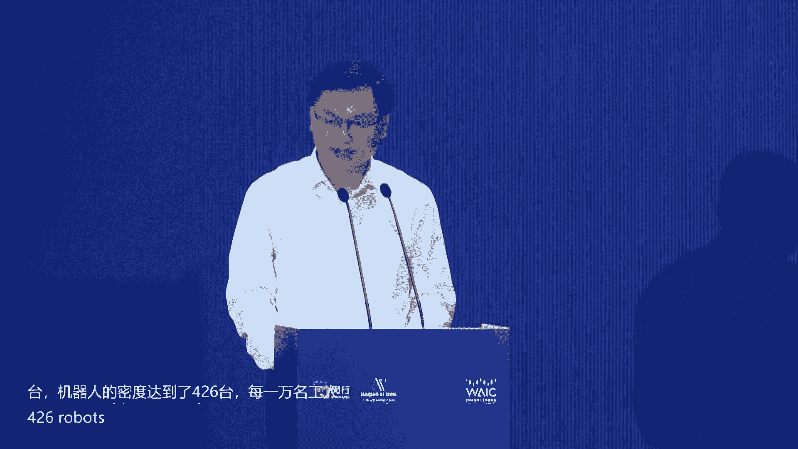
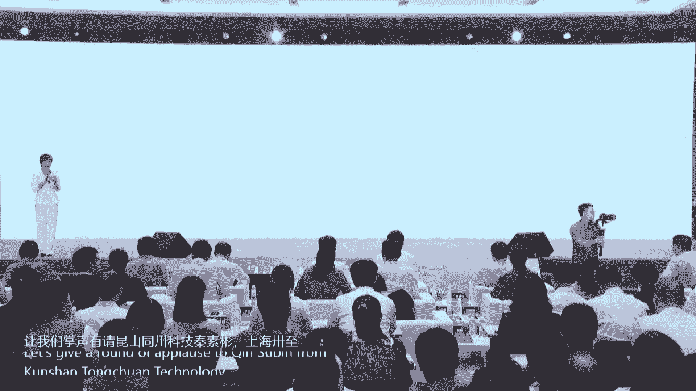
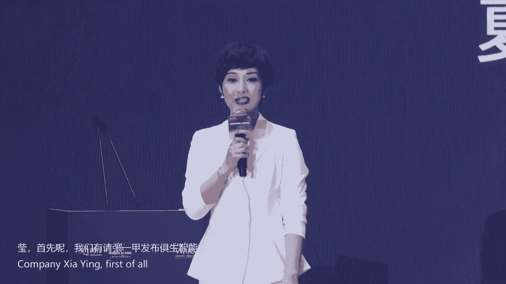
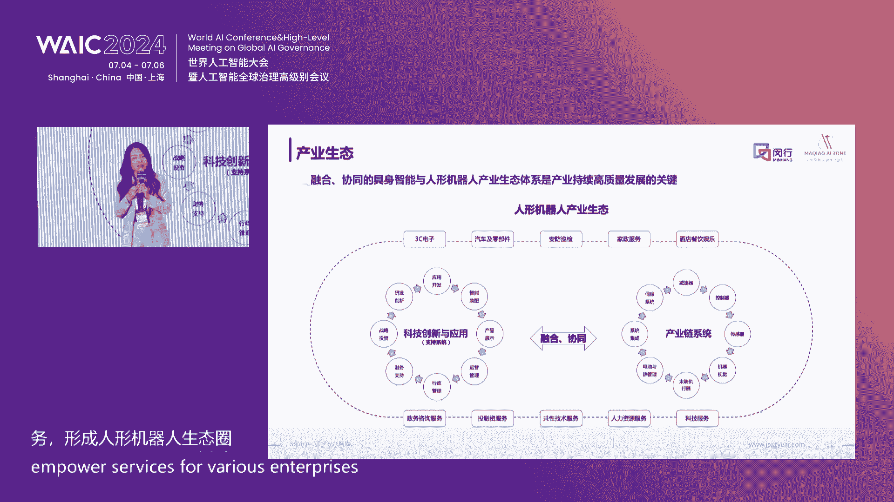
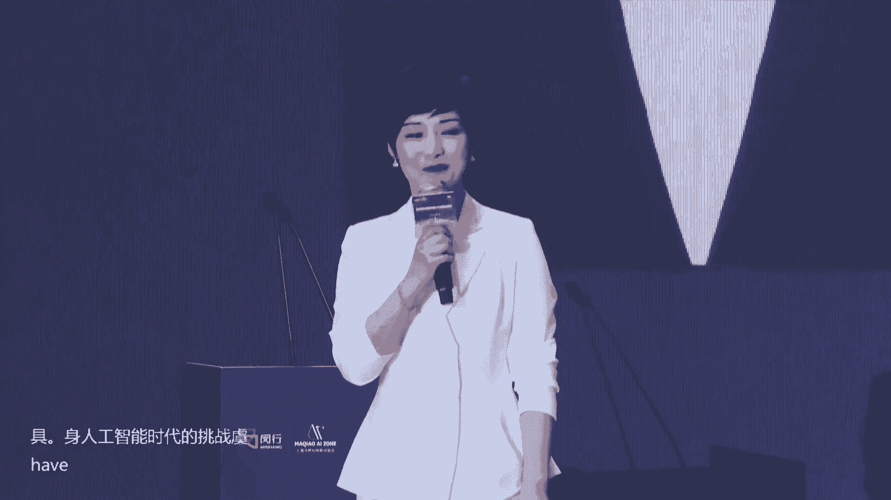
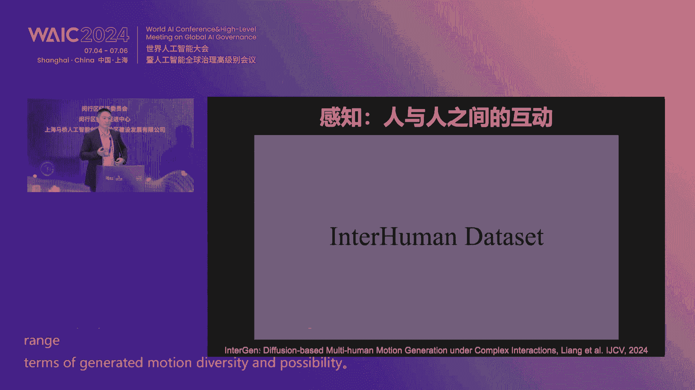
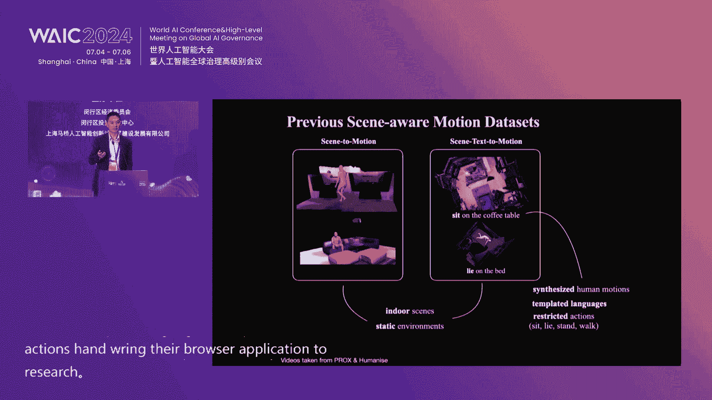
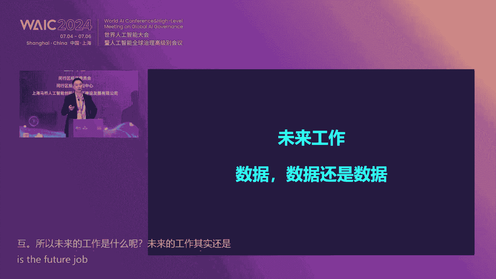
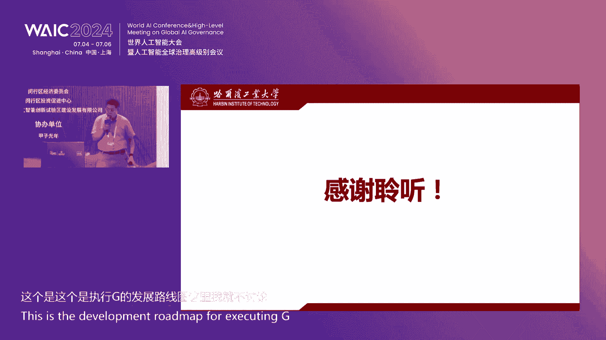
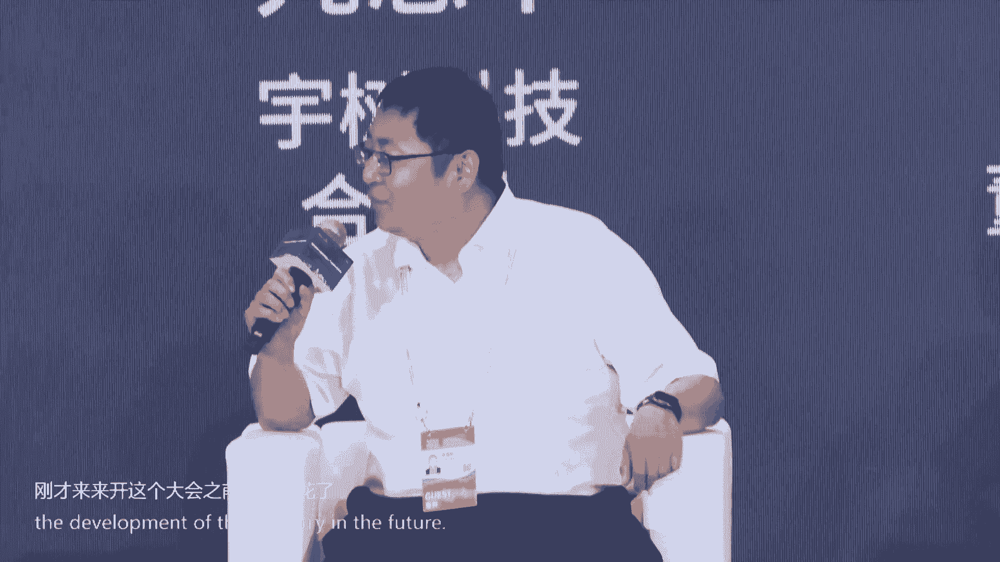

# P67：20240706-具身智能与智能机器人产业链生态论坛 - WarrenHua - BV1iT421k7Bv

尊敬的各位来宾，本次会议即将开始，请您尽快就座，并将手机等通讯设备关闭或置于静音状态，谢谢您的合作。Ladies and gentlemen， the event will begin shortly。

 Can we please ask for you to kindly take your seats。😊。

We would like to remind you again to switch off all mobile phones and put electronic devices to silent mode。

 Thank you for your cooperation。😊，尊敬的各位来宾，本次会议即将开始，请您尽快就座，并将手机等通讯设备关闭或置于静音状态，谢谢您的合作。

Ladies and gentlemen， the event will begin shortly。

 Can we please ask for you to kindly take your seats。😊。

We would like to remind you again to switch off all mobile phones and put electronic devices to silent mode。

 Thank you for your cooperation。😊，尊敬的各位领导，各位来宾、节业佳朋友们，大家下午好。😊，我是闵行区融媒体中心的主持人陈娜，欢迎大家莅临我们今天的活动现场。

今天是小暑节气，在这热辣滚烫，生机勃勃的盛夏时节，我们相聚2024世界人工智能大会暨人工智能全球治理高级别会议。😊，今年大会的主题是以共商促共享，以善制促善制，围绕聚生智能与智能机器人产业链生态。今天。

闵行区经济委员会、闵行区投资促进中心、上海马桥人工智能创新试验区在这里联合举办一场产业链生态论坛。首先呢请允许我为大家介绍出席我们今天论坛的各位领导和来宾，他们是。上海市经信委副主任汤文侃。欢迎您。😊。

闵行区委副书记、区长陈华文，欢迎您。😊，闵行区副局长谭瑞从，欢迎您。😊，上海市投资促进服务中心主任王东，欢迎您。😊，上海科技大学副教部长、信息科学与技术学院教授执行院长于金怡。

于教授呢此刻正在赶往我们会场的途中，我们稍事等候。继续呢为大家介绍上海交通大学计算机科学与工程系教授卢泽吴，欢迎您。😊，哈尔滨工业大学常聘教授，机器人技术与系统国家重点实验室副主任傅怡利，欢迎您。

香港中文大学深圳校区终身教授贾奎，欢迎您。出席今天论坛的还有闵行区经委主任李丽、闵行区科委党组副书记、科协主席杜涛，闵行区投诉中心党组书记岳崇，江川路街道党工委书记林毅、马桥镇镇长刘冬梅。

上海南滨江投资发展有限公司总经理徐亚云，上海马桥人工智能创新试验区公司董事长赵丽丽，总经理吴亮，上海临港浦江国际科技城公司董事长施觉斌。

参加我们今天论坛的还有来自全国的众多专家学者、企业家、投资人以及媒体记者朋友们，对大家到来。我们表示热烈的欢迎和中心的感谢。欢迎你们。😊，伴随着巨生智能技术的快速发展，巨生智能将深刻变革。

人类生产生活方式，重塑全球产业发展格局。上海深刻把握科技前沿潮流，发挥国际科创中心引领作用，从政策服务场景落地等方面，大力支持巨生产业发展。

接下来让我们用热烈的掌声有请上海市经信委副主任汤文侃先生上台致辞，掌声欢迎。尊敬的华文区长。最中副区长，各位来宾，大家下午好。很高兴呢参加今天的大会，共同探讨智能机器人的创新实践和前沿趋势。

首先呢我仅代表市金信委对各位的到来表示热烈的欢迎。对长期关心和支持上海智能机器人产业发展的各位同仁表示衷心的感谢。当前呢，随着机器人和人工智能大模型的加速融合，人形机器人已成为业界瞩目的核爆点。

有望成为GPC智能手机新能源汽车后的重要的智能终端和颠覆性的产品。经过多年发展，上海已经形成了较为完整的机器人产业链。

机器人的传统的四大家族在上海呢均设立了总部、新斯达、捷卡等一批国产机器人新势力脱颖而出。义工、力克、毁业动力等一批专精特新的企业在核心零部件上呢也实现了突破。去年，上海工业机器人的产值达到了250亿元。

产量呢约6。6万台，机器人的密度啊达到了426台每一万名工人。机器人产业发展水平呢在全国居于领先的地位。

近些年呢，上海紧紧的抓住人形机器人发展的机遇，也取得了系列的成果。首先呢是推动了高能级的创新载体建设。在全国首个的国家和地方共建的人心机器人创新中心在上海呢率先成立。

形成了技术研发成果孵化、人才培育、平台支撑等综合能力。第二呢，则是高质量创新成果持续涌现，已经集聚了开普勒、智源、中电科等数十家人群机器人的企业，涌现了电科机器人、智远远征、富力业等一批的热点样机。

也就是在咱们这次大会上，前天呃我们也发布正式发布了国内首款的全尺寸的通用人型机芯的公版机轻容，已经有有43个主动的自由度。算力呢达到了400个tops。

应该说这也是我们目前国内目前已发布的啊最好的通用型的软硬件的开发的平台。第三呢则是高效能创新生态场景持续完善。围绕人心机器人加智能制造和人心机器人加协同服务。在上汽严丰。上海电器。世博展览馆。

等领域呢开放了零部件加工、产线巡检、迎宾等19个典型的应用场景。作为上海的工业重镇啊，咱们闵行区在机器人的整体。在核心零部件等方面呢，都加快了布局。

已经集聚的有菲西捷卡、打塔机器人等重点企业呢有55家智能服务机器人的产业集群呢也入选了全市首批17个中小企业特色产业集群。

方球机器人金宇机器人、上元立交三家企业呢也入选了去年的上海智能机器人标杆企业与应用场景的推荐目录。我们也希望我们闵行区能够再接再厉，为上海智能机器人的产业高质量发展做出更大的贡献。

今年呢被视为计生智能和人形机器人高速发展的关键元年，上海将紧紧的把握重要机遇，更高质量开展人形机器人的上海事践。我们做好几个方面的工作。首先呢是要加强核心技术的突破。

支持人形机器人的本体、巨生智能大模型、灵巧手等关键技术攻关，要继续不断的优化开源人形机器人原型机。第二呢，这是要加大示范应用的拓展，鼓励重点行业面向开发者开放应用场景，探索机器人及服务的新模式。

要深化工业制造和现代服务等领域的人形机器人的应用。争取我们3年内要实现1000台的规模化的应用。第三呢就是要加快创新生态的培育，持续提升人形机器人创新中心，开源社区服务的能级。

我们要引导耐心资本、长期资本，要深耕人形机器人领域，推动产业、科技金融的良性循环，要支持龙头企业深度参与标准的制定，要推动新技术、新产品，要迈向国际市场。各位来宾，未来以来。

我们热情欢迎更多的智能机器人团队能够落户上海，落户闵航，服务全国。我们打造上海大脑全球制造的样板间。我么最后呢也希望本次大会取得圆满成功，谢谢大家。🎼谢谢谢谢汤主任精彩的致辞。未来以来。

希望有更多的企业能够选择扎根闵行在闵航创新创业。在巨生智能产业布局牵引下呢，科技企业正发挥着科技创新的主体作用。位于上海马桥人工智能创新试验区的三家企业，加大关键核心技术攻关力度。

开发了新技术新产品推动产业快速的发展，并在今天呢有3款重磅产品率先的发布。接下来呢我们举行重点产品发布。

我们有请太古机器人首席技术官一港萨志智能董事长、CEO张建正飞析科技首席AI科学家琼澈智能CEO卢泽吴，有请三位嘉宾上台。😊，🎼好，我们同时有请上海市投诉中心主任王东。

闵行区科委党组副书记、科协主席杜涛，上海马桥人工智能创新试验区公司董事长赵丽丽，上海南滨江公司总经理徐亚云上台，共同来见证我们企业产品发布，有请。😊，🎼好。

接下来呢请我们三位嘉宾将手放在我们启动的灯柱上。😊，🎼我们现场。🎼一起齐聚力量，请准备，请启动。🎼好，谢谢。今今天的我们三家企业将有啊重点产品进行发布。好，谢谢我们各位见证领导，请大家一起合影留念。

我们三位嘉宾请留步。😊，🎼好，先给我们的摄影师留下这难忘的一刻。😊，🎼好，谢谢各位领导，请入座，请三位嘉宾留步。😊，🎼好，太虎机器人易总。🎼呃，主持人你好。对。

今天非常高兴呢我们能有机会请到我们三家这个智能机器人的企业来为我们发布最新的产品。好，易总从您先来，现在公司最新的产品是什么？应用在哪些领域呃，我们最新的产品是这个全尺寸的人机前，它的身高是1。7。

有44个主动自由度。然后它的体它的自重只有48公斤。它的输出能力，它髋部关节膝部关节的一个输能力有4906米，它的扭菌密度是国内目前最高的，它目前的一个运动能力可以达到单腿跳跃的一个呃效果。

那它的像菱小手全身的各型号的关节都是太虎自然的。而且太虎的关节不仅在人肌有所使用。在军用就各种军用包卫星上面，包括一些大厂的汽车底盘上面都有两应用。

所以说我们的产品和别的家不同的就是我们的产品从硬件端就可以做到一个。😊，业级的些应用。所说我们的很多客户，像车厂呃些做家电的，其依依靠着我们的平台，也搭建了自己的一些人形机器的一些平台。

用在一些商用等场景。那我相信太湖的呃全自眼的一个硬件能力能帮助呃国内的产业的各各行业的一些公司呢也能在人机行业有大有作为。好，谢谢太湖的易总啊，我们这款机器人身高是1。70米。

我印象当中我们达踏的有一款机器人是1。68米，长高了2厘米哈。接下来有请萨志的张总，请您介绍。😊，呃，大家好，很荣幸在这儿介绍萨志机群家族家族当中的新成员。我们这一款叫移动双臂作业机器人。

它的名字叫白脑啊，就我们就是想让像让它用像猴子一样智能的移动和灵巧的作业。那么这款机器人呢是在萨志上一代单臂的移动作业机器的基础上迭代完成的。那么它进一步的能够把人从这个复杂的更精细的。

甚至是更危险的这个作业环境中解放出来。那么这款机器人呢，它这个具备这个一体化的设计和一体化的这个控制。那么它通过一个大脑实现手眼角的协调。那么这款机器人呢这个大脑呢能够完成这个视觉力觉触觉语音。啊。

这些元素能够和我们的整个的全身的啊这个20多个自由度，那结合起来，实现这种巨身智能。那么我们就是要通过巨身智能的算法，把拿捏拧。及这种呃这个基本元素，让它根据这个我们作业的这个工艺啊实现类人的这个操作。

啊，那么这款机器人在移动方面呢，我们采用了激光视觉啊，多宽融合多传融合的技术来实现这种呃这个行走和定位毫米级的这种精度。那么在这个啊它的双臂方面呢，我们是12到16自由度的这种类人的这种双臂。嗯。

那么我们通过这个聚式智能的方式呢，让这些双臂呢，根据这个多重融合的办法啊，来实现这个类人的精细的啊这种作业。我们在这里面呢，为了适应它的工业场景下的应用。那么我们采用了视觉四伏的技术。

采用了全闭环的这种作业的方式来实现工业上0。05毫米，也就是5个丝的作业精度啊，那么我们这个大家有时间呢可以到萨志的这个实验中心去看我们这款机器人。那么我们认为。那智能时代下。

它作为白挠作为一个新智生产力。那么我们就是要这个把这个机器人啊，在这个呃多模态啊多场景啊，多空间的啊这种场景下进一步的打造这个机器人，进一步的让他自主学习。

那么我相信白挠的出现呢为智能制造和智能生活呢啊成为人类的这个一个新的助手啊，谢谢大家。好，谢谢双闭机器人啊，接下来请卢教授为我们介绍。啊，大家好啊也向大家汇报一下，就是去年飞析科技战略孵化了。

专门做巨生智能大脑的公司穷测科技啊，本人也是CEO。然后呢，我们穷测这能用在呃一年半年内我们推出了这个穷测大脑。其实这个也是基于我们之前呃78年的那样的一个呃学术的机电。然后我们应该是全球手套。

能够呃不能与各种各种样各种机器人的这种通用的大脑。然后我们是。😊，在技术上突破包括呃，我们在能够理解这个世界的本质什么？就是物理大模型，还有这个鲁棒的行为决策多项指标已经达到了国际领先。

包括获得多次国际大奖。呃，那么我们已经完成了一个完整的一个平台呃一个工具链，等于说大家可以在任何场景，任何机器人基于我们这个工具链，你们就会搭造你们的完成你们的任务。嗯，好，谢谢。好，谢谢卢教授。呃。

我相信大家和我一样，听完三位我们企业的介绍之后呢，我们都能够感受到我们三家企业的这个创新研发的精神。那现在不仅仅是在模仿，更多的是在创造了，也推动着我们巨生智能这个技术在不断的前进。好，我们再次用掌声。

谢谢三位嘉宾，谢谢请入座。😊，🎼闵行区呢正以优质的营商环境充沛的科创资源、深厚的产业基础、便利的交通优势、宜居的人文环境，吸引着大批优质人工智能企业纷纷扎根闵行。

那接下来呢将进入到我们闵行区重点人工智能项目签约仪式。首先我们有请闵行区委副书记区长陈华文、闵行区副局长谭瑞从，闵行区经济委员会主任李丽、闵行区投诉中心党组书记岳崇，有请各位上台。

共同来见证我们重点项目签约。有请。🎼好，接下来我们有请上海马桥人工智能创新试验区公司马桥镇上台与新乡科技甲子光年追知科技汇西智能上奇弦科技签约，有请我们各家签约企业代表上台。😊，🎼好，请各位准备。

请签约。😊，🎼好，我们掌声祝贺签约成功，请大家一起合影留念。😊，🎼好，谢谢请我们各位见证领导留步继续见证我们下一轮签约。请我们试验区公司马桥镇留步，谢谢我们其他各位企业家，请入座，谢谢。😊，🎼好。

请试验区公司马桥镇刘步。🎼好，接下来我们有请第二批签约企业上台，他们是创智合力无界方舟致远会晨悦科技龙垦信息，有请各位企业代表上台。🎼好，请准备。😊，🎼请签约。🎼让我们掌声祝贺签约成功。

请大家一起合影留念。😊，🎼好，请我们各位见证领导继续留步，谢谢我们各位企业家代表，请入座，谢谢。😊，🎼接下来呢。😊，🎼我们有请第三批签约企业上台。

🎼力坤智能临港浦江有机技术、新庄镇、石英汽车、漕合金科技绿洲小爱机器人，有请各位企业代表上台。🎼好，请各位准备。🎼请签约。🎼我们掌声祝贺签约成功，谢谢谢谢各位，请一起合影留念。😊，🎼好。

谢谢各位企业家代表，也感谢我们的见证领导，请入座，谢谢各位。😊，随着本次新引进的15家企业落地扎根，将加快推动闵行区人工智能产业集聚发展，增加新动能。

长三角地区呢是我国经济发展最活跃、开放程度最高、创新能力最强的区域之一。那目前呢长三角地区已经建立起了较为完整的机器人产业链条，集聚了一批国内外知名的机器人制造和应用企业。上海马桥人工智能创新试验区呢。

将依托区域智能机器人产业集群优势，结合自身的资源禀赋，链接长三角共同来推动巨生智能与人形机器人核心零部件产业链协同发展。😊，接下来呢我们进行长三角巨生智能与人形机器人核心零部件产业链联合体成立启动仪式。

🎼让我们掌声有请昆山铜川科技秦素斌、上海萨志智能张建正、常州坤维科技顾慧新、宁波中大立德冯文海、上海南滨江公司徐亚云、上海马桥人工智能创新试验区公司吴亮、上海明智电器程建国、苏州绿迪协波归来。

苏州国讯新微方婷婷、上海飞西科技胡晓婷、上海太湖机器人李永超。😊。

🎼好，我们各位企业代表已经走上台前。😊，🎼请我们各位面向我们大屏，将手掌放在我们大屏的掌印处。🎼好，有请各位将手掌放在我们大屏的掌印处。🎼我们现场所有的朋友，我们齐聚力量一起倒数5个数。😊，🎼5。せ？

🎼21。请启动。🎼祝贺长三角居身智能与人形机器人核心零部件产业链联合体正式成立。好，请我们各位领导齐聚台前一起合影留念。😊，🎼好，谢谢谢谢各位，请入座。😊，我们产业链联合体正式成立了。

闵行呢是长三角一体化发展的桥头堡。优质的营商环境呢吸引了众多世界五百强上市公司、行业头部企业、独角兽隐形冠军、创业团队纷至沓来。接下来呢进入到我们的营商环境推荐环节。

我们有请米行爵投资促进中心副主任刘翔上台推荐，掌声欢迎。尊敬的各位领导，各位嘉宾，各位企业家朋友们，大家下午好。

今天非常荣幸啊能有这样的一个机会向各位闵行的新老朋友推荐我们闵行这座创新开放、生态人文、宜居宜业的现代化主城区。那么在今天的活动现场，我主要向大家推荐的是我们闵航的6张名片。第一张名片。

闵航是一片给于叠加的战略高地。我们闵行区呢是位于上海市的地理的版图的正中心。上海的地图一折四的话，中心点啊就落在我们闵行。整个闵行呢总辖区是372平方公里，280平方公里已经建成为高度的城市化地区。

常住人口呢有272万人。那么闵航依托。三大国家战略的叠加赋能啊，我们呃闵航正在成为上海链接长三角的桥头堡和沟通全球的枢纽门户，是虹桥国际开放枢纽国家战略的核心承载区。

也是上海建设具有国际影响力的科技创新中心的重要策源地。那么作为多个重要战略的叠加承载区呢，我们闵行既有非常丰富的土地资源，同时又保持着现代化中心城区经济社会高速发展的特质。

可以说我们闵行其实是上海的一个缩影啊，既是一块投资兴业的宝地，也是一片产业集聚发展的高地。呃，我们闵航的第二张名片，闵航是一片区位优越的通衢要地。我们拥有世界上最大的综合交通枢纽之一。

虹桥综合交通枢纽汇集了向民航、高铁、地铁等八大出行方式。我们说这个呢是我们闵航。无可比拟的闵航速度啊，是连接长三角通往全世界的一个登机口。

比如说我们的虹桥火车站一个小时就可以到达长三角近30多个万亿级以上的城市，虹桥机场已经开通直达国际国内的航班啊，90多个城市的航班。那么目前呢我们连接浦东机场和虹桥机场的机场联络线，也正在建设当中。

届时只需要40分钟，我们就可以实现两个机场之间的通勤。而作为一带一路的旗舰项目，我们的中欧班列上海号，它的一个始发站就在我们闵行的马桥镇。穿过一带一路沿线国家呢，我们的中欧班列最终可以抵达德国的汉堡。

那么经过近几年的一个路线的发展啊，我们目前已经实现了亚欧陆路运输网络的中欧线、中俄线，还有中亚线的一个全覆盖。丰富了上海服务进博会的一个渠道。那么除了我们的一个外部交通，我们闵行的内部交通也是高度发达。

我们拥有非常呃发达的轨道交通啊。目前我们上海市建成的这个轨道交通有20条，其中有11条路线就穿过我们闵行的境内，多条高速公路和快速干道，也是紧密连接。我们全国各地。第三张名片啊。

闵航是一片生机勃勃的发展圣地。从我们闵航的发展历程来看，我们闵行是中国工业文明的摇篮，四大金刚啊，五朵金花在新中国发展史上留下非常璀璨的印记。

拥有雄厚基础的工业底蕴的闵航呢始终是坚持制造业立区、制造业强区。我们闵行的工业增加值，在生产总值中的占比高达27%以上。像我们的航天航空船舶电器等。大国重器也是纷纷扎根我们闵航。

成为闵航经济发展的一个重要的支撑和战略支柱。而随着我们闵航产业的不断的升级啊，我们已经拥有了4个国家级的园区和三个市级园区。也因此我们闵行积攒了强大的经济实力。

我们多项经济指标也是长期位居呃上海市的前列。比如我们在去年啊呃全区的生产总值就达到了3000亿元以上，区级财政收入达到327亿元。工业战略性新兴产业的产值也是占到我们全区生产呃工业总值比重达到50。5。

啊，们闵行的上市公司呢有53家，这个数量在我们全市也是位居第二。那么同时啊闵行也是一个对外开放先行区和外商投资的主要集聚区。呃，自改革开放以来，我们从闵行经济技术开发区起步呢。

就有一批重大的外资项目落地在我们闵行区。目前呢有11万多户外资企业在我们闵行扎根，其中有112家世界级的五百强企业在我们闵行。那么这些外资企业是贡献了我们全区40%以上的税收和60%以上的外贸进出口额。

再来看我们闵航的第四张名片，闵航是一片资源集聚的科创重地。那么在今天的活动现场呢，我想这一点啊，可能是我们在座的各位企业家尤其关注的。我们闵行呃集聚了各类的科创科技创新资源区级以上的。

研发机构呢有470多家，我们拥有上海交通大学、华东师范大学两所985高校。依托这两所高校的资源呢，我们是推进大林浩湾科技创新策源功能区的建设，集聚科创人才优化人才环境，打造国际化的人才高地。呃。

到目前为止啊，我们闵行已经吸引了这个海外高层次人才就超过1500人，位居全市的前列。全区的人才资源呢也达到了101万人。院士工作站有126家。这个数字啊，我们闵行在全市也是位居第一。呃，到去年年底啊。

我们闵行区这个高新技术企业呢就有3600多家。每年我们闵行区对于这个研发投入的呃比重呢也非常高。我们的研发经费投入占比地区生产总值达到了10。57%。那这个比重呢其实是我们上海市平均水平的两倍多。

这个数字是不容易的。那么这个数字的背后，它的一个攀升和持续化的一个投入呢，也是彰显了我们闵航对于科技创新的一个持续投入和决心。再来看我们闵航的第五张名片。呃，企业家也是非常关注我们除了投资环境。

我们的生活环境也是同样重要。闵航呢是一片宜居宜业的生活美丽。近年来呢，我们闵行区的城区品质和服务能级也在不断的提升。就在去年，我们闵行市被评为了中国最具幸福感的城区。呃。

我们的教育资源啊拥有各类的学校有334所。这个基础教育的总量呢也是占我们全市的第二民办学校啊，像我们有非常知名的协和双语、新河湾双语等。同时我们的国际学校，也是占到我们整个上海市国际学校的5分之1。

那么再说到我们的医疗资源，我们闵行区也是持续优化医疗资源的布局。目前全区有将近呃600所各级各类的医疗机构，向我们的复旦大学和交通大学附属医疗机构在内的34家公立医疗机构啊，我们有8家呃三级甲等医院。

同时呢我们还拥有像我们的新虹桥国际医学中心。这样一个国家级健康产业的集聚区。在这个地方，我们集聚了24家优质的国内外的医疗资源，可以向大众提供多元化高品质的一个医疗资源的健康服务。

那同时啊我们为了回应呃这个老年群体的一个医养的期盼。近年来呢，我们闵行也是承担着全国养老服务业综合改革试点的任务。特别是在居家和社区养老服务呃，这样的一个工作呢始终也是走在我们全国的前列。

那么当前呢我们闵行区也是在依托大林浩湾呃科创策园功能区建设的这样的一个契机呢，正在全力的推进上海市养老科技产业园的建设。那么这些优质的人居环境呢，我们也是吸引了将近有5万多名外籍人士在民航居住。

闵航的第六张名片啊，闵航是一片政策集成的投资福地。作为全市首批综合窗口改革的试点区政务服务帮办陪伴的先行区啊，我们闵行去年呢在上海市的这个营商环境啊，企业满意度调查中呢，这样一个调查结果显示啊。

我们闵行区的营商环境呢是名列前茅啊，在我们全市排名第二。那么呃在去年啊我们打造的这个莫德纳的速度也是成为我们产业项目上海速度的一个标杆。作为上海的产业高地啊。

闵行也是正在聚焦一南易北的这样的一个发展战略啊，推动我们闵行的经济的高质量发展。那么今年以来呢，闵行区的。新型工业化现代服务业，还有我们大林浩湾的发展的一个专项政策呢，也是呃陆续的出台呃集中的发布实施。

那么政策叠加的效应，也将会加速的显现。比如我们在北部是抓住虹桥国际开放枢纽重大的机遇，重点发展国际商贸现代金融文化创意、科技服务等现代服务业的集群。在政策上面呢。

我们也是鼓励我们的外商投资企业加大投资力度，可以给到啊上线1000万元的一个扶持力度啊。那么在南部，我们是聚焦大林浩湾科技创新策源功能区。

重点推进建设高端装备、人工智能、新一代信息技术和生物医药等新兴产业的集群。我们也鼓励啊这个重大的科技项目研究，支持关键核心技术的公关。支持。扶持资金最高可以达到1000万元。

同时我们对于这个新兴领域高成长性的企业，也有这个租房补贴，最高上限呢也可以达到500万元。呃，那么今天的时间有限啊，我想呃我推荐的这个内容呢也是有限的。但是呢我们闵行的投资机遇是无限的。呃。

我想呢在这样的一个活动的现场呢，也想借这样的一个机会呃，给我们的企业家朋友们发出呃诚挚的邀请。呃，邀请在座的各位嘉宾，能够呃走进闵行，关注闵航实地到闵行来走一走，看一看，亲身的感受我们闵行的投资环境。

我们呢也会以最大的诚意、最优的服务和最好的政策。欢迎大家的到来，谢谢。😊，谢谢谢谢我们投诉的刘主任精彩的推荐啊，选择闵行遇见闵行链接未来。

那闵行呢诚邀全球各类的产业龙头专精特新创新型企业和优秀的传创业团队来闵行发展，让企业与城市成为志同道合的合作伙伴共赢未来。上海马桥人工智能创新试验区呢，作为上海人工智能融合创新四大载体。

和上海南部科创中心核心区之一。园区现在集聚了200多家人工智能的硬核科技企业，重点打造巨生智能与人形机器人及核心零部件产业生态。那接下来呢我们举行巨生智能与人形机器人产业报告及图谱发布。

我们本环节的分享嘉宾是甲子光年创始人CEO张一甲。上海马桥人工智能创新试验区公司。😊，副总经理夏莹。首先呢我们有请张一甲发布巨生智能与人形机器人产业报告，掌声欢迎。😊。

尊敬的各位领导，各位来宾，感谢大家出席。今天的会议。我是甲子光年的创始人伊甲。😊，我们又见面了。在新时代的背景下，数字经济已经成为了引领产业变革和推动区域经济高质量发展的关键力量。

习近平总书记在第二十届中央财经委员会第一次会议上强调，要把握人工智能等新科技革命浪潮，适应人与自然、和谐共生的要求，保持并增强产业体系完备和配套能力强的优势，高效集聚、全球创新要素。

推进产业智能化、绿色化融合化，建设具有完整性、先进性、安全性的现代化、产业体系。数据显示，从2015到2024年，数字经济占GDP的比重逐年提升。预计2024年将达到48。2%，对应的经济总量为63。

8万亿元。这一趋势表明，数字经济在推动经济增长中的重要作用日益显著。通过智能化、绿色化与融合化的协同推进，数字经济不仅能够提升产业体系的现代化水平，还能够促进区域经济的高质量发展。

为实现经济的可持续增长提供强大动力。从2020年起。制造业面临成本和效率的双重压力。通过数字技术实现精准成本管理和资源优化变得尤为重要。

制造业的高附加值和利润空间集中在上游的研发、零部件生产以及下游的销售和售后服务环节。数字技术的应用可以提升这些环节的竞争力，从而在产业价值链中占据更有利的位置。数字经济与实体经济的深度融合。

将推动制造业和其他行业的转型升级，实现高质量发展。从电子时代到数字时代，人类社会经历了硬件载体不断升级的演进，推动着生产力和生产工具的革新。如今，我们正站在数字时代的门槛。

而即将到来的数字时代人形机器人，有望成为通用人工智能，也就是AGI的载体。人工智能为数字经济带来了新的拐点。生成式AI和通用型AI技术的突破，将大幅提升人类脑力生产效率。人形机器人作为AGI的重要载体。

将推动社会各方面发生深刻变革。随着人工智能算法的发展，尤其是多模态大模技术的突破性进展，显著加速了人形机器产业的发展，提升了人形机器人的智能水平。一方面，大模型赋予了人形机器人更强大的智能水平。

使其能够自主进行判断和识别，执行复杂的多阶段语义推理任务，显著提升了机器人的泛化能力。而另一方面，大模型的应用加速了人形机器人产业的量产进程。推动了机器人从协作化、灵活化，向人性化的转变。

标志着机器人产业进入关键发展阶段。巨身智能是AI产业的下一波浪潮，将深刻影响机器人等行业，推动机器人技术向更智能、灵活和自主的方向发展。巨身智能将赋予机器人更丰富的交互方式。

使人机交互更加自然、更加高效。作为AI与机器产业融合发展的最佳载体，巨身智能有望通过有望通网通用人工智能成为人工智能的终极形态。巨深智能是将本体和智能体紧密有合，形成能够在复杂环境中执行任务的智能系统。

巨身智能通过在物理世界和数字世界的学习和进化，不断提升理解世界互动交互，以及完成任务的能力。为了实现计身智能的发展，一个强大的通用本体平台至关重要。考虑到通用能力，人形机器人被认为是具生智能的终极形态。

而这方面的研发也将持续成为热点和核心挑战。我们都知道，巨神智能人形机器人是一个软硬结合的智能生态系统，不仅是数字世界与物理世界相互链接的桥梁，也是推动工业上游发展的重要力量。前阵子。

我在中关村论坛主持人形机器人围炉夜话，一位观众现场站起来说，他的孩子在国外，自己四五十岁，但已经是空巢老人。他说他愿意花二三十万去买一个人形机器人。他说他不需要他做饭，不需要他干活，只需要他长得像人。

可以陪他坐，坐在家里没事走两步。功能和情感的诉求，对具深智能的期待是不同的。然而，巨身智能的发展受到木桶效应的限制，即软件可以迅速的迭代更新，而硬件的迭代速度则相对缓慢。

当人工智能技术应用于巨身智能的时候，涉及的技术层面是相当广泛的。其中，迭代速度最慢的技术环节，可能会成为制约整体发展速度的瓶颈。因此，构建一个健全的产业生态系统，促进软硬件的紧密结合与深度融合。

对于加速巨身智能与人形机器产业的发展至关重要。人形机器人是未来重点方向。根据工信部印发的人形机器人创新发展指导意见，指出，人形机器人集成了人工智能高端制造和新材料等前沿技术。

有望成为计计算机智能手机、新新能源汽车之后的颠覆型产品，并提出，我国计划到2025年初步建立人形机器人创新体系，至2027年人形机器人深度融入实体经济，成为重要的经济增长新引擎。此外。

在技术公关产品培养场景拓产、生态营造，以及强化支撑能力等方面进行加强。人形机器人的渗透曲线，将预计与新能源、汽车的曲线类似。这是因为人形机器人和电动车都采用了感知层决策成执行成的。

架构也都以电力作为直接能源，人形机器人也可以利用新能源车产业链的资源，例如AI芯片、自动驾驶算法和视觉解决方案等等。因此。我们相信，人形机器人有望成为下一个新能源汽车类的支柱产业。

强大的通用本体平台是计身智能与人形机器人产业生态体系的重要支撑。而本体的关键零部件技术突破是形成具有优秀的运动能力和操作能力的平台及通用人形机器人产品的关键。目前。

人形机器人行业正处于快速发展初期的硬件先行阶段。硬件性能的提升，成为了推动行业发展的关键因素。而从成本结构来看，人形机器人核心零部件的成本超过了整机成本的70%，核心零部件的成本降低。

是满足大规模商用的落地需求的关键。人形机器人通过在生态系统与产业链上下游进行融合，围绕产业链配套协作，与政务咨询投融资、人力资源机构等科技服务部门紧密合作，可以一起打造一个良性的可持续发展的生态体系。

产业链协同方面，以科技服务为基础，企业内部管理运营发展与产业供应链系统相协同融合，可以为各个企业赋能服务，形成人心机器人生态圈，提升产业整体发展水平。

闵行区正致力于成为全球创新创业示范的新标杆，旨在建设成为全国科技成果转化的新高地。长三角区域协同创新的新磁场以及上海科创中心建设的新引擎。闵行以北部的现代服务业和南部的高端制造业为特色。

形成了鲜明的产业特色。而我们通过观察相关的图表，我们可以看到闵行区聚集了一批巨深智能和人形激情产业链的企业。这些企业共同构建了一个充满活力的产业生态系统。

马桥人工智能创新实验区在居身智能与人形机器人产业生态的搭建和产业服务方面发挥着重要的作用。通过实践探索，推动了产业的创新和发展。这就是为什么甲子光年选择了相信马桥。那么马桥试验区是如何构建产业生态的呢？

让我们有请上海马桥人工智能创新试验区公司副总经理夏寅女士，让我们听一听来自马桥的声音，有请夏总。啊，谢谢伊甲。那么其实我接着伊甲的话题继续延续下去。那么在闵行上海马桥人工智能创新试验区呢。

是整个智能服务机器人的主战场。我们的产业链主要集中在核心零部件、机器人本体和应用。在核心零部件方面呢有呃芯片的企业葵星科技记忆科技。在控制系方面有制式机器人、木金机器人。那么在斯福电器上面。

我们有ABB有马赫。那么在末端执行器方面，我们有桥田智能。在应用领域，我们有像西门子微一制造这样的制造性企业，也有像海神机器人和金鱼机器人这样的科技企业。那么在机器人本体上面。

我们有飞析科技、萨志智能解卡机器人、太虎机器人和达踏机器人。那么这样一批的企业，我们形成了以龙头引领供销配套的产业链集群。那么上海马桥人工智能实验区呢是上海市的四大人工智能创新融合载体之一。

也是上海市的人工智能和智能制造的特色产业园区。同时也是智能服务机器人的产业集群。那么我们位于上海人工智能产业人自行布局的支撑点。虹桥国际开放枢纽的南向拓展带，同时也是长三角及60科创走廊的南北相交汇点。

特别要介绍的是我们是大林号湾科创功能区的产业主承载区。这是一片改革开放的乐土。嗯，从PPT大家可以看到，历届国家领导人都来过我们实验区。自豪的可以说，从周恩来、毛泽东、邓小平、江泽民、胡锦涛去年。

习总书记考察上海的时候，他的第二站选择了实验区。来这里看了我们城市建设者管理者之家。他对我们实验区的保障配套给予了一个充分的肯定。试验区是矗立在4000年钢深之上的一处底蕴绵长的风水宝地。

那么这里有两大非物质文化遗产，首狮舞和马桥豆腐干。同时，这片区域是整个上海市的工业摇篮，我们有着60年的产业基地，新中国第一座工业的卫星城，从我们这里崛起。实验区四通八达。

那么我们3个小时可以到北京、广州、深圳，一个小时触达长三角的都市圈。我们到虹桥国际开放枢纽，嗯，浦东国际机场只要30分钟的车程。那么我们实验区周边呢有7条高速的环绕。同时嗯中欧班列的始发站。

从这从我们这里开始，成为国际贸易的重要枢纽。那么目前呢我们地铁5号线可以到实验区，23号线正在建设中，未来的5到10年，有19号线、23号线南延伸段东西联络线、嘉闵县南延伸段等交汇到我们实验区。

构建起更加便利、更加密集的交通网络。那么我们实验区呢总的面积是15。7平方公里，北部是应用综合实践区4。9平方公里。这里有商业用地，有研发用地，有住宅用地，还有中间一个平方公里的中央公园。

那么中区和南区呢整个是10。8平方公里，是产业创新发展区，主要是工业用地，所以企业的生产制造中中式都可以落在我们产业创新发展区。我们有非常充裕的空间，未来可以出让用地2000亩。

可盘活土地资源2000亩，以及蓝绿空间6000亩。那么我们现在有近1000万方的载体资源空间，特别是我们上海工业智能中心，是我们整个核心区的重要的一个人工智能产业的标杆载体。总投资14亿。

建筑面积14万方，目前呢是可租可售。嗯，我特别要讲一下，就是我们整个实验区呢是配套资源是非常的丰富。在我们这张版图的上方，也就实验区的北部是低密度的别墅区。嗯，环境非常的宜人。

配套有养云安曼德威德宏国际学校、高尔夫球场网球中心。那么在我们实验区的东部，是大型的居住区。嗯，未来规划呢有10万人。那么在我们整个实验区10个平方公里里面，有学校27所商业综合体。

8处医院、4所文体设施，10个，同时有超5000套的人才公寓。那么我相信我们的配套是适合企业各个层级的人才的生活需求的。嗯，最后呢其实我要想的是，过去三年，我们实验区的规划都已经落地。

未来呢我们将三年出形象，五年成规模、十年造引领，去耕耘一块有无限可能的实验田，就像我们人工智能一样。那么我们会积极的推动人工智能智能机器人产业集群化，从龙头企业到整个产业的企业。从一棵树到一片林。嗯。

让人工智能能够在我们实验区深度的融合，打造一座智生产智生活和智生态的未来之城。最后，我非常欢迎大家能够拥抱我们马桥人工智能实验区，与AI共舞，谢谢大家。谢谢谢谢张总，谢谢夏总精彩的分享。嗯。

我们在座的各位听了有没有动心。😊，🎼在人工智能迅猛发展的今天呢，巨生智能作为其前沿分支，正在不断的推动人机交互的边界，为我们的未来生活呢带来无限的可能。那这一技术的发展不仅预示着人机关系的深刻变革。

也昭示着我们与智能系统共生共荣的新时代即将到来。接下来呢到了我们主题演讲的环节。那我们首先用热烈的掌声，有请上海交通大学计算机科学与工程系教授卢泽吴为大家带来主题演讲，巨生智能如何重塑人机交互的未来。

掌声欢迎。😊，🎼喂，哎，非常荣幸哈，就是能够向大家汇报我们近期的工作啊，我们是讲下这个计身智能的学科发展，以及我们做的一些工作啊，那么好。😊，啊，下面就是我的那个内容。首先我们从巨生智能s law开始。

大家知道这个大模型能成功，主要是s。那么巨智能会是什么样子的呢？好，那么我们就会有一个问题巨生我们来回想一下语言大模型是不停的填数据，然后就实现那么这里会一个问题，巨生智能数据是什么呢？

是视觉到控制的数据。那我们就面临这个问题，那我们是不是继续要填这种视觉到控制的数据呢？啊这个事情可能大家是这么想的是吧？好。

但是我们来可以对比一下这东西为什么这么难啊我们来对比一下另一类需要视觉到控制的数据的一个一个品种叫无人车。好，那无人车的话，那这么多年啊，用仿真也好，用1万台去采也好，它采了这么多数据。哎结果的话。

那也刚刚这样好。那我们可以粗略的估算一下，它整个无论是整个的不确定度还是场景的分还是这个仿。😊，真的难度，它整个的博学定义算是巨大无比。那这样情况下，它的数据会有更多。而且大家不要忘了。

语言模型之所以有那么多数据能够去做的原因是因为我们人类社会因为各种的人类行为，你每天发博客积累了大量的廉价的free的那种数据。那么你哪来那么多的那个视觉控制数据。好，那就恰一个问题。那就产生一对矛盾。

我们想要让那个语言模型的继续成功，那就需要智能有大量的空间巨大的空间和数据和视觉控制这数据，它的之间的矛盾怎么艰难。那么怎么办呢？这个我们穷测科技也是多年的时间在之前再去去那个去思考的问题。

就是如何用第一性的原理去思考去降低这样的巨大的复杂性。我们学术用语做空间啊，其实就是不确定的意思。那么我们来思考一下居智能真的是需要这么海量。😊，数据为嘛？当那需要。

但是说他我们又仅紧抓住他的什么样的要素，使要它的空间大大的下降，使要它的数据能够呃解决这个数据魔兽。所以就得到来到了我们穷测科技的那个技术突破了。好，那么这里面的话呢，我们就回到第一性原理。

就是说呃物理常识。这我们在做一件任务的时候，大家可以想想，我们需要两个什么样的关键步骤。第一个就是我们要理解这个物理常识，所以是炒的很火的一个有物理呃就是那个what model世界模型，就理解世界。

第二个就是做出有效的决策和高路棒的决策。所以我们这里面会分成两件事情，世界什么如何做决策。当然这里面是端对端训练哈，只是说他们是两个功能模块串起来端对端的训练。那么这里面为什么能把空间降下来。

我们来仔细看一下，如果之前的话用是那个视觉数据输入的话，点也好，图像也好，它会面临一个问题，就是。😊，你像素是很大空间的。如果我们把它变成物理常识，就比如说这个门是一个轴旋转和开放。

那么它的整个的数据格式可能是K级别的。而一张图片是百万级别的。那么这的它的整个的空间就会局大的下降。而且大家不要忘了，这种数据不需要视觉啊不需要视觉控制，所以在视觉领域里面。那么到了决策的时候呢。

我们拥有了一个大概的趋势，就像我们拧开瓶盖一样，我们大概就道往这个方向走，它整个决策空间会下降。而且我们用了一个力位吻合的一个决策方式，使得我们的决策空间进一步下降。就比如说我们做很合动作。

我们是靠下意识的大脑其实不那么费神的，我们拧开瓶盖的话，大脑是稍微的知道说怎么拧。但是你不用太费神，都是靠下意识的，我们可以把这种毫秒级的决策大脑到了半秒半半分钟级啊半秒级间的决策。

只要它进一步的数据大大的下降。所以说我们就有可能做成这样子。那么在这种的情况下呢。那个我们就会有这样的一个大的模型架构，就是呃物理场的大模型和利润混合大模型耦合在一起。同时呢我们又配备非常好的数字方案。

在今天，巨人智能只讲模型，不讲数据呃，可以说是不靠谱的那你告诉你，你你的数据怎么获得。因为数据将是一个巨大的魔咒。那么我们这道是一个端端端模型呢，正如人类一样。

它是呃它是那个几个模块串在一起的端对端的学习。那么我们也是那个研究出了那个具体的方案。那我们的研究成果获得了科学探索奖，这是唯一巨生智能的方向。也在得到学术界的广泛认可。😊，你家好的，第一个问题。

我们如何去获得这样的那个呃物理操作知识呢？哎，大家想想是不是我们把它扫描一遍，然后呢，就我们就把它那个那个标一标，对吧？其实这个事情其际是很困难的。为什么因为这种效率很低？那我们发现了一个队偶关系。

就是我们发现人手的操作，sorry。😊，呃，诶，怎么让他动起来呢？好吧，这里大家可以可以想象哈，就是手是操作。那你操作的过程中呢，其实我们看手的看这个物体的旋转轴和方向，他们知道手怎么操作。

反过来手是能反推他，这是对偶关系，使得我们的数据获取的成本大大下降，而且能构建出这样的那个物理常识空间出来。哎，那么我们就是呃像我们colo22年发表了一个大规模的观察手操作的数据。同时的话呢呃我们。

😊，哎，我好像是视频播放不了。啊，好，谢谢。对，那那请请台下同那个那个帮忙一下。好，然后呢我们是通过这种获取它拓扑结构。然后的话呢我们呃就能够海量的获取它原数据。因为做仿真模型不是不好。

仿真它的问题是你哪有那么多圆的数据，对吧？那你也造那么多model，你造不来啊，对吧？那这个世件你也造所以我们构建这样的一个原世件之后的话，我们在仿真模型上做。

我们也是应该是在中国的创业公司唯一一个做机器人巨巨生智能的机器人的仿真模型，我们从底层从仿真器底层去做。然后这些事情我们开源了一个un，这个东西要做的又快又准是非常难的。

那么我们也获得了那个RSS的那个和lo的最佳论文，这是国际上最顶级的机械顶会。我们对标大规模的大仿真计算的误差的一毫米提速400多倍。那么好，我们在下面往下来看。

这个这个事情我们过程中是采用了一系列的那个呃。😊，那个机器学习技术使得解那种超级复杂方程能够快速的响应啊，那这也就跳过了哈，有点复杂啊，然后那这有什么好处呢？我们开始讲好处哈。

就是我们能快速的去理解这个世界是什么，然后能够返回去推son它的参数，包括我们能稳定的去推算它的每个物体参，比如我们抖小斗步啊，我们就知道这个布的那各种参数，像杨视模量等等。那么机器人也能做到这一点。

这有利于我们对有有赖于我们对这个世界常识模型理解，以及我们自研了一套深度深度学习耦合的资源了一套呃，那个自己的仿真器，每行代码都是我们写的，而且我们在很多指标在国际上是领先的。😊，好。

那么我们来看这个最终我们来展示一个我们对物体事业理解的能力。这个能力就是说我们能够去深度的理解世界。那么我们对于复杂度，我们有几个维度哈。第一个它从不确定角度讲。比如个杯子，它是不确定度是6位维度。

就是它的左右上下和旋转。那么一个关键物体比如个订书机可能它有复杂一点。但它无线物体的话，它的不确定性是无穷的，它的状态的无穷，这是对智能一个巨大的考验。那么呃那个为此的话呢。

我们是展示了我们的那个呃叠衣服的情。但我们不是为了叠衣服，而是展现我们对世界的理解的这种能力。但对乱续里面能把这个东西给做好。呃，那么其实这个应该是全世界第一个能公开的开放的环境下做乱续的衣服的叠。

大家可能会看过很多视频包括特斯拉的，它的特点是它要把衣服铺平。那铺平它是种状态的坍缩，等于说你只要检测哪里是个领子，哪里口都可以。😊，啊其实这里面的难度大大下降，我们是能面对非常复杂不确定的那个物体。

能够肢解它的知识。包括我们那个科学困难的是能够穿针，这也是获得了国际上的机器人的顶会呃，RSS的最佳系统论文，也是历史上的第一个中国团队。这些事情也是证明了这些技术上是事界领先的。好啊，那么往下走。😊。

诶。Next。好，那么第二个事情就是我们需要鲁棒的执行。就是说我们已经理解世界了，我们已经理解了这个要拧开瓶盖。但是能不能稳定的执行出来。那这里面需要一个利位混合。

这是一个最基本的一个完备的一个去执行的空间。啊，就比如说我们理解了人脸对吧？那么你能不能把刮出来，这其实是要手感的这个手感其实也是个AI问题。你该决策多少趋向力和和那个和那个摁压力，那钥匙跟这样子。

你虽然能检测孔，但你们拧出来吗？这是需要手感的而这个事情呢就需要一个力位混合的大模型。那下面会讲讲我们的特点。那我们以此也是构建了一个全新的一个范式，这个范式是力位混合。

那我们来看现世界上所有的寄生智能大模型，包括谷歌的也好也好anyth他们都是特点，他们都是说是位置输出的是位置，就是我输入的视觉，然后输出位置，包括我参与的那个那个op的 body。😊，也是这样。

那么这个事情它会一个什么问题呢？它就是说那人类其实是有力绝反馈的，就像刮胡子一样，你没这个做不好了。我们建设了1个嘎80位80D的这样的一个利位混合的输出，使它的轮伴五棒性和稳定性。

以及它对数据的需求会大大的下降。😊，诶。好，那么为此哎麻忙放一下视频。为此我们还构建了世界上唯一的一个利反馈收集平台，就回答刚才的问题，你的模型有了数据咋来啊，对吧？那么你怎么也有利反馈的数据呢？

现的要操作都是位置的。我操作一下对那你怎么把反馈拿出来。那我们你看我们能做到抛钉解流，这肯定不是位置能做到的，是利反馈能做到的。包括我们接下来会考虑问题，我们如何把这数据收集的成本降到几乎很低很低。

那么我们也自研了一个外骨骼发表在的那个2023就是这个外骨骼是一个非常廉价，我们下一步可以推广到几十万台千家万户帮我们去采数据。因为大家非常廉价那用这样廉价数据呢进行一个一个叠加之后呢。

我们就既有那个数据的广大的量同时有精度这样的一个金条模型。有了这样的一些些模型之后呢，我们是开源了上最大的巨深智能的那个。😊，呃，那个利位混合的这个数据呃。

同时也是我们是唯一参与了open是国际上的呃那个具生智能的那个数据大平台的呃，包括像个fordMIT谷歌等等，我们是唯一的中国单位去构建这样的一个数据生态。那么我们有这样的结果就麻烦放一下。好。

就是说呃我们可以看两个视频，这些事只有我们用我们的利位混合，在全局范围内啊，是没有人能够做到我们这样的水平的啊，那包括其实刮气球是更难。因为你只要一个点卡住了，它就会崩盘啊，是好，那么再往下。好，哎。

往下一页，谢谢。那么我们这次也借这平台首次发布了居生智能穷测的大脑。因为我们要从顶尖的科研变成实际的产品。我们现在产品已经被跟世界已经在世被跟世界五百强的大企业在合作，在使用了。

所以现在大家来介绍向大家介绍我们的这个居生智能大脑的产品的发布。😊，好呃，那么我们将我们这些技术的话呢，就建构建在这凝练在这样的一个系统里面，它有稳定的工程内核，包括工具链呃，包括那个后面的大模型。

然后还有核心组建preingmemory还有action。后面呢最重要是我们能够支撑各种呃an skill，就是说呃现在我们有规模化的去做各种场景，大家总是问我们场景是什么。

其实所有的场景都是技能的组合。如果我们能把把所有的技能都解决了。那么任何场景都在组合，就比如说我们去去擦桌子，那就三个技能把东西拿起来擦掉，然后就放下去。那技能我们能做到泛化和通用之后。

无论你是在家里面医院还是在工厂都是用统一的技能，那么我们已经有多个技能能做到通用了。那么。😊，那在这样的一个软件架构下我们开放了一个训练平台，呃，能够加速这个训练。同时我们靠建了一个呃de的平台。

当你们我们能够任何的硬件加上我们数也都会非常的快去使用和还有包括能够帮你们做机器人的集群管理。当然这都是整个的一个软件的系统。呃，就是一个AI软件系统，可以使用到各种各样的机器人上面。

这也是应该是全球第一个去开源呃呃，不是开就是第一个开放那个呃自身智能大脑使用各种机器人上面的。当然有一些高呃高共性的硬件平台，我们也是做到软硬件一体。比如我们的单轮呃单臂轮式的小测机器人，下面会展示。

哎，麻烦放Vdeo，谢谢呃。比如说呃我们的这样的一个已经是呃在POC在贞杰盖跟世界五百强企业在合作的这样的一个事情。这个整个软硬件都是我们做的。那么我们可以做简单的家里的清力，还有在家里面做很多设备。

而且它的价格是呃能够很亲民的。因为它整个事情的话，但是它背后是用用我们的穷测大脑来支撑这件事情。😊，啊，我再讲下这个欢迎大家去事业人工智能展会上去看我们的demo。

因为这是真正支持work的 demomo。呃，我这里会讲个概念，就是说我们希望是真机能够demo work。

而不是只是看视频或者是PPT所有我们的这个是一切的事情都会从真从PPT和视频走向了真实真机这个叫做眼见为实啊，在我们的掌馆位置上也也最近有很多的报道。

是说能真正的能够真的能是个work达到这样的性能的啊，不止给你们看视频哈啊，这个是往下。😊，好，谢谢。那么第二件事情呢，就是我们拥有了这样的一个精细的食材处理，就是any shopping。呃。

当然你能会看到我们刮胡子，因为会场刮胡子还是比较危险，那我们就换成个刮黄刮。其实这个的环境的话跟刮跟刮胡子难度是差不呃差不多的。它的特点是像大厨一样刮到很精细。

我们发现呃人都很难刮到这样的一个精细的水平啊，这些这也是在现场demo哈，那眼见为实啊，希望等会会议完了之后上去大家能指导我们的现场demo啊，这我们的展位啊。😊，好呃，还有4分钟哎。好。

这也是精细的能力。其实在机器人里面一个很复杂，就是精密操作，就是现在的做的比较多，就放抓取就是一个东西移到另一个地方。因为它不需要精密的接触，一旦需要real，需要精密接触的时候。

就是一个整个的捐制的个难点。这是我们在技术上突破，然后使到它的产品化和和平台产品化和技术产品化商品化之后，能够做这样的一个事情。所以话我们在现场看到很多人都吃了我们的黄瓜哈，这个免费的啊。好。

然后接下来就是说下一个就是那个我们这些东西已经用到了实际的情况。比如说我们跟新希望和海天就用到了比如这包榨菜。其实这个事情的话，大家觉得很难想象是不用我们的是很难做的。包括切鸡块，这个是要刀法是要刀法。

这样的市场在全在整个光是中国就百亿的这样的一个精细食品加工的这个大的市场。😊，好，那么往下的话就是柔性物体的这也是现场展示的。呃，刚才讲的就是我们所有的视频都是要在都是我们都长走出了实际情况。

这走在真机能够展示的啊，所以我们这个想说是世界上第一个公开的展示乱序叠衣服的，就是就是可能更多的别人更多视频，我们是真机能够展示这个难度是要求是很高的。因为他要要真实的去去它的稳定性啊。

他的那个AI的那个大家的intelligent程度，他不可能说选一个好的，而是我们要实时这么几天下来接受大家的接大家看着而不是挑一段好的给大家哈。这个嗯好，这个可以也可以现场去指导一下我们嗯对。😊，哎。

还有2分钟。好。呃，这个刚刚这个叠衣F这不只是说不是为了叠衣F，而是我们所有柔性物体。包括我们现在跟呃最呃那个最大的那个汽车厂商在做的时候，它有铝线，工业上的铝线，它就是涉及到柔性物体。

那怎么做柔性物体，柔性物体是个无限维的操作，这里面的那个难度就会非常之大。😊，好，那么大家都知道我们是any grasping的那个那个发明人，any grasping是被公认为通用抓取领域的突破者。

第一次达到了抓取的人类的抓取通用水平。我后面呢我们为了更加落地打通仓储和零售最后一公里。因为保证百分之百的良率。我们又开发了面向力绝动态的an grasping大家可以看一下抓这个纸片。

这个纸片是非常的稳定。然后这的气球，还有动态这篇论文也发表在TLO当时TLO的review就直接发个amazing amazing and amazing来评价我们的工作。嗯嗯，好。哎，往下啊。

那么我们开放了这样的一个原子技能。那大家在落地的时候就很好用了。大家只要说像搭积木一样，把你们场景拿过来分析要几个技能。比如说你要是做那个那个清洁，你要是用我们，然后再用我们 any。

然后只要一搭积木就可以了。然后呢为了让大家搭积木更方便，我们还开放了这样的一个语言驱动的，可以把各种技能整理在一起的。呃，就是说你看我们输入你要干什么事情，我们会把你用技能组合在一起。

你就可以去end to end去做我们的事情。当然这个训练我们会再之后做一次M to end training，需要它的流畅性。呃，这样的事情它就是可以像灵活组合任何的技能能够组合成呃。

只要你技能足够大，能组合成任何的那个场景。这时到它能够真正的规模化scaling实道达到那个技术和商业的双s。😊，啊，好呃，那往下好，那么呃最后想最后30秒。

那我们讲一下我们的整个是一个技术和商业的双向性飞轮。我们讲了任何的技能，最后都是任何的任务都是技能的组合。那么我们是有个技能的光谱。我们保证我们解决一批技能，它一定是通用泛化，在哪个场景都可行。

那么它是一个指数级的增长。当你技能增长的时候，你商业任务数是增长，我们这里列出了两个这个我们琼大两个mile啊，就是要多少个通用技能解锁多个商业任务，这是我们经过一个测算。但最后呢大家可能会问一个问题。

就是你的技能都是你自己定义的那最后能不能通用了所有的事情都能做可以的，为什么呢？因为它技能其实它可以并成个技能空间，然后深层式的模型，就做到任何的都可行的。只有学术路线是可行的啊，好，那么刚好时间到好。

谢谢大家。😊，好，谢谢谢谢卢教授精彩的分享。看了以后，大家是不是也很心动。呃，可以说现在的人工智能发展呢是日新月异。刚才我们看到了地面清洁机器人，能够进行精细化食物处理的机器人，能够叠衣服的机器人。

我想这些机器人如果能够规模化的这个应用啊，真的是人类的福音啊，在过去20年呢，我们深度学习推动了人工智能的革命，随着巨生智能的到来，人与环境、人与人之间以及人机之间的交互成为了新的焦点。

那接下来的演讲呢将探讨我们如何利用新型感知模块、先进认知技术和深度强化学习控制方法，为巨生智能的发展奠定基础。我们有请上海科技大学副教务长信息科学与技术学院教授执行院长俞精怡为大家带来主题演讲。😊。

🎼感知认知与行为，聚身人工智能时代的挑战与机遇。掌声欢迎。

🎼非常这个感谢主办方的邀请啊。这个呃现在侧务走了，我就可以开始泼居深智能的冷水了。so我想讲的是居深智能时代的一些挑战。那为了说巨深智能呢，还得先说人工智能，对吧？所以今年是人工智能接近70年的历史。

在1956年的达特茅斯会议上基本确立了人工智能的范式，他是说把问题拆分成感知，也就是如何获取信息认知如何对信息进行分析。最后呢，行为当时的行为主要还是落在roics也就是机器人上。

后来大家发现其实行为的另一种呢是可以用来做三维的生成或者图像的生成等等的任务。所以在今天的语境下呢，他逐渐转化成了我们说的数据算法和算例，对吧？因为感知能够获取很多数据，这个认知其实是算法的一个核心。

然后最后的算力成为了行为的这个主导。那我们先来回顾一下这个过去的十年吧，因为这是人工智能的非常呃蓬勃发展的十年。这十年里面，感知认知和行为分别做到什么程度了呢？呃，大家知道从感知的角度。

原来我们只用一个相机，对吧？我先看好多相机都在拍我所以现在我们变成了一个很多很多的多相机阵列。比如伊mus在他的车里面，他就非常卓越的像希望使用这个多相机系统，而不希望使用莱达系统，对吧？

这个因为他觉得多相机系统，也能够从像人的眼睛一样，从不同的角度来进行观看。那因为我们采取了多相机系统呢，我们发现在过去5年里面，这个神经辐射场成为了一个非常大的一个主流，对吧？

我们所有的同学做的教授都在研究神经辐射场啊，如何把一个显示的几何变成了一个影视的神经网络。在这个领域里面呢再也没有这个所谓的点云啊。

或者说是meash啊或者表面啊相反的一个神经网络就代表了一个三维世界的一个表达。😊，当然这个这个人工智能发展实在太快了，对吧？在过去两年里面，又从神经辐射场又开始往回走了。

因为大家发现几何还是可以使用的。原来我产生不了很好的几何，只能用神经辐射场表达。那么现在可以利用比如说3D高斯啊这些技术呢能够产生这样一个这个3D的重建。比如说呃现在的3D能够做到好到什么程度呢？

就是大家可以看到我这个3D的这个效果可以在三维空间里面随意的走动。然后你可以发现哪怕我的几何非常的差，这并不影响我最后在3D里的观看的这个观感，这还挺重要的。因为一个机器人来说。

这个机器人到底需不需要很好的三维几何呢，也许它并不需要对吧？但是它需要在三维空间里面自由的走动，所以这样一个三维空间的一个vi其实是很重要的。所以这里讲的是这个3D的感知。那么还有一部分呢是生成。

因为这个呃算法。😊，呃这个眼镜啊大家发现我能够做非常好的，比如说特征提取和 decocoding encoding对吧？我可以把很多的高维信息变成一个低维的这个feature。

再从低维的feature应会三维空间，所以他就催生了现在我们所谓的这个3D生成器。我这里为什么一定要讲3D生成器呢。因为当一个机器看到一个画面的时候，一个robo看到一个画面的时候。

一定仅仅是看到了这个画面的很小一部分，它必须要去猜对吧？他要猜这个物体是什么，这个物体的背面又是什么？那在今年的C graph呢也就是这个图形学的顶位上呢，我们发布了可能是一个最大的一个3D的生成器。

它是用500K的一个这个object进行train的具体的就是我就不说了。大家看一下最后产生的效果，也就是我给你的是一张图片，也就是这个机器人只看到了一个一个面输出的是整个的三维模型，这还是非常酷的。

大家想象一下一个机器只看到了一个沙发的正面或者说。😊，甚至于看到我的人的正面，但是我瞬间可以把它的三维全部恢复出来啊，这个是也是拿到了今年的C graph的这个最佳论文的提名。

那这个是前面讲到的这个非常兴奋，对吧？我们开始能够做这个三维的非常好的三维的扫描，用nererf或者是用随里搞选，能够做三维的渲染，然后还能做三维的生成。

似乎好像这个我们的巨生智能我们的机器好像明天就要攻占我们的世界了嘛，对吧？但是事实是什么样的Nowever doesn't go exactly the way。😊。

所以事实上发现就是我现在做的很多的东西，要让这个机器变得非常的鲁棒，除非你是一个非常可控的环境。前面如特显示的很多的srro非常的酷，对吧？它是可控环境，也就是说我知道这件衣服放在哪？我两只手在哪里。

这是可控环境。但在现实生活中，我们希望的机器人是可以自由的在我的三维世界里走动，对吧？它可以freely navigate right，那问题出在哪里呢。😊，其实有问题并不是坏事。

有问题就说明我们还有下一届下一届下下届的WAIC对吧？所以问题在哪里呢？问题在于我们的巨生智能里面忘了一个很重要的事情。这个事情呢就是交互。我们所有做的事情都是在做三维世界的感知理解。

但是我们是怎么和三维世界进行一个这个认知的呢？我们通过试错，对吧？我们从婴儿开始，我们试着抓取一个东西，不管这个东西能不能吃都塞到嘴里咬一咬，对吧？所以这是一个交互的过程。

这个交互的过程涉及到人和物的交互，而且是自然环境下的交互，不是在control条件下的交互。第二，人和机器的交互。如果今天有了一个机器的话，我怎么跟机器进行交互，我怎么跟他对话。

我怎么把一样东西传递给他是吧？因为我是活的，机器是死的，人和人之间的交互非常重要，今时今日最重要，我觉得这个世界最缺乏的就是人和人之间的交互。所以人和人之间怎么交互，机器需要学习。

最后机器学会了人和物人和人人和机器的交互，机器和机器之间又怎么交互，所以它的核心思想其实就是这个交互，而这个交互又是非常缺失的。😊，所以在下面的1分钟里面呢，我给大家讲一下一些思想啊。

也是大家也是逐渐正在开展的一些工作。首先还是回个感知来讲，就是我到底要感知什么，对吧？来，原来我们做三维感知的时候，我们总是想我能不能把这个物体扫描的很好，把人扫描的很好，把环境扫描的很好。

但事实上其实这件事情有没有必要呢？还是我们只需要得到环境的一些粗略感知。比如说我现在看一眼大家，我大概就知道每一个人的方位，对吧？有一些这些粗略的感知我就能够做下一步行动的规划。

那这个粗略感知来源于哪里呢？比如说在自动驾驶中最最广泛使用的就是led达，对吧？也就是激光雷达。但大家发现激光雷达其实在我这个巨神智能中机器的智能中啊，其实使用的还不够多。

那因此呢我们就采了一个很大的一个数据集，我们称之为这个以人为中心的场景感知系统，也就是你想象一下，我人在场景里面走，我无时无刻的观看这个世界，我得到的呢也许是一个稀疏的点云。但是呢我是一个连。😊。

去的系数点云，而不是一个一刻的系数点云。所以我可以记录人的轨迹在三维空间里面，每一时每一刻，他看到的一个片面的三维，但这是一个非常有用的数据，可以帮我用来训练今后机器在三维中如何进行这样一个感知。

那这里呢我们就做了一个数据集，这还挺不容易的。我们在这个上科大大的这样一个数据集，里面有学生，有老师，有桌子，有椅子，有日常生活。为此呢我们还专门搭了一个各种各样的房间，让人在里面可以生活？

那么用Lar系统呢产生了一个我们称之为多模态数据集。为什么多模态。一个是因为我有RGB的图像，就像人眼睛一样。另外呢我还有激光雷达系统能够得到一部分的三维的点云的一个扫描。

后面我还会讲还有更多的模态可以加进去，而且非常的重要。那这里可以发现这里非常重要的一点是遮挡。因为当机器在三维空间里走的时候，他其实通常只看到了环境中的一小部分，绝大部分的空间都是被遮挡住的对吧？

所以他要去猜这部分遮挡的数据到底是什么。那用前面的3D生成，就可以起到一个很好的猜的一个作用。😊，那其实这是讲的感知，所以感知理解这个三维的世界是这个认知这个世界的一个基础。那有了这个感知数据之后呢。

我必定要产生匹配于这个感知数据的认知算法。因为我们都知道深度学习算法，现在都是基于图像的，无一例外，对吧？都是基于图像的，我的图像进来是一个呃人的图像，你来分析这个人的行为是什么样。

但如果我今天把感知的模块替换掉了。我不再是图像，或者只是激光点云，那我就要分析出一个全新的基于新感知的这样一个这个这个三维的理解，对吧？这很有意思，大家知不知道比如说以蝙蝠为例，它是靠超声，对吧？

能够得到我这个超声回播能够得到我的三维的一些信息。但我们并没有一个蝙蝠的三维识别模型，所以这些模态的更新和迭代，就意味着我今后的算法也要更新和迭代。那这个东西够不够呢？还是不够的。

只靠视觉和只靠激光点云本身还是不够的。为什么呢？我让我的学生呢做了一个实验，这个是和我们的课题组的马跃新老师许兰老师汪静阳老师一起合作的，做一个什么实验呢？也就是我在一个操场上，大家可以想象一下。

这个操场非常的大。然后呢，有很多的运动员在踢足球，或者在跑。我想问一个问题，你能不能够告诉我这个离我200米开外的这个人，他在做什么动作。这个问题非常难，大家觉得算机视觉AI都已经很牛了。

这个问题没人能回答，为什么呢？因为你拿相机去拍的话，这里面的像素再高分辨率的像素啊，这个人啊大概也就是2到3个像素，你基本上看不到你用激光雷达去拍，能够拍到它的深度可以拍到它的深度。

因为就像是自动驾驶车一样，但是依然你没有办法判断它的动作，所以我们当时就想了一个办法说我还有没有更多的模态的数据可以进行处理，也就是不仅仅是这个视觉数据，不仅仅是激光雷达数据。那什么数据呢？

也就是我们这个每个人的手机里有的这个RMU的数据，我们手机里都有一个陀螺仪，对吧？大家知道这个呃用来转方向，你用来定位做的陀螺仪。那如果我把这个陀螺仪当做辅助数据。比如说我的人的衣服里面穿的陀螺仪。

我把这个陀螺仪做到非常非常的小啊，这个想法很神奇啊，因为他的目标是用主动的陀螺仪放在人的可穿在设备上，而不是说拿我的。😊，感知器被动的感知它。好，我给大家看一下，这个效果还蛮酷的。

这个同学跑的好远好远好远。然后我依然能够知道这个同学的这个动作。他从远到硬都能够看得见。为什么呢？因为我用视觉和激光雷达采取了它的三维的位置。然后呢，在暗的环境下，它也依然能够工作。

所以我是坚信就是这个全新的感知系统将会成为今后居身智能的一个革命性的革命性的一个技术。大家可以相信，也许不觉得将来这些感知技术会在你们的衣服上。

裤子上everywhere都会有这样一个这样都会有这样一个感知的一个系统。那在这里就展示给大家看，有这样一套全新感知系统，它能够做非常。这里可以看到，就是根据这个呃莱达点云和这个身上的这个MMU设备。

它就能够在比如说夜间，你完全看不到，依然能够感知到啊，你不希望这个机器人晚上看不到你，对吧？那撞到你了，但是通过这个MU的系统，你依旧能够得到它的三维的这个信息。那么前面讲的是环境，对吧？

就是说人在环境里面是怎么交互的。那么从环境呢，我们也要过渡到物体。也就是这个人和物到底是如何自然的进行交互的。比如说各位坐在沙发上举起手机，这都是非常自然的bevi这些 behavior如何能够获取啊。

那么我们搭了一套系统，这套系统呢是一个巨大的一个房间里面有好多好多的相机为证。然后呢利用前面讲的三维视觉，因为三维视频做的很好，我能够得到人和物的完整的这样一个交互的视频，3D的交互视频啊。

再通过3D生成3D补全，就能够得到人和物之间的一个交互的分割，人是人物事物，你就会知道人是怎么样慢慢做下去的，是怎么样这个拿起东西来的。🎼那么这里呢专门讲了就是利用3D的生成技术呢，你可以得。

哪怕你只看到了物体的一小部分，也许是物体的正面或者侧面，你依旧能够得到物体的三维的这样一个非常高清的一个几何。这样呢就能够让你把物和人进行一个分割分割完以后呢。

你就可以开始了解人和物之间是怎么来进行交互的。这里大家可以看到的是不同的人，每个人都会被三维分割出来。不同的人和不同的物之间的自动分割。🎼然后大家可以学会到哦，原来机器看的人和世界怎么交互。

他就会学习今后我该怎么和世界进行交互。那么更具挑战的呢是有一些物体啊，或者有的人的动作啊，它非常非常的快。比如说滑板啊，大家如果有滑滑板啊，或者说是哪怕我抛一个东西，它就非常难以难以进行三维的重建。

那怎么做呢？还是一样的。我把RMU前面讲的惯性测量仪呢，装在物体上，跟人穿在衣服上一样，然后这些物体放在这个装在身体上或装在物件上之后呢，你就能够得到物和人之间的相对关系。不管它运动的有多快。

我举个例子来说，下面是一个滑板的一个场景。然后呢，通过我这个呃人和物的这样一个三维的一个重建。加上RMU呢，我就可以把它瞬间的进行三维的交互和重建。这非常困难，这个滑板是非常非常快的一个动作。然后呢。

几乎是不可能进行重建的。那么通过把RMU装在滑板上，装在物件上，你就能够知道人和物是怎么交互的这些信息非常重要，非常有助于今后的。😊，这个机器怎么学习来与世界交互。🎼下一件事情呢是人和人是怎么交互的。

这件事情还蛮有意思的。就是呃当我和大家对话的时候，当我和大家交流的时候，我不会这个这个死板的浑身不动，对吧？我们有大量的人和人交互的这样一些动作。所以呢通过我们的系统呢。

我们也采集了大量的人与人之间的这个交互的这个系统啊，我们称叫做 intergene We present intergen an effective diffusionbased approach for generating diverse and high quality human interactive motions conditioned on highlel text prompts。

😊，This method achieveds state of the art performance in terms of generated motion。

 diversity and plausibility。🎼We first propose interhuman data set covering a wide range of two-per interactions。

 Furthermore， we provide rich， natural language labels with different perspectives from different annotators。

 Here we show our motion capture studio with 76 multiview RGV cameras with a wide range of viewpoints。

 We recorded 107 6000机器才能够今后学会怎么和人交互对吧？否则的话你对应的就是一个冷冰冰的一个铁板。

那么最后我想讲几个点吧。第一个点呢，我想讲就是人与机器的一个交互。其实前面卢策武也讲到，就是有很多的这个simulation的过程，也就是仿真的过程。那么仿真的过程和生成的过程是相辅相成的。

生成呢是根据我现有的数据产生涌现出更新的这样一个三维的交互数据。那仿真呢可以产生你涌现也没有办法产生的数据，所以它是一个相辅相成，互相交流的一个过程啊，那么更重要的是呢，我们需要大家想想一下。

今天我有一个机器，今天我有一个人形机器人在三维空间来servve你，你是希望它永远站在一个三维的空间里不动呢，还是你是希望它像一个人一样能够在三维空间里一起运动，对吧？

也就是换言之就是我们也希望就是我们和机器的交互。机器和环境的交互，能像我们和环境的交互一样自然。因为这在这才让机器和我们能够真正的融洽的生活在一起。所以呢为了做这件事情呢。

我们就做了一个叫类人型的这个机器人的运动的一个生成啊，我们称之为这个laser human。这laser human呢。🎼大可以看一下这laer human呢就是补捉了很多的人位世界走来走去的。

最后呢让器生活在这个位 in human motion generation primarily concentrates on single condition。😊。

They have limitations due to the absence of scene or text constraints。

Humanize introduced a platform for scene text to motion research。

While these scene aware motion data sets are limited to indoor scenes in static environments。

🎼And existing open scene text tomotion data face additional limitations， synthesized human motions。

 templated language descriptions with restricted actions。

 hindering their broader application to address the data limitations for the research of scene text to motion propose a new largescale data laser human comprises real human motions in 3D scenes所以有了这些工作呢我们就可以真正的让机器边工作边学它该怎么与视觉交互该与人交互该与物交互所以未来的工作是什么呢？

未来的工作呢其实还是数据数据数据依旧是数据。因为今天的AI的范是依旧是数据为王的时代但是今后的数据呢在我看来呢一定会和现在的数据不一样。现在的数据绝大部分还是视觉数据，对吧？

视觉大家可以看到几乎所有的 demomo就是在做视觉数据。那我前面讲到了加上激光雷达点源也能得到一系列。

数据加上IMU加上你的惯性捕捉，你能够得到一些新的数据。那今后的数据呢一定是更多模态的数据。比如说前面侧我讲到的力处理，对吧？那么力的数据本身也是一个很重要的数据，人有各种各样的感觉。

它不仅仅是视觉对吧？所以多模态的数据将是一个非常重要的组成部分。第二部分呢就是前面讲到的模拟到现实吧？sim到这个re对吧？

im to real从simulation的过程能够帮我补充大量的这个我现实生活中拍不到的一个数据，不可能比如打个比方来说，这个机器就会跌倒，对吧？你每跌倒一次，你总不见得花50万修一下吧。

这不 make以你必须要通过sim得到很多的haz有危险性的数据，对吧？能够帮助我扩充这样一个数据，所以数据模拟到数据现实将会是一个重要的一个组成部分。在这一组成部分中呢。

非常重要的一点是加入物理的约束。这个讨论呢在人工智能界已经有相当多的年份了，就是物理到底重要不重要，对吧？大家可以看到养老控经常这个发泡，对吧？说物理到底重要不重要。那在我看来呢，物理确实是重要的。

因为数据本身也许是非常有限的。当你在有有限数据的情况下，你能怎么办呢？你一定要加入人的鲜艳知识啊，当你数据足够充沛的时候，也许你不需要这件事情，但是当你的数据有限的时候，你就要加入物理的约束。

那么最后的最后呢也就是一个多智能的一个融合的过程。也就是最后的多模态一定会前面讲到拍摄的多模态。那还有一个交互多模态了，我跟机器怎么交互？我是自然语言交互，还是我通过newlink通过大脑进行交互。

对吧？监互将会有很多的多模态的一个交互的过程。在这些交互的过程中非常重要的一个就是safety constraints，也就是它的安全性。我必须保证这个系统在最最差的情况下。

发more function的情况下，它依旧不会出错。所以这就是这个今后的发展的。全部。那最后的一个词，也就是也许是这次WIC非常关键的一个词，就是协作。因为今天前面讲到了。

我们要做的是学习人和世界是怎么交互的。进而人和机器是怎么交互的。进而机器和世界机器和世界是的机器和机器是怎么交互的。这一交互的核心，这些交互的成败的关键就是互相的协作。

所以协作将会是今后5年的人工智能的主题。谢谢大家。谢谢。😊，🎼谢谢于教授精彩的分享，生动有趣啊。随着科技的不断进步呢，人形机器人作为技术集成的前沿领域，不仅在外观上去模仿人类。

更在智能行为和交互能力上不断的突破，展现出广泛的应用前景。他们正逐渐成为我们生活当中不可或缺的助手和伙伴。他研制和产业化的发展呢，无疑将为各行各业带来革命性的变化。

接下来我们有请哈尔滨工业大学常聘教授机器人技术与系统国家重点实验室副主任傅一利为大家带来主题分享。人形机器人研制与产业化研讨掌声欢迎。😊，呃。

非常感谢卓万芳给我的机会跟大家这个今天下午交流一下我们在人性机业方面呃所做的工作。我来自这个哈尔滨工业大学机人技术与系统国家重点实验室。😊。

我们这个实验室呢是这个依托我们这个1986年建立的哈大机器人研究所。那么2007年的时候呢，我们这个呃申请成立。然后22010年建成我们这个重点实验室呢今天来很多产业界的朋友啊，呃学术界的不太多。

我们这个这个实验室呢呃目前已经这个孵化了两家上市的公司。现在呢还有这个也孵化了一些这个。其他的公司别说估值啊。在这个人民币啊，在这个几十亿元，也有呢估值在这个呃40多亿美元多少售的企业啊。

所以我们的重点先是就是这个呃基础研究英语研究，包括这个产业化。这个跟我们顺先是这个稍微介绍一下。那么这个我觉得这个21世纪啊，那么就是这个互联网。人工智能和巨人的实迹。这个这个呃机器人呢。

那么呢这个大家都说他是制造业皇冠顶的明珠。那么我说那人形机器人呢就是这个机器人这个顶端的这个明珠。人形机器人现在呢为什么这么热？为什么火？我觉得他是将来记为计算机、互联网、智能手机或者新电车以后。

后面的一个跌覆顶产品，它是推动这个社会的变革和经济发展的一个。重要的一个抓手。那么是新智生产力未来的产业。那么它重要性不单单是在一个人形机业本身是吧？它应该是推动是吧？

我们整个这个呃制造业的一个颠覆性发展，也会给我们社会带来一个变革性的。变化。所以说呢这个得到了这个国家层面的呃重视啊。这个人行节从驱动来说，分成两个流派，一个是呢压压驱动，另一个说是呢呃电机的驱动。

那么这个人杰其石的研究的历史已经有这个几十年的历史了。那么随着这个计算机的技术啊、材料技术啊等等相关领域的可以力的发展。那么现在人行结呢逐渐的在这个走进我们的生活。这个整个的这个他们的发展历史。

我这里边就。不仔细讲了。那么。这个这个是世界各国，包括公司啊，包括一些企大学啊、企业啊都在研究这个呃人情技人。那么呢逐渐是面向这个应用。电动的人形机器人从运动能来说，比较这个具具有代表性的。

那么就是美国这样仿鸵鸟的样这样一个人形机器人。那他这个运动的还是非常的平稳。那他为了应用，后来呢除了加上腿以后，那么给他加上这个腰加上头加上胳膊。那么现在他这个目前尝试用在这个物流产业。

那么液压驱动人形机人，那就是波生动力。这个阿斯拉斯这个我觉得他这从他的这个运动能力来说，应该说是世界上最先进的呃人形的机器人。那么他之所以有这么先进的这样一个。性能。那么基于他这个。一个是呢仿生的设计。

另一个呢高端的零部件是吧？感知的系统还包括这个他的这个呃这样一个决策的能力。那现在一些企业也加入这个人性机上来，包括这个优伟达哈，今年也是宣布是吧，在他的开发大会上宣布这个他的AI技术和人形机技术。

将来是它的伟大的一个呃目标之一。那么国内的这个机生研究。那么我们首先呢沿着国内第一台液压驱动的轮腿和主腿的机器人。那么国内有一些这个大学呢包括一些公司都进行这个这方面研究啊。

今天我们看有这个十几15家的这个十18个机器人，15家公司啊，那么这个高盛预测啊，2035年那人形机器人的这个每年的销售量会达到140万台。所以说这是一个很潜在的一个呃蓝海企业啊。😊。

那么总类我觉得它的发展的趋势就是运动智能、操作智能感智能决策智能啊，也就是说要解决这些问题是吧？那么我们现在说的决智能，哎，就觉得只是决策，其实我觉得不这样的是吧？就是说包括它的运动能力，操作能力。

感知能力是吧？这个都需要这个都需要这个人工智能。但是呢它是不同种类的不同种类的人工智能啊，不同种类智能能。那么我们这个比如说下下这个围棋是吧？那么我觉得他那是一种计算智能，那个智能是解决不了运动智能的。

那么这个呃我们国家工信部规划这个人形机的发展是吧，它的策略就是三三重是吧？那么这个三重呢就是电区的人形机器人液压驱动人机，还包括新概念的人形机人，也就是新概念人机人。

这人这个机器人不一定非得长得跟人一样。但是只要能完成或者超越人完成工作，能够人为人建的空间中能够完成这工作是吧？那么这个也是叫人形机器人是吧？当然了还要搞一些这个AI技手的设施。呃。

哈工大这个人形机器人的研究，我记下那么我们团队呢就是在国家支识下做液压驱动人机，我们已经做了这个呃十多年了。那么整个哈工大呢就是这个。😊，去年是吧，那我们重点实验室又建了一个重点的培育项目。

那么我们这个要沿着航大具有是吧？要跳得高跑得快是吧？最终还能够巧招巧招作的人形机者。那么包括这个呃灵巧手啊，机械臂啊等等啊，这也是我们那个航工大的个这个一些优优一些优势是吧？😊，那么整个的航大。

然后那么我们航大呢就是重点又呢这个学校层面上，去年呢又有一个立了一个重大的呃培育项目。那学校拿出3000万来研究季节是吧？那么这个刘红院士呢作为我们的这个总顾问是吧？在这里边，我作为这个总指挥。😊。

另外这个我们哈博什哈博士上市公司，这是我们航工大培育的上市公司。那他跟我们签了一个合作协议。在这个呃去年的8月份是吧，那也是就说他要投入一个亿是吧？来和航工大做这个人杰。当然了。

他主要是还是就是说呢除了这个一些这个公关技术研究包括零部件的产业化，包括面向一些特殊应用场景的一个这个呃产业化，就产业化是他的这个呃目标是吧？

那么这是我们这个在学校的项培育一项我们做的这个设计的液压驱动的和这个呃电区的这个人形节。那这是一个这个实物，这液压驱动的那这次呢呃在这个呃。😊，中俄的博览会上，哈尔滨中国博览会上。

我们在一个新资的生产展区进行了展示啊。这个普京总统还有这个在这个展区是参观。😊，同时我们学校呢还参加了这个工业部工信部的接榜挂帅的这样个项目。这是工信部去年就是发布的，就是这个19个任务。

面向这个呃市内是吧？那我们就是这个呃其中我们牵头有5个5个任务，牵头5个任务。😊，这个具体呢我牵头的一个任务就是面向灾害救援的那我们现在把灾害救援的一个场景，就是火灾的现场摘有救援是吧，那么这个。😊。

这个任务就是要这个要进人人心要要进到进到一个火灾现场，它是高温是吧？高温高沉是吧？这样一个这样一个环境。那么呢他有可能有有些这个烧的一些这个烧毁一些一些杂物，那么他进去以后避开这些杂物。

然后呢要发现这个。😊，这个被困人员，然后呢把他救出来。那么整个这个任务其实对任新杰来说还是这个很具有挑战性啊。那么这个项目是这个呃两年的两年的时间。这个人形机器人是吧，从总体来说。

那么就是他的一些目前阶段啊，目前阶段它的一些关键技术就涉及到是吧？我们的感知是吧？运动，然后呢，这个动力和这个操作。那对于这个液压驱动人形机人来说，那么它就这个更多的关键技术去去需要公关是吧？需要公关。

那么这个这个呃我们这个研究液压驱动的人形机器人，最早要的就是说呢那么它的动力的传递，就是说真正的就是像人一样是吧？像人一样，这是它的特点是吧？也就是说我们我们要是电击驱动的。

所有的要达到一定的这个这个扭矩，那么必须在各观点上装比较大的电击是吧？要液压驱动，那么它的动力是吧？它的动力主要是在这个胸部是吧？特别这个像我们人的动力的传。😊，地和。😊，驱动。那么这个。

所以说呢我们就是在这个设计是吧，感知，然后控制，包括关切部件，我们做了一些一些突破是吧？那仿生设计方面，我们就是模拟这样人的骨骼肌肉和这个血管自然化形态。那我们提出了就是这个油入钢体阀块。

骨骼一体化的这样一个成型的一个思想是吧？那么最初的时候，那么我们是这个积加搭积木形式是吧？外边有油管。那么现在呢我们通过这样方式，我们这个这个油管就像在我的这个支撑的这骨架里边去走是吧？

所以说呢不但是这个呃这个解决了我的这个全无管设计的问题。而且呢我还实现了在保证同样钢度强度下的一个这个减重是吧？那么我们利用这个增材制造的技术。所以说呢它的展现出的骨骼的这样一个形态。

已经不是传统的一个。😊，积加的一个形态。这个我们这个通过油肉在大腿里边走是吧，在骨骼里边走，那我们这个做了一个这个呃性能比较啊，就是说这个压力的损失是吧。

压力的损失由这个比这个盆果到到大腿这地方压力损失提高了这个很多倍啊。😊，另一个不就是这样一个关解驱动的技术。我们电机是吧？我们电机叫一体化关解是一个液液压液压也是是吧？

那我们其是这个包括这里边的一些元器件都是我们自己研究是吧？自己研究其中最关键就是一个一个一个失弧阀是吧？那么这个是对我们的卡模技术。那么我们这个在这个前期国家的一些项目支持下突破了。然后呢。

我们就是把这些这个呃传感器啊，把这个呃失物阀呀，感等等等。我们就做了一个一一体化的关检。所以说我们在零部件方面首先可以实现这个产业化。那它的性能包括跟这个世界最先进的波士动力跟IT实验试进比较。

那我们的基本上可以实现跟它这个并跑。另外就是这个移动移动动力压液压源是吧？我们最初的研究是我们这个液压源500公斤，在地面上后来300公斤是吧？200公斤80公斤。那么。😊。

现在呢我们可以延着到这个这个呃几公斤是吧？所以说它的功率密度是吧？功率目录和世界上最先进的这个这个这移动业员的功率密度也是和它这个呃相当是吧？那我们在这个人形肌构的定位导航方面是吧？我们也做了一些研究。

那么这是一些研究的一些结果，能够这个基本上满足现在人形肌构的定位导航的。😊，这个需要。对这个这个人形机器人的这样一个，不管液压还是电区的是吧，它的运动的控制是它的一个最重要的也最重要的一个关键技术吧？

那么基本的方法，那么三大类一类就是这样一个仿生的方法，也就是说刚才看到这个这个前面那个这个教授整了很多摄像头是吧？那我们就是采集人的数据是吧？然后呢这个传递给这个机器人，然后进行这样一个呃施教的方式。

另一个就是这个基于模型的方法，模模型方法很多是吧？你比如说基于这个sve模型啊，基于全身移动一个控制的是吧？然后这个呃这个这个MP方法为很多，那么这也是我们这里边这个研究的方法。

那么现在呢就是这个呃人这个这个机身智能是吧，或者是大模型这两个比较热是吧？那么运动控制也试图说我用这个模型的是吧？把它作为黑匣子来进行研究是吧？😊。

那么这个呢现在其实在国内一些其他的一些呃单位也正在研究这个这个是吧？那么呢呃我我觉得现在是这个是一种尝试啊，是是一种尝试。整体来说就是人性机人行走的稳定性的问题是吧？

他的鲁棒性幻化性应该还没有很好的这个很好的解决是吧？很好的解决。😊，包括我们这个灵巧手是吧？那么现在我们看到的很多看到都是这个呃这个电区的灵巧手是吧？那么模仿人形机器模仿人量的一个灵巧手是吧？

那么我们哈大刘宏教授这个团队应该做的事业上实主啊是纯模仿人无指的。另一方面就是说如果在一些场合，比如说一些工厂这些场合需要大的负载的情况下，😊，那电区的。这个零销手电驱的这样的手就不能满足这。

所以说我们还研制了这样一个液压驱动一些这个零销手。那么互载的这样负载负载就比较大是吧？现在我们觉得我们电区的零销手现在能达到36公斤的都没有是吧？这时候就需要呃液压驱动的另一个方面在这些智能抓取方面。

这个智能抓取方面，我们也做了一些工作，基于这样一个这个人工指定方法，深度学习一些一些算法是吧？就是说我们这个通过训练以后，是吧？通过训练以后，那我们这个抓取的物体是吧？已经可以这个不单是训练一些物体。

可以进行一些拓展各种各种形状的各种形状的。😊，就是说我们这个这个呃这个人行街主要是轮体轮体人行街一些指标，这个已经这个呃比较比较先进。另一个我们就是研着研究过程中，我们还是要这个建立这个生态啊。

这个生态是很重要。目前就是包括这个呃这个设计和制造。那我们通过这个仿设计方法设计出来这样这个结构。那么。是给到这一些这个增材制造的一些工厂，他也不一定能够做出来。所以说我们要建立一个生态。

我们要这个和他一起建立一个联合中心是吧？包括这个呃这个我们这个这个控制器是吧？我们的控制器呢，就是这个我们叫云脑大脑和小脑。那么那个大脑和这个小脑的控制器，我们自己设计，然后委托外边来加工。

包括其他的一些这个零部件。所以说呢我们就是这个注意构建一个这个彩链是吧？所以跟目前跟国内的很多的单位都进行的一些这个呃联合，😊，这个也这其实也是国家。最最关心的事情是吧？

就是说推动上下游采量这样一个发展。那这个总体来说，目前。人形机械的发展是吧？就是有些人在讲通用的这个人形机人通用的这个人工智能是吧，我觉得还远远没有达到啊。现在必须不管是人工智能还是人性机能。

一定是要场景牵引是吧？就是说做专用的。😊，做专用的人形机器人，就是针对不同的场景是吧？针对不同的场景。那么现在呢就是从这个这个呃工信部呢呢，他大概现在规规划几个场景是吧，就是工业制造的是吧？😊。

物流的这个安访巡逻的，包括危险常上作业，这个灾害救援，还有一些这个呃这个呃家庭的服务啊，但是家庭服务现在我觉得这个只能是语言的陪伴，如果具体的真正能够这家庭服务机器人，我觉得还路比较远啊。

我们认为人形机的发展就是走进工厂，走出工厂，最初最后才走进家庭是吧？所以这个呃比尔盖斥着说将来我们每人都会用于他人形机器人，但这个包括马克是吧？也说将来人形机的数量超过人类的数量，我相信这一天会到来。

但是目前前段来说，像走进家庭还是最后。因为家庭这个环境其实是最复杂的，包括照顾老人瘫痪的老人，你可他按摩要翻身啊，洗祷啊，给他做饭呢，这个每个家庭都不一样，所以这是最复杂的是吧？😊。

这个是呃这个是人心机的发展路线图啊，这里我就不讨了。好，到时间到，谢谢大家。😊。

🎼谢谢谢谢副教授的精彩分享。在人工智能的快速发展当中，巨生智能作为其前沿领域之一呢，正逐渐从理论走向现实。巨生智能不仅仅是对环境的感知和理解，更涉及到智能体与环境的交互适应。

而将智能体从规模环境从模拟环境成功迁移到现实世界一直是该领域的一大挑战。我们接下来的分享呢将探讨一种创新的sem to real AI引擎。他通过先进的技术手段，有效的桥接了模拟与现实之间的鸿沟。

为通用巨生智能的实现提供了强有力的支持。那接下来让我们掌声有请香港中文大学深圳校区终身教授贾奎为我们带来主题演讲，以 to AI引擎高效实现通用巨生智能，掌声欢迎。😊，helello。拿话筒啊，好的呃。

今天非常高兴有机会来这儿分享啊我们对于如何啊高效的实现通用居身智能啊，我们的一些思考。对，因为我们的题目叫以sem to real的AR的方式来实现。

实际上啊这个目前也是我们做居身智能的一个非常主流的啊获取数据的方式。但是如何真正把它做通，如何甚至以百分之百的sem to real的方式啊，达到我们的目的。那么今天啊我我分享一些我们的一些实践。😊。

啊，对，我们今天的主题是关于巨势智能本身巨身智能的目的是实现啊通用性。那么相比传统的机器人，我们希望解决之前的机器人可能是一个机器人一种形态做一个固定的动作。那么那么巨身智能是希望实现通用性。

那么这个通用性啊本质上啊通过这两年的我们大模型技术的发展，本身上是通过巨身智能这样的多模态大模型的能力，啊赋予机器人这样的能力。那么当然包括啊3D感知，包括力觉，包括触觉等等。这些多模态大模型。

能真正让我们机器人实现这样能力。那么分从大脑小脑的角度，那么大脑呢主要啊包括交互感知角色等等，小脑呢主要负责这个运动控制啊运动啊机械控制等等。那么。这件事情本身啊说起来啊好像是非常的理想。

我们希望通用的方式来实现。但是从最最底层最最底层的科学的角度，那么实际上它涉及到从。操作任意对象，任意机器人的形态，任意环境，任意任务的进行进阶。也就是说，如果哪怕对于一个非常非常简单的一个任务。

例如就是抓取。那么你只有能够 graspsp anything，你才能够号称你实现了这个技能。那么相反，那么我们传统的机器人实际上是说我只操作这个呃啊这个设备。

但是呢我能够对这个设备做出非常非常复杂的动作。那么这个其实是传统机器人做的事情。所以如果你想要啊哪怕一个非常简单的简单的一个技能，你能够操作任意对象到你非常复杂的任务，你能操作任意对象。

所以这个从从这个逻辑讲，我们必须按照这个进阶的方式来发展。那么这也是我们把这个矩身智能，以这个角度定义了所谓的L one到L five不同的阶段。所以对于L one其实首先这个跟刚才付教授说的。

我们希望是能够在半结构化的场景下针对特定的机器人形态，其实就是针对。😊，相对成熟的机器人形态。那么我们能够首先处理人一对象。那么逐渐随着这个硬件本体的成熟。

那么我们的巨人智能能够让例如林小手能够真的走出实验室，进入这个啊生产商业环境。那么我们通过给他赋能，能够让他做处理更多的对象等等。那么随着这个的发展，我们逐渐能够走向非结构化的，包括家庭等等其他的场景。

能够做多种任务。那么到这个L3的阶段，实际上我们的巨身智能已经能够实现初步的商业化。当然到L4，那么基本上是完全实现这个是我们期望的目标。但是按按照刚才的这个从底层技术的角度的理解。

那么我们必须按照这个角度去做，否则的话，其实会重蹈之前所谓的无人驾驶啊，20年前，大家都号称要做L4。但实际上现在回过头来，反而重新做L2，我们要避免这样的重复重复性错误。当然不同的阶段。

他应对不同的这个计算的范式，尤其是数据怎么解决。这是当。前剧身智能啊，就是相比大语言模型，相比二维图像语言模型啊最难的地方。那么你的3D感机器人是在三维环境中是精确的物理标定的数据。

那么其他的力的数据触觉的数据如何获取？这是根本性现在能够让巨身智能去往前发展的一个问题。那么怎么解决这个问题呢？当然啊啊有不同的方式。那么呃一种方式。

大家说OK就像我们看到哈比斯坦夫有那种阿lo哈机器人，那么我可以驱动这个真机在真实环境中进行不停的采集。那么实际上如果想要通过真实采集来解决这个问题。那么首先要解决的是你能够建立一种商业模式。

能够让每一家人，然后穿着这个设备，每天在家里去采集数据，那么才可能实现。所以从这个角度这是不现实的。因为就像无人车，那么开着一辆车可以全国到处跑。

那么如果你能够让每一个家庭的每一个人穿着这个设备或者是驱动这个这这个机器人去采集数据，那才可能实现。所以相比这种方式有没有更高效的方式，当然有，那么通过物理仿真通过数据生成，通过自动的标注计算。

通过对应的自动的这个啊AI算法的选择等等。那么实际上是能够非常非常高效的能够以啊能够与底层。😊，共享的方式来快速推进这种方式。当然要走通这条路啊，本身其实是非常难的。

也就是走通syme AI本身从底层技术上要要跨越，至少是我们这里写到的几个重要的一个难点。首先啊必须具备自己的底层可控的自研的引擎。因为如果你调用一些做图形学的或者是像英伟达的。

实际上你去做你手头的你的这个任务的时候，你发现你没有办法去改变最底层的引擎，最底层的仿真，你发现解决不了你的问题啊，那么那么第二个，那么这个引擎它不是一个物理渲染的引擎。

本质上它是一个具深智能大模型的引擎，所以必须具备高效的大模型的从研发设计训练的能力。那么第三最最重要的也是其他的做sm啊，不能很好的解决点，就是你必须close。那么你用合成数据。

它的数据的分布跟真实数据你的真的传真实传感器在真实世界采购的数据，它的。😊，分布不一样，怎么样用合成数据训练的模型在真实中能够啊几乎百分之百的达到商业要求的去使用。那么这个是有相当的门槛的。

那么我们我们团队经过过去两年的实践，已经在啊包括工业、物流等等半结构化的场景下，完全实现了用百分之百的合成数据，在毫米亚毫米的进度下实现99。9以上的成功率，这个是非常不容易的。

那么最后你想要做通这件事情，还要有有能力以低成本甚至没有成本的获取海量的3D的啊，以及其他模态的这个数字资产，否则的话，你也没办法进行海量的这个sll up，对不对？

所以我们就把所有的这个能力构建成了一个叫做dworth的这么一个引擎。这个引擎从啊自动化的数据呃3D资产的生成，例如通过啊3D生成式AI的方式，例如通过图学的这个proc的方式，例如通过一些的方式。

我们获取大量的3D的资产。我们对这些资产进行自动化的仿真，进行自动的数据的渲染自动的计算的标注。我们的数据和标注是以在线的方式去传给后面自己研发设计的这个巨生智能相关的AR模型。

那么也就是一边生成数据一边训练模型啊，生成的速度跟这个模型训练的速度是同频的。这样的话从来不需要存储数据。那么整个链条自动化的是以训练好的AR模型的方式SDK的方式输出。

那么它就能够在目标场景下做通用的去做机器人或者是巨生智能相关的任务。那么当然这一点也还要另外还要强调的就是。我们是完全底层自研的引擎。那么这个对于我们中在这个中美竞争的这个态势下。

如果大家都用好英伟达的或者其他家的这种引擎去做事情，实际上逐渐的一定会被卡脖子，所以我们一定从一开始就要做自研的引擎，然后让迭代出自己的强大的能力。那么同时我们也在推进我们的d引擎的2。0版本。那么2。

0版本的话，它更加服务于就是具身智能落地的目标。也就是说给定一个商业场景。例如家里的一个 livinging room这么一个环境。那么这个环境下，它需要什么样的机器人的任务或者说技能。

然后自动的去把任务技能拆解出来。每一个技能它能够拆分成什么样的子技能或者是原子的技能，那么每一个子技能或者原子的技能，它如果要进行相关任务的啊物理仿真，如何生成自动化的生成多样的数字资产。

自动化生成环境，然后以机器人在这些环境里面进行大量的数据的自动的生成。然后完了以后啊，不同的子技能或者原子技能，它可能需要不同的学习的方法。那么有些你可能需要可以用呃纯监督的方式。

有些可以用所谓的模仿学习的方式，有些可以用强化学习的方式。那么这个整个引擎也会自动的根据任务进行算法的选择。那么。全全部这些自动化完成以后，就会以训练的方式方式输出啊训练好的模型。

这个模型回过头就能解决我们最开始目标应用场景那个巨身智能机器人，他要做的事情。所以这是当前实现巨身智能在垂直场景落地的最佳最高效的方式。如果针对一个商业场景还要去采集数据啊，设计各种的硬件设备。

还要去呃说服或者是建立一种模式，让大量的人去进行标注是不现实的。而通过这样的一条全自动化的链路。那么整个效率是。你只要有足够的算力，那么实际上算的要求也不是说特别高。那么你就整个能够把这个链条跑通。

那么也是趋认智能实现目标的一个呃唯一可行的路径。至少我是这么认为。所以我们这个呃dex引擎的2。0也在也会在过几周在联想创投周进行正式的对外发布。那么要建立整个的这样的能力。实际上我刚才提到的。

你要能够低成本的去产生大量的数字资产。你要能够呃通过例如一些re to same等等其他的方式。所以我们团队过去在这些方面其实建立了大量的底层的能力。那么我我接下来只是简单举例啊，说明。

例如这个工作这个这个工作是全球第一个能够通过3D生成AI，也就text to to threeD能够产生啊从几何到啊图像完全高逼真的3D物体的工作，这是发表了去年的ICCV。然后呢。

我们也持续的在今年的ECV，我们也持续去演进。我我们能够通过自然语言的方式是生成更复杂的物体，更复杂的场景啊，进行交互等等。那么我们最近也去也也也也最近刚完成一个叫做四维msh的一个工作。

这个msh这个四维msh的工作，它能够因为我们要做啊计身智能，我们要做动态的物理仿真。那么涉及到最最底层，你在引擎里面怎么去让钢体的非钢体的流体的软性的进行动态的过程。那么这件事情本身它的仿真。

它的这个可视可视化的渲染生成数据就是一个低效的过程。那么我们通过把三维空间是静态的这么一个过程提升到啊时空四维空间。那么那么那么一个动态的，实际上在四维空间，它就是一个静态的表达。

那么通过这种的方式从这个表达的紧凑性，从对纯属的要求，从对这个计算的要求都大大降低。这个会根本改变啊做动态仿真相关的一个底层的范式。那么我们也用我们的dex引擎产生了大量的合成数据。

我们用这样的合成数据训练了啊，这个是发表今年的CP2024。就是第一个能够去估计任意没有见过物体的6自由度姿态估计的这样一个 model。那么呃那么那么这样的话。

就我们能够真正除了在聚身智能相关的去呃估计任意物体的一个姿态以外，实际上它对于ARVR对于所谓的空间智能也是一个非常重要的应用。那么我们包括我们团队现在已经完全实现，并且落地了。

用纯2D摄像头就可以做啊所有3D的任务。那么本质上我们用普通的2D镜头没有这个能力。那么我们是训练了这样一个叫做t anything的这样一个大模型。那么也是用我们的引擎产生了大量的数据。

这样的话你你用2D镜头就能解决这个问题。那么这件事情非常重要。因为现在那么无论是工业，你用3D结构光相机激光震镜，还是说C端。

那么也许你用啊re science或者奥比中光的这样的一个都是主动式的头可见光红外光等等，这样的一个主动式的。那么它从它的计算的时间。

从它这个对于户外对于高反对于黑色吸光等等的啊没法工作到它的这个成像时间等等都是难以实现的。而用这种纯视觉的，就像特斯拉无人驾驶类似的纯视觉的像人的眼睛一样，被动式的。方式这个是人形机器人的一个呃。

我我个人认为是一个正确的方向，而不是说往人形机器人，例如例如语速的人形机器人，让你去装激光雷达，装这个深度相机。这其实并不像人的方式，人只是两个被动的双眼。所以通过这样的方式。

实际上我们能够最接近人类的方式。那么另外的话，其实我们在更更多的包括家庭的其他场景呢，实际上我们也之前做过大量的工作。包括我们在20年的时候，我们啊通也是通过sem to的方式。

我们在引擎中产生了大量的数据和标注。我们训练上第一个端到端的能够去抓取未知物体这样的一个网络。那么。呃。包括我们在21年的时候，假如说你要去一个一个非常重要的一个物体抓取操作的概念叫做可控性。

那么一个杯子，你为什么知道要去抓这个手柄，对吧？那么这其实是一个可控性的问题。我们当时也贡献了第一个叫做threD night这样的一个对于三维的可控性，从问题的定义到数据如何生成这么一个工作。

那么这个也是大大大推动领域的发展。那么包括我们为什么能够完全解决s的ap，我们能够用百分之百的合成数据解决问题。实际上我们在啊因为本身这个问题，它其实是机器学习的一个叫做预示应的一个子问题。

那么实际上我们在这个工作中严谨的分析了各种因素，有可能对这件事情造成的影响。那么包括我们也把呃结光相机散卖相机完全造进了引擎里面。那么这样的话，你能够去合成更接近真实的这样一个典云数据等等。

那么包括你要获取啊数字资产，那么一个辅助的方式叫做re to save。那么你基于可能一些在学术工作的话，知道nerf知道所谓的3D的丝泼洒。那么我们最近的EC的工作也是提出了这种解析泼洒的方式。

能够根本上从理论上能够更好的解决这个问题。那么也也是我们re to的一个有力的补充。那么所以我们的引擎你可以看到，从它底层的仿真的能力，从它在家庭等环境中能够去驱动啊机器人去做事情，然后去定位去做抓取。

那么所有的这些视觉的数据，轨迹的数据力的数据。那么逐渐的啊触觉的数据都可以用来训练AI模型，让AR模型在这个环境中去驱动这个机器人做事情。那么你可以看到我们所有的引擎里面，因为每一个状态都是可控的。

所以你可以用它来去计算各种标注。那么呃包括这是一个实例，那么右边是一个虚拟空间，那么左边是真实空间。那么实际上我们就是在虚拟空间里面去产生大量的数据训练模型驱动右边去做这么一个事情。

这个事情实际上它是驱动一个简单的乐高，你用它去装成例如你目标的形状，你你自然语言的方式会以一个目标状态的方式，你说把这个乐高组装成一个小路。OK那么实际上从这个问题，它有两层的一个角色。

第一层假如说对于一个人来说，你要把几个几几个乐高组成一个小路。实际上你也要想一想我该怎么组装，我先弄什么再弄什么。那么第二层的角色就是你你知道怎么组装以后，你每一步把哪个拿起来放到哪个上。

以什么角度一个什么姿态。那么这都是很难的问题。那么我们通过在引擎中大量的产生这样的数据。那从一来来解析这个呃解析这个自然语言的指令，解析这个目标状态的指令。然后。后去啊产生这些位置的数据啊。

其他的数据等等。然后这训练模型能够实现这个目标。那么从发展方向上，其实我们也是啊就像我们对于L one到L five的定义一样，我们也是从半结构化场景逐步去到更多的半截化以及非结构化场景。

我们在非结构化场景上，实际上更更多的是通过迭代我们dax引擎的能力，让它首先赋能啊商业赋能家庭，然后逐渐过渡到真机的一个啊落地。那么从这个产品层面。

其实我们是要就是要打造这样的软硬心一体的这样的一个产品这。本质上我们是要做人形机器人大小脑，加上刚才说到的像人类双眼一样的这样的智能视觉传感器。那么在整个的这个人形机器人的整个板块里面。

我们其实更聚焦如何通过这样的syem to real的方式形成这样的智能的能力来驱动机器人做各种事情。那么这里头包括右除了左边传统的这些memory这些IO以外，其是具深智能的部分。

那么这里包括这种 geometrytry language，包括一个首眼协同，以及包括你在驱动啊一个人形机器人做事情，你要做实时的物理仿真渲染。否则的话你不知道这个动作下去，可能造成什么样的后果。

所有的这些都需要形成新的协处理器，新的芯片，我们也会把这些东西打造成我们的ro pilot pilot这样的下一代的机器人控制器。这个下一代的机器人控制器，不像现在的现在的可需要用一个试教器。

需要机器工程师去写代码，哪怕布置一个产线上非常简单的任务，都是一个非常麻烦的过程。那么通过 pilot这样的下一代控制器。那么只需要通过啊人类语言指令的方式，或者是一个师傅教徒地的一样示范的方式。

那个机器人就能够学会这个任务，把它转成各种。品牌的，例如库卡，例如安川底层的机械臂可以执行的代码，那么就可以学会这个任务。那么这个也是未来家里的人形机器人，他必备的能力。

因为你买回来一个人形机器人到家里，他不是说买回来，他所有的活都会干，而是他具备你去教它他就会的能力。所以如果现在对于这个这样的一个机型控制器不能实现的话，未来的目标也不可以实现。啊。

那么我们目前已经在这种半结构化的工业等场景大量落地。不管做什么样的场景，我们都是用我们的这个引擎自动化的产生AR模型，加载在我们的软件，我们的智能相机和我们的设备中去做这样的任务。那么那么未来的话。

我们我们我们的定位就是打造我们最核心的dexro引擎，形成最有价值的sim的这样的一个生态。我们已经跟国内的头部的呃云厂商啊达成合作，那么将成为。sm引擎的一个最重要的呃合作伙伴。

我们也通过这样的sym的引擎，能够把现在各种硬件传感器不统一的这些厂商在虚拟环境中进行统一。这也是去到真正通用计深智能必须要走的路。而且在引擎中来统一这些硬件传感器等等，是也是一个最高效的方式。

所以啊我们希望能够跟更多的合作伙伴一起来啊推进这件事情啊，谢谢大家。谢谢谢谢贾教授，我们也谢谢以上几位教授的精彩分享，让我们用掌声再次感谢他们。😊，刚才我们几位教授都谈了很多巨生智能的相关内容。

巨生智能的概念呢最早可以追溯到上个世纪上个世纪50年代。他强调智能与身体环境的互动。在今年，随着AI大模型的推出技术的突破。巨生智能概念火爆了全球，也开始真正的走入大众的视野。从技术走向产业。

而在面对人类认知的时候呢，巨生智能应该扮演一个怎样的角色，在巨生智能发展的过程当中，我们如何确保技术进步与社会责任的平衡。这是一个值得探讨的问题啊。

今天呢我们的论坛也非常高兴的邀请到了专业学者、科技大咖、技术专家等嘉宾，共同参加。接下来我们的巅峰对话，共同来探索巨生智能与人类认知的奥秘。😊，🎼接下来呢我们有请嘉宾主持人甲子光年首席内容官王博。

我们有请巅峰对话的嘉宾美卡曼德CEO邵天蓝、U爱智和创始人张朝辉、语数科技合伙人康志华。😊，🎼萨志智能董事长CEO张建正，太虎机器人创始人总经理李永超，飞析科技副总裁胡小平，有请我们几位上台。🎼好。

接下来的时间呢我们就交给他们，我们共同来欣赏一场精彩的对话。😊，🎼好，大家好，我是甲子光年的王博。呃，非常感谢大家来到我们这场论坛，呃，也非常感谢各位嘉宾的到来啊。呃，首先请各位嘉宾做个简单的自我介绍。

也介绍一下自己所做的事情。😊，兰总嗯，好，嗯，我是梅卡满德少天蓝。我们呃现在是呃已经实现了把人工智能，还有像这种智能的视觉啊大规模实用啊。呃，据我所知，应该也是全球唯一家。呃。

我们现在累计已经呃出货有超过1万台。然后其呃今年当年应该也有机会能能接近或者超过1万台啊。然后所以就是说我们已经把很多大家一直在toplk的一些概念。呃，作为全球第一家真正能够落地的公司。

然后把它已经变成了一个呃每天在很多地方解决问题的这样的一个实际的一个产品啊。嗯好，那我就先说这些。谢谢。😊，呃，大家好，我是UI智和机器人的张朝辉。然后我在这个创办UI智和机器人之前呢。

在西安交大呃机器人与智能系统研究所主要是研究呃移动机器人的slamme导航啊，高精准的定位。其实跟大家今天在提的这个机器人的这个环境感知是非常的结合在一起的。后来UI智和在2017年成立的。

成立到现在刚好第8年的时间，主要是做移动机器人的这个就是面对于工业化场景的这个落地和应用。目前来讲，我们主要服务于两个场景，一个是面对于工业物流。像我们在工业物流里边，主要服务的这个下的客户群体。

就像呃半导体啊、锂电啊，包括呃3C制造业为主。然后另外一个场景呢是面对于能源行业，主要服务于像华能啊，国家能源集团这样面对于这种发电业的这个企业。目前来说呢，其实我们从2017年成立就开始做快速的落地。

比较快的时候是从2020年之后，目前来讲呢，我们也是呃在当前大家能看到的工业移动机器人的这个出货量应该也是在名列前茅的一个状态，也期待的跟。

大家更多的去呃交流这样的这个关于呃巨生啊和集群的这个呃未来的一些发展和这个当前的落地的一些探讨啊，谢谢大家。好，谢谢。😊，大家好，我是来自杭州语书科技的康志华。目前来说，杭州语书的话。

我们主要是专注于几块，一块是我们的视族机器人。大家也是可以看到我们是2016年成立的公司。现在的话主要是专注于我们的视族跟人形机器人。人我们去年已经是在开始量产从去年年底开始逐渐向全球发货。

今年5月份我们推出我们的记的人形机器人我们小人形，我们这块是在近年的4季度会开始逐渐量产强向全球发货。目前来说我们主要针对几块去做一些业务。目前主要是针对我们的一些科研高效跟一些院所。

包括我们做科研开发，用那个更多一点是比如说我们之前最早的视族机器人，现在我们的人形机器人。后面的话我有些落地场景，主要是在一些工业包括做巡逻巡检，包括应急救灾。人形的话面我们会也会逐渐做些行业落地。

主要是针对些工业场景。谢谢大家。大家好，我是萨志智能创始人张建正。那么呃萨志呢是18年成立的。那么我在创建萨志之前呢，在上海交通大学啊，机器人方向呢攻读博士学位。那么那时候呢我们是做的腿式的机器人啊。

那么现在大家看到的上海交大的这个六腿的八腿的，包括这种滑雪的机器人啊，都有我们以前的这个这个印记啊，后来呢到了呃凡达科新世达做一些这个技术和技术管理的工作啊，那么我们呃在18年正是这个萨志运营之前呢。

我们发现呢就是说呃这个机器人，不管是AGV也好，或者是传统GB也好，并没有解决类人的这种移动作业的问题。那么所以说呢我们18年呢就这个创建了萨志呃终终止就是具备首眼首眼角。

那么一体化的作业能力的那种协调。现在呢产品呢已经在国链上在这个头部的这个汽车公司啊，在这个生物医药啊。都有这个广泛的应用。那么希望呢也得到大家的一些这个非常好的一些建议啊。

今天也学到了给几位教授呢学了很多啊，我们希望我们萨之的产品进一步在这个呃工业啊这个智能制造方面啊发挥我们的作用啊，谢谢。😊，嗯，大家好，我是太虎机器人的联合创始人李永超。

我们太虎呢始终致力于做轻量化的关键模组。嗯，我这边Q一下那个副副教授啊，这个我们的太虎的这个关键模组是目前国内量产的型号里面扭机密度做的最大的一个一家公司啊，我们最小的一个目前我们的3。

0的一个pro2的系列。我们的最小的一个扭机密度，要到233牛米每公斤啊，也欢迎副教授使用可以使用一下我们的这个产品啊，除了这个业务之外。

就是我们还有下沿的依托于我们的这个轻量化的这个关节模组去做的硬件解决方案，还有轻量化的嗯1公斤2公斤的嗯机械臂，还有就是我们新发布的这个嗯轻量化的这个人形机器人啊。

我希望嗯我们的这个硬件能够给各位的做算法的这些嗯教授这些朋友能够给他们提供强大的一个动力，帮助这。这个人人工智能和剧生智能这个早日的能够落地，谢谢。嗯，大家好，我是飞析科技的胡小平。飞析科技啊。

专注于这个AI加机器人这个行业，然后沿仿人化的这种技术路线来打造一个通用的智能机器人。然后为不同的行业提供呃就是呃就是各种各行各业吧提供这些基于自适应机器人的这种通用解决方案。

然后呃结合今天的这个主题哈，就是关于智身智能这一块。其实飞析在去年也就是孵化了一家企业，专门做智身智能这个方向啊，作为机器人本体企业的话，我们会理解智身智能真的是未来的呃机器人的一个终极形态。

所以呃我们会非常期待说啊未来的这个智身智能是啊无处不在的。然甚至说是无所不能的。所以结结合这样的一个非常让人呃兴奋的这个话题，期待今天和台上的各位啊嘉宾可以进一步做一个探讨，谢谢。好的好的，谢谢。呃。

我们前两天发篇文章啊，今年的大会很热，这不仅是外面的气温很热，而且是我们整个的会场的氛围很热。呃，我去这两天也去逛了展区，现大家应该也都去了啊，呃。

我是明显的感觉到今年的巨深智能和人形机器人的展位是要比去年要多的啊，然后包括咱们就在咱们这楼上，十八金刚的这个人形机器人就站在那里，大家很多人都在那里打卡。我也挺挺想问一下各位嘉宾的。

在今年的这个大会上，印象最深的一个产品或者技术是什么。😊，呃，我没有看到，因为我刚过来，所以交给下一位吧。因为我我是在这个论坛，大概前十0分钟，我刚赶到，我一会儿回去看一下啊，好嘞。

对我我是那个在来之前溜达了一圈，大约逛了半小时啊，这个那你比我宽裕一点，我我来之前差点迟到了。对，我感触很深。因为这个特别到今年这个人形齐群呃特别多。

然后呃我过去其实很少有机会特别看这么密集的出现在这么一个展馆里。然后呃对我感触比较深的，还是就是再去看特斯拉的这个展台，虽然没有怎么去动，跟大家一样，都都在是一些相对静态的表演。

但我觉得整体的一体化设计还是呃非常震撼人心的。我这边呃比较大感触就是大家多道人心心的这种企业是很多。因为现在从去年开始，其实还有很少的企业在做吧。其实今年的话其实有很多一些，比如说我们同行。

包括一些呃学校也都大家都开始做这个事情。其实我觉得对后面的行业发展其实也是一个很好的一个带动作用。呃，刚才来来开这个大会之前呢，我花了一个小时呃，饭没吃，在里面转了一圈两个感觉啊。

第一个感觉呢就是太密集了啊，这个这个这个我们一年一两年的时间啊，大家都做出了这个人形的这个机群来啊，第二个呢感觉呢就是太同质化了啊，然后呢基本上长得都差不多啊，就是这么两个感觉。要说这个印象比较深的呢。

其实我对那个卢策武教授，他们那个展位的东西呢还是呃比较有感觉的啊，因为真正的正在从这个军事智能的VLA方向啊，去做一些这个作业的事情啊，有一些人工智能的有价值的输出。我认为这是还是不错的一个方向。好。

卢策武教授他的那个刮胡子的那个视频也是在网上传播的非常广。😊。

卢教授那个视频其实我看了也也非常震撼，因为他这个无序抓取其实是一个非常难的这个事情。真没想到他能够做的这么好。其实我是比较震撼的。然后这次展台呢，其实我最震撼的不是这个事情。

所我最震撼的是那个我也是去特斯拉展台。他那个那个皮卡，这个比我想象中的大多了。我本来以为就是一般的一个1个SUV但是实际上的情况下是比我想象的要要要巨大很多啊，这是让我挺挺震撼的。

呃呃既然前面好几位嘉宾都提到了教授的这个呃产品，包括那个展台的这个呃demo的情况啊。就是我因为呃我们也是分析整个体系的。所以也会非常欢迎大家真的有机会可以去感受一下，就是穷测智能的展台。

这一次的话世界人工智能智能大会应该是拿了好几个就是真正可以和人进行交互的这样的一些呃智身智能一些demo。当然这只是一个demo的阶段，大家可以去做一个进一步的体验。

我觉得就是今年确实可能跟前面几位嘉宾看到了一样，确实有非常多的这个集中的这些人形机器人或者智能智能的这一些产品或者概念的一些展示。这是一个非常好的时代。

当然也需要说呃作为这个行业的一员能够有更多的一些耐心能够去发现。其实因为这个行业也还是比较早期。所以真正的去建立说这样的一个呃标准或者是这样的一些核心的一些技术框架，找到一条正确的路。😊。

后啊持续不断的迭代啊，真正的去迎来说啊自身智能为人类去服务的这样的一个时刻，谢谢。好，谢谢。呃，我想单独再问一下天蓝总啊。因为刚才您说没有去逛这个站啊，那我们就不说微观的。

我们说个宏观的那您觉得从去年WIC到今年WIC这一年来，呃，您感受到居深智能这个行业的这个水温有什么变化？😊，嗯，就会莫名其妙变得非常非常热。就说实话，我看到的本质的进步不足以支撑这些事情。

但是就for for for whatever reason，然后就变得非常非常热。然后其他其他嘉宾有想回答的吗？就是这一行这这今年的这个水温的变化，更加宏观的一个表达。对我的观点跟天蓝其实有一点类似。

就是他其实是很热啊，就就从我们对技术的当前理解的发展，它是超越我们技术在短期内变化的。我举一个例子啊，那天有一个投资人发给我特别兴奋。说哇，你看这个视频，我一查是2012年在youtube上发布的。

就说明大家就是很多人对于机器人行业，包括AI啊，就是就是what we have对吧？what we are doing，就说这些东西并不是很熟悉。然后大家会。就是会对于一些已经在做了很久的东西。

然后拿出来换一个新名字重新炒一遍。然后就说实话，我觉得会有一点overheat就是这个因为我们作为一个行业从业者，我们是希望说行业能够平稳发展啊，就有的时候大家就就像我刚才举的那个子对吧？

大家拿出1个2012年的视频出来说哇机器人要改变世界了对吧？那那t the last years对吧？就是就有时候也蛮有意思的。😊，包括语数科技，呃，我印象特别深的就是那个HY。机器人的翻的一个跟头。

后空翻的一个跟头。1年有什么感受？呃，语速就是从事这个行业嘛？其实我们也是从最早从16年开始一直做四足欺人到去年我们开始发布我们的人形。其实我们一直从这个行业这走呃走过来。

其实感觉大家这个行业对一方面是大家对这个行业的热度其实期待很高。一方面其实大家对这整个我们呃尤其对我们基层厂家也是期待是蛮高的。所以说我们看到大家其实整个的一个这种过程其实是比较好的。

而且这个呃整个行业的热度也也大家也在提高嘛，就对整个行业其实我说的是一个很好的一个促进作用。对。其他几位嘉宾有补充的吗？昨天前天我听了那个呃李彦李李那个李百度李彦宏李总啊啊，那么他说的一句话。

我觉得挺好的。莫有的时候莫名其妙的热啊，可能会浪费社会资源啊，这个事儿我觉得大家还是要理性一点。其实我觉得我这两年感触应该是最深的啊。因为我们从公司从成立开始去做那个轻量化的关键模组。

然后那个时候我一顿跟别人说，我这个这个轻量化的关键模组有什么好什么好什么好什么好用在哪里哪里。其实他们都不懂，也不知道。然后突然我就发现今年很多的这个模仿早就出来了。

然后突然就是这个这个轻量化的一个关键模组，就突然就变成一个这个大街小巷都在进仿的一个东西。其实我是感触还是还是比较深的这个事情。因为呃经历过就是从这个人工智能发展的这段时间。

我觉得呃有几次的这样的一个时机，可能会和现在的这个呃智身智能会比较接近。包括呃呃呃可能1314年人工智能呃开始发展的时间，包括到11819年，可能那个自动驾驶啊，非常火热的那一段时间。

然后到现在可能智身智能或人性机能特别火的这样一段时间。其实非常类似。所以我觉得可能大家也确实需要在这样的一个呃就是呃周期里面嘛，尽可能保持一个相对比较呃就是克制的这样的一些呃理性的一些想法。

能够合理的去呃利用社会资源。我觉得这样才能够得到一个呃相对有序的一个发展。对，的确是行业是需要有更多理性的一些声音的。因为我们前段时间刚刚去参加了北京的支援大会嘛，在那场大会上，李开复老师曾经说过。

就是说他总结他这些年他投资的项目，具身智能，他投的是0。对，所以我觉得就是呃热冷都存在。只不过是我们要去正视这个行业的发展。对呃，其实接着想请教各位嘉宾的问题是呃。

你们认为巨神智能在模仿人类的过程认知的过程当中，其基础是什么，存在哪些限制。我们还是请天蓝左先说，一下这个前提，就是说人类第一不是一个很好的模仿者，咱们人也并不是靠绝对的模仿人类的。

大家使筷子的方法会各不一样。大家用过笔的方式也会不一样。然后咱们绝大部分人可能有在座可能有一半人会游泳，然后你们90%的人游的都稀里呱啦的都没有任何正确性可言。包括我然后在座可能很多人会跑步对吧？

咱们绝大部分人跑步的姿势也错的一塌糊涂。所以但是没有关系，对吧？所以就是说我的意思是这样的，就是咱们人也并不是一个严格的其他人学习的这样一个概念。咱们很多东西其实是自己摸索出来的对吧？

就是大家都会找到自己的一个很奇怪的写字。😊，跑步是筷子和游泳的方法，对吧？就work for yougood for you。然后那是这个呃所以就是我我觉得是这样啊，就包括下围棋也是啊，就是下围棋。😊。

就大家也能看到，就是人也许是一个很好的拐棍儿，但是机器人总会有一天把咱们人这根拐棍丢掉，然后无情的把咱们消灭掉。好吧，所以就是回到刚才那个问题啊，就是说我我并不觉得说像人学习是一个非常好的长期的路线。

然后呢，人这根拐棍儿也没有那么好，咱们人自己也不是向其他人去学习，对吧？就是。😊，那个比如说孙杨指导我一个小时游泳，我估计不会有任何作用，还不是我自己下水扑腾扑腾。所以就是咱们对对于人来讲。

我觉得就是这种的也许像人模仿并不是一个那么。😊，promising的一个方向就是个人的感觉啊，个人感觉。对好，就是机器人不一定非要向人。啊，是的，因为咱们人其实主要也是靠自己瞎折腾，对吧？

你骑行车是怎么学会的对吧？你游泳是怎么学会的对吧？你筷子是怎么学会的对吧？就大家都是瞎折腾扯出来的对吧个人感觉嗯。😊，对你你要把调子起的，我很难回答。😊，呃，但这是很有意思。

就是我们还是回归到为什么我们想让人形机器人模仿人啊，因为本质上呢我们有很多的工作是想自己不干的，因为就想躺着这个躺平啊，就这个休息啊，去娱乐，然后活都让这个人形机器说方法上。

就我不是说他的任务上不模仿人。我说他的方法上对对对，从方法上确实他的底层就核心还是跟人他要做一些分解啊，就动作的分解功能的分解。我们才有可能他去就像今天刚才讲L1L2这个特定环境，特定任务。

这个东西是很容易被能够被模仿被替代配实现的啊，其实我认为当前去做剧深去看到一些机器人去模仿的一个基础吧啊，这是我我我我的观点啊。对。😊，呃，对于我们来说，其实因为我们是做机器人本体的嘛。

其实对于我们来说，其实更多是呃整个要解决它整个的运动。因为呃像人一样的，比如说我们简单一些爬楼梯啊，包括走一些其他一些很复杂路边的时候，其实这个是对人包括机器人其实是一个很大的挑战。

包括到后面比如说整个的一些感知学习这一块其实是比较大的一个难度。目前来说，其实我们呃对机器整个的一个复杂环境的一个适应性，我们正在去做这个事情。呃。

我们认为呢就是说这个模仿人这块呢呃有有有三个地方在模仿。第一个呢，从外形上在模仿。那么第二个呢，从这个呃思维上在模仿啊这个人的智能。第三个呢，从行为上再模仿人。

那么我们认为呢就是说大家只要啊突破莫拉维克原理就可以了啊，那么达到类人的东西就可以了，没必要啊，非要长得像人，特别是啊这个这个这个形态上像人啊，没必要，因为什么呢？

因为我们从一个第一性原理上来来来来考虑啊。那么如果说我们用铁机和硅及的这个方式来思考我们探极的事儿，可能这个不一定啊，那么是是正确的啊，这是我个人的一个观点。那么但是但是对于这个智能和行为啊。

我们去模仿人类去，还是有呃人类还是有一点长处的啊，这是我的一个个人观点。嗯，但是呢就是说我认为啊就是呃人形机器人上半部分就是双臂部分，我觉得还是对于这个运动控制还是有点作用的，是什么作用呢？

因为现在的很多的数据，包就包括马斯克，他在去训练的时候，他去收集数据的时候，是用姚操的方式去收集数据的对吧？一个人带着一个VVR眼镜，然后用用手上戴一个手套，然后去去收集这样的一个数据训练这样一个数据。

那双臂其实嗯嗯和人接近的这样一个一个方式，它是比较好去去捕获数呃捕获数据的。所以说我认为就是腿可能可以不要。但是我觉得这个手合臂还是我觉得还是还是有必要的。

哪怕就是我看我之前看到一个视频是说那个就是单臂，然后是洗马桶，其实那个就是我就就做的很好。所以我认为就是不一定可能一定要是双臂，或者说是人形，他他可以是个单臂也可以是个双臂，甚至可以是个4臂。

我觉得都是可以的。啊，回到这个就是说模仿人的认知。那呃其实认知可能在之前可能还有一个感知的部分。那这个感知就得需要说呃机器人是一个什么样的一个载体或者怎么样的一个本体。

可能会决定的说我得到了一些什么样的数据。然后基于这些数据，我才能够去做进一步的这个呃就是做后续的这些认知。当然这个认知的过程就会需要依赖于这个核心的比如说AAI的算法，以及它的一些数据能力。

那其实前面有很多呃就是主题分享都有关于说基成这个数据，尤其在智身智能这一块，这个数据是怎么去建立的。尤其是当前可能对于这个智身智能具体落地的这个行业和领域，还没有一个比较明确化的这种商业路径的情况下。

实际上这个数据的选择，还是有蛮大的一个呃挑战的，或者是或或者是说呃有一定的限制的。基于这样的一个情况下，可能如果明确的这样一个路径，我们就可以更快速高效的去建立这样的一些数据及去提升这个智能化。

但是目前来说可能。这个还需要有一个过程。好，谢谢。呃，前段时间呃采访了黄铁军教授啊，他有一个观点，他把机器人分成了3个，比如。😊，所有的身体叫做电人，然后呢，它的视觉系统叫做电眼，然后它的里面的模型。

它叫做电脑，分成三个部分。他认为就是电人和。电影我们国内现在已经做的很不错了，包括我们的制造水平都很高了，但是脑子这个部分还是有一定的差距和国际的先进水平。那想请教各位的是呃。

在当前的这样的一个技术环境下，面向通用机器人的聚身多模态的大模型的局限在哪里？如何解决？还是请天兰州。咱们真的开始向通用智能去开始走了吗？

就是我 challenge这个问题就是咱们真的像AGI走出哪怕一步了吗？所以就是是这样，就是我对我不喜欢夸大既有的成果。并不现在就大家为都用大模型，每天都在用就是现在工作不是这个呃也好。

包括国内的一些也好，我每天在用包括我们自己的这样的这个公司大大家回去搜我们公司的名字，可以看到我们在东模型有多进展。我们现在也是唯一一家实现规模落地的这样公司。我并不我们整个人类向走出哪怕一步。

所以并夸大我们现的这个成果。所以我认为回答刚那个问题，我认为我们还没有找到走向这个方的方向。我甚至不知道这个方向在哪里就是我在只不过是有一些非常零散的一些感觉，比如说。😊，通过LIM对吧？

当我们magic发现有个1400亿参数之后，然后灌了很多的语义之后，然后他能够在一些相对简单的任务里面模仿人的一些思考过程。但实际上没有真正的思考在里面。这个最近很多包括困很多都已经在讲这个事情了。

我就不再重复了。包括像我们现在做的具深智能的东西，呃，本质上我们觉得还是在就是在蜥蜴这种层次上，就是他我们并没有往AGI走出哪怕一步。就是我如果从计划的角度来，我们还没有走出二叠记。😊。

就这个是就大家回去可以翻译一下，就我认为我们还没有走出二阶纪。就这个这呃好吧，所以就就是我我个人是非常不喜欢夸大我们现在所做的东西。因为我们做的东西已经足够好了，我并不需要把它夸大。

让大家觉得我们做的东西更好好吧，所以就是回到刚才个问题，我并不认为AGI是一个严肃的人，比如我应该讨论此时此刻讨论的一个事情，好吧，就如果比大家想需要在一些不严肃的场合。那那我可以来一下这个事情好吧。

但是我我我 assume今天是个严肃场合好吧，所以我并不喜欢开启AGI这个话题好吧O好好非常。😊，那个张飞好啊，很抠底啊。行行行，这这个那来来交给你。😊，对，这个你看一个话题在你这一下子把调子起到底了。

那个咱俩换个位置，下次别让我们开头对吧？这总是第一个就是被被chtting这个感觉这这个很有意思。因为本身这个我跟天蓝都在做非常落地的通用。

就是一些这个特定性的这个结构化场景的一些应用我这个话题这个我刚才下面的时候还在想，就是我们今天如果看在工业工业是非常有意思的，就大工业在追求什么对追求这个批量的快速的。然后这个高效的低成本。

然后呢这个我们在机器人通用的机器人在追求什么？它往往不是一个高效的，往往不是一个绝对的能够让我们的生产效率变高的，中国制造之所以能变成现在如果大家去任何一个像刚才这个老说的这个像苹果供应链啊。

去这个像我们做的半导体啊，新能源它是超快的这进去这立块就出来了。那么如果机器人在这个环节里哆哆嗦嗦做其实是有悖于这。😊，生产环境的。但是我就在想，其实我们在找到一个平衡点。

就是一方面我们其实需要智能机器的啊，就是在大部分的这个生产制造环节里边，它是特定的。它是一个确定性答案的一个这个东西。我们讲它不是一个通用智能，它往往会结合我们今天所做的感知视觉。然后包括我们的控制。

那么我们把它叫智能机器。然后呢到现在来讲呢，其实大家想迈向下一个目标，就是这个呃通用机器人啊。所以说我们今天刚好在智能机器，我们认为我们这个这个这个无论中国还是全世界我们都走到了一个非常高的一个环境。

我们今天去看阿森妙的光合机去看天蓝做的这个智能这个3D视觉啊，已经非常非常厉害了。那么包括我们今天去看移动机器人，它的这个无论精度稳定性都到了一个环境。那么今天呢我们做的啥。

所以说大家都想我们要迈向下一个目标，迈向更一个通用智能。对我从这个梦想来讲，我是非常像非常非常这个期待的，我自己也呃也是一个这个呃我觉得我经常会说这是我们这一代人啊。😊。

能够实现我们有很长时间道阻且长啊，限制我们的要素非常多，非常非常多啊，有跟这个呃产业化环境相关。所以说我一直觉得通用机器人它不应该就是他可能你说工业机工业场景，我更觉得是应该是通用机就是机器啊。

这个那么更多的我们看到这个这个家庭啊，更多这个这个这个服务业的，我觉得通用的其实才是我们未来拥抱的一个更更更美好的一个一个时代。所以说我其实有时候对很多的观点是没有就是大家今天去看人些机器人。

往往都会觉得从工业先落地。事实上工业它追求的就是高效高速高超级的这个这个点，那大家一看那个无论特斯拉还是别的这个发的在这个所谓的汽车工厂用的那些大家都觉得感觉很差。

那原因就是这跟他的生产理念是绝对是两个背道而驰的啊，所以说这里边我们要找到一个平衡点。智能机器到什么地步。然后智能机器人能够在里边把这个这个关键环节不缺。那么所以说其实现在限制我们的第一个是。😊。

我们没有找到一个确定性的路线，能够怎么去实现这个这个人形机器人的这个形态。因为这太复杂，这绝对是人类历史上从未出现的一个智能体啊，就是就我们今天去看从制造角度来讲，也是这样的。就其实很很崇拜。

比如说像语数他们能够用这么多电机做出一个这个人形机器人那这是个强耦合的这个智能系统啊，强耦合的不像汽车汽车是解偶的俩轮子上面所有东西都跟俩轮都没关系，那么这个强耦合的智能系统怎么能够生产出来。

怎么能够以后变成一个绝对确定稳性东西没有人知道过去我们讲福特提出这些智能制造理论，它都不见得能够实现。所以说它里边是一个综合问题，是我们对这个产品技术路线的实现。

对各种算法的这个包括他的所有环节里面的这个这个这个这个问题的产生，以及即使今天所有人的关注说这个人形机器人降到10万美金有可能批量用吗？它不是成本问题，是功能问题啊，就假设他做100万美金。

200万美金，他只要能先跟人一样。😊，他也行啊，所以说现在好多人就关注了成本，这是不对的。事实上他是怎么能够把这个功能做出来啊，那么做出来之后呢。

下一步怎么能够把它批量的这种强耦核系统能够生产的一致性出来。那么后来还有一系列的问题，我还是这可能会变成以后有机器人意愿啊，这个机器人后市场，这一定是这一个超级大的这个庞大的产业链，这也可能是我们国家。

包括我们全世界这个这个对这个憧憬的原因。因为它带来了一个巨大的一个这个新的大家都未知的一个世界，对不对？这我的问题他回答。😊，是这样，因为语数的话作为一个我们机器人制疗厂商的话。

其实目前来说挑战其实更多是跟一些我们整个场景现实数据的一个匹配程度。因为现在其实很多是在模型里面去训练嘛，但是后面其实真正要落地一些场景的时候就要去真实的采集现场的一些数据去做一些比对。

而且你的整个的适应性跟匹配性的这个准确性这是要去考虑的。所以说目前来说其实语速也在做这一块的事情。所以我们也是跟很多一些大的一些场景的一些厂商，包括一些我们的一些公司在合作。

我们现在做一些场景的很多一些前期的预言，就是我们采一些现场实际的一些数据，跟整个模型的一些训练的一情况，做一些高度的一个匹配呃这种去训练吧。把这些达到我们真正在我们未来期望的比如说几几年之后。

能真正去比如说在我们工厂里面去实现一个简单的一些小的功能去做一些工作。目前来主要是这样情况。呃，因为我们是这个做产品和做这个工业的啊，工业实施落地啊，然后我们的产品呢它不是做学术。

我们是呃真正的要把技术转化成产品，所以说我们在考虑这个问题呢，可能更实际一点，我非常同意啊，前面几位说的呃这个效率的问题。那么其实最终我们在落地的时候，客户之所以能买我们的产品是因为看重它最终的ROI。

你的投入回报是怎么样的。如果说客户算过账来，他是不会买你这些东西的。那么刚才呃基于这个问题呢，我们其实在说这个巨人智能的时候，我认为当前离这个落地啊这块的这个挑战还是比较大的。可能包括三方面嘛。

第一个呢就是大家都在讲大模型，那么大模型这里面的这个呃对于这个这个这个大模型的有效性啊，大模型的这个对资源的一些依赖啊，这些都是呃很大的问题。那么其实现在做机器人。呃，呃人性机器人或者是这种移动机器人。

它作为一个移动智能终端，它更多的期期呃期待的是什么呢？期待的是有效的小模型或者中模型啊，那么所以说呢我觉得这是一个一个大挑战。第二个挑战呢，就是刚才大家一直在讲这个通用通用在某些地方呢，意味着冗余啊。

那么你你你不是说所有的都是非常精准的你的功能去这个针对性的去解决问题的。那么大部分可能在一个场景下，你只有这个20%的啊，是这个能解决问题的，80%都是冗余的。那么这也给我们整个的落地。

包括它的ROI的测算带来很大的很大的问题。那么第三个事呢，其实大家都在讲这个学术上的东西。那么实际上我们如果想落地的话，更多的应该讲场景。那么数据从哪儿来啊，那么我们模型有了数据从哪儿来。

那么大部分还是从场景来的啊，那么这。这场景怎么去结合去，是值得我们思考的啊，这是我的一个观点。我我觉得就是今天可能请错嘉宾啊，就是这个这个这个主题你看邵总两位张总啊，包括我然后甚至包括飞析。

我们都是做什么的，我们都是做做在战场里面拼插的人我都是去为了拿订单为了拿项目，我们是不择手段的我们其实已经把包现的一些大模型就是刚才说的意思是说我们并不认说是I而且并不识任何一个严肃的人在做因也清华外的。

我也认识非常多做AI的人，就是外面的展厅虽然我还没有去逛。但是多的都是我的人我都认识就是我并不认现在我认识一个严肃的人号称自己在做I就是大家认何个严肃的人认为自己在做I是话有时候不道自媒体上说么这个东西就只认识一个人就是在网上看到的那谁opI的创始人。

他在一些极其不严肃的场合会说我们AGI怎么样怎么怎样怎么样，就是就除了他以外，他底下的人好像也没有人去讲过这件事情。所以我也不知道为什么，就现在大家就一说就AGIAGI就是我我我我我这就。😊。

贾小姐认识吗？有认识你认识一个严肃的人号称自己做ADI，然后说有很好的一个进展嘛？就我我很多吗？就是就大家真号称这件事情吗？就是比如说举个子，翻译并不是1个AI的任务，对？机器人的控制，比如能够走。

叠衣服都不是AI的任务，就或者说不是1个AI的全部对吧？就是就所以很多时候我觉得就是大家会把一个愿望和一个路线这个我在公司内部有候也经讲就大家要区分愿望和路线，就得I现在多时候是一个愿望。

后但是呢实际上比你大家看到包括出门大家可能能看到我刚才从门口进来虽然没有逛，但是我看到有所谓的比AI应聊啊，有什么这个3D视频啊，对吧？那这些是这些当然是很好的任务，对吧？但但是真的是嘛。

就是并不希望说就大家把把。😊，对吧就是我觉得比如说机器人的自己的控制能够站稳，然后能够叠衣服。然后包括比如说视觉的能操作，能装配以这些任务在当前是非常hel谱，当且是很牛逼的一个任务，对吧？

然后但但会有一些人出于某种目的，然后把他说这个是往AGI去走的某一步，对吧？我这走一步门S就这种就是非常。😊，哎，安吧交交给给胡老师李老好意思但但是呢但是我想说一句啊，就是说什么呢？

就是咱们还是得对这个巨深智能，咱们得有希望。我认为呢就是就目前阶段来看，就是我认为这个算法的这个研究，包括各种的包括多模态啊。

包括所谓的这个相结合这种事情我觉得可能更多的不是我们这些在场的这些商人所做的刚才这个啊，就是说有几个概念，我觉得大家在一起，一个是深智能。

一个I就是我刚才的个问题是针对I的就是实际上现在我们做很多巨神智能并不代表说他就是I但是呢我们觉得说在当前的一些定义好的任务上面。

我觉得是有很好的一个这个是就就是因为有时比大家说说着可能会把几个事混在一起啊，比如说身智能，比如说人形机器人，比如说I？这三件事情是个完全正交的东西。😊，我可以有一个人形机器人。

但是他完全不AGI然后但是呢他有一部分的神智能，我也可以有一个神智能，他有一部分的AGI但他完全不人形。这三个事情是完全整交的。一共因为我我那这样话我就有8种组合？

以是比我们做的事情就完全任一个人但智能以有机器人好以们是其中的一个平面上我只是说I这个象限上现在并不识任何严肃的任何东西太多的概念大家平时在包括大模型？

大模型可以是神智能的一部分但神智能不一定是大模型对吧？后反观大模型也许是其中一部分也许不是所就是些概念的就完全完全就混在一起啊但但是我想就是说什么呢？是其实我是和听那个语数我其实本质是？

我本质是认为啊是这个事情应该是高效高校愿做的事情。😊，其实我们和语数嗯在做一件微不足道的小事情啊，就是给这些高校的这些教授去研发，去输送弹药，是吧？语说我是我是听你讲述你的心声啊。

我这个人也是比较比较务实的啊，我本身我们公司也是做做硬件的我们从这个呃我们核心的这个呃关键部的出发去做了一个嗯。44个自由度的这样的一个嗯全职区的，没有任何液压结构的。

没有任何传动结构的这样的一个人形机器人，也是目的也是为了给给高校给科研院所去输送弹药。好，所以说我们给到高校科研院所，全球的，我们价格都会非常的廉价，好不好？我也是候想通过这个事情。

因为我们本身我们的主营业务都是在嗯工业里面。这个说真的，这个这个事情其实跟我们嗯关系并不是特别大，我跟李总也有合作啊，用了一些这个太国的观，但是非常好用。我推荐一下。但但是你你们但是邵总节目效果来了啊。

节目效果来了啊，但是邵总你你你也别怼我，因为我们我跟你是一条战线的啊，我跟你是一条战线的。所以说但是呢我认为呢我我我有能力啊，就是我伸手能够够到的时候。

我觉得我如果有能力为这个呃呃人呃人心机器人能够出一份力，贡献出一分力，我就就是出一份力，我是这么想的啊，谢谢。😊，对，呃，刚刚各位呃这个嘉宾的观点可能也确实是认知到，就是说于智身智能也好，或者AI也好。

整体的这一个系统是特别复复杂的。我觉得这个可能更适合于啊政府侧从整个产业去做一个布局啊，不适合于说一个企业啊聚焦的去做一个发展。所以这个可能就是作为企业来说，我们可以更更聚焦。

刚才呃我问永超总一个问题吧，然后您说您是在一线拼杀出来的对吧？那现在其实呃在推动机器人从技术往产业去走，产业化过程当中，您认为呃您看到的最欣喜的突破和目前遇到的最大挑战分别是什么？嗯。

其其实嗯我们目前到没有遇到什么什么嗯瓶颈，我们始终在突破啊，包括我们一直在去研发嗯更加稳定，更加可靠，扭矩密度更加大。嗯，能够在能够更加在复杂环境中去使用的这样的一个高性能的一个关节模组。

其实我们也一直是致力于往这个方向去推进。包括我们马上就要出我们的这个这个二代产品，其实我们内部迭代，已经是三代了，包括我们现在四代的产品，其实我们也在嗯也有的研发的一个路线图，具体的研发的方向是怎么样。

其实也也也已经有了所以说嗯。呃，我们在目前阶段呃也没有所所所谓的就是可能如如果说真的有真的有这个瓶颈啊，那我就是可能是这个研发太烧钱了，钱不一定够啊。好，呃，问个天问天蓝总么一个问题啊。

就是你们其实是获得很多投资机构的青睐的。呃，但是这刚才我也提到的开副老师说的这个关于巨这融投资这对话啊，呃，您是如何看待资本对于具深智能领域的影响？啊，很多完全不懂的资本。

然后for no reason，然后再投这个事情。那个所有投我的投资人都至少受过我超过两个小时的劝退的教育。然后就是因为是这样的，就是说呃。历史上，如果大家比如说对于今天的人形机器人。

或者是对于今天的这个概念，感觉说哇这个for no reason对吧？非常狂热。嗯，可以看一下，比如说从08年像那个vigo指PR two对吧？然后包括说像后面rethink。

然后包括说像google刚刚解散了他的那个一帮的这个工作啊等等啊，同样的牛逼，我在过去15年时间给听过4次了forth type。😊，已经4次了，所以就是说是这样了。

就是说呃所有投我们的所有投资人都受过我非常非常严苛的这样的这个劝退的教育。好了，打都打不走。就一定是这样子。就是因为机器人是一个很他妈费劲的事情，就是它是相当于是呃既有很多科学的部分。

然后有很多工程的部分。然后还有很多产业商业的部分，然后从技术到产品从产品到业务，从业务到商业，从商业到财务，每一步都是巨大的飞跃。然后我们看到99%的公司会死在第一步，就是从技术到产品。

甚至很多刚才我提到的死掉的公司，没有拿出来相应的产品，能死在第二步的公司已经是很少出了，对吧？然后呃所以就回到刚才那个问题啊，就是说呃今天很多的资本。😊，并不对我们这些机器人行业。

包括AI因为我做人工智能，我做机器人行业做了太多年了，对吧？我看过太多次这样的事情，就今天有人我说太多次了好吧，就是我从我入行。

我12年到德国去学机器人现在已经见过一窝两波波好几以就是这个东西就是不是对我来说不是一个新鲜的一个事情了。只是只是过分对我来说完不是一个新鲜的事情，然后回回到那个事情就是呃这个行业非常需要有耐心。

有专业性的资本。然后呢但是呢如果呃专业性太低的资本进来会头破血流好吧，所以就是呃如果大家有兴趣可以到我这接受一下劝退教育好吧所以就是我们融最多的资然劝最多的退这个也蛮矛盾的但但是很多投资人都觉得进展开始想到好了开劝退教夸张了。

占太。😊，创始人对吧？圈退型创始人这际上就是说那个呃料敌从宽。我们这个机器人行业啊，我觉得两个很大的难点，一个是技术链条特别长，一个是客户的应用的需求特别苛刻，这两件事情极为矛盾，对吧？

就是你这么长的技术链条，然后呢这个这么多的技术光机电算，然后什么控制压堆的这个这个技术，然后但客户很苛刻，所以这两件事情，客户的需求是极其分散的对吧？

刚才大家说了半天什么这客户大客户说穿了你一个客户能给你5000万收入吗，能给你3000万收入吗？所以最后就是说这两个是很矛盾的一个事情。

那就是一定要对这样的技术到产品到业务到财务整个一个困难有充分的预计，这就是我们在干的事情，融最多的资圈最多的退，然后投入巨大的精力在无数的这样的这个细节上，然后找到在夹缝中找到一些可行的模式。

然后去做对吧？就如果比如说大家就像闯入一个森林的一个小婴儿哇一个伟大森根展现在我面前。😊，对吧那这种就是会死的非常快，好吧，是会死的很惨，我们已经见过很多了，对吧？MIT的教授，我非常尊敬啊。

包括我原来曾经在德国工作的公司，然后包括像这个刚才我提的尊公司尊绝的行业先驱共同的就都没有下去就才讲就说这个多的下最大的苦功夫，然做最多的细节。

然后去做最最接地气的这个事情正这个就是我我这期听话我说过好多年了，但是每到的时候大家就会觉得说天太乐观了每到家觉天观了但我其实一直是这个再过6个月大家就会发这波就会下来希我想蓝语速有点太快了。

已经看到我们的速记的姑娘已经在飞速在打字真发。😊，我刚说的这个真的可以放。😊，没白，我没把我的这个说的东西直接给过去就好了。好吧。好，因为我们的时间不是不是那么多了。我们进入最后一个问题啊。

最后一问其实就跟我们今天的大会的这个分论这个圆桌的这个主题是相似的。就是呃你们认为具深智能与人类认知是模仿还是超越，请大家给出自己的答案。我们我才已经说过了，交给你们从小平总开始吧。

从小平总开始好呃我我我认为现在可能我们还是刚起模仿的，刚起步吧。然后所以我觉得可能在呃可预见的未来，我觉得更多的还是这个模仿。至于创造的事情或者超越的事情就留给人类自己去做吧。😊，我说快一点。

因为我认为其实现在还没有谈模仿和超越的这个时候，我认为现在还是要找到路径，找到路径才是最关键的。其实我觉得这个跟那个概念是有关的啊，然后我们谈的是巨神智能或者是机器人的事。

那么其实在呃可能和我们网易理解的AI还不太一样。那么在这里面呢，关于巨神智能呢？我们认为我们其实是刚刚理解它。那么这个你怎么样在你的产品上，特别是结合场景去落地去呃，刚进入门槛啊，刚刚开始。

我们这边的话认为是可以超越的，而且雨叔也正正在做这个事情。对我还是站在一个共识，就是大家把概念搞清楚啊，智能机器跟智能机器人。对，如果是这个这个机器人呢坦白讲，我们还在我实话说，我很赞农打。

还在找一个路径嗯，我们就还在这个黑暗中往前摸索。但我觉得从我的这个这个个人的这个这对这件事情的看法来讲，我觉得我们会看到那一天的到来的。这个我们是把它当成一个非常美好的未来愿景，我们会看到那一天到来。

但今天大家都在一起去能够再空杯一点。然后我刚才这个帮这个天然在说一下这个逻辑是我们看到资本的这个狂热，包括对这个事情的逻辑在于是我们不希望他突然有一天热，然后突然天冷。

他会让大家的这个对这个开发的节奏变得不好。过去我也做机器人做十几年了。对，虽然也很年轻，但确实操出了十几年的时间不年轻也看着这个这个突然热了，突然突然突然到冰点了。

然后大家对这个事情的预期就是一直在变化的，那么我们不希望说用。😊，血淋淋的这个这个这个这个这个这个预期偏差带来，大家对这个行业一下子就觉得我好失望了。所以说我们其实花了很长时间。

我我记得很早我看过天蓝写的一个这个知乎啊，你还记得吧？说我们在花了很长时间降低大家对于机器人对AI的预期那么在实践过程中，相信在座都发生过机器人会怎么样了不起但我觉得这过程中是未来一定是美好的。

当前一定是非常困难，是的这样我超时一分钟啊，后稍微lk一下，大家忍一忍是这样，就是我们是真正的乐观主义者，因为我们对这个事有多么难很他妈清楚，但是我们一直都在做这个事情，而且我们是真金白银对？

后拿自己的这么大的这个经历对？后来来 in在这个事情上。所以就是说是这样，我们这些人是真正的乐观主义者，然后有些人觉得说啊人工智能身智能，然后AI机器人进展好快呀，我一定。😊，到进到这个行业里。

这些人是虚假的乐观主义者。当他们发现技术的进步没有那么快，资本的热度很快会退去的之后，这些人会撤掉的。好吧，到最后你会发现还是他妈我们这些真正的乐观主义者。然后我们这些乐观主义者就是说什么叫乐观。

是对终极目标的莫名其妙的无条件的相信，就是刚才coD讲的，我们这一代人会活着看到机器人占领事件。所以大家这一代人会很悲惨。😊，当激情占给世界的时候，你们都还活着。好吧，我看有白发苍苍的老爷爷，有可能。

😊，keep好吧，这个ke healthy好吧，就是活着看到激情这样天。我们对这一天极其极其的乐观。但是为了能够到达这一天，我们一定要少吹牛逼，就是真的就是说这个呃把一件事情做成最快的方法。

就是务实的去解决每一个问题，然后呢知道我们还不知道什么，知道我们事情还做的不够好，对吧？就是就如果比如说你发现你的孩子对吧？今天回去跟你讲说啊我这这个好那也很好对吧？大家可能你会感觉很慌啊。

就是这种什么意思？就是说这个呃一个行业过度的吹牛逼是导致一个行业整体进步速度变慢的一个常见因素，这件事情咱们都见过很多次了，对吧？在很多很多的里面VR对吧？包括说像这个咱们之前比如可能看到的。

包括像自动驾驶。在刚才有朋友提到对吧？17年的时候，就是一个行业过度的太吹牛逼，然后容易会掩盖一些问题，有的时候大家会其实这个事。😊，举个例子啊，在学术界的吹牛逼通货膨胀已经很严重了。

我们实测下来的几乎所有论文都达不到他宣称的标准。这个事情在roics vision在AI领域里面臭名昭。

everyone knows it我没有说错吧在座在座有没有任何一个人现平时任何一个文章能达到在座有没有做学术界的朋友有没有人平时就大家就是在机器视觉行业，我20201720109年我在读本科的时候。

每一篇论文都对于影子对于光线变化是t even today到今天很多的东西都仍然做不到。所以就是说很多在学术界领域这个吹牛逼的通货膨胀已经很严重了。就是说因为之前的论文都吹个牛逼。所以到你这的时候。

如果你不吹的更大，那你的文章发不出去。😊，所以这个时候会掩盖让一些真正的问题无法被解决。因为在吹牛逼的那个平行事件里面，这个问题已经被解决了，导致一些真正解决这些问题的人，他无法他的成果被看到，对吧？

对于企业来说也会有这样的通货膨胀了。就是我记得有一个很清楚，2017年的时候，当时参加一个路演。😊，跟我同一期路远的有4家自动驾驶公司都放了他们在那个路口什么无保护左转。

然后各种右转上高速下高速的各种视频7年过去what are are doing这个事就很奇怪，对吧？大家看一看武汉的自动驾驶的车，对吧？大家看一看旧金山的车。

大家看一看那个都在什么这就是我刚说就是说一个行业过度吹牛逼，他妈影响整体进度。这也是为什么我不希望发生在自动驾驶的事情上发生在我们这个行业。好吧，所以就是说我们这种真正的乐观主义者。

有的时候会给大家泼一些冷水，说我们没有那么好们没有大家在你的微信视频上所看到的那些被精心剪辑过的被各种角度反复拍摄的对吧？被各种这个作假做出来的这个视频里那么牛逼我人类还是要谦卑一点。好吧。

我们的最终目标是召唤出来非常强大的机器人，但是我们到今天仍然有很多非常具体的技术问题，我们还没有做到这么。😊，好好吧，所以说 face fact让大家咱们来面对这个现实，然后来少一些talking。

对吧？少一些bu word，然后少一些吹牛逼，然后还没多面对一些具体的问题。好吧，反正那个剪掉了，就我看那一趴最后可以写成说梅看曼德少天蓝表达了对巨神智能和人工智能的这个乐观。好吧，就就其他就okK了。

好吧，其他的就现场观众大家独想okK好，就这样。😊，好好好，谢谢谢谢。不过这剪不掉了。我们今天是直播。😊，好，感谢各位。我们这场圆桌论坛就到这里，谢谢大家，谢谢各位嘉宾。😊，🎼好。

我们谢谢以上我们几位嘉宾的分享哈。我提议呃让我们再次用掌声感谢他们。今天的这个分享呢，我感觉很有趣，很激烈。呃，我印象深的就是我们邵总说的一句话，我觉得特别的正确，就是让我们脚踏实地。

认真的去一个接一个的去解决问题。啊，希望我们今天的分享呢能够给大家带来一些思想火花和创新的灵感。那科技的发展呢日新月异，不断的刷新着我们对世界的认知，拓展着我们的能力边界。

而人工智能呢无疑是最为耀眼的一颗明星。😊，🎼他以强大的力量重塑着我们的生活工作和社会，成为推动人类进步的关键引擎。各位领导，各位来宾，2024世界人工智能大会巨生智能与智能机器人产业链生态论坛。

到这里就圆满结束了，让我们携手共进，永攀科技高峰，共同创造一个充满智慧和无限可能的未来。那闵航呢将以开放的心态，拥抱科技与创新，汇聚全球顶尖人才与资源，倾力开拓AI科创新高地，再次感谢大家的莅临。

祝大家工作顺利、身体健康。阖家幸福，谢谢大家。😊。