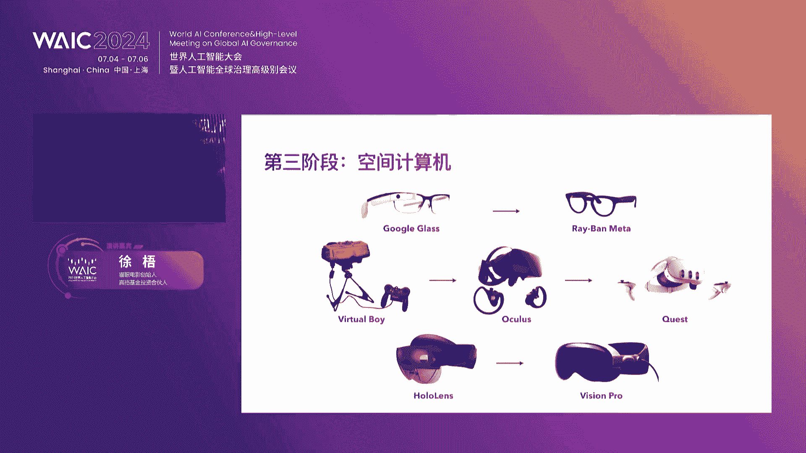
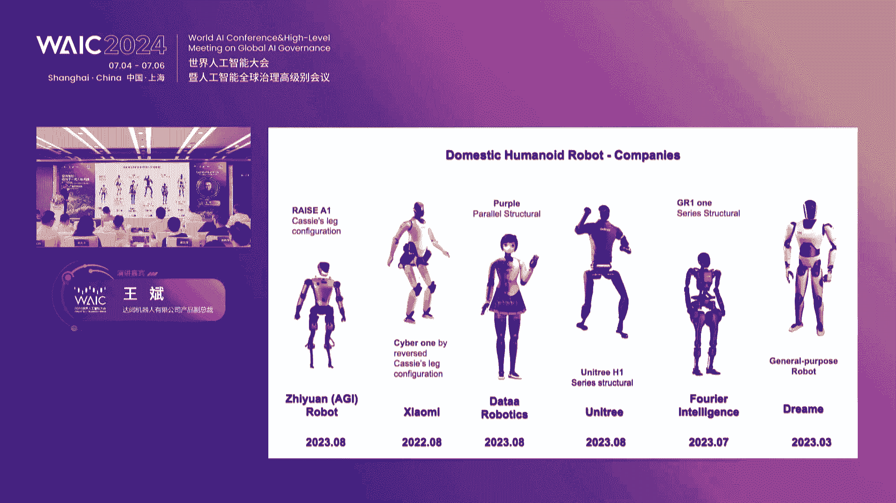

# P68：20240706-空间智能：迈向下一代人机共融——【AI预见】产业高峰论坛 - WarrenHua - BV1iT421k7Bv

好，此处可以有掌声哈。😊，各位领导，各位嘉宾，各位在线的小伙伴，大家下午好。我是今天的主持人，来自于复旦大学智慧城市研究中心的邱素川。

那么下午呢将由我来和大家一起探讨今天在空间智能迈向下一代人机共融当中，我们究竟能感知到什么？我们能够认知到什么，我们能够采取怎样的行动。那么这个题目，空间智能呢，其实是受两个重要的呃学者的影响。

给我们提出的这样一个命题。第一个大家都知道来自于斯坦福大学的李飞飞教授，最近提出关于空间智能的问题。另外就是我们现任的科技部部长，啊，吴朝辉院士所提出的四元社会的构想。

我们一直坚定的相信今天的AI技术的爆发，不仅仅只是在二维的平面互联网当中去降本增效。我们相信人类文明之所以能够不断勇攀高峰，是在于我们对高维度的探索。因此，我们斗胆提出了空间智能迈向下一代。😊。

🎼人机共融这个命题。那么基于这个命题，我们今天邀请了很多的专家啊，很多的企业家共同来探讨这样一个我们认为前沿性的话题啊，所以欢迎大家来到空间智能迈向下一代人机共融AI遇见产业高峰论坛。

当然一开始咱们还是不能免俗，要介绍一下今天来参会的各位重要的领导和我们的嘉宾啊，第一位要介绍的呢是我们东浩蓝生会展集团股份有限公司的总裁毕培文毕总，大家掌声欢迎。😊。

🎼那么第二位呢是来自于我们浙江大学求视特聘教授南湖老机交叉研究院常务副院长王月明教授，大家掌声欢迎。🎼然后下一位呢是我的老师哈，复旦大学教授博导呃联盟学术委员会的主席。

也是我们复旦大学智慧城市研究中心的主任刘红教授。🎼欢迎林宏教授。🎼那么下一位是我们的猫眼电影的创始人天使投资人真格基金的投资合伙人徐务徐总。

🎼那么下一位是我们科大讯飞星火大模型技术解决方案的副总裁吕旭吕总。🎼然后是我们达踏机器人有限公司的副总裁王斌王总。🎼另外我们还有两位今天这个圆桌主持嘉宾啊，一位是来自于杭州市人工智能学会的副理事长。

浙江大学计算机学院的副教授金小刚教授。🎼还有我们来自于nex pin的创始人范哲先生啊，范哲先生要稍微晚一点到哈。那么除了咱们这些演讲嘉宾之外的话，我们还有很多来参会的领导哈。

包括我们啊要隆重介绍的上海市创投协会的会长王品高会长，大家掌声欢迎。😊，🎼上海市服务消费促进会的常务副会长范林根会长，大家掌声欢迎。🎼还有我们今天一会儿要代表联盟示范签约的哈豆中国区的总经理林先建先生。

大家掌声欢迎。🎼以及一会儿我们要参与研多讨论的我们的上海交通大学设计趋势研究所所长副总教授。🎼以及我们浙江大学。🎼呃，上海高等研究院科研管理的负责人朱晓军老师。🎼哎，他正好是接楼院长去了哈。

我们稍等他一下，以及我们上海大学管理学院的副教授啊，我们创新高质量研究中心的副主任贾银亚教授。😊，🎼我们上海市创投协会数字科技专委会的于斌主任。

🎼以及我们一会儿我们待会儿要请请上来的我们的这个联盟的学术指导单位，华东电信研究院高级顾问洪泽坤先生。🎼中国计算机学会上海企业工委会的副主任杨琳娜女士。🎼那当然还有今天的主办方之一。

我们东浩蓝生元素科技的CEO郑翔先生。🎼我们拜伦文化的传媒的创始人赵平然先生，他要等一会会儿到哈。对，哎，我们的这个娄院长正好刚刚到哈，我们正好介绍到这里。

那么我们再次要隆重的介绍我们今天大会的主办方之一，浙江大学上海高等研究院的党委书记副院长呃，娄华良先生，刘娄教授好嗯。😊，🎼那么正好嘉宾已经全部介绍完了。那我想今天除了咱们已经介绍的，因为时间所限。

不可能点到所有的咱们的好朋友哈，大家也海涵。那么在今天这样一个大会上面，我们群线必至无外乎就是希望在空间维度的展开当中去探讨人工智能在未来究竟有怎样的产业的可能性。那么这是我们今天研究的核心话题。

那么这个会议如何开好。我们一开始还是要邀请我们东浩蓝生会展集团的我们的毕培文毕总来给我们做开场的致辞。欢迎毕总。😊，尊敬的各位嘉宾。各界朋友们。欢迎来到火热的人工智能大会。

我是本届人工智能大会承办方东浩蓝生会展集团的毕培文。那么首先感谢大家来到大会的现场。作为全球最具影响力的人工智能的盛会呢。WAIC本次汇聚了来自全球各地的顶尖的专家、学者和行业领袖。

我们共同探讨人工智能领域的最新的发展和应用的场景。旨在通过交流与合作，推动人工智能技术在各行各业的应用和深入，助力全球经济的可持续发展。在今天的高分论坛。

我们将围绕空间智能迈向下一代人机共融这一主题展开深入的探讨。空间智能和人机交互，正以前所未有的速度变革着我们的世界。影响着从制造业到服务业的各个领域。作为一家致力于推动会展行业创新发展的集团公司。

东浩蓝生深刻的认识到，人工智能和空间智能将对未来的产业发展带来的巨大机遇。东浩蓝声正在会展业务当中探索应用人工智能技术，如虚拟现实、增强现实和大数据分析。为我们的掌商和观众带来全新的体验。在未来。

我们将继续加大在人工智能领域的投入，推动更多的创新项目的落地。我们相信通过不断的创新与合作，我们能够助力会展行业在全球人工智能产业中占据更为重要的位置，为全球经济的发展贡献我们的力量。

今天的论坛群贤必至，汇聚了各个领域的专家。他们将分享最新的研究成果和实践经验。为我们展示人工智能在空间智能和人机交互领域的创新应用。最后，我们感谢浙江大学上海高等研究院。人工智能与原宇宙产业联盟。

低标马克共同来主办此次空间智能高峰论坛。也希望大家在此次论坛中收获满满。让我们一起推动人工智能技术的发展与应用，共同创造更加智能与美好的未来。最后也祝愿本次论坛圆满成功，感谢大家。🎼好。

谢谢毕总的致辞哈。接下来我们有请今天的另外一个重要的主办方，浙江大学上海高等研究院的党委书记副院长、娄院长来给我们本次论坛做开场致辞，有请罗院长掌声欢迎。😊，尊敬的各位来宾，大家下午好。

在这个热情罗虎的7月，我们汇聚在充满活力的上海。共同参与今天这样一场就人工智能的盛会。今天的产业高峰论坛由上海人工智能与原宇宙产业联盟东浩蓝森袁素，还有就地标，包括我们上海浙江大学高等研究院共同来举办。

那么在此呢，我也代表就是上海高院现远远道而来的嘉宾表示最热烈的欢迎和最诚挚的感谢。人工智能作为当今世界最具革命的革命性的技术之一，正在深刻改变着我们的生产方式、生活方式，乃至于我们的思维方式。

从智能制造到智慧医疗，从智能家居到智慧城市。再到我们今天探讨的主题，空间智能人工智能的应用，已经渗透到社会的每一个角落，展现出无限的潜力和广阔的前景。

本次高峰论坛旨在汇聚专家学者和产业精英共同探讨人工智能的最新发展趋势。技术突破以及产业应用。我们希望通过深入的交流与合作，推动人工智能技术的创新与进步，促进产业的健康发展。今天的会议呢。

我们有幸将听到来自不同领域的专家学者产业精英的精彩演讲。他们将分享自己的见解和经验，为我们打开新的视野，启发新的思考。同时呢，会议还安排了两场圆桌研讨和互动环节。

我们也期待大家能够积极参与共同探讨人工智能产业的未来。今天机会也难得啊，借此机会我用两句话简要介绍一下浙大上海高一院。这大上海高院呢是上海市和浙江大学合作共建的重大科创平台。

重点围绕计算家AI的基础理论、模型算力、学科交叉赋能应用场景的功能布局，目前构建了1加3加X的全链条创新生态系统。我们也热情的期待。通过本次论坛。能够搭建起一个长期合作的桥梁，促进各方的共赢发展。最后。

预祝本次人工智能产业高峰论坛圆满成功，谢谢大家。好，谢谢罗院长啊，两位领导为我们今天大会啊开了一个非常好的头哈，也给我们整个大整个论坛的这个基调做了一个很高的定位。那么接下来的话，我想我就不啰嗦了哈。

因为我的小伙伴老师提醒我说作为主持人，你不要超时。对，所以接下来我们还是快速进入到这个嘉宾的分享环节。我们第一位请出来的嘉宾呢。

是我们浙江大学大学上海高等研究院的常务副院长浙江大学计算机学院的党委书记啊，吴飞教授，当然吴飞教授今天以一种特殊的方式跟我们见面哈，他正在教育部开一个重要的会议。啊。

他我们曾经跟吴飞教授讲说能不能录一段你的讲座给我他说不行，我们一定要有现场的连线感，这是一个互联网的空间，我们要在4元的空间当中进行对话。那我们一定要有这种现场感。

所以接下来的时间呢交给我们远程远远远程的这个吴飞教授他带来的演讲题目。😊，不是迈3元空间在迈向人机共融时代的成体成物。那么现在在线上有请我们吴飞教授。吴飞教授能听到吗？哎，吴飞教授。

您的那个麦克风要打开一下。哎，吴吴教授，您能听得到我们的声音吗？你的那个麦克风没有打开。哦。对。稍等一下哈。对。😊，音频要切过来一下。这充分说明我们的基础设施建设还需要一定的努力哈。对。

虽然我们今天探讨未来，但是也意味着今天我们的基础设施建设还有非常多的路要走。😊，我们后台还需要时间来进行调试吗？现在可以了吗？不限有。开一个话筒。呃，如果后面时间还要调试的话。

我们有可能演调换一下演讲嘉宾的顺序。控台给我一个信号。吴老师吴老师，您您现在可以可以了吗？王老师，现在可以开始了。我是来自浙江大学的吴飞。我在讲话吗？声音可以再大一点，已经听到声音了。可以的。

你继续你继续。好，那我就开始了哈。😊，很荣幸啊，今天在AI遇见产业高峰论坛上用20多分钟的时间给大家汇报一个题目，叫做在迈向人机共融时代中成起成雾。我们知道人工智能的这个早期啊。

它的发展就是以战胜某一领域的人类专人类的职业这个选手为主要的目标。先后出现了一批战胜人类顶级专家的人工智能系统。比方说这里给大家介绍的深蓝。森楠在1997年5月击败了国际象棋冠军卡斯帕罗夫。

当时卡斯帕罗夫被击败的时候，说出了这么一句话，说我的梦我的面前有一种新的智慧。那这种新的智慧是什么呢？信息论之富相浓，曾经对国际象棋比赛中诺子选择的数目进行了分析。他得出了一个结论说。

国际象棋糯子总数大概是10的120次方种。那深蓝为了战胜卡帕罗夫，他必须在很短的时间里面，从1的120次方总的诺子中选择一个最佳的诺子。那卡斯帕罗夫所言的这种新的智慧。

就是被称为深蓝的算逆智危和减知搜索之巧。当时的深蓝是世界上运行速度最快的计算机，它一秒钟可以计算2亿次的诺兹。但是一秒钟计算两亿次的诺子，面对十的120次方的这一个诺子的这个空间。仍然是小巫见大巫。

为了克服快速从十的120次方的落子中选择一个最佳的落子出来。那个时候，人工智能一种搜索算法被称为阿尔法贝塔简直搜索算法就被。这个设计出来，所谓的减资搜索就是面向一个浩大的搜索空间。

我们不需要把每一个搜索的这一个空间都把它便利一遍，而是把大多数不必要的搜索空间把它移除掉，只具搜索一小部分对搜索结果产生影响的这个空间。因此，阿尔法贝塔减资搜索算法的引入的话，使得深蓝。

能够在以这一个极短的时间里面，从十的120次方种来选择一个最佳的诺子，战胜卡斯帕罗夫。因此，我们说卡斯帕罗夫所面临的一种新的智慧，就是率利之威加搜索之巧。2016年3月，阿尔法狗也战生了你4实。

也让我们重新思考人工智能，它和人类智能之间的这一个胜败之分。那阿尔法购是如何战胜这一个李世石的呢？在2015年的下半年，迪曼为了战胜人类顶级的围棋九段高手。

他们把已经发生过比赛的6段到9段所有的这个棋局都把它收集下来，总共收集了16场比赛。他们把每场比赛中黑白相间的这个诺枳所形成的一个。局面都拍成了一张一张的图片。得到了2900万张图片。

然后把这2900万张图片都打上标签，及对于某一张图片而言，下一步诺子在哪里，以及这一步落枳是好诺子还是坏诺子。因为比赛已经结束。所以说每一个下一步的诺枳，也是下一步诺子的优劣，都可以被这一个打上标签。

那对于这2900万张图片，阿拉法购输给了一个叫五层的卷积神经网络。我们知道卷积神经网络它的最大的特点就是对图像视觉信息进行这一个表达与感知。那这一个卷五层的卷积神经网络。

他把这一个黑白相间的齐面都进行了精确的感知。然后再做出一个决策，这个决策就是我们的标注的这个落枳的这一个手段。于是给阿尔法狗看了2900万张图片，然后再给他看2900001张图片的时候。

这个阿尔法go就会下棋了。他通过对2900万张图片的归纳、总结、推理等方面，形成了它的这一个概率输出的模式。迪普曼的公司非常激动，他们请来了欧洲业余围棋赛冠军樊辉，他相当于两段的这个水平。

结果当时的樊辉不会吹灰之力，就战胜了现在的阿尔法狗。迪普曼的公司非常沮丧，他们觉得他们给了当时的阿尔法 go葵花宝典。但是当时的阿尔法 go连职业两段的这个选手都未能战胜，情何以堪。科学家们的研究表明。

在围棋比赛中，阿尔法狗每次落下一个棋子，它不是单纯，只是预测这一次的弱枳，而是要去预测这一次落子所后面形成的15次落枳或者二次20次落子所构成的这条路径是否是胜利之路。也就是说。

阿尔法狗它不是预测一次落子，而是去选择一条路径。请问对于361个方格所形成的围棋的落枳的这么一个局势。有多少种落枳的路径可以被选择。科学家们给出的答案是无穷多。

也就是说你2900万纲无像所构成的棋谱和无穷多次的这个落枳的这个路径相比，完全是小巫见大巫。那怎么办呢？这个迪普曼的公司就找到了第二个法宝，就是叫做围棋的自我博弈，把现在的阿尔法购自我拷贝一份。

形成两个臭脑子的阿尔法够。这两个臭脑子的阿尔法够自我博弈，一天能够赛200场比赛，很快进行华山论剑，就到达了九段的水平。当然我刚才又说了，诺枳的这个胜利之路是比宇宙的原则还多。

这个时候简资搜索算法也无能为力。阿这个d曼使用的第三个法宝就叫做蒙特卡诺数搜索。蒙特卡诺搜搜索是一种采样的搜索机制，它能从比宇宙的原子还多的诺子空间中。

通过以概率采样的形式来找到每一次诺子它的必然出现以及这一次诺子后续的诺子必然出现的概率。于是在这三架马车的加值之下，及深度卷积神经网络感知体面诺子。强化学习窥之对手的策略。蒙特卡诺斯搜索查阅无穷空间。

在2016年的3月份，阿尔法go以4比1的比分战胜了李四试。所以大家可以看到呀，在人工智能发展的漫漫长河里面，人工智能的研究者始终把人类做成了一个这一个对比的对象。他们总是希望战胜人类，就是人工智能的。

成功之处。但是我们知道人工智能永远是人类的好朋友，是人类的帮手，是人类的工具。我们应该去欢呼人机共融时代的这个来临。而chaGPT的出现，就为促进人机共融提供了更好的手段。他GPT出现的时候。

很多科学家说，人工智能已经进入了iphone时刻。怎么去解释这句话呢？2007年，乔布斯发布了第一代苹果智能手机。经过近20多年，移动互联网的发这个进展。我们所有的这个信息流量都进入了这个智能手机。

我们每天生活工作出巡娱乐消费。等等等等，都是依靠手机上众多的APP来完成我们需要完成的任务。那么科学家们就在预测，从移动互联网时代迈向人工智能时代，所有信息流量的入口在哪里？

他们认为是以chat为模式的人工智能系统。因为人和人交流的最好的方式是自然语言。如果一个人工智能的系统能够让人类通过自然语语言就能很好的交互。而不是通过鼠标键盘图形界面。

甚至不用通过恐怖的编程语言庞大的计算系统来进行接触。那我们就进入了人工智能的iphone时刻。而以cha为核心的GPT就使得人和人工智能之间的这个交互变成了犹如通用交互的模式。也就是说。

为通用人工智能打下了基石。当然我们必须明确哈，GPT目前的这个智能能力并没有达到通用智能的能力。而是仅从交互的手段上来而言的话，我们觉得已经有点这一个和人进行交互的这样能力的出现。那GPT是什么东西呢？

英文的这个GPT是三个字母构成。第一个叫生层式，所谓的生层式及GPT所产生的内容都不是搜索得到的，是它合成出来的新的内容。所谓的预训练及P就是指我们预先训练的一个模型。这个模型可以去预测下一个单词。

所谓的transform是谷歌公司2017年在一篇注意力，就是你所需要的文章里面提出的一个神经网络的称呼。他们说我们设计了一种新的神经网络，我们把它命名为transform。美国有部电影叫变形金刚。

它的英文名字也叫做transform。所以大家可以把transform理解成是一种神经网络。而这种神经网络是有点像大便活人一样的魔镜。你只要以chat的形式，输入任何的输入。

它总是能变换出和这个输入相关的输出。那为什么GPT有这样的这个能力？因为谷歌公司说，我们在这种新的神经网络里面引入了一种新的机制。这种新的机制叫自注意力机制。什么叫支蛛义机制，以自然言为例。

就是让每一个单词肩负起自己的责任，让他记住和其他哪些单词一起出现。比方说我这里有一句话，项装舞剑意在沛空。如果大量的自然语言里面都出现了这样的语句，那么五剑这个单词就肩负起自己的责任。

他和项庄沛公驿战这些单词共生概率最强。如果每个单词都肩负起了自己的责任，记住呢在哪些上下文之间，他们的共生概率最强。那么内容的合成就变成了先对我们信息空间进行概率压缩。

然后再对概率压缩的这个结果进行概率的合成。比方说先输出了一个项装，请问在某些语语境之下，哪个单词在相装出现之后出现的概率最大，那就根据我们预先计算出来的在那些上下文中与上相装出现概率最大的单词。

就一个接着一个一个接着一个被合成，这就是自锥义机制要达到的目标。那么GPT刚提出来的时候，强制form的参数是13亿参数，把它进行训练也是一个非常这一个困难的事情。

那open AI采用了三版虎头进行训练的模式。第一版虎头，我把它称为完形填空形式下的文字接龙。也就是说，大量的数据输进去，任意的去除一个单词，让transform预测这一个被去除的单词是什么？

如果每一个被去除的单词在它的上下文语境之下都能被重建出来。那么我们就说每一个单词的上下文语境的这种制注意机制被学习出来了。这一个预训练模型就可以很好的去预测下一个单词。

如果一个神经网络只能预测下一个单词，那么这个神经网络也没有很好的这个用处。我们需要让神经网络说人话，做人事。如何达到这一个目的呢？科学家们就提出了有监督微调的方法。也就是说，我们告诉神经网络一些命令。

让他完成这些命令。当然神经网络肯定无法完成，我们就告诉他答案。比方说我要求神经网络回答这个问题，本院查明被告人酒后做了什么事情，请分析案情，这是我要他完成的命令，他无法完成。但是我就告诉他答案。

根据上述内容可以认定本案的核心要素包括什么东西，大家可以看到，叫做我教你学，或者我说你答。科学家们发现，只要给出了20到30个左右的例子之后，transform就可以把预测下一个单词的能力。

迅速的加以组合跃深，形成更加复杂的勾阶能力去完成万千的下游任务。这好比中国的一句古话，金师易德人师难求。高超的老师总是会给出更好的这一个问题的这个例子，让学生们在完成这个真实的例子的过程中。

他们的能力基本能力不断的被综合形成高阶的能力。最后可以把这1个GPT把它这个共享出来，让大家进行这个使用。于是吃百家饭，穿百加1，一个能够回答万千任务的这1个GPT就被训练出来。

GPT的这一个生成是新一代人工智能背景下，数据是燃料，模型是引擎，算力是加速器的使然。无数据不AI我们要让GPT合成内容，就必须把我们所有的信息空间的数据输进去，让他记住每个单词共生的概念。

那如果没有一个庞大的模型，没有一个众多的这个参数，就无法刻画每个单词和其他单词出现的上下文语境。所以这一个transform这一个神经网络，它包含了1750亿的这个参数。

把每个单词在哪些上下文语境中和其他单词共献的概率把它计算出来。然后再用强大的算力，把这些参数与数据进行拟合。所以GPT是大数据大模型大算例下以共生则关联实现的统计关联关系的挖掘。

那从chat到sra又发生了什么故事呢？今年初这个这一个春节期间，我们看到只要输入一句话，比方说日本东京街头走来了一个时尚的女郎，她在雨后的这一个街头和霓虹灯交相呼应。大家看了没有？输入一句话。

他要输出这句话所对应的饰频，实际上这是非常困难的。因为这是两个不一样的东西，虽然他们表达同样的概念。那大家看秦始皇如何解决这个问题。秦始皇说，书同文车同轨。也就是说。

所有的这一个这一个这一个文字表达的不同的内容，那我们把它就统合起来。让他不同的这个文字，就用一种文字表达同样的内容。不同的这个车子有不同的距离，都是运输工具，我们就让它同轨起来来做同来完成它的运输工具。

就疏同文车同轨，就是把图像和单词投影到同样一个这一个空间来挖挖掘他们之间的上下文语义。然后在挖掘之后，他们的观联之后，再通过鲁班协议去合成我们需要合成的这个视频。也就是说，先破坏再综合，再破坏，再综合。

知道这个视频合成的内因，最后把它放到我们的这一个这一个原始空间来进行合成。我把它成为行同轮。那在今年的这一个元宵节期间，文汇汇报希望我写一篇科普文章来解释说拉后面的这个激励。

我后来写了一篇几千字的这文章。文化汇报在端午节那天把它发表出来。这篇文章的题目叫做说拉的超级涌圈力，将把人工智能带向何方。在这篇文章里面，我解释了说拉背后的这个原理。

呼吁未来将是人与人工智能共同进化的时代。人工智能人类始终是人工智能的总开关。当然我们也要正视深圳式人工智能带来的巨大影响。他的很多的这个方面都达到了人类同样的这个水平。

它的本质就是对合成内容中最小单元进行有意义的关联组合，犹如昨日重现，对单词有意义的线性组合就是句子。对像素点有意义的空间组合就是图像。对时空指块有意义的时序组合就是视频。当然在合成的过程里面。

因为全是概率合成，就会产生一些这一个失误。那open AI他们认为。过去70年人工智能发展给他们带来的苦涩的经验。他们现在唯一感觉到的就是想办法利用更大规模的算力，总是最高效的手段，及规模法则。

要重现卓夜就得把卓业全部装入我们的神经网络，装入的卓业越多，神经网络变得越发复杂。所以算力的要求就越高。于是现在就形成了黄色算力的这一个规模。这个人工智能GPU的算力，现在每隔3个月会打爆一次。

那这种这个算力和神经网络的这个结合，就是在输入和输出之间建立起了一个非常复杂的非线性的这个关联来实现从输入到输出的之间的这一个这个关联。就好比我刚才讲的。transform就像一个魔镜。

因为它这个魔镜里面有强大的非线性映射能力，它能把输入和输出之间建立起强大的关联。那我们讲现在的大学模型都是解决这一个很通用的任务。它上知天文下知地理。在很多学科内的这个任务里面。

我们不需要他上知天文下知地理，而只需要完成这一个学科类的任务。所以我们浙江大学就最近开展了若干学科垂直领域大模型的这个训练。首先是一个叫做面向司法领域的自海论文。

在海论问是通过这一个浙江省高级人民法院审判已经结束的积累的大量的这一个电子卷宗来训练一个60亿参数的小模型，让他说司法的人话，做司法的人士，然后再让他完成司法的任务，然后再把它开放出来，让大家进行使用。

那自海论文，现在已经在浙江省高院、浙江省司法厅以及在摩达社区等开源。让大家。去完成只是完成司法领域的任务。由于我本人又负责了教育部101这个计划里面的人工智能引论这本这一个教材的编写。

那为了让大家更好的使用这本教材，我们和我们和高等教育出版社阿里云华疑计算联合打造了一个叫自海三乐的人工智能课程的垂直领域大模型。同学们在学习这门课程的时候，老师们可以用大模型来进行创造性的教。

学生们能够用自海三乐进行个性化的学。同时，还有面向金融领域的制海金盘，面向化物合成领域的跨媒体大模型。我们可以看到，如果我们把每个学科的这一个垂直领域大模型把它打造出来，如教育、司法、金融财会。

那我们所有的这一个垂直领域的大模型合起来就变成了一个力量非常强大的通用的学科大模型。那在把AIAgen的技术和大云模型，这个大脑把它关联起来，就让大云模型用了手和脚能够完成万千世界的更复杂的任务。

这也是最近为什么大云模型和智能体相互结合的一个研究的热点。今天的报告叫做迈向3元空间的这一个这一个这个人机共融的成级成物，实上人工智能具有技术属性和社会属性，非常这一个统一的特点。

就是在人工智能的这个时代，伦理不再是人和人之间关系。而是人与自己所发明的这一个人造物所构成的关联。所以我们必须更好的利用人工智能完成人类的万千任务。沈江大学计算机系成立于1978年。

当时成立的时候全籍招收了5个人工智能方向的硕士研究生，这硕士这5个硕士研究生都留校工作。当时留校工作的一位考生叫做王申康教授，他保留下来了准考证。这个准考证上面写的报考专业人工智能。

实际上当时没有人工智能专业哈，所这5位学生毕业之后授予的都是。计算机应用的硕士这一个文凭。但是，2018年，浙江大学成为全国高校35所首批招生的本科高校。2019年，在吴朝辉校长的这一个指示之下。

浙江大学建立了人工智能交叉学科。所以我们现在找到了2018年入学的本科生毕业的本科毕业这个证书，以及找到了2019年入学的人工智能博士生的毕业证书。

这里给大家展示的就是浙江大学发出的第一批人工智能本科文凭和研究生文凭。说我们非常感叹，何先在1978年给我们指明了方向。但直到2023年，我们才真正的让学生们拿到了人工智能的本科文凭和研究生文凭。

那我本人也在走进人工智能这个科普通识读物里面，也是这一个呃这个指出了人和人造物进行这一个成积成物的这个关系。在这本这个通识读物。请潘云科院士撰写这一个序年的时候，潘老师说。

未来将是人和人工智能共同进化的时代，科学普及将人类进化中累积知识转化为人和人造物的力量。今年3月份，浙江大学设立了人工智能教育教学研究中心，从今年9月份开始。

将会为每年6300名本科生开设人工智能通识课程。也就是说，人工智能在浙江大学已经成为了一个通识课程。我们认为，在人工智能时代，每个学生都必须树立起人工智能的思维，了解人工智能，使用人工智能。

去带动自己所学的专业方向的范式革命。为了更好的做好人工智能通识课程的这个教育教学。沈江大学现在已经开始这一个集结了100多位来自不同学院的这个教师。

按照理工农一类人文社科括号python人文社科括号无python语言来进行培训我们的老师在今年9月份给我们的学生讲授人工智能的课程。我们也发布了人工智能的这一个大学生素养红皮书。在这个素养红皮书里面。

我们希望我们的每一个学生要了解人工智能，使用人工智能创新人工智能恪守人与人造物的这个关系。通过我们的教材课程微专业辅修通识教育平台项目师资的完成人工智能时代的通识知识的学习与使用，最终成绩成物。

今天我就用30分钟的时间给大家介绍这么多。由于在外地出差，只能通过这一个互联网给大家进行现场的这一个直播，如有不妥，敬请包涵，谢谢大家。好，谢谢我们的吴飞院长哈。

那么在赛博空间里面给我们带来的一场主旨演讲啊。那么吴飞院长的题目呢叫成几成物，其实正好呼应了我们毕总一开始至此讲到的人工智能如何去发展，无外乎是为了为人创造一个美好的未来啊。

所以今天的人类必将面对的是人信息空间以及物理空间的3元空间的结构。那么我们刚刚也看到了在3元空间当中，未来一定会出一个新的新物种，我们称之为叫智能的机器人。所以人物理空间信息空间以及智慧的机械生命体。

将构成吴兆辉院士所说的4元社会的结构，这也是我们的体验哈，所以感谢我们的吴飞教授在远程给我们带来的开场的主旨演讲。那么接下来这一位呢我们也非常非常的期待。因为大家知道应该就是在上上个礼拜。😊。

微信pro在中国区正式发售了。所有去用过的小伙伴都有一个反馈，说好是很好，就是太重了。所以又展开了一轮新的想象，说，我们究竟要把一个这个这个镜片的东西贴在脸上。这是未来人机交互的最好的方式吗？

有人说应该不是。如果人可以通过脑机接口的方式，让信息世界和人的生物体产生更为精准快速和敏捷的这个交互，那似乎才是真正的人机交互的下一个时代。当然这个我们是看媒体文章讲的比较浅哈。

真正的科学家呢正坐在咱们台下。我们下一位有请呢就是我们浙江大学的求视特贫教授南湖脑机交叉研究院的常务副院长王月明教授给我们带来下一个题目叫意识之门脑机接口与下一代人机交互。大家掌声欢迎王教授。😊。

按有没有？喂喂。感谢邀请啊。嗯。题目改了，换了那个意师之门，这个我做研究的不敢讲那么大的话题，我就讲脑辑接口这个话题嗯，跟人际交互，那完全是匹配的。嗯。从基础概念来说呢，脑子接口呢非常简单，他就做连接。

连接有三件事情，信息读出也是可以信息输入也是可以。但是最理想的呢输出输入做一个协调，人就是输入输输输输入做协调的。我当我控制这个手在动的时候，我这个余光啊。

随时随刻 tofe back到到到我的大脑里面，我有没有做对这个动作是吧，这就是双向的呃自身音的融合。是最理想的一个状态。所以他要大脑跟外部之间之间实行形成直接的通路，然后实现读入跟输出的一个呃就是。

最理想的是一体化的一些操作。那么这件事情呢，一定要讲一个分类的。必须讲一个分类，否则呃会会混淆很多概念。脑机口呢他有非禽录跟情录两类啊，非禽录两类的从业人员，他的说话的语境、上下文。

他的频道都会有很大的差异。那当当他他说一个概念的时候，如果再说一类的时候呢，他其实在在另另外一类可能远远没有实现。再说B类的时候，再回到A类里面呢，也是也也是非常不清不清楚的这个话题。那么总体来说呢。

需要看的是这个信号的获取，这是一个颅骨方向，这些是神经元。那么非潜入式呢是在头盖骨无创的头盖骨之外去获取信号。一般来说，经过头盖骨。硬脑膜软脑膜以外。

cortex或者更加深部的信号网外面传呢会它的分辨率会大在5毫米以外，它的频率在50赫兹上下左右以下是乃至。那么颅内的。打开颅骨以后呢，它可以在这个硬脑膜表面去获得这个颅内的脑电。这个信号呢也是嵌入式。

这个信号质量会得到很大的提升。嗯在毫米级。乃0毫米机以下都可以做到，它频率会达到500赫兹这么一个频率，信号信号量肯定更丰富了。那真正神经元之间传递是什么呢？传递的是一个叫做sspax的东西。

叫做风电位。就说两个神经元之间啊，我是。触触动他下一个罚放或者抑制他罚放，他就是这么一个监峰。过段时间来个接峰，过段时间来接控，非常离放的信号。那么这件事情呢是大脑里面工作神经元之间工作的一种模式。

信息传递一种模式。那这个频率可以达到多少呢？至少可以到达到10K赫兹，20K，最高可以到50K赫兹。所以可见这个频率在真正传播的这个信号的这个嗯产率达50K赫兹，频率可以十十几个K赫兹啊。

这个信号是非常dance啊，非常密集啊。特别在sequcrial这个持续这根线上面是非常密集。😡，所以里面的信号非常丰富，可以干很多事情，但是他要开炉有创外面的信号呢它非常非常薄，但它可以非常做到无创。

无没有没有伤害。那么各有一个代表人物啊，我做的是这个。请入式这块非侵入式这块我今天也不会讲这个话题，今天就讲请入式这个话题。好，请入室话题最早上啥什么时候呢？

在1950年的时候NIH当时呢在猴子里面植入电极成为第一个概念脑性脑机结口。当时脑机结构这个名字还没有到70年代末的时候呢，这个工作第一次让猴子可以控制这个液晶光标左右左右移动。

那当时的电机长成这个样子，一毫米左右，非常非非常粗糙。但是尽管是这样的电机在那个时代已经只有像NIH这样的机构才能推动得了。任何一个高校机构都没有能力，跟没有资源去推动这件事情。那么到70年代末的后。

实现这么一个系统以后呢，到80年到95年这1多年时间呢，研究基本上是没有进没有进步。原因呢就是因为这样的电子器件不够好，太太弱了。到90年代中期的时候，纽约州州立大学全平教授呢。

他发明一种这样的一个电子长成这个样子，叫威斯。威斯电子呢可以植入大脑记录时期，信号达达到数月时间这么长。那么。又细相对来说伤害又小又安全，制度时间又长，好几个条件都满足了。脑这些会研就开始兴起了。

基本上90年代到现在，这二三十年时间有一堆的。比较前沿的发现。一堆的比较先进的一些技术来突破报直到2017年，马斯克把这个话题向全全全人类打开了。马斯克他就有这个能力啊，确实让让人特别佩服他。

我我我自己也看了他的那个自传啊，我觉得他有个有有一个能力特别啊，不是。在纷乱复杂的技术体系里面，它有一种嗅觉。这些什么样的技术组合，最最终是可以work的，有可能可以work的。

哪怕是那些技术起起起步可能都不是都不是那么先进，没有关系，但他们的组合可以work的比较好，这种感觉非常灵敏。非常非常灵敏，这是我这看之前也有一个。人在澳张时候也有个坐航天飞机的。

也有类似的这么也是类似这么一个风，坐坐飞机的设计设计设计飞机的也是有类似这个风风格。好，回到脑机接口啊，这个就不讲，美国对我们进行限制，那它有什么用呢？我们我们讲嵌动式导接口啊。

非嵌动脑结口的应用我都会会扩展一下，有六大应用技础产业。我现在可以说一下技础产业，严肃医疗保健康复啊工业的虚实虚实操控嗯。😊，军军事应用。

然后这个文教卫里面也有一些扩展的一些便捷式的消费电子的一些应用应用体系。这是之前那么寝入室这一块呢，基本上医疗保健是一个很重要很重要的模区块。医疗保健里面有三大体系，运动康复感知觉恢复跟脑疾病治疗。

那智能强军里面呢，包括人机合一的阿凡达这样当时未来了。那现在没有。但但外骨骼的一个一个增强体系跟对跟部队的里面士兵的增强。肯定是其中一块，士兵意志力的刚预跟增强也是一块。

我为现在站在啊士兵其实压力非常非常大。比如说那个战斗机飞行员啊在飞动过程，我们虽然有很强的坚尖坚手65歼20这这么但他在斗争过程中压力非常非常大。但这个涉及到一个表一些保密话题，可能不能展开太说的。😊。

就是把我方的战斗人员的意志力增强，把敌方的战斗力意志力打破。这是在神经刚预里面嗯，包括包括电子刚预里面也也是一个很重要的一个话题。盗木机器人，哎呀，对不起。那么动物机器人呢，其是其中另外一块。

通过动物机器人这样便携的方式呃，进入双方战场里面去做一些搜索侦查跟爆破的任务。那这也是今天这个话题最连接的，就希望到下一代AR里面把这个脑机智能融合在一起，就像阿法达克机械战警一样，做一个完全的融合嗯。

这样会有非感觉感觉是这是未来的未未来的社会的一种模式。是的，这个是现在有有很多很很很有很多不同的观点啊。那么现在呢我呢我让大约也可以说一点这个话题。😊，我支持人工智能的背景，我博士人工智能毕业，然后在。

也是MM labb比较有名的一个实验室，香港中文大学的实验室，唐小教授的实验室做的人工智能10年的时候对是这个然后10年回来的时候就跨到脑机结口里面去。我去年可也说过类似的话题。

我刚到脑脑论当6年刚发了 learning就可以反复层层的训练个论文当非常好的时候，那我去做脑合交叉研究的时候，不愿意。嗯，当时那个t这个词也不认识，就是那个跟脑机交叉学科相关的那个论文都没法看。

当时我人工人工智能当时我有一个长者跟我说了一个话题啊。😊，就说一个国家的。民工业体系民体系非常广泛。那这个国家的国运啊不只在。😡，智能这一块上面它有很广泛的体系，有材料，有工业，有制造。

有有有有基础设施，有非常多广泛。如果交叉学科介入呢，它会有更宽阔的空间，可能这个领域有点热啊。如果说你去扎堆呢，能做好，当然最好了，那做的不好呢，他会进争进争很极烈，是不是？可以有更。

用人工智能这样的发展的思维去做别的交叉领域。那么开始我我我我我肯定点头了，因为是。那个是吧，那我心里肯定是不同意啊，那做着做着呢，其实在交叉领域里面，我慢慢慢慢慢慢进去。因为我我我从从这个书看完以后呢。

我大脑知道一些结构了。然后我原来原来人工智能的知识上去模仿这个智能的里面发碰到的一些问题呢，跟我跟大脑的。😡，功能跟结构呢结合在一起。然后我跟神经科学的人神经生物学的人在一起呢，我也学到他们一些。

我能听得懂他们的语言了。所以我刚才我想补充一下，刚才吴飞老师说的，就是其实阿做完以后， mind我当时我感觉啊很重要的一个观点是什么呢？就是。😊，做这个研究的那个科学家，他不但是人工智能的从从业者。

其实他对围棋构物这件事情他就比较懂的，他是是不是气断嘛。我印象中是吧？所以这样他只有在这个技术里面非常了解那个领域里面又真正的比较懂绝对不是说做下来两个人聊一聊就可以交叉了。不是这样的。

就是我能懂对方在说什么。他问题的特点，这样才可以深度的进行交叉，这是我做这个脑结构的观点，因为我开始也想我掌握人工智能算法嘛。你们你你你们给我提供问题，我来给你做做计算，这个是交叉了。

但后面我发现这件事情只能是浅尝直折两张皮只有真正的进入对方领域以后，你才听懂对方说的问题的特点，听得懂对方想表达的真正的意思是什么。所以这个。是一个大概的配背景，我一点补充。

那么我下面讲请路是脑机真正的技术技术的光要要点啊，基本上呢脑机结口就这么一个环，从信号的记录读出到信号的出入，跟外部设备的一些关系，信号的解析外部功功能。

根据外部的设备呢搭建这个应用系统以及外部的信息怎么样把大脑里面去传这业务上是四大块，我们就按这四大块来来来说这个国国际国外的情况，首先是记录马斯克肯定是逃不过的话题了。整个侵入式的软硬件水平呢。

基本上有两条技术路线，一条是由他轨轨机，一条是楼心电机楼心轨机路线呢，这是目前为止FDI approved的可以用在临床上面的唯一的一个马斯克当然也也伦理是过了，可以特批他可以做这个事情。但事实上。

就是说我们临床里面可以用有它是一个长成这样的很小4乘4。十根针十寸十根针，这个信号非常好到目前为止7年都可以长期记录信号。我们用的也是这个我们用了十多年了。嗯，那他这个发展过程啊。

你看人类猴子鸟类一水类。十几种几十种动物里面做了反复的测试跟测算，至今仍是唯一一个。而柔星呢以马斯克为代表楼星呢，我们国家也有很多人在一起在跟跟踪研究，包括我们自己也在做一些。它的好处呢其实就是说。

柔性给人的感觉，通道数非常多，它可以有有有更低的大更小的大脑伤害。脑的伤害。那事实上呢，这件事情呢有三个关键词，一个是叫 multiple channels多通道记录。

这肯定是的第个呢叫ronic去可能我也提这个话题。第三个呢叫做t就是我要用这个电极设计呢我既要多通道，我要长期记录ronic非常重要。短期记录对脑机构没有任何用处。第三呢我要方便记录。

我不能说我做这个电机以后，我植入我要一天两天我才能完成一例。那我个最好一把头就能用而且微创是最理想的那这三个单词来三个要求来说呢，柔性目前是比较难达到的。😊，规机呢非常方便，拍进去的时候呢。

是一秒钟就可以拍进去了。气棒一拍柔戏呢是是用手术机器人来解决的。手术机器人就涉及到另外一个话题的，有多精多多强的精度问题了，以是出来跟进去的时候的关系。那么。目前呢吕楼这个话题呢很热，就。

美国的几个主要的大学都在在楼心的基底，超楼可拉伸的表面积贴片的，包括神经血管的电子，以及超楼网面状的电子里面去做工作。所以这是这是肯定一个趋势了。怎么样把楼性用的更便利，用的更安全，稳定性更高。

时间更长，这件事情还在研究，不像规迹已经做到了。我们国家呢这是国内的国内呢基本上我们也在做一些楼性东西。然后中科院临港实验室纳米院那北脑中心也是同一个微所上交通大学等等还有几家都在做这个事。

这个事情呢其实一个比较重要的观点，就刚才说的要兼顾ronic跟practical。多通道三件事情都要兼顾住。我个人观点啊，盲盲目去追求多通道几千几万通道可能肯定不是这个事。对我们需要兼顾的是。

有这个通道数的前提下，我能够长期的记录到信号。因为这个毕竟是神经电子，它不仅仅是微电，是不是电子。如果是精银电子的话，以我们国家的电子化水平。😡，做个10万20万通道，一点问题都没有。但是这样的。

10万20万通道能安全直进去吗？能长期记录到信号吗？所以他是要跟生神生物结合在一起做的。所以这是一个观点。我们目前我们国家呢做的东西呢，这些电子呢形状都有。但是真正在临床上用的都没没有展开。

没有真生在临床，我们自己做的啊。那我们在临床上当中做过浙江大学，我们买的是用的是人家的，由他由他而位自己做的电器，在临床上高密度的这一块啊。嗯，目前临床实验上我还没有听说过有开展的高密度的那个洪博老师。

新华洪博老师做的是那个e的那个贴片的电子。芯片国外的芯片成熟的芯片newlink有个洲微电子的加州还有洛杉矶理工的芯片呢目前请入成脑机接口的芯片呢，它有个很重要的要求呢，就是特别的低功耗。

为什么这是可以理解的。因为入成脑机最后的仪器啊，微型的仪器是要放到大脑里面去的。放到大脑里面去以后，大脑医疗器械一个很重要的要求，就是温声不能超过两度。功耗高，你是不无法接受的功耗高就意味着什么呢？

我要对它进行电池马上用完了，那我就要对它进行充电充电呢，我那么亮的电，我就充来不及充，我要反复充一天相当于长期在充这个肯定难很难使用的。所以低功耗是这个脑接口芯片的一个重要的非常非常重要的要求。

可以说是排第一位的一个要求。那么目前呢。我们国家在做的集成产品的飞离源器械的方都是买国买国外的为主。我们国家的。那个芯片啊也有一些科研芯片是一大堆啊。但是。很很不幸的是。

科研芯片在产品级的医疗器费用基本上都。都还用不上，现在那不够稳定不够安全。所以他的他的bug在哪里呢？就是我们国内芯片的稳定性稳嗯那个安全性目前都还没到。那那那现在我知道还是在做嗯。

然后我们跟新源上海的新源也也也也也在合作在做，我觉得很快就会有真正人使用的芯片了。嗯，那么就是大家在描述这个话题呢是一定要真实，就是我这个芯片很厉害。😊，嗯，但是我我想到我们国家现在需要的。

如果这个领域领域里面做的是需要的。哎，真正能用的芯片。对我可能性能不需要那么高，单项冠军不需要那么高。但是我我我我我是有余量的reundancy，有足够的保证他是在医疗期械内能用的。我想这样的话。

我们就不需要去买。买这个国外的这些芯片了。不括对，这是芯片的国内的一个状况。啊，仪器整合在一起的仪器基本上是买国外的形路这方面啊，有几个blacklock跟那个啊阿法欧米伽都很贵。

blacklock的那个 neural pot要要要200多万，那个阿法欧米伽基本上在就在要700万左右，我们买的是8700到80万，这个就是。研究脑机接口。

各种功能在树中都可以进行操作的FDI全部拿下的这些这些个仪器，我们我们国内都还不够好。那么系统集成做成微型系统方面呢？那嗯我们知道马斯克已经在，他不断在在推出上面发他的消息嘛，他已经在嗯。在那个。

人上去去做这个运动康复了。虽然这件事情并没有那么难啊，就信号拿到以后，其实其实不是这个硬件的问题了。但是他至少往人上去做了，可以做成一个微信系统。我我们如果有个微型系统直进去可什么都看不出来。

如果控制外面的装备可以动，这个可以动那个这个还是挺挺挺挺酷炫的。所有的残障人士我了解的情况，我接触情况都非常有兴趣的。只要任何一个能够增强他现在能力一点点，他都非常有兴趣。😡，嗯。

国外做这个情情况是比较精细啊，这是国内非常非常精细。应该说国内做的情况大概是这个样子啊，整体同样的形状个子会大一点。那芯片可能刚才说了，已经都都基本上是都用国外了。那么稳定性啊。

包括炉内的时间上长度啊这些事情呢。都还没有到位。但当前现在是一个重要的点。现在我们现在跟诊中心，我们呃我我们也去参与一起全面在讨论老机接口的三类的植入有有人医疗器械跟二类的康复啊。

包括无创的这械怎么去制定这个标准，怎么去构建这个体系，让这个件这个产品可以加速。那么各各个行业包括在工信部领导之下，各种的标准体系也都在都在推进好多个行业都在推这个事。所以希望能够形成更加准确的方法。

以指导产业界能够把这个。嗯，适合中国风格的这个产品跟做出来。那这个是这个话是什么内涵呢？比如说。集成这个微信系统里面有一项技术叫做汇通啊，汇通呢就相当于是。把多个通道的那个电机啊焊到这个主板电路上面去。

在我们国家呢1通100通道以下可以焊的马马虎虎超过100通道，我们国家没有一11一家单位可以做出来，至少按目前的调研到目前为止找过的。

那么这样的生产基本的生产支我们高端医疗器械果脑机构的医疗器械体系化的成长呢像美德像雅雅培像波科这样他们成体化我们这一块要全部的基术生产线呢肯定要提供提供的。

那么这些技术都要都要突破这些标准衡量标准怎么样去评价怎么样去定资质，这些都都得走过，我们才能够赶得上。这这就反映了我们国家的基础制造的工业水平确实比国外有非常大的差距。这一点呢。嗯，是必须承认的。

但是只要慢慢走慢慢走都能靠近。我觉得现在有一一堆的大家都很踊跃的来解决这个问题。哦。看一下时间。

那神经计算呢，这件呢，就是这这个呢，其实以我我我只讲讲讲2块啊，就是说。😡，绝对不是说硬件做完以后，神经大脑的功能就全部懂了，这肯定不是这么回事。每一种功能都会有不同的一个方法去理解大脑的工作状态。

以及神经信号的编编解码的一个方式。那因为这个知到一些一些介算模型嘛。而且针对不同的刚才说的不同的功能，它的呃算法的不同。同一个运动功能呢，它的大脑的动态性非常强。那么换句话说呢。

我们对大脑的理解还远远不够，是我啊一个工科工科的背景的人来说，我那我脑脑科学可能有神经科学他们的看法。那我的看法，大脑对大脑理解还远远不够。他的一个工作模式。

信息信息组加工模式怎么样就就就re怎么样stand out，怎么样在里面做加工的，这个都还不是太太那么清楚。但是我们可以从现有的数据基础上，把有效的某种功能的几个事情呢去探索清楚。大模型也不是合。

因为大模型。做但任何一个嵌螺式脑机接口，或者跟颅内相关的信号都不是那么容易获得或获得。大量的数据。这个这个呢我要说一个，因为我刚好人工智能，我知道大模型需要什么样的数据，他叫一个叫一个么呢？

就是良好对齐的同质的数据嗯什么？比如我智慧城市到处天到处录音里的得了那个可以把用大模智慧城构建出？行些数都都不结混乱在一起根本没有齐神经信号一样我不同的疾不同的采集位置不同位一点人集信号都不没有所都里面不能大模型行其实倒推机制来推动它的计算。

我们有一些工作，这个我就快速过了，因为时间比较久了，然后就是刺接输入应用应用系统。应用系统呢我想讲几块啊。第一块呢，脑疾病的治疗是请容是脑疾结构非常非常重要。

我可以说再说它重要就近5年5年5到8年非常重要一块领域。但整体的人人员格局来说呢，整个神经精神类疾病，全世界有10个亿以上。

全中国全中国光抑郁有9800万癫帕金森那个神神经神经类疾病它是250万还不算太多癫痫是950万抑郁9500万抑苗在增加，每年都在增加体量是非常非常大，全球就更厉害了。这一类神经性的疾病。

为什么脑疾结构可以解决的？因为一大批药物里面只有比比如说我我因为我我研究了几年了，抑郁这个事情啊，它只有几种药这几种药呢医生的诊断办法呢，就是轮流。到如果都没有效果了，那就糟糕了，比较麻烦了。那么。

本身抑郁呢在我的知识范畴里面，我也看了很多材料跟精神卫生科的人交流了，它是一个多类疾病的一个综合的名称，它不是一类疾病，它的机制呢有很多很多个好，那要去研发针对他这样点跟也就更难了。那么脑可干事？

对中毒的抑郁呢，可以在现有的靶点里面呢，如果找准以后呢对它进行干预呢就有可能改善一个异常恍路的状态。那么通过一段时间的事情呢可以产生让可塑性的良性变化，那么把它变好。

这个呢我们前期19加1的这个视力面经得到证明。后国内的话美德利也在抢这个国内话应该个上海的瑞金301跟个华西医院的几个主都有一些合作团队我们的结构非常好做这个那么做这个事情呢不得不说是帕金森跟美德利起步长期刺激华正一次就停。

然后牛佩的个。INS就是对癫痫的。这个事情呢可以干很多其他事情，就这样的原发性正常一次啊，它就能停掉这样的脑疾病。在精神神经疾病里面，如果黄露跟那个。8点早到以后都有可能得到很大的改善。

这个这个扩展可以扩展哪点。刚才说了抑郁之外呢，还可以做做做就重度的焦虑，重度的强迫，我见过的重度强迫出门要一个小时的，总觉得自己什么都没带，刚检查完一遍，又检查一下自己什么都没带。

刚检查看门把手有没有锁上，这要搞一个多小时是非常强强烈的影响，还有那个毒瘾，这些都是脑环路发发生一些固化病。这些情况，重度的情况，要得到生死的情况都可可以提供这样神经刺检的办法去对他进行改善和解决。

那么轻度中中度怎么办呢？也有颅外的一些刺TMS来来进行解决。所以我认为侵入脑汁结果。😊，这个呃重度脑疾病的治疗是一个很大的一个体量，很大的一个市场，而且是提高社会生产力的。

那么运动康复当然也是了运动康复。2000多万那他基本上目前呢有有几种啊高危截瘫的中锋的中风也很厉害一半这边半边截瘫，还有那截肢的断手断脚的截肢的我们做我们浙江的做做不错的。李总理也看过了。

那么高位截瘫我们也在做这个，只要做小就有可能康复。那么中锋这块呢主要是还希望他做一个主动康复型的神经康复这一块。那么目前能做到什么呢？目前全国际上呢他运动的控制呢可以做到现在可以做到手写了手写比较精细。

啊，语言输出呢也可以做到啊哦，对，这句话我要说一下了。关于这个脑疾病治疗，现在全球做到什么水平呢？帕金森基本上已经标准的临行治治疗手册了。癫痫痫呢正在国内有纳纳纳斯达克有一家上市公司。

国内有有好几家在做，我们正在攻大家都在攻癫痫的。意郁呢，这是大家。都想抢的一块诶一块空间，大家都在猛扑目目前没有解决的很好。啊，重建运动能力重建运动能力刚才说的啊，因我可能。有有这几类吧。

重建运运动力的一个扩展呢，就刚才说说从运动控制到手写的控制，到想象把语音语音输出，这是这是最近几年的工作。然后重建运动还可以通过外轴神经的神经刺激的方式，都是在在那个就随是中枢啊。进行进行康复。啊。

这个过了。这个是过去的这个记忆坏了以后的一个连接。就是我如果黄路里面记忆跟记忆模块的连接坏掉了以后，我对它进行做上连接，我快点啊。感觉输入就是我可以对触觉跟本体，主要是触觉跟本体呃感觉做一个输入。

可以通过刺激感觉的方式拉出去感觉的办法实现输入。所以。里面还有感觉输入的一个典型，就是人工视觉假体，目前都没有做好，就是用视觉假体这也也也是非常重要的一个应用品。人够耳蜗还可以了。

人工视觉假体嗯主要是它刺激地方呢有很多种视网模式一种神经通路到后面T每个地方都可以刺激情况都不一样。那么刺激情况以后怎么样切换呢？这也是一个问题这都跟脑机非常相关，神经刺激非常相关，记录也非常相关。😊。

啊，快速过一下浙江大学。😊，我们浙江大学的勤入深脑机械构团队全国最早在做这个事。2005年潘云鹤校长去美国的时候，发现美国有这么一个方向在做。然后回来以后，2000年就让浙江大学组建团队在做了。

2006年到现在18年了。当时马斯克根本就没没有提这个话题，大家也不知道这个话题。所以我们做的很早，我们当时为了让不同学科的深度交叉呢？就是成立一个独立高等研究院。

我所以我这就是我2010年我为什么我会被到这个里面去，因为不同学科之间很难交叉，大家我不听你的，你不听我的，只有让你到这里面来，然后才可以做这个事。😡，然后现在呢，我们有全国重检实验室。

脑子打头的全国重点实验室也有那个嗯实验基地。这是我在罗安的一个基地，有省亩地，有3有2万平空间，也有一些资助啊。我们有一堆的省市区的，去年又拿到了1。7个亿的国家的项目。光光这个刚新成立的机构里面。

我们有一个体系的工作，从从治理到这个硬件体系，到方法，到到系统。这是我们原来做的一些。嗯，跟芯片体是相关的。这是整个系统，就是。这里还有概念叫累的。算了，这个回头再说了。

然后我们之前也控控完成了做这个一年控制机械手的工作，这主要解决那个dynamic的那个b signal的 dynamic的一个问题。然后做了这个这个工作，他比比较早，这是我的我我我我们核心科技所做的。

最近我们写这个汉字一点问问题都没有了。写之之前我们那个福做了一个写英文的。英文当时ABCD26个字母写完以后，他的每个单词都可以组成了，相对比较简单，但是汉字啊横竖撇捺完以后组成一个汉字呢不行。

因为英文单词啊它是一个顺序就可以了s有序的。因为汉字呢它是个上下左右这个结构。我们呢发现了一个用这个这是我们在院合作找到一个找到一个那个运动植两个以后呢，我们找到了写汉字的特有的神经编码的方法。

这解释了为什么每个人。可以写出自己的风格的字体。因为他神经信号里面他有对他故故乡的伤类的一个编码机制。那么我所以我们用了英文的以后呢，完全无法识别，用上我们的这个机制以后呢。

就完全可以就就可以做很好的识别。我们就可以可以可以基本上可以比较。稍微慢一点的real time去去写出这个字了。这是我们之前的那个大数控制那这个我们快速过一下。就重大脑疾病的治疗里面啊。😡。

关于癫痫的，我们有三代产品，这一台已经进入创新通道了，垃圾缺口这个跟佳亮在合作的那重点我想讲这个，我们我我们想做癫痫，我们想做抑语。做抑郁呢，我们有这个长期驻扎在我的工科实验室。

长期驻扎在这医院的病房里面呃，既在癫痫抑郁的共病病人上做，也独立做了抑郁的病人了。那么我们想做什么呢？我们想为每个人找到一个跟他自己本人适合他自己本人的刺激位点靶点跟刺激方式。

以及他的呃标志他的病程状况的1111个量，就这刚这三件事情。干才三件事情现在干到什么程度了呢？哎因为这里这那能这要请大家不要不要拍照，好不好？我我我们可以非常好的快速短时间的找到这个人该吃哪个地方。

当然我基础依据是现有的所有的report出来的那个那个抑郁的那个靶点，基础靶点，我们可以快速的找到一个最适合己的靶点。我们可以找到表示在这个靶点上附近表示他的抑郁症状的一些111一个量。

我们可以跟踪住他整个疾病变化的进程，安州安岳都可以。这19个。短期的病人上我们已经已已已已经非常准了，我们植入了一个长期长期其实很多天了，500500多天了，两年多了，我们都没没呃，不两年多，700。

我看看啊，121年10月22年23年24年两年多了。呃，刺激329天以后，重度抑郁要寻死觅活的。嗯，329天不一年不到一点，他就他是临床诊断是完全康复了，后来又刺激了4到5个月左右。

停下来到现在已经已已经接近一年时间没有刺激了，没有复发过。😡，那这个就用上了我们的我们刚才讲的所有的我我们优化的这个。😡，方法跟跟区域跟跟跟刺激参数。今年我们想做更多力的呃。

我们做的一个一个总结一句话呢，就是说我们把他的这些潜在的靶点跟他的信神经信号，跟他的行为，跟他的对一些放射的响应，跟医生的量表做了一个非常精致的小心的小心的对应。这个时时间长度呢。

在两天之内就把这些对应呢。看怎么样刺激才可以引导他往好的方向变这个事情给解决了。啊，最后一页了啊，这是我们刚才跟大家汇报了我们能能的长业应用的体系。啊，未来有可能的产业因为非禽路线也包过了。好的。

我就说这么多了，谢谢大家。😊，好，谢谢王教授干货满满的这个分享哈。因为认识王王教授也很多年啊，王教授团队几乎是国内研究脑机接口和脑机融合啊最前沿的团队。大家也看到了。

当然可可能跟我们想象的未来科幻世界还不太一样。今天在脑机接构方面，我们首先会应用在很多重大的医疗疾病这个领域当中去，特别是神经性的疾病哈。但是刚刚在王教授的讲述当中。

我们也看到王教授讲的一个词对我们很有启发。他说他很惊讶，马斯科有一种能力，能够把当前一大堆看起来甚至还不成熟的技术，把它组合在一起，居然会发生某种奇妙的效应。

我们在今天似乎看到了这种要素具备会产生新一代的我们想象不到的未来发明的那个可能性。今天不管是XR的领域，不管是我们的人工智能领域，还是我们的机器人领域，各个领域都在技术都在发展，都在发展。

但是谁能把它组合起来，最终形成我们谈到谈到的。😊，下一代跨时代的技术其实有赖于在座各位哈，有赖于在座各位。那么再次感谢我们王教授的精彩的分享。那么接下来的环节呢，我们会有一个联盟的仪式。

我们讲到现在还没介绍我们自己啊。今天我们的主办单位呢啊那么其中之一是我们上海人工智能与原宇宙产业联盟。这个产业联盟呢其实是在去年的这个时候在这里正式成立的。经过了一年的发展呢，我们也逐渐试运行。

跑出了7个专委会，待会呢我们会成立第八个专委会，那么联盟成立的初衷也是希望在事业人工智能大会的这个这个这个框架和这个和这个品牌之下，我们来通过联盟的分布式的运作。

来实现更大范围的产学研投之间的互动来让这个产业更好的去发生啊，回应刚才王教授讲的句话，这些组合，它不会自动发生。它必须要有人。😊，🎼有组织把他们聚合起来，产生那种化学的效应。

因此接下来的话我们有一个联盟的仪式哈。当然联盟仪式呢，那么主持呢我这里要引出我们今天的一位嘉宾主持啊，就是我们来自于收到科技的创始人黄月总啊，大家掌声欢迎我们今天的嘉宾主持啊，认识黄月总也非常早哈。

2014年真式给我最大的一个。😊，🎼记忆到今天的基点哈，10年前，他告诉我说，未来的社会，随着数字化科技的进一步进步，一定是一个人家平台的时代啊，叫个叫超级个体家平台的时代。当然，这十年以来。

他也一直在践行这句话创办了收到科技。今天呢我们也把黄跃总请到现场，作为我们的嘉宾主持来为我们主持整个联盟的活动仪式。大家欢迎我们的主持人黄月总。😊，🎼啊，大家好，呃，我是今天的那个嘉宾主持黄悦。

那非常荣幸呢由我来给大家进入下一个全因必至，然后合作共赢的环节。那首先呢我们就进入最重要的一个仪式。那么有请我们那个三家合作单位的那个代表上台去见证这个战略合作签约的这个历史性时刻。呃。

有请我们上海人工智能与原宇宙产业联盟代表联盟秘书长彭静先生，大家掌声欢迎。😊，🎼上海市创投协会王品高会长。🎼东号男生元素科技毕培文总裁，有请三位单位的代表上台。🎼我们是一个电子签约的环节哈。😊，🎼对。

就可以签了，一起协作。😊，🎼好，大家用热烈的掌声祝贺这个签约顺利的成功。😊，🎼好，那那个请。🎼请三位代表一起来协作，再拍一张合照。🎼对，再拍一张合照嗯。好，再次祝贺商家单位的一个顺利签约。

那么接下来就是我们呃在这个基础上，今年呢我们的联盟成立了第八个专委会，就是金融投资专委会，为那个联盟未来发展奠立了坚实的一个基础。那么呃本次我们上海市创投协会数字专委会主任。

那那个冯斌呢将兼任我们金融投资专委会的负责人。呃。😊，那么诶。所以他这个要上来授牌。那所以我那个什么有请我们那个呃上海创投协会数字专会主任于斌先生上台。🎼那我们请那个于主任给大家去分享两句。

这个我也没准备啊，感谢啊。今天论坛非常的应该说非常前沿。我听到了。可能没有听到的马克思马斯克的声音啊，他今年是视频连线，还在保密当中，还在审核当，还没能听到。但我觉得今天分享的这个主题是呃非常前沿的。

我觉得非常震撼。未来这个人工智能是。😊，非常有机会的在国内这个这样一个市场里面，好吧。这是个AI遇见时代，我们那个于主任没有遇见到要发言，但他讲的非常的好。那待会我们会有个授牌仪式，那感谢嗯。😊，🎼好。

那接下来我们会举行第二场那个战略合作签约。我们有请上海人工智能云宇宙产业联盟和上海市服务消费促进会的一个签签约仪式。有请呃上海市服务促消费促进会常务副会长范林根先生。🎼呃，大家掌声欢迎。😊。

🎼上海人工智能语言宇宙产业联盟秘书长邱素川先生。Yeah。🎼祝贺签约成功，然后合作共赢，未来可以共同谱写新的篇章。那么呃其实我们自己作为一家那个数字化转型的一个服务公司呢。

我们也经常会在日常工作中会制受大量企业。所以呢对于像今联盟这种各种战略合作。那我会觉得说他对于我们的家用联盟企业来讲，是一个非常大的利好。无论是资源共享，还是说相继的联合。

所以再次祝贺前面的呃几位几家单位的一个战略的合作成功。😊，那接下来我们将举行联盟学术指导单位的授牌仪式，用来表彰就是和感谢在这些单位在过去这段时间之来，在学术研究和技术创新方面所做的卓越贡献跟无私奉献。

那么以下排名部分先后。我们首先有请。😊，呃，对，稍等一下。呃，我们首先有请那个上海稍等。不好意思。首先有请上海人工智能与原有宙原宇宙产业联盟。🎼联盟秘书长彭静先生上台。🎼好，那个呃我们调我们调整一下。

由东浩男生原素科技毕培委总裁上台，为那个几家单位授牌。🎼你这边想。🎼啊，掌声欢迎我们毕总。😊，🎼那我们第一位有请的是复旦大学智慧城市研究中心主任林红教授上台接受授牌。🎼而，毕总理请您留步。对。

🎼我们有请下一位。🎼不下。🎼下一位是上海华东电信研究院。🎼啊，我们需要点时间那个调解一下，请华东电信研究院的。🎼洪泽坤先生。🎼好。🎼下一位是我们浙江。🎼下一位是浙江大学上海高等研究院。🎼The。

🎼娄华良副院长上台。🎼接受售牌，谢谢。😊，🎼我叫胡。🎼下位是上海企业创新与高质量发展研究中心副主任贾莹亚女士上台接受授牌。🎼Hi。🎼下位有请中国计算机协会上海分会那杨琳副主任杨琳娜女士上台接受授牌。

🎼最后请刚才这个授牌的接受授牌的几位嘉宾一起上台，我我们毕总来那个共同登台，拍一张合照，去见证这璀璨时时刻。请刚才接受授牌的几位单位代表一起上台。🎼集体拍一个集体合照。对。😊，🎼再牌一次再牌一次，谢谢。

😊，呃，我们跟进一下，我们毕排完毕总的是上海的那个刚才的那个职位态度稍微有误，抱歉。对。😊，上海呃，我们正式的来再次介绍一下我们毕总东浩南生会展集团股份有限公司总裁，请大家掌声加深一个印象。😊，谢谢。

😊，好呃，说白结束之后，我们呢再次掌声有请我们的学会学术主席林红教授登台为我们发言。尊敬的各位领导。各位嘉宾，各位同学，各位朋友。大家下午好。首先。我代表上海人工智能元宇宙产业联盟学术委员会。

对本次论坛的顺利举行。表示衷心的祝贺。这是一场充满智慧碰撞和灵感交汇的盛会。更是我们共同开启人工智能元宇宙领域的新篇章。上海人工智能与元宇宙产业联盟是去年成立的。

就是希望共同搭建一个产线园深度融合的平台。我们的目标是推动人工智能与原宇宙产业的深度融合。促进产学源头的协同创新，推动人工智能的应用和发展。我们坚信这不仅仅是技术的进步，更是社会进步的重要的驱动力。

人工智能与原宇宙这两个看似。独立的概念，实质紧密相连。元宇宙是虚拟技术发挥价值的应用，而人工智能尤其是大模型的AIGC。是认知虚拟化的重要的突破。为元宇宙的发展提供了重要的基础。今天。

我们聚焦的主题是空间智能。迈向下一代的共人际共荣。正是这个融合趋势的一种体现。空间智能。我认为是对物理三维空间的感知理解。行动导航预测变化。恰当交互的能力。啊，融合这是指人物空间的。协作工作。

机器人与人的相互适应，以及共同协作，无差错的去适应环境的变化。这是我们对下一代人工智能和人机共荣的理解和追求。空间智能必将成为人工智能与原宇宙结合的重要的方向。他将带来社会的进步，人类生活质量的提升。

作为联盟的学术委员会主席，我深信。感到责任重大，也充满着信心和希望。为此，我提出以下倡议。首先我们要加强基础研究。深化我们对空间智能的理解。推动理论创新。作为学者。

我们要将最前沿的研究成果转化为实际应用。其次。我们要促进技术的交流。作为企业家，我们要积极探索新技术、新模式。分享最新的实践成果。激发更多的创新思维。再次。我们要推动跨界合作。作为投资者。

我们要支持创新创业，打破行业的壁垒，实现资源的交叉融合。最后我们要培育孵化项目。只有我们共同努力，将创新理念转化为实际应用，推动产业的发展。才能真正实现科技强国的梦想。我相信在大家的努力下。

由我们各学术指导单位的大力支持。联盟一定能够成为推动产业发展的重要力量。为人类社会的进步做出积极的贡献。最后，我预祝本次的论坛延完成功，让我们共同期待空间智智能给我们带来的无限可能。谢谢大家。

🎼我注意到刚刚林教授在分享的时候，我们下面有一些人在频频点头，那那个应该是对林教授讲的话深有感触和深受启发。因为学术呢其实对我们来呃在我们就遇见未来的过程中，学术的创新对我们来说必不可少。那感谢林教授。

那么我们进入下一趴环节。下一趴呢是我们呃联盟的专委会的授牌仪式。那我们现在就有8个专委会。我们呢排名不分先后依次请大家共同上台来接受这个授牌仪式。首先我们请智慧文创专委会代表马静。😊，🎼掌先有请。

🎼智慧体育专委会代表彭博。🎼智慧显示及视觉专委会代表陶玉栋。🎼OK那智慧农业专委会楚辉、智慧医疗专委会朱孝静、智慧智能专委会夏爱红。🎼那智慧家居专委会夏运金融投资专委会于斌代表。🎼请8位代表共同上台。

然后接下来我们以更加热烈的掌声由复旦大邀请复旦大学智慧城市研究中心林红教授与浙江大学上海高等研究院书记副院长娄华良先生共同上台，为这几家单位授牌。😊，🎼好，请二位教授刘步与各位那个各位代表一起合照。

🎼Yeah。好，接下来我们有请体育专委会的彭斌先生留步。那请彭斌先生哦，彭博先生上台，对于我们那个体育专委会的工作给大家做一个交流跟分享。🎼大家掌声换一下。啊，各位领导，各位嘉宾，大家好，我是彭博。

那个是我们体育专委会的负责人。然后今天也是怀着非常激动的心情到这里，我们跟我们的联盟企业，包括中国联通啊冠节，包括我们的东浩蓝色元素科以及家兄弟单位历时一年的准备。

今天也是迎来我们这个体育大模型的首次发布。其实回想我在十0年前刚做中国第一个智慧体育教室的时候，那个时候其实技术成本高，研发难度大，教育成本其实各方面都挺困难的，十年变迁很快。

今天其实智能化数字化已经成为各行各业的一个标配。我觉得感慨的是这个时代的发展的，包括我们祖国的不断强大。今天其实首先我也是对我们的这个主办方，包括我们的联盟平台，表示衷心的感谢。

就是呃筹集了我们这些志同道合的企业一起来做一些有意义的事儿。我觉得这件事情特别苦。然后其次呢借此机会代表我们专委会。😊，呃，表个态。

然后咱们的联盟企业之间在未来也是一定要保持这个开放团结的这么一个一个初心，然后去加强合作，然后不断的一起去开拓，在不只是体育界合其他领域的跨界融合。我们去开拓新领域新市场。

同时也是欢迎更多的志同道合的朋友，能够加入我们跟我们合作，大家一起做大这块蛋糕，然后最后长话短说，然后祝福咱们这次论坛圆满成功，然后用一句话来收尾，就是呃勇敢的人呃先享受这个世界。

这个时代会奖励每一个创新者啊，谢谢大家唉。🎼啊，请刘步，我们给那个就是体育专委会有一个表发布的仪式。那么有请三位提到名字的先生上台，彭静、郑翔、彭博，请三位代表上台。🎼我们三位先上台。

他们后台会准备一下协作，谢谢。😊，热烈祝贺全术加体育大模型大模型的正式发布。那么呃我们这一趴就来到最后一个环节，就是联盟示范合作的签约仪式。那在前面我们是圆满的完成了我们专委会的授牌仪式。

以及我们智慧体育专委会工作成果一个发布。那么那个呃本次的一个示范合作仪式环节呢，将会更深的展现我们联盟在呃助力单位的企业的合作以及促进技术应用方面所取得一些切实的成果。

那么我们有请那个哈斗中国区的CE林建先生为我们先详述展示PPT介绍一下哈斗呃，掌声欢迎林建先上台。😊，呃，各位朋友呃，同行、专家，还有领导们呃，大家呃下午好。我是来自东京的这个哈朵创始人之一。呃。

我大就叫我小林啊，我中文不太好，请大家呃多多包涵啊。我今天我有两个主题，然后呃我们先让这个老师先放第一段这个VCR。🎼对，第一个主题是呢，就是我们下个月会在上海啊，我这接来到上海啊。

设立我们呃哈北第一家全球旗舰店啊。🎼呃，我先稍微介绍一下这个。🎼呃，老师应该是放放第一个。🎼啊，对。🎼先介绍一下哈斗啊，哈斗其实是一种融合的增假现实跟空间计算技术的这个数字体育竞技啊。

我们的核心技术是不断迭代的精界这个AR算法。目前呢有呃通过3000万呃多人次的用户的反馈啊，我们实现的高速运动零音弦低时间跟跟这个精准定位的这个呃呃我们核心的这个技术。然后呢。

我们也不依赖太多的这种硬件啊。🎼然后玩家呢佩戴这个呃头显呃，还有这个外带传感器啊，通过使用身体的闪躲，会动手臂，还有发射能量球呃。🎼进行这个对战。🎼哈斗适合一对一的这个团队合作或或者这个团队合作。

更多也可以支持三对三的对战。目前已经呃在全球40多个国家普及，累计玩家呃高达3000万人口。🎼呃，这一次呢说实话就是怎么说呢？很高兴啊通过这个呃东浩男生呃元素啊，特别是金融总的这个呃大力支持。

我们有机会在WBIIC啊，这边也有我们这个体验区呃，这说实话我们也非常的怎么说呢？呃出乎意料，就每天都排长龙然会有各各种不同的年龄层的男女老少都可以参与。啊。

也让我们对呃接下来我们在上海的这个体检总部呃，这这这个开设更具有这个信心。呃。😊，🎼呃。🎼其实这我们是去年呃虹口区啊区委书记李倩跟虹口区区长吕斌到日本总部考察了我们。然后加上呃我们集层的呃谭总呃。

签呃签领头的这个呃中合合资的项目。我们在去年年尾呃终于决定在上海设立全球呃旗舰总部。🎼呃，这个总部呢会在下个月啊上海虹口区呃协会中心这边呃开幕。呃，天同路啊，还有除了有我们的研发跟运营团队啊。

我们也呃开放给一般的群众来体验啊，包括这个培训跟比赛。啊，我们希望通过这家在上海的期间总部啊为中国的庞大市场为呃作为这个基础啊，在全球打造能长久可以为持续的呃支术体育经济的人口的呃这个技术。

往后开幕式也希望在座的朋友啊，专家还有这个领导们啊随时可以来考察跟交流。我今天第二个主题啊。🎼啊，我是已经饭了啊。对，很高兴啊。今天可以呃也是我们今天跟东浩蓝生的一个呃战略合作的一个项目，就是很高兴啊。

可以在这边宣宣布这一个国际盛典啊。我们呃将与呃东浩蓝森元素合作，与明年2025年呃6月在中国呃上海举办他的世界杯。😊，🎼他的世界杯呢是从2017年开始呃。

从8个国家跟地区到现在一共有三十几个国家跟地区呃，一共举办了4次呃这个国际的这个呃智能呃支数呃这个体育竞技赛事啊。🎼然后呃明年呢大概我估计会有三十几个国家啊会参与呃，也会在我们上海啊这边举办。呃。

然后我今天也在这边正式宣布啊，随着上海全球旗间总部的开幕啊。中国的这个呃呃我们也在中国杯这边正视。我们欢迎呃全国各地的用户啊，加入我们的这个赛事共同推广哈呃数字体育经济普及及全国。呃。

我们与呃东汉男森元素非常期待啊，明年2005年在上海啊与大家共享这一全所未有的国际盛盛事啊，请大家继续关注，谢谢大家。谢谢呃，林总的精彩分享。看了之后我也还想试一下。

不知道到时候能不能来得及参加明年的盛世。对，那呃刚才就是说林总也讲到说今天是一个合作仪式。所以下面我们的签约仪式有请呃，我们的首先有请那个林先生，还有我们东浩男生袁素科技的CIO金龙先生登台。对。

同时的话我们今天的签约仪式仪式也是有幸的请到了我们的。😊，🎼著名的投资人坎嘉明先生和浩哎和那个浩南生元树科。哎，浩生，这不好意思，浩生树原浩。🎼东浩男生元素科技的CEO郑翔先生共同见证一下。🎼Yeah。

🎼好，让我们再次以热烈的掌声为双方的成功的签约来祝贺。😊，好，谢谢。希望经过这次合作，双方能够在智能科技跟元宇宙领域能够获得更加丰硕的成果。那呃今天呢非常荣幸和大家一起见证了联盟的战略战略签约授牌仪式。

成果发布以及合作签约等重要的环节。每个环节都彰显了联盟的努力和成就。当然这个过程里面有一点点小小的磕磕班的过程。但这就是成长跟发展过程中可能会经历的每一步。那呃。😊，展望未来。

所以谢谢各位在座的一个支持哈，也谢谢之前所有参与者的付出。那么展望未来来讲，相信联盟之路一定会越来越宽。我们说长风破浪会有会有时直挂云帆济沧海。那未来联盟将会拓展合作，深化创新，更开创更加美好的未来。

那么这个环节呢就圆满结束。我们下面主持呢交给我们的邱老师。😊，好，谢谢我们的主持人黄月哈。😊，那个我又回来了哈。😊，我们第一个环节呢，其实是请科学家来给我们讲了产业当中的那些本质规律的洞见。

但是非常重要的呢，我们还有第二个部分，就我们希望通过产业当中的专家一线的实践者从感知从认知从行动三个板块来给我们探讨在空间智能时代产业发展的各项前瞻性技术前瞻性应用以及前瞻性思考。那么首先第一位呢。

我们要请到的呢，就是刚才我们介绍过的猫眼电影的创始人。我们天使投资人真个基金的合伙人徐务徐务总哈，之前大家不知道有没有在朋友圈里面刷过屏哈。在app微信发布的那段时间，徐务总连续有几篇文章。

在产业界引起了极大的反响。所以我说这咱们谈到空间智能已逃不开空间计算。所以徐务总在北京哈，我千方百计把大给骗过来了。大家掌声欢迎徐务总给我们带来啊接下。😊，🎼的分享通往下一代集团平台之路。

从计算机、智能手机到空间计算。邱总。就看看不到时间是吧？哦能看到时间哈，会超时了这放在这是吧哦，个摁这个好的，这个尊敬的各位嘉宾，然后各位这个领导，然后在场的各位朋友们。

大家下午嗯我会今天给大家分享一个就是看起来可能大家觉得可能会比较远，但实际上是一个比较近的很快会发生的一个事情。然后我的这个视角呢更多的会从一个硬件设备的角度然后去讲一下我们接下来我们可能会遇到的。

所以我的这个标题叫通往下一代计算平台之路，从计算机智能手机到空间计算机。然后我整个分享呢大概会分为两个部分。然后第一个部分呢我会跟大家会去回顾一下过去50年的这个计算设备的发展的一些规律。

我们通过对这些规律呢进行一些总结。然后嗯然后第二部分呢我们会借由这一些规律呢，我们再看一下我们现在走向下一代计算平台走到大概什么样一个位置了。然后我们接下来可能的。

面临的未来的一些这个机会啊或者挑战会是什么样的？

所以这是我今天分享的这两个部分。好，在在开始这个整个所有的这个内容之前呢，我觉得我们先可以稍微展开说两个概念。就第一个是叫什么是计算平台。就是在我们日常的这个大量的这个时间里边。

其实我们使用了一非常多的这个计算的这个设备啊，我们有我们用我们的这个手机啊，用我们这个耳机啊，也有智能的手表各种啊，但是其实从70年开始到现在的这么多的计算设备里边真正意义上的能够称为计算平台的。

其实就只有两个一个就是诞生1980年代的这个personalcomp p然后我们也叫个人电脑也叫计算机。然后一个就是我们诞生于2007年之后的这个智能手机就是iphone虽然有很多很多。

但真正能够在这个众多的计算设备里边能够成为王者存在的其实就是两个。所以这个计算机和这个智能手机。那每一代的这个计算平台呢其实都是非常深刻的改变了我们的工作，我们的生活，还有我们的设备。

而且计算平台它不只是单一的一款硬件。围绕它的生态可以长出千亿美金万亿美金的这些公司。比如说facebook，比如说google，比如说中国的阿里、腾讯、拼多多、自建美团等等等等。

那所以我们在讲这个分享之前，其实我们有一个非常最根本的一个假设就是说那我们在经历了这个经历了这个个人电脑计算机。然后经历了这个智能手机之后，我们是不是会迎来一个我们下一代的这个计算平台。

这个下一代计算平台会不会非常明显的去再一次的去深度的去影响我们的工作生活和我们的一个社会。那么目前呢在看所有的这些计算的这个设备里边。

我们会看到的是就是XR和空间计算是相对来说是从不同的角度去在定义下一代计算平台，并且经过了过去已经有的十几年的这个发展，已经初步的验证出了下一代计算平台的一些规格和标准。

OK所以我们先来看一下我们过去5年的去看一下这个相应的这些计算平台的一些发展的一些规律。那其实人类其实对于一个这个就是桌面级的计算设备的这种使用，其实非常早就已经开始就已经有了。

那我们其实在19世纪的时候，其实我们就能够看到就是。就是最早就打字机就已经开始发明了。那个时候其实嗯比如说我像我在我图上去列的这个打字机的话，其实它在这个全球的范围。

当时应该就销量就已经超过了100万台。然后再到1950年代，我们有我们的电视，然后再到60年代有IBM的这个PC不不是PC这个大型机。

然后再到70年代游戏机再到80年代最后这个IBM这个出这个PC在整个这个桌面的这个计算台这我们会看到就是其实就是他不是说突然某一天冒出来的，而是其实在不同的这个历史的这个时间点上。

我们有不同的这个设备都是通过去逐步去验证这个事情。它并不是突然出现。那在这个过程中也有很多泡沫啊，很多这个质疑。比如说像当时最早最早这个嗯最早 applele two出来的时候，那IBM会觉得哎。

好像对吧？最早说全世界其实只要有4台这个计算机，其实就够了。大型机我们不需要个人有这个个人的这个电脑，这个事儿，这个需求是不存在的。以及当时其实在这个80年代，其实你看像这个微软去上市的时候，对吧？

当时让IBM去，他说出让30%股份啊，你要不要买那BM说啊，我觉得软件公司没有价值啊，我不需要投资这种公司。那其实大家大家后边都知道了，对吧？

当这个计算机是已经成为了其实在过去前几十年的一个这个计算平台的霸主，然后微软也成为这个实际上的这个。霸主。对，所以这是我们看到的在计算机这个时代所看到的。然后到了这个其实同一时间。

其实是移动设备也也在非常快速的一个发展。那我们会看到，其实在70年代的时候，其实就有电子计算器，其实就在就在很频繁的使用。在80年代就是随身听。就已经出来了。

然后90年代这可换卡的这个掌上游戏机跟bo就出来了。然后80年代也有摩托罗拉的这个手机，然后一直到2007年iphone。那我这里可以稍微展开一点的是，就是其实在iphone207发明之前的话。

其实2004年的话也有一款游戏机就已经出现了。它是索尼做的playtation portableP就PSP实当年其实在全球的销量也将近有1亿台。

而且PSP当时的性能已经达到了这个就是可以在上面去去播放这种各种这种视频。然后玩游戏。然后。听音乐性能已经很高了。所以与其说，其实大家会去讲说乔布斯去定义了发明的这个智能手机的话。

其实我们更多的可可以看到，其实当科技发展到了这个时代的时候，其实自然而然的就一定会有一个性能比较强的一个设备。那我们去看的话，其实我们可以简单去总结就历史上的各种计算设备，最终成为平台的这个规律话。

我们可以简单去总结出来4点。那么第一点就是其实所有的这些设备最终成为一代的这个计算平台，它不是突变的，它都是通过长时间的这个逐渐的演变的。这是第一个。然后第二个呢，其实我们会看到在整个过程中。

因为受限于性能，受限这个芯片的这个包括显示各种技术的这种原因。它一开始其实是一个这个垂直的一个设备，它是从垂直到通用的一个。然后在从功能设备，然后最后变成一个这个平台级的一个设备。并且在这个过程中。

你会看到，其实一开始的其实功能性的这个设备的销量是非常高的。比如说一度其实在80年代的这个初期，其实是我们看到更多的是游戏机电子游戏机的销量增长是非常快的。但是在当时这个同一时间应该是这个电子游戏机。

其实它销量在全球应该突破了3000万台，但是电脑差不多它的这个出货量差不多是在1个百万级。但是在后边这个电脑的出货量会越来越高。然后到90年代以后就是千万级的出货。然后再到这个2000年以后。

它就是亿级的这个年的一个出货。所以其实比如说我们今天会看到有很多这种计算设备，我们会看到突然有一款，它其实设备量出货量很大。它并不一定它接下来它的后进。他不一定它是一个非常有潜力的一个计算平台。

但反过来，因为计算平台他需要考虑的非常多的这个各方面的这种性能的这种权衡多任务的这些。所以他一开始有可能他刚冒出来时候，他的这个销量其实并没有那么大。对。

然后第三个就是讲的就是每一代的这个真正的这个计算平台。它其实如果我们现在回过头再看的话，它都是依赖于其实是一个不管是显示的技术还是交互，然后还是这个性能的一个全面的革命，就像我们第一代的这种设备。

我们当时其实真正意义上走入这个走入这个千家万户的时候，实不多是在这个winds95这一代后开始后有了这多媒体的各种性能。它不管是它的显示还个它的交互其实在之前也是因为有了这个图形的界面。

然后性能也是如果大家讲什么电脑其实这个大家一下子能出来第一应586对都是在这样一个时间。而同样的这个嗯移动的这个设备也是对？

我们看到的比说这个智能手机上的这个 touchuch包括大家会记得的这个这个个视网模屏的这个显示，其实都是它积累的都是一代的这。这个相当于是整个所有的这个最先进的一个技术的一个一个集合。

所以他走到那个时间点必然会出现。然后第四个特征就是其实我们所看到的这些设备，其实最终它其实都是一开始他其实做的会相对说笨重会比较大。但是慢慢的它会逐渐变小。因为变小你需要考虑更多的事情。

功耗续航对这些东西都需要去考虑。所以这是一个大概的，其实我们可以通过过去的几十年的时间里边总结出来的一个这个计算平台嗯相关的一些规律。那么我们通过这个规律。

我们再看我们今天的XR和空间计算的这些设备相应的一些发展的话，我们也会看到一些很有意思的一个特征。那首X和空间计算呢，那今年是pro发布啊，苹果的发布。但在此之前呢，其实这个行业也并不是说从零开始。

事实上其实如果说从这个行业的角度来说的话呢，可能大家会追溯到1年前就是这个嗯facebook去收购了这个克这家公司。那或者说嗯对，如果我们在拿到最最更早的话呢。

可能其实我们还可以追溯到比如说90年代实任天堂当了不管怎么说，其实这个行业已经大概经过了这个小几十年一个发展。那这里边有很多蛮有意思的一些设备啊。比如说在我这个图上里边，其实大家可以看到的。

就是这个其实在2012年的时候，其实当时google其出了一款设备叫google glass。如果大家有兴趣的话，其实会知道就当时其实gle推出是非常不成功的。因为它近似于这种极客的这种外表。

其实包括有隐私的各方面的这种问题，其实当时都非常的不成功。但是呢其实年以后，那我们会看到今年其实有一款智能眼镜也算是一个比小的一象的产品，就是re那remon其实有很多的很普通的。

尤其是年轻的女性去购买这款眼镜。那这十年发生的一个什事呢，其实就是。😊，其实就是一个底层的芯片的技术的一个提升，以及各种这种。元器件的一个提升，使得我们戴在眼镜上戴在头上的一个眼镜。

可以做出一个近似于就是日常我们佩戴的一个嗯就像一个正常的墨镜的这样一个产品。这是今天 meta和之的google不一样的一个地方。所以比如说很多的这个年轻的女性带上的就说我至少我带上的这个东西。

我不管智能有多强。但它首先是一个本的眼镜啊在这个技术上他可能还会有这个这个I的这个智能的能力还可以去给我拍照可以录像啊，我还可以去听音乐啊，可以帮还可以去通话。

但他首先是就是这个技术这底层的这些芯片它十年前是没有办法做到这么小型化的。但是1年后的今天是可以完成的这是第一条线gla那第二条线呢其实我们会看到它是这个90年代任天堂做的样一款游戏机是V亚的游戏机。

但时这款设备也非的不成功。因为当时的这个显示的这个技术，它只能做到一个非常低分辨率的，并且是一个。红和黑单色的就是两两两种颜色的这种两种颜色这种显示。然后大家用起来会头会非常的晕。

然后他的这个交互也是用一个传统的手柄的交互。所以当时在呃一度人堂认为他发售可以卖到100万台。但其实最后用尽的各种方法，其实在日本本土可能卖了十几二十万台，然后在全球也是卖了70多万台。

而且绝大部分还是通过营销去卖出去的，非常的不成功。那这个事情又发展了差不多20多年，然后到了这个2014年，然后facebook搜购了这个克，然后克然后推出来的开发者的这个版本。然后。推出来的PCVR。

所以我们在10年前我们用到的这个VR呢，是一个我们需要去接这个电脑的一个设备，它不能独立的去运行那。在这个事情又又这个迭代了几年之后，在2019年的时候，然后meta就出了他的这个新的这个头衔。

就叫quest quest的一个非常大的一个革命性的一个提升，就是它是一台无无线一体机，它可以独立的去运行，它不需要再去接电脑了。然后在这个基础上呢，然后meta对这款设备呢又再一次进行了一个提升。

它的这个把它的性能进一步提升。然后把它的价格进一步下降。然后推出了meta quest two，然后这款设备呢嗯在当时也是就是前两年，就是大家会看到就原中非常火热的那段时间。

其实就是facebook改名改成meta了，就是跟这款设备的推出的一个大的背景是很有关系的那这款设备最终的全球的销量已经超过了2000万台。那所以比起来，其实大家会去讲说哎会有人觉得这个东西会很重。

或者会觉得会有这样投运或者那样的问题。但实际上这个嗯设备在通过过去十年的一个演变，他已经逐渐变成了一个小众的一部分的从百万到千万级的用户开始在用这个东西了。所以不管比如说大家会觉得哎这款设备有什么问题。

其实他已经慢慢的从他的早期走过来了。那么还有一条路线呢，最后第三条路线呢，就是这个MR的一个路线。那也是在2020差不多201还12年的时候，当时是微软是花了很多的这个功夫。

然后去做了一款叫这个样个设备设备呢一开始也是准备本来是备 C做的。但是在做了一段时间之后发现其实可能消费者很难以去适应这样一个价格。然后以他当时用的这个这显示的技术。

包括它的这个芯片的个性能都会有一些问题。所以他慢慢的就转向这个专业的这个市场。那在这个专业的这个市场里面呢，然后它的销量呢其实相对会比较有限。那差不多做到这个202221年的差不多左右的时候。

他们会认为就是这个产品线实并没有那么一个成功。所以当时的这个项目的负责人也离职了。嗯但是当这个事呢其实。

到了这个2024年2月份吧那苹果又发布的vision pro啊，苹果的ion pro实际上苹果认为它是一台这个空间计算机ialcomp。然后他也认为其实本上也是一款M的个设备。

那今天其实大家如果再去用的话会发现其实虽然它的价格会很贵，但是它的性能它的显示各方面其实跟之已经有了一个非常大的一个区别。

所以其实如果我们现在再去看我们刚才前面讲到的各种设备我们会发现其实如果我们类比前面的两代计算平台的发展话，我们会看到今天其实就是从一些功能性的一些设备已经开始逐渐验证了就是这个市场的存在。

并且在这个市场上也有一定层面的这个这个生态所出现了。这里我引用了一个数据呢是这个其实它的内容生态的总监在这个前两年去进行的一个分享的一个数据啊，是什么呢？这个数据大概讲的就是一个是一个总额的一个数据。

就是公开报道讲的就是就在上的这个累计的就它的各种。游戏各种软件应用的总收入已经超过了20亿美金了。然后并且然后在下面这个这在2022年的的这个GDC分享了他会更具体的讲了一下。

就是这些软件和应用在上面具体的收入是什么情况。这上面大概讲到的就是说嗯在他的整个商店的排行的差不多是这个前十的他的收入已经超过了2000万美金。

后前20的收入差不多就是每一款这个应用的收入超过了100万美金，然后差不多是前前5十万应该是超过了500万美。然后差不多是有150款以上的应用收是超过100万美金。

那这个数据是差不多是两年前的一个数据了。如果我们放到现在的话，我觉得可能数据可能会整体去乘以2或者乘以3所以这这个数据表明什么这个数据表明就是其实在上面进行软件应用或者游戏应用上的一些开发。

其实他已经有了一个相对比较良性的一个生态了。那么所以在这种情况下。在这种情况下，其实我们再去看就是整个空间空间计算机下一代计算平台的发展的话。

我们会发现其实它已经不完全是一个功能性的一个一个发展的这么一个速度了。其实它已经逐渐开始，其实走到了第二步，其实从垂直到通用，已经从功能设备到平台设备。

如果我们再去对比前面发展的这个很具体的这么一个数数据的话，我们会看到，其实每一代计算平台它都有一个共同的特征。就当游戏机开始做的不错的时候。

其实相对来说离距离通用的计算机的这个平台就已经会相对来说比较接近了。OK所以在这个基础上呢，我再跟大家再具体再去讲讲，就是呃我们今天会看到就是我们要真正进入空间计算时代。也就是我们下一代计算平台的话。

到底距离会有多远。那我对于这个整个进入这里边的这个我把它简化为了6个关键的问题。当然之前其实微pro有分享，就讲说他做这个新的这个这个设备申请的5000个专利啊。

但是我会觉得就这里边可能有一些其实并不是那么关键的问题，当然也有很大的一个创新。但是我觉得只要大家看好就这6个的发展的话，我们基本上就可以预测出来。

接下来这一代这个就是真正意义上完全爆发这个计算新的一代计算平台。大家拿到的手上。比如说这个手机会有一天会相当多的时间会被一个新的设备是什么时间会到来。

我把它拆分成了这个6个方面分别是显示交互混合现实操作系统芯片和小型化，这6个方面呢有跟硬件技术相关的，有跟软件相关的，有跟操作系统相关的那我会。快速的跟大家去展开去讲一下。

那我首先再去讲一下显示这个事情啊，显示这个事情。其实嗯就是整个这个XR的这个设备，其实从10年前已经开始做了。我相信就十0年前肯定在在不管是第一波或者第二波中间，比如说他们讲什么原因做的虚火啊。

或者说中间的泡沫啊。当然这个其实是在任何一个计算平台去诞生的时候，都会遇到这样的问题。那那我可以跟大家一个最大的一个建议，就是大家一定要去试一下微信 pro的这个显示的效果。嗯。

我不知道在场有多少人试过，可以举下手用过的。啊，那其实还行，3分之1那剩下3分之2的，我建议就大家就是实际去可以去苹果体验店去试一下，嗯。

一定要试里边的这个mersive啊去感受一下下一代这个媒体的格式是用一下里边的比一些很基本的各种的交互啊实际会去感受到就是这对于我们今天的所有的这媒体的这种格式是一个非常颠覆性的事情。

然后虽然我们今天可以说这个头显是很重的。所以可以说它是比较贵的3万块钱。但是这个技术路线它已经是一个完全进入一个工程级的一个事情。它不不存在任何再科研性的一个问题。

所以这个事情其实4的这是可以在我们接下来看到我三年以后5年以后甚至3以明确的看到每一代下进展的。你像这一代它的这个显示技术它已经达到了40那4感觉呢就是人基本上大家会广泛接受的人的就看这现世界分差不多60。

😊，61个像素就是ix degree就每一度有多少个像素。那他现在做40PB的那比如说用这个 pro做第二代，它可能40多50再往下它也逐渐接接受到60。那这样一个接近于视网膜分辨率这种显示的话。

它会指向一个什么事情会指向于就是到某一天也就是未来的30眼前我们有一我们会看到就是当这个数字技术显示出来的这个画面会跟我们今天的实际的我们看到的现实世界会几乎让人以假乱真。

那这个概念其实在以前可大家更多在科幻电影里边看到或者说在一些概念性的宣传片看到但我给大家表达的就这点它就会逐步变成现实。那一旦这个事情变成现实话，那对我们今天所有的软件的设计。

对我们今天的媒体行业对我们今天的各种的这个。的这个他是一个不只是一个商业层面上的一个这个这个垫付了，它是各方面的一个完全上的一个一个冲击。对。

所以我觉得大家有必要去可以去看一下这里面的这个这个显示的效果到底已经到什么样一个程度了。其实这代设备已经一定程度在某些场景下达到了以假乱真了。那他用的底层其实就是一个micro oed的一个这明一技术。

microled技术大概什么样的？它是今天手机的最好的屏幕的10分之1的分辨率。OK然后我再讲一讲，就是第二点就是交互。交互的话其实。嗯，之前其实三维交互的这个已经被大家所所验证出来的。

就是三维交互的价值。那呃在quest的quest的这个平台上面已经验证出了三维交互的价值。但是是需要手柄。那今天visionpro其实上面已经有有他的这个手眼交互了。

那首眼交互其实现在会有也会有人去用用的时候会说哎我用这个手可能不是那么习惯。其实如果把这样同样的事情放到1年前来说的话，其实大家其实如果在手机上去用。当时最早差不多201213年的时候。

那时候有很多app就是直接是门户网站就照搬到手机上，大家也会觉得非常不方便。所以这个问题其实并不是一个非常难的一个问题。只要软件的这个设计。去做好就行了。所以首眼交互其实如果再往下走的话。

我觉得它会是极有可能会是下一代的就是交互的一个平台的交互的一个基本的一个交互。按照这个技术路线往下走的话，把它的延迟做的更低，把它的这个整个交互的这个准确性做的更好的话，其实就可以非常大众的推出出来了。

所以这条路线也是非常明确。第三个我的提的混合现实。那混合现实我想表达什么呢？混合现是核心其实它是一种交互的能力是。是人可以和空间进行一种交互的能力。嗯，这件事情上的话呢，其实在之前的这个技术里边。

其实我们最早只是把在VR的头衔里边，我们只是这个VVST这样技术，只是大家觉得是一个安全性的，就是我设置安全区。当时只是黑白显示。但现在它是可以达到了一个。在微信pro里边。

它是已经达到了一个可用的标准。就是我们可以通过就是我们所有显示的这种三维的物体这些数字的时候，可以同时看到现实。那这样的话一方面我们能够看到它。然后另外一方面呢，其实我们一定程度可以去跟他去进行交互。

如果大家去用过微信pro上的一个 encounternos这这个这个demo的时候，在开场上有一个非常有有有一个非常划时代的一个体验，就是如果你把它手伸出来的话，那。在这个空间中有一个飞过来。

有一个蝴蝶，那个蝴蝶是会停留在你的手手指尖上的那这个这个感觉是非常奇妙的一个感觉。是它意味着其实就是你的这个数字技术，第一次是真的非常拟真的和你这个现实世界进行交互。然后第四个是操作系统。

就实你衡量一个设备，是一个垂直设备，还是一个这个通用性的设备。其实最重要的是看它的操作系统。这个事情在10年前其实做的其实相对来说并没有那么好。就好比比说quest当时是作为游戏机的话。

它没有一个特别好的个操作系。但是今天如我们如果仔细如去去看这设计的主要的架构。你去看它里边关于空间中各个元素的定义里边里边有至少有三个元素是非常重要的定义spacewinds它非常完美的把二维平面上的这个逻辑和三维的完整的空间三维里实体都定的非常清楚。

所以在这个基础上的话，其实其实。微信pro推出出来，它其实已经具备了一定程度的这个通用的这个下一代的计算平台的一个能力。这个我觉得可以去花时间多体验一下。

然后第五这个芯片芯片像苹果这次其实是以以往我们用的所有的头显，其实用的更多的是高通的一个移动的一个芯片。但是这次其实苹果是把它的M系列实际上是一个桌面的芯片用进来了。其实这样的话有了这个芯片的话。

其实我们让整个这个头显的算力就得到了进一步的提升。因为有这个算力的进一步的提升的话，其实我们以前很多干不到的事情其实就都能到。包括实我们前面讲的这个高清的这这个4K的屏幕。

其实你更好的这显示的这种分辨率，其实你在后面其实更重要的，也是需要有一个芯片能推得动。那苹果现在其实用M2种算力实让这芯片提升的话，其实。呃，一个非常简单的一个我们往后的一个预测就是对吧？那每一代之后。

每一代你用M2用M3用M4，对吧？你到3年年用M10，其实每部其实你可以非常清楚的知道，就是在整个这个这套这个体系下，它的这个算力是可以非常无缝的去用到最新的这个头衔里面去的那这样的话。

比起之前前十年可能并没有特别好的芯片投入到这个领域的话，现在其实你是可以完全可以预期到就是最新的这个芯片可以用在这个里面。所以它会诞生出你以前你完全没有办法想象出来的这种体验。这事也是非常简单。

然后第六个是这个小型化。小型化这件事情呢，我可以稍微补充一点的，就是其实嗯这件事情在行业里面是一个所有人其实都是非常很清楚的一件事情。嗯，但是呢苹果在做这个微信pro的时候。

很显然它这代设备并没有把这个小型化作为它的第一优先级。它的第一优先级的设计更多是把它的性能，把它的这个体验放在第一优先级。那么我们其实可以明可以相对来说比较明确的可以预见到的是。

其实在它的第一代的这个设备里边其实有非常大的可优化的一个空间。其实在民间其实已经算了，就是在这个技术上再减重200克，其实不是一个特别大的一个问题。然后包括。😊，嗯，在这个基础上。

其实嗯每一代比前一代去减重，比如说10%15%等等的这些目标其实相对来说我认为都是一个在所有的设备里边m里边都有的所以我觉得大家不用特别担心某一代设备的这个重量是什么。然后以及其实我们会发现。

就是当他的这个设备重量其实往下不断的去下降的时候，其实会存在某一某一个这个时点这个时点其实大家会觉得其实我们大家就都可以带上了。而且并且并不一定非得要降到像眼睛这么大的点，而是只要它足够有用的话。

其实大家就可以去带上了。也许可能大家带上的时间不是说好几个小时，而是可能半个小时1个小时2个小时可能通过不同的这个。所以这是我其实对整个这个设备进展的一个判断吧。

所以所以说所讲完所有的这些最终其实我觉得汇聚成一件事情的话，其实之前在这个领域里边大家都会在讲，就是下一代片到底有多多久才来R的未来到底有多远。我觉得其实现在有个相对比较明确的时间点。

我觉得其实就如果说是站在这个创业或者投资角度的话，我觉得个人开发者和创业公司应该相对来说做好一个准备吧。其实也就是2到3年的时间了，他就会又再到一个新的里程碑，然后差不多再到30年左右的话。

其实就会对整个现有的这个商业生态会有一个比较明显的一个影响了。那围绕这里边所有的相关的，比说不管什么社交啊，媒体啊还是游戏啊还是生产力啊，各方面其实很多的我们现在所存在的应用其都值得再重做一遍。

然后在这个基础上其实。最后再加上我们现有AI的这个新的元素的影响。那符合我们比如说我们今天的这个这个论坛的这个主题空间智能，让这个设备也会变得更加有用的话。

其实未来我觉得是相对来说是非常非常值得期待的啊，谢谢大家。好，感谢徐吴总哈，就是最后那句话，最后那一页我觉得含金量最高的哈。接下来的三年这个创业者要做好充分的准备。因为历史的故事一向会一再重演。

在2012年，王鑫说，我们要果断的舍去PC端进入移动时代的时候，所有人都觉得他疯了。😊，到2014年，张一鸣说推荐的时代到来了，我们要改搜索为推荐。也有所有人都说他疯了。但是事实上。

我们看到最近十年最成功的企业，其实是来自于对产业前瞻性洞建。🎼看到并且做出响应转换成行为的那些人啊，所以我觉得徐武总最后那些含金量价值千金哈，每个人都可以考虑一下，在空间计算时代。

有了人工智能大模型作为一种核心能力来驱动这一轮空间计算当中的商业变革。我相信他所爆发出来的市场的力量，以及那个无限的空间会比上一代互联网会多得多得多。好，感谢我们徐武总。

那么接下来咱们就继续下一个分享哈，从感知到认知，因为感知才能有洞察，洞察会带来认知。那么认知这个部分的话，我们接下来有请的这位嘉宾呢，是我们科大讯飞星火大模型技术解决方案的副总裁吕旭先生啊，有请吕总。

那么吕总带来的题目呢是智启未来大模型重塑智能产业的格局啊，这个非常应景哈。因为大家知道在上上周的时候，咱们科大讯飞在北京搞了一个3000人大会。刘清峰董事长第一次发布了科大讯飞。😊，星火大模型的4。

0版本，那里面到底含了哪些玄机，我们还是请我们的吕总给大家做分享来，掌声有请吕总。😊，好，嗯，感谢主办方，感谢各位领导。那么也很荣幸下午有这么一个机会呢跟各位汇报一下讯飞星火大模型。呃。

就是很多领导应该很奇怪，为什么叫星火军团。这个呢也是我们和华为在学习啊，就是我们也是在去年在讯飞集团内第一次成立了以军团为命名的一个一一级组织啊，叫星火军团。

我们这个军团的使命就是把星火大模型从技术的研发到产业推广啊，形成一个呃统一的一个抓手啊，由我们这个部门来负责。所以呃刚才邱老师说到了，我们上周6月27号在北京开的那个新闻发布会啊。

那个就是由我们部门来组织的。嗯，那我刚才徐总其实汇报了很多是偏消费级市场的。那么讯飞呢，因为从成立之初开始呢，我们就其实主要是以行业就是to B和toG为主。啊。

当然这几年其实也有一些那个to C方面的一些产品和应用啊。但是我今天可能跟徐总这个稍微有个差异吧。就讲的更多的是一些垂直行业，一些to B toG行业的一些应用嗯。哦。

刚才那个浙大的吴老师其实刚才也提到了很多关于大模型的一些技术方面的一些理论和观点啊，那我还是想把这个再提提出来一会。因为确实大模型这个非常新，而且他的技术更新呢也是日新月异。呃。

那么从22年的10月份切的GPT呃，发布以后呢，也是在全球历史上呃，大概用了两个月的时间吧，他的用户就破亿啊。那么23年年数达到16个亿，同比增长56倍。呃。

那么同时呢呃国际以及我们国家也有很多的一些重要的会议和规划啊，关于大模型。那其实可以看到这本身是一个技术的颠覆。嗯，但是为什么会引起到整个呃这个产业层面，甚至国家竞争国际竞争格局层面的关注呢。

我我我们想最主要的原因还是因为它确实是改变了一种就是传统的通过对于时长和对于人力的这么一种商业模式啊，这种模式对于整个产业，甚至对于整个整个国家的科技创新的发展，还是有这种非常重要的意义的。

我想这个是一个时代的背景吧。呃，那么认知大模型，因为讯飞其实99年成立，我们一直做语音和语言。其实站在我们讯飞的角度啊，大模型对于我们这种做认知做NP做自然语言研究的公司来说。

也是让我们改变了一种研究的范式啊，也就是说呃我们说讯飞说让机器能听会说啊，基本上过去的99年成立到今年2024年嘛，基本上这点达到了啊，就通过自然的语音和语言交互已经不成问题了。

但是后面怎么让机器能理解会思考。那么我们觉得大模型带来了一个曙光。也就是说我们会发现。当嗯刚刚吴老师其实也提到了，当我算力够，我的数据也够。那么当呃模型就会出现一些类人的表现啊。

比如说它具备像人一样会思考，能够具备长链条的复杂能力的推理啊，能够具有类人的语言表达能力等等嘛。那么这些的都是因为这些海量的数据和算力，堆砌起来，通过这种模型的训练。

当然这个也离不开这个transform和这个自助力机制本身这个算法的改进啊，所以整个这个原因呢就是说也是让我们感到这个我们说叫量变引起质变的这个道理呢，在科技界在这个自这个人工智能界也同样存在啊。

那么这个也就是说大模型确实给不光是我们这种产业的这个研究单位，包括我们的产业的应用单位也带来一个一个范式的变革。那还是说再再打开来看一下，这到底是什么原因，让这个我们说让大模型出现了智慧涌现的表现。

那我们大概有这这几个方面，第一个就是数据，就它有海量的参数和数据。呃，GPT呢现在是最高是1750亿的参数，呃，大概比人脑的神经元还大了一个数量级。呃。

所以它从本质上它具备了类人的这种智慧涌现的基础的条件。那么第二个就是呃，除除了参数，还有一个数据。不仅仅是我数据的训练的数据是海量的。同时呢表达语义的数据的体现形式也发生了改变。呃。

我们以前做一个研呃自然语言的NRP的研究任务，我们我们我们是把这个词作为一个符号，但是符号跟符号之间是缺乏联系的那我们要需要构建一个复杂的这种自然语言处理的这个模型是需要大量的人工标注的对。

比如说我要分词，我要做磁性标注。我要建立一些规则啊，一些建立规则库。所以这里导致传统的NRP模型，它的迁移和泛化性是比较差的，比较低的。那么现在呢我们采用这种这种叫低维连续和向量的这种数据来表达语义。

也就是说呃大模型自动的去海量的文本当中，它能够计算出来每一个实体之间它的向量的空间的关系。而且这种关系是自动获得的，而不像以前需要人手工的去标注的这个也是他最核并核心的一个问题。

就是说它这种技术通过呃比如说不管是视频还是音频，它都会把它降为到一个低维的空间。而且是通过向量的方式表示。那么这个对于我们后面会提到不管是sra啊。

还是呃GBTO等这种多模态的这种这种眼镜其实都会回归到这个向量是一个很重要的一个关键的一个技术突破点。那第二个就是transform架构啊，我们说呃transform和那个呃自注意力机制啊。

其实讯飞为什么大家如果对讯飞了解，就会发现讯飞做翻译会很强啊，我们的一些翻译机啊，我们的一些翻译技术，其实就是因为17年谷歌发布了那个那篇文章，就是你需要注意力。这篇文章之后，讯飞就继续跟进。

我们在我们的一些翻译设备和翻译技术上很早在18年就采用transform架构了。所以这也是为什么讯飞做大模型有信心，也有决心的一个很重要的来源。就是这项技术我们很早就在用。

那第三个呢就是就是大模型的学习方式。刚才吴老师其实也提到了，他采用了这种自监督的学习方式啊，它既不同于我们传统的时叫。这叫有监督的啊，因为他是不需要人工标注的，但是他又不太同于以往的叫呃那个无监督的。

因为它是带有标准答案的。就是他通过挖词的方式，从海量的知识当中呢去呃去去自己创作一些填空题，然后自问自答，通过这些多轮的这种问答来构建语言的通识智的。

所以这个自监督的方式是区别于我们以前就是让机器一个学习系统去学习一个任务啊，让他具备这个领域知识，是一个很大的改变啊，所以他这种自监督的方式，包括后面吴老师也提到了强化学习啊。

这两个也决定了包括我们后面讲的。有一些呃这个呃强化学习指令微调呃，这些都是他很重要的一个学习方式。所以我们梳理一下，就这三个方面，就是GPT通过海量的文本啊。

包括代码代码的预训练和1万统一范式的生成任务的有监督训练，使得大模型各个节点在语义层面和人类对齐所以他才能出现一些类人的语言理解啊，语言表达逻辑推理这些能力。

所以这个其实就是GPT突破的一个一个三个关键的一个基础点。当然其实大模型也不是说它万能的啊什么事情他都很容易能解决。其实现在我们对待大模型的能力边界。

还是需要有个科学的认知我们说大模型呢不管是语言理解逻辑推理代码的生成文本生成等等各自能力，其实在不同的企业或者在不同的行业场景上他是有它的适用度的那我们针针对一些像用大模型帮你写代码，写文案。

做机器翻译，这些场景呢那么对于大模型来说是直接可以使用的它相对来说它的难度呢相对说是是属于相对较低。那我们现在可以看到比如说我们通过新火大模型啊，可以让他帮我写一篇宣传文案。

帮我生成一段比如说一些on的代码，甚至帮我去写一篇邮件或者说帮我做一些任务规划，这个都可以。但是呢当他进入到一个行业领域。比如说他要做一些检索类的知识问答。比如说。

要做一些多轮未答和单场景的一些智能体的应用。比如说举个例子吧，比如说他要去回答我们就是一个专业领域的专业问题。那这个问题呢可能我又不允许大模型去泛化。这是这里面他的技术链条就会很长。

他会用到一些一些检索的一些这个搜索引擎的一些技术，也会用到一些限量化的技术也会用到一些模型的出牌金牌它的技术链条会很长。那这些链条可能都要根据具体的一些业务场景做定制做训练和优化。

那么最难的可能就是一些高难度的一些数据推理多接的一些这个知识问答以及开放域的一些智能体。比如说我用一句话，我在企业里面我用一句话去创建一个智能体，通过这个智能体调用来实现一个任务。

那这个呢就需要大模型要深刻理解我的业务场景和领域知识，并且能够跟我企业的一些各个系统。比M啊ERP啊OV等这些系统深度集成。那这个对于大模型来说就是比较难的任务了啊，这个需要需要做一些深度定制。

而且不同的任务呢，我可能选择模型的参数嗯，然后我需要采用的一些优化手段也会不同。那这个呢就是总体来说这个都属于大模型在企业里面应用的最后一公里啊，这个可能要具具体的具体场景来看。

那当然回到这个目前国际上这个关于大模型，其实主要还是中美中美之间啊，其实欧洲啊，其他国家在大模型这块的跟进相对还是慢一点。那么这个当然有算法的问题，也有这个举国体制的问题。当然也有算力的问题。

所以中国所以我们看到GD其实当然后面发了这个思维包括是语音的模型，后s是视频的，包括这个四欧。其实呃我们看到当然我们也客观要有一个客观的认知啊，就是中美之间的大模型还是有差距的。

而且这种差距是在一年到一年半左右吧，他有一个这样的一个交替的这种就是可能我们在这段时间我们跟进一段时间。当然随着美国的算力越来越强，然后他的先发优势会更早他可能距离又会拉。

所以这个距离是滚动的在在在动态的在追赶过程当中。但是我们也看到，虽然后面发布的，比如说以s为例吧啊这种视频大模型，虽然它很惊艳，但其实它本质上它依然是要依赖于大规模的算力和大规模的数据标注的。啊。

所以他从技术架构上来说呢，它只是transform这个呃这个同样的技术架构，在专业领域的一次成功实践。但它并没有突破掉，就是创新性的创作出一个新的技术架构。所以在我们看来。

就是在我们从期做AI的这个看来，虽然后面发布的这些都很惊艳啊，但是技术上中国还是可以做得到的啊，只要算力够只要在这些领域有专业的这种数据标注的一些工作效果还是能达到的。呃。

那么后面呢就是介绍一下这个星火大模型。其实我们在呃5月在去年的5月6号，我们首次发布呃，在这发布的时候，我们就向外界宣布我们的整个的版本的迭代计划。到今年的呃6月27号啊，就是在北京的我们V4。

0正式发布。其实中间呃也经过了几次这个阶段性的一些一些版本的发布。呃，应该说讯飞是业界第一批吧，不是最早，但是也是第一批发布了这个星火大模型的。而且在发布初期呢，我们也是五端齐全同步发布。

就是移动端PC端小程序五端同同时发布，这个在互联网上都可以免费的去体验。目前还是免费使用的。然后另外呃需要一个提一下的就是在去年的1024呃，我们建设了整个中国第一个万亿参数大模型国产算利平台。

就是我们跟华为深度合作。我们采购了华为的1万张申腾卡，大概投资将近20个亿吧，然后这个这个这个算力集群是建设在安徽合肥，在在讯飞的总部。那为什么要花这么多钱要买这么多卡。

因为讯飞在19年10月份就被列美国列为实体清单啊，我们没有办法在采购英维达的卡所以只能基于国产化算力。那其实当时华为申腾第一台910B的服务器下线，不是华为自己用，而是送到了讯飞啊。

所以我们和华为合作的这个国产化的这种生态，应该说不仅解决了华为和讯飞自己的这个大模型的问题也是为国家做了个贡献啊，就是让这个国内的所有的企业和用户。我除了你选择GPD4，你还有第二个选择啊。

你可以选择国产化的这种软硬件整体的解决方案。呃，那么这个我们跟国产化其实做了很多事情，就是说我们呃基于生存910的这样的一个计算框架芯片，以及我们整合的多卡互联和分布式存储。

把整个大模型的这种算力和这个效果都大幅提升。右边那个呢是最早第一第一张华为生存910这个服务器送到讯飞的时候，我们测我们相比于英伟达的A100的算力大概只有它到35%左右。这个基本上是不可用的。

因为也就是说我们我们算我们呃就是英伟达它就是PPT4它用英伟达的卡训练一个模型，我们可能要花3倍以上的时间啊，这个时间越长就意味着你的优势会会被拉的越来越远。

所以这个我们跟华为联合公关华为也派了将近1000人的特战队在讯飞驻点我们我们联合开展这个算力的优化。尤其是这个对人工智能最重要的算子库我们做了一些做的大量的这种。分不甄别和打磨。

所以现在基本上呃星火模型在国产化的平台上，我们训练的效率能够达到AA100到90%啊，基本上这个差距会越拉越小。呃，那么在前不久6月27号，我们这个V4。0也是也是正式发布了呃，在北北京正式发布的嗯。

呃，前面讲的一些讯飞大模型的一些经历，呃，后面会举几个产业化的例子吧，就是看新火大模型如何去赋能千行百业。呃，第一个是我们的这个星火的APP和星火桌面呃，这个大家可以扫描去下载。呃，最开始的时候呢。

就是星火桌面呢只是一个一个对话的一个一个窗口啊，但是它没有形成个人在学习工作生活以及个人健康等各个场景下的一个统一的环境。那么这次发布呢，我们基于用户画像的个性化表达。

基于使用历史的记忆学习和基于个人资料增强学习。在四个方三个方面做了优化。那形成了一个非常更懂个人的一个一个助手。嗯，大家可以下载这个通过这个访问这个桌面或者下载这个APP来使用去体验。

那第二个行业呢就是医疗呃，因为呃讯飞一直做了很多民生行业呃，医疗是其中之一。呃，我们这次在北京这个4。0的发布，在医疗的大模型这块有了也有很多的像在医疗知识的问答。

在复杂的这个诊疗的语言理解和专业的这种呃问诊的文书生成等各个领域有了大幅提升。那么截止到现截止到6月26号啊，我们治愈助理这款产品这块产品是我们一个区域级的呃医疗解决方案的一个产品啊。

他主要是面向在医院里面部署啊，给我们医生去使用呃，帮助他来通过问诊来给出诊断建议啊，这么一个人工智能的一个制愈助理。那我们也有了8亿多次的这个辅助诊断。

修正了147万次的这个这个问诊以及处理了7000多万的不合理处方。应该说这个事情呢有效的解决了呃我们国家。医疗资源不足，尤其是基层医疗资源不足的问题啊。

就我们在很多的一些基呃乡村和这个基层的医院都部署了这样的一个系统。这样的话他具备了全科问诊的能力。那么有些基层医院，其实医生还是很匮乏的。那么通过这套人工智能系统就可以帮助他来进行问诊。

那同时去年我们也做了一个讯飞小医呃，他是面向个人的，这个也可以在应用市场上去免费下载。那这个是干嘛用的呢？就说你在看病前和在用病前你可以问他啊。你说比如说我你出现一个什么症状，你要用什么药。

你可以问他他会告诉你啊，你大概是什么疾病啊，你这几种药能不能在一起用啊，有什么风险啊，他就是一个一个人工智能系统。嗯，另外呢，当你比如说你体检之后，你可以上传你的体检报告。那么这套人工智能系统呢。

可以帮你去分析你的这些体检特征啊，给出你的一些这个进一步的检查的一些建议。那么这套一呃讯飞小鱼的APP呢，也是从从推出之后呢，也是有了1000多万的下载量啊，这个也成为每一个个人的这样的一个使用的助手。

呃，然后这个是教育教育目前也是讯飞最大的一个医疗板块啊，我们在在整个教育的行业信息化这块也是也是龙头。呃，大家不要以为讯飞只做语音。其实我们在图像这块也很强啊。这次大模型出来之后。

我们在各个学科的这种图文识别效果上进一步的提升。并且我们把这个能力呢也集成到我们的AI学习机上面啊，这个也是这个也是目前国内学习机市场的品牌的第一啊，就是他你可以通过学习机来实现个性化的精准教学。

你通过和他交互和他对话啊，他记录你的这个学习的过程，并且通过这种教育的知识图谱来知道你的知识的薄弱项给你推送一些需要需要这个那个补补齐的一些知识点。那么第三个呢就是汽车场景。那么大模型来了之后。

很多的车厂也在借助大模型去改善他的车机内的语音交互能力啊，我们也推出了这个智能座舱系统来实现架舱内的全全双攻的语音交互。什么叫全双工，就是说以前的以前的交互是我说一句话。

然么人工智能系统需要等待我说完他才能进行交互。那么全双工就是说我们可以互互相都不打断啊，随时随地的可以可以进行交互。呃，包括这个多呃多余种多方言的自由切换以及多情感和多模态的超拟人交互等等嘛。

这个都给座舱里面的这种交互带来新的体验。目前呢我们也很多的车厂在跟我们合作。还有一个就是家电呃，比如我们也和也也跟像像海尔这些家电厂商进行合作，用大模型去赋能他的这种家电的这个语控。啊。

比如说我说一句话，帮我开个灯呃，调一下空调的温度，帮我关个窗帘，开个窗帘，这些都是通过自然语言去交互的。那么讯飞在这一块也有很多的一些积累。那么另外还有还有企业呃。

应该说现在呃国内就是除了消费级市场真正在建设，在使用，在推广的就是一些央国企。因为每一个央企都代表着一个行业。所以我们看到像我们在上海跟交通银行，我们用af code就是用大模型去帮他写代码。

然后写呃这个写代码注释啊，做这个测试用例的代码的生成啊，这个覆盖了6000多个他的研发人员。然后我们跟泰保给他打造了一个数字劳动力，这里面只是举了个例子啊，就是用大模型帮他做合规的审查啊。

比如说一些合同啊，一些一些这个这个保险的经纪人啊，帮他提供一个助手啊，他可以在日常过程当中呢，通过问答的方式实现呃一个业务的咨询办理呃和合规的审查，包括用机器人做自动回访。第三个，我们跟人保。

我们帮他做一个客服机器人呃，让这个客服的知识运营效率提升到30%以上。我们和国家能源集团啊，就是用大模型去帮他辅助评标啊，就是通过学习招标文件的要求，来自动的分析投标人，他的投标文件。

你的资格审查是否符合招标要求。你的这个响应是否符合这个评分的标准啊，都是用机器人在做。然后包括我们跟中国移动跟移动集团呃，我们不管他他的装维，他的客服，都在用大模型去赋能。

同时我们也跟中国移动合作打造了一个高端的商务套餐。呃，就是说我们通话双方，我们的通话内容可以自动记录下来，并且自动形成会议纪要，就是通话的纪要，而且自动形成代办事项。

这个已经成为移动的一个高端人士的一个套餐了。嗯，这个就是所以所以我们可以看到。其实通过这个大模型加上这个这个这些其实很多都是智能体的应用啊。在面向企业的生产制造领域、科技创新领域、办公领域和管理领域。

其实都有很多的一些可以赋能的场景和手段。当然我们也有很多面向中小和个人的一些开发者啊，这个这个数据是从V3。5，就是从1月30号到6月27号这一段时间，我们整个我们的生态开发者数我们提升了将近100万。

呃，我们的海外开发者也提升了6万多。嗯我们的整个大模型开发者从39万提升了57万。啊，这个大模型开发指数指的是有一些企业和个人用我们的星火大模型去通过训练微调，开发出他自己的一个大模型。

所以这个也是看到整个大模型的生态还是还是非常蓬勃的。啊，最后呢其实还也是想跟各位呃交流。因为确实现在在在我们看来，我们还是要科学理性的去认识中美个的差异啊，这个我们跟GPT包括跟那个国外的一些相比。

从效果从算例从算法的还是有一定差距的。但是呢中国毕竟还是要有自己自主可控的AI生态。所以我们可以看到这个源头的技术创新，那么当然是肯定是由讯飞我们的公司来做。那么我们一些应用生态。

我们行业生态是需要和伙伴一起做的因为大模型这个是在国内没有办法呃通过一家企业或者说一家高校，一家科研院所就能做得成的。而且坦白说现在在国内呃其实产业界比比这个高校比科研界要快。

我们看可以看到明显高校里面去做人工大模型还是比较少的，成功案例还是比较少的。当然不管怎么说，只有各个行业呃，各个大家一起来合作，我觉得可能才能把这种这种生态建立起来啊。

我们整个中国的这个大模型的产业才会有希望。所以这个也是讯飞一直在做的事情啊，我们也一直希望能够跟各个行业的龙头，跟各个伙伴来一起合作啊，能够打造各个行业的大模型。我看今天也发布了一个体育大模型啊。

其实这个也是一个典型的案例啊，只有合作才能有这个大模型，才能有中国人工智能的大未来。好，这个以上就是我汇报啊，这次呃还是非常感谢组委会给我们这个机会啊，跟各位有个交流啊，谢谢大家。好，感谢李总哈。

那个帮我们联盟也打了个广告。你看为什么这一轮大模型当中，高校会落后于我们的企业？因为高校没有办法采购那么多的GPU芯片。所以就需要我们的产业把更多的资源开放出来，让高校参与高校做前端的研究。

然后大家协同起来，让产业让商业，包括今天咱们跟福州会也签约，对吧？其实就是促进更多的场景交流啊，能力交流认知交流，包括我们今天成立的这个于斌总所领衔的我们投资金融专委会，那所有东西融通起来。

我们才能产生所谓创新创叫叫创新本身哈。那么接下来呢其实我想聊的话题呢就会回到我们今天三个板块当中的行动板块。我们刚刚在宣传片里面看到了，由认知带来洞察，由洞察。呃，有感知带来洞察。

有洞察带来了一个叫认知。然后通过认知，我们会引发行动。😊，那么这一轮巨生智能的爆发非常的迅猛，很大的原因就是我们让机械的身体第一次拥有了认知大模型所带来的头脑。在这个过程当中。

美国的fi one和的合作几乎是一个典范式的合作。因此国内的机器人公司也迅速在跟进这件事情啊，刚刚吕总在讲的时候，我们期待讯飞的这个认知大模型能够跟我们的机器人产业有所结合哈。

但是具体这个产业发展怎么样啊，我们是外行，我们今天要请到一个真正的专家啊，我来自于我们达塔机器人有限公司的副总裁王斌总。那么王斌总一会儿又请您下来哈，我还要再再说两句哈，你先你你先请你先请。😊。

因为因为这一轮这一轮世界人工智能大会有一个非常重要的特色，就是我们18家机器人公司齐聚到我们旁边的展览馆，包括马斯克的那个擎天柱也来了啊，所以我们的达他机器人也是其中之一。而且我知道前不久。

人民日报还专门专访了我们达他机器人。作为人形机器人在国内作为领先最头部的公司。我们想听听这样的公司如何来看待认知大模型，加上人心机器人产业，在未来可以诞生的新的商业可想象空间。大家掌声欢迎王明总。😊。

🎼好，谢谢。呃，大家下午好啊，我给来大家啊做一个汇报。那么这个名字呢是咱们组委会啊一个命题啊，命题的一个灵智换新，我觉得挺好啊，举神智能以集成应用的啊未来蓝图。呃，首先讲一下人性机选。

那刚才主持人也简单介绍了啊。心灵手巧啊，就这两个事件带动了人形机器人的爆发。好。那么我们国内的啊国外的不说了啊，国外呃国内的人形机器人啊，包括这次我们有十几个十几个、18个啊十八金刚也好，十把罗汉。

当然还有一些北京的一些企业也没有过来，还有其他外地企业没有过来啊，中北呃中国咱们做这个人形机器人的可能有啊四五十家。

那么人形机器人的几个关键技术啊。当然首先是这个咱们这个结构啊，然后这个啊私伏电机啊这个执行器。同时的话呢，我们的运动控制。进一步就是更高层面的啊环境的感知，以及我们如何完成任务。完成任务，除了感知之外。

要认知认知呢，然后还要做一个planning。最后还要一个执行。那么这个accurator我们达踏做了个accurator，就是柔性的啊这个执行机。那么现在这个accurator的话有这个几种啊。

呃有线性的，有斜驳的，有这个QQDD这种方式啊，用在不同的我们的这个机器人本体上。那么除了机器人身体走啊、跳啊，下肢的动作，躯体的动作，更主要的还需要一个灵巧的双手。那么在机器人的运动控制当中。

现在我们看到很多机器人都可以啊这个这个行走啊，包括有一些不平的路面啊，坡度也可以走。呃，这些呢呃都很成熟，也比较这个很多都开源。那么现在大多数呢都是采用这种啊这个呃相关的一些开源算法来完成的步态行走。

所以我们看到现在的这种开源技术，让这个机器人的发展非常快啊，本体用这个一些呃通用的一些关节组成的机器人的结构，用开源的这种运动规划算法就可以走起来，难度大大降低。所以现在一下涌现出来几十家啊。

当然这里边的话呢，我们用到的这个强化学习啊，一会儿可以简单的看一看。第二个呢，讲一下大模型啊，赋能人形机器人啊。主要这三方面啊。互联网应业我们大家现在搞的大模型也好，很多的话，围绕这个手机啊。

围绕这一个我们管理平台啊，围绕这个PC。严格的讲，都是属于互联网维案。再往下发展是有一个实体的。是一个有自主能力的一个智能体。所以说我们大家都要聚神智能啊。单模态到多模态。

这个多模态不是指的我们大模型的多模态图文啊、视频。不是。他是跟我们今天的环境呃，这个这个空间智能相关的。比如说触觉。啊，以后得有嗅觉。甚至会有味觉，人的五官的这种模态都要进来，这才叫真正的大模态。

是机器人的大模态，不是一个手机上面的一个视频啊，图文啊，所以呢跟大家啊这个这个做个区别啊。那么感知智能再到认知和决策职能。感知智能模式识别。但是感知了以后，他为后面的原理是什么？物理的原理是什么啊？

自然界的原理是什么？为什么拿这个东西拿不住会掉到地上。倒水的时候，为什么这个杯子的口里冲上？😡，认知。呃，我们孩子从小的话拿个东没拿住哦，这个东西他会往地上掉，玻璃会把手拿破，都是认知啊。

然后机器人要干活，所以要怎么干，要决策。我们大家都知要机器学习，msing learning啊，深度学习啊要这些。那么大家现在要研究的是机器人学习。机器人学习是什么？啊，图灵说了。

就是要模拟一个像人一样的这样的一个啊这个这样的机呃智能机器，像孩子一样从零开始学。孩子刚出生的时候。有一个啊这样的这个这个人的人的一个肢体，包括大脑的神经元，但是知识是空白的。数据是空白的。

但是从啊几个月会爬，慢慢会说话，到一在在成长，掌握知识。是人的学习方式。所以我们机器学习现在要向机器人学习。那么机器人学习到做工作，他一定要有一个大脑。再加上机器人的本体。所以如何做一个机器人的大脑。

非常重要。机器人大脑能放在机器人身体里吗？我们现在的啊IT技术是无法实现的。我们的大模型啊。几万张卡才能训练出来一个能够说话，能够实现图片的这样的一个啊呃生成图像的这样的一个大脑。

你让它扛在机器人脑子上行吗？机器人身体上行吗？不可能，一定是一个通用的一个大脑。那么在这大脑里面学习推理决策。我讲的感知认知决策和执行，这样四个一个循环。那么这里面有很多技术啊，大家可以简单看一下啊。

就像我们人一样，我们的话通过一些基础的能力之后，我们通过一个小样本的学习，就掌握一项技能啊，然后可以学多种任务。然后可以终生的在学习，可以有transtrans啊trans的样学习，多智能体协同啊。

所以这些的话是机器学习的啊方法，跟机器人呃是机器人学学习的方法啊，不是简单的机器学习。呃，感知认知决策执行。我们今天这个大会的主题是吧，刚才讲了感知讲了认知。现在感知认知发展的非常好，非常快。

我们大模型企业做的非常好。我们现在让这个大模型给我们呃呃人看，我们把大模型给到机器人看。我现在如果拍一张照片，把我们这照场照呃这个这个会场照一下，我们再问这个大模型看到了什么。

他会对我们这个会场做一个非常详实的这样的一个描绘。所以这个都是在这个大模型的基础上，我们实现了更多的感知认知。那么感知对于机器人来讲，就像人一样五官的感知。眼耳鼻舌深，最后是个E。呃，认知层面。

而且还要像人一样做出决策，怎么去干活？回答问题是干活。啊。到一个场景当中去操作一个物品是干活。以后在我们的家庭帮我们做各种工作，也是干活。那么在干活的过程当中，就执行执行就是什么最低成本、最高效的。

来完成各种各样的啊物理空间的任务。所以呢我们未来人机人工智能是一个什么关系呢？就是下面这这三个是这个关系啊。人和机器人和人工智能是什么关系？在首先看啊这个这个机器人在一线工作可以理解吧？

人在云端工作什么意思？人不用在现场，人在。一个这个这个这个需要的时候，他在云端，在一个远端，机器人在前面工作。人只要给他进行必要的管理，必要的一些脱困的一些这个这个这个这个干涉或者一些指令。

所以今后呢人呢就像什么呢？人就像打游戏一样，我们现在玩游戏，不就是人在后面一楞哇啦敲。然后呢这个这个这个那个这个这个这个游戏机里面这个这个人在里面那个这个这个东西在里面打仗吗？所以人类打游戏。

机器人在一线干活，人工智能做外挂，人工智能做外挂什么意思？你人不是随时管这个机器人，大模型已经训练好了这个机器人能力了，大多数99%的时间是AI在上面跑。😊，就是我们打游戏打累了，我们睡觉了。

把外挂一开，游戏照样帮我们啊，这个这个这个杀怪。所以人类打游戏、机器人干活AI做外挂，这就是未来人智能机器和人工智能的关系。O。刚才讲到GPT啊，简单看一下，大家都能理解。我们提出来robotGPT。

很好理解啊，我们人就是这么个这么工作的一个机器，6WEH。😊，啊，6WEH我们机器人是不是要知道6WEH啊，毫无疑问，他要知道他不知道这个他不知道怎么去跟那个物理世界交互。他不知道对面站的是谁。

他怎么跟他去交流呢？啊，不知道看到了什么东西，他怎么去进行交互呢？啊，所以你看6WEH的这些是用到了我们啊主要的人类这种感官，以及我们的大脑啊，包括我们和人外界交互，有语言的，有有有情感的。

有这个表情的，有动作交互行为啊。所以这个就是我们机器人随时要搞的事情。大自然有一个规律是吧？大自然大万万千世界这么复杂。是一个什么呀？它是有客观规律的这客观规律大家是不是看过这个分型与相似性啊。

字相似性。啊，我们画的这几个图。这就是分型和自相信性简单的这样的一种规则，形成了我们的复杂的大自然。😡，从简单到复杂。机器人能干这么多复杂的事情，靠的是什么？😡，同理。什么同理呢？大自然中的分型啊。😡。

Factual和这个 self similarity。大家从这个啊看啊这个具体的咱们就不展开一个一个一个念了。那么对于机器人在完成工作的时候。所有的一个长链的任务都可以分解成一个一个小任务。

一个一个小任务又可以分解成一个一个更小的任务。😡，在这个小任务和更小任务，这些中国中中间，他所完成的工作就是感知、认知决策和执行。😡，所以感知认知角色执行是一个自相似性其中的一个最基本单元。

然后通过分型变成更大的系统。所以你看我们这个机器人在完成任务当中的分析和自行而设。第一，机器人任何的任务都可以拆解。😊，第二，自相信性，每个任务都可以有感知认知决策执行四个步骤。

随时随时对机器人了解6WEH。闭环完整这样的一个完整闭环，而这个都离不开大模型的支持。所以说我刚才讲的人形机器人。一下子火了啊，大模型有了，大家看到这种东西。😡，有可能实现了啊。

通用人工智能有可能实现了。那么我们就一个最典例子，比如机器人制作咖啡啊，你说给我来一杯咖啡，他怎么理解意图，自动分解任务啊，包括走到咖啡机面前识别咖啡按钮，然后怎么去摁按钮，然后呢。

这个识别的这个咖啡是不是流出来，拿去，然后送到谁谁谁手里边啊，这些那么大量的这种任务拆解以后，通过AIGC生成code来让这个机器人的动作不需要人去编码，这个关节该怎么转转多少度。

完全是AIGC code。😊，所以以后有应用开发者吗不需要大模型去开发啊，那么最后的话呢，我们这个自动执行，所以这样的啊。哎，空间呃，机器人打台球，肯定得知道空间吧。机器人打台球，你必须得知道空间吧。

知道看着这台球上面有几个红球，几个几个几个什么球，我应该怎么去打啊。所以你看我们这这里边的话，空间的感知认知仿真的这样训练，物理引擎。这个台球在这个仿真环境当中。

它是有质量的滚动的速度弹性的呃这个碰撞啊，这些东西的话都需要物理引擎，然后各种算法，我们机器人打台球运到了运用到了什么算法。😊，视觉肯定要用吧啊，语音也要用。我跟机器人说，哎，你去打把那个篮球打进去。

机器人听明白了，就要去打那篮球，不打这黄黄球，然后导航定位身体的控制。我们把这个在虚拟环境训练好了以后，就在真实场景下，让这个机器人就去打球了。😡，呃，机器人现在拿的是台球杆，以后拿一把枪就上战场啊。

然后讲一讲答他啊。这是我们现在在在这个这个做的一些事情。刚才那个呃这人工智能创新平台，这是给机器人啊，我们发的唯一的一个科技部给的。那么右边的那个呢是这个国创的这个呃人形机器人的招要中心。

我们这次展的就是这个啊国创的这个呃机器人制中心，这个是我们人工智能的这个呃呃人形机器人工作组啊，我也很有幸啊，是这个工作组的这个联合组长。那么我们通过robo的GPT刚才看的那些就是robo的GPT啊。

😊，那我们的这个构架这个平台有一个机器人的大脑啊，然后呢我们给机器人的各种各样的机器人应用开发的这样的工具和这个训练运营中心，那边是训练好的啊呃AI啊这个大的各种各样大模型的算法，通过一个数字孪生。

把机器人的训练运营管理都给它执行起来。通过一个安全的网络连接到各种各样的机器人。所以我们叫做云端机器人啊，云网端架构。😊，那么在这个平台当中，我们可以通过数字孪生把机器人的工作的物理世界完整的数字化。

机器人在这里边就可以像在真实场景当中，在虚拟场景当中，他去训练。就像我们人的大脑。我们人的大脑实际上有个圆宇宙啊，那么这个元宇宙就是我们看到的走过的，经历过的，我们在大脑中有一个影像。

我们在做任何事情之前，实际上在大脑里边已经在演练了一遍。只不过这演练速度可能这个有的工作就瞬间的，他就演练了，有的工作的长，需要思考更多的步骤。所以机器人未来也有这样的一个大脑啊。

通过这样的一个方式来训练来提升它的智能。对我已启动。桌次上忧伤通过的这个呃人机的交互，包括视觉啊，这个让这个机器人的话呢完成一些啊桌面上有要自主的这样的能力啊。然后我们的这个呃机器人呢就海瑞平台。

我们做了很多生态工作啊，这里边我们有这个开发者大会，有这个合作伙伴，包括我们都做的各种各样的大赛。那么这大赛这个跟大家简单说一下，就是去去年的12月3号中国软件大会做的这个大赛。

我们呢是和CCF一起来搞的。那么这个大会我们看啊有协办的Taop啊、北大、清华啊那个复大这些学校我们这组委会包括呢由这个梅红娇说玫红院士啊呃吕院士啊他们一些啊，我们这个大赛去年的12月份做的决赛。

机器人大模型与机器人的挑战赛，就是把大语言模型纳入机器人系统，大家可以看一下啊。我们这个大赛呢就是在这个仿真环境下，这个机器人在咖啡厅场景，这是个星巴克的咖啡厅场景，如何让这个机器人主动探索。

同时还有记忆，就是一个咖啡厅场景长什么样，不需要人去标注机器人在里走走一圈以后，看完了以后能不能感知认知记住，哪是咖啡机哪里的时候有这个空座位来客人我怎么一领位然后的多轮的场景对话。

一啊这个这个这个VLN和VLM这些啊，所以我们的设置各种赛题，这个学生来参赛啊。😊，🎼看一个这个这个这个中国科技大学呃，科学院大学软件所，他们应该是三等奖的获得者。看一看他们的这个作品哈。

为决策声音调大一点啊，机器人控制声音声音调大一点可能性。我们的整体架构设计主要突出了4个重点。首先，我们将系统各层分离，包括提供感知规划和决策能力的服务端，封装机器人能力的执行端，以及仿真环境端。

层次内部各部分实现模块化及耦合，提供了一个针对典型应用场景的通用开发框架。我们依靠大模型自主完成决策，更好的完成各项任务，我们将大模型的操作空间限制在可选API范围内，有效缓解了大模型幻觉。

并避免了自然语言到可执行程序的二次转化。我们的大模型将任务拆解为API级别的调用，并实时获得执行反馈。大模型将根据执行反馈，再决定下一步操作，实现了。😊，🎼编写代码编辑bug的效果。为了避免相同任务。

每次都从零开始，我们还收集每次成功执行的调用序列，作为下次相同任务的提示参考。此外，为了防止大模型受到指令攻击、偏离目标，我们还为大模型对话，增加后台校验机制，有效防止大模型受到引导攻击被带片的问题。

针对物理空间内任务驱动的服务场景特点，我们使用网格化存储，我们的场景语义既包括了空间语义信息，又含有物品在情景中的语义信息，帮助我们加速记忆检索的同时，更好的理解顾客深层需求。另外。

为了解决单个大模型的限制，我们从真实服务场景中汲取灵感，形成大模型协同工作机制，实现了团结就是力量的效果，我们的系统能够驱动机器人更加灵活自主的完成对话探索领位制作咖啡等多项任务。

相信未来将会有无限的可能。这。🎼我们的作品再看一下这个一等奖的啊，这一个采用大语言模型智能体可闭环自动执行的咖啡厅服务机器人系统。🎼项目完成了所有规定任务赛道，如环境主动探索。🎼通过零样本提示的方式。

让大语言模型为机器人在陌生环境下生成移动指令，结合机器人自身相机信息、目标分割算法和视觉语言模型，输出对周围环境物体的语义理解，最终可生成完整准确的语义地图和轨迹地图。🎼自身多轮对话，使用少样本提示。

结合思维练的方法，判断顾客需求是否可以转化为某一种积极请求，并生成相应的基体言任务。自身规划自人体拥有完整的工具调用和历史记忆模块，可以结合自己场景生成响应。

🎼视觉语言导航机器人可以准确识别吧台面前的顾客，根据顾客的语言需求，可以对10元以内的作为分配任务进行准确的位置分配和导航。🎼视觉语言操作顾客请求机器人操作时。

结合视觉语言模型的逐渐理解和大语言模型的推理能力。🎼机器人通过观察实时场景用比较推理合理的操作主力，如顾客调整温度的需求。🎼机器人将会识别控制面板的按钮，可以按照顾客的语义操作空调。🎼在开放任务赛道上。

我们创新性的提出了多性引体替环规划方案。通过利用思维电规划分解和组合、前置条件检测和反思机制等方法，多个以大模型为基础的技能请将扮演、指挥者、规划者、人才检察员、反思者等不同的角色。🎼他们之间互相合作。

实现无外部干扰下的自动分层规划。机器人智能执行和错误检测，以完成多样的备餐任务。我们的方法在完全使用预训练大模型，以结构化的文本建模环境的条件下，机器人可通过被动触发或由环境信息主动发现的方法。

成功完成包括制作咖啡倒水加面包、擦桌子、清理地面等7个任务。我们还在模拟环境中手动注入异常的错误，以模拟真实的外部干扰，如咖啡机失灵等情况。结果表明，我们的方法可以检测到错误，并尝试继续完成任务。呃。

未来的机器人是一个新的一个啊这个智能终端。我们现在的这个移动互联网有这么多做APP的以后的话，大家可以做机器人的APP。啊，你可以做成机器人的美团，机器人的什么什么什么这个那个的APP啊，成立千亿公司。

所以在这里边的话，未来的机器人的应用商店同时我们构建的机器人应用开发的这样的一个共享平台。所有的这些都可以为所有的机器人来服务。这个就是未来的啊新的智能设备。

好，那么我们知道这个人工智能的这个发展，大模型的发展，这是一个类比啊。从1997年到2021年，我们看一看啊，互联网或者叫移动互联网的它的这个产值是13个锤定。US dollar。从21年到30年。

这也是预测。一啊这个这个AI的应用以及啊基础大模型的这种应用会达到多少呢？是原来的将近4倍啊，将近五六倍87垂。这个就是我们AI新时代的未来的啊创造的新的这个产值和价值。那么未来的人形机器人的话呢。

也会有很快的这样的发展啊，尤其是双足机器人啊，比如说在现阶段，我们的就主要的人形机器人是在这个教学科研的这些领域。我们现在的人形机器已经发布了，我们发布了这个100台的这样的一个预定。

每一台399000，3990001台人形双足机器人在座的想搞人形机器人这个科研的啊这个教学的学校啊，咱们呃加强联系啊。那么再进一步的话呢，会在一些工业场景，大家都知道啊，汽车3C。

然后再进一步呢可能会在一些商业场景，最终的话走向家庭。我们今后养老都得靠机体人啊，那么孩子是靠不住的。呃，所以啊这个这个人形机器人呢大家都充满了期待是吧？所以我们看啊人形机器人的这个这个这个发展的话呢。

肯定也会像其他的所有的产业一样啊，这个逐步的啊这个从呃不当然从to B到to C这个是大家已经认可的了。然后呢，低成本啊软件定义机器人啊、机器人应用商店啊，机器人作为一种服务以后的话。

我们这个这个社区里边。😊，就是驻扎的很多的机器人啊，我们今天想让机器人给做个饭，打个电话来吧，机器人来吧好，手机呼叫机器人。机器人当当当敲门来了，给我们做两个小时饭走了。😊。

robot ice service，你家里不用天天睡在你们家啊。最后还有很多，所以人形机器人是人类的第三台计算机。PC智能手机人形机器人。三个计算设备。好，大家以后都玩人经济之神。好，谢谢。😊，哎。

我是不是还有那个什么最后一最后那一页来过一下，最后那个。对不起啊。最后那一页再再再再来一下。好弄吗？啊，行，大家的话有需要的话啊，联系我啊。这也很重要哈哈39万多。

我相信在座大大家在座各位应该都买得起哈，基本上实际上叫B机车的一个价格啊，但是他带领我们走向未来，是人类的第三台计算机啊，感谢王明总哈给我们带来了非常精彩的分享。确实也帮我们把第二个模块，从感知到认知。

从认知到行动完整的串了一遍。其实在前不久大家看到图讲德主温达在互联网上讲他对智能体的看法的时候，大家已经以记忆深刻。因为AI的认知大模型几乎就是那个认知引擎。而配套所谓的感知的能力，规划的能力。

记忆的能力和行动的API调用，就会构建出庞大的或者复杂的那些应用。但这个API应用在当时讲的问题还是面向于现在的平面的二维互联网当中的那些所谓的API调用，帮我去淘宝上买个东西，帮我去美团上定。😊，啊。

但是今天通过王明总讲演讲，我想大家也会知道，将来在调用行动这个部分的时候，将会进入到3D的立体世界。在数字空间当中AI所驱动的数字生命体，会在虚拟空间当中去感知去认知去行动，回到物理空间当中。

人心机器人也会基于空间的理解，带来认知的洞察，带来行为能力来服务于我们所有的人，所以在这个层面当中，在产业应用当有非常广阔的前景。反过来，为了训练机器人在数字空间和物理空间当中的感知认知的能力。

我们又反过来需要什么，需要大量的基于空间当中的模型的一些生成的能力。我想这也是李飞菲教授成立空间智能的那个原因。因为大家知道CV技术的大发展很重要的一个前提。

就是李飞菲教授当年做的这个imagineate这个平台啊。我想今天看到这讲到这个地方哈，王明总帮我们把整个主题逻辑啊整合起来了哈。😊，这是我们整个论坛的第二部分。我们前面请了科学家来做洞察。

我们从本质思考的角度来看，我们今天理解的人认知智人的那些本质规律。接下来我们有了啊刚刚讲到了从感知到认知认知到行动的。所谓的预见这个部分。我们在预测未来。我们看到了未来的那个模模糊糊的样子。

我们看到了一些规律，看到一些趋势，必须要解决的问题。但是我们依然要回到现实，因此有了我们第三个板块叫看见。🎼哎，接下来我们该怎么办啊？不管是刚刚的徐务总还是王斌总，还是我们吕总都讲了。

未来各个领域当中几乎都是一个革命性的变化。那个市场是指数级的打开。但是我们今天现在要怎么办呢？接下来我们有两场圆桌就来讨论这个问题。我们会从一些小场景来切入来看一看基于今天的空间智能。

我们在接下来可能有哪些行为动作可供各位去参考。因此我们接下来有请啊我们第一个圆桌讨论的议题哈，科技赋能新智生产力加速下一代产业变革。那么首先呢有请我们的主持人，杭州人工智能学会的副理事长啊。

浙江大学计算机学院的金小刚教授作为主持人。那么依次呢请上我们的上海市经济信息中心信用事务协调部主任王晓辉主任啊，以及我们上海交通大学设计趋术研究所的所长副总教授啊，我们杭州易县先进。😊。

🎼科技有限公司的李晓燕博士啊，上海啊这个字怎么念啊，播吗哈？😊，🎼啊，贝是吧啊，上海贝贝普半导体技术有限公司联合创始人秦宇飞博士啊，以及上海信宏智能科技有限公司的冯伟文先生。好，我们把座位摆上来一下。

请各位我们的研讨嘉宾啊依次落座。🎼好，各位嘉宾入座。🎼呃，很荣幸啊来做这么一个主持啊。🎼那个。好，各位入座。重点打。是不是稍微对一下就行了哎。好，各位那个王总呃王主任、副副所长。我们李总，还有邢总。

还有。🎼魏总啊，冯总是吧？好，请请坐好，我们抓个先入座。麦克风都准备了吗？哎。麦克风。好，那呃真的很荣幸啊。那个各位嘉宾呃具体的因为所在的这个单位和名字都有了，我就不介绍。我我的时间是40分钟啊。呃。

应该说就是呃就是当下大家看到我们今天有这么多人冒着这个酷暑，然后来到这个上海来拥抱这个人工智能。但是呢我呢是自己一个是，我是做人工智能背后的理论研究的。所以我在给我们浙大的学生讲课的时候。呃。

他们通常都是已经是大三的学生了。然后我就给他们讲一门课程叫计算理论。其实大家很多人知道就是图灵研究那个图灵机。然后我就问他们，我问一个什么问题呢？我就问他们，你们学到现在。

我们计算机的学科名称叫计算机科学与技术。但是我要问你们哪里学了科学？好像我们都是技术。所以我觉得当下应该说就是数字化成为一个必答体，是没有选择的选择。计算机重塑了我们的这个信息处理能力。

然后网络呢也改变了我们整个社会的运行的底层逻辑。那么特别是最近这个大模型，大家看到我们交互我们人未来会注入在物理世界叠加的数字世界当中。所以应该说。人变了，时时空变了，然后我们整个活着的方式也变了。

那么所以我我在想我特别怕什么，大家有没有想过，就是我们中国搞数字经营搞到现在。我担心一个事情就是今年除了房地产以外，有一个领域，可能这些企业要倒闭，就是帮助政府做信息化的企业。因为你们看到了政府没钱了。

政府就是给你项目，你也不敢接了。那么我想问他们，就是你们做到现在的数字化哎，留下了什么？😊，我们没有留下工具，没有积累数据。那些公司你看看做的产品不能面向运营。

所以我今天我特别想讲什么拥抱数字化这件事情没有问题，但是怎么拥抱？😡，用这种运动式的方式来拥抱。我怕后面我们三年后、5年后可能我们留不下东西。所以我今天更想听听啊我们各位。因为我们今天有这个呃有政府。

😊，有企业的，然后这个呃多角度的，也就是说你们在拥抱数字化，你们看这个行业的趋势怎么来看？所以我想首先那就邀请我边上的我们王主任，首先讲讲好吧。嗯，嗯，首先呢非常感谢有这样一个机会去参加这次论坛。😊。

这个我是那个来自上海市经济信息中心的这个王晓辉呃，上海市经济信息中心呢，是上海市这个以这个数据驱动决策的这样一个智库单位呃，主要是。参与本市这个信息化规划、数字化转型，包括智慧城市相关规划的这个编制。

同时也是本市这个公共数据的这个数据库的建设，建设运营单位和本市融资服务平台的建设运营单位。嗯，那。本次呢就结合我自己的这个学习啊工作经历去谈一谈这些关于这个人工智能这个信息化的一些感受。呃。

刚才呢这个王总讲了一个。讲的一个事呢，我觉得这个这个感触很深。就是说我们老了，将来要靠这个机器人，对吧？这说明呢当我们老的时候，这个人工智能还是很年轻的。😊，所以说我可以打个比方。

就是说像这个人工智能啊，包括信息化，可以像一个这个孩子一样，对吧？当一个小孩，他4岁的时候，可以为家里打酱油了，对吧？当时。在我那个上学的时候，在这个学校的时候呢，就是。

这个在机房这个计算机大概是这个winN95win98，哎，主要是解决了这个计算的问题。你像我们这个第一颗原子弹，当时是用这个算盘打出来的那如果说当时有这样一个计算机，这个这个效果会非常好。

当一个小孩成长到。十五六岁啊，高中毕业的时候。他呢能做更多的事情。大概在2010年的时候呢，很多行业的软件。比较成熟，你像我们的这个财务的，像图形分析的，像大数据库等等。大概在20。

20年这个孩子如果说说是大学毕业的话，我们很多这个人工智能呢基本上很多行业也逐逐渐的成熟。你比如说我们这个。这个像这个这个智能驾驶等等。所以说呢未来呢这个。

人工智能在推动社会发展会有更深层次的这个影响啊。我们我们王主任就是特别担担心养老啊。那未来这个因为有年轻的人工智能会帮你。但是我估计也不要寄予太多的希望。好，那我们副副副副社长。好的呃，大家好。

我叫副总，来自于上海交大。我不是做人工智能的，我是做设计的设计，然后和做一些流行趋势的啊，所以的话呢跟大家分享两个点吧。啊，第一个点的话呢，从我们做流行趋势的角度。

这两年会发现啊就是真实的审美跟虚拟的审美的边界，逐渐在融合啊，刚才我们看到有一个日本的这个比赛是吧？那个比赛是在真实世界当中。然后呢有一些虚拟的一些视觉，可以看到啊倒过来说呢。

在那个我们真实的一些设计当中，大家最近可以关注LV在那个东京做了一栋啊这个旗舰店。那个店呢明明是一个真实的建筑，但是呢他用了贴膜玻璃啊，看上去像假的一样。就是他好像不像一个真的建筑。

所以呢我们就可见真实世界当中也会出现一些偏向于虚拟的一种审美了。呃，第二个问题的话呢，就是呃由于今神就是真实世界跟虚拟世界，他这个边界越来越模糊。所以的话呢这个中间的伦理问题会是一个蛮大的问题。

比如说呃今天第一个专家就上来讲那个阿尔法购对吧？战胜了李世实，然后这个科学家们讲完了就结束了。呃，没有人关心李世实后来怎么样了。然后有一个学生就跟我讨论过这个问题。呃。

李世石在2016年被阿尔法购战战败。然后19年他就退役了，为什么退役了呢？是因为他认为夏棋没什么意思啊，那个时候他其实才36岁，也就是今年他才只有41岁啊，也就是说呃这个国家培养了这么伟大的一个棋手啊。

跟人工智能占了一呃打了一仗以后，结果他就认为没就是下棋这件事情没意思啊，所以呃这个时候我们要倒过来问，就是阿尔法勾的存在的意义是什么？是的是的，哎呦，这个副呃，我们副社长给我这个提的建议啊。

其实特别好啊。其实就是这种新技术在应用的过程当中，它会产生很多我们想不到的东西。所以在人工智能，我看这一次主题好像跟智理有关。也就是说你创新的产品跟创新的监管和创新的制度有关。所以怎么用怎么用好。

而且我们永远记住是为了服于人。而不是把它变成我们变成萝莉。好，感谢啊。那我们边上李总呢刚好也是我们浙大那个博士毕业。然后现在专真是做的这个空间计算，以前没来看，就是刚才那个日本的那个。

就跟你那个产品应该是有相似性的。我们更辩解。哎，对对对好那我们请一下这个我们李总这个你谈谈你你你做产业啊，你你你用抱这个趋势，你你是怎么来看这个事儿。嗯，我觉得今天的嗯。😊，首先做我自我介绍。

我是一线行进科技的创始人CEO就是但是我原本是网易人工智能事业部总经理，相当于是我是对金教授也是计算理论。我的老师。然后我相当于是11年创办这个部门之后，经历了神经网络到今天的大模型。

我们15年呢就在做slamslam就是桌面级的嘛，所以17年苹果就推了 kit到到24年苹果把vipro出来，就到空间计算。所以我们也是国内互联网最早做空间计算的，从网易分拆出来。呃。

我就技术的可以到后面去讲，我就讲三个故事吧，或者说三个点，一个是我的小孩，我小孩15年出生的。他从生下一岁多的时候，他开始用alex。然后他现在是三年级，马上上四年级了，他的我跟他安装了很多的软件。

然后最近呢我要去香港，然后我让他去做个行程的计划。我说我们用这次带你去，然后你做一个计划吧。然后我说你可以用我教你的思维导图去看，我们要成什么工具啊什么的，他说妈妈为什么不用切GPT呢？

因为他给他装了GBT，然后今天早上他把计划拿出来，他说妈妈我还需要安装那个那个点评和美团因为这个从这个可以检索周边的美食。所以我就觉得他是一个9岁的小孩，他已经开始去解决问题了。

就是我觉得这是在对人的一个一个一个学习的改变，还有一个有意思，就是我们呃，因为我们我们公司一直都是最最早的用这些工具从算法到产品到包括设计到售前等等。然后我们有就是最近我们让我们HR去发一个全文公告。

HR发完之后，说你这个写的太生硬了。你为什么不用一下豆包，他说什么是豆包说你还没有用豆包吗？然后他就说你用你用豆包把这个语言润色一下，他马上下载上就是很快几分钟出来了。文章非常的就是有一点活泼了。

就是他觉得这怎么这么省事儿。所以我是觉得现在呃都在接触这个。我再说一个例子，因为我是80后，然后我们的这个行业需要找到很好的人才。然后我最近又接触的非常多，不是90是95后，甚至是9798年的。

然后你跟他交流的时候，发现他的认知非常深了。那他告诉我就是就是说因为我们这一代就生态互联网，我们要什么都可以去检索。所以他他的信息是全世界的信息，他想想学什么，想学什么书，想了解什么信息。

完全很多工具可以用。所以我是说。不仅仅说从政府就从我们国家层面到企业到个人，我觉得可能未来都会。都会需要改变他的一个认知方。我觉得人的认知或者是的观念是最难改变。

但是也许今天切的G皮是要迫使我们去改变我们的这个观念。嗯，是的，就是未来啊，就是特别是我们身边的这些年轻人，其实都是网络时代的原住民，他们的思维方式，他们使用的工具可能都是远远跟我们想象的不一样。

但是呢我在因为我自己是一个做教育的人啊，我记得上一次就在我们浙大的上海高研院，有一个小朋友就来问我，他说我们中学生能不能为签的GPT。那我当时跟他的回答是，因为你们知道小孩子啊，他在初等教育的阶段。

他缺的是判断力。如果让小孩子依赖了这个东西，而放弃了思考，这对教育其实是灾难性的。所以大家永远记住那个用好签的GPT的人是什么人。如果你的答案比签到GPT的答案差，你是韭菜。😡。

如果你的判断力超过了cheGPT，你先让他帮你做，你在上面做。所以能用好大模型的是有判断，会提问有审美的。因此，我们在这个当中什么场景用。究竟怎么用？总的来说，数字化就在身边，但是不能够变成他的奴隶。

好，接下来我们有请我们邢博士哎，好。😊，呃，对，大家好，我其实不是做人工智能的，我们贝部半导体主要是做光芯片。然后它应用在两个领域，一个是做在智能的光传感器，比如说做激光雷达，做振动传感器。

然后做心血管检测的这种生物传感器。另外一个方向呢，我们是做数据跟算内中心里头的光互联芯片。我们来给呃GGPU的板卡之间，交交换机之间来提供高速的光互联，然后承载这种大量的数据的传输的任务。呃。

就我自己个人而言的话，我觉得这个大模型呢对我自己的生活也是有挺多的影响的。因为我自己家是在杭州，平常工作在上海，以前每次开车回家的路上呢，我都会去听一些电子书啊，度过两三个小时的时间。

那现在呢也是我就基本上开着豆包的这种语音的模型。我可以跟他去聊聊电影，聊聊生活上的事情，甚至可以问他一些跟我的工作相关的这个呃这个公司调查，他能不能帮我去做一些实时的检索。

我觉得对我生生活的改变是非常大的。然后另外一个例子呢，就是呃我们自己在做医疗传感器嘛，然后我们合作的一家上海的公司呢叫上海飞普医疗。他们做的工作呢就是通过一个结构光，还有一些多模态传感器。

对一个人的面部进行扫描，然后他就知道你的皮肤的年龄知道你的脉搏知道你大概的血糖的浓度，然后他把它接到讯飞的这个星大感知再用大模型诊断。对他先感知。然后根根据已有的星火大模型里头的人体的数据进行诊断。

通过星火模型的这些语言模型，它能生成一个诊断报告。所以这件事情在大模型出现之前，也是很很很难去想象的。但是现在通过一些呃首先是感知上面的一些AI后面通过这个生成式的AI我们就把这两种能力结合到一起。

就能有一些具体的落地的场景。是的是的模型改变生活。那么我们在有请我们风。那大家好，我是那个上海新闻的风围。其实好像有点不太一样。因为我们其实是为我是么是为企业做服务的嗯，做企为企业做解决方案的。

做数字化转型智能化转型的这种解决方案。因为我我们公司其实有很多人都是原来的这个才问公司临啊才当然金教授刚才讲的这个问题。

其实我们是感受比较深的因为过去20多年我们的IT的这个这个路线啊都是来源于什么我的需求啊我的这个这个这个这个这个逻辑开发，然后测试上线。哎，但是当现在大家发现很多时候不一样了，他只要准备数据。

我找一个模型，哎，我是输出，然后我再去调整我的这个模型，对吧？那这个其实对很多企业来讲，他其实把他原来这个路径啊改变了，甚至说我这些数字化的模型或者人工智能模型对他企业里面到底是运营的有作用呢。

还是某个生产环节其实有改变都在思考太多了。现在这个这个大模型很多其实。对他们来讲做选择也比较难。我们其实因为是给企业提供这种计算中心，要计算中心以及人工智能啊，包括这种数质燃是那种解决方案的。

所以我们其实看的比较多。所以这对我来讲，因为我们做了20多年的IT咨询了。其实发现哎我们的思路也会被改变了哎。啊，谢哎，是的，那个呃其实我刚才想。

因为特别是我这我其实今天问这个问题的最重要原因还是受了我们这个副教授的这个也是趋势研究。因为我我我为什么我想讲这个事情，就是我自己的感受啊，就是我们现在已经从农购名走向了商业文明，走向了信息文明。

但是我们中国做数字化的这种思维，还停留在农耕里。因为我我特别杰触那很多CIO啊，我特别烦他什么，就是给我讲一个大系统，什么都有。😡，什么共同斗员，你们知道农耕民的思维吗？自觉自主搞一个自己用。

我也不想卖给别人，你也别批评我。但是大家知道新秀民时代。😡，他是。其次。搞一个，然后你来跟我合作。如果你我是二流，你不跟我合作，所以你们看到通常是最牛的企业来吸引人家来做生态。

所以我们如果仅仅停留在做出来实现是不够的。所以我我特别想说，就是我们必须要走向，就是刚才特别是我们风总这边。😡，我们中国的企业必须做成。工具化不能做工程化。因为我们现在全是工程化项目。

然后起点低不能共享，然后没有成为工具。😡，还有一个就是在上面就是服务化服务生态。对，所以这个是我们要做的。另外一个呢就是就是大家有永远记住，就是像人工智能，像元宇宙这样的概念。

我们有没有想过美国人一家小公司改一个名字，我们中国跟。而这一次导致我们中国跟的这么紧的大模型，其实你去算算看，这家公司到目前为止，我查了一下，也就是不到千人。但是这家公司缔造了美国3个3万亿美金的公司。

对吧都跟他有关，微软、苹果、英伟达。😡，所以有没有想过人家一个公司，这么一个小的公司，我们就要跟。那么我们能不能做出哎，我们做一个让人家跟风的东西。其实在我看起来，大人工智能其实谁都不知道在哪里。

因为真正的人工智能就跟探索宇宙一样，永远没有边界。😡，那我们不能说美国人搞了，我们马上搞不搞完了。所以我们中国的整个焦虑其实是对于科学，对人工智能的偏见。在我看来。

大模型不过是人工智能探索的万里成镇的一步，这一步没先进去，不要告诉我后面的9995就都是大模型。而且我们现在整个的很病态的就是把所有问题都变成了语言理解问题。😡，这个世界有太多的问题。

怎么可能都是语言理解问题呢？我们副副家子在想设计对吧？你设计也是驱动创新的，商业模式也是驱动创新的。我们很多的时候用科技把其他都压掉是吧？所以我我我特别担心什么？其实就是原宇宙，大家永远要记住mat。

😡，我们不要小看这个美国这家公司的名字，充满着哲学。我我们叫原宇宙翻译过来啊，物理学叫physical，形而上叫ma physicalical。😡，我们中国人把形而上翻成了贬义词，而我想告诉他。

mat是超越。😡，最牛的是上面一层的创新是什么？是工具。😡，所以你们看到真正的源宇宙是创世纪。那么你创世纪，你如果没有对人的思考，你没有对技术局限性的理解，那么你打造的这个世界是地狱。

所以我更希望大家知道带着人性。所以我经常有的时候担心一个什么事情。😡，没有技术的沃尔玛实现了全球收费。😡，我们经常讲实啊虚啊，美国人把一个破篮球打成了全球收费。😡，我们很多时候有没有想过美国的文化。

我们5000年想想看美国。😡，把一个拍的电影叫好莱坞。冲在我们中国影院里。然后后面呢，你再看看他搞的这个这个电影。😡，把它变成长期收费项目。😡，环球影城。

所以我我在当下我特别怕我们今天这个主题是科技驱动这个这个新智生产力。我特别怕把所有东西都押给科技。所以我个人更想说，我们这个国家其实更需要的人文，更需要多角度的思维。😡，所以单靠一个点是很难。

就是把所有六度架和科技是不够的。所以我想原宇宙是创世纪这件事情大家永远记住，未了用代码去打造我们未来的时空生活，人工智能和我们混合在一起。如果你这个时候没有带着人性，没有带着3意。

我们附附加是这个做设计的，我觉得这个这个是很有很大的问题。所以所以我下面就带来我的第二个问题，就是我们现在用技术去改变世界，我们怎么来看待这些技术，比如说像大模型原宇宙，那么这是一个什么样的进展。

然后我们比如说啊我们现在讲新智生产力，那什么事情。我们你看到我们整个社会用新压子旧。😡，用高压低。我是高科技，哎呀，你那个。甚至连亮钢链台都别干了，亮钢链台说我是实体经济，你那个平台经济别搞了。

虚拟的虚拟经济说我是新资生产力，你那个小摊小贩别搞了。😡，最后呢哎芯片没造出来，其他都没没允许干。😡，所以大家想过没有？就是说我在这里特别想问这个新是生产力，我们怎么来看待科技？

然后我们新旧的判断怎么来判断？😡，所以我特别想我我我觉得我还是想听听我们副手长，因为这个设计类嘛对也是一种驱动创新的方式啊。因呃今天这个大这个小会以及这个总总体的三天的大会是以科技为中心的呃。

所以的话呢就是大家会认为科技一定是对的。呃，那么的确啊就是因为科技呢他永远在追求对啊，但是人性有的时候会错啊，但我们比如说看到小孩子说错了一句话，我觉得好有意思啊。啊，因为所以错有的时候也是人性。

那么呃还有一个呢就是大数据大数据的话呢，往往追求一个越来越大的数据，刚才我们有一位专家也谈到的就是要同志的，然后比较大的，然后这才是有有有有意义的大数据。然后这样的话呢。

他形成了一个呢是一一种一个词源或者是一个群的一个一个概念。后呢我最近写了一本书叫AIGC的。😊，是词的美学定义。那么我故意的反了一下。那么也就是说呢呃王尔德有一句话叫呃中庸是致命的。

然后呃稍微呃过激一点，反而是有趣的。所以呢我们在用美学的方法呢把提示词的某些词把它让它极端化。然后这样的话呢就形成了非常有趣的风格啊，这本书刚刚出来这两刚刚在一去拜。

所以我我就想试试看用反科学的方法试试看。那实际上那个刚才傅教授这里面提醒了我一件事情啊，因为我在外面经常做演讲，我们中国是把科学讲错的。你们有没有发现我们把有答案的那些东西叫科学？但是我要问的是。

你们想过没有？宇宙有多大？太阳真的是宇宙的中心吗？其实我是不知道牛顿霍金也不知道。😡，所以科学是没有答案的，听懂了没有？😡，而我们现在把那些答案叫成科学。所以我特别担心我们中国有个什么事情。

我们中国的教育特别是初等教育，全部是有答案的。😡，一篇文章，每个人读出不一样的感觉来。我觉得那个读出不一样的感觉，我要给他加分。好，变成我们在我们中国教育局扣分。😡。

那么你们知道其实真正的科学是一个假设跟局部检验的一致性检验。😡，只不过是暂时没有发现问题，而，跟你一致了哈，相信那是科学。那么出现了矛盾，没问题，重新假设，日心说再获得一次性又是科学，再出现矛盾。

再假设。😡，所以科学要结论要满足可证伪性，而科学的结论精神是质疑。😡，而我们把它讲成这就是答案，错了，扣你分，不许质疑。长大之后告诉你说。😡，不许质疑，这是刚性的。你看到我们的教化，所以我特别怕。

你们想过没有？😡，其实我们中国的最大的问题是当下的教育是面向已知的教育。而。😊，我们的竞争对手玩的是这怎么吹牛，搞一个把它干掉，这怎么是刚性的，试试看，只要不违法。😡，所以去超越那个边界。

所以我我刚才特别在付老师这个讲话当中，我扣到了一个关键词。你知道吗？我们中国把教育变成了不犯错。😡，其实真正的教育是敢是错。而我们中国的最大问题原因在哪里呢？为什么变成不犯错？你们知道吗？

是因为我们采用了百分之。😡，因为百分之每一分都起作用，所以那个老师每天在那盯牢李怎么这么粗心啊，别犯错，考100分。但是实际上老外用的是ABCD听懂了吗？他ABCD就是90分以上，我已经不看分数了。

探索未知，写个人陈述，把你探索未知的经典拿出来，然后用推荐性来验证。😡，所以教育的目的是干事错，而我们把它变成了不犯错。而这个不犯错的原因就是因为我们采用了百分之。

而百分之的原因就是因为我们要追求所谓的公平。😡，那么实际上是为我们文化买单。所以包括当下的人工智能，你们想想看，如果哪一天我们的智能系统翻错了，这才是真的智能，这才是终结者的开始。

所以今天有很多演讲嘉宾在那讲凸现，我特别告诉大家，那都不是都是我们写设计者，也就是说当下人工智能所有的恶都是我们背后设计者的恶。假如说我涉计的东西他不按照我走了。好，那我不承担责任，对不起，他的饿。😡。

所以我我记得上一次我在杭州参加西湖论剑，我就告诉大家，人工智能的伦理是人的伦理。不要把它推给技术。😡，最后设计者，但是哪一天我们设计了超越这个系统的机器，那才是可怕的。

所以社会的改变是犯错的人是叛逆者来推进的是吧？我们我更想讲讲，听听我们李总怎么来看待技术。就是说我们现在把整个社会变成了唯有技术才是创新。你去看看小孩子搞一个科普的创新，连个问题都没找到。

然后接下来搞一个人工智能，对吧？一行代码没写过，搞人工智能创新。😡，所以这是很荒唐的事情，发现一个真问题，用你能力范围的事情把它解决掉，变成最牛就可以了。而不是把所有东西交给技术。那么我们李总是做技术。

做产品出身的啊，所以我特别想听听你的感受。😡，我我觉得因为我做一直之前在那个互联网嘛，我觉得技术就像人。之所以我人是是因为我们会用工具嘛，所以技术更多的提供了工具，然后给了你更多的工具去探索未知。

去想象。就像最早你提到pro一样，就是带上之后，我给很多人带。他们说带完半个小时打开之。就是摘掉之后，他觉得带上那个才是他想要的世界。就是取下之后就有点怅然若失。就是我如果谈到就是今天谈技术。

还是谈一些人的哲学想法。我觉得技术最终如果可很多层面可能上到整个国家经济的效率的问题，产业的问题，再到企业自身思考，它的呃归创他本身为社会创造价值，以及企业自身的管理的问题，其实都跟这个有关。再到。

就是我们的消费者或者使用者。那他应该本身应该是一个受益者。然后所以今天技术他的范畴很多。那我仅仅觉得如果是我我是希望技术本身是能够呃能够imppower人，或者说呃把一个人的潜能给啊就是释放出来。

然后能看到更多可能性的，而不是说规定一个标准答案。所以就像玩游戏也也有很多是开放世界嘛，对对吧？所以那个我们李总在设计游戏，他上次跟我讲了，他的人生观，我世界观。我特别期待是那种开放式的。

是那个点燃人生设的那种玩法，而不是用标准答案去约束人生的那种。好，感谢啊。那个那我们呃邢博士有没有什么要补充，就关于技术的部分。因为我特别怕这种唯技术主义。

所以大家各位有兴趣的人可以就读一下哈一克写了一本书，叫科学的反革命。把科学看成解决一切问题的方案，这是反革命的科学，是阻碍创新的科学。秦博士。呃，对我觉得刚才您的这个想法，我觉得比较有哲学的高度哈。

又很有人文关怀。呃，我是从我自己的角度想，就是刚才您提到的一个问题是新智生产力到底什么是新新。对对对，嗯，这怎么去定义呢？呃，我是觉得我自己是做那个传感器的嘛。我在想我们考虑的可能新智传感。

就是新智生产力什么更重要，可能更多是生产力。这几个字里头呢，就是呃生产力才决定了你这个行到底有没有意义。呃，比如说我原来做过两年的量子计算机在加拿大。嗯，呃然后量子计算机呢当时也是有不同的路线的。

有一个呢是做基于淬火算法的。然后那个公司呢就是也在纳萨克上市了叫低位，但他们用的这个算法虽然非常行，就是那个那个谷歌做的那家量子计算机。对对对，他们是对，没错。但是那家公司呢。

虽然他的呃算法在当时是比较新的哈，然后呃也是有一定的应用场景，但是就是他的算法呢就是应用场景一个是有限。另外一个是已经有一些传统的AI的技术，在成本上在效率上并不比它更差。所以呢这个技术的新。

不代表你的应用的能落地，也不代表你就能产生新的生产力。嗯，但是另外一种的算就是量子计算机的的技术，就是你基于通用的量子计算，你可以去利用一些已有的呃所有的这个量子算法去做新能源电池，去做生物制药。

所以它是能真正产真真正正产生生产力的。所以对我来说呢，就是新智生产力可能更多的是你能不能取代现有的技术，有落地场景能产生新的生产力，而不是说落对吧？至少比你过去的方式要超越的对吧？对好，那我们。总呃呃。

其实这个我觉得是挺挺有趣的。因为为什么呢？就是将其实金钥师讲的是一个前面教育问题，就其实在过去我们是有标准答案的但我想现在想就很多事情其实没有特别强的标准答案。所以我觉得这是这个世界比较有趣的地方。

然后但回到我们的心智生产力其实很关键说我们现在现在看到很多模型也看到很多这种这个场景，但事实上能对我们的企业产生多大的这个价值和应用，其实我们是能够直观看得到的。但质其实大家需要看他的质量怎么样。

他的他的这个这个效率怎么样，甚至说我们要考虑到他的我是从另外一个角度看，他考虑到他这个效能怎么样，就是他他不能花很大的精力对吧？去算一个东西，他们说这个算力的终点是电力对吧？那就对能源的一种消耗。

那其实我们说你心智不但要有心有质量，还得需要这个低耗。其实我觉得是这个其实是要整理去考虑的一件事情，实际上。就是至少从能耗这个角度，我个人的观点啊，仅供参考，大模型绝不是人工智能的未来。

不可能把人类带向能源在难。另外一个就是新旧这个东西。其实我特别怕，因为我们王主任在这里啊。不要政府来定。用户来定。因为商业是一界利他，二界利己，背后叫共赢。所以你去帮助用户创造美好，你就是新。

你去帮助用户实现价值创造，你就新，这就是工具化。而最牛的工具。知道吗？matt是制度。所以在制度上面的创新，推进了制度的创新，这才是最牛的。所以那个张雪峰在这个给我们中学生指点江山，他讲什么呀？

他说那个中国的人社会科学是服也，对吧？😊，那么我告诉大家，其实在我看来，一个国家如果是社会科谐是服务业，这是国家的悲哀。因为真正国家应该可以超越任何一个制度来谈可能性。所以我们中国最缺的是马克思韦伯。

是哈克，是雷蒙阿龙，是托克维尔，是索维尔。所以我个人更希望我们中国有真正的可以超越。哎，我来谈可能性，你先别给我扣帽子哈，我讲可能性啊好，那就是这个。所以新旧我特别希望政府往后退啊，这个王主任啊。

不好意思啊，那我就不要你回答了啊。然后接下来我再我们时间差不多，还有一个问题啊，我再问一个问题。😊，我想问一个什么问题呢？其实我我我我们现在整个国家搞了这么多大模型，备哀的100多个。

然后我我就研究的时候，我就发现哎。oper尔这家公司这么一个小公司，哎，为什么持续的产生了？你看看啊，从文生文的che的GPT系列。😡，今年他发布的叫GGPT for O。然后纹身图的。

刚才我看到有一位企业家发了叫deE。纹身视频的叫sra。然后我们刚才我我记得呃今年年初那个sra出来的时候，南方都市报邀请我跟他们企业家论做论坛。然后那个几个企业家信斥满满。说金老师，你让我们一点时间。

我们马上做出中国的sra。我我当时就反驳了他一句话，你知道问什么？我说我们中国的企业做不出产品，是因为技术问题吗？😡，我讲一个场景，大家看一下啊，刚才那个讯飞做了一个医疗的那个。你们有没有想过。

假如你的家人生病了？😡，你在我们的中文互联网里找找看，关于这个疾病的认知，你找得到吗？全是垃圾。全是广告，而背后支撑切字训练的这个数据集，大家知道吗？叫维纪百科。😡，我们做的是坑人的东西。

人家做出来的是一个全球范围的可信。所以我们在讲大模型的过程当中，大家永远记住我们最差的是数据。😡，而我们没有人愿意做长期主义思维。所以我下面来讲open爱这家公司。

你们有没有注意到持续的产生了这么多颠覆性的产品，而我们举国之力在追。😡，那么为什么这么一个小公司可以做出这么多东西来呢？😡，其实我在研究他的技术报告的时候。

我就发现你就看他的技术报告里面多次提到myinecraft。你去看看他的第一个作品叫open airF five战胜的是人类的多大战队。你去看看他收购的第一个公司。是游戏公司。

你去看看他最后你释放的那个就是咖啡杯里的海盗船。😡，你有没有发现那个咖啡未蕾海盗船，如果没有游戏的套路，它是完全做不出来的。流体的那种物理特性，然后碰撞的那种感觉。😡，所以我告诉大家。

其实这家公司是锁定了一个场景，这个场景就是游戏科技。而游戏科技他为什么选？这里面因为。有用户游戏有人打，有用户资本就来。😡，有资本来，有用户来好，数据留下技术就会来。😡，所以大家看到没有？

这里面多要素形成了一个合力。😡，所以我在想啊，我们其实真正要做出好的产品，不是我们现在搞这么多大模型，而是真正在一个场景里面积累成真正有效的数据。刚才有人讲到，李菲菲当时就做那个就是就是这个。

图像的那个数据库导致了就是深度学习在图像里面做成功了。那么我们中国现在的还每个都打模清，然后很多人企业来找我说金老师能不能给我弄个打模型，我说你数据呢？😊，哎，模型不可能自能自然产生能力的，你没有数据。

所以要去长期的滋养，然后让它产生数据。所以我记得上一次我在跟亚马逊云做一个合作的时候，亚马逊云，他就说了深层式爱尔的命脉就在于必须去打造一个场景去跟你的那个背后的那个训练数据集跟你的用户去交互。

然后来滋养一个数据集未来来对付问题。😡，所以每个企业要形成一种，就是他那种就是战略型的就是数据。基础数据策略。所以我在想，就是我们其实这个大模型真正要成功，是多要素的。

所以我我我特别希望我们因为上海的话是所以数据开放是在我们中国是第一层。我经常批评我浙江政府每天搞从头做到尾都是做。我说你要用苹果商店模式做做政府服务的。你把数据开放出来，一直没开放。但是我看到上海开放。

所以我王主任理解这个这个主持人刚才多次谈到这个数据也谈到了数据的质量？这个数据最好是这个有质量的数据。

而不是垃圾这个数据今年呢在国家层面对数据也这个政府层面也非常重视国家层面呢也专门成立了这个国家数据局国家数据局是在这个国家发改委的这个这个这个下面这个二级局成立这一数据局。

上海市呢这个数据局也成立了就是专门针对这个政府数据的开放共享，包括授权运营，面向这个企业提供。服务啊，之前呢前几年也陪领导到国外去做了个调研。就是关于这个政府数据的这种开放的问题。

后来发现回来这个报告没办法写。为啥没没办法写呢？就是说到国外一看都开放的都开放了。纽约呃，新加坡国外国外大概是一样这样一个小政府的概念。本身这个这个政府手里面掌出的数据也不是很多。对我们来讲。

这个倒是中国的一个优势。所以说这个政府呢现在也非非常强调这个数据的开放共享，包括这个授权运营。这个以这个我们中心为例呢，我们中心是承担了整个上海市的这个公共信用信息平台的建设。

包括这个全市的融资服务平台的建设，是将全市的这个一个这个300多万家企业的数据。包括社保公积金等呃，假如以金融行业为例，这个确实能够改变一个传统的这个金融机构的一个创新。然后在这个数据的基础上。

建立这个模型实验室，让这个上海的所有的金融机构呢，在这个实验室里面通过数据训练金融的模型。目前来讲，其实我们大家在搞融资贷款的时候就会发现很多这个贷款融资，它是不是人去贷的，它是这个模型。

它是这个这个算法去批这个信贷的。所以说呢。这个从数据层面来讲，这个是非常重要的。加强数据这种管理，数据的开放。对我们整个这个人工智能，包括大模型是非常有意义的。好的，那那个我们副市长。

因为设计类的话可能也是受到这个达模型影响很深的啊。所以所以您谈谈就是比如说。大模型啊，包括这种数据啊，这些要素带来了对设计的这个可能设计范式的变化。您您讲讲那个我我我因为不懂人工智能啊。

所以我今天来参会，就就我的眼睛就比较新鲜。然后呢，那个呃我的主站上是汽车。然后的话呢那个而且我是以海外客户为主的。那么最近一段时间呢来呃开始逐渐服务中国的这个汽车企业。

然后我我觉得中间的缺缺少一个非常重要的能力啊，就是产品定义的能力。呃，乃至后面的话呢，就是产品举阵的一个规划能力。所以呢我们看到海外的这些高科技公司呢，我们看到的是他一个一个推出来的，好像是新技术。

事实上呢，他们推出来的是一个一个的产品。所以呢我们在后面追的其实是追的是产品。所以呃就比如说我们刚才在看这个机器人，这个如果用我们汽车行业的。来看的话，那就太幼稚了。就是呃呃呃我我呃这个汽车行业的话呢。

它的产品细分呃以及背后的这个消费者细分啊，其实是有非常缜密的逻辑的啊，但是比如说我们看机器人好像只有两种，一个叫人形机器人，一个就不是人形机对，个我们太粗了，然后说一个人形机器人要39万。

我觉得太荒谬了。就他要定位什么群体，对吧？你解决什么问题对吧？我为什么付这个王主任你要养老，你你你愿意付39万吗？我用399万的话。

我可以雇一个非常好的年轻的护士都不用顾大妈对对所所以的话呃这个这个背后的呃定义能力。我觉得会是蛮大的一个问题对所以实际上我们副市长给我提醒。

其实我上一次正好接出一个就是从德国回来的那个专门研究德国工业4。0的专家，其实。😊，德国人他研究的他那个就是4。0，他的目标，除了这个智能制造到智能产品制造以外，他还有一个就是比如说我的能耗。

我的他他什么S叫什么SG什么东西的对吧？他有ESG有标志标识。另外呢就是德国人他做的非常坏的地方，就是他是叫manuf他是网络的网络。也就是说他最终他积来的数据是真正能实现共享。

他不是一个简单的就是我现在单单单打独斗搞一个然后这个就刚才我们讲的是我们很多就是产品，而人家可能就已经非常多的考虑。然后我定位的群体是谁。所以我我有的时候我有个感慨。你看看就比如说无印良品这样的产品。

那么制造全是我们中国造的。贴上他的标签，他赚钱，而且我们每个产品都可以模拟。但是你模仿整个无印良品的生态，你模拟不了。😡，所以我们可能有的时候要把我们的产品和服务，包括多元的创新，包括设计。

真的我们现在数字化是在精准。其实个性化这个极致。所以这个这个事情可能还是要我们要推进我补充一下，就是我我碰到中国的企业的话呢，会我会觉得他们比较注重那个术技术的大数据。

对然后呢基本上不做消费者的大数据研究。然后我碰到一个新我碰到任何一个新的中国客户的话，我会先问贵公司有消费者细分模型嘛。呃然后如果没有的话，我可能会稍微停一停看要判断一下。

实际上他们现在就是用大模型交互，你看前呃差不多好。那我我那个我们这个李总在在在我们每个人在在针对这个问题再稍微讲一下，就是我我觉得其实op这家公司，他是针对一个场景。做了很好的设计的。

所以比如说你你的产品，你在考虑的时候，你你是不是也也做过一这样的思考。其实如果做企业和高校唯一不同的就做企业肯肯定是要面向市场的。那就做研究。现在可能现在不管是融资环境发生变化以后。

反而倒逼企业开始所有的科技企业反而是要面向市场。他的技术不一定是要最先进，一定是跟市场卖最最最最最卖气的这点肯定要面向市场做定义对我我我是永远因为那个我们李总我当年也没有知道过我们知道那个创业的学生。

我就跟他们讲，永远是共赢。每个角度都要有共赢，否则人家不会参与你这个整个系统对吧？好，那我们这个邢博士。嗯，对我是首先觉得在大模型这个领域，美国的算力肯定是领先的。嗯，但是中国也有自己的优势。

我们毕竟是个制造业大国，在制造业的方面上，我们场景很多，数据很全，然后应用的落地的这个机会也大。所以就比如说我们自己的话，我们是可以做一系列传感器。比如说在风电领域，现在有一个痛点呢。

就是呃做风机的无人的这个巡检。嗯，那个风机高一两百米。如果是一个工人爬上去去看上面有没有裂纹，有没有故障，这个成本是很高的。但是我们呢就能把无人机上面结合各种传感器去分析上面有没有裂纹，呃。

有没有这个结构老化。然后它电机我们实时监测它有没有问题。我们通过这个大模型，在这种特定的领领域下，去在工人去之前就生成了一个检测报告。然后工人拿着这个大量的采集数据检测报告就可以准确的定位。

提前知道它的去检修的的这个工序。所以这也是一个等于说落地的一个机会。对，实际上就是我们这些人工。只能出现的场景，应该是人不适合人困难，人不行，那么我们出现，对吧？而不是明明可以靠一个人。

我记得以前那个银行里面搞一破机器人放在门口，然后又讲不清楚，还搞两个人陪在边上，那还不如搞一个人就算了所以那叫人工智障，我们这个最后压走了压个压个我接着那个这个金金教授还有刚才那个邢博士说的话。

其实我们其实在过去里面数据质量的确是个比较大的问题，尤其对齐而也单其而言，他其实没有做特别多的数据积累。那刚才邢博士讲了一个事情，就是我那个做那个识别，因为他那个那个我们的比如说我们那个机器人。

他可能轨道上面可能在那个天上的，他会去做识别，他其实很多时候他其实会产生一种偏差，因为他的检测率就那个误检率比较高，那这个时候其实为什么会会产这种情况，是因为他的数据样本不够。其实数据样本。

不过我们给一个企业也是这个机器人公司就给他们介绍个建议，就是用大模型去生产很多那个那个数那个那样本数据。为什么？因为我们自己人去生产数据啊，可能100张0千张累死了。

但是我通过人去生产通过那个大模型去生产这种数据，他可以生成上万张他甚至可以模拟的暴风么什么大甚至有些异务在上面勤奋勤奋缝在上面那这个时候我们可以生成很多类似数据这觉得大模型其实是很有价值的。

我上次跟那个客户再去沟通的时候，觉得个然后我们再我们的孪生体系就可以把这个在虚拟世界里面先让他测一遍跑一遍他一个晚上跑轨道跑嘛，跑一晚上的轨道跑了几几千公里了。

每个轨道上冒出点图片让他作识别那这个事情我觉得大模型以这种数据我们叫合成数据一个合成数据，他的作。用就明显了。对企业的生产力啊其实有非常大的帮助。这个我觉得就这个其实我是觉得把也是那个那个副所长讲的。

就是我们把这些技术和场景形成一些产品。那我们就我是觉得这次就是一个新智生产力了啊。好的那个时间到，你看主持。那我们简单小结一下，就是科技驱动心智生产力，这是方式之一，但不是唯一。

然后推动产业发展需要把我们中国人头上的那些裹脚布都拿掉。因为各位记住，五四运动到现在100多年，女同志脚上的布已经拿掉了。而我们头上裹的那些布都没有拿掉。而这些布我简单说就是神话理论。

神化人绝对化制度和监管。所以当我们把这些拿掉，超越现有的去拓展边界。未来我们的产业一定会真兴，期待大家好，谢谢好。😊，好，谢谢金教授和各位嘉宾。好的。😊，嗯。

我们的主持人金教授是我非常喜欢的一个个性非常鲜明的教授啊，所以他一直被评为诸格珍学院的最佳授课教授哈。其实刚刚在话题当中，我想我学习到的最核心的一个概念，就是我们谈新的生产力，很多人都以为是新技术。

其实不是而是新逻辑和新范式。我想起来1970年的时候，哈佛大学的商学院的营销学教授希奥多莱维特曾经有一个著名的金剧。他说人们去买一把电钻，目的是为了买墙上4分之1英寸的一个孔。

所以我们会发现在电钻的逻辑和打孔的逻辑里面，其实不是新技术的诞生，带来了新的市场，而是服务经济对制造逻辑的一种颠覆。同时我也想到了大观学者市长教授讲的那句很有名的话。

他说新技术已经为我们打开了新的可能性，但是人们往往还留在旧秩序。😊，我想这场圆桌给大家更多的启发是在于如何用全新的逻辑，全新的视野。

全新的范式去看待我们讲的空间智能背后的那些新智生产力可能带来的想象想象的那个力量。好，再次感谢金教授和各位嘉宾，接下来我们还有一个压轴的哈，我们有一个压轴的圆桌。那么题目是什么呢？

是空间计算文娱行业创新时践与思考空间计算空间智能这个时代是挺大的一个范畴。我们找一个小切口。我们来看一看在XR大空间娱乐当中，如何在空间计算和空间智能当中找到那些真正颠覆今天娱乐范式的一些新的概念。

新的技术和新的应用啊，这个事情也是比较好玩哈。那我首先介绍一下我们这几位嘉宾以及我们的主持人，主持人范哲先生啊，是nex scene的创始人。啊，那么他还有一个很很著名的产品和项目哈，就是大家知道马上。

😊，7月份上海要举办千大就会了，对不对？千达就业的meta版哈是他主理的项目哈。另外由我们的唐一成唐总，盛世万和文化传媒的首席执行官博兴元宇宙的创始人。博新元宇宙，估计大家很陌生。

但是我如果说消失的法老，你们可能会很熟悉啊，消失的法老是上海这两年现象级的曾静是啊文旅的一个产品啊，还有我们的朱家伟先生是中国移动咪咕星空的副总经理中移动元宇宙产业联盟的秘书长。😊。

以及我们的朱然先生玩出梦想上海科技有限公司的首席营销官，还有我们今天的主办方之一哈，我们的这个拜伦文化地标马克的创始人赵斌然、赵先生。那么接下来就请我们主持人和四位嘉宾啊第一次登场，大家掌声欢迎。😊。

Okay， wait， wait。那个呃首先非常荣幸就是这这个那个呃主办方来邀请我们来做这个XR大空间的这个这个论坛吧。然后这个稍微呃就是这个抛砖引玉，然后先简单介绍一下。

包介绍一下这X大空间这个事情就是这个我是主持人范哲。然后是创始人。们是这18年在美国成立的一个公司20年回国我们主要关注沉浸式体验娱乐就是偏线下个业态就是这有个词叫Lloc所以我们看的是跟个消费者更近的这个这个行业然后跟XR相关的就是这个我们也做一些行业研究。

我算比较早的大概1516年那波去做那个就是R研究的。后我还算比较早的去去开发呃那个开发过google project后来他就变成就是谷歌的手机上面个这东西。所以对XR行业还有一定的了解。

我们也一直给这个像华为的战略部做一些偏咨询项的。对然后。去年开始的话呢，就是这个词就变成了一个特别热的一个一个方向了。而且就是这个呃我觉得它的意义其实非常重大。因为从就是这个跟C端角度来讲。

就是呃C端角度来讲，就是能让大部分的人其实之前我们可能从15年到现在已经发展了很长时间。但是普通人其实对XR类的产品的接触还是很少的。就包括里面的内容一直是一小波人去啊。

但是呢就是从去年开始有XR大空间娱乐这个类型出来了以后，一下子能让大众去了解到体验到真的这些科技和内容相关。对，尤其尤其就简单先介绍一下像唐总做的这个呃消失的法老这个项目啊，就是在不到一年的时间。

就有10万人去体验。我觉得可能很多公司融资不论多少的公司，他设备都没有卖出这么多这个这个这个是个尴尬的现实啊，就是所以这个对像市面上去普及这个XR体验内容的层面上来讲的话，我觉得这个意义是非常重大的。

😊，对，呃，然后这个我我觉得今天也非常有幸啊，就是可能算是第一第一次有这种这个相当于XR体验的这种梦之队这种感觉，把这个市面上最好的这些这个都聚到一起。然后能够去呃分享一些内容。

然后呃希望这个也能给在座的包括线上的这些观众呃，就大家有一些启发。😊，OK好，我就简单先介绍到这儿呃。然后接下来就可能呃第一个环节，可能先请就是这个这个各位依次的去介绍一下自己的项目啊。

产呃产品啊等等这些。对首先第一位就是这个这个今天很很很很很高兴有机会能请到唐总。唐因为唐总就是呃已经算是很成功的这个项目了。就基本上行业内也都知道都知道。对，就是像消失的法老。

包括现在在上海正在正在做的是那个生命的纪元这个项目。然后唐总的项目也也现在在成都，包括西安也都可以去体验到。对，相信就是做了这个一年的时间了以后，这个呃已经有一些这个这个这个呃这个这个经验的。

所以一个是呃请唐总稍微介绍一下。然后包括就是这一年您的心得，包括这这些这个这个这个呃运营上面的一些一些经验跟大家分享一下。😊，好，谢谢主持人。呃，呃这个我们我们公司名字其实呃之前呢一直叫博星元宇宙。

然后今年开始呢，我们把它改成了叫博星全宇宙。呃，所以刚才主持人介绍的时候也没有说错。呃，为什么有这个改名呢？其实我个人一直有这样一个观点，就是我觉得我们现在在做的这个线下大空间VR沉浸式探索。

我把它呃这个呃起这个名字。其实我们觉得呃我们是在迈向原宇宙的一个过渡阶段。其实因为原宇宙最终呢它是需要呃一个广泛的一个呃内容生态。呃之前包括刚才范总说的这个呃设备的出货量也好。

然后这个呃我们的制作制作的这个呃呃创作者创创作者的这个社群呃的数量也好，其实它都是一个先有期先有弹的一个循环。呃，那呃因为在缺少一个呃很大的这个设备保有量的这个情。😊，情况下呢。

这个创作者无法通过线上的商店去进行这个变现来回收他的这个呃开发的成本。所以呢就是苦于这个群体呢，就没有办法真正的实现这个呃可持续的商业模式。那我认为这个因为我来自于这个呃不同的赛道。

我我并不是一个传统的这个呃科技或者说是开发者的这个赛道。我是我之前的这个十年一直是在这个呃影视娱乐和这个IP管理的这个行业。

所以我看待这件事情呢是更多的是从一个呃娱乐IP的线下的这个运营的这个角度去看的呃，所以当时我们在4年前呃关注到了这个消失的法老这个呃内容。后呢我们就不断的去看他的这个商业模式。

我们觉得他呃确实解决了一些这个VR这个线下或者说VR这个整个呃商业变现的一些瓶颈的问题啊，其实倒也不是说呃VR的设备本身这个有多大的这个改进，而是通过它内容的设计。呃。

他的这个呃题材和的这个选择呃以及他的这个呃一些巧思这个呃这个这个制作吧。嗯，再通过一些商业上的这个包装。呃，可以实现这样的一个呃商业模型是一个呃可持续的一个商业模型。那也是抱着这个试试看的形态啊。

我们尝试着在这个2023年呃，把它这个在上海做了第一站落地。呃，这个之后的这个反响呢，也是呃说实话呃超出了我们的预期，那又在我们的这个呃预期的这个呃就是方向呃之上。

就是我们觉得他这个呃是一定是能够呃形成一个呃合理的这个商业模式的呃，那我们也很高兴的看到这个呃商业模式。它。😊，呃，这个被市场进行了验证，我们也看到了有更多的这个内容创作者啊。

在去年呃开始我们刚刚落地之后呃，看到了这个项目之后，呃，也纷纷的开始进入到这个赛道。那我们也衷心的希望。我们作为这个呃运营方呃发行方能够为他们赋能，能够帮助这个行业能够迅速的成长。啊。我先说这么多。

谢谢。感谢唐总感谢唐总。对唐唐总的背景其实是是这个这个在文化这个方向上来是非常丰富的。所以我我们其实也也也感觉到就是这个呃像这个产业能扑向大众的话，纯有开发者肯定是不够的。

他一定是跟文化内容科技跟文化相结合，才能更更让大多数的这个大众慢慢的接受。然后逐渐的去变成一个生产力工具，甚至这个家庭娱乐等等这种场景。对，所以这个唐总这个这个尝试真的是对这个行业里面有有重大的意义。

因为我们就是这个跟跟文旅局交流，可能今年一下子就出来了甚甚甚至是接近几百个项目这种都要去做这个大空间的这个娱乐，就发现这个场景确实是很好的对O那下一位介绍一下这个中国移动咪咕的这个朱总朱家伟总。

然后这个跟跟朱家伟总认识也很长时间了一直在关注这个尤其中国移动咪咕在这个数字的文化等等这些呃领域里面的背景肯定是非常深厚的而且尤其。😊。

是就是这个最近刚呃也发了一个这个这个VR线下大空间的这个体验娱乐的项目叫这个无线啊，然后他就在这个咱们南京东路的这个新世界大文百货。然后这个内容也是非常专业的内容是非常专业的。

是跟这个加拿大的是探索太空的一个题材也非好所这这大家如这感兴趣的话也可以去这个新世界大文百货去体验这个新的内容面有请这朱总介绍一下主持人帮我们拉一波票各位嘉宾好，各位领导好。

我是朱家伟然后呢我是中国移动里面负责原宇宙标准产品线的。后我负责的产品呢大概有云X3数字数字空间。然后呢结合今天的这个空间计算的主题呢实我主要部分工作最做的一个是呢就是我们是中国移动的那团队。

现是苹果的在中国地区apple的家们跟腾讯。😊，所以现在呢大家在pro上面能够很方便的使用到咪咕的一个产品啊，包括能够在国内体验刚才赵总介绍的mer那个独特的这样的一些体验体系啊。

都可以在里面做就是我们做一块工作。还有一块工作呢就是这个线下的这个大空间。其实我们做这个呢当时也是觉得这个元宇宙的商业模式可能需要有一些闭环。那我们是希望能够有一些体验。

包括内容包括在运营方式上面能够完整做的一个项目。首先第一步就是我们其实也也也做了一个引入啊。这个内容呢我们叫无线fin那这个内容它是本身改编了一个爱美奖的获奖的作品是一个太空探索的一个主题的纪录片。

然后这个纪录片的一个核心呢它是真实在空间战当中拍摄的一共拍摄了大概250个小时的素材。然后呢我们把这些素材就是这个加拿大的团队，把这些素材呢做成了一。个60分钟的一个沉浸式的体验。那这个沉浸式体验呢。

它和呃一般的大空间体验比呢，它会有这么几个特点啊。第一个特点就是它的所有的素材都是真实的，所以他这个题材上面呢可能更多的去去还原真实的太空的体验，这是一方面。第二方面呢，他在整个的体验过程当中。

他把这个固定路线自由慢自由的行走，还有这个坐定体验。这三种形式呢做了一个融合。所以在体验形式上面会更加丰富一些。然后第三个呢是本身呢我们觉得国内和国外的观众对于同一类型的题材还是认知度还是有差别。

就比如说可能美国对于航天的关注，他是从上世纪60年代开始的。然后我们的载人航天可能是从203年开始的。所以我们觉得国内的用户可能会更加年轻，所以针对于年轻用户呢。

我们在打卡和互动的装置上面也做了一定的升级，那所以这个内容呢其实就是一个我们引入的。然后呢我们在本土化做一些改造。那希望是能够在这个1000平米60分。

这个体验里面能够带给这个用户一个比较新的一个感受吧。呃，大概是这样的。所以我们这个项目的slogan呢，就是说可能让大家在这个体验当中，可能说你从未比此刻离地球更远，离自己更近。

就是还是希望通过这个400公里以外的真实的空间站的感受，让大家在这个沉浸式的消费方面有一些新的体验吧。然后也团队在这个方面可能也做一些商业化的一些探索跟尝试，欢迎大家来体验跟指导啊，谢谢对。

感谢朱总感谢朱总。对我们团队算是这个比较早的去体验的，真的非常不错。对我们同事那个体验场的时候，两个女生体验完了以后都买了衍生品回去。对，而且他们衍生品做的也非常好。这个这个也是就是呃就是纯XR的体验。

但他其实从商业角度上来讲，有很多可以去去考虑闭环的这种东西。对，而且我觉得像像这呃就前面提到两个项目，其实在这个这个商业闭环上都做的很好的，都做的很好。对。

也也非常这个这个希望大家能多去体验一下这种新的XR的内容。😊，OK好，下下一位是这个我们玩玩出梦想的这个呃朱然总。对玩出梦想最近可能有个大新闻啊。

就是在在行业里面可能大家都知道这个呃就呃在在新加坡发了他们的这个这个新的产品，其实对标苹果的apple pro这个产品。对，所以说这个也是也是接下来想请这个朱然总去去介绍一下我们的产品。好的。

谢谢各位领导和嘉宾，我简单介绍一下，就是玩出梦想科技的话，大概是成立于2020年，然后到今年大概四年4年之内的话，我们发布了三款的XR的设备。然后2021年2022年分别发布了两款VR的一体机。

然后呢刚才在上个月6月25号，我们在新加坡，然后发了全球全球发布会发布了首个全球安卓系统的空间计算机，也是当前市面上唯一对标pro的这么一款M的设备。然后呢，我们这一款设备的话。

首先第一个是采用了高通最新的。叉2加 two的高端的芯片版本，然后也是高通在中国的重要的战略合作伙伴之一。然后第二个的话，我们整个的屏幕升级到真8K，就单眼4K。然后呢也和imax形成了战略级的合作。

然后在观影层面或者说显示层面达到了一个相对来说业界比较高的这个水平。然第三个，我们在整个的交互的方式上面有多模态的交互方式，包括眼动手动，然后包括一直以来做的比较好的6的手柄。

然后第四个我们整个在M的设备上面的配重会比友商会做的更舒适。就因为我们知道大空间的时候，大家的游戏体验和场景体验大概会需要40到60分钟。所以我们在整个的配重上面大概是前三后2的方式。

就整体的佩戴感和压迫感。根据我们第三方的数据的话，会比友商降低到65%的状态。就大家佩戴起来的舒适度会非常的高。然后包括我们的续航。然后我们这次是采用的。一体机的方式，后面有创新的曲面电池的设计。

然后再加上也有外置的充电的这种移动电源的设计，整体的呃续航可以达到3。5个小时左右。然后这个是我们整个的在呃设备上面的相对比较好的一些优势，包括我们也和DTS做了这样略一些合作，在音效的体验上面。

就是在整个线下娱乐大空间上面的话，其实会给到新的用户比较好的影音就是视觉。然后包括我们算法的鲁邦新也做的非常的好。然后赵总上周其实去到我公司也做了啊比较深度的体验。然后这里面也欢迎各位领导。

还有嘉宾和潜在的合作伙伴，大家可以有空可以到公司去体验我们最新一代的M的完成梦想的设备的产品。谢谢谢谢。感谢朱总的分享，就是对。而且这个这个游戏外VR就玩出梦想。

它这个我们新的这个相当于国产的这个呃iphonepro这种产品，他们应该是现在是最早最早出来的，所以还还是蛮有这个这个这个这个这个意义的。

然后最后一位就是介绍那个那个地标马克创始人赵总这个我们也是好多年的朋友了对，而且之前一起一起做过那个就是虚拟拍摄那个活动。然后朱总都参加了。对对，所以联系到一起。

而且这个赵总也是现在也在开发就是这个VR大空间的项目啊，叫这个乐山大佛的一个线下的VR的体验，就是像文旅创新的这个内容。而且在咱们的展馆呃，有一个试体验的这个区域。所以大家其实比如说明天有时间的话。

也可以去体验一下。对然后赵总可能也是呃下面邀请这个赵总给我们介绍一下这个地标马克以及就是这个你的内容对。😊，嗯。呃，这个各位领导嘉宾，大家好，我是地标马克的创始人赵斌然。然后呢。

我们公司其实平时呃一般都做的是开发的这个业务。然后现在呢因为呃也是各位前辈一直在做这个叉，然后引领这个行业。那我们现在呢从去年开始也是进入到了这个呃叉内容的开发的这个行业里面去。

现在呢这个呃在那边展馆的二楼，我们有一个乐山大佛，大概完成度有80%的这样的一个这个产品。呃，也是大空间文旅的这个产品，主打一个赛博拜佛。然后呢，呃大家可以去体验一下。因为现场体验的观众呢。

他有的非常虔程的这个呃这个上了年纪的，他真的是跪在地上，然后去去拜这个呃大佛的。然后看看着还挺感动的。然后呢，这其实是我们的这个6个项。我一起开发的。

因为我们发现这个大空间的第一呃我们从国外引进了很多的这个IP内容以后，中国的这么丰富的文化资源IP资源。那那他也需要这个出口到国外去呃，所以呢这个市场其实还是比较看好的。

所以呢我们6个IP一起去开发的这样的一个项目。那之前一直没有动呢，是因为呃就后后面当然也会讨论到嘛，就因为行业的人才问题啊，或者是这个呃芯片的这个硬件和芯片的这个算力问题啊，显示的体验问题啊佩戴问题啊。

呃种种问题，然后我们一直没有动。那现在呢其实我们把它呃组成了一条生产线，就是从内容的这个AIag的这个辅助，然后到整个行业的人才，我们是跟这个呃新东方合肥学校。然后那边一起去呃就是就是合作。

然后去培育高效的这个去基于UE和。引擎专门开发线下叉内容的这个人才。那现在呢周期是三个月可以开发呃三个月可以培训一个这个小白大学生，然后来完成整个的这个叉内容开发。然后到这个呃硬件的这个选配。

呃定位空间的这样呃就是空间定位的这个算法的这个呃适配，然后到最后开店运营以后，这个文创或者是呃衍生游戏的这个生产，整体的组成一条管线。那这个管片的效率呢，我们测试下来。

可能是两个月可以生产一个这个呃40分钟的影片出来。然后呢，后面可能呃今年我们准备先是有10个这个影片，先先来在市场上去上映。那这样呢好处就在于消费者他以一个空间里面玩好了以后，这个空间不用撤场。

然后他形成复购，尤其是以家庭为单位的呃天天每个周末要很烦恼，带小孩去哪里玩的这些家长来说呢，他其实是有一个。比较好的这个消费选择。那线下的慢慢也有这样的一个呃大空间的虚拟内容，又可以学习。

又可以去呃体验。然后这个呃小朋友呢全家一起。然后后后面也可以有很多的这个交互内容植入在里面去。那这样的一个消费的形式。所以呢呃就是我们做了这样的这个事情。那对于我们本身来讲。

其实之前一直是在呃开发这个呃大空间的AR和这个多模态的呃这个数字人助手。那这个在行业里面有很多案例，也服务了不下20个城市。然后呢呃我我大概先先介绍到这里啊，谢谢大OK。对。非常感谢赵总分享。

对赵总我们从从认识就发现了，就是这个刚才可能大家也能听到，就是他有点已经偏产业化的去考虑这个事情了。包括跟这个培训人才。对。

尤其这个人才这个部分确实也是也是很缺的很缺的就是这个你像XR我们偏技术方向上来讲的话呢，有大量的然后去推动这些技术的发展。但实际上跟跟大众能让大家接触到的跟内容又有很强的相关性。

所以其实是需要制作大量优质的内容才能吸引到。就像法老的这个成功，其实也证明了就是这个上海市的这个这个这个观众其实对XR的就从技术角度上来讲呢，大家并不排斥啊，当你有优质的内容。

像尤其像这个金字塔等这种优质的内容出现的时候，大家是非常买账的。所以不到一年的时间就可以有10万人去体验这个这个内容。😊，呃，然后下面的问题可能就是更偏就是就第一轮可能大家先都介绍一下，让大家熟悉一下。

那接下来就可能我会去从行业角度上来讲，就是这个让大家畅所欲言去看一下各各自的看法。就是首先第一个问题，可能就是呃第一个问题确实是就是我我现在也发现就是这个就可能同样的技术啊。

比如说在国外和国内它的应用的路径的发展其实非常不一样的。比如说就是线下大空间这个事情，目前来看的话，在最早可能欧洲有这种的项目。但是在中国我感觉是尤其特别成功的。

就不论从这个咱们的这个毕竟我觉得可能人口基数也比较大啊。然后这个面向包括这个技术的普及这个程度。像我们熟悉的有一些偏这个VR游戏开发的团队，他其实这个刚开始去做VR游戏开发的时候。

只针对海外的游戏群体就足够了，他都放弃了中国的市场。这是纯线上的部分但是在线下但在国内的话，可能我觉得这个思路就要换换一下了。就是可能。😊。

反倒是我们现现在的线下的XR的开发远比这个线上的可能游戏等等这些的人群要大的多。对，所以我觉得这个也是一个非常有意思的一个话题。就是呃所以接下来我可能第一个问题，就是呃想从市场的角度上来去考考考量。

就是呃尤其是从这个这个唐总，还有朱呃朱总成熟的项目的角度上来讲，就是你怎么看就是XR技术在就是这个XR的体验。他跟就是传统的这种线下体验跟之前的有一些VR体验。不论是线上的。

还是之前出现过有一些比如说在商场里边放一些设备让大家体验这个的差别在在在在在哪就是这个有什么是核心不一样的，导致了这一轮线下大空间，就是非常的受受大众的欢迎，市场的欢迎。😊，那先从先请唐总来分享一下呃。

好，那我先说一下，我觉得从三个维度吧。呃，第一个是内容上，第二个是技术上，第三个是商业模式上面。呃，首先内容上呢呃这个消失的法老，他采用的这个他选取的这个话题呢是呃基于一个真实的场景。

也就是埃及的胡夫金字塔。呃呃胡夫金字塔呢是全球知名的IP呃，没有人不知道呃，而且所有人都可能就是会希望想要这个一睹它的这个真容。呃，也是世界这个奇奇观之一嘛。呃，所以本身这个话题是适用于全年龄段的。

就它并没有年龄的限制，并没有说呃像比如说有些题材可能就是年轻人会比较喜欢呃，有些题材可能就是呃呃儿童不太适合，但金字塔这个主题呃，它是一个文旅项的。所以他呃这个就是覆盖全年龄段。呃。

另外呢就是他从这个呃就是游览一个呃就是景点的这个呃选材来讲。他也是呃比较的能够达到这个呃普通的这个用户，就没有特定的人群。所以这个是从内容上他的这个呃比较好的地方。

呃技术上呢就是呃消失的法老这个这个这一代产品呢呃呃包括这个朱总的这个呃这次在做的这个无限。呃都是这个大空间，这个呃VR。所以呢他可以做到就是像消失的法老，他是可以做到这个呃画面不动，呃人在动。

所以他这个呃就是可能会减少很多这个呃之前的这个呃观众对于VR的这个产品的这个心理的阴影或者就是这个主观上的恐惧或者排斥。呃，让大家有一个舒适的体验。呃，这个也是进一步呃扩大了这个年龄年龄层。

就就可能就不局进仅局限是这个年轻人呃。喜爱这个呃电脑游戏的这一些人群，而是扩大到了这个呃老少皆宜的这样一个层面。然后第三呢就是这个呃呃商业模式呃，跟之前的这个上一代的这个在商场里的这个比亚体验馆呢。

它的一个不同就是呃他因为他的技术这个允许多人。同时而且呢他允许这个呃多达100人的这个在同一个空间里面自由行走。呃，所以他本身能够接待的人数的这个接待力就大大的提升了。

呃呃这就允许我们呢就是在一个更大的空间，能够把这个项目规模化。呃，包括就是匹匹配这个呃我们的宣传资源啊，我们的这个市场的推广的这个计划。呃，同时呢这个作为制作方，他也能更大胆的去投入这个制作预算。呃。

因为他有一个呃这个就是线下的这个。引起呃规模的这个用户能够去帮他回收这个票房成本。哎，我我先讲这三点吧，嗯朱总。朱朱总朱总，你你怎么看啊，好，我觉得刚才呃唐总概括的就呃非常全面了。

那我可能更多的从我们实际刚开始运营运营的时间不长的一些角度，其实原来我们做XR行业，大家比如说做做硬件的。比如说像玩出梦想。然后看到小派赵总在下面大家做硬件就追求一个清晰度或者这个感知交互呃。

但同时呢有的时候呢你会比较不清楚你的用户在哪里。你的用户可能是各种各样的人，他可能是游戏的玩家，他玩串流的。有可能是这个行业应用的开发者相对于分散一些。所以我觉得大空间的这么一些应用呢。

他有一个很大的一个的一个好处，就是他把这个内容的体验跟这个跟空间做了一个很紧密的一个耦合，就是到这个空间里面来的人，他已经有一个目的，我就是要体验这个XR的内容了。

那如果说内容的体验能够把这个技术技术的这样的一个技术实也是个整合。把原有的我们讲的这个沉浸式的视听的感受，包括定位技术，包括一些环境互动装置。这个整合在一起的话呢。

就是其实就是我们一般人说的XR能够带给人的多维感知体验的一个整合。呃，他他通过这么一个项目，更好的让用户可以在一个集中的时间，集中的空间把这个体验做一个闭环。那我们也做过一些用户调研，确实像唐总所说的。

这个探索类的主题，大概有超过六成的用户都觉得这个这个主题是好的。然后探索类的里面的话呢，这种偏这种解谜类的。这种更加吸引用户，包括像像金字塔，可能就是在我在我们这样的这个成长的过程当中都能接触到很多。

所以他这个主题其实也是很重要的一方面。然后我讲一讲我们的在运营方面的考虑就是我觉得这个市场空间很大。就是大家都有自己不同的运营方式。那我们今天呢就是在在在我们的现场做了第一次的我们叫做心动领航员。

就是因为我们的这个体验，他到太空他有一个登录的过程登录的过程呢正常来说呢，我们会有一个讲解员。但是我们会不定期的推出心动领航员。那今天的心动领航员就是上海一个比较著名的电台主持人叫叫罗毅。

然后呢他的主题就是体验太空当中的零压生活。所以呢你的大空间体验内容其实没有变。但是你在运营的方式上面的话，你可以结合更多当前用户对于情感化的诉求做更多的一个更新。包括刚才讲的用户群体。

今天我们体验场今天我们这场是体验场，就是今天我们这个来的最年龄最大的一用户有。80岁。80岁他体验XR以往我们可能就不会把80岁做我们的目标用户群体啊。他他体验完之后，他讲了一句话。

他说我节省了300万。因为因为你要上一次太空确实需要花300万。对，所以我觉得这个就是说对于用户的理解。然后包括我们对于技术的选择以及运营的思路，呃，可想象的空间还是比较大的。

所以这个产业其实还是刚刚在起步。嗯，我对于这里面我觉得嗯当然大家都会有很多的技术方案去做。但是很核心的还是说在内容制作的质量，还有包括运营经验的沉淀跟固化上面。

它是能够对于产业做很大的一个革新的那核心还是说在这个现在包括商圈，包括文化地产的综合竞争力角度，我觉得这是一个很好的一个呃分类的一个小的子领域吧啊，大概是这样，谢谢。对，感谢朱总的分享。

就是这这呃这两两位因为在这个这个这个这个领域里边已经有很成功的这个这个这个案例了。所以而且有有有有很成功这个经验。对总结一下，我觉得那个刚才唐总讲的非常好。就是这两个一个从内容角度上来讲。

这就是像之前可能大大众对XR的理解，就是偏游戏向的那这个就天生的会把它举限到某一类啊，但是实际上我们是线下生活，就是在真实空间里边的大部分的时间还是在真实空间里边的那有很多的这个很好的这个应用场景。

比如说去看展看展览去博物馆等等。这些其实是有大量的空间可以去开发的。而且像这些本身他面向的观众就是更更快一些的。就除了纯玩游戏的那批人可能是很少一批少一批人。

对所以我觉得其实这个就给可能不论是我们做硬件还是做XR内容开发的角度来讲带来的新的思路。我觉得这个这个像像游其销售的法老出来了以后，给大量的人。😊，都唤醒了除了做XR技术的人，还有做内容的人。

也可以尝试啊，我能不能跟新的技术去做一些融合。对，然后呃还有一点我可能补充一点，就是补充一点，就是呃从技术这个角度上来讲的话你像之前就是美国其实就是在1516年那波种种就是比小这种空也是做LB的就六个人种后呢他因为一个小时只能有五六个人。

所以导致他的票价就必须要要比较高，可能要三四百，那这样就限制了这个人群去体验。我觉得这里边是这个技术刚才唐总讲这个技术这就非常关键。

就是像我失法一场可以做至少六七十人甚至百人这种这种规模那他的商业评效就提升的非常多。然后这个事情就变成了我们看到的就是从消失法老出现了以XR产业里边的有一个很强的一个强新针。

就是之前呢可能吭哧吭哧干了一两年，然后开发了一个VR游戏没有那么多人去玩，为设备铺起来。😊，纯线上的话，但现在我在线下有一个场景，哎，我做威尔大空间这种解决方案，它就可以去这个这个营收呃。

营收就很营收就很好。而且这个这项目确实是非常成功的。就我们了解到了，可能是好像很快就回收到了成本。然后也就是一直在一直一直就一直票房就特别好。对。

所以这个我觉得这个呃标志性的这个意义是非常非常好的对我我也希望就是可能就是从行业角度上来讲，大家可以去多多探讨这种这个交叉的这种这个方向。😊，对，然后谈到技术，那个可能还有两呃问题。

可能就那个那个呃就一个朱冉总，还有招斌冉总。可能我下一个问题可能就更偏技术角度上来讲了，就是尤其这个XRXR的技术在大空间娱乐里边，就是呃想从两位的这个角度上来讲，就是分享一下怎么看。

就是这个技术的发展啊，有哪些新的趋势，包括就是这个呃呃有哪我们比如说我们的产品，或者在内容时候会关注哪几些技术，哪些技术呃，以及未来可能会有哪些趋势。对。😊，我先分享一下吧。

就是在线下的大空间的场景过程当中，第一个其实是slam的算法，就是现在所有的消费者在大空间里面就是会感受，比晕晕眩，然后定位准不准，其实就全靠算法。所以就鲁邦的稳定性这方面的话。

其实我们最新一代的完全梦M设备是的比较好。然后第二个其实是用户的实际的对于沉浸内容的清晰度的感受。就是现在虚拟混合现实，大家会觉得就是你的清晰度现在当前的设备基本上是2K。

然后我们现在可以做到是单眼4K就双8K的情况之下的话，就让消费者在线下娱乐大空间里面看到的和现实生活中基本上能够一比1就是更沉浸。然后它的效果和可视觉的效果会更好。

这样的话能够增强消费者对于这些新奇事物的沉浸感和这种体验的这种愉悦感。然后第三个其实是整体的那个算力，就是现在我们就是大家的芯片算。或者说你同时带很多的这些设备进到这里面，算力能不能跟得上。

然后第四个其实是从未来的就是好比说在同一空间，像刚才唐总和朱总都分别提到，同一空间里面可能要容纳60甚至100个人。那你的这些wifi或者是说一些技术是不是能够。

搞得定这个的话其实也是接下来随着线下大空间发展越来越多，参与的人数越来越多的时候，这也是技术上需要解决的一个瓶颈。对我大概分享这几点。感谢朱总赵斌然赵总我我分享一下，就是我们平时在开发应用场景的时候。

实际遇到的这个痛点嘛。就是呃首先就是这个朱总刚刚讲到的呃这个定位空间定位的这个问题空间定位呢从老早HTC的就可能较枯有一个叫的这加这样一个方案很多年前的这样的定位然后再到后面呢有人去尝试用这个满天星就虚拍的一个方案。

然后去做空间定位，再到后面呢室外有UWB然后有这个这个RTK然后等等这个方案，再到这个有本地的这个锚点的定位方案，再到这个quest3，然后包括这个现在有这个云锚点的这个方案。

然后这些空间定位呢一直在迭代。就最新又迭代了这个基于高斯的这定位，再加上VP现在有自己的原生原生的这个定位方案。那所有的这些定位方案呢，再我们开发应用场景的时候。呃，就是会碰到一个问题。

有的这个商场或者是空间只有50平米，有的这个商场呢它是有这个呃或者空间有三五百平米。然后呢，有的是在室外这个太阳光非常强，然后有的是在这个室内。

那这些地方都要去解决别人开店或者是这个多人定位的准确性的问题。那我们在做这个整套的这个生产线的时候呢，得把这些基础的定位技术全部整合到这个产线里面去。然后不然呢我们就会碰到这个成本会比别人高。

而且呃不光是这个空间计算的这个呃这个这个成本，包括这个后面呃我们生产内容的这个成本，包括了呃开始讲到的这个用人的这个成本都会都会去去这个提高。有很多的这个成本会会在里面去考虑。

所以说呢呃这个空间定位是平时我我最会关注的一个这个呃方向。还有的这个技术呢就是对于内容的生产。因为我们要去呃现在这个AI生产内容呢逐渐是这个进入到生产流程里面去了。

那我自己其实也写了一个这个呃预训练的一个这个程序，是基于GB4GP4O的呃，他在生产这个VI脚本上面来讲，几乎是可以替代掉原有的这个编剧和导演的这个百分之七八十的这个工作吧。

因为我们在开始一直没有启动的原因，就是这个行业里面你要找影视的导演和编剧是很容易的。但是你要找懂3D引擎的这样的这个编剧和导演是非常困难的。为什么需要找这种懂3D引擎的导演的。因为他在开发的时候。

哪些地方用天空球可以代替哪些地方的这个不景和这个孵化到呃，是可以用这个AI来去生成的。哪些地方的角色的动作是可以用AI来给他替换掉的这些东西所有的都是开发成本。但是呢如果是这方面呃我们不在这个。

用AI去替代人工的情况下呢，我们的成本就会越来越高。然后呢就呃导致了整个的累积的这个开发呢周期也长，成本也高。所以呢这个是第二个关注的方向，就是内容去呃怎怎么怎么样去开发VI呃。

然后用到更多的这个AI去去生成这些内容。然后第三个那个呃关注的方向呢，可能就是硬件。那。因为像这个quest3也好啊，vis pro也好呀，包括这个YVR最新出的这个硬件也好啊。

它的这个芯片的这个呃算力。然后我们怎么样把它榨干。就是您刚刚讲到的有有一点啊就是40人或者是这个60人的这样的一个这个空间。其实我们畅想的是在现在商业不景气的情况下，一个商场它1万平方。

你怎么让怎么让2000个人在里面去去逛这个呃赛博商场的这样的这个内容。那是通过这个自组网的，就是端到端的这个自组网的形式，不通过这个wifi的这个形式，还是还是通过这个呃就是硬件自己来去去算自己拓扑。

然后去去组成这样的这个通讯集合。那这个东西呢，其实我也在不断的呃去关注它能产呃就是对于硬件来说，它能榨干到最后一丝的美术效果，以及他能承载的这个人数，然后到底在。

一个这个1000平或者是1万平的里面到底能承载多少的这个用户。然后同时在里面能不能做交互，或者说他只能观影，这个是三方面关注的呃，比较多的。非非常感谢赵总这个非常硬核的分享。

就是我们私下交流也很也都是种比较硬核的去讨论一下这个这个这个很有思。而且呃我我补捉道一个点，就赵总刚才讲到的偏这个内容生产制作这个方向上来讲，确实也是一个比较大的挑战。

就是这个尤其就是说这个这个就是当当这个苹果pro出来。包括这个这个李飞菲老师提的空间计算的等等等这个概念出来了以后，其实在这个空间里边制作什么样的内容。这个部分其实是技术层面上来讲的东西呢。

在我的理解其实都是有人去可以去解决的。但是偏内容方向，大量的就是我们人类的智力去生产的这些东西，包括我们人类的这个光辉的历史。

包括这个文化类的传播类的东西如何去匹配新的技术这个方向其实也是也是很值得去去考虑的。考虑尤其就从我们自己公司的角度上来讲，我们招人是非常难的。

就基本上很难招到直接的这个直接能去生产这类就是这个这个在新的XR这种方式下。😊，来做内容的人，这他因为他对他的这个这个这个综合素质要求非常高。我们公司有一个有一个三角，就是一个是内容方向。

你要了解怎么样写写东西。然后另外你确实需要了解空间。因为在不同的空间里面做什么样的内容是有是有很强的这个这个这个相关性的举个简单例子，你像剧场剧场你可以理解为他是在那个时代下的一种科技发明。

就是他能让他能让演出的这个内容，一个人在这个点让这个剧场里面所有人都能听到，那其实是是当时的一种科技，所以就是从这个点上来讲，大家就可以理解内容跟空间的这个相关性其实非常强的。

就当然后另外还有一个三角就是技术的这个问题了。就是当我们技术比如说像像像我觉得像唐总朱总肯定这点这这个这个体会非常深，就是我们现在要去找能放大空间的这种场地，实际上都有很多的要求。

那你像一般的商场的招商，我们碰到的就是他其实就会他们也也很你们到底有什么样的需求等等这些东西。😊，所以这其实是有一个就是非常复合的这个需求提出来的对呃，那个包括未来的这个人才的教育等等。

我觉得也也都有呃很很多的这个点点在里面，就是这个是在发散出去的。呃，还有一个问题呢，就是更开放的一些问题，就是我们目前来讲，我觉得过去的一年23年到24年，就包括今年会看到今年已经看到有越来越多的。

包括在全国遍地的去开花。从我们上海这个消失的法老这个项目开始了以后，全国各地都在开花。而且相信未来也会有更多的这个呃呃就是LBVR的大空间的VR这种项目会出现呃，那在这个新的这个时间点上。

就是我想听一下各位的这个畅想，就是未来未来大家觉得还有哪些就是这个呃利用XR大空间空间计算这个的机会机会还有哪些比如说前瞻性的其他的这种应用场景啊。

首先先从唐唐唐总就是包括唐总因为已经这个成功的做出来了这么多的案例，有没有什么你现在在。😊，关注或者思考的其他的新的应用场景领域等等这些。呃，我觉得这个潜力是非常巨大的，这个想象空间也是非常广阔的。呃。

我们因为是在上海的话，我们是在这个一个商场里面，是一个呃综合的综合性的一个呃商业综合体。所以我经常跟他们开玩笑说，其实以后可能我们大胆一点，可能以后商场都不需要这么多柜台了。呃。

就我们通过这个呃M2的头衔呃，观众去看到的，可能就是虚拟现实的产品。然后呃他这个呃就是网上下单，对吧？然后可能等他到家的时候，这个快递就已经到了他的这个家了。呃，然后呃包括这个呃时尚行业。

我觉得呃在时尚行业，比如说时装周呃，那他可能未来呃就是他制作制作一场时装周，他可以全球同步去呃展现，他并不需要每一场。啊呃去落地。那同理啊我们现在很多品牌这个线下的快闪店也好，或者说是品牌的这个展览呃。

它都是呃耗资其实是非常的巨大。呃，有有非常这个大的这个搭建的这个工呃工作。呃，而且他是要求高度的标准化呃统一化。但是呢他每一次的复制呢，这个呃这个编辑成本呢又非常高。呃，那通过这样的形式。

它就是呃它无非需要的就是一套标准化的设备呃，一个标准化的空间。呃，但是呢他这个在全世界各个角落，它都是可以进行呃高度统一的去分发的。呃，这样的话呢，对于它的制作成本是一个大大的这个节省。

但是对于它的这个品质管控呢，又是相当的呃呃便利的。感谢唐总的分享，我觉得像这个就已经把这个边界拖的非常宽了，就是尤其偏商业的这个角度，就跟跟人更近的。

而且确实那个我我我我之前因为有地产的这个这个这个背景嘛，就地产行业的朋友认识的很。确实线下实体经济里边这个这其他的比如像零售啊受到冲击都是比较大的冲击比较大的。

然后这个反倒是说就是新型的XR体验的内容变成了线下空间的一个新的增长点，就是大量的招商其实都在找这类内容把吸引过去所这也是一个很有意思的个领域吧。

然后下面那个朱总你怎么看咪的未来的方向可能还是从因为中国移动咪咕是一家平台的企业，还是从我们这样的个企业能够为这个业态提供怎么样的服务的角度来谈一下。

就是其实我们都知道这个时间的压缩跟空间的扩展是源宇宙运行的一个基本规律。所以呢在这个当中呢就是。😊，我我们作为一个平台型的企业呢，大大概在三个方面，我觉得都是可以大家来一起来合作的。

第一个方面呢就是在相关的基础设施这里面，刚才讲到的空间里面的承载的人数的上升，他这个局域组网的吞吐量，包括网络的这个抗干扰性。那他其实和这个组网是有密切相关的关系的。

第二个呢就是刚才像赵总也反复提到了在做内容设计在做这个场景实现的时候，他这个算力啊，现在算力要榨干这个终端的算力。但其实端云协同也是一个比较大的一个方向。如果端云协同的情况下面。

我们可以想象更多的一些场景。不光是说我在设计内容的时候，我可以更多的加入可交互的3D模型。另外一个我的异地的共人多多人共享一个大空间也可以实现。我在北京跟上海的用户，我可以共享一个大空间。

因为我有这样的比较快速的这么一个实时传输的一些技术。所以我觉得在基础设施这方面，因为中国移动通过自己的算力网络，包括我们自己在做的一些也。究其实可以在这个方面提供一些更加更加好的。

因为呃5G和6G越往后的话，它其实对于这个网络的专属域的切片管理的这个工作会做的更强一些。所以我觉得这是在基础设施方面可能提供一些服务和支持。

然后第二个呢就是在交互体验交互体验方面的话构建一个体验标准实重要。那我一开始在云el适配几款终端就内容不同终端配体验。所以在这个过程当中我们就会发现有很多的一些东西我们需要固化下来。

包括刚才讲到的一些定位的算法，包括这个F的裁切，然后清晰度的这么一些标准，到底什么清晰度才会更好。以觉得在前端交互上面的话，一个是这种这种易构的终端的接入合。还有相应终交互体验的标准这些东西固下来之呢。

大家在开发内容的候呢更加方便一。然三个方面就是内容内容的刚才讲可能有很多种方式，有些团队用。团队做自己做开发，有些是做引入，有些是做这个委托制作。在这个在在这种内容创作上面的话。

最大的一个问题就是你前期的第一笔资金怎么去投入跟启动。那这个里面的话，我们因为原来。嗯，做一些内容的开发项目，我们也会有一些相应的一些合作机制，我们可以通过一些联合投资呃。

或者包括我们可以做一些这个后项经营的分成这样的一些方式。我觉得从就是概括一下从基础设施前端的体验。包从内容的创作角度的话，可能也是说这这也是感包括多年前看那个那个沉浸式体验的报告。

所以我觉得就是因为有前期的积累之后的话，现在业态成熟的。以我作为平台型企业还是更多的意跟大家去合作吧，共同把这个业态做的更好一基本非常感谢朱总这个非常全面的这架构这国移动不的是平台型的企业。

且我觉得这个东西确实非常重要。们之前跟华为的战去做建的候，是分析了大量的海外他们成功的这个点跟这个生态的搭建是非常相关的。像觉是像买ta他们其实就搭建篇XR游戏R游戏这个类做的非常。成功。

然后包括这个包括我们跟他们新加坡的团队也有一定的沟通交流。然后他们的支持，包括教程以及辅助。包括如果上架去做分发等等这些东西确实是一一整套的体系。一整套体系，就像前面也提到了。

就是内容创作反倒是说技术可能都摆在这里。然后这个但是内容什么时候能跟上。呃，有没有一个先偏平台性的能够去帮助更多的内容制作方来制作出更加亲民的一些一些应用场景体验的内容其实是非常重要的对对我相信这个移动咪咕确实这个我我真的个人的感觉。

在这个方向的布局是是非常领先的对也也呃如果如果就是我们观众里边有开发者的话，也也也也可以多去看一下。我觉得一定就是在尤其在早期是要跟就是有足够实力的这个这个背景的公司去去合作去再去做很多的内容。对。呃。

额外再Q一个点，就是这个因为我们在台下也交流了好多apple winpro了。就是这个舒总，您看那个就是呃而且我知道就是这个这刚才也提到了，就是咪咕呃可能是比较少少数的两家就是跟那个苹果有合作的。呃。

尤其在因为我们是X2大空间娱乐嘛，就是除了V2线下的LBVR以外，就是偏这个呃就是就微pro偏M2这个方向上来讲，就是我想了解一下，像咪咕比较看好哪些应用场景呢？就是。😊，呃。

我们目前啊就刚才刚才徐总分享微 pro的6个方面，我是非常认可的。我们目前可能更多的还是在研究它的一些显示这个方面的一些优化。就是通过这样的显示的性能，包括在空间当中结合它的AR kit跟3D的运营。

怎么样把娱乐内容，线上的娱乐内容，能够做更多的及时互动跟事件化的运营。因为我能够看到更真实的3D感知，我能够有更多身临其境的感觉。所以就刚才讲了剧场是一种创新。

但是我在线上如果能够获得比影院和剧场和演唱会更升级一档的感受。他的商业模式就可能会有一个变化。所以我就可以做事件比如说我今天这场专属的这么一个电影电影呢我在看这个屏幕的时候，是这个电影内容。

但是我所有空间当中的氛围会跟着电影的情节在走，然后到到某一个阶段的时候，电影的主创人员会走到你面前跟你介绍这部影片。这就是一个非常典型的场景化。

那我们现在更多是在这场面然后在行业领域的话呢其实团队也有在构思。但是这个可能在在我理解上面还不是特别的成熟。所以就就不误导我刚才讲个事件化的线上内容的运营跟这个消费模式，我觉得是我现在重点在看的。好。

感谢朱总分享。呃，那个朱然总玩出梦想。朱冉总也也想听尤尤其就是这个咱们是硬件的开发，硬件的开发这个这个这个团队，就是我们在开发这个呃就安卓版所谓的安卓版的这个这这个这个为人pro等等这个方向上来讲，呃。

你们比较关注哪些应用场景。应用领域，是你们尤其在开发的层面上可能就会去考虑的一些。😊，嗯，首先我们现在的话C端会为主。然后C端的话主要其实现在被验证的核心场景。

其是观影就是影视观影就是我们现在匹配了最好的呃单眼4K的那那个屏。然后所以观影层层面来说的话，能给大家带来完全超越于影院级的这种观影场。然后从观影的这个场景上来说，你可以完全沉浸，也可以虚拟和混混合。

就虚拟和现实当中你自己去调节，类似于比说从100寸到1000寸的大屏，就是能够颠覆你之前在家里面或影院里面的这种纯的观影的状态。另外一个场景，其实现在是空间视频，就是3D拍看。

是因为当前的PC或者说就智能手机拍出来的东西和呈现东西都是两D的。但是用MR的最新的设备来说，就是用3D的camera拍完之后，你能够在你的第三个三维空间里面看到一个完全真实的3D的重塑的状态。

就是完全非常当你的屏幕越清晰的时候。你的3D的这个效果会越好，就让你会刚才就前面分享嘉宾会说，当你摘掉这个MR设备之后，会有一种落差感。就是我们现在其实强调源宇宙是三维信息技术革命。

就是这种的状态是在C端的应用场景来说，现在是比较完善或者说比较被验证的。然后在B端的这种场景当中，好比说今天的主题的娱乐大空间，可能是未来新智生产力当中，对于消费文旅上面来说比较一个大的提升点。

另外的话还有说在教育的场景当中。他变成一个生产力的效率，然后能够让学生或者说培训的人员。比较沉静的，比较是说比较死板的，生动的能够知道我今天培训的东西，然后也比较提升效率，节约成本。

然后第三个的话可能是在一个呃军工类的，然后他也是会是是说能够模拟一个多人的空间。然后呢，在相对构建的这个科目里面去提升他的一些所谓的想象力或者说搭配的能力的这效率的提升。对嗯非常感谢朱总的这个分享。

其实。感觉我们考虑的面比较全面了，就是to B to C方向都有对，而且我觉得这个现在这个时间节点可能也是就是慢慢的尤其中国的这个这个消费者也开始去接接受这个尤其新新一代的个年轻人我们就通过那些合作的做游戏的朋友就发现他们给我们一个反馈一个事实很有意思就是他做VR游戏在美国去分发。

发现玩的就是10岁以下的小朋友的比例特别高。就是年轻人对XR的体验是无缝的。而且我觉得我发现有一个事情就是当他们玩过3D空间里面的游戏各种各样的体验后再回到就觉得很无聊了。

就是这种对所以下一代可能已经是原生的就是XR的空间计算的这个消费者了。对啊，然后赵总赵总也请分享一下，就是就您有大量的开发，甚至这个产业上教育培训的方向。

您觉得你们看到的就是尝试过了未来还有哪些新的这个应用场景是觉得比较有意思的。😊，呃，应用场景的话其实挺多。我从这个内容开发的或者是内容制作的角度来讲吧。呃就是我个人是觉得啊就所有就套用一句老话。

一切的这个内容值得用叉的形式再做一遍啊，或者说是很多遍，为什么这样讲呢？你想这个以前啊就是两个原始人，然后呢，他们站在树下指是树上的这个青苹果，一个人说哎这个苹果看起来很酸。然后另外一个人呢听到这句话。

他就开始这个流口水，就是开始一出口水了。这是为什么？因为它是有一种临场感的那这种临场感是基于人类最自然的这个面对面的这个交互方式。现在我们用叉的这种技术把它还原到了这个现场。然后你在呃过去在现在在未来。

然后跟古人打交道，去到这个古代的场景也好，或者去到想象中的这个场景也好，跟这个未来的呃人工智能去打交道。他都是用这种技术呢带给你一个这个临场感的。那你呃我们可以想象的是，比如说呃你在这个商场里面。

那逛的其实是古镇，或者是你在公园里面逛的是这个外太空的展。然后你在这个呃这个马桶上，然后其实你在这个一览莲花风。然后呢，你在这个呃这个这个平时闲着无聊的时候，然后约这个赛博释迦摩尼过来。

然后去谈论一下佛法，这都是可以通过叉技术来实现的。所以呢我是比较乐观的呃认为它是记文学，记这个呃音乐记这个画作，记电影记游戏之后的第六艺术吧？我们这个整个的叉的这个内容创作，其实是一种第六艺术。

那在未来的是他既然作为一个全新的内容的体验方式，其实是有非常大的想象空间。一切内容或者是体验存在的地方，一切人与人需要交流的这个地方都可以用这个技术来解决。那现在呢。其实一个非常好的契机。

成本已经被AI或者是硬件厂商的这些集成的这个算法下降了90%，甚至说是99%了。现在开发一个这个叉的呃叉的这个多人体验。那以前一个游戏35年开发是是是就是算算比较短的。

那现在呢我们不说开发这个3A我们开发这种空间旅游的游戏，能把它呃降到这个两三个月的开发周期，然后一个非常容易接受的这个开发成本，其实是是已经实际到了。

那只剩下的就是呃慢慢呃其实已经在热的这样的一个市场体验的这个市场，然后以及逐渐进入的这个资本，让它来规模化。这是我我我我的一一些改想。非常感谢赵总的分享。对，那个OK我我们时间其实已经已经已经超了。

就是但是但是我发现就是这个这个讨论肯定确实是比较有价值。还有这么多人留在这个这个场馆里边来听我们这个内容啊，就是今天确确实也特别也也比较特殊。

就是有机会能把就是这个这个新兴的这个行可能算一个新兴的垂直领域吧。也就一年多的时间，然后把这个这个呃包括我们软件硬件运营等等。所有的都能集聚在这个台上。对。

所以最后最后一个环节可能就是可能邀请每位嘉宾有一个这个寄语吧，就是看就是如何看这个未XR呃大空间娱乐未来会怎么样。对。😊，呃，可能先先从唐总开始，就是。呃，我觉得这个趋势一定是不可逆的。呃。

因为这个市场已经呃进行了验证。呃，那接下来就是可能就是会形成更完善的产业链呃，就是每个环节都有呃分工专业化呃，协同呃共同的把这个市场做大做强。谢谢唐总周总呃，我觉得用户最终买单的还是体验价值。

所以呢我是希望大家一起呢能够把更多更好的体验带给用户。然后我们重塑XR行业的口碑吧。嗯好嗯，见。感谢感谢。对，就像唐总和朱总说的，就是整个的趋势是不可逆的。所以未来这个细分领域的增长空间肯定是巨大的。

然后完出梦想科技作为一个硬件的厂商，我们要做的作用就是尽可能的符合和适配整个未来趋势发展当中硬件上面的一些设计，然后参数，把他的体验。无论是从算力佩戴还是屏幕上面做的越来越好。对。感谢赵总。呃。

我就借用这个佛家的一个概念嘛，就是这个缘起信空的概念啊，就是呃空间不空，然后一切皆空。然后我们整个叉产业的你我他，大家一起冲冲冲。感谢感谢感谢感谢最后这个空间空间不空。这个这个这个总结的特别好。

对对我最后有一个句，就是这个首先感谢大家就是能能能待到最后，希望给大家那个有所收获。然后另外作为一个做体验的人啊，就是号召一下大家，就是听了这么多，不如大家亲自的去这个生命的纪元无限。然后包括乐山大佛。

包括试代一下试代下。因为这这种东西真的是很难去说通过多少的这个演讲去体验。当你带上的那一刻，那个世界就是不一样的对，所以希望大家都去体验啊，多多多支持我们台上嘉宾的这个项目。好了，谢谢谢谢大家。😊。

谢谢谢谢。😊，好，谢谢主持人，谢谢四位嘉宾非常干货的分享哈，为我们整个论坛画上了圆满的句号。那么我们今天的论坛，那么从一个宏观的问题开始，我们谈到了3元空间，如何塑造私人社会的问题。

然后我们又用了一个非常具象的圆桌去讨论在XR大空间当中，如何重造我们的重塑我们的娱乐体验和商业途景的问题。他特别的落地。这也特别符合我们遇见论坛的那个基调哈。我们一直强调我们的产业面对新技术的时候。

永远要升三级去想问题。但是永远要降三级去做事情。这是我们遇见论坛的一贯的风格。我是今天的主持人邱素川。那么今天我们的论坛到此呢，就圆满结束，感谢各位的热情的参与。

希望大家继续能够关注我们上海人工智能与元宇宙产业联盟，和我们一起遇见未来，谢谢大家。😊，🎼全球智慧再度携手，探索人工智能无限可能。🎼白长论坛引领国际视野。🎼技术赋能构筑产业集群。🎼创新活力推动要素发展。

🎼智慧上海凝聚全球治理共识，以共商促共享，以善治促善治。20。