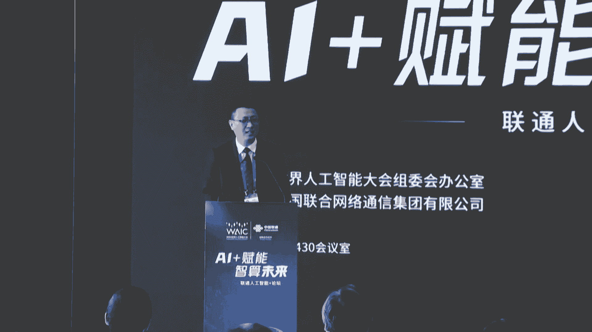
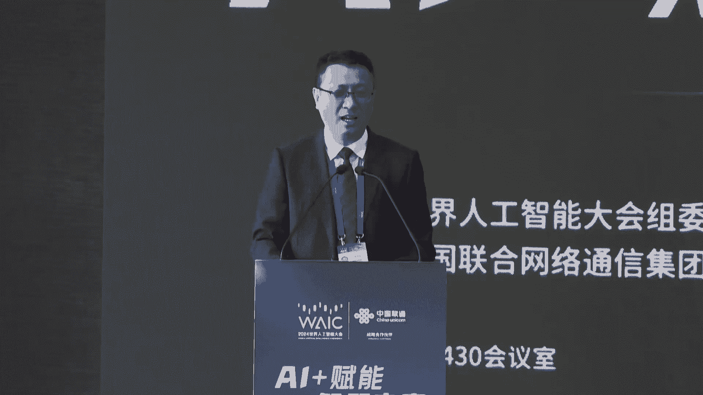
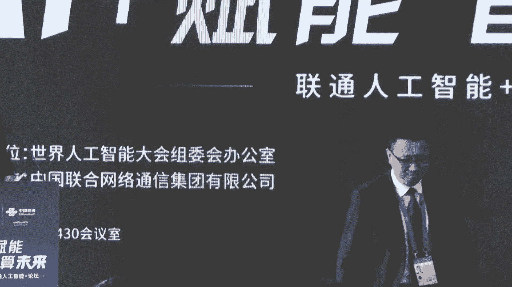
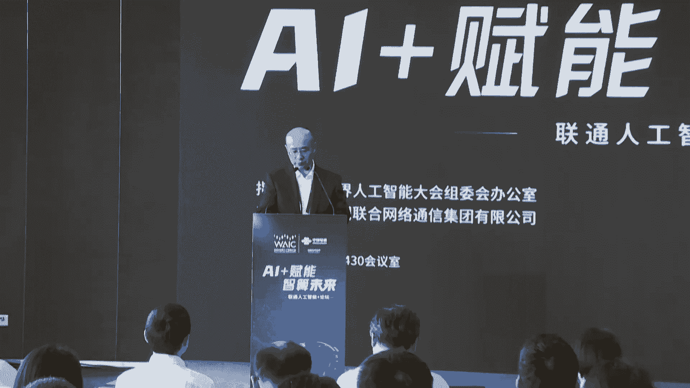
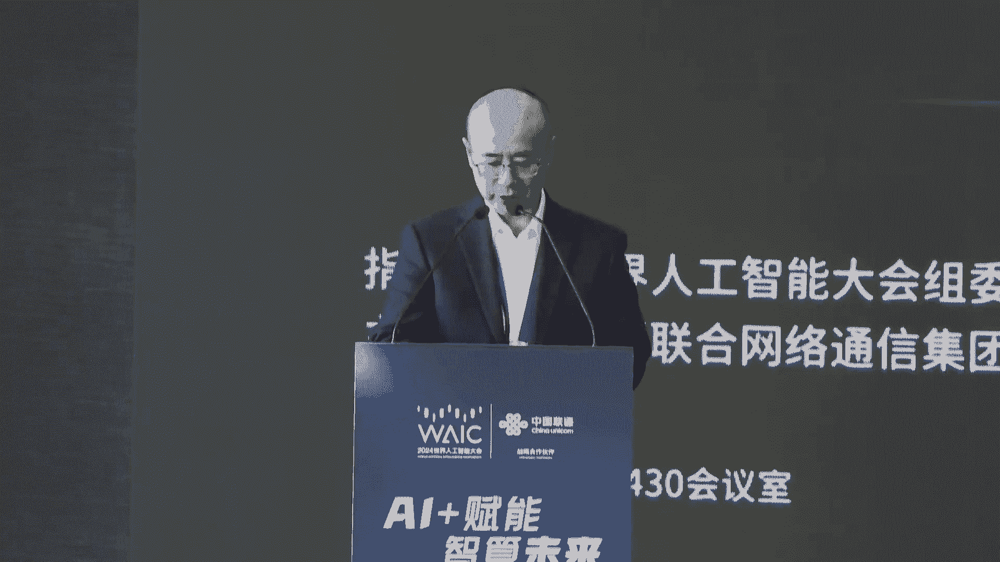
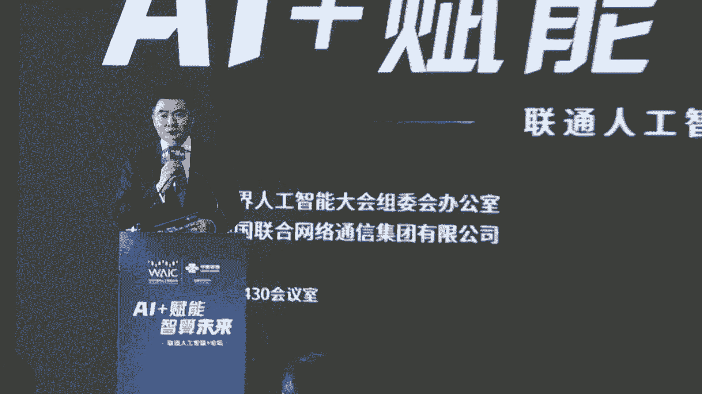
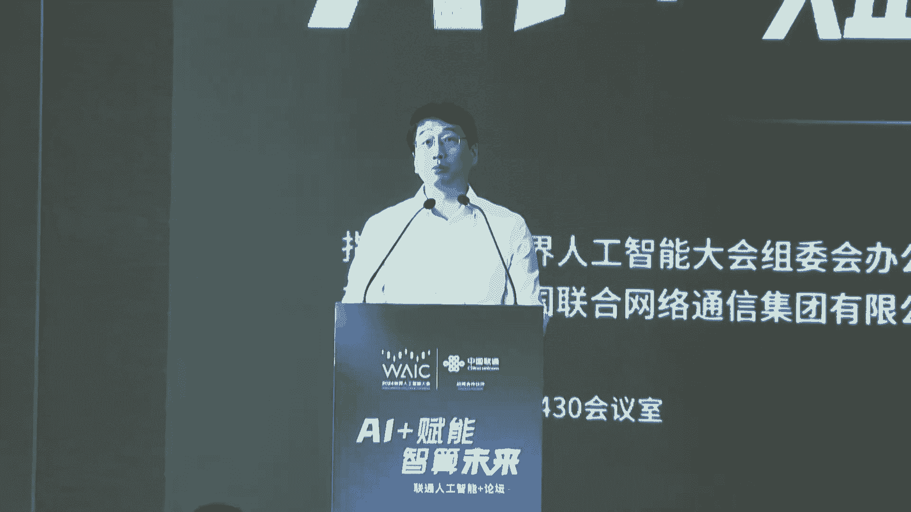
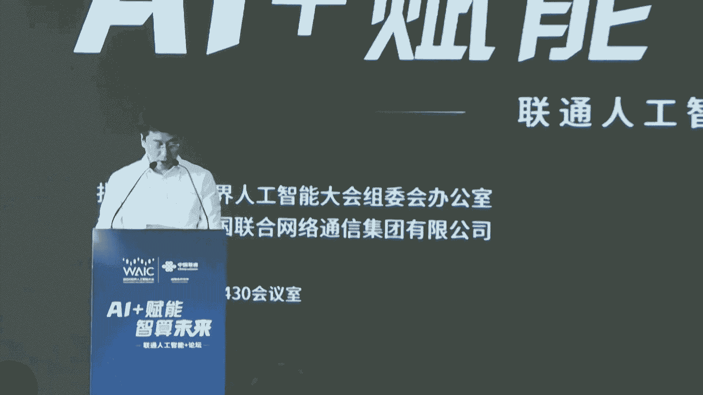

# P7：20240704-“ AI+赋能 智算未来 ” 联通人工智能论坛 - WarrenHua - BV1iT421k7Bv

🎼尊敬的各位领导，各位来宾、女士们、先生们，大家下午好。😊，欢迎各位来到AI加赋能智算未来联通人工智能加主题论坛的现场，我是第一财经主持人尹凡，非常荣幸来参加今天的活动。

首先请允许我代表本次论坛的主办方，对所有领导和贵宾的到来表示热烈的欢迎。😊，习近平总书记高度重视我国新一代人工智能的发展。他指出，人工智能是引领这一轮科技革命和产业变革的战略性技术。

具有溢出带动性很强的投雁效应。加快发展新一代人工智能，是我们赢得全球科技竞争主动权的重要战略抓手。今年的政府工作报告也第一次把人工智能家写入其中。上海始终站在时代的前沿。

积极探索并推动人工智能技术的发展和应用，不断培育和发展新智生产力。而中国联通积极落实人工智能加行动，推动AI与产业的深度融合。今天，作为大会的战略合作伙伴，通过举办本次论坛。

旨在推动人工智能基础设施、大模型研发以及千行百业应用等方面的发展，进一步助力上海人工智能生态的产业集聚。首先请允许我向大家介绍出席今天论坛的主要的领导和贵宾。上海市经济和信息化委员会副主任张洪涛。

上海市通信管理局副局长戴斌。中国联合网络通信有限公司上海市分公司党委委员、副总经理刘彤。以及来自政府香港委办、中船动力商飞、华东空管局、中共一达纪念馆、上海天文台城建数字产业集团、罗氏保信软件、华为、阿里、商汤、木溪随缘。

摩尔县城、曙光超巨变、华坤、无问新琼、蓝马科技、智普科技等政府的领导重要的客户和产业链的合作伙伴。同样用最热烈的掌声欢迎各位的到来。国家信息中心发布的智能计算中心创新发展指南指出，十四五期间。

在计算中心实现80%应用水平的情况下，城市对计算中心的投资可以推动人工智能核心产业增长2。9倍到3。4倍，带动相关产业增长36倍到42倍。而根据工信部的规划。

中国智算在中国智能算力的占比将在2025年达到35%。这意味着计算中心将引领数据中心建设的潮流。而中国联通积极行动在计算领域提前布局，我们看一下大屏幕。

🎼中国联通上海临港计算中心是高规格的国家级跨境数据流通枢纽节点，是中国联通首批1加N加X高等级算力集群枢纽节点。🎼位于中国上海自由贸易试验区临港新片区占地84亩，机价数1。5万家。

毗邻中国联通国际海缆登陆站与临港国际接入点同指建设，具备独特的地理优势和优质的资源禀赋，是中国联通第一个全亿轮国产万卡制算集群。🎼上海临港智算中心具有6个极帜创新特性。🎼极致产出。

每亩机甲数高达173架，远超行业平均水平。🎼极致可靠，采用2N供点架构和N加一制冷架构，满足联通第3家及国A标准。🎼极致灵活，可适配4到60千瓦的不同应用场景。

🎼极致安全六重安防体系和三路流通信线路接入，确保数据安全。🎼极致低碳光伏加储备一体，加液冷加自然智能调优，整体PUE小于1。25。🎼极致运营利用智慧运营平台，实现数据中心的智能化、高效和稳定运营。

🎼未来，中国联通将积极服务上海5个中心建设，适配新质生产力发展，秉承技术领先、绿色节能、运营高效、安全可靠的特性。中国联通上海临港智损中心，将全面赋能千行百业数据转型。

🎼助力上海构筑具有国际影响力的人工智能高地。🎼刚才这个片子大家看到了，中国连港上海临港及计算中心是高规格的国家级跨境数据流通的枢纽节点，具有技术领先、绿色节能、运营高效、安全可靠的特征。

中国联通上海临港计算中心全面赋能千行百业的数职转型，助力上海构筑具有国际影响力的人工智能高地。接下来在这样一个重要的场合。我们将进行上海中国联通上海临港计算中心的发布仪式。

我们请出上海市经济和信息化委员会副主任张洪涛、张主任、上海市通信管理局副局长戴斌戴局长和中国联通网络通信有限公司上海市分公司的党务委员副总经理刘东、刘总共同上台，为我们启动。🎼好。

请三位领导将您的左手或者是右手放到您面前的装置上，我们一起来共同倒计时321启动。好，我们请摄影师记下这样一个重要的时刻，咱们还要再拍一张吗？就是要怎么样再拍一张。😊，就这样拍一张，我们再再拍一张。

我们听摄影师的这个时刻真的非常的重要。😊，手放在上面对，再拍一张。好，感谢三位领导，请落座我们张主任留步。😊，Oh。张磊不，我们为我们今天的论坛第一个发言，第一个致辞，我们有请张主任。😊。

尊敬的戴菊刘总。各位新老朋友啊，一年一度的。这个呃上海的人工智世界人工资大会啊又隆重开幕了。今年呢是人工智能大会举办的第七个年头，也是迈入了一个新的里程碑的一个重要的节点啊。上午我们很多朋友都一起呃。

通过现场和现上的方式啊，参加了我们的开幕式啊呃，党和国家领导人非常重视。李强总理啊亲自到会发表了主旨演讲呃，会上呢还发布了上海宣言啊。呃，今年的大会的主题，是以共商促共享，以善自促善自。

啊呃，在。上午的全体会议上啊，很多专家都来讨论。说今年呢我们更多的人来关注人工智能的治理的问题，说明人工智能。更加深入了我们千行百业，与我们每一个行业，每一个人可能都越来越密不可分了啊。

今天下午我们大大小小的上百场论坛就开始了拉开了序幕啊今天我们在这里是参加中国联通的AI赋能自算未来的主题论坛啊，刚才通过主持人介绍，我们也知道啊，今天呃有很多产业链上下游的朋友一起来啊，共同的探讨。

我觉得这个就是看到了我们联通作为一个重要的节点啊，在人工智能啊算力底座这个领域。对行业做的贡献也也体现了它重要连接的一个作用啊，在此呢，我仅代表上海市经济和信息化委员会代表论坛的筹备方向各位嘉宾的到来。

表示衷心的感谢。对各位长期以来支持上海人工智能产业发展，表示衷心的谢意。😊，当前呢人工智能正以着呃历史性的变革迅速发展，以AIG息为代表的人工智能创新场景应用、大模型训练等需新需求的崛起。

进一步的加速了自算技术的多元创新，算力规模的快速成长，产业结构的加速重构，治理架构的不断变革。上海作为我国改革开放的前沿阵地和深度连接全球的国际大都市，始终站在时代的前沿。

积极探索并推动人工智能产业的发展，不断培育和发展新的生产力，也取得了一定的进展。今天上午啊，李强总理说，上海的人工智能产业起步着基础好企业众多啊技术创新活跃。

我想啊在这也包括我们在座很多企业家的这个心血和贡献。那么经过这几年的发展呢，我们的产业规模持续壮大。算力的基础设施也加快布局，大模型加速实现规模化的应用落地落地啊，我们现在上海已经有34个大模型。

通过了备案啊，还有一批垂类的模型啊，正在呢积极的在各行各业落地。所以我们想未来啊我们将借事界人工智能大会的东风，继续的加大人工智能领域的投入和支持，大力的培育大模型创新生态。

加速打造推动人工智能产业发展的试验田和孵化器。我们要呢进一步的突破核心技术，提升算力的支撑能力，加速智能计算、高性能计算的技术突破，加快计算架构、计算方式、算法等多方面的创新。

加强CPUGPU服务器等重点产品的研发，推动新技术新产品的应用落地，系统增强产业技术能力。我们要激发应用的活力，赋能千行百业转型升级。

聚焦新型工业化、信息消费、自动驾驶、科研教育等上海产业和城市发展的重点领域，强化龙头带动和产业协同，打造重大示范应用场景，促进技术创新和应用落地的良性循环。我们要创新人才的培养模式。

构筑呢优秀的产业生态，探索产教融合、创新产教融合的人才培养模式和组织机制，构筑呢高质量的人才支撑体系，全面的培养输送卓越工程师和创新引领引领人才，引领上海人工智能产业基基地的高速发展。

中国联通是数字信息运营服务和数字技术融合创新的白头兵，长期以来为积极服务上海五个中心建设，主动融入上海现代化产业体系，深入开展了人工智能加行动。进一步的助力上海人工智能产业的生态集聚。

我们也希望联通能够继续发挥数字技术的优势，为上海人工智能企业提供更多的算利技术服务，也能够呢携手我们的行业伙伴，加快人工智能的行业赋能落地，为建设上海人工建设人工智能的上海高地，贡献更多的智慧和力量。

最后，预祝此次论坛取得圆满成功，祝各位来宾在上海期间工作顺利，生活愉快。谢谢大家。😡。

谢谢张主任，谢谢张主任对中国联通在人工智能加领域取得的成果表示了肯定。当然也谢谢张主任对人中国联通在相关领域的下一步的工作也提出了要求。接下来我们请出上海市通信管理局副局长戴斌为今天的论坛致辞。

我们有请戴军。😊，尊敬的洪涛主任、刘总，各位来宾、女士们、先生们，大家下午好。很高兴受邀参加2024世界人工智能大会联通AI加赋能算智算未来主题论坛。

我警代表上海市通信管理局向出席活动的各位领导、各位嘉宾表示诚挚的欢迎。向长期以来表示关心支持上海市信息通信业发展的各界朋友表示衷心的感谢。算力作为支撑人工智能发展的核心资源，其重要性日益凸显。

上海信息通信业深入贯彻落实习近平总书记为核心的党中央对上海五个中心的定位，坚持创新引领，奋力推进信息通信业高质量发展。上海市通信管理局积极响应国家战略需求，紧跟科技发展趋势。

努力在算力基础设施、核心技术研发、产业生态构建等方面取得新的突破。近两年，我局先后出台了新型数据中心算力浦江行动计划以及制算行动实施方案等，进一步加快构建了1加1加X的智能算力建设和服务体系。

力争将上海打造成为具有区域乃至全国影响力的智能算力创新及应用示范区，提升算力资源的利用率，加速数据要素的流通，全面释放数据价值，以满足产业发展持续增长的需求。在各方的共同努力下，也取得了一些显著的成果。

截至目前呢，上海市互联网数据中心总规模达到了42。4万个标准计价，在用和在建的总算力规模超过了14亿fps，智能算力占比超过了35%。再用算力规模和运力指数等两项指标均名列全国第一。

上海联通作为本市算力基础设施的产业的主力军，牢牢把握了数字中国建设的时代方位，坚持排头兵的责任担当，以数字化、网络化、智能化、主动融入党和国家事业发展的大局。全方位参与和服务上海城市数字化转型。目前。

上海联通在临港和青浦布局了东西2翼AIDC算力规模达到了4000匹fps算力池60万核的VCPU为强化多元智算能力供给，升级新一代算力网络，加快建成具有国际影响力的人工智能上海高地贡献了联通力量。当前。

人工智能正在以前所未有的速度和规模影响着各行各业。智算作为人工智能的基石，提供了强大的计算支持。两者的深度融合，不仅推动了技术革新，也为社会经济的发展注入了新的活力。在此呢我提三点希望供大家参考。

一是希望。持续加强算力基础设施建设。加快中国联通临港智算中心建设，以满足不断增长的计算需求，加速构建更加高效的城市全光运运力管网。确保数据传输的时效性和稳定性。为人工智能应用提供强有力的支撑。

二是希望联通积极开展国产计算技术研发，充分利用人工智能等技术，提高智算生产要素的自主可控性，探索优化算力资源分配管理和使用，不断提高计算效率并降低运营成本，为智算发展注入新的动力。

三是希望联通协力共筑算力浦江新生态。希望联通公司相关方积极支撑算力浦江生态建设，联合产业链相关企业在算网融合标准制定国产算力软件软硬件的适配AI大模型训练和推理等重点领域，发挥主力军的引领作用。

为建设数字强国贡献联通智慧和力量。最后，助本次论坛取得圆满成功。谢谢大家。谢谢戴菊。戴菊说，上海在建设人工智能产业高地的过程中看到了也感受到了来自中国联通的力量。当然。

也对中国联通下一步的工作提出了三方面非常具体的要求。可以说联通是中国人工产业的。🎼主力军国家队。接下来我们请出中国联合通讯网络有限公司上海市分公司党委委员副总经理刘彤。他为我们今天的论坛致辞。

我们有请刘总。😊，尊敬的各位领导，各位来宾，大家下午好。那首先的话呢，请允许我代表上海联通，对各位领导和各位嘉宾的到来表示热烈的欢迎。同时呢也借这个机会啊，对上海市经信委啊。

上海市通管局长期以来给予我们的关心和指导。对于社会各界广大客户和我们的合作伙伴给予我们的信任和支持啊，表示衷心的感谢。那么人工智能呢是作为当今科技革命和产业变革的重要驱动力。

正在深刻改变着我们的生产生活方式和经济社会的发展格局。那么上海呢是中国改革开放的排头兵和创新发展的先行者，具有良好的算力网络基础。

不久前发布了上海市促进人工智能产业发展条例和上海市智能算力基础设施高质量发展、算力浦江智算行动实施方案。一系列的这个政策提出了以超大规模预训预训练模型以及生成式人工智能快速发展为契机。

举全市之力打造智能算力创新及应用示范区，适度超前布局与人工智能技术相适应的智能算力基础设施。助力智能算力基础设施高质量发展。在上海市委、市政府以及集团公司的领导下。

中国联通立足上海在服务国家战略中的重要地位，全力支持5个中心的建设，主动融入上海现代化产业体系和城市数字化转型，服务上海经济和社会发展。中国联通将持续加大计算基础设施的布局。

进一步扩大临港计算中心的算力规模，推进浦江。推进青浦算力枢纽节点的规划和建设，积极参与上海公共算力服务平台的建设，助力上海人工智能高地的构建。此外，联通的远景大模型也将在本次论坛上精彩亮相。

基于1加1加M，也就是一套基础大模型，加一个大模型平台，加M种行业大模型的这样的一个大模型体系，我们将积极构建模型筛选、模型调优等模型服务能力，打造更懂行业更懂客户的业界领先大模型。

今天我们还将见证中国联通高性能算力联合实验室的揭牌，通过对国产算力以及主流算法等联合攻坚，将AI技术与千行百业深度链接，探索打造创新融合泛在的AI加智能应用。

加快推进AI加标杆共创、赋能政务、工业、金融、医疗等千行百业的数字化转型。那么在今天论坛的最后呢，也指此算注深成智算联盟成立一周年之际，我们也将联手产学研各界合作伙伴换新出发，共建人工智能全产业链生态。

共同发出新征程联合倡议，让人工智能创新成果与实体经济深度融合，全力支持上海人工智能产业的发展，助力上海打造全球人工智能高地。让我们携携手并进，以人工智能和算力为引擎。

积极探索并推动人工智能技术的发展与应用，不断培育和发展新智生产力。全面赋能经济社会数字化转型，共同开创高质量发展的崭新篇章，为建设数字强国贡献我们的智慧和力量。最后也预祝本次大会和本次论坛圆满成功。

谢谢大家。🎼感谢刘总人工智能发展，推进人工智能发展是国家战略。而上海正在加快构筑人工智能的高地。而在这其中呢，中国联通是主力军，是国家队。那么中国联通在这方面有哪些思考，有哪些探索。

接下来我们请出上海联通网络部的总经理叶强，他给我们今天带来的演讲的题目是打造国际化新型智算中心，助力上海人工智能高地的构筑。我们有请叶总。😊。

尊敬的。带住。各位领导嘉宾，大家下午好。我是上海联通网络部的叶强。今天我和大家分享的题目是打造国际化新型智算中心，构筑上海人工智能高地。近年来。

人工智能迅速发展已经成为新一轮科技革命和产业变革的重要驱动力量。以大模型为代表的深层式人工智能发展非常火热。GBT5参数预计达到5万亿，约为GPT4的3倍，GPT3的30倍，带动了算力需求的快速增长。

目前呢上海自算复合增长率高达34%，预计到2024年底将突破500亿pro。那么人工智能的浪潮汹涌而来，从国家到上海，再到我们运营商都在积极拥抱智能时时代，助推人力呃人工智能产业发展。

2024年国家政府工众报告中指出，要开展人工智能加行动，打造具有国际竞争力的数字产业集群。同年呢，上海市也发布了人工智能产业发展四5规划，全力打造根据国际影响力的人工智能上海高地。那么在2023年呢。

上海联通就已经形成了面向人工智能时代的数字信息基础设施能力体系。那么随着对人工智能的理解不断深入。我们在迭代优化能力体系的同时，正在一步一个脚印的把我们的发展规划变成现实。

今天我就重点给大家介绍上海联通在自算基础设施，也就是资源层能力方面所做的一些工作。在集集团公司的正确领导和权力支持下，上海联通紧抓自算发展机遇，服务国家战略，加大面向智算发展的资源供给。

打造差异化的竞争优势，助力构筑上海人工智能高地。在AIDC方面呢，我们适配计算特性需求，构筑满足规模计算部署需求的AIDC形成了东西两翼的资源布局。在AI算力方面呢，我们国产主流算力并进。

不断强化多元计算的算力供给，满足千行百业的算力需求。在AInet方面呢，我们强化算网创新，匹配计算业务场景，升级新一代高效弹性、高品质的算力网络，以网络之长、强算力之机。

首先呢为大家介绍的是适配计算特性需求的AIDC。啊，我们知道随着AI算力需求的大规模的迅速增长，超大的算力规模对我们的基础设施提出了更高的要求。比如说我们的集中的空间布局。

更高的单机柜的供电功率、更强的制冷能力等等。为了满足规模计算部署的需求，我们积极推进东西两翼的AIDC资源布局。目前我们东面的临港国际数据港和西面的松江数据中心都已经投产了。未来，我们将具备1。万1。

8万架以上的高性能机柜。为自算集群的规模部署提供充足的AIDC资源。那么刚才这个短片也放了这个国际零呃中国联通国际数据港的一些情况。那么可能大家时间比较短，没有看清楚。

下面我重点给大家介绍位于临港的中国联通国际数据港。那么中国联通数据国际数据港呢具备得天独厚的区位优势。园区位于这个临港新片区的西南部啊，与中国联通的国际海缆登陆局只有一墙之隔。

具备这个国际业务落地零时延的一个独特的优势。那整个园区呢占地84亩啊，产出1。5万架高等级市值化的机柜。在资源禀赋和位置优势上面，在全国都是独一无二的。

那么我们这个联呃中国联通国际数数据港的园区的定位是高等级的中国联通算立集群枢纽节点、高规格的国家级的跨境数据流通的枢纽节点，以及我们中国联通标杆的。云数据中心。

那么临港国际数据港除了具备得天独厚的地理位置以外呢，还具备超大规模的自算集群部署能力。大家知道，大规模的自算集群部署要考虑四个方面的高要求。第一个是高密度部署。因为自算服务器的部署。

具备这个集中化、高密化的特点。那么我们临港国际数据港呢采用大平层大驻网的设计，充分利用了空间，每亩产出达到173架，远远高于传统的DC，可以很好的满足自算集中部署的要求。第二个是高用电的容量。

大家知道自算服务器的功耗很高，发热量很大，对我们的供电制冷都提出了非常高的要求。那临港数据港在设计时呢，就充分考虑这方面的要要求。我们具备整楼的一个全页冷的条件，同时具备楼层内跨楼层。

跨楼宇的电量和冷量的灵活调配能力。目前我们当单机柜的最大的支持的这个功率可以达到60千瓦。第三是高主网的要求。为了提高自算集群的算效，这个降低网络时延，因为服务服务器之间主网的一个无线网络。

对网络距离有非常严格的要求。那么我们在目前在DC的布局上呢，做到的合理安排，采用了这个网络居中的一个设计方案，可以做到所有的集群服务器和中心网络交换机之间的间隔小于100米。满足非常严苛的主网要求。

第四个是高安全可靠。因计算服务器集群运行对于可可用性的要求非常高。对于基础网络的安全可靠性提出了非常高的要求。那么临港国际港呢在供电系统在制冷系统方面都采用了多重的保护，满足联通T3加以及国A的标准。

并且通过六层这个安防体系通信线路三路由接入等等举措，实现了智能化全方位多层次的安全保障，充分满足集群的高可用性的要求。那么大家可以看右边这个图是我们临港国际数据港A楼的一个整体规划。可以看到呢。

我们在四楼和5楼的规划是放集中部署国产的算例。一楼和二楼呢集中部署这个呃主流的算力。那么这样来统计呢，我们整个A楼可以满足5万卡的集群部署能力。但等我们B楼。在投场以后呢。

我们整个临港数据港可以具备10万卡计算集群的一个部署能力。那么看完了这个AIDC以后呢，让我们来看看AI算例。上海联通秉承着国产主流算力并进的原则，不断强化多元计算能力供给。一方面。

我们建成了联通最大的国产资算中心。另一方面，我们打造了联通首个主流计算中心。接下来我为大家分别做介绍。上海联通的灵港自算中心，就刚才发布的是中国联通全力打造的最大的计算核心高地。呃。

联通重器的称谓可这可谓是当之无愧啊。制算中心在硬件方面采用国产化算力，加上ropi的网络架构，采用全叶冷的这个全版冷板式的页冷配套，单局群可以满足万亿参数模型。未来还可以扩展到3到5万卡的集群规模。

在软件平台方面呢，我们采用全自主研发的联通云7。0新罗。呃，联通新罗云呃新罗平台和远景大模型的权账软件架构，具备了自算权账的服务能力。与此同时呢，为了适配人工智能业务发展的多种形态。

我们在打造规模国产化的计算中心的同时呢，进一步加速主流计算中心的布局。打造中国联通首个主流智算中心。目前单体的集群已经达到了千卡的规模，采用最先进的ID3。2T的主网架构，未来将扩展到万卡规模。

那么机房配套采用了智能小母线、封闭、热通道等先进技术，满足自算高功率和制冷的要求。在软件方面，我们采用了主流的扩大平台，可快速匹配各类模型框架的需求。我们相信通过国产和主流算力并进的多元算力布局。

可以很好的满足江汉百业的自算需求。下面呢就为大家介绍一下AInet，也就是算力网络。因为网络是运营商的立身之本。人工智能时代呢对我们的基础网络又提出了更高的要求。为此，我们匹配自算业务场景。

全面升级新一代的算力网络，致力打造高效无损的算内网络弹性超宽的算尖网络以及品质保障的路算网络。做到以网络至长、强算力之机。那么算力网络啊，算内网络是用于集群服务器之间通信的网络啊。

大家知道要打造大规模的计算集群，光有这个CPGPU卡还是不够的。在服务器之间传递数据的无损网络也非常的关键。那么上海联通致力于打造一体调优及致算效的算内网络。在无损这个网络的技术方面呢，一方面。

我们计算中心采用了国际先进主流的IB和roki架构分别进行主网。那么具备先进的硬实力。另一方面呢，我们依托联通集团的研究体系，以及交互运营的最佳实践。

对于智能无损调优流量用塞控制等关键技术进行深入的研究。那么目前已经具备初步具备RDMA算网一体的调优能力。通过读写加速、通信库加速、训练推理加速等等的一系列优化举措。

我们已经实现集群上效整体的提升达到20%以上。相信未来随着我们对无损网络技术的进一步了解，不断深入，我们还能更高的提升集群的算力整体效能。那么上尖网络是用于集群和集群之间数据源和服务器之间通信的网络。

那么在人工智能大模型的服务模式里，网络是不可或缺的环节。无论是数据到训练还是训练到推理之间，都需要高带宽、高弹性的上间网络进行支撑。那传统的这个数据传递啊，就是目前的数据传递。

往往采用人工快递的方式来进行。中国联通面向智算生态，推动网络的重塑换新，打造了具备高速直达弹性服务能力的新一代智联网络。就是为了重点解决算间数据传递的问题。我们通过400G能力的部署，O叉系技术的部署。

可以实现网络带宽更高，运力更强，一跳直达。那么依托全网部署的SRV6能力，可以打造直达弹性的IP网络。研发出具备出具备弹性运力服务能力的数据快递创新产品，满足AI训练海量数据的传递。在此之上呢。

我们为了满足更高的数据传递的需求呢，积极研究ODOTN加RDMA的长距无损技术。打造了满足高通量数据场呃，数据传输的数据高铁场景。相近相近不久的将来，用于人工智能训练的海量数据传输。

不再依靠传统的人工模式，而是通过我们的算力网络来完成。那么路算网络就是指用户使用算力服务的接入网络。在用户路算方面呢，我们自力打造随需接入品质保障的路算网络。那么目前我们已经实现了商业楼宇的全覆盖。

下沉的PO天节点达到1900个以上，综合接入区实现了百分之百的覆盖。便于用户随区接入，通过构建城市内长三角枢纽以及全国1到5到20毫秒的算力时间圈，为路算用户提供第一时间的体验。

通过A片N6切片技术的部署，我们可以实现算力的感知和业务的隔离，充分保障路上用户的使用品质。近两年来，我们在算力基础设施建设过程中取得了一定的成果。但是作为运营商，我们深知如何将基础设施运营好。

为客户提供可靠的全方位的运营保障，这才是更大挑战的开始。算力基础设施的交付运营挑战主要源自于本身的先进性和复杂性。如何做到烽湖水电的可靠运行，如何保障超大规模计算集群第时间零丢包。

怎么通过调优来提升算力集群的使用效率，进而使整个计算集群做到高可用的高效，这些都是非常深的学问。为此，中国联通集全集团之力，启动了AI星火燎源工程。通过讯战结合边学边干的方式。

在上海临港智算培训实战基地，培养了200个人以200个以上的资算专家团队，打造一体化的交付运营体系，为客户提供从待建带运营，到模型迁移调优等端到端的专业化智算服务。

目前呃目前我们已经初步具备了初步形成了设备到货后T加90天的集成投产能力，并以此为基础，不断提升能力，打磨更高效、更可靠的服务保障体系。以此提供符合客户预期值得客户信赖的自算运营服务。

道主铁长行浙将至未来，我们将保持开放的心态，拥抱智能，向心而行。为落实国家人工智能行动战略，为构筑上海人工智能高地，为每一个信赖联通的客户竭尽全力，谢谢大家。感谢叶总的演讲。

在2024年世界移动通信大会期间，中国联通发布了远景1加1加M的大模型体系，以及系列的人工智能的创新成果。😊，🎼这次创新成果的发布，代表着中国联通抢抓人工智能发展的新机遇。

成为人工智能基础设施建设和优质服务的国家队人工智能技术和应用创新的引领者。人工智能产业安全可信的首席护航员，成为国内领先的综合智能服务领军企业的决心。

接下来我们请出中国联通人工智能创新中心副主任丁鼎带领大家进入远景构建的数智新世界。我们有请丁总。呃，各位领导好，非常荣幸啊。今天有机会在这个来到上海参加这次整个大会，也非常荣幸有机会借这一次一个场合。

能给各位领导报告一下中国联通在人工智能领域的一些新的探索和新的一些实践的成果。嗯，这次来到上海，说实话，作为人工智能的从业者之一，感觉到非常的兴奋。特别是在我们的计算这个情况。

我们也是真实能感受到全国现在有11个企业宣称对外已经建成了万卡中心。今年年初的时候，大概4个月起了将近40个整个计算中心的这样的一个大的一个建设工程，很多都在上海进行了落地。也到了上海。

我们真的实际能看到我们整个计算，带动了大模型，带动了一系的应用成本的突破。第二个方面呢，也看到了我们今天在座的这个和各个友商的同仁，大家一块共同现在全国范围内打造了近超过300多个大模型。

然后通过备案的，我们看了看，也快了140个这样的一个状况。年底的时候，预计这里面可能5%以上的都要突破万亿参数这样的一个规模。正是有了这么多算力和这么多模型。我们看到过去从去年开始到这个建万卡中心。

然后到讯万亿参数模型到现。现在开始卷千场万景的创新应用，可能到IDC的预测到年底会有4亿个这样的一个新5亿个新的应用会陆陆续续诞生。

看到我们的政府跟企业现在陆陆续续也开始关心到底大模型能给我们的生产运营带来什么样的一些新的变化，什么样的一些新的真正的突破。我们也拿了一组数据，这是目前央企的一个情况。就是整个中央企业。

我们看到实际是是作为了一个数字化转型里面一个比较特殊的一个群体。往往他的体量投入和相关的成效也有一定代表性。我们把近期呢是做了全量的，除了三家营商以外，94家央企的整个的一个调研和梳理。现在能看到。

其中有44%的央企已经开始明确梳理好自己的应用场景，要启动整个人工智能和相关应用的一个建设。33%的企业呢开始陆陆续续构建了自己的大模型的整个的团队。

12%呢已经陆陆续续发布了它的自由或者是合作建起来的这些整个的大模型。当然，从中国联通的情况来说，我们投入也很早。不管是我们自己的这个最基础的网络运营，还是到了我们面向客户的整个1010客服的服服务。

还是我们面向我们这种新老用户的。整个客户运营的一个体系。面向我们的整个企业管理，我们的数字化的，不管是我们的这些办公OA还是这些采购等等的一些具体的业务流程，还是到我们的研发生产。

到我们的网络安全保障都开始用大模型来进行一定重构。可能有两组数据包含着我们在做网络，我们基础的网络路测，通过大模型的一系的改造，全年大概能接受大概1。5万的这样一个工时。

对我们的人工成本带来了很大的改善。包含着我们的整个的智能客服，通过大模型的整个的引入。整个每单的这个通话时长压降了26。4秒，首问解洁率提升了4。5百分点。

这个创新成果呢也获得了吴文俊的这个人工智能科技进步奖等等的这一些情况来看，至少从中国联通自身的实验经验来说，所有的业务确实值得探讨，用大模型，用人工智能方式来进行重构。当然，在落地当中。

特别是面向我们的政府和企业的场景。我们会看到还存在着很多的挑战。似乎万能的大模型什么都能做，但是什么也做不好。特别是现在的整个的规模定律。虽然说万这个参数越大，数据越多，效果越好。

但是回到我们的政企业务场景，大量的客户手里的资源，我们不管是算力还是数据，相对来说都比较有限。然后这个如何能发挥更好的效果，更好的组合面临到挑战。我们会看到AI的应用从亮眼到这个这个好用。

其实也面临到挑战。很多的客户从不管是用开源还是其他的方式都在进行业务的尝试。初始的时候呢，效果很好，这个突然间一些业务创新突然间发现都能进行落地。但是这个准确率召回率怎么能从70%提升到95%。

怎么能够运用一大堆的我们的业务人员来进行微调进行相关的调整。这个人员的短缺还面临到非常大的冲击。第三个呢，数据安全风险。因为这些数据都内化在模型当中，我们的大量的政府跟企业，一方面是数据安全的风险。

另外一方面呢也是在顾虑我们自己的核心资产，要掌握在自己的手里。所以面向私域场景之下，如何来提高我们的训练效率，特别是配套的安全运营效率也面临到挑战。所以在这样的背景之下呢，中国联通自己的路线的核心。

我们简单总结了这4点。也同样是我们建议这个面向政府跟企业各个领各在做大模型试点尝试，好，值得去参考借鉴的一些方面。第一个呢是技术家需求的双身驱动，不单纯追求超大规模的参数。

更多的还是要把我们的不同的参数的版本跟我们的算力，跟我们的数据结合在一起，寻找一个更好的性价比。比如我们在辽宁的123组就会发现8B的模型做话单的分拣，话单的这个工单的制动的填报没有问题，效果已经很好。

但是到了这些智能辅助问答等的场景，可能就需要一个更大的模型来进入进入。所以各种不同参数模型的组合及相关量化剪裁会灭掉一个核心的这样的一个方向。第二个呢就是模型加工具，这种应用范式的开发的效果开始显现。

很多时候一个白卡百亿级的这种参数模型，加上我们一系的工具，不管是我们的RG还是智能体等等的一些方面带来的效果往往要比我们可能是一个千亿或者甚至以上的模型效果要更好。第三个呢，专属的定制服务。

就是如何把行业专家升级为具有大模型操作能力或者是微调能力、数据标注能力的专家，我们会发现，在这个时间点特别的重要。所以在中国联通现在目前已经把我们过去在全国布局的18个行业军团。

把每个军团这2到300人的行业专家都开始进行大模型技术的培训和升级，能让他们去辅助我们客户进行一系列的创新。第四个呢，我们呢坚持在打造的是可信的大数据的运营服务，就是围绕着我们的数据安全。

面向我们私域场景之下更好的效能匹配来解决。除了解决我们大模型内生安全的问题，更主要的是培育我们能够进行本地化运营服务的这样的专业化的人才。所以这是整个中国联通在策略方面的一些新的考虑和思考。当然。

按照这样的一个路线呢，目前中国联通目标呢是把自己打造成为更懂行业的大模型产业升级的这个数质引擎。我们也围绕着更懂行业更易定制，更加可信。这三个我们自己的定位，来去迭代我们的新的能力体系。

包含着前面个这个介绍当中也提到过的。我们的一加一加M这样一个体系，目前这个一套基础模型，已经通过了整个的双备案这个工信部的安全的A级的这样的一个评级，也适配了我们全套的国产化算力。

也投入了很大精力去打造我们的大模型平台，能让我们的专属模型和行业。模型能够有更快更好的这样的一个突破。呃，当然在这过程当中呢。

我们一系列的基础模型也在围绕着我们的政企线或者是我们的政府跟企业的需求来进行着一系列能力的创新和能力的迭代，包含着让我们的政府，不管是我们的政策沟通，哪怕是我们的12345的智能的主动的外呼。

还是我们一系列这种数质人的对外的沟通交流，我们在语音能力进一步的强化。这种45秒语音的克隆，特别是这种高自然度语音的合成方面，近期是有一系列的突破，让我们政府跟我们的这个民众之间的沟通更加有温度。

第二个呢是围绕着视觉的场景，也是同样面向我们大量的公共安全的治的场景。面向我们过去小模型不太能够解决封闭性的这种问题。我们把以文搜图和以图搜图的这种能力进行了迭代，包含像在最近在服务北京西城公安局。

就是面向我们的这个基层办。的民警让大家可以把我们的一系列的办案的线索输入到模型当中去，让模型来进行相关的事件的抓取。也就是说很多办案民警只要提供输入的一系列的文字的描述，什么时间段，几个中年男子。

然后带着一个穿红衣服的小女孩这样的线索，就可以在一定的视频范围之内进行相关事件的检索。第三个呢是围绕着我们大量的城市治理的场景，以及我们的各种的文化的创意的场景，也在迭代我们的多模态的能力。

让我们的现在能够识别出更多的城市事件，更多的企业工业安全合规的一些的这种事件的场景。也让我们能够在最近也在这种局部的可控生成、中文文字的生成方面，也有新的突破。在我们的文化文博等等。

在国国家博物馆等等的一些项目当中，也开始有些的突破和整个的落地。所以在基于这些能力，也介于我们打造的这个整个的mas平台，我们也在进行这个全国各个行业，特别是我们的政务新兴工业化企业。

然后呢以及很多的重点行业也在进行一些的探索和实践。目前全国范围之内，我们大概培育孵化了35个整个的行业模型，也借机把一些这个情况给各位领导做个简单的报告。首先呢选择了一个方向呢是整个的远景的。

我们的政务领域的大模型。其实最核心的解决的就是让政府的政策一说，让一线益达，让我们的诉求一收，让我们的期盼一应，把我们过去这个最多的应用的这几个当前的关注的重点，就是如何高效办成一件事儿。

如何让我们的12345运作的更有效率。这些的场景进行了整个的重构，包含在我们的整个成都的新经区，然后面对整个市民端。我们现在让整个的政府的政策，所有的这种宣传的文案，我们的图片。包含的数字人的合成。

都通过大模型来进行完完成。包含我们现在在上的超级率页码上面上去的应用。过去我们都需要大量手填手书的事件告警，现在通过整个摄像头的拍照或者一个语音的一个录输入，就可让大模型自动的把这个事件识别出来。

到底是地面有塌陷，还是有违章，还是有四大乱建的这样的一个情况。所有的工单到了进行自动的分拣自动的处理。包括我们在辽宁在政务热线当中，也是类似的一样一个应用，也是让我们的所有的话务人员接到电话之后。

所有的工单不需要手填，全部可以自动填写，来自动的来打标，自动的分拣，分拣之后呢，话务会有自动的辅助。面对领导层，会把他的一些供热供暖供电等等的一系列的数据，每天有一系列的机器人在自动的跑。

自动的来识别出来我们大量的这种当前的民生的热点事件。现在从辽宁的情况来说，同样压缩了。大概将近30到40秒，整个填整的完整率也超过了百分之提升了超过30%，也在大量的民生事件热点当中去。

现在能做到我们的热点事件形成专报来进行定点的发放。同样呢这个这上面只是举个简单的例子。现在在青岛，我们面向的基层治理，向我们的矛盾纠纷化解进行延伸。一会儿还要再讲的面向我们的经济领域。

我们面向我们各类的发改。然后我们的这个这个经济运营监督局也提供我们的经济大模型等等的一系列的产品和相关的服务。第二个大的方向呢是面向我们的工业领域。就是过去呢中国联通在工业领域。

特别是我们以质检合规为代表性的这些客户场景之下，实际上有大量的客户案例落地。不管是这种洛阳的依托一汽的大众还是南京港雅戈尔等等这一系列的客户。我们在这样的背景之下呢，一方面迭代我们过去小模型能力。

但是更主要是在现代时代去来进行大小模型融合探索这种方案的落地，包含在我们现在在南京港对我们过去这个这个小模型，我们的准确率这个到达瓶颈，无法进一步提升。通过大小模型的结合。

小模型初判大模型来进行最终的精细化的这种的识别。然后我们准确率有进一步的5个点以上的这样的一个提升。另外一个方面呢，围绕着过去客户，很多合规的场景的需求。大家这个这个提的很快。

都需要再次定制这样一个特点，用多模态来进行和我们的视觉模型来进行整个的一个替代。能面对客户有更加开放式的需求输入，能够最能够产生快速定制的我们这样的一个场景。目前在南京港，基本上过去30%的场景。

现在都进行了替代。当然，除了这两个场景之外，现在面向各类的产品辅助设计等等，也在进行探索。像在整个的浙江的加一之一。现在我们的整个的设计，过去的这些我们的这些V领变圆领，然后呢袖口这在进行调整。

长款改短款，然后我们上面增加一些配饰等等的一些内容，这些辅助的这些这些设计的方面也进行了生产的上线。对于它的生产效率改善，设计周期的改善也有很大的整个的一个帮助。当然时间有限。更多的案例呢。

我们今天会上就不再做过多的一个交流。但是我们会发现整个在大模型这个时代，我们除了这个算力和算法的单位之外，我们的算数据和提供场景用的这企业更加的重要。所以目前中国联通呢，我们也在通过自己的算例和算法。

和我们大量企业合办的这个数据和场景合并在一块，共同去共研共创我们的行业大模型，下面举了我们跟国家文文局和中国文联共创的中华器林大模型，用于中国古典文化这种文生图的宣传。

和我们的国中国农大国家渔业中心打造的面向渔业养殖的范例大模型，来解决我们渔业养殖过程当中的一系列生产问题，包含跟北京西城公安打造的联合实验室去来共创我们的公共安全大模型。

我们会发现这种的技术应用加数据融合的方式，可能会变成未来的一个主流的这样一个方式。最后呢除了跟应用层面跟长远的结合，我们会发现大模型的生态也足够大。我们各个企业，各个单位各自擅长的模型。

它的适用范围也不一样。所以呢我们目前也正在推动中国联通远景大模型市场的一个建立。对于我们的算力模型mas以及行业专家的情况都会进行整个的开放。也欢迎我们这个各个模型的厂家应用的单位进行入驻。

大家共同形成一个面向垂直行业的一体化的方案。面向我们的最终的客户提供一个更完整的服务。希望也是集我们大家共同的力量能够带来我们人工智能产业，这个新的落地应用创新，新的应用上面的突破。我的报告就这些。

谢谢大家。🎼谢谢丁总呃，丁总和之前叶总的演讲，让我们看到在中国联通的努力下，人工智能不仅在改变我们的生产，同时也在改变我们的生活。再次感谢中国联通的努力。两位在演讲中都谈到了算力的重要性。

我们知道人工智能发展离不开先进算力的支撑，易获取用得起方便用的算力是人工智能发展的关键。所以，由上海联通和华为共同组建的高性能算力联合实验室应运而生。

旨在让算力像用水和用电一样方便适配数字化向数智化智慧化的发展，助力上海打造全球人工智能的高地。接下来我们要进行这个实验室的揭牌仪式。

我们请出上海市经济和信息化委员会信息基础设施管理处贾立坤联通上海产业互联网有限公司总经理杜伟伟和华为技术有限公司中国区升腾计算副总裁张柏松，有请三位。😊，🎼我们看见有一个牌子啊，上面有一个红绸。

三位站好。🎼然后。🎼对。🎼站定之后把。🎼左手或者您的右手放在这个红布上，我们一起来共同揭牌。321揭牌。😡，🎼女士们先生们让我们共同用掌声祝贺高性能算力联合实验室的正式揭牌。好。

我们听听摄影师的还有什么需要拍的？对对对。我们记录下这样一个特别特别重要的时刻OK好，感谢三位请入座。我们请涂总留一下，给我们大致讲讲这个联合实验室到底是干嘛的。😊，好，各位领导啊，各位来宾啊。

这个下面的话呢，这个呃汇报一下我们对于这个实验室的一些这个规划和想法啊。那因为前面的话呢呃其实跟大家介绍了呃上海联通啊，包括这个中性能集团啊，在整个服务未来人工智能产业发展过程当中。

我们在算力布局以及整个一个模型能力上面构建的这个啊一些这个工作啊，那么这个实验室我理解更多的是基于我们现在啊目前在临港投入的算力资源。以及啊我们现在看到的人工智能模型技术的发展之下。

如何更好的解决技术和应用之间啊这个呃落地实现以及跨越数字鸿沟的这样一个平台的啊功能和规划。那么整个实验室的话呢，是在中国联通集团大的科创体系啊，125N的体系之下啊，我们来落地建设的。啊。

那么在去年的话呢，中国联通是全面的这个重构了我们服务整个技术产业生态的一个这个大体系。啊么依托一张蓝图两种模式五大赋能和N种形式之下啊，开展数字信息技术呃技础设施的创新合作。

数字技术融合创新合作以及千行百业数是融合应用的创新合作。啊么这个实验室的话呢，也是基于这样的一个大的体系之下啊，我们面向未来的人工智能加应用啊来做更好的这样的一个落地。呃。

那么基于当前呢我们说这个呃实验室的成立之下，我们核心解决几方面的问题。那第一个的话呢是对于国产算力芯片啊相关性能持续的这样的一个测试和迭代。第二个的话呢，是国产算力和主流算法框架的适配。

以及如何解决我们说早期可能更多的基于扩大体系这模型的这样的一个开发和训练之下啊，面向国产化的这样子的一个这个啊这个算力啊，做迁移的这个啊能力的提升和效率的效率的改善。

那第三个的话呢是更多的来服务于前端行业场景解决方案的落地。第四个啊是面向未来我们说啊从模型从训练最终因质样推理。那么在解决整个一个推理落地过程当中啊。

软硬一体机等一些这个我们说新型的啊算力服务的这样子的一个这个形态的啊这个产生。那么除了这些之外的话呢，另外我们说也希望更多的把这个实验室的技术。

和我们行业相关的一些标准化啊这个规范以及未来服务于整个大的人工智能产业所需要的人才培养。做更好的有效的这个结合。呃，那么基于这样的一个大的这个呃呃体系之下的话呢，我们说整个实验室得到了呃联通集团啊。

以及这个华为啊两大技术体系的这个非常啊大的支持。一方面的话呢，我们在整个芯片啊性能啊，这个就是我们算力这块的话呢，得到了华为整个生态和深思啊，这个相关创业中心的力量注入。那么在模型的啊这个服务上面。

刚才其实我们钉钉总也介绍了啊，这个我们整个集团啊，包括呃远景的基础模型，以及我们面向行业的各个军团的相关的这个应用能力也会做注入。那么实际落地的话呢，依托上海联通目前我们有两个实验室。一个是算力实验室。

第二个是5G加AI实验室。那么更好的共同来承接啊未来这个实验室相关工作的开展。那我们希望的话呢真正能够未来能够达成啊面向啊这个应用侧的一些能力开放啊测试认证。

以及我们说真正成果从实验室走向啊商业化落地的这个推进。那么同时的话呢，也是在整个过程当中能够反向啊，为整个一个呃计算的这个新呃这个技术啊，以及人工智能技术啊。

做一些这个技术方面的一些这个公关和啊标准的引领。那么面向我们实际的这个平台，如果更好的发挥这平台功能的话呢，呃我们是呃目前的话呢呃开放啊上海联通我们这个广大的政企市场的多样的这个场景。

我们希望更多的啊这个呃生态伙伴啊共同来参与到这些场景的应用落地和研发当中。那么同时的话呢，为了这些场景，我们会开放我们临港计算中心的相关的这个算力资源啊，供这个场景的落地使用。同时的话呢。

我们会持续的啊迭代啊以这个呃联通远景啊为核心的这个平台工具。那么同时的话呢会不断丰富我们说这个呃合作生态的这个相应的这个模型的这个呃开发工具啊，来为相应的落地来使用。那么同时的话呢。

我们更多的啊会全面啊将啊上海联通以及啊集团的整个一个商业渠道啊帮助我们相关的未来的应用成果啊，做好从这个解决方案啊，到产品以及最终的啊。运营啊做一体化的就支撑。那么也希望通过这样一个平台的构建啊。

欢迎到我们在座的各个这个行业客户，以及我们生态伙伴共同来参与到我们说AI加场景的人工智能联合创新体的这样的一个构筑当中去。那也希望依托这个平台的话呢，能够真正发挥啊。我们说这个未来啊。

对于从数字化向数字化啊，这个迈进的这个新的时代之下，共同来构筑AI的创新高地啊，谢谢大家。🎼谢谢杜总的介绍。我们在开场白的时候，谈到了今年的政府工作报告，第一次把人工智能加写进去了。

意思就是要把人工智能和实体经济相结合，让人工智能来赋能千行百业。而中国联通在这方面一直在努力。今天我们邀请了各行各业的头部企业共同开启人工智能的新篇章。我们请出中国联通上海市分公司党委委员副总经理刘同。

中国商飞上海飞机客户服务有限公司副总经理陈启民、中船动力集团有限公司刘程数字化中心副主任朱跃斌，中共一大纪念馆党委委员副馆长阮俊，上海天文台党委副书记、副台长陶俊城建数字产业集团董事长沈国红。

上海商汤智能科技有限公司联合创始人兼副总裁杨帆，罗氏诊断转型与战略总监邢月春共同上台，我们有请8位。😊，🎼好，请。🎼各位贵宾把手放在您面前的装置上，左手或者是右手都可以。没没没关系。

我们一起来倒计时321启动。😊，🎼女士们先生们，我们。😊，🎼共同祝贺强强联手，合作共赢全球合作新布局，开启共赢新篇章。我们请摄影师记下这样一个重要的时刻，我们是不是要稍微聚拢一下，我们以刘总定个位。

我们稍微聚拢一下。对。好，请各位落座。阮馆长刘步。这个人工智能和中共一大会址纪念馆的融合，我们非常非常感兴趣，你给我们讲讲。感谢呃，尊敬的刘总，各位同仁，大家下午好。特别感谢我们联通的邀请啊。

来跟大家分享。近两年在联通的大力助力下面，中共一大纪念馆在红色文化元宇宙端数字世界构建中，我们的一些探索，跟今天的主题啊稍微有一点点啊呃不一样，感觉稍微有点落后啊。

但是呢这也是我们两年以来我们共同构建的一个项目的一个成果，跟大家做一个简单的汇报。😊，意大呢特别的特殊。诶。一大特别特殊啊，因为它是党的单身地啊，在从中央到地方。

大家对于呃中国一大纪念馆的这个关注和要求一直以来呢都是非常高。就在刚刚过去的2023年底啊，总书记到上海，对一大纪念馆又专门提了非常明确的要求，要求上海要用好用好一大会址的红色资源。

要大力弘扬伟大建党精神。那么讲好我们会址的故事，守好我们中国共产党的根脉，建设好一个不朽的精神家园，一直是我们的使命和责任。但是作为一个线下这个观众触达体量特别小的一个革命纪念馆。

我们一直在探索如何运用现在的高新技术，运用数字化的手段去进行啊文化的传播，尤其是红色文化的传播。就在两年之前的啊第五届世界人工智能大会上，我们当时做了一个计划，我们跟金星委在金星委的这个发布下面。

我们共同发布了第一第一批的这个肩膀挂帅的元宇宙应用场景啊，我们是当时第一个项目叫数字一大构建中数字世界的中国共产党人的精神家园。那么这个项目呢在两年多前，我们立项一直是跟联通携手一起走过了这个两年。

那么对于精神世界的构建呢，其实跟当时元宇宙的技术的呃映照和实体的使用。我们觉得它的结合度是非常高的。所以在这样子的一个纬度下面，我们的目标是把这个红色故事要讲好，讲深讲透，把精神传递好。

同时呢我们也有一些具象的一些承载，构建了红色遗址数字世界服务外延讲述平台，试图构建一个人与物穿越山。还虚时跨越时空能够相容的一个世界。那么经过两年以来呢，目前来讲。

我们正是可以说借今年的人工智能大会向全国向全球发布。我们两年以来的这个数字一大的元宇宙世界。目前来讲初具规模。我们是通过了我们联通AI的这个呃技术的集成，加上元宇宙的这样子的一个体验。

把数字一大这样子的一个服务矩阵，目前来讲初步完成啊，实现了这个文物数字化保护数字展成、红色服务外延数字产品等等各项的功能。呃，下面简单的做一个介绍。首先呢对一个革命纪念馆博物馆来讲。

文物的这个保存一直是我们的使命和责任。但是总书记说，让文物要活起来，要让它只能够讲故事。那么如何实现文物讲故事这样子的一个啊功能。那么它的数字化是一个最简单的一个工作，但是不仅仅是说数字化。

我们还是希望他下一步能够为这个红色矩阵的我们的大模型去提供它非常丰富的这些史料。因为我们一大纪念馆有12店8万件革命文物啊，是除北京以外全国红色场地里面这个红色文物最多的一个场馆。那么我们有信心。

也有使命和责任，觉得我们的这些基础是为新的一个革命纪念馆的红色文化的大模型的训练提供一个非常明确的一个基础。那么首第二个呢，从文物的这个角度来讲。

我们还在这个元宙世界的构建中进行了非常多的体验场景的一个设置。不仅仅有线下的原生空间啊，也有很多的线上的原生空间。那么通过串联一体化的方式，能够把虚实融合的这样子一个啊触达方式，能够让它体现出来。

那么第二个方面呢是集成了一个数字展成。对于意大来讲，我们的线下的展成空间非常的小。但是我们有很多有全国影响和传播力的一些数一些展览。他通过这个数字的方式。

永久的可以在这个虚虚拟的或者是说元始生态的世界里面长久的呈现。目前在我们现在发布的这个平台中，比如说我们已经有伟大飞跃的一个马克思专题的展览。也有艺术中的红用艺术品来讲述建党故事的这么样一些专题的展览。

那么红色服务的外延是我们最近一段时间在呃倾力打造的。我们不仅仅构建了一个大空间多人VR的一个线下体验展。

目前它的一个demo的版本也在我们的呃展示区啊在联通的展厅现在正在向公众啊正式的一个让大家可以体验。同时它的大场景的这个体验空间，在一大非常近的地方，华海路这个雁荡路的经验坊已经在今年的七一。

我们已经开启了内测，也欢迎在座的各位在这个人工智能大会期间可以到线下去做一些体验，给我们一些意见和建议。同时呢结合上海丰富的红色文化的这些呃阵地。

我们也集合了我们元宇宙的一些特性用AR赋能的方式去把一些展成的一些固化的标志性的一些内容，通过城市走游和数字赋能的方式进行了串联，让红色服务能够更大的实。实现它的一个外延边界。呃。

在这个红色服务外延的这个映照下面呢，我们就在上一个月啊，我们和联通一起跟高校跟我们的由市委宣传部经协委一起来做指导，共同成立了一个元宇宙的一个实验室。这个元宇宙与新媒体的实验室呢。

是基于我们红色文化的一个实验室。而且它我们选择初步合作的高校是上海商学院。一所并不是特别啊知名特别强的一所学校。但是呢它的商科，尤其在文旅融合的一些国际化表达下面，它是在全国都走在了前列。

所以我们是希望我们这种新型的一些技术的集成，能够通过一些特殊垂类的一些学科的建设，能够走得更深，走得更远。数字藏品啊是现在我们一起在探索的一个新的一个纬度和方向。

那么这是我们现在开始做的线上线下一些联通的数字藏品啊，它只是刚刚开始。但是现在的一个特色的一个文化延伸品。在我们线下进行一些呃实体的一些传播。目前来讲，传播量非常好。我们这个数字藏品到现在为止。

我还没有做过任何的宣发，只是走到意大纪念馆来的观众，大家看完展览，看到一个非常小的一张海报，你可以去申领。呃，登录我们这个平台去申领这个数字藏品。在今年的5月18号。

就国际博物馆日正式上线到现在一个多月的时间已经有接近3万个，就是线下触达的数字藏品为大家领走了。那么这个服务矩阵初步构建以后呢，我们也把它做成了一个集成，不仅仅有一个相对比较重的啊一个数字一大的app。

即将在后天正式上线。同时呢也有一个数字一大的小程序，能够作为一个app的一个导入口，让大家能够更亲质的一个呃触打。这是目前我们现在做的整体的一个矩证的一个集成。那么下一步呢。

我们也是希望依托我们联通啊等等。我们很多的合作伙伴，大家的一些一体化的能力，运用AIGC的工具，能够探索内容生产的效率智能交互的提升。为更多期待或者需要这个红色文化的这样子的一些各类的群体啊。

不仅以党团机构大家的一些学习的要求。青少年学习的要求越来越多。对于啊红色文化，对革命文化有兴趣的青青年人，大家的一个需求。所以能够实现这个在。

数字化赋能下面红色文化的传播和表达是下一步我们要做的一个事情。感谢大家的聆听，也非常的期待各位能够在线下触打我们的红色阵地，同时也关注和支持，帮助我们这个呃非常难得的在这个虚拟空间里面的呃红色阵地。

它的走得更好，谢谢大家。🎼感谢这个馆长的分享啊。我记得总书记还在上海工作的时候，对上海的文化建设就提过三个要求。他认为上海要建设好三个文化，叫江南文化、海派文化和红色文化。

没想到中国联通在上海红色文化的建设过程中，在数字红色文化建设过程中也出了这么大的力，感谢馆长也感谢中国联通。接下来真的是千行百业。我们听了红色文化跟人工智能的结合之后。

接下来请出中国商飞上海飞机客户服务有限公司大飞机智能运维创新中心主任彭焕春为大家带来分享，我们有请彭先生。😊，喂。好，那个尊敬的各位嘉宾啊，各位领导啊。

很荣幸啊在这里分享呃上海中国商飞上海飞机客服服有限公司跟咱们联通合作的一个上海市的一个项目。呃，我汇报的题目是基于5G加AI的国产明机航线智能检查和协同诊断。呃，主要分享三个方面，一个项目的背景啊。

以及我们的技术方案和未来项目推广的一个价值。呃，在2022年9月30号啊呃，万众瞩目的C919大型客机啊取得了那个型号合格证啊。然后目前啊我们919飞机已经交付了东航6架飞机开通了5条航线。呃。

此外的话，我们国产的ARJ21飞机已经向11家客户交付了139架飞机啊，也累计开通了550条5条呃550条以上的航线啊，然后那个在那个呃取得TC镇总书记接待我们团队的时候，也给我们提出了新的要求啊。

一个是希望我们国产大飞机啊，一个是要坚持安全第一质量第一。第二的话是要在关键核心技术上取得更大的一个突破。第三点的话是要加快规模化和系列化的一个发展。在我们行业内啊，目前还是有一些运行的一些痛点的啊。

这里是有一个例子啊，就是在一个呃某航司飞的一个航航线上啊，因为我们的检查人员啊忘记对起罗胶的销子啊做一个检查，导致飞机啊，做了一个返航啊。然后去年的话其实在国航啊也面临类似的一些问题啊。

这里啊也可以看出我们目前行业内的一些痛点，就是在我们飞机航线的检查过程中啊，没有实现一个有效的数字化和可视化啊，很多航线检查的异常数据啊啊，他们有留存。所以导致很多案例啊没有办法复盘。

针对于这样的一个行业痛点，我们也做了一些行业调研啊，像类似的对于做飞机检查，有很多的设备啊，像在工厂里面，它有一些耙臂的机器人啊，然后在航线上它会有一些呃智能化的一些检测设备啊，此外的话，像波音空克呀。

还有我们商飞啊也在研制一些检查的机器人啊，但是这些设备啊，因为它相对来说没有那么便携，没有没有办法跟着飞机啊，飞到每一个航线啊，所以我们也在设想啊。

我们能不能围绕行业的痛点去研制这样一款跟着飞机一起走的这样的一个检查设备啊，把我们飞机的健康状态，能够做一个全面的评估啊，然后在这样的基础上。

我们在想我们商飞能不能以我们的客户一起啊携手我们的行业合作伙伴啊，比如我们联通一起来开展这样一块数字化维修辅助工具的一个研发。有了这样的一个工具，我们可以随时从航师捕获我们飞机运行的健康数据啊。

有了这些数据之后，我们就可以开展我们很多像面向AI的一些。呃，辅助的一些呃判断呀检查呀啊，然后有了这样的一个基础啊，我们将来把它打造成一款标准的产品，所以我们的飞机交付啊。

为我们的国产大飞机的运营的安全性啊可靠性啊来赋能。在这样的基础上，我们也做了一个自己的一个想法啊，就是我们能不能研制这样的一些便携式的一些设备啊。

让我们飞机的放行人员啊可以拿着这个设备在飞机检查的过程中啊飞机整个外表面涉及到安全相关的一些检查点啊，做一个全面的一个一个一个检释然后在检视的过程中啊，我们可以利用AI的算法啊。

可以给我们的检查人员啊给它做相应的一些呃辅助的一个评判啊，此外的话也能把整个飞机的一个整个健康的状态啊，把它跟数字孪声相结合啊，形成我们整个飞机呃的一个运行的一个数字孪声啊。

这样我们可以很清晰的了解我们飞机的一个运行状态啊。这个对于我们飞机飞往海外飞往东南亚啊，也是一个非常重要的一个赋能啊，有了这样的一个基础的话，我们也是在上海市科伟和中国商飞公司的大力支持下。

我们把我们这样的一个想法啊，通过上海市科伟的渠道啊，做了一个接网挂帅啊，也是非常呃有幸吧，就是联联通联通上海联通。作为接膀方啊，我们一起来承担这样的一个项目啊，然后我们怎么去做的呢？呃。

其实总总结来说啊，我们是希望把整个飞机航线的检查打造成一个一个一加N1加一加N的这样的一个大的一个工业物联网的平台。在整个的平台的底座啊，就是我们的大计算和大连接啊。

这个的话就是我们需要跟我们未来民用航空5GLmax的这样的一个网络啊，去做一个连接。在平台层的话啊，我们会去提供相应的存储算力啊，然后在应用层的话，我们会围绕航师检查的各类需需求形成N个应用。

然后在设备层的话，我们希望能够提供给我们的航司客户啊，各种呃各种各样的便携式的一些设备。因为对于航线的检查来说，有的是他主要是靠那个飞机的维修人员啊，有的是靠机场的呃那个放行人员啊。

有的航师呢它有的甚至是让飞行员来开展相应的工作。所以针对不同客户的需求，我们也呃通过和联通一起开展创新工作来为不同。同的客户设计不同的工具啊，来支持整个飞机航线智能航线检查的这样的一个生态。呃。

在N个应用的方面的话，我们也是跟航司开展了大量的需求的调研啊，重点围绕的是人员的呃识别啊健康度的呃一个检测还有工卡的填报啊，还有检查路线的引导啊，还有包括检查点位的识别啊，然后在遇到任何困难的话。

我们可以通过远程音视频通话的形式来寻求专家的远程协作啊，对于飞机检查的任何的异常。我们通过AI的算法进行异常的一个标注。此外，我们最后还是通过区块链的一些电子签名啊。

实现我们整个工卡跟航司运行的一个一个一一个整合。然后右边的话也是我们围绕着呃整个的这个应用啊啊，围绕着整个飞机的数字飞机啊，还有现场的检查的一些一些特点啊，我们做了一些集成式的一些创新啊。

然后这些界面会在我们的手持终端在我们的AI眼镜和在我们的各类的检测设备啊来做一个一体化的一个呈现。在人工智能算法的方面的话，我们也是跟呃联通集团一起啊，围绕着飞机的外表面损伤的。异常检测，还有在危检查。

然后开展了那个AI算法机器视觉算法的一些一些一一些呃一些一些研究啊。目前整个客户的痛点来说，就是因为我们飞机的工作时间不定检查环境啊，也比较特别。他有的白天有的是黑夜啊。

有可能飞机运行他是有一些极寒还有高温的一些环境啊，在这样的一个基础上啊能不能通过AI辅助的方式啊，然后能增强我们机务人员的啊这样的一个检测能力。

因为很多的机务人员其实目前啊国内的机务人员都非常的那个疲惫啊，然后他们在很多检查的工作中，你很难保证每一个检查点位，他都认真的去执行了啊，但是往往最后的在工单的结果上来说都是做完了啊。

能不能通过AI的这样的一些算法啊，去辅助我们的检查人员啊，去给他做一个更精准的一个切论啊。比如说刚刚前面说到那个销子的问题啊，如果有了AI的话，我相信他能很准确的去提醒他他这个销子是没有拔的。

他的任务是不能再往下走的啊，所以我们其实是通过这样一。AI赋能的方式啊，去提高我们呃呃检查人员的这样的一个一个工作效率，也更进一步的去提升我们国产民机的一个运行安全啊。然后这样这样这样在这样的基础上。

我们也是针对于飞机结构损伤的一些特点啊，做了一些呃一些一些算法啊，包括一些划痕检测呀，还有各类的呃掉漆腐蚀，就是飞机一些典型的结构的损伤啊，还有包括一些在位的一些检查啊。

然后我们在项目中啊也设立的将近100多个点位啊，围绕着飞机检查的要求啊，我们逐一会形成识别的这样的一个一些算法啊，然后这些算法呀会在实际的检查过程中啊，去提醒我们的放行能源。

同时啊也会在远程啊提供整个完整的一个飞机检查的一个信息。这样也对民航局去增强我们飞机运行的安全性啊，提供了很多的一个赋能。呃，在智能终端的设备上，我们也是有很多的创新。一个是针对于飞行员的呃一个使用。

我们是呃自主啊去设计了这样的一款定制化的一个一个智能手电筒来做一个巡检设备。因为每一个飞行员他都会配个手电筒来做一个夜间的检查。所以我们在想如何不去增加飞行员的负担。

能不能把这个手电筒把它变得更加的智能化，我们也一起啊开展了创新啊，也是在行业内首次啊开发了自主开发了这样的一块那个巡检的手电啊然后我们将呃那个照明啊、乐成像摄像头啊。

还有红外靶点等很多的模块啊做了一个集成啊，也围绕着飞行员的一些人体工学啊，做了一些呃自主的一些设计啊，然后是能够很方便的让飞行员去对整个飞机的检查做一个全面的一个一个一个检测。此外的话。

我们针对于机务人员的话，也进行了大量的调研，发现其实之前很多航师啊，是通过那个呃那个那个就整个记录仪去开展一个整个的一个检视。但整个记录仪啊它的晃动特别厉害。所以导致航师它本身记录。

那个数据抖动非常厉害啊，所以我们在畅想能不能去基于AI定制一个呃定制化的一个三度云台。然后这个三度云台会根据目标检测的那个图像啊进行一个自动的对焦啊，然后然后能够加入很多的防抖的一些算法。

这样的话就能保证那个我们的放那个检查人员在佩戴这个云台的时候，能够根据检测的点位自动的对焦自动的拍照啊，去大大的去优化我们整个巡检的这样的一个一个一个过程的一个视频的一个质量啊。

这里面其实涉及到呃非常多呃难点和核心的算法啊，这个也是在那个中国联通的大力支持下，我记得当时沈周博士带领着一个团队啊，跟我们一起探讨了很久怎么去解决这样的一个行业痛点啊，这个我们在跟航司的交流过程中啊。

也是也是我们的那个放行人员我们的检查人员其实非常喜欢这样的一个功能啊，所以我们现在还在联合的公关过程中，希望后续啊能够一起呃推动这样这样一款行业级的一个产品的一个发布，此外的话。

我们也针对一些大的一些行。😊，也发现他们在开展一些基于AR设备的一些头戴式设备的一些呃辅助的检查工作啊，这个我们也会把它纳入我们的算法啊。

我们的目标啊就是希望能够把飞机所有这种在航线检查的便携式工具来做一个智能化，把它连入我们的智能维修的这样的一个物联网的一个平台啊，实现整个飞机检查的一个智能化的一个数字化转型啊，然后在这样的一个基础上。

我们目前应该还在开展整个的技术研发工作啊，目前我们也在联合像我们的成都航空，还有新疆的机场集团一块啊，去还有包括像东航南航一起啊去推动各个航司啊来去去去试用我们的这这个解决方案。

去推动我们这个产品的一个一个一个落地啊，针对于这样的一个基础啊，我们认为啊这个数字化技术啊，可以实现我们国产民机在航空公司的一个运营的安全性啊，也可以降低它的运营的概率和维修成本啊。

是目前整个行业的一个痛点，也是航司所需要的一款解决方案。以在这样的一个基础上啊我们商飞客服啊跟上海联通。也是发挥优势互补啊，我们商飞有自身的一些呃在民机领域的专业优势啊。

然后咱们联通在云网一体化也有非常多的优势。所以也是希望以这个上海市的接膀关彻的课题为基础吧。我们开展这样的一个联合的一个创新。啊，后续啊我们也在策划啊。

我们在我们那个商飞和将来和联通啊能够打造一些一个是联合的创新实验室来开展在这个领域技术研究的一个深化。第二的话，我们希望一一起来推动我们的解决方案，在整个民航产业的一个落地。此外的话。

我们在很多行业的调研中也发现我们的这套智能巡检方案，不仅仅是适用于飞机。未来的话，在其他很多的领域也是具有一定的成果转化的一些应用的一个场景。

所以这里也会去借助我们联通在各行各业啊各个地方的一些渠道的优势。我们可以去联合来推动我们的解决方案啊，在其他的行业的一个一个市场化的一个一个一个推广啊。

所以我们认为我们的这个智能维修那个巡检的方案啊是非常具有。市场前景和行业需求的一款解决方案，也是非常希望能够和上海联通一起啊，把这个解决方案打造成一个行业的一个精品啊，我的分享就到这里。好，谢谢大。

🎼对，感谢彭主任的分享。在数字化的技术的加持之下，不仅能够让这些飞机的效率更高，成本更低，也让我们这个飞机变得更安全，真是了不起。接下来我们请出下一位分享嘉宾是罗氏诊断转型与战略总监邢月春。

我们有请邢总。😊，🎼嗯，各位尊敬的呃各位领导，各位嘉宾，那个大家下午好。我是罗氏诊断呃产品呃上海有限公司的啊，我负责啊战略与转型啊，我叫邢月春。然后呃首先非常感谢啊这次中国联通给予我这样一个机会。

能够在这样一个场合跟大家分享一下呃医疗器械行业，我们是做对于AI加这样一个话题，我们怎么去探索的。诶。OK首先可能啊。可能今天在场的部分啊领导或者同事对这个体外诊断可能不是非常了解。那我简单先介绍一下。

那体外诊断就是我们所称的IVD啊这个呃其实它在这个中国建设和重这个包括一些应对重大公共事件中，其实有非常重要的作用。不管是从这个检验的体量来说。还是从医疗决策来说啊，我们经常有句话说。

体外诊断是一个在这个医疗支出里面花了2%的钱，然后决定了70%的呃叫医医临床决策。也就是说大家去呃做一个任何啊这种看病啊，就提这个验血啊，都是第一位的。所以他会告诉这个这个医生们啊。

这位病人应该怎么去诊疗，或者进一步要做怎么样的一个医疗器械的一个观察。那当然从数量上来说啊也是非常多。另外一个呢，它覆盖的面非常广啊，从这个体外诊在我们国家这边的话。

以前有数百种的这样一个体外诊断的检测，从血液啊，各种各样的一些体液啊之类的那所以是一个非常这样的广大的这样一个这样一个啊医疗器械品种啊。那么其实在这样个检验科里面的话。

就检验科其实是罗氏诊断产品的一个那一个放置的一个地方。那在其实在检验科里面，它这个有一个五高的这样一个复杂性和独特性，准确度要求很高啊，不能出问题。如果出问题的话，就涉及到这个病患的一个健康。

第二个呢实现要求高，大家不想排队啊，不想这个这个这个有各种各样的一些往复，对吧？第二个呢，管理难度，因为其实在检验科里面有很多的这个呃数量啊，有很多的检测，其实啊很容易出错。啊，对生物安全。

其实这个大家也是这个也可以有感受的。比方特别是像一些传染病啊，包括是一些分子检测啊，其实对实这个实验室的要求其实是有一定的等级要求的。最后一个呢就是临床覆盖。

那其实检验科也对接的所有的临基本上所有的临床科室。不管是怎么怎么样一个一个一个情况的话，总有一些需要从通过体外诊断指导他的一些病一些基础的一些身体的情况。所以有这样一个特性啊。所以其实在但怎么说。

这个体这个呃体外诊断的话，它价值是体现在哪些地方的？所所以说这个包括我们对呃第一层的话，我们是从这个核心来说，我们对检验科我们其实是会产生价值的。因为其实。啊，这是我们直最直接的一个啊受众。第二个呢。

也就是说检验科的报告出的质量高不高，病人的这个病情能不能得到一个正确的一个理解。那这个其实是对于临床和诊患者，其实是一个很重要的价值的。当然如果说这个整整体的这个我们呃这样体Y诊断的仪器的数字化啊。

包括我们一整套的一些体系能够做的好的话，其实对整个呃医疗体系的卫生技术评估，其实它也有重要一个价值的。那么其实在以落实诊断为代表的这样一个呃公司里面呢，我们其实在推行。

就是说希望我们在给这个检验科推行价值的时候的话，我们是有一个叫5加2加1的这样一个体系。那我们其实就从呃一台设备的从入院开始啊，从安装啊到维修到保养到配置。到后面的给检验科的不同的不停的赋能。

我们其实都有一个一套完整的一个机制。当然在这个过程中的话，随着这个我们数字化，包括AAI算法的这样一些啊更新迭代的话，其实我们除了我们传统的复合性人才的话，现在数字化的产品对我们来说也越来越重要。

也就是说其实一些啊光靠这个我们大规模铺人的这种方这个方法可能做不到的时候的话，那啊可能我们就不得不考虑这个数字化产品的一个存在了。当然其实在最后呃另外一点很重要的话。

就是我们需要一个整体的一个集中化的服务运营机制来保障。这这么多螺丝诊断，其实在中国有5万多套仪器的一个运营维修、保养出报告啊。那所以其实这是一个比较庞大的一个系统的工程。嗯。

可能这个我们的同事对这个这个叫叫这个呃罗氏诊断的这些呃服务的一些呃一些我们背后的刚提到人才嘛，呃，可能不是那么的了解，我这边才花一点时间啊。就是其实对一个医疗器械来说，其实他的人才要打造的人才。

其实是比比较这个花时间的。因为像这样的人，他需要一些这个呃比方说有些他符合性的一些知识储备。比方说这个他是这个生物化学或者免疫学出身的那他可能也现在我们也必须要让他具备一些这个IT的信息管理的知识。

包括的一些这个网络安全啊，通心啊，包括统计学化学之类的。所以培养一个人才，其实是非常难。那此外呢有了一个人才的时候的话，怎么唉他可能也我们呃怎么去把它用好。

所以其实我们现在越来越这个依赖于我们这些数字化的产品。比方说啊其实在这个LVD行业里的话，我们目前大概已经有了这个6类，从报修预警。啊，到教育培训自助答疑，包括实验室的智慧实验室的管理，学术科研。

包括临床解读。那我这边的话可能这个稍我解这个我们我展开一下，其实在报修预警的话，其实我们一以往的情况是仪器发生的问题发生故障，我们去把它解决。

但是现在我们追求的是啊通过现在仪器的过过种历史上的一些数据的这个这个积累。然后对他的一个呃分析。那我们其实希望能够去实施的预警，也就是仪器在没有坏的时候，或者是他的一些易损件即将这个需要更换的时候。

我们的工程师能不能提前去把这个问题处理好。可能处理的时候是在夜间。也就是说白天的时候的话，检验科他的仪器就不会坏，病患就可以得到及个及时的救治啊，所以其实这方面的话，最终还是会去帮助到这个我们病患啊。

得到一个很好的一个救治。那其实另外一个呢就是我们在培训我们的这个检验科的一些老师的时候的话，我们也会给一些数字化的一些解决呃培训方案啊呃一些在线呢。

包括其实一些这个包括我们可能会针对我们的这个检验科的这个特性，我们推送一些这个相应的一些这个培训的一些课程。那另外一块呢就是我们自助打疑。呃，罗氏诊断现在已经有了我们的这个AI checkboard。

那这块其实也是跟中国联通，我们是得到了一个很大的一个支持啊。我们有这样一个项目。那其实嗯。中国这个特别是急诊科。那其实有些这个问题的话，呃，他的老师的问题，他可能是这个7乘24小时的。

但是这个这个在我们行业里面叫应用呃工程师。那其实他是对这个免疫学这个他可以给出一些专业的回答，他可能不是能够7乘244小时在线。那其实我们就需要这样一个底层的数据库。

能够去那个首先能够去出这个回答这些问题。那有一个AIboard就是对对话机器人能够去识别老师的问题能够做一些学习归类，然后自动去回答。

那这块也是我们这个罗式诊断在这个过去一年里面通过和罗这个联通的一个合作的话，我们不断加强的一个地方。对于智慧实验室的管理的话啊，其实我们对一些啊指控啊，包括设计管理啊。

这块也是这个啊其实是实验室管理的一个比较重要的内容了。那其实再往这个右边的话，其实这个是呃对于呃。呃，医院来说，包括检验科来说都比较是一个比较高阶的一个需求。

因为其实他们更做的是最不仅是这个啊这个基础的一些这个医医疗。那包括他们的一些学术科研这一块的话，其实也期望这个IVD体企外整个厂家的话能够给他们一些支持。所以其实对于这个厂家来说。

我们的数字化服务的需求其实是越来越高了。那其实这里以罗氏为例啊，那呃这个这个。诶。作为对于中国来说的话，其实罗氏的数字化服务的话，这个有一个两个品牌，一个叫罗伊福，一个叫罗伊莲。

那这两个都是一个跟这个检验科医生直接触达的一个app，包括一个是pad。那现目前在在中国整个体外诊断来看的话，这个覆盖率是最高的。呃，已经覆盖这个全全国的5000家以上的医院。其实想说的是。

罗氏诊断呢应该是一个比较高端的这个这个瑞士品牌。所以其实5000家的话，基本上已经占据了差不多中国一半的三甲医院。那么在这些这个终端终端里面的话呢，这个用户会每年会有10万次这样的一个自助的学习啊。

然后呢，这个也有这个用户持续量呢其实也是在逐渐的增长的。就这一切的话其实都是罗是在这个AAAI加了这块的数字化上面的一些探索。那么其实刚才提到5加2加1，最后呢还有一个一这个数字，这个这个这个字啊。

那这个一是什么意思呢？其实对于中国这样一个幅云辽阔，上面有5万多台啊这样一个罗氏的这个呃仪器这样这样去来说的话，其实我们有各种各样的工程师和应用，我们也有厂商，我们合作伙伴，怎么样能够去把它调配起来。

这是其实是看这个一个企业的内功的啊其实罗氏诊断是业界为这个为数不多的坚持直服。也就是说不是依赖经销商的人，而是自己培养罗氏这个直直直属的就是我们有1000多名这个直服的工程师啊。

包括我们也有一些其他的一些跟合作伙伴。那怎么去调度这些这个工程师和这些管好这些仪器用好这些数据，其实仪器在过程中也会产生很多数据啊，其实比方说以以一个一个大三甲的检验。

他一天可能就有1万多次这个一个检检测。那这一万多次前其实都是一些数据啊，综合又会有哪些问题，它的曲线是怎么变的那什么时候会有报错？

其实这个数据是海量的那其实就是需要我们背后有这样一套这个运营的机制去支持。那其实。在过去的一年的话，我们其实也和中国联通做做了一些项目啊，去打造一个这个智能化的这样一个客户平台。

我们其实是想为客户提供一体化的运营这个这样一个部署啊，希望每个罗实的客户都是被质量均硬的服务去服务的啊，这是我们的一个一个一个一个想法。嗯，所以在我再展开一下的话，这是就是一个比较实际的场景了。

那么其实刚才我提到和我们联通公司在在在合作的这个过程中的话，一个最简单的从用户出身的一个呃触发的一个场景。就是一个客户打打电话过来。他说呃罗师你好，我这边的一台仪器可能有问题了。啊，然后呢。

我是需要你给我一个快速的回答，然后的话我也希望你给我一个快速解决方案。如果不能在线回答的话，我可能需要工程师马上拎个包就过来去解决我的问题了。那其实在这样的过程中的话。

客户其实是希望我再打一个电话的时候的话，我就我你就能知道我是谁，对吧？啊，甚至你你已经在智能语音你就能叫出我的名字。然后我打电话的时候的话，我是希望你能够知道我上次报修的是什么什么情况。

你是我是在哪儿科室的呃，然后上次报修是什么问题，我有哪些这个历史是老大难的问题是要解决的啊，可能我有一些这个这个我所属的客户的标签。我是一个喜欢线上解决问题的人，或是一个我不喜欢线上解决问题的人啊。

我也是希望这个罗氏公司能够帮我们去解决这样的一些东西啊。那其实对一个我想说一下，就是对一一家外资企业来说，其实我们还面临一个一个问题，就是啊。包包括一些数据啊之类的。

那所以其实我们也当时在选我们的合作伙伴的时候的话，我们也选了中国联通公司。因为我觉得在街方是很多有经验的。所以其实现在跟一年前相比的话，我们的电话，我们的呃。这个这次忘了把那个电话号码写上去了。

所以大家可以不多看。所以其实老师如果再播的话，我们现在可以叫出老师的名字，包括他之前的一些这个知道他的维修的记录，有弹屏啊，这样的话其实他的问题能够为更快的去识别去解决。对于客户来说，这个体验更好了。

然后一切的可用时间更长了，能够解决病患的数量就更多了啊，这就是对于中健康中国的这样的一个呃作为站在罗氏厂家角度上的一个贡献。😊，那么其实我简单简讲再展开一下。

就是说我们这呃和联通公司去这个打造的这样一个叫客户呃数字化的服务运营平台啊。从呼叫中心，我刚刚提到过了，可视化的IVR呀，包括这个给客户刚刚提到的做一些标签啊之类的。

那么AR语音大模型能够去听懂客户的一些一些话。有时候可能可能要有些智能的一些呼出，智能坐席助手AI回访。那这块其实我目前在罗氏的这个中国已都实现了。

顺便说一下罗氏中国目前做的比罗氏总部的这个这套系统还要好。呃，龙这个总部还在还在向我们学习，你们是怎么做到的。呃，包括这个数据中台怎么去呃整整理整理数据存储数据这块的话。

其实也是有一点这个合规去用数据啊，这块其实也是呃这个呃我们做的一些探索。OK这个我的介绍其实非常简单啊，最后非常也感谢有这样一个机会啊，还是啊非常感谢呃啊今天啊各位嘉宾的聆听，谢谢。😊，好。

感谢邢总的分享。邢总说，罗氏中国比罗氏总部在这方面做的还好。您下一步可以把中国联通介绍给罗氏总部，这告诉他们，这是你们在罗氏中国的合作伙伴。谢谢邢总。

接下来我们请出的一位分享嘉宾是智慧足迹数据科技有限公司CEO副总经理张岩，我们有请张总。😊，🎼好，尊敬的各位来宾，各位领导。嗯，那前面丁总已经介绍了我们联通联通远景大模型的一个整个产品体系。

刚才谈到有30多个行业大模型。那我接下来介绍的就是其中之一经济大模型。经济大模型的嗯产产品定位，就是做我们所有与经济相关的人员，一尤其是经济研究人员的AI经济助手。那呃我们其实也非常相信，在不久的将来。

随着我们产品持续的迭代，有一天我们也能成为AI经济学家。在我们目前规划的七大类功能当中，除了最后一类经济预测正在研发当中。然后下面呢我们简单了解前六类的功能。那第一类智慧问数啊。

我们可以对经济研究中的各类数据，包括所有咱们国家统计局、各省统计局任何的宏观经济指标、企业数据都可以向大模型提问。那比如说在这里我们可以问上海过去1年的GDP是多少。

大模型就可以非常简洁的文字表格、折线图等形式清晰的，把这些数据展现出来。那对展现出来的这些数据，也可以让大模型自主的去分析所有数据的趋视特点，以及这些数据变化的内在的原因。

那比如我们让他分析过去5年上海GDP它这些波动的原因是什么。它是可以非常客观的分析到，比如说受国际环境的影响，贸易保护主义抬头。影响我们国内的经济，也受咱们内部经济。比如说产业调整的影响以及疫情的影响。

它可以非常客观的做出这样的分析。对于我们GDP的高点低点，以及我们点击任意个年份，它都可以找出背后的原因。嗯，那另外呢所有的产业的发展以及产业链的布局，也都会直接作用于宏观经济。

所以呢我们也可以让大模型为我们生成某一条产业链的产业图谱。那它目前生成这一条，那就是集成电路的产业图谱。我们不仅仅是可以用宏观经济产业链数据来去做经济分析，也可以融入我们的人口大数据。

那比如说中国有很多的城市群，长三角、珠三、珠三角、京津冀啊，我们让他分析京津冀啊，城市内的人口流动以及。企业之间跨城市的投资对经济的影响。那我们点击左图。比如说我们任选一个城市北京。

那他就可以分析在京津冀城市圈内，然后流入北京的人口分别来自于哪些城市占比多少，以及然后拥入的人口，他的年龄的结构是什么样，公种是什么样。比如说外卖小哥占比多少，网约车司机占比多少。

所以呢他对这些都可以做出分析。那如果我们点击右图，也能够同样的分析，所有的企外就是城市群职内的城市对北京的企业投资的情况来对北京经济的影响。嗯，这是。我们下一个呢功能呢就是知识问答。

我们都知道知识问答呢是大模型的典型的功能。只不过我们要解决的是大模型如何能够实时的获取各种新闻舆情的数据。当然我们也可以去调用一个实时搜索引擎。但是一个搜索引擎是没法能够去把所有他搜到的数据进行整合。

也没法确保它的数据来源都是可信的那这些都是我们要去解决的问题。第五个呢，其实前边的四个功能就相当于为我们经济研究人员延展了我们脑子的记忆，以及我们的实践经验啊和帮着我们去做各种的分析挖掘。

但是文件学习就相当于来释放我们经济研究人员的双手双眼因为所有的经济人员就要阅读大量的文献信息。那我们可以把要学习的材料扔到扔给大模型，大模型就可以去做所有的摘要的啊做摘要观点的提取。

以及我们选择的任何一个重要段落，他都可以对这个段落进行分析。对于文章当中出现的一些生疏的名词，他也可以做出进一步的解释。那可以大大释放了我们的双眼，让我们非常快的能够找到更多高价值的信息。

那目前经济大模型已经支持1万的token。大家也知道，talkken呢既不能等同一一个汉字，更也不能简单说是一个词。那大约呢相当于5万的汉字。那我们未必大模行这个语料，一次一个文章。

5万已经能够满足大部分研究的需要。那智能报告呢就相当要解放我们的双手。然后如果我们把一个研究报告的题目。扔给大模型。大模型呢他就可以自己去查询相关的数据，找相关的信息和知识。然后呢。

他就根据我们所给他的模板的行文的风格，然后自动生成这个报告，还可以以word文档的方式，让我们去下载修改。那当然如果我们有没有给他一个标准化的模板。

那它可以生成报告的一些框架内容提高我们这个撰写材料的效率。那这这个功能呢，我们也在一些园区用工商圈客流经济运行很多场景当中得到了应用。那可能有一些来宾会比较迷惑，为什么智慧足迹会打造一个经济的大模型呢？

因为毕竟还是比较小众，不像咱们教育、医疗这些大模型。那主要的原因是智慧足迹是我们联通的经济军团，我们承担着联通经济领域产品的打造和项目的交付。那我们也都知道所谓的人工智能，可以简单的理解。

我们要人类去教机器，像人类一样去思考，去学习。那么我们经济军团拥有的这些经济学的博士、研究员以及我们爱思智库所拥有的外部的专家，他就相当于给大模型找到了老师。那我们在交付20多省的经济相关项目当中。

积累了大量的场景实践经验。那我们每天给经济从业人员待在一起，知道他们的痛点。所以呢我们非常容易的去合理适。设技经济大模型的下游场景。他该教他几门课程。那呃智慧组机呢同时做了8年多的利用联通数据心令。

做了8年多的人口大数据，基本是在在国内是最做的最多的，已经交付了2000多个心令大数据项目，那也就积累了大量的人口的数据，以及拿这个人口数据又衍伸出各种的。比如说我们如何识别他是一个农民工。

他是大学生网约车司机外卖小哥，然后用这些数据可以观测各种人口的流动。那再加上经济的宏观中观微观数据。所以呢给大模型就找到了各种的预料和高质量的数据集。那这是我们在各地这近几年做的各种的场景的实践啊。

已经做了近30个部位，100多个省市县。啊，尽管有了这么多的积淀，实际上在真正落地过程中，我们还是遇到了各种各样的难题。因为大家都知道有多少职能都有多少人工。所以呢我们在做这个事情当中。

其实遇到了非常多的困难。这里简单列举两个第一个呢就是前面也提到，那大模型它训练一轮的是周期非常长，使用的算力也非常多。那我们怎么解决大模型的知识的时效性的问题。

以及呢大模型它就是一个transformer的架构，它就是一个高智商的文字接龙，那怎么让它能够减少知识幻觉。因为它是按概率输出内容的那在这些方面。

我们依然需要把大模型和传统的知识治理产知识图谱这些技术结合在一起来解决这个问题。那么目前用RAG的思路，然后来做。那只要是。做知识治理，那一定就会面临着非常多的困难啊，尤其是经济领域。

它的实体非常非常多。然后关系实体的嵌套也非常深。一每一句的话又特别长。那针对经济领域呢，他需要有经济专职的人，长期的去做这个非常细活慢活，也是一个技术活。那第二个呢是啊刚才说大模型。

其实它是他的架构决定了它只能做简虽然是非常厉害，但是他能做的就是文字接龙。那如何让他去做复杂的事情，那就靠我们要自己研研究用AIA，也就是现在非常火的AI智能体的这个思路去解决这些复杂的问题。

能够更好的去对用户提交的问题做语义理解任务的拆解任务规划，根据规划执行的情况去调整任务。最后呢再综合的去整合展现。那这是必须用AI智能体调用多种工具才能够完成。因为今天时间非常有限，不展开来讲。

那目前呢这经济大模型也经过已经通过了网信办的备案，在多个部委和地方政府试用当中。那呃非常感谢各位领导和嘉宾的聆听。如果有项目方面的合作，可以联系我们上海联通的相关人员。如果有技术方面的探讨。

也可以加我的微信。好，谢谢大家。🎼谢谢张总张总，刚才邢总刚才说PPT里忘了放电话号码，张总就放了个二维码，特别好。是个场合，谢谢各位。我们今天的这个4点了啊，这个议程进入到最后一个环节。

我在去年的人工智能大会上，上海联通前头的算柱深成，上海市算力产业联盟正式成立。那么过去这一年呢，全球人工智能领域大势不断。所以在联盟成立一周年的时候，上海联通再次发出邀请。

希望更多的人工智能领域相关的企业加入壮大联盟实力携手共赴新征程。接下来我们有请中国联通上海市分公司政企笔常务副总裁周京发出新征程倡议。我们有请周总。😊，啊，感谢各位领导和嘉宾啊。

那么至此这个算祝生成成立一周年之际啊，我仅代表联盟呢发出新征程的新的倡议。

一是打造算力高地，促进大模型加速迭代眼镜，拓展人工智能加应用场景，推动加AI向AI加转变，真正赋能千行百业数字化转型。二是积极构建算力产业生态。

通过汇聚算力芯片企业、算力硬件企业、算力平台企业以及算力大模型企业，形成完整的产业链。三是加强产学园合作，联盟成员间积极开展资源共享、技术交流和项目合作，推动算力资源开放共享、夯实算力支撑的底座。

积极发挥产业优势和生态牵引作用，与产业链上下游企业共同助力上海，打造全球的人工智能高地。🎼我们正站在人工智能新一轮发展的风口，希望更多的人工智能领域的相关企业加入联盟，携手共进。

抢抓人工智能加的战略机遇，携手共赴新的征程。谢谢大家。好，谢谢周总周总刘步，您和待会很多企业一起来启动这样一个新征程。在除了周总以外。

我们还要请出木西集成电路上海有限公司销售总监徐俊杰、穗源科技生态拓展总监娄思琪、摩尔县城生态发展总监吕奇恒。

曙光信息产业股份有限公司总裁助理兼通信业务部总经理李冠华超巨变数字技术有限公司上海代表处副总经理毛伟，上海华坤振宇智能科技有限公司副总经理雷秋实。

华为技术有限公司上海代表处运营商务运营商业务部副总经理舒培健。

🎼阿里云智能集团政企事业部上海公司副总经理邱建良，长南科技大装置事业部生态总监刘远辉、吴问新琼智能科技副总裁李峰。🎼蓝马科技联合创始人陈文渊，智普华章运营商运营商线总监韩广东共同上台，有请各位。

🎼来请各位登台。😊，🎼好，请各位。😊，🎼把您的左手坐在站在左边的，把左手放在您面背后的光标上。🎼但是右边的把右手放在您的这个光标上，然后最重要的是。😡，🎼最重要的是要面对观众，好吧，我们一起来启动。

321启动。女士们先生们。🎼我们共同祝贺生态共创新新征程联合倡议，谢谢各位。好，我们。再拍张照片，我们呃聚拢一下，还是周总定个位，好吧。😡，好，谢谢各位，我们做个手势，听我们听摄影师的来。😊，好。

谢谢各位，请入座。😊，好，各位领导，各位来宾AI加赋能智算未来联通人工智能加主题论坛的全部议程已经圆满完成。今年是中国全功能接入互联网30周年，也是中国联通三十向新的重要起点。

中国联通将与各行各业的客户和合作伙伴携手共进。把对智能时代的想象和期待转化为向新发展的方案和实践，一同创造更加美好的未来。再次感谢今天各位的到来，我们下次再见。😊。

