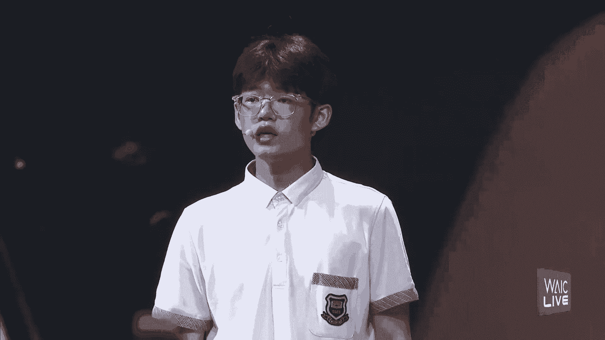
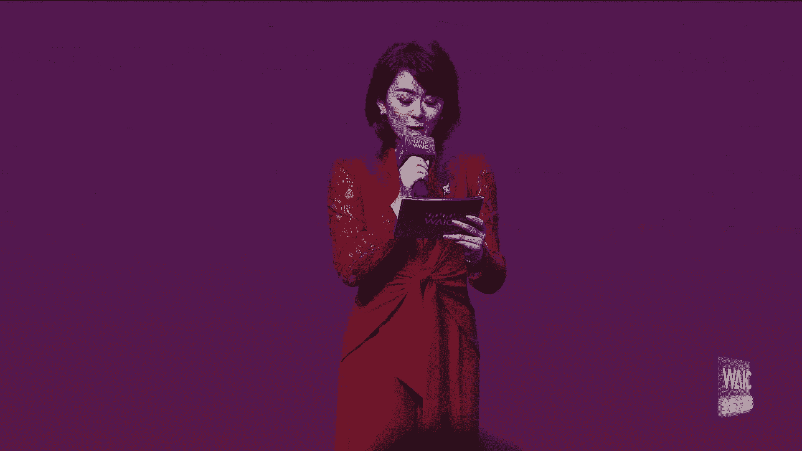

# P71：20240706-2024世界人工智能大会闭幕式 - WarrenHua - BV1iT421k7Bv

一生无限，斑马在跳动，像心跳的节奏，外壳的舞台，梦想在此刻聚首，穿梭虚语式编织青春的梦，AI的旋律引领未来的风，我们是科技的信徒，也是青春的代言人，每个字坚力，热情与执着并存，摸索的空间。

我们自由像梦想照进现实，热爱永不褪色，外壳的舞台，我们来主宰创新，是我们的态度，实现梦想，挣脱之不顾，科技创造未来，我们不停脚步，这是我们的舞台，突破未来生活新感悟，why外壳外壳外壳时代的先锋旗帜。

引领我们前行，创新制造无边际外壳外壳，沃沃科技风向标，挥尽全手指挥我和未来新天地，这是治理世界的时代，未来生活的画卷已展开，相聚外壳的舞台，用AI助力圆梦想，消世界绽放光彩，以共商促共享，以共商促共享。

以善治促善治，义共商求共享，以善治促善治，以共商促共享，以善治促善治，耶，好尊敬的各位领导，各位来宾，女士们，先生们，大家下午好，非常欢迎大家出席，我是上海广播电视台第一财经的主持人瑞琪，非常荣幸。

首先请允许我介绍出席今天活动的重要领导，欢迎您，欢迎您，出席今天闭幕式的还有，上海市相关部门和部分区的负责同志，以及参会企业代表，大会合作伙伴和新闻媒体朋友们，让我们一并对各位的到来。

表示最热烈的欢迎和最衷心的感谢，欢迎大家，2024，高级别会议顺利召开，即将圆满完成各项议程，今天下午我们再次举办大会闭幕式，进行项目签约启动仪式，平台揭牌等活动，并对大会进行总结。

创新预见未来后浪预示希望，那接下来呢，首先啊我们为大家邀请到了一组特别的表演者，请他们带来表演秀AI未来少年前行，给他们一些掌声好吗，I'm on the ground。

I'm my gion on the ground，I'm in my car that i loser。

大家好，我是韩琦朵，我梦想利用人工智能为医疗事业贡献力量，成为人类健康的守护者，大家好，我是许泽成，我的梦想是通过人工智能探索未知的宇宙奥秘，成为未来世界的探索者，大家好，我叫朱冠宇。

我用创新科技解决环境问题，推动绿色地球的发展，成为守护家园的先锋者，让我让我们共同努力，善善治AI。

促进善治生活，共度美好未来，AI未来少年前行，感谢同学们的精彩的表演，也为我们的闭幕式注入了全新的活力，谢谢我们说，高水平的大会离不开参会嘉宾高水平的演绎。

那今天的闭幕式呢，我们特别邀请到了两位参会代表。

来分享他们的参会体验，首先我们要有请加州大学伯克利分校，人类兼容，人工智能中心执行主任马克尼斯伯格先生，带来他的分享，Let's welcome mr mark nesburger，Please。

掌声有请，As we close，难，我很抱歉很抱歉要跟大家说再见了，但是我在这里呢获得了很多了很多的灵感，我见了很多的新的同事，很多的朋友来自中国，来自世界各个国家。

Already have plans，我和他们，有些人呢已经决定要做一些具体的合作项目，回家之后呢，我会马上开启这样的合作，我会在给全天全天候和他们开视频会议，Over the past。

在过去的三天里，在正式的会议里，以及在参展的时候呢，Privilege，我非常有幸和学者，企业领袖，创业者，各位贵宾政策专家和学生们一起讨论，也讨论了怎么来确保AI的福祉的公平分配。

以及它的安全和负责任的发展和使用，毫无疑问，这需要全球的的协作，我们在这里呢在这次大会上也取得了进步，The exhibits glimpse into the future。

我们的展品让我们看到了AIAI在社会各个领域，包括呃金融教育，能源，医疗领域所能带来的福祉，A我呢很惊讶地看到各个年龄段的学生，包括中学生，I fell in love，我非常热爱上海这座美丽的城市。

我的at night是也是在晚上啊，坐游轮参观了上海这座美丽的城市，Fell in love with robot，我也爱上了这里的机器人，我由衷的感谢和祝贺，每一位这个参与这次会议的人们。

也感谢数千位的这个参会者，我也期待着明年在这里见到大家，谢谢谢谢，Thank you for sharing with us，Please be seated，非常的感谢尼斯伯格先生带来的精彩的分享。

那接下来要上台分享她参会体验的这位嘉宾呢，是来自元宇宙加速与可持续发展联合会，我们掌声有请，尊敬的各位领导，各位嘉宾，各位同行，大家好，的闭幕式上发言，本届大会内容非常丰富，覆盖非常全面。

不仅对与人工智能直接相关的技术，产业政策进行了全面深入的讨论，对于人工智能的未来发展方向和治理方式，达成了一系列共识，还延伸到与人工智能密切相关的热点领域，例如人形机器人和元宇宙，关于人工智能。

人形机器人，元宇宙这三者之间的关系，我们有以下几点观察，首先人工智能正在改变机器人技术研发的范式，从基于规则到基于参数，从人工编程到自主学习，其次人工智能和机器人技术的进一步发展，大模型的能力泛化。

聚生智能的崛起，乃至通用人工智能的涌现，需要以世界作为训练环境，获取海量的多模态的训练数据，元宇宙能够以最低的成本和风险，最高的效率和多样性提供这样的训练环境，从而加速人工智能和机器人技术的发展。

最后人工智能正在极大地加速，元宇宙产业的发展，在供给侧，大尺度细粒度的虚拟世界，海量的多样化的虚拟场景和虚拟物品，在深层式人工智能的辅助下，将以100倍1000倍的速度被创造出来，数以亿计的虚拟角色。

也将由深层式人工智能驱动，提供深度个性化的各种互动体验与服务，在需求侧，无论我们是否愿意承认，人工智能都将替代大量的人类劳动，这不仅是大势所趋，并且已经在发生，现实世界中的劳动力市场将出现两极分化。

一部分人将在人工智能的辅助下，极大的提升工作效率和水平，获得更多的机会，另一部分人则将面临与人工智能的竞争，如何安置过剩的劳动力，元宇宙可能是最佳的解决之道，基于对上述大趋势的观察，为了抢抓机遇。

引领下一波产业发展大潮，我们正在筹建上海元宇宙与智能研究院，首批研究方向，重点聚焦两大主题，一是metaverse for science，促进有助于提升科研效率，拓展科研能力。

改变科研范式的元宇宙技术研发与应用推广，包括但不限于科学模拟与仿真，科学可视化，科学协同工作，二是DAGI，去中心化的通用人工智能基础设施，为了避免超级人工智能被极少数人掌握。

为了推动普惠全球的技术平权，以去中心化的方式发展，用于人工智能的算法，算力数据建设全球化，开源开放的通用人工智能基础设施，期待与各位同行共勉，携手并进，共赢人工智能新时代，共创人类文明新篇章，谢谢大家。

谢谢共创共建，共商共享啊，非常的感谢袁玉先生的精彩的分享，在这里呢我们也发出诚挚的邀请啊，邀请全球的人工智能的优秀的人才创新团队，选择上海，扎根上海，大展抱负，实现梦想，好尊敬的各位领导，各位来宾。

接下来我们进入到本届大会的项目签约环节，首先我们将共同见证的是书生大模型赋能战略，行业合作签约，上海人工智能实验室，携手各行业头部机构，发挥连接器，放大器加速器的独特作用，使用书生大模型及生态技术。

促进产业链上下游的协同创新，加速科技成果向现实生产力的转化，首先呢我们要有请上第一组的签约单位，有请上的是上海人工智能实验室主任助理。

石博明，浦东新区数据局局长宋卫华。

中国电气装备研究院执行董事总经理钟建英，上海苑总工程师，国家卓越工程师林毅峰，宝信软件，中国保五工程科学家钱卫东，龙吟智能副所长黄玉树，上海钢联首席技术官兼首席数据官郭军。

工商银行软开中心高级专家刘成岩好。

我们请各位签约代表做好准备。

321请签约。

我们掌声，祝贺书生大模型赋能战略行业合作签约成功，请看向摄影师，记录下这个值得庆祝的瞬间，谢谢好，请各位签约代表落座，谢谢。

好各位来宾，下面我们要进入到的是上海市人工智能，重点项目的签约环节，大模型正在以前所未有的速度发展，将进一步的整合到日常生活，和各个行业的应用当中，那首先呢我们将会进行到的是大模型项目签约。

我们要有请杨浦区与顺之千寻。

长宁区与飞书逸途，徐汇区与摩达社区，彩悦新城，蓝马科技，特赞科技，静安区与蚂蚁云，虹口区与树船集团，浦东新区与中康树科，好，我们请各个区和我们的签约企业代表，来到我们的舞台上。

好我们请各位签约代表做好准备，在各位的共同见证之下，321请郑重签约。

好我们请各位代表看一下我们的摄影师的镜头，也请现场的朋友们共同掌声，祝贺并鼓励他们，谢谢好，请各位签约代表落座，谢谢，接下来呢我们的签约继续啊，聚身智能是人工智能，在物理世界的进一步的延伸。

其潜在的应用前景和对社会的影响，也使它成为了人工智能领域的一个重要的方向，下面我们要进行的就是聚深智能项目的签约，我要请上各位签约代表。

有请到的是临港新片区与智源机器人，人工智能产业投资基金与银河通用机器人，闵行区与飞西科技。

金山区与斯塔纳航空科技，青浦区与吉瑞医疗，浦东新区与青宝机器人，他山科技，我们请各位代表来到我们的舞台上，好请各位代表做好准备，321请签约。

祝贺签约成功，大家掌声表达一下我们的这份祝福，谢谢谢谢，请落座，好智算生态呢将云计算的弹性，大数据的洞察力，物联网的广泛连接，以及人工智能的智能决策能力啊，融为一体，打造了一个全新的计算范式。

那接下来呢，我们将要进行的是智算生态的项目签约，我们要请上各位签约代表来到舞台上。

他们是宝山区与太初元恒，黄浦区与百度智能云，嘉定区与木星科技，浦东新区与达摩院。

上海新路科技，盐山科技，徐汇区与库帕斯普陀区与美高玉科技开发，我们请各位代表来到舞台上，好我们请各位代表做好准备，拿起签约笔，321，请郑重签约，同时呢请各位看一下我们的摄影师的镜头，也请大家掌声。

祝贺签约成功。

谢谢好，请各位代表落座，谢谢，可以说在我们大会的闭幕式上签约啊，也是一个非常值得纪念的瞬间，在这里呢，我们也要特别的预祝所有的签约项目呢，能够创业成功啊，早日取得突破。

并且在上海的这片大舞台大平台上收获硕果，当前呢上海正在按照国家战略的部署，聚焦建设五个中心重要使命，深入落实人工智能上海方案，同时积极践行全球人工智能治理倡议，接下来，我们将进行。

上海人工智能安全治理实验室的揭牌仪式，下面我们有请，上海市经济和信息化委副主任张洪涛先生。

有请两位来到舞台上为机构揭牌，大家掌声有请，好请两位领导做好准备，也让我们现场的朋友们共同倒数，321，请揭牌，掌声，祝贺上海人工智能安全治理实验室揭牌成功，谢谢两位领导，请落座，好尊敬的各位领导。

各位来宾，接下来呢我们将会在各位的见证之下，进行的是，上海市智能算力公共服务平台的揭牌仪式，我们邀请上，上海市经济和信息化委员会主任张英女士，有请两位领导，好请两位领导做好准备，也在各位的见证之下。

我们共同倒数321，请揭牌，掌声，祝贺上海市智能算力公共服务平台正式揭牌，谢谢两位领导请落座，好上海市国资国企，以落实国企改革深化提升行动为契机，积极地拥抱人工智能。

打造一批融入企业生产经营系统的行业大模型，应用示范场景，推动国企自身的转型升级。

也为社会经济的发展注入新的动力，下面我们将会进行的是，上海国资国企人工智能家行动倡议的发布仪式，我们要请上的是，华，机场集团总裁冯鑫，上海银行行长施宏明，上汽集团副总裁总工程师祖四杰先生好。

我们请各位领导做好准备，请各位领导将手触摸大屏，好我们现场共同倒计时，321请发布，聚焦大模型基础设施建设，探索可落地的商业模式，打造行业大模型应用示范场景，AI加赋能国资垂范，志向未来国企端行。

我们请摄影师记录下这个瞬间，我们也掌声祝贺我们的发布非常成功，谢谢我们，也期待着你们在实践当中啊，突破行业的一些典范，谢谢请各位领导落座，好刚才呢为大家发布的是上海国资国企，人工智能家的行动倡议。

那接下来呢我们将会进行到的是，上海5GA方示范之城的启动仪式，上海市政府与中国移动深化战略合作，锚定上海市未来3年5GA与AI融合发展，持续创新，助力上海保持数字化的引领地位，庄墓地先生。

中国移动通信集团有限公司，副总经理高同庆先生，请两位领导共同上台。

为我们来正式启动上海5GA方示范之城，有请两位领导，好请两位领导来到我们的启动装置前，在各位的共同关注之下，我们来倒数321，请启动，祝贺上海五届A方示范之城正式启动，谢谢也请两位领导落座。

好尊敬的各位领导，各位来宾，并宣布大会闭幕。

尊敬的各位来宾，女士们，先生们，大家下午好。

本届大会的主题为，以共商促共享，以善治促善治，来自50多个国家和地区的，1300位领军人物参展团吐共襄盛会，包括九位图灵奖，菲尔兹奖，诺贝尔奖的得主，88位国内外顶级院士，截至今天下午两点。

大会线下参观人数突破30万人次，全网流量突破10亿，比上届增长了90%，均创历史新高，对大会的成功举办表示热烈祝贺，对世界各国代表，国际组织，专家学者，行业精英，投资机构，初创团队等各位朋友的积极参与。

以及大会工作人员，媒体朋友和志愿者的辛勤付出，表示衷心的感谢，本届大会精彩纷呈，硕果累累，传递了最响亮的中国声音，向全球发出人工智能的上海声音，联合国工发组织，全球工业人工智能联盟卓越中心正式启动。

探讨了最前沿的热点议题，按照13加十加X的会谈购呃论坛架构，成功地举办了107场论坛，探索了scaling law数学极限，探寻了30年后，易购群智的通用人工智能发展路径，30余个国家部长级的官员。

以及相关国际组织负责人开展了治理对话，集聚最瞩目的智能产品，大会的展览面积超过了5。2万平方，500余家知名的企业，超过1500项展品参展，50余款的新品首发首秀均创历史新最高，近百个大模型集中展现。

18台人形机器人的矩阵亮相，国内首款全尺寸通用人形机器人，开源公版机发布，发布最重磅的行业成果，deep link开放计算体系，遇电智能仿真器等荣获CE大奖，语料建设规则。

人形机器人管理规则等30余份研究成果发布，创建最多元的创新生态，首创6000平方米的全域连接馆，聚焦了项目孵化路演，采购团组需求场景，和投资机构搭建一站式的全周期服务平台，对接132个采购团组。

形成了126个项目的采购需求，预计意向采购金额达到150亿元，推动了24个重大产业项目的签约，预计总投资额超过400亿元，各位嘉宾，各位朋友，上海已经连续成功举办了七届，面向未来。

我们将持续做优做会做大，大会的科技风向标，应用展示台，产业加速器，治理议事厅的功能持续增强，大会的溢出效应，打造人工智能领域交流合作的年度盛会，与海内外的朋友携手共襄盛举，共同探索人工智能的无限可能。

在此我向各位嘉宾发出诚挚的邀约，让我们相约2025再聚上海，谢谢大家，现在我宣布。

也非常感谢大家的到来，感谢各位的持续的关注，也让我们相约2025，期待我们明年再相会，谢谢各位，谢谢，全球智慧再度携手，探索人工智能无限可能，百场论坛引领国际视野，技术赋能，构筑产业集群，创新活力。

推动要素发展，智慧上海，以共商促共享，以善治促善治，2024，高级别会议，与您相约好，欢迎回来。