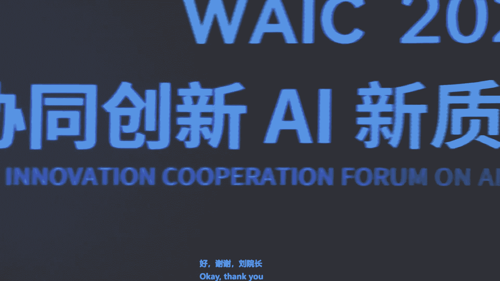

# P9：20240704-长三角协同创新 AI 新质生产力发展论坛 - WarrenHua - BV1iT421k7Bv

🎼在ね。🎼创新新智生产力发展论坛。本论坛由长三角国家技术创新中心主办，我是刘国权，很荣幸与大家齐聚一堂。我仅代表国创中心对各位的到来表示热烈的欢迎和衷心的感谢。

长三角国创中心是由上海、江苏、浙江、安徽等等相关机构共同组建的综合类的国家技术创新中心。我们以推动重要领域的关键技术攻关为核心使命，为长三角区域的产业发展提供源头的技术供给。今天我们举办这场论坛。

探讨探讨如何在关键技术突破、人才培养等方面凝聚多方力量、跨区域跨行业的协同，推动人工智能技术与千行百业紧密结合，形成强大的新智生产力，助力经济的高质量发展。在论坛开始前。

请允许我荣幸的介绍今天出席活动的领导和嘉宾。我介绍完以后，大家统一的鼓掌。中国工程院院士、清华大学智能产业研究院院长张仰琴院士。中国工程院外籍院士、德国科学与工程院院士张建伟院士。

中金首席经济学家、中金研究院院长彭文生院长彭院长被堵在外面了，还没还没进来。香港科技大学广州协理副校长熊辉教授。熊校长应该也还没进来，也是堵在外面了。

长三角国家技术创新中心管委会委员、院长助理陈晓强博士。和肖功海博士，他们在他们在外面嗯。国家超级计算无锡中心主任杨广文教授。面壁智能联合创始人CEO李大海先生。李总应该在接受采访，好像。

斯比驰联合创始人首席科学家于凯教授。第四，范市联合创始人总裁胡石伟先生，胡总也是要稍微晚一会儿到。T3出行CEO崔大勇先生。清华大学智能产业研究院无锡创新中心执行主任陈云伦主任。

云企资本执行董事韩毅先生。韩总应该也是还没还没进到会场。헐。论坛开论坛开始之前，我们有掌声有请中国工程院院士、清华大学智能产业研究院院长张亚琴先生为本次论坛致辞。刘庭张也士。ちょどか。听得见吗？

下面听得见哈O。😊，啊，谢谢谢谢joorge很高兴来到我们啊这个新智生产力的论坛。😊，呃，最近呢这个人工智能发展速度很快啊，特别是过去这听得见吗？后面。需要需要这个吗？可以哈OK好。😊，呃，特别过去这。

呃，两年吧。呃，大模型和生成式的AI呢。啊，这个这个在走向一个这个爆炸式的发展。我简单谈一下啊，我需要什么？可，我简单谈一下呢。我自己呃对大模型和A深圳AI发展的一些方向，一些看法呀。呃。

也谈一些我自己的观点。我我想声明一下呢，我我讲的这观点完全是个人观点，不代表呃清华大学，也不代表我们智能产业院，也不代表任何别的教授，完全是个人的观点。呃，那么首先的话呢，就我觉得这个呃。

大模型啊和生成A爱呢有5个大的趋势，五个大的趋势。第一个趋势呢呃就是我们现在大家都很熟悉的这个多模态啊，多模态、跨模态以及多尺度。这里面当然有啊这个文字，有声音，有图像啊，有视频啊。

但是呢呃我们也包括啊像激光雷达无人车里面的，也包括这个结构传感器，也包括在生物里面的DNA啊，蛋白质细胞呃其实是一种啊多模态跨模态的这个方式。那么第二点的话呢，就是啊。这个走向边缘。我们现在讲的大模型。

更多的是这种基础大模型在云端的。我们现在更多的智能走向我们的PC，走向我们的电视啊，走向我们手机啊，走向呃车啊走向这个。各种边缘。那么第三点的话呢，就是智能体整体的发展。啊。特别是自主。

规划去完成一个任务去自我升级，包括自我编程，自动试错啊，是一种完全呃自呃智能体。另外一个呢就是所谓物理智能。所以我讲了很多年了，就是我们现在大模型呢啊要和物理世界结合起来啊，和包括无人车、无人机啊。

这个无人系统啊，包括物理设施、基础设施。啊，其实呢走向通用人工智能，不仅仅要理解这个世界，要读书啊，而且还要走路啊，要行路。所以说其实物理智能就是我们呃机器啊去和物理世界交互，来学到我们的这个世界模型。

那么最后一个呢啊是比较长远，但是我认为也是最重要的一智能，是生物智能。就是我们把大模型和我们的大脑和我们的器官啊和生物体连在一块的时候，那么这个时候呢呃智能就是AI加上这个HI新的智能。

那现在怎么样走向呃这五个智能呢？有很多不同观点啊，我谈一下我的一些想法。呃，很多人问我这问题呃。呃，包括比如说什么时候啊通用人工智能可以实现啊，现在这个尺寸定理呃或者规模定理scaning law啊。

是不是一直会呃一直会会会呃还会。啊，这个是是是成立啊。啊，很多这样问题，我稍微讲讲我的一些观点。首先呢我觉得在未来的5年到10年啊，这个就目前这个大模型啊生成式AI。

还是呃一主要的一个产业和技术的一个方向。啊，我们的这个规模定律啊还会有效啊。到底什么时候无效啊，规模定律就是一堆算例堆数据啊，用大致同样的这些算法框架啊，然后还可以取取现取得更好的结果。啊。

就是涌现效应，还继续成立。这个的话呢，在未来的几年还会还会还会成立还会成立啊。啊，但是呢。我们现在的整个就是简单的推算力，这个推推呃数据呢一定会有达到一个瓶颈，一定会啊。遇到一个瓶颈是什么时候呢？

我也不知道啊，我估计估计可能5年之后会有瓶颈。那么另外这个效率十分低，就目前整个这个效率很低。比起我们人大脑的话呢啊目前这个效率可能低差不多三个数量级，就是差我们千分之1。咱们现在有861个神经元。

然后每个神经元有差不多啊，1000到几千个吧，000到1万个这个突出就连接。但我们只用啊只用20瓦，然后们我们不到3斤重啊，所以我们的效率是比它高的很多。啊，所以我自己认为呢。

在未来的这个5年呢会出现一个全新的一个架构。这个架构不是现在的这个diffffusion transformer，不是现在这个out regress。啊，也不是现在这decode的 only。

它还会沿着当然这个这个规模定律的这些方向走，但是呢会有一个全新的框架。这个框架呢需要有首先要有一个记忆系统。我把它叫做三层记忆系统，下面人类是三层，有DNA记忆啊，有这个呃短期记忆海马体记忆。

然后有这个呃皮层记忆长期记忆。现在目前我们的AI其实这个大模型是没有真正的知识记忆系统的，是没有真正的物理模型的。然后另外呢，我们现在的这个系统的推理能力比较差，但是透明性比较差。

所以在未来的5年左右呢，我们现在已经在做这事了，我认为会有一个新的一个体系啊来来取代现在这个现在这个这个架构。嗯，那么。啊，最后一个问题呢，大家常问我说什么时候可以达到这个HGI达到这个通用人工智能。

啊，我自己的估计呢是15到20年。15到20年，那我把它分成三个阶段啊，第一个阶段就是我们现在所谓的信息智能，就是多模态智能。啊，目前呢这个chGPT和GPT4呢已经通过图灵测试了。

其是当时在2222年10月份出来的时候，我的第一感觉我就说通过图灵测试文字的图灵测试。当时还写了篇文章。呃，最近呢就上个月我看到呃UC呃C Diegogo和几个单位。

他们他们证明了他们从这个实验和和理论上证明这个通过文字文测试。我觉得这个。啊，视频的话呢，像sra啊或者gemanon呀啊GPT这个VO啊，或者下面到到5的话呢啊应该应该在5年之内啊。

在视频也能通过图灵测试。在这个图灵测试是一种新的图灵测试。然后到这个物理智能或者巨生智能的话呢。可能还需要5年甚至更长的时间。那巨神智能。第一个呢就是无人驾驶啊。

无人驾驶可能是最快通过图灵测试的第一个巨神智能。然下面就是机器人啊，人形机器人啊是产业的机器人，然后是家庭的机器人啊，然后我我看这个呃张先授我讲讲农业机器人吧，农业应用。

所以我这个的话呢需要可能呃再要需要5年到10年的时间。啊，那么最后的生物智能包括脑机接口是植入芯片也好，或者是用这种传感器也好啊。呃，还需要可能再需要5年时间，就加起来差不多15到20年时间啊。嗯。

你如果5年前问我这个问题的话呢，我说可能需要50年，就过去这几年呃大模型的这个发展的话呢，我认为是加速了可能20年之内可以达到这个AI。但我这个AI不包括啊不包括我们的这种自我意识啊。

情感或者是或者是啊一些一些我不太懂的东西，更多的还是在呃这个各个领域里面啊，我能完成任务，完成的比人好完比人好，或者比大的人好。嗯，我就讲这么多，下面呃我知道我们有很多很精彩的这个这个这个论坛啊。

但是大家我经常讲一句话，人工智能啊是一个了不起的技术，可能人类啊有史以来是最重要的技术。但是往往的话呢，我们在短期内啊会高估啊技术的影响，在长期的会低估技术的影响啊，谢谢大家。不好意思。

让我把我这个讲稿给弄乱了。我刚才听到那个张艳生提到说再有20年。再有二审单就能实现这个A级就是通用的人工智能。那我算了算，那个时我就70多岁了。嗯，同时我也想起了220多年前的一个往事。

20多年前我刚去读博士的时候，我的导师跟我说，你们有一位著名的师书是那个微软亚洲研究院的院长，就是蔡亚青老师。然后当时一直没有机会来见面。20年以后，我有一次第一次跟张院师见面的时候。

张院师问我问我的第一句话，就是你是谢民老师的同学还是他的学生。我说我虽然长得有点老，但我确实确实是谢老师的学生。好，接下来让我们。呃，进入下面下面一个环节。

就以前我们呃刚才那个张安社提到了农业智能和农业机器人。这个其实以前我就很不相信这个机器人能在农业上有特别大的应用。因为中国的农业还是有很多特殊性的。但是我参加了一次论坛以后。我就忽然的了解到，哎。

这个东西很可能在中国还是能有应用的。那实际上是那那次那个论坛让我改变我自己观点的，就是马上要来讲讲的张建伟院士，有请张建伟院士。🎼大家。🎼大家下午好。🎼管理比赛。🎼黄子江。🎼这么大。🎼，🎼。

🎼垂直领域的报告还是第一次啊做AI和农业的新智生产力的报告。我觉得今天也是一个显示我们长三角呃研究院的创新的一个很重要的一个特质。因为呃农业是未来的一个重要的这个人工智能的蓝海的应用场景。啊。

我说了人工智能和机器人啊，未来从工厂已经走入我们的这个千家万户呃，现在的工业的呃人工智能和工业的机器人的应用，可以说是占据着现在我们的人工智能和机器人创新公司的主要的收入。呃，智能驾驶啊。

这个是刚才亚琴老师也谈到了可能是下一个巨深智能能够显示这个对千家万户产生影响的一个行业大健康啊，我们未来的手术机器人康复机器人，他们的copi也会逐渐的显示这个真正的商业应用啊。

然后我又列举了几个包括农业家庭和教育啊，这个现在的人形机器人啊，这个也是变成一个非常。火热的赛道，人形机器人可能是比农业方面，比工厂方面先进入家庭来助老助残，帮我们端茶倒水，收拾房间等等啊。

但是呃今天我们聚焦在这个农业方面来讨论一下这个崭新的话题。现在机器人啊作为一个心智生产力的一个代表。实际上我们看到这个从这个现在有批量的啊。

每年有上千万的产量的和现在刚刚呃方心未艾的这种呃几百台这种呃中层的这商业化的结果，到未来，我说我们真正的每一个都是万亿市场的这个应用啊，我们从现在这种家庭的这个呃扫地的机器啊。

现在已经变成了这个一个呃咱们中国也是非常具有竞争力的一个心智生产力的代表啊，现在的这种呃。这种这种呃酒店，还有博物馆，还有这种小型的这种呃有限场景的自动驾驶啊，使得我们现在有这个看到了小批量的这个应用。

但是未来还有很多很多的这个技术上的挑战啊，刚才雅青老师也讲了，这个十年20年，我们将会看到的。我说一个是工厂里的叫多模态的制造的机器人，室外的服务的机器人，农业的机器人啊。

家庭里头的人形机器人和真正这全场景的自动驾驶和建筑机器人等等啊。所以我们今天就先谈一谈这个农业机器人。现在呃我们看到了这个整个呃这个全球都是处于一个劳动力及其短缺的一个阶段啊。

现在我们在开这个机器人和自动化大会方面这个关于农业机器人的这个session，还有展览嗯，都逐渐的明显的在进行增加啊，尤其是三年疫情俄物战争啊，造成了这个人员流动的这种呃不便啊。

现在欧洲呃这种很多这种呃在呃农业这个收割的时候，以前很多东欧的劳动力能过去。现在都不能实现，所以在那边可以看到很多很好的草莓蓝莓都没有人摘，都坏在田里头。

然后我们中国呢实际上呃也是现在处于一个呃农业和这个呃现代化急区的呃急需的一个阶段啊，现在我们的这个老龄化社会的这种呃长。景也逐渐显现啊，现在想做这个农农业的劳动力越来越少。

实际上呃这个全球的农业正在面临着严峻的挑战啊，包括生产效率和数字化的智能的呃程度很低，田间浪费，长周期的供应链等等啊。嗯这个劳动力的短缺，也是因为这个老龄化社会和城市化的整个的进程。

还有就是全球我们现在需要关心的叫全球的气候变化啊，碳中和是我们现在是个全球啊，我们可以合作的一个非常重要的目标啊，土壤固碳啊，然后减少营养成分的流失等等啊。现在中国的土地很多都是呃非常非常的板结。

这个离地的话都离不很深啊，这个由由于农药由于化肥啊，现在这个呃使得我们现在的这个国土这个一定的这个达到了一定的这个呃呃土壤固炭和水分流失的。两分流失的场场景，未来像嗯这个欧盟已经在布局如何减少农药。

减少化肥，甚至从今年起要禁止除草剂等等啊。这些都是给我们实际上啊未来的机器人和AI在驱动未来的农业生生产力啊带来了新的这个呃机会啊，从现在的呃农业的这种定量的监测啊，到物流呃除草这个喷洒采摘减脂等等啊。

我想呃从欧盟美国和英国呃，这是我们稍微在国外比较熟悉的能够哦现在进行布局的这个呃这种场景啊，包括我们应对的要求是需求的多样性，包括多样化的果蔬品种和特色的生长环境，对农业机器人提出了新的要求啊。

机器人和AI的能力啊，现在我们正好。是一个处于人工智能爆发寻求应用场景的这个阶段，如何让这个机器人和人的眼睛、大脑和四肢一样，来替代传统的农业劳动力，开取新的这个市场机遇是一个特别好的话题。应用场景啊。

可以先针对这些经济价值高的叫hotic culture这种呃比较贵的这种果菜品种啊，满足当地的生长环境。所谓的organic发明来适用嗯多变的应用场景。所以呃在这个农业机器人。

现在可以说也是处于一个爆发式增长的阶段。可能呃现在的比较这种呃conservative的预期是到2026年能达到这个呃1000亿这个呃美金长期发展肯定是一个万亿的市场啊。

现在从这个呃呃自自主的这个移动到这个呃的农场的这个进管理，到最后的harvesting全世界。我们看到这个呃这种创新公司也正在密密紧锣密鼓的进行布局。但是呃还有很大很大的空间。

值得我们做人工智能做机器人的呃进入这个呃非常重要的一个赛道。从关键的平台来讲，我们现在就是呃通过这个也是打造这种尽量往通用方面的人工智能和机器人方面走啊，包括它通用的控制和通用的平台啊。

未来可能终极目标还是人形机器人啊，这个如果我们人形机器人能够哦代表哦我们真正的一个垂直的应用，能够下田，能够出去采摘啊，来这个带来收入，这是一个可能十年20年后的场景啊。

但是我们第一步先做这种自主导航的行走的机器人，包括把我们的机器智能和视觉，首先应用进去啊，从这种安全的人机协作，带IOT的监控和便携式的呃管理终端和农业的作物的监测啊，高精度的这个呃基站。

还有室外的高精度的导航。农业物流机器人和长距离的无线通讯等等。从嗯机器人的AI控制软件来讲啊，我们现在要呃这个呃针对这种应用层的这种特殊的需求啊，包括包括所谓的souting啊。

这个呃监察啊数一数收成大概会是多少啊，这个物流除草和采摘啊，除草这个呃这个领域就是一个呃大模型AI和机器人这个非常好的应用场景啊。我说这个呃今年欧盟将会禁止这个草甘林的这个使用啊。

呃不管是正常的发明还是organic的发明啊，除草的话只能用物理的形式来进行除草啊，可以想象，如果用人的话，这工作量会是多大。所以呃这个呃在功能方面，我们从导航、视觉运动和安全控制等等啊。

这个现在我们可以基于roose基于基于linux的操作系统来打造真正的AI的这个呃硬件的平台。从呃未来的这种高经济性啊高韧性啊高算力和呃这个高带宽。这这些方面能够真正使我们的机器啊。

我们的人工智能能够在这种呃全天候的情况下能够工作啊，这也是我们实际上对于我们的自主制自主系统是提出的非常有用的这种场景。

这农业机群人导航系统实际上啊包括了在呃这种极限环境里头的非标准的openend呃这个无基础设施的工作环境，还有这种多变的工作条件啊和这复杂的场景和应应用需求。然后尤其是在农业的这个应用里边，呃。

现在这个整个农民的收入还是比较低啊，对成本的控制和资源的限制的要求等等啊，这些都是呃我们农业机群人未来的这个重要的挑战。实际上呃不单从这个导航来讲啊，现在不说人形机器人导航。

现在从这作为自动驾驶的在田间的导航，就是呃我们未来需要这种呃不依赖于GPS有呃和有源定位的模块，就是模弥补现在的单一传感器的不足，针对不同的农农业的应用来做通用的自主导航。

实际上通用的包括未来的这个交互和通用的。呃这个呃manipulation这个操作等等。但是我们先在导航里面可以说呃讲一讲啊。

我们最近呃和这个安onbo呃一家呃这个在剑桥注册的这个公司和呃现在也和我们长三角研究院进行一些合作啊，未来能够落地我们长三角的人工智能的研究呃生态里边的一个例子。从自主导航行走来讲啊。

我们从基于多传感器的slam啊，基于这GPS导缸、导导航雷达、视觉的惯呃惯性传感器等等，来保证机器人的安全高效。然后把任务整合在一起，真正实现这个呃有效的数据融合。然后在行走方面。

我们现在已经呃这个建立了这个自动的呃生成节点地图呃，农农场的导航和语翼的农业信息的自动搜集等等持然后机器的视觉啊，最近啊也是在呃英国啊在德国的呃几个呃农业的场景。

现在也是可以说已经出具了商业应用的规模啊，这个呃sing实际上现在也能直接带来价值啊，首先是产量的预测啊，现在这个在欧洲的这个精确的发明这种过程中啊，这个呃一个农场主。

他要跟呃supermarket签合约的时候，他要签多少个产量如果签的多的，签的少了。如果预测不准啊，对它都是个经济损失。所以精确的能够预测产量啊，包括成熟度的预测和。这个技术和分级等等都是非常非常重要。

我去年的这个呃收割葡萄的时候，我还在瑞士在一个葡萄厂啊，葡萄农场啊，和他们和朋友一起采摘类葡萄。他那个葡萄的这个对对葡萄的成熟度要求非常非常高。然后只有一个星期的时间啊。

在呃葡萄真正的长得特别熟又没有烂的情况下进行收割。这样的话，它造出的酒，这个价值才会足够足够的多。然后另外的病虫病虫害的检测啊。

现在用高分辨率的这种呃人工智能的视这个视觉能够做成霉菌蚜虫和多矿部相机对他们的这个检测啊，精准作业啊，这也是呃未来真正采摘的一个重要的前提，还有这个修剪啊。

这个如何用嗯人工智能来进行修剪的这个呃必要性必要。点和修剪的规划等等啊，这些都是。我给我们从工业的这种标准场景，到我们整个大自然的diversity的这种环境里头提供的特别好的应用场景。

所以我们嗯从这个智能感知到持续学习到机器的技术，在这种场景底下可以找到非常好的应用的过程。包括从呃底层的农业大数据，加上我们的现在的人工智能巨深智能。加上啊刚才亚琴总也提到的这个呃边缘智能啊。

呃未来我们的呃大模型啊，现在已经开始在手机端进行应用啊，它的这个多模态大模型的training的整个的参数会变得越来越compact。未来这个呃从手机到机器人到农业的机器人都会实现啊多模态大模型的应用。

然后机器视觉的系统啊，现在我们也做了一些例子啊，这个呃包括精细的啊高清产链的地图啊，比如说成熟度的预测和这个检测的技术，还有这个实力的分割和成熟的估计等等啊。现在呃用嗯这个最新的机器人和视觉的技术。

可以我们现在啊达到了呃这个呃初步的应用的场景的这个呃阶段。嗯，安通bo呃最近呃也在英国拿了几个呃应用的单啊，包括在几个农场啊，自动起码这个呃这种呃loggistic的应用啊，现在已经开始产生价值啊。

然后另外一个呃美国的呃相应的公司叫borrow啊，在机器人自动化公司现在也呃不断的在招我们机器人的这个博士和专家来进行田间的这种loggistic的呃这个首期的应用。

然后农作物的监测实际上我们逐渐的呃把这个应用的等级往上提升啊，从单功能加上多功能啊啊，包括农作物的呃整个的监测。我们现在安通bo啊。

在英国呃进行的这个呃这种高附加值的草莓呃这个蓝莓葡萄等等的这个自动识别和自动的呃鼠树呃这种呃场景，现在已经啊在呃英国已经呃可以说几个典型的农场啊都在进行这呃新的应用。然后除草啊。

刚才我也提到了这个是一个非常让人呃兴奋的一个一个场景啊。这个呃未来怎么样用机器人呃和这种呃呃大模型能够把呃我们在这种真实的世界里头呃，把这个呃需要除的杂草和我们想留的这个庄家识别出来，用物理的办法。

不管是用激光啊，激光现在还是能耗比较大。然后还有一些电烧和未来的真正的用呃像人一样的物理除草的整个的过程，实际上在这个领域里头就能够哦创创新出呃几家独角兽公司出来啊。

现在在欧洲呃有几家这个刚刚开始的这种呃除草的机器人和定定量这个呃这个呃还有就是说有的地方可以用除草剂啊，但是你要是精确。除草啊除草剂只打草上啊，不打其他庄稼上。刚才看到就是这种场景啊。

然后使得我们的未来的这个呃农业的这呃产品啊尽可能啊少受这个除草剂致害等等。病虫病虫害的防治啊，现在也可以用呃机器人和自动化来进行这个呃实现啊。

这是我们嗯在英国做的这种用嗯紫外线来进行定期呃杀虫的一个场景啊，未来我想啊在呃这个咱们中国这种比较高档的，甚至未来这个成本建下来以后啊，自动除草的这种场景，也会呃嗯这个越来越多的被自动化来除呃来实现。

采摘啊，这个呃现在呃一说到呃农业机器人都问能不能采摘，呃，是呃我相信啊在未来的5年10年内这个采摘的呃这个场景啊，将会给人工智能大模型机器人提供绝好的这个应用的呃这个呃比武之地啊。

从这种最简单的这种呃西红柿黄瓜的这个温室的采摘到未来真正的这个全场景的到最难的这种草莓蓝莓不能用shake的这个桦树能掉下来的这种这种呃呃比较珍贵的呃这个娇娇贵的这种呃产品的采摘。

实际上现在呃从呃小批量的应用啊，到这个实验室的应用。啊，我想啊真正到这个呃我们呃未来高效率的这种自动采摘这个能够给我们提供啊这个真。用非常好的应用场景。然后哦安tonbo啊，这个也是我刚才提到了啊。

是也是跟清华系呃有关系啊。呃这个我是做机器人的呃，这个呃吴浩博士是清华汽车系的本科啊，剑桥的博士啊，我们现在这个呃联起手来在打造这个未来农业为垂直领域的。

包括草莓、树莓、蓝莓葡萄的这种高附加值的全方位数字化啊，自动化和智能化的解决方案，包括农农药的这个呃病害的防治啊，田间的劳gistic和多模态的。监监护等等啊呃也在英国啊这个和欧盟获得了多多个奖项。嗯。

这是呃给大家汇报一下这些呃从嗯这种基本的这种呃农业机器人的技术到哦未来我向呃人工智能和这个巨深智能对这个农业的机器人会有什么样的影响啊？这个呃刚才呃开场嗯。

亚琴老师讲了5点这个对呃这个多模太大模型的这种看法啊，我也非常认同啊，我自己也是清华大学计算机系同时呃这个张博院士啊，30多年前开始做人工智能。

我说呃这个总在回顾一下人工智能现在给我们农业啊和各行各业赋能的几个四个重要的这个特特点，一个是算力啊，大家都知道啊，这个算力的指数型的增长啊。我说这三十几年的算力的增长跟我当年在清华读计算机的时候。

不止三十几倍，而是几百万倍。所以这个算力现在从这个云走到边缘。现在也给我们甚至到大模型啊，多模态的这个推理跟呃呃这个计算都实现了新的这个赋能方法。第二点呢，这个在这种巨大的计算引擎的支持下啊。

现在我们先不谈它的效率高不高啊，先说把现有的这个模型怎么应用起来数据啊，我说从当年我们的几十K的这种存储。到现在我们多模态的连续的这种从视频音频啊，到我们的触觉。

如何把它这个整个存储起来来进行我们的具身智能的应用。第三点呢，我说这个现在也是呃感到我们现在和全球进行共享，尤其是软件进行共享的阶段啊，使得我们算法，现在得到这个日新月异的整个应用啊。

每天早晨我们的实验室都是先跟对方的实验室先看最最新的文章，最新的code，所以这种呃全球共享的这种呃生态，使得我们现在。

呃在在处理视觉的呃这个CNN到处理这个呃语言文本的叫主要是recurrent neural network和现在机器人作为agent的reinforment learning的一些呃这个进展。

现在可以说日新月异。呃，现在以现有的这个transform跟diffusion model，实际上可以呃做呃不少的现在的事情，但挑战还很多。我给出几个例子。然后第四点呢。

我说现在这个呃机器人和人工智能现在能达到，尤其是在reinforment learning的过程中，叫learning to learn how to learn。

然后如何用mat learning用seem to real来进行这个新的人形机器人的这个包括农业机型人的创新啊，这是我们做的全世界第一个正步走的啊，这个机器人，我们通过上百万个这个仿真。

然后来做出这个新型的机器人也在底下有展出，大家有功夫去看看卓翼德的这个人形机器人。然后另外就是我们嗯在呃这个我的这个t姆实验室做的这种灵巧操作的啊。

能够哦真正处理这个工使用工具处理这个带视觉的带触觉的这种灵巧操作。未来在农业里采摘。我们现在也在进行一些创新的应用。未来的人形机器人的这种带表情的这种互动。我想未来都会成为我们农业机器人。

的重要的赋能技术。在农业机器人啊，这个它的多模态实际上也是非常非常的明显啊呃雅新农也提到了这个多模态是未来大模型的一个重要的这个特质啊。

我的研究所20年前就叫technical aspect of model system呃这个专门研究多模态。这个我们呃尤其是在呃农业的机器人里面，包括这个未来的这个呃这些呃农作物的采摘，呃需要触觉。

需要非常精确的这种嗯感知来进行这个灵巧的操作。所以呃未来这个多模态的技术。实际上啊真正的用到一个openend的在真正一个大自然的这种千变万化的这种环境里面，这也是一个非常重要的一个话题。

在这方面我们尤其是在触觉多模态里边啊，也是呃在呃这种工业应用使用。工具未来在农业里面都会有很重要的作用啊，我们最近做的一种可双向可伸拉的啊，像我们这个呃橡皮手套的这种这种材料的呃这种触觉传感器。

可以让嗯操作人员来带上来使用工具进行农业的采摘，把它的整个的巨身的智能的过程都收集起来。作为呃大模型巨身智能的学习的数据。在这方面我觉得呃是以触觉为主主体的这种具身智能会有非常多的新的应用。嗯。

这也是呃再继续衰解一下呃亚金总提到的这种各种感官的这种融合啊，实际上我们在10年前跟清华大学计算机系，还有北大的心理系和北大的这个呃和科学院的心理所，我们联合成立了一个叫跨模态学习的一个联合研究中心啊。

主要是像人一样，把这些多模态有效的呃整合起来来进行这存储交互表达等等啊，这个项目已经进行了1年，然后产生了非常多的这个成果。呃，然后说到这个最近的这个真正的落地啊，现在大家可能都在提具身智能啊。

这是呃我是呃总结一下，从如何我们现在从现在人人拥有的这种手机手表这种ICT的 deviceevice，让他们能够增加body的功能啊，包括呃运动。里头除了它这个呃mobility。

还有这个manipulation。实际上我们跟非巨身的智能就相比，我们加上了一个temple时间的序列，包括我们这个呃人机的交互啊，人机的协同和这个整个这感知我们不是被动的有什么图，我们收集来什么图。

我们是有本体我们可以主动感知等等啊，它的intelligence实际上和现在的非巨身智能也有着非常明显的差别。这个mty model是一个非常重要的一个特质。

然后它的这个整个的世界模型也是变得非常非常的这个可有挑战性，加上我们说除了这个时间轴之外，我们还加上一个空间轴啊，所以现在这个空间的认知，现在也变成一个特别重要的一个话题。这个空间的模型啊。

包括它的动态性，包括它的openend的这个特质啊，尤其在农业领域啊，这个。我们看到这个农业的千遍千变百百变的这种呃是模型啊，我们的学习啊。

从这种嗯非具深的这种CNRN啊到真正的reinfor learningsem to realinence planning，包括透明和mo啊，这些都是强人工智能啊，这个对我们巨身智能的非常重要的要求。

这些实际上也都是我们农业机器人未来要这个极其需要的这个这些呃场景。所以embodyed的 AI现在可以说这个变成了这个AI界，这个现在是特别关注的一个话题。实际上我们从机器人和应用的角度。

我们对embodyed的 AI实际上也是呃具有一个非常好的平台的这个呃提供的这个作用啊，从人形机器人到自动驾驶啊，这个到未来的医疗农业啊，家庭制造等等啊，我想都是。未来的巨深智能的重要的应用领域啊。

时间关系我就呃稍微这个加快一点。包括这个呃这个巨深智能，实际上是对人类的生活生活实践需求相符合的，尤其和我们的这个真正的农业的应用。然后我们最近也在发一些论文啊，这是只是我们的现在的十几篇论文的之一呃。

BT robot啊或者robotT然后如何用T生成的这些这些事件。然后和规划的序列，然后用结合我们的planning，把它现在的成功率从20%几能够提到90%几等等啊。

这成为这个robo automation letter的现在最受关注的一篇论文等等啊，这个我就讲几个小的例子。

如何用special reasoning和这个呃rein learning进行融合来进行真正的这个呃创。新的应用啊，包括我们这个世界模型的整个做好，光是农业的世界模型，我觉得可能还需要十年。呃。

至少十0年的时间，我们才能够把它打造出来。但是在这个呃这个到来的这个这一天之前，我们就用大数据用多模态的数据来进行补偿来完成这个数据和这个模型共享的这种这种过程啊，一方面我们做一些新的例子。另一方面。

我们通过这个世界模型来产生现在这种这像这种文本数据不具备的呃，这种呃这种物理交互的这些这些场景啊，还有一些通过我们真实世界的交互来实现这个真正具深智能的这个海量数据的这个呃实现这个挑战还是非常非常大如何用这种新的这种模型的这种办法来产生这物美价廉的呃这个呃。

呃，这些呃数据来使得我们农业机器人未来能够有其足够多的巨深智能的数据。啊，用这张图呢，就是我们也呃总结一下这个刚才实际上呃雅秦总也都提到了这个呃transent multi model em body AI啊。

包括我们说未来的应用的伦理和这个 needs啊然后在呃整个的呃包括农业基金，包括这个其他应用的场景。我们如何啊把这个丰富的modality加进去啊，交叉学科农业基金是非常典型的一个交叉学科的应用。

然后如何学会和呃这个AI这个联动啊，然后来找到新的问题啊，现在呃经常有人问呃if large language modelis the answer what is the question啊。

他们就是大模型里头找不到这个真正的呃这个有用的这个应用啊，这个我们现在从农业里头来提出的这种新的应用是实际上是非常非常。呃，重要我一直讲这个即使未来的大模型，在考试里面光是脑力劳动里头超过图灵测试。

但是呃达芬奇啊这个作为一个我们这个呃多才多艺的这个呃科学家、艺术家和呃这个人类的这个呃工程师呃，他的这种呃这种好奇心观察自然解释自然的能力和这个如何把同行的这个能力来综合好来找到新的问题创新。

我觉得也是我们今天聚在一起呃，来呃呃同一同讨论的一个非常重要的话题。我想呃未来呃AI机器人的大模型和智能农业的装备进行融呃深度的融合，来进行产学院的国际合作呃。

跨学科的创新呃让我们一起来携起手来应对呃全球的重大挑战。来，共创和谐社会美好生活。呃，期待在长三角地区啊，和通过我们的这个呃创新研究院啊，能够解出更多的这个落地的成果，谢谢大家。谢谢张先士。

从技术与产业结合的发展的角度，为我们分享了通过先进的智能技术实现农业新智生产力的全面提升。我我对那个智能除草机器人印象特别深。因为40多年前，我在华北平原山种地的时候，最烦的一件事就是除草。Okay。

人人工智能的发展离不开应用场景，离不开与各行各业的紧密结合和跨领域的协同创新。为了进一步推动人工智能技术在产业中的应用与创新。

长三角国家技术创新中心联合人工智能材料、制造生物医药等来自长三角不同领域的1余家行业细分龙头企业和研究机构，共同发起成立长三角人工智能加产业创新联合体，旨在构建开放、协同高效的产业创新生态。

聚焦人工智能技术在各行业的融合与应用，推进产学沿用的紧密结合，跨行业跨区域协同公关人工智能的关键产业技术。接下来我们将举行联合体成立仪式，有请联合体的成员代表。长三角。

🎼国创中心中心管委会委委员陈晓强博士。🎼T3出行CEO崔大勇先生。🎼万国数据中国区联席主席梁燕女士。🎼心。🎼清华无锡研究院智能产业创新中心执行主任一文先生。🎼机器之心创始人GSCEO赵赵云峰先生。

🎼扬州富威尔智合材料有限公司总经理詹詹勇先生。🎼上海富新智能交通控制有限公司总经理李广斌先生。🎼罗莱超柔研究院院长张辉先生。🎼派出电子科技有限公司联合创始人CCOO桥梁先生。

🎼戈尔股份有限公司阿尔法 labbs副院长于洋博士，上海嘉化联合股份有限公司科研部负责人贾海东博士。🎼上海医药科技公共事业总监张大强先生。🎼请嘉宾把手放在启动杆上，并听我口令，大家一起倒计时3秒。🎼3。

🎼2。🎼一。🎼现在我宣布长三角人工智能加产业创新联合体正式成立。非常感谢大家，请嘉宾站到舞台中央一起合影。稍微靠近靠近一点应该。好，请落座。联合体的发展离不开成员间的相互合作。

接下来我们将现场见证万国数据和清华智能产业研究院的合作签约仪式，通过产学研跨区域合作，共同推动人工智能算力基础设施运维及能源关键技术的研究。首先我们有请双方代表嘉宾一起上台。

🎼有请清华智能产业研究院创新中心主任陈玉伦博士。🎼万国数据中国区联席主席梁燕女士。🎼有。🎼，请两位交换也签字。好，谢谢两位。🎼接下来让我们邀请联合底的成员及人工智能投资领域专家，通过圆桌对话的形式。

共同探讨人工智能如何助力产业，实现高效协同，探索AI赋能产业协同发展的更多的可能性和路径。🎼首先允许我介绍一下本场高端对话的主持人及嘉宾。🎼中金首席经济学家、中金研究院院长春生院长。

🎼国家超级计算无锡中心主任杨广的教授。🎼第三，出行CECEO崔大勇先生。🎼清华大学智能产业研究院芦锡创新中心执行主任陈一轮博士。🎼云企资本执行董事韩毅先生。🎼，🎼有请各有请各位对话嘉宾台上落座。

🎼我把话筒和现场交给。🎼非常荣幸的这一只。🎼奇怪。🎼关系。🎼Yeah。🎼咱们这个点。🎼我们。🎼去。🎼Yeah。🎼感谢。🎼不去。🎼讲。🎼回家人。🎼怎叫。🎼，🎼快。🎼，🎼，🎼什。🎼第四位是韩毅先生。

荣旗资本执行董事。🎼那么呃大家都知道，2024年的政府工作报告首。🎼人工智能加过去互联网家到人工智能家。🎼可以说是真的。🎼这是。🎼谁。🎼什情上。🎼今天呢邀紧个。🎼再这。🎼回家里。🎼。🎼这个。🎼。

🎼Yeah。大家好。T3出行呢是。🎼但是我们现在已经是网元素行业的第二大。🎼咱们上海是。🎼我们主要是在这个这个大模型啊，我们叫铅包大模型和自动驾驶应用这两个场景上是属于在垂直领域吧。

我们有一些这个小的这个实践啊，一会儿给大家简单介绍介绍，谢谢啊，大家好啊，我叫陈一伦，我现在主要在负责一个清华air的创新中心。我们创新中心主要做的事情呢，就是把人工智能和各个典型的应用。

把它连接起来啊，我们既既聚焦在基础技术，也有应用技术啊，我本人的技术方向是自动驾驶跟智能机器人，谢谢。大家好，我叫韩义。呃，来自云企资本。呃，云企呢其实是呃财务投资机构。

但是其实我们过往这么多年投的大部分的科技项目里面都具有产业背景。所以今天也非常高兴能够和几位专家一起讨论，在人工智能大模型这个时代下的一些产业应用，谢谢好的，谢谢各位嘉宾呃，首先我想呃先请呃杨教授。

您是呃学书记有深厚的造诣。而且呢产业界有很大的影响啊，国家超级计算无锡中心主用。讲到这个超级计算的，大家马上就会想到这个人工智能的发展，算力方面的问题，是吧？有一个担心是我因为外部的因素啊。

我们可能面临这个算力方面的约束。那这方面呃，您怎么看？就我们中国面临的这个挑战和机机遇。我们下一步发展，你你有什么一些呃展望？好，这个现在呢好多人提这个人工智能需要算力。我们好多人提出要算力经济。

实际上呢我在一线上去做算力的。那么算力呢，现在有什么问题？首先呢我们与这个我是国家超级算务器中心的主任，那么这是清华大学派出机构。这个在座的当时刘老师学的，我们去做这个朝安中心主任。那么他干什么事呢？

实际上呢简单的是看机器。那么看机器呢，实际上不是说就看水电，看机器转，而实际上我们怎么把能把机器用起来。所以我们的主要的工作就是帮助用户做程序的移致优化，最后解决重大国家的重大的核心问题。

那么这个经历是痛苦的，那么并且一直优化是很难的。那么我简单实际上现在呢我们说这个算力，特别是这个超算的算力呢，实际价构也不一样，有众合易构的，有家属卡的，又是系统融合的。那么现在做计算的算力呢又多了。

就是实际上计算的算力，大家公司我估计也不少，说是个AI芯片的公司也不少。那么这种它的结构不一样，是这个这个这个里面的一些指令不一样。最后呢倒是这个实际上呢千千奇百怪，一般人用不起来，这是现实的问题。

怎么办？那么从我的亲身经历来看，实际上呢超算原来我们干什么事呢？就助算力。注算令呢实际上呢，这个很赔钱。那么我们也在试图做叫诸福。那么就找把这个超算算了的提供小服务提供转变。对我们看大家看的这色很简单。

对我们这个超算的人来说呢，这可能是一个革命性的变革。就是将来你看到的是一个一个的超算的服务，而不是一个一台一台的超计算机。因为现在实际上我还是恢复的超级算机，即使有那么简单的系统呃。

这个这个但是要做一个程序，让它去扩展。所谓扩展的话呢，就说我可能在一台机上可以做两台机或者叫CPU。那么我们实际上现在基本上千万盒的处理器做一个应用。这个是难度极大的，从性能的可扩展。

从一个这个最后呢这个系统的可靠性等等是很难的。那么我们现在看看这个计算计算也是这样的。但是好就好在呢计算呢？因为它我们的几个算法都是有限的，这个可以各个厂商根据不同的算法呢，做出自己一个很好的系统。

那这样的话呢，实际上我们既使挑战也是机遇。那么挑战在于这样的系统的建设，包括软件呢是一个是一个重大的工程。那么重大的这种工程的话呢，需要有很多的规范。现在我们缺什么呢？去规范。却。标准一人一套没法用。

所以呢我觉得可能是我们呃重大的挑战，就在于实际上还是就这种系统的。生态建设软件生态应用生态。那如果这个问题解决不了，实际上呢我们整个说大家草操的说我们这个呃这个无限的算力可以产生什么什么效益等等。

都是一句空话。现在实际上我们有好多算力，这张算力的使用率怎么样，这个这个商榷。因此呢我建议在座大家也是就说大家好好静下心来做一下国产算力的生态。这个生态不是一年两年5年解决的是一个长期的一个奋斗的目标。

那么希望这个科业界产业界，然后硬件共同努力把这个事情做好，这是我说的第一条。第二条呢，实际上我们这个国家查的无限中心。那么呃把这个算力呢实在用们可以三个字描述。第一个是建第二个是连第三用建设算力。

连算力，然后用算力。那这里头呢实际上有很多的呃技术性挑战，有很多的工程性的挑战，也很多的一些其他的应对挑战。那么我们由于世间的关系，我就不讲了，实际上后续呢可能我们进行进一步再交流，这个任重道远。

前途光明。好，谢谢大家。谢谢杨教授啊，我我就追问一个问题啊，就是从长三角来讲。怎么样有一个更好的一个这个协程，利用好现在的多元的计算资源，尤其是。除了技术层面以外，对经济层面来讲。

有一个成本和和收益的比较有。就这方面你你你有什么？呃，这个我们是干活的，经济上嘛还是外行啊。但是有一点呢是长三角呢，应该是从算的的基础和算的需求是极其强大的。

那么算力实际上就是我们在无锡和无锡有国家超级算无锡中心。那么空山有空国家超计算空山中心。那么上海有老牌的或这个上海超山中心。而且现在的各种产业界的借了很多的关于这个智能计算平台。

那么这种实际我是现在看来，包括现在上海市也在推动这个叫这个浦江什么计算等等等等这算力建设。那么在这样的情况下，实际上目前看样子话，我们的这个算力技术，就是硬件的技术是雄厚的。

那么怎么去把这些呃进日这个用起来，这个呢可能还是需要在长参角的年领。因为包括那边长参角，包括我刚才没说按。🎼调怎么定一些标准，怎么把我们现有的算力这个连起来。那么新的算例有符合我们的规范。

那么不同的算力提供商应该在我们统一的官发下，他能够提供他最最基础的。基础软件、应用软件。那最终呢实际上我希望整个平台连起来，对用户看到这是一个透明的一致的一个用户接口。

那么节小解少用用户的这个这个这个思维的负担。第二个事情呢，实际上呢大家一直说在叫呃叫这个国产化替代。国产化替代到底是个什么概念？因为我们的经验也丰富，就说国产化替代不是说把抛弃的所有的国外的东西。

这个我们都变成国产的。那么现在好叫好在好在这个现在这个V控制我们中卖，我就不卖它。但事实上呢，因为D啊V呢就是继成了很多的有人的软件，有一大波的这个用户。

那么我们国我们国产的这种呃系统呢应该向人家去学习。那么不断的去完善自己的这个生态，包括酸和、算子呀、库啊，最后呢特别是要培养众多的用户去为国产生态发展去做贡献。这样只有这样的情况下。

慢慢的才能够完成国产化替代。那么最为我们这个这个呃算力卡脖子这个这个这个这个问题啊做出贡献。好，谢谢杨教授。呃，崔大云先生呃，T三出行是国内广泛使用的。出行服务平台。那么在智能出行领域啊。

就您怎么看现在的这个自动驾驶的发展，尤其是大模型的这个和智能。呃出行的结合起来，这方面您怎么看？呃，T3出行，我们现在开了145座城市啊，这个大部分城市都覆盖了。所以一个是大家去应用啊。

看看我们这个做的怎么样。呃，在AI方面呢，我们两个领域是做了一个实践啊，一个就是在大模型领域。那大模型呢之前还是没有自动驾驶的时候，就是我在真实的现有的有人的这个真实应用场景。

我们去年跑出一个叫阡陌大模型啊，就来自于桃花源记的阡陌交通机犬相闻啊，所以叫阡陌大模型。那这也是在整个交通环节里面，呃，国内第一这个跑出一个大模型的这个公司啊。因为我们是企业界嘛，所以在实际应营当中。

不管AI怎么炫啊，但实际上如果没有应用的实践的提升，那我们是不做的啊。那去年我们跑出了这个千包大模型以后，应该说在时间端有了非常好的这个这个效果啊。那一个是我们在供需匹配的环节啊。

我们整体效率能提升10%几啊，这10到15%之间。那你们想我们是一个大平台啊，如果效率能提升10%几。那这个这个是非常强的。第二个是在试冲试乘的体验方面，就是在这个人之间的交互的环节，我们应用了大模型。

应该说这个不管是感受还是这个事情问题解决效率都有大幅的提升。第三就是我们安全保护方面啊，我们把这个视觉呀、声音的识别呀，这种大模型做出来以后，在安防方面是有非常大的提升啊。

在在每一公里的人亡事件以及四蹭两端的这个互相杀的这这个这个降降低降花声上有了非常大的这个提高啊，所以应该说我去年整个公司呃，不管是规模的增长，还是在效益的提升上，这个大模型起了非常重要的作用。

所以我属于在产业界里是非常鼓励大模型应用的啊。当然要结合你的这个整个模型的场景。那第二个应用呢就是说自动驾驶啊，这个刚才我看眼前院士也也在讲自动驾驶。

那自动驾驶呢现在在全球的行业里真正应用一个是美国的vimo啊，在旧金山已经做了这个叫应用场景啊，就是商业化应用。国内呢是百度在武汉做了商业化应用。那T三呢我们的定位是不做算法和不碰的一个线控底盘啊。

我们是做云控平台的搭建啊，做这种呃叫场景的服务啊，包括服务和运营的维护体系的建设啊，我们是呃这个三个方面做定位的那我们在2020年呢是在苏州已经是做了100台的这个叫有安全员的自动驾驶的应用场景啊调度的运营。

那未来呢我们是在2026年之前吧，我要在单程实现1000台以上的啊商业化的运营，并且探讨能不能是真正做商业的成功啊，也就是说能够实现盈利啊这样一个探讨。那更远一点。

2027年之后可能会在万台以上的应用啊，这是目前我们一个状态。谢谢崔总啊。嗯，那么下面我想呃请教这个陈一总部署。其实呃您和崔总做的这有一点相关啊，类似呃清华大学智能产业研究院、智能机器人方向的首席专家。

呃，上个月，清华无锡苑智能产业创新中心正式成立。呃，那么想我想首先请您谈一谈，就是你们这个中心未来的规划呃，以及如何呃促进产学研究啊深度融合。一些品。嗯，好的好的，呃，6月6号。

我们我们在无锡开了一个大的一个opening，然后标志着我们创新中心成立。呃，是这样的，人工智能。我们我们我们认为是一个非常深合而本质的一种计算机技术，它是个很先进的技术。它首先是个软件技术啊。

它可以让很多很难的问题变得比较简单。那么我们认为它跟之前的PC跟互联网一样，它会在各个产业引起非常大的一个影响跟变革。如果说认为PC时代，它的整个的产业机会一的话，那可能移动互联网10的话。

我们认为人工智能AI加这个机会可能就是100。那么这里边我们认为最大的机会呢，其实是在人工智能的应用层面上。人工智能它本身它会不断的会有一些基本的技术基础的技术去推动。那这个可能是清华大学。

我们在清华大学来做的事情。那我们在清华大学跟无锡应用创新中心来来做这个事情来说的话，主要是说我们如何把更好的人工智能技术把它用在各个产业类，让它能够开发啊能够能够结果。这里面其实有。一个是这个机遇层面。

另外一个是从技术本身的迭代层面。就是其实在学校里面啊，包括在一些企业的一些科研单位里面，他搞的这些东西呢，其实跟应用来说的话，还是有一定的距离的啊，他可能会有一些本质的创新。

但这个创新怎么能解决实际的问题。以这个问题有没有价值。这个价值是果体现在用户啊，他都需要很多应用技术来支撑啊，所以说这个创新中心的一个很大的工作目标，就是一个识别啊，具有国家意战略意义上的价值。

尤其还还是有重大的产业应用价值的问题。这些高价值问题，他怎么样通过更好的技术方法然后把它来解决。同时呢他可能会提让像先进的技术方法提出很多额外的问题啊，然后来来来来牵引这个技术往前走啊。

所以这个是整个创新中心我们需要做的事情啊，我想问一个呃崔总和是你们俩一个共同的问题。什么时候智能汽车能够。开车送我们上下班。在我们实际现在就能现在对刚才我讲，我说是普通大众啊，不是说不是特定的产景。呃。

我的判断是2027年应该是商业化运营的渗透的一个拐点啊，这个大的方向呢，这个刚才实际雅琴院也在讲了，就是呃我们是这么几个方面能突破吧。一个就是叫技术方面。因为现在随着大模型的到来。

那实际上在技术上已经没有特别本质的这个这个坎了，应该是是能过去的啊。那第二个呢就是我们叫成本。因为过去我们的自动驾驶车辆都是100万以上一台车啊，这个是没有商业化应用场景的。

但现在我们在实践当中已经探索能够在30万元以内做出全无人的一个车辆了。那对我们来说，这里是拐点，就是2027年应该能够有这样的车辆批量上市啊，就是能够大大规模应用。

但第三个这个问题点就是关于这个法律法规。因为各个城市端是不是能够突破让你无人车上上路啊，现在看。的突破的比较快啊，因为今年的年初已经五大部位。在今年的20个城市啊，实现人车呃入云的一体化的试点。

那在这个城市也有望能够实现真正的突破啊。所以我持乐观态度，就是2027年应该是自动驾驶进入商业化应用的拐点。当然批量应用，我预计得是5年以上才能大批量啊，是这样。因为因为这个。

好像就是技术上似乎是呃这个进步很快，但是确实就像您赶到体的这个农民社会规范这方面可能还是有这个这个这个相关的公共政策是一个是一个右束是吧，什么时候一个有个重大的突破陈博士你怎么看这个问题啊。

我从技术角度来说，我来阐述一下啊，我认为当然我自己是比较激进的那一派我在搞这个东西我是乐观这一块啊，我觉得从技术上来说的话，三年之内开始开发5年左右开始结果，这个是技术上就是我给大家分析啊。

就首先自动驾驶这个事情。因为我在这个行业搞了很多年了。自动驾驶这个事情它不是个新行业啊，他从最开始04年美国开始打打人赛到现在20年这20年里头现在来说是这三个阶段。

第一阶段头十年投十年的这个技术架构呢，现在就跟咱们家里的扫地机器人是一样的架构，就是个扫地机器人没有人工智能。他的感知它的构图导航，它的决策规范啊，全是有规则。然后接下来下一个5年是从14年开始。

14年开始。人工智能开始起来了，大家在这个人脸识别上看到它的威力了。所以我们在自动加整个行业的从业者开始全方位开始试探的使用。这个从14年到19年，大家看到的是感知已经被A化了。

然后在在19年到24年这5年来说的话，整个行业是全方位拥抱人工智能。恨不得把它全部都人工智能化。所以这个时候你可以看到，在当年现在的这个时间点，24年啊，整个行业来说的话，除了决策规划。

其他的全部AI化啊。然后呢，接下来24年再往上来说的话，现在只有一个硬骨头。就是现在所谓说的端到端多模态大模型，怎么把这个技术用在自动驾驶里面。可以说现在在这个时间点所有的商业自动驾驶系统里面。

它的人工智能算法啊都来自于2020之前啊，主要是以剪辑网络和一些简单的传送门为主。但是人工智能最重要的技术进展全部到今天全部来自于2020之后。

所以接下来这5年整个行业最重要的事情就是如果把快速发展的人工智能的这个东西呢，把它嵌套用在自动驾驶里头，把自动驾驶里头最后一块硬骨头就是决策规划把它打通啊，那这个时候技术可能这一仗就打的差不多的。

这个呃人工智能发展除了算力的这个可能的限制。刚才我们讨论的。其实还有一个数据啊，在智能驾驶方面也有人提出来，因为你要累积足够的数据，才能够让这个智能驾驶这个这个适应几乎所有的场景是吧？

所以也有人提出就是现在这个数据累计可能还很不够啊，这有个计核蛋的问题。就是那你怎么来这个。来来来来克服这个数据方面可能呢。对，这个是个特别好的问题啊。就是说呃人工智能算法来说的话。

它有两个我们叫sing，一个是算力s一个数据sing就是首先我们说对于一个人来说，他在学开车的时候，他是个什么状态，是这个人什么都会，他就不会开车啊。然后这样来说的话，你通过上驾校。

你可能也就是一定时间内很快就能掌握。但是当前这个时代的自动驾驶。所以目前我们商业的啊自动驾驶以及学校研究的一些自动驾驶，他的特点是这个系统啊，他天生为自动驾驶而打造。他除了会开车，他啥都不会干。

那他除了开车，他啥都不会改，相当于你在训练一个低阶生物，怎么开车。所以你需要给他注入大量的数据。某种以上他的记忆。但是呢现在的大人工智能大模型他是这样的，他是他足够聪明，他已经阅读了万卷书了。

然后接下来他只差行万里路。在这种情况下来说的话，他会迅速的漫化。所以对数据的饥渴程度不是那么高。但是他对什么样的数据会有诉求了，反而是对一些非常异常的危险的场景。简单说他需要场景啊，他不现得需要数据。

他整个的行为会越来越像人的学习的过程。谢谢这个咱们下面呃韩义总啊，容器资本执行董事呃，产业化引用是下一步人工智能发展的一个重点。我想请您谈一谈，就是从投资者的角度啊，我想您可能是。

这这个观察或者是这个评估啊，可能不同的一些应用产景。那从投资者个角度，您怎么看呃，人工智能尤其在中国下一步的这个。这个引论潜力。对，就是谢谢谢谢彭总。就是刚才其实几位嘉宾聊的比较多。

我觉得呃聊这个自动驾驶，包括聊算力。算力是个基础，自动驾驶，其实就是一个比较典型的场景。那其实我们云气其实早年也投了很多家自动价值公司，然后也是陪伴他们，就是1。1点打磨。因为从最开始的L2。

然后慢慢现在往再往上的去走，对吧？其实呃。从去年开始，这个大模型火了以后，其实带着AI走了一波。但之前其实我们也一直在投。那个时候大家投科技都是在讲投APBC就是AI big cloud这三个类型。

但是那个时候的AI呢就呃也可以说它是小模型，就是模型参数量没有那么大，它的理解能力没有那么好。所以大家在跟AI交互的时候，会发现它比较傻。但是在特种场特定场景里面经过训练，比如举个最简单的例子。

就是客服的机器人，其实之前已经很多个互联网公司都在用了，就解决一些这个售后包括一些售前的一些简单的步骤。但是大模型火了以后，其实是把参数量来了一个巨额的提升。但在这个提升里面。

其实大模型最早应该是叫不叫最早就是本质是应该叫大语言模型。啊，就是XPT的那个原型。那这个东西最开始大家就在想嘛，到底能用在哪里啊，大家都会用XGPT那个呃服务。但是这个服。

服务呢你光简单的跟他对话是不解决问题的，大家把它当成一个知识库，有的时候可能还会错，对吧？然后所以慢慢的就是包括产业界，包括应用界都会拿出来很多更更多的一些应用场景。比如说以前呃我们基于文档去分词。

其实你要你你要做的这个技础训练就比较多。但是现在直接我用大模型去分词，就比原来的berrt模型要好很多。所以在这个点上，其实是一个就是说处理数据本身的一个提升。然后另外呢就是大模型本身。

因为它这个这个泛化性比较好，一致性相对差的东西。所以很多人都拿来做一些这个营销呃销售拓展呃，这个销售方面的一些文案的生成，就是我们投的很多家公司。因为我们之前投除了投这种基础的AI创业公司以外。

投产业公司还会投一些软件公司，这些软件公司，以前也有很多用户的数据。那基于大模型，我可以针对用户的数据做更多的一些。新产品的突破。那比如说我们举个例简单的例子啊，就是您门导这个产业落地。

就是说点软的先就是我们之前投了一个做这个呃帮助外贸企业做呃CRM获客的一个软件公司。那以前的方式只能是帮他们把流程固化，帮他们引入一些新的这个获客的思路和理念。但是大模型来了以后，因为外贸企业获客。

他都是其实和老外打交道，有多余种的问题。而且和老外也没办法打电话，可能更多是邮件等等。那他要去发这个开发信。那现在用大模型可以自动生成开发信。呃，可以自动的这个呃回答客户的一些问题，在邮件的层面。

并且他可以把这个除了邮件以外的这个IM系统集中起来。然后这个自动化的闭环，对他们来说就意义非常巨大啊，这只是其中一个点啊，然后再提一个就是刚才除了这个自动驾驶是车嘛。

主要是这个我们的这个呃行行驶这个在路面的车。我们之前投过这个很多就。呃，其实园区里面低速场景里面自动驾驶其实已经实现了。那就像你刚才陈博士讲的这个呃呃扫地机器人，其实是家里嘛，他是超低速的。

但是在园区里面有一些清洁卫生的车辆，包括在矿区里面有一些这个呃这个矿矿机类的车辆，其实已经都自动驾驶，并且现在在实现电动化。我觉得其实现在的一个助推动力，就这一波大模型带他的这个助推动力。

是在每个行业都呃明眼可见的一个感知。只是说我们现在有一些行业可能发展的比较慢一些。啊，我先说这么多，谢谢，谢谢这个。车子GBT啊这些大语言模型或者是懂模台的模型。直播上给人冲击很大是吧？我可以做个视频。

会做个这个纹身一个头像。呃那么但是也有一个问题，就是说我们到底怎么能够以事先盈利是吧？因为大模型你要投入啊，你要花钱呢？个sk实际上就业务着这个投入的门槛呢可能还比较高。那就村里作为投资来来讲。

您怎么看这个问题。现在就这这个这个是不是一个呃影响这个商业化引用的一个一个一个这个单前突出的问题。明白我简单谈的刚才那个杨老师说不懂经济。其实呃我们是这么看的。

就是首先现在市场上会有专门训练大模型的公司。比如说我们之前投的呃这个minim，然后当然还有几家跟他一样的北京的质啊等等。就他们是专门我买算卡或者租算卡，然后我要去找数据包。

然后去训练不断的这个用新的一些框架，这是一类公司，这种公司呢可能他早期的这个呃固定。资产或者说早期的投资量会大一些。但是在应用公司场景里面，其实现在已经有很多可适配的东西。比如说有一些开源的模型啊。

不管是这个呃通益，还是说这个美国的lema three这些东西都是可以直接拿来用的啊，所以对于应用公司来说，我觉得早期的投资其实不算太大。就他想做出来一个贴近单行业的一个应用。然后另外一个层面呢。

就是我觉得呃。其实很多公司其实不要盲目的去，就是说一定要上AI还是要结合你自己的场景啊，就比如说你的场景里面确实是缺少这么一环，能够带来明显的增效。那你就要调集团队去攻克这个产品的设计。

但是如果你离得比较远，你是一个做比如说企业流程的公司，其实你硬上AI其实效果不大，对吧？你顶多做做数据分析。那我们现在看起来就是AI公司呃除了比如说有一类啊，就是刚才咱们提的自动驾驶。

其实是AI加硬件或者硬件加AI是它本身有一个硬件AI丰富了它的功能和能力，使得这种产品更被大众喜欢。你能够卖到更好的价，或者说呃占领更多的市场，这是一类的场景。

包括刚才这个张院士提的这个呃割草机器人就是农业里面的这些场景。还有一类呢是呃AI加就是本身因为没有AI呃产生不了的这种服务或者产品这种东西可能。主要以服务和软件产品为主啊，就是软件呢。

我们之前看到的很多公司，就算加上了AI，你本质还是在卖软件，你本质并没有解决说我加上AI就可以软件卖double或者这个这个解决不到。但是我可以做什么呢？就是原来有很多我需要人力的部分。

我可以通过AI去把它变成服务。啊，你比如说简单举几个例子啊，比如说呃以前做这个呃有很多公司做营销的公司啊，他在小红书上要写很多基于产品的一些推广文。现在大模型出来以后。

经过简单的训练这些推广门就可以就可以做出来。就以前可能需要一些比较资深的工程师，再举一个例子，以以前这个公司都有这个常务的法律咨询。这些法律咨询，其实你会找一些这个长法的律所去做。但是长法的律所。

其实嗯就是basic的问题啊，都是公司一些基本basic的问题。现在AI出来以后，我把大量的这。这个法律条文以及案例判例库训练进去，训练到基模基础大模型里边。那这个AI再经过一些调试。

它可以提供一个长法的功能。那这个功能我可以直接卖给用户钱。然后我可能以前一个长法，一个长法的律师只能服务。比如说10家客户，现在我可以服务100家到1000家。那这个其实是效率的大幅提升。

我觉得在这些场景里面，我们看到的这个经济效益的落地化会更加的迅速一些啊，谢谢。谢谢这个。诶。我我在想。请问一下，就是四位嘉宾的一个。人工智能未来发展呢对。诶。他的引用产品的潜力。

有基本上有两个方面的这个观点啊，一个是。对于一般消费者来讲，就对于一般个人来讲，最大的冲击是我可以做个视频，我可以做个头像。我可以用大语言模型来做一些文献的梳理，是吧？帮助做我研究的助理等等这些。

所以很多人就觉得哎。未来要被替代的是什么呢？是部分的劳力劳动是吧？甚至比如说我们这个行业的这个这个分析师是吧，医疗行业的一些医生的诊断的一些一些一些功能。刚才您也提到的法律的历史方面是吧，这是一个。呃。

那另外一方面呢，我们也看到像刚才这个张瑞士讲是吧，农业领域，你看这个巨胜智能，这些农业机器人，我们讲的这个自动驾驶等等这些哎。呃，其实我们最近呃我我们自己做的这个AI经济学这个报告里面，呃。

我们也我们研究员也做了一些各个行业的分析啊，结果发现什么呢？和我们大家想象不一样的，可能最有可能被替代的潜力最大的是。体力劳动。并不是并不是劳为劳动。比如说采矿业。比如说一些资源加工业。

其实和农业这个有点类似啊，他实际上是需要很多体力的，反而可以。那所以我想请问你们既有几位啊各自领域啊，就是你们怎么看这个问题，到底未来。也不是很长时间，未来5到10年。呃。

人工智能产业引用最大的潜力是在to C还是to B，就是或者说产业这个这个这个引用。那最大的这个具体的细分如果可能的话，你认为是在哪个领域？还有如果再可能就是也评判一下我们中国。

和比如说其他国家和美国比较，那我们的这个未来的发展的这个这个这个前景或者是更大的机遇在什么地方？研究我其实因为我是一直最研究的呀。那么研究的话呢，我们是原来上一游个还是讲HPC加上AI。

因为现在呢我也看了大家看大模型，实际上就是叫语言大模型。这是英文字语言大模型，因为语言文字叫做互联网的信息发展等等等等。但实际上对于我们可学计算了以后呢，比如说我举一个例子。

比如说天气预报天气预报呢实际上呢是这的技术有两分两部分一部分是动力框架，一部分是物理过程。那么动力框架呢，你无论如何你不能用这个这个人工做的。

而这个物理过程呢它很多涉及到原来的梳理统计分析啊这种事情是可以人工做的。所以我们最近做了一个事情呢，就是在物理过程方面用一些AI的技术能够发现比原来物理过程例意想不到的结果。

所以呢我觉得这个可能根据各行各业的情况呢，具体问题具体分析。所以我我是觉得如果是你这个模型里头好多是要是要数据分析，特别涉及到统计的事情或者一些这个模拟的这些事情。

我就可以考虑AI而不是所有的都是AI这是我觉得第一个事情第二个事情呢，实际上目前情况看的话呢，当然了这个没各位这。他们两个这个智能驾驶到底是有多少需要多少算力，我没问。

但我是觉得在其好多领域里他们只是一个概念。我觉得真的要是说发挥算力优势去做的话，我觉得距离还是比较大的。呃，我对AI对整个出行行业的这会有大的改变这块，我是持非常乐观态度的啊。我们内部在讲。

就是人工智能可以彻底改变人类的出行方式。那我们现在的出行方式，不管是你自己驾车，还是类似于你打我们这样的网约车啊，你都有一个现实的问题，就是你实际这个出行体验是非常差的啊，你自己开车要全身贯注。

要碰上塞车，你会很糟糕的啊。这个你干不了任何别的事情。坐车也是一样。由于前面有一个司机啊，碰上像我这样的东北大汉再带个大金链的那你没有什么隐食可言。你要夜间你还有恐惧感。所以你这个实际上出行这个环节。

对大家来说是不是争执的一个一个时间段。但是随着这个自动驾驶，尤其是全无人这个驾驶的到来，那这个场景会发生彻底的改变啊，你将来会体现到你打一个车以后不分前后牌，那车上的空间只有你自己。

而且你会知道这是你的个人隐私空间，上面的T3出行是不会是会保护你的个人隐私的。那这个场景会有重大改变，你坐上车轮以后，车上会有环屏，也可以有类似原宇宙的接入的接口。

那你在这个时候在车上体验会有彻底的改变啊，你会很放松，你可以开电视电话会，可以去玩游戏，可以看这个音视频。总之，你是一个放松的空间。也就是说我们说这是一个私密的完全放松的一个个人空间。那这样的话。

实际对你的整个出行的这个体验会有彻底的改善啊。所以我期待这个场景的到来。T3也愿意在这个过程当中做出我们的贡献啊，加速它的发展。谢谢。😊，嗯好的，我之前之前亚军是说过。

这个AI是进入数字世界、物理世界、生物世界这么一个顺序啊，我是比较认同我认为最大的机会是在物理世界这个物理世界来说的话，其实简而言之，现在的解决方案，就是自动驾驶以及机器人啊，这这这个场景。

尤其是我认为对于我国来说，这应该是我们最大的一个机会。其实其实我我我我也咱们很多投投资的人来了，就说比如说我们现在是个投资，我们可以投全世界的企业啊，那么我们投人工智能企业需要巨大算力的。

我们应该投哪里啊，然后以及我们投中国哪些是有中国独特优势的。那中国独特优势是什么呢？我们是制造业大国，我们有场景，我们场景非常丰富，很多场景在国外都已经不存在了啊，在中国是大量的存在。

然后其次来说我们有非常优秀的供应链，就比如说像。我以前在大疆工作，就大疆无人机来说，这个无人机明明是国外先发明，对吧？所以但为什么世界一流的企业是在大疆，是因为我们有巨大的3C企业。

我们把整个供应链打起。那么对于机器人对于自动驾驶来说的话，我们整个的这个硬件的平台太好了啊，我们的场景太多了啊，所以说这个来说我觉得我个人来说是最大的机会。当然这个机器人来说或者自动驾驶技术。

它会横向渗走，打个比方，它既有to B也有to C。比如说啊就是以前啊像在美国一般生活过人一般家里男性同胞，每周末最痛苦是一个什么割草，不割草的话，这个邻居举报你割草的话又特别累啊。

那这个割草机来说的话，其实就很受欢迎。它背后其实也是一些自动驾驶技术的一些横向扩展，它是个to C产品。韩看好，谢谢谢谢。对我觉得呃这个陈博士讲的挺对的，就是数字物理生物。然后但是反正我们做投资嘛。

肯定是既要往远看，也要往往近看，往近看还数字世界可能会多一些。简单拆分一下，就是我觉得对to C来说对就是个体嘛，个体就是衣食住行加娱乐和发展。然后衣食住行刚才行这个崔总他们已经论证了不少了。

然后衣食住衣有可能衣服的设计十可能少一点住可能对暂时没想到啊，然后娱乐呢就是现在AI在gaing就游戏里面其实发展的还是比较快的帮你自动的就是有一个AI的助手啊什么当然我打游戏打的比较少啊。

可能理解的有限。对企业来说，其实核心解决就是两个问题嘛。一个就是营销客一个就是内部增效，就是所有的AI技术在这里面其实是这么两个点营销客刚才反正我举了一个例子。但是我觉得每一家企业其实。

现在都在用就是很便宜的可以用到大模型去帮他生成各种对吧？营销的思路。当然服务大B的可能是另外一种感觉。然后内部增效其实现在也有一些看到的一些好的现象，就是现在有很多公司都在强调说我要变成一个AI公司。

就是他业务可能比如说我是个教育公司，我可能业务还是在去卖课。但是呢我内部原来的这个获客的岗流量获取的岗，然后客服的岗老师呃老对甚至老师然后全国AI化，然后AI自动生成AI设计AI出土。

当然这个东西可能要一步一步走啊，但是这种是未来公司的一个发展形态。我们看到很多公司现在出来融资讲的都是我还是在卖课，我这个市场非常大，但是呢我内部效率高，我以前可能你要养2000个人，有100个是老师。

然后老师要分走很多的利润，现在没有老师了，或者说老师只需要500个，我可以去copy你对吧？包括有些公司可能我是做AI。培训助手。然后因为现在很多大的企业其实都对大模型很感兴趣。

但是他们不知道呃或者说在探索怎么样用模型落地一些场景来给内部使用或者外部使用。啊，包括车企，他们内部做了很多就AI的知识库，AI的这个培训师，尤其是大企业，我的制度维维修手册，我要培训给所有的这个人员。

那他就需要用大模型大模型的话会做起来会非常非常的快。所以呃整体感觉我会觉得。大逻辑数字先行，然后物理物理的话可能还需要解决一些硬件问题。但其实最最正中想说的一点啊，就是呃无论怎么用。

其实核心还是一个需求。就中国最大的呃特点在于场景丰富。然后体量大。所以要把这个利用好才能做出来更好的一些产品。谢谢。谢谢。这个过去有句话叫。互联网是在美国发明的，但是互联网最大的有用红利哎发生在中国。

那现在呢这个chathGBG大波型为代表的这个这一轮的AI进步啊，应该说美国也是有先发优势。但是呢大家也很期待。诶这个。这个。人工智能java最大的引用红利会不会在中国发生？其实我们to C端。

我们一个最大的优势是什么？to C就是融嘛？我们有全球最多的人，或者跟印度差不多啊，人口众多。to B端呢，就是刚才几位这个嘉宾也讲了，我们有全球最完整的工业体系，制造业体系，应用产景丰富。

所以从这个意义上讲，那未来这个营润我们中国的潜业力可能非常大。呃，但是呢那要看我们这个我们怎么的解读啊，我们中国经济。到现在这个发展的这个这个呃。成功的动力是吧？

你如果还有一种解释就是说哎我们和美国比较，我们劳动力便宜，我们我们的劳动力成本低是吧？那如果要按照这个视角的话，那人工智能发展的机器人可能是有利于美国的是吧？但他他不要这个劳动力的，他靠机器就行了。

所以也有人甚至认为说。呃，制造业回流。回流美国吧。会在什么情况下发生？有可能是在人工智能大发展的情况下发生。所以。应该是我们是既有机遇呃，也有挑战。所以我们算面临的问题，实际上是怎么样呃发展好。

发挥好我们的潜力啊，这方面这个长三角啊，作为我们国家应该说也是制造业最发达的这个数字经济最发达的这个地区可能是。有非常强的这个示范意义啊。所以因为时间的关系啊。

我们这一轮这个这一次这个这个这个呃论桌讨论呢就到此为止。呃，特别感谢几位嘉宾的精彩观点和大家的聆听。我相信呢未来我们有更多的机会啊，更多的这个时间呢能够呃这方面做进一步的讨论和。团的，谢谢各位。

现在が推て。好，感谢各位的精彩分享。😊，对话虽然结束了，但咱们探索还在继续，让我们携手共进，继续关注人工智能的产业融通发展，为构建更智能、更安全、更美好的未来而努力。🎼接下来我们进入精彩的主题分享环节。

首先我们有请香港科技大学广州协理副校长人工智能学与创。🎼请辉教授给我们带来分享。🎼它的主题是变革之路，人工智能大模型。🎼首先这个。🎼首先非常荣幸。🎼有机会。🎼在这视。🎼Yeah。🎼我不己。🎼有效率。

🎼因为我现在我。🎼包括了企。🎼可以。🎼我今。🎼Yeah。🎼，我主要是从这些角度来阐述一下。我自己的背景相对来说嗯，是一个相对比较复合的一个背景。因为我呃不是毕业，一直在美国。

然后是做到罗格斯新德西州立大学的杰出教授。呃，在美国待了20年呃。从助理教授、副教授、郑教授一直做到杰出教授。然后期间在百度做过研究院副院长手席科学家，就是在onpa的 live这个在百度干了几年呃。

也领导了百度的5个实验室的工作。呃，其他的我就不多介绍了。我我想直接主题，因为我只有20分钟。我们现在在一个什么样的时代？整个大模型带来什么样的改变？我把我们人类的智能分成四个境界。

这四个境界都是通过教育所达到的。第一个境界就是博文强志。你看我们从小学、初中到高中再到大学所有的教育。比如说我们最后是法律专业，或者说我们最后是计算机专业，或者说我们最后是人工智能专业。

我们这些所有的教育，首先让我们很多的人达到了第一个境界，这个境界就是博文强治。那么有一部分人他会继续进步，他会进入到人类智能的第二个境界。这个境界就是触类旁通。举例说。

就比如说我们做人工智能的去做金融行业，无论是我们做一级市场或者做二级市场，二级市场，我们做确定是绝地局做交易策略的产生。那么你要想做到这样的工作，你需要对两个行业的知识博文强制。你不光是要擅长人工智能。

你还要懂得金融知识。所以呢你要是想达到智能的第二个境界，你至少要对两个行业要做到薄文强制。那么我们人类就特别是我们中国，我们中国过去的教育，所有的教育的努力都在哪里，都在。帮助大家去做驳文强制的事情。

我们做教育的卷，或者是说帮助大家去做出类旁通的事情。那么整个大模型从2022年11月30号确的GPT出来，直接代表了一件事情，代表什么事情，代表了机器的智能，直接就超越了这两个境界。

现在机器整个大模型所展现出来的能力，无论是在博文强制还是在触类旁通这两个境界，我们人类作为碳极生命，我们没有办法现在去跟硅基生命去比拼什么博文强制，去比拼什么触类旁通。

那么现在给我们一个很大的挑战的问题，就是我们的下面的教育应该怎么走。我们还是继续我们现有的教育路线，帮助我们的小孩去努力考95分去努力在你的小孩的各个行业中去做到博文强制，去做到触类旁通。

以至于我们丧失了我们自己的人类本来现在可以做一些机器差异化的一些工作。那么在全GPT刚出来的时候，22年11月30号在一叶之秋这个境界。有少部分的人在达到了博文强制，触雷旁通之后，他会继续进步。

他会进入到智能的第三个境界。他可以做到一叶知秋的事情。什么叫做一叶知秋？也就是说有推理能力，有预测能力。在这个世界上有一小撮人。他掌握了数据，他掌握了方法，他可以做到提前的预测，他可以做到提前的推理。

当然是概率。但是他的概率是一个大概率。那么在traGPT刚出来的时候，大模型在一叶之秋这个境界还没有展现出来那种远超人类的实力。但是在过去一年。包括。今年的头几个月。在一叶之秋，在推理。

在预测这方面的能力，大模型展现出来了强大的进步的可能性。那么人类最高的境界是什么？无中生有？什么叫做无中生有？很少很少的科学家能够做什么能够做。我发现了，比如说这种科学家发现什么量子纠缠理论、黑洞理论。

这些人类过去不曾存在被他们发明出来或者发现出来。但是这只是很少很少一部分人做的事情。目前来说我是说目前来说，大模型还没有展现这方面的能力。那么是不是人类只剩下这么一点工作可以做，其实不是。

这就是我想今天重点要讲的事情，因为我时间关系我没有办法去展开今天我所有的课题。那么另外一个我们现在都已经知道我们整个世界的驱动。都是以数据所进进行的数据。其实数据是从应用场景中产生的。

那么我们作为智能革命时代和第三次工业革命，最大的区别就是我们的生产资料就是数据。那我们的数据来自于应用场景，所以说白了整个世界的竞争。所谓的地缘政治，一点都不奇怪，只能是中国和美国的竞争。

没有其他国家什么事情了，因为只有中国和美国两个国家拥有全部场景的数据。其他国家不具备这个条件，德国、日本、法国、俄罗斯，你能想象到的传统的列强，他们不具备过去能够产生这些数据的应用场景。

他没有这种全场景，包括英国在内。这就是为什么说dipple mind的注定不是一个英国公司，注定只能是一个美国公司。虽然英国有很多非常优秀的人工智能的人才。

所以整个世界的竞争也是一个整体的从应用场景到数据，再从数据促进技术的发展，技术的发展产生更多的应用场景。在这个过程中培养的就是人。那么在这张PPT的时候，我还想强调一点，因为我们天天谈薪智生产力。

天天谈薪资生产力，我们一定要搞清楚一点，我们高校在其中的角色到底是什么？我们的产业在其中的角色是什么？我们的投资在其中角色是什么？我最近常说我们高校要做到科学技术化、技术产品化。

这应该是高校要完成的任务。但是再往下走，我们产品产业化、产业资本化，那就需要产业和高校的高度协同，还有包括资本政府跟这跟我们整个高校的高度协同。所以我现在我特别想在港科大广州做个尝试是什么？

我可以去很多地方，我选择来这里，主要是因为我们广州是一个完全新的校区，我可以完全按照自己的理念去做很多的实践。我想打造一个创新的生态球。我们这个双创新的生态球，我们要培养不一样的人。

我们中国培养了太多的金手指。这是我我一直在强调的一个概念。我们这个世界上新智生产力时代，我们需要两种人，一种是金手指，也就是卓越的工程师。另外一个是金头脑，中国不缺金手指。

经过中国培养的世界上最多的中国也很擅长培养的就是金手指。但是中国特别不擅长培养的这是美国特别擅长培养的是什么？就是金头脑。什么叫做金头脑？金头脑就是具有创新式思维，能够带领金手指去做创新型的事情。

能够去实现把技术变成产品，能够把产品变成产业的这种优秀的。净手指。金头脑都是从这种金手指培养出来的。所以我们是希望我们创造的这种新型的这种高效模式，能够更好的去培养更多的金手指。

而不是仅仅去培养而金头脑，而不是仅仅去培养我们的金手指。所以这是我今天其实想讲的主要内容。整个大模型的本质我就不细讲了，在座的都很清楚，我我我自己看任何问题，不管是任何行业。

我说我们一定要搞清楚事物的最根本的东西是什么。因为我喜欢看易经，易经，我学会了就一点。我们真正看易镜的人都懂毅理，懂义理就说有不易变义和检易。你学习万物的根本是什么？叫学会不易。按照现在的第一性原理。

也就是物理学的就是一定要追求第一性原理。但是我们一定要知道这样的类似的话，我们老祖宗上千年前就已经说出来了。也就是要追求万物要追求不变的根本。任何一个行业。我们整个大模型不变的根本，非常简单。

就是概率生成以现在的诠释form架构而言。它是以概率的方式来生成，也就是next token prediction，但是是以概率的方式来实现的。就这么简单，因为它是以概率生成。

所以大家所看的所谓的这些表象幻觉，这些错误就一点都不难理解了。所以万物只要你知道了它的本质是什么，这些表象的东西都不重要。这些细节我就不多说了，因为我特别想说的就是说我们现在面临的挑战到底是什么？

我们整个人类，我们的探基生命现在面临着一个能力的大变迁。我们的能力现在需要什么？我们现在需要的是提问能力、鉴赏能力，还有创新能力。我们在过去大量的培养的是什么？是阅读能力和写作能力。

我没有说阅读能力和写作能力不再重要哈。我只是说现在在我们新型的AI的工具的支持下，我们阅读相对来说变成一件很简单的事情了。我现在读书，读paper。非常快。我经常是我们这个行业，我已经非常非常忙了。

但我依然的大量的读文章。如果我还像以前的那种读法，我早就累死了。我现在读文章很简单，我只读getthub上的最新的文章，我对接新新的文章，我做个浏览，我把PDF下载下来，然后上传到大模型。

我就跟大模型讨论问讨论这些文章。我经常是上传好几好多篇文章内容相关的。我就问他这些文章中，你认为他们的共有的创新性体现在哪里，特有的创新性体现在哪里。然后我再上传我自己的文章，跟我自己的文章结合在一起。

建议几个科研方向给我。然后我觉得是不是有道理？所以我需要什么，我需要会提问。我需要会鉴赏。如果我不懂得鉴赏，我找不到值得研究的问题。我找出来的问题，我学生都说老师，你这个问题早过时了。

所以呢我们现在是真正的在新型的工具的引领下，我们需要培养什么？我们需要培养很好的提问能力，还有很好的鉴赏能力，还有我们的创新能力。刚才这个彭老师说到，我们现在这次AI到底替换了什么事情，替换了什么工作？

我有一句总结，这次替换的是我们脑力劳动中的体力活，是替换了中产阶级自信自己做的是脑力劳动。但是事实上，你做的是体力劳动，这一部分人的工作要被替换了。那什么叫做脑力劳动中的体力活？我举个例子。

我去我经常被接受演讲，很多人邀请我现在出去做演讲。我现在做演讲。我以前接受演讲是一件相对比较累的事情。我要花好长时间准备PPT演讲稿等等。现在我基本上都不用了。我就是晚上睡觉的时候去想一想。

我应该讲些什么问题，然后再跟大模型聊聊天，我一般不会跟一个大模型聊天，我会跟几个大模型聊天，聊完了天之后，这个我再总结一下，举个例子，这个去年我在华富这个广州最好的中学之一。

校长邀请我去给这个百天高考动员这些小朋友们，我给他们介绍这个就剩下100天高考了，我动员他们。然后我做的就是演讲的脑力劳动。我的演讲稿的脑力劳动是什么？我说我就想讲三句话。

第一句话就是it's never too late to start something big，就说永远不要觉得自己开始晚了，只要做伟大的事情。然后我说这句话，我是想讲给成绩不好的学生听的，鼓励一下。

那么第二句话，我想讲这个sud hard study smart，努力的学，聪明的学。第三句话我想讲的是什么？虽然只有100天到高考，但是我们要利用这100天培养的，不是这个不是你学习的终点。

而是你终身学习习惯的起点。然后我就跟大模型说，我是谁？我要到这个观众群体，我要给他们做这个演讲。然后我演讲就想说这三句话。然后这三句话帮我准备中外的典故哲学谚语，还有各种各样的笑话。

能够帮我s out这三句话之间的转折。然后他给我提供了很多的谚语，很多的典故，很多的故事。然后从中间每个句话后面挑了几个故事，挑了一些典故。然后最后我又把这个变成一个整个一个prom又上传下去。

我说基于我的所有的帮我展示一个演讲稿，然后要控制在10分钟之内或者15分钟之内，这就是我的演讲稿。所以在刚才的过程中，我的脑力劳动是我想出来说的那三句话，那什么是体力劳动。

体力劳动是要准备那些演讲的素材，每句话后面跟着谚语典故故事，这些本来是秘书干的活。现在被大模型干了。所以过去秘书干的这些活是体力活。还有律师找相似案例，也是体力活。你一个医生，现在我们还有这样的专业。

这种专业得赶快关掉了。就是说教会大家去读片子，哪个地方有噪点，哪个地方可能有问题。这些东西机器看的比人强多太多了，人还会老眼昏花，机器绝对不会。而且机器能力只会越强，不会变差。在这方面，所以这些是什么？

这些就是我们真正的中产阶级所面临的挑战。就是你现在去我经常跟我的学生说，你们现在已经工作的，要思考一下，你每天干的活，到底是真正的脑力活还是脑力劳动中的体力活。如果你想到自己干的是脑力劳动中的体力活。

赶快去学习去改变，努力把自己变成脑力劳动中的脑力工作者。而不是脑力劳动中的体力工作者，你这样你就会很危险。所以这就是我们整体的能力的改变。还有一个能力改变。很重要的是什么？就是创新能力。

这一点恰恰是我们中国这个过去非常缺乏的。美国特别擅长的西方特别擅长的是0到一的创新。0到一的创新，我个人认为哈这个是因为从承租理学这个开始，以文化的角度就扼杀了中国人的创新能力。

这个承租理学强调的是什么？军君层层父妇之子，不能挑战权威，不能够破坏现有的既定的任何的思考方式。这样的话是有问题的。你是很难做到0到一的创新的。那么真正要想做到0到一的创新。

现在我们所说的 disruptive的这种创新，一定要敢于挑战权威OK。那么还有就是说现在我们中国1到N的创新是很擅长的，这个也是写在我们的DNA里的。也就是陈圣吴广时期就已经说了。

这这个我们中国王侯将相应有总乎，这就是1到N的创新。所以我说了，刚开始的时候大梦星出来，有记者问我，我说我一点都不担心，中国很快就群谋乱无，百魔争霸。比我想象的还要发展的快，现在是千膜。

所以现在我们要多学习智呃，学习智慧。我想赶快讲完这张PPT，因为时间这个。已经差不多了。因为这张这张PPT我认为是一张很重要的PPT这个因为我们在思考我们要要重新设置我们的教案，要设置我们的教材。

要不断的去思考如何才能够培养更多的筋头脑。那么要培养这么多的筋头脑，我们应该到底应该培养什么？那么首先把我们人类的知识做了一个盘点。我们人类的知识分为两类，一类是人类知晓和人类未知。

但是对于人类知晓的知识，我又把它分为两类，一类是人类知晓可言传的知识。也就是说我们人类知晓可以把它变成文字，大家可以读得懂的这些东西。这就是什么？我们天天在学的东西。

天天在小学初中、高中大学在教的这些东西，这些东西的价值在下降。为什么我刚才说了，大模型在博文强制触类旁通方面已经远远超过我们人类了。那么我们要做大模型机器AI不擅长的事情。

那么现在目前机器AI不擅长的东西是什么？那就是。机器对于目前来说，人类知晓，但是我没有办法用语言可以描述清楚的这些知识，也就是可意会不可言传的知识。什么什么样的知识？比如说我们大模型的调参。

我给你几本书说你要去调参，或者说大模型的训练，我无论是给你写了多少本书，你不动手，就是不会，还有你游泳，我无论是给你写的几本书，你不会游。你就是不会有你看多少书没有关系。所以呢这些知识是属于可意会。

不可言传，是人类擅长机器目前不擅长的东西。那么还有第三类就是基于人工智能的启发式的创新。现在人工智能作为各行各业，我说了已经改变了我们的科研范式，我们的科研范式改变。比如说医疗行业。

我们如何去做新药的研制。现在有很多曾经是we lab的事情，变成d lab了。也就是说通过我们computation的方法，能够加快整个实验的过程。

这就是改变了整个experimental的 paradigm，整个实验科学的整个过程，包括纳米材料等等这些行业都会发生改变。当然也包括艺术哲学，你能想象到的所有行业都在改变。

所以我个人认为不是因为我自己做人工智能，我才这么说，而是我我自己焦虑，就因为我认识到人工智能已及变成像数学一样的基础学科，所以这就是我们真正主要去思考的。

需要掌握的知识是什么价值保鲜还有这一块人工智能的。那么另外一个我想再补充一下，不是说人力可知晓的可言传的这部分知识，不要学了，而是说不要卷了，这两个是有区别的。我们成绩好的人都知道。

我要考一门考试线性概数考85分，我只需要掌握一个知识数的，可能到第八层的知识结构就可以了。但是如果我要考99分，我要掌握到第18层的知识结构。但是第18层的知识结构，我考完试的。

这个 momentment我就忘掉了。所以我们不需要为了考99分，不得不去记住一个知识数的所有的第1八层，只是需要去记记住到第八层可能就可以了。但是记住第八层只要60%的时间。

记住第十八层需要120%的时间。那你的机会成本是什么？你的机会成本是本来有你有很多的时间可以去学习第二象限，第三象限的事情，甚至是有机会看你的天赋，能不能走到第四象限。好吧，因为我时间已到了。好。

谢谢大家。谢谢熊校长的精彩演讲，让我们对教育产生了深深的思考。看到刘静院长也一直很赞同个人观点。今天我们国创中心负责教育的肖工海主任也在现上，我们应该回去以后仔细再讨论这个话题。

我们也期待国创中心能够用一些金头脑带领金手指，为行业创创建出一些金苹果来，虽然金苹果，我们不敢说银苹果应该还是有希望的。好，接下来我们还有一位演讲的嘉宾。

这个昨天我把我的这个议程会议的议程啊发到朋友圈以后，我收到了一个朋友的。微信留言，他说他今天要看直播，而且他特别点评了一下这个辨壁智能，还委托我一定要念一遍。让我感觉好像春节晚会上那个念念观众来信似的。

这个面面壁的模型在国产创业公司中是绝对的另类的存在。别人把模型做大，他们在做大的过程中，致力于把模型做实做小尺寸的实心大模型。之前我们只听过我们国内的创业企业，抄袭国外团队的模型。

但前两天前几天报出了是斯坦福的一个团队，抄袭了我们面壁智能的那个小钢炮模型。所以在海外的那个社交媒体上也激起了很大的讨论。另外，面面壁智能的小钢炮模型在私有化场景中，应该是一个非常省钱的技术上型。

需要的资源非常的低，甚至能够在现有的手机上快速的运行。在适合的场景和现在和现在的业务进行结合，对完成精益生产降本增效会有非常大的帮助。而且这个朋友还留两句诗，面壁凝然物旋里，归来燃却百千灯。好。

我们有请面壁智能的联合创始人CEO李大海先生。他的分享题目是大模型，也有摩尔定律，压缩知压缩知识密度，才能走进千家万户。有请李总。谢谢谢谢您，谢谢刘主任的介绍啊，然后以及呃那个朋友的这么呃深度的认可啊。

然后呃大家下午好啊，我刚才其实也听了这个熊校长前面的演讲。其实我之前在知乎，我也非常认同要提出一个好问题，其实是非常非常重要的。我们之前的时候在知乎看到，其实一个好问题能够引起非常多的好的答案。

以及持续的回答啊。这个呃大模型的回答能力变强了，但是提问仍然需要靠人。我觉得这是个特别特别重要的一个观点啊。好，然后呃然后刚才那个朋友我也e一下刚才那个朋友的观点，我觉得他其实对我们还挺挺了解的啊。

在这里要谢谢一下他。就是其实我们面壁智能现在在聚焦在做端测的模型。但是因为一个模型能够到终端上，它必然也能在云上去运行。就是只要他的能力到一定的水平以后，这个呃在云上去落地，仍然是非常好的选择。

这个成本会非常的低。对，为什么我们要做终端的模型呢？其实这里有一张图，这个图里面写的是就是当前此时此刻，全国。全国人民一共有10亿台以上的手机，这些手机里面的算例，我们把它做一个简单的统计。

差不多能有7110ops的算例。这个算例相当于100万片H100。各位这是个非常非大的一个数字。对，就是如果我们能把这些算例用起来。其实很多大模型的应用就落地就完全不是问题了。我在去年的时候。

我们面壁智能服务了一家国内非常头部的银行，他们跟他们一起合作，其实做了一个呃体就体验还不错的一个呃银行APP的一个个人智能助理。

就是这个智能助理可以让用户去用自然源的方式去询问任何和他相关的银行里的业务。但是这个业务很遗憾，就是呃一直没有能够全量。因为我们基本是一个千亿级别的模型，就是要全量的话。

基本上就需要他那个卡非常非常多啊。然后另外就是呃我们在4月份的时候看到过一个报告。这个报告是呃一个呃国泰君安吧，应该是他们给国内的一家呃AI手机的这个厂商做的一个调一个算了一笔账。

就是如果这个手机厂商的用户，每天用10次这个手机AI手机对应的那个大模型。这个厂商每年要多付出。100到130亿人民币的推理成本，这个是个非常非常大的一个数字。所以就是我们从这些我们都能看到。

其实呃去发展端测的模型，让这个推理的这个过程能发生在端上的，就让它发生在端上。其实对于整个产业的落地是很有好处的。嗯。除了刚刚说的这个点之外，其实我们还看到呃一个特别重要的一个一个现象。

我们把它总结为了大模型时代的摩尔定律，我们也把它叫面币定律。这个定律是什么呢？就是呃我们看到。过去几年大模型的知识密度每8个月再提升一倍。知识密度这个词其实可以把它类比为芯片的制程，只是类比啊。

就是相当于我嗯在同样的这个推理算力底下，我能够支撑多大水平的智能。这个事儿其实我们换个角度看。就是如果今天我有一个特别好的一个模型，那么8个月以后，这个模型的参数只需要一半。它就能达到同样的智能水平啊。

这是当前持续在发生的啊，我们相信这个过程才开始，还远远没有到头，就像那个摩尔定律没有到头一样啊，所以其实我们会相信就是嗯。端侧的模型会随着这个我们说的大模型的摩尔定律，以及传统经典的摩尔定律。

就是端测芯片算力水平的提升。这两个因素的叠加啊，端侧的这个模型会不断的提升它的能力，而且提升速度会非常的快。也因为这个原因，其实我们也看到，其实除了呃国内面闭智能之外，其实我们在行业里面有很多的同行。

包括呃像美国的一些在AI领域布局非常早且全面的这样一些大公司，其实都做了不少在端侧的布局，包括像微软，像google啊，还有苹果啊，苹果其实在今年的WWWDC上。

我觉得他们是非常系统完善的把他们的端侧的这个战略给它呈现给了全世界啊。我觉得那个战略跟我们想的呃就是还是有一些地方还是蛮一致的。就是端和云其实是需要持续协同的。我们在这里今天面密智能呃重点聚焦在端侧。

但是我们我们不认为端是所有的，我们认为端能够做端能够处理好的事情，其实是端测跟用户相关的隐私数据相关的计算，其实是非常非常适合用端来做的。但是端并不能做所有的事情，就是一些复杂的推理。

一些很难的那些数学题，该到云测的大模型做，还是得云来做。那在这里就是我们呃基于我们自己的认知呢，我们呃从2月1号开始，我们就不断的在开发我们自己的呃端测模型。呃，最早是我们的这个1。0的版本，是1个2。

4B的一个文字大模型。然后后来我们就持续的在做这个多模态的模型。

对，我们的嗯在5月份的时候，刚才主持人提到的我们的那个被套壳的个模型，其实是我们5月20号就520的时候发布的一个特别版本。这个版本的模型呢，本身是基于拉ma三的这个文字部分。

加上我们的多模态去加混合继续训练以后得到了一个在多模态上能力特别强的一个呃开源模型。我们开源以后，其实呃还是很受社区跟用户欢迎的。当时被套壳其实就是因为有很多用户在用。

然后用户主动发现以后才告诉我们的啊，不是我们自己去发现。所以就是呃他受欢迎，主要也确实是因为它填补了既在端侧又是多模态的这样一个空白。就是这个能力，现在在社区里面仍然是非常独特的一个能力。

那呃从具体从能力上来讲，其实除了传统普通的多模态能力之外，我们的这个模型在广。EOCR这个能力上是非常非常强的。这个广义OCR其实可以看到我们做了还比较多的工作，就是去做很多自适应的这个图片的呃分片。

然后通过这种方式呢能够很好的去处理各种不同规格的超长超宽的超高精度的图片，对这些图片都能支持它很好的去做理解。同时除了能够呃对不同尺寸的图片进行理解之外，我们还能够去理解不同的图片类型，包括了像表格啊。

像一些复杂的流程图，就是包含逻辑的图片，还有就是长的图文的图片。大家看右下角的那个长图文图片，其实这个他作为一个图片，我们现在是能够理解完了以后去对它进行一个好的摘要。

这个其实是长的文章的摘要的一个多模态加强版本。而这些工作其实都是在一个8B的模型上达到的啊，就是那些能力去能够去对标GBGBD4V和Gipro，但是它的模型参数其实跟。

这个GPT4V这些模型相比应该差了两个数量级。而我们除了就是做端测，除了这个模型要好要小，要有足够高的知识压缩率之外，其实我们还需要能够在端上能够真的好的很好的跑起来。

就是能够在端上把把芯片终端芯片的算力利用起来，这个事其实也是非常难的一件事情啊，我们做了一个就是我们最近在呃某款芯片上做了这个是做了这个工作以后，就是显著的把图像的编码速度加快了100多倍。

然后就是在那个在那个手机上去跑一个拉ma38B的模型，大概它的推理速度也就0。5个token每秒。我们现在能做到6到8个token每秒，基本是它的10多倍。啊，这里是实一个就是demo。

这个demo其实不够严谨啊，其实我们应该把那个呃就是那个网络关掉。但其实其实它是不是在终端推理的啊。然后除了我们就是呃刚刚看到这个之外，其实我们还在持续的在发布模型。我们今天也是做一个预告。

我们明天会正式再发一个全新版本的一个端测模型。然后同时会有一个呃端侧模型的更好生态，让大家更好的把端侧模型呢就是APP的开发者能够更好的把端侧模型用起来的一整套的脚手架啊，这个也敬请大家期待。对，嗯。

模型受大家欢迎。就是一方面确实我们看到就是端侧模型是真的离使用最近的这样一个离用户最近的大模型。除此之外，确实我们在呃就是在技术上呃能够给行业带来的一些启示。就是怎么样去以小博大。

怎么样能够去做出更有这个信息压缩，就知识压缩量这个呃能够更高的这样的模型。对，我们在这个里面，其实我们在miniCPM1。0发布的时候，呃，我们是2月1号发布。然后2月十几号的时候。

google发布了他们的解码那个系列的模型。他们那个模型其实用了更多的token去做训练。他们用了应该我我看他们的 report里面写的是大概6T的token。而我们其实用了一T。对。

就我们在用一Ttoken的情况之下，其实在那个呃在综合性能上，其实是它的那个7B模型的差不多的水平。北大两B的模型还是要好不少。这个背后的主要原因就是我们在这个呃知识压缩这件事想做的更好。

而知识压缩要做的更好呢，其实本质上就是要有更就是在数据质量，还有训练方法，这些层面上又有更多的工作。这些是当我们把就是当我们把模型的尺寸固定住以后，我们去研究s的时候，我的优化目标，就跟。

纯变大的那个方向会有一些不一样，这个优化的很多细节就会产生，是产生很大的差异啊。

这里可以看到我们就是在PC上其实可以有一个更快的速度。

对。前面讲的就是其实前面就花了一些时间简单介绍一下我们面壁的产品。这里给大家讲讲这个应用。其实。在我们看来，我们内部去讲这个端测模型的时候，我会用四个字来形容它叫无所不在。

端侧端侧模型未来就是无所不在的。其实大家可以看到这些场景。这些这些场景里面，其实像手机、汽车啊PC这些大家应该都能够想到。然后除此之外，智能家居跟装态设备其实也可以去想象。

未来巨生智能现在这么火的巨生智能，其实它也是端侧模型的一个很重要的应用场景啊。除此之外，像金融、政务这些其实大家通常传统意义上的这些大模型的应用场景。一旦端侧的模型可以去应用的时候。

其实大家会更倾向于用端侧，或者说我觉得端测会是更好的选择。为什么呢？因为它更符合呃大家应用的时候，对于数据安全的顾虑和对成本的追求啊，就是像我这个最刚刚开始的时候给大家分享的那个例子。

当我们是一个千亿模型的时候，我要去服务一个千万级别的DAU的产品的时候，那个成本是非常非常高的。但如果把这个千亿级别的模型给它压到了20亿。而且他又水平也还差不多。

那他那个成本就是一个几十倍的一个下降啊，这个这个整个可能整个经济模型就就完全可以去算证了。对。所以就是呃基于我们的这样一一些应用呢，我们其实跟很多的客户也做了非常多的一些呃工作的落地。

这里面很多的落地其实都是呃就是像深圳市中级人民法院，还有招商银行，这些其实都是这个我们在做端侧模型之前的业务。但是我们发现现在我们也可以用端侧去去取代掉之前的一些工作，能够让成本变得更低。啊。

而我们在跟像大象大象机器人这样的这个客户去合作的时候，其实可以把我们的模型跟这样的一个情感陪伴的宠物型机器人，能够进行一个更好的结合。能让这个呃这种产品跟用户的陪伴的这种情绪价值，能够提供的更加的。

更加的这个呃出色。对。所以嗯就是端侧确实是一个我们看到一个非常好的一个落地方向。我们也也欢迎更多的合作伙伴能够跟我们一起去把终端跟模型结合在一起，去给用户提供更多的各种各样的价值啊。好。

那我的分享就到这里，谢谢大家。好，谢谢李总的精彩分享。李总刚才谈到了端侧的大模型，长三角工程中心也在推一些端侧的芯片芯片呃加速芯片。希望这两个一个硬件，一个软件能够相辅相，相辅相成。

接下来我们有请另外一位。🎼著名公司的创始人。而昨天晚上我们的各个群被他给炸群了。就李强总理到斯必驰去调研，由于凯总陪同。OK我们有请斯必驰联合创始人首席科学家于凯教授。

🎼他的分享题目是AI for science新智生产力，面向通用科学智能的跨模态语言大模型，有请教授。好，非常感谢。呃，今天我分享的题目呢，其实和这个斯碧驰的主要的业务不相关。

但是呢和中国科研的未来是相关的。因为在我们做呃整个大模型的计算的时候，在做大模型应用的时候，科学智能是最近发展起来的特别重要的方向。所以我就介绍一下在长三角呃整个协同的这个大背景下，斯碧驰、上海交大。

还有苏州的这个苏州实验室一起所做的，面向通用科学智能的跨模态语言大模型的一些情况。呃，从科学智能的角度上来讲，我们其实可以看到科学的发展啊大体上经过了四个范式。现在呢很多人都在提第五范式。呃。

但我们对第五范式的解读呢略有一点不同。我们先看一看之前的几个范式哈，之前我们的科学发展经历了最早的经验科学。在那个时候我们通过去测量各种各样的呃天体的轨道得到了天体运动的一些定律。然后呢。

牛顿提出来万有引力定律开始进行第二范式的理论科学的推演式研究。再到我们在计算科学里面，通过各种各样的仿真开展科学研究，以至于现在最火的，用数据的方式去做研究，包括现在的人工智能。

绝大部分从我个人的观点上来看，还属于第四范式的数据驱动的范畴。因为还是通过我们的人工智能的方法去解一个一个具体的科学研究的问题。而。当我们提到的第五范式的时候，我们是发现在chatGPT出来之后。

我们用通用人工智能的范方法去系统性的解决联动任务的科学研究。这个过程我们认为叫做第五范式，所以它不单单是个智能驱动，它还是通用智能驱动。那这个里面本质上是个什么事儿。

这事儿其实和我们研究的东西啊关联度很高。为什么是语言模型啊？那么呃我我之前一直在不同的场合要clarify一件事儿，就是现在讲大模型啊，有的时候讲的比较算比较呃。比较比较多，但是大家不分类。

这要是分类的话，大模型会分成专业模型和通用模型。专业模型主要它是解决一个问题。通用模型它是解决任意问题，但凡是通用模型一定是语言模型。因为当你要解决多个问题，解决多个任务的时候。

人类只有一种方式去描述多个任务，就是用语言。只有通过语言模型，不管它是作为中介还是作为主导。那么通过它去实现各种各样的任务与具体工具的嫁接，才有可能真正意义去解决通用的问题。所以从这个意义上讲呢。

原先的我们传统的科学设施是人和专家占据主导地位。它的任务是人直接提出来的。然后再通过实验和数据的循环，形成我们最后的科研。而如果我们能够构建智能化的科学设施。在这个过程当中。

它是以AGI和专业领域的AI为基础，形成了以语言模型为核心的通用人工智能去描述，并且构建成可闭环控制的这样一系列的呃科学研究的方式再进行多方的协作，它才有可能形成真正意义的高效迭代。

而这个高效迭代所产生的一个结果，就是实现了系统层面的高通量。那因为我们是在和材料合作啊，各位。可能都听过这个概念，高通量高通量简单的说就是你能够并行的去做很多量的呃很大量的实验，但往往指的是一类实验。

在我们系统层面，如果想要做一个材料发现的话，其实在这个过程当中，从生成科学假设到呃找到合成路径进行工程优化，到实际实现，再到检验最后的结果，对不对？再到循环，大概要1个PHD的时间。一般情况啊。

可能甚至还不止几年的时间。我们会希望通过全通呃全系统的高通量。在我们底层能够用人工智能通用人工智能驱动。这样一个范式下，大大的缩减这样的时间。那我们大概就看一些例子了。那么其实我这里面举了两类例子。

也是最近这几年发的很重要的论文。一类呢比较典型的呃蛋白质预测demind在 natureature上面发表预测了蛋白质的结构，这是很典型的一个专业模型。

我们上面两个都是专业模型de mind在nature发的另外一个发的另外一个文章，也是做呃用图神经网络去做材料的发现，基本上就是一个输入一个输出，然后用大量数据大模型的训练。

使得我们在无论是结构化的预测，还是海量材料的发现上面能够得到比较好的结果。但是它都有一个问题，就是只能写这一现事。而下面两个情况不一样。范式性就产生了一定的变化。

下面一个是贸复合成morph复合成实际上是有机金属材料的合成。这一篇文章里面，Bkeley的研究者通过对各种各样文献的分析，它构建了一系列的数据，用chaGPT构建了一系列的数据。

然后去训练了它的小模型。而后面这个化学实验初步的就和我们前面这一页所提到的范式非常的相近，把它形成了一个基本的闭环。哎，来去实现我们整个的这个呃整个的这个呃呃这种化学实验的无人实验的闭环。

但是呢这只是一个demo并不能真正意义实现精准的大规模的这个使用。而我们所做的事儿就和下面这两个东西的范式比较像。但我们希望把它做透做彻底。所以我们就提了一个叫做化学通用智能的这样一个愿景。

它不是化学智能，是化学通用智能。化学通用智能能做什么。通过大模型本身获取大量的知识和数据，让他可以去生成科学假设和实验规划。在这个过程当中，他还有能力去进行相应的反思调整。

这就是我们所谓的这个虚拟研究员，他所做的事。然后呢生成了这样的规划是个猜测，这叫假设。那我总需要对这些假设去进行进一步的丰富，形成具体的实验方案。因为大模型自己还是一个呃我们讲叫信息层面的这样一个助理。

他没有办法知道一个事情到底真的是对还是错。那我们就要进行真正意义的这个查阅一些文献资料汇汇总，形成详细的实验方案去进行相应的验证。然后我们有虚拟的实验员，这个就介入到我们的物理实验的状态。

形成了可以去联动物理世界的相应的无人实验的机械。也就是今天我们前面张建伟院士啊等等。大家都提到的具深智能，然后把它形成一个闭环，然后再再有相应的虚拟分析员，可以去进行多模态的相应数据的综合分析。

再反馈给我们的虚拟研究员，形成这样一个快速的闭环。那这个里面呢这还是个理念。包括刚刚我们也有大量的人，大量的研究者和实际的这个这个呃落地公司的这样的老总们啊都提到说这个大概这么个过程可以做操作系统。

但是这里面的关键科学问题是什么？好像大家提的不多，呃，我今天可能也只提一点点啊，因为这个这些东西我们做了比较多的呃比较多的这个落地型的研究，这里面关键的科学问题在可靠性，我在给总理汇报的时候。

其实提到了一个呃事情就是我们和 openen eye的技术路线不太一样，那么不完全，现在大家很多都谈生成式人工智能。是不是你们认为这个语言模型都是生成式的人工智能。是的，但也不是为什么说是的。

但也不是不是呢？是因为我们把大量的任务，都通过自然语言描述的方式，以语言生成的办法提供给了语言模型，他也有语言生成的办法给我们回答。但是这些回答是没有办法直接让物理机。物理器械去接收的。

要让物理去器械去接收，要完成经典的任务，必须要有结构化的输出表示。而结构化的输出表示在这个大模型，尤其是像这一类愿景里面，它需要的是执行智能。执行智能最需要的是是可靠性。与生成智能相比。

执行智能可以以生成的方式出现。但是它必须要是可靠性优先的架构，而不是多样性优先的架构。在呃也不是准确性优先的架构。在我们现在所有的模型训练的过程当中。

我们往往我们所设定的目标是让我们的执行的结果更加准确。而在我们做这一套东西的过程呢，我们希望是执行的结果更加可靠啊，当然这是一个这个技术路线上面的东西。我们在后面还有大量的具体的工作呀。

还需要不断的完成。那我们最近发表呃我这个介绍的是个发表的工作，还有一些呃会介绍一点点，马上就要发表的工作。我们所做的事儿呢就是大语言模型的专业化。这个专业化要做到什么事呢？两件事儿，第一件事儿，跨模态。

第二件事儿，垂育知识。那最早我们做的事儿呢，就是把我们的这个呃就是通用的领域的这个大模型开源的拿过来。比如最典型的拉马拿过来。然后我们加上这个相应的这个材料的知识和模态。

怎么加材料的知识显然就是从文献里面可以来。然后呢，它的模态从哪里来。在我们所讲的多模态不是自然图像的多模态，而是分子结构呃，谱图表征影像表征这样一系列的多模态。我们把这两个东西加在一起。

就形成了化学领域的专业大模型，这就是第一步啊，我今天给大家report的是第一步和第一。5步，我们后面的第二步和第三步呢，可能到年底的时候会有更新的更新。那么相较于通用大模型呢。

当你加上了相应的化学知识之后，它能够理解更丰富的化学知识。但它同时与我们的小模型相比，专业的只做一件事情的小模型相比。它仍然。保持了用自然语言作为知识与对话互动的桥梁。

同时呢保持了我们可以去进行错误反思纠正，乃至于工具调用的呃工具调用的这样的能力，这就使得我们可以去协商一件事情，你到底会不会做。如果不会做，我们还可以去变化。

这就是把通用的智能呃carry on到这个我们的专业领域里面。呃，具体来讲呢，我们的这个化学大模型呢，最早的这个1。0的这个版本啊，就直接用通用的拉玛13D。

然后呢加上了390万的这个化学相关的文献和1000多本化学的这个课本和书籍去做领域型的训练。这里面具体的东西呢就是要提问题。啊，刚刚这个熊校长也也也提到了，包括前面张天宇先师也提到了。

说这个大模型把答案告诉你们，下面的一个事情就是问题该怎么提。所以加这些东西的最关键的点是提问题。通过了一些问题加工之后呢，把它放进去，我们有这个呃相应的这个化学数据，再把它输进去。

这里面的化学数据是基于分子smeiles的指令。smis是一种特殊的语言，你可以把它看作我们对于分子式的结构描述，可以通过我们的像这个呃就是大家以前学化学COCO two啊这样的这样的分子式来描述。

那么我们有170万这样的指令。然后让它在各种各样的问题上面去进行相应的这个呃任务的微调。在这个过程当中就形成了基于对话的无内容限制的人与AI的合作的这么一个呃专业领域的基作模型。

那我们可以大概看一下我们整个的这个一些客观评测的一些结果哈，这是我们现在现在呃做到的一些事儿。我们这个名字呢叫做MDFM啊，顺便也也也说为什么叫DFM是因为呃我们早先最早的在2020年的时候。

我们发的一个文章叫做d model。那个时候就在用现在大模型的就类似于现在这个拆GP类的这个架构呢在做通用的对话处理，所以我们就一直 carryry on这个这个名字了。用一个这个音译呢。

我们把它的中文名字叫东风。我们的化学东风模型呢，这是在分子识别分子描述。呃，还有这个基于描述的分子生成啊，呃性质预测等等这样一些任务上都能够比较普遍的呃超过了这个最强大的这个现在的GBT4这个闭源模型。

要注意我们是13B。那么我们所对标的呢是一个千亿乃至1万亿的模型。但这里面大家会发现在最右侧知识密集型的问答，灰色的部分还是这个GBT4的模型，蓝色的部分是我们的模型还跟它有一定的差距这个。

差距就体现了自然语言这个语言层面的能力。如果过于密集的话，它的专业化程度是不太容易做的。这个呢是呃这个腾讯和这个呃浙大在他们提了一个新的这个科学评测级叫science no上面做的一个测试。

就是完全第三方的一个测试。呃，在他们这个测试里面呢呃我们其实主要看的应该是L5，我们这里面有个chemistry，因为中间的biology我们不算了，没有没有做调整。chemistry这个里面呢。

L5是真正在可比的这些模型里面，从上到下都用了同样的公开训练呃公开的这个呃训练集合和这个在这些训练集合上面啊，我们用的类训练数据的这种比较类似的这种呃测试集合，所以它比较能反映模型的能力。

L1和L4呢是单独合成的，所以并不是特别的准确。我们如果看这个模型能力的话，这里面那个哦有个下箭头表示越小越好。那我们的这个KMDFM的模型呢是7。33这样的这样的一个指标和我们其余的开源模型。

像这里面呃MLLM呢是这个上海人国智能实验室，然后下面还有一些呃新加坡国力啊等等。那么呃所有的这个模型，还有还有一些其他公开的一些大模型，我们都做了相应的比较。那么它的综合性呢是是最好的。

这个过程说明在我们的训练刚刚说提问题的那个环节，我们比较有效的提了。提了问题。那在主观评测，我们就找了一些这个级内和及外的那这些这几个问题呢，基本上因为化学的问题我们就不做特别细节的这个描述啊。

我们看颜色绿色的表示是对的，红色的呢表示是错的。呃，在这个过程里面，我们就能看到，如果和第一个大的blockGPT4呃，这是open eye。

那么那么格格卡呢呃是是之前这个呃也是国外比较著名的这个科学科学相关的模型和这些模型相比，在我们最底下的这一行有明显比较高的这个绿色的绿色的部分。我们对于局外知识的问答，相对来说是呃非常准确的。

关键的关键在于这个模型呢，它可以去做交互所反思。举现在这个例子，右边是我们的翻译啊，左边是我们实际做的事问了一个问题，如何啊仅仅氧化我们这个分子上面。5元环上的它呃5元环上的这个这个这个枪机。

同时呢保护六元环上的东西不呃不会被演化，这是个比较专业的化学问题。在这个过程里面，实际上我们把它的任务，是说要完成一个小部分要avoid避免一个大部分。在这个过程里面呢。

我们下面就就给出了相应的一些答案。但这个答案是有问题的。所以人呢对他讲说，我没有达到想要选呃没有达到想要呃没有达到想要的这种选择性的优化。那么这个时候我我需要你去保护这个六环上的这样的信息。

这个过程语言模型就可以自动的去做相应的一些呃回复和修改。使得我们对于历史记忆的这个信息呢可以不断的去做相应的优化。最后完成我们相关的任务。这种人机协同的效果，他就使得我们在做材料研发的时候。

我们整个的这个呃材料方面的助力，呃，会。会得到很大的呃很很高效的帮助。前面的这一部分是我们在呃这个呃前一段时间我们发布的一个一个东西，后面这一部分呢是我们最近就要发布的。

就是把我们的这个呃KMDFM的模型呢上升到了一个更高的版本，就是我们的跨模态化学语言大模型跨了什么模态跨了我们的2D分子3D分子分子图片质谱图和红外可见光谱图。

而它能所做的事情也把原来单模态的生成文字变到了我们的质谱分析啊，红外可见光的分析。这样这样这样多模态的这样的一个一个任务上。那我们大概看一下这个还没有发布。但是我们已经做呃测下来的结果。

在这个表格里面呢，呃我们所看到的这几项任务啊，包括我们的预测任务MPP包括我们的这个分子描述任务啊，caption啊，包括我们的正向的反应物预测P和我们的反向逆合成。

正向预测就是我给定的反应物催化剂去预测它。成什么反向呢？就是我给定了一个生成物，我反过来去预测它是由哪几个反应物生成的。在这样一些任务里面，我们加上了我们的多模态，这里面的S就代表我们的化学分子的描述。

这里面的这个G和C分别就是我们的二维的这个分子结构和三维的分子结构，能明显的看到，当我们加入这些结构的时候，呃，我们相关的这些性能在通用模型上都有了极大的显著性的提高。

与绝大部分的专用模型是可以去进行比较的了。然后它的好处就在于我如果可以和它去比，我不一定用自己的。是我知道了它可能做到什么程度。我们下面所做的可靠性优先的部分呢，就可以有效的去知道什么时候通用模型能做。

什么时候不能做用它去调用我们新的模型。类似的呢，在我们整个的这个图片的识别里面也也能有相应的反应。在这里面呢呃我们也是。第一个第一次。

给定了给定了我们相应的这个呃谱图啊呃我们来去做相应的一些这个结果的预测。这个过程当中呢，通过对这个单个分子图片识别的错误进行隐视的纠正。我们可以很好的去把文字上面的信息和谱图的信息结合在一起。

得到最后下面我们的这个黑体部分的结果。那类似的还有普图分析啊，那我们通过这个跨模态的信息去做相应的普图分析。呃，需要说明一点呢是给定了质谱图和红外可见光谱图。在进行反应物或者是某个呃或者是生成物。

它的预测这个过程是非常难的。因为即使是人也有很多地方专业的是呃是看不准的。所以在我们做的这个呃呃合成的这个呃这个这个一些数据上面的检测当中呢。

能够达到50%甚至百分之呃七八十这样的准确率和现有的小模型相比，大大的提升现有小模型大概是在百分之。60左右，只有在极小极小的数据上声称自己能够达到90%。所以最后呢再说一下我们整个的这个过程。

实际上是在长三角联合的这个体系下面完成的。而这个体系呢在呃上海交大，在这个苏州斯壁驰在这个苏州实验室三方结合在一起，把我们的专业知识大模型训练的基座平台以及底层算法紧密的结合在一起。

我们很快呢就会把以前基于拉ma的模型变成大模型的全国产化替代，基于我们自主研发的所有的基座来做这件事。那我们也遇呃我们也会遇见在未来长三角体系协同框架下，我们的科学智能能够越做越好。好。

这是这就是今天的分享，谢谢大家。

谢谢谢于教授的分享。我边听还在边思考。熊校长刚才提到的说很多时候我们觉得我们学了很多东西，实际上都是知识中的体力劳动。这个化学，尤其初中化学、高中化学就有点这样大量的记忆的知识点。好。

我们最后一位主题演讲的嘉宾是来自迪斯范市的联合创始人总裁胡石伟先生，他分享的题目是行业大模型、人工智能加千行百业的新基础设施。🎼第四方是也是在和长三角国家技术创新中心联合。

我们想把大模型和人工智能的一些技术应用在医疗和其他的行业中。有请胡总。嗯，谢谢刘主任。对这个我我这个压力有点大。刚刚这个于老师刚讲完第五范式，我讲讲第四反式。对。嗯。

今天今天给大家这个汇报和分享的这个主题是呃其实主要是想讲一下人工智能和千行百业的这个这个关系哈。对我我们是这个第四段市，是个大概十年的这个十年的公司，不算老，但是也不算新。呃。

所以我先从这个这一张图开始给大家介绍哈，就是说这个我们现在究竟处在哪儿。其实从AI从上个世纪50多年代这个提出了之后呢，其实它是有一不停的在发生这个兴起和衰落的过程。呃，今天来这么多朋友。

我觉得今天是又在一个兴起的过程。这个兴起其实还是在这个以GPT为首的这个大模型啊，或者换句话说，通用的大语言模型。当然我们在扩散的到多模态的大模型，这个这个这一波浪潮当中，但这个衰落期呢。

这个第次范市就是在衰落期的时候成立的啊，就是在这个15年到20年，15年是个很重要的时间，是因为。16年的那次兴起还没有做啊，所以为什么我们这个公司会在15年成立一个人工智能公司啊。

就是其实我们想想说就是说。其实这个浪潮往往来自于一些里程碑的事件，就是大家公众所能够感知到的。但是它为什么后来沉寂。比如说阿法购出现了之后，为什么后来16年到20年的时候，其实很多产业都要做AI化。

发现在一些小的长景点里边做了一些东西，感觉其实好像没有什么用是吧？到今天其实很多产业今天可能刚刚在外面跟很多朋友都在聊说，这个大模型到底有啥用是吧？这个是大家憋在心里的一句话。

那其实沉绩来自于大大众预期的无法满足。所以说呢其实我是觉得我们如果今天讲这个AI和产业的发展，其实会关注说产业关注的这个曲线里面，从媒体关注到这个AI技术到大众的热点，一直到商业推广。

它其实有一个很强的滞后性。所以从我们今天角度来讲，其实其实我在想啊，我说这个15年到20年到底这个沉绩期发生了什么？在接下来。还会发生什么样的价值？其实可能是我今天想要分享的这个内容。

这个是一个比较比较常见的，大家应该看到很多了，对吧？大家都知道，从2010年之后产生了一些专用的这个大模型不错，赚钱的产业发展的搜索推荐电商。这些行业其实大量的被这个AI所改变。

它背后它就是一个很大的机器学习模型。1亿以上的参数，然后你对他的财务报表产生了巨大的影响。那它是为什么呢？是因为我们看到具体某个业务领域的数据，它产生的爆发。在这个期间，其实我们也做了一些应用啊。

比如说我们跟这个招商银行做AI反欺诈的应用啊，听起来大家可能觉得这个东西比较平常。但是那是世界上第一次用google和百度用的技术在银行里边运用去做一件事情。

fle当时有1500多个博士去创造了一套规则的集合去做交易反欺诈。被我们用招商银行大概2亿多条交易数据做了1个5000万维的这个机器学习模型。在同样的召汇率的情况下，准确率提升了26倍。

这件事情大家不用宣传，我为什么说叫沉绩呢？到现在大家也不知道这件事情。但是全世界所有的银行在今天呢交易反欺诈全部都用到了这个技术，就是从16年到大概19年3年的时间全部铺开啊。

当然这个本身底层都是用了这个限制平台相应的技术。所以说。领域数据的爆发，其实银行里面当时就是因为有交交易数据，再加上我们对应的用机器，就是用用数据科学哈，就是用第四翻式的这个方式去写大量的规则。

它就能产生作用。那么通用大模型，其实我也觉得刚于老师说的就是说就是因为原先这个NORP领域里边的很多语言的问题，用专用大模型的方式价价格太高。所以一股脑搞一波大的啊，然后我们就有了这个通用的大模型啊。

还是这个语言的模型。这个大家都认知都是一致的。所以说今天的问题是在于我们拿着这个通用的大语言模型，当用它去解决产业问题的时候。他其实遇到了一个问题啊。

我我就直接讲一个叫做我们金融行业里面很多我们的客户啊，其实都在在想这下好了，我金融里边有好多操作手册，有好多这个什么培训的知识，这些东西，我灌到这个大语言模型里面，应该我至少问他。

其实他就应该能够返回回来啊，就像于老师刚刚也讲说我们的化学领领域里面，其实也在做类似工作。但是这个工作很难。我说大众对这件事情的认知是叫做我有个大语言模型，我把这个内容往里边一灌，然后我问他就行了。啊。

如果这样的话，那那个于老师的工作就太简单了，是吧？把这些化学书往里边一灌这个这个东风模型就出来了，显然不是这样。那那他问题是什么？就是业务部门会说哎，怎么有了你这个AI我更累了，你老让我标数据。

你老老让我处理数据，你不是人工智能吗？怎么怎怎么以前是以前是因为太笨了，是人工智障。现在我只看到了人工我看不到智能是吧？所以而且这个东西最关键的因素，这东西有什么用，对？

所以这就这就让我们产生了一个反思哈，就是说行业大模型和行业大语言模型，它要解决的问题，行业里边真正有价值的问题，是不是我们把行业的知识送到大语言模型里边能解决。啊，那那那那肯定知道这个东西是解决不了的。

啊，为什么呢？因为这个信息它不可能凭空出现，对吧？你你的行业的就我们就讲说哎这个就跟讲如说来了一个员工对着操作手册，对着培训材料完了之后，他能不能成为一个优秀的员工是不行的对吧？

他在实践当中要有非常非常多的这个实践的工作。所以我们才讲说行业大模型，他要解决的问题和行业大语言模型，它是更高的一个圈。当然不是说行业大语言模型，它就没有用。首先第一。

他在特定的行业里边有一些交互类的文档类的事情，他还是有一定的作用。但我们要关注成本。另外一点就是行业的大模型，这件事情，他在数据的采集收集过程当中，在这个动模态，包括是说这个执行。啊。

比如说刚讲不不管是实验室的执行，还是说我们工业生产力的执行，其实你要把这个决策变成一个结构化的数据变成指令，对吧？甚至变成代码。那这个里面我们讲基于文本的这个模型其实是有用的。

所以说这个大模型其实不仅仅是预测下一个词。其实在更多的行业里面，它有意义的结果，对吧？比如说这个通常来讲，我们讲就是说一些决策类的这个结果。当然它可以生成的方式来体现，其实就很有用。

比如说像健康管理的场景。你就知道它未来1到3年的体检报告是什么。只要你有它历史上的体检报告。那这件过程当中，它并不是因为它语言层面读懂了这个历史上的体检报告。我们的这个模型结构这么去做。

其实效率是非常低的，我们要怎么去做100万人连续8年的这个体检数据。我把它用结构化的方式，我去做一个模型，但是我去生成这8年的这个结构化数据，从体检报告里提取结构化数据。结构化数据预测完了之后。

再生成新的报告，两头用大语言模型，中间其实我还是用一个相对来讲比较我们讲决策类模型，但是维度也很高，维度也超过千万维，对吧？或者是几个亿的这个维度，其实就能得到比较好的这个效果啊。

所以我们想说在每个行业里面这个应用场景里面，还是要去解决一些行业的这个能效与质量的这个提升的问题啊，它的关键问题还是用行业里面的这个数据来去做，那那我们就讲行业的需求哪里来？我们经常讲讲来讲去。

数字化转型，说数字原生企业，这些是数字原生企业，这些企业原生在哪里啊，我我说不是因为它的技术有多好，就是这些企业的AI系统如果宕机，他们立马营收都要降到原先的8分之1以下啊，这百度我们自己做的对吧？

就实验过8倍，对吧？字节我觉得可能宕机了之后，这个企业就不要动了啊，就是我们想象一下抖音里边如果后面推荐算法没有了，这个东西还怎么看，对吧？然后贝壳40多万经纪人啊，如果没有一个智能的系统来去支撑的话。

这可能这4040多万人，可能管理就乱了套了。那原生在什么地方都是因为我们讲说原生就是因为数字化的这个技术和。人工智能在他们的企业当中，在他们的资产当中，其实起到了最重要的作用。

所以说对我们今天企业所面临的挑战来讲，它怎么变成这样的企业。首先从产业店链的定位上来讲，你的优势是在做执行，还是你的优势掌握了这个产业里面的这个比较高端的部分，我们讲高端的部分它都有一个特点，对吧？

它的利润率它相对来讲比较高，它不是靠规模取胜啊，它是靠一些我们讲全要素生产率或者在某些效率上取胜。那第二个部分大家都清楚的问题就叫做为什么日本的这个便利店行业啊发展的就都都说很有规律哈。

中国的便利店行业很难发展的，你在中国开便利店最重要的那个是督导。那个督导呢，你开起来了，别人就挖挖走了你的企业就垮了。所以说企业在全域化竞争的过程当中，你发展起来了，怎么形成护城河和壁垒。

你今天去挖自己，你是挖不倒的。为什么？因为它。对他就我们讲说，如果你有1万家店，1万家店的支撑的一个大模型，那其实你屹立不倒。为什么呢？别人当只有100家店的时候，他负担不起你这1万家店的这个大大模型。

但是呢别人有1万家店的时候，他肯定没有你这1万家店的运作效率高，你可以把它熬死，通过价格。所以我们讲说权益化竞争，这个里面也需要AI。然后第三个点就是企业的这个变革的这个速率。

就是这个路径路径僵化的依赖啊，我们在反欺诈这个里面特别有意思哈。就是银行的交易反欺诈，我们一直留了一个对照组的样本。对照组的样本在疫情期间，在全球的疫情期间，对照组的这些样本啊，它表现的急剧下降啊。

因为疫情期间产生了一些新的欺诈方式。但是我们基于机器学习的这个持续迭代这个方式，很快就补足了上来。包括说我们在餐饮的一个连锁企业里面做，其实也有类似的这个特点。所以说这个企业今天说第一。

你干什么事情有利润。第二，你怎么去得到全域化竞争的这个优势。第三就是你怎么能让自己不仅是今天能赢，而且持续能赢能赢得快。这是说企业的挑战的问题啊，所以说每个行业，每个企业其实都思考的这个问题。

说我真正的核心竞争力。我要把我这个核心竞争力变成是什么来提供的，是AI来提供的。所以大家做数字化转型的时候，如果说我今天AI过来了之后，用在了一个无关紧要的地方，或者说对我开门没有什么帮助。

或者没有什么致命影响的地方。那么其实这件事情它我们今天讲它不是心智生产力。它是一种技术创新，你的一种创新的实验。但是只有到了这个他跟你的核心竞争力相关，而且它是靠AI的。

你这个企业才叫是基新智生产力实现高质量发展的企业。所以说我们讲说企业里面这个东西一直讲叫组织变革，组织变革是不是让CIO去说了算，或者让让科学家去说了算，是，但是也不是为什么呢？你得把你的核心要素。

你发展的瓶颈，或者你在这个企业里边，你遥遥领先的这个部分，你把它进行解构，有的用数字技术替代。有的用数字技术增强。然后还有一些你把整个的我们就讲管理大模型，你所有的这些要素之间该怎么去调度。

你这个企业到底是怎么管的，是靠老板英明管的。还是我有一套机制，这套机制，甚至这套机制谁也说不清楚他是怎么管的，但是它是基于数据进行驱动决策的那你的企业变成这个样子。那其实我们前面讲的你的战略问题就解决。

所以我们讲说这个发展新智生产力。我们在这个生产工具，劳动者队伍和劳动对象这三件事情上，其实我们都需要去思考人工智能加的这个路径到底是什么？就是你用新型生产工具，你的AI人才其实是要培养呢？

他不仅仅是算法科学家，其实更多的其实是叫做我怎么用在我的核心竞争力里面，我的业务人员，我的这些人我是怎么能够变成这个AI的人才，他能用这个人工智能加的平台，他也不仅仅是个算法平台。

我新型的这个劳动者的这个队伍是什么呢？其实首先这个劳动者就是我们的老板是吧？企业家自己高管就高管他是不是新型的人才，他识不识别过去靠管理靠经验，今天能不能用好AI这个工。去来实现对别人的领先，对吧？

最后什么是有效的劳动对象？其实就是数据资产。我们讲这个数据资产，你存储了，你治理了全是成本啊，对企业来讲都是负债，对吧？都是都是损啊，它它不不是收益，只有当什么呢？我的数据，通过我的这个平台。

我去对我的业务产生了正向价值，我正向价值大于我去维持这些都这件事情的成本和早期投入的时候，这个数据资产它才是正的。所以我们有时候说数据资产入表，那到底应该入什么呢？入入亏损还是入收益呢？

其实我们要有一个比较有效的，就是面向这个核心金争力发展的这么一个考虑哈。那这里面其实我们就讲说人工智能要产生价值，我必须要用劳动的过程当中产生的这个数据。

来去构建我们经常说这个数据说大语言模型把所有的数据都用完了，对吧？啊？或者说我们今天但是其实行业大模型，很多企业说我有数据治理啊，我有数据仓库有没有用，我说没有用啊，为什么没有用呢？你的销售人员。

你的服务人员，我们就讲医生一个三甲医院的医生跟病人看病的整个过程，他的小助理里边，最后往电脑里边一共就打那么几个符号，开了什么药是吧？大概是什么病选一选真正的过程根本没有被记录下来，没有被记录下来。

这个行业大模型怎么存在呢？没有存在。所以我们必须用所有劳动者的劳动过程当中产生的数据的创造去构建其他模型。所以我说AI不会变成上帝模型的人不劳动，人不产生数据，机器没有智能，一直到今天为止。

我认为我们只能提升这个过程当中的效率，不会改变它的结构啊。对，所以说我们讲说，但然但是这个其实跟跟我们刚讲第五范是其实是一个道理哈，我们无论教他第4。5范。是第五范是4。

一范是我们总归一直要思考的问题是怎么把人的劳动和数据结合起来去解决我们的问题。原先是劳动直接创造价值。现在是劳动到数据数据到模型模型到价值是吧？我们整个这个闭环过程。

这个其实就是生性智生产力的这件事情的表现啊，所以说我们今天讲传统的IP系统，人已经怎么想好了，怎么管理，然后用业务系统提升管理效率。所以我们的数据中台都是面向财报年报进行分析。而今天人工智能系统。

它是不停的迭代，以发展行业核心竞争力为目标的系统。它它的业务和系统当中是你中有我我中有你的，它很侧重于过程信息的收集和不停的实验，是通过实验迭代累积到模型里面，我们实现企业的发展，啊，所以一个是静态的。

一个是哎一个是动态的，也因此我们就是可以看到说openI的这个路线，对吧？和我们今天讲第四范式的路线这个不。不仅仅指的是这个这个第四站是这家公司，就是我们不一定把所有的东西的智能能力都放在一起。

其实每一个行业当中的劳动到数据到行业的关键问题，其实都能形成一个垂直的智能能力。我们再加上横向的智能能力，其实是去得到这个产业发展。所以这里面有几个点是。第一，我们行业的基础的模型其实很重要。

除了大语言模型之外，比如说科学的模型这些模型，再到行业这个基座大模型，一定是解决行业问题的这个模型，再到要素的创新性配置。我们有了数据，有了平台有了算力，并不意味着我们的企业就一定会得到好的结果。

因为我企业的核心竞争力。比如说平效，我今天有10个算法工程师，我一定要不停的永攀高峰，用他们的劳动不停的把这个数据的上线啊，给给截取出来，所以我们在最上层的这个策略层叫北极星平台，就是做的任何的创新。

必须要用北极星平台去描述。并且沉淀。对。然后最后一点上来讲，我们讲说其实本身上来说，平台类的企业核心技术类的企业在整个产业转型当中，它其实是一小部分。它可能是思维方式的引领者。但是根本的角度来讲。

比如说我们无论是医疗的场景，无论是我们生产制造的场景里面，大量原先生态的这个设施设备和产品其实都需要升级。因为你不升级，其实你就不能够把劳动过程当中的数据收集回来。你不升级。

你也不能把行业大模型所产生的决策再运用到生产过程当中去啊，举个例子，我们还是说诊疗的场景里面。你的那个桌上的电脑鼠标不升级。这个诊疗过程，我们就收集不上来。然后我们进行那个开单病例的系统。

乃至这个手术的化验的设备不升级。我这个模型检测出来之后也无法有效的执行。所以说行业的生态和核心技术企业之间在行业的问题上进行共建，其实应该是。大家更好的一种合作方式。好，行，我就给大家再介绍到这里。好。

谢谢大家。好，谢谢胡总精彩分享，希望我们能够尽快找到人工智能加其他产业的比较有效的一个方式。好，最后我们有请长三角国家技术创新中心主任刘庆院长为本次论坛做作做总结至辞，有请刘院长。这个尊敬的各位嘉宾啊。

大家下午好。这个本来安排我做开场支作。我觉得很容易啊。就欢迎大家来啊就行了。这个总结致词好像就要稍微总结一下，今天学到了什么，听到了什么。对我来讲，一个外行。

我觉得今天下午对我是一个啊人工智能的一个科普。而且呢我听到了很多，我觉得非常对我很受启发的对我自己的工作。长久工程中心，我们呢在前身是江苏省产业技术研究院和上海的啊这个产业技术研究院。

以及上海的15个研发与转化的功能性平台。所以我们从成立那天开始，应该说十多年前，就是致力于为长三角区域，特别是上海和江苏的产业的转型升级和未来产业的发展提供支撑。那到底怎么提供支撑？其实呢一直在探索。

所以我们说我们也是一个科技体制改革的试应田，其目的就是让现有的产业啊做得更好。那么而且呢还要培育未来的产业。所以人工智能我想啊对我这么一个外行来讲，我觉得我听了以后我感觉到还是很振奋。

当然我们啊在目前这个国际环境下啊，我们的最大的瓶颈我也听说了啊，是会最大的挑战，就中国的算力啊，当然今天我也听到了一些关于算力的问题。那么今天啊这个我们。老实说啊，我们都是过去互联网那一波啊。

我们都是抄人家的啊，无论是百度还是阿里啊，这个国外好像都有一个相似的东西。那么今天也听到我们有啊这个面皮啊，国别人开始来抄我们的啊，我觉得这说明我们在这方面哈还是有很多的啊这个这个机遇。

而且呢我们有很多已经有了这个公司。5月18号那个周末，我在硅谷啊，有兴趣参加了这个几个大学的校友会主办的这个华人的一个人工智能的研讨会。那天去的感觉就是两点。第一点呢来的人都很年轻啊。

基本都是啊这个80后，90后，像我这样的60后就属于怪物了啊，这个说明这个人工智能这一波呢创业都需要年轻的啊，第二个呢就感觉到领域啊非常宽，大家已经应用到方方面面啊，我也有幸去了英伟达啊。

那天还见了一下这个这个看见了黄思兴啊都没有来得及握手和照相他就跑掉了对吧？这个也去了这个啊我们的这个gogle的那个人工啊智能的那个无人驾驶的那个公司也去体验了一下威满的这个他们现在的这个状态啊。

无人驾驶。所以感觉到人工智能在硅谷，其实。和二三十年前啊，那个时候的互联网的创业的浪潮差不太多啊，都是应该说方信为艾，大家都在投入。我想这个也是我们这次啊这个在上海啊，这个办这个人工智能的这个大会。

以及我们长业光程中心愿意来参与这件事情的。那么我们的核心当然了，长阳国防中心的核心的核心就是要为产业啊这个提供这个我们的这个技术和支撑。所以我觉得听了以后呢，也很刚才讲了也很有感触。

我觉得我们愿意啊为啊这个人工智能领域的这些啊你们这些专家把你们的这些啊方方面面的这个呃这个呃这个专厂，或者说方方面面的这些呃各个公司的这些功能，如何和我们长三角的真正的制造业和产业结合起来。

因为我们也讲了，在人工智能这个领域，我们中国啊最。或者说最大的优势就是我们的场景十分丰富。而我们长三角又有最大的优势，就是我们的制造业的链啊最强。那么国防中心这个体系里面呢。

除了我们现在有啊将近啊100家专业研究所做应用技术的开发以外，除了我们在上游和海内外将近200家高校机构建立这种战略合作关系以外呢，我们也和啊将近500家细分的一个龙舟企业。

也是我们这个生态的一个很重要的组成。所以我想我们啊希望能够通过这个会，一个是啊我们国防中心的国有同事来有机会学习啊，这是我交给国权的一个很重要的任务，就是人工智能这个领域，我们到底干啥？说实话。

我真的是一个外行啊。但在很多很多年前，我忘了这个十几年前了，我一直在新加坡啊，这个歪大正早啊，这个投了一个公司。也就是我现在看来呢就是一个人工智能的公司。那时候是一个标准的印度小伙啊。

他呢在印度上完高中，美国上了大学，华尔街工作多少年，最后做了麦肯锡，新加坡的合伙人。看到来忽悠我啊，那是意思说这个我呢现在要搞大数据啊，他就说了不叫人工智能。大数据的未来应用呢，一个就是教育。

一个就是医疗。那么医疗的话，全世界医疗数据最完整的呢，就是以色列和新加坡，因为这两个国家管理非常规范，都有病人啊都有我们每一个病人，每个公民从生下来到此数据。那我现在的合作伙伴呢我是搞啊数据分析的啊。

麦肯锡出来。那我这个合作伙伴呢是新加坡国立医院呢啊这个院长。所以你看我要搞一个大数据的公司肯定行啊。就这么个忽悠我。然后他又说呢医疗的应用呢。

最大的场景就是人中国有这么多人说我希望在天使轮里面呢就有一点点啊中国要素在未来我去找别的投资者的时候呢，比如说你看我天使能就有一个中国的天使的这个啊这个概念在里面啊，这个人在里面就这样啊。

我给他投了这个这个这个这个反正没多少钱了啊，因两0万人民币啊，哎，我现在今天想起来，其实那个时候啊大数据到今天啊，我觉得就是一个人工智能的一个概念。所以所以我觉得我们现在在中国目前面临新子生产力啊。

总书记讲了，要因地制宜发展新生产力。那么总体来讲是试传统的产业。我们现在叫商业并举。传统产业转型升级，我觉得需要人工智能。我们的战略新兴产业要发展壮大，也需要人工智能。那么毫无疑问。

我们啊未来的产业本身人工智能。说也是一个产业，我想我也可以理解，确实他也应该说也是一个产业。他会说或者说他会带动很多的产业。但对中国来讲，我想我们啊应该说是对现有产业和未来产业的发展。

应该说新智生产业的发展，我觉得人工智能都具有十分十分重要的地位。甚至可能有人想讲，可能就更像要用电一样啊，没有人工智能行业都不行了。今天我想最后说一个最大的感受呢，就是熊校长啊。

我觉得给我的触动是很大的。因为我也是原来在学校啊这个工作过很多年，也现在也在思考这个教育的问题啊，我觉得我们现在确实太卷啊，而且这个卷的已经一塌糊涂啊。

今年我们的高考的学生是创最高记录1300啊40万大概这个数啊，那么这些孩子们应该说啊都是为了这个高考的分数来卷啊，但是进了高校以后，其实熊校长啊最大的一个问题还是。小学到高中就一个理想，考好大学。

都有一个伟大的理想，考好大学。但是进了大学以后呢。大部分都失去理想啊，失去了这个方向。我觉得这个问题可能也是我们值得关注的。所以我们长远国防中心从过去几年开始，已经把教育作为我们最重要的一个业务板块。

比如说啊做创新中心做做做创新做技术，为什么去做教育。因为人才是最核心的。我觉得人工智能这件事情，可能要从过去想搞计算机多少年，小兵同志讲从娃娃抓起，后来互联网的思维要从娃娃抓起。

现在人工智能这个理念可能真要从教育，可能从小学中学，甚至刚才讲呢啊，就是我们要开始抓起，我觉得才能够啊，这是我想今天嘛最后这个讲这么一个感想啊，来最后再感谢啊各位专家的这个精彩的分享。

那么希望通过这个呢对我们国防中心有所了解，我想我就不耽误时间再介绍了，欢迎我们的总部就在张江啊，我们也有网上啊，我就欢迎大家和我们加乡合作，谢谢大家。好，谢谢罗院长。尊敬的各位来宾。

线上线下的朋友们说首先抱歉啊，刚才说到很多看直播的朋友们反馈说直播的效果很不好，声音不太清楚，明年我们一定改进。好，本。

🎼本场分论坛全部结束，再次感谢现场的各位领导，各位嘉宾以及各界的朋友。智能大会暨人工智能全球治理高级别会议，与您相约，全球智慧再度携手，探索人工智能无限可能。😊，🎼白长论坛引领国际视野。

🎼技术赋能构筑产业集群，创新活力，推动要素发展。智慧上海，凝聚全球治理共识，以共商促共享，以善智促善智。🎼2024世界人工智能大会暨人工智能全球治理高级别会议与您相约，全球智慧再度携手。

探索人工智能无线可流。🎼白茶论坛引领国际视野。🎼技术赋能构筑产业集群，创新活力，推动要素发展。🎼智慧上海凝聚全球治理共识。🎼共商促共享，以善智促善治。

2024世界人工智能大会暨人工智能全球治理高级别会议，与您相约，全球智慧再度携手，探索人工智能无限可能。🎼白城论坛引领国际视野。🎼技术赋能构筑产业集群，创新活力，推动要素发展。🎼智慧上海。

凝聚全球治理共识，以共商促共享，以善治促善治。🎼2024世界人工智能大会暨人工智能全球治理高级别会议，与您相约，全球智慧再度携手，探索人工智能无限可能。🎼百场论坛引领国际视野。🎼技术赋能构筑产业集群。

创新活力，推动要素发展。🎼智慧上海凝聚全球治理共识，以共商促共享，以善治促善役。🎼2024世界人工智能大会暨人工智能全球治理高级别会议，与您相约，全球智慧再度携手，探索人工智能无限可能。

🎼百场论坛引领国际视野。🎼技术赋能构筑产业集群，创新活力，推动要素发展。🎼智慧上海凝聚全球治理共识，以共商促共享，以善治促善治。2024世界人工智能大会暨人工智能全球治理高级别会议，与您相约。

全球智慧再度携手，探索人工智能无限课流。🎼白长论坛引领国际视野。🎼技术赋能构筑产业集群，创新活力，推动要素发展。智慧上海，凝聚全球治理共识，以共商促共享，以善治、促善治。

🎼2024世界人工智能大会暨人工智能全球治理高级别会议与您相约，全球智慧再度携手，探索人工智能无限可能。🎼白城论坛引领国际视野。🎼技术赋能构筑产业集群，创新活力，推动要素发展。

🎼智慧上海凝聚全球治理共识，以共商促共享，以善治促善治。🎼2024世界人工智能大会暨人工智能全球治理高级别会议与您相约，全球智慧再度携手，探索人工智能无限可能。🎼白场论坛引领国际视野。

🎼技术赋能构筑产业集群，创新活力，推动要素发展。🎼智慧上海凝聚全球治理共识，以共商促共享，以善治促善治。2024世界人工智能大会暨人工智能全球治理高级别会议，与您相约，全球智慧再度携手。

探索人工智能无限客流。🎼白长论坛引领国际视野。🎼技术赋能构筑产业集群，创新活力，推动要素发展。🎼智慧上海凝聚全球治理共识，以共商促共享，以善治促善治。

🎼2024世界人工智能大会暨人工智能全球治理高级别会议，与您相约，全球智慧再度携手，探索人工智能无限可能。🎼白长论坛引领国际视野。

