# P101：L13.4- 卷积滤波器和权重共享 - ShowMeAI - BV1ub4y127jj

Yeah， let's now discuss the concept of the convolutional filters and the weight sharing principle that I briefly mentioned in the previous video in more detail here。

 so basically I'm just stepping through the process of applying a filter a little bit more slowly now。

 so I mentioned in the previous video there's this concept of weight sharing。

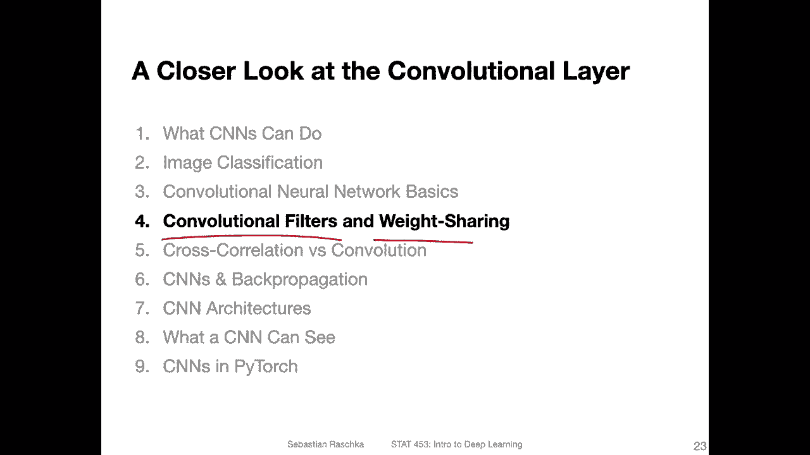

So we have a feature detector， which we also call。Filter。Cronnel。

 I actually like the term feature detector because it kind of describes what it is doing here。

 so we slide this feature detector over the inputs to generate a feature map。So here。

 this is what I'm illustrating in the center here。 we have， for instance。

 here an emnes handwritten digit， for instance， the digit5 here。

And then we have a three by three feature detector or kernel。 and then we are we compute this。

Feature map here。And。When we apply。This kernel to a region in or on this image or in this image。

 we call this region in the image the receptive field。

 So these 9 pixels that we are overlaying with this feature detector are called the receptive field。

So I do that and then compute this value here。 How is this value computed This is in the feature map。

 So this is computed simply by computing the weighted sum。 So the kernel。

You can think of it as a weight matrix。Let's make it a little bit bigger。 don't have much space here。

 to be honest。Let's do it like this， so。This is my。Colonel here。And this is a 3 by31。

 So I have a weight。 let's say W 1， W 2， W 3。W4， W5。6。7，8，9。

And this is overlaid with a receptive field。 So the receptive field is the part of the image that lies below here。

 So it is also a3 by3。Matrix， these are the pixels， right， So in this case， it's call them x 1。3e。

Up to。X 9。And then we do just a multiplication。 So we are waiting。

We are applying a weight to each pixel value here， and that is how we obtain this part here。

So why this weight sharing， well one advantage of this weight sharing really is that we require fewer permits if we had a feature detector for each a separate one for each region here。

 that would be computationally very expensive。I mean， we would have a lot of weight。

 and then we would essentially have a fully connected not lot of fully connected。

 but we are getting closer to a fully connected network then。 So in that way。

 that would be pretty expensive or expensive。Model and the other one。

 the other reason is there's a idea behind using just the same same filter。

 sliding it over the image。 And the idea is essentially that if we have a feature detector that。

 for instance， can detect edges。 I will show you examples later。

 But let's say the feature detector can detect whether there's an edge or something。 then。

The same picture at detector is useful in different parts of the image。 So let's say。

I have a feature detector and the goal or it， it learns to extract certain edges because that's associated with this number。

 so。You would use then the same feature detector in in several regions。

 there's no need to develop a new feature detector if the goal is to detect edges。

 I will show you in a later video what the network really learns。

 So it's learning certain types of feature detectors and I will show you a few examples of that but。

Yeah， just to illustrate now the concept of how we apply this filter。

 so I actually copy and pasteed the same slide and so you can see here what I'm doing is from going from here。

 I move it by one pixel row to the right here right and then I'm moving it to the right and so forth and then you can see here。

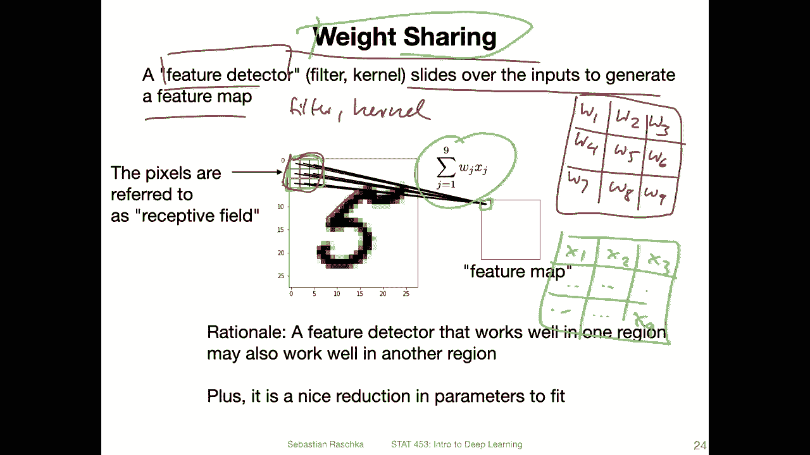

I'm computing these pixels one at a time。And then this is my feature map。

 I can then either apply the sub sampling。What we also call pooling。

Or I can apply another convolutional operation， for instance。

 I could have another convolutional layer that is another。3 by3。 And then。Project this into the next。

Feature map and so forth。 So by that， the network is yeah。

 consecutively extracting this feature from an image so。

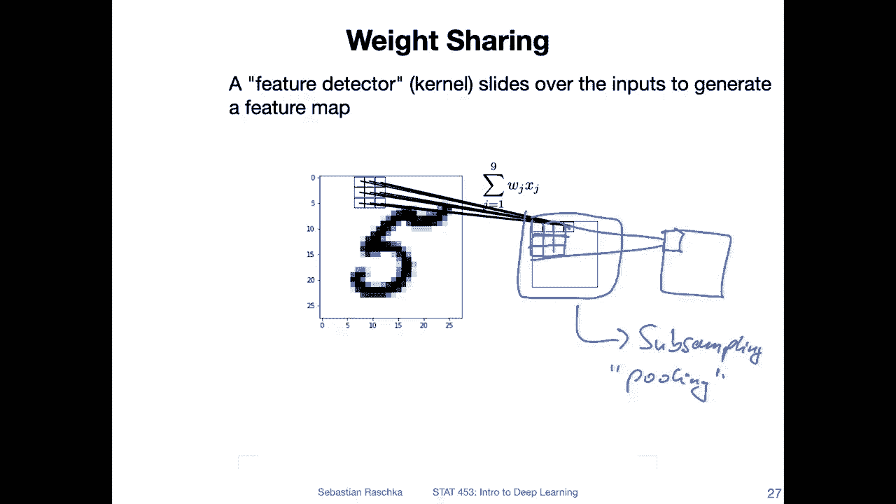

Going here one more time。 So it's going this direction from left to right。

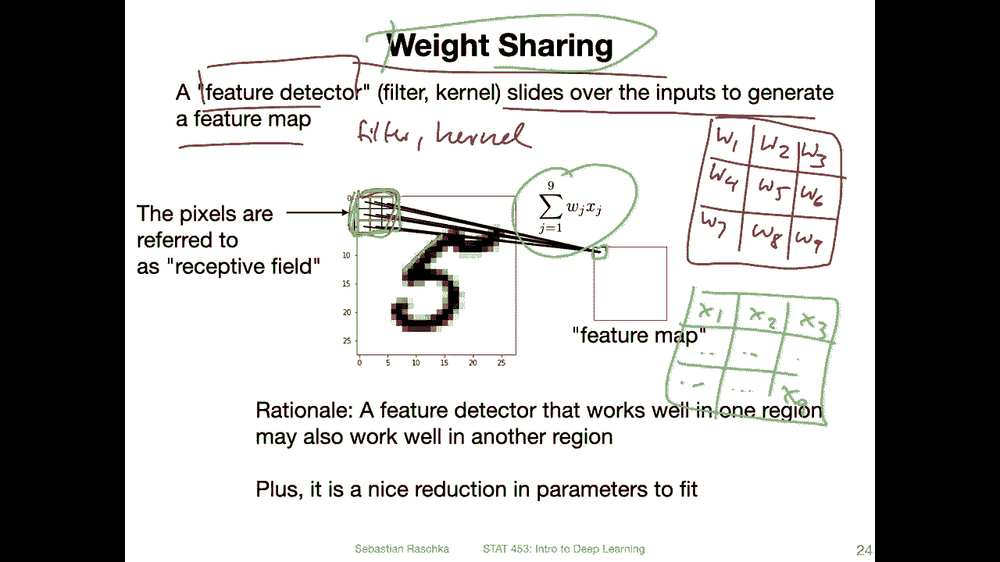

And then when we completed this row， then we go here to the next row， and then we go。

Through this again and again till we are finished with this picture， essentially。

So this was explaining how we use a single feature detector。

 So this is a single feature detector that we slide over the image。 So we get one feature map。

And this might be a feature detector that the network learns for detecting edges。

 but there might also be some other feature detector that might be learned for other types of information from the image。

 for example， in this case， there might be a feature detector learned to。Let's say to。

 to recognize horizontal edges。 So we would have to have a different feature detector。

 a different filter for that。 For instance， if this particular one learns this here。

 another filter may be。Let's say we make this a green one。IfAnother filter is applied。

 it would also slide the same way。To recognize these horizontal edges。

 So how can we use multiple feature detectors in a convolution network。

 So here's just an illustration of that。 It's essentially。

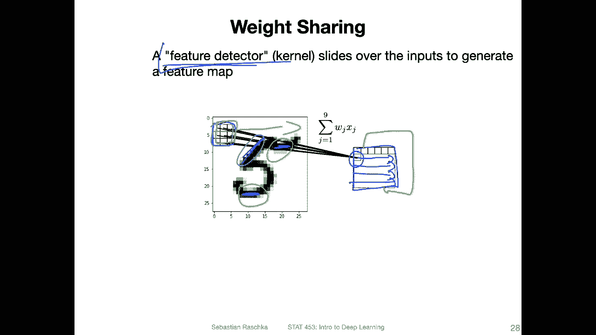

Very simple， we just apply them independently。 so here I'm using multiple feature detectors to create multiple feature maps。

So。But I'm showing here at the top that is exactly the same thing I showed you before where we apply this kernel yet to this image here。

And we had this3 by three weight matrix， which is a yeah filter or kernel。Now I have another one。

 the blue one here。 It's the same concept。 I'm again sliding it over here。

 The only difference is that the weights will be different。

 So the green and the blue one they have different weights。 That's the only difference。

 and I can have maybe a third one here。 and this yeah third one again has different weights。

 So that way I can obtain three different feature maps by just using three different filters。

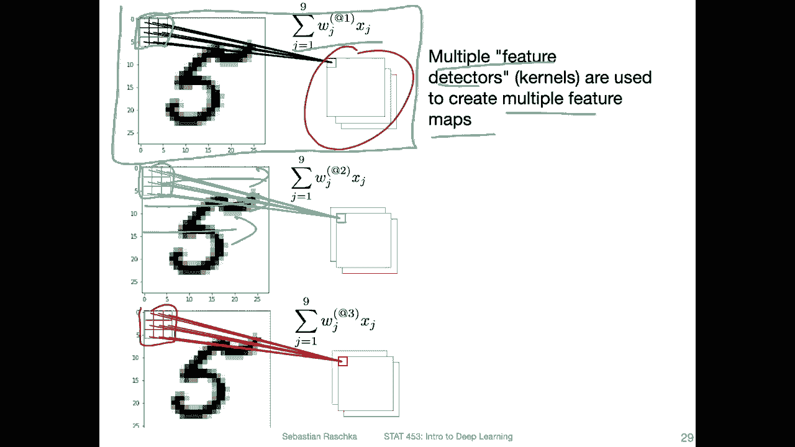

Now， one thing I already briefly mentioned in the previous video that's the size before and after applying these convolutions。

 so the convolution is essentially this operation of going from here to here and filling out this feature map that is essentially the convolution。

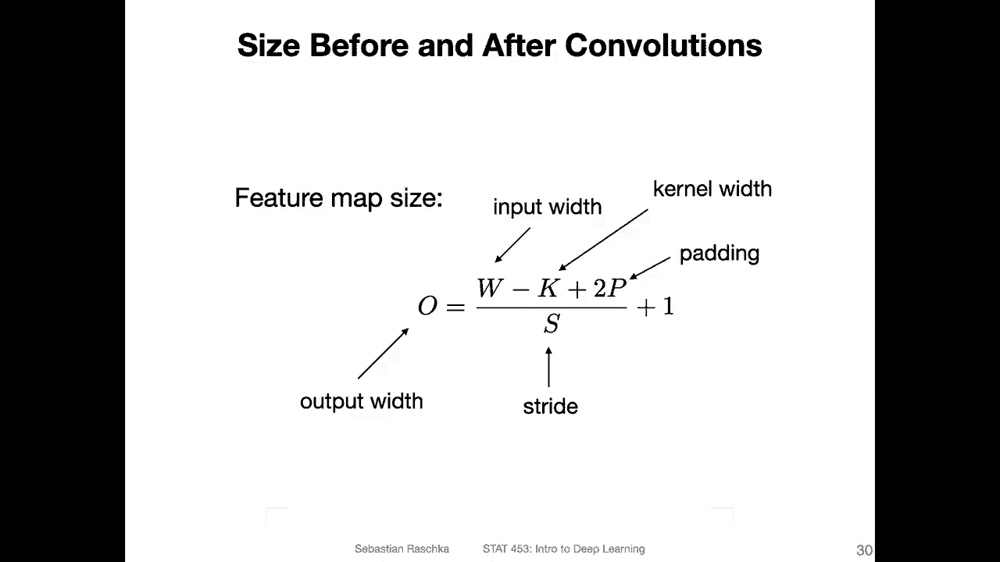

And what is the size essentially going from here？To here。 So I showed you in the linenette。 They had。

 what was it。Honestly， I forgot。 But let's say we have a 30，32 by 32 input image。

 I think that's what they had in this lineette 5。

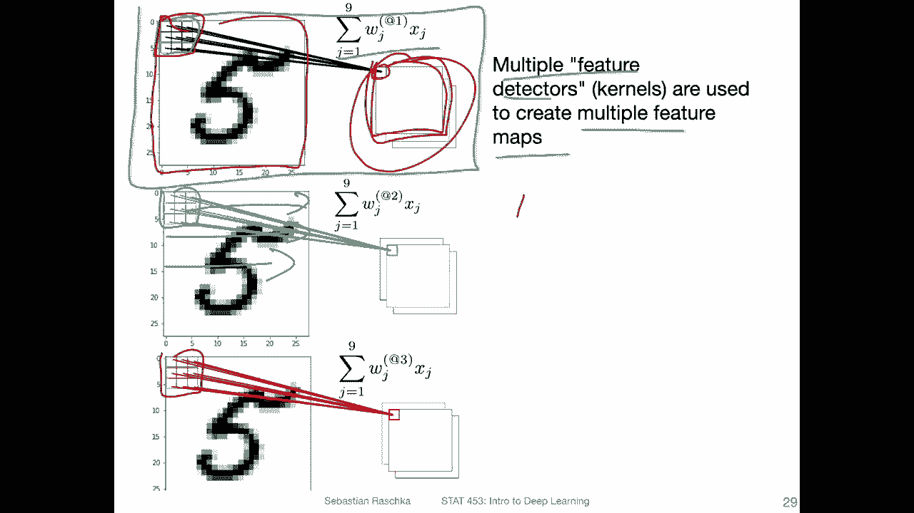

And then they head a5 by5。Colonnel， so what would be the output size of that？

So the output size going from。Let'd say， the handwritten。Letter to the feature map。

So this was 32 by 32 and this one。Applies 5 by 5。Colonnel， what would be the output size。

 So the output size would be 28。 Why would it be 28。

 So there's actually a formula that you can use to compute the output size。So W is the input width。

 So that's the。Yeah the width of。The input image。Then K is the kernel width。 that is。So， let's yeah。

K here width of the kernel。 That's 5 in this case。 So we have。32。5， and then padding。

 So what is padding， I will discuss patting actually in the next lecture。

 because there are already too many concepts。To discuss right now， one thing at a time， right。

 So penning is when you would essentially add zeros around your image。 We will again。

 discuss this in a。Next lecture。 So in this case， you can ignore padding。 We don't have padding here。

 And then there is a stride。 What does the stride mean。

 The strideite means by how many pixels we move the kernels。

 if we only move the kernel here by one row。By one pixel row， then we have a stride of one。

 If we move the kernel by two rows。 So it's maybe easier to show if I make a new drawing So if。

These are mine。My pixel roses。I can。Have this Cor link here and like a three by3 kernel。

And then if I move it。To the right by one row。I'm here， but I could have also moved it by。2 rows。

 So that would be a stride of two。 So the stride is really by how many rows we move to the right。

 and the same also it's actually columns。 sorry， by how many columns we move to the right。

 But the same thing also applies to the rows。 How many rows we move to the bottom in each。

When we finished basically processing the column in the next row， how many。Rose， we shift down。

 So for simplicity， we had a convolution with。Striide equals1。

 So we were moving only one position to the right and then one position to the bottom。So in our case。

 we had a stride of one。So we can actually use a Str of two， again。

 that is a topic I will cover in the next lecture and that would essentially reduce the size。Anyways。

 now putting everything together，32。-5， divided by1。That is 27 plus 1。 That should be 28， right？

 So this is why the output image is 28。 That happens really， because we are。We are cutting off right。

 so we are not allowing anything where the kernel overlaps。

 So when we move that to the right at some point， it will reach the the edge here and there's no no overlap allowed。

 If we want to allow an overlap， that's where we use the padding。

 which is a topic what we discussed next lecture。 But yeah。

 that gives you an idea that there's a small， change or difference between the input and the output size。

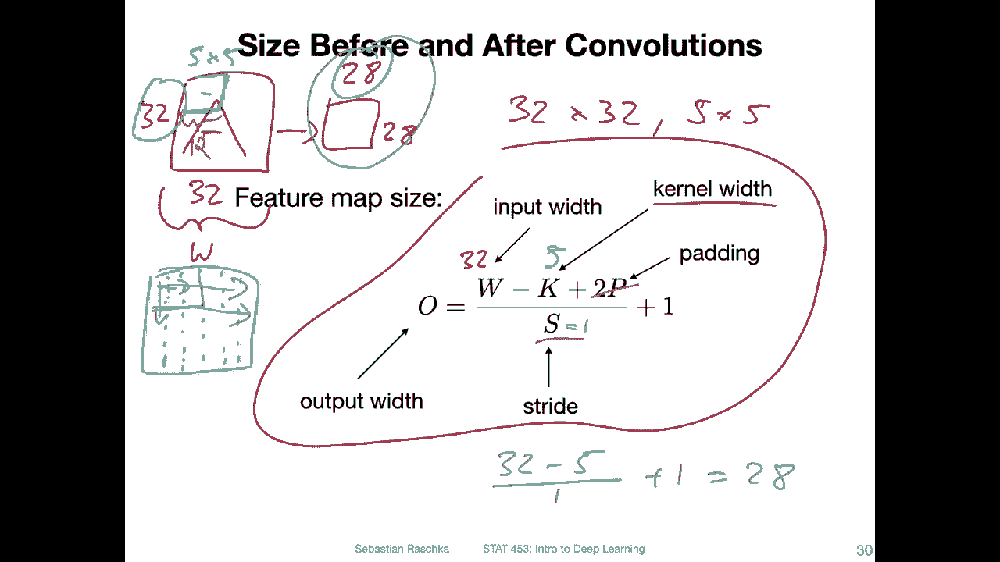

So now what about the number of trainable parameters for the convolutional layer of the kernel essentially。

 so I will actually show you a yeah full code example at the end of the lecture where we will train a convolution network。

 but just for illustration purposes consider here this little snippet where I was initializing a convolutional layer。

 So this is my input image here， an endlessnes image of size。28 by 28。 And there's one。Channel。

 because it's gray scale， right， So the format here is channel height。With so 1，28，28。

So when I initialize this layer， what we have to specify is the number of input channels。

 So the number of input channels in the input to that layer。 So in this case。

 it's one that's why I'm specifying one and then I have to specify how many feature maps I want to get out of it right So if I have my kernel then and that produces then these。

Could actually make that larger。 It produces these。Feature maps at each position。

 So how many feature maps do I want， So 1，2。Three， yeah specified that I wanted to have eight and in practice usually we add more and more channels。

 the deeper we go in the network again， I will show you that in the concrete full code example。

Here I want eight output feature maps， these are essentially like these feature maps。

 just eight of them instead of three and I specify a kernel size of5 by 5 with a stride 1 by one。

 So5 by5 that is always like height and width and also for the stride it's the horizontal and the vertical stride so I just have a stride of one here。

And then when I look at the weight matrix that is associated with this convolutional2 D layer。

 can see。The number of parameters， this is 5 by 5 because the I have a5。By 5。Coronnel。

 and then I I have actually。58 of these 5 by 5 kernels， because I want to produce8 feature maps。

 right， So I would have 1，2。3。😔，4，5，6，7。8 of these kernels that I applied to the same input image to create 8 feature maps。

 That's why we have。8ight times 5 times 5 parameters。For the weight matrix。

 But then there's also the bias。 So there's one bias for each output。

Fature map that we add to all the values in the output feature map。

 So the number of parameters here is 8 times 1 times 5 times 5 plus 8。

 That's the number of trinable parameters。 And actually， this is pretty small， right？

 So if you consider a fully connected layer that is applied to an emest image。Fully connected layer。

 This would be 28 times 28。Plus， whatever number。 So in the next layer we want。

 So if we say the next， so if we have a fully connected network like this。And we owe a next layer。

 let's say， has， I don't know。10 units only。 And the first layer is the input image，784。

 Then I already have for a fully connected network，7840 weights。

 That's a much bigger number than this number here， right？ So in this case。Actually。

 usually conversion networks are very memory efficient compared to a fully connected network。

Alright， moving on just a small site node， one attractive aspect about convolutional networks is also that they have certain yeah to a certain extent some translation。

 rotation and scale invariance， but it is not a true invariance。

 so invariance here means that it does matter where the object is in that image where it is located。

 but in fact in reality it does matter a little bit。

Because even though we use the same feature detector。

 so whether the feature detector is applied here or here， it will compute the same output in a sense。

 the same value because it's a modification between the inputs and the weights。

 but where it puts this value matters， it depends really on where this object is located in that image。

 so to some extent it's not fully invariant to the position rotation and the scale of that object。

 it's only I would say invariant to a small extent it's called also a variant。

But if you do or if you use a lot of convolutions in succession， if you have a very deep network。

 it will essentially become more and more invariant to the yeah position of the object because it would essentially further。

Let's say， summarize this information into a smaller。Into a smaller region of feature map。

 and then in the smaller feature map later on， this detected object may map into the same position。

whether it's located here or whether it's located here。

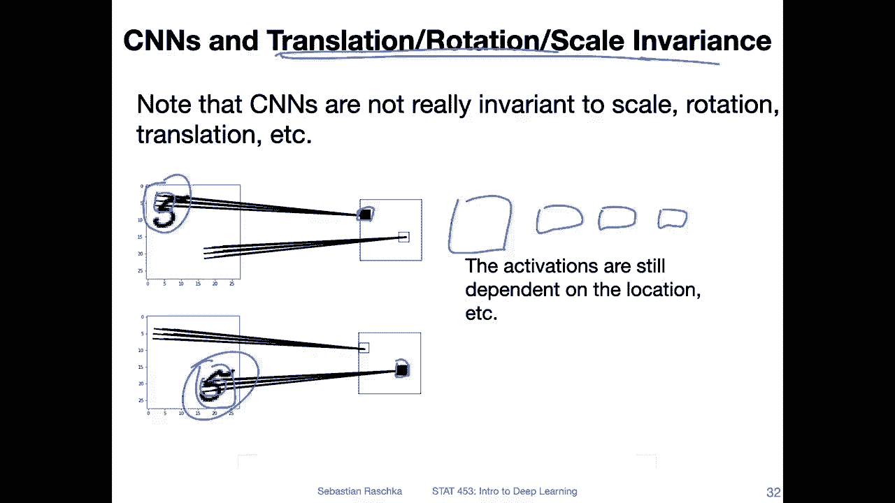

Alright， yeah， lastly， maybe one more note。 what also is helpful for improving the invaris are these max pooling layers。

 Nowadays， honestly， not all networks use max pooling anymore。

 you can actually get pretty good performance without max pooling。

 some max pooling against this subampling。 we will see some architectures or multiple architectures in next week's lecture。

 So there will you will also see some with and some without max pooling。

 but traditionally max pooling there was also operation that was used between each convolution layer to reduce。

The size of the feature maps。 So， for instance， how max pulling works is it is essentially。

Just retrieving the largest element in the feature map。 So if this is。

 let's say you are your feature map， this whole thing is your feature map。

 and you have a three by3 max pooling。嗯。I would call it max pullinging map or something like that or max pulling on detector。

So if you apply 3 by3 max pooling here， it will， again。

 similar to the convolution slide over the image。Here we have a stride of 3 by 3。

 so it will slide by 3。Pixels instead of a stride of one and what it will do。

 Usually people use a stride of 2，3，4 and things like that。 But here for illustration purposes。

 we have a three by3 and what it will do is for each one， it will retrieve the maximum。

 the highest value。 That's why it's called max pooling。 So in this case。

 if I look at this first region here this first receptive field。

I will take this 8 because it's the largest value。 and I put it into my。Feature map。

 and then I move it by three pixels to the right。 so I'm now。Here， and then again。

 I look at the largest value。 It's a 5。 I will put it here。 And then here in the left corner。

 there's actually a tie。 It's a 6 into 6。 So largest value is a 6。 It will put it here。

 And then here the three。Another version of pooling is mean pooling or average pooling。

 but that is not so commonly used as max pool， max pullinging actually。

Also quite useful because it can help a little bit also with us local invariance。

 because it really here doesn't matter whether the8 is located here or here or here。 So whether。

The object is， let's say， more slightly to the left or to the right here in this image。

 it would be kind of invariant to that。 so in that way。

 it can help a little bit with this local invariance。

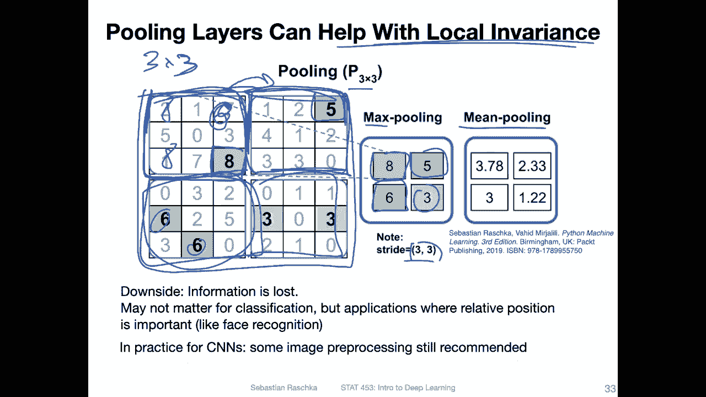

Yeah， one note also that pooling layers usually don't have any learnnable parameters。 Of course。

 people are creative。 There are actually some learnable pooling layers with parameters。

 but the common ones like min average pool， they don't have any weight parameters or learnnable parameters。

Alright， so this was， yeah。Explanation of how convolutional filters and the weight sharing concept works in the next video I want to briefly do some nitpicking go over cross correlation versus convolution maybe also helps a little bit again with understanding how these filters work and then we will briefly talk about scene ends and back propagation。

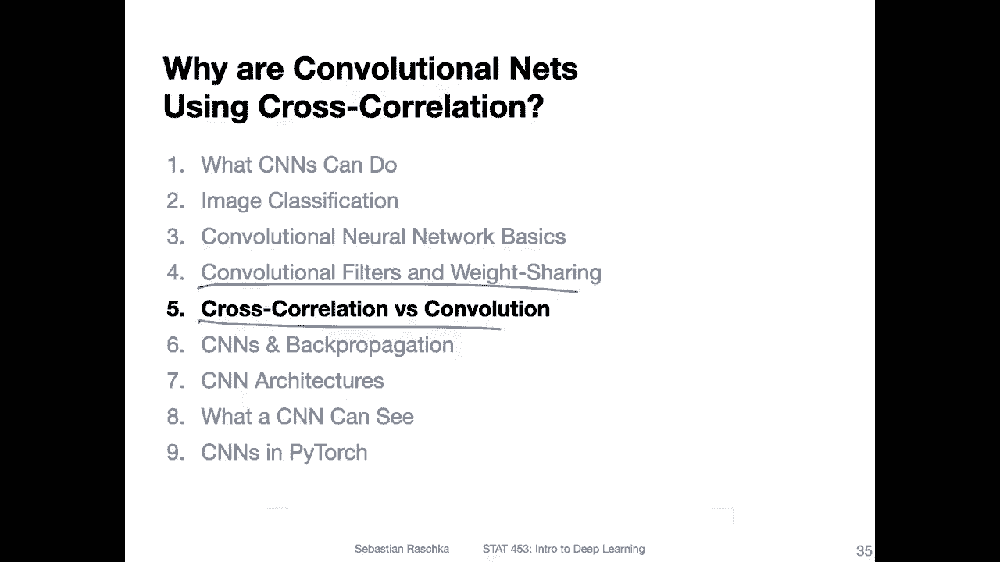