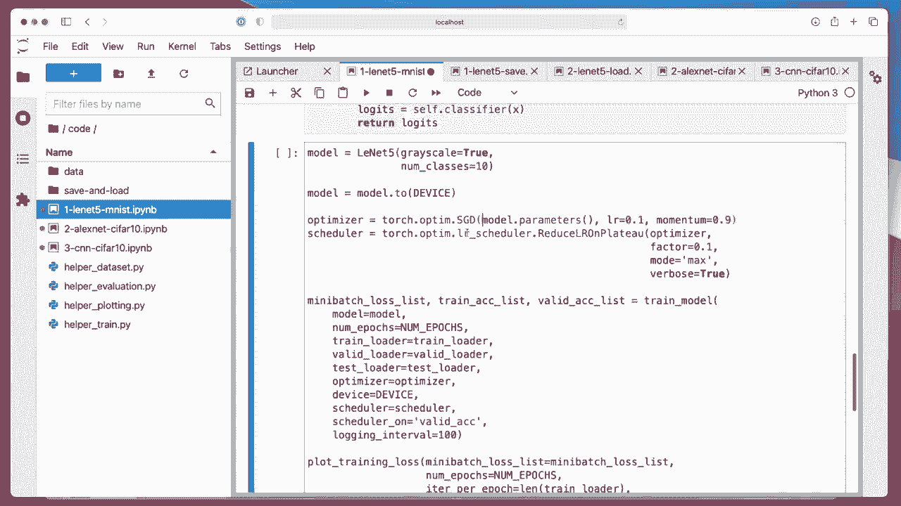
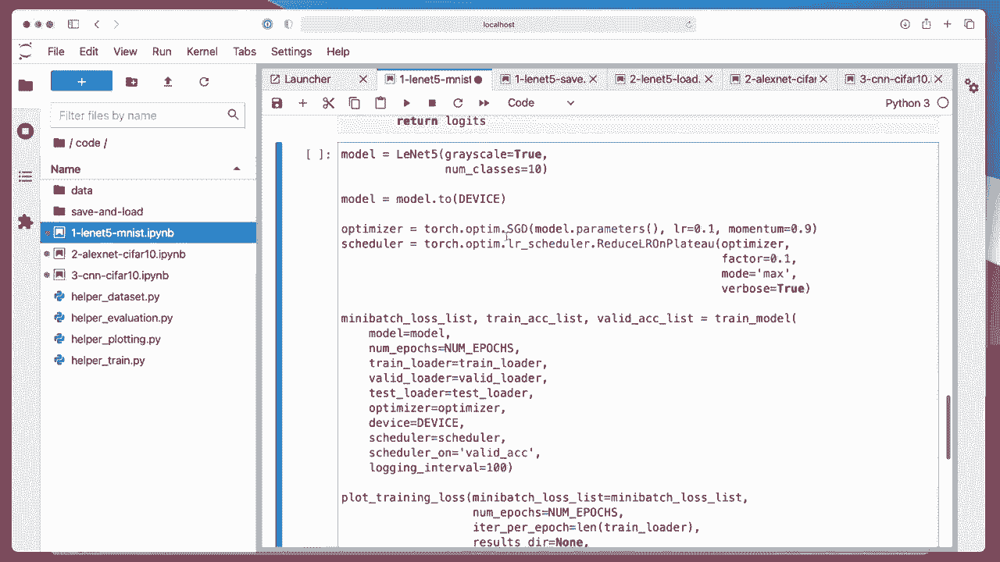

# P107：L13.9.1- PyTorch 中的 LeNet-5 - ShowMeAI - BV1ub4y127jj

All right， I have prepared a bunch of files that I wanted to walk through now。

 explaining the code implementation of CN in Pytorch， so I have a couple of files that I've prepared。

 the first one is Leard 5 implemented to classify handwritten digits in MnesT。

Then I implemented an Alexnet。 yeah， trained on Cypher 10 and another convolal network trained on Cypher 10。

 And I also have a video on saving and loading models， which I think is。

Relatively important to you in terms of the class project。

 I explained that before in an earlier lecture， but I think it's a good idea to recap that。

 But that will be in the next video。 So in this first video。

 let's talk about Helenard 5 trained on Amness。 So just to recap how。

Leonard 5 looks like。 So this is from the slides。 So for Leonard 5。

 this was trained on a ya hand written。Lettter and digit data set。 So in our case。

 we have only digits， but the same concept should apply。 So here we have 32 times 32 inputs。

 Mnes is 28 by 28。 So we have to make a small adjustment and resize Mnes。

 And then yeah what you can see here is it goes from。

One channel to6 channel after the first convolution here and then this 28 by 28 times 6 feature maps here。

 they are subsampled using pooling and you can see now the size of them is half so we go from 28 to 28 times 28 to 14 times 14。

And then yeah with the convolution， the number of channels is increased from 16 6 to 16。

 and the image size decreases slightly。 And then again。

 we have a pooling layer which halves the size of from 10 times 10 to5 times 5 we keep the number of channels。

 and then we have these fully connected layers。 you can see a pattern here that usually when we use convolutions。

 we try to keep。The height and width approximately the same here。

 it shrinks a little bit because we don't use padding。But overall。

 the size is kind of the same as the input。 However， usually with the convolution。

 we increase the number of channels。With。S samplingling。

 what we usually do is we keep the number of channels。And we reduce the height and width by half。

Later in next week's lecture， I will also show you that we can actually do both in one step that we can half the dimensions and。

Also increase the channels just with convolutions， not using pooling。

 and there are actually a bunch of architectures that are called fully convolutional networks。

 so fully convolutional networks usually don't use these fully connected layers and they don't use pooling layers and I will talk more about that next week。

 But for now let's focus on this line at 5 here。

So let's， yeah， walk through this step by step。 the usual watermark importing some packages。 I， yeah。

 I put some stuff here in the helper function as usual to keep the notebook a bit more organized。

And everything here is same as usual。 You may notice this may not work when you run things on the GPU。

 That is because， yeah， some algorithms are not deterministic on the GPU。

 So if you have problems and error， you can just。Comment this ought。

Yeah， so I am first resizing the 28 times 28 mest images here to 32 times 32。

 and I'm also normalizing them such that they are the pixels are centered at 0 and between minus1 and1。

Yeah， that is the same as before。 Let's just run this to see that it can load the data properly that works。

Okay， so this is our Lette 5 network。So I have I included a variable here called grayscale because my implementation。

 I also tried this on Sapha 10， for instance， in Sapha 10 is a color image dataset set。

 so we have three channels。However here M only has one channel。

 but I could toggle between one and three depending on what the input is so I gave it this additional parameter I'm also saving the number of classes because that's yeah that's kind of I wouldn't have to save that but I need this information for the last layer right so because the last layer is still a fully connected layer if I go back one more time so here this last one for that I need a number of classes。

Alright， so now step by step， I'm using this sequential API because it's yeah more convenient。

 And then just like in the figure I showed you， we have a convolutional layer with a number of input channels。

 one。 and this is the number of output channels。 That's 6。So we're going from  one to 6。

 and we have a kernel size of5 so。

Here， this， this thing here is5 by5。

Then I have a 10 H activation。The pooling layer， so the pooling narrow has the kernel size of two。

We will later see also that we can actually have large out pooling layers and then use we can。

 for example， have a three by three pooling layer and just use a stride of two that would also work。

Then we have another。Convolution layer going from 6 to 16， kernel size5。1 H layer， so。

You can see that's the same pattern， essentially， as with。As with fully connected layer。

 So we have first the layer itself， which has the weights。 Then we have an activation function。

 And in this case， we have a pooling function。 So you can really think of this as the first block。

And this is the second block。 So if I go back， So one convolution。

To convolution。 So they are essentially。

2 convolutional layers。It makes you annotated conf one oops。And。2。

And then this is our feature extractor。 that's why I just call it features， I mean。

 just some some arbitrary name， but this is essentially our feature extractor so you can think of all that part here as the feature extractor。

 and this is our fully connected part， which is essentially a classifier similar to a multilay perceptionron。

So here I have just called it classifier。 And then this is like a multi perceptron it receives。

The input。So I can lets， let's show it maybe here。 So in the forward， my third is how we call these。

Layers and everything。 So first， I'm calling features。 So this will， this features here。

 this will run everything here。Then I'm flattening it， because this will be。

Something times 16 dimensional。3D tenor， right。 So we have height and width times 16 channels。

 So here what Im doing is I'm flattening it。So what is yeah。

 Torch to threaten will essentially make this。Soう。Let's， let's write it down。

 So here this is actually an N C，HW format， so。Bch size， channels， height and width。

And this torch shot fin will combine it into an n times， let say M where。

M is the channels times H height times the width。 So we are essentially。Flatening it。

Into a vector because， yeah， as you know， fully connected layers or linear layers work with we vector inputs。

Okay， so is there yeah， this is actually shown here this， this flat thing。

Okay。

Allright， so。Fully connected layer。 This， this is a little bit tricky to get。

 So if you don't know what to put here。You can。Just do。Maybe the print X dot。

Size the first time you run it， and then you can。Take a look at this number。 Actually， this。

 this should be the number。The dimension let that you have to put in here。

So here I calculated it manually。 So it's5 times 5。

Times 16。 So that's， if I go back here， this is。If you can see it here。

16 at5 times 5 this is where I have this number from。

Okay。And then the next dimension will be 120。 That's the size of the hidden layer。

 So this will be this 1 20。 Then we go from 120 to 84。 This is here， this one。

 and then we go go from 84 to the number of classes， which is 10 for Mnis。

 So here that's the 84 to 10。 And I'm not using these Gaussian connections， by the way。

So I think if you use an MS E loss function with Gaussian data。

 then it should be equivalent to cross entropy some way you can mathematically show that。

 but we are not doing it here。 we are just using regular Somax。

So。It's the more common ways nowadays anyways。 So this is how， how we define the network module。

And then here I'm initializing it， so setting it to grayscale。

10 classes。Putting it onto a GPU。 if I have a GPU available。 So if I go up again。

 it will here automatically choose my first GPU。 If I have one。

 I'm currently right now running this on my laptop on a CPU。

So， so actually be just on a CPU and then this is all the same stuff that we discussed before。

 all the same functions。 I don't even think I made any change to those that's exactly the same that we used in the previous lecture。

 So I'm using here an SGD optimizer with momentum and a learning rate schedule。

And then this is， yeah， just the train model。Oops。

The train model function that I imported for my。Train here， I can move just open this。

So train model， this is just a boiler platelate code where we iterate over the epochs and then iterate over the mini batches。

We load the data。

Do the prediction and have the cross entropy。

And then， the back propagation。And here we update the model parameters。

 And then this is just logging to print some results。

And then if we have a scheduler。

It also， yeah updates a scheduler and then a little bit more logging。 And that is essentially it。

 So let's， let's run this then。

Should actually be quite quick because it's a relatively simple model。

So I'm running this on a CPU。 so it might take a little bit。But not too bad。

Alright， let let me be quiet now and let this thing finish。Yeah， you can see its training， I mean。

 after the first epoch， it's already 97%， but it's still going up。

ButYou can also see it's quite overfitting。 It's 99。

Over 98， I mean， not that much， but a little bit。

Yeah， it looks good。 So loss goes down。 May it would make we go down even further if we were to train further。

But yeah， you can see based on the training a validation accuracy。

 maybe the validation accuracy would even go up a little bit。

 Training accuracy might even reach 100 if we were train a little bit longer， but I was impatient。

 It took already。

One minute， that's actually not too bad。

Alright， so I also prepared show examples function， and this will show some examples from MnesT。

 So the first number P is predicted and T is the true label。

 so you can see it gets all of these You're correct。

It's just always useful to double check。

Things whether， yeah， the model gets them correct or not。 Alright， so this is the first video。

 And in the next video， I will show you the Alexnet。

