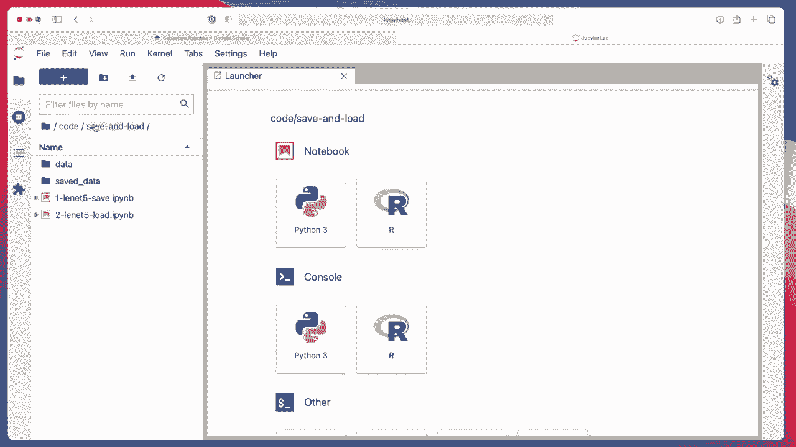
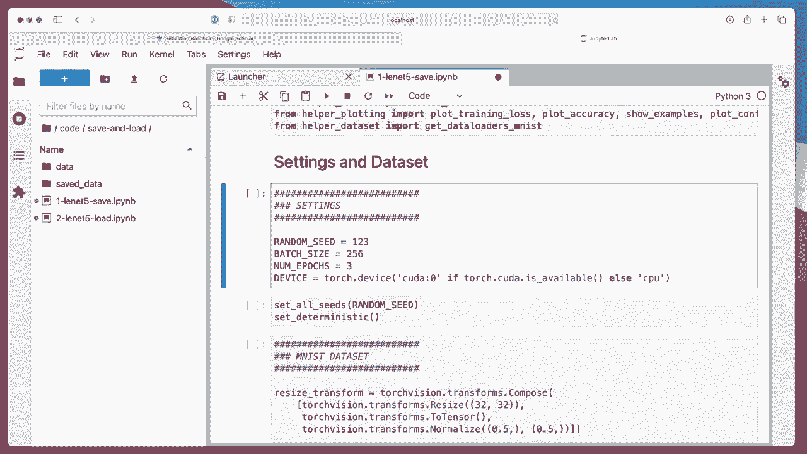
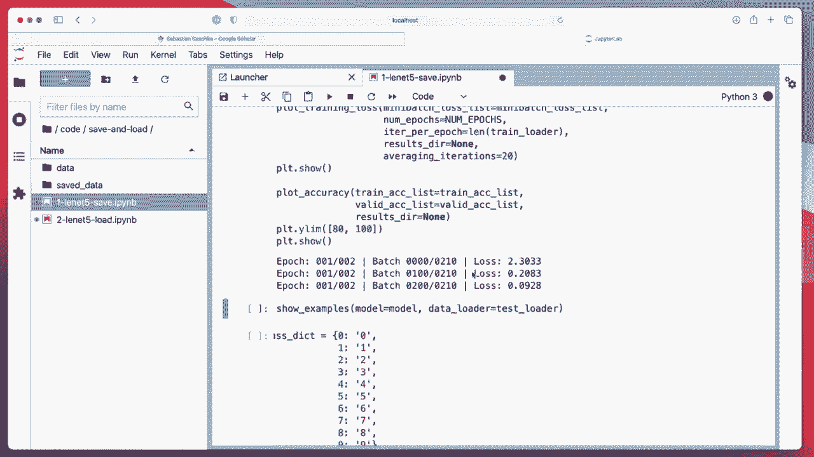
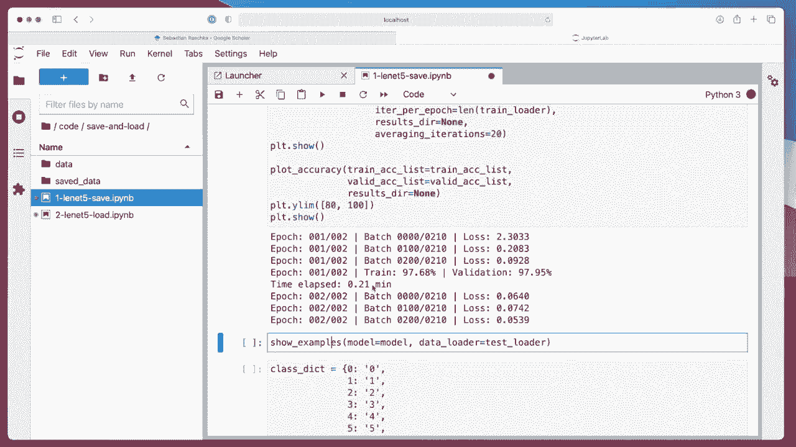
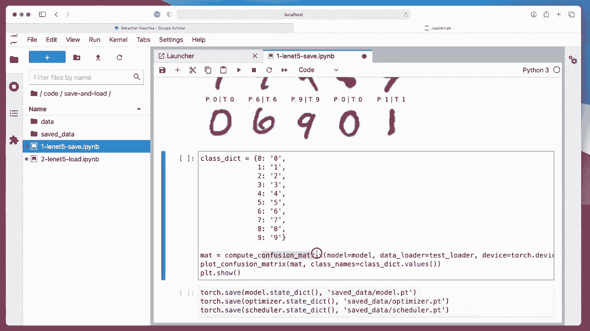
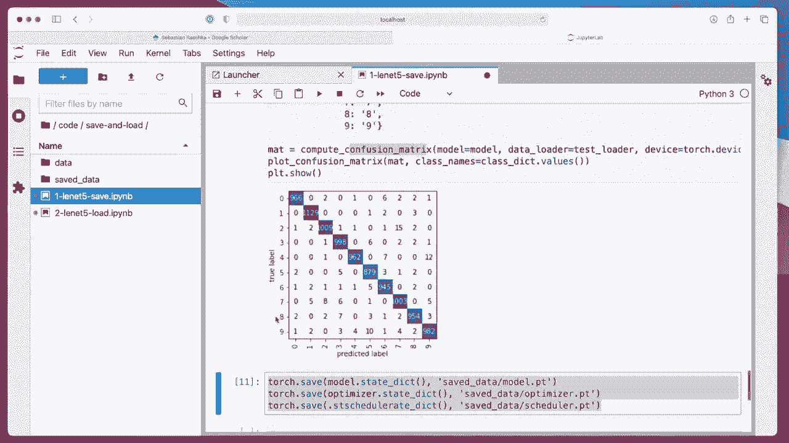
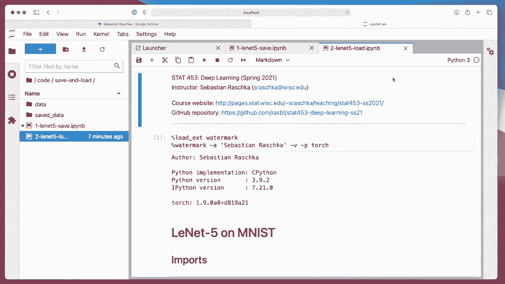
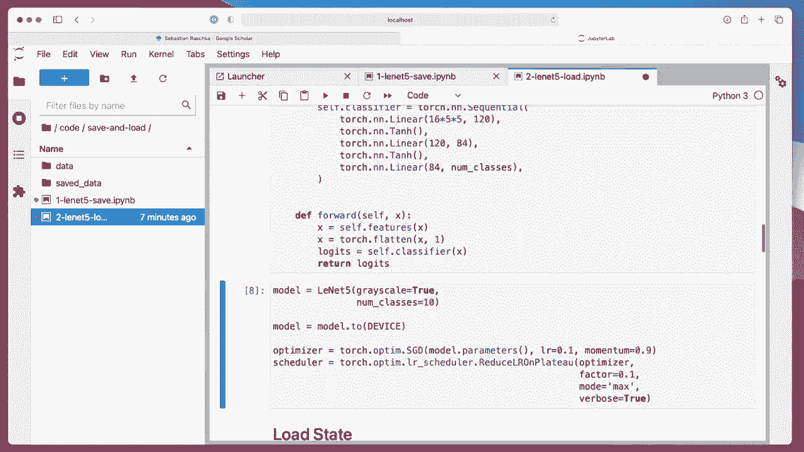

# P108：L13.9.2- 在 PyTorch 中保存和加载模型 - ShowMeAI - BV1ub4y127jj

All right， so at the end of the previous video， I promised you to show you Alexnet now。

 But before we do that， let me show you one more thing， how we save and lot models。

 And then in the next video， I will show you Alexnet。

 So I explained to you how that works in an earlier lecture。 But yeah。

 it's really good to just recap that because I think it might be very useful for your class projects。

😊，So。Here I have a subfolder。 I just called it Sa and lot。 So all of that is on Github。

 I will add the links。 So this save and lot subfolder。 And let's do the Alex that first with。

Only training it for like one or two epochs。 So here I'm showing you how we can save a model， so。

Same thing as before。 noticed that I am having now this Su path dot insert dot dot。

 That's because all my helpaler files are one level higher than this folder where I'm executing this notebook。

 So it's basically going back one folder。 And this is where my helper files is。

 So this is essentially just adding this path。 So that Python knows where to find these helpaler files。

 Of course， you can also make this a python a Python package。 and then。

Import this as a package by yeah different by a setup file， maybe even。

 but this might be over color here。 So here for experimental purposes。

 it's just sufficient to just add the path and it will find this and run this。

Or importm everything。 So everything here is the same as before。 So now let's。

 let's train only for three epochs or something or two。

And。It's all the same stuff。 so I don't have to explain all of that again。

So this is essentially now training for two epochs instead of five。

SoLet's briefly wait until this finishes。 It shouldn't take that long， maybe。

A minute or something。Half a minute。

Alright。So yeah， maybe we might think， okay， it might be good to train a bit longer。

So actually， I also added an another。 So I have the show example function。

So here， everything looks correct or。

Looks fine， but I also added another function， a confusion matrix。 Students who took 4。

51 last semester may know what the confusion matrix is。 But yeah， essentially。

 for those who are not familiar with that， it's essentially a matrix showing。

The predicted labels versus the true labels。 So how many， let's say how many。9s were predicted as 0。

 right。So。Can see where the model makes the most mistakes。 What you want is you want。

The highest number here in the diagonal， you can see， for instance。

 the model mistakes a lot of the9s as a 5 or mistakes a lot of Can we see here twos as a 7。 I mean。

 they are quite similar， right， the2 into 7 are not that different。

 So it's kind of interesting to look at that and see where the model makes the most mistakes。

But this is just as a site note。 So the main part I wanted to talk about is the model saving here。

 So here what we do is we save the model parameters。 That's the state dit。

 So take a dictionary consisting of the state， all the weights and everything， all the parameters。

And we are saving it to a file called model dot P T。 So P T just for Pytorch， but you can choose any。

Name that you prefer。 you can also spell it out。Py torch， oops。Doesn't really matter。Okay。

 and then let's do that。 So then it will what we also do is we save the optimizer state because we use。

SD with momentum。 So there's also a momentum state that we save if we want to continue using that optimizer and we also have the scheduler。

 So we also save the scheduler state I mean， you don't have to do that。

 you can start from scratch with a new optimizer and scheduler。

 but if we really wanted to just continue training like if the run here got interrupted， for example。

 then this would be the proper way to do it in ways that we save all of them and then load all of these states。

So， now。We have these here。And this。Safe and G folder。And。Can we see this。

 I'm not sure we can see that The file size is also quite interesting。

 Sometimes these are pretty large the model because there are lots of weights anyways。Now。

 assume we have saved the model。 Let's now load the model。 So you have prepared another notebook。

Actually， it's all the same stuff。So everything is the same。

 It's kind of required because what we do is we first。

Have to initialize the model。

So that is what creates the class and then once we have initialized it。

 this is really only the new part， that's how we load the model。

 So now we have Torch load load and then the model do P file the same thing for the optimize and scheduler and then we are loading this state dicator into the model but notice that we have to initialize the model as before that's the same thing as before but we have to do that。

cause otherwise， it wouldn't know where， yet where to put the parameters in it。

So okay， if we have done that， we can then。Train the model further。 Yeah。

 for 10 epos it might take quite a while。 but yeah， we would then continue training that model。

So that's how you save and lot models next in the next video。 Now， let's get finally to the Alexnet。

