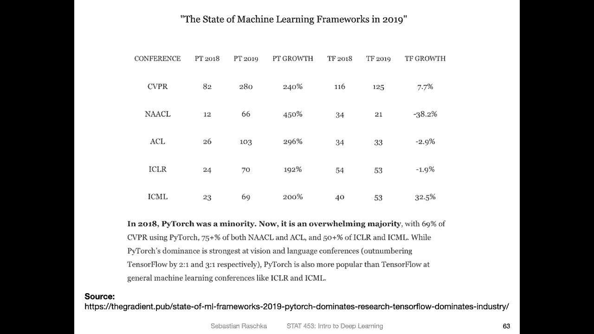
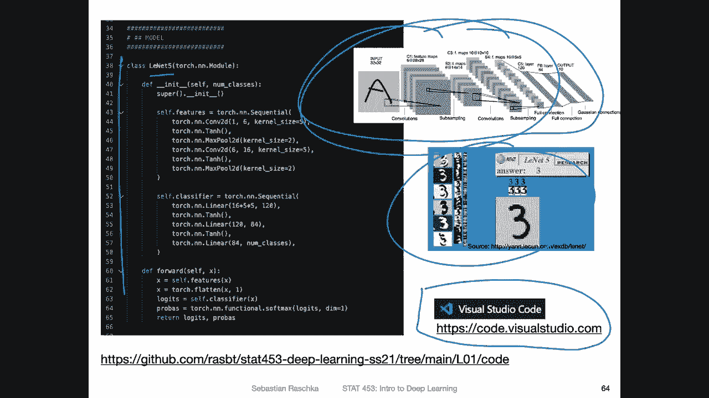
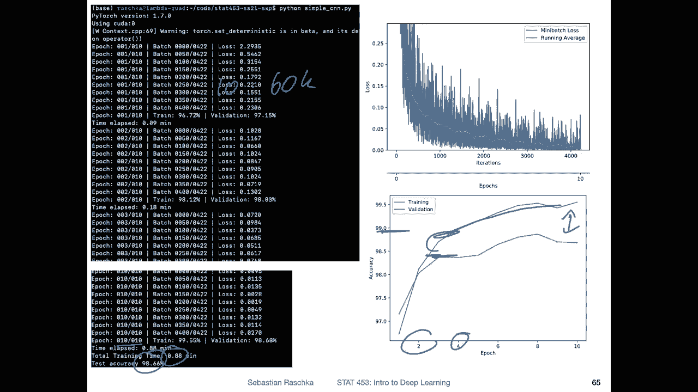
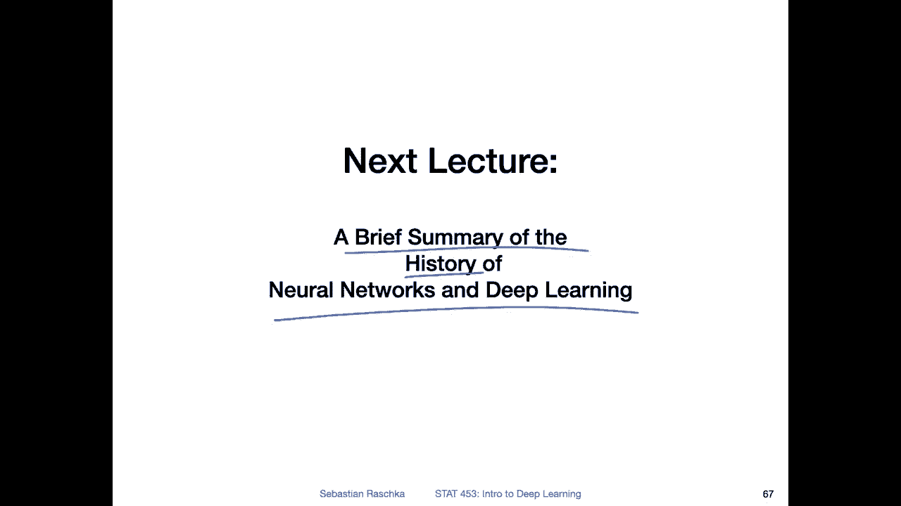

# P11：L1.6- 关于本课程中使用的实践方面和工具 - ShowMeAI - BV1ub4y127jj

Alright， lastly to wrap things up， let's briefly talk about the practical aspects of this course。

 the tools that we are going to use， as you have already guessed。

 probably we are going to use Python as our main programming language。

 So here's a nice chart by Jake Vennalastus who made it in 2015。

 It is yeah outlining the different layers of the Python ecosystem。

 the scientific computing ecosystem。 So you have yeah Python at the lowest level that's the basic fundamental thing that all these libraries require and then layer by layer these libraries become more specialized So you have general computing libraries like the i Python Inte computing environment。

 the nu linearar algebra library。There's Python which yeah kind of helps inputting or using C code in Python if you need it so that's something we won't be doing in this class but for certain scientific projects that's also useful to make things faster there's yeah Jupyter that is ecosystem providing Jupyter notebooks which you have probably heard about already I will say a few things about Jupyter later yeah so let me not say it here I will say it later so then there are other libraries like scipi which are providing additional algorithms on top of numppyy or the visualization library like Meprotlib and pens which is a data frame library and I want to yeah go over the other ones because we won't be using them in this course。

So。The only maybe notable ones are here or is psychic Learnn。

 which is a machine learning library that we have used in statistics for 51 in fall semester and there's also ML extent which is a library that are developed implementing algorithms that are not implemented in psychicL so I called it MLX for machine learning extensions because I was not very creative So yeah these are libraries that we used in 451 and we won't be using those at all in this class so there' is basically almost zero overlap between these two classes and there's not really an advantage of taking 451 because really we will be focusing on deep learning here and not on traditional machine learning。

So in this class， we will be mainly using。Python and Pytorch Pytorch is a library built on top of Python。

 We will of course also be using a little bit of nuy for some basic computing。

 especially in the next lecture to just introduce things slowly and then in I think in the third lecture on perceptrons and then also we will be using Matpotlet occasionally to make visualizations。

 but yeah the focus will be really on Pythtorch。Regarding Jupiter。

 so honestly I like Jupiter notebooks a lot。 I have been using them a lot for data analysis。 However。

 based on my experience， I actually recently started to prefer using regular Python scripts when working with deep learning there are many reasons because。

Deep learning code can be very verse sometimes and sometimes it also takes a long time to run。

 and sometimes I also run that on different computers by other terminal and things like that。

 And they're just certain aspects where script files are a little bit more convenient to handle。Also。

 one aspect is that there are， yeah， easier ways to debu your code because there are nicerlins and code highlighters in。

 yeah， in script text editors or visual。Sorry， Is and developer Is。

 So I will also say a few words about that， maybe later， so。Regarding Pytorch。

 why are we going to use Pytorch So personally my history is like I started doing deep learning working with neural networks in like 2014。

 1314， there was a library called Theiano that I have been using extensively and for my first machine learning book I was also using that for the neural network chapter。

Then in 2015， a new library called Tensorflowlow was released by Google。

 and I started using Tensorflow like everyone else back in 2015， I really liked it so。

I' have been using that quite a bit in the last couple of years， but then in 2017。So this was 2015。

2017， Pytorch came out， which made certain things way more convenient。

 So personally I felt the library was a little bit more organized。 It had dynamic graphs。

 It was a little bit closer to Ny nowadays， I mean。

 both Pytorch and Tensorflow have a very similar features。

 both have static and dynamic graph support and so forth。 So theres not that much difference anymore。

 but in in the years between， I would say，20171819， Pytorch was much。

 much nicer than Tensorflow like from a personal view also。The deep learning community， yeah。

 really like Pytorch because you can see based here on this visualization。

 This is like the top machine deep learning and machine learning conferences。

 You can see that there is a huge growth in Pytorch use。 So the solid lines here are Pytorch。

 the graphs for Pytorch from 2017 to 2019 the middle of 2019。

 So the 2020 conference here is not included because this article from 2019。 Unfortunately。

 they didn't update this article。 But yeah， you can see there's like a steep growth for all the。

Conferences in terms of Pytorch use， whereas for tensor flow。

 it's rather going more like downward or yeah， not growing as fast。 So that way， many， many。

 many people have adopted Pytorch recently。 And also when you look at papers。

So if you find a new paper and you look for code on Github。

 you will most often find nowadays that there is Pytorch code。

 Of course there's also often Tensorflow code， but yeah Pytorch is or has grown a lot。

 So it's also very popular Why is it important that a library is popular。

 So yeah one reason is really that if you want to implement more sophisticated models。

 It's yeah really easier to find tutorials or example code or the implementation corresponding to a paper and so forth。

 And for this class really I still find Pytorch is a little bit more organized and easier to use than Tensorflow。

 It's more similar to nupy and I think yeah you will appreciate that because the learning curve is not quite as steep。

So yeah， just for fun here， I made a short。 I implemented the Leard 5 that we talked about a short code implementation。

 like I said， I kind of for deep learning nowadays prefer。Using text editors。

 the reason really is that for example， if I make a typo here or something like that。

 it will underline it and then way more yeah convenience features and deep learning code can be sometimes long。

 And I find it easier to develop on code in a text editor nowadays I still use a Jupyter notebooks a lot I'm just currently in today I've been working with them extensively working on a paper where we made visualizations And for things like that for analyzing data。

 it's really I think really great to use Jupyter notebooks。

 it's just like if you write long code like more like。

Coding the networks I find text editor more convenient。 personally I would recommend， for example。

 a text editor like visualual studio code， which is fast free and works on all operating systems like Windows。

 Linuxox and Mac OS personally I use a Mac， but this is supported by it's supporting all major operating systems and it has great support for Python and and also debugging and things like that。

 So yeah anyways here。This is just a brief outline of how the Leette work looked like。

 So hit enter yeah so this is the one doing the image recognition here。

 the handwritten digit recognition and you can see in Pytorch its actually just a few lines of code implementing this rather complicated convolutional network So you can see there are lots of things going on but in Pyttorch it's just a few lines of code to implement this model Of course there are a few more lines of code to train the model but actually it's not that complicated。

 and we will walk through this in more detail step by step later in this course。

 So for right now you don't have to understand how this works。

 I I just wanted to show you the code is actually not that complicated。

So here I was just running the code。 Also， I was running it on a computer that had a GPU。

 So in this case， I was running it for。10 epochs， which means 10 iterations over the training set。

 and the training set， I think it has 60000 images。 So you can think of it as。

10 times 60000 images training it on that。 And it only takes yeah， less than a minute。

 So it's super fast。 And even yeah， then after a minute， you get already almost like 99% accuracy。

 So here just some visualizations and you can see even like after the second or fourth apo already reaches something like almost 99% accuracy。

 which I think is really impressive。 So this is on the validation set， sorry。

 So you can see actually， there's a gap between validation and training set。

 which indicates overfitting。 but we will also talk more about that data is's just like a quick demo of how deep learning works and looks like。

Okay， so let me finish this introduction。 So if there are still some things that are unclear， I mean。

 this was just an introduction。 So just an overview。

 I noticed I went into too much detail here and there。 So if there are some details。

 you don't understand yet。 don't worry about it too much。 Ive actually written a blog post。

On this because I was planning to write a little textbook based on my lecture slides。

 which is an ongoing project， I'm not sure when and I if I finished this。

 but anyways I uploaded the first chapter here as a blog post so you can actually read everything I talked about in a written form。

And also for those who are just interested in a general overview of traditional machine learning you can find the lecture notes for the 451 class so just if you're interested you don't have to read this of course however what's also maybe helpful is yeah chapter1 of my Pthha machine learning book which is I would say a shorter version of this blog post it's just it's of course written differently it's a little bit I would say yeah smaller and shorter and。

Yeah， not， not quite the same。 It's just like a different perspective because that's something I've written quite some time ago。

Okay， so with that let me wrap up this introduction and in the next lecture we will be looking at the brief history of neural networks and deep learning。

 so I will just mainly outline why things are cool and interesting and go over the major architectures because this will give you the big picture overview of the topics we are going to cover then throughout this whole semester。

