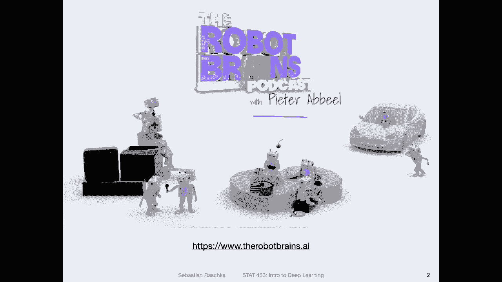
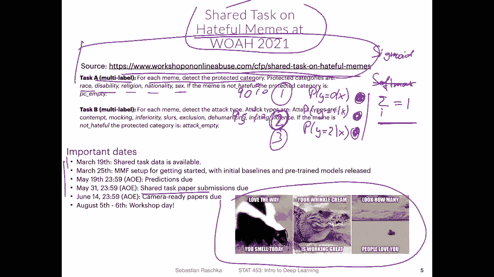
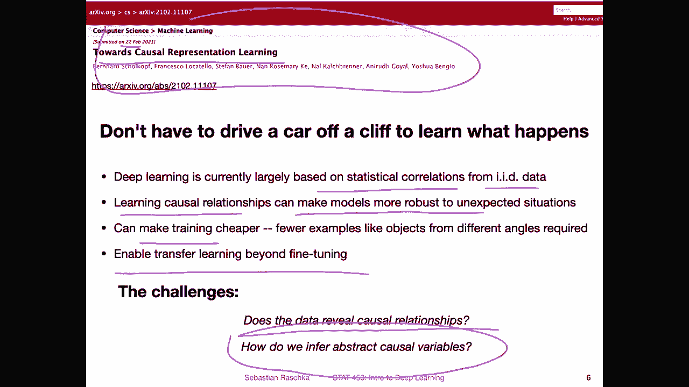
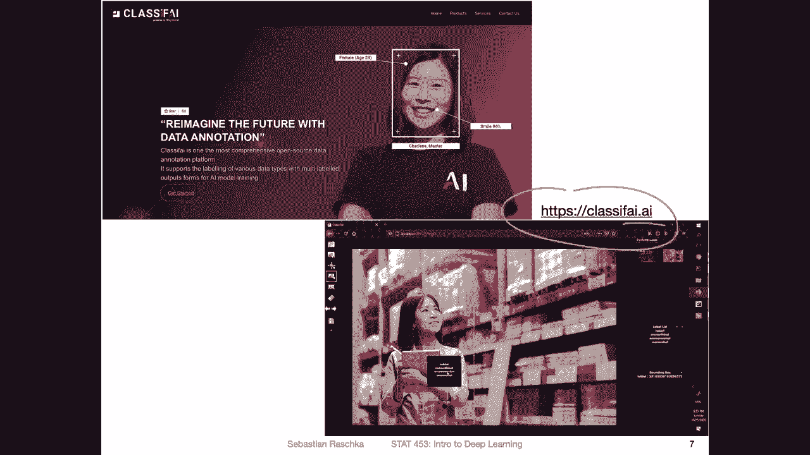
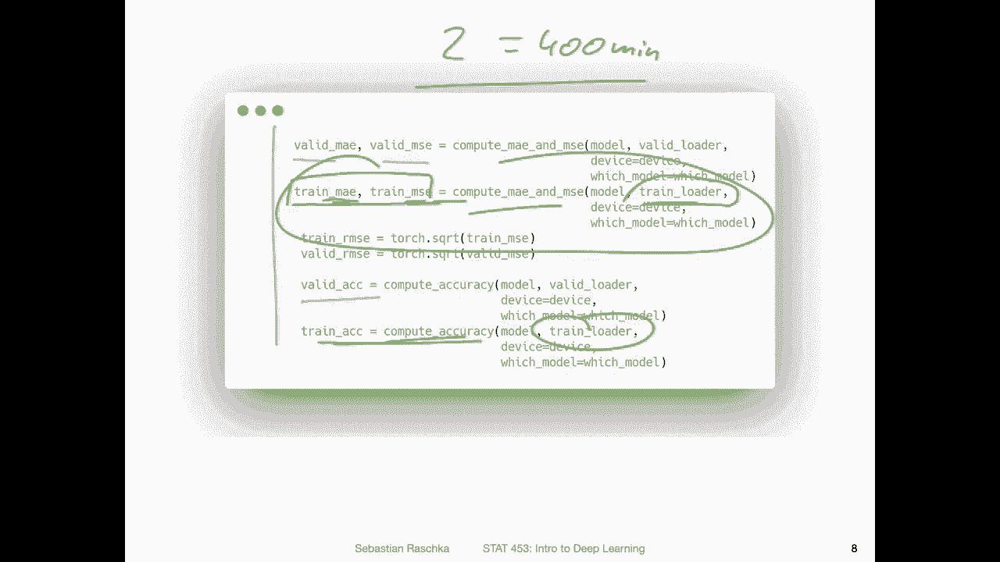
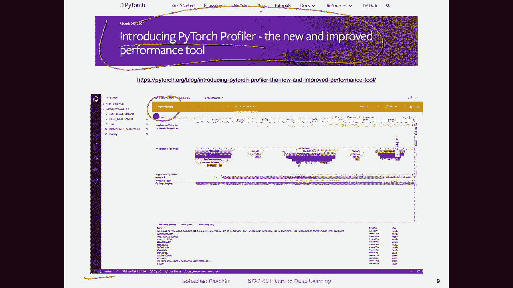
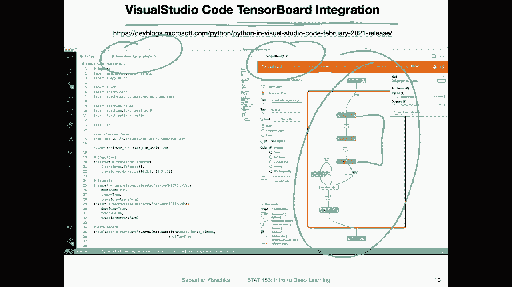
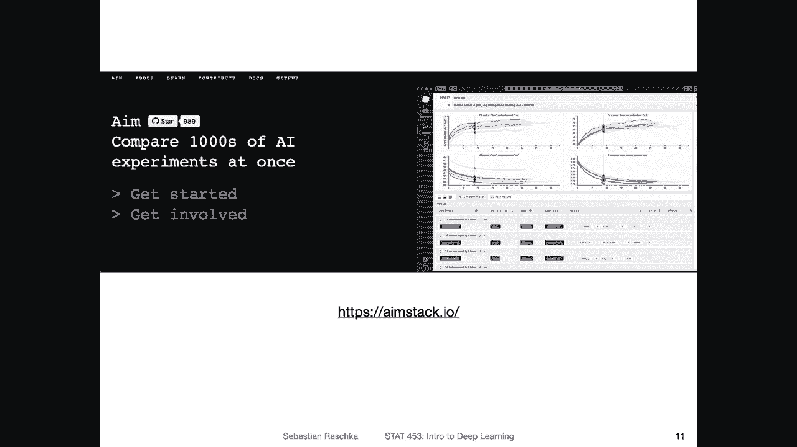
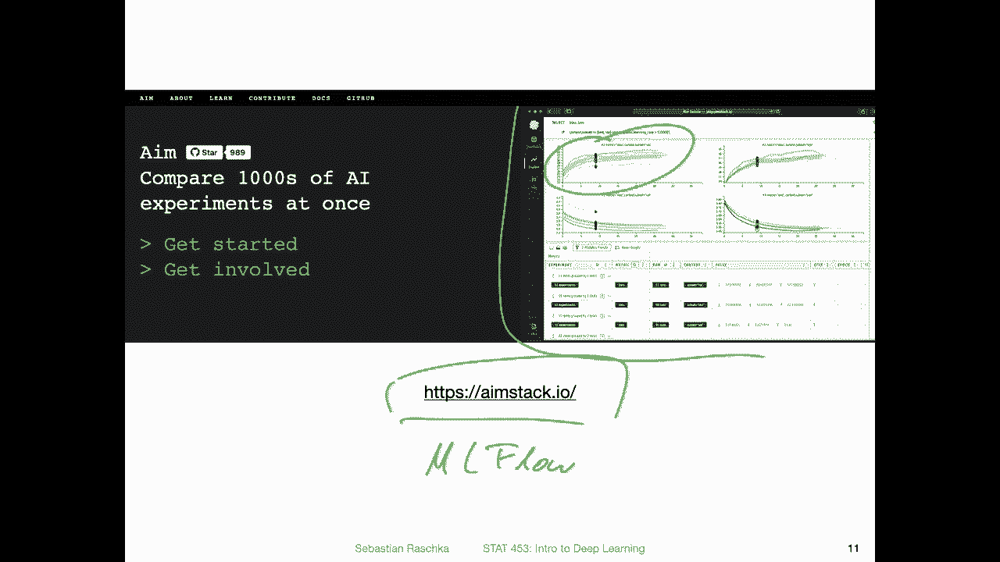

# P110：深度学习新闻 #9，2021 年 3 月 27 日 - ShowMeAI - BV1ub4y127jj

Yeah， hi， everyone。 I hope you are doing well and are well prepared for the exam on Tuesday。

 I just want to clarify again， these stuff in the news videos are not topics of the exam。

 so you can just watch them and entirely forget about them if you want。

 And you don't have to watch them at all， of course。 So today， because we have an exam on Tuesday。

 and I have another talk on Wednesday。 I will try to keep it rather short。

 I will mainly introduce a new selfsvised learning technique I found。😊。

Then there is something about some of the challenges in deep learning related to causal relationships that I wanted to share with you。

 And there are also a few tools I found really cool。 for instance， a Pytoch profiler。 All right。

 So with that， let us get started。Yeah so the first cool thing I wanted to share with you is a cool podcast I discovered this week so I'm not listening to as many podcasts anymore as I once did because sometimes I think it's good to give your brain a break。

 especially like if you work and study a lot and it's good sometimes just to maybe do sometimes nothing and give your brain some rest。

 but if you're doing something boring let's say commuting or household chores like cleaning up at home then yeah sometimes it might be nice to make this a little bit more interesting by listening to some yeah interesting podcast。

So this podcast is about machine learning， just came out this week。

 it's by Peter Abiil who is yeah a very well-known researcher in deep learning and its a style of interview podcasts and there's only one episode out。

 but in this first episode he was interviewing Andre Cappati， who is the director of AI at Tesla。

And they talked about， yeah。Mainly machine learning and deep learning and how it is like to work at Tesla。

 So I found this very interesting because they were also talking about yeah how deep learning is used in practice。

 so at Tesla they for instance use deep learning for their autopilot。

 which is some sort of semi automatic self-driving or semi semi self-driving car capability so whether car can drive automatically on highways but they also have recently extended this version to a beta version that can drive also。

In yeah， non highway situations。 And they are mainly using cameras for that。

 like regular cameras mounted on the car。 and they are using under the hood， for instance。

 convolutional neural networks。 also， and one of the interesting takeaways from that interview was that。

Andria Patty mentioned that。For instance， it's a better bang for the buck。

 If you want to improve your model if you collect more data and you are。

 let's say labeling your data。 So paying attention how you are label your data and also what type of data you collect that might improve your model more or the performance more then let's say fine tuning or trying out a different model。

 So sometimes。Just focusing more on the data side can also give you really， really good results。

 It is like a very common pattern I've seen in industry。 For instance， I recall also Andrewng。

 who is now he was a professor at Stanford， who also was the cofounder of Cora and had these very popular machine learning classes that I also took and really enjoyed online。

 So he also has a startup company。 I think it's beyond startup。 Now， It's a relatively big company。

 focused on working with industry partners and。😊，Also from things he talks about。

 I gathered that yeah a focus is also really on the data。

 it's very important to get good quality data and if you want to improve your models yet just focusing on the data is is really important compared to just tuning the model。

 which is very different from academia， for instance， in academia。

 we usually work with benchmark datas because usually when you look at paper or papers， it's like。

About improving on a certain benchmark dataset like Ams， Cypher 10 Inet and many others。

 So you are using the same data set and just want to see which model performs better。

 But once you leave the academic situation and you go into industry and you want to develop real products。

 it's then more about yeah also collecting additional data and not just tuning the model but really yeah collecting more and better。

 more informative data to improve the performance of your application。Okay。

 this was like a long tangent。 Just wanted mention。 this was actually a pretty cool podcast I liked。

 So if you' are interested， yeah， feel free to check that out。😊。

Yeah， so this week I also discovered a new self-supvised learning method I found particularly interesting。

 So if you recall self-supervised learning is essentially about leveraging the feature information or the structure of the data for a supervised learning task usually that's done by creating some label information from the data so you can apply selfsvised learning to un data and then train in the supervised fashion by creating labels here this is a little bit more focused on I would say the structure of the data So theres no I would say explicit label information created here it's more about yeah the structure so this method is called Ba twins and the paper is titled self-supvised learning by a redundancy reduction。

So how that works is that essentially they run a network twice。 So focusing on this figure here。

 let's say this part is one network， and then they create a copy of that network so。

Let's say the lower part， it looks the same as the upper part except the input is different。

 so but here it's really just an identical copy of the network。

 it's the same as running the same network twice and this setup in general is sometimes also called Siamese。

Network， it's also popular in other contexts， for example， traditional face recognition and so forth。

So in any case， so what the goal here is essentially is to learn feature representations that ignore small modifications of that image。

 for instance， changes in the brightness or slight color perturbations or slight rotations of that image。

 So what they do is they。Provide and。Let's say this is the original。The original image。

And let's say this is the distorted version of that image where you， for example。

 make everything a little bit brighter you change the brightness。

 then you run this through a convolutional network。

 so you run both of them through a convolutional network， the same convolution network。

 and it will create a feature representation。And then。

You have the feature representation of the distorted one up here and the one of the original one here。

 it could also be to。Different types of distorted images， for instance。

 this could be slightly rotated to the left。 and this one could be slightly rotated to the right。

 For instance， the the point is here really that you have two images that are similar。And。

Then you get these feature representations here at the end and you compute the cross correlation matrix and you then try to make the cross correlation matrix similar to an identity matrix where you have the ones in the diagonal。

 And so with that you are trying to learn essentially on。Yeah， you're trying to learn。

That these feature representation vectors should be similar to each other。

 so it should ignore the network should ignore essentially the small perturbations in that image。

 So yeah， here， I summarize it essentially that they run the original and the distorted image through the same network。

 computer correlation matrix。 and then they have an objective function or loss function that forces this correlation matrix to be close to an identity matrix。

Yeah， and that is essentially then forcing the representation vectors of similar examples to be similar。

So here is the code， the Pythtor style pseudocode for that。

 I found it actually nice that they included that in the paper。

 so here that makes it yeah easy to implement so。Here they produce two augmented version of the image。

Then compute the representation vector where F would be then the neural network。And then。

 they compute。Or they normalize， and then they compute the correlation cross correlation between the two。

 and then they compute the difference between the cross correlation and then identity matrix。

 They apply square。 So they square the results because yeah to。

So it doesn't matter whether it's positive or negative。

 which directions it doesn't matter which which way it is， right？And then。They multiply it by lambda。

 the difference the of diagonals。 So I guess it's a hyperparmeter like a scaling how how much penalty you would assign。

 I'm not sure if that actually is really necessary because to some extent。

 I would think that the learning rate already takes care of that by scaling the gradients。

 but I guess it's a little bit more control over the penalty here。 and then they sum up。

The oftagon notess here。And essentially， you want to minimize the difference between those and。

The identity matrix。And yeah， this is then the loss that they optimize。 And that's all they do。

 There is no class table information。 and they train that method。 and then。

When they obtain these feature representation vectors， they train a linear model。

 so they say linear evaluation， usually that's something like logistic regression。

 some simple linear generalized linear model， and when they apply then the linear evaluation or let's say logistic regression trained on the feature vectors。

They get a pretty good accuracy here， which is shown here。 So let me maybe draw that。

 So if you have your input image， let's call that X。 it goes through the neural network。

 the convolutional layers。 And then there's this feature representation vector。 and they。

 let's say produce all the feature representation vectors for the whole image net。 So you have these。

 you treat them as fixed。 So you have。For the whole imagenet， these feature representation vectors。

 and they are your are。Exs your， let's。The x the feature input X for the logistic regression model。

 So it's。You wanted it here。So it's called it x 1 for the first training example。

 And let's say x 3 for the third training example， X 2 for the second training example。

 But then you also use。The original class label。From Imnet。And this will be。

This whole thing will be your training set， your new training set for Lo。Regression。

It's essentially a traditional supervised classification problem。 So why， why would you do that。

 This is really， yeah， it's really testing how much information about the images。

Is captured in these vectors。 It's a way of evaluating the con network feature extraction in that sense。

 So here the hypothesis is essentially。By forcing。The network to ignore these distortions。

 you can produce essentially representation vectors that are really representative of the image and then the linear classifier can classify them well and you can see。

This method when you train it in that manner with a logistic regression on these feature representations gets a 73。

2% top 1 accuracy on INe and 91% top5 accuracy and there are also some other methods for comparison this is not the best methods so notice there are two methods here at least that are better but it's very competitive it's performing really well here and what I like about it is it's pretty simple if you look at this it's a pretty simple training method and yeah is sometimes also good it's actually pretty cool I think。

Yeah， so one thing that is great in our day and age is that we have all these technologies now that make communication online easier。

 but yeah one unfortunate downside of that is it's also making cyber bullying easier and other abusive things on the internet。

 So it's actually nice to see that theres now like workshop focusing on issues like that to improve the identification of hateful memes。

 for instance， So I think this workshop was organized by Facebook I'm not sure anymore by Facebook AI research I think but I would have to double check。

So here are a few examples of that and essentially this is a competition where everyone can participate and develop models and it's a workshop where you're then invited to also yeah。

Write a paper about your model if it's performing well。

 I wish I would have known about that earlier because then I think we could have made this a class project it would have been cool。

 but yeah it's it was just announced last week。 it's a little bit late in the semester。

 but if someone is interested in working on that as aI project this would be an interesting application。

 for instance also of convolutional networks。So one thing that is new about this is it's a multila problem I mean not new in the general sense。

 but in the context of our class we haven't worked with multilabel problems。

 but it's essentially pretty straightforward so。Let's say you have your output layer。

Of a neural network， convol network or multi layer perceptionceptron。

 usually what we used was a soft mix。Function such that these outputs。

That they sum up to one to a probability of one。 So we have a each。

 each note is a class membership probability， right， So the first one is a。Let's say for class 0。

 given the input， this is for class1， given the input X， and this one is for。Class 2。

 given an input X， so usually。We assume these were exclusive， mutually exclusive classes。

 for example， in MNT， each digit can only be one class right so it makes sense if we have three membership probabilities for let's say digit 1。

 digit 2 and digit 3 that they sum up to1。So if for instance。

 if you have 90% probability for label 1， then it's maybe 5% for label 2 and 5% for label 3。

 but yeah in a multila problem it's not a requirement so。A data point can have multiple classes。

 for instance。Here for each meme， one task is to predict。The protected category， for instance， race。

 disability， religion， nationality and sex。 So a meme could， for instance。

 target multiple things at once。 So here you are not constrained of having probability summing up to one。

 So for instance， you can say for class1， it could be， for instance， a 90% probability。

 but it could also have a 95% percent probability that it has in addition， also label number two。

 so it can have multiple labels。How do you achieve that？

 So the only thing you really have to do is you just change softm by the logistic。Sigmoid function。

 So in that way， you don't constrain the network to have these probabilities summing up to one。

 but essentially， yeah， this would be a very similar。Approach。

 you can use conversion networks for that。 So yeah， if someone is interested here。

 the important dates， Here's a link to this workshop。 I just found that interesting。 I wish， yeah。

 we would have known about that earlier because then it would have been a cool class project。

 But now， yeah， I don't want to， you spend already so much time working on it。 I don't want to。

Proposed this as the new class project， but if someone is interested。

 that would be an interesting site project。

Yeah so there was an interesting paper recently towards causal representation layer learning it's not a new paper I mean it's relatively new but it's from last month but I have a huge backlog of stuff in the news items that I discover and haven't had a chance to discuss yet。

So， yeah， so essentially， this is about pushing deep learning more towards yeah causal representation learning。

 So one shortcoming。Nowadays is that deep learning or the in general。

 the current state of supervised learning and yeah predictive modeling is more reliant or is essentially reliant on。

ID data that means independent and identically distributed data where one data point doesn't really influence the other and deep learning systems like classifiers。

 typical classifiers are essentially just learning statistical correlations between the input data and the output data。

 so you're essentially not learning a system that can really understand the relationship between the data in a causal way it's more like exploiting correlations。

So for instance， why would it be useful to learn causal relationships？

One aspect that is also kind of mentioned in that paper is it can make models more robust towards unexpected situations。

 for instance。If you have。Let's say a self driving car。 And remember when we had。

 I showed you that before this adversarial attack where they had a laser beam in or in front of a street sign。

 and it was fooling the classifier into thinking that the street sign means something differently。

 If there would be a better causal understanding that might be avoided。So in that way。

 I think certain adversarial attacks could be mitigated if the network had a better understanding of causal or relationships。

 but also it can make training cheaper， for instance。

 let's say you train a classifier to detect objects and one of the classes is let's say predicting whether something is a chair to sit on。

So usually if you want to make this really robust， you would have to take pictures of that same chair and include it into the training data set from different angles。

 a human though。A human doesn't really need to see the same chair from different angles to recognize that this is a chair。

 So that way， if the network has a better understanding。

 maybe what the what what makes a chair a chair， then in that way。

 we would maybe require fewer training examples。 And this would also help with。

Reurpurposing models so that you don't have to train the model from scratch on each new dataset sets and that way it could be more effective maybe to train a model on one dataset and then apply it to another。

 for instance， if you think of reinforcement learning also in a grana scheme where you let's say learn an agent。

To play age of empires。 It's a strategy game。 Then maybe this agent could be applied also to play Starcraft。

 which is another strategy game without， let's say。

 requiring learning from scratch because the games are relatively similar。 So in that way。

 it could also help with transfer learning and repurposing models。 But yeah， it's， it's a challenge。

 It's something where people don't have a solution for yet。

 So this paper was mainly highlighting the challenges and proposing some。Potential future directions。

 but yeah， the main challenges essentially are。Whether the data even reveals causal relationships and also then how can we infer these abstract causal variables。

 so I currently I think there are no solutions yet。

 but people yeah started to think about it more actively and I think that is like an interesting area of research to keep an eye on in the future。

Alright， let's wrap it up with some of the cool tools I discovered this week。

 So one of them is classify AI with the rather clever name AI。 Anyways， So here。

 this tool is essentially a image and nottta。 So there are some other tools that exist。

 I shared some of them with you in the context of the class projects before。 But yeah。

 this is a new1， I think， and it looked pretty cool。 It's an open source tool。 and。😊，Yeah。

 so it is providing capabilities for annotating images conveniently， for instance。

 also for object detection。 So at the bottom here this is a video I hope it plays yeah so it's just an example that shows you how convenient it is to label different objects。

 So if you are interested in that check it out。 this is free。 It's an open source tool。

Another thing I wanted to talk about is yeah making your code more efficient so this week I actually spent quite some time making some of my code more efficient because training was relatively slow and I had hundreds or thousands of lines of code and I was just finding or trying to find the bottleneck Why is the training so slow Eventually I found out my mistake。

Or the inefficiency， is's kind of summarized here。 So I was computing three things， every epoch。

I was or actually six things， I was computing the validation set mean absolute error mean square error and the validation set accuracy。

 and then I was computing the same mean absolute error mean square error。

And accuracy for the training set。So I did that each epoch and each time the way I implemented these functions was by iterating over the dataset because they are too large to load into memory。

 so I was just iterating over the dataset the same way you would iterate over the batches when you do the training and I did that every epoch。

Now that was very inefficient because it takes a lot of time if you have like half a million images in your data set iterating over the training set in each epoch that can easily like take two minutes or something and if something takes two minutes and you train for let's say 200 epochs that's 400 minutes right so it's a lot of time extra time。

And yeah， the downside of that was well not the downside。

 but the problem I had here was that I did this in a very inefficient way。

 for instance I computed here the train mean absolute  error and mean squared error。

Using iteration over the training model， and then I had the same thing here too。

So how I solved this problem was essentially writing one function that computes M AE。

 ME and accuracy in one one go。 So I don't have to call this function in this function separately。

 It was just writing a function that can do both at once。

 So I would essentially save 400 minutes if one of these takes。

2 minutes each epoch when I was training for 200 epochs。 and essentially。

 I also decided just not to track these statistics during training only for the validation set。

 And also， it saved me a lot of time。 then another 400 minutes。 So in that way， sometimes。

 yeah thinking about。What you're doing in the code can be useful to make your code more efficient。

 especially if you don't really need the training statistics during training。 If it's enough。

 for instance， to plot the final training accuracy and the final validation accuracy to assess overfitting。

 Alright， so long story short。The main point I wanted to make here is I was spending a lot of time analyzing my coat and trying to find bottlenecks。

 And then yeah， on Thursday or so， I saw that as' a new tool。

A Pytoch profiler that just came out。 And this is a tool that kind of promises to make this more easy to identify bottlenecks in your code。

 And I thought that might might be interesting to you。

 So this is based also on a tool called Tensor board and Tensor board is a tool visualization tool that you can use during training to attract different things。

Like performance metrics and so forth during training。So。This also got me into a rabbit hole， so。

I found out about this Pytoch profile， which I think is really cool。

 that might be something worthwhile trying in the future。 And then from there I saw， okay。

 this looks like visual studio code right and then I also saw actually that last month visual studio code released some new capabilities or was updated to add an integration for Tensor board before you had to use Tensor board separately for instance。

 in a web browser now you can use it directly in visual Studio code so you can have your code and Tensor board side by side and also one of the cool things about Tensor board is it can instead of also in just in addition to just tracking training statistics it can also visualize。

The neural network graph。 So that is also a helpful debugging technique to make sure the network looks like you expect it to look like that you don't have any weird connections between layers that you didn't intend to connect。

 So that is a cool tool to check out as well。 Tensorboard。 It's also free， of course。

And another tool that I saw recently is a tool for comparing different experiments。

 so previously this tensor board is more for tracking during training。

 this is when you are training and you want to look at the loss function during training for example。

 it's easy way to visualize the loss。

In class the code I provide to you is usually that we use Matprolib at the end of the training。

 but Tensorboard is really useful during training I didn't want to teach that to you in class because yeah we have already so many things to talk about and I would say this is more like something。

That you want to use once you are more familiar with a basic training because yeah。

 it's just another tool and I didn't want to overburden you with too many tools。

 but I recommend to check that out at some point。

This tool here is a little bit different， it's more like for comparing models after training。

It's actually I looked at the how you use it。 It's actually super simple。

 So you only add one or two lines of code and it will write a certain python dictionary to to your hard drive。

 and it will do it such that you can import it into this tool and it will allow you to compare between different runs。

 So if you run the model with different hyperparmeter。

 It will essentially help you to visualize which one is the best hyperparameter configuration and so forth。

 So actually a pretty nice tool here too。 Of course， this is just one of the many， many， many tools。

 There are other ones like there's， for example， I think one is called Hya， one is called M flow。

There are many tools for doing that。 but yeah， this one looked actually pretty cool。 Also。

 just wanted to share this because yeah， it's also free and also something you may want to check out at one point。

Yeah， lastly， so I will be giving a talk on Wednesday if someone is interested。

 so they gave me free tickets for students。 I shared them with you on Piazza so someone is interested。

 my particular talk would be on March 31st 10，40 AM central time。😊，I think that is11。

For the in our time zone。 No wait， this is our time zone。 sorry。

 So this is our time zone central time。 Now I used to live in Michigan when we were on Eastern Time。

 So yeah， we are in central time。 So yeah， if someone is interested But in general。

 lots of interesting talks here， you can check it out here。

 So and because there is an exam on Tuesday that I still have to prepare and I also have to prepare for this talk。

 I will now， yeah， end this stuff in the news section and yeah， good luck for the exam on Tuesday。

