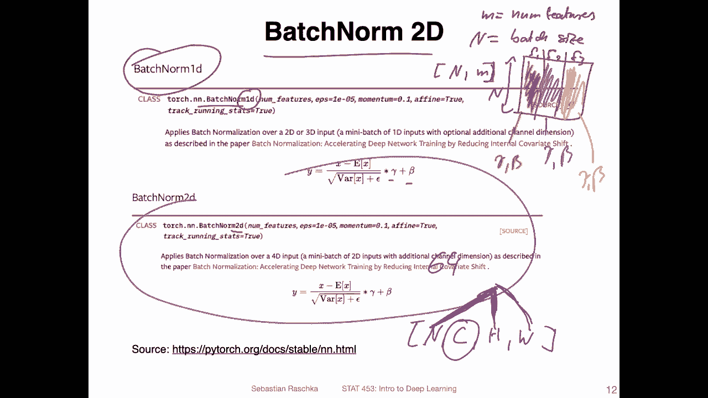

# P113：L14.2- 空间丢失和 BatchNorm - ShowMeAI - BV1ub4y127jj

Alright， let's now learn how we can translate familiar concepts such as dropout and batchno to the convolutional settings。

 So these are also called spatial dropout and batchno and it sounds fancycier than it really is because you will see it's pretty straightforward and there's not much work required to make these things work for the two dimensional setting where with 2D。

 I mean two dimensional images。So before we talked about dropout in the multilay perceptron context。

 So why do we even have to invent a new version of dropout or why do we have to modify it in the first place。

 So that is because， I mean， you can， of course， use the regular dropout you learned about before。

 but there's a good argument。

By Thompson here in this paper I linked below that the problem with regular dropout is that in scene ends。

 you usually you have like images where you slide your kernels over the image and usually the adjacent pixels are likely highly correlated to each other。

 So if you。Like a remove half of the pixels and a given in a given。Receptive field。

 It doesn't really change。The output too much， except it's maybe like a little bit of a scaling difference。

 You can also think of it。 for instance， if you have an input。 I mean。

 we are not put masking anything in the input， but just conceptual it。

 And let's think about it like that。 You have a phase image。And。Here。

 there are lots of pixels corresponding to the eye。 If you consider one pixel here。There are。

Other pixels closely next to it。 and all these pixels together represent an eye。

 So it doesn't really change that much if we mask half of these pixels。 So here。

 the argument is to instead of masking dropping out individual positions in a feature map。

 we are dropping out the channels。 So usually in the later stages of the network。

 these channels represent higher higher or larger concepts as we've talked about in the last last texture where we have bigger picture concepts like a channel represents the eye that was detected one the mouth。

 one the nose and so forth。 So here the idea is really to drop these higher order features in in that way。

 dropping entire feature maps instead of individual pixels。

 So essentially dropout to the is dropout applied to the channels rather than the pixel。

So you would drop an entire channels instead of pixels。 And that's all there is to it， so。

How do we do that in Pywach， It's pretty straightforward。 So instead of saying drop out 1 D。

 you are now saying drop out 2 d。 And that's essentially it。

 So heres an example showing you how that looks like。 So each， each box here represents one channel。

 So here I have a。Just some random example input with three channels。 and you can see。

Two of these channels are zeroed out。 That's how spatial dropout works。 And that's， yeah。

 all there is to it。 It's not very complicated。

The same with batch norms instead of using batch norm 1 d， which we used earlier。

When we talked about multi layer perceptrons of fully connected layers for the convolution layers。

 we use batchome 2D，' shown here。So just to briefly recap， I don't want to explain。 yeah。

 batch again because we have a video for that。 But in the regular batch norm in the 1 D version。

 we were computing things for each feature。 So we were computing the scma and better for each feature over the batch dimension。

 So if n is my。Bch size here。We have an input that is two dimensional。 It is n times M。

 where let's say M is the number of。Features。So。This is my input dimension。 So we had usually。

 let's say， a table where we have different features。 let's call them。If one。2 and F3。

 So we have three features here and。Qing。😔，This is one。Bch dimension。 So we were computing for each。

Feature嗯。Gamma and beta。 So they were all。Differentence。Gams andetus。Let's use yellow。So we had。

 if we had three features， we had three gammas and three betas。

 Now we extend this concept here to the two dimensional case where we compute。

These for inputs that are four dimensional， right， because we have now。The batch size。

 we have the channels。 We have the height， and we have the width。So we compute the batch now over。

The number of inputs， height and width。 So in that sense， we we combine these。 So we。

 we average essentially over these and。We have then the same。

 So the number of gammas and beta is the one corresponding to the number of channels。

 So if we have 64 channels， we have 64 gammas and 64 betas in that sense。

 So we are computing it over。The number of fetches， height and width here。

So yeah， here is essentially a summary of what I just said just for your records。

 if you want to look at it again， Yeah， and here's how we can do that in Pytorch。

 So if this is my convolutional layer here， I just define the number of。

Input。Channels and the number of。

Output。Channels and then oops。 and then I apply。

Btchome to that here， the number of parameters， the number of bes and gammas of batchome is the number of output channels。

 So we have to put a 192 here because I have 192 output channels。 So I will have 192。Bes and 192。

Gms。All right， that is it in the next video， I will briefly recap that there are different architectures around there。

 and then we will talk about VGG16 and Resnet。

