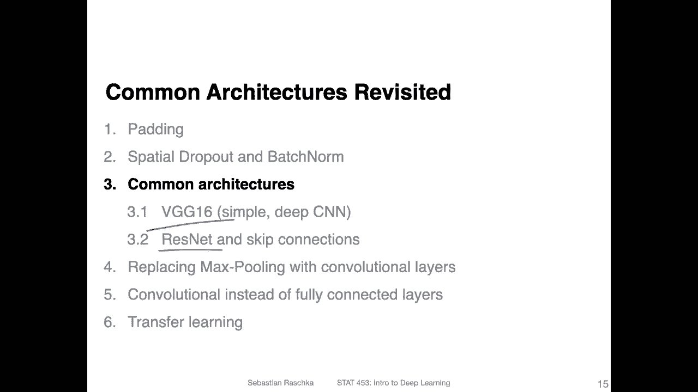
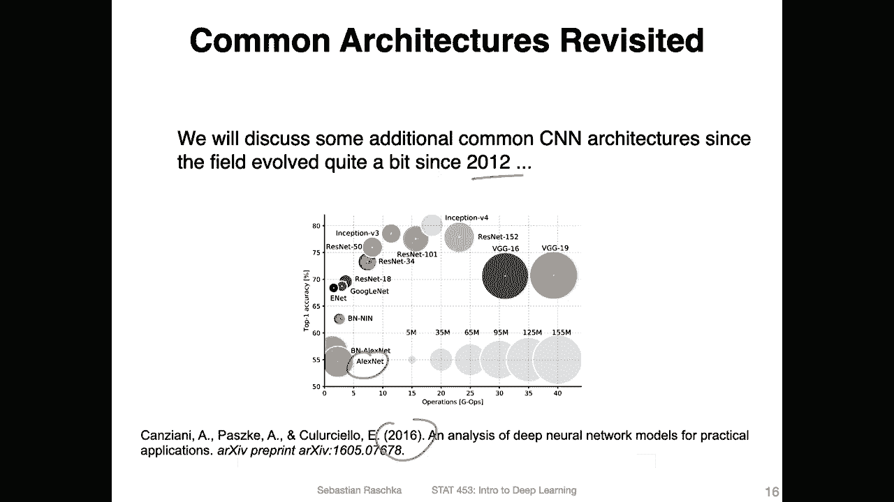
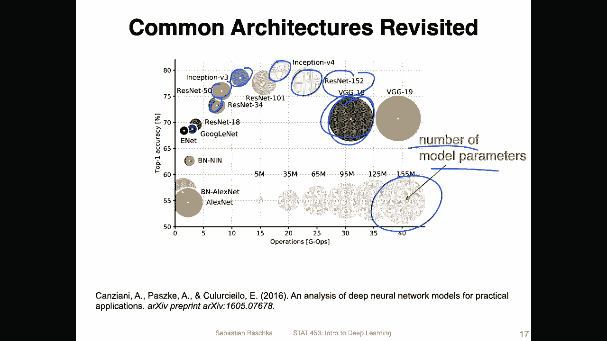
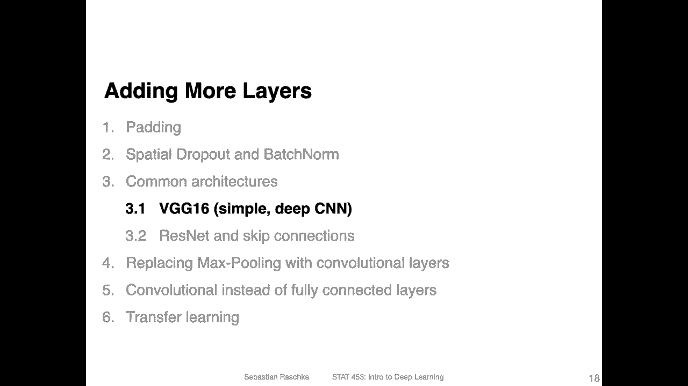

# P114：L14.3- 架构概述 - ShowMeAI - BV1ub4y127jj

All right， before we dive deeper into B G G 16。 No pun intendednet here and Renet。

 let me just briefly recap one or two of the slides I showed you last week。

 So here was a paper from 2016 that was highlighting some common architectures back in the day。

 That's already five years ago。 But yeah， it highlights really how fast this field is developing。

 So Alex Net was developed in 2012。 We talked about it last。😊。

Last lecture and now we can see there are many， many more and this is also not a comprehensive overview。

 these are only a few of the common selected ones。Good news is that yeah it is not growing exponentially。

 I think so many people still work with VGG and Renet in 2021 because they are really good basic base architectures is a backbone for yeah methods on top of it。

 However， there are also some additional architectures not listed here that are popular nowadays for instance。

 So also I should say these are only for classification。

 We have also another set of architectures for different tasks。

 but yeah other common ones are top of my head， maybe mobile net wide residual networks。

 efficient and efficient that here densenet。😊，Highway networks。 But yeah， anyways， so these are。

Still a good overview。 If you want to get started with experimenting with different architectures。

 I would yeah recommend considering those too。 So， for instance。

 also a good takeaway from this one here is that。

It's not only about the number of parameters。 So you can see VG G6 is relatively large。

 but it doesn't perform as well， for instance， compared to inception networks or here on the residual networks。

 So here these add certain tricks for instance， we will talk about residual networks。

 They have a residual connection which can help with making or having more layers without having such a problem from vanishing gradients。

But then yeah， you also have inception， which has interesting way of combining different convolutions。

 So convolutions of different sizes。 I originally plan to talk about it more。 but yeah。

 due to the interest of time。 We will be skipping inception。 But yeah。

 they are also interesting tricks like combining different convolution sizes into one layer and then also having auxiliary losses like having intermediate losses in the network。

 So these kind of tricks can also help improving the architecture because we you G 16 is essentially just a convolutional network with 16 layers。

Which are pretty large， but it's not all about that。 It's also about certain tricks。 for example。

 here， Resnet 152 has 152 layers。 It's not possible to have just 152 layers in a regular VG G context because then we would have vanishing gradient problems Recently。

 there were some efforts， though， to yeah， also develop。

Very deep networks without residual connections。 And there was also interestingly normalize a free resnet。

 which also gets rid of patch norm， for example。 So there are still interesting developments happening。

 But yeah， again， these are the basic architectures。

 And in the next video I will start by discussing the Vji G16 architecture。

