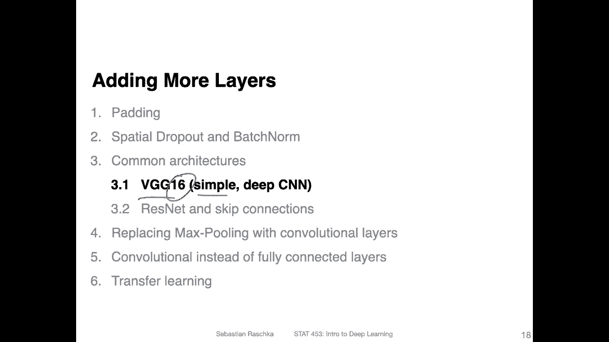
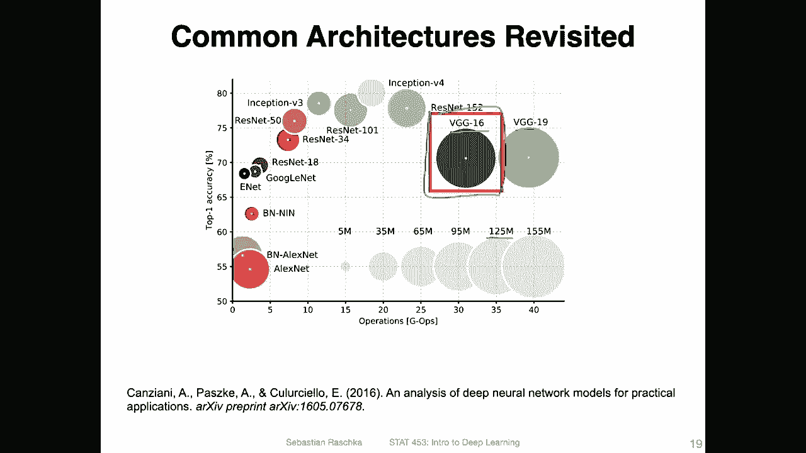
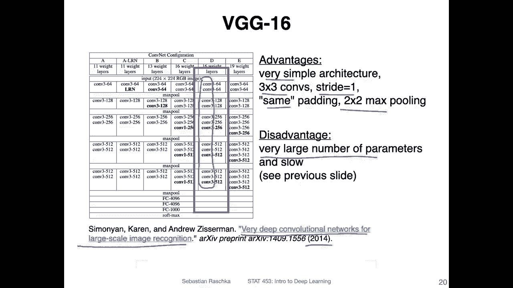
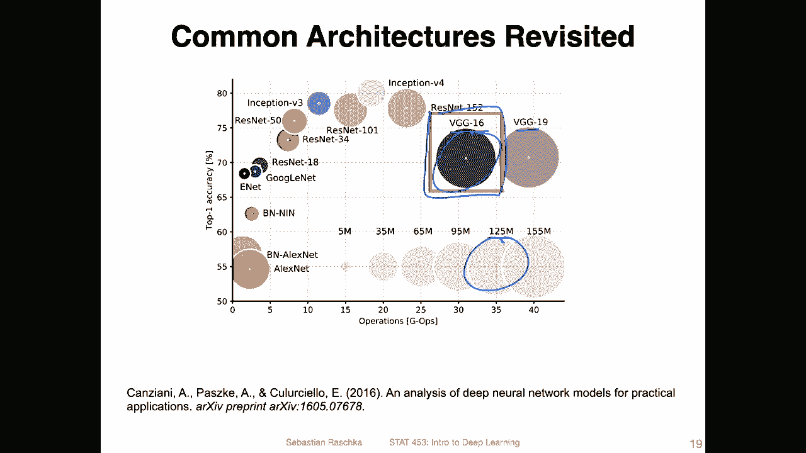
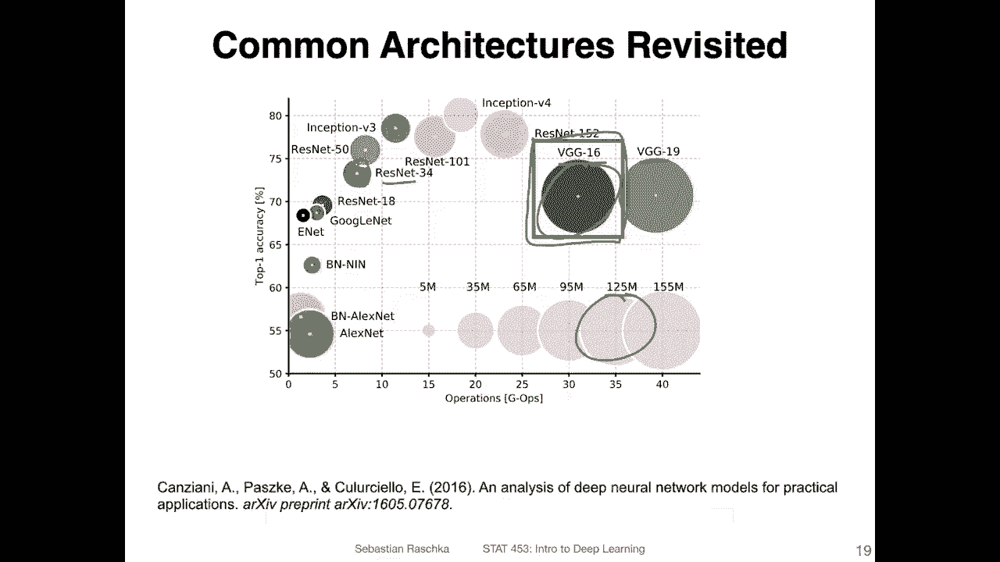
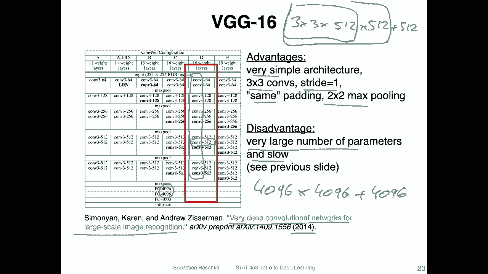
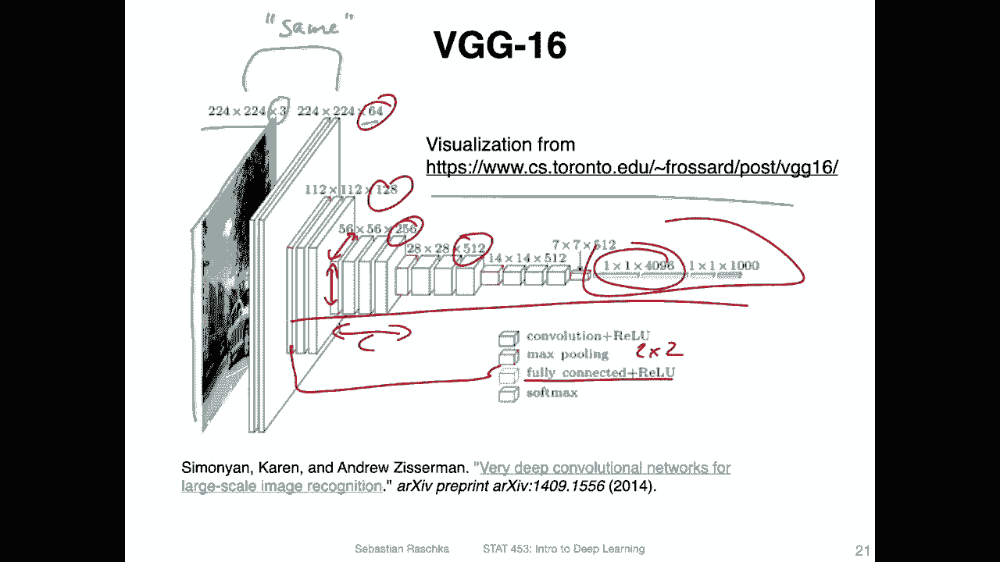

# P115：L14.3.1.1- VGG16【概述】 - ShowMeAI - BV1ub4y127jj

Alright， let's now get concrete and talk about the V G 16 architecture。 So this is a very simple。

 straightforward architecture。 You can think of it as similar to the Alexnet。

 We talked about last lecture， except that we have no more layers。

 It's essentially a network with 16 layers。

Just for reference。Given the figure that I showed you last video， we have the VG G16 located here。

 and you can see it's relatively large。 It's actually the second largest network in this figure here。

 It's around， I would say 125 million parameters。 The bigger network here is VG G19。

 which is a variant of that with 19 layers。 but you can see adding these three more layers doesn't really change the performance。

 So we are focusing here on the 16 version。So in this video。

 I will mainly just show you how the architecture looks like and then in the next video。

 I will make a new video showing you a code implementation of that。 So here。

 just the overview and this is from the paper so you can find more information about this network architecture in the paper called very deep convolutional networks for large scale image recognition from 2014 It's already seven years old。

 but yeah again it's a simple architecture， I think it's something easy to implement and easy to toy around with so not a bad thing to learn about。

 So an advantage like I said， is that it's relatively straightforward which makes the coding very simple as you will see in the next video。

So essentially， it's based on just using three by three convolutions。

 So you can see here all of them are。3 by3。And in that way， it's also very simple。

 The stride is one for the convolutions， and they are using the same convolution。

 So we have the same convolution with a padding such that the input size matches the output size after each convolution。

And they are using two by2 max pooling， then to reduce the size。This is not shown here。

 I will show you the max pooling in the next slide。 One thing to notice， though， here， or one。

One aspect of it is it's very large in the number of parameters。 and thus also very slow。

 So if I go back， can see its pretty large architecture。

 So just looking at it if it only has 16 layers， Why is it so large？ I mean， later。

 we will see architecture called Resnet 34 in the next video， which is much small， smaller。

 even though it has 34 layers。 So what makes this architecture so large。

 So essentially it's if you look at it。

It's the number of channels also。 So you， I mean， you can have of course， more channels than that。

 But if you just count， I mean。Let's just take one of those。This one。

It has 512 input channels and 512 output channels， right。If you have the three by three convolution。

Then， 512 inputs。And then we have 512。 So this is one kernel right， and we have 512 kernels right。

 And then we also have the bias。 I mean， the bias doesn't really matter。

 but it's another on 512 on top of it。 But on this part， I mean。

 it's it's a really large number right And then we have it multiple times。 And yeah。

 this adds up over here。Fully connected layers。 we have。

4096 times 4096 in terms of the number of weights for each of them， right。

 And then also on top of it， of course， for 96 by as units but these are really large。

 So if you mean， these add up right。 So if you have multiple of these。Yeah。

 so this is just referring to the number of parameters。

 So here's maybe a nicer visualization of that architecture from this website here。 And yeah。

 you can see visually how it looks like it's the basic concept behind convols to make or to squeeze out these features usually there was just brief moment。

 So there was a question on piazza where someone asked about that so like the general trend or some guidelines for cons。

 and that is exactly it here。 So we start with a large height and weight。 sorry。

 height and width and then we make。

The height and width smaller， but we add channels。 so each channel。I mean。

 that is at least what we hope it will happen。 Each channel will learn different type of feature information because each channel is essentially created by a different kernel。

 right， So usually so we have the input image here。

 It's a 224 times 224 image with three kind channels。After the first convolution。

 we have 64 colour channels。 We use the same。Convolution that we talked about in a previous video to maintain the size。

And then he in read。These are the。Max pooling mirrors a2 by2 max pooling。

 which will reduce the size by half。And then， we have。Yeah， another round of squeezing and so forth。

 And you can see we are increasing。The number of channels， so。The， the width increases。

 whereas the height， I mean， the width in terms of the number of channels increases。 And here。

 the height and width。Of the feature map decrease。 So we are squeezing。

 You can think of it as squeezing out the information here。Yeah， and then here， in the end。

 we have the fully connected parts。Which we can actually also represent as convolutions。

 which I will show you later。 This is why it's actually shown like this。So we can actually， I mean。

 it doesn't really matter whether we implement it as a fully connected layer or convolution。

 as I will show you in a later video it's it's equivalent Okay。

 so this is how the architecture looks like on a conceptual level Now let me take you to the code example in the next video。

