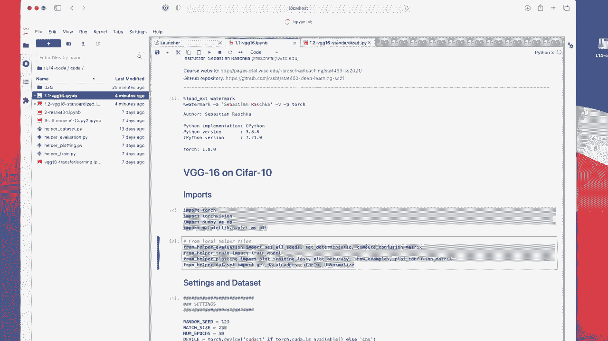

# P116：L14.3.1.2- PyTorch 中的 VGG16 - ShowMeAI - BV1ub4y127jj

Alright， let's now take a look at the code example of VGG16 that I implemented here I should mention that I don't want to rerun this year from scratch during yeah this video because it took one and a half hours to train it's a large network so in that way we will just take a look at the results so I will of course yeah share this with you should find the link another video。

Yeah， so what we have here is all the usual imports， watermark， torch torch vision and so forth。

Then my helper files as usual， they are I think identical to what I used to last week。

 I can't remember making a modification to them， so exactly the same like that we used for AlexNe。

 the only difference here is really that I have a different architecture。

So defining our hyperparile settings， random seatd shouldn't be a hyperparile but you have to set it to some things I'm setting it to one to3 batch size 256 and we are training for 50 epochs and I was using a GPU for that because otherwise it took too long so you could for instance run this on Google Colllap on the GPU。

If you run things on the GPU。This function doesn't really work that well anymore because I actually cut this from the videos because it was too long。

 but just to briefly mention why so when you train things on the GPU there are different types of algorithms used for convolutions。

 So there's， of course， the convolution that we talked about in the lecture。

 but in code people don't implement it this way， they are usually more efficient approximations of that like a fast fourier transform based ones and depending on what computer you use and what graphics card you use。

Different approximation algorithms are used， although these approximations are pretty good。

 they are approximating the convolution very， very well。

 there are tiny differences after the decimal point。 And if you have a lot of tiny differences。

 they can add up。 and then sometimes you will。Find that results are different when you run them again。

 because not only are different algorithms automatically chosen。Based on the computer。

 But also when you run it multiple times。 So NviDdia is actually running some automatic way to guess which algorithm might be a good choice at a given time。

 So that is why there are sometimes slight differences。

 It used to that you could set this to a deterministic setting。 but for some reason。

 it complains now that this deterministic setting doesn't really work anymore。 But any case。

 you don't have to worry about that。 It's very normal in deep learning that you get different results if you run things again。

I mean， they will be slightly different。 They will not be very different。 It's just like very。

 very small differences。

Any case， let's not worry about this okay so。

Talking about the data now。 So here we' are working with a Cy 10 dataset。Which is 32 by 32。 But yeah。

 I。Resize this， because V G， if you。

Look at this figure again。 it was originally developed for 224 times 234 inputs。

 and there are just too many layers for small inputs because you have the size of the layers。

 and at that that point， if you have half the input size。

 you will already have only3 by three or4 by4 layers here。 And if you make it even smaller。

 it would be one by one。Even smaller if you have a here or e one by one and then try to half it。

 So that way， we can't have inputs that are too small。 It actually works with 32 by 32。

 but the results were not as good。

So it was faster， of course， but。With this version as slightly upscale， I get actually85% accuracy。

So what I'm doing here is I'm upscaling these images from 3 32 to 7070 then I do a slight random crop here so the random crop is to avoid overfitting or not avoid overfitting but to reduce the overfitting to make it a little bit less sensible or sensitive to exact pixel locations and then I'm converting it to a tensor and then normalizing it so that they will the pixels will be sent at zero across the channels and have a standard deviation of one。

So that's the usual procedure。

Again， for testing， I don't do any random crop I am centre cropping。

Then。The rest is exactly the same that we talked about for Alexnet last week。

 So here's the interesting part。 That's the VG G 16 architecture。 Yeah。

 I just had some notes for myself for calculating the padding， but。

We probably don't need that here。How I implemented it in different blocks。

 So I have one block that is usually the convolutions and then stopped or the final layer in that block is the max pooling layer that reduces the size by half。

 So these。Preserve the size。 It's the same convol with the padding such that the input equals the output size and max pudding reduces the size。

 And then again， here， this consserves the size。 This reduces the size by half because of the stride。

Then here。Again， we have， yeah， we have。

Another block。With max pooling。Another block。

Max pullinging。And another block。And max pooling。 And then these are what I call my feature extractor layers。

 And then we have a classifier layer。 This is really if I go back to the figure。

 this is really this last part here in light blue。 This is the fully connected part。

So here a linear layer， a fully connected layer， essentially another one and another one。

 So you have dropout I should probably yeah this is one deep dropout version。

 So if you want to add dropout for other layers， you have to I would recommend using dropout 2D。

Actually， I recall， I forgot about that recently and I used a regular dropout somewhere because I for some reason forgot to type 2 D and I was wondering why I couldn't notice any difference。

Alright， yeah here I'm using the gaminging uniform weights。

 Is skip here because that's what was used in the original paper。

 Then I have an adaptive average pooling， which will in this case。

 make things equal to the height and width here so that I chose。

To be 3 by3， so。Because for the linear layer， you have to know the input， height and width。

Because you need to know the number of features。 We know always know the number of channels， right。

 because it's coming from here， but sometimes it's hard to know what's the width and height to compute the number of features。

So usually what we do is we have here the feature map and then average pulling。

 And then what we do is we。Flatten， this is essentially。Flattening operation。

 This is essentially the same that you do when you work with multilay perceptrons and Mness。

 So you basically flatten the input， which is a image， you flatten this to be a long vector。

 That's the the same operation here。 And for that， you have to know the number of parameterss because you need to know the number of weights right for the multilay perceptron layer。

 the linear layer。So how would you get this information here， I'm using adaptive average pooling。

So adaptive average pudding is an operation where you can determine the input and output size and it will either add the strides or the padding such that this dimension will be met。

 So if the input is so where am I here if the input to this one is smaller than three by3。

 it will add padding if it's larger than three by3。

 it will not add padding and do some strides to reach that size that we desire。嗯。Yeah， and。

If you don't want to do adaptive average pooling and you want to know the number of。

Sizes that come out of the last block， for example。

 one way would of course to use the equation that I showed you and just calculated by hand。

That is a valid approach that could be a potential exam question， but we don't have an exam anymore。

 so don't worry about it maybe something for the quiz， but in practice。

 yeah people would write forward or backward hooks I think I explained it so you would use a forward hook here I explained it to you when we talked about the Pytoch API but to be honest。

Even that is something most people won't do because it's just too much work to write a hook function。

 I mean， I wouldn't do it。 The simple， brute false way would be to just implement a print statement temporarily。

 So what you would do is you would just have something that's lazy way， the lazy but efficient way。

 something like x does the size， print the size here of x。Then you would run this。

Here， when you do the training， it will output the size。

 It will probably crash if you don't have the right dimensions。 But then you know the size， right。

 you know， the height and width then， and then you can。

Remove it。At the desired height and width here。 And you are good to go。 So in practice， most people。

 to be honest， are just inserting。 if you want to know the size， just import the。Print statement。

 And that is how you find out the brute force way。 Okay。

 so this is essentially the energy G architecture。 so you can see。

They are essentially conversion layers。

Followed always by max pooling that halfalves the input size。 We have many of those。

 then these classification layers here。

嗯。Miao。

And then。We have here the training。 So I' am initializing it for 10 classes。

 If we look back to the slides， it's 1000 because imagenet， the dataset。

That they used here had 1000 classes。 We have Cypher 10 with 10 classes only。

I use SGD with momentum， and there's our learning rate scheduler that reduces the learning hell rate by a factor of 10。

 Sore dividing it by 10 if。The validation accuracy doesn't improve。

 So this is just my training script that I used for Alex 92。

Al right， so here is then the training the same as with Alexnet。

Can say see it trains pretty quickly，35%，50%，53% accuracy。 So it's slowly climbing up。 at some point。

 it stops。

Around here， it's improving a little bit， but it takes longer， more epochs。 So I do that。 So it's。

 sometimes， you know， it's very useful to look at this。 If you run an expensive network like Widge G。

It might be taking a few hours。 and you probably want to take a look at the beginning。

 whether it's even worthwhile training it for 50 epochs， right。

 So if you notice that the loss doesn't go down， maybe in the first four epochs or something like that。

 or you notice the accuracy doesn't improve。 Then I would just stop the training and maybe change some parameters before you just waste one and a half hours waiting until it's finishes。

 So that is why I'm printing this during the training。 There's a tool called。

Tensor board。That can create visualizations during training。

 We are not talking about this in this class because I think we already have enough tools for you to learn about。

 So there's already enough code going on。 But you're very welcome to check this out at some point。

 It's also yeah， nice for visualizing things。 But yeah， here， I'm trying to keep things simple。

 So not too many tools at once。

Sorry enough you have to learn in a way。

But at the end， I always find it still helpful to take a look at visualizations here。

 I have make them of course， with Meprolip so that you can see them during training only after training but yeah what you can see is the loss goes down pretty nicely so it kind of converges here after 50 epochs maybe it would still approve a little bit but looking at the validation performance here so in orange you can see maybe maybe it would go up slightly more but you can already see after epoch1 there' a huge amount of overfitting so to reduce that overfitting maybe adding some dropout 2D might help。

You can actually this may be a good exercise。 you can actually insert a regular dropout and you will see with a regular dropod that you won't reduce overfitting too much。

 but if you use dropod 2 D that helps actually more with convolutional networks。

Okay， so this is that and then here just the visualization looking at some examples you can see most of that looks correct so P is predicted T is on the true label。

 you can see this one is wrong de and frorog， it's hard to tell。

 I mean if you look at this Cypher 10 has such a low resolution that even we have difficulties telling what's in these images I think。

Alright， so here's a confusion matrix。 So that looks actually interesting。

 You can see dog and cat are often misclassified here。

 and that is kind of reasonable because cats and dogs are both animals。 So a cat in a docker。

 for example， very different from an airplane。 So dog and airplane is rarely confused whereas dog and cat is more often confused in the grand scheme of things that's kind of reasonable。

 I would say， so you can actually see all the animals。 That's very interesting。

 So you can see all the animals here in this square are often。😊，Yeah。

 misclassified compared to ships and trucks and like automobiles。 So here you have things。

 and then you have the animals。 animals among each other are harder to classify compared to other objects like airplanes and automobiles。

 Alright， so this is VG G16。 maybe one more thing。 I have VG G16 standardized。

 was just toing around with it。

To see if proper standardization can improve things， but it didn't turn out to be true。

Just to show you the， I would say， proper way。 So it's scrolling up again。

Here I'm just using 0。5。5。5， which will scale the pixels such they are between minus1 and1 center at 0。

So using 0。5。

But。We can actually use the proper standard deviation and feature pixel mean by computing them。

 So here I just have a function。Added to it that computes or approximates。

 actually because it's faster。 that approximates the mean and standard deviation for each channel for each color channels。

 That's a red， green and blue1。 So they are around 。5。

And then here the standard deviations there are 0。25 instead of 0。

5 in what I assumed in the previous。Coode， but if I use these。Proper ones。Instead of just using 0。5。

 I find that it doesn't really make any difference in all。 So performance， I think。

 was pretty much the same。

Actually， worse82。 Oh， actually， it's an interesting drop here。 It's probably due to overfitting。

 more overfitting。

Yeah， so， but you can see in this case， I didn't gain anything from doing this other standardization。

 maybe it's actually training better， though you can see it's dropping more here。

 could be because the schedule is triggered at that point。

It doesnn't have to be because of choosing the mean and side deviation could be just coincidence。

All right。 So there was a long video probably。 So let me wrap this up in the next video。

 we will talk about residual networks， which are a little bit more interesting than just adding more layers to it。

