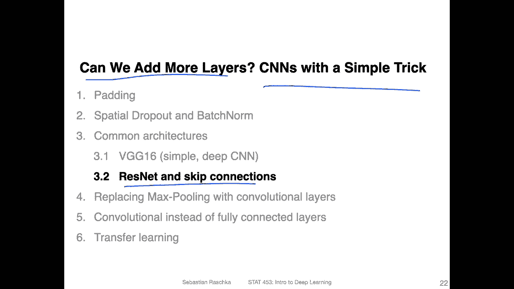
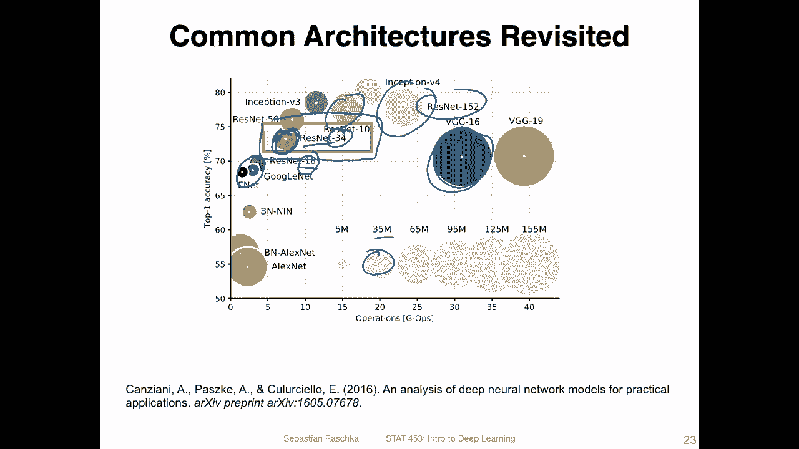
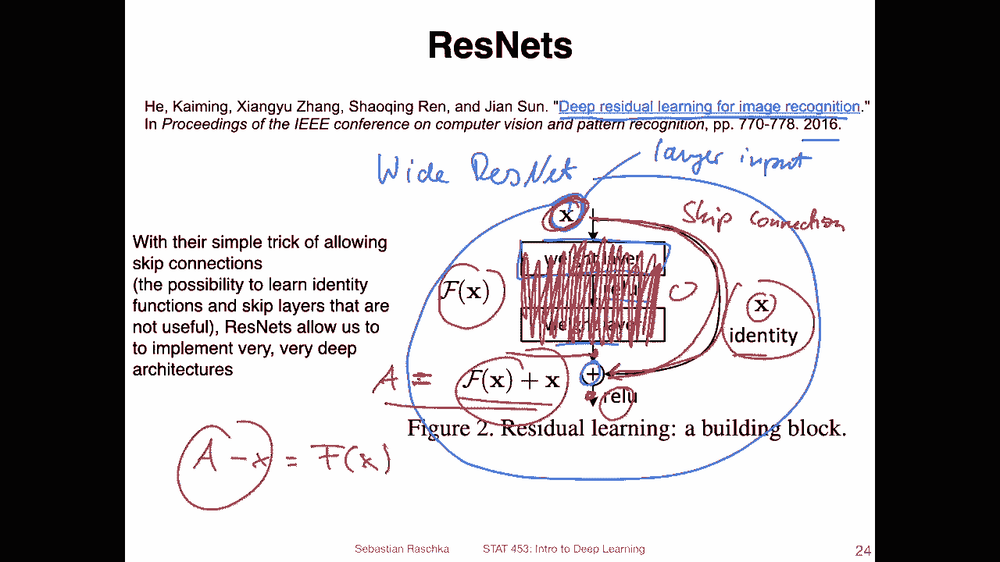
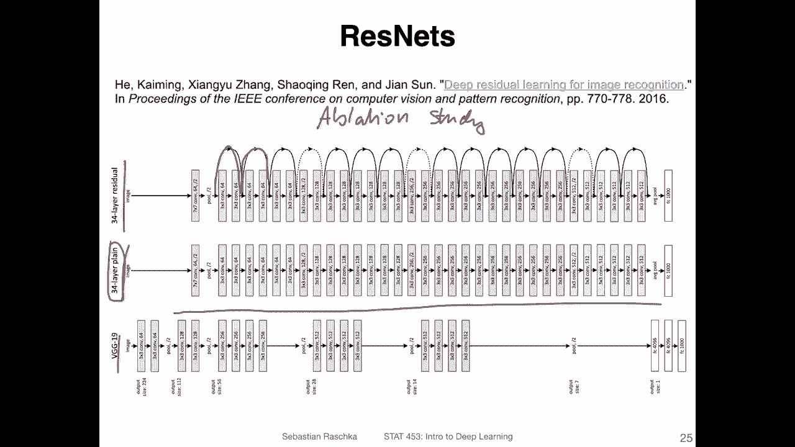
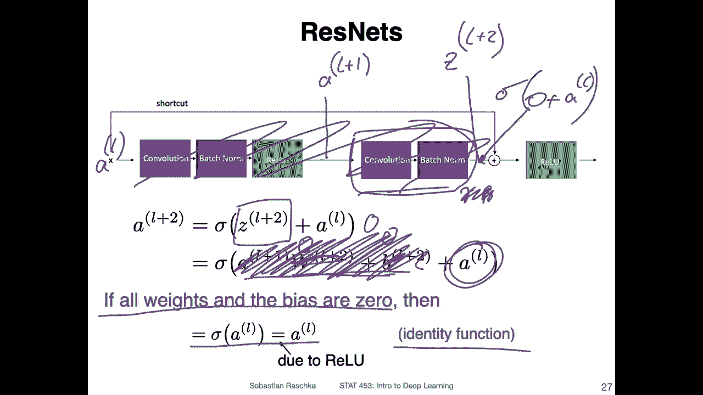
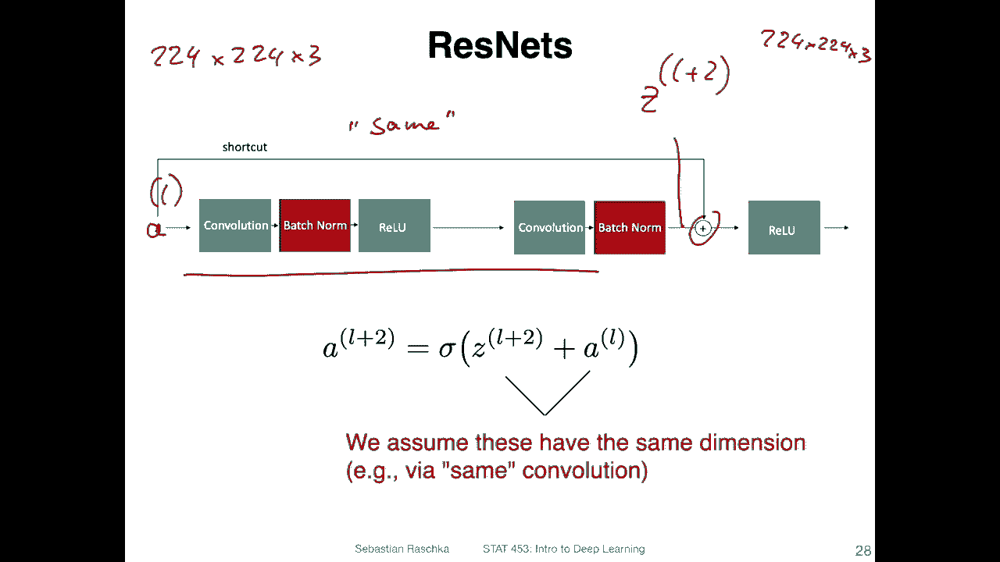
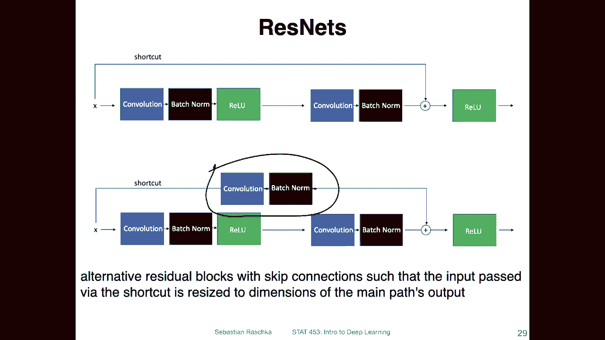

# P117：L14.3.2.1- ResNet 概述 - ShowMeAI - BV1ub4y127jj

Yes， so now that we discussed the VG G16 architecture in the previous videos。

 the natural question is can we even add more layers and expect to improve the performance further？

 Well， technically yes， but no， so technically adding more layers should we would expect it to help。

But in practice， there might be problems like the vanishing gradient problem that we talked about。

 So if we have a multiplication。In there， I mean， we have the multi variableable chain rule， right。

 So we have the chain rule， which is based on。It's essentially a product of different things。

 And then if only one of those is a very small number， let's say even early on。

 that it will essentially cancel out all the remaining signals in the back propagation。

 So having small values in。Back propagation somewhere。 if we use it in a product。

 can really cause big issues。So we can't just add more layers and expect then the performance to perform better。

 That's what's also experimentally observed。 So people were thinking about that， I mean。

 different solutions to this type of problem。 One is using the so-called residual network。

 So the residual network relies on so-called skip connections。

 which can essentially learn to skip certain layers if these layers are detrimental to the performance of the network。

 So essentially it's CNNnNs with a simple trick。So let's take a look how that looks like。

 And in this video， I will just go over the yeah， broad concept and in the next。

Video， I will show you a code implementation。So yeah， just for reference。

Revisiting our visualization here， that's where residual nets are located。 There's another one here。

 a bigger one。We are talking about a small one，34。 I mean， this's also an 18 version， but yeah。

 it is not as good as this one。 We could have talked about this one， but it is three times larger。

 So 34 is referring to the number of layers。 This is kind of a good sweet spot for a simple problem。

 We could have used 18， maybe， but yeah here we are using 34。

 it's slightly better than VG G16 also here。But has far fewer parameters。

 you can see this is far smaller， it's maybe around maybe 25 million or something that is 35 its bigger than this one。

 whereas VG G16 was at least maybe three or five times as large。

Alright， so here's a screenshot from the paper。 So the paper is called deep residual learning for image recognition。

 It's from 2016。 So it's not new， of course， but it's still very popular architecture。

 There are also variants of that， called white， like white residual。

Networks that are still very popular。And they're just broader layers。

 but essentially the concept behind residual networks is really powerful。

 It's even something called a dense net， which is taking this even further and connecting each layer with each other layer。

 But anyways， let's stay here with the residual networks for now one for this video so。

Here's an outline of how this whole thing looks like， so。Suppose there is an input X。

 but this is only an input to a given layer。 I mean。

 we have more of these blocks in the whole network。 So this doesn't have to be the image input。

 This can be the input to a given layer。 Let's say let's call that layer。Input。And then after that。

 we have a weight layer， for example， a convolutional layer。A re function。Another weight layer。

And then we have this plus here。 So the plus here is a addition operation。 So it's adding。

This X here。Back， so。It's written here， so we are adding this。To whatever comes out of here。

 So let's call that one。F of x。And here we have this input。 So we have this plus operation。

 which is f of x plus x。Right， and then after that， there's another re。 So essentially， we have。

This so called。Skip。Connection。Why is it called residual network， Well。

 I guess it's called like that because if we， if we maybe talk about what comes out of here as let's say。

A。The output of this one， it's called it。诶。Then， we have a。us x equals f of x。

 if I just rearrange that and maybe you can think of it as learning the residual between the output and the input。

 but this is like really more conceptual is maybe why they thought of the name residual。

 but it's only speculating， but I guess that's what inspired the name residual network。

 But what's more important here has really that it's learning。

Or it's having this weird setup where we add this input。Back。

I have more visualizations of that to illustrate this further。

 and then I will tell you why this might possibly help because essentially yeah。

 it's actually already written here it。Can result in learning the identity function。 So the network。

Can technically learn。To skip this。 So if you think of the signal that is being back propagated。

 if this is a bad signal。Like a0 or something like that。You still have this identity。

 which is a simple plus， so it can still just maintain the signal， right， So instead of。

Having cancelled all all the gradients， if there's a zero in here or somewhere。

 what happens is that we still would have this identity here。

So here is a visualization of the big picture of the residual network。 So yeah。

 what you can see here is that。This is 34 layer plane network for reference BG G 19。

And in this 34 layer plane network。They have just。Many different layers here。

 but they found that this doesn't really result in a good performance。

The performance of this one is actually pretty poor。 So in order to fix that。

 they added these skip connections。 So you drop it's the 34 layer residual network and these yeah skip connections help with improving the performance。

 So here yeah， it was essentially an ablation study what you call。Applation。

Study where you remove one part of the network and see if it still performs well。

 So it's same like ablation studies in yeah， let's say biological fields。other fields of science。

 So here。With and without residual networks， I'm actually not showing you the table because， yeah。

 we have many things to talk about。 I don't want to make the tables too long。 sorry。

 the video too long。 but if you're interested， you can refer to the original paper。

 What's more interesting is again， let's talk about how one of these residual blocks look like。

 like zooming in。

So。Here I'm writing essentially the residual block that I showed you earlier。

 So let's think of the output here as。A。😔，L plus 2。

I shouldn't have made this so large because then no I don't have space to fit it in。😔，Alright。

 so this is， let's call this A L plus 2 L plus 2 because it's。Two layers after what is here。

 And let's call this then。AL at a given layer， and this is two layers later， right。should me。

Like this。Thisす。Meer。😔，1， and it's。here。Leir。😔，2 notice that the skip connection only spans one and a half layerss。

So that is because before here， we also set the re。 So this is the activation。

And if we would have the red loop before here。We。It actually would end up applying。

Two activations in a row。 So in that way， it's。Set up like this。Okay， so。Or， essentially。Yeah。

 that's， that's what I mean。 Okay， so essentially what you can think of here is as。

Z plus is the value。Comes out of here。See。😔，Plus 2。And this one would be， essentially。嗯。😔，Oh plus1。

And yeah， so here this would be Z。L plus。Just writing down some notation here。

 and this is the basic setup， so you have a convol。Optionally， a batchome， they use batchome in。

Resion network， you don't have to use petaginum， but it performs better。

R activation another convolution patch norm。 And then you add。Botht， you add those together。

You add this one。With this one。And then， you apply。The render activation here。

That is essentially how a simple skip connection looks like。Alright。

 now expanding this one or in particular， this one。 So this one is the one here again， Z L。It's true。

Now we can expand that by taking a look at。A L plus 1。Then we apply a weight。

 can think of the convolution at batchome here as our weights。 we add a bias。But yeah。

 I'm kind of simplifying it。 it would be a convolution operation and then batchcheome where we have also a gamma and a beta。

 which I'm ignoring here， let's just assume we don't have batchaginome only a weight and a bias for simplicity so this can be understood。

Is this operation。 So we are essentially adding this one。 And now you can think of it。 Okay。

 what happens if。嗯。The weights and the bias are 0。 So if I have。Z weights here。And0 bias。

 the network decides to learn that。 What will happen is it will essentially skip， right， it will。

Skip that layer。 so then we will only have。This term here。

So all of that would be essentially canceled， so we only remain with this term。

 So what I'm writing down here。 So in that sense， the network learns an identity mapping here between the input to the layer。

 So let's call that。嗯。Oh。And。😔，This one， yeah， this one is essentially shortcuted if this is。

IfWhatever comes out of here。Is0，0 plus。A L， and then we have the relu。

So it's essentially learning how to skip this whole part。

 And this is the main idea behind residual networks， so。I mean， we we don't decide what to skip here。

 The network has the option to learn how to skip something。 So just by applying back propagation。

 it might happen that it learns to skip certain layers if they are bad。

 So that way you are building a very large network。

 but it's actually maybe not using all of these layers。

 it's essentially sometimes maybe learning to skip certain layers if they are bad for performance。

So。Yeah， so we assume， though， that。That dimension of our value。A。

L here has the same dimension as this L plus。To here， right？ Because otherwise。

 we wouldn't be able to add those。 We can only add things if they have the same dimension。

 The strong assumption。 So if we have the setup， this means we always have to make sure we apply the。

Same convolution with the appropriate amount of padding and that we also cannot reduce the size of the layers。

 right， so that can be a little bit of a problem because then our net network has always the same inputs when we have 224 times 224 images as input。

 and we always have these skip connections。 The last day， we'll still have 24 times 24 sized images。

Right， so that way， it's also not very useful。 So in practice， there's also a way。

We can reduce it。 And it's by having a special version of that shortcut only using yeah convolution and batch norm。

 So there are some alternative residual blocks that can also be used Yeah to， to reduce the size。

 And that way， it's almost as if we would。Have one layer。 So this is essentially kind of like。

If you ignore this part， it's this together， it's kind of like a single layer instead of having two layers。

So yeah， that's a trick you can reduce the size with。All right， so。

That's essentially how residual networks。Work and in the next video。

 I will show you a code implementation of that。

