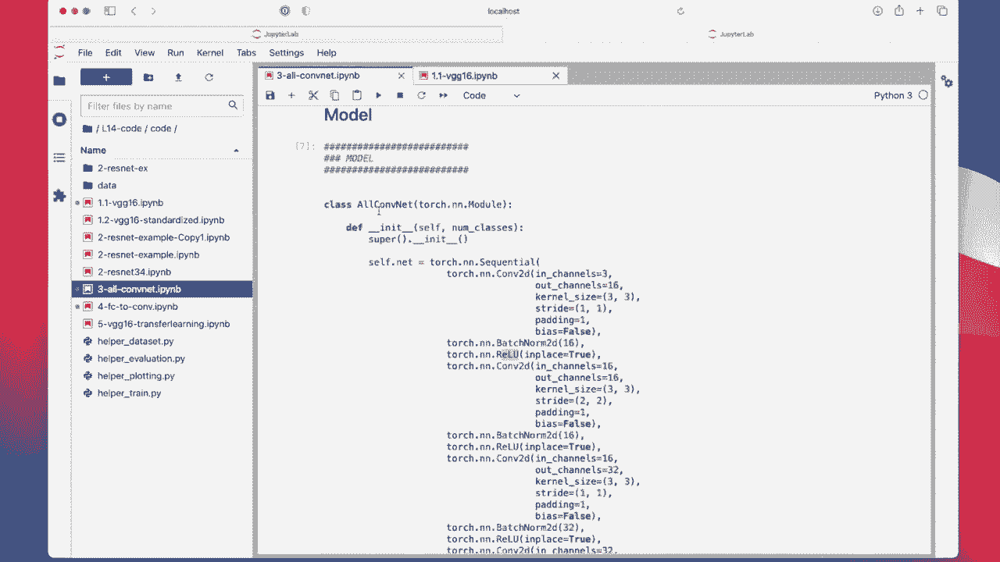
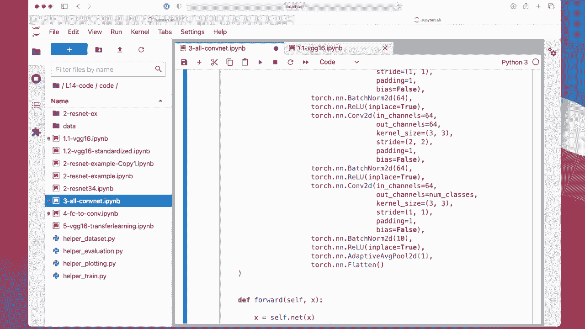
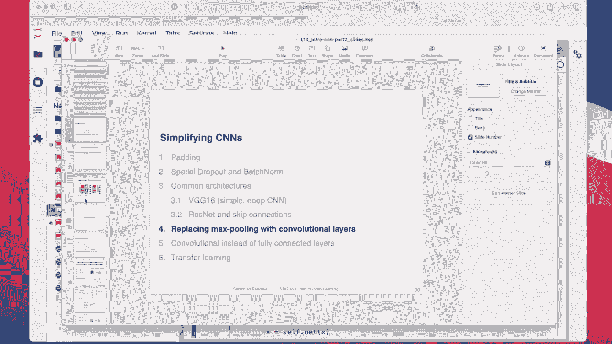
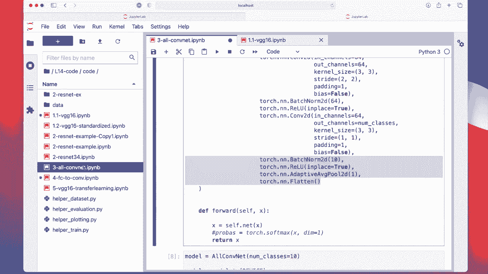
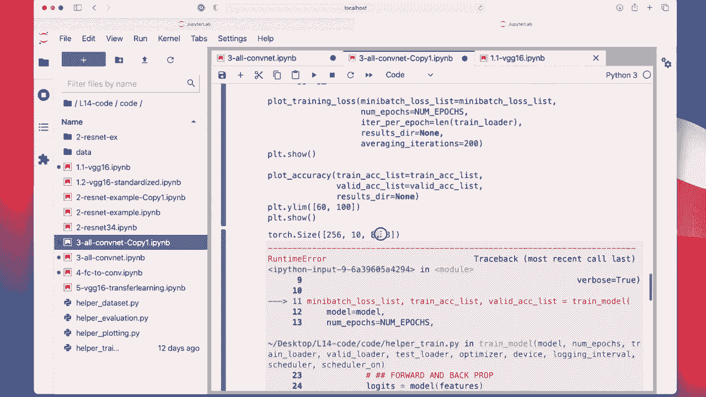
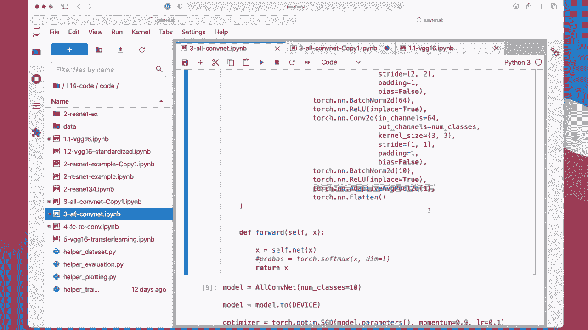
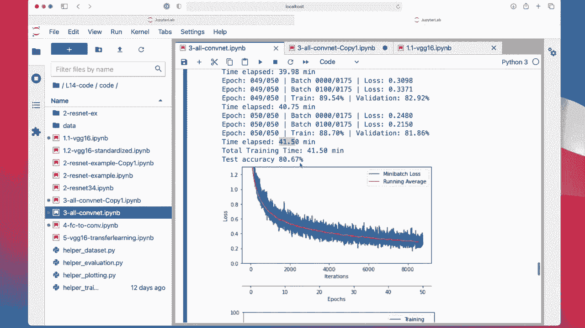
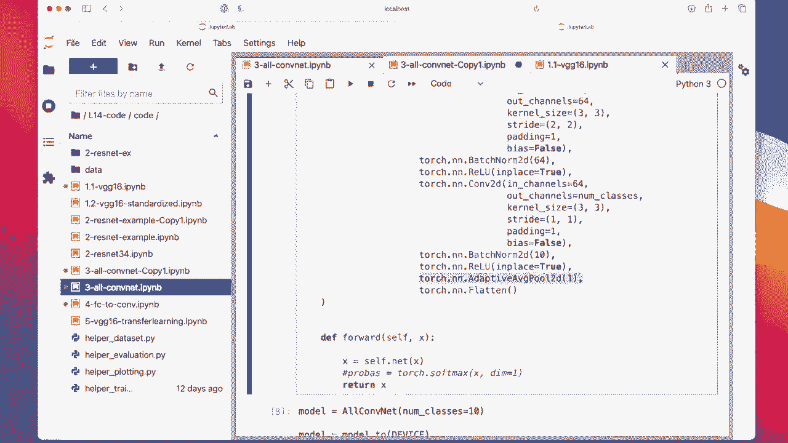

# P121：L14.4.2- PyTorch 中的全卷积网络 - ShowMeAI - BV1ub4y127jj

All right， let me now show you how we can implement this all convolutional network that I discussed in the previous video。

So here I have a code notebook I will of course share as usual and also as usual I won run this because it took like 45 minutes to run this whole notebook。

 and yeah， there was actually an interesting question on Piazza regarding the runtime of the homework。

So a student was asking whether it's normal that it takes like 8 minutes to run the notebook。 Yeah。

 that is totally normal in deep learning。 It's actually pretty fast eaten。 So yeah， deep learning is。

 of course， a little bit different than traditional statistics where we usually work with small data sets。

 like little tables of data。 So here we have really large data sets and complicated models with many。

 many， many parameters。 So yeah， it takes usually a long time。 So some people。

Actually use hundreds or thousands of GPUus for multiple weeks to train these cutting edge。

 vision and language models。 So you can actually get good performance also with efficient models that only run a few hours。

 But honestly， if you have a real world data。 Sometimes here， you have to be patient。

 Sometimes it takes a few days or so。 So this model here is relatively simple。

 we have the Cypher 10 data set。 So luckily， it only takes 45 minutes。 But yeah。

 that is still a long time。 and we probably want don't want to wait 45 minutes here during the video until it finishes training。

 So I'm not going to rerun this。 but yeah， I will share the results。

So everything here is exactly the same as in the VG G 16 notebook。

 so I don't have to recap all of that。 The only new part is really here。

 this code of the all convolutional network can make this maybe a little bit bigger。

Yeah， I'm seeing。 I was writing this very ver both。 So you actually。

 if you have the same height and width， just a small common here。

 if you have the same height and width for kernel size in stride。

 you can also replace this by just the three。 and this just by by one， for example。 So here。

 the first value always stands for the height。 And this is for the width。

 And this is also for the height and for the width。So yeah。

 because it's all about simplifying convolution networks here you will only see convolutional layers and re layers and the beome layer。

 no max pooling and no fully connected layer so。You can further， of course。

 simplify it by not using batchchome。 I think batchchnom was not even around not even invented or around when this architecture was proposed。

 but I didn't get really good results without batchchome。 So I just added it。

And the rest is just like the paper that I showed you this striving for a simplicity paper。But yeah。

 except that I added a patch norm。 Yeah， and all I can tell you here is that we have convolutions and。

Here we have always like one convolution that increases the number of channels。

 but it keeps the input in the output size the same。

 So this is like the same convolution that we talked about。 I used a patting of one to achieve that。

 So if the input is 70 pixels， the output will also be 70 pixels。

And then so here there' is always a con that increases the channels。

Because each channel can be thought of a feature map from a different kernel or feature extractor。

That is how the network yeah learns to extract different features。

And then there is always a convolution that keeps the same number of channels。

And this one has the stride of2。 And this is， these are the equivalents of the max pooling with kernel size of2 by2 and stride of 2。

 So this is here。 This is the one for reducing the height and width。

And then we have， again， one that increases the channels。With a straight of one。

 So it keeps the input and output height。 And then we have， again。

 one that here with a Str of2 just reduces the height and width by a factor of 2。

And we keep doing that a couple of times。 And then in the end， we have 10 classes。

 right in Cypher 10。We have 10 classes， so in my last convolution layer。

 I have now the number of output channels equal to the number of classes。And。In Pytj， there is。

 for some reason， no global average pooling， global average pooling is essentially just computing the mean over the channels。

 So so for each height and width for each channel you would compute the mean。

 you could technically implement that very in a very simple way。

 So that's probably why they didn't have a global average pooling layer in Pytorch。

 but you can also just implementing averaging layer。

 you can also use this adaptive average pooling 2 D with an input of one It has the exact same effect as this global average pooling。

So adaptive average pullingdding is a layer that is quite versatile。

 So what it can do is it will produce the size that you desire。 So if you put a two here。

It will produce  two by two outputs。 If you put a one here， it will， produce the one by one outputs。

 If I go back to my lecture here。

So。This global average pullingdding will be the same as this adaptive average pullingddings。

 It will take the whole feature map， produce the size of one here。 So that is what we are doing now。

 So we are reducing this one to a size of one。 I actually don't even know。

I probably should have prepared this， but I don't know what the size before this is。 It's probably。

 I don't know， maybe 8 by 8 or something like that。You can actually double check that by。

Removing this part。And then， just doing a。Print exc size。

 and then you can find it out if you don't want to do the math。

But I'm not doing that now because then it will crash the output here， so。

But that is how you can find out at home。 You can， I can just make a copy， to be honest。

 Let's do that。 Why not。

So， it's 8 by 8， like I thought。 So it was actually a pretty good guess。 Alright。

 so back to the code here。 So yeah， so we have now this global average pooling or here called adaptive average pooling instead of the fully connected layer that we had in VG G16。

 And then yeah I'm training the network using very simple setup the same as for VG G16。

 It's training。 It's a very simple network。 So it doesn't really train that long。

 It doesn't have so many parameters。

I mean， not as long as the VDG16。 So the VD G16， I couple check here。It was probably long time。😔。

90 minutes。So， this only took。

Half the time， then。41 minutes。 It doesn't get the same good performance。 It has 80%。

 I think this one has 84，85%。 So it's not as good， but twice as efficient。 Alright， so yeah。

 this is how our all convolution network works without max pooling and without fully connected layer。

 in the next video， I will show you how we can alternatively replace fully connected layers by convolutional layers。

 So here we learned how to replace it by average。

Puling， but average pool doesn't have any parameters。Replacing the fully connected layer。

 but it's not equivalent。 It's， of course， different because now we replace it by a version without permits。

 in The next video， I will show you how we could， technically。

 if we wanted to replace the fully connected layer。

