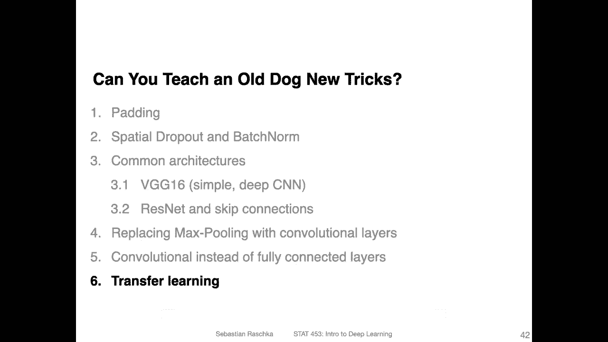
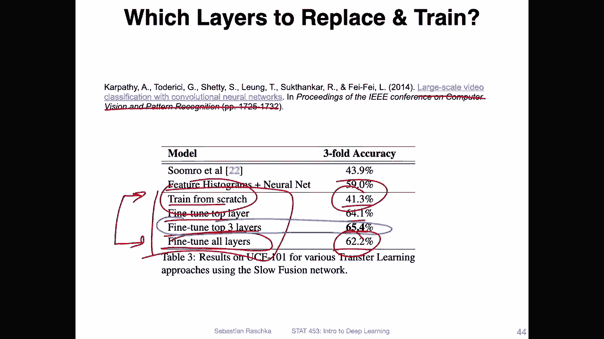
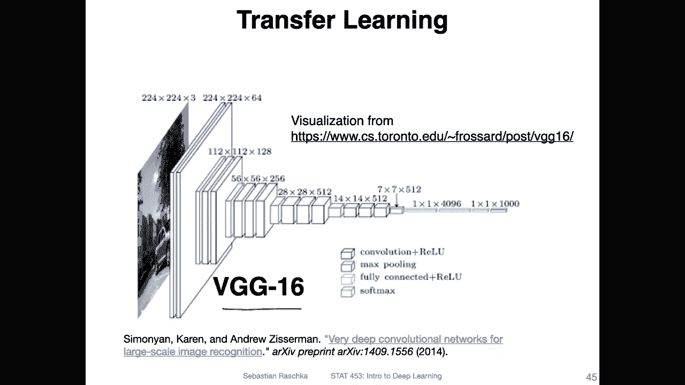
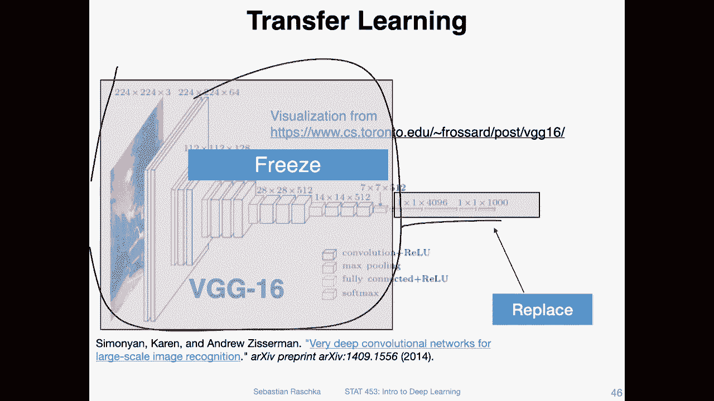
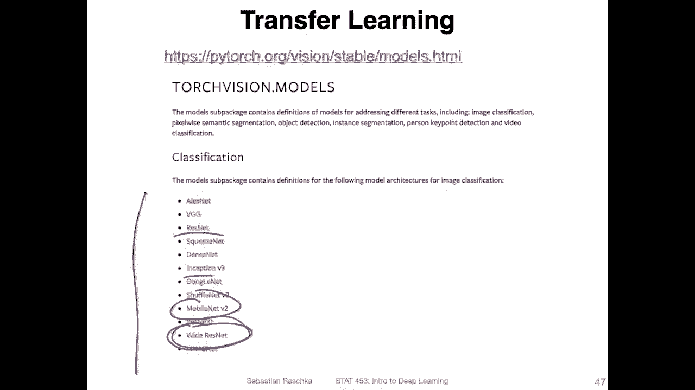
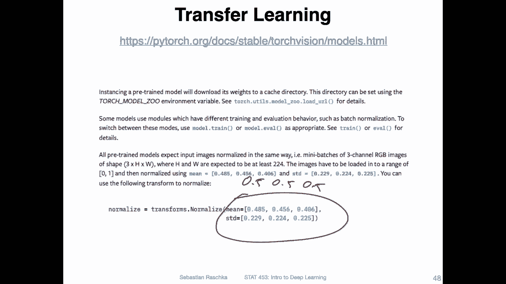
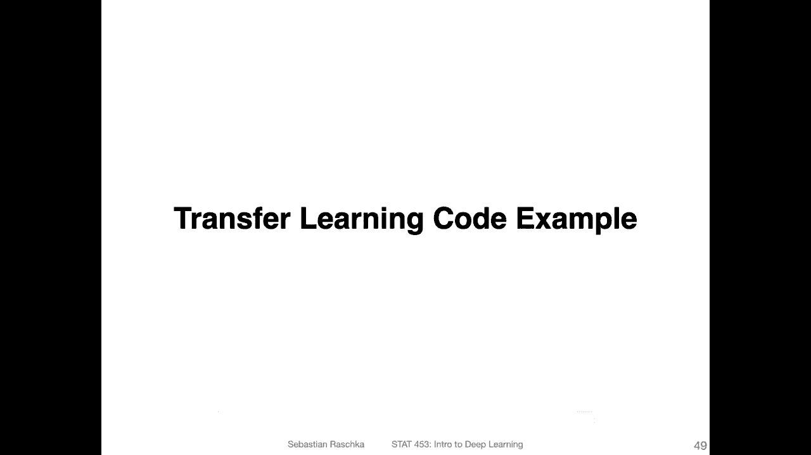

# P123：L14.6.1- 迁移学习 - ShowMeAI - BV1ub4y127jj

Yeah， all good things and all lectures come to an end。

 So this is the last topic in the series on conversion network architectures， so。

This is not really a topic specific to convol networks。

 but I think right now is a good time to talk about it because there are some nice pretrained computer vision models available that could be useful for this。

 So the topic is transfer learning。 And I think transfer learning is particularly useful for your class projects。

 So the key key idea here is that in a convol network， we have this feature extraction part。😊。

啊。W extraction。 Let's write it like this。 And then we have these fully connected layers。

Or also convolution layers as， as you remember from the previous two videos。

 But let's call them for fully con connected layers or。Linear layers， these are usually the ones。

 the multi layers perceptioncept part that we use for classification or or classifier part。

 And the idea in transfer learning is that these con layers here。

 this automatic feature extraction pipeline might be useful for other related tasks as well。 So。

 for instance， I know that a lot of you are working on projects。

 class projects related to Covid 19 prediction from chest X ray data。 So there might be。

An hypothesis that let's say a network trained on a large medical。X ray chest X ray data set。

 not related to Covid 19， more general， might be also useful for Covid 19 detection if it's fine tuned on the data。

 So usually we in deep burning have these large benchmark dataset sets。

 but they are usually only used for， of course。Comparing and benchmarking different models in a real application。

 you usually have a much smaller data set。 So the question is。

 can we leverage these large amounts of data。Train the network on those and then fine tune in those networks on our smaller target dataset。

So the idea is that the feature extraction layers may be maybe be。Generally useful。

 And then we can use pre trained models。 For instance。

 models pre traineded on imagenet freeze the weights。 So that means。

When we are freezing these weights， keeping them fixed。

 not updating them and only training the last few layers like the fully connected。Layers。

 the moular perceptron part。So this would be in in the nutshell。

 this would be transfer learning related to that。 there's also the approach that you train the whole network on a given data and then fine tune the whole network to the smaller dataset。

 so it's essentially just a special case of transfer learning where you don't freeze the weights。

So here has a screenshot from an older paper。 it's on a large scale video classification with convolutional networks。

 but this kind of is a nice summary of what。Options we have when we use transfer learning， so。

Focusing on this here。 So they evaluated the performance by training a conversion network from scratch。

So here they are talking about the accuracy， they got a 41% accuracy。On。

Pretrain a network on a large dataset and then only fine tuned the last layer。

 Yet top layer means the output layer。 They got a 64% accuracy， fine tuning the top three layers。

 So last three layers， they got the best accuracy，65% and fine tuning all layers。They got 62%。

 So here， based on this， of course， it's just one experiment or one scenario based on this case here。

 they got or they found out that tuning three layers。Gives the best results。 But， of course。

 your mileage may vary。 It really depends on the network architecture。

 on the data set and many other things。 So it's not general。

Case that this is always true and practice it's just another hyperparmeter。

 So how many layers to fine tune is just another hyperparmeter to consider。But yeah。

 you can also see even。So what is also interesting when you look at these two here。

 that train from scratch is。Much worse， let's say， than pretrain the network on a large dataset set and then fine tuning it。

 even if you don't freeze any layers。I will show you in the next video how we can do this in Py。

 So for now， if this is very abstract， we will get more concrete in the next video。

So here's what I'm going to show you in the next video， so because we learned already about V G16。

 it's probably the easiest one to explain。

But of course， this is a original concept。 So what we are going to do in the next video is we are going to freeze the convolution layers。

And then I will show you how we can replace。Although I should say first。

 we use the pre trained version that has been trained on imagenet， then we freeze these layers。

And replace the output layers and then fine tune these on a different dataset。

 We are going to use Cypher 10 but of course it could be any dataset。

 it's just because Cypha 10 is already in Pywa so you don't have to download anything。

 So I'm always using Cypha 10 to just make the code simpler or smaller I showed you before how you can use your own dataset。

 but I don't want you to always have to download a dataset when you run the code examples from class。

 So that is why we use Cypher 10。 but of course this is a very general concept。 so。

There are besides VG G16， also other models available。

 So VG G16 might not be the best model we have learned。 it's actually not the best performing one。

 It's also very expensive。 So for instance， for your class projects except if you want to get a good performance the wide resnet is actually pretty good and Inception version 3 is also pretty good in terms of performance。

 but they are also slow to run。 the good one is actually mobile net it's actually pretty fast well performingform network。

 and of course， our residual nets。 but yeah the wide residual net could can be sometimes better。

 not always when I tested it on Cypher 10， it actually was worse than the regular renet。

 So also your mileage may vary there。 So okay so oh yeah one more thing when we do transfer learning。

 I also wanted to warn you。

You have to double check how the people who pretrain the network and provide it to you。

 how they normalize the data so you can of course train or pretrain the networks yourself。

 but in Pythtorarch there are some of these models available that have been pretrained on imageNe if you want to use those you have to be careful to use the same data normalization that they used and for imagenet they used this normalization so usually before we used 0。

50。5 and 0。5 because we observed that whether we do that or compute the exact mean and cell deviation doesn't make any difference in practice but because they use these parameterss we also have to use the same parameters when we apply to a different data set to make sure our datas on the same scale as the network might expect。

Alright， so in the next video I will show you then concretely how that looks like in Pytorch。

