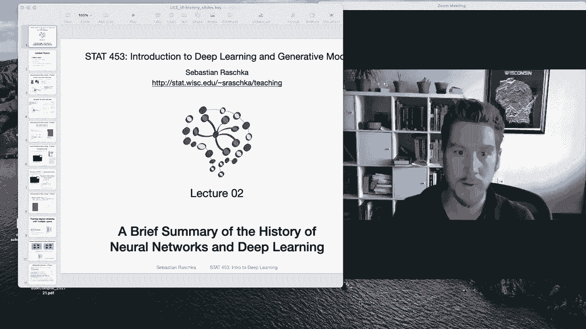
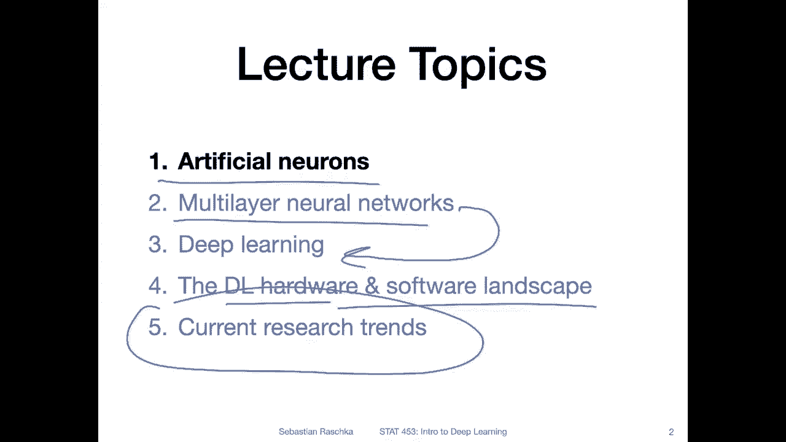

# P13：L2.0- 深度学习简史【课程概述】 - ShowMeAI - BV1ub4y127jj

Yeah， hi and good morning， everyone。 I hope you had a good week and worked through all the lecture One material。

 Yeah， I noticed that there were not that many questions， which I hope is a good sign。

 So that means hopefully things were not too complicated。 And in this second lecture。

 I want to talk about a brief summary of the history of neural networks and deep learning And you may wonder why are we going to talk about the history of deep learning。

 Why don't we just get started And I think a good justification for that is really that this will provide you a nice big picture overview of all the different topics in deep learning。

 So more like from a historical perspective， because that's also somewhat how we are going to talk about that in more detail。

 like starting with simple things like single layer in neural networks and then because they are kind of limited。

 we add additional hidden layers So they become more powerful at solving certain problems。

 And then we will talk about also some advances like making them work better for image data like convolution in neural networks and make。

😊，work better for text data like sequence data using recurrent neural networks。 So in that way。

 this lecture will provide you with a big picture of all the little topics we are going to cover in this course。

 So with that， then let me get started。

Yeah， and when we are talking about the history of neural networks and deep learning in this lecture。

 I also want to emphasize again， this is the brief history of neural networks and deep learning。

 I don't want to cover every nitty gritty detail in this lecture because otherwise it would be easily a two or three hour lecture or even longer。

 So in this way I just want to give you a short overview of the most important parts that are important for this course。

So yeah I structured this lecture into five parts starting with the simplest topic artificial neurons。

 these are simple single layer neural networks。 However they have some shortcomings which are addressed in the multilayer neural networks So in the second part we will talk about why multilayer neural networks were invented and why they are useful and then how we go from multilayer neural networks to deep learning because multilayer networks have been around since maybe at least 50 years so deep learning is a more recent term。

 so how did it evolve how did multilayer neural networks involve evolve into deep learning and then we will talk a little bit about deep learning hardware and software developments like recent tools that have been developed。

To make computers， let'd say， better at deep learning and also help humans to implement the more and more complicated deep learning models。

And then I will also briefly outline the current research trends。

 I would say more like things that just emerged in the last few years。

 one to three years that have become more popular in the recent conference proceedings and so forth。

