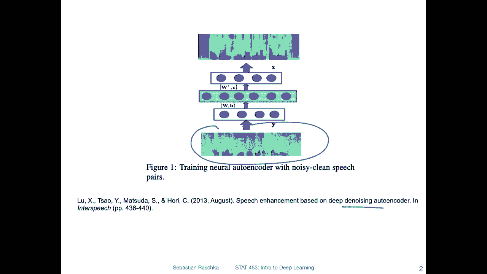
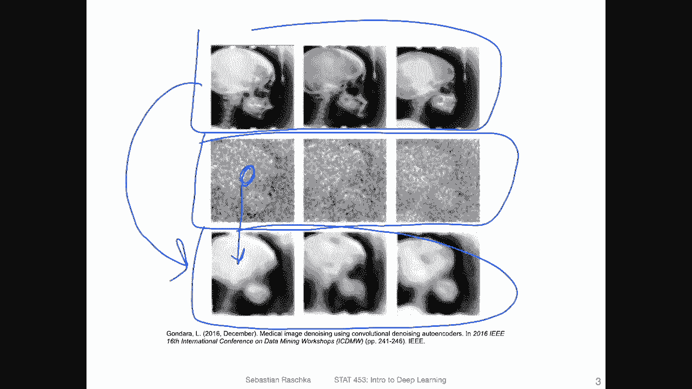
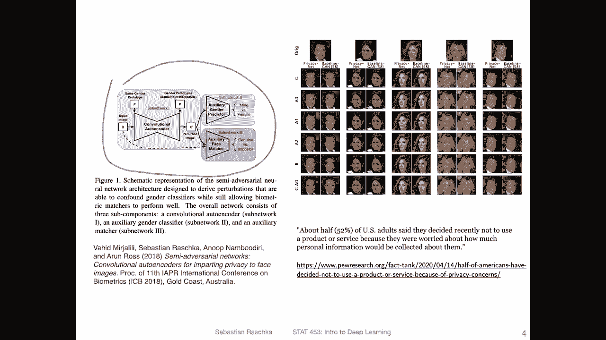
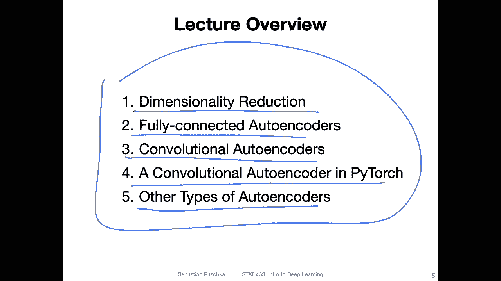

# P132：L16.0- 自编码器简介【课程概述】 - ShowMeAI - BV1ub4y127jj

Yeah， hi everyone。 Now that we have finally finished the recurrent neural network lecture we can now finally focus on the generative modeling part of this course。

 so we will start simple with an auto encoder， So an auto encodeder is essentially an architecture that allows us to encode data into a smaller representational representation and also one concept of this is to reconstruct this into the original dimensional space I would say by itself it's maybe not super useful to have an auto encodeder。

 but this is like a great introduction to follow up topics that we will be talking later on about for instance。

 a variational auto encodeder which allows us to sample data from a distribution and we will also talk about generative adversarial network which is also essentially somewhat related to the auto encodeta here So in the context of the auto encodeder we will also encounter topics like。

Deconvolutions and so forth， which will be， of course。

 and also useful later on when we talk about generative adversarial networks。 So with that， yeah。

 let's not spend too much time on this introduction here。

 I will now give you the list of topics for this lecture。

 and then let's just dive in and see what an autoen is。Alright。

 let's start by having some motivating examples of why auto encoders are interesting。 Of course。

 in the grand scheme of things， auto encoders will be ya our entry point to generative models。

 but also auto encoders themselves can be used for interesting applications。 So for instance。

 here this is an auto encoder socalled denoing auto encoder that yeah cleans up speech。 so。

It's hard to of course， show speech on a slide because it's an audio thing， not a visual thing。

 but he has a spectrogram of noisy speech， and the researchers used auto codes to convert that into cleaner or clearer speech。

Another interesting application of a denoising autoenr is image enhancement。 So for instance。

 imagine you have these noisy images here， medical images and the researchers here use an autoenr to recover yeah these images from these noisy images and for reference the original images here are shown on the top。

 Of course， when you go from here to here， there's a lot of detailed lost。

 but still it's impressive that if you have a image like this that you can recover some details despite this noise here。

Or here's an application of an auto encoder I worked on a couple of yeah years ago。

 so we had a convolutional auto encoder here that we implemented for yeah privacy enhancements。

 so here。We had the goal to， let's say， remove gender information while retaining the matching accuracy of face matches。

 so face matches are often used， for instance， for security purposes like passports。

 scanners and so forth and nowadays yeah we have security cameras everywhere keeping track of lots of things and so the idea was how can you minimize the data collection。

 for instance， you still want the images to be useful for verification purposes， for instance。

 checking whether someone shouldn't be here， let's say checking something against a criminal database but not let's say in general collecting information。

That wasn't， yeah， supposed to be collected where the person didn't have didn't give consent to。

 for instance， gender information， in any case。

So these were just some applications of auto encoders。 So here in this lecture， the topics。

Those five topics here。 it will be hopefully not a very long lecture because yeah。

 auto encoders themselves are very interesting， but we will talk more about auto encoders2 in the next lecture。

 when we talk about variational auto encoders。 So this is here the big picture introduction where we will first talk a little bit about dimensionality reduction。

 Then I will introduce fully connected auto encoders。

 These are essentially auto encoders similar to multilayer perceptrons。

 where we have fully connected layers， Then we will extend this concept to convolutional auto encoders。

 which work better with images。Then I will show you how we can implement a convolutional auto encode and Pythtor。

 and lastly， I will also highlight some other types of auto encoders。

 One would be the variation auto encoder， which will be revisiting in the next lecture then。

