# P135：L16.3- 卷积自编码器和转置卷积 - ShowMeAI - BV1ub4y127jj

Alright， let's now talk about convolutional outer encoders and along with this topic we will also talk about transposed convolutions and deconvolutions。

 which are also sometimes called strided convolutions， and I will also tell you why we need them。

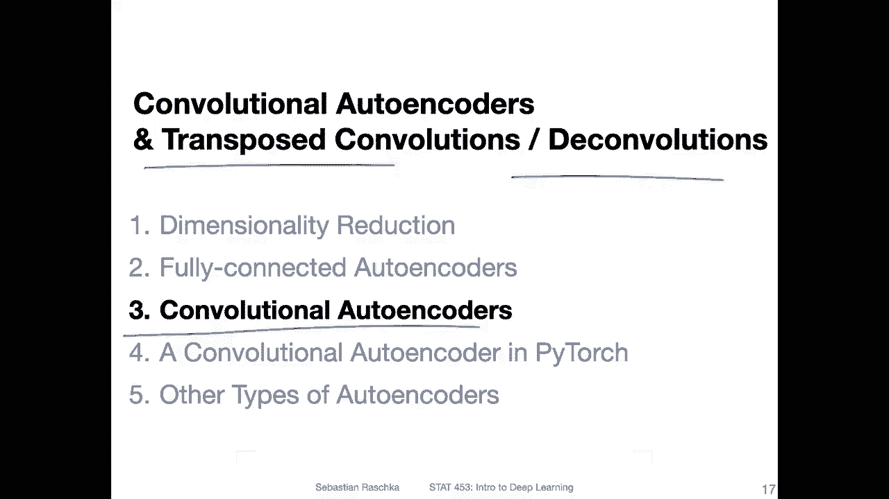

So here's an overview of how a convolutional auto encoder looks like。

 And if you just look at this figure here， it looks exactly like what you have seen for the fully connected autoenr The only difference is now that instead of using fully connected layers we are using convolutional layers for the encoder and for the decoder we are using these so-called decoconvolutional layers or strideta to convolutions So why do we need them。

 I mean before when we talked about CNNnns and the convolution in neural network lecture we used yeah regular convolutions to down sampleample the images So they become。

From the original size， they become smaller as far as smaller convolutions we use and pooling layers。

And how can we now reverse this， So how can we now go from a smaller representation to a larger representation。

 So for that， we need to kind of invert this convolution process。 So for that。

 we are using these so called deconvolutional layers。

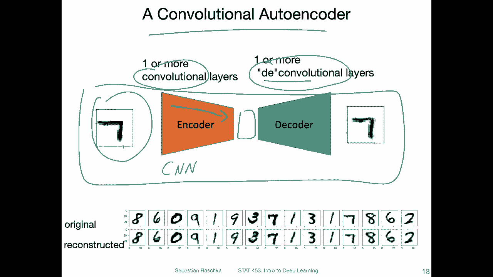

そう。There are many different words for that。 So overall。

 what we are interested in when we talk about transposed convolution or deconvolution is that we want to increase the size of the output compared to the input。

 So what we want is we want to start with a smaller input and。Otain a larger output。Basically。

 the opposite of the regular convolution。And like I said。

 there are different synyms for this process， so sometimes it's called deconvolution， but yeah。

 mathematically， if you would want to be use the precise， let's say notation， mathematically。

 a decoconvolution is defined as the inverse of a convolution， like the mathematical inverse。

 the inverse of a function。But， we don't really。Need this or do this in the context of deep learning。

 So in deep learning， it's kind of enough to just have a convolution that up samples。

 it doesn't have to have exactly the inverse computation。So in that way。

 we call that also sometimes transposed convolution。

 I guess the name comes from the fact that we go like the opposite from instead of going from large to small。

 we go from small to large， but even that term is a little bit yeah， I would say weird。

 So sometimes people also use the term uncon or unconvolution。

 and sometimes people also use the term fractionally strideed convolution。

Which might be a better term for that if you consider how it is implemented and I will show you the next couple of slides how this transposed convolution also known as fractionally strideed convolution is implemented。

 But again， if you read a deep learning paper and people talk about a deconvolution or unconflair or transposed convolution or fractionally strideed convolution。

Chances are that all of these mean the same thing。So usually people use all these words synonymously。

And how it's implemented， I will show you in the next couple of slides。

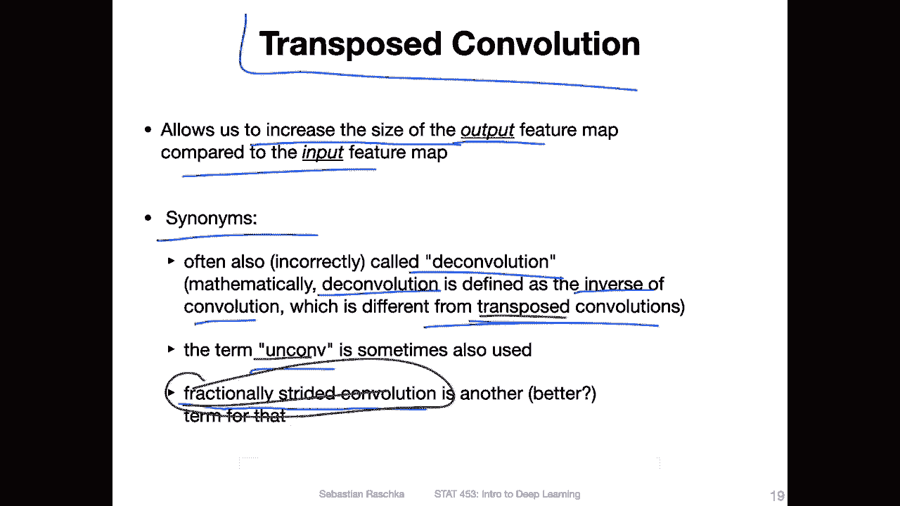

So at the top to start with， let's take a look at a regular convolution first。

 So here at the bottom we have the input in blue and the output is at the top here in dark green。

So this is a convolution with。3 by three kernel， right， so。See that here it a three by3。Colonel。

And if you look from here to here， it's going by two pixel dimensions， so。Ts a stride。Of two。

 So we are going here， and then。The next。Here and then we go down by two pixels。

 So actually we start at the left。Quonna again。 So we are here now。

And then we move again by two positions。So it's just the regular convolution that you have already seen here with a 3 by3 kernel in right of two and it outputs this two by two feature map in each。

So yougen that it generates one pixel。Or one value。And then， you get this。2 by2 output。Now。

 the trans post convolution is shown at the bottom also with a stride of two and three by3。Clonnel。

 and it is doing the opposite。 So that's maybe why it's called a transpo convol because it's。

 yeah doing it kind of backwards。 So here now you start with a  two by  two input。

So the two by2 input。 And what you get out is of 5。By5 output。Right。

 so here we have at the top again， we have a 5 to 5 input and a two by two output。

 So it's kind of doing the opposite。So。The computation is that we go here from。One pixel。

 and then we have our three by three kernel。And we obtain a three by three output。

 So in a regular convolution， if you have the kernel。You multiply each value here。With a pixel value。

 So each weight is multiplied with a pixel value in the transposed one。

 it's essentially to take this value here， the one pixel value and multiply it also by each value in the kernel。

 So you get three by three outputs。And then。You move one position to the right， and in the output。

 also。if you have a story of two， you move by two pixels。 So in this way， you create this。5 by。

5 output from the2 by two input。 So essentially going from a small image into a big image。

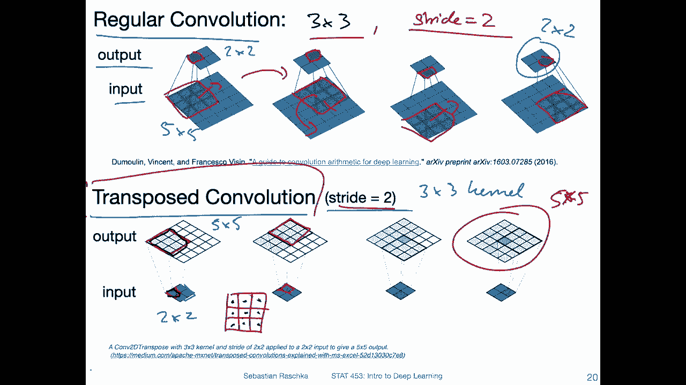

Now， this is how it conceptually works。 So if I go back one more time。 So at the bottom here。

 this is how I like to think about a transpo convolution。 This makes sense to me。

 This is intuitive to me。 So again。

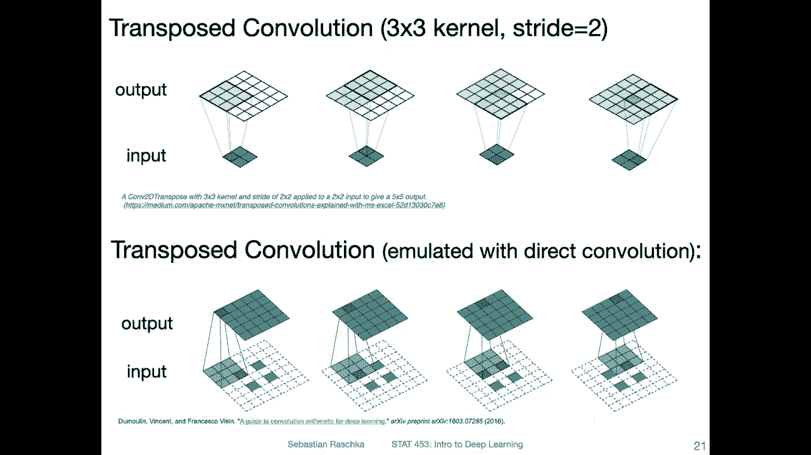

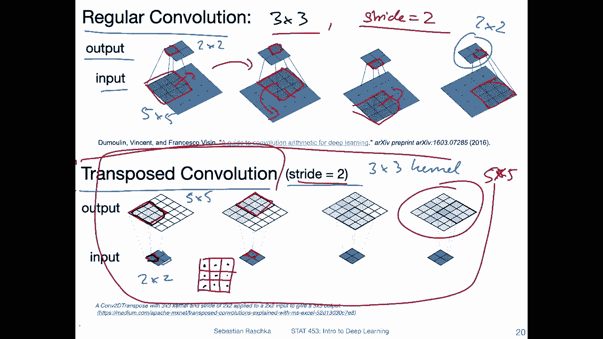

Here， this is， again， what I showed you on the previous slide。 That's how I think about it。However。

 in practice。This is usually emulated with a direct convolution。

 So there's this excellent paper linked here。 a guide for convolution arithmetic for deep learning that I mentioned earlier in this class when we talked about convolutional networks and。

In this paper， they also describe the so called emulated approach using a direct convolution。

 So instead of implementing this process， there's a process。

That just uses a regular convolution to implement this trans post convolution。

 It's just both things here on this slide are achieving the same thing。

 It's just a different way of carrying it out。 So in order。

To go from this2 by 2 input to this 5 by 5 output， you can also implement it with this emulated approach where you put these pas。

Onto the input。 So here we have a stride of two and had three by three kernel。 So in this case。

 what would happen in this emulated approach， it would put here this。Ptting。

 so what I'm highlighting here， this is like all padding。All of these undotted lines are pendingning。

 It's adding that patting around the input image， and also。It。It adds the spacing between。

 that's because of the stride。 So， and this is maybe why it's also called fractionally strideed convolution。

It's a weird word， but yeah。So。If you look at this at the bottom and you think a little bit about this。

 you can think about that。 So if you walk through this mentally step by step。

 you should be able to see that both the top and the bottom part here they produce the same one not these parts。

 but if you if you completed this whole process here should give you the same results as the completed feature appear because。

Here you take also three by three kernel， but here you only consider this pixel。

These other ones are essentially0。And then you project it。Up to here。

 And this is essentially kind of the same as。You are projecting。This one up here， in that way。

And then， you move。This one to the right。 And then you do the same thing now with。

This region here will you have a straight of one think of。So， you're moving。Here。

 and then you do the same thing again， but now。It's in， in a different position。 It's now。

 in the kernel。At this position here。The first iteration， let's say this was the first。

 And in the second round， it would be at this position， and this one will go。Here。And。You continue。

 And at some point， when you go one row down， it will overrite and things like that。 So in that way。

 it will give you essentially also this5 by 5 output when you， when you completed this， when you。

Went also through the next row。 So long story short。

I don't like to think of it like this because this is kind of complicated。

 like doing the patting and putting these things apart。In my head。

 when I think of a transpo convolution， I think of it as like this， which I find more intuitive。

 but technically yeah the implementations， I think simpler in code if you just reuse the convolution with this pedding setup。

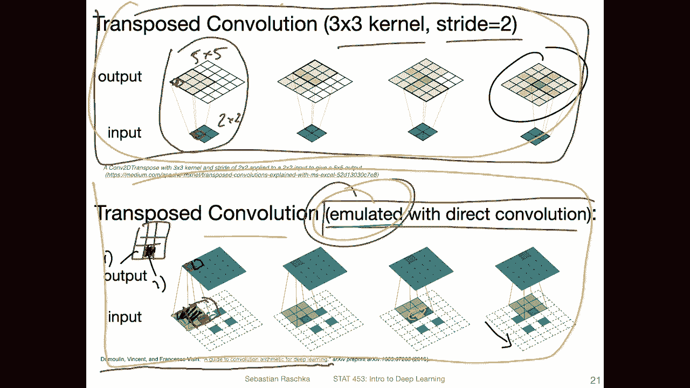

Okay。Here's another example here。 it's a regular convolution with straight one。

Going from a 4 by 4 input to to a2 output。 And here it's a transpo conversion emulated with a。

Direct convolution。 So this is， again， an emulation here。

 It's a little bit simpler to see because there's no stride。

 So here you can just see there is a padding， two pixels on each side。

 And this will achieve the opposite。 So going from。2 by 2 input into a4 by 4 output。

 whereas at the top， we go from 4 by 4 to 2 by 2。

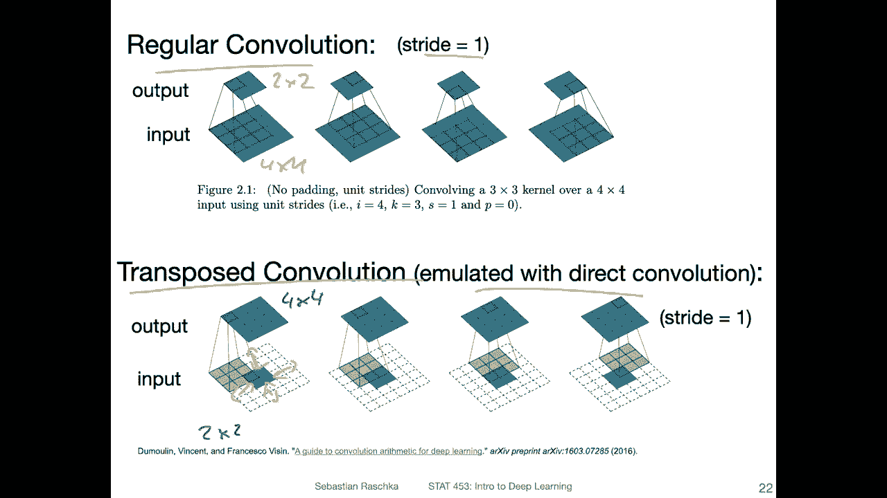

Okay， so here's the equation。 if you want to compute the output size， given the input so。

S is the stride here。N is either the height。the width。If it's quadraic， it could be the same。

K is the kernel。Size and P is the padding。So you can use this formula to compute the output size of a transposed convol in pytorch。

 This is torch and n transposed to D。 And here I just have some examples applying this equation to just make sure that this is indeed how pytorch behaves when you。

Yeah， when you look at the outputs。So you can plug in these numbers here for different kernel sizes。

 strides and padding。And sorry， different input。 I didn't change those。

 you can play around with those if you interested， I only change the input size here， but yeah。

 you can play around with this。 And you should see this is how Pyro computes or how you would know the output given a certain input size。

 kernel size and padding。 and notice also。One interesting aspect about that is also。

Compared to a regular convolution， if you increase the padding。

It decreases the output size in a regular convolution。 If you increase the padding。

 it will also increase the output size。 So it's the opposite here。

 padding decreases the size in regular convol。 It increases the size。

 So you will have to kind of think backwards now。

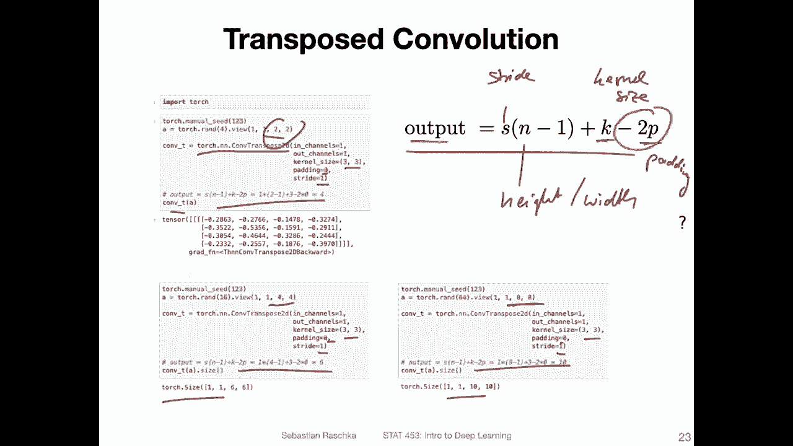

Okay。So yeah this was the transposed convolution in a nutshell。

 one problem that might occur in practice I honestly don't see it very often。

 but there's this problem of the checkboard patterns。

 So if you're interested there's an interesting article about that with nice visualizations and because of overlaps in this transpost convolution which is highlighted here So these dark pixels。

What might happen is that you might see certain check up what effects。 So let me go。

 let me show you this slide。 again。 this is the very first slide I already had earlier。 So again。

 here， the regular conversion here， this is the transpo convolution， and you can see。

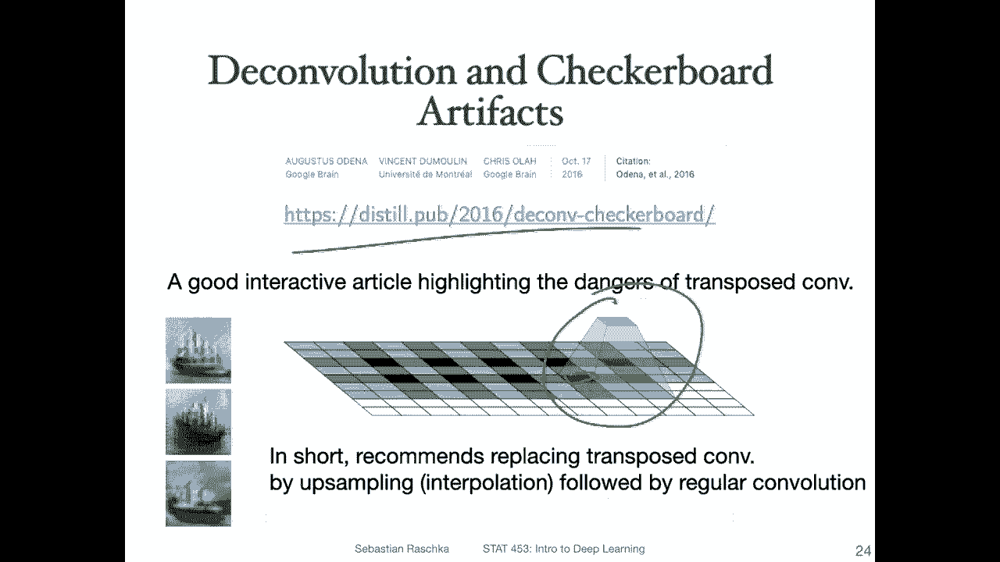

So when I have， this is not the emulated one。 this is the regular。Transpo conversion。

 how I like to think about it。 So what you can see is when you go from this input here。

Into the output。 and then。Do this for the next one。 you have a strip of two。

 You can see here there is some overlap， right， So there is some overlap here。

 And then if you go down。This one would be the area here of the highest overlap， right。

 so it would overlap all four kernels at the end here。

So and this can cause like certain checkerboard artifacts so which are highlighted here。

 so you can see here these kind of artifacts there's some sort of pattern that appears here。

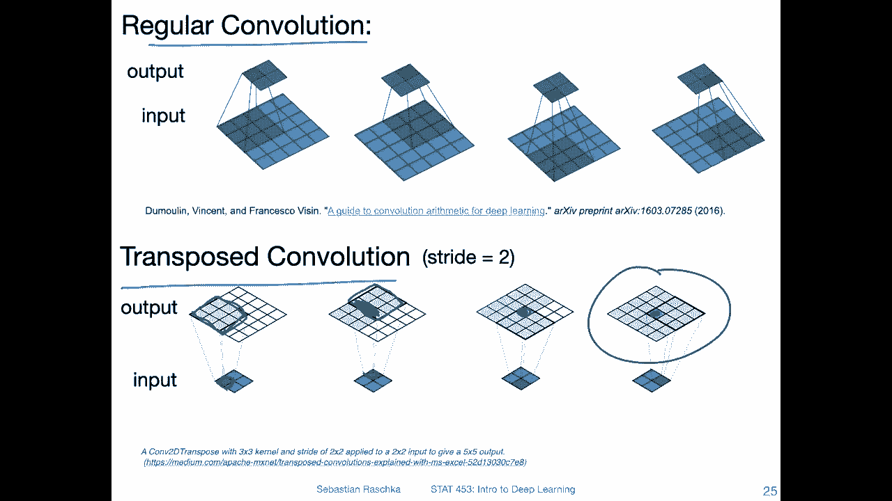

And。In this article， for instance， they then instead recommend not using a transposed convolution。

 but you use a regular convolution。Or essentially using nearest neighbor up samplingling。

 followed by a regular convol instead of using transposed convol actually。I tried this out。

 It works well， too。 So either way， I think it's fine。 if you use transpose conversion just。

 you have to be careful that you don't encounter checkupboard artifacts。 In this case。

 if you have a setup like this and you may have a checkupboard artifact how you would avoid this or how you could avoid it is。

 essentially by just using a。

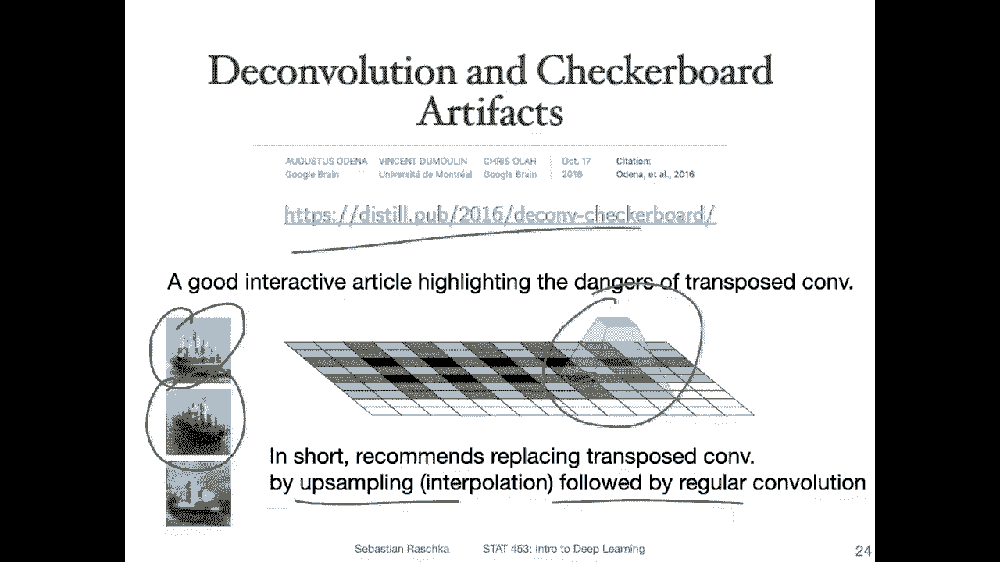

2 by two kernel， right， if you have a two by two kernel and then you move it over by two positions。

 So the first one would be here， then you move it by two pixels。 The second one would be here。

 and the last one well would be cut off， but。So you。

 you can technically try to avoid it by choosing your kernel size and strides such that there are no overlaps。

 but also even if there are overlaps。

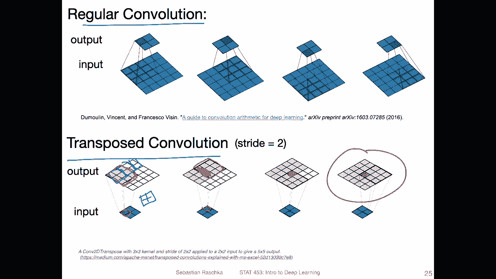

Usually， it's not always true that you find these checkboard artifacts。

 So you have to just look at the results and see if there's a problem and you can optionally replace。

Transposed convols by nearest neighbor upsembling and the regular convolution。

 If you are interested in that， I don't have a code example here， but I can。

 yeah share a code example with you on Piazza。 So if you're interested， just ask me。

 I can share a code example showing you how to implement that。 It's not a big deal。 All right， so。

That was convolutional autoens in a nutshell like explaining how the transpo convolution works and so forth。

 and in the next video I will show you how we can implement a convolutional autoenr in Pytorch。

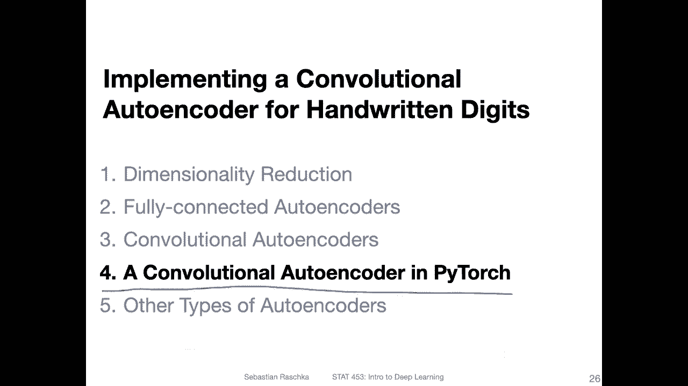