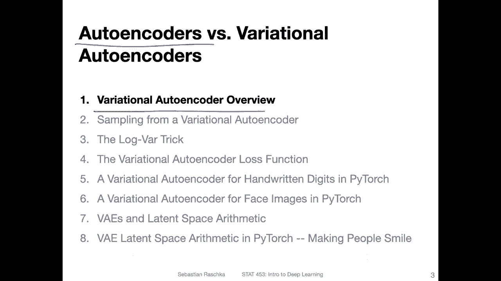
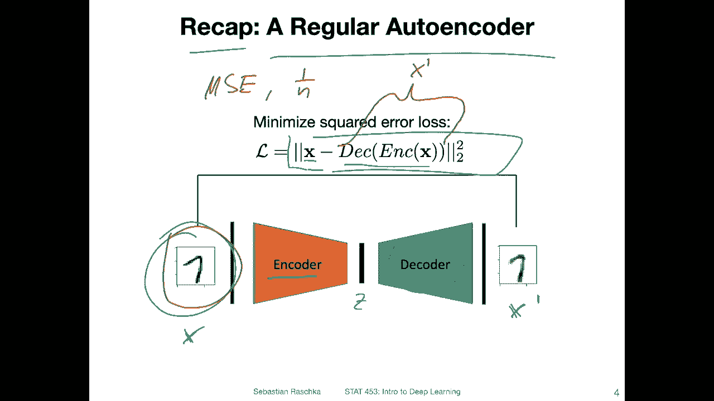
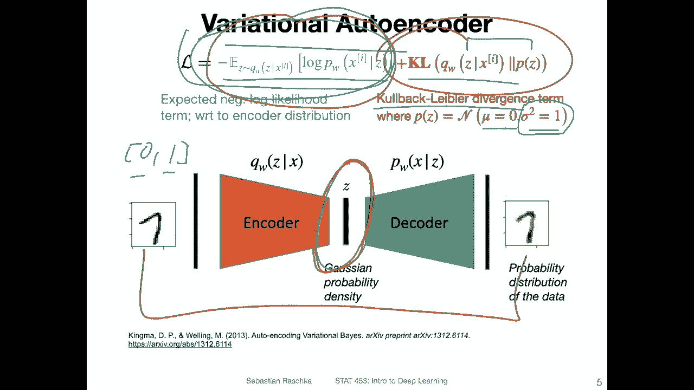
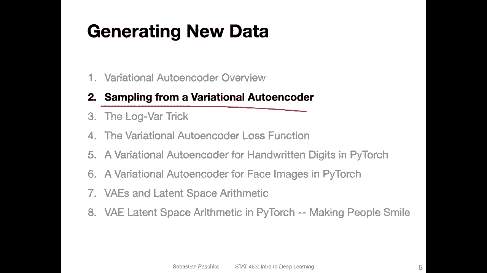

# P139：L17.1- 变分自编码器概述 - ShowMeAI - BV1ub4y127jj

Alright， let's start with an overview of a variational auto encoder so that you get an idea where we are going with this lecture and we will do that by connecting it to a familiar idea。

 the regular auto encoder that we already talked about last week。

So here is yeah a recap， a regular auto encoder that I showed you last week。

 That is what we yeah worked with last week when we had。

A neural network model consisting of two parts an encoder and a decoder。

 so the encoder receives the input images X， and then it will encode these input images in a latent representation let's call it Z and then the decoder will reconstruct these images going back to x so let's call this x prime because it will not be identical to x but yeah our goal is to make x and x prime as similar as possible and one way is for instance。

 using the squaredarrow or mean squaredarrow。 So here I'm writing this as。The two difference。

 So the difference between。X， the input。 And here， how I've written this it's encoding x and then decoding x。

 So this whole thing。Here resembles。X prime， so we're minimizing the squared difference between those two。

 Both are vectors so you can reshape these images as vectors so you can just leave them as images and do the pairwise difference and then sum up the squared differences。

And if you have multiple examples。So， in。Your batch。

 then you can also compute the mean squared error。Where the one over n is over the number of examples in your mini batch。

So this is what we have discussed last week。

Now let's focus on the variation out encoder， which is the topic of this lecture。

 So the variation out encoder is a little bit more complicated。

 There are there is a loss node consisting of two terms。 we have this term here。

 which is still the reconstruction loss。 So overall this is the elbow objective。

 So if you are familiar with that the empirical lower bound which consists of。

 let's say a reconstruction loss here and the KL divergence。

 you've probably heard about the KL divergence， the Quebec labla divergence in other classes before。

 it's essentially measuring the difference between。Two distributions here。

And here we are assuming that this。Here is from a standard multivariate Gaussian distribution。

 So it has zero mean。 and the variance is one。 So this is for a univariate Gaussian， but it's。

 of course， for arbitrary dimensional Gaussian。 So you can also think of this as the covariance matrix here。

 which is an identity matrix because we don't have any interactions between the terms。 Anyways。

 that's a lot of jargon here。 I think we will probably unpack this one by one in the upcoming videos。

I think that's a lot of information here。 And for this term， usually。

 so there are two things we can do。 we can either use a binary cross entropy if we assume that the data is like a movariate benoli。

Or we can use the meanquadarrow。So the mean square error that we also use for the regular out encoder。

 And if we have something like image data where we normalize。

 let's say the image data to be in the range between 0 and 1 might look like。

Bnoli or something like 0 and  one， right， If you see a 0 and 1。

 it might look like something like a benoulli。 But remember here we have a range between 0 and 1。

 It's not 0 and1。 It's 0 and one and the values between。 So in this way。

Actually using a meanquad error term for the risk like we did in the regular autoenr is way better than yeah using something across entropy here。

 although it also works to use across entropy， but usually in practice you would find that the image is a little bit blurrerier because it will kind of be biased towards 0。

5。 The pixel value 。5。 But I think I will probably discuss as no future video。

 So here I just gave you a lot of information， we will revisit this information in the upcoming videos。

 So here again， the big picture is that we have two terms。1 is。The K divergence， measuring。

The difference between。This data distribution in the latent space and a standard normal distribution。

 So the goal is to make this。Such that it looks like a standard normal distribution。

 And the other term is still the reconstruction loss。

 So we still want to create realistic looking images or reconstruct the input images。

 So two objectives now。

Okay， so in the next video I will then talk about how we sample from a variation out encoder and why let's say why it's interesting to use a variation out encoder for sampling compared to the regular out encoder so what the advantage is essentially of a variation out encoder。

