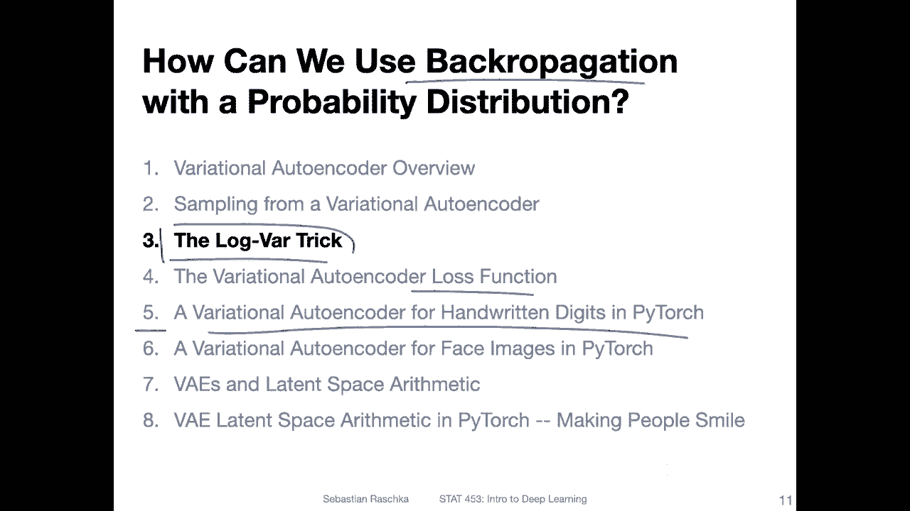
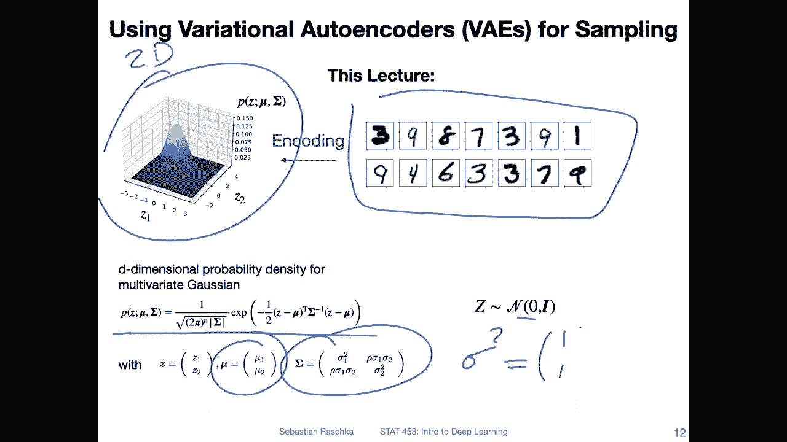
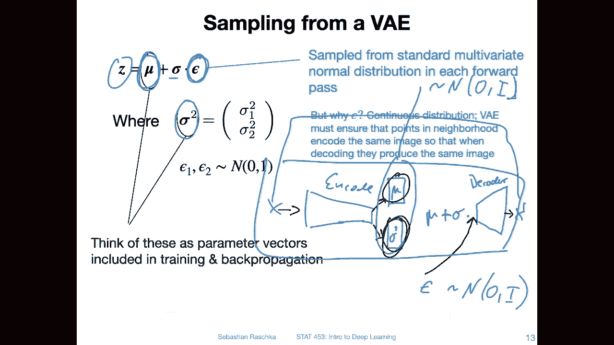
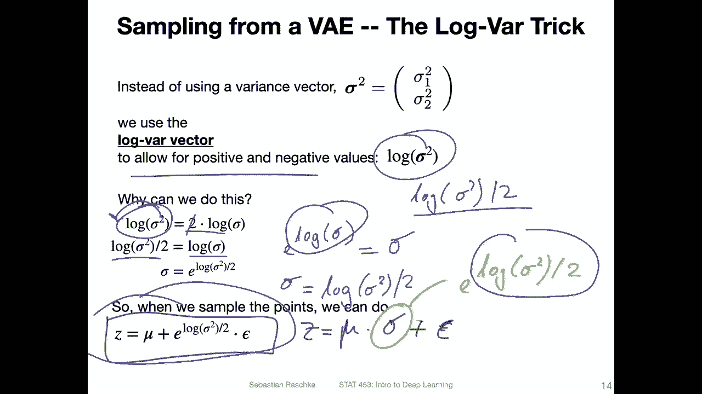
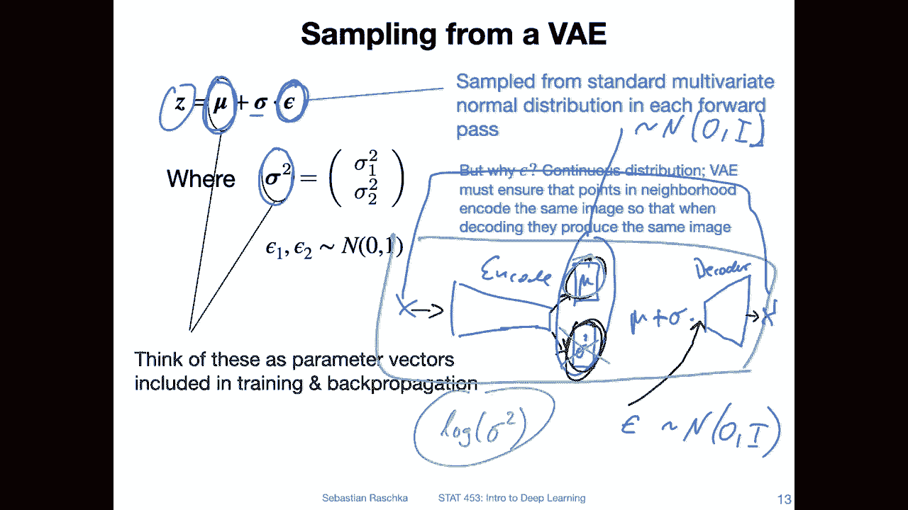
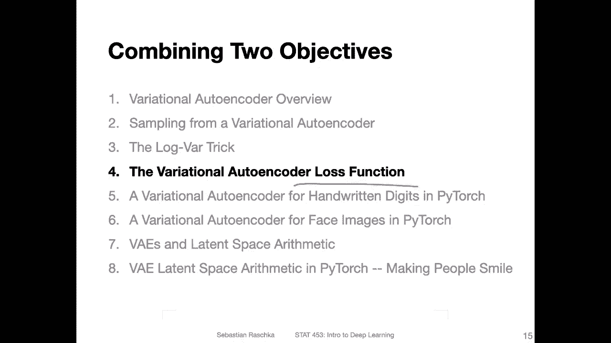

# P141：L17.3- Log-Var 技巧 - ShowMeAI - BV1ub4y127jj

Alright， before we get to the code example here， I want to talk about two more things。

 one is the loss function and one is the lockvaric。

 which I will talk about in this particular video And yeah it's kind of like a chicken egg problem What do we want to talk about first you want to see the code example first and I explain the details or should I explain the details and then we talk about the code example think in this particular order。

Briefly talking about the lockat and then revisiting it in the code example might be easier。

 So let me start with this one。 And so。What this is about is the fact that we are training a variation ought encoder。

 which is still a neural network for which we want to use back propagation。But yeah。

 if we have a probability distribution， how do we back propagate with a probability distribution。

 right， or if we have a random variable， how do we deal with that using back propagation。Soう。

This is where the lockbaric will come into play。 but let me just briefly recap something from the previous video。

 So just yeah， to recap the previous video we discussed that we take the input data set。

 and when we train the variation of encoder， it will happen such that。

The latent representation will resemble or will be according to a standard multivariate Gaussian distribution。

 So distribution of this latent space will follow a standard multivariate Gaussian distribution。

So here's just for reference， again， the probability density function and。In this particular case。

 I was drawing a 2D Gaussian and we have a mean vector and a covariance matrix。

 and we said that because it's a standard normal distribution。It's 0 mean and unit variance。

 and theres no interaction between the features。 So we essentially have a variance。

Vecto that is just one，1 in each dimension。

Yeah， and then when we sample。 So this is maybe a little bit tricky part to， yeah。

 wrap our heads around this fact。 So we sample in the following way。 So in the network， we will have。

A fully connected layer that will learn this mean vector。And there will be a fully connected layer。

That will learn this variance vector， at least in theory， and how we sample。

Is then we use this epsilon that we sample from a。Standard normal distribution。

 So with no interaction between these features。 So we just draw for each dimension a value from the randomtum standard normal distribution。

And we multiply this value with our standard activation here and add the mean vector。

 and this is how we get a new sample so。Essentially， we。Encode。 So if we have X， we encode。

 let's call this。嗯。How can we call it， let's just call it the mean vector。And。😔，Z个。😔，The veryto。

When we put our example。Through the encoder。We get this to。Back to us。

 So that's what we are learning in the network。 And then。We will have the step where we。

Have have the mean plus the star deviation vector times this epsilon。

 this epsilon is sampled independently though it's sampled independently from our standard normal distribution with the identity matrix is the covariance matrix。

 and then we put it in here。And only this part is part of the network。Then， we have。Oops。The decoder。

And then what comes out of here is。X prime。And like I mentioned before。😔。

We compute the distance or difference between those two to make sure the reconstruction is good。

 And here for this slant space， which is essentially represented by this mean vector and the variance vector。

 we want this to be。Normmal distributed。 so we have this KL divergence term。

 I will talk about this again in the next video， so we have these two objectives。

 but yeah in essence， we have here the mean vector and the variance vector as part of the network。

Again， if this looks a little bit abstract right now in the code example。

 you will exactly see how that works。All right， so but instead of using this variance vector here in the network。

 we are using the lock variance。

Why are we doing that？This will allow us for positive and negative values。 So in this way。

 if we only had a variance vector there， we could only have positive values。

 and it's kind of a bit tricky。 I would say to learn this during black propagation to make the learning a bit more stable。

 better。 we will use the lock of this variance vector。And then， we will sample。

As follows as shown here on the bottom。 So instead of sampling what I showed you before。

 instead of saying。We draw the sample。Like this。We now replace this one by E to the power of lock。

Of the very inspector， divided by2。Why is it this one here？Yeah。

 this is just yeah you can see that if you just yeah rearrange the terms。

 so this one you can bring the two outside right so it's the same as two times lock of the variances sorry。

 lock of the san deviation。And if you want to then write just this lock of the s deviationation。

 you can cancel the tomb。 So on the left hand side you have lock variance divided by twomb。And then。

If you take。This to the power so the exponential E to the power of rock。This one should be。

 of course， this one， right。 And we know that this one is the same as。Look。😔，Sigma。Squat。

So we know that this is essentially then。Look， whatever this is。squared divided by2。

 So this is why well how we end up with this sampling procedure。

 and this allows us to only yeah store the the lock of the variance vector。Look。Barance， so okay。

 so this is how we would implement that， because then。

If I go back one more slide。嗯。Pink here instead of having this here。

 we will have a vector that we call look。Vars。This is老。

This vector to have positive and negative values。Which is also true for the mean vector here。

Okay， so if this was abstract in the code example， I hope this will become more clear。

 so in the next video let me briefly talk about the loss function in the variation of our encodeta and then we will finally see our first code example。

