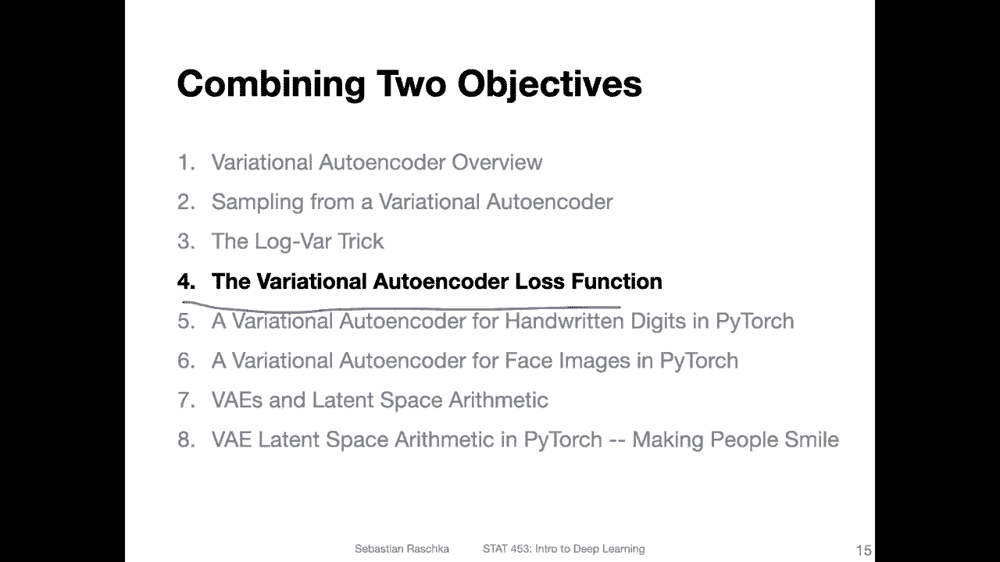
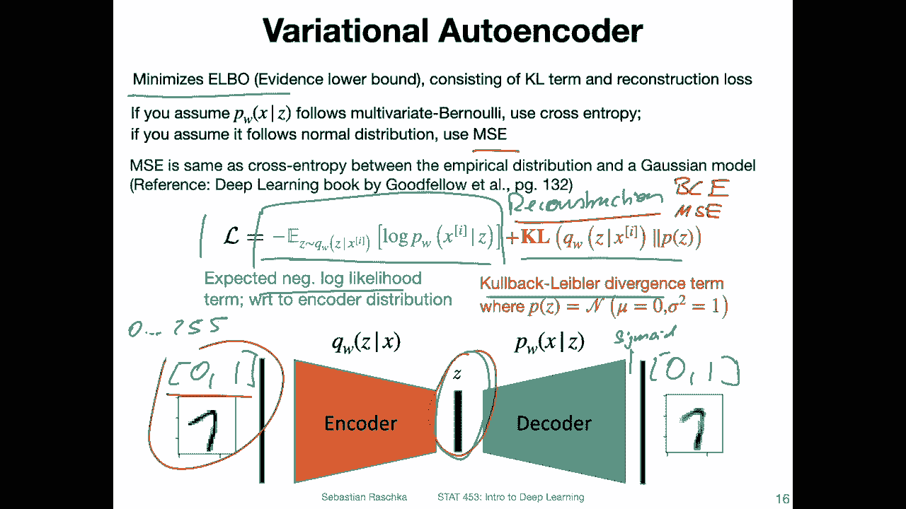
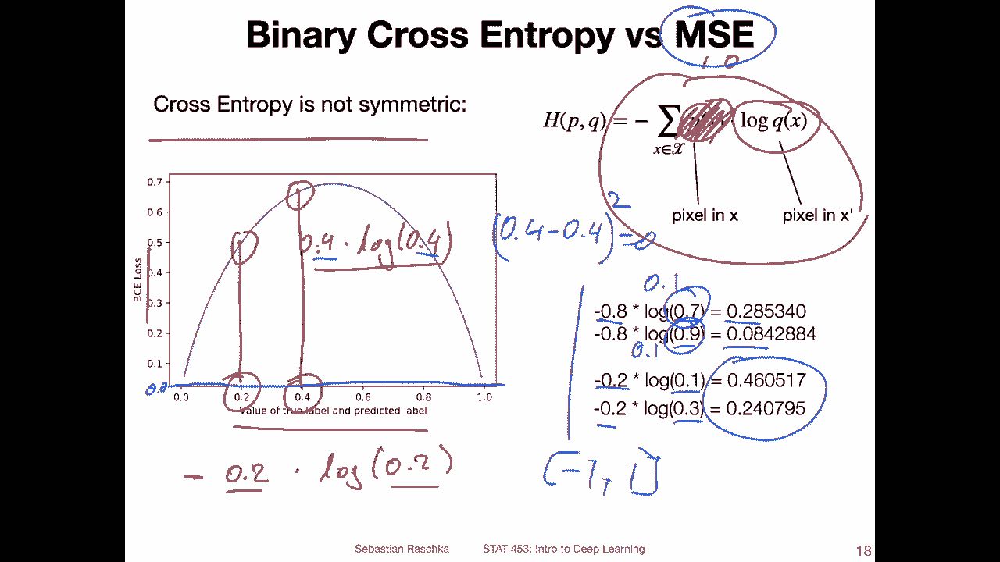
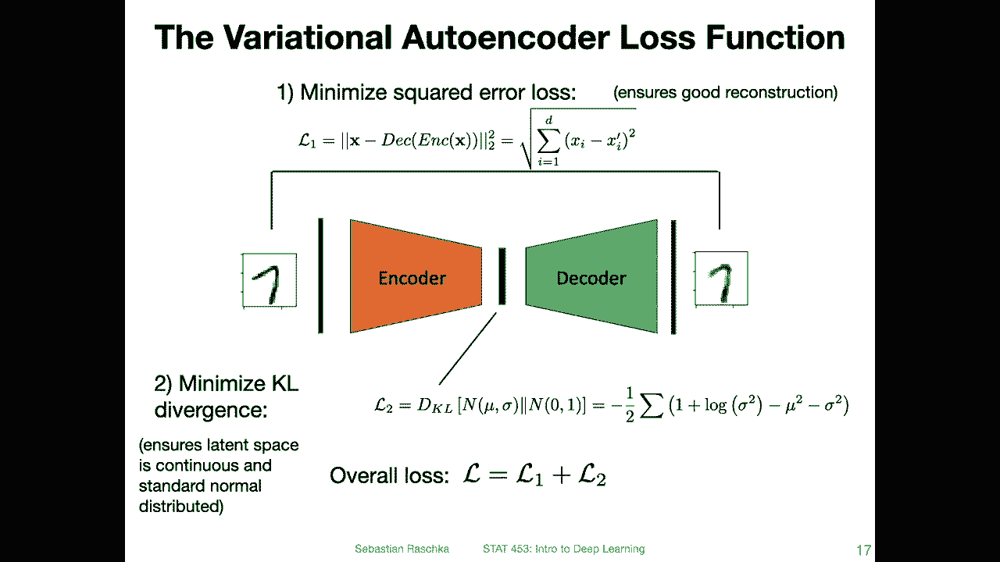
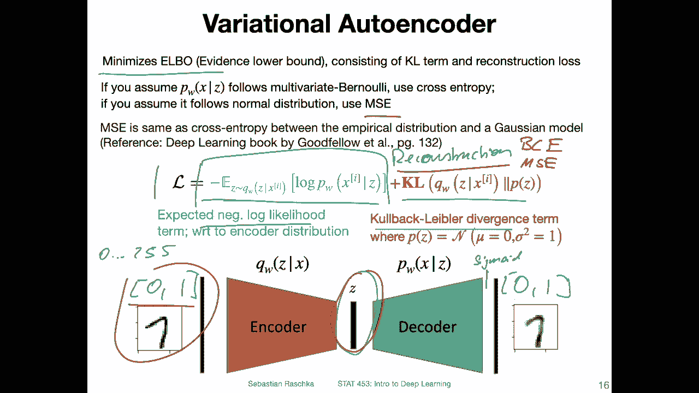
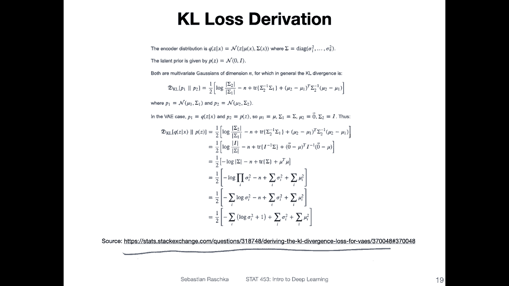
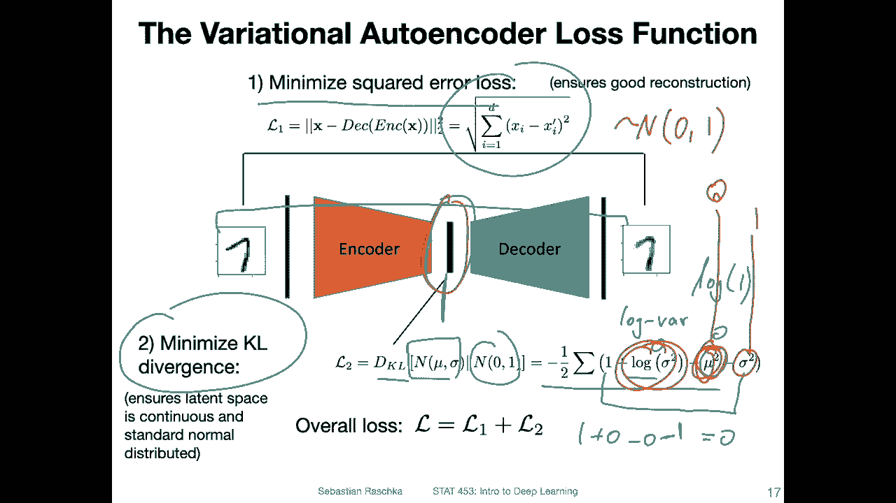
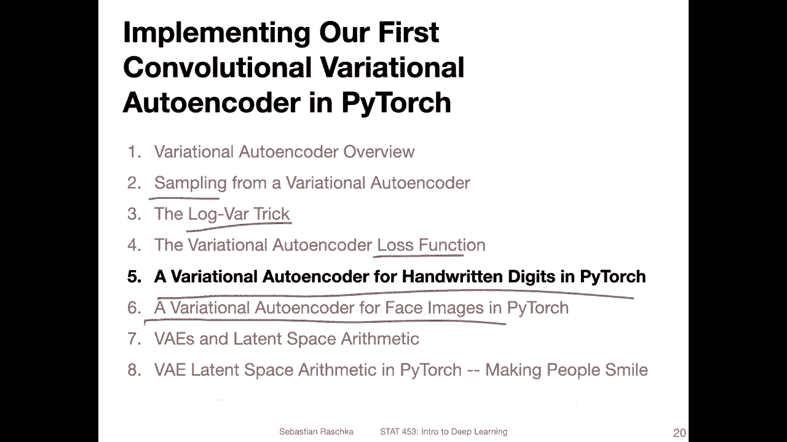

# P142：L17.4- 变分自编码器损失函数 - ShowMeAI - BV1ub4y127jj

Alright， let me now give you the brief picture overview of the loss function of the variational auto encoder。

So overall it's about minimizing elbow the evidence lower bound so if you have not heard about elbow or the evidence lower bond before don't worry about it too much for this class So for here it's not really that important that would be something for a follow up class or yeah maybe you would encounter this in a class on the relational Bayesian methods or something like that so。

For here， maybe it's not that important。 but overall。

 we are optimizing or minimizing a loss that consists of。Yeah。

 minimizing the expected negative likelihood of the data and then the Colbe lab divergence term。

 which is the difference essentially between this latent space distribution and a standard multivariate Gaussian distribution。

So technically， you would be maximizing the lock likelihood of the data。

 but as we discussed before when we talked about logistic regression a long time ago。

 maximizing the lock likelihood is the same as minimizing the negative lock likelihood。

 So that's why I've written it like this with this negative sign here。Yeah， but again。

 the details are not that important。 Like， if you have not encountered this before。

 don't worry about it too much。 The big picture is that this is。A reconstructionconstruct。Last term。

 it's essentially the reconstruction between all the difference between input and output distribution here。

And the K divergence is making sure that this one here has is essentially standard multivaried Gaussian distribution。

Now。If you would look at some implementations of variational out encoders， what you might find is。

That usually for the reconstructionist people。Either use the binary cross entropy。All the mean。

Squared error。Both work and practice。Personally。I would say it makes more sense to use the mean squarearrow。

Because。So people use the B CE when they。Normalize the images to 0，1 range。 And they also have the 0。

1 range here。The pixels。Originally image pixels are between 0 and 255 and you can normalize them in 01 range and in fact this is done automatically in Pytorch when we call the2 tenor method in the data transform so we will see that in the code example。

嗯。And then you can have here。Sigmoid activation， logistic sigmoid。

 and then you will also automatically ensure that the outputs are in a 01 range。And。

It might be tempting then to use a binary cross entropy。But keep in mind。

 this is not a benoulli distribution。 I mean， this is not0 or1， the value。Of the pixel。

 it's between 0 and 1。And frankly， I don't know why some people would use BE for that。

 I would use the BE if that would be a moivate benoli distribution with I have values like zeros and ones。

For the input， But we have values between 0 and 1。 So to me， it makes more sense to use the M C。

And also in practice， when you do some comparisons。

 you will find probably So it's at least what I found that if you use the B CE。

 the images would look a little bit blurrier， could be because。

It's kind of forcing the pixels to be more in the center。

Of the distribution。In any case， so yeah， what。

I also want to show you， let me go to the next part。

 maybe I wanted to show you that the cross entropy is not symmetric。

So this is also one issue where I think it's probably not a good idea to use the binary cross entropy as the reconstructionness。

Because。The loss is different depending on the pixel values。What I mean by that。

 if what I'm showing you on the left hand side is a plot。

 where I plotted the binary cross entropy loss。For values of the true and the predicted label。是。Xing。

😔，0ero is probably a bad example， but let's say 0。2。Here。

 what I mean is when we consider cross entropy， that the true value is 0。2。

And the predicted value is pointune， So that's how we compute。It should be a minus。Across entropy。

 Oh yeah， for reference， I have it also here。 So recall the binary cross entropy from the logistic regression class。

 We have a probability。Here。And look the probability here。Usually in the logistic regression context。

This was either either a one or a0。Now we have values between 0 and1。So， if I have。

Pixel in my input image of 0。2 and I predict a pixel of 0。2。 I would get a loss。It's around 0。5 here。

Now， here what I have is I have an input pixel of 0。4。😔，And a predicted pixel value of 24， as well。

I can see this。The loss is higher。 Its around， I don't know，6。5， something like that。 So you can see。

Even though I reconstruct the right pixel 。4 is the reconstruction， and  point4 is the。

Original label。I get a higher loss now compared as if it was 02， so it's not symmetric。

 I get different losses depending on what my pixel values are。We just。Which doesn't。

 which doesn't really make sense。 So if you have a means square error loss。Here。

This is said say my0 here。We would have0 everywhere。Cause the ME， there is no difference between the。

Po。4 and the 。4。 So the M E would be 04 minus-。4。Squad， which would be。0。

 that makes more sense to me， at least。 Well here's another example。

 Consider we have the true pixel value 。8。And the reconstructed pixel value is 0。7。

 So we are off by 0。1。We would get a loss of 0。28。If I have now 0。9 years for reconstruction， still。

 I'm off by only 0。1。Now I get a 。08。Right， so for some reason。It penalizes this 。7 more than this 0。

9。Cause it's not symmetric， same as it'll have  0。2 here as a true pixel。 and I put it 0。1 here， 0。3。

 I will find these different values。Yeah， this is why I would suggest for the variation out encoder to。

 if you have input pixels between 0 and 1 or。Me between  minus1 and 1 doesn't matter。

If you have input pixels on a continuous range， I would suggest using the ME instead of the binary cross entropy for the reconstruction term。

Allright， so。This was。

Now the first terms， if I go back one more slide。So this was the first term that we discussed the reconstruction us。

 So I suggest using the mean squarearrow for that。

So the mean here is over the examples in the batch。For if you only have one training example。

 you can think of it as the sum square error between all the pixels。

 So it's essentially a Euclidean distance。 so you would。For each pair of pixels。

 compare the difference。Square it。 and then you sum them all up， and you take the square root。

 So you have the original dimension back， and then you can average that over the。Btch。

 and that would be then your mean square error。And I will show you， of course。

 in the code example how that looks like， I think that will also make things more clear。

The second term is the KL divergence term。So this is measuring the difference between the distribution here and the latent space。

The sport。So we have our mean vector and our block var vector。So it should， I mean。

 I'm only showing it as one vector， but there should be technically two vectors。

 the mean vector and the logbar vector here I'm just writing a sustainability deviation。嗯。So， we are。

Minimizing the difference between。This distribution of the latent space and a standard normal distribution。

So we use the K divergence term for that。And。It can be written as follows as shown here。

 I'm not showing you here the derivation。 I'm just showing you how you can write that。

I have two slides later， I have the derivation here。

 but I don't want to go into through this in detail if you're interested。

 I actually got this from this link here I was not writing this myself。

 but if you're interested in studying this you can find it here so you derive the KL loss。

For the very short encoder。

Going back to this one here， what's more interesting is to take a quick look at this so you can see。

We have this。One plus here。Plus this lock bar， This is from the Lobar trick。And yeah。

 you can see this would be minimized if。We have one minus。The variance one。

 If we have a variance of one。 So we would。Minimize this if the variance is actually one。So lock of。

1 should be also0 then， right。And if this is 0。 So if we have one。Plus 0，-0， minus。-1。Give us 0。

 This is when our K divergence term is minimized。So what we want here。I。

This mean vectorton to be close to 0 and the variance to be close to 0。closeose to one。

 which happens if this lock wire term is close to 0。

So that's essentially what the KL divergence term forces these， this。And this vector to be。And then。

 if this is。True， I mean， if our mean vector is 0 and our variance vector is 1。 So this is one。

And this is 0。Then。What we have。I that it's our distribution。Will be。😔。

It's the abnormal distribution。That is our goal for this latent representation。 Alright。

 so this is essentially in a nutshell， the variation or and loss function。

Again， if you're interested， you can take a look at the loss derivation。And now in the next video。

 I will finally show you how this all comes together in a code example where we have the sampling aspect。

 the logva trick and the loss function， everything together in one code example。

Where I will show you that we can train this auto encoder to yeah generate handwritten digits。

 but since handwritten digits are by now， I think a little bit boring。

 we will also use a second data set and apply this concept of face images。

