# P147：L18.1- GAN 背后的主要思想 - ShowMeAI - BV1ub4y127jj

Alright， let's now talk about the main idea behind GNs that is letting two neural networks compete with each other to generate new data。

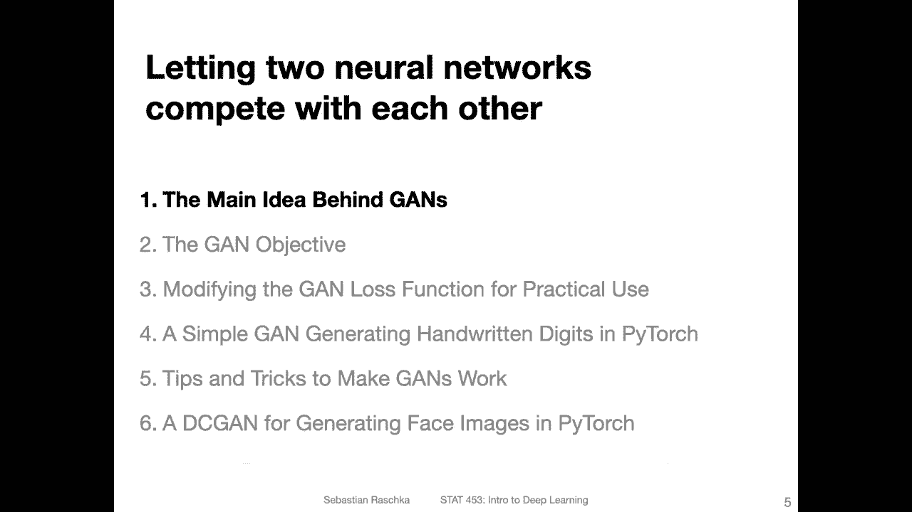

And so the reason why it's called generative aceor network is really that yeah we are using it to generate new data here。

And not so much like in the traditional statistical sense that we are explicitly modeling。

 let's say the joint distribution of the features and the labels or the data generating distribution here it's really more the fact that we are generating new data。

 although we are implicitly learning a distribution here。In any case， traditionally。

 Gs were used for generating new images。 And I would say generating new images is still the biggest application of Gs。

 Of course， the。Concept is broader， so you may also apply that to different types of data。

 for instance， I've seen recently a textgan， although for text data。

 maybe other models are better like RNs or GT which is transformer autoregressive model And yeah so there are other models that are probably better suited for text。

 but it's possible to train again for text another application would be， for example。

 generating new molecules like graphs of numerical molecules in the context of computational biology that's yeah an area I'm working on a little bit。

 so anyways。So。Behind the curtains。 what again does。

 it's learning implicitly the training set distribution。

 and then it kind of mimics this distribution in the way。

It allows us to create data that comes from this distribution essentially。

 generating new data or new images that have never been seen before。

 kind of similar to what a variational auto encodeder does when we consider the decoder。

 So when we sample a random noise vector and then run this through the decoder。

 it's also generating new data。 And that way also the generator of the G can generate new data from a noise vector。

How things work is a little bit different。 so we don't have or we don't model distribution in this context。

 We are having a setup of a generator and a discriminator。

 and the discriminator is kind of like a judge， which is。Kind of implicitly。

 I would say forcing the generator to model the training set distribution。

 it will become more clear in the next figure。 So when I show you how the G setup looks like。

And they are also similar to a variational auto encoder。

The G is generating the whole output all at once， which is different from other types of models。

 for example， auto regressive models or recurrent neural networks。 The next lecture， I will。

 if we have time for another lecture， will show you how we can use the recurrent neural network for generating new text。

 one word or one character at a time。

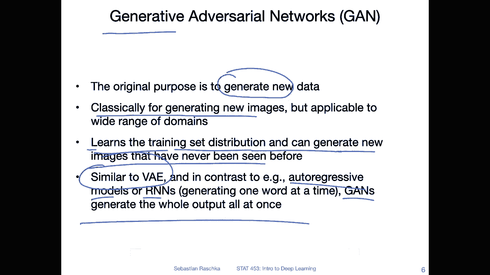

Okay， but now focusing on the generative adversarial network。 So here this figure。

 I took this from the convolutional neural network lecture。

 So I already spent so much time making this figure that I didn't want to make a new one。

 This is why it's a deep convolutional again here。Of course。

The same concept would apply to a regular gun。 So the reason why it's deep convolutional is。

 is because these here are convolutional layers in this particular figure， but you can also。

Think of this as fully connected layers， and like in ir regulargular again。嗯。

The main concept in this game though is not these convolution layers or fully connected layers。

 It's really the discriminator and the generator。 So we have two parts here。

 let me maybe clear this part because it's distracting。 So we have two parts here。

 we have the generator which is taking its input and noise vector and then it's running it through some neural network layers and then it produces a generated image and this is essentially kind of similar what the。

Val auto decota decota part is doing It's kind of similar。 it's generating new data。

But instead of like using a reconstruction loss or。Also， instead of using an encoder and so forth。

 again works very differently from a variation of encoder。

 What we have here now is this discriminator and what the discriminator is doing。

 it's judging whether this generated image looks real or not。So the the screenator here。Receives。

Two types of input。 So it receives real images from the training set。

 So these real images are from the training set。And it receives。These generated images。

From the generator。 and it has to judge。 So the job of the discriator is to judge whether an image is real or generated。

And how this is we are trained， I will show you step by step in the next couple of slides。

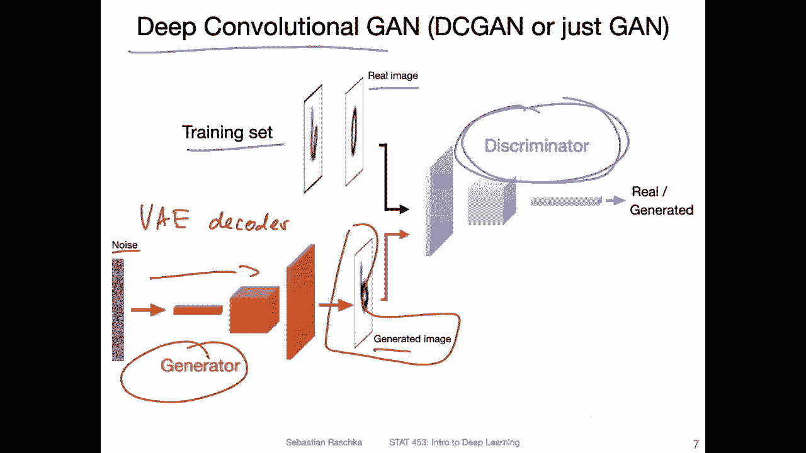

So just focusing on the discriminator now。So。Let's call that step 1。1。 So step 1。

1 is training the discriminator。What we do is we take the training set。

We give it the label real image so we can say this is the for。For real image。

 we have the label 1 and for a generated。Image。We can say it's class label 0。

 so it becomes essentially a classification task。 So the discriminator is essentially just a binary classifier。

 and all these real images have label 1。And we are training the discriminator。To output。

If you think back of the logistic regression lecture or just how we use a binary cross entropy loss。

 we are training it to maximize this probability here。And。If the label is one， we want this one here。

 There probability this output close to one， so we want us close to one。Ideally。

So we want the probability that this is a real image。To be high。

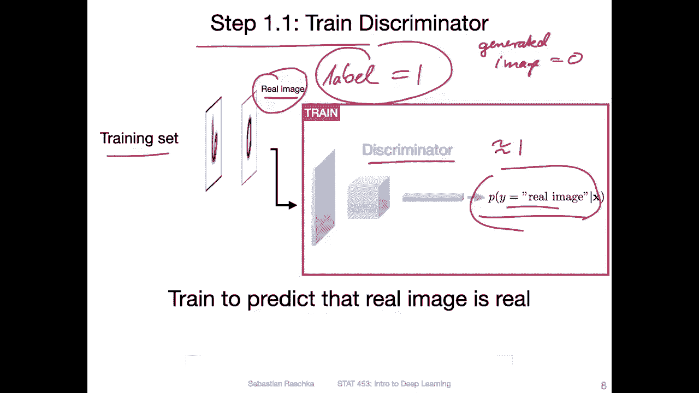

So this is a step 1。1 1。1 training the discriminator。Step 1。2 is。Training the discriminator further。

But also now， considering the generated images。So for these generated images。

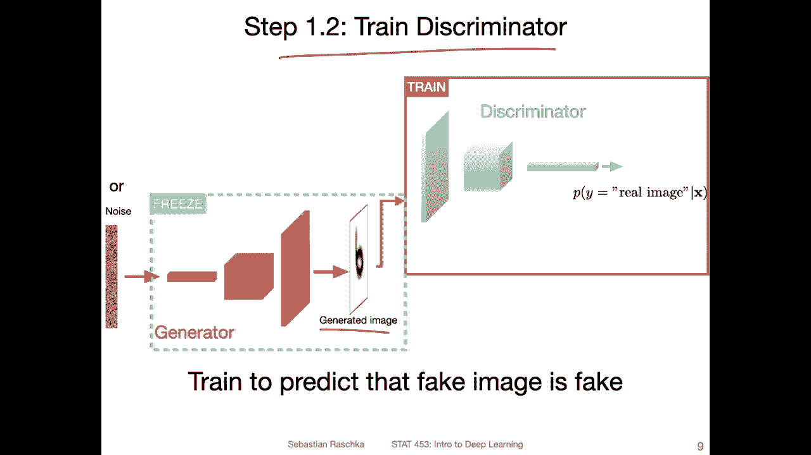

We use label0， like I've shown you。

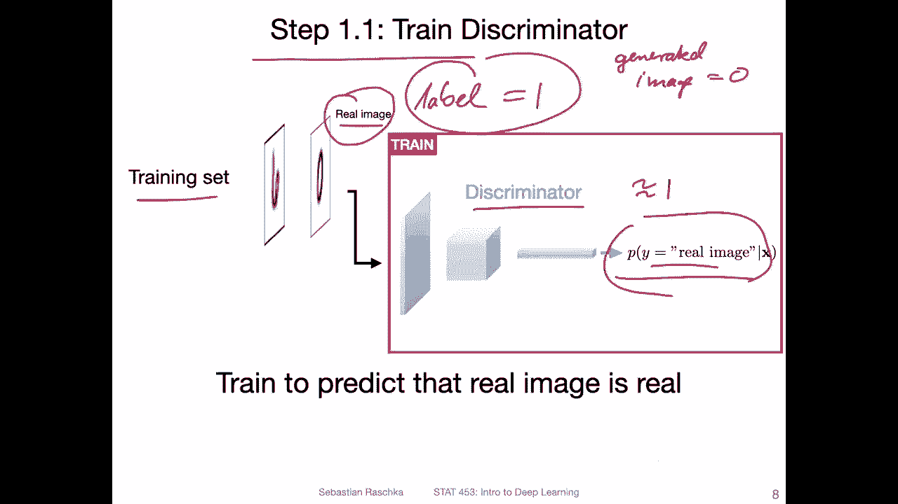

Before you these generated images。So we use now label 0。

 and we want this probability that this is a real image。 We want this to be close to 0。

Using binary cross entropy。So essentially you are just training a classifier here to distinguish between generated。

And real images。Note that while we are training this。 So this image。

 this generator image is coming from a noise vector， just a random noise vector here。This or。

 I was actually writing that this was coming from a uniform on standard normal distribution。

 for some reason， it got deleted here， but you can think of it as let's say random。

Normal distribution。So this noise is from random normal distribution， and。

It goes through these new network layerss。And then it serves as input to the discriminator。

 But notice that what I'm trying to say here with a phrase is that we are not updating the generator here。

 We are only in this step。 We are only training the discriminator at this point。O。

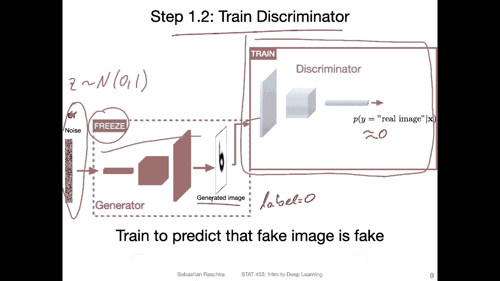

Next step。Step 2， step 2 is training the generator。 So let me just recap。

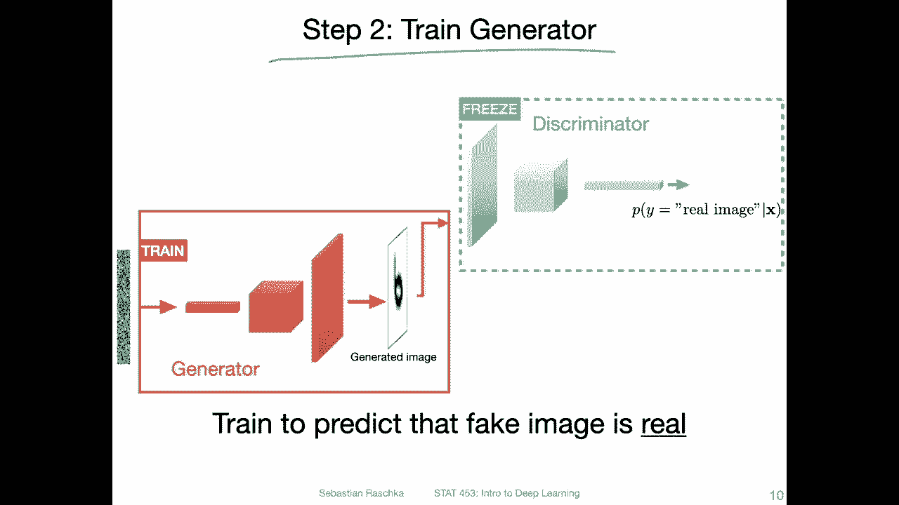

Step  one is training the discriminator to detect real images。

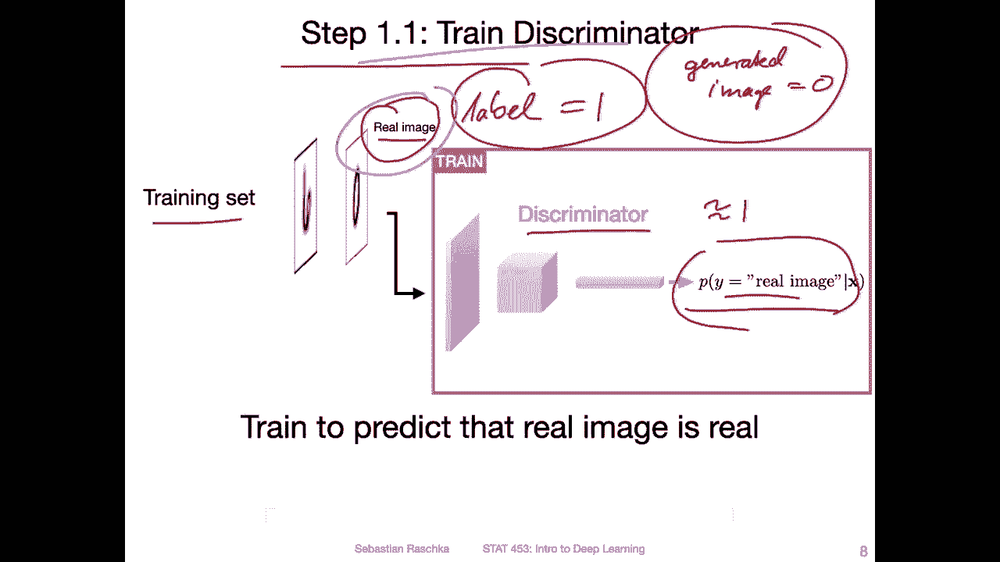

Step 1。2 is training the discriator to detect generated images now。

We are training the generator。And we are training it。

Such that the discriminator makes a wrong prediction。

So this is why it's called a generative adversarial network。 This is like， it's like an adversary。

 We want the discriminator to be better at。Distinguishing between real and fake。 But the generator。

 the job of the generator is actually to fool the discorinator。So， what we do is。We actually want。

For the generated image， now， the discriator to output a square that is close to one。

High probability that this image is generated。So we are trying to fool the discriinator。

 in this step， when we are training the generator， we are actually not updating the discriinator。

 We are only now updating。This part。So one more thing is also。

 we are technically in practice flipping labels。 So we are。There's a trick， but I will。

 I will maybe get to that later。 So there's already too much information here。 I think right now。

 So what we are trying to do is we are now trying to maximize the probability。That this。

 that the the screener thinks this is a real image。

And then。After step 2， we would go back to step 1 and train the discriator again to be better at detecting real images and generated images。

 and then we train the generator again to fool the discriminator。 So it's kind of like a game。

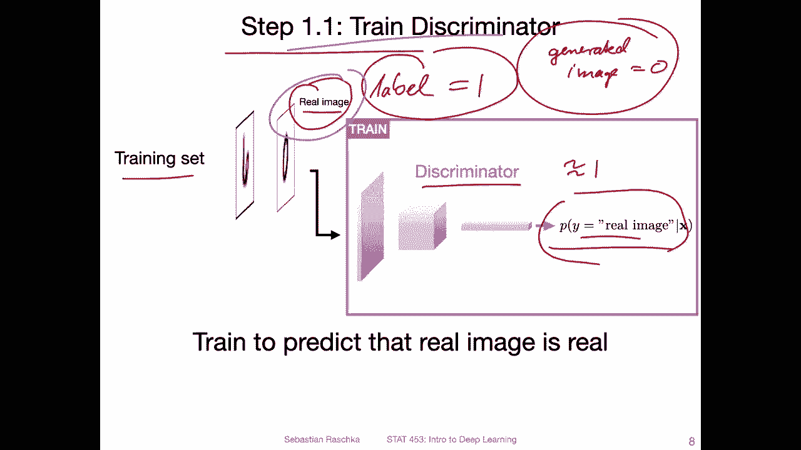

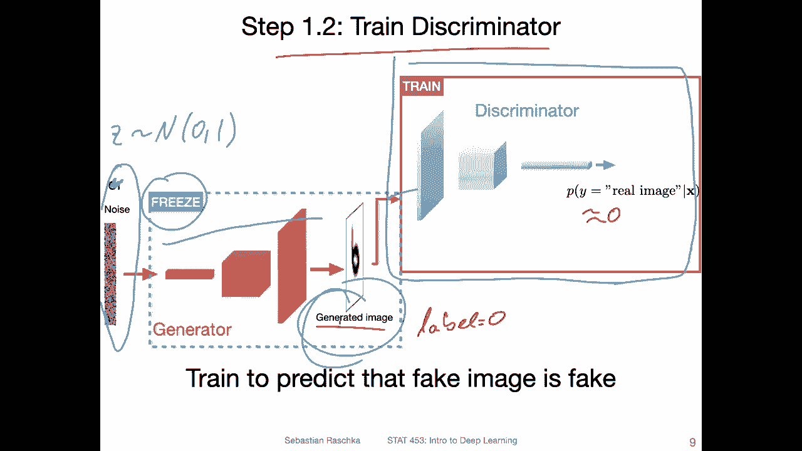

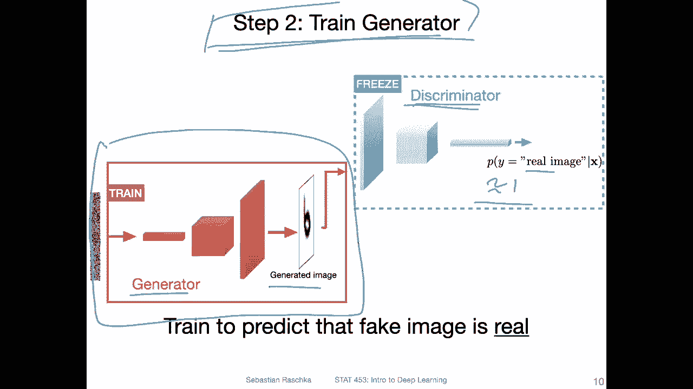

So， in fact。The discriinator learns to become better at distinguishing real from generated images。

 and the generator learns to generate better images to fool the discriinator。

 So there's like this little adversarial game going on。 And if you do this long enough。

 at some point， the discriator will be very good at distinguishing between the generated and。

Real images。 But at the same time， the generator will be very good at generating fake images that look just like the ones in the training set。

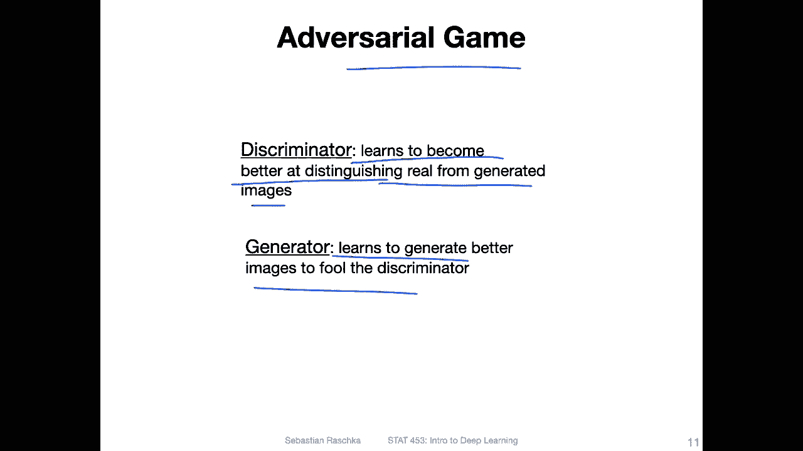

You will see it or， as you have seen before， by。

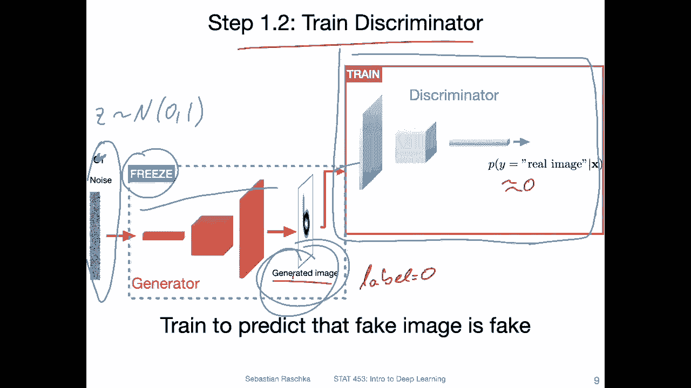

Go back to the previous video。Sdes so these images are all generated by Gs。

 so playing this aversarary game， GNs can become very good at generating images like this that don't even exist in real life。

 They were just yet generated。

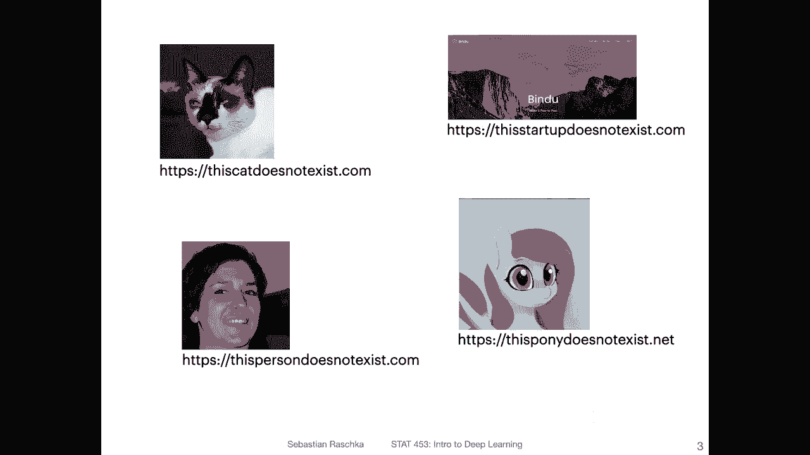

Okay， so this is like the big picture overview of GNs。 And in the next video。

 I will go into more detail of how the loss function looks like。

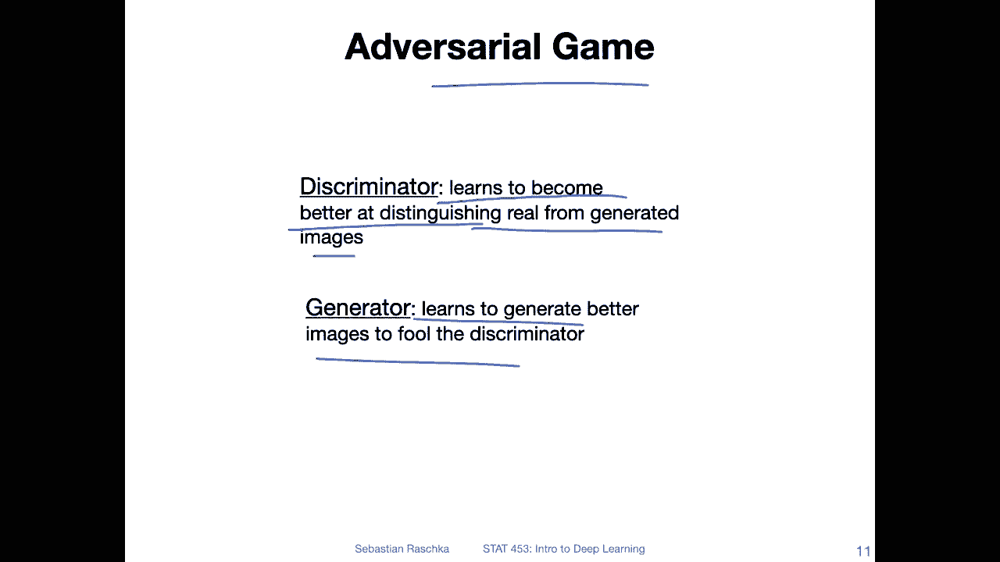

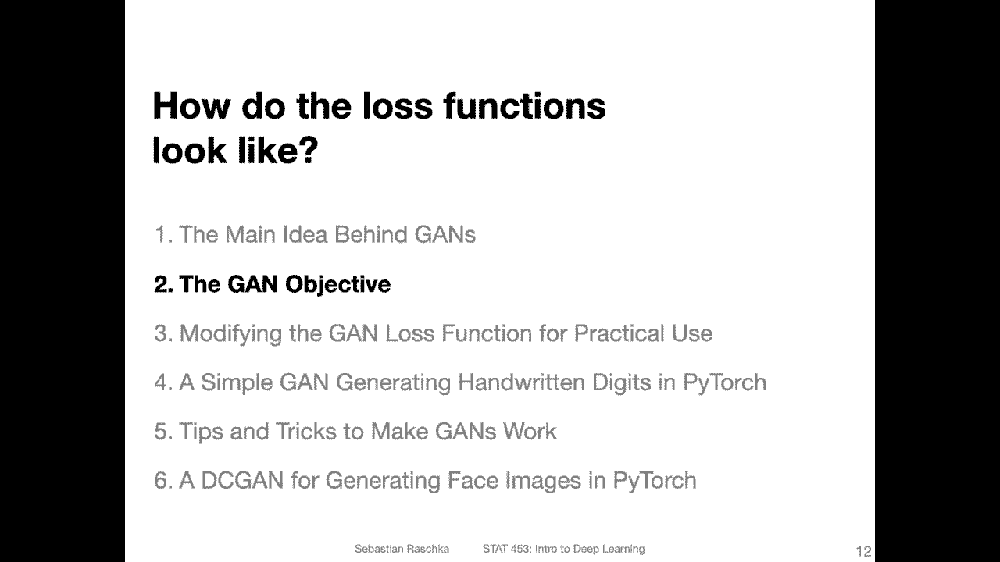