# P150：L18.4- 在 PyTorch 中生成手写数字的 GAN - ShowMeAI - BV1ub4y127jj

All right， let's now implement a again in Ptorch。 So here we will start with a simple G with fully connected layers trained to generate handwritten digits。

And I hope this will make these types of things clear that I tried to explain in the previous video it's very。

 it's a lot of mathematical notation， it's maybe a little bit overwhelming。

 but you will see in the code example is actually quite straightforward。I implemented several GNs。

 honestly it took me quite some time to get a good GN working and they're also not great。

 so theyre just simplegans so they are not that great。

 but even then it took me quite some time because training GNs is quite challenging。

So I will in the next video go over some tips and tricks for that。

 but even if you consider these tips and tricks， it can still be hard compared to let's say。

 just training a classifier。So one of the reasons is， so here。

 let's say go over our regular imports and everything。

 But one of the reason is that we have now two neural networks that we have to train。

 So before we only had， for instance， one learning rate for training a classifier。 now we have。

2 models。 So we need also two learning rates and can also be hard to find the good， a good kind of。

I would say ratio between the learning grades。Let me make this a little bit bigger here。

Before we only had to tune1， now we have to tune2， the generator learning rate and the discriminator learning rate。

 and also we have to find the right relationship。 for instance。

 it could be that this has to be much larger than this one or other way around。 So again。

 this is something that has to be tuned and that just yeah increases the complexity。Alright。

 so this is just a general setup beside having now two learning rates。 So here we have the data set。

 again， nothing special。 I'm using the endless data set and here。

I'm normalizing the images between -1 and1。Worked a little bit better than 0，1。

And we are only using the training set here。 we are not using the test set for M because GANs are also unsupervised algorithms。

 so we only need we don't need labels or something like that。

 You could technically merge training and test data into one single data set so you have more data。

 but I was lazy here， so I'm just using the training set。For simplicity。

Just checking that everything loads correctly。 Now I'm using this torch vision U dot make grid function。

 which is a pretty nice function to make visualization quickly so。Okay。

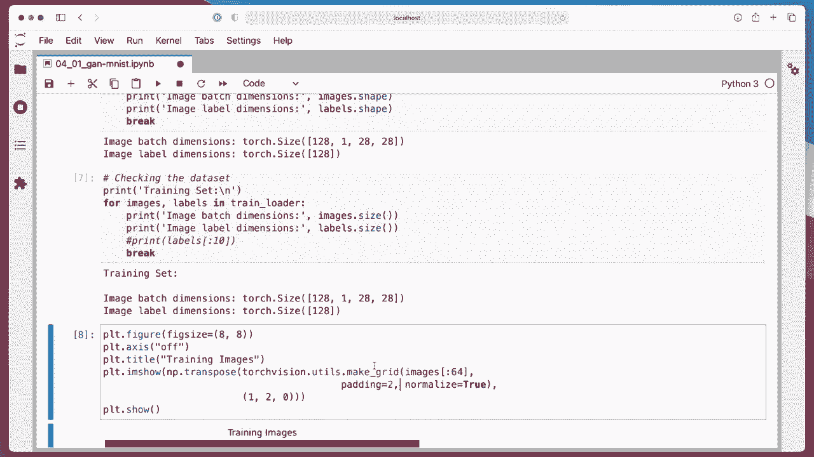

Here it's。Ploottting 64 images in an 8 by 8 gridit pretty conveniently。 It's just， yeah。

 basically one， two lines of code， or three lines of code。 So here。

 this is a function I will also use later to visualize the results。

 It's a quite useful function for just making visualizations quickly。

 So here's just how some of these headwritten digits look like。

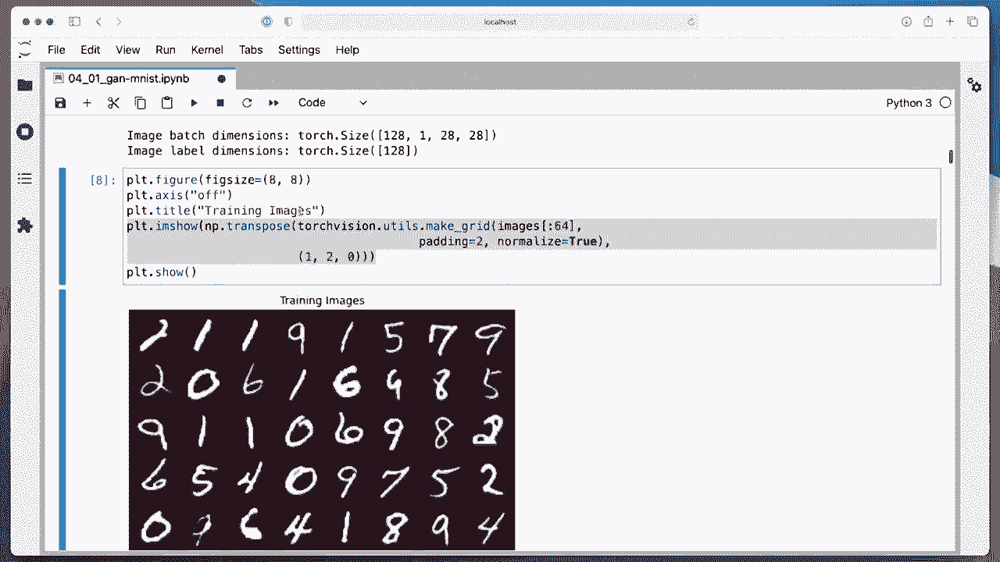

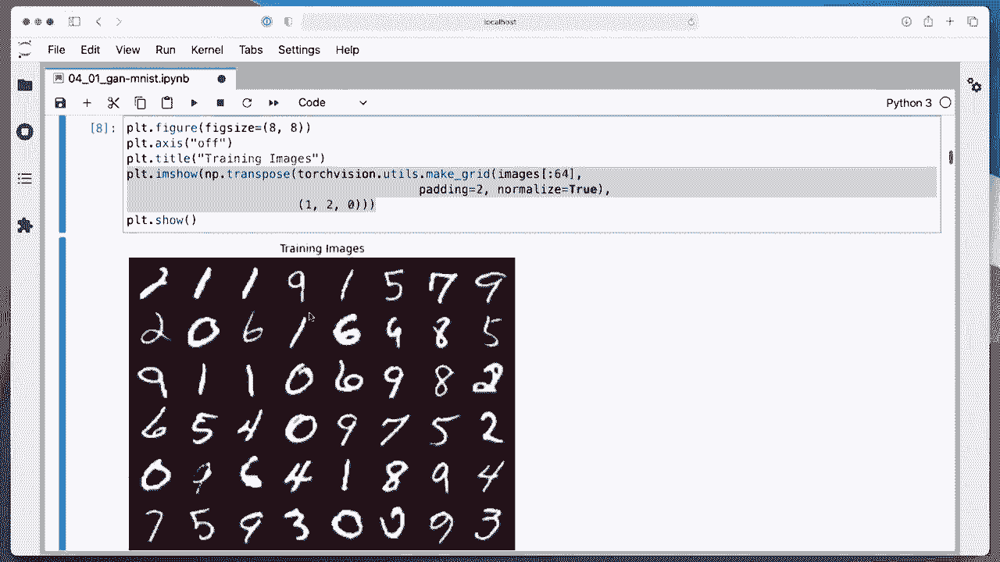

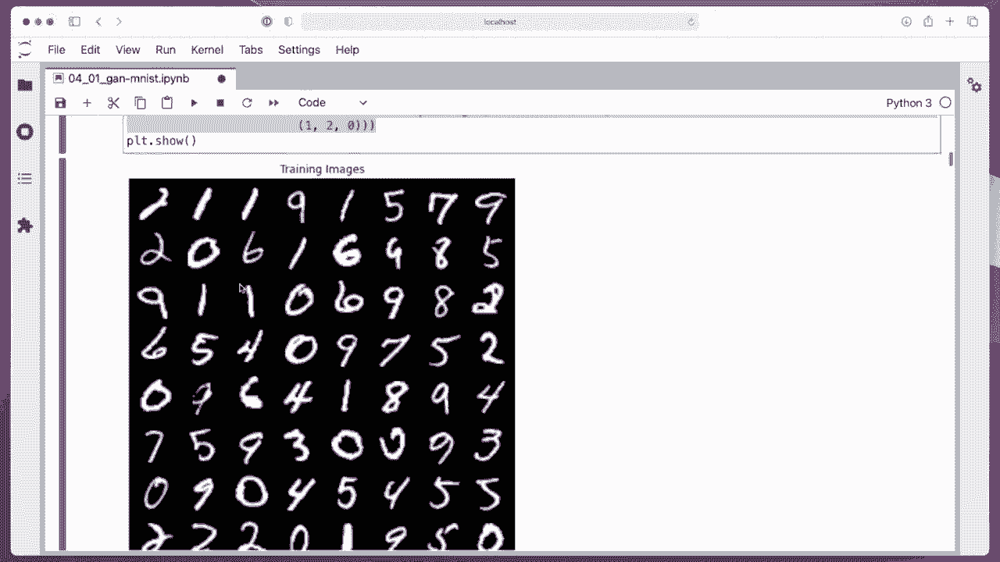

Okay， so here's the interesting part， the model。So， we have。Now a generator enter a discriminator。

 so I implement this as photos， I use the sequential API for the generator and also the sequential API for the discriminator。

So this is a fully connected can。 So I have a linear layer。 Here have a leakquire and a dropout。

 I tried different types of dropout with and without。 it worked better with with with dropout。

 But while it's another thing to tune。 It's kind of tricky。嗯。Yeah， and。Like I said。

 we are using fully connected layers and because I normalized my input images to be on the -11 range。

 we have also a 10 h here so that the pixel outputs are also in the  -1 in one range that they are comparable to the input range。

 So this is the output from our generator。 So the output here are our generated images essentially。

The discriminator is just a classifier， so。It receives an input image。

 We just flatten it so that it goes into our fully connected layer。Which has the size， image。

 hide image width and cut channels。 the number of features。 if we flatten an image。

Has been a long time ago but this is something you probably remember from the multi layerer perceptron class。

And then we have a leaky re here， dropboard and output layer with one output node because we are using the binary cross entropy。

 We have a binary classification problem here。 We could have two output nodes and use the multi category cross entropy。

But here， for here， I for simplicity， I'm using the binary crossenttropy。

Which is essentially like a regular logistic regression。Okay， so。For each。

 for both the generator and for the discriminator， I have a forward function。

 I have the generator forward here and the discriminator forward。 So the generator forward。

The generator will receive an input image from noise。 So the way I implemented my training function。

 because I implemented it with con auto generators in mind。I have in the training function。

 something that creates a noise vector that is in the shape。Color channels， height width。

So I'm just flattening it here。 That is just a vector。And then this noise vector。

 This is a noise vector from a random normal distribution。It goes into the generator。

 So this part is executing。This year， this pipeline， which will produce a new image generated image。

 And since the last day is a fully connected layer， I'm just reshaping it that it outputs。Also。

 the dimensions colour channels， image height and image width。

 So what goes into here is also colour channels height and width。

 which is why I'm flattening this here。So let me put this maybe here。Z has。I mentioned。C， H W。

And the output also has the dimension C， HW across also the batch size。

 so we can maybe also add that here。So N， N， C， H， W。Okay。

 and the discriminmat is a little bit simpler here。 it's just receiving the input image。

 which has the flattening here and then returns the logicits for the predictions that this is a real image。

Okay， so then we initialize so this is our model。 I will show you the training loop in a few moments。

 then one more thing is yeah we are initializing our model and then here we are initializing our optimizers。

Here is one important aspect。So first I'm using Adam for both。

 Some people recommend using S GD for I think the generator， I tried different things。

 This happened to be。The best working version that I could get。

 So you may find better settings in the next video I will go over some tricks。

 but this happened to work well for me。 took me a long time to find anything that worked at all。

 anyways， so one important thing here is that of course。

 we use the generator learning rate for the generator and the discriator learning rate for the discriinator。

 but the more important thing is that we also use the right parameters here。

So we have an optimizer for the generator that should only update the generator parameters。

And the disc it。Here。Should only update the discriator parameters if we had something like this。Well。

 this would not work well in practice， because then it would。When we take a step。

Here for the optimizer， it would update both the discriator and the disc generator。

 And this is not what we want。 So because。If I go back to my slides a long time ago。

 but in the first video， I think talked about this。Might be the second video。 So we train。

Let us screen it up first。While we keep the generator frozen when， when it gets there。Fake images。

 So we only train the discriator， and then we freeze the discriator and only to train the generator。

 So in order to achieve that。We have these two different optimizers where we for one optimizer。

 only train the generator where here the discriator remains frozen and here we only train the discriator where the generator remains frozen。

And then we have the training function here， so I have this in a helper file because then I can reuse it across my different notebooks。

 Let me open this here。So should probably at the bottom because it was the last thing I implemented。

 So here this is my training。 So this is a training I'm using here。

 So let me now explain how the training looks like。 First of all。

 we are using binary cross entropy with logics。 Why it's because we have。

The output here is the logics。And。Then， we are sampling。So we are sampling in each。So for sorry。

 we are generating here a fixed noise vector。 I'm calling it fixed noise because we are reusing that one to monitor the progress during training。

 This will become clear after the epochs。 So for now， maybe ignore this part。

 let's focus here on the epochcateeration during the training。

 So for each epoch and the number of epochs we want to train。This is the same as before。

 like in any neural network we trained before。 Now here we just get the batch size as a variable so it will be easier to read and。

Here， we are only concerned with the real images。 We don't need the labels。 Usually。

 we had something like the labels here， but we are not using them。 So I'm just using an underscore。

 in Python。 The underscore is just like a indicator that this variable is not used。

So here we have the real images。 and now we create our real labels。 So the real labels are once。

 So here real。Real is equal to one。And fake is equal to 0。So we create our real labels here。

Now we also generate fake images。 This is for the discriminator training。

So we create them from noise， right， so here I have a random normal distribution。

I have my batch size。 So if I have， let's say，64 real images I'm creating now 64 fake images as well。

And these are from a noise vector。 That's the latent dimension here。 So if I go back to my slides。

 this is this noise。Sorry， this noise vector here sampled。From a。Random normal distribution。

 You can also use a random uniform distribution， but practically in practice random normal。

 is that Gaussian works better。 So this is， let's say if we have a 100 dimensional embedding。

 this would be a 100 dimensional vector。 So by default， I said it。To 100， I think， here。

I didn't set it here， let me see。哦。Yeah， set the latent dimension to 100 here。

This will create a 100 dimensional vector。 And here I'm reshaping it to an image format。

 So it's format。And。So this is sorry。 I was actually here。

 but the fixed size vector is created the same way。 So it's a format N color channels H W。

Where what's the other one。Here。So我。We are sampling from this random normal distribution with 100 latent size。

 This is our color channels because I implemented that with the convolutional autoenr generator first。

 and then I did the fully connected one。But this one gets reshaped。This gets reshaped。Here。

 so that it will also work with a fully connected layer。 So you don't have to worry about this。 Okay。

 now we are generating these fake images from our noise vector。We are calling generator forward。

 This will generate our fake images。And then we will create our fake labels， which are0。So。

 fake relas。Nbel is one。And fake label， this label is 0， right。This is our fake label。

 and we will also create our flipped fake labels。 So this is our trick that we discussed。

Where was it， we discussed that。Here， where we had our flipped。Labels。So the flipped labels。

 flipped fake labels are the real labels， so。Here。😔，啊。Okay， let's do this real。可以不。😔。

Faith label here。Think label is one。This is that we use for fooling the discriinator when we train the generator。

Now， we are training the discriminator here。First。Like always， we0 the previous gradients of the。

Model of the discriminator。This will only do that for the discreteator ones。And here， so here， again。

 we generated the data for training。 And here we carry out the actual training。

 So what we do is we now。Get the predictions。 These are the lots。

And the logicits would be in the form。N times。嗯。Sometimes one， right。 So we convert that just to n。

Instead of having n times 1， we just convert to n， it will be just a vector。

Instead of an end by one matrix， just easier to handle。 We are just removing the last image。

 I could have also done a squeeze here。It's maybe easier。😔，It doesn't matter。Okay。Then here， we have。

The loss。The loss for the real images。 So we want the disc screenator to predict real。

 So how we compute the loss is as the loss function again is if we don't specify anything。

 it's the binary cross entropy with logics。 So we have。

Prediction logics that's from the discriminator。 And this is the real labeled。 So these are the ones。

 So we， these are the labels， the ones。 And we want this also to become one。 So this is the loss。

To predict one， given that the labels are one。So the real images。And then we do the fake images here。

 it's the same。As before， except。Now， that。We have。

The predictions for the fake images they were obtained on the fake images here。

 And here I have the detaach because otherwise it will influence the generator gradient。

 It's complaining about that。 So I'm just detaching it from the generator graph。

 because I could have。Probably， yeah， no， it's fine。So yeah， it's fake images。

Retaching it from the graph。 So I'm not optimizing the generator here， right。

 The generator is frozen。And then I'm computing the loss here。

The fake prediction with the fake labels。And。These are so fake labels are0。

 and we want to make them 02。So again， we are just using binary cross entropy between labels。

 we just want to。Make these labels similar to these labels， the ones。

 and we want to make the fake prediction similar to the fake labels， which are the zeros。Then。

 I mean， we could technically back propagate here and here。

 But instead of calling backwardwater twice， it's more efficient to just。

Add them together here and then call back what once。

So I'm just combining the loss on the real labels and the fake labels。

 So I'm combining that from here and here， adding it up。 It's actually not necessary to have the 0。5。

 but why not And then call the backward。 and then we update the discriminator。

 So this whole thing is training the discriminator。Now， we are training the generator。

So we are now using the flipped labels。So。Here we obtain now the predictions on the fake images。

Right， same as before。 So this is the same。As before。 But now we are using the the gradients。

For the generator。We want to keep the gradients， so I'm not detaching anything here。

And then I'm computing the loss between the fake predictions and the flipped fake labels。

 So the flipped fake labels are one， right， If I go up again， they are one。And here。The prediction。

So the discreator will output if it's a good discreminator will output to 0。But we want to fool it。

 so we wanted to output a one。But we are not training the discriminator here。

 We are training the generator here only。 That's why we are using optimize the generator here， right。

And this is also why I'm not detaching anything here。 It's the disclaimer here remains frozen。

 We are only updating the generator， because when I go back。Here。

We have only the generator parameters in our optimizer for the generator。

 so we are only updating the generator here， not the discriminator and the generator will be updated such that in the next iteration it will be better at fooling the discriminator here to output onces because the ones will be then similar to these ones here。

 So it's trying to make these similar。Alright， so this is essentially how things work。

And then the rest is just logging purposes。Just printing some results， saving some results。 Oh。

 maybe one more thing I wanted to mention is。I mentioned earlier I had this fixed noise here， right？

 So why am I using the fixed noise， I'm actually using that in each epoch。 So if I scroll down again。

 So in each epoch here， I am using my fixed noise。And make a prediction。

And then I'm saving my image gridit to just the lists I have。List here。

 just I call this images from noise per epoch。 and I'm appending to this list。

 and then we can take a look at the generated images during training。Okay， so let me go to my。

Training here。 So this is training。So you can see the generator discriminator losses here。

 so they start out pretty balanced and they keep kind of balanced。

 but honestly looking at this is not very informative except that you don't want to have one going to0 and one going really high。

 but other than that it's really hard to tell just by looking at these numbers whether it's training well or not you want them to be not going crazy。

 you don't want to like I said going them going to really infinitely high or become zero。

 but except that usually there's not that much information you can gain from looking at this okay trained for 100po。

And then yeah， here's a loss function。 So sorry， loss plot。

 I saved everything in this locked dictionary。 and then we have the is greaterator loss per batch and generate loss per batch。

 which I'm showing you here。 So kind of。They are pretty stable here， actually， that's actually good。

嗯。Os somehow好诶。啊。I don't think I can fix it here because I didn't run it。

 but it should have been epoch。 so that's why it's not showing。This year was 100 epochs， anyways。嗯。

And then the visualization， iss the more interesting part。

 So here I'm visualizing these generated images per epoch。 and then the last one。

I'm not sure if this is necessary。😔，Could have。😔，Add it X row。Plus，5 here。Anyways。Wass just lazy。

 just copy and pasting。 So this is just train So plotting from the fixed noise。 these images。

 So you can see the generated images at epoch 0。 So at the beginning。

 the generator is not able to produce anything useful。

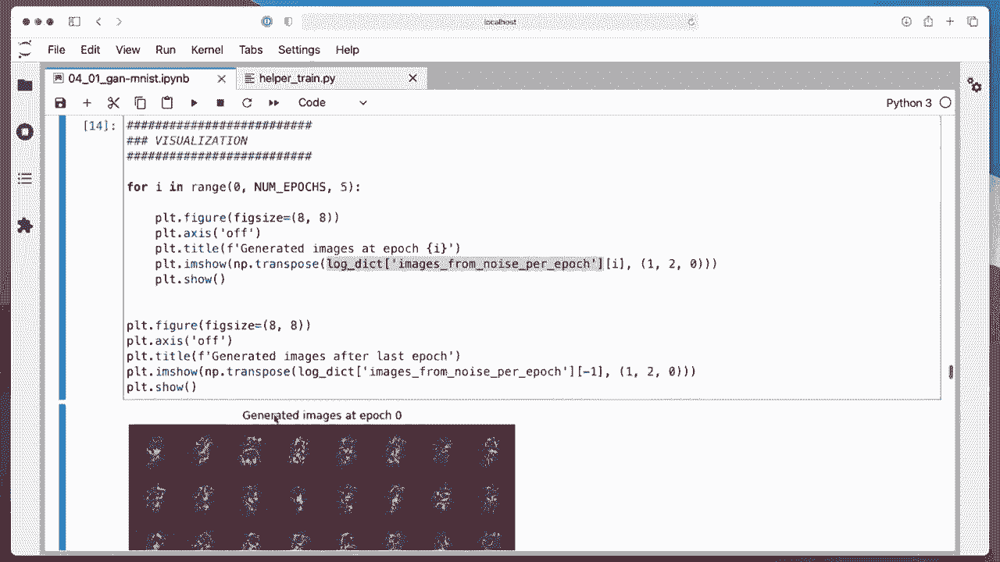

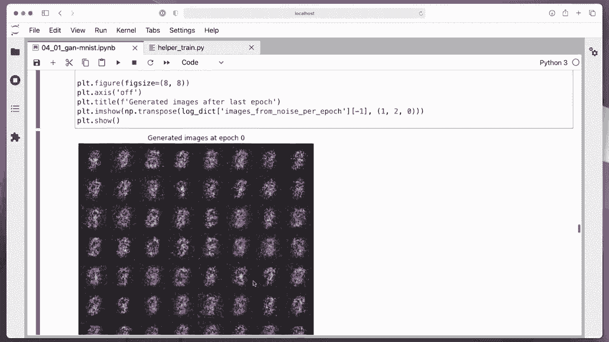

You see that here。Then after Epoch 5， things look a a little bit better。

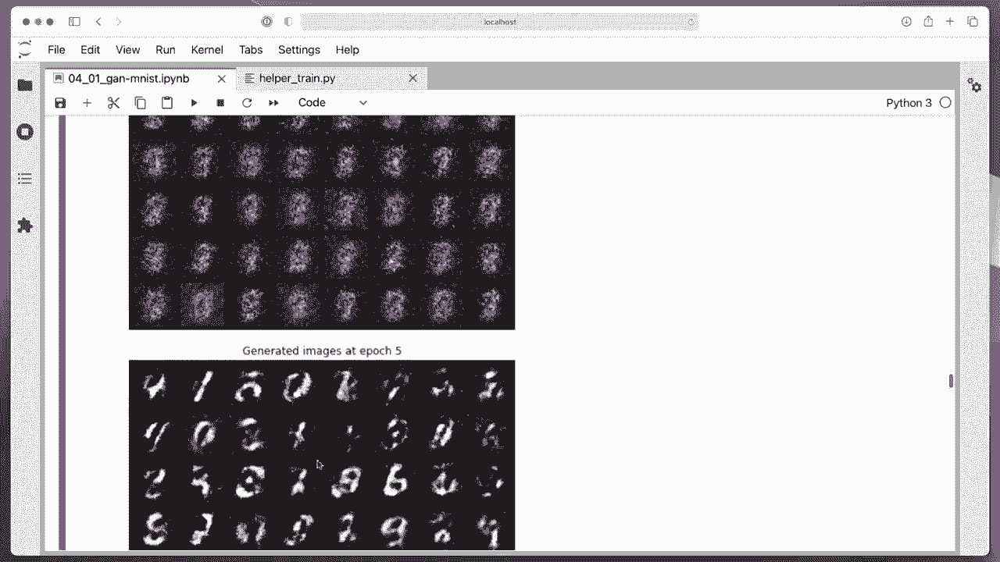

U book 10。15。😔。

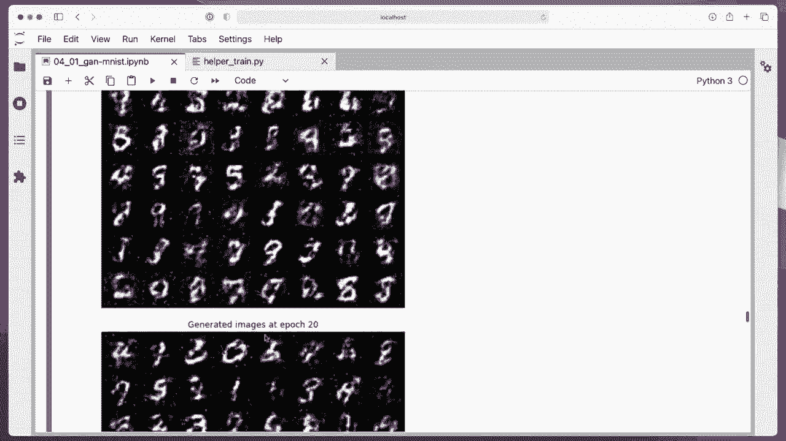

20 so forth。 you can see it becomes better and better。 Now you can even see these7s。 This is a9。

 So actually things look very good。 So let's scroll down to the bottom。

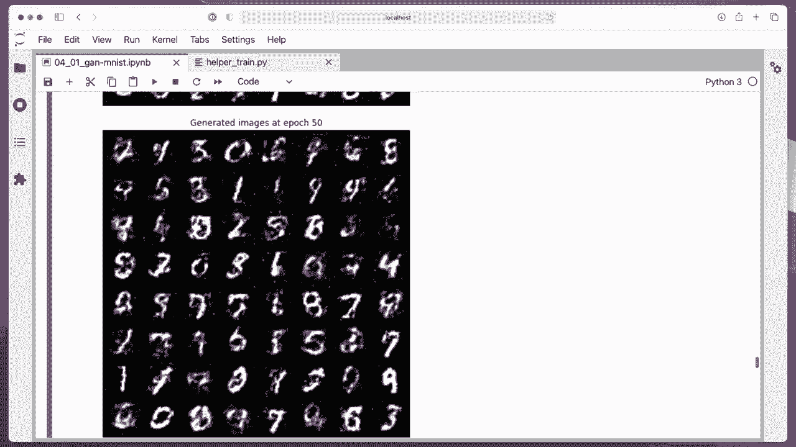

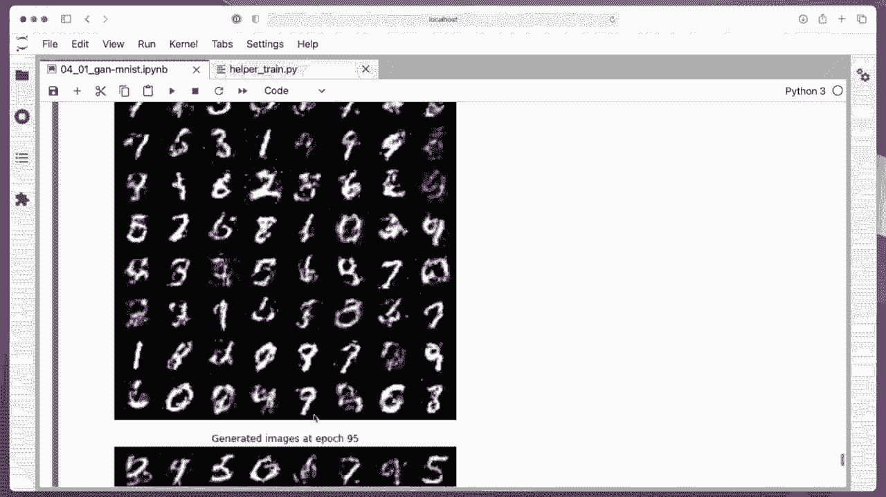

Okay this is last epoch。

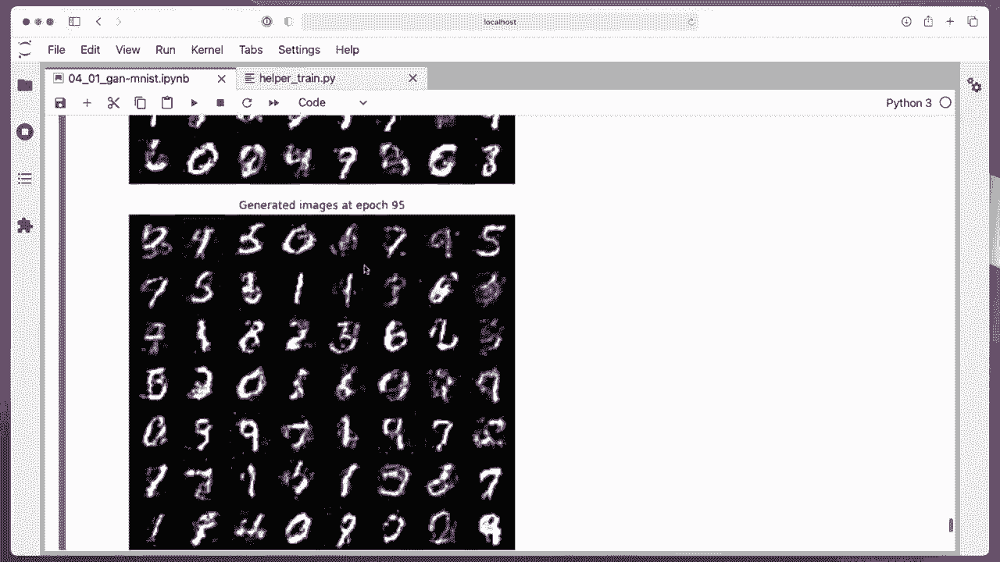

So you can see I didn't really improve that much。 You have now issues like here and here。

 So training it for longer might not。

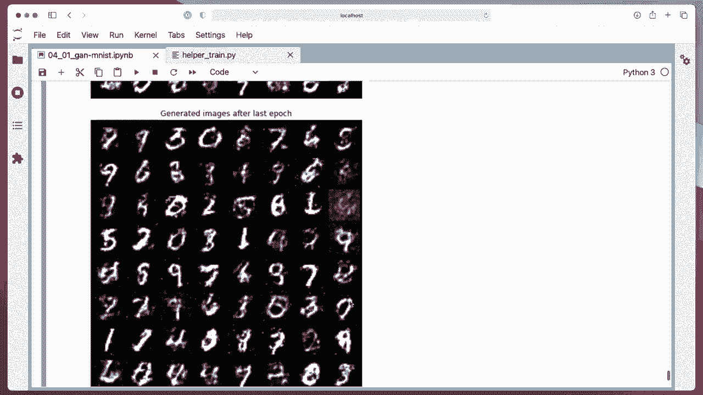

Improve， but it's actually given that this is a very simple， fully connected G。

Images look quite reasonable。 So not all of them look great， of course， but。Well， it's not terrible。

 I mean， it， it's learning something， right， if you compare to the first。

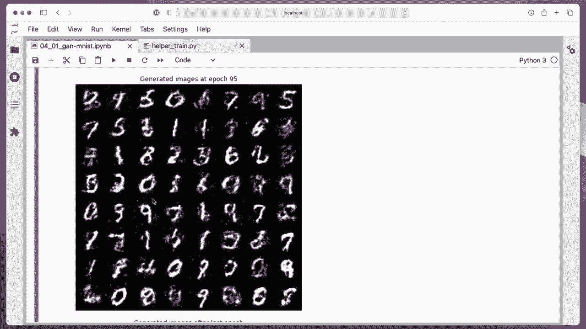

Apochs。

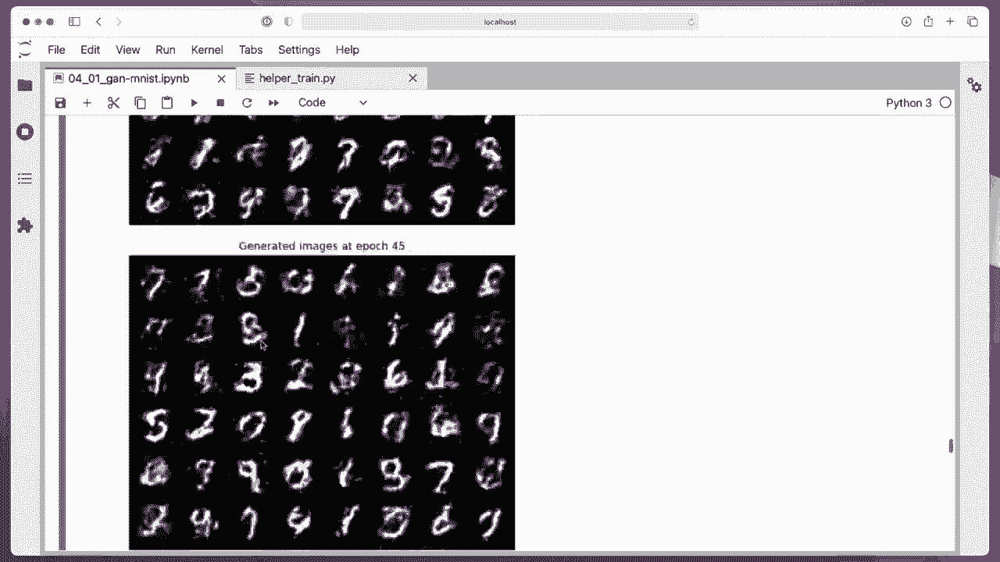

Here， it is learning something， right？

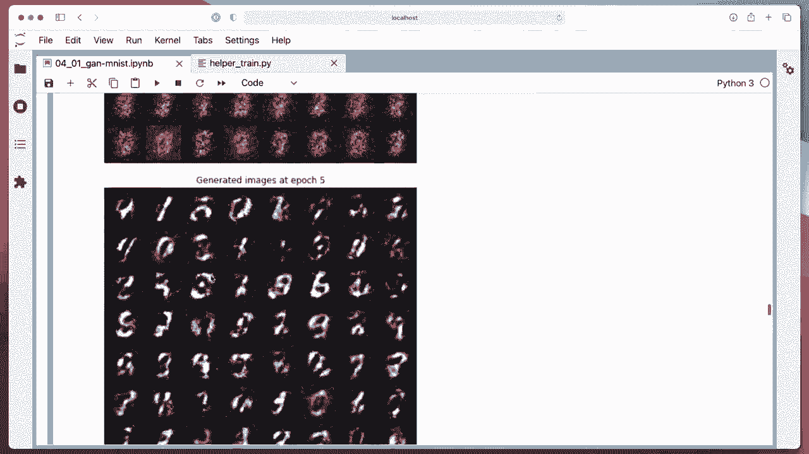

So yeah， this is our first G and training Gs is tricky to be honest。

 so in the next video I will go over some tips and tricks for training GNs。

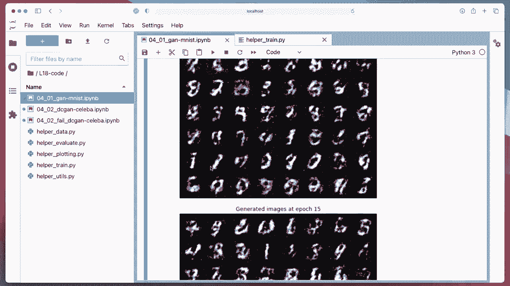