# P159：L19.4.2- 自注意力和缩放点积注意力 - ShowMeAI - BV1ub4y127jj

So in the previous video， we talk about a basic form of self attention。

 Now we are going to get a little bit more sophisticated and talk about the self attention mechanism that is used in the attention is all you need paper。

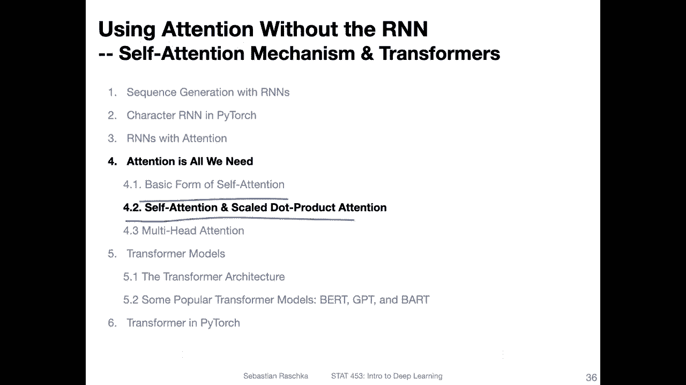

So， yeah， just to recap， this is what we looked at at the in the previous video where we had。

The self attention mechanism defined as follows where we had this input sequence。

 which were embeddings， word embeddings。 Then we computed the dot products here。

Between one particular input and all the other inputs。And then here。

 we normalize those with the softmax and computed the output as the。Attention weighted inputs。

 So for each input for each input AI， we will get a vector。 And if we have。Let's say T words。

 We will get。T。😔，Mres from one。2。Essentialently， a matrix。Tension matrix。

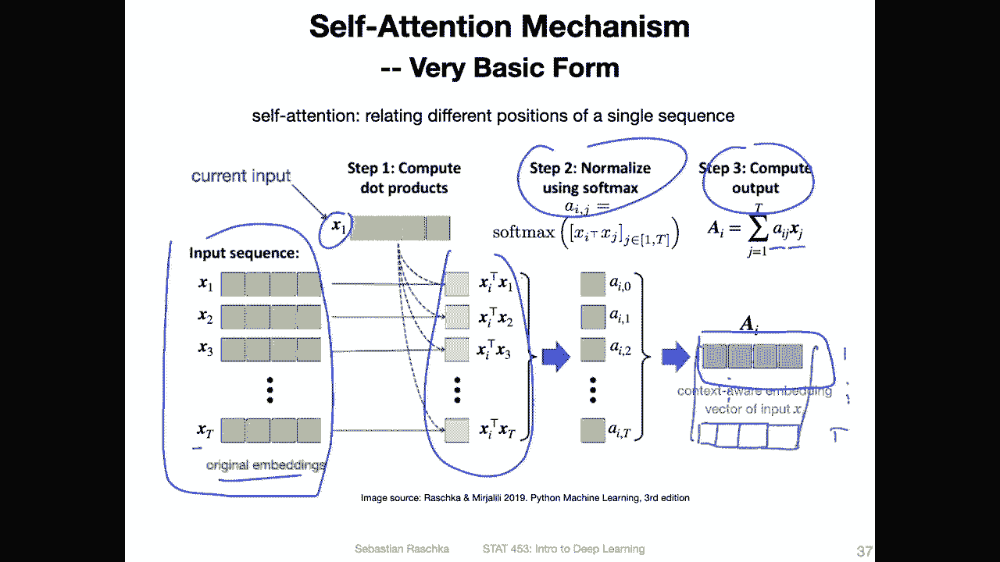

Okay， but yeah we are now kind of extending this concept of this basic attention using the attention that is used in the paper attention is all you need。

 So how does that one look like。

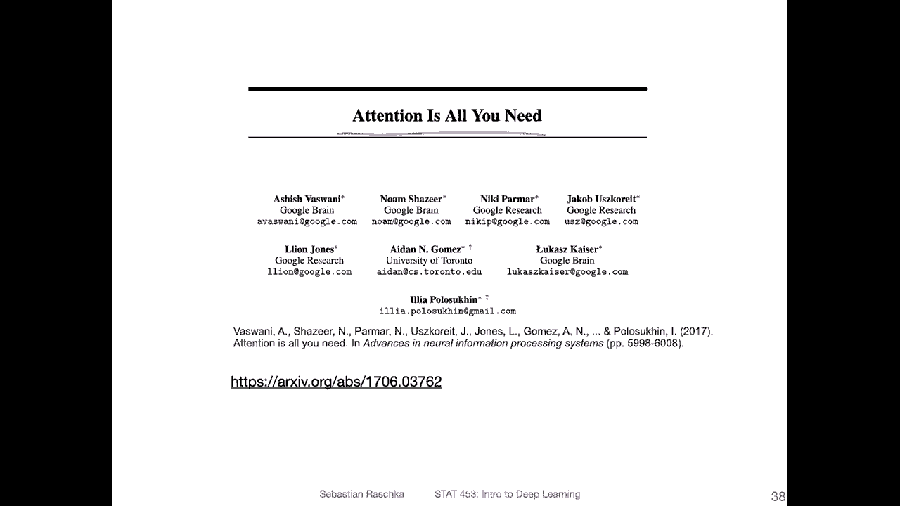

So first of all， noticed that there was one big problem with the basic version of self-atten and the problem was that it did not involve any learnable parameters。

 So the previous version of self-atten， the basic form was actually not very useful for learning a language model because how do we update this right So if we want to develop a language model that is for instance。

 supposed to translate text how do we make it better if there are no learnable parameters right so here we are now introducing three trainable weight matrices that are multiplied with the input sequence embeddings the Xs that we have before so。

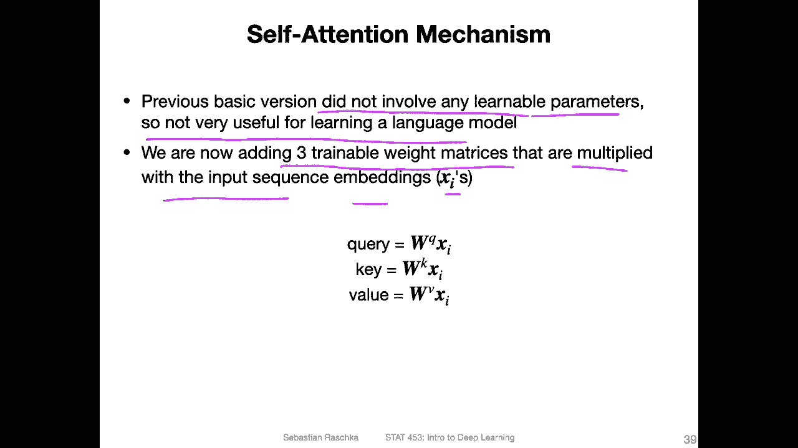

Now， instead of let me go back。 So instead of just computing the stop product here between the input and the query。

We now involve weight matrices。 In fact， we will use three different types of weight matrices we call the one WQ。

 which corresponds to the query。

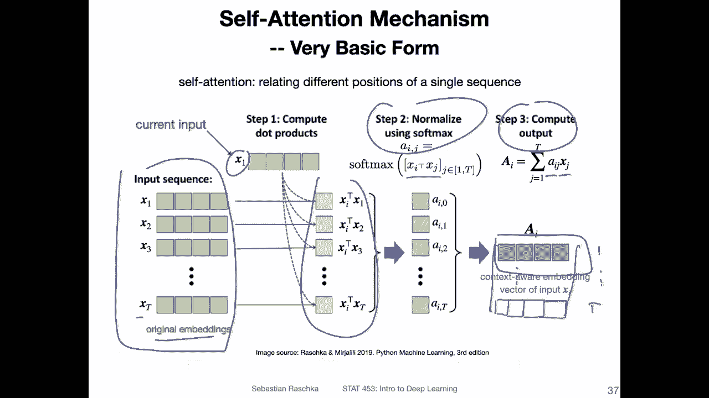

K for the key and V for the value。 So when we now compute this matrix modification between。

or the word embedding X， which is a vector， and this matrix W Q， we get the so called query。

For this one， we get the so called key。 So these are vector to us。 and the value is also vector to。

 This is the value between a matrix W V。And the input X I。So what's new is now that we have。

Modified versions of this word embedding。And these are weight matrices that can be updated with back propag。

 for instance。

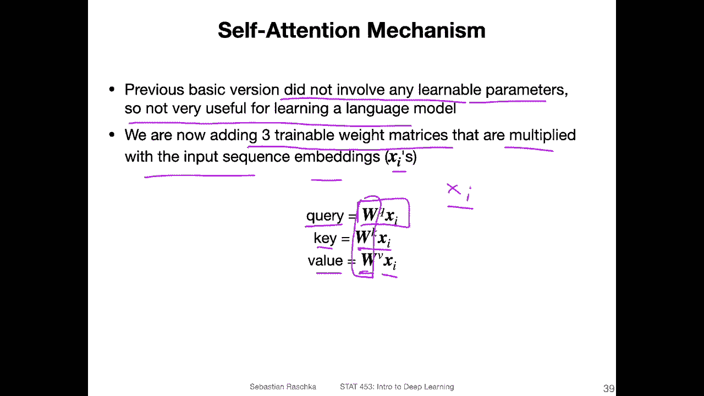

So here's a drawing of how this self attention mechanism。Looks like for a particular input。

 So let's consider the one in the middle here， x2 word， the second word in the sentence。

So this current， we can consider this as the current input。 we call this the。Can't query。So I mean。

 queryrry is a bit ambiguous because we we also have the queue here。

 but let's consider this as our current input here。

 and we compute these three things that I showed you on the previous slide by matrix modificationification。

 So if I go back it's just a matrix modification to compute these three things and we do this actually for all the inputs。

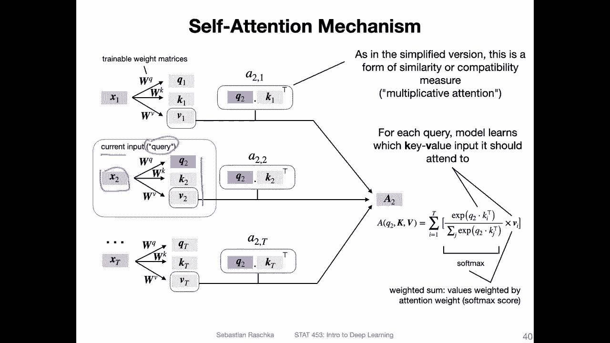

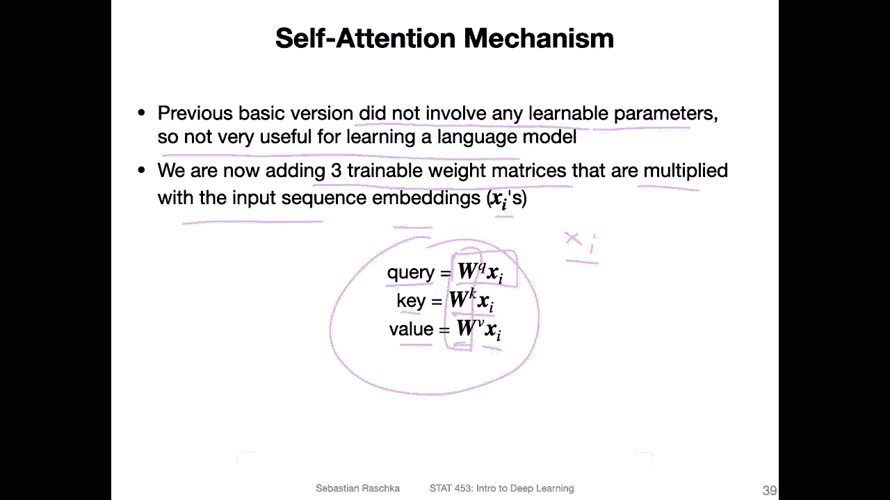

So we also do this here and here。So from word 12 up to the last word， the teeth word。

Now we are also computing the attention values here。As a dot product。However。

Here we are now computing it instead of computing it between the sequences on x1 and x on let's say I。

Instead of computing it like this。We computed， actually， between。The query and the key。

 So these are just modified versions of that。 So here we are regarding。Q 2 as the current input。

 So we are using Q2 here everywhere。 This is our query。And then we use the key。

So maybe I should use different colors。So for the blue one here， we use。Bluook key。

For green one here for itself， we use green one。And for this one， we use this one， but。This。

Query is all the same。 The keys are different， but the queries are the same。

 So why the terms query key and value， This， I think， comes from the field of databases。

 So here it's not really that relevant。 It's just。Different different names for different parts of this computation here。

And you can， yeah， think of this。 This is also known as。

The stock product here has multiplicative attention。

 there's also the other types of attention like additive attention。

 but here it's like a form of yeah form of multiplicative attention and essentially for each query for each here for each query the model learns which key value input it should attend to so。

Continuing with this model here， when we compute this。

 there is also a normalization via the soft mix。And then these are added up to form this a2。

 which is。The context aware embedding of the input。 So if I go back。

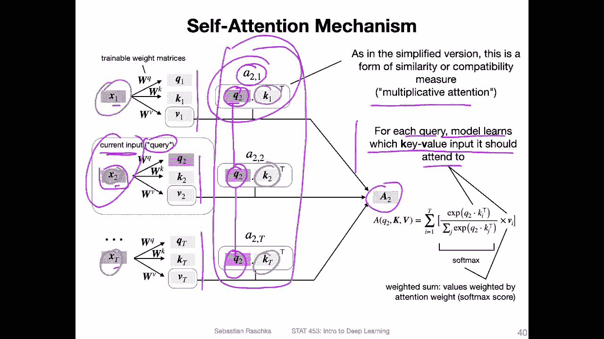

This is similar essentially to what happens here right so when we have our context aware embedding of the input X I。

 now we have the same thing except the computation is a little bit fancier because we involve these three matrices。

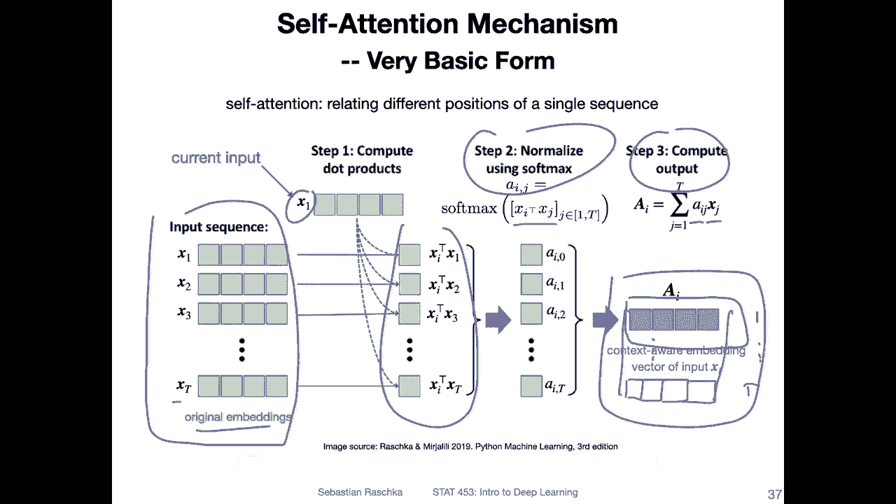

I will also show you， I mean， there is also a scaled version of that。 but one step at a time。

 So here is the not scaled version。 So here。In the center， we have， again， a soft mix。

 So the soft mix of these dot products。So that these attention weights， these A's。

Some up to one just like before。 And then what's newest， we multiply this here by the value。

So we do that for all the T values。 we are summing over them here。This will be a vector。

 so this will be the vector。4。The second word。A 2 corresponding to x 2。

 we would do the same thing also for x 1 and X T also up to X T。 So we would repeat this process。

 but we would each time swap the query then by， let's say query。1， the first word， and then also。

Teethward。And so forth。 But notice us， what's cool about this is we could do this all in parallel。

 There is no sequential nature of that。 so we could all compute these in parallel。

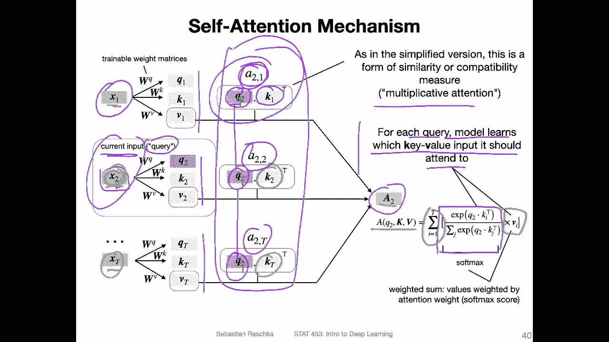

Yet， to explain a little bit better what was going on in the previous slide。

 I made a copy of the previous slide and added some annotation about the different dimensions of the different parts in that figure。

 So let's walk through this from left to right， so。Here X I， X1。

 this is a word a word embedding vector， so you can think of it as a one times the E dimensional matrix or de dimensional vector where the E is。

 yeah， the embedding size and the original attentions all you need paper。

 they used 512 as the embedding size， but of course， this is a hyperparameter。

 It's something you can choose it's arbitrary in that way can have 256 or 1024 or some other number is the word embedding size as we have seen also when we worked with RNs。

Then we have our matrices here， our Ws， the query key and value， and they have to have， of course。

 the same dimension， I mean the same number of rows as we have columns here for the matrix multiplication。

So we have D E here everywhere and then the output size or the number of columns is Dv， Dq and D。

 and in the original paper， they had Dq equaling D。 I mean。

 of course thats also necessary for the stock product here， right you have to match the dimensions。

And in the original transform paper， they also had D Q equal to Dv。So this is， yeah。

 we will see later why that is， it's because we have also yeah certain stacking going on and things like that。

 So that's determining our output size。嗯。Okay， what else？Yeah， so。These will be， of course， scalers。

 these top products， right， because it's a modification between two vectors。 So our soft mix here。

 this will give us。Our essentially， our scaled attention weight that we then。

Multiply by this value vector， which is a one times。DV dimensional vector。And then we sum that up。

 So the output size of this one would be one times Dv。So， that's。Yeah。

 just annotated what what these parts are。 now you know what is the vector and what's the matrix if that wasn't clear before。

 but yeah， this is， I think， maybe just another summary of the previous slide。

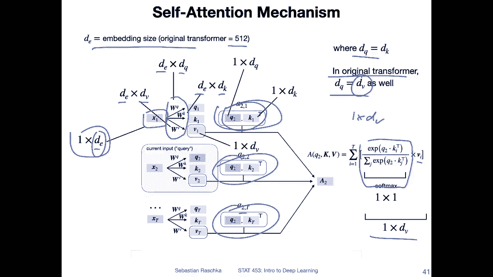

Here's an example。

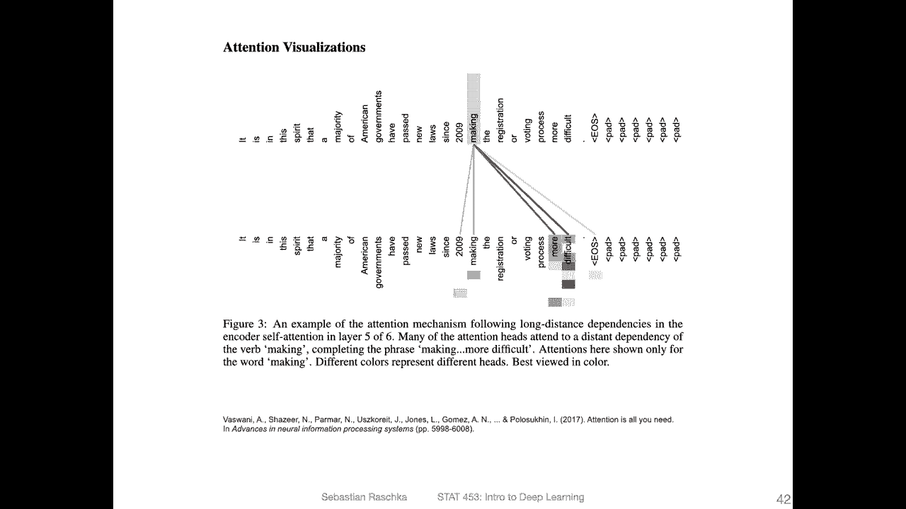

Of these attention visualizations。 So again， this one here is just for one。One word， right？

 So this is just for。The second word。 So it's the attention。Beto， for the second word。

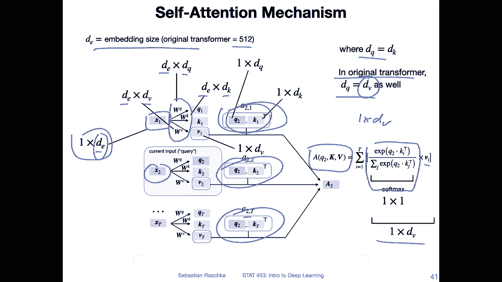

So the previous slide， we had。Looked at the second word as the input。 but of course。

 we have also other words in the input。 So we would repeat this whole process for every input element。

 So here on the left hand side。We consider the first word。 and here on the right hand side。

 we consider the last word， whereas here we consider the second word but。

This might be a misleading visualization。 It looks like there's a sequential part it。

 That's not true。 All of these can be computed。In parallel。

So we don't have to wait for one to finish before we can compute the next so these are all parallel computations。

 which is one nice aspect about these transformer models or the self attention mechanism in the transformer model。

And then so we get an attention aware embedding for each of the words。 And then these essentially。

 you can think of it as a matrix， now an attention matrix。Where each row corresponds to。

 yeah to the em bedding， attention and bedding for each word。So it should， if we have a T here。

 this should actually be。

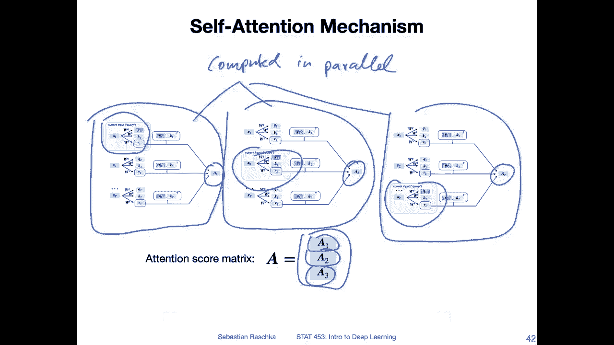

T。Okay。Yeah， and here is just like more like compact notation for that。 So now consider。

For the inputs， we represent the inputs as a T times the E dimensional matrix。

 where the is are embedding size again。 and T is the input sequence size。

So I'm just summarizing everything here in the center。 So now。

Instead of doing these steps individually here。Can just write this as one matrix multiplication。Soう。

We now have， let's say， the matrix Q。 So we instead of having Q1 here， Q1， Q1 and so forth。

 So these results， we can just summarize that as。A matrix at T times D Q dimensional matrix。

K times T times d and t times D B。 and then we can compute this attention matrix which is t times t dimensional matrix。

 So this is one， maybe one disadvantage of the self-at approach is that this is kind of large if you have a large input sequence because yeah。

 it's like a pairwise in a way， a pairwise similarity score here So it's n squared what t squared the big O of that。

 So it's not the most， I would say memory efficient approach。 but well。

At leastt we can compute things in parallel， so。We have now kindly a kind of slightly modified version of the dot product that I showed you before。

 We call that a scale dot product， which is because of this 1。 I will explain that at the next slide。

 I'm just focusing again on this whole thing here。 So now we have Q times。K as a matrix modification。

 Then we take the soft max。 So we have Q terms T。Q times k is the matrix modification。

 And we have this scaling here。 and we'll talk about it in the next slide set。

 and then we have the softm。And then we multiply by the matrix of V。

 So this is just the more compact form of what I've shown you on the previous slides。

 and then we will get this T times TV dimensional attention matrix。O。

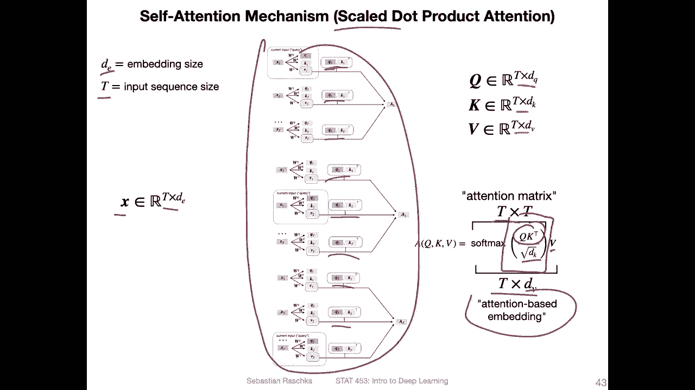

So what is this scaling factor here in the denominator。

 So this is just to prevent these individual dot products。 So if you do a matrix modification。

 you can also think of it as multiple dot products between these Q and k so。

To prevent these to become too large。We scale them because if you think of the softm function。

 If you have a very negative input to the softmax function， it will be 0。

 If you have a very large input， a very positive large input， it will be close to one in the softm。

Soう。In order to render a very sharp distribution of values in the softm。

 we have this scaling factor because if you maybe just think back of the logistic syigmoid。

 which is essentially similar to the softm。Except that soft mix incorporates all the other ones， but。

It's kind of like a s model thing。 If you have values close to 1， close to 0。

 there's like this saturation， right， So you want to prevent values from being too extreme。 I mean。

 the same concept This is， of course， not a softm， but the same。Concept applies to the softm。

 So by scaling， we prevent the softm from having a distribution that is too sharp。Yeah。

 and here just to our reference is the visualization of the scaled dot product extension from the attention is all you need paper。

 so here again they are justmarizing summarizing that visually。

 the matrix modification and the scaling here。Optional mask we will talk about the mask later when we talk about the transformer here in these steps there is no masks。

 so the transformer also consists of an encoder and a decoder and the decoder has a mask So here can actually ignore it and then we have the softm and then we have a matrix modification with B so this is essentially summarizing this one。

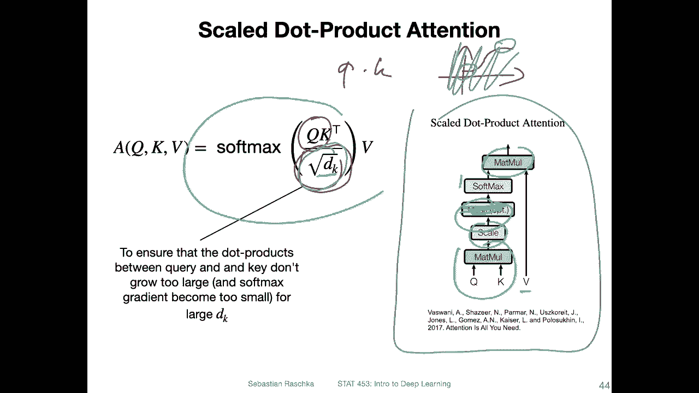

Okay， yeah。 okay。 This was self attention and the scared dot product attention。 In the next video。

 I will talk about the multi head attention。And then we will be one step closer to the transform model。

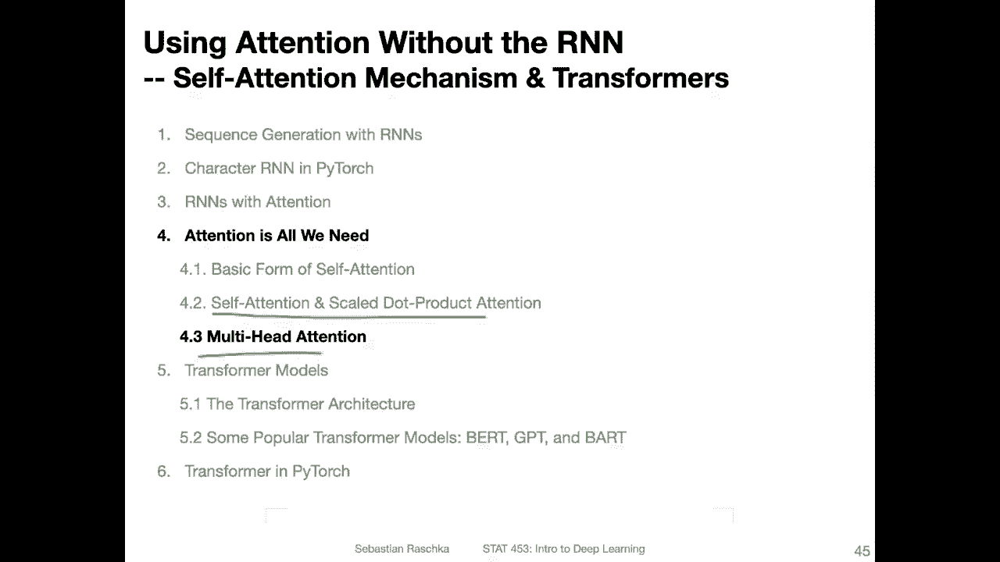