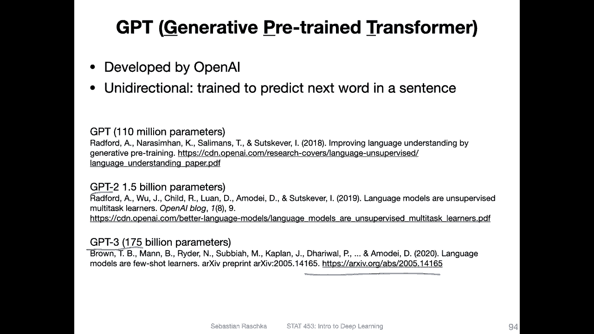
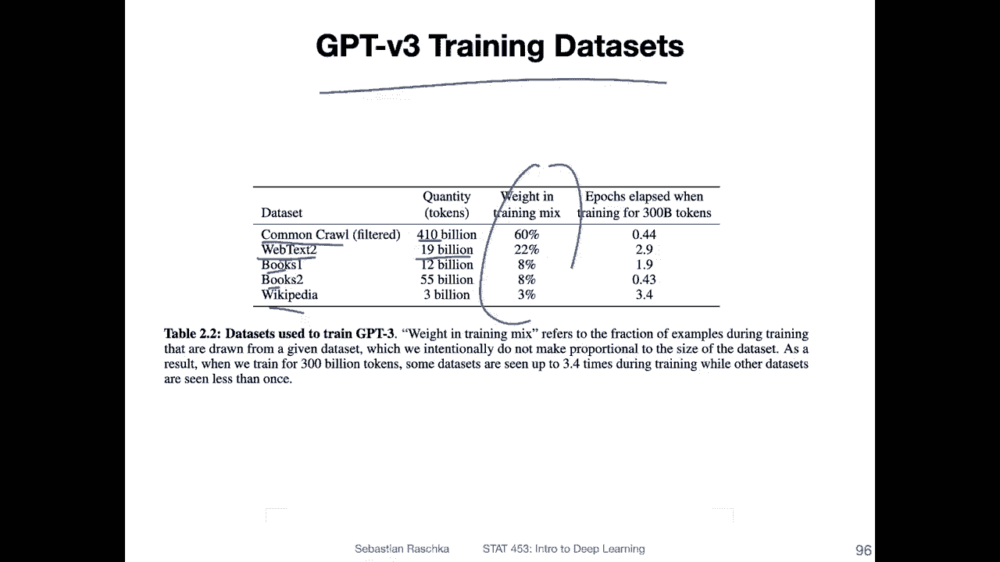
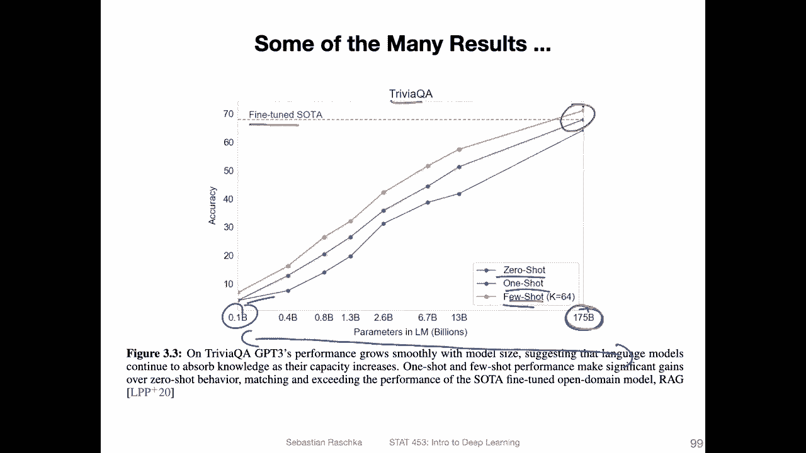
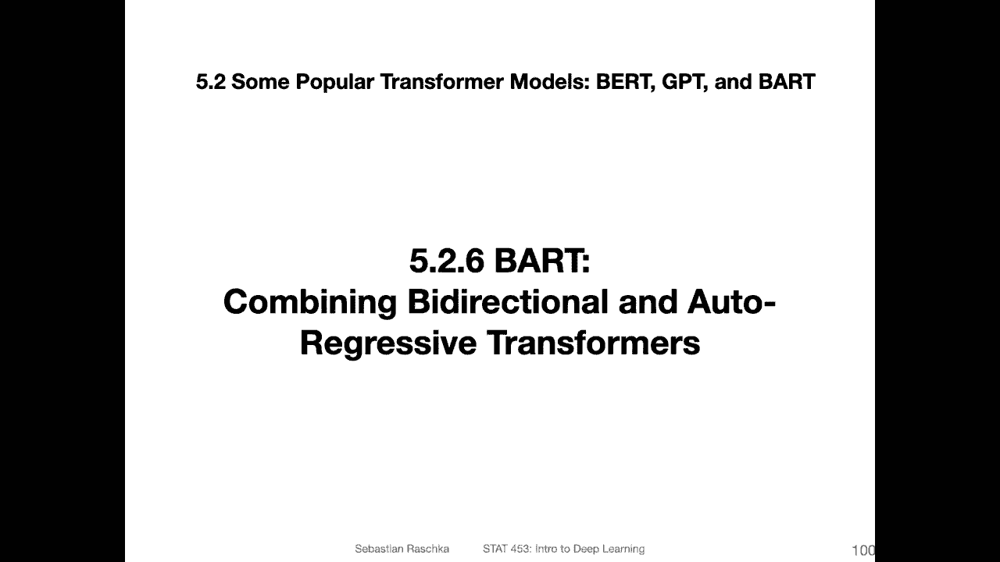
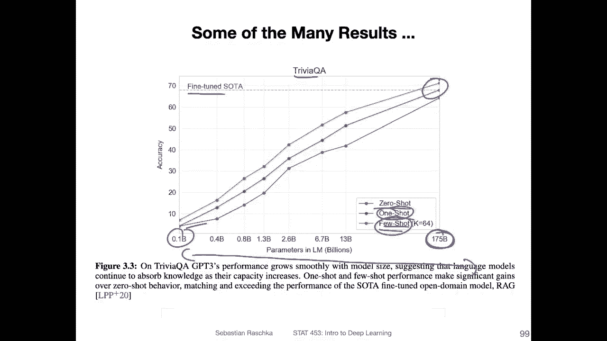
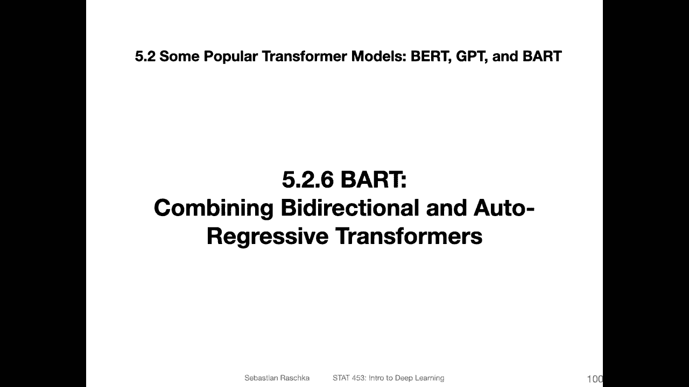

# P166：L19.5.2.5- GPT-v3：语言模型是少数据学习器(Few-Shot Learner) - ShowMeAI - BV1ub4y127jj

Yeah， since all good things come in threes， there's GT version3。

So this is the last model in this G saga。 So G3 is again， much larger than the previous model。

 So it's instead of 1。5 billion， it's now 175 billion parameters。

 And if you are again interested in more details。 There is the paper here on archive。 So again。

 in this video we will have only a very short summary and details， it can be found in this paper。

 It's actually a very long paper。 I think it was like 40 or 50 pages。 So have fun。

Okay。So the architecture overall is again overall similar to GPT version 2。

 but of course it's now much bigger， so there are also more layers and so forth。

 they also doubled the context size。 So instead of having 2024 input tokens they have now 2048 the word embeddings are also substantially larger so instead of 1。

6000 they now have approximately 12800。And they also to make things feasible computationally。

They used this attention pattern from this sparse transformer。

 Yeah because attention scales quadraically it's quite expensive。

 So they borrowed some concepts from a sparse transformer， which is。

 again something we won't go into much detail。 But here is the name of the paper if you want to read up on more details about this sparse transformer architecture。

Okay， so the data sets are also substantially larger。 So they had in the G version 2。

 if you recall this web text data consisting of。I think it was 8 million websites or documents。

 so they have now version 2 of that with 19 billion tokens。

 so they didn't say how many tokens were in web text ones， I'm not sure。How much bigger it is。

 but sounds big 19 billion。 They have an even bigger data set called Kom and crawl1 at 10 billion。

They have book data sets and they also still have that Wikipedia dataset set。Yeah。

 I just there some weighting how how much weight these data sets set in in the total training procedure。

Then this implicit task they running。 So they say essentially that when they are doing。

The unsupervised pre training， the self supervised learning here。 they call that the outer loop。

 So it's just the regular training。 And they make the argument that while they are doing that because of。

 yeah the rich information in these texts， implicitly， the model learns。

Or does this so called in context learning where it sees examples like this and so forth。

 So like spelling corrections and these types of things。 and yeah。

 there are these in context learning tasks。

Now， then。Again， they don't use any fine tuning similar to GP version 2。 So again in GPT version 1。

 they used fine tuning after the pretrain in GP version 2。

 they got rid of it and also in GP version 3， they don't use any fine tuning， however。

In GP version 2， they only use this zero shot transfer to provide context。 Now they。

 in addition to that， or they have one shot and few shot contexts where they at least provide some examples of the task to the model。

 So， for instance， in G version 2。A task in the zero shot transfer may look like this where you have the prompt or description。

 sorry the description translate English to French column。

 This is the input together you provide also the prompt as the input like cheese and then an arrow and then you should learn how to yet translate the word cheese into the French version which I by the way don't know。

In any case， So and then in this one shot one， they would at least provide one example。

 So they still have this task description， but also。As an example， they provide。

This translation from sea otter to， I don't even want to try to pronounce it because I know it would be ridiculous when I try because unfortunately。

 I don't speak French。But the point here is that they provide an example of what the model is attempting or should attempt to do。

 And then in few short， they provide multiple examples。 They say they provide as many examples as。

Can be fit into the context， and it's usually around 10 to 100 examples。So for instance， sea otter。

 peppermint， plush giraffe， and so forth。 And then this is the prompt for the model again。And again。

 here in in。Contrast the traditional fine tuning。For example， in G version 1， you would。 Yeah。

 you would provide examples， then do a gradient descent update。

 provide examples gradient descent update。 This would be。The century is supervised。Learning。

They don't do that in GT version 3， though。 they just use these contexts as input。

 and the model should figure out by itself what to do essentially。

And yeah， they found that providing more examples。It helpsps with model performance。

 So at the bottom here， that's the zero shot。And。X， the X axis here。 That's the number of parameters。

 So from small model to a large model。 And you can see consistently that one shot and few shot。

Is an improvement over  zero short。 So there's almost like a constant improvement。

 if you use multiple examples as input and you can see when you train a very large language model like this one here。

And have those few short examples， it can on a trivia question answering task。

 even outperform the previous state of the art， which is quite impressive because it it's not trained for question answering。

 it's essentially figuring it out by itself by looking at a few examples。

Okay， yeah。 and this was already G version 3。 So essentially。

 it was about making the lot model larger and also。

Providing these one shot and few short examples， in addition to0 shot。

Okay， so next。This is actually an older model。 It's from 2019， I think。

 but it's quite interesting because it combines both bird and GT concepts。

