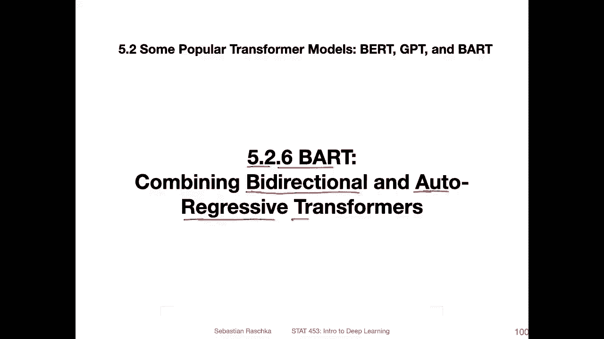
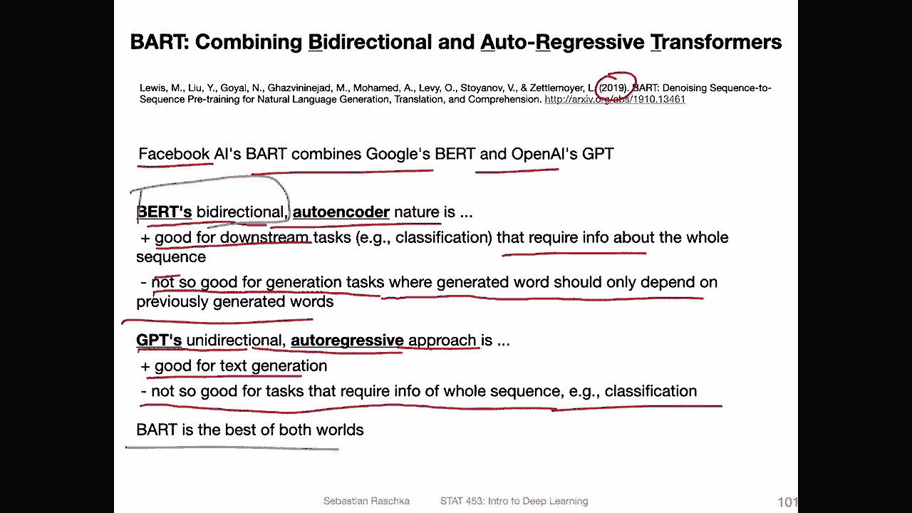
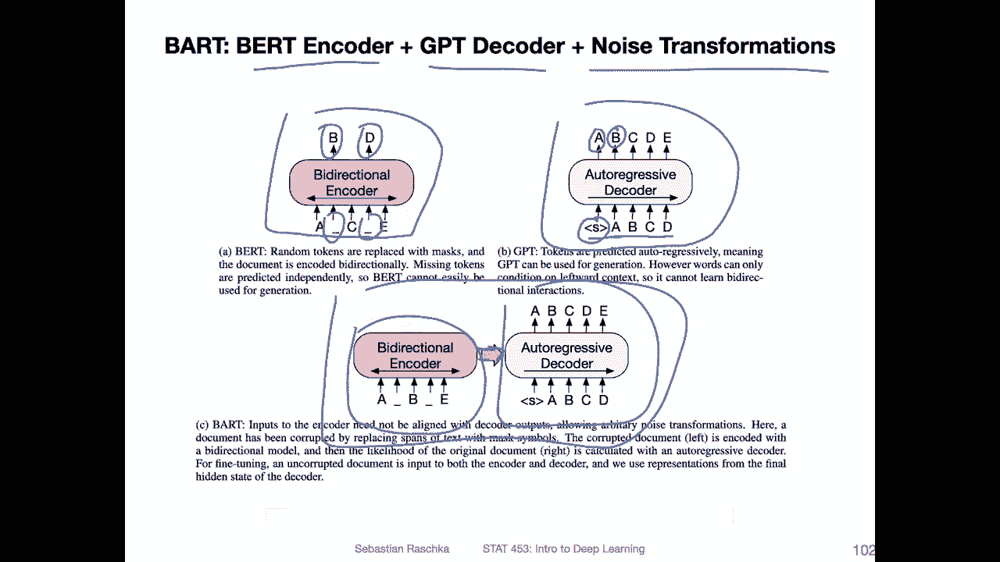
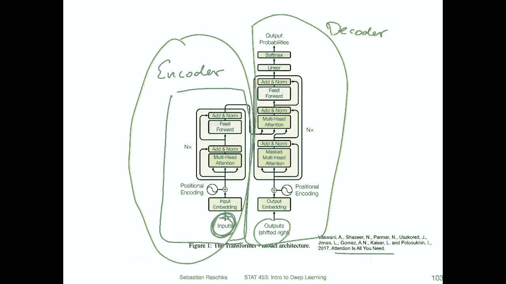
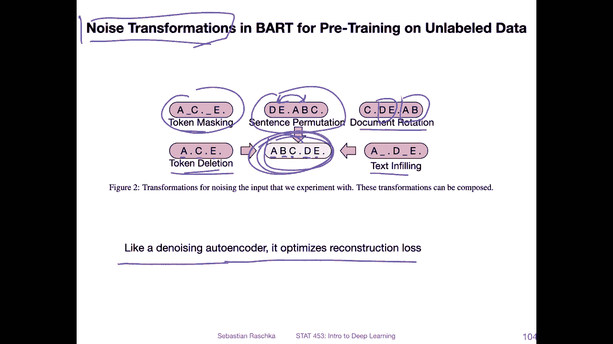
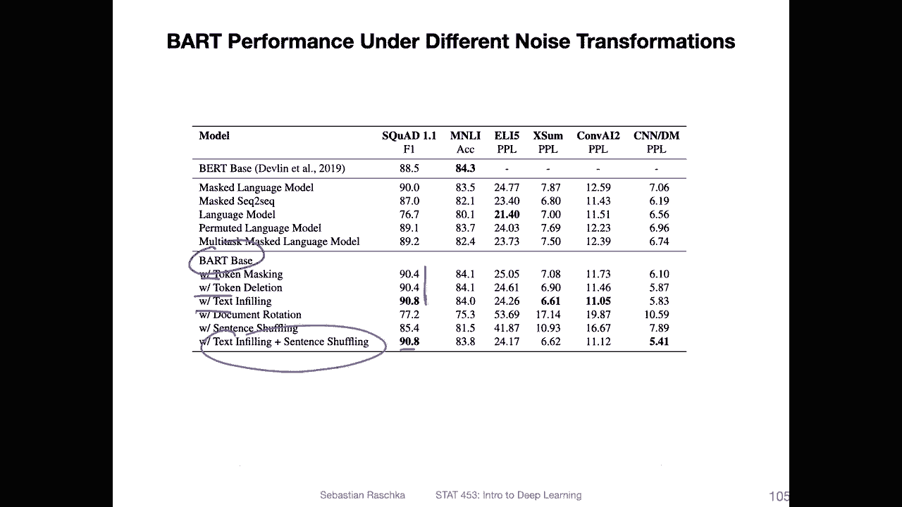
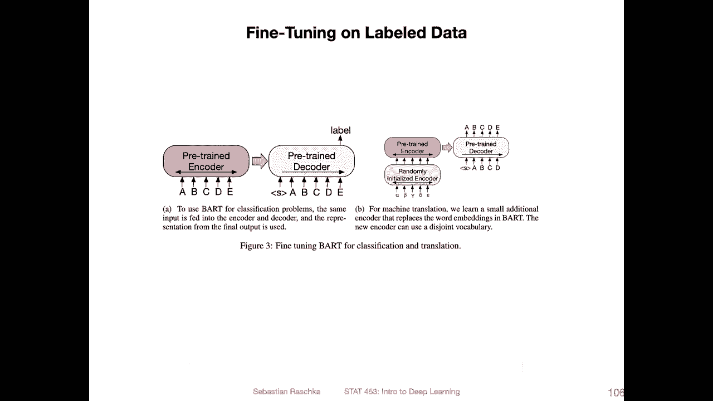
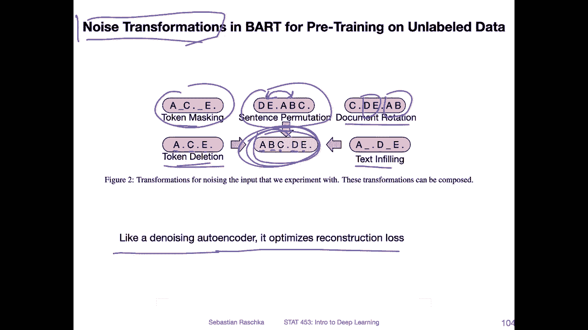
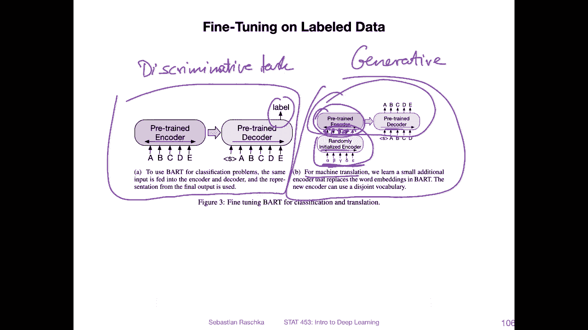
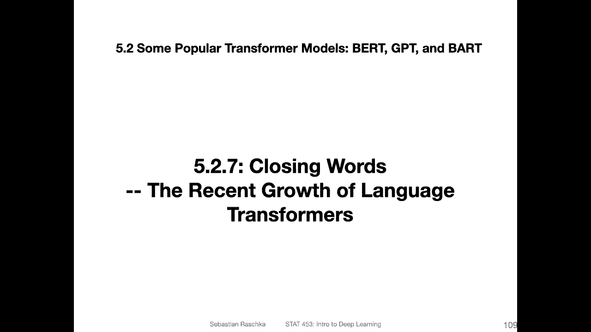

# P167：L19.5.2.6- BART- 结合双向和自回归transformer - ShowMeAI - BV1ub4y127jj

Yes， so there's virtually an endless number of language models。 Of course。

 we can't cover all of them。But yes， so one more， because that's an interesting one。

 It's called Bart。 And what's interesting about it is it is combining both the concepts from GT and Bt。

 So Bart stands for bidirectional and autoregressive transformers。

 So bidirectional for Bt and the autoregressive one for GT。 It's about combining those two。😊。

So the idea， I mean， this model is from 2019。 So of course， it's not， I would say。

 state of the art anymore in terms of performance， but I think the main idea is still interesting。

 So this is by Facebook， AI research combining both the Google bird and Openme I G and。

The argument or the thinking behind it is that birdss bidirectional nature， the auto encode nature。

 is good for downstream tasks like classification， which require information about the whole sentence so if you have classification tasks。

 for example，It's not necessary an advantage to， yeah， predict one word at a time。

 It's more about understanding the whole， the whole sentence at once， in a sense。

The downside of something like bird is， it's not so good for generation tasks， though。

 where the generated word should only depend on the previously generated word。 For instance。

 it's a question answering or something like that where you generate one word at a time。 So bird is。

So in in a nutshell， bird is better at classification， but not so good at generating things。

On the other hand， GP's Uniidirectional autoag approach is better for generating text。

 but then it's not so good at tasks that require the whole input sequence as input like classification。

And the argument here is that part is the best of both worlds because it combines both。No。

Bt directionional bidirectional encodeder and the GT Unidirectional decoder。

So here's a figure from the paper like illustrating that concept。

Bd is essentially a bird encoder plus GPT decoder， plus plus some additional noise transformations that they came up with。

Yes， so for reference， that's the bird model here， the bidirectional encoder。 So if you recall。

 it's about masking and。Yeah essentially masking tokens and the task is to predict what words or tokens go in there in these gaps。

 So these gaps recall they could be either masks or they could be random words or it could be the same word。

 but the task is that the model has to predict what goes in there。The G model。

It's essentially an decoder， so it's predicting the next words if you have the start of the sequence。

 the next token， let's say is an A。 And then for the token A， it should predict B and so forth。

 So it's predicting the input one at a time。And part is combining those two。

 So you have this bydirectional encoder on the left， which feeds into this autoregressive decoder。

And I'm not sure it's a couple of videos to go。 But if you think about this。

 this should maybe remind you of something。 So it has been quite some time ago。

 but it's essentially what they are doing here。

My opinion， this is essentially reconstructing the original transformer model， right。

 because you also have in the original transformer model。

 So this is from the attentions all you need paper。 You also have this。

En quarter where you have the whole Texas input。 And then you have this。Deder here， where you have。

Everything shifted by one position， so you predict the next work。Of course。

 it's not identical to Bart， but because in Bart， they have， in addition to that。addition here。

 they have like this noise transformation。 So here this is essentially an end quarter。

 but is more like a denoising auto encoder concept。It's essentially an the concept is very similar。

 if you think back of the lecture on denoing out ends。

 you essentially perturb this one and try to reconstruct back the original one。

So here is an example of these different noise transformations they have。 So that's from the paper。

 So they have。A task。 So for， for example， if this is the original， So this is。ABC。

 let's say these are tokens and these D and E are second sentence also tokens， So they have。

 for example， token masking that's similar to Bt， they also have sentence promoting where they yeah permute these sentences so they permute one and two they have document rotation So I think in this way what do they do here。

Yeah， they rearrange things or sentence one and two go together token sorry。

 they make new sentences essentially here。 I think also it could mean that they are rearranging all parts of the document。

They have token deletion。 So going from A， B C， Now they only have a， C and E， so they delete it。

B And D and text in filling where the yeah， model， essentially this looks。Similar。To talkken masking。

 So I'm honestly not。Quite sure what the。Differences。

 it looks like combination between token masking and token lesion。 In any case。

 they say they have different。Methods here， different methods for。

We are having noise transformation and the task is to reconstruct back the original input。

It's similar， like。The noise in out encode where you optimize the reconstruction is where you want to reconstruct back the original。

So here are some， yeah， studies on the performance of these noise transformations。

 So we have the base model here。And then with token masking， with token deletion。

 with text and filling， now you can see。So they only try one noise transformation at a time。

 And you can see they。Perform almost equally well。 like get really good performance with only having one or two。

 Yeah， in this case， two of these methods combined。

嗯。Yeah， so for fine tu。 So this is pre training。 So the pre training is for。

Doing these noise transformations and then reconstructing the input。

 And now for the fine tuning for the multi for the multiple downstream tasks。

They have these two setups。 So， for instance， on the left hand side， this is for classification。

 So here you would essentially。Predict a label。 And for。Tasks， so this is like a。Clraification。

 or they call it。Discimminative。Task。And here， this is what be a generative task because it's a generating text。

So this would be， in this case， language translation or machine translation。

 It's just a word for having a computer doing language translation。

 And here they have to have a small modification。 So this is the original。Partt model。

 where they have the pre trained encodeder， pretrain decoder。 And for language translation。

 they add another。Randomly initialized end quarter that is then fine tuned。 So instead of。

Feeding the original word embeddings to the encoder， they feed。

The word embeddings to the additional encoder， and this puts out。

Ebeddings that then go into this pretrained and quarter。

Yeah， and this model performs pretty well。 So here are performances for discriminative tasks。

 like classification tasks。And。They perform almost as well。 in in these cases， they perform best。

 So the bolt numbers are the best。 in this one。 also， in some cases， other methods are better。

But they are very competitive。 So Roberta is a type of bird model that is。

 I think it's larger than Bt。 It's a very large model。

 Another model that we probably don't cannot discuss in this lecture because yeah。

Just too many things to discuss， but yeah， it's another bird type model。

 there are plenty of them out there。And the argument here is that part。

 even though it has this unidirectal nature with a GT。

 it can still perform competitively with be models that are only。By direction。

 So they are arguing that the barRT model， even though it is also yeah having this unidirectional autoregressive decoder is still good for discreative tasks。

 But then in addition to discreminative tasks， it's also good at generative tasks。

 which is something that bird models would， for example， not be able to do all good at。

So here they actually perform best they reach the state of the art。

Compared to some specialized bird models。Yeah。So more。More tasks here。

 So this is for Eli 5 abstractive question answering。 This is for conversational response generation。

And this is text summarization。Alright。 so this was the part model and the best of both worlds combining B and G。

 So last and the last video about。

These popular transform models， let me say a few additional things。

