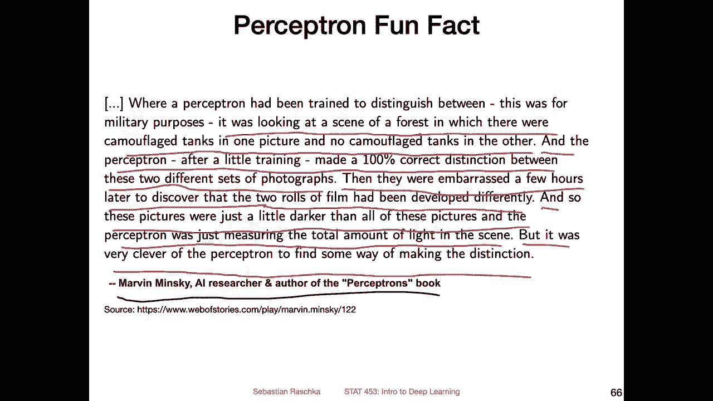
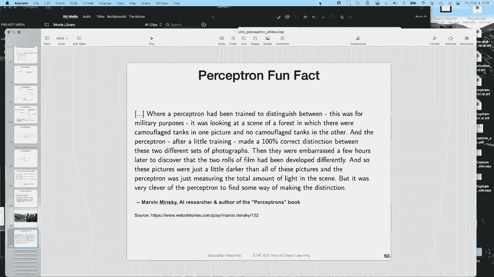

# P24：L3.5- 感知器背后的几何直觉 - ShowMeAI - BV1ub4y127jj

Yeah， as the last video for this week， I want to briefly talk about the geometric intuition behind the perceptron。

 So this is， I think， particularly interesting because the perceptron rule is so simple。 And yeah。

 here we will briefly go over why it actually works at all。So if you recall。

 this is the perceptual learning algorithm。The slide is just copied from again earlier video。

 So it's just for recapping what's going on。 So if the prediction is correct。

 nothing happens so we don't need to update the decision boundary。 However， if it's incorrect。

 there are two scenarios， scenario A and scenario B。 So scenario A is if the output。

 the prediction is 0 classable 0， while the target is classable1。

And scenario B is if the prediction is one and the class label， the actual one is 0。

 So in both cases， we make a mistake， and then we have to update the perceptron。

 So in the first case in this case， how we update the decision boundary is by。Eing。

The input vector so the feature vector to the weight vector。

 So why do we have to add the input vector to the weight vector and why does it help at all？

 So in this video， I want to briefly go over the intuition behind that。

So here also yeah encode just again the outline of the learning algorithm if it's more cleared this way。

 so we initialize the weights with all zeros or we can also use all small random numbers doesn't really matter and then for every training at we iterate over the training examples and then we compute the prediction and then yeah update if we make a mistake so here we compute thearrow and then update so that is the basic concept behind the perceptionceptron that we talked about before。

Now regarding the geometric intuition， so imagine you have these two classes here on class 0 and class 1。

 and here that's the black line here is the decision boundary。

So the weight vector turns out to be perpendicular to the decision boundary。 Can you think of， yeah。

 the reason why the weight vector would be perpendicular to the decision boundary。

 So perpendicular here means 90 degree angle。 Why is there a 19 degree angle between the weight vector and the decision boundary。

 maybe pass the video for a few minutes and think about it a little bit。

 Maybe you yeah get the idea if not it don't worry it's a little bit。

 I would say it's not immediately obvious。Alright， so the intuition behind it is why the decision boundary in the weight vector have this 90 degree angle is because if you think of our threshold if we。

Compute or look at the dot product。 Let's ignore the bias for now。

 if we just look at the dot product of the weights and the feature vector， we make a decision。It 0。

 So whether it's greater or smaller than 0。So if it's small or equal to 0， the net input so。嗯。

They didn't put it。If it's smaller or equal to 0， we predict or return classable 1。

 If it's greater than 0， we return 1。 So everything kind of hinges upon the0 here。

 And if we write the dot product a little bit differently as the length。

Or magnitudes of the two vectors。And then the angle between them， the cosine of the angle。

 and we have the following equation you probably have seen that from bienia algebra classes so。

In order。So in order now to have the stock product0。 like if we want to have it 0。 Yeah。

 what we would have is to have at least。One of these two terms0。 But this is not the case， right。

 because， yeah， the vector is not 0 unless it's all， values are 0， but。Yeah， so in this case。

 that would be one scenario where we might have a case of0。

 another case is where the decision boundary。So， the。

Angle here between the weight vector and the decision boundary。

 When this term here becomes 0 and when is this term 0， the term is a 0。

 If we have a 90 degree angle here between the two， right， because the cosine。Of 90 degree is 0。

 So by setting this part here this part to 0， we get a weight vector that actually has some length。

And that has then angle between the decision boundary and the weight vector of 90 degree。Yes。

 so what else does that mean， So if we think about。The 90 degrees a little bit more。

 So what we can deduce then is that there will be an。Angle， smaller than 90 degree on this。

Site here of the decision boundary， so。By that， I mean if you have a training example or a data point that is somewhere yeah on the right side of the decision boundary。

 let's say it can be here。So if we have a feature vector that is here， can also be。

Here doesn't really matter。 So anywhere where we have a decision。Yes， so what else does this mean。

 So let's focus in a little bit more on the 90 degrees here that we just talked about。

 So now every input vector on this side here on the right hand side will have an angle with a weight vector that is smaller than 90 degrees。

 So again， in blue， this is still。Wait。😔，Viectctor here。

And now if I take a training example and put it anywhere on the right side of the decision boundary。

 for example here， So if we look at this one， it has this angle that is smaller than 90 degree。

 if we put it here， same thing is true。 or if we put it here outside。

 maybe it doesn't really matter Also， we have always this 90 degree angle。 And also。

 you note that it doesn't really matter how large the weight vector is if we scale the late weight vector by a vector of 100 or 1000。

 it doesn't matter， it will be。Still then the angle。

 because whether this is longer or not doesn't really matter。

 the same is true for the training examples。 if they are super large。

 if let's say one training example is somewhere here。It's still a 90 degree angle or smaller， sorry。

 smaller than 90 degree angle。 So the magnitudes of the weights and features doesn't really matter whether we scale them or not。

 however。The updating the learning can be a little bit faster if they are scaled。

Which is why I had the standardization in in the code example。 But yeah。

 so there's one takeaway that the angle is smaller than 90 degree on this side。

 And on the left side here， it would be of course， yeah greater than 90 degree if we have a value here。

 that would be greater than 90 degree。 So everything again hinges upon the 90 degrees here。Now。

 why is that again interesting， So let's now focus on the actual prediction case before I just laid out where。

 yeah， how the data set and the weight vector are oriented。 Now。

 let's take a look at a prediction case。 So we have a correct side and a wrong side， so。

Let's assume we have an input vector with class table 1。And like I've shown you before。

 a weight vector for the correct prediction must be somewhere such that the angle is smaller than 90 degrees to make a correct prediction。

 Let me go back to just show you again what I mean， so。Notice here we have all the ones on this side。

 and this is our。Weight vector here。 So to make a correct prediction that is predicting a new training example like this one as class 1。

 it has to be smaller than 90 degree。 It has to be in within the circle here right。

 so that's what we are looking at now。 So we have here on this correct side。

 So if you think of this as the decision boundary between the wrong and the correct side。

 we have to have an angle between the input vector and the weight vector that is smaller than 90 degrees。

So if we are within the 90 degrees， yeah， then we make a correct prediction because the dot product then will be positive greater than0 because。

Yeah， because this term will be greater than0。Yeah。

 now let's take a look at what happens if we make a wrong prediction。So here in red。

 I have now a weight vector that is not ideal。 so that is a weight vector where when we make a prediction。

 where we make a wrong prediction because。The angle is not smaller than 90 degrees。 It's， in fact。

 larger than 90 degrees now。 So if it's between a value between。Larger than 90 up to 270。

 we will make a wrong prediction because now the value and the cosine of that angle larger than 90 and smaller than 270 would be negative。

So we would be smaller than0。 so we would make class  zero prediction， which is what happens here。

So we have an angle that is greater than 190 degrees。

 and then we would predict the wrong label we would predict。Class level 0。

 although input vector here。We assume that it still has class A1。How do we make this correct， then。

 How can we correct this prediction That is by moving the weight vector to the side of yeah。

 closer to the。side of the training example so that the angle is smaller than 90 degree。

 So how do we do that， So in the perceptionron algorithm。

 how we do that is we add the feature vector。 So the input vector we added。To the weight back。

So here the dash line here， that is。The input vector。So here that's the same input vector。

 I'm just taking the input vector and adding it to my weight vector。 So maybe doing it step by step。

 So what we have is we have our input vector and we have our wrong weight vector。

 What I'm going to do now is I'm taking。This input vector。 And I'm adding it to the weight vector。

Like this。 And then my new。W directoror will be like this， right。

 So then we will have this smaller than 90 degree angle， which is shown here。

 So by adding the weight vector， we can yeah make the decision boundary， correct for this case。

So this is， if I go back here， this is exactly what happens in scenario a。

 So we predict the output is 0， although the target is one。 So this is when we。If I go back here。

 that is what we have。 We have a label of one， and then we predict 0 because we are on the right wrong side here。

What we do is then we add the input vector to the weight vector。

 which is what I've shown you in the previous slide and by that we can correct the decision boundary and here if you want or likely you can also play through the same scenario if the prediction and the targets are flipped so the same concept applies there too。

Yeah， to summarize the perceptron has many shortcomings。

 So there are many problems with a perceptron， which is why it's not commonly used anymore in practice。

 Some people still may use it in certain applications where computational performance matters because one advantage of the perceptron is it's very simple to implement and yeah very fast。

 However， yeah， nowadays， many problems that we have in the real world cannot be solved by this perceptron。

 which is why we have yeah fancy deep learning methods。

 So let me go over the shortcomings of the perceptron。So first of all， it's a linear classifier。

 so you cannot have nonlinear decision boundaries if you think back of the XO problem。

 it cannot solve the XO problem orifier。For example。

 just have a another simple problem where we have two classes like。Like this， for example。

 class0 and class。One like this。Around it。 So if we have these concentric circles。

 the perceptionron cannot classify these very well because it can only do a linear decision boundary like this or like this。

 And that is not helpful what we need is we have， we need a non nonlinear decision boundary like。

This， for example。So that is one shortcoming Another shortcoming is that it is a binary classifier so it can only classify two classes。

 but yeah of course there are also extensions where you can use multiple perceptrons There's a method called one versus rest or one versus all or one versus one So actually two methods that I can just write them down one。

Rersus， rest。 Sometimes it's also called one roses， all。Where you can just use multiple perceptrons。

Or multiple binary classifiers。 And one is called one versusus1。To have multi class classification。嗯。

Yeah， but it is like one single perceptron cannot do multi class classification because it's just returning either a 0 and a one。

Another shortcoming is it does not converge if classes are not linearly separable。

 So what does that mean So that is exactly the problem related to yeah the convergence theorem that we have not covered。

 but in the convergence theorem itself it only converges if the classes are linearly separable to let me draw that out also。

 So if we have a case。Again， like， let's say like this。It will find a decision boundary like this。

 however， if I have a data point over here， then there is no decision boundary such that I can classify everything correctly so it will learn let's say this decision boundary but then it encounters this data point so if we keep iterating and then it thinks okay I have to move the decision boundary further to the right like here but then it gets these examples wrong so then it thinks okay I have to move it back to the left so it will keep on moving the decision boundary back and forth and it will never really stop updating。

So in that case， that is also a problem。 if you want to have the final model。 I， it's fluctuating。

 It's like， the longer you run the algorithm， the yeah， the more solutions you will get。

 So it will never really finish updating。嗯。Yeah， and then also。

Another thing is there are multiple solutions possible if。The classes are separable。

 So now let's assume you have a problem that is。Let me do is a little prettier。

 Let's say no you have a problem where you can linearly separate these classes， let's say。Like this。

 So one possible decision boundary is like this。 Another one is like this。 One is like this。

 So there are multiple solutions， and it depends on， yeah， where you start with your weight。

 Which one is the best one or which one is picked by the perceptioncept one before it stops updating。

 And yeah， this is also kind of annoying or can be annoying。

 There are multiple solutions So that I would say there is a best one。

 The best one might be the one that is just in the center。Rather than something that fits， let's say。

 the data very closely here to the left or very closely to the right。

 because one might argue that putting the decision boundary in the center helps with reducing overfitting。

 for example。But yeah， that is also something the perceptioncept is not capable of。 And， and yeah。

 later lectures， the methods we will be using， they are a little bit better with that。Allright。

 so that is just the other conclusions regarding the perceptionceptron， like one last thing。

 like a little fun fact。So yeah， back in the day， the perceptron was used or people tried to use it to detect tanks and photographs。

So here on the left hand side， there would be tank。 and here there would be no tank。 and they used。

 yeah， the perceptron on images to classify whether there is a tank in the photograph or not。

 However， like we just said， the perceptron is very limited。 So why would that work at all。

 People found that it worked， But there was like a little gotcha。

 a little mistake or conceptual mistake。So because people didn't first think about it very well。

 So what happened was that all the forest pictures were darker than the pictures with the tanks。

 And the perceptron simply， yeah， recognized that darker photographs means no tank and brighter photographs means tank。

 Of course， it had no idea whether there was actually a tank or not。

 So if you would have a dark photograph with a tank。 It would， of course， get that wrong。 Yeah。

 and this was like a little fun fact about the perceptionceptron。

 I got that from this interview with Marvin Minsky， who was。

One of the authors of this perceptron book I mentioned where they kind of。

 yeah said bad things about that perceptron that it was limited。

 So here is like a little excerpt from this interview。So， it's basically。嗯。

It was looking for a scene at a scene of a forest in which there were camouflage tanks in one picture and no camouflage tanks in the other picture。

And the perceptron， after a little training made 100% corrected distinctions between these two different sets of photographs。

Then they were embarrassed a few hours later to discover that the two rolls of film had been developed differently。

 And so these pictures were just a little darker than all of the pictures。

 and the perception was just measuring the total amount of light in the scene。

 So it was just counting the pixel values。The pixel brightnesses。

But it was very clever of the perceptionceptron to find some way of making this distinction。 Yeah。

 I think I would admit that it was actually kind of exploiting the fact that photographs were brighter and darker。

 but of course， it had nothing to do with whether there was a tank in the picture or not。

 it was just how they developed the film。 All right， with that， I want to end this lecture。

 which was a little bit long。 I will in the future try to keep that chart。

 But I didn't want to split this topic over two weeks。 So in the next week。

 we will cover some basic linear algebra。 I mean， just some ground rules that we will be using。

 And then hopefully also slowly get into implementing more sophisticated methods in patrontorch。

