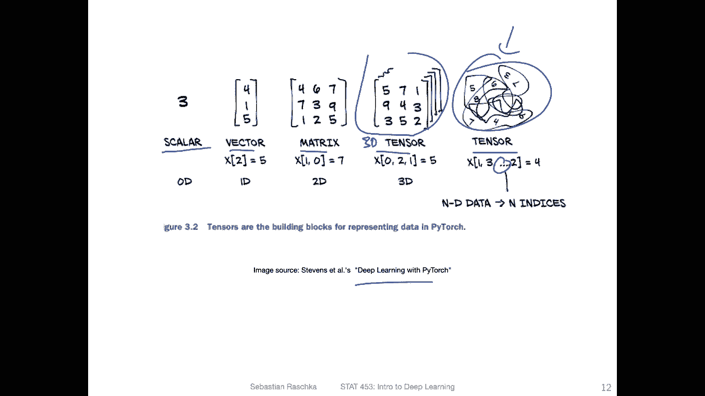
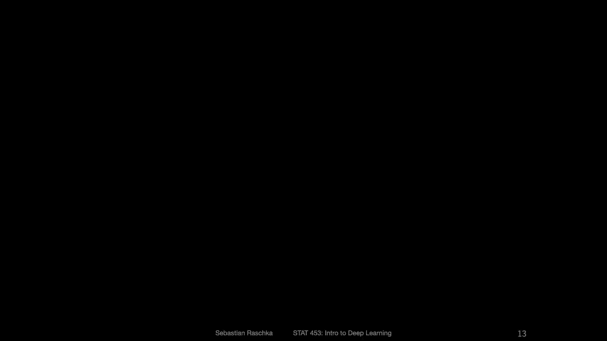
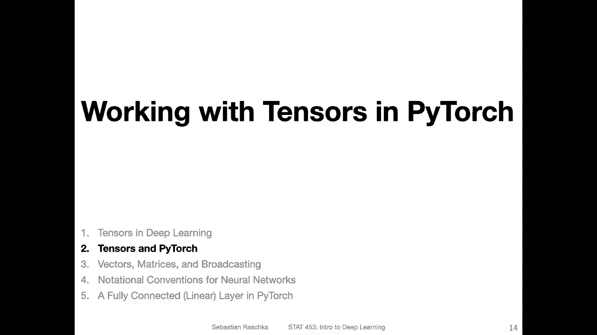

# P27：L4.1- 深度学习中的张量 - ShowMeAI - BV1ub4y127jj

Yeah， let's start by defining the term tensa and how it is used in the context of deep learning。

So yeah tensor， a tensor is a generalization of the concept of a vector matrix and scalar and so forth。

 so for example here's a scalar， a scalar is also you can think of it as a rank zero tensor。

And an example of a scalar would be， for example， a real number。 So it could be us an integer。

 for example， so but yeah， in the context of deep learning。

 we will usually work with real numbers most of the time。

Except maybe for the class labels where we have integers。So here， for example。

 that would be a scalar， a single value like 1。23。And。A vector would be a rank 1 tensor。

 so you can see we're adding a dimension to it。 vector is a rank1 tensor。

 and a matrix would be then a rank 2 tensor。So， vector。Is yeah。

 vector is like you can think of it as a data container with n values in it。

So that is usually something you would find in a linear algebra book， however。

 in our context here in machine learning and deep learning concepts contexts。

 we usually think of vectors as n times one dimensional， so it's still。Yeah。

 written the same way as you would find it in a linear algebra book If。

 if you would write it like follows where you have n elements，12 up to n。However。

 we will yeah assume there is another dimension there。

 it's just one so there's one other dimension with no values in there。So it's essentially a very。

 you can think of it as a very slim matrix， a matrix with only one column。

 and that is because yeah for certain computations for convenience。Yeah， and usually by default。

 I will denote the vector as a column vector。 However， when I write a transpose。

 we will also sometimes use row vectors。 So it's basically just a vector transposed。

 which is now a one times n dimensional vector。So yeah， regarding the matrix。

 here's a n times n dimensional matrix。So M is the number of rows。

And N is here the number of columns。So that is just a yeah general layout。 So if n was one。

Then we would have just this first column here。 and you can then ignore this one。

 This would be then column vector， like shown on the left hand side here。

This is just yet to lay the groundwork into the notation but the vector the matrix and the scalar R and how that relates to the concept of a tensor。

Now， in the context of deep learning and machine learning。

 we usually use for the data socalled design matrices。 that's a yeah common convention。

 If we use the letter X， then we usually refer to a design matrix。

 which is n times M dimensional matrix， So on the previous slide what I was writing on the previous slide was。

M times n dimensional。 This is just something you would find a linear algebra textbook。 The。

 the letters here M and N don't matter really。 But there is a convention in machine learning and deep learning that most of the people。

Use。And for the。Datail set。Size in terms of the number。Of training。Examples。And M is the number。

Of features。 So this is why I'm writing it as n times M。 but it's also not super important。

 It's just， just a convention。 And then like I yeah already talked about in the very first lecture。

 we will be using。The subscript for， yet， the features。So， that's the feature。Index and。

Here the superscript， that would be the training。Data point index or training example index。

Sa call it training。Example。Index。So if we have n training examples。

 then we would have the indices one to up to n。And here we would have up to M features， for example。

 in the iris。Data said， we would have。150。Training examples or data points and four features。

 So this would be。M， and this would be in。Yes， on the previous slide， we have seen。

Rank0 tensors and called them scales。 And we had for rank 1 tensus the word。Vectto。

 and for rank twotensils， we had the word。Matrix， no， for a rank3 tens or how should we call it。

 Unfortunately， there is no special word for that。 So usually to if we call you refer to a rank 3 tensor。

 we use the word。3D tensor or sometimes or often even just tensor and without the 3D here in front of it。

 So yeah。What is a 3D ten then A 3D ten you can think of it as a stack of matrices。

 So if each of the boxes here。Represents。A matrix， a rank 2 tensor。

 then a 3D tensor would be in the context of deep learning。Yeah。

 like you can think of that like a stack of matrices。

 So multiple of these matrices stacked on top of each other。 For example， here。

 this would be a stack of P matrices。 and each of the matrices here is n times n dimensional， so。

Here we have n times n dimensional matrices and we have P of such matrices here。

 And note here the M and N， they are really arbitrary。

 they don't refer to the features and training examples here。 These are just some arbitrary letters。

 I was just using M and P because they are commonly used。

 but here yeah don't don't think of them as training examples of features They are just generic terms here or letters。

So in practice， where we encounter these 3D1 as indeed deep learning is， for example。

 when we work with image data， so you can think of a single image here like the CAd。S 3D Tson。

Where we have， for example， three color channels， the color channels R for red。

 G for green and B for blue， and each of these color channels consists of pixel values， for example。

 could be a 100 times 100 matrix containing the pixel values for each of the color channels。

 and combined they are basically a 3D tensor。And that would be yeah a case where we encounter a 3D ten so when we work。

Yeah， with image data and deep learning。However， it doesn't stop there with 3D tensors and practice actually we work with 4D tensors in deep learning because we have a training set consisting of multiple of such 3D images。

 So you can think of the4D tensor here if I go back as a stack of multiple of these 3D tensors basically So stacking multiple of these。

 So here on the right hand side is just an example of the Cypher 10 data set。

 So each each of these is an RGB。3D tenon。Yeah， and then also regarding the dimensionality。

Usually in deep learning， we have the dimensionality of these for d tensors as N HW。

 where N is the number of training examples。Then。C is the number of colour channels。 For example。

3 in the case of RGB。 So this is the。Color channels。And then。H is the。Height of the image。And W is。

With， so in that way。On these last three dimensions here， there are basic our features M。

 So in this case we have C times H types W features and n is still on our training examples。

 So if we don't use deep learning we would reshape that we would reshape that into a matrix design matrix。

 which was n times M dimensional where M is really C times H times W。Alright， so but yeah。

 we are not working with colour images yet。 That would be something when we encounter convolution networks where we talk about this。

 but I also plan to， yeah to use a simpler model with colour images where we explore and also this this reshaping so but don't worry about it yet。

Also， yeah， one more thing I wanted to say about tensos。

 you probably heard about the tool tensorflow。So Tensorflow has the name， tensor in it。

 and here in the context of these tools like tensorflow or nuy and Pytorch。

 the tensas really refer to the concept of a multidimensional array。So like a multidimensional array。

 you can think of it as a data structure or a computational data structure for storing or representing a tensel。

So in mathematics we say tensor， but in practice when we do coding。

 these are essentially multidimensional arrays。And。It， it just happens in tensor flour。

 These multidisional arrays are called tensor in Ny。 They are called N D。Aray where in D array。

S for n dimensional array， like multidimensional n dimensionional and in pyr。

 they are also called tensor， but they are essentially all the same thing。So here is just an example。

 so here I'm creating when porting torch， creating a tensil and this tensor is 2 by3 matrix。

 So two rows， three oops three columns。 So this is really a two by three matrix。And then here。

 what I'm doing is I'm using T dot shape。 And notice in numpy， there's also a T dot shape。

 You probably know that。 And this gives you the yeah dimensions of。

The multi dimensional array or tensor。 So you can see here 2 and 3， This is。The dimensionality， or。

 in fact， it's the numbers of numbers of values in each dimension。

 So this would be a two dimensional array because there are two dimensions。

 There's a row and a column dimension。So， this would be。First。And the second。Dimenssion。

So the number of indices and shape would be the number of dimensions。 and also conveniently。

 you can also call endm， which stands for yeah the number of dimensions。 and it will also return to2。

 so。Enom is essentially the same as calling length。 sorry， L in Python L on T dot shape。

So it'ss just a shortcut for doing that。 So yeah I just wanted to briefly highlight tenrs in the context of Py towards tensorflow are the same as multidimensional arrays and nuy that's really the same concept。

Yeah， and here is also just a nice summary from the deep Bing with Pytorrch book where all the terms are here at one glance。

 Scalar vector matrix， tensor， so in this case， 3D tensso。And here a higher dimensional tensor。

 So n dimensional tensor if。Yeah， so in this case， you。

 you actually don't know how many dimensions could be arbitrary。

 So it's also just making fun of it that this is something we can't visualize in our head anymore because。

 yeah， as humans， we can only really think of three dimensions with a fourth dimension that becomes all。

 yeah， some gobblelyguook here。 And yeah， this is just a short summary here of what we just discussed in the previous slides。

 and in the。

Next video， I want to briefly talk about。Or more about tensors and Pythr。

 So if this was just a little bit short， yeah， I will talk more about this in the next video。

