# P36：L5.4- (选修)微积分复习 1- 导数 - ShowMeAI - BV1ub4y127jj

Yes， in the next two videos， I want to give you a brief calculus refresher if you need it。

 So that's optional。 You don't have to watch the next two videos。

 If you are very familiar with calculus， it will be， I think， too trivial for you。 But if you don't。

 if you。Yes， so in the next two videos I want to give you a brief calculus refresher talking about derivatives and gradients。

 and like I said these videos are optional， So if you are very familiar with calculus。

 then I think this might be too easy for you。 but for those who are yeah you want to refresh their calculus。

 this is like a brief summary of the main parts that we will need for the gradient descent algorithm。

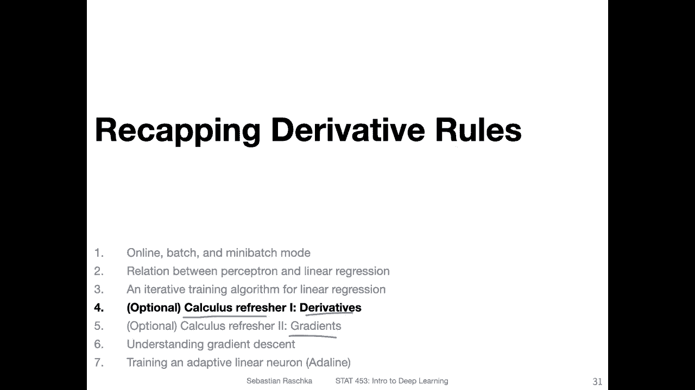

Yeah， so here is an overview of what a derivative is。 So a derivative of a function。

 you can think of it as the rate of change of that function or the so-called slope。

 So you have a very simple example， a function F which is equal to 2 x。

 So if we have an input let's pick an arbitrary number here on the x axiss。

 So if I have the number3 here。So。The input is 3。Then the output would be2 times x or2 times a in this case。

2 times 3， that would be 6， so the output would be 6。Now let's pick a second point。

Yeah move on the X X by Delta a units。 So then we arrive at。This point here。

 So if I look at these values， let's move by four points and we arrive by at 7 here。

 And then the output corresponding to that would be two times the output would be。14。So yeah。

 there is between these two points。 there is a change。Here， going on， the change is。From 6 to 14。

 So this is by。8 units。And the change on the x axis is from 3 to 7， it's only。F units。

 so we can then compute the rate of change or the slope by having this8 divided by 4 equal to 2。

 So the slope of this function of 2 x is2。 So almost more formally heres the equation how we can compute the slope so we pick the function on the right hand side。

 So this is the input on the right hand side here。And then this is the input here on the left hand side。

 and let me use a different color。And of course， then the output here。

 this is corresponding to this one and the output of this one is corresponding to this one。

 So we are plugging in the difference of the height。 So the 14。You write the stone。

Let's do it in black 14 minus-6。And then divide by。

 then we have a and then this second value Dlta a minus B。Which would in our case， three。Plus 4。-3。

Soom。Okay now yeah， So actually， I can simplify that。 So we have a。And then we have the second value。

 Delta a minus a。Maybe it's simpler to see it like this。 So these two belong together。 It's a and。

F of a and these two or these belong together because it's。For this point here， a plus delta a。

 which we plug in here， but we can actually simplify that right because we have a minus a so we can actually。

Cancel that。 And then we have this Sla form here， which is essentially then。嗯。14 minus-6 divided by。

4， which is。8 divided by 4。 So this is like more the formal way of how we compute the slope。

 And in this case， the slope of this function is 2。

 It tells us by if we change the function by one unit， So the input of the function。

 if we change it by one unit， the output changes by two units because the other slope is2。

 So it gives us an idea of how fast the function grows here with respect to the inputs。

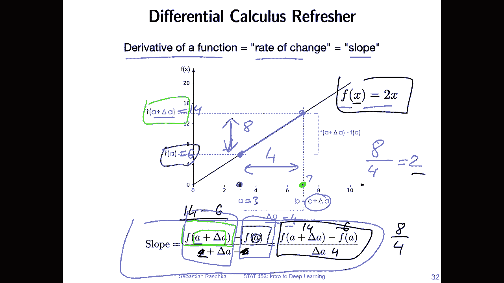

Yeah， so on the previous slide， I showed you a very， very big leap on the X axiss。

 Usually when we think of function derivatives， we think of a very small change in the input。

 So we think about what what happens if deelta x。 So the change on the input scale goes to 0 is like infinitely small。

 So here on the right hand side。This is again， the slope from the previous slide。

 where I just used the letter X now instead of a。 And here these are two different ways of yeah denoting that we are computing a derivative。

 So if we have a function， F of x， then F prime of x would be the derivative of that function。

 So when I recall from my calculus class a long time ago， I think this was called Larangerange。

Notation。Whereas this one arm is the leibs。Nottation， you don't have to memorize these names。

 but yeah， there there are just two different ways of denoting the same thing。

Theip notation will be a little bit more useful later in the context of deep learning when we talk about yeah partial derivatives of functions and also yeah gradients。

In any case， let's take a look at an example deriving a function or computing the derivative more formally。

 so let's consider again our function 2 x here。So we are now， yeah， starting with a simple。

 just a formal notation from above。 Now let's plug in。 let's plug in this function， so。

If we have x and deelta x， the output would be。What would be the output should be2 x。

 So two times x plus deelta x， right。So this one。 And yeah， here， I see， I just expanded it already。

 So I'm just expanding this to。嗯。2 x plus 2 Delta x。 So that's what I have here。

 And then this one is， yeah，2 x， right？ So that's where this one comes from。

So what I've done here is really just plugging in the， the function into the equation here。

 Now I can see。I have a 2 x here and a 2 x here。 And then， I mean， this is minus-2 x actually。

 so I can cancel those。 So this one。And this one cancels。

 So what I have is two delta x divided by Delta x。 So this can also be canceled。

 And then what remains is the two。 And that is how we derive or compute the the root of this function。

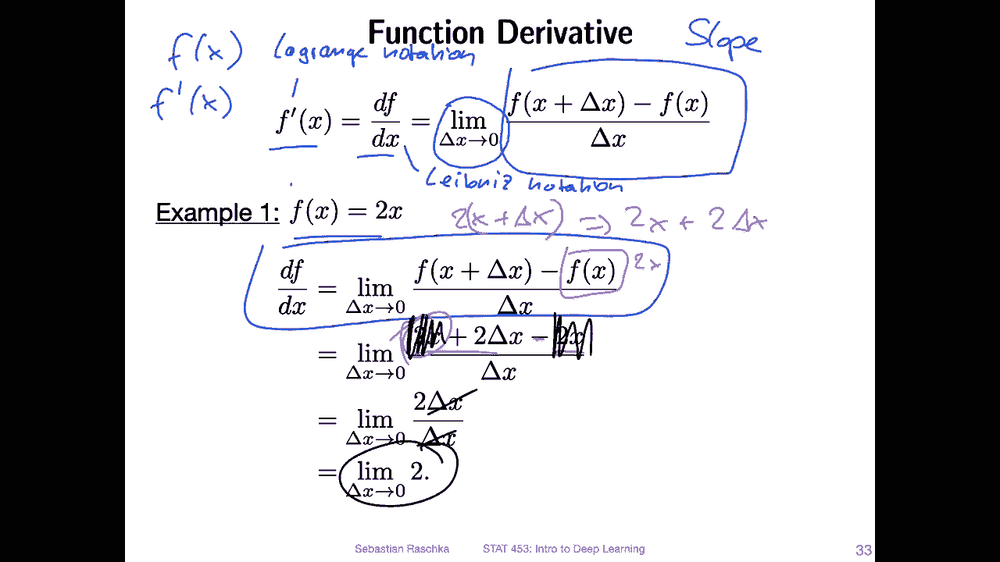

Yeah， let's do this again。 using a slightly more complicated function。

 Let's take a look at x squared。 So how can we derive x squared using the same concept as before。

So exactly the same notation now plugging in x squared instead of to x。

So what we get here is for the first part is for F of x plus delta x。

This is if we consider x squared。 this would be then x plus theta x squared。 Then if I expand this。

 this would be 2 x， sorry。3X squared plus 2。X， delta X。Plus， on deelta X square。

So this is what I've written down here。So if I have now this form， I can simplify it because yeah。

 if we pay attention theres again x squared minus x squared， so we can cancel those。

 so what remains is 2 x delta x plus delta x squared。So， now。What we do is we looking at this。

 we can also further simplify it， right？So we can divide， actually， by。Delta x。

 So if I divide by Delta x， this one goes away。This one goes away and this one goes away so what。

What statess is 2 x plus deelta x and also considering。

That we are interested in a very small chain of x。When deelta x goes to 0。

 so you can think of it as 0。 So this kind of also goes away。 So the derivative is basically2 x。

 So deriving x squared， the derivative would be 2 x。

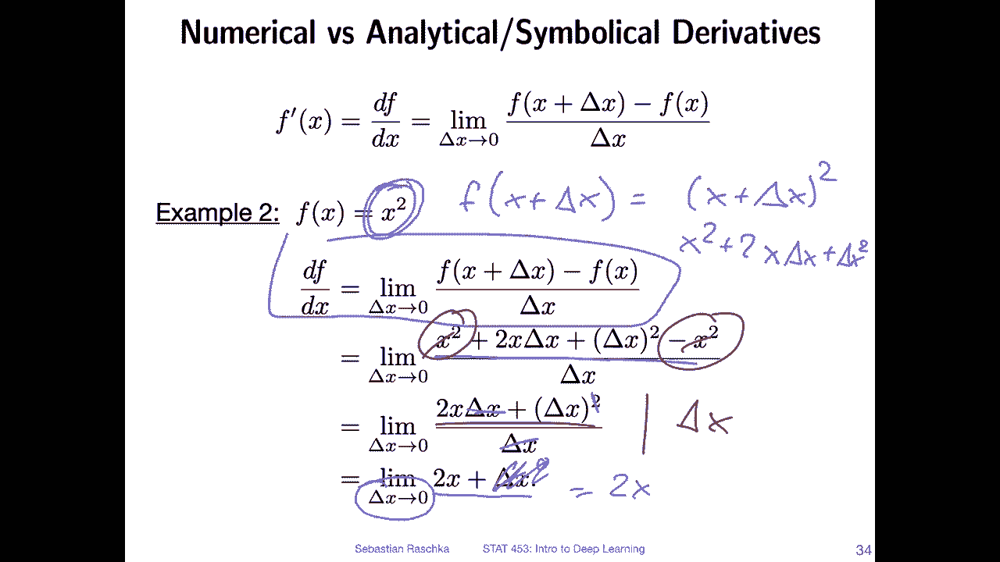

Yes， so conceptually what we were doing in the previous slide when we computed the derivative of x squared is we approximated the slope by a second between two points。

So just to draw what that how that looks like。 So if we consider this function f of x x squared。

 So we have this yeah parabola here。 so now let's consider a concrete point here。

 Let's consider this one here。 and the slope of this of the function at this point would be this tangent line here。

 this red line。 how we approximate it is it is by taking on two points。

 So we took the original point。 and then we added。Delta x to it， right plus Delta x to x。Plus。

 delta x of we。Addit Delta x to x， let's say。This is Delta X。 So we are here on the right hand side。

 Now we have the second point。 So this is f of x plus delta x。And then there's the secondant line。

 the line。Yeah， between these two points。 And we used that line to approximate the tangent。

 And you can see if， yeah， the difference is relatively large between the two points， right。

 between if basically， if theta x is very large， then you can see this is not a very good approximation。

 this is why we usually take a look at。When that x goes to0 at the limit so in this case what we would have is we would maybe have a smaller distance here。

 it's still big， but otherwise I wouldn't be able to draw it and you can see if I now connect this point and this point。

 this is a better approximation of the red line and if I go and make this smaller and smaller the better I will yeah approximate this tangent line here So this is basically conceptually how yeah this symbolic derivative root of computation works when we consider this small rate of change here。

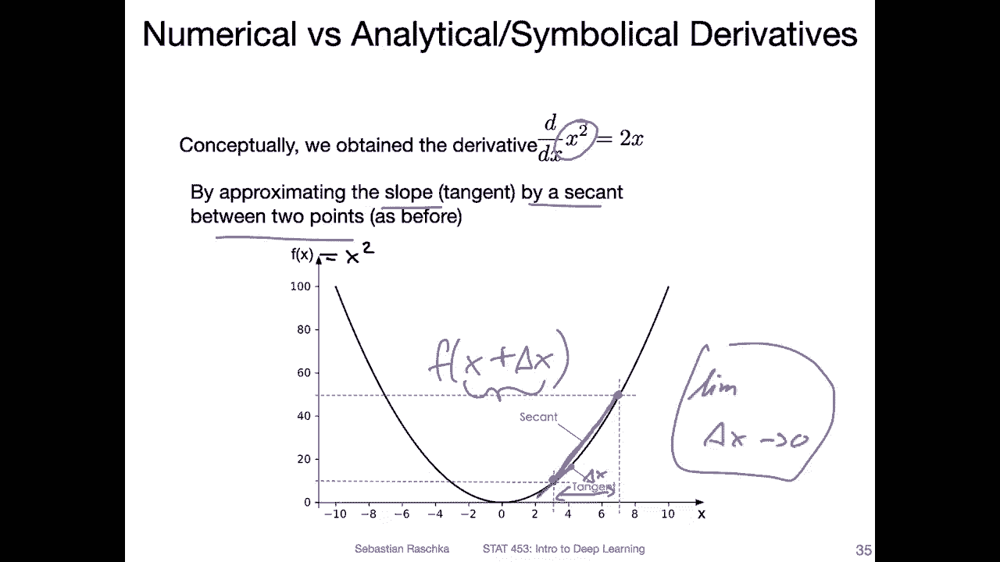

Yeah， here I made a cheatee sheet for you with the most common derivatives。

 the most useful ones to memorize。I don't want to go over all over all of these。 but yeah。

 they are in the slides for your convenience。 So if you need that as a cheat sheet that's in the slides then。

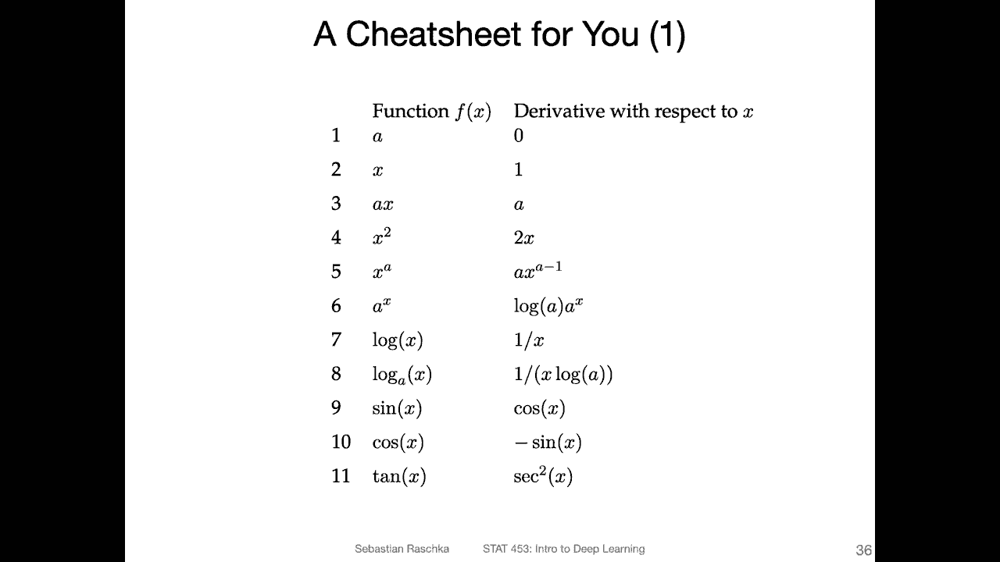

I hear more derivative rules。 so the main ones， the sum rule， the difference rule。Product rule。

 quotient rule， reciprocurro rule。 These are actually， you don't have to memorize these。

 You can actually derive them from the product rule。 For example， if you consider the quotient rule。

You can actually rewrite that as。F of x。Times G X minus1， and then yeah， work with this one。

So you don't need to memorize the quotient of reciprochcal rule。

 you can actually work with a product rule。嗯。Yeah， so then the chain rule。

 that is actually the most important one。 So for deep learning。 I mean， all of them are important。

 but the chain rule is the main one that kind of drives deep learning。

 So you will see later when we talk about gradient descent。

 it is essentially just an application of the chain rule when we compute the derivative of the loss function with respect to the weights。

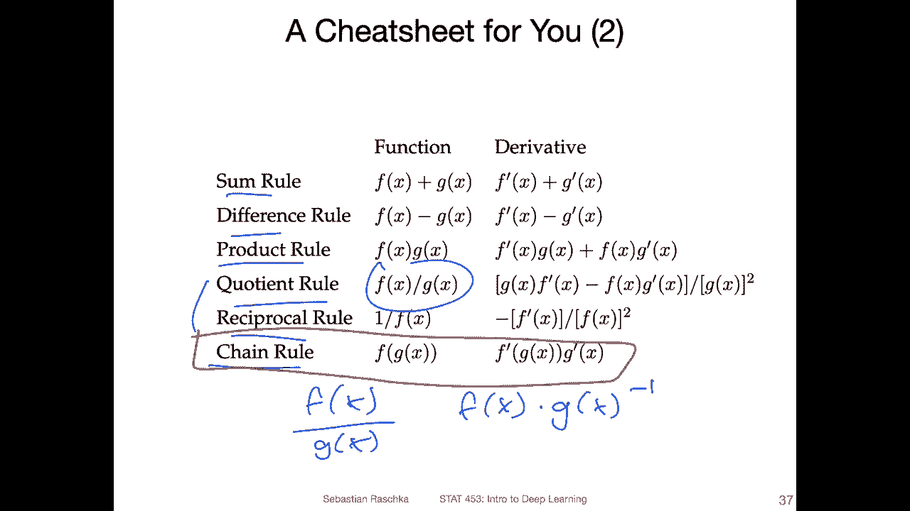

Yes， so here is a visual explanation of this decomposition of the nested function using the chain rule。

 So using colour here， it maybe be easier to see。 So let's assume we have a function。

Capital F of x that consists of two nested functions。 F and G here。

 So how we compute this is we first compute the inner part and then we compute the auto part。

 So this is just the regular function。 So this is visualized here in this graph。

 So we have a computation graph here。 So this is more like a computation graph view where we first pass x into G。

 then we get some output and this output of the inner part then goes into the auto part F。

 and then this gives us the result Z。So when we then compute the derivative of this function， we。

 yeah， we use the chain rule and the chain rule is yeah two things。 it's two parts。

 the auto derivative times the inader。 So we can think of it as the。Allter。Divative。And here the。

You know。Divative。Let me compute here and。Visualally， also， what happens is yeah。

 we can do this separately so we can。Compute here， in this case， the inner derivative。So。

 we pass x to。G and computer derivative of that。 And here that's the auto derivative。

 So here we are drivingring F。And then once we have these two results， we can multiply them together。

 and that is the derivative of the whole function。

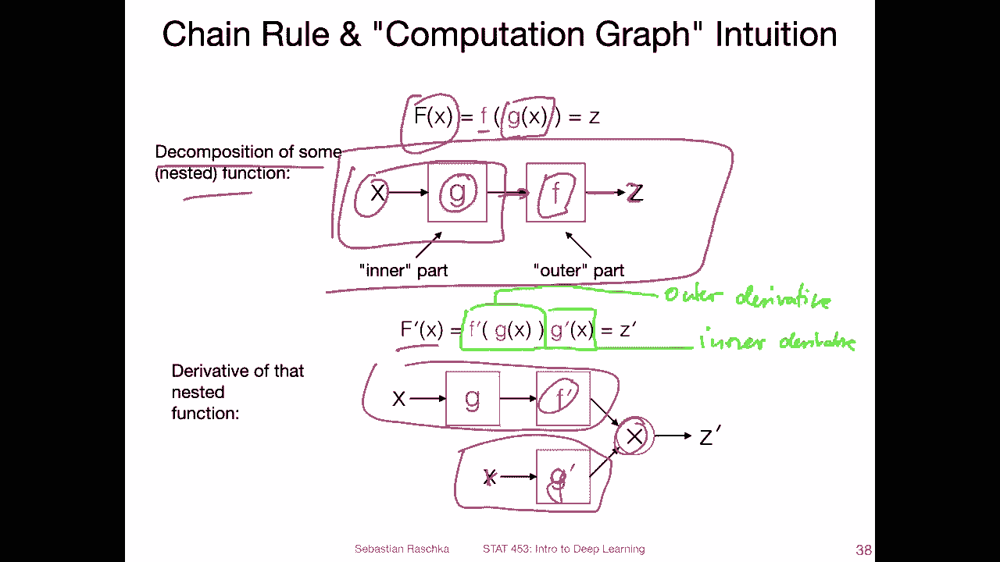

Yeah， one of the nice things of Pytorch is that it will build such computation graphs automatically if we define variables and do some computation with those。

 So Pytch will literally keep a computation graph in the background then and there are utilities then for computing derivatives automatically。

 So Pytch can these derivatives automatically using a package inside which is called autograd。

 So automatic gradient computation we will see that in the next week。

 So usually it's not required that we derive things by hand when we work in Pytorch。

 there are automatic ways of doing that。 but of course it's useful to know how yeah derivatives and gradients work because we have to I think it's a good idea to have an understanding of how these types of things work before you use packages that can do them automatically。

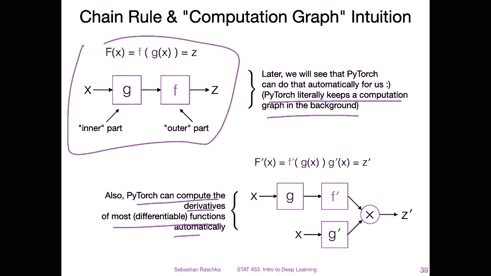

yeah and here I just wanted to show you in text when we write down derivatives。

 we will mostly be using the lipibnet notation。 So instead of writing this nested thing here。

 we will use the labibnet notation， which I find personally a little bit easier to read。

 especially when we have more complicated function with a lot of nesting going on。

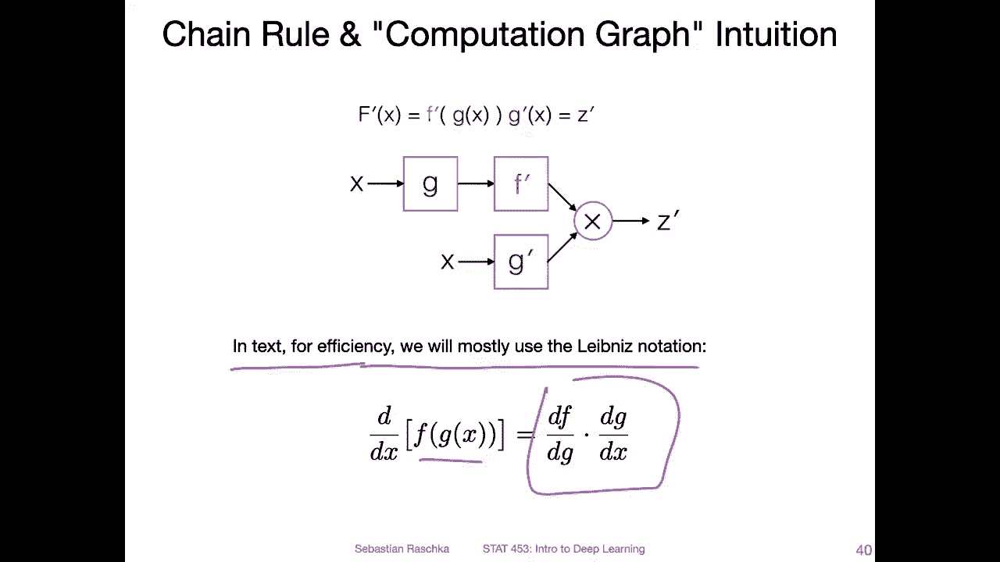

Yeah， so here's just an example applying the chain rule in practice on nested function。

 So here we have the nested function lock of square root of x。So first。

 it's easy just to take them into two parts so。The auto derivative。Times。😔，In a derivative here。So。

 and then we can derive them separately。 So now let's just focus on。The Alta 1 first。

 so the derivative of the autota function is derivative of log g is 1 over G and G is just a placeholder for square root of x。

 So the derivative of the alta function is1 over square root of x。And then， for the inner one。

So we have the derivative root of square root of x。 I'm just rewriting it here for convenience。

 And then we can use the power rule here。Bring the one half up front， and then a -1。In the。Exponent。

 so it's -1 half。 And that is just rewritten as one over2 square root x。

 So this is the inner derivative。 And then we just combine them because the chain rule is really just sorry the。

Enner times the alta。 So here I'm just putting these two parts together。

 So the overall derivative is one over2 x here。

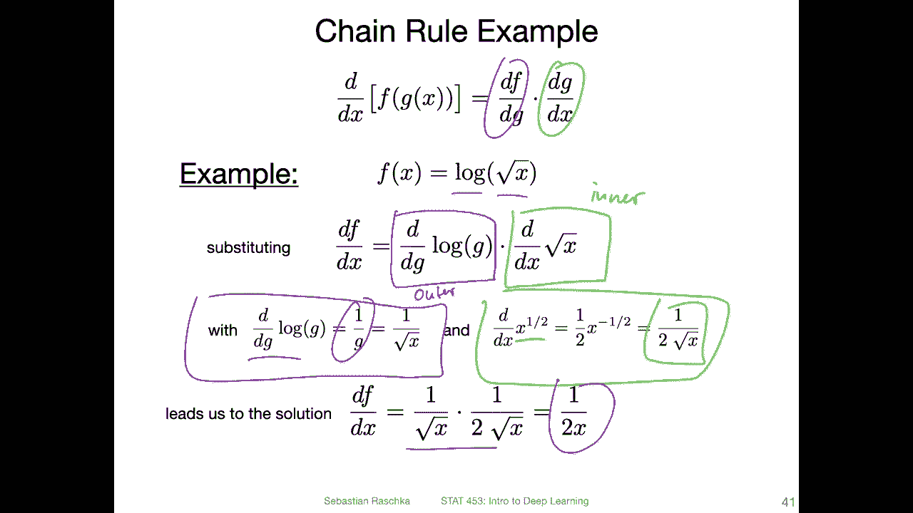

Yeah， and we can also use the chain rule for arbitraryrbitrarily long function composition。

 So consider this function f of x here， which consists of five nested functions，1，2，3，45 So yeah。

 we can also expand this using the chain rule when we compute the derivative。

 So if we compute the derivative。Of the function of of the auto function F here。

 if we also the the root of the whole thing here。We can decompose that into smaller parts， and then。

Computute all of them separately using the general rule and multiply them to compute the derivative basically。

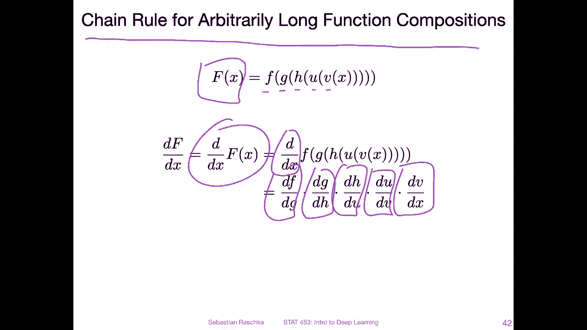