# P37：L5.5- (选修)微积分复习 2- 梯度 - ShowMeAI - BV1ub4y127jj

All right， let's not talk about gradients， the derivative of multi。All right。

 let's now talk about gradients， the derivatives of multivariable functions。

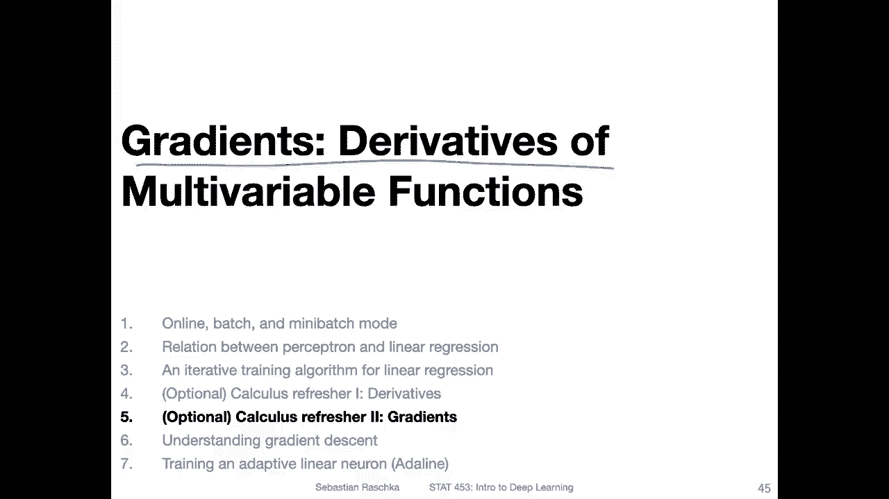

So here we are now interested in functions that have multiple inputs。

 so note though that the term multivariable and multivariate are sometimes used interchangeably。

 so multivariate is usually a more common term， but here we really mean multivaririable because multivariate can mean multiple outputs here we are currently only focusing on a case where we have multiple inputs and a single output so for example。

 if you consider linear regression you can have multiple inputs like the features of your dataset。

 So if you have multiple a train example with multiple features。

 or think of the iris data set where you have s length。

 S width a pital length and pital width there would be multiple inputs。

 but the output there would be only one output for example。

 a continuous value like for regression or class label for the prediction。嗯。So， yeah， in this case。

 we are focusing now on the multi variableable functions。

 So consider a function where we have multiple inputs。 if we only had one input。

We would usually write the derivative as。Follows with a。Smaller letter D here。Now。

 since we have multiple variables， we have actually a vector as the derivative。

 this is also the so called gradient we use this upside down triangle， the Nala here。

 So this is I think it's spelled like this Nala So here we have multiple things going on now in this neck。

So each row is a partial derivative。 So what is a partial derivative。

 It's essentially like the full derivative。 However。

 it's for a function where we have multiple input arguments。

 And if we compute the partial derivative of F with respect to x， what we do is we set。

Y and Z here or with multipo。Once we said all of the all of these。As constants。

 So we treat them as regular numbers， not as variables。 While we compute this one。

 And then once we have computed this partial derivative， we then focus on the second entry。

 the partial derivative of F with respect to y while。Considering x and z as constants and so forth。

 So we compute each derivative one at a time。 the rules are the same as for the full derivative。

 So really the big difference here is only that we treat the other variables as constants， but yeah。

 that is essentially a very similar concept。

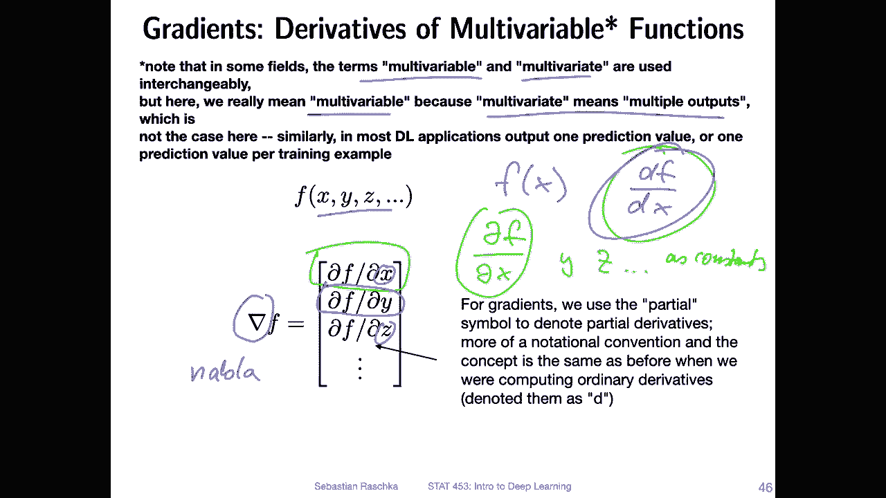

So here's an example to illustrate that。 So consider this function here x squared y plus y so that two inputs x and y for this function here。

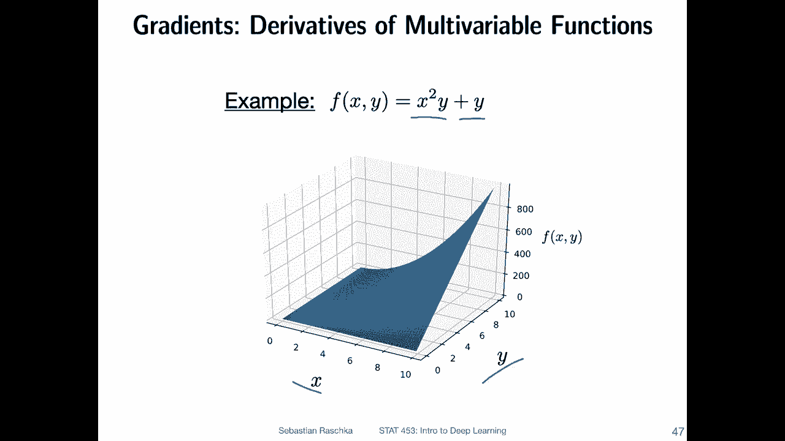

So when we then compute the gradient of this function， we have two partial derivatives。

 the partial derivative of x with respect to the partial derivative of f with respect to x and the partial derivative of f with respect to y。

 so we can compute them separately。 We don't have to intermix them。 We can do one at a time。

 So let's start with the partial derivative。 use the same color maybe。

Partial derivative root of F with respect to x， so。What we do is。We can， we treat why。As a constant。

 So you can think of it as a regular number。 So it's essentially like a computing X。

Times 1 plus  one， something like that。So and if you think of the power rule。

 what happens is the two goes up up front and then minus-1。 So it will be just。To x， and。

This one will stay， right。 So if this was a two or something， this would。Stay。

 So here also the Y stays。 So we have2 x Y。And then plus the derivative of a constant is 0。

 So plus 0。 So the derivative would be 2 x y for this one。

 So using the power rule and the constant rule。Now， we have computed this partial derivative to X， Y。

 Now we can compute the partial。Divative for the second entry。For。

The partial derivative derivative for F with respect to y。 So that's what I have done here。

 Notice instead of x， we are focusing no on y。So x here。 X is no。A constant。

And if this this basically then stays， right， So we have then。Just two x squared as the constant。

 So it's like if you consider a case where we have something like2 x and we compute the f of x。

We compute the derivative of D F with respect to x。So this would be two right。 So in the same way。

 if this is a constant， the y goes away， it just stays， and the one is also a constant。 sorry。

The y here is the variable。 So the derivative of just the variable is one， right？

 So then the derivative of the whole part would be x squared plus 1。Alright， so we have both。

 and then we just arrange them in the vector here， and this is No gradient。

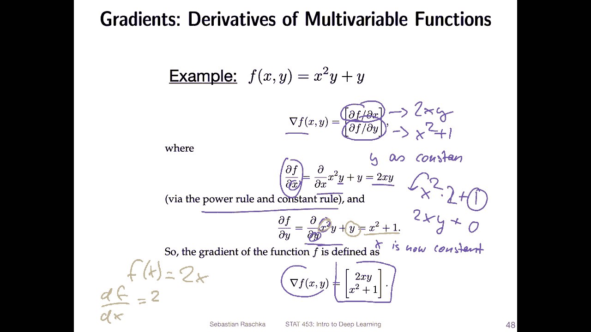

Okay， now let's consider the case where we have a composite function like the following one。

 Notice that we have two inputs。So we have G and H。Two inputs here。

But they both rely on the same input argument here。

So there's an x that is shared by both functions here。

So remember from the regular chain rule that I explained in the last video。

 if we have a function nesting like this one and we want to compute the derivative。

 we can do this by computing the derivative of the auto part。Times the derivative of。The inner part。

Now for the two inputs yeah we have the following case。

 they depend they have a dependency they depend both on x。 so it's a little bit trickier。

 so we actually combine them because we have this dependency here。

 so we still use the chain rule here， but we combine the results。

 So if we want to compute the derivative of this function with respect to x the inner argument。

 so note that we are not computing we are not computing partial derivative of G。

Of F with respect to G and。For example。H separately as the gradient， because both really depend on x。

 I mean we this we do this and this as part of it， but it's not the end result compared to the previous slide where we had a gradient where we had different input arguments。

So。Here， like I just said， we have these partial terms with respect to gene。

 So let me use different colors。This part， this is one part， and。This steep。😔，Other part， however。

 both share the same x， so the derivative of this function with respect to x， the one argument。

 So in fact we have one argument in a way here。We。Combine them here with。

Where is my yellow with this plus symbol here so。Let me clear。 This is maybe more clear like that。

 We still use the chain rule。 Let's maybe focus on。On this part， for this part。

 we still use the chain rule like here。 So we have an inner and an auto part。

 So the auto part is a partial derivative F with respect to G。 here。

 we use the partial symbol because theres G and H。However， there's only one input argument to G。

 So here we use a little D。 If you don't do this like consistently like that。

 I think no one would blame you if we just use partial symbols that would be fine too。

 but yeah this would be the proper way。So， this would be。The derivative root for this part。 And then。

For the second part， we have a partial derivative root of f with respect to H so。

 and then the inner part so。Let me do this one more time。 So this is。One part。

 this is the other part。And here we have the chain rule for each of them。

 the outta  one and the inner one。Here we also have the auto  one。

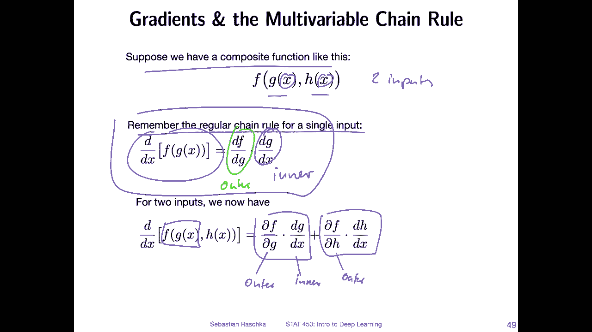

And。Alright， let's take a look at an example to apply this in practice。Yeah。

 consider the following function where we have two input functions， G and H。

 So this is just for reference what I had on the previous slide and the function is G squared H plus H。

Where G is also a function that takes as input x， where this is 3 x。 So the function G is 3 x。

 and then H also is a function taking input x。 And so this function is x squared。Allright， so。

Doing it one at a time， so let's focus on this part first， which is here。

So here this is the partial derivative of x with respect to G。 So if we。Take a look at this。

And differentiated with respect to G。Use the power rule。 So this goes front and goes away。

 And this is a constant because it's a partial derivative。 H is a constant。 So this also goes away。

 So what the result is this to G H。So， now。And let's take a look at the inner part。

 So the inner part of G， so。Let me use this color。 So G is 3 x。 So we are looking at this one now。

 So the derivative of 3 x is just 3， right， So if we derive G with respect to its only input。

 So there is only one input， then we don't have to treat anything as a constant because there is nothing else except x。

 and the derivative of that is 3。Now let's take a look。 So we solved basically this in this part。

 Now let's take a look at。The other part here， the partial derivative of F with respect to H。

 the other argument。So if we treat， So if we compute。Partial derivative of F with respect to H。

 And we treat everything that is not H as a constant。 So this is a constant。 So in this way。

If G squared is a constant。Then the derivative of this part with respect to H would be G squared。

 right， So we have。3 squared。And this is then one， right， the derivative of a variable is just one。

Alright， so G squared plus1。have it somewhere here。Right， so here we have it。And then the last part。

 the derivative of H its with respect to its input。X， so which which color。

Do we have left here this one， maybe。So let's compute this terminal on the derivative of H with respect to x and。

H is x squared， that derivative should be。2 x using the power rule。 So that's2 x。

 And now we just bring everything together。 So we have the first part and the second part。

So I don't have any colour left that I haven't used yet。

 So let me just use black Well this left part here。We bring。Those together。

 So this this is basically。This part and then for the right part。Here， we bring。Those those together。

 and this is this part。 And then if we just simplify this。

 So if you take a look at this and you expand these terms， it simplifies as follows。

So this would be how we use the multi variable。

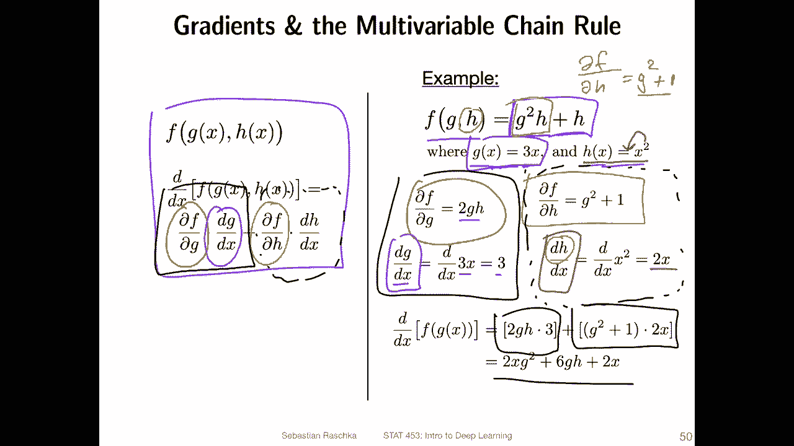

Chimru。Yeah， I don't want to go overboard， but we can also yeah go one step further and write this more compactly using vector notation。

 So again the same function here F with two inputs two input functions G and H which in turn take both x as input So if we compute the derivative this is what we have written down before and we can also write this more compactly using vector notation。

We writing it as gradient of f with respect to its inputs and then times the the derivative of a vector V。

 So the vector v， we define it as a vector containing those two inputs here。And then。

 the derivative would be。The derivative of the vector would be containing。

Both the derivative of G with respect to x and the derivative of D with respect of H with respect to x。

 So this is more like a compact form of writing down these partial terms。

 So basically this term and this term。 So you know the partial terms， but the inner terms。

 So these are。But， you know。In other routes。And now then putting it together。Where this comes from。

 I mean， if you then consider the gradient of the function with respect to its inputs。

 so that's the gradient we discussed。So the partial。Terms， and then。Here the innerrums。

And if you look at it now。 So if you use or compute the dot product， right， So in order， yeah。

 in order to compute the dot product， what we have is。Let me use this color。This times this。Plus。

 this times this， right。 So this is how we usually compute our product。 So it expands to this one。

So it's just like a little yeah convenience thing to write things more compact。

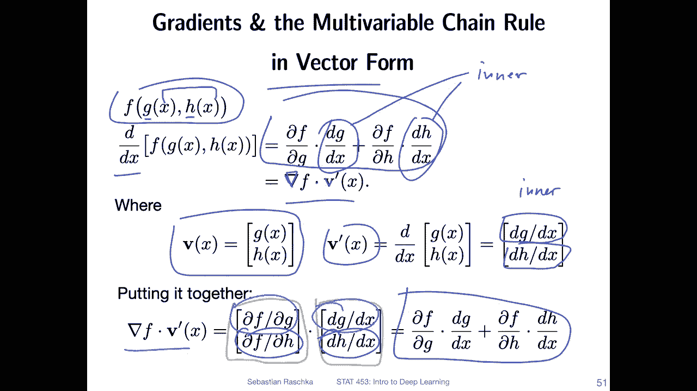

Yeah， there's one more concept to cover the Jacobovian matrix。

 So consider now a case where F is a vector。 So you have a vector F where F is a function。

 and there could be multiple inputs， so。Let's consider the expanded form here。 So this vector。

 So there's F 1， F2 F 3， F M， different functions。 Each of them has the inputs X 1， x2 x 3， x M。

 So this could be， for example， a case for， yeah。Perceptron where you have a net input function。

 and it takes multiple features as input。So the Jacobian of this。

This vector here is written down here， so the Jacobian is a matrix where all the combinations are considered。

 so the partial derivative of f1 with respect to x1。

 the partial derivative of f1 with x2 with respect to x2。

 the partial derivative of F2 with respect to x1 and so forth， Yeah。

 so you can see all the different combinations here。

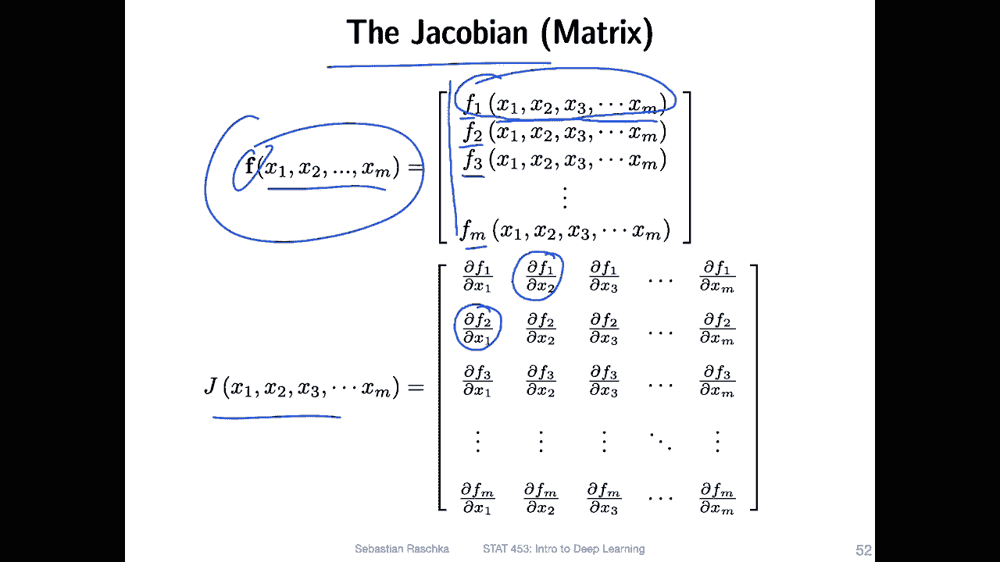

All right， I here I see。 I have highlighted one thing just yeah to highlight this is the gradient of function 1。

 for example， with respect to its inputs， if you recall the gradient that we discussed earlier。

 So each each row of these of this Jacobco matrix would be basically a gradient of a function or a function gradient。

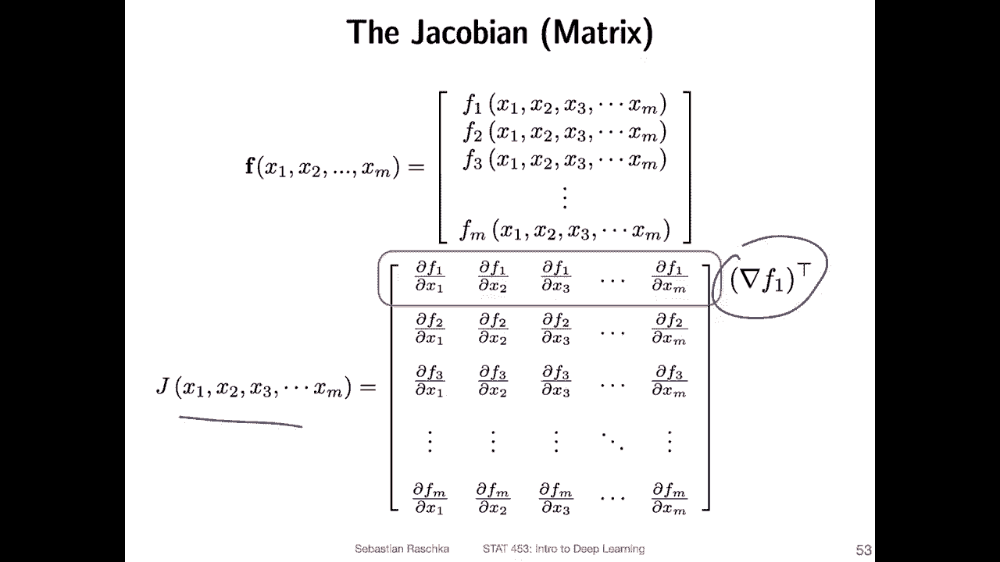

Yeah， okay。 so second order derivatives。 So let's talk about second order derivatives。

 Now I'm just kidding。 so we won't be talking about second order derivatives because we won't be needing it for this class。

 Actually， second order derivatives can be useful。 Some people have done some research working with them in deep learning。

 but so far， it has not been very fruitful。 I mean， the results， I I mean。

 there are proof of concepts that it conceptual works。

 but it is very slow and there's not really any advantage over using first order methods。 so。

Despite some research efforts， as as。For as I know。

 no one is really seriously using second auto gradient methods yet， I mean。

 at least while at that point when I'm recording this。

 maybe in the future there will be a method that is vastly superior compared to our current methods but so far it has not been done very prominently or very I wouldn't say successfully because the research in itself was successful。

 but it's not very practical， I would say allright so with that let's not worry about second auto methods then let's go back to the more exciting parts through the machine learning and deep learning parts。

 So the next two videos I will be wrapping up on this lecture on gradient descent and then training a single layer neural network。

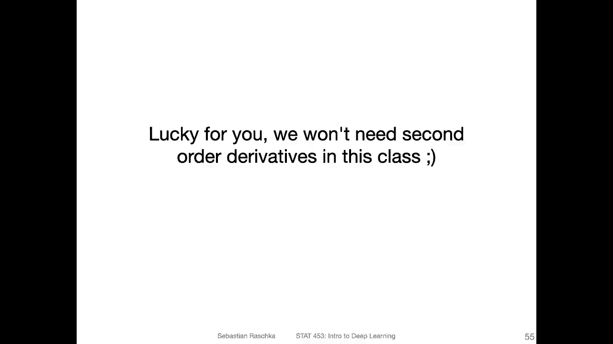

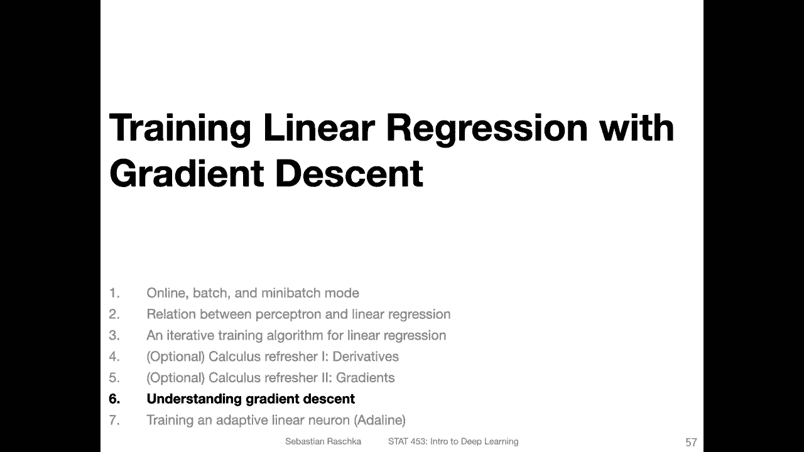