# P38：L5.6- 理解梯度下降 - ShowMeAI - BV1ub4y127jj

Yeah， now equipped with a knowledge of what a function derivative is。

 Let us use the idea from care colours to train a linear regression model using a method that is called or related to。

Yeah， now equipped with the knowledge of what a function derivative or gradient is。

 let's now take a look at training a linear regression model using these concepts。Yeah。

 now equipped with the knowledge of what a function derivative and gradient is。

 Let's not train a linear regression model。 So this technique in the context of linear regression is。

Yeah， now equipped her with a knowledge of what a function derivative and gradient is。

 Let's now train a linear regression model。 So for this。

 we will be using a technique called gradient descent。

 which is yet related to computing function derivatives and gradients。

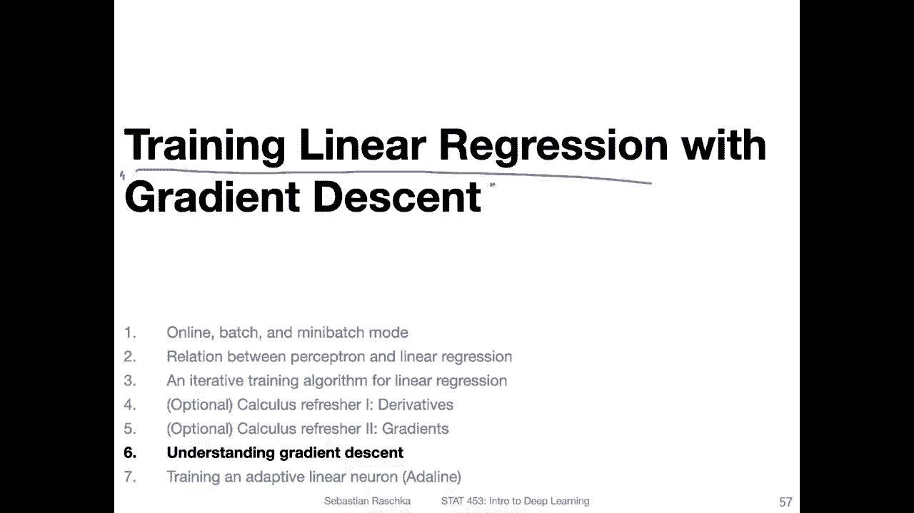

So consider the linear regression model here again where the activation function is just the identity function。

So this is just like a regular linear regression model and we have one output here。

 So this is our prediction and for yeah fitting or finding these weights we want to minimize the loss or the prediction error of linear regression for this。

 we formulate a convex loss function in the case of least squares a linear regression。That's the。

Some squared error， we can also consider the mean squared error doesn't matter。

So either one would work。 So for this squared error loss。

 what we have is we have the prediction minus the actual value that we want to predict。

 So we consider the difference between the two squared。 So why the squared。

 I mean this way outliers will be more heavily penalized。And also。

It doesn't matter whether one or the others on the left or on the right handend side in any case。

 so if we would plot this now， so by the way， I should say this is over the training examples。

 So if we have a data set with n training examples， this would go from。First。

 until the last training example。 So the loss on the training dataset set。

So now yeah I plotted the loss here on the at the bottom as a function of one of the weights。

 so you notice there are usually oh sorry there are usually multiple weights here we are looking only at one of the weights because it had simpler to look at。

 but you can also yeah generalize this concept to multiple dimensions。

So what you can see is this bowl shape or parabola shape。

And the loss is minimum for a certain value of the weights。

 So if the value of the weight is too large， you can see the loss goes up or。

Maybe it's easier to see it。 like if we go to the right of the weight is larger。

 you can see it has a higher loss in the same way for this。W here。 That is too small。

 So there is so called。Gbal。你们的萌。That we want to find。

 So we want to find this global minimum for the weights so that our prediction error or loss will be minimized。

 We will do that for， of course， all the weights。 So if you think of this in three dimensions。

 So if we have this w1 and a second weight， this would be a like a bowl like a serial。嗯。

Like a serial bowl or something like that where you want to reach the bottom of the serial bowl bowl。

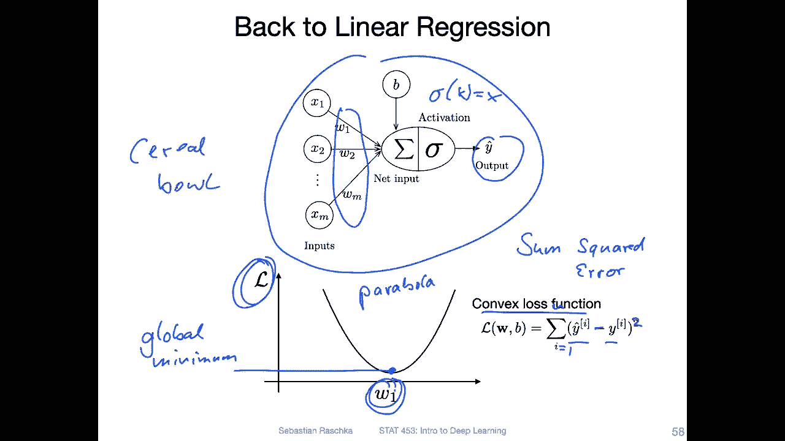

But yeah， it's easier to think of it as maybe one dimension。Yeah。

 let's now see what happens if we use the concept of gradient descent。

 So what we do is we have to start with a certain weight， let's say。This wait， this is a one。

Starting point。 So in practice for a linear regression。

 we usually initialize the weights to all zeros or small random numbers。

 So if I had initialized the weight with value 0。We would be over here。 and you can see also， yeah。

 the loss would be pretty large here at zero。 We want to find basically this global。Global minimum。

That's our goal。 So if you think back， if you have seen the optional video on。The derivatives。

 So this is like almost like the， yeah squared function that I talked about。 So x squared， right？ So。

 and we can compute。Derivative of this function。 So the derivative of this function with respect to W1。

 For example， if we consider our starting weight。 So this is the way we currently consider or we start with。

 Let's say this's a small random number。 We can compute the function derivative at this point。

 So here。 So and then。Using this， we can。So I should say actually the derivative should point upwards here in this direction。

 but this is this arrow here is the negative。The negative slope。 So this arrow here is the negative。

Slope。And we can use this negative slope in multiple dimension。

 you can think of it as a gradient instead of a derivative。

 we can use this function gradient to guide the weights into the direction of the global minimum。

The slope。Would tell us how steep the function is。 So at a given point， how steep the function is。

But yeah， we are interested in the negative slope， which is。

 yeah also giving us the steepness of the function。 But instead of pointing upwards。

 its's pointing downwards， it's pointing towards the minimum that we want to reach。

So we can use then this value this negative slope or negative gradient to guide the function downwards。

Towards this global minimum。 So we make small steps towards the global minimum。One step at a time。

 And for that， we have， as I've showed you， I think in the second video of this lecture。

 we had a so called learning rate。Etter and so the loading rate E together with how steep it is guides how much we update。

So you can see here at the bottom， it becomes a bit flatter。 right？

 So the function is not as steep anymore。 So in these cases。

 we also make smaller steps because the update really depends on the steepness and also on the learning rate。

 So the learning rate would all scale these。Yeah， slopes by a constant。

 So the learning rate is usually a constant that scales all of these slopes。

 That is like an optional step you don't have to use。Lning rate。

 but in practice indeed deep learning， it's yeah kind of required to have a learning rate。

 And also there will be extensive tuning into what is a good learning rate。 So this is something。

Where you would have to try different learning rates and see what performs better。

 but this is something that will be done later in this class。

 and I will probably also make a homework about that where you have to play around with us a little bit。

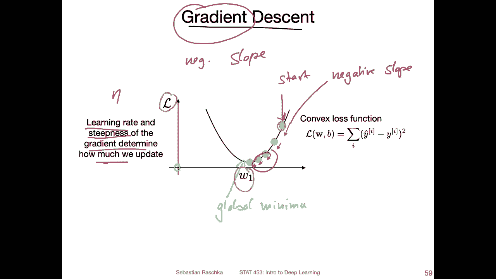

So if you have a learning rate that is too large， what might happen is that you might overshoot so if you choose a learning rate that is very large。

 you may make an update， so let's say you make an update here。

 this is maybe a little bit exaggerated so you move from this weight position to this one。

And then the next update is a large update here。So in this case， the update has been too large。

 So we are overshooting the global minimum and。Depending on yeah what what you find here。

 you may overshoot even more。 And then you kind of lose the weight。 So your loss will increase。

 You can see that happening in practice if you use a learning rate of this too large。

 So notice here also， I'm only again。Always looking at one weight。

 but there are yeah weights in multiple dimensions。

 so in that way there is a lot of possibility something like that can happen if we use a large learning rate so it's actually better to make like smaller baby steps to watch at towards reaching this global minimum however。

 if we make the learning rate too small it will just take a very long time until we reach this bottom so we make all these little baby steps it will take a lot of iterations or a lot of updates to reach this global minimum in practice for a convex loss function like this one where we have a global minimum。

That is easy to reach because everything is convex。 Then it's not a problem。

 usually to have a small learning rate。 We have to just be patient in practice for deep learning。

 This would be。A problem because the algorithm can get stuck。 So in deep learning。

 we usually have loss functions that are not convex。 so we can have a loss function。

 Let me draw you an example。You can have a loss function。 that is somewhat。Let's say， like。

 like this。So if we have then a wait where we start here， let's say we go down here。

 then it goes down here， okay， this would actually be a good case， sorry。That's， let's start here。

 So if we start here， we make small steps， then we may up may end up in this， in this pit here。

 This is a local。Minimum， so actually， I made it relatively steep。

 So you would probably end up in this one eventually anyways。 but let me make a。Maybe a flatter。one。

Like something like this。So what could happen is if you have a very small learning rate。

 you go from here into this pit and then you get stuck here。

Because the learning rate is not large enough at this point here to jump over this， for example。

 so in this case having a too small learning rate can also be a little bit bad。

 but yet in practice we will later talk about algorithms that have a so-called momentum term and yet to overcome these little challenges also。

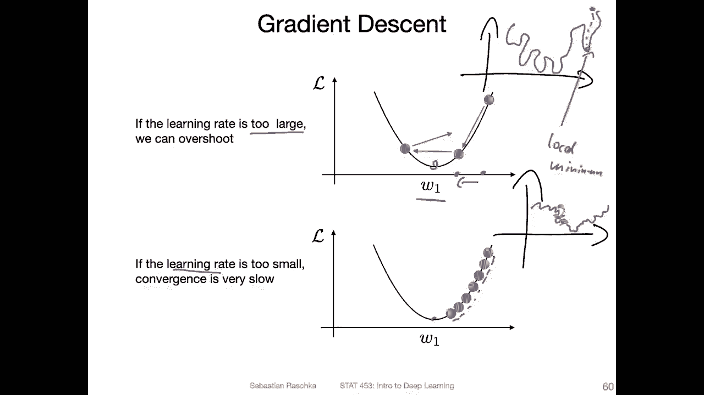

Okay， so but moving on。Yeah， here have the overview of the online mode again。

 just for reference to just show you what we want to get at now。

 So what we want to do is we want to find this global minimum。

 So just pay attention to the right hand side here。 This is the stochastic gradient in descent。

 There's also a batch gradient in descent。 I will say a few words about that。

 But here for simplicity， consider the case where we update one training point at a time。

So in this case， what we do is we compute the gradient of the loss function here so you can see we compute the gradients here。

And we have this for W and the bias， and in that case， it would be just the partial derivative。

Not a gradient。But let's use the same symbol， the nur for everything。 It's， I think。

 simpler compared to switching between different symbols。

 So then our update is based on the current weight and then the learning rate。

 So this is the learning rate again。Times the negative gradient。 you can see there's a negative now。

 the negative sign。 So this is because we want to go towards the global minimum and not upwards。

 right， so we don't want to make the loss larger。 We want to make the loss smaller。

 So we take a step into the direction of the negative gradient。

 So here we use actually these gradients to update。So what are these values， So wheres。

This value and this value come from， Where these values come from。 So for that， we can。

 yeah derive our loss function， right， so we can derive our loss function with respect to W and with respect to B。

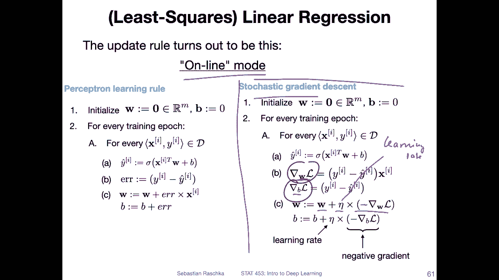

Yeah， let's not derive the loss function with respect to W。

 So here we are only taking a look at one of the weights W J， just to keep it simpler。

 We could also do this for the weight vector。 but yeah， recall the。Graient of the loss。

Would be just a collection of these individual partial derivatives， right。

 So we would have a partial derivative of the loss with respect to W1。W2。Up to。😔，WM。

 so there would be a vector。 So here we are only taking a look at one of these。 for example。

 the first one。 let's call it W J some of the arbitrary entries here in this。Graadient victim。

So we are considering here the sum squaredarrow us so in the previous slide I showed you for simplicity the stochastic version where we only update or compute the gradient based on one training example at a time。

 which would be an approximation of this overall loss function right so if I only consider one data point without the sum So if I ignore the sum this one would be only an approximation of the overall loss function on the training set so here using the whole training set it's actually more accurate。

This is also sometimes called just gradient incent or batch。Graian decent if we use。The whole。

Training set， where we have。I equals1 up to n。And then we can also consider though a smaller case where we only have a mini batch。

 so。If we have a mini batch， if this is， let's say， a mini batch of size K and K is smaller。

Then and this would be the mini batch version。 This goes back to what I explained at the very beginning of this lecture where we have this online mode。

 mini batch mode and batch mode。 how we compute the green。 It's the same concept。

 except that here we have this sum。Everywhere， but you can also ignore the sum。

 and then it would be for the online mode。All right， so what we do now。Is let's， yeah。

 we are drivingr no the loss with respect to the weight。 Let's take a look here。

 This is just the sum square error loss that I've written down again。

 Now we are yeah differentiating this loss with respect to W J。

 So first step is I'm expanding this term here， the prediction。

 So if you recall how we compute the prediction it's。The weights。

Times the feature values plus the bias， right？ So here I'm ignoring the bias。

 Let's say it's implicitly included in the weights。

 So we are only looking at everything without the bias just for simplicity。

 I've actually included it here， but maybe ignore this for now。嗯。Yeah， and then。

We have the activation function。And the activation function was just。An identity function。

 So I'm just using this one here， writing it more compactly with using vector notation W transpose X using。

M the notation here。So。That's what I'm what I have here。 So I just expandedend this one。

And now we are using the chain rule to compute the derivative。

 So the chain rule is the outside derivative times the inner derivative。

 So here notice we so the auto function would be。This one basic。 So this is the inner in red。

 And then the， the square here would be the outta function。

 So what I'm doing is I'm deriving now the outer  one。 This is this part here。

 This is the outta derivative。Can you write a stone。Using the power rule。

 And then on the left hand side here。That's。In a derivative for the outer derivative。

 we are basically done。 so we don't have to do anything。On the left hand side。

 So the left hand side is。Donone now let's take the a look at the inaderative。

 So if we take a look at this inneraderative， we see， okay， there is another。

Chain rule application required， right， because again， we have， yeah， different things going on here。

 We have。The activationation function。 And then there is the value inside of the activation function。

So let's now consider the chain rule again when we compute the alta and the innerad derivative。

So the way I've written it here is again， on the left hand side， the outar。Deerivative。

So this would be what， would be the。Ato derivative。

The derivative of this activation function with respect to its input。

 so the input is this term W transpose x。And。Then on the right hand side。

 I have the derivative of the inner part。 So this would be the inner part。 notice。

We cancel the minus y because this is just a constant。 So this goes away。Alright， so。

Looking at this here， now this term， what if we compute the derivative of this。

 this whole term with respect to W， the result would be x， right？ So because we compute it。

The derivative with respect to WJ。So the live of this term。With respect to。W。Let's say WJ。

Because W is a vector。Would be。Oops。Xg， because all the other values in that vector would be constant。

So， this is what we have。Here， so this' is what we have left over if we derive this part。Now。

 we are left still with the outer derivative to do。 So the outer derivative。

Have we computed the derivative of sigma with respect to its input as one。 So why is that。

 Because we have the identity function here， right？ So the derivative of this function。So， let me。

Wite the stone。This would be one， right。 So this goes away。 So what we are left here with is just。

X J。 So the derivative。Of the loss function with respect to the weight is。Why hat。

 So if I would condense this again， actually it would be two times y hat minus y。Times X J。

 And this would be the derivative of this loss function with respect to this W J。

 And in each iteration， when we do the update or the training。

 we can compute this value and update the weight values， right， so we can。

Use this term now to update the weight。 So if we have the。W， we updated by。Itself。Plus。Then。

 the learning rate。Times the negative version of this whole part。

 This would be how we update the weights in each round to minimize this loss function。

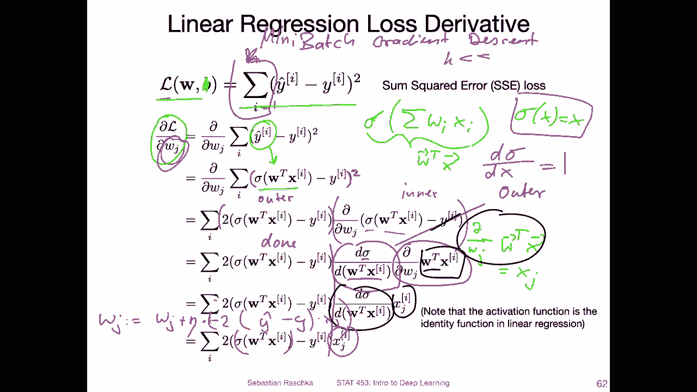

So here I have an alternative notation of this whole thing。

 This is actually what people do in practice。So usually to make this a little bit more stable with in terms of the learning rate so that the learning rate doesn't depend on the size of the training set。

 we actually compute。Or use the mean squared error。 So here we have no a one over n。

 So just abridging。 the rest is all the same， except that I know have this one over n。

 but also notice that it's not only one over n。 it's over。2 m。And again。

 this is really to make things more convenient because then when we use the power rule。 So if I。

Use the power rule here。 The two goes in front， right？ So I have two over to n。

 and then the two cancel。 And then I'm just left with。1 over n。

And this is a little bit more convenient convenient。

 So this one is usually the one that is used in practice because then if I use this one for updating the weights。

 I can choose a learning rate that is independent of the size of the training set or independent of the size of the mini batches。

 Otherwise if I change my data set or my mini batch size。

 I have to find the learning rate every time from scratch again。Actually。

 it's important to find the learning rate for each new dataset set anyways。

 but if we play around with different， different mini batch sizes， it would be more robust if we。

Yeah， use the one over。 and。 this is usually what we do in practice。

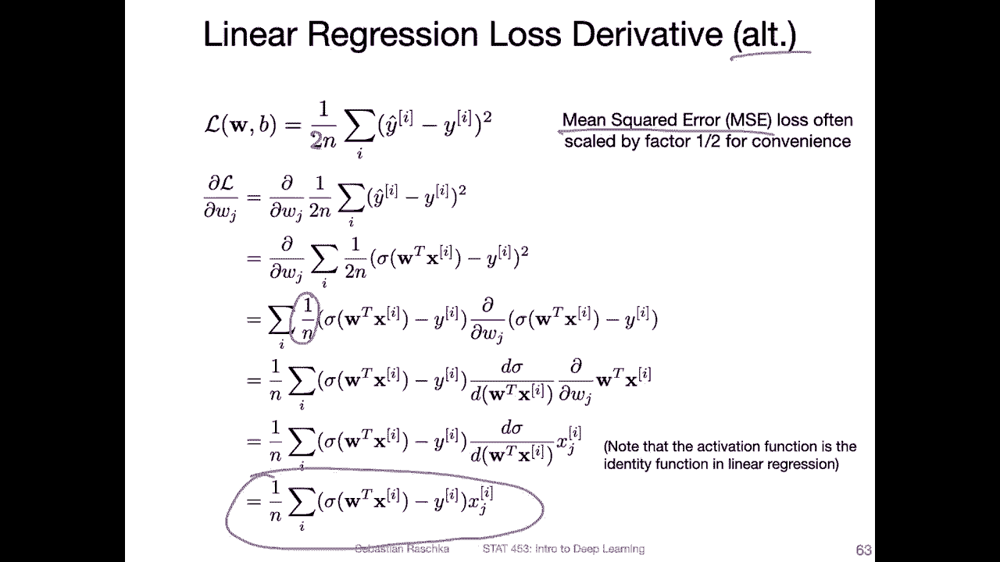

Yeah， so here's how gradient in the sand looks like for a loss function with。Yeah。

 so here's again how gradient descent looks like using a surface plot。

 So here we have again the mean square error loss， and we are looking at two weights now and the global minimum is here in the center。

Now suppose we start with the weight here， let's say this is a one。Starting weight。

 And the lines here， these contraours indicate how large the loss is。 So， of course， yeah。

 the closer you get to the local minimum， the smaller the loss。 And that's where we want to get at。

 We want to get to the global minimum。Now， if we use the batch grade in descent。

 where we derive the loss function based on。The whole training set。

Let me just quickly write a down here again。 So if we compute。

The derivative of this one with respect to the whole yeah or considering the whole data set。

 then we will make direct leaps towards the global minimum。

 So each update will be perpendicular here to the contour lines。

If we use something like stochastic gradientding descent so that is if we only update based on one data point at a time or based on a mini batch。

 then the updates will be a little bit noisier。

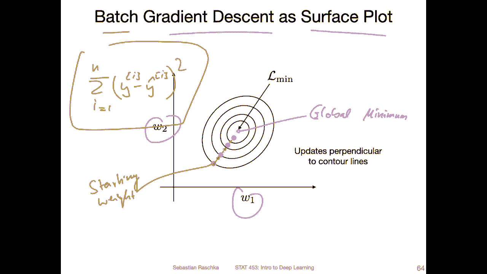

So instead of going straight to the centre， there will be like this little zigzag for linear regression。

 that is probably not ideal because it's yeah why would we want to do that， It's。

 there's no point doing that。 if we can do these direct steps make these direct steps。

 Why would we do one step at a time。 Maybe one advantage is if we have a very， very， very。

 very large data set。 Then this will yeah train the linear regression model quicker because。

You will be having more updates per epoch。 So if you have batch grain decent。

 you only have one update per training epoch and with mini batch grain descent。

 you have more updates per epoch。However， each update itself is noisier。 again。

 for linear regression， it probably doesn't make sense to use mini batch gradient descent。

But later when we talk about deep learning we have non convex loss function。

 so we probably won't be reaching the global minimum anyway。

 and in this way using these little stochastic gradient decent updates。

 I say are actually better than these complete gradient updates。

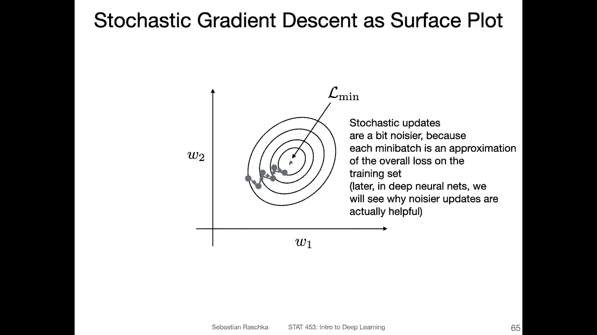

Yeah， also one more。Note about data normalization。 So I think I mentioned it before that it is important to normalize the input data so that the features are all on the same scale。

 So this is not a problem， for example， if we have something like iris where everything is already on centimeter scales。

 but it's still helpful to make these values smaller because there will be certain weight initialization schemes。

We will talk about this in a separate lecture， how to initialize these weights as well。

But if we have， let's say， data sets where we have features on。Yeah， different scales。

 let's say one is something like， I don't know。 income and the one is age。 So have。

 let's say age and income is your features and income is a dollar amount。

 So let's say you have something like， I know，50000 or something per year。

 and the age is maybe 23 or something like that。 So these are very different scale。

 So one scale is from maybe 10000 to 10 million， whereas age is between， let's say 0 and 100。

 So in this way， what happens well what the problem is is that these。

Contour lines will be more like skewed， so they will be more like ellipick。

 and then it will be harder to update because remember we are computing the gradient of the loss so that considers all the directions。

And then we may make these steps that are not directly pointing towards them。I mean。

 they are pointing towards the minimum in a way in one direction， but in the other direction。

 we make maybe a。Larger leap。 So actually， maybe if we， we， we overshoot basically。

 and then we also end up zigzaing。 So in this way， it helps actually initializing the weights with small random numbers。

 but also normalizing the inputs。 about the weight initialization， we will have a separate lecture。

 talking about different strategies for initializing the weights。 Well， Of course。

 for a simple case like linear regression， it doesn't really matter that much。

 but it will matter when we talk about deep neural networks。

So you can really think of deep neural network training as applying the same concept that we talked about in this lecture exactly the same concept。

 but to a more complicated network， but we will also be computing the derivative of the loss with respect to the weights。

 but in the network we have multiple layers and multiple weights， but except that it's very。

 very similar。

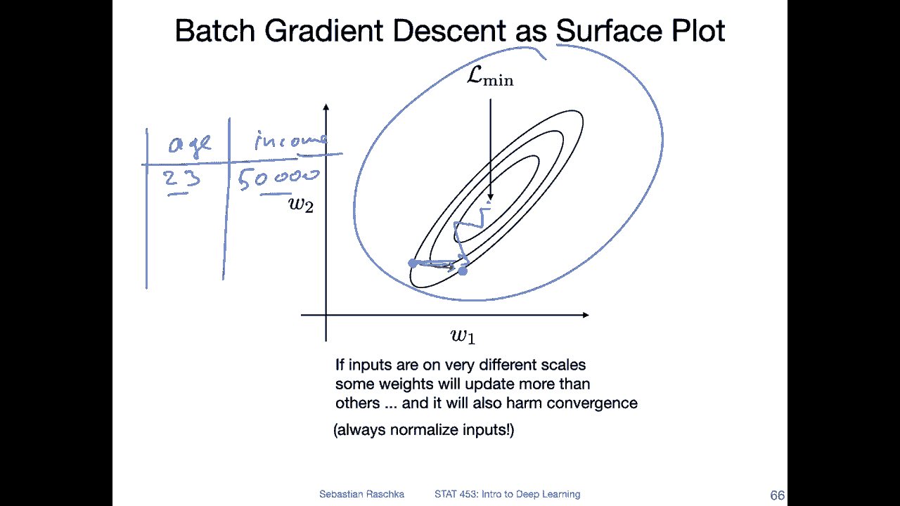

Alright， so then yeah to end this lecture， let's talk about training a single layer neural network。

 so an extension of linear regression for classification， so the adeline， the adaptive linear neuron。

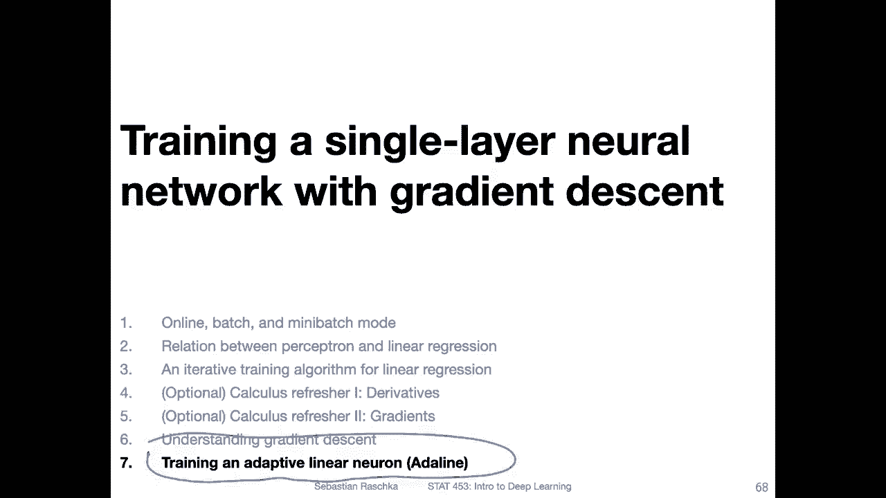