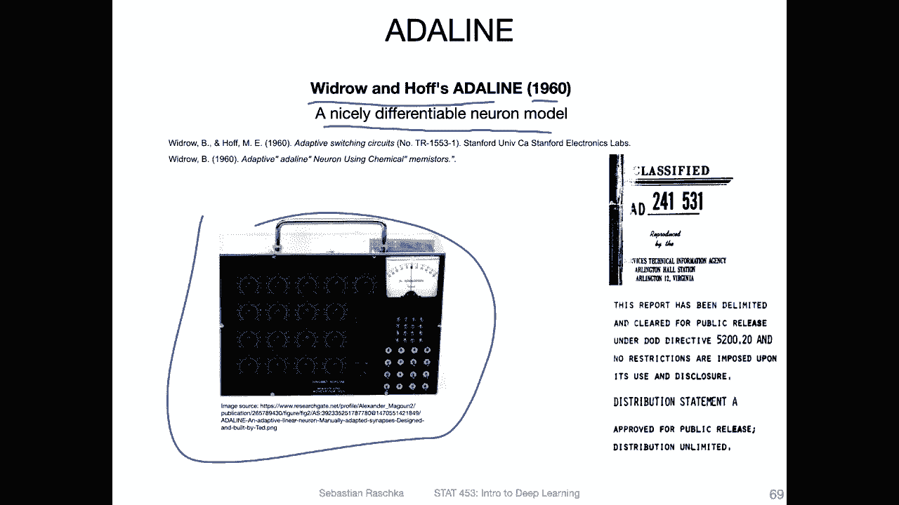

# P39：L5.7- 训练自适应线性神经元 (Adaline) - ShowMeAI - BV1ub4y127jj

Yeah， so the last couple of videos included a lot of mathematical details。

 which may not be super exciting。 So let's now take a look at the more hands on example and do something。

 yeah more hands on training and adaptive linear neuron and Python。

 So here I will just give you the overview of how things relate to the Aline。 So recall the Aline。😊。

That is what we covered briefly in the history of deep learning lecture。

 that is a model by Wirow and Hf in developed in 90 and around the 1960s。

 So actually whats the physical device， but you can of course also nowadays implemented in software and this is a nicely differentiable neuro model so the perceptron model that we talked about before is not differentiable because of this threshold function。

 So this Analine you can think of it as an advancement of this perceptron that is now also converging even if the data is not linearly separable。

So， yeah， just for comparisons。 So how the perception looked like。 So recall in the perception。

 you we compute the net input first， and then we pass the net input through a threshold function。

 and then threshold function produces our output。 So the output is。The predicted class table。

 which can be either0 or one。And if。The prediction。

Matches the actual label for that given training example。 Then we don't do anything， but。If it。

Doesn't match if it's different。Then we have this error term that we computed。

 So yeah the difference between the two and we use that to update the weights。

 so we update the weights， which then will change the decision boundary to make the prediction correct。

So that is how the perceptron works， but a threshold function is not differentiable。

 so here we couldn't use calculus。 There was just this rule that was developed by I would say。

 thinking hard about this problem， so it was more like an empirical update rule now we can actually improve that by using calculus。

So at the bottom is the adeline。 So here you can think of this part here as the。Maybe base model。

 And this is， yeah， like linear regression works。 So again。

 we also compute the net input similar to the perceptron。 Now we have as an activation function。

 We have this identity function， which is。Not doing anything。 So if it's not doing anything。

 If my activation function is just the identity function， why do I write it down in the first place。

 That's because yeah， next week or the week after that。

 we will be talking about non linear activation functions。 We will be talking about。

Our functions that are， for example， a sigoidal function， like， like。This one， for example。

 so we will be covering other types of activation functions。

 and we will need them to develop multilayer networks because this will help our multilayer network to。

 yeah produce nonlinear decision boundaries for solving complex problems because if we would be using linear activation functions in a multi layerer neural network。

 then。The multilayer network would be just a combination of linear functions and the sum of linear functions is also just the linear functions so we wouldn't gain anything so later on we will be talking about nonlinear activation functions and here you can think of it as a place that we will replace that later I'm just including it here in the notation because it's a more general notation that would apply to also nonlinear activation functions okay。

Now consider this linear regression base in order to turn this linear regression model into an adaptive linear neuron into the Adeline model。

 all we have to do is now adding a threshold function because the adeline model is a classifier。

Classifier for classifying data points similar to the perception。 However， note the difference here。

 really between the perception and the airlineline is。Where we compute the error so。

For the perceptionceptron， we compute the error after the threshold function and in the add line。

 we compute the error before the threshold function。

 So here we don't have the problem that things are not differentiable because we compute it before the threshold function。

 The threshold function still is not differentiable。But we don't。

 yeah worry about that because we compute the gradients before that。

 So in that way it's not a hindrance and it will become more clear when I show you the code example。

So here's just conceptually how it looks like when we fit an adeline model。

 So here what I'm just doing is I'm showing you the class label on the y axiss。 So for binary。

Classification， where we have two。Clasification where we have two class tables of 1 and 0。

 I have plotted them here， so the class as can be either one or0。

 And then we have only one feature value for simplicity here。And yeah。

 we want to predict that and the linear neuron is a linear model。

 so essentially what it will learn will fit a linear line similar to linear regression。

 so this would be very similar to linear regression right。

 except now the difference is really that in linear regression we usually have continuous values。

 not only zeros and ones and we don't have the threshold function。

So in the headdeline after fitting this model， we apply this threshold function let's say at 0。

5 between 0 and 1。 and we say。Then， if something。If something is bigger than a certain value。

 So if the。It's maybe a little bit unfortunate that I wrote class table here because this is this threshold。

 if the prediction， let's say。Prediction。If the prediction is greater than 05， produce glass table 1。

And。😔，Otherwise。Produce class label 0。 So in that way。

 we turn the continuous prediction into a class label。 again。

 this will become clear when I show you the code example。So I prepared some code examples。

 let me pause this video and do this in a fresh video。

 so there will be another video where I will go over these code examples。

