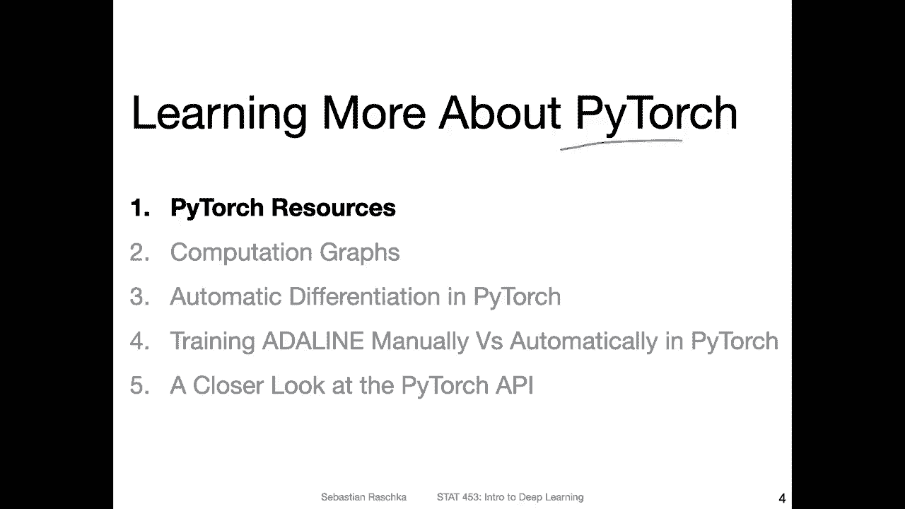
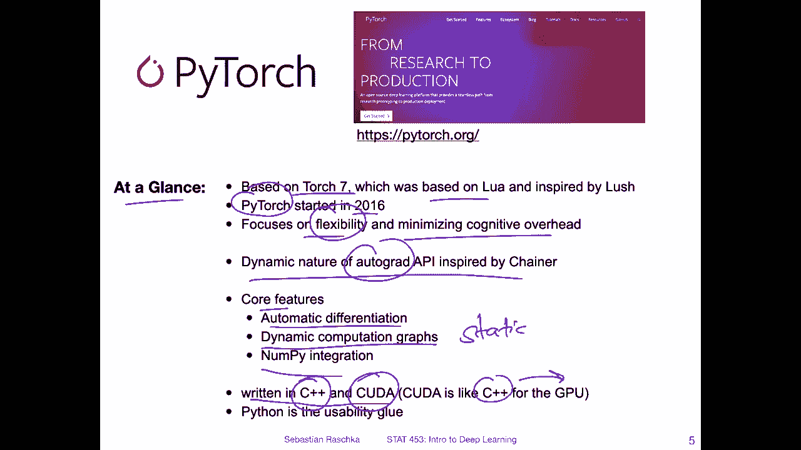
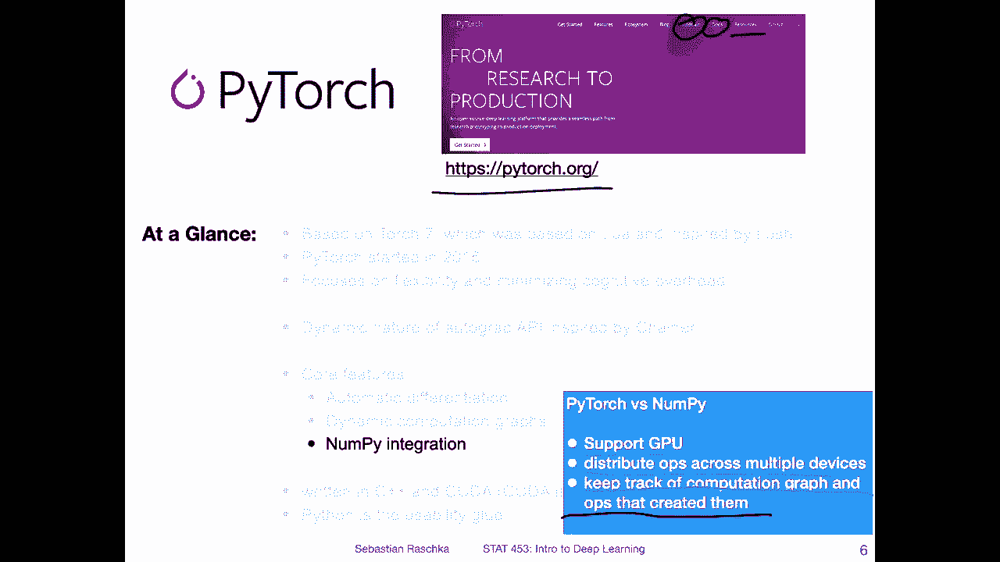
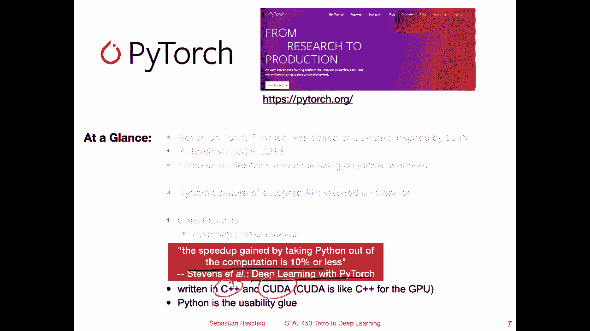
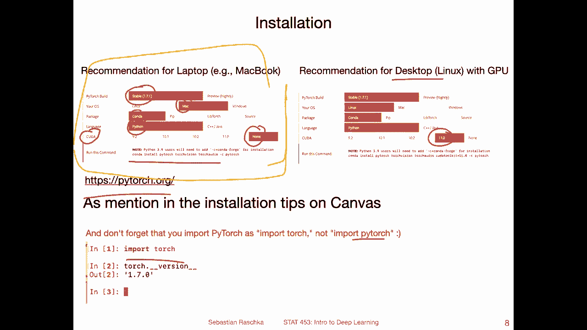
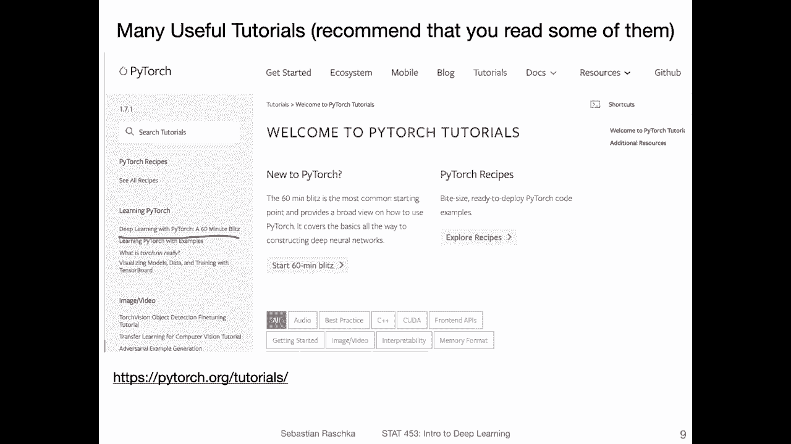
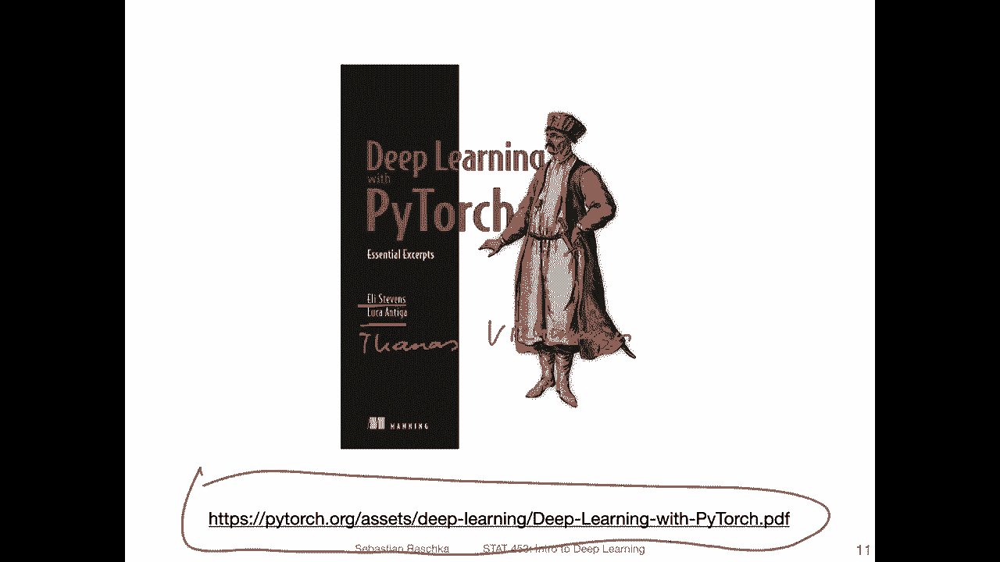
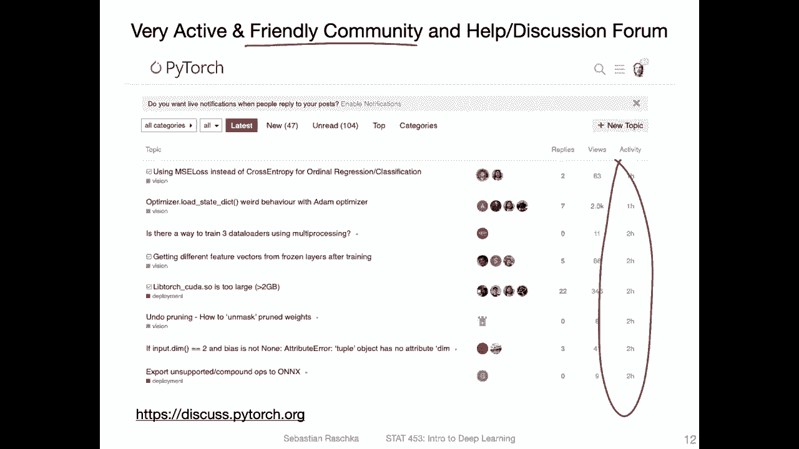

# P43：L6.1- 了解有关 PyTorch 的更多信息 - ShowMeAI - BV1ub4y127jj

Yeah， we will be using Pytorch quite a lot in this class。

 and I assume you will also be using it extensively for your class projects。 So in this video。

 I want to briefly show you where you can find out more information about Pytorch。

 Like beyond the scope of this class if you ever need it。 So also。

 I want to briefly summarize what Pytorch is again。😊。

So Pythwach is yeah a deep learning library for Python for Python。 and as you have seen。

 it's quite similar to Nmpy。 So there are these tensrs and a Ny with a multidimensional arrays。

 which are essentially the same thing。But yeah beyond that。

 Pytorch has some convenience functions for deep learning。 So yeah。

 I I have a summary here like Pytorch at a glance。 So Pytorch is based on Torch 7。

 which was a deep learning library very popular like5 to 10 years ago， but it had one big weakness。

 It was implemented based on Lua。 Lua is a programming language。

 I think it chose it because it was convenient to work with C files in the context of Lua。

 and Lua was very similar to Python， However， the weakness is it's not Python。

 and lots of people prefer really working in Python。

So around 2016 efforts started like porting torch 7 to Python。

 and the project was then called Pytorrch。 So Pytorch initially used a lot of the torch 7 code。

 but it got gradually replaced by a more， I would say rewritten code later on。

 so but originally Pytorch started as。Yeah， a library based on Torch 7 that was then。

 but also compatible to Python。And one of its focuses is really on the flexibility and minimizing the cognitive overhead。

 So there are two aspects you can make a programming framework really easy to use by abstracting away all of its complexity。

 However， one problem is also than if you make it too simple。And provide certain building blocks。

 It will become hard to do some custom research where you， for example。

 have to develop your own layers and things like that。 So Pytorch has like a somewhere in between。

It minimizes the cognitive overhead so keep keeping things simple。

 but it also provides you with flexibility for research。Yeah。

 so the core features of Pyth are automatic differentiation。

 So this is like when you have a computation， you can automatically compute the derivative so you don't need to know much math for that which is very convenient and also yeah it has these dynamic computation graphs in contrast to dynamic computation graphs are static computation graphs and there were some libraries before that for example Theno or early versions of Tensorflow which were static so and that was not very convenient to work with so you had to define a computation and then after you defined the computation you could run it。

 but then it was really yeah。Li bit hard to debug if you had a problem in your computation graph because it was very abstract。

 So in that way， Py to adjust this dynamic approach， which is more similar to nu where you， yeah。

 you execute some line of code or you define the computation the code and it immediately runs。

 You don't have to compile anything a graph or something like that。 So in that way。

 it's way easier to work with。But I should say this is nothing like Pythtch invented。

 they were inspired by the AutoGd API in another library called Chinana。

 for some reason Chinana never really became that popular although they actually pioneered this API so AutoGd is yeah automatic differentiation the Auto gridd for automatic gradients。

 it's also a sublibary inside Pytorch as we will see later today。So， yeah。

 and Pytorch also has Ny integration。 so you can convert Ny。

Erays into Pytorch and the other way around， however。

 usually yeah we try to avoid using Ny when we on Pytorch because yeah it makes certain things a little bit clanunk here if we have to convert back and forth。

 So usually we keep using Pytorch tensors as long as we can sometimes it's necessary to convert it from let's say exporting results into other tools。

 but usually yeah we can nowadays use most of the stuff implemented in Pytorch to do most of our work。

I should say also one more thing about。How code is implemented in Pytorch。

 So most of the code hood is written in C plus plus and Kuda。

 That is why Pythch is also very efficient compared to regular Python code。

 So C plus plus is you know， as low level language， very efficient for scientific code。

 and Kuda is kind of like similar to C plus plus but it's a language， especially for the GPU。

 So its you can think of it as C plus plus for the GPU。 It's like yeah a simple or simplification。

 but it's the sensor。 you can think of it like that。

And Python really is like more like a wrapper around the C plus plus and Kuda code。

 making everything convenient。 So I call that the usability glue。

 It's like some glue putting glueuing together C++ and kuda。

I want to make it easy to use。嗯。いやそう。Just briefly why or why are we using Pythch and not Ny if both are actually also very similar as we have seen in previous lectures。

 So really why we use Pyr just really we have GPU support。

 which is important for training deep neural networks in a time efficient manner so it can be hundreds。

 thousand times faster than training on the CPU for example。Then， yeah， also。

It has additional functionality to distribute actually computations across multiple devices like multiple GPUs。

 even， which can also be super helpful for especially very large models。

And then there's also the aspect of keeping track of the computation graph and the operations created。

That created them。 So Nmai doesn't do that， so。It can be a blessing in a course。

 So if you don't need a computation graph for， let's say， computing gradients， it can be。

 yeah memory intensive to compute this graph。But most of the time when we do deep learning。

 we want to， yeah differentiate results。 And for that。

 we can have this graph that Pytorch builds in the background for differentiating it for computing gradients for。

Mimizing the loss function with respect to the weights， as we will see later。 And also， yeah。

 we can deactivate this computation graph。 So it's not。Necessary to have that。

 So we can actually use also Pyth without that computation graph， as we will also see。

 So it's really like a really great nice， convenient framework。 It's。

 it's essentially Ny with additional convenience functions that make our life as deep learning research much easier。

 Also， yeah， I should say， yeah， this is the official website。 And we will also。

 I will highlight some aspects from it。 like tutorials and。😊。

Documentation and further resources and so forth。 So this would be the main website if you want to learn also more about Pych main website to visit。

Oh， I I should also say one more word about， yeah， the speed， the speed of Pytor。

 So according on to the deep learning with Pytorch book， which was written by Eli Stevens。嗯。

Thomas Feman and Du Antiga。 if I remember correctly。

 So some of them are they are basically main yeah， main。Contributors also to Pytch。

 I think Thomasmasfeman， especially and have a lot of experience with this framework。

 and according to this book， based on experiments or based on their experience。

 taking Python out of the computation loop。Only improves performance by up to 10% because you don't have to use Pytorch only in Python there is nowadays intermediate representation it's called a torch IR and there is also a C plus plus API so you can use Pytorrch code or torch code in C plus plus only so just using it without any python and performance is not much different So this is basically saying that Python is not really detrimental to the performance because some people say okay Python is such a slow language why would we want to do deep learning in it。

Actually， it turns out Python is really， I mean， it is really slow compared to other languages。

 but since everything is implemented in C++。And。Kuda anyway， there's not much。

That really is performance prohibitive in Python。 So it really doesn't matter whether we run it in Python or not。

 The only reason why there's also a c plus plus API for torch is for example。

 not all devices support Python runtime。 for example。

 if you think of cell phone or like a smartphone there you don't really have a pych sorry。

 a Python runtime。 So sometimes it can be useful to use the c plus plus API。 It is possible， though。

 and also very easy nowadays to convert let's say from the Pytorch。Python model into the C plus plus。

AI。 so there is this intermediate representation that I mentioned。 and also on the website。

 they have tutorials for converting between those。 So if you ever need to implement a model。

 let's say on a mobile device， it's not an issue。 That's what people nowadays also do very routinely。

 it's kind of yeah very， very easy。

Instlation wise I posted about that on Can， I think it was last week with some write up and recommendations just to summarize it again。

If you have a laptop， I recommend to not not run this on the GPU because。Yeah， honestly。

 unless you have a high end gaming computer with a Gf。 sorry， I think G and video graphics card。

 then。It will probably get too hot if you run it on a GPU。

 even if you have a compatible graphics card。Personally， I use only my laptop for debugging。

 so I usually write all my code on the laptop first。

 see if it runs on the CPU and then there's only a very simple switch that we have to make。

 I can show you to you later in the code。 It's like one line of code and then everything runs on the GPU。

 And after I made sure that it runs on my laptop on the CPU like for very like five minutes for a short time。

 then I would， let's say， run it somewhere else on the GPU。So my computer， personally。

 I only install the。CPU version。 And in order to find out how you install it。

 I also recommend you to visit。On the。Your Pytoch website and they have if you scroll on like this menu here where you would select the version。

 So I recommend the stable version then your operating system personally， I have a Mac。

 but of course， you can also use Windows or Linux if you have either of those operating systems。

I use Con for the installation。And yeah， Python， so you have also the C press or Java APIs here。

And I don't use Kuda Kuda is the yeah graphics card library that I mentioned the C plus library for the graphics card。

 I don't use that one。 Yeah， and then I install it like as follows and notice there as also Torch vision and Torch audio。

 which are yeah supporting libraries for computer vision。And audio data。

 So we will work with Tor vision oscillator in this course。

 So I just recommend actually installing all in one go。 So then you have all everything together。

If you have a desktop on Linux， that is， for example， one of my computers， a server I have。

 it's not at home， for example， it's like in a separate location I usually only look in via the terminal but there I would for example install a GPU version and then I would install also the latest kuda version but you have to make sure if you do that that you have a compatible graphics card。

 it has to be an NV card。And also it has to have a certain driver version to support Quda here。

And for this course， I will on Thursday show you some websites where you can use a GPU for free。

 So also for this course， you don't need to have like a really lot of GPUus something like that。

 it's really only it's sufficient to have access to a free GPU for this course。

 we really focus on understanding deep learning and running some yeah introductory deep learning models。

 And yeah we are not like a big company running like thousands of computations on GPUus in this class。

 So for that way for that manner， you don't have to buy anything for this class。

 I will show you on Thursday how to utilize some free resources。 okay。Oh yeah。

 also one little tidbit here。Because there was some message I got also on Canva， on Piazza。

Private message where some students tried to import。Pytorrch。 So there's one quirk。

 If you import pytorrch know that it is import torch and not import pytorrch。

So that's something to keep in mind。 It's a little bit confusing。

 I think it's because originally it comes from torch， Torch 7， like I mentioned。

 and it Pytorch is just the API。 So I guess that is why the designers made the choice to import it as torch and not Pytorch。

Alright， so yeah， I wanted to mention if you go to the website here， there's a tutorials link。

 There are lots of useful tutorials out there。 Of course， you don't have to read them。

 but I recommend to check out one of them。Whi is the deep learning with Pytorch 60 minute Blitz1。

 So there's a short video and there's yeah a short run through like using Pytorch and has a good explanations。

 I think to get you started with Pytorch。 But of course。

 in this lecture I will also explain things to you a little bit differently so I recommend though after this class here after this lecture I also recommend you to read through this tutorial it's a very nice one。

Yep， that's this one。There's also a pyarch book now。 So this is， yeah， by Eli Stevens， Luca Antiga。

 It's an old screenshot。 I think Thomas must。Feman Feeman is also a co authorthor on this book。

So you can find the version。Here on this website it's available for free。

 and there's also a print version that is available via the publisher。

I should also say that it's a very， very nice friendly community around Peytorch so if you go to the discussion forum here。

 if you have any questions like very technical questions。

 usually someone is always able to help with that and also usually providing answers pretty fast which is very impressive you can see within the last couple of hours that have been already lots of answers to particular very detailed questions here so it's a very friendly and active community there and it's also a very helpful resource for asking questions。

So beyond just the other class context。

Okay， so in the next video I will then introduce computation graphs and then after we talked about computation graphs。

 I will explain to you how we utilize them for automatic differentiation and pytorch。

