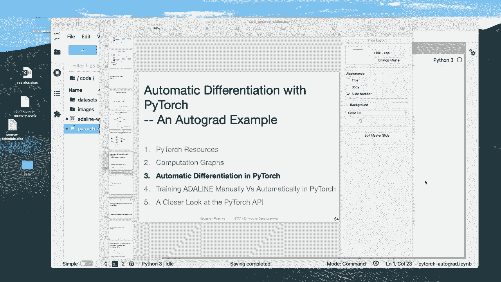
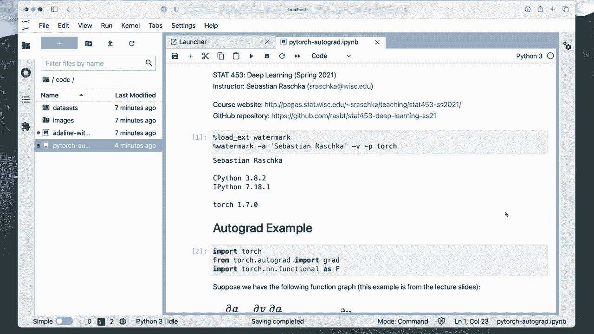
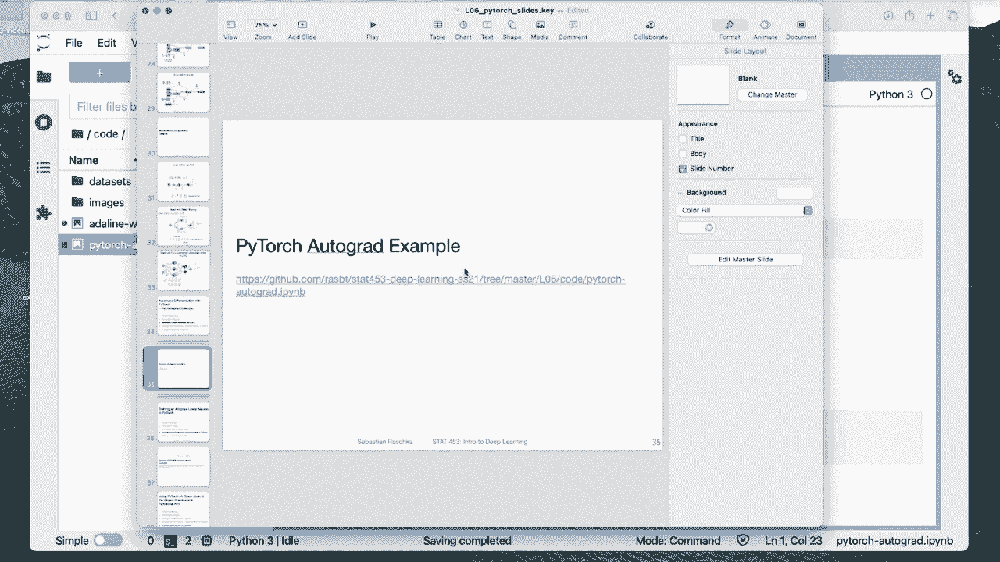
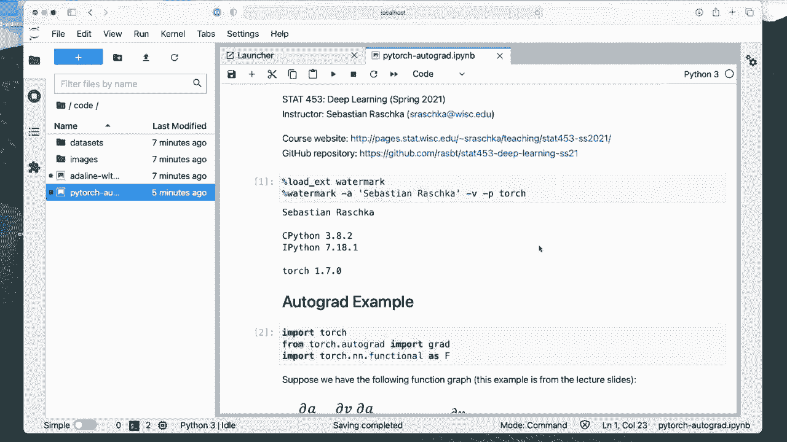
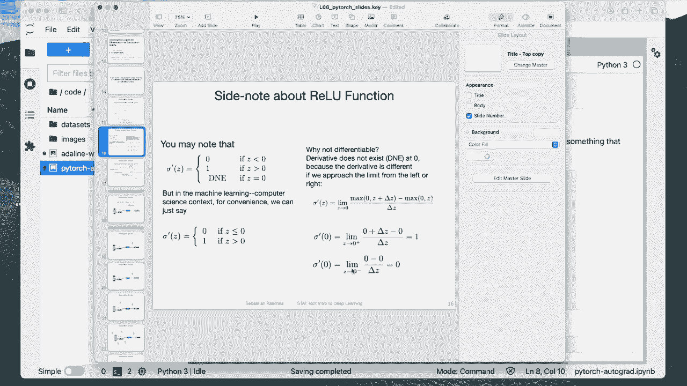
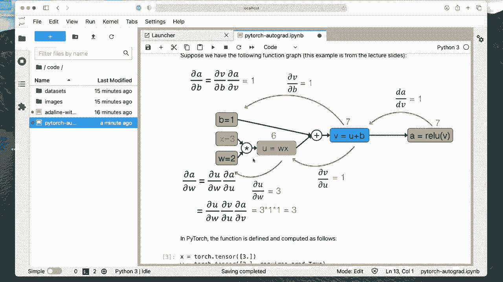

# P45：L6.3- PyTorch 中的自动微分 - ShowMeAI - BV1ub4y127jj

Yeah so in this video let me briefly go over the basic concept of automatic differentiation in Pytorch and then in the next video we will take a look at the more comprehensive example training Analine adaptive linear neuron using yeah the automatic differentiation concepts in Pytorch so here I just want to yeah show you the computation graph that we talked about in the previous videos in the context of Pytorch So here in this notebook I should also say you can find it here on Gitthub I will uploaded it to Gitthub after finished recording and I will also add a link to canvas so you can't miss it。

In case you want to play around with it。 So， yeah， let me clear。

The outputs and then executed one by one， of course。

 starting with watermark to see what versions I have。

 you can also run this with a newer or older version。 it should work the same way。

So yeah here I'm importing now the autograd API， which is the automatic differentiation API。

 so autograrad， you can think of it as automatic gradient later on when we train deep neural networks。

 we don't have to use autograd explicitly So there are functions that in Pytorch that we define like layers。

 convolutional layers and the backward function that will use autograd under the hood。

 but I think it's yeah useful to understand how autograrad works because you may also want to use this in some other contexts。

Alright， so let's import these and heres the computation graph that we talked about in the previous video。

 same thing so I don't have to go over this again， I think so here I'm defining this computation graph in Pytorch。

 so I have my input vector ortena X。A weight W。By S B and the activation。 that's the value function。

So I could have also used these intermediate variables。

 but I think it would be a little bit overkill。 We don't really need to do that。

Then there note there is a attribute here or value that I set requires gra equals to true。

 Why am I doing that， That means I am interested in computing the gradient or derivative here。

 If I don't do that by default， it will be。If I don't do that。

 it will be equal to faults if I don't do anything， so。It's actually a good decision by Pytorch。

 because not always when we use Pytorch， we are interested in computing gradients。

 And now when I run this code here。We can't see it here。

 but under the hood it will actually yeah create a computation graph similar to this one and save it internally。

 And of course， this takes up memory in the computer。 So if we don't need a computation graph。

 it doesn't create it but we can say we want it because when we want to compute gradients。

 we need it because we need to know how we can go backward。

 So in this case we set require gradient equals to true。

 This means we will later on compute the gradient。 so please yeah construct this computation graph。

So you can just say I see that the result is indeed the one that we have here in the figure。Now。Yeah。

 we are computing the gradientding here。 So using this gra function here。 So if I go up again。

 this is something I imported here from the autograd API。So I' am importing this gra function。

 and now I'm computing the gradient of a with respect to W。I'm also saying， retain the graph。

 the computation graph。 I say， do it like， set it to true。 So it will retain it。 Let's do this。

 So this computes the gradient of。Or the partial derivative of a with respect to W。

 The reason why it's gradientd and not partial derivative is it's usually working， of course。

 with yeah， vectors and matrices。 And this is a very simple example。 In this case。

 we only have scals。 But this is a general function that works also， yeah， with vectors and matrices。

 so。Yeah， the partial derivative here is3。 So that's what we also got here。 If you recall。

 So everything makes sense and looks good。 So now Im doing this again， for the bias unit here。

So I get my derivative of one。 So also just to double check。 This is also what we have here。

 So everything makes sense。 So notice now I didn't set a retain graph to true。 So I didn't do it。

 And if it's not set， then it will actually destroy the computation graph after calling G。

 So why is that usually in the context of a deep neural network。

 we don't need the graph again until the next forward path pass。 And since it's a dynamic framework。

 the forward path might change。 So actually the graph is constructed every time from scratch。

But this is not a detail we need to be concerned with right now what I or what I wanted to show you here is if I now execute this again。

 it won't work because we have destroyed the computation graph it says basically tells us why this error occurs is this because we haven't retain the graph so we can't do it twice why is that done it's usually yeah to save also memory because imagine you wouldn't do that and you have a deep neural network and you call the forward method multiple times then in each epoch or in each iteration the graph would be bigger and bigger and bigger and bigger and bigger So in this case it's getting destroyed after each update or after each grading computation and then rebuildilt from scratch to prevent having it growing infinitely large。

Okay， so but this was yeah just a basic concept of how this works。 I will show you in a later video。

 next video how this is done automatically by Pytoch using the backward word function。

But it's still good to understand， like these basic concepts because that's， yeah， it's。

 it's just from a also scientific point of view， just interesting to understand what's going on under the hood in Pytorch。

Alright， so here also。We can， yeah， compute derivatives of arbitrary functions。

 So if we implement them ourselves。 So here have an if and else。 Also， this would work。

 We don't have to define our own rail function because there is already a ra function in pythtorarch。

So I actually skipped over this。 but notice I also。Yeah， imported here。

 Toch dot function an n dot functional。 So I will explain this later on in a later video this today。

 So this is an N is a neural network subliary that contains a lot of convenience functions for neural networks。

And functional is the functional API。 I will also go over more details about that here。

 I'm just using a shortcut F because otherwise it would be much more to type。

 So Pywatch developers be included lazy。 So we use F as a shortcut for an end dot functional。

And here's the relu function I use from this functional sub API。 However， if I wanted to。

 I can also implement the relu function myself， it's quite simple。

 but if there is already an existing function Pytorrch。

 I actually recommend using that one because it's usually more efficient than our own implementation。

 but here that's just to show you that we could equally yeah implement it ourselves。

And this would also work。Alright， so what I'm showing you here is that even if it's an if and L。

 like these Pyth Python statements， it can also correctly deal with those。

And also in case we have something where it's not defined， the gradient is not defined。

 it will also be automatically able to do something reasonable。

 So for example here this has the case where the input is -1 w is 1 so we have-1 times 1 is-1 plus the bias is 0 so the gradient of that one or the partial of the root of the re with respect to the input should be0 right actually it should be not defined。

 but like we said earlier in the lecture， we use the trick so it can be adjusted to 0 and let's see if it is also doing it。

Yep， so it's working here。 So it's doing something reasonable。 It is not crashing here， right， so。

If I show you my slides again， we said that earlier some。

Time ago here where the derivative is not defined， but it would do something reasonable。

 So in that case， Pytrch is also doing something reasonable。 It's not crashing， and it works。

 So yeah， this was briefly how the automatic differentiation works in Pyr using this grid。

Function at really what it is doing。 It's constructing a computation graph under the hood。

 and then it's going to compute the derivatives for us。 And in the next video。

 I will show you how we can do that for a model training， for training Adeline。

